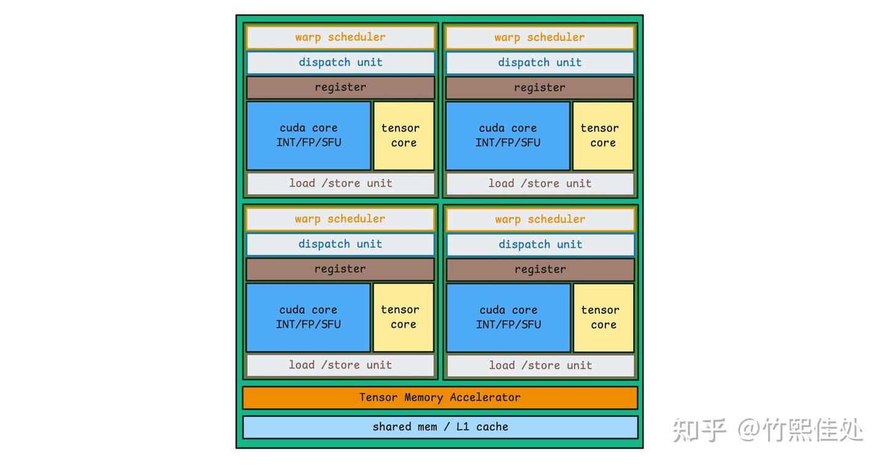
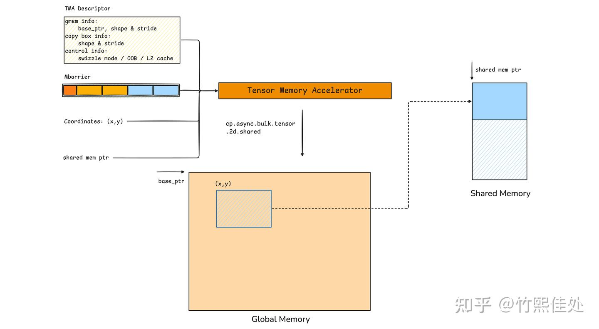
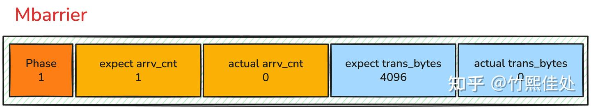
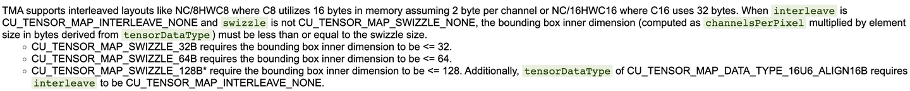
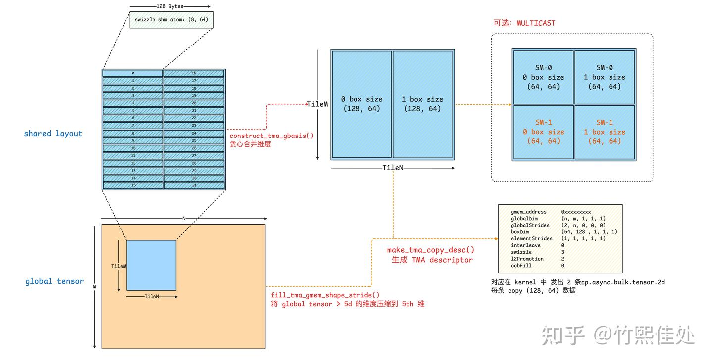

# 모두를 위한 CuTe 튜토리얼: TMA Copy

> 원문: https://zhuanlan.zhihu.com/p/2003198909405763007

## 동기

NVIDIA는 Hopper에 많은 신기능을 도입했고, 그중 **Tensor Memory Accelerator (TMA)** 는 새로운 load & store 유닛으로서 영향력 있는 변경입니다. **하드웨어 측**에서는 Hopper → Blackwell로 이어지며 강화되었고, RTX 5080(sm120, Blackwell) 같은 비-계산 카드에도 유지되어 앞으로 여러 세대 GPU가 이 설계를 계승할 것으로 예상됩니다. **소프트웨어 측**에서는 **warp-specialized(WS) 프로그래밍 패러다임**의 효율을 공식화·강화했고, NV Tensor Core 커널의 표준 작성법(CUTLASS 3.x)이 되었습니다 — 그만큼 중요합니다.

NV GPU 아키텍처 진화 추세를 보면 **IO 대역폭 증가**와 **Tensor Core 강화**가 두드러집니다. 한편으로 IO 대역폭 증가는 SM당 충분히 큰 **bytes in flight**(Little's law)를 유지해야 이론 대역폭 상한에 도달할 수 있고, 다른 한편으로 Tensor Core 연산력 발휘에는 **Tensor Core가 필요한 데이터가 항상 ready 상태**여야 합니다. 그렇지 않으면 연산 유닛이 stall되어 효율이 올라가지 않습니다.

전통 load 명령에는 한계가 있습니다. 최대 word 폭의 **`LDG.128`** 로도 warp 1회 load는 `16B × 32 = 512B`. SM에 상주 가능한 warp 수(Occupancy)가 상한이 있으니 bytes in flight가 메모리 대역폭을 채우기에 부족한 경우가 많습니다.

연속 다회 load 발사(ILP)로 더 많은 데이터를 in-flight 상태로 만들 수 있지만, 일정 수준을 넘으면 **각 `LDG`가 임시 저장용 레지스터를 소모**합니다. 레지스터 희소성이 다시 SM 내 상주 warp 수를 제한해 bytes in flight가 재차 제약됩니다. GEMM/Attention처럼 레지스터 대부분이 Tensor Core 누산 결과 저장에 쓰이는 경우는 더욱 부족합니다.

또 다른 고통 포인트는 **빈번한 load 발사가 warp scheduler의 발사 대역폭을 점유**하고, load에 따르는 주소 계산이 ALU 부담을 키워 실제 load 대역폭을 더 압박하는 것.

그래서 NV 엔지니어가 해결책을 내놓았습니다:

- 다회 명령이 비효율이면 **단일 명령의 load량을 키우자**
- 레지스터가 부족하면 **레지스터를 bypass**하여 shared memory로 직접 load
- 주소 계산이 ALU를 잡아먹으면 **전용 하드웨어**에서 수행

그렇게 Hopper에 **TMA**가 등장:

- 단일 **`cp.async.bulk.tensor`** 명령으로 전체 블록을 shared memory로 load. TMA 전용 하드웨어가 **주소 계산**과 **OOB(out-of-bound) 처리**까지 자체 수행
- TMA는 Global → Shared의 **완전 비동기 전송** 유닛. 완료 시점은 **mbarrier**로 동기화. Shared 데이터 사용 전 반드시 barrier wait
- Tensor Core 계산용 Tile data 로드를 겨냥해 **다차원 데이터 접근** 지원. TMA에게 메모리 공간은 1D 연속 주소가 아닌 **1D~5D의 다차원 box 공간**

TMA로 극한의 load 효율을 달성해, **Memory-bound 커널에서는 대역폭을 최대한 채우고 Compute-bound 커널에서는 더 나은 오버랩으로 Tensor Core 대기 0**을 지향합니다. 하드웨어상 TMA는 독립 유닛으로 shared memory에 물리적으로 인접하며, SM마다 1개 TMA 유닛 탑재(그림 1).



## 사용법

2D load를 예로 기본 흐름을 개괄:

**Host: TMA Descriptor 구성**

Host에서 TMA Copy Descriptor를 만들고 커널 인자로 전달. 의미상 포함:

- **Global Memory 정보**: Base Pointer, 전체 Layout(Shape & Stride)
- **Box 정보**: 한 번의 Copy로 옮길 데이터 블록(Box)의 Shape & Stride
- **제어 정보**: Swizzle 모드, OOB 처리 모드, L2 캐시 정책 등

Descriptor는 본질적으로 저수준 하드웨어가 사용하는 **연속 128B 데이터**. 구체 필드는 사용자에게 불투명하고 아키텍처·드라이버 버전마다 의미가 다릅니다.

**Kernel: Copy 명령 발사**

커널 안에서 `cp.async.bulk` 호출 시 제공할 것:

- **Descriptor**: Host에서 전달된 객체
- **Mbarrier**: copy 완료 제어 객체
- **Dst Pointer**: shared memory 대상 주소
- **Coordinates**: Global Tensor 내 접근 데이터 블록의 **논리 좌표**(2D면 crd0, crd1). Descriptor의 Base Pointer 기준

이후 mbarrier가 기대 상태에 도달하면 copy 완료, shared memory 데이터 사용 가능. 그림 2.



Old-school 개발자는 CUDA API로 `CUtensorMap` 구조체를 descriptor로 만들고 inline PTX로 `cp.async.bulk.tensor`·mbarrier 명령을 호출할 수도 있습니다. CuTe layout 체계에 깊이 의존하기 싫다면 CuTe가 이미 캡슐화한 PTX 함수를 쓸 수 있습니다(DeepGEMM의 방식).

```cpp
CUTE_HOST_DEVICE static void
copy(void const* desc_ptr, uint64_t* mbar_ptr, uint64_t cache_hint,
     void      * smem_ptr,
     int32_t const& crd0, int32_t const& crd1) {
  uint64_t gmem_int_desc = reinterpret_cast<uint64_t>(desc_ptr);
  uint32_t smem_int_mbar = cast_smem_ptr_to_uint(mbar_ptr);
  uint32_t smem_int_ptr  = cast_smem_ptr_to_uint(smem_ptr);
  cutlass::arch::synclog_emit_tma_load(__LINE__, gmem_int_desc, smem_int_mbar, smem_int_ptr);
  asm volatile (
    "cp.async.bulk.tensor.2d.shared::cluster.global.mbarrier::complete_tx::bytes.L2::cache_hint"
    " [%0], [%1, {%3, %4}], [%2], %5;"
    :
    : "r"(smem_int_ptr), "l"(gmem_int_desc), "r"(smem_int_mbar),
      "r"(crd0), "r"(crd1), "l"(cache_hint)
    : "memory");
}
```

더 간단하게, CuTe는 `make_tma_copy`·`get_tma_tensor`·`copy` 같은 상위 함수를 제공합니다. Colfax 튜토리얼의 예제 인용:

```cpp
template <typename T, int CTA_M, int CTA_N>
void host_fn(T* data, int M, int N) {
  using namespace cute;

  // 1. GMEM tensor 생성
  auto gmem_layout = make_layout(make_shape(M, N), LayoutRight{});
  auto gmem_tensor = make_tensor(make_gmem_ptr(data), gmem_layout);

  // 2. SMEM layout 생성 (TMA용 Atom layout)
  auto smem_layout = make_layout(make_shape(CTA_M, CTA_N), LayoutRight{});

  // 3. TMA 객체 생성 (Tensor Map 포함)
  auto tma_load = make_tma_copy(SM90_TMA_LOAD{}, gmem_tensor, smem_layout);

  // 4. Kernel 호출
  tma_load_kernel<T, CTA_M, CTA_N, decltype(tma_load),
                  decltype(gmem_layout), decltype(smem_layout)>
      <<<dim3{M / CTA_M, N / CTA_N, 1}, 1>>>(data, tma_load, gmem_layout, smem_layout);
}
```

커널:

```cpp
template <typename T, int CTA_M, int CTA_N, class TmaLoad, class GmemLayout,
          class SmemLayout>
__global__ void tma_load_kernel(T* g_out, const T* g_in,
                                __grid_constant__ const TmaLoad tma_load,
                                GmemLayout gmem_layout,
                                SmemLayout smem_layout) {
  using namespace cute;
  constexpr int tma_transaction_bytes = CTA_M * CTA_N * sizeof(T);

  __shared__ T smem_data[CTA_M * CTA_N];
  __shared__ uint64_t tma_load_mbar;

  Tensor smem_tensor = make_tensor(make_smem_ptr(smem_data), smem_layout);
  Tensor gmem_tensor = make_tensor(make_gmem_ptr(g_in), gmem_layout);

  if (threadIdx.x == 0) {
    auto gmem_tensor_coord = tma_load.get_tma_tensor(shape(gmem_tensor));

    auto gmem_tensor_coord_cta = local_tile(
        gmem_tensor_coord, Tile<Int<CTA_M>, Int<CTA_N>>{},
        make_coord(blockIdx.x, blockIdx.y));

    initialize_barrier(tma_load_mbar, /* arrival count */ 1);
    set_barrier_transaction_bytes(tma_load_mbar, tma_transaction_bytes);

    auto tma_load_per_cta = tma_load.get_slice(0);
    copy(tma_load.with(tma_load_mbar),
         tma_load_per_cta.partition_S(gmem_tensor_coord_cta),
         tma_load_per_cta.partition_D(smem_tensor));
  }
  __syncthreads();
  wait_barrier(tma_load_mbar, /* phase */ 0);
  // 이 줄 이후 TMA load 완료
}
```

단순히 사용법만 알고 싶으면 위 예시를 복사·수정하면 됩니다. 이것이 CuTe에 익숙해진 뒤의 이점 — HW 세부를 몰라도 CUTLASS를 참조해 빠르게 연산자 개발 가능. 그러나 본 시리즈 독자는 그 이상을 원하실 테니 CuTe의 TMA 세부를 좀 더 파봅시다.

## CuTe의 좌표 표현: arithTuple

먼저 TMA copy와 SIMT copy의 차이: **SIMT copy는 스레드·명령당 1D offset을 소비하지만, TMA copy는 시작 좌표를 소비**합니다. 위 코드의 `get_tma_tensor`가 이런 `gmem_tensor_coord`를 구성:

```cpp
auto get_tma_tensor(GShape const& g_shape) const {
    static_assert(is_congruent<decltype(g_shape), decltype(aux_params_.g_stride_)>::value);
    return make_coord_tensor(make_layout(g_shape, aux_params_.g_stride_));
}
```

왜 일반 `make_tensor`가 아닐까요? CuTe Layout의 주 기능은 좌표를 1D offset으로 변환하는 것인데, TMA 시나리오에서는 **원래 ND 좌표 의미를 보존**해야 하고 1D offset으로 변환할 필요가 없습니다. 그래서 기존 Layout 의미와 맞지 않습니다.

CuTe는 패치로 **순수 좌표 의미를 표현하는 새 개념 `arithTuple`** 을 도입했습니다. 예시:

```cpp
Tensor a = make_tensor(make_inttuple_iter(0,0),
                       make_shape (     4,      5),
                       make_stride(E<0>{}, E<1>{}));
print_tensor(a);
/*
ArithTuple(0,0) o (4,5):(_1@0,_1@1):
  (0,0)  (0,1)  (0,2)  (0,3)  (0,4)
  (1,0)  (1,1)  (1,2)  (1,3)  (1,4)
  (2,0)  (2,1)  (2,2)  (2,3)  (2,4)
  (3,0)  (3,1)  (3,2)  (3,3)  (3,4)
*/
```

`make_tensor`로 생성하되 `base_ptr`이 메모리 주소가 아닌 **시작 좌표 (0, 0)을 나타내는 tuple**. "layout" 부분도 shape & stride로 표현. shape는 평범. stride는 **2D 위치 변화**를 표현해야 해서 "2D stride"를 지정. 각 열에서 행 증가로 1차원 좌표가 늘어나야 하므로 첫 차원 stride는 `(1, 0)`, 각 행에서 열 증가로 2차원 좌표가 늘어나야 하니 둘째 차원 stride는 `(0, 1)`. 의미상 `make_stride((1, 0), (0, 1))`. 모호성 회피·간결화를 위해 CuTe는 `(1, 0)`·`(0, 1)` 같은 기본 step을 **Basis Element** `E<0>{}`·`E<1>{}`로 정의. 일반 Layout의 `Int<1>{}`와 유사.

`E<0>{}`는 "0번째 위치가 1, 나머지 0", `E<1>{}`는 "1번째 위치가 1, 나머지 0". 출력 `(_1@0, _1@1)`은 "**_1@0은 0번째 차원의 stride 1, _1@1은 1번째 차원의 stride 1**" 의미. E에 정수를 곱해 stride 확대 가능:

```cpp
Tensor a = make_tensor(make_inttuple_iter(0,0),
                       make_shape (     4,      5),
                       make_stride(5 * E<0>{}, 2 * E<1>{}));
print_tensor(a);
/*
ArithTuple(0,0) o (4,5):(5@0,2@1):
  (0,0)  (0,2)  (0,4)  (0,6)  (0,8)
  (5,0)  (5,2)  (5,4)  (5,6)  (5,8)
  (10,0) (10,2) (10,4) (10,6) (10,8)
  (15,0) (15,2) (15,4) (15,6) (15,8)
*/
```

arithTuple 기반 좌표 표현이 갖춰지면 TMA copy 관련 함수를 구축할 수 있습니다. 일반 CuTe Tensor가 `base_ptr + layout`이라면, `base_ptr`을 base 좌표로, Layout을 좌표에 대한 Shape & Stride 기술로 바꾸면 **TMA Tensor**가 됩니다.

이 특수 Tensor에 `Partition`·`Tile`이 여전히 적용되나? Layout이 `Inverse`·`Compose`·`Product`·`Divide`로 유연 변환되나? **답은 Yes**. 위 코드의 `gmem_tensor_coord_cta`에 `local_tile`·`partition_S`가 여전히 사용됩니다. 이로써 아키텍처(SIMT vs TMA) 간 커널 작성법·로직의 일관성이 대체로 보장됩니다.

또 유의할 점: **TMA Box의 시작 좌표가 Box Size와 정렬되어야 할 필요는 없습니다**. Box Size가 `(16, 64)`일 때 시작점은 `(0, 8)`도 가능, 단 시작점이 global mem의 물리 주소에서 **16B 정렬**이어야 함. variable-len Attention·Group GEMM에서 자주 쓰이며, `domain_offset`으로 시작 위치 오프셋 가능.

덤으로, CuTe의 arithTuple은 TMA 좌표 외에 **Identity Tensor** 구성에도 쓰여 Tiled Copy의 경계 판정이나 Attention의 Mask 로직 처리에 유용합니다.

## MBarrier

TMA는 비동기 copy 유닛으로 완료 시점을 예측할 수 없어, **barrier가 특정 상태에 도달할 때까지 명시적 wait**해야 copy 데이터가 가용하다고 봅니다. 이 barrier는 어떻게 작용하고, CuTe 함수는 어떻게 barrier 상태를 수정·검사하나요?

Barrier는 본질적으로 **`uint64_t` 변수**로, 보통 shared memory에 선언. 특이점은 **64비트 각각에 특정 의미 부여**. 관련 코드에서 `tma_load_mbar`가 barrier:

```cpp
constexpr int tma_transaction_bytes = CTA_M * CTA_N * sizeof(T);
__shared__ uint64_t tma_load_mbar;
if (threadIdx.x == 0) {
  initialize_barrier(tma_load_mbar, /* arrival count */ 1);

  set_barrier_transaction_bytes(tma_load_mbar, tma_transaction_bytes);

  copy(tma_load.with(tma_load_mbar),
       tma_load_per_cta.partition_S(gmem_tensor_coord_cta),
       tma_load_per_cta.partition_D(smem_tensor));
}
__syncthreads();
wait_barrier(tma_load_mbar, /* phase */ 0);
```

64비트에 담긴 정보(NV Open AI Day에서 공개, 그림 3):



필드 중 지정 가능한 초기 값:

- **Expect arrv_cnt**: 기대하는 producer 스레드 도달 수 — `initialize_barrier`로 설정
- **Expect trans_bytes**: 이번 전송에서 완료해야 할 바이트 — `set_barrier_transaction_bytes`

Copy 진행과 함께 동적으로 변하는 값:

- **Actual arrv_cnt**: 현재 도달 횟수. 코드에서 lane 0이 copy 발사 전 arrive 연산으로 +1
- **Actual trans_bytes** (TMA 하드웨어만 변경): 실제 전송 바이트. TMA가 일부 완료 시마다 업데이트
- **phase**: 1비트, 초기 0. 0↔1 상태 전환. **`wait_barrier`는 이 변화를 기다림**

TMA 전송 후 barrier 상태가 **`Actual arrv_cnt == Expect arrv_cnt`** 이고 **`Actual trans_bytes == Expect trans_bytes`** 를 동시 충족하면 **phase 반전**.

예: 초기 phase 0, TMA copy 완료로 0→1 반전 → `wait_barrier(barrier, 0)` 블록 해제, 이후 명령(mma 등) 실행 시작.

**주의**: `wait_barrier(barrier, 1)`이면 phase 0일 때 바로 해제(0 ≠ 1), phase 1이 되어서야 블록하고 1→0 반전까지 대기.

자세한 barrier 필드 정의는 reed 선생의 《CuTe Hopper MBarrier》 참고. CuTe는 multi-stage 시나리오의 barrier 상태 관리를 위해 barrier를 **pipeline 구조체**로 감싸 사용. 문서가 없어 이해 부담이 큰데 후속 글에서 별도 정리 예정. pipeline 없이도 barrier 상태 변화를 명확히 하면 multi-stage에서 잘 쓸 수 있고, DeepGEMM이나 reed의 hpc-ops가 좋은 사례.

## make_tma_copy 심층

TMA copy를 커널에서 발사하는 방식을 알았으니, host 측 copy descriptor 구성을 봅시다. 코드상 `make_tma_copy()` 한 번 호출로 끝나지만 내부 로직은 훨씬 복잡. **마이크로 옵티마이저**로 이해할 수 있을 정도입니다.

입력:
- `copy_atom`
- global tensor
- shared layout

출력: **최적 TMA descriptor를 가진 TiledCopy 객체**

"최적"의 의미를 이해하려면 TMA 하드웨어 특성을 알아야 합니다:

- **차원 제한**: 1D~5D Box Copy. 5D 초과 에러
- **Box 크기 제한**: 단일 TMA Box 각 차원 원소 수는 HW 명령 필드(8비트) 제한, 반드시 ≤ 256
- **효율 요구**: 같은 바이트 수면 **한 번에 큰 블록 copy가 여러 번 작은 copy보다 명령 수 적어 효율 우수**

CuTe 사용 시 종종 고차원 Tensor가 불가피합니다. Attention의 QKV 텐서는 `(batch, seqlen, num_head, head_dim)`으로 이미 4차원, Swizzle로 shm atom 분할을 더하면 6차원 — 부족. Conv·group gemm 등도 유사.

HW가 >5D Box를 지원하지 않으니 **코드 레벨에서 고차원 데이터 병합**이 필요. copy 발사가 적을수록 좋으므로 **greedy 병합**, 단 병합 중 Box Size 256 한도 체크. 복잡한 CuTe 대수 변환과 보조 함수 다수가 관여. 주요 함수 호출 로직을 의사코드로:

```python
# 입력:
# copy_atom: SM90_TMA_LOAD / SM90_TMA_LOAD_MULTICAST / SM90_TMA_STORE
# global tensor, shared layout
# 출력: 병합된 차원의 TMA descriptor를 가진 tiled copy 객체

def make_tma_copy(copy_atom, gtensor, slayout, ...):
    # 1. swizzle 로직 제거, shape만 취함
    smem_layout_pure = get_nonswizzle_portion(slayout)

    # 2. 컴파일 타임 차원 병합 & TMA descriptor 구성 & 256 제한 체크
    def make_tma_copy_atom(gtensor, smem_layout_pure):

        # 2.1 compile-time 차원 병합: 예) ((_8,_16),(_64,_2)) -> ((_64,_128),_2)
        tma_gbasis = construct_tma_gbasis(gtensor, smem_layout_pure):
            # shm layout을 global layout으로 역매핑해 연속 차원 병합 가능성 탐색
            tile_gstride = gtensor.compose(right_inverse(smem_layout_pure)).layout()

            # 규칙대로 병합, 병합 후 차원 ≤ 256 검사
            tma_gstride = coalesce_256(tile_gstride)

            # 병합된 차원 정보 반환
            return tma_gstride

        # 2.2 병합된 차원으로 TMA descriptor 구성, 필요 시 5D 초과를 5D로 압축
        tma_desc = make_tma_copy_desc(gtensor, tma_gbasis):

            # runtime: 5D 초과 차원의 Stride GCD 계산 → 하나의 차원으로 압축
            fill_tma_gmem_shape_stride(gtensor, tma_gbasis, output=tma_desc)

            # 선택: multicast 속성으로 tma box size 분할
            if is_multicast:
                smem_box_shape = ceil_div(smem_box_shape, multicast)

            # CUDA 드라이버 API 호출로 TMA descriptor 생성
            cuTensorMapEncodeTiled(tma_desc, ...)

            return tma_desc

        # 3. 포장된 tiled copy 객체 반환
        return TiledCopy(tma_desc, layout_TV)
```

CuTe의 이 코드를 처음 읽으면 "TMA로 Tile 데이터 하나 옮기자는데 이렇게 복잡할 일인가?" 싶지만, **Swizzle 같은 복잡 Layout 시나리오에서 "최적" copy 방안을 자동 생성**하기 위한 로직입니다.

예: 단순한 `(128, 128) bf16` Tile에 swizzle 분할을 가해 shape가 `((8, 16), (64, 2))`가 되었을 때, 순진하게는 Box Size를 `(8, 64)`로 설정하고 `16×2`회 copy 발사. 그러나 `make_tma_copy` 최적화 후 **`(128, 64)` 로 묶여 명령 발사 수가 대폭 감소**합니다.

왜 이런 병합이 가능? `(8, 64)` atom layout이 col-major 배열이면 **M 차원의 16개 atom이 메모리상 연속**이어서 `construct_tma_gbasis()`가 greedy 병합.

왜 N 차원으로 128까지 더 확장 안 했나? **Swizzle Mode**가 TMA Box의 연속 차원 최대 물리 폭을 결정하기 때문. bf16(2B)은 `128B / 2 = 64 원소`.



이 제한이 SMEM Layout에 반영되고 `make_tma_copy()`로 전달되어 HW 제약에 맞는 최적 Box Size가 생성됩니다.

TMA는 **한 번 load해 여러 SM의 shared mem에 쓰기**(이들 SM이 같은 cluster에 있어야 함)도 가능. 예: GEMM처럼 데이터 재사용이 있는 시나리오에서 한 TileA를 SM0·SM1에 브로드캐스트해 각각 1/2 TileA만 load하고 서로 multicast → load 데이터량 대폭 감소. 매우 유용.

CuTe에서는 TileA 상반을 SM0 copy, 하반을 SM1 copy. SM0·SM1 TMA가 각각 1/2 TileA를 load하지만 각 SM은 전체 TileA를 받으므로 transaction bytes는 **전체 TileA량**으로 설정. 원칙: 각 SM은 자신의 TMA가 얼마나 load했는지가 아니라 **자신이 얼마나 받았는지**만 관심.

왜 좌우 두 copy로 나눠 multicast 안 하나? 범용성 때문. tile size가 64의 홀수배(예: 192)면 좌우 분할 시 한 copy는 SM 하나만 수행하고 다른 SM은 대기 → `max(2, 1) > mean(2, 1)`로 성능도 안 좋고 유지보수도 악화.

`make_tma_copy` 전체 흐름:



**`fill_tma_gmem_shape_stride()`** 가 5D 초과 데이터를 어떻게 압축하는지(왜 GCD를 쓰는지, 이 압축이 완벽하지 않은 잠재 문제는 무엇인지) 독자에게 도전으로 남겨둡니다. 잘 이해한다면 TMA에 꽤 명확한 인식을 가졌다고 볼 수 있습니다.

## TMA proxy & fence

TMA로 shared mem를 load/store하는 경로와, 일반 `sts`·`lds` 명령이 shared mem에 접근하는 경로(Load Store Unit, LSU)는 **다르지만 같은 주소를 공유**할 수 있습니다. 두 접근 방식을 각각 **Proxy**라 부릅니다: 일반 LSU는 **Generic Proxy**, TMA는 **Async Proxy**.

서로 다른 proxy가 같은 주소에 접근하면 **메모리 가시성 문제**. 하드웨어가 즉시 상태 동기화를 못 하기 때문에 **fence**로 proxy 간 가시성 보장.

예: GEMM 커널에서 계산 완료 후 global memory에 결과를 내기 전 Register → Shared Mem copy(stmatrix·sts 모두 LSU). 그 다음 TMA가 Shared → Global copy 발사. TMA가 옮길 데이터가 LSU가 방금 쓴 최신 데이터임을 보장하려면 **TMA Fence**가 필요:

```cpp
// 비동기 동작용 shared memory fence 발행
CUTLASS_DEVICE
void fence_view_async_shared() {
#if CUDA_BARRIER_ENABLED
    cutlass::arch::synclog_emit_fence_view_async_shared(__LINE__);
    asm volatile (
        "{\n\t"
        "fence.proxy.async.shared::cta; \n"
        "}"
        ::
        : "memory");
#else
    CUTLASS_NOT_IMPLEMENTED();
#endif
}
```

**중요**: **fence와 sync(`__syncthreads` 또는 named barrier sync)는 서로 다른 차원의 프리미티브**.

`__syncthreads`는 **Generic Proxy에서의 스레드 동기화·메모리 일관성**만 보장(모든 스레드가 shared mem에 쓰기 완료)하며 **proxy 간 가시성은 보장하지 않음**. sync만 하고 fence 안 하면 TMA가 LSU가 쓴 데이터를 못 볼 수 있고, fence만 하고 sync 안 하면 TMA 발사 시 다른 스레드가 아직 데이터를 다 못 썼을 수 있습니다.

따라서 올바른 흐름: **sync**(데이터 ready 보장) → **fence**(TMA 가시성 보장) → **TMA Store** 발사.

왜 sync가 fence를 같이 해주지 않나? Proxy 교차(STS+TMA) 시나리오에서만 필요. 모든 sync에 fence를 강제하면 proxy 교차가 없는 경우(순수 CUDA Core 계산)에 불필요한 오버헤드.

## 정리

본 글은 Hopper부터 도입된 **TMA**를 소개했습니다. 점점 높아지는 IO 대역폭 활용을 보장해 IO-bound·Compute-bound 커널 모두 기대 성능에 도달하도록 설계된 것으로, **단일 명령으로 Tile 전체를 shared memory로 옮김으로써 대역폭 잠재력을 해방**합니다.

대가는?

TMA 도입은 GPU 프로그래밍 패러다임을 크게 바꾸고 descriptor·barrier·proxy 같은 새 개념을 들였습니다. Ampere에서 넘어오는 개발자에게는 상당한 인지 부담.

다행히 **CuTe**로 이 하드웨어 특성을 다룰 수 있습니다. 본 글은 **CuTe 좌표 체계**, **MBarrier의 phase 반전 메커니즘**, **`make_tma_copy` 함수**(HW 차원·Box Size 제한을 고려한 greedy 병합과 multicast)를 중점 해설했고, 마지막으로 **Generic/Async Proxy 메모리 가시성을 위한 fence**로 커널 데이터 정확성을 확보하는 방법을 논의했습니다.

CuTe 핵심 코드는 확실히 읽기 어렵지만, 오픈소스 검증을 거쳤고 CUTLASS·FlashAttention 같은 고품질 참고 코드가 있다는 장점이 있습니다. 저자는 PTX로 TMA + WGMMA 연산자를 직접 작성·유지해본 경험이 있는데, 비동기 최적화를 쌓을수록 코드가 매우 난해해져 좌표 계산 한 줄이 틀리거나 barrier 동기화가 잘못되어 하루 종일 디버깅한 적이 많았습니다.

사람의 지혜는 **더 큰 시스템 구축**에 써야지 비트의 늪에 소모될 것이 아닙니다. **"군자생비이야, 선가어물야(君子生非異也, 善假於物也)"** — 훌륭한 도구를 잘 활용해 세부 명령에서 해방되어 가치 있는 아키텍처 혁신을 추구합시다. **Save code, live long.**

## 참고

- [Ampere 개발자를 위한 Hopper 아키텍처 해설](https://zhuanlan.zhihu.com/p/1895527304509236945)
- Little's Law — https://modal.com/gpu-glossary/perf/littles-law
- CUTLASS Tutorial: Mastering the NVIDIA® Tensor Memory Accelerator (TMA) — https://research.colfax-intl.com/tutorial-hopper-tma/
- [모두를 위한 CuTe 튜토리얼: Layout Compose & Inverse](../B05_cute_layout_compose_inverse/README.md)
- [모두를 위한 CuTe 튜토리얼: Layout Product & Divide](../B06_cute_layout_product_divide/README.md)
- CUTLASS pipeline 구현 — https://github.com/NVIDIA/cutlass/blob/main/include/cutlass/pipeline/sm90_pipeline.hpp#L271
- Tencent hpc-ops — https://zhuanlan.zhihu.com/p/1998322408797533516
