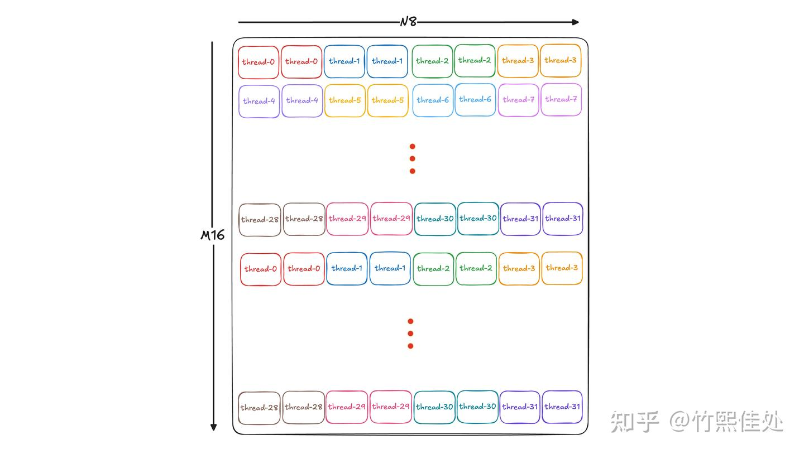

# 심화 개발자를 위한 CuTe 노트: tiled mma의 permutationMNK 파라미터

> 원문: https://zhuanlan.zhihu.com/p/1973526710105419953

## 서문

이전 [《모두를 위한 CuTe 튜토리얼: tiled mma》](../B04_cute_tiled_mma/README.md) 글에서 **permutationMNK**(이하 **PermMNK**)가 tiler로 작용한다는 점은 소개했지만, 실제 "permutation" 기능은 다루지 않았습니다.

CUTLASS 이슈 [《What is PermutationMNK in TiledMMA in CUTLASS 3.4 changes?》](https://github.com/NVIDIA/cutlass/discussions/1345)에서 CuTe 작성자 Cris Cecka가 답변했지만, CuTe 공식 문서의 고질병(충분한 맥락·단계별 reasoning 부재)이 그대로여서 이해하기 쉽지 않습니다. 본 글은 더 직설적인 언어로 이 파라미터의 의미와 사용법을 설명합니다.

참고로 Permutation 기능은 대부분의 CuTe 사용 시나리오에서는 불필요하지만, **특수 시나리오에서 묘한 효과**를 낼 수 있습니다. 따라서 본 시리즈 글은 주로 **CuTe 심화 개발자**를 대상으로 하며, 《모두를 위한 CuTe 시리즈》의 보충으로서 CuTe의 이해하기 어렵지만 잠재력이 큰 세부를 설명합니다.

## 동기

Ampere-style fp16 mma를 예로, 한 warp이 `16x8x16` mma를 2회 수행해 `16x16` C를 얻고 global memory에 store하는 상황을 봅시다. **M·N이 크고 K가 작은 시나리오**에서는 STG 명령 발사가 병목이 될 수 있어, store 시 **더 큰 word 폭의 STG(예: STG.128)** 로 효율을 높이고 싶을 때가 있습니다.

그러나 [tiled mma 글](../B04_cute_tiled_mma/README.md)에서 다뤘듯, mma 명령이 **thread가 보유하는 연속 value를 최대 2개**로 제한합니다(그림 1). float 값이라면 사용 가능한 최대 STG는 **STG.64**에 그칩니다.



이럴 때 **thread 0이 C에서 연속된 4개 value를 얻을 수 있다면** 이상적입니다. 이것이 permutationMNK 제안의 동기. 유사 상황: **w4a8 혼합 정밀도 GEMM**, **fp8 attention**(QK 곱 결과 P가 fp8 mma의 입력이 되려면 4개 값이 연속이어야 함) 등.

## PermMNK 사용법

Cris Cecka는 해당 이슈에서 시각화 편의상 fp64 mma를 예로 사용. 본질은 위 예와 동일. 일반 용법에서 permMNK를 평범한 tile로 지정하는 경우:

```cpp
TiledMMA tiled_mma = make_tiled_mma(SM80_8x8x4_F64F64F64F64_TN{},
                                     Layout<Shape<_1,_1,_1>>{},     // AtomLayout
                                     Tile<_8,_16,_8>{});            // Tiler
```

mma 실행 과정과 thread의 C 레지스터 데이터 배치는 그림 2:


예상대로 각 thread 데이터는 write 시 불연속. 이유는 **mma 표준 방식**을 따라 B를 연속 읽고 두 mma를 연속 실행했기 때문.

그러나 **두 mma 명령이 A·B 행렬의 물리적으로 연속된 블록을 처리하지 않고 교차(interleaved) 방식으로 데이터를 취하고, 계산 결과도 교차하여 C에 쓴다면**, 그리고 두 번째 mma가 여전히 교차 위치를 읽고 결과도 교차 위치에 쓴다면 — 그림 3:


이렇게 계산된 C는 **각 thread가 연속된 4개 값을 가져 STG.128 실행 가능**! 대응하는 permutationMNK 파라미터는 **N 차원에서 재배열**을 수행:

```cpp
TiledMMA tiled_mma = make_tiled_mma(SM80_8x8x4_F64F64F64F64_TN{},
                                     Layout<Shape<_1,_1,_1>>{},     // AtomLayout
                                     Tile<_8,                       // M 방향 Permutation, 8:1 identity
                                     Layout<Shape <_2,_4,_2>,
                                             Stride<_1,_4,_2>>,     // N 방향 Permutation, size 16
                                      _8>{});                       // K 방향 Permutation, 8:1 identity
```

그럼 **s2r copy용 LDSM 명령**도 여전히 사용 가능한가? 가능합니다. N 방향에 교차 접근은 있지만 **교차 입도가 연속 `2 × 16` fp16 원소**이므로 LDSM은 여전히 유효합니다. 다만 shared mem에서 load하는 데이터가 더 이상 조밀 배열이 아니므로 **일반 swizzle BMS 파라미터를 재조정**해야 bank-conflict-free 가능.

더 나아가, 이 기능을 완성하려면 **permMNK 외에 원래 g2s → s2r → gemm 메인루프 코드를 수정해야 하나?** 수정 불필요. permMNK의 tiled mma 내 구현은 **`logical_divide`로 TV-layout을 변경**하며, 이 효과가 partition·retile 로직을 통해 **자연스럽게 s2r tiled copy로 전파**됩니다.

```cpp
thrfrg_C(CTensor&& ctensor) const
{
  CUTE_STATIC_ASSERT_V(rank(ctensor) >= Int<2>{});
  // TiledAtom용 tensor 재배열
  auto t_tile = make_tile(permutation_mnk<0>(),
                          permutation_mnk<1>());
  auto t_tensor = logical_divide(ctensor, t_tile);                 // (PermM,PermN)

  // ...
}
```

"permMNK 수정이 ldmatrix와 메인루프 흐름에 영향 없음"을 검증하고 싶은 독자는 검증 코드를 직접 작성해 재현해볼 수 있습니다.

참고: @6666 님이 댓글에서 CuTeDSL 구현 시 permMNK 설정 후 ldmatrix 호출이 에러를 낸다고 제보했습니다. 초기 판단은 CuTeDSL 자체의 적응 문제로 보이며, 상세 분석 후 결론을 갱신 예정입니다. CuTeDSL에 익숙한 독자의 논의 환영.

## 정리

본 글은 Tiled mma의 **permutationMNK 파라미터**를 소개했습니다. 이 파라미터는 **TV-layout을 수정**함으로써 각 thread가 담당할 C 출력 위치를 미세 조정하여 **load/store 시 더 많은 유연성**을 부여합니다. 이 예시를 통해 CuTe의 추상이 매우 완비되어 있지만, 높은 추상이 많은 세부를 숨기고 있다는 점도 확인할 수 있습니다. 본 정리가 CuTe 이해에 도움이 되길 바랍니다.

## 참고

- [모두를 위한 CuTe 튜토리얼: tiled mma](../B04_cute_tiled_mma/README.md)
- [QST] What is PermutationMNK in TiledMMA in CUTLASS 3.4 changes? — NVIDIA/cutlass Discussion #1345
- 심화 개발자를 위한 CuTe 튜토리얼 시리즈
- 모두를 위한 CuTe 튜토리얼 시리즈
