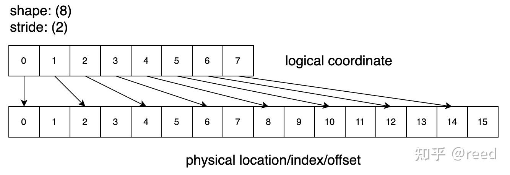
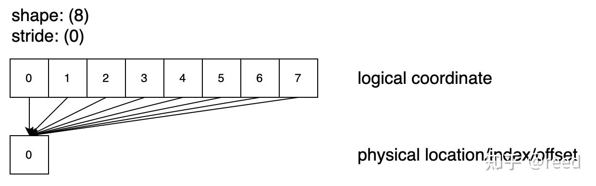
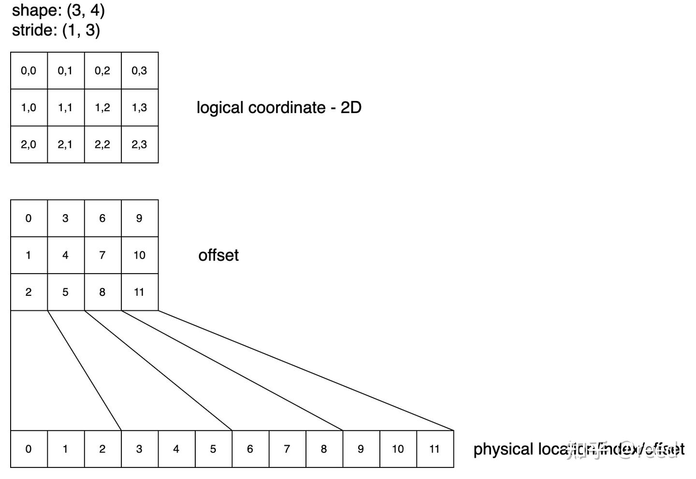
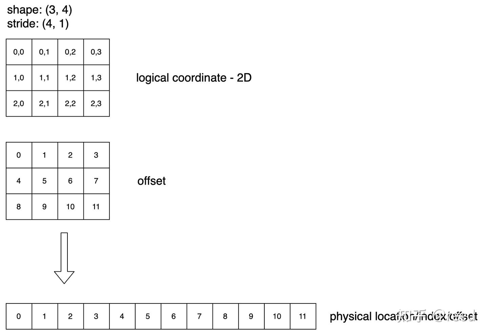

# CuTe의 Layout

> 원문: https://zhuanlan.zhihu.com/p/661182311

컴퓨터 메모리는 1차원 선형 주소 공간이지만, 수학·연산 문제가 다루는 공간은 대개 **고차원**입니다. 예컨대 GEMM(General Matrix Multiplication)은 2차원 공간, 딥러닝 연산은 `(batch, height, width, channel, ...)` 같은 3차원 이상 공간을 다룹니다. **고차원 공간을 효율적으로 표현하고 1차원 공간으로 매핑**하는 방법은 점점 중요해집니다.

역사적으로 이 문제 탐구는 세 단계로 나뉩니다:

1. **BLAS의 row/col-major + leading dimension 단계**
2. **Tensor의 shape + stride 단계**
3. **Hierarchy Tensor 단계**

1970~80년대 BLAS(Basic Linear Algebra Subprograms)는 주로 2차원 문제를 다루었고, **row-major/col-major** 개념으로 1차원 저장 구조와 2차원 논리 구조의 매핑을 기술했습니다. 특정 차원 정렬·패딩을 위해 **leading dimension** 개념을 도입해 두 번째 차원의 연속성을 기술했습니다.

2000년대 초 딥러닝이 부상하며 고차원 데이터 표현이 필수가 되었고, BLAS의 leading dimension을 확장한 **shape + stride** 기술 체계가 등장했습니다. 이 체계는 1차원 저장과 고차원 논리 구조의 매핑을 잘 묘사하며, 일부 연산은 데이터 이동 없이 shape·stride 기술만 바꿔 처리할 수 있습니다. `coordinate · stride` 내적 연산만으로 논리 주소 → 1차원 인덱스 매핑이 완성됩니다. 단 이 체계는 **각 차원 축에 대해 단조(monotonic)** 여야 해서 데이터 연속성 요건이 엄격합니다.

2023년 **계층적 Tensor(Hierarchy Tensor)** 기술이 제안되었습니다. shape + stride에 **축의 계층 기술**(Graphene Tensor IR)을 더해 특정 축에 더 풍부한 표현이 가능해졌습니다. 현대 GPU 계산 체계에서 Tensor의 블록 분할과 복잡 매핑은 이 계층 체계(기술 + 대수)로 표현·유도할 수 있으며, 복잡한 논리 공간과 하드웨어 배치 매핑을 잇는 통로를 만듭니다.

계층적 Tensor 기술은 Graphene Tensor IR에서 상세히 다뤄졌고, 구현 면에서는 NVIDIA 오픈소스 **CUTLASS**가 동일한 사고를 활용합니다. 컴파일 타임 최적화를 더 잘 활용하기 위해 CUTLASS는 **C++17로 CuTe**를 구현했고, 계층적 Tensor 체계와 그 위의 대수 연산을 정의한 뒤 이 **CuTe 기술 체계**로 최신 Hopper 행렬 연산을 구현했습니다. Tensor는 데이터 표현, 상대적으로 독립적이고 구조가 있는 데이터 덩어리를 나타내며, **Tensor 내부 데이터 배치**는 **Layout**으로 표현됩니다.

본 글은 이 **매핑 구조(Layout)** 에 집중합니다. 구성: (1) 1차원 벡터 표현, (2) 2차원 행렬 표현, (3) 계층적 Tensor 표현, (4) CuTe에서 자주 쓰는 컴파일 타임·런타임 형상 기술, (5) Layout 기능 정리.

간단히 말해, 계층적 기술(Layout) 대수로 계산 공간과 1차원 주소 공간의 매핑을 표현합니다. **Layout은 데이터 배치 기술 체계**로, 논리 좌표를 인덱스 좌표(offset)로 매핑합니다. Layout은 **Shape**(배치의 블록 계층·구조)와 **Stride**(블록 안·블록 간 데이터 배치 연속성)로 구성됩니다. Shape와 Stride는 둘 다 **계층적 중첩 표현**으로, Shape 안에 Int와 Shape가 모두 들어갈 수 있습니다. Shape와 Stride는 **같은 계층 관계**를 가져야 합니다.

계층적 Layout 전에 먼저 비계층 Layout, 즉 shape + stride로 표현되는 고차원 tensor를 복습합니다.

## 1차원 벡터 표현

**Shape: (8), Stride: (1)** — 논리 위치 8개. 논리→물리 매핑 시 원소 간 차이는 1. 그림 1처럼 0~7 8개 숫자를 나타내며, 계산 규칙은 `index_physical = index_logical × stride`.


**Shape: (8), Stride: (2)** — 논리 8개, 좌표는 자연수 0~7. 그림 2처럼 물리 매핑 공식은 `index_physical = index_logical × stride`. 여기서 **논리 공간과 물리 공간 크기가 다릅니다**. CuTe 체계에서 논리 공간은 **domain**, 저장을 나타내는 물리 공간은 **codomain**. 즉 `size(tensor) = 8`, `cosize(tensor) = 15`.



**Shape: (8), Stride: (0)** — 논리상 필요한 8개 데이터가 모두 같은 저장 위치 0에서 옴. 그림 3처럼 모든 원소가 같은 물리 위치를 가리키며, cosize는 1.



**Shape: (8), Stride: (-1)** — Stride를 -1로 두면 데이터 순방향 접근에 역순 순서를 얻음. 거의 쓰지 않음.


이상 1차원 예시들은 shape가 같더라도 **stride 변경으로 tensor 원소의 물리 위치를 다르게 기술**할 수 있음을 보여줍니다. 사용자는 논리적 크기를 관심 가지며, stride가 이 논리 공간과 실제 저장 공간을 잇습니다. 계산 차원에서 항상 `index = coordinate × stride`를 만족합니다.

## 2차원 행렬 표현

**Shape: (3, 4), Stride: (1, 3)** — 2차원은 Tensor의 **논리 공간**이며 저장은 여전히 1차원. 2차원의 column-major는 `shape (3, 4), stride (1, 3)`. 그림 5에서 shape의 3·4는 행·열 수, stride의 1은 "행 따라 1 증가 시 물리 오프셋 1 증가", 3은 "열 따라 1 증가 시 물리 오프셋 3 증가"를 의미.



**Shape: (3, 4), Stride: (4, 1)** — Shape 동일, stride가 (4, 1)이면 **row-major**. 행을 먼저 저장, 행 안 원소 저장 우선도가 높음.



2차원 기술은 1차원과 유사합니다. shape는 논리 형상, stride는 특정 원소의 물리 공간 간격을 표현. 논리 → 물리 매핑은 내적으로 완성. 2차원에서 `(N, H, W, C)` 같은 고차원으로 쉽게 확장되며, 매핑은 여전히 내적:

$$index_{physical} = coordinate \cdot stride = \sum_i coordinate_i \cdot stride_i$$

## 계층적 Layout (Hierarchy Layout)

1차원 벡터·2차원 행렬 기술은 딥러닝 프레임워크에서 널리 쓰입니다. PyTorch에서 tensor의 `shape` 속성과 `stride()` 메서드로 정보를 얻을 수 있습니다. 하지만 기존 shape·stride는 **Tensor의 한 축에 stride 값이 하나만** 가능합니다. 즉 어떤 축에서 전체 tensor의 연속성이 바뀔 수 없고, 더 직관적으로 말하면 **Tensor를 분할(blocking)할 수 없습니다**. 이런 연속성 변경 불가 = 분할 불가 기술을 **단조(monotonic) Tensor 기술**이라 합니다.

복잡한 Tensor 계산, 특히 NVIDIA 하드웨어가 도입한 명령 계산 시 이 표현은 불충분합니다. 그래서 **계층적 Tensor 기술(Hierarchy Layout)** 이 도입되었습니다. 간단히, 계층적 Tensor(또는 Layout)는 기존 단조 Tensor로 기술되는 작은 블록을 **기본 단위**로 삼고 이들로 Tensor를 구성합니다. 원래 작은 블록도 Tensor, 블록을 단위로 한 외부 조직도 Tensor — **Tensor 속의 Tensor**. 이것이 소위 계층적 Tensor입니다. 좌표 → 물리 위치 매핑이 Layout이고, Tensor가 계층화되면 Layout도 계층화됩니다.


그림 7-a/b는 전통적 col-major·row-major Layout으로 1계층 Tensor로 볼 수 있습니다. 그림 7-c/d는 기존 shape·stride로 표현 불가(단조 아닌 축 존재).

그림 7-c를 **두 계층 Tensor**로 보면(그림 8), 내층 Tensor는 빨간 박스, 외층 Tensor는 빨간 박스를 원소로 하는 바깥 Tensor. 내층은 `shape: (4, 2), stride: (2, 1)`, 외층은 `shape: (1, 4), stride: (4, 1)`. 두 층 합치면 전체는 4행, 8열이며, 열 방향이 두 계층(`8 = 2×4`, `(2, 4)`로 표기: 2는 내층 Tensor의 열 수, 4는 외층 Tensor의 열 수). 계층적 shape는 `(4, (2, 4))` — 첫 4는 4행, 두 번째 4는 외층 Tensor가 4번 반복, 2는 내층 Tensor 2열. stride도 동일 형식 `(x, (y, z))`. x는 내층(빨간 박스) 행 방향 간격 → `x = 2`, y는 내층 열 방향 간격 → `y = 1`, z는 빨간 박스 간 가로 간격 → 두 번째 빨간 박스 좌상단 8에서 첫 박스 좌상단 0을 빼 `z = 8`. 최종: **shape (4, (2, 4)), stride (2, (1, 8))**.


그림 7-d도 유사하게 두 계층(그림 9): 내층(빨강) `shape: (2, 2), stride: (1, 2)`, 외층(녹색선) `shape: (2, 4), stride: (1, 2)`. 합치면 `shape ((2, 2), (2, 4))` — 숫자 2·2·2·4는 각각 내층 행수, 외층 행수, 내층 열수, 외층 열수. 유도해 `stride ((1, 4), (2, 8))`.


shape와 stride가 주어지면 논리 공간 기술과 물리 공간 간격이 정해지며, 매핑은 전통적 규칙과 동일하게 **coordinate와 stride의 내적**으로 완성(단, 좌표도 계층 표현).

이 두 예시로 계층적 Tensor 조합을 완성할 수 있으며, **한 축에 stride가 하나뿐인 전통적 제약을 돌파**하고 더 풍부한 Tensor(계층적 Tensor) 표현이 가능해집니다.

CuTe 구현에서는 `make_shape`·`make_stride` 인터페이스를 제공하며, `make_shape`의 인자로 `make_shape` 결과를 받아 계층적 shape·stride를 구축할 수 있습니다. 효율을 위해 shape·stride는 **상수 shape(컴파일 타임)** 과 **변수 shape(런타임)** 로 나뉩니다.

## 상수 Shape (컴파일 타임 Shape)

컴파일 타임에 좌표 매핑·추론을 완료해 런타임 계산을 줄입니다. 컴파일 타임 상수는 레지스터 공간 할당에 의존하는 행렬 블록 크기처럼 반드시 컴파일 타임에 정해져야 할 때 써야 합니다. 표기는 `Int<K>{}` — `Int`는 컴파일 타임 상수, `K`는 값, `{}`은 이 타입으로 객체(상수 객체) 생성.

```cpp
auto shape = make_shape(Int<2>{}, Int<3>{});
auto shape1 = make_shape(shape, Int<3>{});
```

## 변수 Shape (런타임 Shape)

벡터 길이 등 런타임에 결정되고 컴파일 타임 결정이 필요 없는 정보는 런타임 계산 모드를 씁니다. **주의**: 아래 예시의 2·3은 상수로 보이지만 CuTe 규약상 이 형태는 **변수**를 나타냅니다.

```cpp
auto shape = make_shape(2, 3);
auto shape = make_shape(m, n);
```

## 정리

Layout의 본질은 **함수**입니다. 한 좌표계를 offset을 나타내는 스칼라로 변환하며, 하이퍼 파라미터는 Tensor의 논리 shape와 stride입니다.

$$offset = Layout^{shape}_{stride}(coordinate)$$

## 참고

- https://dl.acm.org/doi/abs/10.1145/3582016.3582018
- https://github.com/NVIDIA/cutlass/tree/main/media/docs/cute
