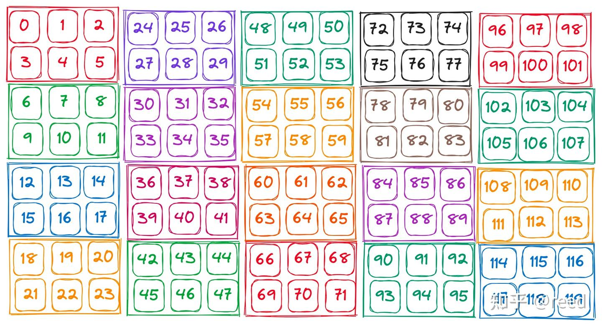

# CuTe Layout의 대수와 기하 해석

> 원문: https://zhuanlan.zhihu.com/p/662089556

앞선 글 [《CuTe의 Layout》](../B09_cute_layout/README.md)에서 shape·stride 기술 체계를 복습하며 계층적 Layout의 기초 개념을 소개했습니다. 본 글은 Layout을 더 전반적으로 다룹니다: **Layout의 기본 속성**과 **Layout 연산**. 이 연산들은 shape·stride를 파라미터로 하는 대수 연산이며, 직관적·형상적 이해를 위해 **기하 형태**로도 제시합니다. **기하는 설계·사고의 모델, 대수는 구현·계산의 형식**입니다.

## 기본 속성

그림 1은 계층적 Layout을 보여줍니다. 두 계층 구성으로, 같은 색의 작은 Tensor가 반복됩니다. 좌상단 0~5가 내층 Tensor를 보여주고, 이를 행 방향 4번, 열 방향 5번 반복합니다. 결과 Hierarchy Tensor는 `shape: ((2, 4), (3, 5))`, `stride: ((3, 6), (1, 24))`. **Layout의 본질은 함수**이며 수학적 기술은 아래를 참고.




그림 1 Layout의 기본 속성:

| 속성 | 값 |
|---|---|
| shape | `((2, 4), (3, 5))` |
| stride | `((3, 6), (1, 24))` |
| size | 120 |
| rank | 2 |
| depth | 2 |
| coshape | 120 |
| cosize | 120 |

- **shape·stride**: Layout의 논리 형상과 각 차원의 주소 공간 stride
- **size**: 논리 공간 크기. `size = ∏ shape_i`
- **rank**: Layout의 rank. **shape 첫 계층의 원소 개수**(괄호는 한 차원 병합을 의미). 그림에서는 2 — `(2, 4)`가 한 차원, `(3, 5)`가 한 차원
- **depth**: 중첩 깊이. 비중첩 Tensor는 1, 그림은 2
- **coshape·cosize**: codomain 공간 크기·점유 크기. 여기선 120. stride가 조밀하지 않으면 cosize가 domain의 size보다 클 수 있음

## 좌표 (coordinate)

Layout이 계층적이면 접근 좌표도 자연히 계층적입니다. 1계층 Tensor 접근은 `auto coord1 = make_coord(0, 1);`처럼 행·열 좌표를 지정하면 됩니다(행 0, 열 1). 계층적 좌표는 `make_coord` 결과를 중첩해서 구성:

```cpp
auto row_coord = make_coord(1, 3);
auto col_coord = make_coord(2, 4);
auto coord = make_coord(row_coord, col_coord);
```


이렇게 Layout(실질은 Tensor)의 계층적 접근이 구현됩니다. `row_coord`의 1·3은 각각 내층·외층 Tensor의 행 방향 좌표, `col_coord`의 2·4는 내층·외층 열 방향 좌표. 간단히 `coord: ((1, 3), (2, 4))`로 표기.

구체 좌표 값 외에, CuTe는 특정 차원 **전체 선택**을 위한 `Underscore` 타입과 해당 변수 `_`를 제공합니다. 이는 파이썬·Fortran의 `:`와 유사하며, 다음 절의 **slice**에서 대량 사용됩니다.

## 슬라이스 (slice)

좌표로 특정 위치 값을 접근할 수 있지만, 때로는 일부 좌표만 고정하고 나머지는 전체 선택하여 **Tensor 슬라이스**를 원합니다. 앞서 언급한 `Underscore`로 구현합니다. 첫 열 데이터, 한 행 데이터, 혹은 첫 번째 계층 Tensor 등을 슬라이스할 수 있습니다. 그림 3은 다양한 슬라이스 효과를 보여줍니다.


```cpp
auto layout_out = slice(coord, layout_in);
```

## 보집합 (complement)

Layout의 본질은 함수, 함수의 본질은 집합. Layout은 domain에서 codomain으로의 투영을 정의합니다. codomain에 불연속이 있으면 **빈 위치**가 존재합니다(그림 4). 이때 **codomain의 빈 위치를 채우는** 또 다른 Layout 2를 구성할 수 있으며, 이 Layout을 원 Layout의 **보집합**이라 부릅니다. 표기 간결성을 위해 보집합은 **최소 표현으로 압축**되고 주기적 반복 부분은 약분됩니다.


## 곱 (product)

실수 곱의 의미는 "어떤 양을 여러 번 반복". Layout 곱도 동일 의미를 따릅니다: **어떤 Tensor를 여러 번 반복**. Tensor가 고차원이므로 곱 구현은 여러 형태가 있지만 본질은 같습니다. CuTe에서 정의된 곱은 5가지:

- `logical_product`
- `tiled_product`
- `zipped_product`
- `blocked_product`
- `raked_product`

두 Layout을 곱할 때 첫 shape `(x, y)`, 둘째 shape `(z, w)`라면 곱의 shape는 `(x, y, z, w)`입니다. 각 곱 연산은 계층 순서 규약이 있습니다. 예컨대 `shape: ((x, y), (z, w))` 형태. 본질적으로 x·y·z·w의 순서·계층은 중요하지 않고 **곱 결과 접근 시 약속된 순서대로** 하면 됩니다. 현실 구현에서의 편의를 위한 규약:

| 곱 | 결과 shape |
|---|---|
| `logical` | `((x, y), (z, w))` |
| `zipped` | `((x, y), (z, w))` |
| `tiled` | `((x, y), z, w)` |
| `blocked` | `((x, z), (y, w))` |
| `raked` | `((z, x), (w, y))` |

그림 5처럼 Layout 곱은 집합 상에서 다음과 같이 진행됩니다. `Layout x Layout` 계산에서 **Layout1을 Layout2 순서대로 반복**하고, 원래 Layout2의 위치를 Layout1이 점유합니다. 그 다음 내층 Layout1은 column-major로 한 열로 배열되고, 외층 Layout은 column-major로 배열되어 최종 행렬의 열이 됩니다.


## 나눗셈 (divide)

나눗셈은 곱의 역연산. 실수 나눗셈은 "피제수가 제수로 몇 번 나뉘는가"를 의미합니다. 예: `10 ÷ 5 = 2`. Layout 나눗셈도 유사한 논리지만, **Layout 나눗셈의 결과는 "분할 계층"이며 분할된 결과 자체가 아닙니다**. 실수 공식으로 비유하면 `10 ÷ 5 = (5, 2)`. 괄호의 5는 분해된 블록 크기, 2는 몇 번 분해되는지.

그림 6처럼 Layout 나눗셈은 먼저 피제수 Layout을 column-major로 1차원 표현으로 변환하고, 제수 Layout도 column-major로 1차원 펼칩니다. 결과의 첫 차원은 제수 Layout의 크기로, 그 Layout 값에 따라 피제수에서 값을 취해 출력으로 삼습니다. 예컨대 `(0, 6, 12, 18)` 시퀀스를 `(0, 2, 1, 3)` 순서대로 취하면 `(0, 12, 6, 18)`. 나머지 위치도 반복하고 col-row 모드로 표시하면 그림 오른쪽이 됩니다. shape에서 **rank-0은 각 블록의 크기, rank-1은 몇 블록으로 분할 가능한지**를 나타냅니다.


CuTe에는 세 가지 Layout 나눗셈 함수가 있습니다: `logical`·`tiled`·`zipped`. 전체 논리는 동일하고, 마지막 차원(rank) 표현에서 약간 다릅니다.

## 복합 함수와 역 (composition & inverse)

Layout의 본질은 함수이므로, Layout 복합은 **함수 합성**입니다. 복합 정의:


함수 영역에서 **단위 함수** 정의:


복합과 단위를 정의한 후, **좌역·우역(left/right inverse)** 정의:


기하적으로 right inverse는 그림 7과 같이 표현됩니다. 먼저 Layout을 column-major로 `coord`와 `value`를 나열하고 **two line notation**으로 표시. 우역의 계산 논리상 "입력 `value`로 단위 배열(여기선 `coord`와 같아짐)을 얻게 하는 배열"을 찾아야 하므로, **`value` 순서로 `coord`를 배열한 결과**가 원하는 우역입니다. 그림의 주황색 배열이 그 `coord`로, shape·stride 형태로 변환하면 그림 좌하단 결과가 됩니다.


## 정리

Layout의 기본 속성과 자주 쓰이는 대수 방법을 소개하고, 기하 도식으로 해석했습니다. 이 글로 Layout에 대한 기본 이해와 간단한 Layout 변환 계산이 가능해집니다. 더 상세한 차이와 결과는 CuTe로 실험해 직접 확인할 수 있습니다.

## 참고

- https://zhuanlan.zhihu.com/p/661182311
- https://www.ucl.ac.uk/~ucahmto/0007_2021/1-2-functions.html
