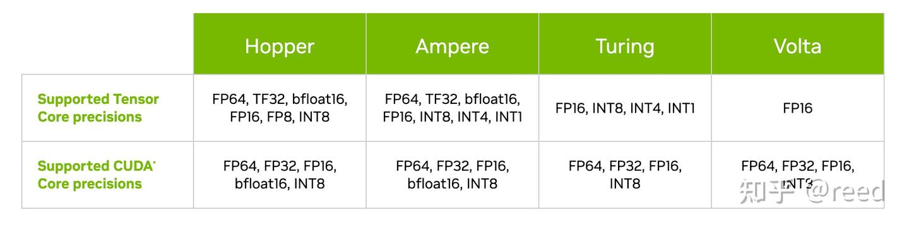

# CuTe의 MMA 추상

> 원문: https://zhuanlan.zhihu.com/p/663092747

Layout과 Tensor는 데이터의 논리 배치·데이터를 기술하는 추상 도구이며, Tensor 추상 위에서 행렬 곱을 완성할 수 있습니다. 앞선 글에서 Layout·Layout 해석·Tensor를 다뤘고, 본 글은 **CuTe에서 Tensor Core로 행렬 곱(MMA = matrix multiply accumulate)을 완성하는 데 필요한 데이터 구조 추상**을 소개합니다. 그 전에 NVIDIA GPU의 Tensor Core를 간단히 소개합니다.

## NVIDIA Tensor Core 소개

딥러닝의 등장은 연산 능력, 특히 행렬 연산 능력의 수요를 크게 키웠습니다. NVIDIA는 Google TPU에 대응하고 시장을 선점하고자 **2017년 Volta 아키텍처에 Tensor Core를 탑재**해 발표했습니다. Tensor Core 이전에는 행렬 계산을 SIMT 방식의 CUDA Core 또는 전통적 CPU의 SIMD로 처리했습니다. Tensor Core는 행렬 계산 전용 HW 유닛으로, **`D = A × B + C`** 형태의 작은 행렬 곱을 고효율로 수행합니다. 국내 주력인 Ampere의 A100에 탑재된 Tensor Core는 단일 사이클에 `8×4×8`(MNK 표기: A는 `8×8`, B는 `8×4`, C는 `8×8`) 반정밀도 행렬 곱을 완료할 수 있습니다. CPU·CUDA Core보다 훨씬 효율적이어서 연산 수요가 큰 딥러닝(컨볼루션·행렬 곱·어텐션 등)은 대부분 Tensor Core로 처리됩니다.




Tensor Core는 Volta/Turing/Ampere에서는 입출력이 CUDA Core와 공유하는 **레지스터**에 있습니다. **Hopper**는 더 나은 대역폭을 위해 입력 데이터를 **shared memory에 직접** 둘 수 있습니다. Tensor Core는 여러 정밀도를 지원하며 정밀도별 효율이 다릅니다.

Tensor Core를 사용하는 방법은 두 가지:

1. **cuBLAS·cuDNN 등 NVIDIA 라이브러리** — 자주 쓰는 행렬·딥러닝 계산 함수를 SDK로 제공
2. **CUDA 프로그래밍 API·PTX 어셈블리** — NVCC가 제공하는 `wmma`(warp matrix multiply accumulate)와 `mma`(matrix multiply accumulate) 두 형식
   - `wmma`: `fragment` 데이터 표현과 `load_matrix_sync()`·`store_matrix_sync()`·`mma_sync()` API로 Tensor Core 호출. 추상이 좋고 프로그래밍이 비교적 단순하나 명령 제어가 거침
   - `mma`(PTX): 데이터를 **레지스터로 직접 표현**하고 `mma.sync` 계열 함수로 계산. 난이도 높고 오류 발생 쉬움, 그러나 세밀한 제어로 더 높은 효율 달성 가능

## CuTe의 MMA 핵심 데이터 구조와 관계

CuTe는 고성능 프리미티브 표현·추상으로서 **`mma` 구현에 바로 대응**하며, 데이터·계산에 좋은 추상을 제공하면서도 세밀한 제어력을 유지합니다. 행렬 계산을 위해 CuTe는 **MMA 추상**을 제공합니다. 핵심 구조는 다음과 같습니다.

- **`MMAOperation`**: 명령 계층 캡슐화. 아키텍처별 HW 명령을 추상화하고 공통 `fma` 메서드를 제공해 상위 프레임워크가 호출. 최종 사용자는 주어진 아키텍처에서 적합한 것을 선택
- **`MMA_Traits`**: C++ traits 개념 이해가 필요합니다. 중국어로는 "萃取(추출)"로 번역되지만 **더 단순한 이해**: traits는 **함수 추상**이며 **입력이 변수·객체가 아닌 타입**이고 **여러 속성을 반환**. 사용자에게 필요하지만 원 타입의 필수 속성은 아닌 정보를 제공. 즉 타입 → 타입 사용자 사이의 다리 역할. MMA_Atom이 MMAOperation을 사용할 때 `MMAOperation` 자체가 제공하는 정보보다 더 많은 정보가 필요한데, MMA_Traits가 그 틈을 메워줌
- **`MMA_Atom`**: 이름대로 HW가 실행 가능한 **행렬 곱의 최소 단위**. 특정 규격(MNK) `D = A × B + C` 한 번을 완성
- **`TiledMMA`**: MMA_Atom 위에 확장해 **더 큰 행렬 곱 능력**을 형성. 원자의 정수 배. 실행 유닛 차원 확장도, Atom 반복 실행도 가능
- **`ThrMMA`**: TiledMMA는 **논리적 표현**이지만, CUDA 커널에서는 **스레드 단위 코드**만 가능. 따라서 논리 행렬 블록을 분할하고 스레드 단위 코드를 써야 함. ThrMMA는 `threadIdx.x`에 따라 이 스레드의 작업을 얻음(warp 레벨 등 가능)
- ThrMMA로 각 스레드 작업이 결정되면, 모든 스레드가 동시에 `cute::gemm`을 호출해 스레드 단위 작업을 실행. 결과적으로 **큰 `D = A × B + C` 작업이 완료**

MMA 핵심 구조의 관계는 그림 3과 같이 **하드웨어·명령 추상**, **논리 추상**, **CUDA 프로그래밍 명령** 세 계층으로 나타납니다.


## MMAOperation

operation은 명령으로 `D = A × B + C`를 수행합니다. A/B/C/D 오퍼랜드의 타입을 지정해야 하며, `fma`의 파라미터 형식은 **D/A/B/C Registers의 타입·데이터량**에 의존합니다. 예를 들어 `DRegister` 타입이 `float[2]`면 `fma`의 처음 두 파라미터가 float 출력. `SM75_16x8x8_F32F16F16F32_TN`은 SM75(Turing)의 MMA, `16×8×8`은 MNK, `F32F16F16F32`는 D·A·B·C 타입(각각 float32·float16·float16·float32). **T**는 A가 row-major, **N**은 B가 col-major(BLAS 관례상 normal 행렬은 col-major, T는 transpose).

```cpp
struct SM75_16x8x8_F32F16F16F32_TN {
  using DRegisters = float[4];
  using ARegisters = uint32_t[2];
  using BRegisters = uint32_t[1];
  using CRegisters = float[4];

  // Register asm fma
  CUTE_HOST_DEVICE static void
  fma(float         & d0, float         & d1, float      & d2, float      & d3,
      uint32_t const& a0, uint32_t const& a1,
      uint32_t const& b0,
      float    const& c0, float    const& c1, float const& c2, float const& c3)
  {
    asm volatile("mma.sync.aligned.m16n8k8.row.col.f32.f16.f16.f32" ...);
  }
};
```


## MMA_Traits

특정 `MMAOperation` 타입에 대해 `MMA_Atom`이 사용할 보조 **타입** 또는 **값**을 정의합니다. 블록 형태의 행렬 곱을 완성하는 데 필요한 정보를 제공:

```cpp
using ElementDVal =  // Logical A-value type
using ElementAVal =  // Logical B-value type
using ElementBVal =  // Logical C-value type
using ElementCVal =  // Logical D-value type

using ElementAFrg =  // A-type consumed by MMA (if omitted, same as ElementAVal)
using ElementBFrg =  // B-type consumed by MMA (if omitted, same as ElementBVal)
using ElementCFrg =  // C-type consumed by MMA (if omitted, same as ElementCVal)

using Shape_MNK =    // Logical MxNxK shape of the MMA

using ThrID     =    // Logical thread id (tid) -> tidx

using ALayout =      // (Logical thread id (tid), Logical value id (vid)) -> Flat MK-coord
using BLayout =      // (Logical thread id (tid), Logical value id (vid)) -> Flat NK-coord
using CLayout =      // (Logical thread id (tid), Logical value id (vid)) -> Flat MN-coord
```

## TiledMMA

TiledMMA는 **MNK 공간 차원에서 Atom을 어떻게 조직하는지**를 전체적으로 표현합니다. 구조 내부에 많은 함수가 정의되어 있어 주어진 계산 블록 분할 능력을 제공하지만, 초심자는 이 로직을 너무 깊게 신경 쓸 필요 없이 두 API만 주목하면 됩니다:

1. **TiledMMA의 템플릿 파라미터** — MMA_Atom 위 확장 로직 표현
   - `AtomLayoutMNK`: M·N·K 방향으로 각각 Atom을 몇 번 반복하는지. 이 반복은 **더 많은 실행 스레드**를 요구
   - `ValueLayoutMNK`: 이 Atom을 M·N·K 방향으로 몇 번 반복하는지. 여기의 반복은 **계산 반복**으로 완성
2. **`get_slice` / `get_thread_slice`**: 주어진 스레드 id로 해당 스레드에 대응하는 **ThrMMA**를 획득

```cpp
template <class MMA_Atom,
          class AtomLayoutMNK   = Layout<Shape<_1,_1,_1>>,
          class ValLayoutMNK    = Layout<Shape<_1,_1,_1>>,
          class PermutationsMNK = Tile<Underscore,Underscore,Underscore>>
struct TiledMMA : MMA_Atom {
  ...;
  ThrMMA get_slice(ThrIdx thr_idx);
  ThrMMA get_thread_slice(ThrIdx thr_idx);
  ...;
}
```

> CUTLASS 3.4 버전에서 이 인터페이스가 업데이트되어 `ValLayoutMNK`가 제거되었습니다. 자세한 파라미터 해석은 CuTe 핵심 작성자 Cecka의 설명을 참고하세요.

## ThrMMA

`TiledMMA`에서 특정 스레드 id로 분해된 구조(ThrMMA = Thread MMA). **스레드 레벨에서 `D = A × B + C`를 수행할 때의 기능 추상**을 기술하며, 주로 `partition` 계열과 `partition_fragment` 계열 함수를 제공합니다.

- `partition` 함수: **논리 Tensor를 해당 스레드용으로 분할**. 인자로 큰 논리 행렬 단위를 받아, 반환값은 이 스레드가 수행할 작업의 Tensor 기술. 예: Tensor C가 `BLK_M × BLK_N`이면 `partition_C`가 스레드 레벨 작업 `(MMA, MMA_M, MMA_N)`을 반환. `MMA`는 TileMMA가 한 번에 계산할 수 있는 단위, `MMA_M`·`MMA_N`은 M·N 방향 분할 수
- `partition_fragment` 함수: `partition`이 반환한 Tensor 형상대로 **대응 레지스터 표현**을 생성

```cpp
ThrMMA {
  Tensor partition_C(Tensor C);
  Tensor partition_A(Tensor A);
  Tensor partition_B(Tensor B);
  Tensor partition_fragment_C(Tensor C);
  Tensor partition_fragment_A(Tensor A);
  Tensor partition_fragment_B(Tensor B);
}
```

## cute::gemm

`cute::gemm`은 **스레드가 MMA 계산을 완료하는 함수**. 핵심 인터페이스는 아래. D·A·B·C로 받는 Tensor는 ThrMMA가 분할해낸 Tensor입니다.

```cpp
void gemm(TiledMMA &mma, Tensor& D, Tensor const& A, Tensor const& B, Tensor const& C);
```

`cute::gemm`과 다른 컴포넌트 관계:

| 기능 | 구성 요소 |
|---|---|
| MMA 명령 + 저장 타입 | `MMAOperation` |
| 논리 타입·형상 요구 | `MMA_Traits` |
| 원자 능력 | `MMA_Atom` |
| 블록 능력(여러 원자) | `TiledMMA` |
| 스레드 레벨 능력 | `ThrMMA` |
| 데이터 분할 API | `ThrMMA::partition_A/B/C()` |
| 실행 트리거 | `cute::gemm(tiled_mma, thr_d, ...)` |

## 정리

CuTe는 `D = A × B + C` 행렬 곱을 수행할 수 있는 MMA 능력을 제공합니다. 명령 캡슐화·어댑터 계층·원자 능력·블록 MMA·스레드 분할·실행에 대한 추상을 `MMAOperation`·`MMA_Traits`·`MMA_Atom`·`TiledMMA`·`ThrMMA`·`cute::gemm`으로 형성합니다. 이 구조들을 통해 논리적 블록 행렬 곱의 분할·실행을 완성할 수 있습니다. **소프트웨어 계층화 설계로 각 계층이 독립적**이며, 저수준 세부를 신경쓰지 않고 제공된 모듈을 조합하는 것으로 충분합니다. 추상의 탈결합 설계 덕분에 상위 로직에 집중하고 저수준 세부 요구는 낮출 수 있습니다.

후속 글에서는 `Copy` 계열 구조 추상을 소개해 **서로 다른 저장 구조 간 데이터 이동**을 구현하고, 이후 MMA·Copy를 조합해 간단한 행렬 곱을 완성한 뒤 점진적으로 최적화해 SOTA 행렬 계산에 이르는 여정을 다룹니다.

## 참고

- NVIDIA Tensor Cores: Versatility for HPC & AI
- A100에서 tensor core는 자체 전용 레지스터가 있는가 (논의)
- https://www.cs.utexas.edu/users/flame/BLISRetreat2023/slides/Thakkar_BLISRetreat2023.pdf
- [QST] What is PermutationMNK in TiledMMA in CUTLASS 3.4 changes? · NVIDIA/cutlass · Discussion #1345
