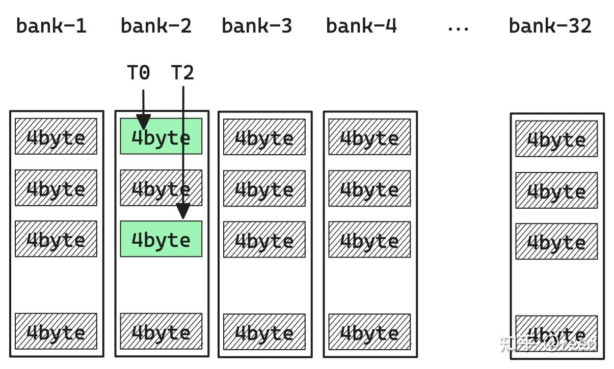
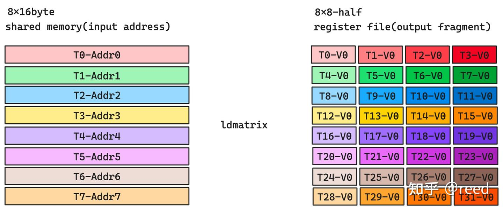
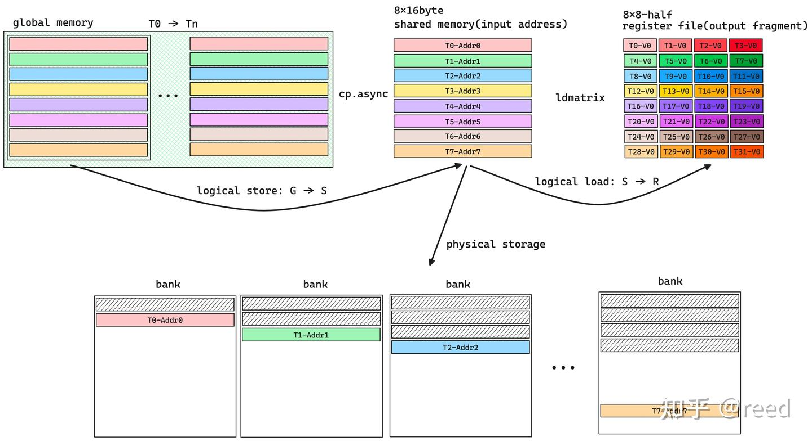
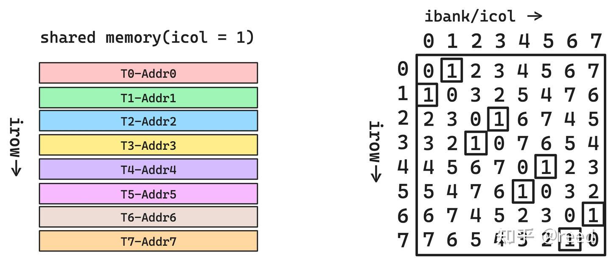
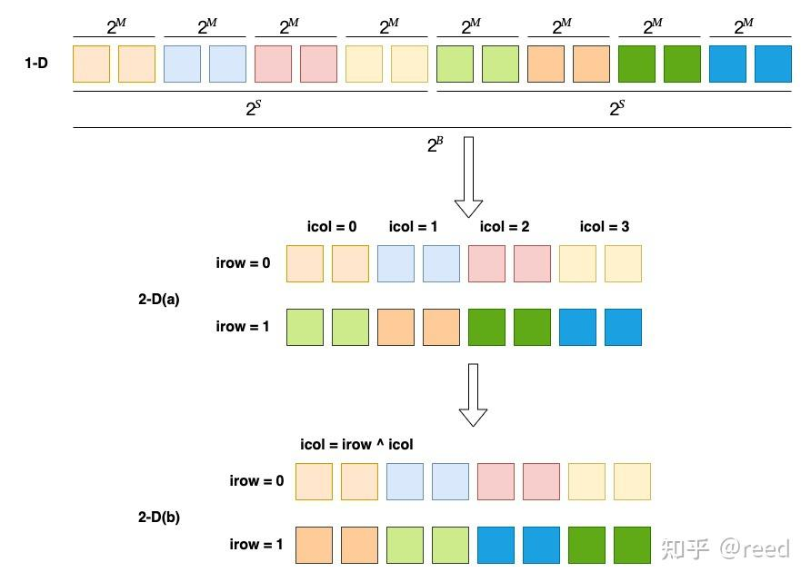

# CuTe의 Swizzle

> 원문: https://zhuanlan.zhihu.com/p/671419093

이전 글들에서 GEMM의 파이프라이닝 기법을 다뤘습니다. 파이프라인의 핵심은 **데이터 복사와 계산을 병렬화**하는 것 — 즉 데이터 로드를 계산에 숨기는 것입니다. 행렬 계산에서 데이터 로드는 global → shared → register 흐름이며, **shared memory**가 중간 매개로서 global memory 접근량을 줄여 계산/접근 비율을 향상시킵니다.

shared memory는 접근 병렬성을 높이려 **다중 bank** 구조를 사용하는데, 이것이 프로그래밍 어려움을 만들어냅니다. CuTe는 **swizzle 추상**으로 논리 공간과 다중 bank 저장 공간 간 매핑의 복잡도를 단순화합니다. 본 글의 구성: (1) shared memory의 다중 bank 구조, (2) 행렬 계산에서 ldmatrix 명령의 논리·저장 공간 요구, (3) XOR 연산의 특성과 Swizzle 추상, (4) Thread Block Swizzle, (5) 정리.

## 지역성 원리와 Shared Memory

**지역성 원리(Principle of Locality)** 는 컴퓨터 과학의 초석으로, 공간 지역성과 시간 지역성을 포함합니다. 공간 지역성(=데이터 지역성)은 데이터 사용이 상대적으로 가까운 저장 공간으로 제한된다는 뜻입니다. **Cache**는 공간 지역성에 대한 좋은 해결책이지만 데이터 갱신·교체 로직이 보통 하드웨어로 구현되어 **프로그래밍 불가**합니다.

SIMT(Single Instruction Multiple Thread) 모드에서 스레드 전용 레지스터는 스레드 레벨 저장 능력을 제공하지만, 종종 스레드 간 데이터 교환이 필요합니다. 더 나은 데이터 지역성과 스레드 간 공유를 위해 **프로그래밍 가능하고 스레드 간 공유 가능한 Cache**가 중요합니다.

CUDA는 SM(Stream Multiprocessor) 위에 **Shared Memory** 저장 구조를 제공하고, SW상 읽기·쓰기 인터페이스와 동기화 프리미티브로 읽기·쓰기·동기화·가시성을 구현합니다. 이로써 thread block 내 스레드들이 공유 메모리로 데이터 공유를 완성하고, 스레드 블록 공통 데이터를 저장해 **블록 레벨의 프로그래밍 가능한 데이터 지역성**을 달성합니다.

Shared Memory는 thread block을 위한 것이므로 **블록 내 스레드 병렬 접근**(읽기·쓰기)을 지원해야 합니다. 다중 스레드 동시 읽기·쓰기에서 효율(낮은 latency, 높은 throughput)을 보장하기 위해 **다중 bank 모드**로 구현됩니다. 각 bank는 독립 주소 지정이 가능한 저장 공간이며 bank 간 병렬 읽기·쓰기가 가능합니다.

NVIDIA 아키텍처에서 shared memory는 **32 bank**, bank의 주소 지정 기본 단위는 **4B**. 그림 1처럼 각 bank는 검정 박스이며 사용자가 보는 주소 공간은 화살표 방향(인접 4B는 다른 bank).


그림 2처럼 32 스레드가 32 bank를 동시 접근(서로 다른 bank의 다른 색 단위)하면 각 bank가 병렬 실행되어 효율 최고. 스레드 번호와 bank 내 행 위치의 연속성은 요구되지 않습니다.


그림 3처럼 두 스레드 T0·T2가 같은 bank-2의 다른 주소를 동시 접근하면 두 접근이 **직렬 실행**됩니다. 발사 단계는 병렬이지만 실제 bank 읽기·쓰기는 시간상 직렬이며 — 이것이 **bank conflict**. 한 bank에서 두 번 충돌이면 **two-way conflict**.



명령 수 절감을 위해 커널 최적화에서는 **벡터화 읽기·쓰기**(=대용량 word)를 자주 씁니다. 예: 128bit 형태로 shared memory 읽기·쓰기 시 스레드당 16B, 32 스레드는 `16B × 32 = 512B`. 전체 512B를 4 phase에 처리:

- phase 1: T0~T7이 모든 bank 접근(no conflict)
- phase 2: T8~T15
- phase 3: T16~T23
- phase 4: T24~T31

이 경우 **shared memory 기본 단위는 16B, 총 bank 8**, 충돌 분석 단위는 32 스레드가 아닌 4 phase 내 다른 스레드. 64bit 접근이면 기본 단위 8B, 총 bank 16, 2 phase 내 충돌 분석.

전체적으로 shared memory 공간은 **2D 저장 공간**으로 볼 수 있습니다(열 방향: bank, 행 방향: 자유 정의 크기). 충돌 여부는 **메모리 접근 트랜잭션 레벨**에서 판단됨에 유의(NVIDIA Developer Forum 논의 참고).

## Shared Memory 읽기 (ldmatrix 명령)



GEMM 파이프라인에서 Tensor Core로 특정 규격의 행렬 곱(예: $D_{16 \times 8} = A_{16 \times 16} B_{16 \times 8} + C_{16 \times 8}$)을 수행할 때, A·B·C·D는 **warp 내 모든 스레드의 일부 레지스터를 합쳐 표현**됩니다. 그림 4 우측 register file은 32 스레드(T0~T31) 각각이 V0(4B) 한 레지스터를 제공해 **8×8 half 행렬 블록**을 표현하는 것을 보여줍니다. 여러 8×8 블록으로 16×16, 16×8 등 더 큰 블록을 구성합니다.

이 데이터는 **`ldmatrix`** 명령으로 warp 레벨 로드. 8×8 half 출력 블록의 입력 요구는 **shared memory 주소 8개**(각 16B 데이터). T0-Addr0이 가리키는 16B는 ldmatrix를 거쳐 **T0~T3의 V0**에 분배되고, T1-Addr1은 T4~T7의 V0에, ... 이렇게 분배됩니다.

shared memory가 bank 구조이고 16B 형태로 읽으므로, T0~T7의 읽기는 한 phase로 묶여 **8개 16B 데이터가 서로 다른 bank에 분포**해야 bank conflict가 발생하지 않습니다. 그림 5는 ldmatrix가 bank conflict 없이 동작하는 배치 한 예.


수학 논리상 8×8 half 레지스터는 연속 행렬 블록을 표현하고 `8 × 16B` 공유 메모리도 좋은 공간 지역성을 가지지만, **저장 논리상 충돌 회피를 위해 다른 bank에 분산**되어야 합니다. 따라서 가로 위치는 단순 논리 배열이 아닌 **bank 방향으로 비스듬히 어긋난 배치**가 필요합니다.

## Shared Memory 쓰기

GEMM 파이프라인에서 데이터 시작점은 global memory(그림 6). 행렬 곱이 필요한 레지스터 데이터는 shared memory에서, shared memory는 global memory에서 옵니다. 수학 논리상 레지스터 표현 공간과 global memory 위치는 대응하지만, **shared memory의 bank 구조 때문에 블록 데이터가 단순 행·열 배치가 아니어야 합니다**. ldmatrix 요구에 따라 충돌 회피로 매핑.

global → shared 로드 시 global memory 효율을 위해 **결합 접근(coalesced)** 과 L2 cache line을 고려해 스레드를 선형 주소 공간 순서대로 배치(T0 → Tn). 즉, **사고 모델은 논리 공간이지만 실행 시는 저장 공간을 고려해 bank conflict를 회피**.



## XOR의 폐쇄성과 전단사성

XOR 명령(`^`)은 두 입력을 받아, 1비트 데이터에 대해 입력 비트가 같으면 0, 다르면 1을 출력합니다. 다비트는 위치별 1비트 XOR. 예: `5 ^ 3 = 0b0101 ^ 0b0011 = 0b0110 = 6`. **교환·결합 법칙** 만족. 또한 집합 $S = \{x, x \in [0, 2^n - 1]\}$의 임의 두 원소 XOR 결과는 **폐쇄성**을 만족합니다. 그림 7처럼 결과는 **전단사(bijective)** 임을 알 수 있습니다(집합론으로 엄밀 증명 가능).



그림 7 좌측 논리 행렬은 icol = 1인 공유 메모리(한 bank에 대응)로 행렬 논리 위치 $(irow = [0, 7], icol = 1)$. 열에 XOR을 적용해 새 column을 bank 값으로 사용: $(irow = [0, 7], ibank = irow \oplus icol)$. 그림 7 우측 검정 박스 부분처럼 데이터가 다른 bank에 분배되어 **bank conflict 회피**.

## Swizzle 추상

CuTe는 **swizzle 추상**으로 shared memory bank conflict 해결을 구현합니다. 전체 계산 체계에서 **2D 논리 공간**으로 행렬 블록을 기술하지만, 공유 메모리 충돌 회피를 위해 데이터 저장 시는 **물리 공간**을 사용합니다. 논리 공간 기술은 **Layout**(본질은 함수)으로 하고, **bank conflict 회피를 위해 swizzle 추상**을 정의 — swizzle도 함수, **layout에 작용하는 함수의 함수(복합 함수)**.

- Layout: 좌표 → offset
- Swizzle: offset → bank-conflict-free offset

즉:

$$\text{offset}_{\text{bank\_conflict\_free}} = \text{Swizzle}(\text{Layout}(\text{coord}))$$

이를 위해 Swizzle은 세 파라미터 **B, M, S**를 정의해 1D 좌표를 2D 공간으로 매핑하는 세 계층을 표현:

- **M**: 1D에서 연속된 $2^M$ 원소가 새 2D 공간의 **기본 원소** 구성
- **S**: 새 2D 공간의 **열 수** $= 2^S$
- **B**: 새 2D 공간의 **행 수** $= 2^B$



그림 8: B = 1, M = 1, S = 2일 때, M은 "연속된 2 원소가 2D 공간의 한 원소", S는 "2D 공간 원소 수", B는 "2D 공간 행 수". 그림 2-D(a)는 2행 4열, 기본 단위 2 원소. 다음으로 2D 공간의 열 좌표와 행 좌표를 XOR해 새 열 번호 `icol = irow ^ icol` (그림 2-D(b)). 1D 좌표가 매핑 후 $2^B$ 크기를 초과하면 행 번호를 0부터 다시 세고 offset에는 누적 원소 수를 추가.

실전: half 타입, `shape (8, 32), stride (32, 1)` 공유 메모리에 `Swizzle<3, 3, 3>`을 적용:

```cpp
A = composition(Swizzle<3, 3, 3>{},
                Layout<Shape<_8, _32>, Stride<_32, _1>>{});
```

Layout 유효 offset: 0~256.

- M = 3 → `2^3 = 8` 원소가 새 최소 원소 구성. half는 `8 × 2B = 16B`
- S = 3 → 2D 공간 한 행에 8 원소, `8 × 16B = 128B` (= shared memory 무충돌로 모든 bank에 접근하는 최대 폭)
- B = 3 → 2D 공간 irow 갱신 간격이 8

이로써 **논리 공간 → 2D shared memory 공간 매핑** 구현. 열 폭 128B로 모든 bank 점유, 행·열 XOR로 새 열 번호 — bank 방향(=icol 방향) 충돌 회피.

## Thread Block Swizzle

CuTe(CUTLASS)에는 또 다른 swizzle인 **Thread Block Swizzle**이 있습니다. C 중심 작업 분할 모드에서 Thread Block Swizzle이 없으면 작업 블록은 행 우선 또는 열 우선 선형 순서로 모든 실행 유닛(예: SM0~3, HW가 4 SM이라 가정)에 분배됩니다. Thread Block Swizzle을 적용하면 그림 9 우측 같은 분할 관계 형성. 일부 시나리오에서 **L2 cache 적중률 향상** — 같은 원소가 더 큰 면적을 덮을 수 있고, 그 면적(A·B)이 L2에 잘 캐시됨. 자세한 내용은 CUTLASS의 thread block swizzle 구현 참고.


## 정리

본 글은 shared memory의 bank 구조·특성, 행·열 XOR로 bank 교차 구현 방법, CuTe의 Swizzle 추상, L2 적중률 최적화용 Thread Block Swizzle을 다뤘습니다. 여기까지 행렬 곱 최적화의 이론적 부분이 모두 끝났습니다. 다음 글에서는 이 방법들로 효율적 행렬 곱을 완성합니다.

## 참고

- https://en.wikipedia.org/wiki/Locality_of_reference
- https://on-demand.gputechconf.com/gtc/2018/presentation/s81006-volta-architecture-and-performance-optimization.pdf
- US 8108625, US 7680988 patents
- https://github.com/NVIDIA/cutlass/blob/main/include/cutlass/gemm/threadblock/threadblock_swizzle.h
- "How to understand the bank conflict of shared_mem"
