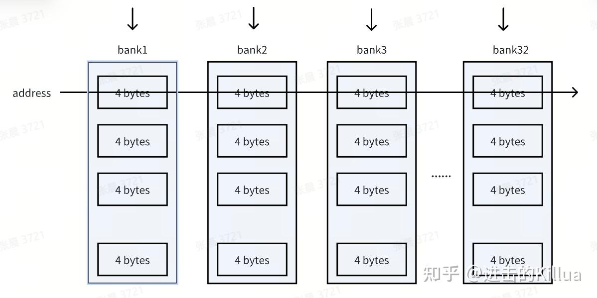
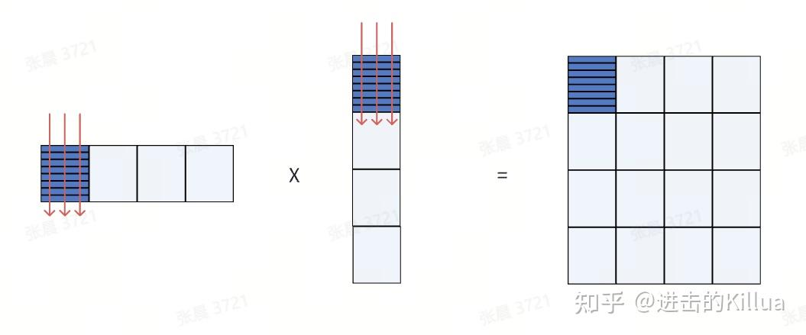
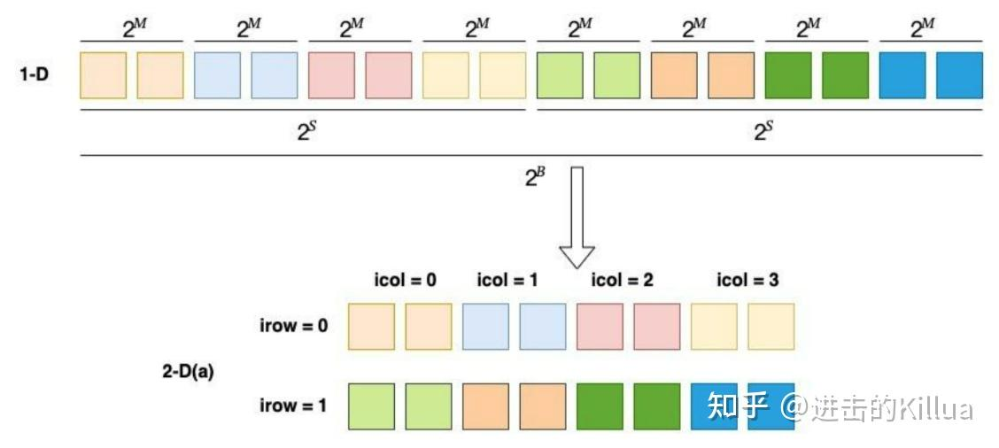
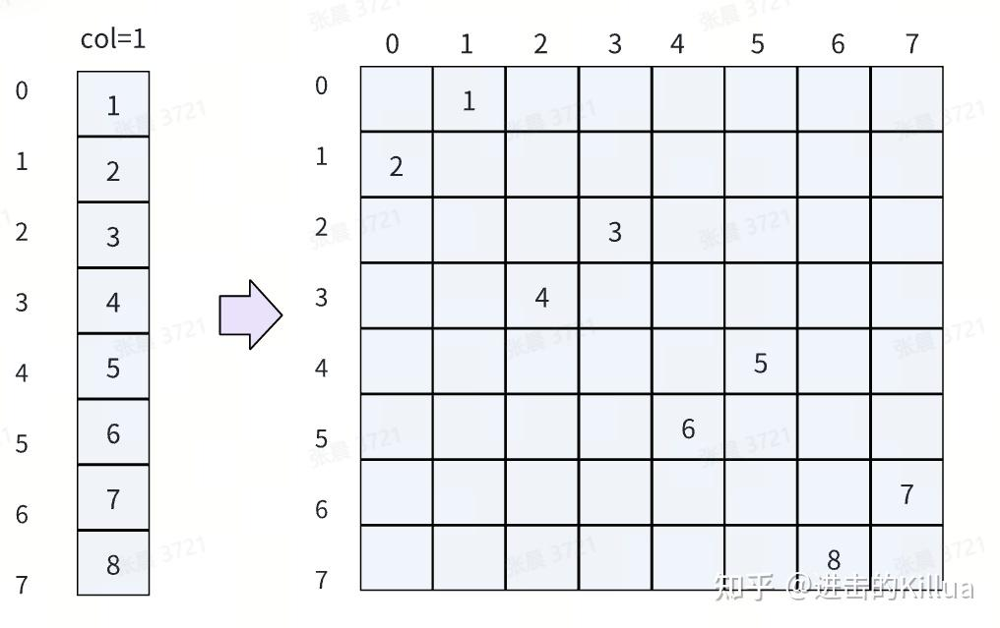
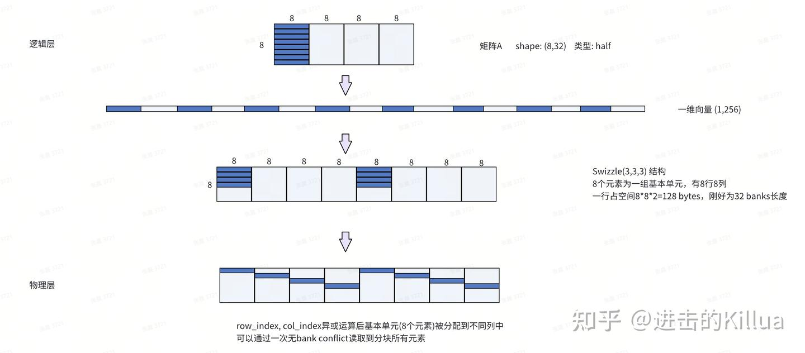

# CuTe Swizzle 세부

> 원문: https://zhuanlan.zhihu.com/p/684250988

최근 reed 선생의 CuTe 시리즈를 보고 많은 새 지식을 배웠습니다. 지금까지 본 CuTe 관련 한국어/중국어 블로그 중 가장 잘 쓰인 시리즈로, 영문 공식 문서는 비교 대상도 안 됩니다. 배경과 세부를 깊이 있게 풀어내면서도 읽기 부담이 없습니다(물론 약간의 기초와 사고는 필요). 본 글은 그중 [CuTe Swizzle](../B14_cute_swizzle/README.md) 부분에 **구체 예시**를 보충하여 Swizzle의 효과를 더 명확히 설명합니다.

먼저 Swizzle이 어떤 문제를 푸는지, 그 다음 본질, 추상을 복습한 후, 본 글의 핵심인 **구체 예시**로 실제 효과를 살펴봅니다.

## 어떤 문제를 푸는가

다중 스레드 동시 읽기·쓰기 효율을 위해 GPU shared memory는 **bank**로 나뉘며 bank의 주소 지정 기본 단위는 **4B**, 2D 구조(열은 bank, 행은 무제한). 한 warp(32 스레드) 접근이 같은 bank 데이터를 만나지 않도록 해야 하며, 그렇지 않으면 **직렬 분할 접근**이 필요합니다.

그러나 자주 쓰는 GEMM 연산은 논리적으로 **2D 행렬**로 표현됩니다.

이때 논리 layout을 물리 구조에 그대로 매핑하면 부분 행렬 접근에서 **대량의 bank conflict**가 발생해 성능이 급락. 예: 그림 행렬에서 warp 내 모든 스레드의 빨간 선상 원소 접근은 모두 conflict.

여기서 **CuTe Swizzle**이 등장합니다. **논리 구조의 요구와 물리 저장 구조 설계의 불일치 문제**를 해결합니다. Swizzle이 있으면 **물리 구조(bank 같은)** 를 신경 쓸 필요 없이 **논리 행렬 layout만 신경 쓰면 됩니다** — Swizzle이 알아서 bank conflict를 최대한 해소합니다.

## CuTe Swizzle 본질

CuTe Swizzle의 본질은 **2D 논리 구조 → 2D 물리 구조 매핑**으로, 저수준 물리 특성을 가립니다. 사실상 CuTe layout과 본질은 비슷합니다. 둘 다 매핑이며 Swizzle은 **공유 저장 시나리오 전용**일 뿐입니다.

## CuTe Swizzle 추상

(reed 선생의 설명을 그대로 인용)

> CuTe는 swizzle 추상으로 shared memory bank conflict 해결을 구현합니다. 전체 계산 체계에서는 **2D 논리 공간**으로 행렬 블록을 기술하지만, 공유 메모리 충돌 회피를 위해 데이터 저장 시는 **물리 공간**이 필요합니다. Swizzle의 본질도 **함수**이며, layout에 작용하는 함수 — **함수에 작용하는 함수**, 즉 복합 함수의 합성. Layout: 좌표 → offset, Swizzle: offset → bank-conflict-free offset.
>
> Swizzle은 세 파라미터 **B, M, S**를 정의해 1D 좌표 → 2D 공간 매핑의 세 계층을 표현합니다. 1D에서 연속된 $2^M$ 원소가 2D의 **기본 원소**, $2^S$가 **열 수**, $2^B$가 **행 수**.
>
> B = 1, M = 1, S = 2일 때 (그림 2-D(a)), 2D 공간은 2행 4열, 기본 단위 2 원소.

> 위 결과에서 각 단위에 **XOR 재배열**을 가해 데이터를 다른 bank로 분산. 좌측 논리 행렬은 icol = 1인 공유 메모리(한 bank). 행렬 위치 $(irow = [0, 7], icol = 1)$. 열에 XOR을 적용해 새 column을 bank 값으로: $(irow = [0, 7], ibank = irow \oplus icol)$. 우측처럼 데이터가 다른 bank에 분배되어 **conflict 회피**.

## 구체 예시

### 요구

행렬 곱 `C = A × B` (정밀도 half), A의 shape `8 × 32`.

A를 블록 분할 후 각 블록을 레지스터로 읽어 GEMM 수행. 각 부분 행렬 크기 `8 × 8`. 여기서는 **첫 번째 블록**만 고려(나머지 동일).

### 매핑 과정

A의 첫 부분 행렬(짙은 색)이 공유 메모리에 단계별 매핑되는 흐름:

1. A를 **1D 벡터화** — 즉 평탄화. 각 원소의 선형 offset 획득(CuTe layout의 기능)
2. **`Swizzle<3, 3, 3>`** 을 이 선형 공간에 적용 — 벡터를 순서대로 Swizzle 공간에 평탄 배치. `Swizzle<3, 3, 3>`은 사실 **8×8×8** 표현(기본 단위 8 원소, 8행 8열)
3. **행·열 번호 XOR**로 새 열 번호를 얻어 이동 → 최종 물리층 표현

그림 최하단 표현에서 **이 부분 행렬 접근이 서로 다른 bank에 분산**되어 공유 메모리에서 레지스터로 conflict-free 읽기 가능합니다.
