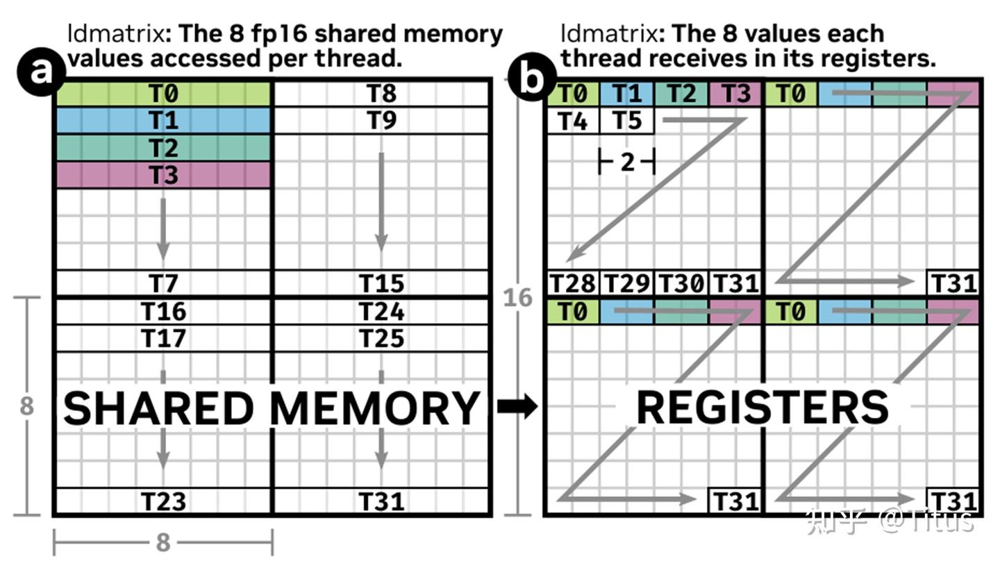
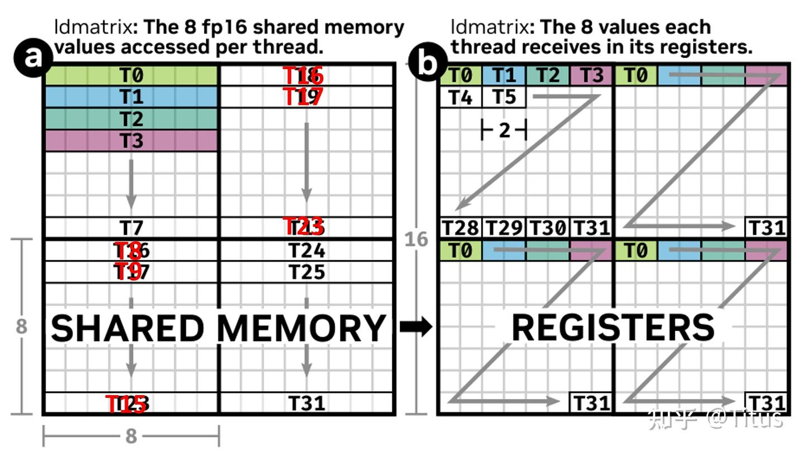
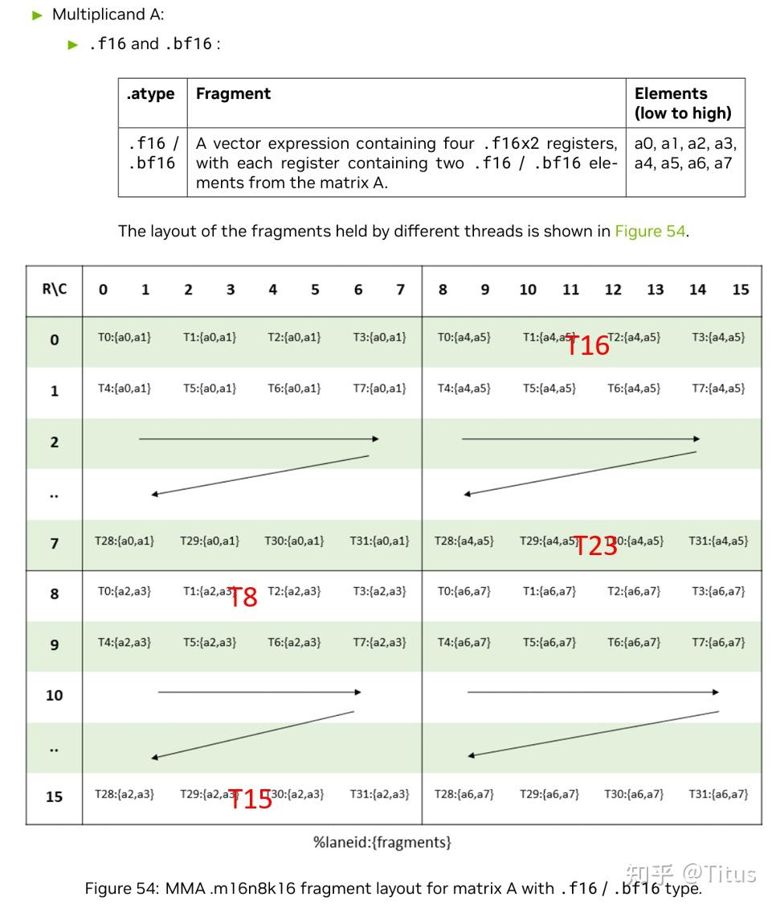
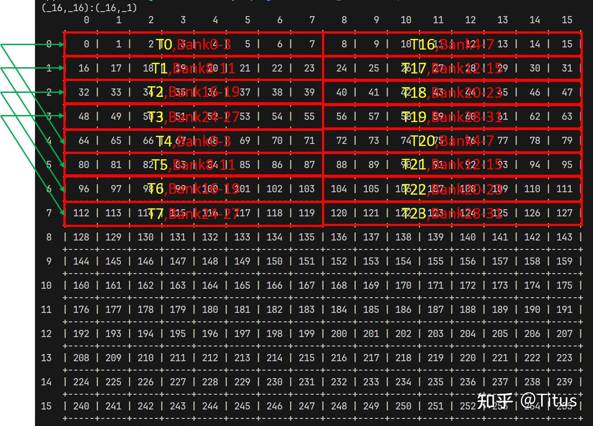
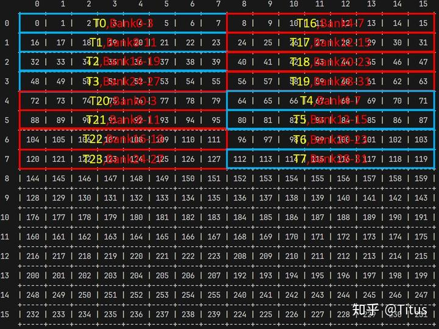
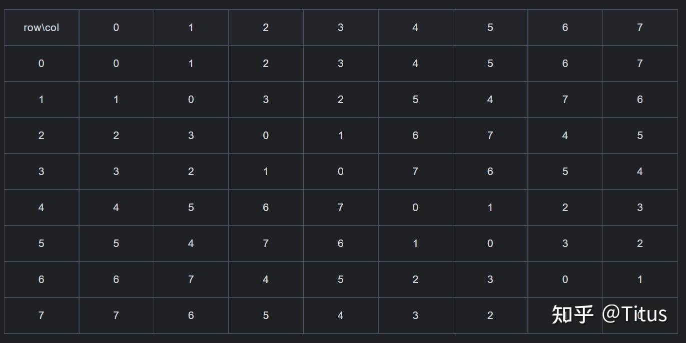

# CUTLASS Swizzle 메커니즘 해석 (1)

> 원문: https://zhuanlan.zhihu.com/p/710337546

CUTLASS GEMM에서 swizzle 메커니즘은 두 가지 역할을 합니다.

- **Thread Block Swizzle**: 지역성 원리로 block id를 재매핑해 발사 순서를 바꿔 L2 캐시 적중률 향상
- **GEMM 파이프라인의 warp tile 계산 시 공유 메모리 읽기·쓰기를 bank 충돌 없이 보장** — 본 글의 주제

공유 메모리 bank 충돌 간단 복습: shared memory는 프로그래밍 가능한 L1 메모리이며, 읽기·쓰기 효율을 위해 **32-way bank**(각 4B = 32bit)로 조직됩니다. **한 warp의 다른 스레드들이 같은 bank에 접근하면 직렬화**되어 효율이 크게 떨어집니다(예외 — broadcast).

shared memory 읽기·쓰기를 bank 충돌 없이 보장하기 위해, **swizzle 메커니즘은 물리 layout ↔ 논리 layout 재매핑**으로 동작합니다.

문제를 단순화해, Tensor Core로 **`16x8x16 fp16` 행렬 곱**을 직접 계산한다고 가정. shared memory에서 register file로 로드 후 mma에 보내 계산하는 과정의 PTX:

```
// load A from shared memory to register file, d0/1/2/3 is b32 register
ldmatrix.sync.aligned.m8n8.x4.shared.b16 {d0, d1, d2, d3}, [a_addr];
// load B from shared memory to register file, d4/5 is b32 register
ldmatrix.sync.aligned.m8n8.x2.trans.shared.b16 {d4, d5}, [b_addr];

// d = a x b + c
mma.sync.aligned.m16n8k16.row.col.f32.bf16.bf16.f32 d, a, b, c;
```

`ldmatrix`는 한 warp 단위로 A·B의 mma 명령에 필요한 데이터(A: 16×16 fp16 row-major, B: 16×8 fp16 col-major)를 shared memory에서 로드해 mma에 전달합니다.

**A 행렬**: ISA 설명에 따라 `ldmatrix`는 4개의 `8x8 fp16` 행렬을 읽으며, 한 warp으로 이를 완료하기 위해 **4 phase**로 나뉩니다 — T0-7(phase 0), T8-15(phase 1), T16-23(phase 2), T24-31(phase 3). 각 phase는 한 8x8 행렬을 읽고, **phase의 각 스레드는 한 행의 `8 fp16 = 16B = 128bit (vector) = 4 bank` 데이터**를 담당합니다. 이 4 bank 데이터는 **연속이어야** 하며, 스레드 간 4 bank 데이터는 연속일 필요는 없고 정렬 조건만 충족하면 됩니다. 따라서 **bank 충돌 논의 단위가 한 warp이 아닌 한 phase(8 스레드)** 가 되며, 이 8 스레드 읽기에서만 충돌이 없도록 보장하면 됩니다.

각 스레드는 자신이 읽은 4 bank 데이터를 4분할해 지정 스레드들로 분배합니다. 예: T0의 4개 32bit 레지스터(d0, d1, d2, d3)는 T0, T8, T16, T24의 첫 분할 데이터를 받습니다. `ldmatrix` 로드 과정:



**참고**: ISA 설명에 따라 위 그림은 약간 수정되어야 합니다. 그렇지 않으면 ldmatrix의 레지스터 데이터 배치가 잘못되어 mma에 직접 전달할 수 없습니다. 수정된 그림:



A 행렬에서 ISA의 각 스레드 실제 레지스터 데이터:



**B 행렬**: `ldmatrix`는 2개의 `8x8 fp16` 행렬을 읽음. B는 col-major이므로 **2 phase**(T0-7, T8-15)로 완성. 각 phase의 각 스레드는 **열 길이 `1 vec = 8 fp16 = 32B = 4 bank`** 데이터를 담당. 이 4 bank는 연속이어야 하고, 스레드 간 load 주소는 정렬 조건만 충족.

마지막으로 mma 명령 요구대로 데이터를 읽은 후 mma에 전달해 계산.

위 계산 과정을 이해하면 한 가지가 명확해집니다: **ldmatrix에 전달하는 각 스레드의 주소가 합리적이지 않으면 bank 충돌이 발생할 수 있다**.

A 행렬 `16x16 fp16` 로드를 예로, A의 물리 layout이 논리 layout과 일치하면(swizzle 없음):



**각 phase에 2-way bank 충돌**이 존재함을 어렵지 않게 발견할 수 있습니다. phase 0을 예로, **T0와 T4, T2와 T5, T3와 T6, T4와 T7이 같은 bank에 접근**합니다. 이것이 swizzle이 필요한 이유 — **ldmatrix에 전달되는 각 스레드 주소가 합리적이지 않다**.

**이때 Swizzle 메커니즘 등장**. `Swizzle<3, 3, 3>`을 위 `16x16 fp16` layout에 적용하면:



phase 0의 경우, **물리 layout이 새 bank로 재매핑**되었음을 알 수 있습니다(논리 layout은 우리에게는 변경 없음). shared memory 읽기 시 T0~T7이 같은 bank에 접근하지 않아 **충돌이 회피**됩니다. 그림은 phase 0만 표시했고 다른 phase는 동일하게 적용.

위 `Swizzle<3, 3, 3>`과 `16x16 fp16`은 어떤 관계? 어떻게 작동하는가? **핵심은 XOR 연산**입니다.

`Swizzle<B, M, S> = Swizzle<3, 3, 3>`을 S, M, B 순서로 이해:

1. **첫 S는 3**: $2^3 = 8 = 1\text{vec} = 8 \times \text{fp16} = 4 \text{bank}$
2. **둘째 M은 3**: $2^3 = 8$ → `8 × (8 fp16)` 원소
3. **셋째 B는 3**: $2^3 = 8$ → `8 × (8 × (8 fp16))` 원소

즉 이 swizzle은 `8 × 8` 행렬에 작용하며, **각 행렬 원소 크기 = `8 fp16 = 4 bank`**. 행·열 XOR로 새 열 인덱스 col′을 얻어 bank 충돌 해결:

$$\text{col}' = \text{row} \oplus \text{col}$$



표에 따르면, 예: 원래 `(1, 0)` 단위에 속한 원소는 `(1, 1^0) = (1, 1)`로 재매핑되어 `(1, 1)` 단위에 위치.

본 장 끝~~
