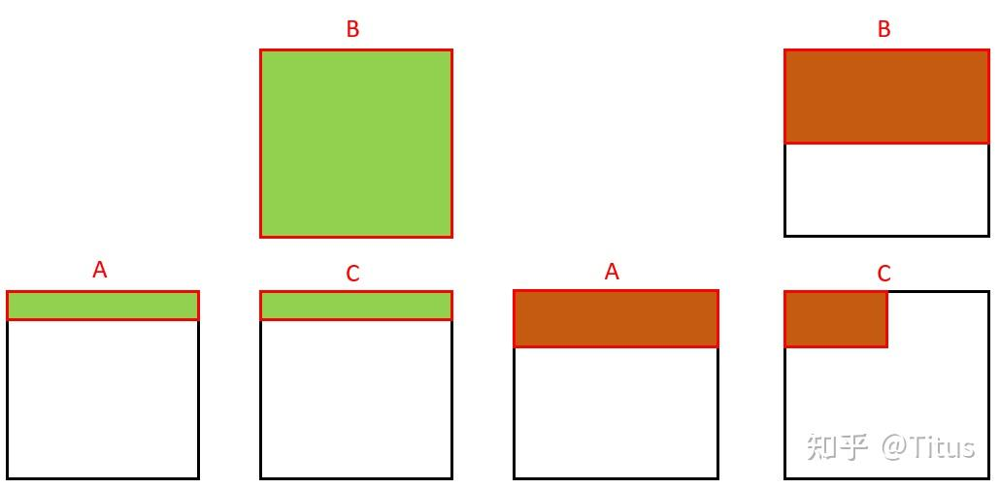
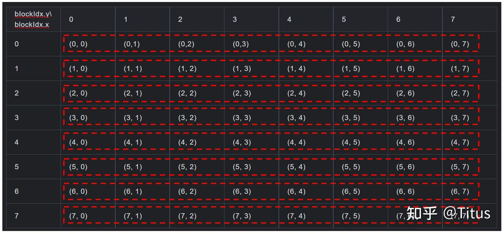
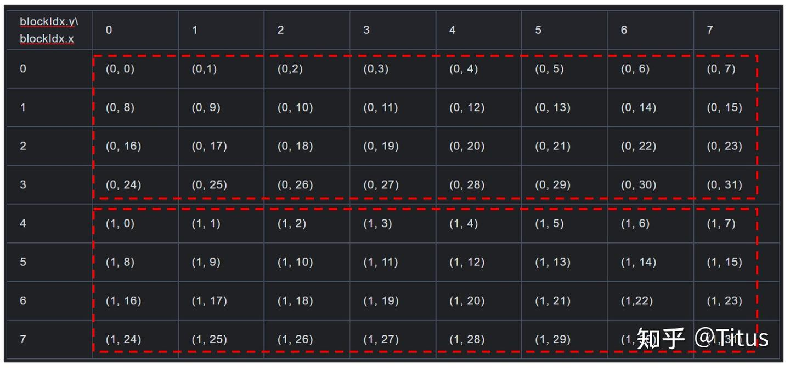
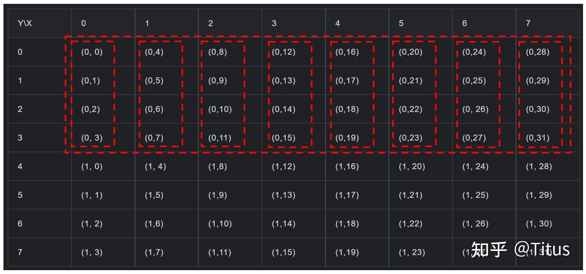
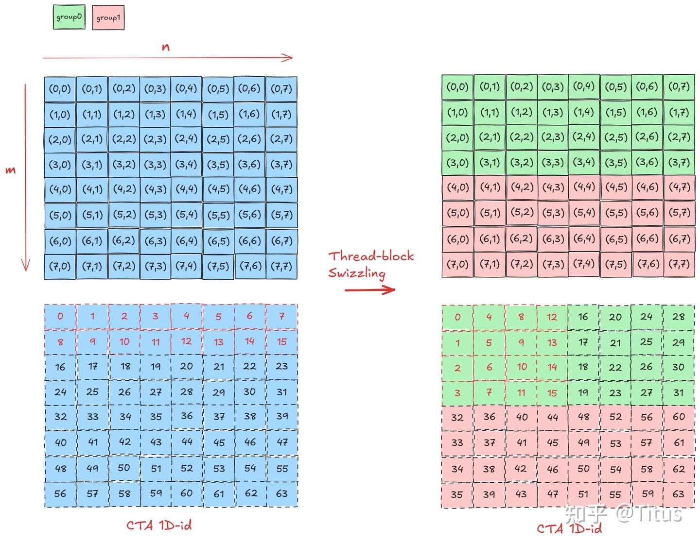
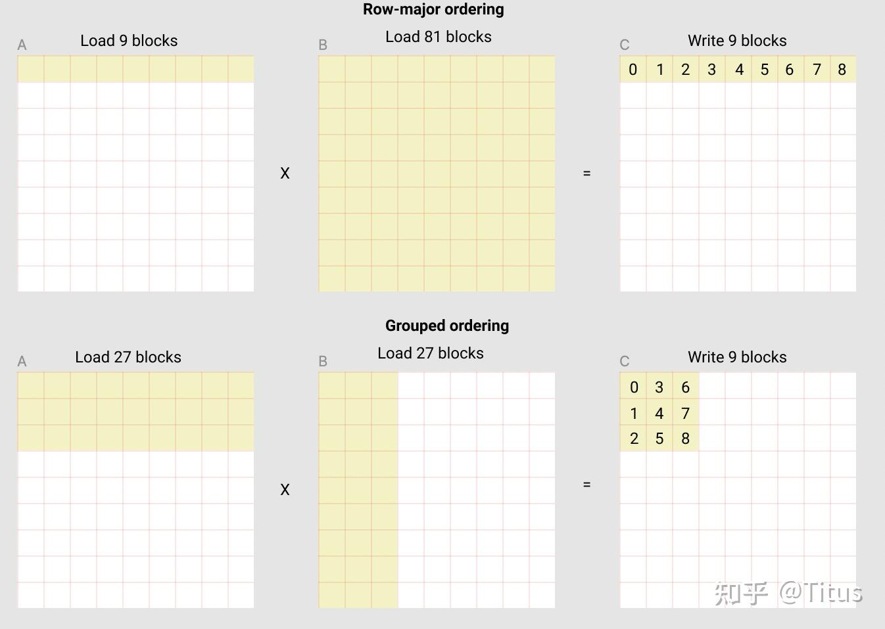

# CUTLASS Swizzle 메커니즘 해석 (2)

> 원문: https://zhuanlan.zhihu.com/p/711398930

이 장에서는 **Thread Block Swizzle** 트릭을 다룹니다. 주로 CUTLASS의 `threadblock_swizzle.h` 파일의 `GemmIdentityThreadBlockSwizzle` 템플릿 클래스와 관련됩니다.

CUTLASS는 GEMM을 **3계층 tile**(thread block tile, warp tile, thread tile)로 나누며, 핵심 사상 중 하나는 **데이터 재사용으로 메모리 접근 효율을 높여 메모리 병목을 해결**하는 것입니다. GEMM 파이프라인의 데이터 이동 흐름은:

```
Global memory → (L2) → L1/shared memory → register files → shared memory → (L2) → Global memory
```

자주 간과되는 중요한 최적화 포인트가 **L2 cache**입니다. 한편으로는 GPU 하드웨어 제약(프로그래밍 불가)이 있고, 다른 한편으로는 PTX/SASS 차원에서 **더 넓은 명령**을 사용하는 것이 cache policy/hint 등 명령 캐시 동작을 조정하는 것보다 더 비용 효율적이고 조작 가능합니다.

**Thread Block Swizzle**은 이 차원에서 출발한 메커니즘으로, **CTA 인덱스(blockIdx)와 block tile을 논리적으로 재매핑하여 L2 cache 적중률을 높이고 지역성을 개선**합니다.

배경 설명: GPU가 한 wave(최대 병렬 실행 CTAs)로 이 block들을 실행하는 과정에서, 이 block들의 데이터 재사용을 최대화해 메모리 접근 비용을 낮춥니다.

> **참고**: 일부 글은 CTA 실행 순서 관점에서 설명합니다(X→Y→Z 순으로 scheduler에 제출되어 SM에 분배). NVIDIA는 여러 문서에서 **CTA 실행 순서가 비결정적**이고 CTA·SM 매핑에 어떤 연관성도 없으며 인위적 매핑 유도가 불가능하다고 명확히 밝혔습니다. 어느 SM이 언제 실행할지는 확인할 수 없습니다. 다만 인터넷 글들의 연구로 보면 CTA 실행 순서가 대체로 이 기본 규칙을 따르므로(스케줄러 설계는 더 복잡하겠지만), 본 장 논의의 보조 가정으로 사용합니다.

**A는 row-major, B는 col-major, C는 row-major일 때, 아래 두 wave 중 어느 쪽 메모리 지역성이 더 좋을까요?**



당연히 오른쪽이 더 우수합니다. 왼쪽은 B 전체에 접근해야 해서 B가 매우 클 때 L2 캐시되기 어렵고, 오른쪽은 일부 B만 필요해서 L2 캐시되기 쉽고 메모리 지역성에도 부합합니다.

Swizzle 도입 후 CUTLASS는 GEMM 커널 차원에서 각 tile과 CTA를 어떻게 매핑할까요? GEMM이 C를 8×8 tile 그리드로 나눈다고 가정하면, 초기 단계의 tile-CTA 인덱스 매핑:



step이 4라면 `get_log_tile` 결과는 2. `get_grid_shape` 함수 후 실제 grid 크기가 **(Y, X) = (2, 32)** 가 되며, 조정된 매핑:

```cpp
/// Computes CUDA grid dimensions given a size in units of logical tiles
CUTLASS_HOST_DEVICE
static dim3 get_grid_shape(GemmCoord tiled_shape) {
  int tile = 1 << get_log_tile(tiled_shape);
  return dim3(tiled_shape.m() * tile, (tiled_shape.n() + tile - 1) / tile, tiled_shape.k());
}

/// 최적 swizzle 폭 (step) 계산
CUTLASS_HOST_DEVICE
static int get_log_tile(GemmCoord tiled_shape) {
  auto n = tiled_shape.n();
  // no-op CTA를 너무 많이 만들지 않도록 임계값 설정
  if (N >= 8 && n >= 6)
    return 3;
  else if (N >= 4 && n >= 3)
    return 2;
  else if (N >= 2 && n >= 2)
    return 1;
  else
    return 0;
}
```



커널 실행 시 `get_tile_offset`으로 런타임 매핑 관계 획득:

```cpp
/// threadblock 오프셋 (threadblock-scoped tile 단위) 획득
CUTLASS_DEVICE
static GemmCoord get_tile_offset(int log_tile) {
  int block_idx_x = RematerializeBlockIdxX();
  int block_idx_y = RematerializeBlockIdxY();
  int block_idx_z = RematerializeBlockIdxZ();

  return GemmCoord{
      (block_idx_x >> log_tile),
      (block_idx_y << log_tile) + block_idx_x % (1 << (log_tile)),
      block_idx_z};
}
```



매핑 전과 비교하면, **Thread Block Swizzle이 행렬 데이터 재사용율을 잘 개선**했음을 알 수 있습니다.

`MxNxK = 2048 × 4096 × 2048`, A row-major, B col-major, C row-major을 예로, no swizzle(`GemmIdentityThreadBlockSwizzle<>`), `<2>`, `<4>`의 L2 cache 적중률을 ncu metrics로 측정:

```
Section: Command line profiler metrics
-------------------------- ----------- ------------
Metric Name                Metric Unit Metric Value
-------------------------- ----------- ------------
lts__t_sector_hit_rate.pct           %        75.28
-------------------------- ----------- ------------

Section: Command line profiler metrics
-------------------------- ----------- ------------
lts__t_sector_hit_rate.pct           %        82.36
-------------------------- ----------- ------------

Section: Command line profiler metrics
-------------------------- ----------- ------------
lts__t_sector_hit_rate.pct           %        86.53
-------------------------- ----------- ------------
```

이 방식이 **L2 cache 적중률을 실제로 개선**함을 확인할 수 있습니다.

마지막으로 한 실용 공학 문제: **이 트릭의 실제 효과는?** CUTLASS GEMM 튜닝 시 얼마나 효과 있는가? 어떤 경우 효과가 없는가?

개인 견해: 이 트릭은 메모리 접근 최적화이며, **multi-stage 파이프라인 전략과 결합**할 때 계산이 메모리 지연을 충분히 감출 수 있고 여유가 있다면 거의 무용. 그렇지 않으면 **약 10% 정도 개선**(OpenAI Triton 결과와 대체로 일치). ncu로 보조 분석 권장.

RTX 4080 Laptop의 두 case 측정 결과(50회 평균):

```
// GemmIdentityThreadBlockSwizzle<>, No Swizzle
4096 x 40960 x 4096 TF32 tensor op Matrix Multiply
Runtime: 25.3362 ms
GFLOPs:  54246.1

// GemmIdentityThreadBlockSwizzle<8>
4096 x 40960 x 4096 TF32 tensor op Matrix Multiply
Runtime: 23.9891 ms
GFLOPs:  57292.3
```

본 장 끝~~ 토론 환영~~

## 2025/2/22 보충

OpenAI Triton도 이 메커니즘을 활용해 GEMM-like 커널 성능을 높입니다(원문 링크 참조).

`M = N` 행렬 곱에서 `M/BM = N/BN = 8`, `GROUP_SIZE_M = 8`.

원본 CTA 매핑 순서 코드:

```python
pid = tl.program_id(axis=0)
grid_n = tl.cdiv(N, BLOCK_SIZE_N)
pid_m = pid // grid_n
pid_n = pid % grid_n
```

Thread-block Swizzling(=Thread-block rasterization)의 핵심 매핑 로직:

```python
"""
[grid_m, grid_n] = [8, 8]
GROUP_M = 4
num_pid_in_group = 4 * 8 = 32

[0,  32) -> group 0 -> first_pid_m=0
[32, 64) -> group 1 -> first_pid_m=4
"""

pid = tl.program_id(axis=0)               # CTA 1D-id, [0, 63) 범위
grid_m = tl.cdiv(M, BLOCK_SIZE_M)         # M 방향 CTA 수: 8
grid_n = tl.cdiv(N, BLOCK_SIZE_N)         # N 방향 CTA 수: 8
num_pid_in_group = GROUP_SIZE_M * grid_n  # group의 CTA 수: 4x8=32
group_id = pid // num_pid_in_group        # 현재 CTA id의 group 1D-id
first_pid_m = group_id * GROUP_SIZE_M     # 현재 CTA 그룹의 m 방향 첫 CTA
group_size_m = min(grid_m - first_pid_m, GROUP_SIZE_M)  # 경계 조건

"""
pid: 0  -> pid_m: 0, pid_n: 0
pid: 1  -> pid_m: 1, pid_n: 0
...
pid: 4  -> pid_m: 0, pid_n: 1

CTA 재매핑 완료
"""
pid_m = first_pid_m + ((pid % num_pid_in_group) % group_size_m)
pid_n = (pid % num_pid_in_group) // group_size_m
```

도식:



위 예에서 GPU가 한 wave에 16 CTA를 실행한다고 가정하면, 기본 상태에서 A는 **`2 × K/BK`** 개의 `[BM, BK]` tile을 load해야 하고, B는 `K/BK × N/BN = K/BK × 8` 개의 `[BK, BN]` tile을 load해야 합니다.

Thread-block swizzling 후에는 A는 **`4 × K/BK`** 개 tile을, B는 **`K/BK × 4`** 개 tile을 load. 데이터 이동량은 각각 `2×BM×K + K×8×BN`과 `4×BM×K + K×BN×4`이며, 그 비율은 **(BM + 4BN) / (2BM + 2BN)** — 데이터 이동량 약 **25% 감소**.

OpenAI 도식:



A의 데이터 이동량은 일정 정도 증가했지만 **B의 이동량이 효과적으로 감소**했음을 알 수 있습니다. 둘은 비율이 같지만 **B의 기수가 매우 커서 전체 영향이 큼**. 특히 **B 행렬이 큰 시나리오에 적합**합니다.
