# CUDA shared memory의 bank conflict 회피 swizzling 메커니즘 해석

> 원문: https://zhuanlan.zhihu.com/p/4746910252

## 1. 배경

CUDA shared memory는 **4B 단위 1 bank, 총 32 bank(128B)** 로 조직됩니다. store·load 동작에는 다음과 같은 bank conflict가 존재할 수 있습니다.

- 다른 스레드들이 같은 bank의 다른 주소에 접근하면 bank conflict 발생
- bank conflict는 **같은 warp의 다른 스레드 간**에서만 발생
- 여러 스레드가 같은 bank의 같은 주소에 접근하면 실제로는 **broadcast**, conflict 아님
- bank conflict는 **shared memory 읽기·쓰기**에만 발생, global memory에는 없음

> 일부 경우 bank conflict는 warp 내 **같은 phase의 다른 스레드 간**에 발생합니다. phase는 warp 32 스레드가 shared memory를 조작할 때 여러 phase로 나뉘는 단위로, 각 phase의 참여 스레드가 다릅니다. 예: `ldmatrix.sync.aligned.x4.m8n8.shared.b16` 명령은 shared memory에서 스레드 레지스터로 데이터를 로드하며 4 phase로 나뉩니다 — phase 0: thread 0~7, phase 1: thread 8~15, ...

bank conflict는 warp을 stall시키며, 충돌이 많으면 전체 파이프라인에 큰 영향을 줍니다.

> bank conflict 발생 시 warp는 shared memory 접근 명령을 LSU 유닛에 재제출하기 위해 추가 사이클이 필요. 이 명령은 MIO에서 큐잉되며, 큐잉이 접근 지연을 키워 warp는 데이터 반환 대기 상태(**Stall Short Scoreboard**). MIO 큐가 가득 차면 warp는 MIO 큐가 비-만석 상태가 될 때까지 대기(**Stall MIO Throttle**).

bank conflict 해결책:

- **padding**
- **전치 저장**(행렬 곱 최적화의 전형, global memory 데이터를 shared memory에 전치 저장)
- **swizzling 메커니즘**

본 글은 **행렬 전치** 커널을 예로, 여러 구현을 비교하며 swizzling이 bank conflict를 어떻게 회피하는지 설명합니다.

## 2. shared memory 기반 행렬 전치 naive 구현

행렬(`1024 × 2048`) 전치 naive 구현:

```cpp
const int M = 1024;
const int N = 2048;
const dim3 block_size(32, 32);
const dim3 grid_size(N/32, M/32);
matrix_trans_shm<<<grid_size, block_size>>>(dev_A, M, N, dev_B);
```

```cpp
// 전치 전 행렬은 dev_A(M*N), 전치 후는 dev_B
__global__ void matrix_trans_shm(int* dev_A, int M, int N, int* dev_B) {
  int row = blockIdx.y * blockDim.y + threadIdx.y;
  int col = blockIdx.x * blockDim.x + threadIdx.x;

  // 각 block은 32*32 행렬 블록 처리
  __shared__ int s_data[32][32];

  if (row < M && col < N) {
    // global → 전치 후 shared memory에 저장
    s_data[threadIdx.x][threadIdx.y] = dev_A[row * N + col];
    __syncthreads();
    int n_col = blockIdx.y * blockDim.y + threadIdx.x;
    int n_row = blockIdx.x * blockDim.x + threadIdx.y;
    if (n_col < M && n_row < N) {
      // 전치된 shared memory를 행 단위로 global memory에 출력
      dev_B[n_row * M + n_col] = s_data[threadIdx.y][threadIdx.x];
    }
  }
}
```

`s_data[32][32]`의 각 원소 4B → 정확히 한 bank에 대응. 한 행 32 원소가 32 bank를 채웁니다. 각 원소의 bank 번호:

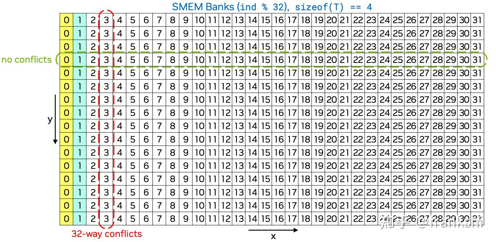

> 그림은 앞 16행만 표시. 출처: NVIDIA GTC 2024 — Advanced Performance Optimization in CUDA.

warp는 SM의 기본 실행 단위로 block 내 인접 32 스레드가 한 warp을 구성. 각 thread가 global memory에서 1원소 읽고 전치하여 shared memory에 저장하는 동작은 warp 차원에서:

- warp이 global memory에서 **연속 32 원소** 읽기(coalesced access)
- 읽은 원소를 전치하여 shared memory의 **같은 열에 쓰기**

warp 내 32 스레드가 shared memory에 쓸 때 **같은 열에 대응** → 모든 주소가 같은 bank → **32-way bank conflict**. profile 결과 shared store bank conflicts **2,032,616회**.

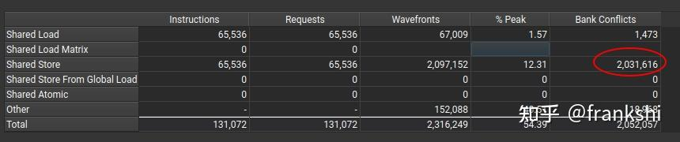

> 전치된 데이터를 shared → global에 쓸 때는 **행 단위 load** 이므로 이론상 conflict 없어야 하나, 위 캡처에는 1473회 충돌. 본 절 읽기 로직과 무관.

**2,032,616회** 계산:

- warp 32 스레드 중 첫 스레드는 충돌 안 함, 나머지 31개가 충돌 → warp당 31회
- block당 32 warp, 총 block 수 `(M*N)/(32*32) = 2048`
- 누계: `2048 × 32 × 31 = 2,031,616` (≈)

wavefronts **2,097,152** 계산:

- bank 충돌로 32 스레드 쓰기가 MIO에서 큐잉, 32회 분할 접근 — 각 접근이 wavefront 1개. 충돌 없으면 1 wavefront
- 누계: `2048 × 32 × 32 = 2,097,152`

## 3. Padding 사용

bank conflict 회피의 한 방법은 shared memory 끝에 **원소 1개 padding** 추가. 배열을 `s_data[32][33]`으로 만들면 같은 열 다른 행 원소의 bank 값이 더 이상 같지 않아 전치 시 충돌 회피.

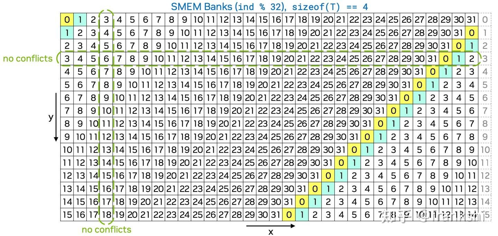

```cpp
__global__ void matrix_trans_shm_padding(int* dev_A, int M, int N, int* dev_B) {
  int row = blockIdx.y * blockDim.y + threadIdx.y;
  int col = blockIdx.x * blockDim.x + threadIdx.x;

  // 끝에 padding 추가로 bank conflict 회피
  __shared__ int s_data[32][33];

  if (row < M && col < N) {
    s_data[threadIdx.x][threadIdx.y] = dev_A[row * N + col];
    __syncthreads();
    int n_col = blockIdx.y * blockDim.y + threadIdx.x;
    int n_row = blockIdx.x * blockDim.x + threadIdx.y;
    if (n_col < M && n_row < N) {
      dev_B[n_row * M + n_col] = s_data[threadIdx.y][threadIdx.x];
    }
  }
}
```

profile 결과 shared store bank conflict 0:

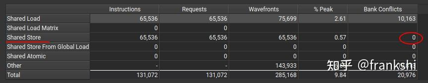

Padding 단점:

- **SM occupancy 저하 가능**. SM당 사용 가능 shared memory가 제한되므로 block당 사용량이 늘면 SM 내 동시 block 수가 줄어 자원 활용도 감소
- **주소 정렬 문제**. shared memory 접근이 벡터화일 수 있음(int4 = 16B 접근). 매 접근 주소가 16B 정렬이어야 함. `int s_data[32][33]` padding은 두 번째 행 시작 주소가 16B 비정렬 → 커널 실행 오류

## 4. swizzling 메커니즘

swizzling은 **추가 메모리 할당 없이 shared memory 데이터를 재배열**해 bank conflict를 회피하는 기법. 재배열 예:

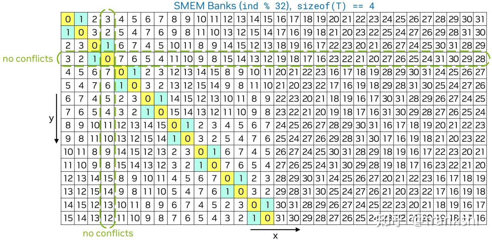

각 원소의 위치를 `(x, y)`(열, 행, 0부터 시작)로 표시. 재배열 후:

- **행 내 데이터 집합 유지**, 행 내 원소의 상대 위치만 재배열. 예: $y = 1$의 x 인덱스가 `[0, 1, 2, 3, ..., 30, 31]` → 새로 `[1, 0, 3, 2, 5, 4, ..., 31, 30]`
- 각 **행/열** 원소의 bank 값이 더 이상 동일하지 않음 → load/store 시 **충돌 회피**

### 4.1 논리 위치와 물리 위치

- **논리 위치**: 행렬에서의 논리 좌표
- **물리 위치**: 실제 데이터가 저장된 shared memory의 좌표

행렬의 2행 3열 원소를 읽는다고 할 때 `(x=3, y=2)`는 논리 위치. 실제 읽기는 shared memory의 물리 좌표 `(x=2, y=1)`에서. 매핑:

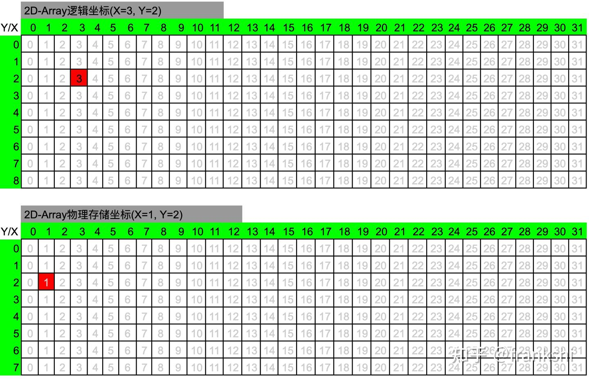

대부분의 코드에서 둘은 같지만 swizzling에서는 다르며 매핑 관계 존재:

$$(x_p, y_p) = f(x_l, y_l)$$

매핑 조건:

- **일대일 대응**(다대일 또는 일대다 X) — 데이터 손실/중복 방지
- **매핑 후 x·y 범위가 매핑 전과 일치** — 그렇지 않으면 더 큰 shared memory 필요(곱셈 같은 매핑은 일대일이지만 범위 폭증)

### 4.2 swizzling 매핑 함수

swizzling의 논리 → 물리 매핑:

- $y_p = y_l$ — **물리 행 = 논리 행**
- $x_p = x_l \oplus y_l$ — **물리 열 = 논리 행 ⊕ 논리 열**

XOR(`⊕`)는 교환·결합 법칙 외에:

- **성질 1**: $x \oplus x = 0$
- **성질 2**: $x \oplus 0 = x$
- **성질 3**: $x_1 \neq x_2$ → $x_1 \oplus x_2 \neq 0$
- **성질 4**: $x_1 \oplus x_2 \neq 0$ → $x_1 \neq x_2$

증명을 위해 추가 가정:

- **조건 1**: $x$와 $y$ 범위 동일
- **조건 2**: 0부터 시작, 최댓값이 $2^n - 1$ (예: `[0, 31]`)

실 응용에서는 두 가정이 충족되지 않을 수 있지만, 매핑 함수의 핵심 사상은 **XOR 기반**이며 시나리오(벡터화·다 phase)별 조정. 5절 사례 참고.

### 4.3 일대일 매핑

매핑 전후 행 불변이므로, **같은 행 내 다른 열이 매핑 후에도 다른 열**임을 보이면 됩니다.

가정: $(x_{l1}, y), (x_{l2}, y)$가 같은 행의 다른 열, 매핑 후 $(x_{p1}, y), (x_{p2}, y)$.

- $x_{p1} = x_{l1} \oplus y$
- $x_{p2} = x_{l2} \oplus y$
- $x_{l1} \neq x_{l2}$ → $x_{l1} \oplus x_{l2} \neq 0$

XOR하면:

$$x_{p1} \oplus x_{p2} = (x_{l1} \oplus y) \oplus (x_{l2} \oplus y) = (x_{l1} \oplus x_{l2}) \oplus 0 = x_{l1} \oplus x_{l2} \neq 0$$

성질 4로 $x_{p1} \neq x_{p2}$. 즉 **같은 행의 두 다른 논리 좌표 x는 매핑 후에도 다름**. $y = 3$ 행의 매핑 후 x 값:

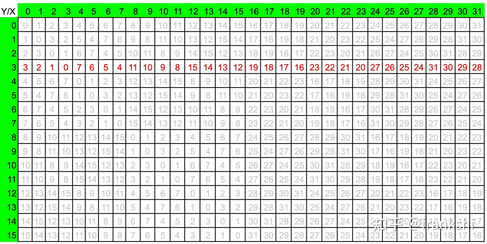

역매핑은 $x_p$에 다시 $y$를 XOR:

$$x_p \oplus y = (x_l \oplus y) \oplus y = x_l \oplus 0 = x_l$$

### 4.4 매핑 전후 범위 불변

같은 행 내 다른 열 예: 매핑 전 x 최댓값이 $2^n - 1$이면 모든 비트가 1. x·y 범위 동일이면 임의 두 수의 XOR 최댓값도 $2^n - 1$. 예: `[0, 31]` 범위에서 $y = 3$이면 **어떤 $x = 3$이 $x \oplus y = 0$**, 어떤 $x = 28$이 $x \oplus y = 31$.

매핑 후 원소가 모두 다르므로 매핑 후 범위도 0~31 분포 — **범위 불변**.

### 4.5 같은 열 다른 행이 매핑 후 다른 x 값

가정: $(x, y_{l1}), (x, y_{l2})$ — 같은 열 다른 행, 매핑 후 $(x_{p1}, y_{l1}), (x_{p2}, y_{l2})$.

$$x_{p1} \oplus x_{p2} = (x \oplus y_{l1}) \oplus (x \oplus y_{l2}) = (y_{l1} \oplus y_{l2}) \neq 0$$

→ $x_{p1} \neq x_{p2}$. **같은 열의 두 다른 논리 y는 매핑 후 다른 물리 x**. 예: $y = 3$ 행과 $x = 3$ 열의 값 시퀀스가 일치:

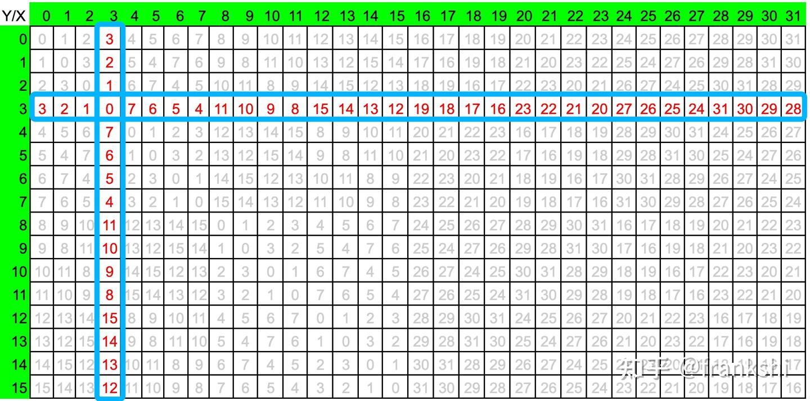

증명에서 보듯, 매핑 후 **임의의 행과 임의의 열에 모두 bank 충돌이 없습니다**.

### 4.6 swizzling 코드 응용

행렬 전치에 swizzling 적용:

```cpp
__global__ void matrix_trans_swizzling(int* dev_A, int M, int N, int* dev_B) {
  int row = blockIdx.y * blockDim.y + threadIdx.y;
  int col = blockIdx.x * blockDim.x + threadIdx.x;

  __shared__ int s_data[32][32];

  if (row < M && col < N) {
    // global에서 읽어 shared의 논리 좌표 (row=x, col=y)에 쓰는데
    // 매핑된 물리 위치는 (row=x, col=x^y)
    s_data[threadIdx.x][threadIdx.x ^ threadIdx.y] = dev_A[row * N + col];
    __syncthreads();
    int n_col = blockIdx.y * blockDim.y + threadIdx.x;
    int n_row = blockIdx.x * blockDim.x + threadIdx.y;
    if (n_row < N && n_col < M) {
      // shared의 논리 좌표 (row=y, col=x)에서 읽기
      // 매핑된 물리 저장 위치는 (row=y, col=x^y)
      dev_B[n_row * M + n_col] = s_data[threadIdx.y][threadIdx.x ^ threadIdx.y];
    }
  }
}
```

로직 정리:

- block 내 각 스레드가 global에서 1 원소 읽고, 전치 전 shared 논리 좌표는 `(x=threadIdx.x, y=threadIdx.y)`. 전치 후 저장 논리 좌표는 `(x=threadIdx.y, y=threadIdx.x)`
- warp 내 32 스레드는 `threadIdx.y` 동일, `threadIdx.x`만 다름 → shared 같은 열 다른 행 → bank conflict
- swizzling 후: 행은 `threadIdx.x` 유지, 새 열은 `threadIdx.x ^ threadIdx.y`
- 읽기도 동일 메커니즘으로 논리 → 물리 변환 후 접근

Profile:

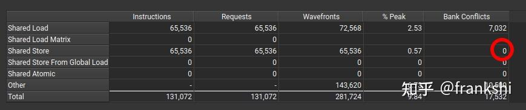

shared store bank conflict = 0. load 측은 여전히 일부 conflict가 있으나 swizzling과 무관으로 추정.

## 5. TMA의 swizzling 메커니즘

> TMA: Tensor Memory Accelerator

행렬 곱에서 메모리 접근 명령 수를 줄이려 **벡터화 접근**(int2/int4, float2/float4 등)을 자주 씁니다. 즉 한 번에 8B 또는 16B 접근. 이 경우 데이터 chunk 크기가 4B(bank 크기)와 다르므로 충돌이 여전히 존재 — **충돌 bank가 연속 분포가 아닌 간격 분포**(예: bank 0, 4, 8...). **chunk 단위로 swizzling**해 회피, 핵심은 여전히 XOR.

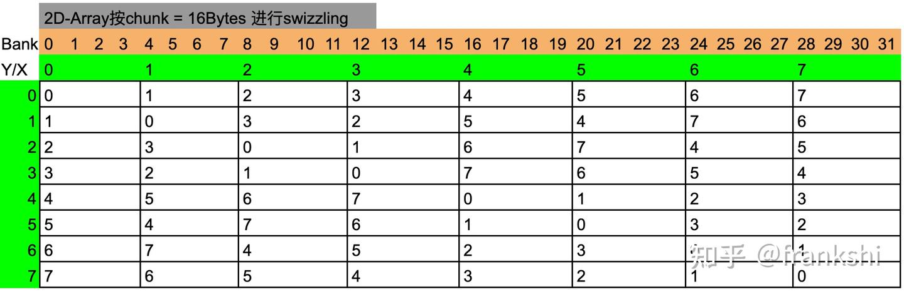

TMA swizzling 처리 과정:

- TMA는 **128B 단위 = 1 segment, 16B = 1 chunk**
- segment 내 chunk를 swizzling하여 segment 간 bank-conflict-free

TMA는 shared memory 배열이 `T array[][NX]` 형태라 가정(T는 1/2/4B 타입), 다음 충족:

- `NX × sizeof(T) == SWIZZLE_SIZE`
- **`SWIZZLE_SIZE`는 32 / 64 / 128 중 하나**

`SWIZZLE_SIZE = 128B` 가정 시, 논리 `[y][x]` → 물리 `[y_swz][x_swz]` 매핑. y는 그대로, x는:

- 16B chunk 인덱스 계산:
  - `i16 = (y * NX + x) * sizeof(T) / 16`
  - `y16 = i16 / 8`
  - `x16 = i16 % 8`
- chunk 단위 swizzling 인덱스:
  - `y16_swz = y16` — chunk 행 불변
  - `x16_swz = y16 ^ x16` — chunk 열 = 논리 행 ⊕ 논리 열
- chunk 내 x 원소 매핑:
  - chunk의 행 내 오프셋 + chunk 내 원소 오프셋
  - `x_swz = x16_swz * 16 / sizeof(T) % NX + x % (16 / sizeof(T))`

다양한 `SWIZZLE_SIZE`의 좌표 재배열 효과:

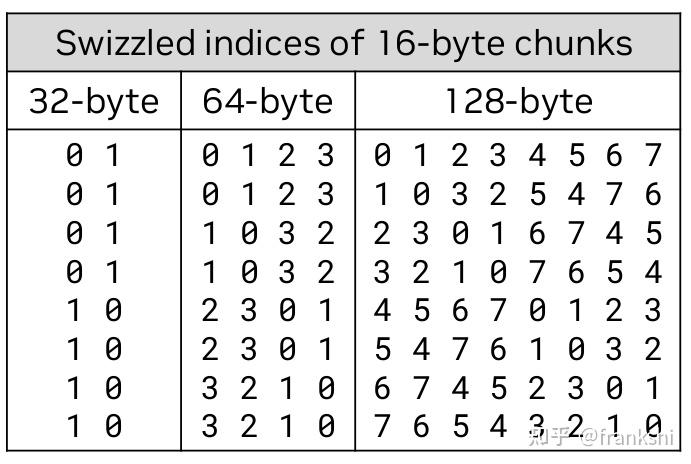

`SWIZZLE_SIZE = 128B`는 32 bank 크기에 정확히 대응 → chunk 차원 swizzling이 chunk 행을 바꾸지 않고 열만 바꿈. 그렇지 않으면 행도 바뀔 수 있음. 예: `float4 array[15][4]`, `SWIZZLE_SIZE = 64B`이면 8행 이상의 데이터에서 chunk 앞 4·뒤 4 상대 위치가 변경:

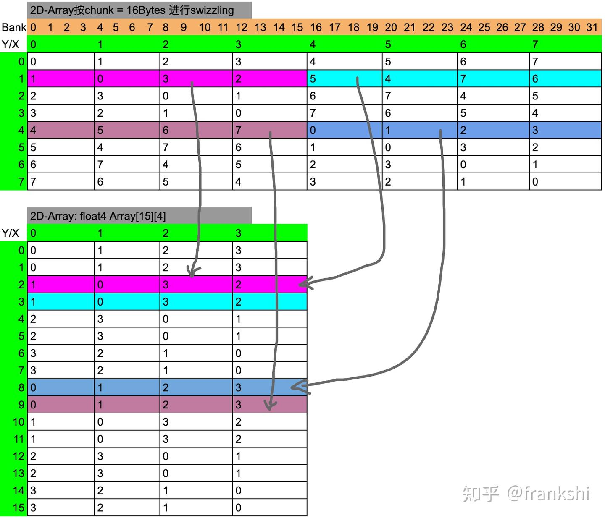

`SWIZZLE_SIZE != 128B`도 chunk 처리 로직은 유사하지만, chunk → 단일 원소 변환 시 일부 조정 필요.

## 6. CUTLASS의 swizzling 사용

CUTLASS는 Tensor Core 행렬 곱(예: `m16n8k16 fp16`)에서 **4 phase로 4개의 8×8 fp16 행렬 데이터를 shared memory → 레지스터로 로드**해야 하므로, bank conflict는 같은 phase의 8 스레드에 한정됩니다. 이 8 스레드의 shared memory 접근만 swizzling으로 처리하면 충돌 회피 가능. 자세한 내용은 자료를 참고.

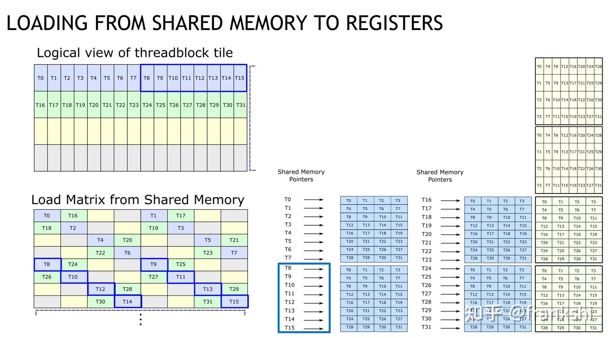

## 참고

- Advanced Performance Optimization in CUDA — NVIDIA GTC 2024
- https://www.nvidia.com/en-us/on-demand/session/gtcsj20-s21745/
- https://leimao.github.io/blog/CUDA-Shared-Memory-Swizzling/
- [CUTLASS Swizzle 메커니즘 해석 (1)](../B16_cutlass_swizzle_analysis_1/README.md)
