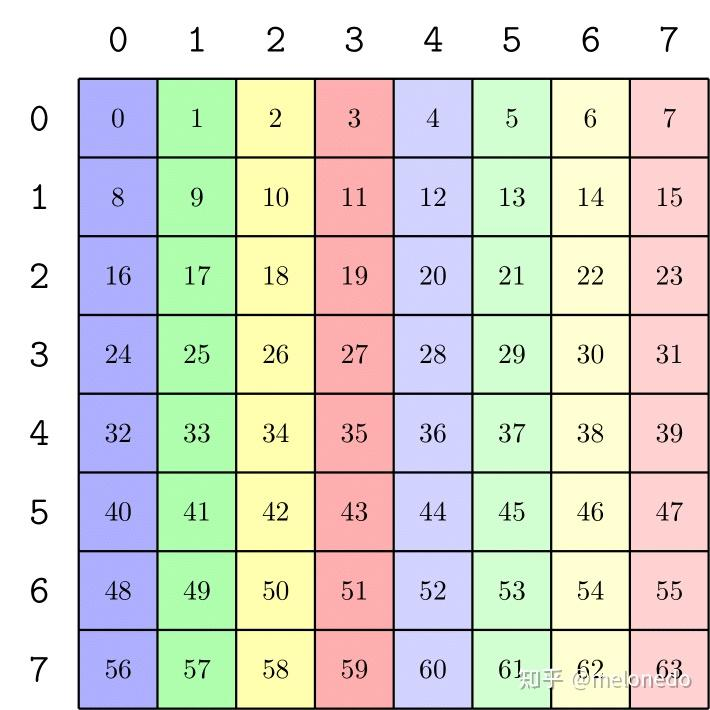
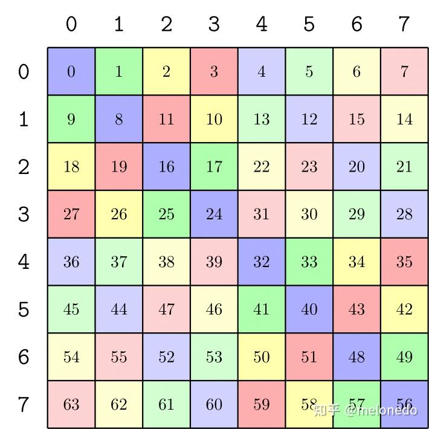
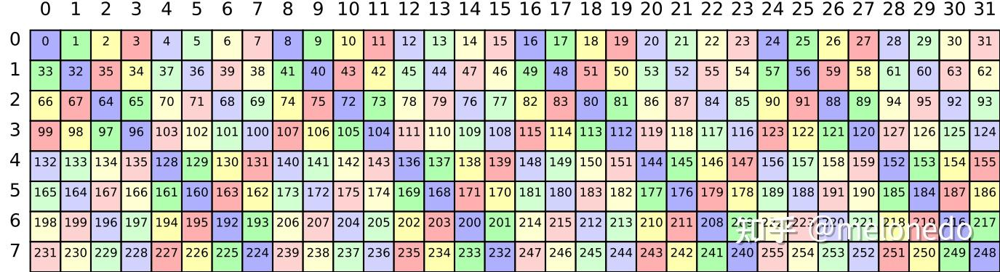
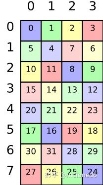
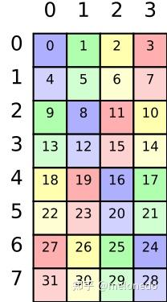
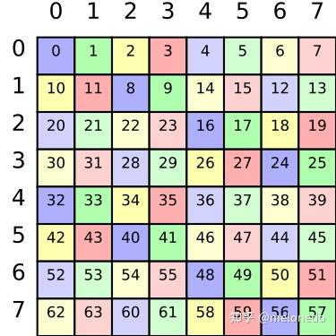
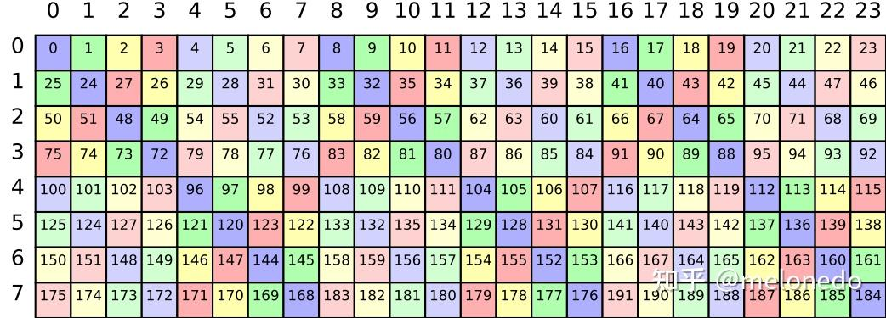
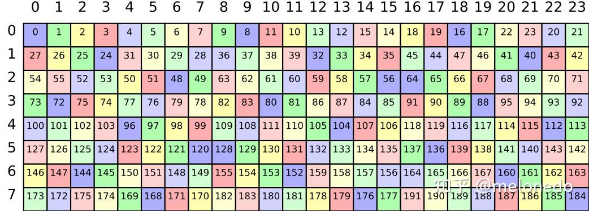
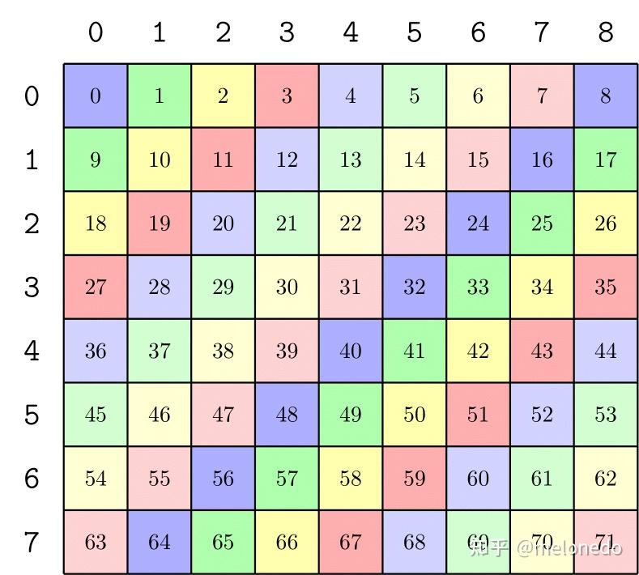
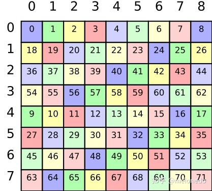

# 레이아웃 대수 실전: Swizzle 자동 추론

> 원문: https://zhuanlan.zhihu.com/p/1941306442683515068

요 며칠 GEMM을 직접 작성해보았는데, swizzle 계산에 머리가 아파서 더 이상 견딜 수 없어 swizzle 레이아웃을 자동 계산하는 C++ 라이브러리를 만들었습니다.

[GitHub - melonedo/algebraic-layouts](https://github.com/melonedo/algebraic-layouts)

## 배경

### 공유 메모리의 bank 분할

NVIDIA GPU는 유연한 공유 메모리 접근 지원을 위해 공유 메모리를 **32 bank**로 분할합니다. 매 공유 메모리 트랜잭션마다 32 bank에서 각각 1개의 32비트 데이터를 읽을 수 있습니다. 32비트 워드 단위로 인덱싱하면 bank는 **주소의 하위 5비트**로 분할되며 상위와 무관. 매 요청마다 32 bank의 임의의 내용에 접근 가능. 32는 CUDA의 한 warp 스레드 수이자 한 번에 발생할 수 있는 최대 메모리 요청 수.

한 요청의 32 주소가 32 bank에 균등 분포되지 않으면, 비둘기집 원리로 일부 bank가 여러 데이터에 대응 — **bank conflict** 발생, 여러 트랜잭션 발생 → 대역폭 낭비. 더 중요한 것은 **공유 메모리 처리량이 높지 않다**는 점. SM당 사이클당 32 bank × 4B만 읽을 수 있고(이 수치는 매우 오래된 아키텍처에서 고정), FMA 같은 계산은 신형 아키텍처에서 사이클당 128 op까지 가능.

HPC 응용에서 **공유 메모리 접근이 32비트 단위가 아닌 64·128비트 벡터화 형태**로 발생할 때, 실행 시 여전히 여러 32비트 요청으로 분할됨에 유의. 예: 32 스레드가 128비트 요청을 발생시키면 8 스레드씩 그룹으로 4번 메모리 접근(0-7, 8-15, 16-23, 24-31). 이 4 요청은 각각 독립적이며 bank 충돌이 있어도 지능적으로 결합되지 않습니다. 본 글에서는 유사 벡터화 접근 시 **한 요청** 내용을 분석합니다(이 4 메모리 접근 중 한 번). 4 요청 전체로 분석하면 같은 layout이라도 할당된 스레드 번호에 따라 다른 공유 메모리 요청이 발생해 하드웨어 접근 모드도 크게 달라집니다.

또한 한 warp 32 스레드가 **중복 주소 요청**을 할 수도 있으며, 이때는 하드웨어가 자동으로 중복 요청을 결합합니다.

### Swizzle 레이아웃

위 32 bank 제약은 유연해 보이지만 SW 구현은 단순하지 않습니다. 32 bank 분할 방식은 분명 32 스레드가 배열의 연속 32 원소에 접근하는 경우에 적합. 그러나 CUDA 프로그램에는 **비연속 접근**이 많습니다. 예: 행렬 연산 시 32 스레드가 큰 행렬의 작은 블록을 읽음 — 연속 행, 연속 열, 또는 MxN 작은 블록.

이런 복잡한 읽기 요구는 행렬 저장 layout을 단순히 바꿔서 해결할 수 없습니다. **데이터가 두 가지 다른 접근 모드를 지원**해야 하는 경우가 일반적이기 때문 — 보통 순차 연속 쓰기로 공유 메모리에 쓰지만 읽기는 쓰기와 같은 순서일 수 없음.

이 문제 해결을 위해 **특수한 주소 계산 방식**이 필요한데, 가장 범용적인 것이 **XOR 기반 swizzle 레이아웃**입니다. Swizzle은 **연속 접근**과 한 가지 특정 **불연속 접근** 모드를 지원하므로 공유 메모리 읽기·쓰기 접근 모드가 다른 대부분의 요구를 해결합니다.

CuTe의 Swizzle 정의:

```cpp
// A generic Swizzle functor
/* 0bxxxxxxxxxxxxxxxYYYxxxxxxxZZZxxxx
 *                               ^--^ MBase is the number of least-sig bits to keep constant
 *                  ^-^       ^-^     BBits is the number of bits in the mask
 *                    ^---------^     SShift is the distance to shift the YYY mask
 *                                       (pos shifts YYY to the right, neg shifts YYY to the left)
 *
 * e.g. Given
 * 0bxxxxxxxxxxxxxxxxYYxxxxxxxxxZZxxx
 * the result is
 * 0bxxxxxxxxxxxxxxxxYYxxxxxxxxxAAxxx where AA = ZZ xor YY
 */
template <int BBits, int MBase, int SShift = BBits>
struct Swizzle{/*...*/};
```

**B, M, S** 세 템플릿 파라미터로 YY를 ZZ 위치로 이동하고 XOR. 이 정의는 계산 방법만 보여줄 뿐, **swizzle이 공유 메모리 bank 충돌을 어떻게 해결하는지**는 설명하지 않습니다. 본 글은 다양한 응용 시나리오에서 적합한 swizzle 파라미터를 어떻게 계산하는지 설명합니다.

## 고전 접근 모드: 행렬 열 단위 읽기

가장 기본적인 접근 모드는 **행렬을 열 단위로 읽는 것**. 예: 8×8 행렬에서 **한 행과 한 열을 모두 효율적으로 읽는 방법**이 필요. SW상 행렬 전치가 필요한 다양한 상황에 유용.

32색 시각화는 어렵기 때문에 본 글에서는 공유 메모리를 **8 bank**로 가정. 매번 읽을 메모리는 한 공유 메모리 요청 내용에 대응하며 HW에서 추가 분할되지 않으므로, 한 트랜잭션에 모든 내용을 읽어야 합니다. 단순한 `p = row * 8 + col` layout이면 한 열의 내용이 같은 bank에 분포 → 8×8 행렬 읽기에 **8-way bank conflict**.



Swizzle 기본을 알면 이 시나리오의 계산은 매우 간단 — 열 좌표를 단순 `col`에서 `row * 8 + (row ^ col)` 또는 `p ^ (p >> 3)`로 변경(CuTe는 행·열 구분 없이 위 `p = row * 8 + col` 결과로 추가 계산). 실제 행렬 행이 8보다 클 수 있지만 `row` 중 8 초과 부분을 mod로 8행 내 문제로 정규화. 행 길이도 8이므로 완전한 주소 공식은 `p ^ ((p & (7 << 3)) >> 3)`, 대응 layout `Swizzle<3, 0, 3>`. 즉 이 경우 **B = S = log(M), M = 0**.



선형 layout 관점에서 이 layout은:

$$\begin{bmatrix} 1 & 0 & 0 & 1 & 0 & 0 \\ 0 & 1 & 0 & 0 & 1 & 0 \\ 0 & 0 & 1 & 0 & 0 & 1 \\ 0 & 0 & 0 & 1 & 0 & 0 \\ 0 & 0 & 0 & 0 & 1 & 0 \\ 0 & 0 & 0 & 0 & 0 & 1 \end{bmatrix}$$

열 단위 접근 시 뒤 3열 $\begin{bmatrix} 1 & 0 & 0 \\ 0 & 1 & 0 \\ 0 & 0 & 1 \\ 1 & 0 & 0 \\ 0 & 1 & 0 \\ 0 & 0 & 1 \end{bmatrix}$ 접근. 앞 3행이 bank 대응 비트. 앞 3행이 **행 만계수(full row rank)** 이므로 상위 비트 접근 시 bank 부분이 완전한 8 bank 공간을 spans.

## 단순 변형: 가로 확장

행 수 증가 처리에서 자연스러운 질문 — 위 접근 모드 유지하며 행렬을 가로로 늘리면? 예: 8행 32열로 늘리면? 선형 layout 또는 이진 표현으로 생각하면, 계산식은 여전히 `row ^ col`이지만 `row`에 해당하는 비트가 2칸 이동, `row`는 하위 3비트만 사용 제한. `p` 표현: `p ^ ((p & (7 << 5)) >> 5)`, `Swizzle<3, 0, 5>` 대응. 즉 **행렬 가로 확장은 S만 늘리면 됨**.



선형 layout:

$$\begin{bmatrix} 1 & 0 & 0 & 0 & 0 & 1 & 0 & 0 \\ 0 & 1 & 0 & 0 & 0 & 0 & 1 & 0 \\ 0 & 0 & 1 & 0 & 0 & 0 & 0 & 1 \\ 0 & 0 & 0 & 1 & 0 & 0 & 0 & 0 \\ 0 & 0 & 0 & 0 & 1 & 0 & 0 & 0 \\ 0 & 0 & 0 & 0 & 0 & 1 & 0 & 0 \\ 0 & 0 & 0 & 0 & 0 & 0 & 1 & 0 \\ 0 & 0 & 0 & 0 & 0 & 0 & 0 & 1 \end{bmatrix}$$

각 열 접근 시 $\begin{bmatrix} 1 & 0 & 0 \\ 0 & 1 & 0 \\ 0 & 0 & 1 \\ 0 & 0 & 0 \\ 0 & 0 & 0 \\ 1 & 0 & 0 \\ 0 & 1 & 0 \\ 0 & 0 & 1 \end{bmatrix}$ — 하위 비트는 8×8 행렬과 완전히 동일.

## 단순하지 않은 변형: 가로 축소

가로 확장이 가능하니 자연히 축소도 가능. 예: 8×4. 가로 확장 경험상 S만 줄이면 될 듯. `Swizzle<3, 0, 2>` layout:



**그러나 CuTe에서는 이를 허용하지 않습니다**. 코드에 다음 줄:

```cpp
static_assert(abs(num_shft) >= num_bits, "abs(SShift) must be more than BBits.");
```

이 제한은 layout 대수 계산 때문일 가능성. 실제로 `row * 8 + (row ^ col)` 공식을 적용하면 `row`가 2비트만 남고 한 비트는 `row` 자체의 변환. 이 layout은 `p ^ ((p & (7 << 2)) >> 3)`로만 표현 가능. 선형 layout으로 보면:

$$\begin{bmatrix} 1 & 0 & 1 & 0 & 0 \\ 0 & 1 & 0 & 1 & 0 \\ 0 & 0 & 1 & 0 & 1 \\ 0 & 0 & 0 & 1 & 0 \\ 0 & 0 & 0 & 0 & 1 \end{bmatrix}$$

한 열 접근 시 $\begin{bmatrix} 1 & 0 & 0 \\ 0 & 1 & 0 \\ 1 & 0 & 1 \\ 0 & 1 & 0 \\ 0 & 0 & 1 \end{bmatrix}$.

3열은 `row`의 첫 비트로, 5열(`row`의 3번째 비트)과 연산을 거쳤습니다. 이 XOR은 이 접근 모드에 있어도 그만 없어도 그만.

> 이 layout은 **4열 2행, 2행 4열 모두 bank conflict 없음**. 즉 2의 거듭제곱 범위 내 임의 분할 접근에 충돌 없음.

CuTe가 지원 안 하면? 위 layout을 다시 보면 **`row`의 첫 비트는 그 자체로 bank 앞 3행 범주에 속해 swizzle 연산에 참여할 필요가 없음**:

$$\begin{bmatrix} 1 & 0 & 0 & 1 & 0 \\ 0 & 1 & 0 & 0 & 1 \\ 0 & 0 & 1 & 0 & 0 \\ 0 & 0 & 0 & 1 & 0 \\ 0 & 0 & 0 & 0 & 1 \end{bmatrix}$$

한 열 접근 시 $\begin{bmatrix} 0 & 1 & 0 \\ 0 & 0 & 1 \\ 1 & 0 & 0 \\ 0 & 1 & 0 \\ 0 & 0 & 1 \end{bmatrix}$. 앞 3행 만계수 → bank conflict 없음. **행렬 가로 축소의 layout은 S 감소가 아니라 B 감소**, `Swizzle<2, 0, 3>`.



## 단순 변형: 다열 접근

흔한 시나리오로 행렬의 여러 열에 동시 접근. 예: 동시 요청 데이터량 유지하면서 한 번에 4행 2열 행렬 요청.

이는 사실 **4행 4열 행렬에서 한 번에 한 열 접근하는 것과 동등** — "열" 개념을 약간 수정. 두 행을 한 행으로 사용한다고 보고, **`Swizzle<2, 0, 2>`에 M을 늘려 `Swizzle<2, 1, 2>`** 로 변경.



대응 선형 layout은 좌상단에 1을 추가:

$$\begin{bmatrix} 1 & 0 & 0 & 0 & 0 & 0 \\ 0 & 1 & 0 & 1 & 0 & 0 \\ 0 & 0 & 1 & 0 & 1 & 0 \\ 0 & 0 & 0 & 1 & 0 & 0 \\ 0 & 0 & 0 & 0 & 1 & 0 \\ 0 & 0 & 0 & 0 & 0 & 1 \end{bmatrix}$$

열의 3번째 비트는 변화 없고 전체 접근 모드는 4행 주기.

## 실용 변형: 격행 접근

bank 1개 이상의 내용을 한 스레드에 할당하려면 구체 원소 귀속을 고려. 위 layout에서 여러 행을 한 행으로 합치면 **불연속 행 접근**. `Swizzle<2, 1, 2>`에서 **S를 늘려 `Swizzle<2, 1, 2>`** (S 증가)로 만듦.

> 원문 표기는 동일해 보이지만 실제로는 S를 늘린 형태(예: `Swizzle<2, 1, 3>` 효과). 본문은 단순히 XOR 부분이 우측으로 이동.

선형 layout은 추가된 XOR 부분이 우측으로 이동:

$$\begin{bmatrix} 1 & 0 & 0 & 0 & 0 & 0 \\ 0 & 1 & 0 & 0 & 1 & 0 \\ 0 & 0 & 1 & 0 & 0 & 1 \\ 0 & 0 & 0 & 1 & 0 & 0 \\ 0 & 0 & 0 & 0 & 1 & 0 \\ 0 & 0 & 0 & 0 & 0 & 1 \end{bmatrix}$$

## 실용 변형: 비-2의 거듭제곱

실제 행렬 크기는 HW 제약에 따라 2의 거듭제곱과 정확히 일치하기 어렵습니다. 예: 알고리즘에서 가장 적합한 행렬 크기가 **8×24**일 수 있고, 1행 8열 또는 8행 1열 접근이 여전히 필요. 어떻게? 답은 **아무것도 할 필요 없음** — 행 길이가 2의 거듭제곱일 때의 `row ^ col` 방법대로, 단 행 길이만 24로 — `row * 24 + (row ^ col)`. `p` 표현은 더 이상 어렵습니다.



그림처럼 8×8 케이스가 가로로 두 번 더 복제된 형태일 뿐.

이 경우 **8 열 부분만 신경 쓰면** 되므로 `p`로도 표현 가능: `p ^ ((p & (7 << 2)) >> 3)`. TMA가 HW Swizzle에 행 길이 제한을 두지만 실제 행 길이는 임의 정수배 가능. 32B와 96B의 Swizzle layout은 행 길이 외에 차이 없음.



## 특수 변형: 나누어떨어지지 않는 경우

가로 확장은 항상 단순하지만 가로 축소는 특수. 행 길이가 2의 거듭제곱이 아닐 때, 행 길이가 동시 접근 열 수로 나누어떨어지면 접근 모드를 가로로 복제하면 됨. 그렇지 않으면? 우선 layout:



예: 8×9 행렬에서 4행 2열 접근하려는데 `col`에 대한 XOR로는 충돌을 완전히 제거할 수 없음. 길이 막다른 길은 없음 — 한 행을 두 행으로 쓸 수 있다면 **두 행을 한 행으로 쓰는 것**도 가능 → 4×18로 보면 됨.



후 4행이 비정렬임에 주의. 필요하면 열에 오프셋을 더해 정렬 위치로 이동 가능.

## 토론

위 분석에서는 선형 layout으로 분석했지만, 실제 계산 과정은 선형 layout 없이도 유도 가능하며 계산도 복잡하지 않아 **헤더 파일로 두기에 적합**. 안타깝게도 이미 만들어진 라이브러리가 없네요. 누가 구현해 둔 곳이 있는지 모르겠습니다. Triton의 선형 layout 논문에도 한 방법이 소개되어 있지만 수학이 약해 잘 이해 못 했습니다. 누가 설명해주면 좋겠습니다.

CuTe의 Swizzle layout은 계산식 정의일 뿐이라 layout의 의미를 직접 읽어내기 어렵습니다 — Swizzle layout이 늘 매우 어렵다고 여겨지는 이유 중 하나.

마지막 "나누어떨어지지 않는 경우"는 완전성을 위해 제안했을 뿐 실제 유용한지는 모르겠습니다.

본 글의 방법은 **한 행 읽기 + MxN 분할 읽기** 두 제약만 고려했지만, 거의 모든 GEMM 요구를 매칭할 수 있습니다(물론 이 정도 요구는 TMA의 몇 가지 패턴을 적용하면 됨). 더 복잡한 경우는 swizzle 두 번을 고려하거나, 한 변환을 행 읽기로 바꾸세요. 만약 메모리 분포가 연속 읽기조차 안 되는 경우라면 layout을 바꾸는 것이 낫습니다.
