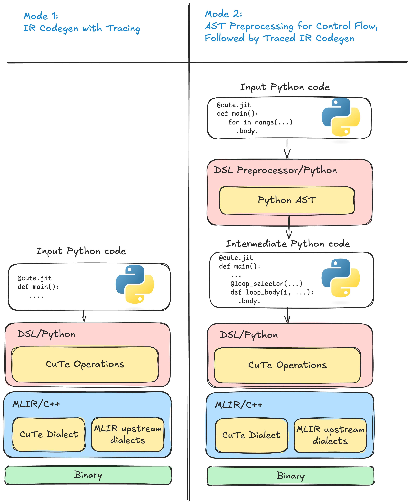

> CuTe DSL을 처음 익히는 가장 좋은 방법은 공식 문서를 살펴보는 것이다. 아래 내용은 CuTe DSL 문서에서 API가 아닌 부분을 직접 옮겨 GPT5.2로 번역·교정한 것으로, CuTe DSL 입문용 한국어 자료로 활용할 수 있다. API 이외의 문서를 한 편에 모아 CuTe DSL의 기본 개념과 설계를 빠르게 파악할 수 있도록 했으며, 상세한 API는 다음을 참고하라: https://docs.nvidia.com/cutlass/latest/media/docs/pythonDSL/cute_dsl_api.html .

# CuTe DSL 4.3.5 문서


# 개요

CUTLASS 4.x는 CUDA kernel 개발에서 "생산성"과 "성능" 사이의 간극을 좁히는 것을 목표로 한다. 강력한 CUTLASS C++ 템플릿 라이브러리에 Python 기반 DSL을 제공함으로써, NVIDIA GPU에서 고성능 선형대수 연산을 개발할 때 빠른 반복, 손쉬운 프로토타이핑, 그리고 낮은 학습 곡선을 실현한다.

전체적으로, CUTLASS DSL은 도메인 특화 언어(DSL) 패밀리로 구상되어 있다. 4.0 버전에서는 그 첫 번째로 CuTe DSL을 출시한다. CuTe DSL은 저수준(low-level) 프로그래밍 모델로, CuTe C++ 추상과 완전히 일치하며, 레이아웃(layout), 텐서(tensor), 하드웨어 원자 연산(hardware atoms) 등 핵심 개념을 노출하고 하드웨어 스레드 및 데이터 계층 구조에 대한 완전한 제어를 허용한다.

# 왜 CUTLASS DSL이 필요한가?

CUTLASS는 C++ 템플릿 추상화로 탁월한 성능을 제공하지만, 그 복잡성은 많은 개발자에게 도전 과제가 되기도 한다. CUTLASS 4.x는 이 문제를 다음과 같이 해결한다:

- **메타프로그래밍 단순화**: Python으로 메타프로그래밍하는 것이 C++보다 직관적이다

- **반복 가속**: 친숙한 Python 문법으로 빠른 프로토타이핑을 하면서 매우 빠른 컴파일 속도를 누린다

- **진입 장벽 완화**: GPU 프로그래밍 개념의 학습 곡선을 낮추고, CuTe C++와 DSL 간 개념적 일관성을 유지한다

- **성능 유지**: 생성된 코드는 최적화된 CUTLASS 기본 요소(primitives)를 재사용한다

학생들은 C++ 템플릿의 복잡성에 구애받지 않고 GPU 프로그래밍 개념을 배울 수 있다. 연구자와 성능 엔지니어는 프로덕션 수준의 구현으로 넘어가기 전에, 알고리즘을 빠르게 탐색하고, 프로토타이핑하며, kernel을 튜닝·최적화할 수 있다.

# 핵심 개념 및 방법

CUTLASS DSL은 Python 코드를 커스텀 중간 표현(IR)으로 변환한 후, MLIR과 ptxas를 이용해 런타임에 JIT 컴파일하여 최적화된 CUDA kernel을 생성한다.

## CuTe DSL의 핵심 추상

- **Layouts(레이아웃)** – 데이터가 메모리에서, 그리고 스레드 간에 어떻게 구성되는지 설명한다.

- **Tensors(텐서)** – 데이터 포인터 또는 이터레이터와 레이아웃 메타데이터를 결합한다.

- **Atoms(원자)** – 행렬 곱-덧셈(MMA)이나 메모리 복사 같은 기초 하드웨어 연산을 나타낸다.

- **Tiled Operations(분할 연산)** – atoms이 thread block 및 warp 범위에서 어떻게 적용되는지 정의한다 (예: `TiledMma`, `TiledCopy`).

CuTe 추상에 대한 자세한 내용은 CuTe C++ 라이브러리 문서(https://github.com/NVIDIA/cutlass/blob/main/media/docs/cpp/cute/00_quickstart.md)를 참고하라.

**Python 스타일의 kernel 표현**

개발자는 친숙한 Python 문법과 제어 흐름을 사용해 kernel의 로직, 데이터 이동, 연산 과정을 표현할 수 있다.

이 DSL은 간결한 Python 코드로 루프 분할(tiling), 스레드 전략, 데이터 변환을 더 쉽게 표현할 수 있게 한다.

**JIT 컴파일**

Python으로 작성된 kernel은 런타임에 MLIR 인프라와 NVIDIA의 `ptxas` 툴체인을 통해 CUDA 디바이스 코드로 컴파일되어, 빠른 반복과 인터랙티브 디버깅을 지원한다.

# CUTLASS C++와의 관계

CUTLASS DSL은 CUTLASS C++ 라이브러리나 2.x/3.x API의 대체품이 아니다. 오히려 고생산성 kernel 작성 프레임워크를 목표로 하며, CUTLASS 3.x C++ API(예: CuTe, 파이프라인(pipelines), 스케줄러(schedulers) 등)와 동일한 개념 체계를 공유한다.

- **성능**: 생성된 kernel은 성능 면에서 CUTLASS C++ kernel과 동등한 수준을 목표로 한다. 단, CUTLASS C++가 수년에 걸쳐 축적한 일부 최적화가 DSL 예제에 아직 반영되지 않았을 수 있으므로, 성능 차이가 존재할 수 있다.

- **라이브러리 형태**: CUTLASS DSL은 현재 CUTLASS C++와 같은 완전한 GEMM/Conv 자동 튜닝 프로파일러나 라이브러리 인터페이스를 제공하지 않는다. 대신 단일 kernel 인스턴스 생성 및 자동 튜닝(예: tile 크기 탐색)과, 자동 튜닝을 지원하는 딥러닝 프레임워크와의 네이티브 통합에 더 초점을 맞춘다.

# 빠른 시작

- 빠른 시작 가이드(https://docs.nvidia.com/cutlass/latest/media/docs/pythonDSL/quick_start.html) - 초기 설정 및 설치.

- CuTe DSL(https://docs.nvidia.com/cutlass/latest/media/docs/pythonDSL/cute_dsl.html) – CuTe DSL을 사용하는 일반적인 개발 흐름과 워크플로를 개괄적으로 설명한다.

- CuTe DSL API(https://docs.nvidia.com/cutlass/latest/media/docs/pythonDSL/cute_dsl_api.html) – 전체 API 문서를 참고한다.

- 제한 사항(https://docs.nvidia.com/cutlass/latest/media/docs/pythonDSL/limitations.html) – 현재 CuTe DSL의 제약 및 C++와의 차이를 파악한다.

- 자주 묻는 질문(https://docs.nvidia.com/cutlass/latest/media/docs/pythonDSL/faqs.html) – 자주 묻는 질문 및 알려진 문제.

# 현재 상태 및 로드맵
CuTe DSL은 현재 공개 베타 단계이며 활발히 개선 중이다. 시스템이 지속적으로 개선됨에 따라 인터페이스와 기능이 변경될 수 있다.

# 향후 마일스톤

- **2025년 여름** 공개 출시 예정
- 더 많은 데이터 타입과 kernel 종류에 대한 지원 확대
- 사용성 개선: 더 나은 오류 메시지, 디버그 도구, 간결해진 API
- CUTLASS의 기본 요소 및 기능과의 더 폭넓은 통합

알려진 문제와 해결 방법은 Limitations 및 FAQs를 참고하라.

# 커뮤니티 및 피드백

개발자 커뮤니티의 기여와 피드백을 환영한다!

다음과 같이 참여할 수 있다:

- GitHub Issues 페이지를 통해 버그 보고 또는 기능 요청 제출(https://github.com/NVIDIA/cutlass/issues)
- Discord의 CUTLASS 커뮤니티에 참여해 질문하고 아이디어 공유(https://discord.com/channels/1019361803752456192/1150868614921064590)
- DSL을 위한 예제, 튜토리얼, 개선 사항 기여
- 불명확하거나 누락된 문서 보고
- 더 많은 데이터 타입 또는 kernel 변형 지원 제안
- GitHub issue에 좋아요를 눌러 로드맵 기능의 우선순위 결정에 기여

CUTLASS DSL의 미래를 함께 만들어주셔서 감사하다!

# 기능 지원

CUTLASS DSL 4.0 버전은 **Python 3.12**만 지원한다. CUDA Toolkit 12.9(https://docs.nvidia.com/cuda/cuda-toolkit-release-notes/index.html)와 동일한 드라이버 요구 사항을 갖는다. 구체적으로, 드라이버 버전은 575.51.03 이상이어야 한다.

현재는 Linux x86_64만 지원한다. 향후 버전에서 더 많은 플랫폼에 대한 지원이 추가될 예정이다.

# 지원되는 MMA 연산

**NVIDIA Ampere 아키텍처:**

- FP16 / BF16 Tensor Core 명령어

**NVIDIA Hopper 아키텍처:**

- FP16 / BF16
- FP8

**NVIDIA Blackwell 아키텍처:**

- FP16 / BF16
- TF32
- I8
- F8

# 주요 제한 사항

현재의 제약 및 지원되지 않는 기능에 대해서는 Limitations(https://docs.nvidia.com/cutlass/latest/media/docs/pythonDSL/limitations.html) 섹션을 참고하라.

# 빠른 시작 가이드

CUTLASS DSL 4.0 버전은 현재 Linux와 **Python 3.12**만 지원한다. CUTLASS DSL(현재 CuTe DSL만 포함)을 설치하려면 다음 명령어를 사용하라.

## 설치

GitHub의 예제 및 코드와의 호환성을 보장하려면, 저장소의 해당 commit에 있는 requirements.txt 파일을 사용하라.

```shell
git clone https://github.com/NVIDIA/cutlass.git
pip install -r cutlass/python/CuTeDSL/requirements.txt
```

단순히 "알려진 최신 안정 버전"의 CUTLASS DSL을 사용해보고 싶다면(최신 예제/코드와 호환되지 않을 수 있음), 다음을 실행하라:

```shell
pip install nvidia-cutlass-dsl
```

`nvidia-cutlass-dsl`의 wheel에는 GPU kernel을 생성하는 데 필요한 모든 구성 요소가 포함되어 있다. CUDA Toolkit 12.9와 동일한 NVIDIA 드라이버 버전이 필요하다.

# 권장 의존성

예제를 실행하고 개발을 시작하려면 다음 설치를 권장한다:
```shell
pip install torch jupyter
```

# Jupyter Notebook 권장 Python 환경 변수

jupyter notebook 실행 시 다음 환경 변수를 설정하는 것을 권장한다.

```shell
export PYTHONUNBUFFERED=1
```

# CuTe DSL > 소개

## 개요

CuTe DSL은 수치 연산과 GPU 지향 코드를 동적으로 컴파일하기 위한 Python 기반 도메인 특화 언어(DSL)이다. 주요 목표는 다음과 같다:

- **CuTe C++와의 일관성**으로, 사용자가 하드웨어를 완전히 제어하면서 GPU kernel을 표현할 수 있다.
- **JIT 컴파일**로, host와 GPU 실행 모두를 지원한다.
- **DLPack 통합**으로, 프레임워크(PyTorch, JAX 등)와의 원활한 상호 운용이 가능하다.
- **JIT 캐싱**으로, 동일한 함수에 대한 반복 호출 시 캐시된 IR 모듈을 재사용한다.
- **네이티브 타입 및 타입 추론**으로, 보일러플레이트 코드를 줄이고 성능을 향상시킨다.
- **선택적인 저수준 제어**로, GPU 백엔드나 전용 IR dialect에 직접 접근할 수 있다.

## 데코레이터

CuTe DSL은 동적 컴파일을 통해 최적화된 코드를 생성하는 두 가지 주요 Python 데코레이터를 제공한다:

1. `@jit` — Host 측 JIT 컴파일 함수
2. `@kernel` — GPU kernel 함수

두 데코레이터 모두 `preprocessor`를 선택적으로 활성화할 수 있으며, 이는 Python 제어 흐름(루프, 조건 분기)을 저수준 IR이 소비할 수 있는 연산으로 자동 전개한다.

### `@jit`

JIT 컴파일 함수를 선언하며, Python에서 호출하거나 다른 CuTe DSL 함수 내에서 호출할 수 있다.

#### 데코레이터 인자

- `preprocessor`:
  - `True`(기본값) — Python 제어 흐름(예: 루프, if 문)을 IR 연산으로 자동 변환한다.
  - `False` — 자동 전개를 수행하지 않는다. Python 제어 흐름은 수동으로 처리하거나 사용을 피해야 한다.

#### 호출 측 인자

- `no_cache`:
  - `True` — JIT 캐시를 비활성화하고, 매 호출마다 강제로 재컴파일한다.
  - `False`(기본값) — 캐시를 활성화하여 이후 호출을 빠르게 한다.


### `@kernel`

GPU kernel 함수를 정의하며, 동적 컴파일을 통해 전용 GPU 심볼을 생성한다.

#### 데코레이터 인자:

- `preprocessor`:
    - `True`(기본값) — Python 루프/if를 GPU 호환 IR 연산으로 자동 전개한다.
    - `False` — 수동 구현이나 더 단순한 kernel 구현을 기대한다.


#### Kernel 실행 인자

- `grid`: 정수 리스트로 grid 크기를 지정한다.
- `block`: 정수 리스트로 block 크기를 지정한다.
- `cluster`: 정수 리스트로 cluster 크기를 지정한다.
- `smem`: 정수(바이트 수)로 shared memory 크기를 지정한다.

## 호출 규약

| 호출자 | 피호출자 | 허용 여부 | 컴파일/런타임 |
| --- | --- | --- | --- |
| Python function | `@jit` | Yes | DSL runtime |
| Python function | `@kernel` | No | N/A (오류 발생) |
| `@jit` | `@jit` | Yes | 컴파일 타임 호출, 인라인 처리 |
| `@jit` | Python function | Yes | 컴파일 타임 호출, 인라인 처리 |
| `@jit` | `@kernel` | Yes | GPU 드라이버 또는 런타임을 통한 동적 호출 |
 | `@kernel` | `@jit` | Yes | 컴파일 타임 호출, 인라인 처리 |
 | `@kernel` | Python function | Yes | 컴파일 타임 호출, 인라인 처리 |
 | `@kernel` | `@kernel` | No | N/A (오류 발생) |
 
 

# E2E 코드 생성

## 1. Python을 중간 표현(IR)으로 변환하는 기술

### 1.1 AST 재작성

함수의 추상 구문 트리(AST)는 **실행 전에** 분석된다. Python 제어 흐름(`for`/`while`, `if`/`else`)과 내장 함수는 구조화된 중간 표현(IR) 구성으로 변환된다. 각 영역 내부의 연산은 이 단계에서 변환되지 않고 유지된다.

**장점**

- 전체 프로그램을 볼 수 있으므로 모든 분기와 루프를 보존할 수 있다.
- 루프 구조를 온전히 유지하여 분할(tiling), 벡터화(vectorisation), GPU 스레드 매핑 등의 최적화에 유리하다.

**단점**

- 재작성기가 이해할 수 있는, 잘 정의된 Python 부분 집합이 필요하다.

### 1.2 Tracing(추적)

데코레이팅된 함수가 프록시 인자로 한 번 실행된다. 오버로드된 연산자가 실제 실행된 모든 텐서 연산을 기록하여 평탄한 trace를 생성하고, 이후 이를 중간 표현(IR)으로 lower한다.

**장점**

- 컴파일 지연이 거의 없어 직선형(straight-line) 산술 연산에 매우 적합하다.
- Python 소스 코드를 파싱할 필요가 없으므로 많은 동적 Python 기능을 지원한다(Python의 동적 특성은 매우 다양하다).

**단점**

- 실행되지 않은 분기는 "사라져" 버리므로, 다른 입력에 대해 생성된 kernel이 올바르지 않을 수 있다.
- 루프는 tracing 시 관찰된 반복 횟수로 평탄화된다.
- 데이터 의존적 제어 흐름은 trace 시의 단일 경로로 고정된다.

## 2. CuTe DSL의 코드 생성 모드
CuTe의 Python 프론트엔드는 위 기술들을 두 가지 상호 배타적인 모드로 결합하며, `@jit` 데코레이터의 `preprocessor` 플래그로 선택한다:

1. Tracing 모드 `@jit(preprocess=False)` — tracing만 수행한다. 컴파일 경로가 가장 빠른 방식으로, 직선형 산술 연산임을 보장할 수 있는 kernel에만 권장한다. 앞 절에서 설명한 tracing의 한계를 그대로 가진다.
2. 전처리기 모드(**기본값**) `@jit(preprocess=True)` — **AST 재작성 + tracing**. AST 단계에서 모든 루프와 분기를 포착하여 순수 tracing의 정확성 및 최적화 문제를 방지하고, 이후 tracing이 산술 연산을 처리한다. 이 혼합 "전처리기(preprocessor)" 파이프라인은 CuTe DSL 고유의 방식으로, 앞서 언급한 단점을 극복하기 위해 특별히 설계되었다.
 
 
 
 
 그림 1: 왼쪽: tracing 모드는 실제로 실행된 경로만 기록한다. 오른쪽: 전처리기 모드는 산술을 tracing하기 전에 모든 분기와 루프에 대해 구조화된 중간 표현(IR)을 생성한다.
 
 ## 왜 Tracing만으로는 제어 흐름을 처리하기 부족한가
 
- **분기 손실** — `if`/`else`에서 실행되지 않은 쪽은 lower되지 않는다.
 - **루프가 "전개/평탄화"됨** — 루프가 tracing 시 관찰된 반복 횟수로 압축되어, 병렬 매핑과 분할(tiling)에 필요한 구조가 파괴된다.
 - **데이터 의존적 경로가 고정됨** — 텐서 값에 의존하는 제어 흐름이 trace 시 단일 경로로 고정된다.
 
 전처리기 모드는 "먼저 제어 흐름을 lower한 뒤 산술 연산을 tracer에 맡기는" 방식으로 위 문제를 해결한다.
 
 

# 제어 흐름

## 개요

CuTe DSL은 Python의 AST를 순회하며 각 제어 흐름 구조를 구조화된 중간 표현(IR)으로 변환한다. 따라서 일반적인 Python처럼 루프와 분기를 작성하면 컴파일러가 구문 단위로 다음을 결정한다:

- 네이티브 Python 제어 흐름이면 **컴파일 타임에 평가(evaluate at compile time)**하거나,
- 제어 흐름이 동적으로 표시된 경우 **중간 표현(IR)을 생성(emit intermediate representation)**한다.

IR 값을 네이티브 Python 제어 흐름에 전달하면 오류가 발생한다.

전체 파이프라인에 대한 고수준 논의는 code-generation overview(https://docs.nvidia.com/cutlass/latest/media/docs/pythonDSL/cute_dsl_general/dsl_code_generation.html)를 참고하라.

## for 루프

CuTe DSL은 `for` 루프에서 세 가지 range를 인식한다:

- `range` — Python 내장 함수로, 항상 중간 표현(IR)으로 lower된다
- `cutlass.range` — Python 내장 `range`와 유사하지만 더 고급의 전개(unrolling) 및 파이프라인(pipelining) 제어를 지원한다
- `cutlass.range_constexpr` — 컴파일 타임에 전개(unrolled at compile time)된다

### `range(...)` / `cutlass.range(...)`

입력이 Python 값인지 여부에 관계없이 생성된 중간 표현(IR)에서 루프 구조를 유지하고자 할 때 사용한다.

### `cutlass.range_constexpr(...)`

Python 인터프리터에서 실행되며, 코드 생성 전에 완전히 전개된다. 모든 루프 인덱스는 `Constexpr`(컴파일 타임 Python 값)이어야 한다.

예제:

```python
@cute.jit
def control_flow_examples(bound: cutlass.Int32):
    n = 10

    # ✅ Python 루프로, 컴파일 타임에 평가된다.
    for i in cutlass.range_constexpr(n):
        cute.printf("%d\\n", i)

    # ✅ 동적 루프로, bound가 Python 값이어도 동적이다.
    for i in range(n):
        cute.printf("%d\\n", i)

    # ❌ 루프 상한이 동적 값이므로 Python 루프에 사용할 수 없다.
    # `range`를 사용해야 한다.
    for i in cutlass.range_constexpr(bound):
        cute.printf("%d\\n", i)

    # ✅ 동적 루프로, IR 루프를 생성한다.
    for i in range(bound):
        cute.printf("%d\\n", i)

    # ✅ 동적 루프로, 전개(unrolling)가 적용된 IR 루프를 생성한다
    for i in cutlass.range(bound, unroll=2):
        cute.printf("%d\\n", i)
```

## 소프트웨어 파이프라인(Software Pipelining)

소프트웨어 파이프라인은 루프를 최적화하는 기법이다. 일반적으로 프리페치(prefetch) 루프와 주 루프를 별도로 작성해야 한다.

```python
@cute.jit
def example():
    ...
    # 링 버퍼(ring buffer) 생성
    buffer = ...

    # 프리페치 루프
    for i in range(prefetch_stages):
        cute.copy(atom, gmem[i], buffer[i], ...)

    # 주 루프
    for i in range(bound):
        if i + prefetch_stages < bound:
            cute.copy(atom, gmem[i + prefetch_stages], buffer[(i + prefetch_stages) % total_stages], ...)

        use(buffer[i % total_stages])

    ...
```

이 코드는 작성과 튜닝이 번거로울 수 있다. CuTe DSL은 루프 속성을 제공하여 컴파일러가 이 작업을 대신 처리하도록 한다.

```python
@cute.jit
def example():
    ...
    # 링 버퍼 생성
    buffer = ...

    for i in cutlass.range(bound, prefetch_stages=prefetch_stages):
        # 컴파일러가 파이프라인을 자동으로 처리한다:
        # - 초기 단계를 위한 프리페치 루프 생성
        # - 주 루프에서 현재 데이터를 사용하면서 미래 데이터를 프리페치
        cute.copy(atom, gmem[i], buffer[i % total_stages], ...)
        use(buffer[i % total_stages])  # 이전 몇 번의 반복에서 프리페치된 데이터를 사용

    ...
```

컴파일러는 `prefetch_stages` 횟수만큼 반복하는 프리페치 루프와 그에 대응하는 주 루프를 자동으로 생성한다.

이 기능은 아직 실험 단계이며, sm90 이상 아키텍처만 지원한다.

## If-Else 문

표준 Python의 `if`/`elif`/`else`를 지원한다.

- **주석이 없는 조건(predicate)** → 중간 표현(IR)으로 lower된다.
- **`cutlass.const_expr`으로 주석된 조건** → 컴파일 타임에 평가된다.

예제:

```python
@cute.jit
def main(const_var: cutlass.Constexpr, dynamic_var: cutlass.Int32):
    # ✅ Python 분기로, 컴파일 타임에 평가된다.
    if cutlass.const_expr(const_var):
        cute.printf("Const branch\n")
    else:
        cute.printf("Const else\n")

    # ✅ 동적 분기로, IR 분기를 생성한다.
    if dynamic_var == 10:
        cute.printf("Dynamic True\n")
    else:
        cute.printf("Dynamic False\n")

    # ❌ 동적 값을 `cutlass.const_expr`에 사용하는 것은 허용되지 않는다.
    if cutlass.const_expr(dynamic_var == 10):
        cute.printf("Bound is 10\n")
```

## While 루프

표준 Python의 `while`을 지원한다.

- **주석이 없는 조건(condition)** → 중간 표현(IR)으로 lower된다.
- **`cutlass.const_expr`으로 주석된 조건** → 컴파일 타임에 평가된다.

예제:

```python
@cute.jit
def main(dynamic_var: cutlass.Int32):
    n = 0

    # ✅ Python while 루프로, 컴파일 타임에 평가된다.
    while cutlass.const_expr(n < 10):
        cute.printf("Const branch\n")
        n += 1

    # ✅ 동적 while 루프로, IR while 루프를 생성한다.
    while dynamic_var == 10:
        cute.printf("Dynamic True\n")
        n += 1

    # ❌ 동적 값을 `cutlass.const_expr`에 사용하는 것은 허용되지 않는다.
    while cutlass.const_expr(n < dynamic_var):
        n += 1
```

## 컴파일 타임 메타프로그래밍(Compile-Time Metaprogramming)

컴파일 타임 구성과 일반 CuTe DSL 코드를 혼합 사용하면, 런타임 오버헤드 없이 특화(specialised)된 kernel을 생성할 수 있다. 예를 들어, 컴파일 타임 플래그로 선택적 ReLU epilogue를 활성화/비활성화할 수 있다:

```python
@cute.kernel
def gemm(..., do_relu: cutlass.Constexpr):
    # GEMM 본체 연산
    ...

    if cutlass.const_expr(do_relu):  # 컴파일 타임 guard
        # do_relu가 True일 때만 ReLU 코드가 생성된다
        ...
```

```python
gemm(..., False)  # 생성된 |IR|에서 ReLU가 생략됨
gemm(..., True)   # 생성된 |IR|에서 ReLU가 포함됨
```

## 동적 제어 흐름의 제한

- 현재 제어 흐름 블록 내에서의 조기 종료는 지원하지 않는다: `break`, `continue`, `pass`, 또는 제어 흐름 블록 내에서의 예외 발생.
- 제어 흐름 블록 내의 연산은 해당 영역에서 tracing이 활성화된 경우에만 trace된다.
- 제어 흐름 블록 내에서 생성된 값은 제어 흐름 외부에서 사용할 수 없다.
- 제어 흐름 블록 내에서 변수 타입을 변경하는 것은 허용되지 않는다.

**예제**:

```python
@cute.jit
def control_flow_negative_examples(predicate: cutlass.Boolean):
    n = 10

    # ❌ 이 루프는 동적이므로 조기 종료가 허용되지 않는다.
    for i in range(n):
        if i == 5:
            break  # 조기 종료

    if predicate:
        val = 10

    # ❌ 제어 흐름 블록 내에서 return하는 것은 허용되지 않는다.
    return

    # ❌ 제어 흐름 블록 내에서 예외를 발생시키는 것은 허용되지 않는다.
    raise ValueError("This is not allowed")

    # ❌ 제어 흐름 블록 내에서 pass를 사용하는 것은 허용되지 않는다.
    pass

    # ❌ val은 동적 if 외부에서 사용할 수 없다
    cute.printf("%d\n", val)

    if predicate:
        # ❌ 제어 흐름 블록 내에서 변수 타입을 변경하는 것은 허용되지 않는다.
        n = 10.0
```

# JIT 함수 인자 생성

## 개요

`@jit` 또는 `@kernel` 데코레이터를 사용해 JIT 컴파일 함수를 정의할 때, 함수의 인자가 trace되어 해당 JIT 함수의 시그니처(signature)가 결정된다. CuTe DSL은 더 Pythonic한 방식을 제공하여, 일반 Python을 작성하듯 JIT 함수의 인자 선언을 작성하면 나머지는 CuTe DSL이 자동으로 처리한다.

구체적으로, CuTe DSL은 JIT 함수 인자 생성 시 다음 규칙을 따른다:

- 기본적으로 JIT 함수 인자는 **동적 인자(dynamic arguments)**로 간주된다.
- 인자가 명시적으로 `cutlass.Constexpr`으로 타입 어노테이션되면 **컴파일 타임 상수(compile-time constant)**로 취급된다.
- 타입 어노테이션이 제공된 경우, CuTe DSL은 컴파일 타임에 인자 타입을 검증하여 **타입 안전성(type safety)**을 보장한다.
- CuTe DSL은 런타임에 검사 가능한 프로토콜(`JitArgument` 및 `DynamicExpression`)을 제공하여, 커스텀 타입에 대한 JIT 함수 인자를 생성한다.

이하 각 항목에 대해 더 자세히 설명한다.

## 정적 인자 vs. 동적 인자

CuTe DSL은 JIT 함수의 정적 인자와 동적 인자를 지원한다.

1. **정적 인자**는 컴파일 타임에 이미 알려진 값을 저장한다. 생성된 JIT 함수 시그니처에 포함되지 않는다.
2. **동적 인자**는 런타임에만 알 수 있는 값을 저장한다.

기본적으로 CuTe DSL은 인자를 동적 인자로 가정하고, 호출 지점(call-site)의 실제 인자 타입을 기반으로 형식 인자의 타입을 추론한다. 타입 어노테이션 `cutlass.Constexpr`을 명시적으로 사용하여 인자를 정적 인자로 지정할 수도 있다.

예제:

```python
import cutlass
import cutlass.cute as cute


@cute.jit
def foo(x: cutlass.Int32, y: cutlass.Constexpr):
    print("x = ", x)      # 출력: x = ?
    print("y = ", y)      # 출력: y = 2
    cute.printf("x: {}", x)  # 출력: x: 2
    cute.printf("y: {}", y)  # 출력: y: 2


foo(2, 2)
```

위 예제에서 `x`는 타입이 `cutlass.Int32`인 동적 인자이고, `y`는 정적 인자이다.

`cutlass.Constexpr` 어노테이션을 활용하여 JIT kernel에서 정적 인자를 사용하는 더 복잡한 예시는 다음과 같다:

```python
import cutlass
import cutlass.cute as cute


@cute.kernel
def kernel(
    self,
    tiled_mma: cute.TiledMma,
    tma_atom_a: cute.CopyAtom,
    mA_mk1: cute.Tensor,
    tma_atom_b: cute.CopyAtom,
    mB_nk1: cute.Tensor,
    tma_atom_c: Optional[cute.CopyAtom],
    mC_mn1: cute.Tensor,
    cluster_layout_vmnk: cute.Layout,
    a_smem_layout_staged: cute.ComposedLayout,
    b_smem_layout_staged: cute.ComposedLayout,
    c_smem_layout_staged: Union[cute.Layout, cute.ComposedLayout, None],
    epi_tile: cute.Tile,
    epilogue_op: cutlass.Constexpr,
):
    ...
    # 누산기에 epilogue 연산을 수행하고 C의 데이터 타입으로 변환
    acc_vec = tTR_rAcc.load()
    acc_vec = epilogue_op(acc_vec.to(self.c_dtype))
    tTR_rC.store(acc_vec)
```

이 예제에서 `epilogue_op`는 JIT kernel의 정적 인자로, epilogue 융합(fusion)에 사용된다. kernel을 호출할 때 원소별(elementwise) 람다 함수를 `epilogue_op`로 전달할 수 있다. 예를 들어, epilogue 융합에서 ReLU를 적용하려면 `epilogue_op`를 `lambda x: cute.where(x > 0, x, cute.full_like(x, 0))`로 설정하면 된다.

전체 예제는 Blackwell dense GEMM 예제(github.com/NVIDIA/cutlass/tree/main/examples/python/CuTeDSL/blackwell/dense_gemm_persistent.py
)를 참고하라.

## 타입 안전성

CuTe DSL은 JIT 함수 시그니처의 타입 어노테이션을 활용하여, 컴파일 타임에 JIT 함수 인자 타입을 검증해 **타입 안전성(type safety)**을 보장한다.

```python
import cutlass
import cutlass.cute as cute
import numpy as np


@cute.jit
def foo(x: cute.Tensor, y: cutlass.Float16):
    ...


a = np.random.randn(10, 10).astype(np.float16)
b = 32

foo(a, b)
foo(b, a)  # 타입 불일치로 인해 컴파일 타임에 실패한다
```

타입 안전성 검사는 컴파일 타임에 일찍 타입 불일치 문제를 포착하고 명확한 오류 메시지를 제공함으로써, 추적하기 더 어렵고 일반적으로 디버깅 비용이 더 높은 런타임 오류를 방지한다. 위 예제에서 두 번째 `foo` 호출은 타입 불일치로 인해 컴파일 타임에 실패하며, 명확한 오류 메시지가 출력된다:

```python
cutlass.base_dsl.common.DSLRuntimeError: DSLRuntimeError: expects argument #1 (a) to be <class 'cutlass.cute.typing.Tensor'>, but got <class 'int'>
```

## 커스텀 타입을 위한 JIT 함수 인자 지원

CuTe DSL은 런타임에 검사 가능한 두 가지 프로토콜을 제공하여, JIT 함수 인자에 커스텀 타입을 사용할 수 있도록 지원한다:

- `JitArgument`: Python에서 호출되는 host 측 JIT 함수에 사용한다.
  - `__c_pointers__`: 현재 객체에 대한 ctypes 포인터 리스트를 생성한다.
  - `__get_mlir_types__`: 현재 객체에 대한 MLIR 타입 리스트를 생성한다.
  - `__new_from_mlir_values__`: MLIR 값으로부터 새 객체를 생성한다.
- `DynamicExpression`: host 측 JIT 함수 내에서 호출되는 device 측 JIT 함수에 사용한다.
  - `__extract_mlir_values__`: 현재 객체에 대한 동적 표현식(dynamic expression)을 생성한다.
  - `__new_from_mlir_values__`: MLIR 값으로부터 새 객체를 생성한다.

이 프로토콜 API에 대한 자세한 내용은 `typing.py`(https://github.com/NVIDIA/cutlass/tree/main/python/CuTeDSL/base_dsl/typing.py)를 참고하라.

다양한 커스텀 타입 사용 시나리오에 대해, CuTe DSL은 커스텀 타입을 JIT 함수 인자로 연결하는 더 편리한 방법을 제공한다.

### 1. 커스텀 타입에서 프로토콜 직접 구현

한 가지 방법은 커스텀 타입에 프로토콜 메서드를 직접 구현하여 프로토콜 기반의 JIT 함수 인자 생성을 활성화하는 것이다.

```python
import cutlass
import cutlass.cute as cute


# DynamicExpression 프로토콜을 구현하는 커스텀 타입
class MyDynamicExpression:
    def __init__(self, tensor, offset):
        self._tensor = tensor  # 동적 인자
        self._offset = offset  # 동적 인자

    def __extract_mlir_values__(self):
        return (
            self._tensor.__extract_mlir_values__(),
            self._offset.__extract_mlir_values__(),
        )

    def __new_from_mlir_values__(self, values):
        return MyDynamicExpression(values[0], values[1])


@cute.kernel
def my_kernel(x: MyDynamicExpression):
    ...
```

위 예제에서 `MyDynamicExpression`은 `DynamicExpression` 프로토콜을 구현하므로, CuTe DSL이 이 프로토콜 메서드를 기반으로 JIT kernel `my_kernel`에 대한 JIT 함수 인자를 생성한다.

### 2. 어댑터(Adaptor) 기반 프로토콜 구현(커스텀 타입용)

커스텀 타입을 직접 수정하여 프로토콜을 구현하기 어려운 경우, CuTe DSL은 어댑터(adaptor) 기반 방식을 제공하여 커스텀 타입을 JIT 함수 인자 생성에 적합한 형태로 변환한다.

JIT 함수 인자 어댑터는 등록된 커스텀 타입에 대해 필요한 프로토콜 메서드를 구현하는 호출 가능 객체이다. 이를 통해 CuTe DSL이 JIT 인자 어댑터 레지스트리를 자동으로 조회하여, 지정된 커스텀 타입에 대한 JIT 함수 인자를 생성한다.

```python
@cutlass.register_jit_arg_adapter(MyFrameworkObject)
class MyFrameworkObjectAdapter:
    """
    서드파티 프레임워크 객체를 JitArgument 프로토콜을 따르는 JIT 함수 인자로 변환
    """

    def __init__(self, arg):
        self._arg = arg

    def __c_pointers__(self):
        # C-ABI 인터페이스를 통해 프레임워크 객체를 C-ABI 호환 객체로 변환
        return [self._arg.get_cabi_pointer()]

    def __get_mlir_types__(self):
        # 이 프레임워크 객체가 나타내는 MLIR 타입 리스트를 반환
        return [self._arg.get_data().mlir_type]

    def __new_from_mlir_values__(self, values):
        # MLIR 값을 프레임워크 객체로 다시 변환
        return MyFrameworkObject(values[0])
```

이 예제에서 `MyFrameworkObjectAdapter`는 CuTe DSL과 서드파티 프레임워크 타입 `MyFrameworkObject`를 연결하는 어댑터 클래스를 구현한다. 등록 방법도 간단하다: 어댑터를 `cutlass.register_jit_arg_adapter`로 데코레이트하고 적용할 커스텀 타입을 지정하면 된다. 등록이 완료되면 CuTe DSL은 `MyFrameworkObject` 타입의 인자에 대해 자동으로 해당 어댑터를 사용하여 JIT 함수 인자를 생성한다.

# 정적 레이아웃 vs. 동적 레이아웃

## 정적 레이아웃

주류 딥러닝 프레임워크와 통합할 때 흔히 발생하는 문제는 변환된 `cute.Tensor`의 레이아웃을 어떻게 처리하느냐이다. 예를 들어 `torch.Tensor`를 `cute.Tensor`로 변환하면, `torch.Tensor`의 shape이 `cute.Tensor`의 레이아웃에 반영된다.

```python
import torch
import cutlass
from cutlass.cute.runtime import from_dlpack

@cute.jit
def foo(tensor):
    print(f"tensor.layout: {tensor.layout}")  # 컴파일 타임에 텐서의 레이아웃을 출력
    cute.printf("tensor: {}", tensor)         # 런타임에 텐서의 값을 출력
```

이 예제에서는 `cute.Tensor`를 입력으로 받아 레이아웃을 출력하는 JIT 함수 `foo`를 정의한다. 컴파일 타임에 레이아웃을 출력하기 위해 Python의 `print`를 사용한다. 컴파일 타임에 이미 알려진 정적 레이아웃의 경우 이 방법이 유효하다.

이제 다른 shape의 `torch.Tensor` 입력으로 JIT 함수 `foo`를 실행해보자.

```python
a = torch.tensor([1, 2, 3], dtype=torch.uint16)
a_pack = from_dlpack(a)
compiled_func = cute.compile(foo, a_pack)
compiled_func(a_pack)
```

여기서는 먼저 `from_dlpack`으로 요소 3개짜리 1차원 `torch.Tensor`를 `cute.Tensor`로 변환한다. 그런 다음 변환된 `cute.Tensor`로 JIT 함수 `foo`를 컴파일하고 컴파일된 함수를 호출한다.

```python
tensor.layout: (3):(1)
tensor: raw_ptr(0x00000000079e5100: i16, generic, align<2>) o (3):(1) = (1, 2, 3)
```

레이아웃이 `(3):(1)`로 출력되는 것을 볼 수 있다. 변환된 `cute.Tensor`의 정적 레이아웃 shape이 `(3)`으로, `a`의 shape과 일치하기 때문이다.

다른 shape의 `torch.Tensor`로 이미 컴파일된 함수를 호출하면, 타입(더 정확히는 레이아웃) 불일치로 인해 런타임에 예상치 못한 결과가 발생한다: `compiled_func`은 레이아웃이 `(3):(1)`인 `cute.Tensor`를 기대하지만, `b`의 shape은 `(5)`이다.

```python
b = torch.tensor([11, 12, 13, 14, 15], dtype=torch.uint16)
b_pack = from_dlpack(b)
compiled_func(b_pack)  # ❌ 타입 불일치로 런타임에 예상치 못한 결과 발생
```

타입 불일치로 인해 출력이 예상치 못한 결과를 보이며, 아래와 같이 나타난다:

```python
tensor: raw_ptr(0x00000000344804c0: i16, generic, align<2>) o (3):(1) =
(11, 12, 13)
```

이 문제를 해결하려면 `b`의 새로운 shape에 맞춰 새로운 코드 생성과 컴파일을 트리거해야 한다.

```python
compiled_func_2 = cute.compile(foo, b_pack)  # 새로운 컴파일이 트리거됨
compiled_func_2(b_pack)                      # ✅ 이제 정상적으로 작동
```

위와 같이, 새로 컴파일된 `compiled_func_2`를 사용하면 `b_pack`을 컴파일된 JIT 함수 `compiled_func_2`에 전달할 수 있다.

```python
tensor.layout: (5):(1)
tensor: raw_ptr(0x0000000034bb2840:: i16, generic, align<2>) o (5):(1) =
(11, 12, 13, 14, 15)
```

이제 재컴파일되어 `b`의 값을 올바르게 출력한다.

분명히, 다른 정적 레이아웃에 대해서는 다른 버전의 코드를 생성하고 컴파일해야 한다: 이 예제에서는 레이아웃 `(3):(1)`에 대한 것과 레이아웃 `(5):(1)`에 대한 것, 두 가지가 필요하다.

## 동적 레이아웃

다른 shape의 `torch.Tensor` 입력에 대해 반복적인 코드 생성과 컴파일을 피하기 위해, CuTe DSL은 동적 레이아웃(dynamic layout)을 사용하여 JIT 함수를 생성·컴파일하는 방법을 제공한다.

`cute.Tensor`의 동적 레이아웃을 얻으려면 `torch.Tensor` 객체를 JIT 함수에 직접 전달하면 된다. 이는 CuTe DSL에게 변환된 `cute.Tensor`의 주 차원(leading dimension)에 대해 자동으로 `cute.mark_layout_dynamic`을 호출하도록 지시한다.

```python
import torch
import cutlass
from cutlass.cute.runtime import from_dlpack

@cute.jit
def foo(tensor):
    print(tensor.layout)  # 동적 레이아웃의 경우 (?,?):(?,1)을 출력

a = torch.tensor([[1, 2], [3, 4]], dtype=torch.uint16)
compiled_func = cute.compile(foo, a)
compiled_func(a)

 b = torch.tensor([[11, 12], [13, 14], [15, 16]], dtype=torch.uint16)
 compiled_func(b)  # 다른 shape에 대해 동일한 컴파일된 함수 재사용
 ```
 
 위 예제에서 JIT 함수 `foo`는 한 번만 컴파일되지만, 다른 shape의 `torch.Tensor` 입력에 재사용할 수 있다. 변환된 `cute.Tensor`가 동적 레이아웃 `(?,?):(?,1)`을 채택했기 때문으로, 두 호출의 입력 `torch.Tensor` shape 모두와 호환된다.
 
 또한 컴팩트 레이아웃(compact layout)의 경우, `cute.mark_compact_shape_dynamic`을 호출하여 더 세밀하게 제어할 수 있다: 동적 레이아웃의 mode와 동적 차원의 나눗셈 가능성(divisibility) 제약을 지정하는 데 사용한다.
 
 `from_dlpack`, `mark_layout_dynamic`, `mark_compact_shape_dynamic`에 대한 자세한 내용은 Integration with Frameworks(https://docs.nvidia.com/cutlass/latest/media/docs/pythonDSL/cute_dsl_general/framework_integration.html)를 참고하라.
 
 ## 정적 레이아웃 vs. 동적 레이아웃
 
 앞서 살펴본 바와 같이, 정적 레이아웃은 다른 shape에 대해 다른 JIT 코드를 생성하게 되는 반면, 동적 레이아웃은 한 번의 컴파일로 여러 shape을 커버할 수 있다.
 
 단, 사용 시나리오가 고정된 shape의 입력 데이터를 대상으로 할 경우에는 정적 레이아웃으로 JIT 함수를 생성하는 것이 여전히 유용하다. 컴파일 타임에 더 많은 정보를 얻을 수 있으므로 컴파일러가 동적 레이아웃 코드에서는 적용하기 어려운 최적화를 활성화할 수 있기 때문이다.
 
 반면, 입력 데이터의 shape이 자주 변경되는 경우에는 동적 레이아웃이 더 유연하다. 생성된 코드가 다양한 shape의 입력 데이터에 적응할 수 있어 확장성이 높아진다.
 
 ## 정적 레이아웃과 동적 레이아웃을 활용한 프로그래밍
 
 CuTe DSL은 정적 레이아웃과 동적 레이아웃을 직관적으로 활용하는 방법을 제공한다.
 
```python
import torch
import cutlass
from cutlass.cute.runtime import from_dlpack

@cute.jit
def foo(tensor, x: cutlass.Constexpr[int]):
    print(cute.size(tensor))  # 첫 번째 호출에서는 3을 출력
                              # 두 번째 호출에서는 ?를 출력
    if cute.size(tensor) > x:
        cute.printf("tensor[2]: {}", tensor[2])
    else:
        cute.printf("tensor size <= {}", x)

a = torch.tensor([1, 2, 3], dtype=torch.uint16)
foo(from_dlpack(a), 3)   # 첫 번째 호출: 정적 레이아웃

b = torch.tensor([1, 2, 3, 4, 5], dtype=torch.uint16)
foo(b, 3)                # 두 번째 호출: 동적 레이아웃
```

이 예제에서 JIT 함수 `foo`는 첫 번째 호출 시 정적 레이아웃 `(3):(1)`로 컴파일되며, 텐서의 크기가 컴파일 타임에 이미 알려진다. CuTe DSL은 이를 최대한 활용하여 컴파일 타임에 if 조건을 자동으로 처리하므로, 생성된 코드가 더 효율적이고 심지어 if 조건을 포함하지 않을 수도 있다.

두 번째 호출 시 JIT 함수 `foo`는 동적 레이아웃 `(?):(1)`로 컴파일되므로, 텐서의 크기는 런타임에만 평가할 수 있다. CuTe DSL은 런타임에 동적 레이아웃과 if 조건을 처리하는 코드를 자동으로 생성한다.

동일한 로직이 루프에도 적용된다:

```python
@cute.jit
def foo(tensor, x: cutlass.Constexpr[int]):
    for i in range(cute.size(tensor)):
        cute.printf("tensor[{}]: {}", i, tensor[i])

a = torch.tensor([1, 2, 3], dtype=torch.uint16)
foo(from_dlpack(a), 3)   # 첫 번째 호출: 정적 레이아웃

b = torch.tensor([1, 2, 3, 4, 5], dtype=torch.uint16)
foo(b, 3)                # 두 번째 호출: 동적 레이아웃
```

첫 번째 호출의 정적 레이아웃에서 CuTe DSL은 컴파일 타임에 루프를 완전히 전개할 수 있다. 두 번째 호출에서는 생성된 코드가 동적 레이아웃을 기반으로 런타임에 루프를 실행한다.

동일한 JIT 함수 구현으로 CuTe DSL은 제어 흐름 구조를 처리하고, 다양한 시나리오에 맞는 최적화된 코드를 자동으로 생성한다. 이것이 가능한 이유는 CuTe DSL이 Python AST를 순회하며 각 제어 흐름 구조를 필요에 따라 변환하기 때문이다.

자세한 내용은 Control Flow(https://docs.nvidia.com/cutlass/latest/media/docs/pythonDSL/cute_dsl_general/dsl_control_flow.html)를 참고하라.

# JIT 캐시

## 제로 컴파일(Zero Compile)과 JIT Executor

제로 컴파일(Zero Compile)은 `cute.compile`을 통해 kernel을 필요에 따라 명시적으로 컴파일할 수 있는 기능이다. `cute.compile`을 호출하면 kernel을 컴파일하고 JIT Executor 인스턴스를 반환한다. 이 JIT Executor 인스턴스는 캐시해두고 이후 실행에서 재컴파일 없이 직접 재사용할 수 있다.

JIT Executor는 컴파일된 코드를 독립적으로 실행하는 컴포넌트이다. `cute.compile`을 통해 생성하거나 암시적 컴파일을 통해 생성할 수 있다. JIT Executor 인스턴스는 호출 가능한 객체처럼 동작하여 컴파일된 코드를 실행한다. 각 JIT Executor 인스턴스는 컴파일된 host 함수를 하나 유지한다.

실행에 필요한 모든 컴포넌트가 포함된다:

- Host 함수 포인터와 그 MLIR 실행 엔진
- CUDA modules (선택적)
- 인자 명세(argument specifications): Python 인자를 C ABI 호환 타입으로 변환하는 방법을 정의한다. `cutlass.Constexpr` 힌트가 있는 인자는 런타임이 아닌 컴파일 타임에 평가되므로 인자 명세에서 제외된다.

예를 들어, 아래 코드에서 `print_result`는 `cutlass.Constexpr` 값으로, 런타임에 **평가되지 않는다**:

```python
import cutlass.cute as cute

@cute.jit
def add(a, b, print_result: cutlass.Constexpr):
   if print_result:
      cute.printf("Result: %d\n", a + b)
   return a + b

jit_executor = cute.compile(add, 1, 2, True)

jit_executor(1, 2) # 출력: ``Result: 3``
```

JIT Executor는 컴파일이 완료된 후 모든 컴포넌트가 올바르게 초기화되고 로드되도록 보장한다. 예를 들어, 모든 CUDA modules가 로드되고(`cuModuleLoad`를 통해) kernel의 함수 포인터가 추출된다(`cuModuleGetFunction`을 통해).

JIT Executor 인스턴스를 호출하면:

- Python 런타임 인자를 파싱하고 인자 명세에 따라 C ABI 호환 타입으로 변환한다
- 변환된 인자로 host 함수를 호출한다

## `cute.compile`을 사용한 커스텀 캐싱

`cute.compile`은 CuTe DSL 내장 캐싱 메커니즘을 우회하여 항상 컴파일을 수행하고 고정된 JIT Executor 인스턴스를 반환한다. 이를 통해 커스텀 캐싱 전략을 구현할 수 있다.

예제:

```python
@cute.jit
def add(b):
   return a + b

# 커스텀 캐시 정의
custom_cache = {}

a = 1
compiled_add_1 = cute.compile(add, 2)
custom_cache[1] = compiled_add_1
compiled_add_1(2) # 결과 = 3

a = 2
compiled_add_2 = cute.compile(add, 2)
custom_cache[2] = compiled_add_2
compiled_add_2(2) # 결과 = 4

# 커스텀 캐시 사용
custom_cache[1](2) # 결과 = 3
custom_cache[2](2) # 결과 = 4
```

## CuTe DSL의 캐싱
 
 기본적으로 CuTe DSL은 kernel이 변경 없이 반복 호출될 때 중복 컴파일을 방지하기 위해 캐싱을 암시적으로 활성화한다.
 
 캐시는 CuTe DSL 내부에서 컴파일된 JIT Executor 인스턴스를 저장하는 맵으로 구현된다.
 
 캐시 키는 다음 내용의 해시로 구성된다:
 
 - CuTe DSL이 생성한 MLIR 프로그램에 대응하는 MLIR bytecode
 - 모든 CuTe DSL Python 소스 파일
 - 모든 CuTe DSL 공유 라이브러리
 - 모든 CuTe DSL 환경 변수
 
 캐시 값은 컴파일된 JIT Executor 인스턴스이다.
 
 캐시 히트(cache hit) 시 컴파일을 건너뛰고 캐시된 JIT Executor 인스턴스를 재사용한다.
 
 캐시 미스(cache miss) 시 kernel을 컴파일하고 새로운 JIT Executor 인스턴스를 캐시에 저장한다.
 
 다음은 `add` kernel의 자동 캐싱을 보여주는 예제이다:

```python
# 전역 변수
a = 1

@cute.jit
def add(b):
   return a + b

# 캐시가 처음에는 비어 있다

# 첫 번째 호출: 캐시 미스로 컴파일 트리거
result = add(2) # 결과 = 3
# 캐시에 이제 인스턴스가 하나 포함됨

# 두 번째 호출: 캐시 히트, 캐시된 JIT Executor 재사용
result = add(2) # 결과 = 3

a = 2
# 세 번째 호출: IR 코드가 변경되어 캐시 미스, 재컴파일 트리거
result = add(2) # 결과 = 4
# 캐시에 이제 인스턴스가 두 개 포함됨
```

캐시는 파일에 직렬화하여 이후 실행에서 재사용할 수 있다. 직렬화 후 컴파일된 MLIR bytecode가 파일에 저장된다. 캐시 디렉터리는 `/tmp/{current_user}/cutlass_python_cache`이다. 컴파일 중에 캐시는 필요에 따라 해당 kernel을 파일에서 메모리로 로드하며(파일이 존재하는 경우), 컴파일이 완료된 후에는 새로 컴파일된 실행 파일을 다시 파일에 저장한다.

참고: 효율성을 위해 기본 캐시 디렉터리는 임시 폴더에 있다. 이 위치는 영구적이지 않아 시스템에 의해 지워질 수 있다(예: 재시작 또는 디스크 공간 정리 시). 세션 간에 캐시를 유지하려면 `CUTE_DSL_CACHE_DIR` 환경 변수를 영구 디렉터리를 가리키도록 설정하라.

다음 환경 변수들은 파일 캐시를 제어한다:

```shell
# 파일 캐시를 비활성화하되 메모리 캐시는 유지한다. 기본값은 False.
export CUTE_DSL_DISABLE_FILE_CACHING=True

# 캐시 디렉터리. 기본값은 /tmp/{current_user}/cutlass_python_cache.
export CUTE_DSL_CACHE_DIR=/home/user/local_cutlass_python_cache/dense_gemm_cache/
```

## 제한 사항
 
 캐시의 목적은 각 실행 전 host 측 실행 오버헤드를 줄이는 것이다. 위 예제에서 보듯, 전역 변수 같은 동적 요인의 영향으로 원본 Python 코드와 MLIR 프로그램 간의 일관성을 유지하기 어렵다. 따라서 kernel 내용이 이전에 빌드된 것과 일치하는지 확인하기 위해 MLIR 프로그램을 항상 생성해야 한다(**MUST**).
 
 최적의 host 실행 레이턴시를 위해서는 위에서 소개한 `cute.compile` 기반의 커스텀 캐싱 방법 사용을 권장한다.
 
 # JIT 컴파일 옵션

## JIT 컴파일 옵션 개요

CuTe DSL로 JIT 함수를 컴파일할 때, 최적화 수준이나 디버그 스위치 같은 컴파일 과정의 다양한 측면을 제어하고 싶을 수 있다. CuTe DSL은 `cute.compile` 호출 시 이러한 컴파일 옵션을 지정하는 유연한 인터페이스를 제공한다.

컴파일 옵션을 통해 JIT 컴파일 함수의 빌드 및 실행 방식을 커스터마이즈할 수 있다. 다음 시나리오에서 유용하다:

- 특정 컴파일러 최적화 활성화 또는 비활성화
- 문제 해결을 위한 디버그 정보 생성

이 옵션들은 `cute.compile`에 키워드 인자로 전달하거나, 모든 JIT 컴파일에 적용되도록 전역으로 설정할 수 있다. 사용 가능한 옵션과 그 효과는 다음 섹션에서 사용 예제와 함께 소개한다.

CuTe DSL은 컴파일 옵션을 지정하는 여러 방법을 제공한다: `cute.compile`에 추가 인자로 전달하거나, 더 Pythonic한 방식으로 독립적인 Python 타입을 사용해 옵션을 표현할 수 있다.

## `cute.compile`의 문자열 형식 컴파일 옵션
 
 `cute.compile` 호출 시 문자열 형식으로 추가 컴파일 옵션을 제공할 수 있다. CuTe DSL은 `argparse`를 사용하여 이 옵션들을 파싱하며, 유효하지 않은 옵션이 지정되면 오류를 발생시킨다.
 
 ### 옵션
 
 | 옵션 | 설명 | 기본값 | 타입 |
 | --- | --- | --- | --- |
 | `opt-level` | 컴파일의 최적화 수준. 수준이 높을수록 더 많은 최적화가 활성화된다. 유효 범위는 `[0, 3]`이다. | `3`(최고 최적화 수준) | `int` |
 | `enable-assertions` | host 및 device 코드 어서션을 활성화한다. | `False` | `bool` |
 | `keep-cubin` | 생성된 CUBIN 파일을 보존한다. | `False` | `bool` |
 | `keep-ptx` | 생성된 PTX 파일을 보존한다. | `False` | `bool` |
 | `ptxas-options` | PTX Compiler 라이브러리에 전달하는 옵션. | `""` | `str` |
 | `generate-line-info` | 디버깅용 행 번호 정보를 생성한다. | `False` | `bool` |
 | `gpu-arch` | 컴파일 대상 GPU 아키텍처. | `""` | `str` |
 | `enable-tvm-ffi` | Apache TVM FFI를 활성화한다. | `False` | `bool` |

다음 코드를 사용하여 컴파일 옵션을 지정할 수 있다:

```python
jit_executor_with_opt_level_2 = cute.compile(add, 1, 2, options="--opt-level 2")
jit_executor_with_opt_level_1 = cute.compile(add, 1, 2, options="--opt-level 1")
jit_executor_with_enable_device_assertions = cute.compile(add, 1, 2, options="--enable-assertions")
jit_executor_with_keep_cubin = cute.compile(add, 1, 2, options="--keep-cubin")
jit_executor_with_keep_ptx = cute.compile(add, 1, 2, options="--keep-ptx")
jit_executor_with_ptxas_options = cute.compile(add, 1, 2, options="--ptxas-options '--opt-level=2'")
```

## `cute.compile`에서 독립 Python 타입으로 컴파일 옵션 표현
 
 또는 더 Pythonic한 방식으로 독립적인 Python 타입을 사용하여 컴파일 옵션을 지정할 수 있다. 컴파일 옵션은 tuple로 프로그래밍 방식으로 조합하여 `cute.compile`에 별도로 전달할 수 있다.

```python
from cutlass.cute import OptLevel, EnableAssertions, GenerateLineInfo, KeepCUBIN, KeepPTX

my_debugging_options = (OptLevel(1), EnableAssertions, GenerateLineInfo, KeepCUBIN, KeepPTX)
compiled_kernel_1 = cute.compile[my_debugging_options](my_kernel_1, ...)
compiled_kernel_2 = cute.compile[my_debugging_options](my_kernel_2, ...)
```

 이 방식은 유효하지 않은 옵션을 즉시 오류로 보고하므로, 여러 옵션을 동시에 지정할 때 오타를 더 쉽게 발견할 수 있다. 편의를 위해 불리언 옵션은 해당 옵션 타입의 `True` 인스턴스로 자동 변환된다.

```python
jit_executor_with_opt_level_2 = cute.compile[OptLevel(2)](add, 1, 2)
jit_executor_with_opt_level_1 = cute.compile[OptLevel(1)](add, 1, 2)
jit_executor_with_enable_device_assertions = cute.compile[EnableAssertions](add, 1, 2)
jit_executor_with_keep_cubin = cute.compile[KeepCUBIN](add, 1, 2)
jit_executor_with_keep_ptx = cute.compile[KeepPTX](add, 1, 2)
jit_executor_with_ptxas_options = cute.compile[PtxasOptions("--opt-level=2")](add, 1, 2)
```

# 프레임워크와의 통합
 
CUTLASS Python을 주요 프레임워크와 통합하기 편리하게 하기 위해, DLPack 프로토콜(https://github.com/dmlc/dlpack)을 활용하여 이들 프레임워크에서 생성된 텐서를 CuTe 텐서로 변환한다. 이 페이지에서는 관련 규약, 사용자가 활용할 수 있는 API, 그리고 일반적인 사용 예제 코드 스니펫을 설명한다. DLPack 프로토콜을 우회하여 JIT 함수를 직접 호출하는 방법도 소개한다.

## 암시적 변환
 
DLPack 프로토콜을 지원하는 프레임워크의 텐서는 일반 인자로 JIT 함수에 직접 전달할 수 있다. CuTe DSL 런타임이 원본 텐서를 CuTe 텐서로 암시적으로 변환하며, 레이아웃은 leading dimension에 해당하는 stride 요소를 제외한 나머지가 완전히 동적이다. 아래 예제가 이 사용법을 보여준다.

```python
import torch
import cutlass.cute as cute

@cute.jit
def foo(src):
    """
    아래 줄들은 다음을 출력한다

    ptr<f32, generic> o (?,?,?):(?,?,1)
    <class 'cutlass.cute.core._Tensor'>
    """
    print(src)
    print(type(src))


a = torch.randn(30, 20, 32, device="cpu")
foo(a)
```

## `from_dlpack`을 사용한 명시적 변환

CuTe DSL 런타임은 DLPack 호환 텐서를 CuTe 텐서로 변환하는 인터페이스를 제공한다:

```python
b = cute.runtime.from_dlpack(a)
```

여기서 `a`는 DLPack 프로토콜을 지원하며 `__dlpack__`과 `__dlpack_device__` 메서드를 구현한 텐서이다. 변환된 CuTe 텐서 `b`는 완전히 정적인 레이아웃을 갖는다. 이 변환 과정에서 텐서 데이터는 복사되지 않아 주요 프레임워크와의 원활한 통합이 가능하다. 사용자는 NumPy, PyTorch 등으로 텐서를 생성하고 CuTe DSL로 작성된 JIT 함수에 직접 전달할 수 있다.

변환된 CuTe 텐서는 원본 텐서와 동일한 기저 메모리 버퍼를 공유한다. 이 제로 복사 방식은 불필요한 데이터 복사를 제거하여 성능을 최대화한다. 단, CuTe 텐서의 유효성은 원본 텐서의 수명에 종속된다. 소스 텐서가 소멸되거나 범위를 벗어나면, 대응하는 CuTe 텐서는 원본 메모리 위치를 참조하기 때문에 유효하지 않게 된다.

`from_dlpack`의 전체 함수 시그니처는 다음과 같다:

```python
def from_dlpack(tensor, assumed_align=None, use_32bit_stride=False):
    ...
```

`assumed_align` 정수 인자는 텐서의 정렬(alignment, 단위: 바이트)을 지정한다. 텐서의 기본 주소는 `assumed_align`으로 나누어 떨어져야 한다. 명시적으로 제공하지 않으면 정렬은 텐서 요소 타입의 자연 정렬(natural alignment)로 설정된다. 참고로 정렬 정보는 생성된 IR의 포인터 타입의 일부이다. 따라서 다른 정렬은 다른 IR에 해당하며, CuTe DSL의 kernel 캐시 메커니즘을 히트하려면 IR이 완전히 일치해야 한다.

`use_32bit_stride` 인자는 텐서의 동적 stride 값에 32비트 stride를 사용할지 결정한다. 기본값은 `False`(64비트)로, 주소 계산의 오버플로우 위험을 없앤다. 비교적 작은 문제 규모(`cosize(layout_of_tensor) <= Int32_MAX`를 만족하는 경우)에서는 `True`(32비트)로 설정하여 레지스터 사용량과 주소 계산 명령어 수를 줄임으로써 성능을 향상시킬 수 있다. `use_32bit_stride`가 `True`로 설정되면 레이아웃이 오버플로우되지 않는지 런타임 검사가 수행된다. 이 인자는 텐서의 레이아웃이 dynamic으로 표시된 경우에만 효과가 있다.

### 코드 예제

아래 코드는 기본 인자를 사용하여 `from_dlpack` 함수로 PyTorch 텐서를 CuTe 텐서로 변환하는 방법을 보여준다.

```python
import torch
import cutlass
from cutlass.cute.runtime import from_dlpack

x = torch.randn(30, 20, device="cpu")
y = from_dlpack(x)
```

변환이 완료되면 여러 속성으로 텐서 정보에 접근할 수 있다. 변환된 텐서의 속성은 다음과 같다:
- `tensor.shape`: 텐서의 shape
- `tensor.stride`: 텐서의 stride
- `tensor.memspace`: 텐서가 위치한 메모리 공간(memory space)
- `tensor.element_type`: 텐서 요소의 데이터 타입

```python
import torch
import cutlass
from cutlass.cute.runtime import from_dlpack

x = torch.randn(30, 20, device="cpu")
y = from_dlpack(x)

print(y.shape)        # (30, 20)
print(y.stride)       # (20, 1)
print(y.memspace)     # generic(torch 텐서가 device memory에 있으면 memspace는 gmem이 된다)
print(y.element_type) # Float32
print(y)              # Tensor<0x000000000875f580@generic o (30, 20):(20, 1)>
```

생성된 CuTe 텐서의 문자열 형식은 다음과 같다:

```python
Tensor<0x{tensor.data_ptr:016x}@{tensor.memspace} o {tensor.shape}:{tensor.stride}>
```

위 예제에서 볼 수 있듯이, `from_dlpack`은 먼저 정적 레이아웃(static layout)을 가진 텐서를 생성한다. `from_dlpack` 호출 후 동적 레이아웃이나 정적/동적 혼합 레이아웃을 원한다면, `mark_layout_dynamic`과 `mark_compact_shape_dynamic`을 사용할 수 있으며 이는 이후 섹션에서 소개한다.

## 언제 명시적 변환을 사용하는가?

DLPack 프로토콜은 서로 다른 프레임워크 간의 상호 운용(interoperability)에 널리 사용된다. 그러나 일정한 오버헤드가 따른다. 벤치마크에 따르면 `from_dlpack` 호출 한 번에 통상 2~3 us가 소요된다.

명시적 변환을 사용하면 변환된 CuTe 텐서를 캐시하여 반복적인 `from_dlpack` 호출 오버헤드를 피할 수 있다.

```python
x = torch.randn(30, 20, device="cpu")
if key not in cached_tensors:
    # 캐시 미스 시에만 변환 수행
    cached_tensors[key] = cute.runtime.from_dlpack(x)
foo(cached_tensors[key])
```

명시적 변환의 또 다른 사용 사례는, 코드 생성 관점에서 텐서의 어느 mode를 동적(dynamic)으로 처리할지 더 세밀하게 제어하는 것이다.

## `mark_layout_dynamic`을 사용하여 텐서 레이아웃을 동적으로 표시

이 함수를 호출하면 모든 shape mode가 동적으로 변경된다. stride mode도 동적으로 변경되지만, 다음 두 가지 예외가 있다:

- leading dimension의 stride는 1로 고정된다.
- 0인 stride 요소(broadcasting을 나타냄)는 유지된다.

`mark_layout_dynamic`의 전체 함수 시그니처는 다음과 같다:

```python
def mark_layout_dynamic(self, leading_dim: int|None = None):
```

`leading_dim` 인자는 텐서의 leading dimension을 지정한다. leading dimension의 stride는 1로 설정되며, 이것이 DLPack 텐서의 레이아웃과 일치하지 않는 경우는 예외이다. 예를 들어:

- 레이아웃이 `(2,2,3,4):(2,1,4,12)`인 텐서에서 `leading_dim`을 1로 지정하면, 레이아웃이 `(?,?,?,?):(?,1,?,?)`로 표시된다.
- `leading_dim`을 0으로 지정하면 추론 실패(deduction failure) 오류가 발생한다. 차원 0의 stride가 1이 아니라 2이기 때문이다.

`leading_dim`의 기본값은 `None`이다. 이 경우 시스템이 텐서의 레이아웃을 기반으로 leading dimension을 자동 추론하며, 추론 로직은 다음과 같다:

- 어떤 차원의 stride가 1이면 해당 차원이 leading dimension으로 표시된다.
- 조건 1을 만족하는 차원이 여러 개면 오류가 발생하며 추론 실패를 알린다. 참고: **PyTorch** 텐서를 DLPack 형식으로 변환하면 shape이 1인 차원의 stride가 1로 규범화(canonicalized)된다. 이 규범화는 추론 실패 확률을 높인다. 이 동작은 PyTorch 고유의 것으로, NumPy 등에서는 발생하지 않는다.
- 조건 1을 만족하는 차원이 없으면 모든 stride가 동적으로 표시된다.

예를 들어:

- 레이아웃이 `(2,2,3,4):(2,1,4,12)`인 텐서는 leading dimension이 1이므로 레이아웃이 `(?,?,?,?):(?,1,?,?)`로 표시된다.
- 레이아웃이 `(1,5,1):(1,1,1)`인 텐서는 leading_dim을 지정하지 않으면 추론 실패 오류가 발생한다.
- 레이아웃이 `(2,2):(8,2)`인 텐서는 stride가 1인 차원이 없으므로 모든 차원이 동적으로 표시된다: `(?,?):(?,?)`.

leading dimension은 음수 인덱스를 지원하며, 이는 마지막 차원부터 세는 것을 의미한다. 예를 들어:

- 레이아웃이 `(2,2,3,4):(2,1,4,12)`인 텐서에서 leading_dim을 -1로 지정하면 레이아웃이 `(?,?,?,?):(?,?,?,1)`로 표시된다.

### 코드 예제

아래 예제는 `mark_layout_dynamic`을 사용하여 동적 텐서 레이아웃을 지정하는 방법을 보여준다.

- `t0`은 `leading_dim`을 지정하지 않고 `mark_layout_dynamic`을 사용했을 때의 leading dimension 자동 추론을 보여준다.
- `t1`과 `t2`는 `leading_dim`을 지정하고 `mark_layout_dynamic`을 사용하는 경우를 보여준다.
- `t3`는 leading dimension이 없는 경우 `mark_layout_dynamic` 사용을 보여준다.
- `t4`는 브로드캐스트(broadcast) 차원이 있는 경우 `mark_layout_dynamic` 사용을 보여준다.
- `t5`는 stride가 1인 차원이 두 개 이상일 때의 추론 실패를 보여준다.
- `t6`과 `t7`은 `leading_dim`을 잘못 설정했을 때의 예상 오류를 보여준다.

```python
import torch
from cutlass.cute.runtime import from_dlpack

# (8,4,16,2):(2,16,64,1)
a = torch.empty(16, 4, 8, 2).permute(2, 1, 0, 3)
# (1,4,1,32,1):(4,1,4,4,4) => torch tensor when dimension has shape 1, its stride is degenerated to 1,
# resulting in (1,4,1,32,1):(1,1,1,4,1)
b = torch.empty(32, 1, 1, 1, 4).permute(3, 4, 1, 0, 2)

# leading dimension을 3으로 자동 추론
t0 = from_dlpack(a).mark_layout_dynamic()
print(t0)
# (?,?,?,?):(?,?,?,1)

t1 = from_dlpack(b).mark_layout_dynamic(leading_dim=0)
print(t2)
# (?,?,?,?,?):(1,?,?,?,?)

t2 = from_dlpack(b).mark_layout_dynamic(leading_dim=2)
print(t3)
# (?,?,?,?,?):(?,?,1,?,?)

t3 = from_dlpack(c).mark_layout_dynamic()
print(t3)
# (?,?):(?,?)

t4 = from_dlpack(d).mark_layout_dynamic()
print(t4)
# (?,?,?,?):(?,0,0,1)

t5 = from_dlpack(b).mark_layout_dynamic()
# 레이아웃에서 leading dimension을 추론할 수 없습니다. leading_dim을 명시적으로 지정하십시오.

t6 = from_dlpack(a).mark_layout_dynamic(leading_dim=1)
# strides[leading_dim] == 1을 기대했지만 16을 얻었습니다

t7 = from_dlpack(b).mark_layout_dynamic(leading_dim=3)
# strides[leading_dim] == 1을 기대했지만 4를 얻었습니다

c = torch.empty(1000000000, 1000000000)
t8 = from_dlpack(c, use_32bit_stride=True).mark_layout_dynamic()
# DLTensorWrapper의 layout에 int32 오버플로우 위험이 있습니다. use_32bit_stride를 False로 설정하십시오.
```

## `mark_compact_shape_dynamic`을 사용하여 텐서 레이아웃을 동적으로 표시

`mark_compact_shape_dynamic` 함수는 컴팩트 레이아웃(compact layout)에 대해 동적 shape을 세밀하게 제어한다. `mark_compact_shape_dynamic`의 전체 함수 시그니처는 다음과 같다:

```python
def mark_compact_shape_dynamic(
    self,
    mode: int,
    stride_order: tuple[int, ...] | None = None,
    divisibility: int = 1,
):
    ...
```

`mode` 인자는 어느 shape 차원을 동적으로 할지 결정한다. 이 함수를 호출하면 `mode`로 지정된 shape 차원이 즉시 동적으로 표시되고 stride가 그에 따라 갱신된다. shape 크기가 1인 mode의 경우 stride는 0으로 규범화(canonicalized)된다.

`stride_order` 인자는 텐서의 stride 정렬 방식을 지정한다. `torch.Tensor.dim_order()`와 일치하며 기본값은 `None`이다. 이 인자는 현재 레이아웃을 row-major order로 변환할 때 각 mode(차원)의 순서를 나타낸다. 왼쪽에서 오른쪽으로 읽으면 가장 바깥쪽 차원에서 가장 안쪽 차원 순이다. 텐서 레이아웃에서 stride 순서를 자동으로 추론할 수 없는 경우(예: 여러 차원의 stride가 1인 경우) 이 인자를 명시적으로 설정해야 한다.

예를 들어:

- 레이아웃 `(4,2):(1,4)`의 stride_order는 `(1,0)`으로, 가장 안쪽 차원이 0(4:1)이고 가장 바깥쪽 차원이 1(2:4)임을 나타낸다.
- 레이아웃 `(5,3,2,4):(3,1,15,30)`의 stride_order는 `(3,2,0,1)`로, 가장 안쪽 차원이 1(3:1)이고 가장 바깥쪽 차원이 3(4:30)임을 나타낸다.

`stride_order`를 지정하지 않으면 시스템이 텐서 레이아웃을 기반으로 다음 로직에 따라 자동 추론한다:

- stride를 내림차순으로 정렬한다.
- 여러 차원의 stride가 1이면 추론 실패 오류가 발생한다.

예를 들어:

- 레이아웃이 `(2,2,3,4):(2,1,4,12)`인 텐서의 추론된 stride_order는 `[3,2,0,1]`이다.
- 레이아웃이 `(1,5,1):(1,1,1)`인 텐서는 모든 차원의 stride가 동일하게 1이어서 올바른 순서를 결정할 수 없으므로 `stride_order` 추론이 실패한다.

`stride_order`를 지정하면 시스템이 그 순서가 텐서 레이아웃과 일치하는지 검증한다.

`divisibility` 인자는 동적 shape의 나눗셈 가능성(divisibility)을 지정한다. 입력 정렬(alignment)에 대한 가정을 표현하는 데 활용할 수 있다. 기본값은 1이다.

참고: 이 API는 컴팩트 텐서(compact tensors)에만 적용된다. 비컴팩트 텐서의 경우, host JIT 함수 내에서 `cute.assume`을 사용하여 특정 shape mode에 나눗셈 가능성 정보를 추가할 수 있다. 아래 예제를 참고하라:

```python
@cute.jit
def foo(a: cute.Tensor):
    new_shape = a.shape
    # cute.assume을 사용하여 mode=0의 shape을 16으로 나누어 떨어지도록 설정
    new_shape[0] = cute.assume(new_shape[0], 16)
    new_layout = cute.make_layout(new_shape, stride=a.stride)
    new_a = cute.make_tensor(a.iterator, new_layout)
```

### 코드 예제

아래 예제는 `mark_compact_shape_dynamic`을 사용하여 동적 텐서 layout을 지정하는 방법을 보여준다.

- `t0`과 `t1`은 stride_order를 지정하지 않고, 서로 다른 mode와 divisibility로 `mark_compact_shape_dynamic`을 호출하는 경우를 보여준다.
- `t2`는 stride_order를 지정하지 않고, `mark_compact_shape_dynamic`을 연속으로 호출하면서 서로 다른 mode와 divisibility를 사용하는 경우를 보여준다.
- `t3`과 `t4`는 서로 다른 stride_order를 지정하여 `mark_compact_shape_dynamic`을 사용하는 경우를 보여준다.
- `t5`, `t6`, `t7`, `t8`, `t9`, `t10`, `t11`, `t12`는 파라미터 설정이 잘못됐을 때 예상되는 오류를 보여준다.

```python
import torch
from cutlass.cute.runtime import from_dlpack

# (8,4,16,2):(2,16,64,1)
a = torch.empty(16, 4, 8, 2).permute(2, 1, 0, 3)
# (1,4,1,32,1):(4,1,4,4,4) => torch tensor의 어떤 차원의 shape이 1일 때, 해당 차원의 stride는 1로 퇴화하므로
# (1,4,1,32,1):(1,1,1,4,1)이 된다
# b.dim_order()는 (3,2,4,0,1)
b = torch.empty(32, 1, 1, 1, 4).permute(3, 4, 1, 0, 2)

# stride order를 [2,1,0,3]으로 자동 추론
t0 = from_dlpack(a).mark_compact_shape_dynamic(
    mode=0, divisibility=2
)
# (?{div=2},4,16,2):(2,?{div=4},?{div=16},1)
print(t0)

t1 = from_dlpack(a).mark_compact_shape_dynamic(
    mode=1, divisibility=2
)
# (8,?{div=2},16,2):(2,16,?{div=32},1)
print(t1)

t2 = from_dlpack(a).mark_compact_shape_dynamic(
    mode=1, divisibility=2
).mark_compact_shape_dynamic(
    mode=3, divisibility=2
)
# (8,?{div=2},16,?{div=2}):(?{div=2},?{div=16},?{div=32},1)
print(t2)

t3 = from_dlpack(b).mark_compact_shape_dynamic(
    mode=2, divisibility=1, stride_order=(3, 0, 2, 4, 1)
)
# (1,4,?,32,1):(0,1,4,?{div=4},0)
print(t3)

t4 = from_dlpack(b).mark_compact_shape_dynamic(
    mode=2, divisibility=1, stride_order=(2, 3, 4, 0, 1)
)
# (1,4,?,32,1):(0,1,128,4,0)
print(t4)

t5 = t2.mark_compact_shape_dynamic(
    mode=3, divisibility=5, stride_order=(0, 1, 2, 3)
)
# stride_order가 이전 stride_order와 일치하지 않음

t6 = from_dlpack(a).mark_compact_shape_dynamic(
    mode=3, divisibility=5, stride_order=(0, 1, 2, 3)
)
# stride_order가 추론된 stride_order와 일치하지 않음

t7 = from_dlpack(b).mark_compact_shape_dynamic(
    mode=0, divisibility=4
)
# layout을 추론할 수 없음. stride_order를 명시적으로 지정하라

t8 = from_dlpack(b).mark_compact_shape_dynamic(
    mode=30, divisibility=5, stride_order=(3, 0, 2, 4, 1)
)
# mode의 유효 범위는 [0, 5)이어야 하나 30을 받음

t9 = from_dlpack(b).mark_compact_shape_dynamic(
    mode=3, divisibility=5, stride_order=(2, 1, 2, 3, 4)
)
# stride_order는 텐서의 모든 차원을 포함해야 하나 0이 포함되지 않음

t10 = from_dlpack(b).mark_compact_shape_dynamic(
    mode=3, divisibility=5, stride_order=(0, 1, 2, 3, 4, 5)
)
# stride_order의 원소 수는 5여야 하나 6을 받음

t11 = from_dlpack(b).mark_compact_shape_dynamic(
    mode=0, divisibility=4, stride_order=b.dim_order()
)
# mode(0)의 shape(1)이 divisibility(4)로 나누어지지 않음

t12 = from_dlpack(b).mark_compact_shape_dynamic(
    mode=0, divisibility=1, stride_order=(2, 1, 3, 0, 4)
)
# stride_order가 layout과 일치하지 않음

c = torch.empty(1000000000, 1000000000)
t13 = from_dlpack(c, use_32bit_stride=True).mark_compact_shape_dynamic(
    mode=0, divisibility=1
)
# DLTensorWrapper의 layout에 int32 오버플로 위험이 있다. use_32bit_stride를 False로 설정하라.
```


## TVM FFI를 활용한 PyTorch 상호 운용 가속

최신 버전의 CuTe DSL은 TVM FFI를 지원하여 PyTorch 및 기타 머신러닝 프레임워크와의 상호 운용 능력을 향상시킨다. TVM FFI를 사용하면 다음과 같은 특징을 갖는다:

- 더 빠른 JIT 함수 호출.
- `torch.Tensor` 객체를 함수 인자로 직접 받을 수 있다.
- 향상된 오류 처리 및 kernel 검증.
- 다양한 프로그래밍 언어와 원활하게 통합 가능.

자세한 내용은 Compile with TVM FFI(https://docs.nvidia.com/cutlass/latest/media/docs/pythonDSL/cute_dsl_general/compile_with_tvm_ffi.html)를 참고한다.

## DLPack 프로토콜 우회

특정 상황에서 사용자는 DLPack 프로토콜을 우회하여 JIT 함수를 직접 호출하고 싶을 수 있다. 이는 기존 JIT 함수에 경량 JIT wrapper를 씌우는 방식으로 구현할 수 있다: `cute.ptr`과 `cute.make_tensor`를 사용해 포인터를 직접 전달하고 텐서를 구성한다.

DLPack을 우회하는 대표적인 사용 사례는 다음과 같다:
1. 사용자가 DLPack 프로토콜로 인한 추가 오버헤드를 피하기 위해 JIT 함수를 직접 호출하고 싶은 경우.
2. DLPack이 shape이 1인 차원의 stride를 1로 정규화하는데, 이로 인해 정렬(alignment) 정보가 잘못 전파되어 메모리 접근이나 성능에 영향을 줄 수 있는 경우.
3. DLPack이 일부 narrow data type을 지원하지 않는 경우.

아래 예제는 JIT 함수를 호출할 때 DLPack 프로토콜을 우회하는 방법을 보여준다. 이미 정의된 `TensorOpGemm` kernel이 있으며, 그 JIT 인터페이스는 `cute.Tensor` 타입 인자 3개를 기대한다고 가정한다. DLPack 없이 직접 호출하기 위해, 먼저 `cute.Pointer` 타입을 인자로 받는 JIT wrapper 함수를 정의한다. 이 wrapper 안에서 `cute.make_tensor`를 사용해 전달된 포인터로부터 텐서를 구성하고, 이후 평소와 같이 `TensorOpGemm` kernel을 호출한다.

```python
@cute.jit
def tensor_op_gemm_wrapper(
    a_ptr: cute.Pointer,
    b_ptr: cute.Pointer,
    c_ptr: cute.Pointer,
    m: cutlass.Int32,
    n: cutlass.Int32,
    k: cutlass.Int32,
    l: cutlass.Int32,
):

    # shape이 정렬 조건을 만족한다고 가정하여 tensorop_gemm 예제를 호출
    m = cute.assume(m, divby=8)
    n = cute.assume(n, divby=8)

    # Torch는 행 주요(row major)
    a_layout = cute.make_ordered_layout((m, k, l), order=(0, 1, 2))
    b_layout = cute.make_ordered_layout((n, k, l), order=(0, 1, 2))
    c_layout = cute.make_ordered_layout((m, n, l), order=(1, 0, 2))
    mA = cute.make_tensor(a_ptr, layout=a_layout)
    mB = cute.make_tensor(b_ptr, layout=b_layout)
    mC = cute.make_tensor(c_ptr, layout=c_layout)

    # TensorOpGemm은 예제에서 미리 정의된 kernel
    tensor_op_gemm = TensorOpGemm(
        a_ptr.value_type, c_ptr.value_type, cutlass.Float32, (2, 2, 1)
    )

    tensor_op_gemm(mA, mB, mC)
```

이 새로운 JIT wrapper에 PyTorch 텐서를 전달하려면, PyTorch 텐서에서 raw pointer를 추출하고 `cute.make_ptr`로 `cute.Pointer` 인스턴스를 생성해야 한다. 이렇게 하면 DLPack 프로토콜을 완전히 우회하여 오버헤드와 shape이 1인 차원 처리 시 발생할 수 있는 문제를 피할 수 있다.

```python
a = torch.randn(
    m, k, l, dtype=torch.float16, device="cuda"
).permute(2, 1, 0)
b = torch.randn(
    n, k, l, dtype=torch.float16, device="cuda"
).permute(2, 1, 0)
c = torch.randn(
    n, m, l, dtype=torch.float16, device="cuda"
).permute(1, 2, 0)

# from cutlass.cute.runtime import make_ptr
a_ptr = make_ptr(
    cutlass.Float16, a.data_ptr(), cute.AddressSpace.gmem, assumed_align=32
)
b_ptr = make_ptr(
    cutlass.Float16, b.data_ptr(), cute.AddressSpace.gmem, assumed_align=32
)
c_ptr = make_ptr(
    cutlass.Float16, c.data_ptr(), cute.AddressSpace.gmem, assumed_align=32
)
tensor_op_gemm_wrapper(a_ptr, b_ptr, c_ptr, m, n, k, l)
```

## 디버깅

이 페이지는 CuTe DSL 프로그램의 디버깅 기법과 도구를 개괄적으로 설명한다.

## 제한 사항 파악

전체 디버깅 기능을 살펴보기 전에, CuTe DSL의 제한 사항을 이해하는 것이 중요하다. 이를 파악하면 처음부터 잠재적인 함정을 피하는 데 도움이 된다.

자세한 내용은 **Limitations**(https://docs.nvidia.com/cutlass/latest/media/docs/pythonDSL/limitations.html)를 참고한다.

## 소스 코드 연관(Source Code Correlation)

CuTe DSL은 Python 코드와 PTX/SASS의 연관을 지원한다: kernel 컴파일 시 줄 번호 정보(line info)를 생성하면, 디버그 심볼을 포함한 방식으로 생성된 kernel을 profiling/디버깅할 수 있다.

환경 변수 `CUTE_DSL_LINEINFO=1`로 전역 활성화할 수 있다. 또는 컴파일 옵션으로 각 kernel마다 개별 활성화할 수도 있다. 자세한 내용은 **JIT Compilation Options**(https://docs.nvidia.com/cutlass/latest/media/docs/pythonDSL/cute_dsl_general/dsl_jit_compilation_options.html)를 참고한다.

## DSL 디버깅

CuTe DSL은 코드 실행 흐름과 일부 내부 상태를 파악하는 데 도움이 되는 내장 로깅 메커니즘을 제공한다.

### 로깅 활성화

CuTe DSL은 로그 레벨을 제어하는 환경 변수를 제공한다:

```shell
# 콘솔 로깅 활성화 (기본값: False)
export CUTE_DSL_LOG_TO_CONSOLE=1

# 콘솔 대신 파일에 로그 기록 (기본값: False)
export CUTE_DSL_LOG_TO_FILE=my_log.txt

# 로그 상세도 제어 (0, 10, 20, 30, 40, 50; 기본값: 10)
export CUTE_DSL_LOG_LEVEL=20
```

### 로그 카테고리 및 레벨

표준 Python logging과 유사하게, 로그 레벨마다 상세도가 다르다:

| 레벨 | 설명 |
| --- | --- |
| 0 | 비활성화 |
| 10 | 디버그(Debug) |
| 20 | 정보(Info) |
| 30 | 경고(Warning) |
| 40 | 오류(Error) |
| 50 | 치명적(Critical) |

## 생성된 IR 내보내기

MLIR과 컴파일러에 익숙한 사용자를 위해, CuTe DSL은 중간 표현(Intermediate Representation, IR) 내보내기를 지원한다. 이를 통해 IR이 예상대로 생성되었는지 확인할 수 있다.

```shell
# 생성된 CuTe IR 내보내기 (기본값: False)
export CUTE_DSL_PRINT_IR=1

# 생성된 CuTe IR을 파일에 저장 (기본값: False)
export CUTE_DSL_KEEP_IR=1
```

## 생성된 PTX와 CUBIN 내보내기

PTX와 SASS에 익숙한 사용자를 위해, CuTe DSL은 생성된 PTX와 CUBIN을 내보내는 기능을 지원한다.

```shell
# 생성된 PTX를 .ptx 파일로 내보내기 (기본값: False)
export CUTE_DSL_KEEP_PTX=1

# 생성된 cubin을 .cubin 파일로 내보내기 (기본값: False)
export CUTE_DSL_KEEP_CUBIN=1
```

cubin에서 SASS를 추가로 추출하려면, `nvdisasm`(보통 CUDA toolkit과 함께 설치됨)으로 cubin을 역어셈블할 수 있다.

```shell
nvdisasm your_dsl_code.cubin > your_dsl_code.sass
```

## 프로그래밍 방식으로 내보내기 접근

컴파일된 kernel의 경우, 다음 속성을 통해 생성된 PTX/CUBIN/IR에 프로그래밍 방식으로 접근할 수 있다:

- `__ptx__`: 컴파일된 kernel의 PTX 코드.
- `__cubin__`: 컴파일된 kernel의 CUBIN 데이터.
- `__mlir__`: 컴파일된 kernel의 IR 코드.

```python
compiled_foo = cute.compile(foo, ...)
print(f"PTX: {compiled_foo.__ptx__}")
with open("foo.cubin", "wb") as f:
    f.write(compiled_foo.__cubin__)
```

## 내보내기 디렉터리 변경

기본적으로 내보낸 파일은 모두 현재 작업 디렉터리에 저장된다. 다른 디렉터리를 지정하려면 환경 변수 `CUTE_DSL_DUMP_DIR`을 해당 경로로 설정한다.

## Kernel 기능 디버깅

### Python의 `print`와 CuTe의 `cute.printf` 사용

CuTe DSL 프로그램은 Python 기본 `print()`와 우리가 제공하는 `cute.printf()` 모두를 사용하여 kernel 생성 및 실행 중에 디버그 정보를 출력할 수 있다. 두 함수는 몇 가지 중요한 차이점이 있다:

- Python의 `print()`는 컴파일 시에만 실행되며(생성된 kernel에 영향을 주지 않음), 보통 정적 값(예: 완전히 정적인 layout) 출력에 사용된다.
- `cute.printf()`는 GPU에서 런타임에 실행되며 생성된 PTX를 변경한다. 런타임에 텐서 값을 출력하여 진단하는 데 사용할 수 있지만, CUDA C의 `printf()`와 유사한 성능 오버헤드가 발생한다.

이 함수들을 디버깅에 활용하는 자세한 예제는 **Educational Notebooks**(https://docs.nvidia.com/cutlass/latest/media/docs/pythonDSL/cute_dsl_general/notebooks.html)에서 참조된 관련 notebook을 참고한다.

## 응답 없는/멈춘 Kernel 처리

kernel이 응답하지 않고 `SIGINT`(`CTRL+C`)로 종료되지 않을 때, 다음 단계로 강제 종료할 수 있다:

1. `CTRL+Z`로 응답 없는 kernel을 일시 중단한다
2. 다음 명령으로 일시 중단된 프로세스를 종료한다:

```shell
# 가장 최근에 일시 중단된 프로세스를 종료
kill -9 $(jobs -P | tail -1)
```

CuTe DSL은 표준 NVIDIA CUDA 도구로도 디버깅할 수 있다.

## Compute-Sanitizer 사용

메모리 오류와 경쟁 조건을 감지하는 데 사용한다:

```shell
compute-sanitizer --some_options python your_dsl_code.py
```

자세한 내용은 compute-sanitizer 문서(https://developer.nvidia.com/compute-sanitizer)를 참고한다.

## 요약

이 페이지는 CuTe DSL 프로그램 디버깅의 몇 가지 핵심 방법을 소개했다. 효과적인 디버깅은 이 방법들을 조합하여 사용하는 경우가 많다. DSL 관련 문제가 발생하면 로깅을 활성화하고 로그를 GitHub issue로 CUTLASS 팀에 공유하여 버그를 보고할 수 있다.

## 자동 조율(Auto-Tuning) 가이드

코드베이스에는 다양한 GEMM kernel 코드 예제가 제공된다. 이 kernel들을 프레임워크에 통합할 때 최적의 성능을 얻으려면 자동 조율(auto-tuning)이 중요하다. 이는 보통 실제 애플리케이션의 입력에 맞는 kernel 파라미터를 선택하는 과정을 필요로 한다. 아래에서 자동 조율의 몇 가지 기법을 간략히 소개한다.

자동 조율 과정은 일반적으로 다음 단계를 포함한다:

1. 탐색 공간(search space) 정의
2. 각 구성을 benchmark하여 최고 성능의 kernel 선택
3. 조율 비용 절감을 위한 캐시 활성화

탐색 공간은 kernel을 실행하는 데 사용할 수 있는 유효한 파라미터 조합을 정의한다. 입력(shape, 데이터 타입 등)이 다르면 최적 성능을 위해 서로 다른 kernel 파라미터가 필요한 경우가 많다. 탐색 공간은 kernel 자체와 관련된다. 여기서는 Blackwell GEMM persistent kernel을 예로 들며, 그 탐색 공간은 다음과 같다:

- `mma_tiler_mn`: 한 번의 연산에서 행렬 곱셈 누산(Matrix Multiply-Accumulate, MMA) 명령어가 처리하는 행렬 tile 크기를 정의한다.
- `cluster_shape_mn`: 하나의 cluster 내에서 각 차원을 따라 배치되는 CTA 수를 지정한다. 텐서 데이터 타입별 사용 가능한 mma tiler size와 cluster shape은 Parallel Thread Execution ISA 문서(https://docs.nvidia.com/cuda/parallel-thread-execution/index.html#tensorcore-5th-generation-family-instructions)를 참고한다.
- `use_2cta_instrs`: MMA/Copy에 Blackwell의 2 CTA 명령어를 사용할지 여부.
- `use_tma_store`: Tensor Memory Access(TMA) 명령어를 사용하여 결과를 전역 메모리에 다시 쓸지 여부.

탐색 공간을 정의한 후, 모든 파라미터 조합을 순회하여 최적의 kernel을 찾을 수 있다. 아래의 `autotune_gemm` 함수는 단순한 전수 탐색(exhaustive search) 방법을 보여준다: 서로 다른 구성을 순회하며 각 kernel을 컴파일하고 benchmark하여 최고 성능의 것을 반환한다. kernel 컴파일에는 추가 오버헤드가 발생하므로, host launch 레이턴시를 최소화하기 위해 컴파일된 kernel을 캐시하고 재사용하는 것이 중요하다. CuTe DSL은 컴파일과 실행을 분리하는 워크플로로 이를 지원한다. 자세한 내용은 JIT Caching을 참고한다. `autotune_gemm` 함수에서 볼 수 있듯이(`begin of cache the compiled GEMM kernel`과 `end of cache the compiled GEMM kernel` 주석 사이), `cute.compile()`로 kernel을 한 번 컴파일하고 결과를 캐시하여 여러 번의 kernel 실행에서 캐시된 JIT executor를 재사용할 수 있다. 전역 "구성 -> kernel" 딕셔너리(예: `config_kernel_dict`)를 유지하여 컴파일된 GEMM kernel을 캐시할 수 있으며, 각 key(`kernel_cache_key`)는 kernel 특성을 기반으로 해당 kernel을 고유하게 식별한다. 보통 {dtype + kernel configs}를 GEMM 컴파일의 캐시 key로 사용할 수 있다. 예를 들어:

```python
kernel_cache_key = f"{ab_dtype}x{c_dtype}x{acc_dtype}x{use_2cta_instrs}x{mma_tiler}x{cluster_shape_mn}x{use_tma_store}"
```

입력 텐서의 layout이 정적이라면 shape도 캐시 key에 포함해야 한다. 사용자는 kernel 실행 시간을 측정하는 `benchmark` 함수를 직접 정의할 수 있다. 안정적이고 신뢰할 수 있는 성능 측정 결과를 위해:

1. GPU 온도를 안정화하기 위해 warmup 반복을 몇 번 수행한다(예: 5~10회)
2. 통계적 의미를 갖도록 여러 번 타이밍 반복을 수행한다(예: 100~1000회)
3. CUDA event와 동기화를 사용하여 정밀하게 타이밍을 측정한다
4. nvidia-smi로 GPU 주파수(SM 및 메모리 주파수)를 고정한다
5. 결과를 처리한다: 이상치를 제거하고 min/avg 등의 통계값을 측정 지표로 사용한다

이렇게 하면 표준화된 benchmark를 통해 kernel 선택의 신뢰성을 확보할 수 있다.

```python
# 주어진 입력 텐서에 대해 최적의 GEMM kernel을 얻는다
def autotune_gemm(
    a: cute.Tensor,
    b: cute.Tensor,
    c: cute.Tensor,
    stream: cuda.CUstream,
    use_2cta_instrs_list: List[bool] = [True],
    use_tma_store_list: List[bool] = [True],
    mma_tiler_m_list: List[int] = [256],
    mma_tiler_n_list: List[int] = [256],
    cluster_shape_m_list: List[int] = [2],
    cluster_shape_n_list: List[int] = [1],
):
    best_kernel = None
    min_time = float("inf")
    # 탐색 공간을 순회
    for use_2cta_instrs in use_2cta_instrs_list:
        for use_tma_store in use_tma_store_list:
            for mma_tiler_mn in product(mma_tiler_m_list, mma_tiler_n_list):
                for cluster_shape_mn in product(cluster_shape_m_list, cluster_shape_n_list):
                    acc_dtype = cutlass.Float32
                    hardware_info = cutlass.utils.HardwareInfo()
                    max_active_clusters = hardware_info.get_max_active_clusters(
                        cluster_shape_mn[0] * cluster_shape_mn[1]
                    )
                    # GEMM kernel 인스턴스 생성
                    gemm = PersistentDenseGemmKernel(
                        acc_dtype,
                        use_2cta_instrs,
                        mma_tiler_mn,
                        cluster_shape_mn,
                        use_tma_store,
                    )
                    # 컴파일된 GEMM kernel 캐시 시작
                    if kernel_cache_key not in config_kernel_dict:
                        # gemm kernel 컴파일
                        compiled_gemm = cute.compile(
                            gemm,
                            a,
                            b,
                            c,
                            max_active_clusters,
                            stream,
                        )
                        config_kernel_dict[kernel_cache_key] = compiled_gemm
                    else:
                        compiled_gemm = config_kernel_dict[kernel_cache_key]
                    # 컴파일된 GEMM kernel 캐시 종료
                    try:
                        # 컴파일된 GEMM kernel의 실행 시간을 측정하는 benchmark 함수 정의
                        cur_time = benchmark(
                            partial(compiled_gemm, a, b, c, stream),
                        )
                    except Exception as e:
                        print(f"Execution error: {e}")
                        cur_time = float("inf")
                    if cur_time < min_time:
                        min_time = cur_time
                        best_kernel = compiled_gemm
    if best_kernel is None:
        raise ValueError("No best kernel found")
    return best_kernel
```

이러한 전수 탐색 방법은 최적의 파라미터를 찾는 것을 보장하지만, 모든 가능성을 시도해야 한다는 비용이 따른다. 더 고급 사용 사례에서는 탐색 공간 가지치기(search space pruning)나 유전 알고리즘(genetic algorithms) 같은 더 복잡한 최적화 기법을 탐색하여 조율 오버헤드를 줄이고 더 효율적으로 더 나은 구성을 발견할 수 있다.

조율 성능을 더욱 최적화하기 위해 캐시 메커니즘을 활용하여 중복 계산을 피할 수 있다. 예를 들어, 조율 결과를 "입력 -> kernel" 딕셔너리(예: `input_kernel_dict`)에 캐시할 수 있다. 동일한 `config_key`를 가진 입력을 처리할 때, 재조율 없이 캐시된 kernel을 직접 재사용할 수 있다. `config_key`는 입력 텐서의 특성(예: shape, 데이터 타입 등)과 관련된다. `config_key`의 설계는 매우 유연하며 사용자가 자신의 애플리케이션에 맞게 커스터마이즈할 수 있다. 예를 들어, 사용자 애플리케이션에서 데이터 타입이 고정되어 있다면 입력 텐서의 shape을 key로 사용할 수 있다, 즉 `(m, n, k)`. 조율 오버헤드를 더 줄이기 위해 단순화된 key를 고려할 수도 있다. 예를 들어 `config_key = (power_of_2(m), power_of_2(n), power_of_2(k))`처럼 `m`, `n`, `k`를 가장 가까운 2의 거듭제곱으로 올림하는 방법이다. 이 단순화는 고유 key의 수를 크게 줄이면서도 대부분의 경우 좋은 성능을 유지한다. 단, 이 근사 방법이 특정 사용 사례에 부정적인 영향을 미치지 않는지 반드시 검증해야 한다.

```python
config_key = (m, n, k)
if config_key in input_kernel_dict:
    compiled_gemm = input_kernel_dict[config_key]
else:
    compiled_gemm = autotune_gemm(...)
    input_kernel_dict[config_key] = compiled_gemm

# gemm kernel 실행
compiled_gemm(a_tensor, b_tensor, c_tensor, stream)
```

이 방법들을 통해 자신만의 auto-tuner를 커스터마이즈하여 특정 행렬 차원과 데이터 타입에 최적의 GEMM kernel 구성을 찾아 모델의 연산 성능을 크게 향상시킬 수 있다.

# 교육 노트북(Educational Notebooks)

CUTLASS GitHub 저장소에는 학습용 notebook이 제공된다. 아래에 몇 가지 링크를 소개한다:

- "Hello world"(입문) (github.com/NVIDIA/cutlass/tree/main/examples/python/CuTeDSL/notebooks/hello_world.ipynb)
- Printing(출력) (https://github.com/NVIDIA/cutlass/blob/main/examples/python/CuTeDSL/notebooks/print.ipynb)
- Data Types Basics(데이터 타입 기초) (https://github.com/NVIDIA/cutlass/blob/main/examples/python/CuTeDSL/notebooks/print.ipynb)
- Tensors(텐서) (github.com/NVIDIA/cutlass/tree/main/examples/python/CuTeDSL/notebooks/tensor.ipynb)
 - The TensorSSA Abstraction(TensorSSA 추상화) (github.com/NVIDIA/cutlass/tree/main/examples/python/CuTeDSL/notebooks/tensorssa.ipynb)
 - Layout Algebra(layout 대수) (https://github.com/NVIDIA/cutlass/tree/main/examples/python/CuTeDSL/notebooks/cute_layout_algebra.ipynb)
 - Element-wise Add Tutorial(원소별 덧셈 튜토리얼) (https://github.com/NVIDIA/cutlass/blob/main/examples/python/CuTeDSL/notebooks/elementwise_add.ipynb)
 - Using CUDA Graphs(CUDA Graphs 사용) (github.com/NVIDIA/cutlass/tree/main/examples/python/CuTeDSL/notebooks/cuda_graphs.ipynb)
 
 
 

# TVM FFI로 컴파일하기

Apache TVM FFI는 머신러닝 시스템을 위한 오픈 ABI 및 FFI이다. 자세한 내용은 공식 문서(https://tvm.apache.org/ffi/)를 참고한다.

TVM FFI를 설치하려면 다음 명령을 실행한다:

```shell
pip install apache-tvm-ffi
# 선택 사항: torch tensor 호출 성능 향상을 위한 패키지
pip install torch-c-dlpack-ext
```

CuTe DSL에서는 JIT 컴파일 함수에 TVM FFI를 옵션으로 활성화할 수 있다. TVM FFI를 사용하면 JIT 함수 호출이 빨라지고 머신러닝 프레임워크와의 상호 운용성이 향상된다(예: `torch.Tensor`를 인자로 직접 전달).

## CuTe DSL에서 Apache TVM FFI 활성화

먼저 설치 가이드(https://tvm.apache.org/ffi/#installation)에 따라 `tvm-ffi` 패키지를 설치한다.

CuTe DSL에서 TVM FFI를 활성화하는 방법은 두 가지이다:

1. `cute.compile`에서 `options` 파라미터로 TVM FFI 옵션을 지정하는 방법. 예를 들어:

```python
# @cute.jit 데코레이터가 붙은 함수 `add`가 이미 정의되어 있다고 가정
def example_compile():
   a_torch = torch.randn(10, 20, 30).to(torch.float16)
   b_torch = torch.randn(10, 20, 30).to(torch.float16)
   a_cute = cute.runtime.from_dlpack(a_torch, enable_tvm_ffi=True).mark_layout_dynamic()
   b_cute = cute.runtime.from_dlpack(b_torch, enable_tvm_ffi=True).mark_layout_dynamic()

   compiled_add = cute.compile(add, a_torch, b_torch, options="--enable-tvm-ffi")
```

참고: `cute.compile`이 반환하는 객체는 TVM FFI 전용 Python 함수이다.

2. 또는 환경 변수 `CUTE_DSL_ENABLE_TVM_FFI=1`을 설정하여 TVM FFI를 전역 활성화할 수 있다. 이 설정은 현재 환경 내의 모든 JIT 컴파일에 적용됨에 주의한다.

## Host 오버헤드 최소화

레이턴시에 민감한 일부 애플리케이션에서는 CPU host 측의 eager kernel 호출 오버헤드가 병목이 될 수 있다. TVM FFI는 이 부분의 오버헤드를 크게 줄일 수 있다. 성능 이점을 극대화하기 위해 다음과 같이 워크플로를 구성하길 권장한다(이후 소절에서 더 자세히 설명한다):

- **TVM FFI로 kernel을 컴파일한다**.
- **가짜 텐서(fake tensor)로 shape 제약을 선언**하고 실행 전반에 걸쳐 컴파일된 함수를 재사용한다.
- **PyTorch 텐서를 컴파일된 함수에 직접 전달**하여 명시적 DLPack 변환을 피한다.
- **환경 stream flag를 사용**하여 현재 PyTorch stream을 암묵적으로 전달한다.
- **컴파일 후 인자 검증(argument-validation)에 의존**하고 Python 측 속성 검증에 의존하지 않는다. TVM FFI 함수가 빠른 컴파일 타임 검사를 수행하기 때문이다.

위 단계를 따르면 eager kernel 실행의 host 측 오버헤드를 크게 줄일 수 있다. 아래 소절에서 각 단계에 대한 더 자세한 예제와 설명을 제공한다. 구현 세부 사항을 읽은 후 이 요약을 다시 참고해도 된다.

## 컴파일용 가짜 텐서(Fake tensor)

TVM FFI 함수는 torch나 jax 등에서 온 DLPack 호환 텐서를 인자로 받을 수 있다. 하지만 컴파일 시에는 CuTe DSL 내에서 해당 텐서들의 동적 속성을 지정해야 한다. "컴파일 단계"와 "실행 단계"를 명확히 구분하기 위해, CuTe DSL은 컴파일에 사용할 수 있는 "가짜 텐서(fake tensor)"를 제공한다. 예를 들어:

```python
import cutlass.cute as cute
import torch

@cute.kernel
def device_add_one(a: cute.Tensor, b: cute.Tensor):
   threads_per_block = 128
   cta_x_, _, _ = cute.arch.block_idx()
   tid_x, _, _ = cute.arch.thread_idx()
   tid = cta_x_ * threads_per_block + tid_x
   if tid < a.shape[0]:
      b[tid] = a[tid] + 1.0

@cute.jit
def add_one(a: cute.Tensor, b: cute.Tensor):
   n = a.shape[0]
   threads_per_block = 128
   blocks = (n + threads_per_block - 1) // threads_per_block
   device_add_one(a, b).launch(
      grid=(blocks, 1, 1),
      block=(threads_per_block, 1, 1),
   )

def example_add_one():
   n = cute.sym_int()
   a_cute = cute.runtime.make_fake_compact_tensor(cute.Float32, (n,))
   b_cute = cute.runtime.make_fake_compact_tensor(cute.Float32, (n,))
   # "--enable-tvm-ffi" 옵션과 예제 입력 텐서로 kernel을 컴파일
   compiled_add_one = cute.compile(add_one, a_cute, b_cute, options="--enable-tvm-ffi")
   # 이제 compiled_add_one은 TVM-FFI 함수로, torch.Tensor를 입력으로 받아 호출할 수 있다
   a_torch = torch.arange(10, dtype=torch.float32, device="cuda")
   b_torch = torch.empty(10, dtype=torch.float32, device="cuda")
   compiled_add_one(a_torch, b_torch)
   print("result of b_torch after compiled_add_one(a_torch, b_torch)")
   print(b_torch)
```

가짜 텐서(fake tensor)는 실제 텐서의 인터페이스를 모방하는 플레이스홀더이지만, 실제 데이터를 포함하지 않으며 인덱스 접근도 허용하지 않는다. shape/type/layout 정보만 필요한 컴파일 또는 테스트 시나리오에 사용된다. 데이터에 접근하거나 수정하려는 모든 시도는 오류를 발생시킨다.

## Stride Order에 관한 참고 사항

참고: CuTe의 규칙은 각 차원의 stride order를 왼쪽에서 오른쪽으로 표기하며, order 숫자가 작을수록 우선순위가 높다. `make_fake_compact_tensor` API의 맥락에서, shape이 `(2, 3, 4)`이고 stride order가 `(0, 1, 2)`인 경우 stride는 `(1, 2, 6)`이 되는데, 이는 일반적으로 열 우선(column-major order)이라고 불린다. 컴팩트한 행 우선(row-major order) 가짜 텐서를 생성하려면 `make_fake_compact_tensor`를 호출할 때 `stride_order=tuple(reversed(range(len(shape))))`를 명시적으로 전달해야 한다. 또한 `make_fake_tensor` API의 `stride` 파라미터를 통해 stride를 항상 정확하게 제어할 수도 있다.

## TVM FFI용 `cute.Tensor` 어댑터

`cute.Tensor`를 TVM FFI 함수에 맞게 적응시키려면 `enable_tvm_ffi=True` 옵션과 함께 `cute.runtime.from_dlpack`을 사용하거나, 환경 변수 `CUTE_DSL_ENABLE_TVM_FFI=1`을 설정한다. 예를 들어:

```python
def example_from_dlpack():
    a_cute = cute.runtime.from_dlpack(a_torch, enable_tvm_ffi=True).mark_layout_dynamic()
    b_cute = cute.runtime.from_dlpack(b_torch, enable_tvm_ffi=True).mark_layout_dynamic()

    compiled_add_one(a_cute, b_cute)
```

참고: `cute.runtime.from_dlpack`은 명시적 DLPack 변환을 한 번 수행하므로 `torch.Tensor`를 직접 전달하는 것보다 덜 효율적이다. `cute.compile`에서 인자 힌트(argument hint)로 `cute.Tensor`를 사용할 수도 있다.

```python
compiled_add_one = cute.compile(add_one, a_cute, b_cute, options="--enable-tvm-ffi")
```

## torch Tensor와 함께 사용하기

위 예제에서 보듯이, TVM FFI로 컴파일된 함수는 `torch.Tensor` 객체(및 기타 DLPack 호환 텐서)를 입력으로 직접 받을 수 있다. 최적화된 호출 경로 덕분에 이러한 함수는 추가 오버헤드가 거의 없어 더 빠른 eager 호출이 가능하다.

## Stream과 함께 사용하기

많은 경우 CuTe kernel은 지정된 CUDA stream에서 실행되어야 한다. CuTe DSL은 TVM FFI를 통해 stream과 함께 작업하는 두 가지 방법을 제공한다. 첫 번째는 stream을 인자로 명시적으로 전달하는 방법이다. 아래 예제가 이 방법을 보여주며, 해당 함수는 `torch.cuda.Stream`, `CUstream`, 또는 CUDA stream 프로토콜을 구현한 stream 클래스를 받는다.

```python
import cutlass.cute as cute
import torch
from cuda.bindings.driver import CUstream

@cute.kernel
def device_add_one(a: cute.Tensor, b: cute.Tensor):
   threads_per_block = 128
   cta_x_, _, _ = cute.arch.block_idx()
   tid_x, _, _ = cute.arch.thread_idx()
   tid = cta_x_ * threads_per_block + tid_x
   if tid < a.shape[0]:
      b[tid] = a[tid] + 1.0

@cute.jit
def add_one_with_stream(a: cute.Tensor, b: cute.Tensor, stream: CUstream):
   n = a.shape[0]
   threads_per_block = 128
   blocks = (n + threads_per_block - 1) // threads_per_block
   device_add_one(a, b).launch(
      grid=(blocks, 1, 1),
      block=(threads_per_block, 1, 1),
      stream=stream,
   )

def example_add_one_with_stream():
   n = cute.sym_int()
   a_cute = cute.runtime.make_fake_compact_tensor(cute.Float32, (n,))
   b_cute = cute.runtime.make_fake_compact_tensor(cute.Float32, (n,))
   # Fake stream은 stream 인자의 플레이스홀더
   stream = cute.runtime.make_fake_stream()
   compiled_add_one = cute.compile(
      add_one_with_stream, a_cute, b_cute, stream, options="--enable-tvm-ffi"
   )
   a_torch = torch.arange(10, dtype=torch.float32, device="cuda")
   b_torch = torch.empty(10, dtype=torch.float32, device="cuda")
   torch_stream = torch.cuda.current_stream()
   compiled_add_one(a_torch, b_torch, torch_stream)
   torch_stream.synchronize()
   print("result of b_torch after compiled_add_one(a_torch, b_torch, torch_stream)")
   print(b_torch)
```

## 환경 Stream 사용하기

두 번째 방법은 환경 stream flag를 사용하는 것이다. `make_fake_stream`에 `use_tvm_ffi_env_stream=True`를 전달하면 stream 인자를 "환경 stream"으로 표시하는데, 이는 더 이상 명시적으로 전달할 필요가 없다는 의미이다. TVM FFI가 자동으로 환경 stream(즉, 현재 PyTorch stream)을 stream 인자로 사용한다. 아래 예제가 이 과정을 보여준다:

```python
def example_add_one_with_env_stream():
   n = cute.sym_int()
   a_cute = cute.runtime.make_fake_compact_tensor(cute.Float32, (n,))
   b_cute = cute.runtime.make_fake_compact_tensor(cute.Float32, (n,))
   # Fake stream은 stream 인자의 플레이스홀더
   # TVM FFI의 환경 stream을 사용한다
   stream = cute.runtime.make_fake_stream(use_tvm_ffi_env_stream=True)
   compiled_add_one = cute.compile(
      add_one_with_stream, a_cute, b_cute, stream, options="--enable-tvm-ffi"
   )
   a_torch = torch.arange(10, dtype=torch.float32, device="cuda")
   b_torch = torch.empty(10, dtype=torch.float32, device="cuda")
   torch_stream = torch.cuda.current_stream()
   with torch.cuda.stream(torch_stream):
      # stream을 명시적으로 전달할 필요 없음; 환경 stream은 함수 호출 전에
      # torch.cuda.current_stream()과 동기화된다.
      compiled_add_one(a_torch, b_torch)
   torch_stream.synchronize()
   print("result of b_torch after compiled_add_one(a_torch, b_torch)")
   print(b_torch)
```

환경 stream flag를 사용하면 호출 속도가 빨라질 뿐 아니라, 명시적 stream 인자가 필요 없어 PyTorch 등 프레임워크와의 통합도 단순해진다. 프레임워크 통합을 단순화하면서 host 측 호출 오버헤드를 최소화하기 위해 환경 stream flag 사용을 권장한다.

## 튜플(Tuple) 사용하기

TVM FFI 함수는 튜플을 인자로 받을 수도 있다. 튜플은 TVM FFI가 지원하는 타입들로 재귀적으로 구성할 수 있다. 아래 예제는 튜플을 인자로 사용하는 방법을 보여준다:

```python
import torch
from cutlass import cute

@cute.kernel
def device_add_one(a: cute.Tensor, b: cute.Tensor, c: cute.Float32):
   threads_per_block = 128
   cta_x_, _, _ = cute.arch.block_idx()
   tid_x, _, _ = cute.arch.thread_idx()
   tid = cta_x_ * threads_per_block + tid_x
   if tid < a.shape[0]:
      b[tid] = a[tid] + c

@cute.jit
def add_one_with_tuple(a: Tuple[cute.Tensor, cute.Tensor, cute.Float32]):
   n = a[0].shape[0]
   threads_per_block = 128
   blocks = (n + threads_per_block - 1) // threads_per_block
   device_add_one(a[0], a[1], a[2]).launch(grid=(blocks, 1, 1), block=(threads_per_block, 1, 1))

def example_add_one_with_tuple():
   n = cute.sym_int()
   a_cute = cute.runtime.make_fake_compact_tensor(cute.Float32, (n,))
   b_cute = cute.runtime.make_fake_compact_tensor(cute.Float32, (n,))
   compiled_add_one = cute.compile(
      add_one_with_tuple, (a_cute, b_cute, cute.Float32(4)),
      options="--enable-tvm-ffi"
   )
   a_torch = torch.arange(10, dtype=torch.float32, device="cuda")
   b_torch = torch.empty(10, dtype=torch.float32, device="cuda")
   compiled_add_one((a_torch, b_torch, 5))
   print("result of b_torch after compiled_add_one((a_torch, b_torch, 5))")
   print(b_torch)

example_add_one_with_tuple()
```

## 가변 길이 튜플(Variadic Tuple) 사용하기

튜플을 "명시적 원소 타입 없이" 표기하는 것이 유용한 경우가 있다. 이는 가변 개수의 원소를 받는 함수를 위한 범용 템플릿을 구성하는 데 도움이 된다. 컴파일된 함수 서명은 `cute.compile`에 전달된 튜플 인자에 의해 결정된다. 아래 예제는 가변 길이 튜플을 사용하여 이러한 범용 템플릿을 구성하는 방법을 보여준다.

```python
import cutlass
import torch
from cutlass import cute

@cute.kernel
def device_add_one(a: cute.Tensor, b: cute.Tensor, extra_value: tuple):
   threads_per_block = 128
   cta_x_, _, _ = cute.arch.block_idx()
   tid_x, _, _ = cute.arch.thread_idx()
   tid = cta_x_ * threads_per_block + tid_x
   if tid < a.shape[0]:
      if cutlass.const_expr(len(extra_value) != 0):
            b[tid] = a[tid] + 1 + extra_value[0]
      else:
            b[tid] = a[tid] + 1

@cute.jit
def add_one_with_extra_value(a: cute.Tensor, b: cute.Tensor, extra_value: tuple):
   n = a.shape[0]
   threads_per_block = 128
   blocks = (n + threads_per_block - 1) // threads_per_block
   device_add_one(a, b, extra_value).launch(grid=(blocks, 1, 1), block=(threads_per_block, 1, 1))

def example_add_one_with_variadic_tuple():
   n = cute.sym_int()
   a_cute = cute.runtime.make_fake_compact_tensor(cute.Float32, (n,))
   b_cute = cute.runtime.make_fake_compact_tensor(cute.Float32, (n,))
   compiled_add_one_no_extra = cute.compile(
      add_one_with_extra_value, a_cute, b_cute, (),
      options="--enable-tvm-ffi"
   )
   compiled_add_one_with_extra = cute.compile(
      add_one_with_extra_value, a_cute, b_cute, (cute.Float32(4),),
      options="--enable-tvm-ffi"
   )
   a_torch = torch.arange(10, dtype=torch.float32, device="cuda")
   b_torch = torch.empty(10, dtype=torch.float32, device="cuda")
   compiled_add_one_no_extra(a_torch, b_torch, ())
   print("result of b_torch after compiled_add_one_no_extra(a_torch, b_torch, ())")
   print(b_torch)
   compiled_add_one_with_extra(a_torch, b_torch, (4,))
   print("result of b_torch after compiled_add_one_with_extra(a_torch, b_torch, (4,))")
   print(b_torch)

example_add_one_with_variadic_tuple()
```

## 명명된 튜플(Named Tuple) 사용하기

명명된 튜플도 지원되며, 논리적으로 관련 인자를 묶는 데 유용하다. 아래 예제는 명명된 튜플을 인자로 사용하는 방법을 보여준다. 내부적으로 명명된 튜플은 ABI 수준에서 "이름 없는 튜플"의 형태로 전달된다. 오류가 발생하면 오류 메시지의 함수 서명에도 이름 없는 튜플 인자로 표시된다. 컴파일 타임 CuTe 명명된 튜플 타입 정의의 필드와 런타임 PyTorch 명명된 튜플이 일치하는지 확인해야 한다. 현재 사용자는 조건문 밖에서 명명된 튜플을 명시적으로 언팩한 후, 조건문 안에서 언팩된 변수를 사용해야 한다.

```python
from typing import NamedTuple
from cutlass import cute
import torch

class CuteNamedTuple(NamedTuple):
   a: cute.Tensor
   b: cute.Tensor
   c: cute.Float32 = cute.Float32(1)

   def __new_from_mlir_values__(self, values):
      return CuteNamedTuple(*values)

class TorchNamedTuple(NamedTuple):
   a: torch.Tensor
   b: torch.Tensor
   c: float = 1

@cute.kernel
def device_add_one_named_tuple(value: CuteNamedTuple):
   tid = cute.arch.block_idx()[0] * 128 + cute.arch.thread_idx()[0]
   # 조건문 밖에서 namedtuple을 언팩해야 한다
   a = value.a
   b = value.b
   c = value.c
   if tid < a.shape[0]:
      b[tid] = a[tid] + c

@cute.jit
def add_one_with_named_tuple(value: CuteNamedTuple):
   n = value.a.shape[0]
   threads_per_block = 128
   blocks = (n + threads_per_block - 1) // threads_per_block
   device_add_one_named_tuple(value).launch(grid=(blocks, 1, 1), block=(threads_per_block, 1, 1))

def example_add_one_with_named_tuple():
   n = cute.sym_int()
   a_cute = cute.runtime.make_fake_compact_tensor(cute.Float32, (n,))
   b_cute = cute.runtime.make_fake_compact_tensor(cute.Float32, (n,))

   compiled_add_one = cute.compile(
      add_one_with_named_tuple, CuteNamedTuple(a=a_cute, b=b_cute),
      options="--enable-tvm-ffi"
   )
   a_torch = torch.arange(10, dtype=torch.float32, device="cuda")
   b_torch = torch.empty(10, dtype=torch.float32, device="cuda")
   compiled_add_one(TorchNamedTuple(a=a_torch, b=b_torch))
   print("result of b_torch")
   print(b_torch)

example_add_one_with_named_tuple()
```


## 지원 타입

TVM FFI 함수는 다음 CuTe DSL 전용 타입을 인자로 지원한다:

- `cute.Tensor`
- `cutlass.Boolean`, `cutlass.Int8`, `cutlass.Int16`, `cutlass.Int32`, `cutlass.Int64`, `cutlass.Uint8`, `cutlass.Uint16`, `cutlass.Uint32`, `cutlass.Uint64`, `cutlass.Float32`, `cutlass.Float64`
- `cute.Shape`, `cute.Stride`, `cute.Coord`, `cute.Tile`, `cute.IntTuple`

| 컴파일 타임 타입 | 호출 타임 타입 |
| --- | --- |
| `cute.Pointer` | `ctypes.c_void_p` or a class that implements `__tvm_ffi_opaque_ptr__` protocol. |
| `cute.runtime.FakeTensor` | `torch.Tensor` and other DLPack-compatible tensors. |
| Scalar types (e.g. `cutlass.Boolean`, `cutlass.Int32`) | Python scalars (e.g. True, 123). |
| CuTe algebra types (e.g. `cute.Shape`, `cute.Stride`) | `tvm_ffi.Shape` or python tuple of ints. |
| CUDA stream `cuda.CUstream` | A stream class that implements the CUDA stream protocol (e.g. `torch.cuda.Stream`, `cuda.CUstream`). |
| Tuple of types (e.g. `Tuple[cute.Tensor, cute.Tensor, cutlass.Int32]`) | Python tuple of corresponding call-time types. |

## 오류 처리

TVM FFI 함수는 인자 검증(validation)을 활성화하여 전달된 인자가 사용자가 선언한 기대 타입 및 값 제약에 맞는지 확인한다. 이 검사는 함수에 컴파일되어 실행 속도가 빠르며, 함수 호출 시 관측 가능한 추가 오버헤드가 없다. 각 오류는 포착 및 처리 가능한 Python 예외로 변환된다. 아래 예제는 감지될 수 있는 몇 가지 오류 시나리오를 보여준다:

```python
def example_constraint_checks():
   n = cute.sym_int(divisibility=16)
   # 16 bytes(int32 4개) 정렬을 가정하고, a와 b는 동일한 shape 변수 n을 공유해야 한다
   a_cute = cute.runtime.make_fake_compact_tensor(cute.Float32, (n,), assumed_align=16)
   b_cute = cute.runtime.make_fake_compact_tensor(cute.Float32, (n,), assumed_align=16)
   compiled_add_one = cute.compile(add_one, a_cute, b_cute, options="--enable-tvm-ffi")
   a = torch.zeros(128, dtype=torch.float32, device="cuda")
   b = torch.zeros(128, dtype=torch.float32, device="cuda")

   try:
      # 타입 불일치 오류 발생: a와 b 모두 float32로 기대하기 때문
      compiled_add_one(a, 1)
   except TypeError as e:
      # Mismatched type on argument #1 when calling:
      # `add_one(a: Tensor([n0], float32), b: Tensor([n0], float32))`,
      # expected Tensor
      print(f"TypeError: {e}")

   try:
      # shape 불일치 오류 발생: a와 b 모두 shape [n]을 가져야 하기 때문
      compiled_add_one(a, b[:126])
   except ValueError as e:
      # Mismatched b.shape[0] on argument #1 when calling:
      # `add_one(a: Tensor([n0], float32), b: Tensor([n0], float32))`,
      # expected to match a.shape[0]
      print(f"ValueError: {e}")

   try:
      # 나누어짐 불일치 오류 발생: 126은 16으로 나누어지지 않기 때문
      compiled_add_one(a[:126], b[:126])
   except ValueError as e:
      # Invalid a.shape[0] on argument #0 when calling:
      # `add_one(a: Tensor([n0], float32), b: Tensor([n0], float32)`,
      # expected to be divisible by 16
      print(f"ValueError: {e}")

   try:
      a = torch.zeros(129, dtype=torch.float32, device="cuda")
      b = torch.zeros(129, dtype=torch.float32, device="cuda")
      # 데이터 정렬 불일치 오류 발생: x와 y가 16 bytes로 정렬되지 않았기 때문
      compiled_add_one(a[1:], b[1:])
   except ValueError as e:
      # raises: Misaligned Tensor data on argument #0 when calling:
      # `add_one(a: Tensor([n0], float32), b: Tensor([n0], float32)`,
      # expected data alignment=16 bytes
      print(f"ValueError: {e}")
```

TVM FFI 함수는 발생하는 모든 CUDA 오류도 자동으로 Python 예외로 변환한다.

```python
@cute.jit
def add_one_invalid_launch(a: cute.Tensor, b: cute.Tensor):
   # 최대 block 차원(1024 thread)을 의도적으로 초과하여
   # CUDA runtime이 잘못된 구성 오류를 보고하게 한다.
   device_add_one(a, b).launch(grid=(1, 1, 1), block=(4096, 1, 1))

def example_error_cuda_error():
   a_torch = torch.zeros((10,), dtype=torch.float32, device="cuda")
   b_torch = torch.zeros((10,), dtype=torch.float32, device="cuda")

   a_cute = cute.runtime.from_dlpack(a_torch, enable_tvm_ffi=True)
   b_cute = cute.runtime.from_dlpack(b_torch, enable_tvm_ffi=True)
   compiled_add_one_invalid_launch = cute.compile(
      add_one_invalid_launch, a_cute, b_cute, options="--enable-tvm-ffi"
   )

   try:
      compiled_add_one_invalid_launch(a_torch, b_torch)
   except RuntimeError as e:
      # raises RuntimeError: CUDA Error: cudaErrorInvalidValue
      print(f"RuntimeError: {e}")
```

## 디바이스(Device)와 함께 사용하기

TVM FFI로 컴파일된 함수는 여러 GPU 디바이스에 걸쳐 자연스럽게 동작한다. 첫 번째 입력 GPU 텐서의 device index가 kernel의 device context를 결정한다. TVM FFI 함수는 kernel을 실행하기 전에 해당 텐서의 device index를 기반으로 올바른 디바이스를 설정하기 위해 `cudaSetDevice`를 호출한다. 텐서 대신 raw pointer를 전달하는 고급 시나리오에서는 CUDA Python API를 통해 `cudaSetDevice`를 명시적으로 호출해야 한다.

## 컴파일된 모듈 내보내기

TVM FFI 함수는 컴파일된 모듈을 object 파일로 내보내어 이후에 사용할 수 있도록 지원한다. 예를 들어:

```python
import subprocess
import cutlass.cute as cute

def example_add_one_export():
   n = cute.sym_int()
   a_cute = cute.runtime.make_fake_compact_tensor(cute.Float32, (n,))
   b_cute = cute.runtime.make_fake_compact_tensor(cute.Float32, (n,))
   # "--enable-tvm-ffi" 옵션과 예제 입력 텐서로 kernel을 컴파일
   compiled_add_one = cute.compile(add_one, a_cute, b_cute, options="--enable-tvm-ffi")
   # 컴파일된 모듈을 object 파일로 내보내기
   compiled_add_one.export_to_c("./add_one.o", function_name="add_one")
   # obtain necessary runtime libs for loading the shared library
   runtime_libs = cute.runtime.find_runtime_libraries(enable_tvm_ffi=True)
   # compile the object file to a shared library
   cmd = ["gcc", "-shared", "-o", "./add_one.so", "./add_one.o", *runtime_libs]
   print(cmd)
   subprocess.run(cmd, check=True)
   print(f"Successfully created shared library: ./add_one.so")
```

이후 내보낸 모듈을 다시 불러와 여러 방식으로 사용할 수 있다:

```python
import torch
from cutlass import cute

def example_load_module_add_one():
   mod = cute.runtime.load_module("./add_one.so")
   a_torch = torch.arange(10, dtype=torch.float32, device="cuda")
   b_torch = torch.empty(10, dtype=torch.float32, device="cuda")
   mod.add_one(a_torch, b_torch)
   print("result of b_torch after mod.add_one(a_torch, b_torch)")
   print(b_torch)
```

내보낸 object 파일은 TVM FFI와 호환되는 함수 심볼 `__tvm_ffi_add_one`을 노출하며, 다양한 프레임워크와 프로그래밍 언어에서 사용할 수 있다. shared library를 빌드하여 다시 불러올 수도 있고, 해당 object 파일을 애플리케이션에 직접 링크하여 TVM FFI의 `InvokeExternC` 메커니즘으로 함수를 호출할 수도 있다. 자세한 내용은 공식 문서의 빠른 시작 가이드(https://tvm.apache.org/ffi/get_started/quickstart)를 참고한다.

자체 라이브러리를 빌드할 때는 필요한 런타임 라이브러리가 링크되어 있는지 확인한다. `cute.runtime.find_runtime_libraries(enable_tvm_ffi=True)`로 이 라이브러리들의 경로를 얻을 수 있다. `cute.runtime.load_module`은 내보낸 모듈을 불러오기 전에 이 라이브러리들을 자동으로 로드한다. 더 고급 시나리오에서는 이 라이브러리들을 수동으로 로드할 수도 있다.

## 키워드 인자와 기본값

`cute.compile`이 반환하는 함수는 키워드 인자(keyword arguments)와 기본값(defaults)을 지원한다. 아래 예제는 키워드 인자와 기본값을 사용하는 방법을 보여준다:

```python
import torch
from cutlass import cute

@cute.kernel
def device_add_scalar(a: cute.Tensor, b: cute.Tensor, offset: cutlass.Float32):
   threads_per_block = 128
   cta_x_, _, _ = cute.arch.block_idx()
   tid_x, _, _ = cute.arch.thread_idx()
   tid = cta_x_ * threads_per_block + tid_x
   if tid < a.shape[0]:
      b[tid] = a[tid] + offset

@cute.jit
def add_constant(a: cute.Tensor, b: cute.Tensor, offset: cutlass.Float32=cutlass.Float32(1)):
   n = a.shape[0]
   threads_per_block = 128
   blocks = (n + threads_per_block - 1) // threads_per_block
   device_add_scalar(a, b, offset).launch(grid=(blocks, 1, 1), block=(threads_per_block, 1, 1))

def example_kwargs_and_defaults():
   n = cute.sym_int()
   a_cute = cute.runtime.make_fake_compact_tensor(cute.Float32, (n,))
   b_cute = cute.runtime.make_fake_compact_tensor(cute.Float32, (n,))
   compiled_add_constant = cute.compile(add_constant, a_cute, b_cute, options="--enable-tvm-ffi")
   a_torch = torch.arange(10, dtype=torch.float32, device="cuda")
   b_torch = torch.empty(10, dtype=torch.float32, device="cuda")
   compiled_add_constant(a_torch, b_torch)
   print("result of b_torch after compiled_add_constant(a_torch, b_torch)")
   print(b_torch)
   compiled_add_constant(a_torch, b_torch, offset=4)
   print("result of b_torch after compiled_add_constant(a_torch, b_torch, offset=4)")
   print(b_torch)
```

효율성과 이식성을 위해 TVM FFI ABI는 "위치 인자만 받는(positional-only arguments)" 함수를 지원한다. 컴파일된 모듈을 object 파일로 내보내고 다시 불러오면, 해당 함수는 함수 서명 순서에 따라 위치 인자만 받는다. 함수를 재래핑(rewrap)하거나 TVM FFI wrapper generator를 사용하여 kwargs wrapper를 생성할 수 있다. 아래 코드 블록이 그 방법을 보여준다:

```python
def example_kwargs_and_defaults():
   n = cute.sym_int()
   a_cute = cute.runtime.make_fake_compact_tensor(cute.Float32, (n,))
   b_cute = cute.runtime.make_fake_compact_tensor(cute.Float32, (n,))
   compiled_add_constant = cute.compile(add_constant, a_cute, b_cute, options="--enable-tvm-ffi")
   # 컴파일된 모듈을 object 파일로 내보내기
   compiled_add_constant.export_to_c("./add_constant.o", function_name="add_constant")
   # shared library 로드에 필요한 런타임 라이브러리 얻기
   runtime_libs = cute.runtime.find_runtime_libraries(enable_tvm_ffi=True)
   # object 파일을 shared library로 컴파일
   cmd = ["gcc", "-shared", "-o", "./add_constant.so", "./add_constant.o", *runtime_libs]
   subprocess.run(cmd, check=True)

   a_torch = torch.arange(10, dtype=torch.float32, device="cuda")
   b_torch = torch.empty(10, dtype=torch.float32, device="cuda")

   mod = cute.runtime.load_module("./add_constant.so")
   try:
      mod.add_constant(a_torch, b_torch)
   except Exception as e:
      # kwargs와 기본값 정보가 손실되어 인자 누락 오류가 발생한다
      print(e)
   # 인자 및 kwargs 지원을 복원하기 위해 함수를 재래핑한다.
   # 또는 TVM FFI wrapper generator를 사용하여 kwargs wrapper 함수를 생성한다.
   from tvm_ffi.utils import kwargs_wrapper
   # arg_defaults는 인자 목록의 끝과 정렬된다
   wrapped_func = kwargs_wrapper.make_kwargs_wrapper(
      mod.add_constant, arg_names=["a", "b", "offset"], arg_defaults=(1,)
   )
   wrapped_func(a_torch, b_torch)
   print("result of b_torch after wrapped_func(a_torch, b_torch)")
   print(b_torch)
   # 원래 함수의 signature를 사용하여 kwargs wrapper 함수를 생성할 수도 있다.
   # 런타임에 포함되지 않는 인자는 제외해야 한다,
   # 예: 'self', constexpr, 환경 stream 인자.
   wrapped_func = kwargs_wrapper.make_kwargs_wrapper_from_signature(
      mod.add_constant, signature=inspect.signature(add_constant),
      exclude_arg_names=["self"]
   )
   wrapped_func(a_torch, b_torch, offset=4)
   print("result of b_torch after wrapped_func(a_torch, b_torch, offset=4)")
   print(b_torch)
```
 
 
 

# 제한 사항

## 개요

CuTe DSL은 Python에 내장된 도메인 특화 언어(DSL)이다. Python 문법의 일부를 사용하여 더 간결한 프로그래밍 경험을 제공한다. 주의할 점은 CuTe DSL의 JIT 컴파일 과정에서 **완전한** Python 언어 시맨틱이 구현되지 않는다는 것이다.

이 절은 CuTe DSL의 현재 제한 사항을 기록한다. 일부 제한 사항은 향후 버전에서 해결될 수 있지만, 이 DSL로 애플리케이션을 개발할 때 개발자는 이 제한 사항들을 인지해야 한다.

## 주요 미지원 기능

- Programmatic Dependent Launch(PDL)
- 합성곱(convolutions)
- ahead-of-time compilation에 대한 완전한 지원
- preferred clusters
- CLC 기반 tile schedulers
- EVT 지원
- Windows 지원

## 프로그래밍 모델

### CuTe Layout Algebra는 32-bit만 지원

현재 CuTe layouts은 32-bit shapes/strides만 지원한다. 향후 버전에서 64-bit 또는 임의 비트 폭 지원이 계획되어 있다.

### Python 네이티브 데이터 타입

CuTe DSL은 "메타프로그래밍(meta-programming)" 시나리오에서 Python 데이터 구조 사용을 지원하지만, 이 구조들은 런타임에 수정 가능한 동적 값으로 사용할 수 없다. 예를 들어, 리스트와 딕셔너리는 컴파일 타임에 kernel 파라미터를 구성하거나 동적 값의 컨테이너로 사용할 수 있지만, kernel 실행 중에 그 구조와 구성 방식을 변경할 수 없다.

- 정적 값(Static Values):
  - JIT 컴파일 단계에서 평가됨
  - 컴파일 완료 후 변경 불가
  - 대부분의 Python 네이티브 타입(lists, tuples, dictionaries)은 정적 값으로 처리됨
  - 주로 "메타프로그래밍"과 구성(configuration)에 사용됨
  - 예: 리스트는 동적 값을 포함할 수 있지만, kernel 실행 중 그 구조는 변경할 수 없음

- 동적 값(Dynamic Values):
  - 런타임 실행 단계에서 평가됨
  - JIT 컴파일된 함수 실행 중 수정 가능
  - 소수의 Python 타입만 동적 값으로 지원됨
  - 기본 타입은 함수 인자로 전달될 때 자동 변환됨:
    - `int` -> `Int32`(향후 버전에서 `Int64`로 업데이트될 수 있음)
    - `bool` -> `Bool`
    - `float` -> `Float32`(향후 버전에서 `Float64`로 업데이트될 수 있음)

JIT 컴파일러는 Python 네이티브 타입 처리 방식을 C++ 템플릿 인자와 유사하게 다룬다. 컴파일된 코드는 리스트, 튜플, 딕셔너리 등 복합 타입의 동적 값을 조작할 수 없다.

예를 들어, 아래 코드는 JIT 함수 내에서 일반 Python 프로그램처럼 동작하지 않는다.

```python
@cute.jit
def foo(a: Float32, b: Float32, i: Int32, res: cute.Tensor):
    xs = [a, b]
    # CuTe DSL에서는 동적 인덱스로 list에 접근하는 것이 지원되지 않는다:
    res[0] = xs[i]

    if i == 0:
        # `i`의 런타임 값에 관계없이 여기서는 list에 Float32(3.0)을 추가한다
        xs.append(Float32(3.0))

    for i in range(10):
        # 이 루프는 컴파일 타임에 unroll되지 않으므로,
        # 컴파일 타임에 list에 원소 하나만 추가된다
        xs.append(Float32(1.0))
```

### Python 함수

현재 이 DSL은 Python 함수의 반환값(return values)을 지원하지 않지만, 이 기능은 향후 버전에서 제공될 예정이다.

예제:

```python
@cute.jit
def foo():
    return 1  # 현재 CuTe DSL에서 지원되지 않음
```

### 의존 타입(Dependent Type)을 가진 표현식 또는 문장

CuTe DSL은 정적 타입(static typing)을 구현하며 의존 타입(dependent types)을 지원하지 않는다. 각 표현식의 타입은 컴파일 타임에 결정 가능해야 하며, 이는 동적 타입(dynamic typing)을 사용하는 표준 Python과 대조된다.

아래 예제는 표준 Python에서는 유효하지만 이 DSL에서는 지원되지 않는 사용법을 보여준다:

```python
# 표준 Python에서는 유효하지만 CuTe DSL에서는 지원되지 않음
max(int(1), float(2.0))  # => 2.0 : float
max(int(3), float(2.0))  # => 3 : int
```

CuTe DSL에서는 타입이 승격(promoted)된다. 예를 들어:

```python
@cute.jit
def foo(a: Int32, b: Float32, res: cute.Tensor):
    res[0] = max(a, b)  # 타입은 자동으로 Float32로 승격된다
```

의존 타입을 가진 인라인 if-else 표현식 사용은 CuTe DSL에서 지원되지 않는다:

```python
@cute.jit
def foo(cond: Boolean, a: Int32, b: Float32, res: cute.Tensor):
    res[0] = a if cond else b
```

### 제어 흐름

추상 구문 트리(AST) 처리 과정에서 이 DSL은 Python 제어 흐름 문장(`if`, `for`, `while`)을 MLIR의 구조화된 제어 흐름(structured control flow)으로 변환하며, 의존 타입과 동일한 제약을 따른다. 예를 들어, 루프 본문 내에서 변수의 타입을 변경하는 것은 허용되지 않는다.

- 변수는 제어 흐름 문장 이전에 정의되어야 한다
- 전체 제어 흐름 문장에 걸쳐 타입 일관성이 유지되어야 한다
- if-else 문에서 조기 종료 또는 return은 지원되지 않는다

아래 예제는 표준 Python에서는 유효하지만 이 DSL에서는 지원되지 않는 사용법을 보여준다:

```python
@cute.jit
def foo():
    a = Int32(1)
    for i in range(10):
        a = Float32(2)  # DSL에서는 루프 본문 내에서 타입 변경이 허용되지 않음
```

### 내장 연산자

이 DSL은 `and`, `or`, `max`, `min` 등의 내장 연산자를 MLIR 연산으로 변환하며, 의존 타입과 동일한 제약을 따른다. 예를 들어, `a and b`는 `a`와 `b`의 타입이 동일해야 한다.

### 특수 변수

이 DSL은 `_`를 값을 무시해야 한다는 의미의 특수 변수로 취급한다. 이 DSL에서 `_`를 읽는 것은 허용되지 않는다.

아래 예제는 표준 Python에서는 유효하지만 이 DSL에서는 지원되지 않는 사용법을 보여준다:

```python
@cute.jit
def foo():
    _ = 1
    print(_)  # DSL에서는 허용되지 않음
```

### 객체 지향 프로그래밍(OOP)

이 DSL은 Python 위에 구축되어 있으며, 컴파일 타임 메타프로그래밍을 위해 Python의 객체 지향 프로그래밍(OOP) 기능을 지원한다.

하지만 다른 복합 데이터 타입과 유사하게, 객체에 동적 값이 포함될 때 이 DSL의 OOP 지원은 제한적이다. 코드에서 클래스 상태를 통해 멤버 메서드 간에 동적 값을 전달하는 방식은 강력히 피하길 권장한다.

아래 예제는 `DynamicExpression` 프로토콜을 구현하지 않았을 때 이 DSL에서 지원되지 않는 Python 사용법을 보여준다:

```python
class Foo:
    def __init__(self, a: Int32):
        self.a = a

    def set_a(self, i: Int32):
        self.a = i

    def get_a(self):
        return self.a


@cute.jit
def foo(a: Int32, res: cute.Tensor):
    foo = Foo(a)
    for i in range(10):
        foo.set_a(i)

    # `Foo.a`가 for 루프 본문 내부에서 정의된 로컬 값에 할당되는데,
    # 그 값은 루프 본문 외부에서 보이지 않기 때문에 컴파일이 실패한다
    res[0] = foo.get_a()
```

위 예제의 컴파일이 실패하는 이유는 `Foo.a`가 for 루프 본문 내부에서 정의된 로컬 값에 할당되는데, 그 값이 루프 본문 외부에서는 보이지 않기 때문이다.

CuTe DSL은 프로토콜을 통해 OOP 패턴에 대한 제한적 지원을 위한 내부 메커니즘을 구현한다. 이 메커니즘은 DSL이 더 많은 기능을 지원하도록 계속 발전하면서 변경될 수 있으므로, 더 나은 이식성을 위해 사용자가 코드에서 직접 사용하는 것은 권장하지 않는다.

### 네이티브 Python 환경에서의 CuTe Layout Algebra

CuTe Layout Algebra의 모든 연산과 API는 JIT 컴파일이 필요하다. 이 기능들은 JIT 컴파일된 함수 내부에서만 사용할 수 있으며, 표준 Python 실행 환경에서는 접근할 수 없다.

또한 JIT 컴파일된 함수 인자로 전달할 수 있는 데이터 타입도 제한되어 있어, 네이티브 Python 컨텍스트에서의 사용이 더욱 제약된다. JIT 함수 인자로는 다음 CuTe algebra 타입만 사용할 수 있다: `Tensor`, `Pointer`, `Shape`, `Stride`, `Coord`, `IntTuple`. `Stride`의 경우 네이티브 Python 환경에서 `ScaledBasis` 사용을 지원하지 않는다. 안타깝게도 첫 번째 버전에서는 네이티브 Python 환경에서 `Layout`을 전달하는 것도 지원하지 않는다.

## 권장 사항

신뢰할 수 있고 예측 가능한 결과를 위해:

- 코드에서 의존 타입(dependent types) 사용을 피한다
- 동적 값에 대해 명시적 타입 변환을 구현한다
- 정적 값(컴파일 타임)과 동적 값(런타임)을 명확히 구분한다
- 가능한 한 타입 어노테이션을 사용하여 JIT 컴파일러가 타입을 인식하고 모호함을 피할 수 있도록 돕는다

```python
# 명시적 타입을 보여주는 예제
alpha = 1.0  # `1` 대신 `1.0`을 사용하여 float임을 명시
beta = 2.0   # 또는 `float(1)` 사용
result = max(alpha, beta)  # float 비교가 올바르게 수행된다
```

### 디버깅 능력

C++ API에 비해 Python DSL의 디버깅 도구와 설비는 현재 더 제한적이다. 예를 들어, JIT 컴파일된 코드의 단계별 실행(single-stepping)을 지원하지 않는다. 또한 JIT 컴파일된 코드의 예외 처리(exception handling) 부재로 인해 일부 상황에서 디버깅이 더 어려울 수 있다.

### 프레임워크 통합

일부 딥러닝 프레임워크와의 통합은 아직 초기 개발 단계에 있으며 제한이 있을 수 있다. 예를 들어, 프레임워크 텐서를 `cute.Tensor`로 변환하는 것은 오버헤드가 발생하는 것으로 알려져 있다: 모든 프레임워크와 호환되도록 범용 DLPack 프로토콜을 통해 변환하기 때문에, 텐서당 변환 오버헤드가 약 2us~3us이다.

### DSL API 및 객체의 해시(Hash)

DSL API와 객체는 MLIR context, region 등의 컨텍스트 정보에 영향을 받으며, 이 정보는 context를 넘어서면 의미가 없다. `__hash__`에 의존하는 상태 기반 설계는 예기치 않은 동작을 일으킬 수 있다. 예를 들어, `functools.lru_cache`와 `@cute.jit`을 함께 사용하면 특정 context의 MLIR 객체를 캐시했다가 다른 context에서 재사용할 수 있다.

## 향후 개선 사항

CuTe DSL 개발팀은 이 제한 사항들을 적극적으로 해결하고 있다. 후속 버전에서는 다음을 목표로 한다:

- JIT 컴파일된 함수의 반환값 지원
- 더 많은 의존 타입 없는 시나리오를 처리하도록 내장 연산자 지원 개선
- 디버깅 능력과 도구 강화
- 더 정확한 진단 정보를 제공하도록 오류 메시지 개선
- 더 많은 숫자 데이터 타입 지원 확장
- 다양한 프레임워크의 네이티브 지원을 통해 프레임워크 텐서를 `cute.Tensor`로 변환하는 성능 향상
- 더 사용하기 쉬운 benchmark 방법론 제공

## 장기적으로 유지될 가능성이 높은 설계 제한 사항

CuTe DSL의 핵심 목표는 GPU 하드웨어에서 임의의 Python 코드를 실행하는 것이 아니라, 최적의 GPU 성능으로 복잡한 CUDA kernel을 표현하기 위한 도메인 특화 언어를 제공하는 것이다.

다음 제한 사항들은 설계 트레이드오프로서 장기적으로 유지될 가능성이 높다:

- 동적 값으로서의 복합 데이터 구조: 리스트, 튜플, 딕셔너리 등은 계속해서 정적 컨테이너로 사용된다. 동적 값을 저장할 수는 있지만, JIT 컴파일된 함수 실행 중에 그 구조(원소 추가/삭제)는 변경할 수 없다.
- 의존 타입: 의존 타입 지원은 상당한 복잡성을 도입하고 생성 코드의 성능 특성에 부정적인 영향을 미친다.
- CuTe Layout Algebra: 네이티브 Python 환경에서 CuTe Layout Algebra 지원을 확장할 계획은 없다. 데이터 타입 지원을 확장하고 JIT 함수와 네이티브 Python 코드의 상호 작용을 허용할 계획이다.

# 자주 묻는 질문: 일반

## DSL이 C++ templates를 대체하게 될까?

요약: 그렇지 않다—하지만 어느 정도는 그렇다. CUTLASS 4.0(CuTe DSL)과 향후 Python 네이티브 프로그래밍 모델에 대한 모든 확장은 CUTLASS C++를 희생시키는 방식으로 진행되지 않는다. 지원하는 아키텍처에 대해 CUTLASS 2.x와 3.x C++ API를 계속 유지하고 업데이트할 것이다. 그러나 CUTLASS 4.x의 CuTe DSL은 Blackwell 위의 CuTe C++와 프로그래밍 모델 및 성능 면에서 완전히 동형(isomorphic)이다. 우리는 커뮤니티가 이를 받아들이길 바란다: 동등한 고성능을 유지하면서 커스텀 kernel 개발을 더 쉽게 만드는 것. NVIDIA Ampere Architecture부터 모든 아키텍처에 CuTe DSL 지원을 제공하는 이유이기도 하다.

## CuTe DSL, CUTLASS Python, CUTLASS DSLs의 차이는?

CUTLASS Python은 Python 프론트엔드를 통해 C++ kernel을 인스턴스화하는 Python 인터페이스였다. CUTLASS 4.0 출시와 함께 deprecated되었다. CUTLASS DSLs는 Python에서 네이티브 device 프로그래밍을 위한 Python DSL 계열이다. 현재 이 체계는 초기 릴리즈인 CuTe DSL만 포함하지만, 향후 버전에서 "제어력"과 "사용 편의성" 사이의 점진적 트레이드오프를 다루는 더 높은 수준의 추상화가 추가될 예정이다.

## CUTLASS C++를 배워야 할까, Python DSL을 배워야 할까?

우리는 Python DSL이 학습 곡선을 크게 개선한다고 생각하며, GPU kernel 프로그래밍을 위해 C++ 메타프로그래밍을 배우는 고유한 복잡성을 없애주기 때문에 모든 입문자에게 Python DSL부터 시작하길 권장한다. 또한 CuTe C++와 CuTe DSL이 프로그래밍 모델과 패턴 면에서 완전히 동형이기 때문에, DSL에서 얻은 지식은 결국 C++로도 이전할 수 있다.

## 코드는 어디에 배포될까? PIP wheel인가, GitHub 저장소인가? 직접 빌드해야 하나?

이는 CUTLASS C++와 이전 Python DSL과 비교하여 중요한 변화이다. 앞으로 GitHub의 코드는 주로 사용자가 issue와 pull request를 제출하기 위한 용도로 사용된다. pip wheel과 함께 GitHub 코드를 사용할 수도 있지만, DSL 자체를 개발/수정하는 경우가 아니라면 대부분의 사용자에게 권장하지 않는다. 다른 사용자들에게는 `pip install nvidia-cutlass-dsl`을 직접 설치하고, pip wheel을 dialect compiler와 DSL 구현의 단일 권위 소스(single source of truth)로 사용하길 권장한다. CUTLASS GitHub 저장소는 wheel 버전을 고정하여 오픈소스 저장소 상태와 일치시키는 `requirements.txt`를 제공할 것이다(빠른 시작 가이드 참조). 이는 CUTLASS를 시작하는 것이 이전보다 훨씬 쉬워진다는 의미이다: CMake 명령어를 배울 필요도 없고, 빌드를 수동으로 실행할 필요도 없다. pip wheel을 설치하고 예제를 실행하기만 하면 된다.

# 마이그레이션

## C++ templates 코드를 Python으로 마이그레이션해야 할까?

거의 그럴 필요가 없다. kernel의 JIT 시간에 극단적으로 엄격한 요구 사항이 있고 C++ 컴파일 시간이 이미 장애물이 되고 있는 경우가 아니라면. 2.x와 3.x API는 계속 지원되며, Nvidia의 Hopper와 Blackwell 아키텍처에 대한 3.x 구현도 기능과 성능 면에서 지속적으로 개선될 것이다.

## Python을 사용하면 이식성 약속이 달라지나?

초기 릴리즈 단계(DSL이 아직 베타 상태)에서는 DSL 자체를 수정할 수 있으므로 이식성에 대한 약속을 하지 않는다. CuTe operations은 변경되지 않을 것으로 예상하지만, DSL의 유틸리티 함수, 데코레이터, pipelines, schedulers 등의 보조 클래스는 커뮤니티 피드백에 따라 계속 반복될 수 있다. 베타 기간 동안 GitHub에서 issue와 토론을 통해 피드백을 제공해 주길 권장한다.

장기적으로는 오픈소스 커뮤니티를 계속 진지하게 대할 것이다. CUTLASS가 그동안 해온 것처럼, 필요하지 않은 한 사용자 코드를 깨뜨리지 않을 것이다. 하지만 커뮤니티와 프로젝트 전체에 더 큰 이익이 된다고 판단하면 제한적인 breaking changes를 할 권리를 보유한다. 이러한 변경 사항은 사전에 공지되거나 각 버전의 CHANGELOG에 명확히 표기될 것이다.

# 기술적 질문

## 어떤 NVIDIA 아키텍처가 지원되나?

CuTe DSL은 NVIDIA Ampere Architecture(SM80)부터 시작하는 모든 NVIDIA GPU 아키텍처를 지원할 것이다.

## 딥러닝 프레임워크(PyTorch, JAX 등)와 호환되나?

호환된다. DLPack 지원 텐서 포맷을 `cute.Tensor`로 변환하는 도구를 제공한다. 이를 통해 사용자는 Python을 벗어나지 않고 선호하는 프레임워크로 모델 코드를 작성할 수 있다. 현재 JAX에 대한 상호 운용 능력은 PyTorch만큼 성숙하지 않지만, 적극적으로 개선하고 있으며 해당 방향의 기여를 환영한다.

## PTX로 컴파일되나, SASS로 컴파일되나?

CuTe DSL은 프로그램을 PTX로 컴파일한다. 이후 현재는 CUDA toolkit과 함께 제공되는 PTX 컴파일러를 사용하여 PTX를 SASS로 추가 컴파일한다. 향후 이 제한을 없앨 계획이다: 사용자가 CUDA toolkit을 설치하지 않은 경우에도 CUDA driver에 내장된 PTX JIT를 사용할 수 있도록 할 것이다.

## NVCC나 NVRTC가 필요한가?

필요하지 않다. `nvidia-cutlass-dsl` wheel에는 GPU kernel을 생성하는 데 필요한 모든 것이 포함되어 있다. CUDA 12.9 toolkit과 동일한 driver 요구 사항을 갖는다(해당 설명 참조).

## 코드를 어떻게 디버깅하나?

CuTe DSL은 네이티브 Python이 아닌 내장 DSL이므로 pdb 같은 도구를 사용할 수 없다. 하지만 GPU kernel 프로그래밍 경험이 있다면 디버깅 방법은 매우 유사하다. 일반적으로 컴파일 타임과 런타임에 타입과 값을 출력하는 것이 가장 직접적인 방법이다. 컴파일 타임과 런타임에 타입과 값을 출력하는 방법은 printing 문서를 참고한다. `cuda-gdb`를 사용하여 프로그램에 중단점을 설정하고 단계별로 실행하거나, `compute-sanitizer`를 사용하여 프로그램의 버그를 감지하고 찾아낼 수도 있다. DSL이 성숙해짐에 따라 Python 사용자 프로그램의 소스 위치(source location) 추적도 개선되어, 중단점 설정 및 nsight 같은 도구 사용 시 더 나은 소스 수준 매핑을 제공할 것이다.

## CuTe DSL에서 warp specialization을 어떻게 구현하나?

구현 방법은 C++와 본질적으로 동일하며, 문법만 Python 네이티브 스타일로 바뀐다. 자세한 가이드는 Control Flow와 "Blackwell kernel example"을 참고한다.

## 함수 안에서 다른 함수를 호출하거나 OOP를 사용할 수 있나?

가능하다. 우리는 함수 간에 서로 호출하고 클래스 상속 체계를 구축하여 pipelines와 schedulers의 코드 구조를 구성하고 모듈화를 실현하는 방식을 자주 사용한다. 자세한 내용은 Introduction 문서나 예제를 참고한다.

# 라이선스

## CuTe DSL과 관련 GitHub 샘플의 라이선스는?

GitHub 및 nvidia-cutlass-dsl Python pip wheel을 통해 제공되는 CuTe DSL 구성 요소는 모두 "NVIDIA Software End User License Agreement(EULA)" 하에 배포된다. pip 패키지에는 CUDA Toolkit과 일부 구성 요소를 공유하는 컴파일러가 포함되어 있으므로, 사용 조건과 제한 사항이 CUDA SDK와 유사하다. 구체적인 사용 조건은 EULA를 참고한다.

GitHub에 배포된 CuTe DSL 샘플과 Jupyter notebook은 BSD 3-Clause License를 채택하며, 해당 조건 하에 사용 및 재배포할 수 있다. 이 구분은 개발자가 EULA의 제약을 받는 컴파일러 및 런타임 구성 요소에 구속되지 않고 코드 예제를 자유롭게 사용하거나 수정할 수 있도록 보장한다.

궁금한 점이나 추가 설명이 필요하면 언제든지 연락 주기 바란다.
