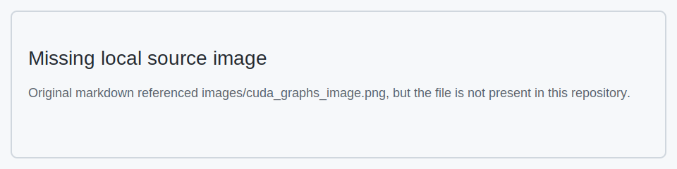

# CUTE DSL 학습 노트 2: Educational Notebooks

본 문서는 CUTLASS 4.3.5 CuTe DSL Educational Notebooks의 한국어 번역 및 학습 노트이다.

## 목차

1. [Hello World(입문)](#1-hello-world입문)
2. [Printing(출력)](#2-printing출력)
3. [Data Types Basics(데이터 타입 기초)](#3-data-types-basics데이터-타입-기초)
4. [Tensors(텐서)](#4-tensors텐서)
5. [The TensorSSA Abstraction(TensorSSA 추상화)](#5-the-tensorssa-abstractiontensorssa-추상화)
6. [Layout Algebra( Layout  대수)](#6-Layout-Algebra)
7. [Element-wise Add Tutorial(요소별 덧셈 튜토리얼)](#7-element-wise-add-tutorial요소별-덧셈-튜토리얼)
8. [Using CUDA Graphs(CUDA Graphs 사용)](#8-using-cuda-graphs사용-cuda-graphs)

---

## 1. Hello World(입문)

### 소개

환영한다! 본 튜토리얼에서는 CuTe DSL을 사용하여 GPU에서 실행되는 간단한 "Hello World" 프로그램을 작성한다. 이를 통해 우리 프레임워크를 사용한 GPU 프로그래밍의 기초를 이해하는 데 도움이 될 것이다.

### 학습 내용

- CPU(호스트)와 GPU(디바이스)에서 실행되는 코드를 작성하는 방법
- GPU kernel (GPU에서 실행되는 함수)을 시작하는 방법
- thread와 thread block 같은 기본 CUDA 개념

### 단계 1: 필요한 라이브러리 임포트

먼저 필요한 라이브러리를 임포트하자.

```python
import cutlass
import cutlass.cute as cute
```

### 단계 2: GPU kernel 작성

GPU kernel 은 GPU에서 실행되는 함수이다. 다음은 "Hello World"를 출력하는 간단한 kernel 이다.

**핵심 개념:**
- `@cute.kernel`: 이 데코레이터는 CUTLASS에 이 함수가 GPU에서 실행되어야 함을 알린다
- `cute.arch.thread_idx()`: 현재 GPU thread의 ID를 얻는다(작업자의 ID 번호와 유사)
- 여러 번 출력되는 것을 피하기 위해 하나의 thread(thread 0)만 메시지를 출력하기를 원한다

```python
@cute.kernel
def kernel():
    # thread 인덱스의 x 성분을 얻는다(y와 z 성분은 사용하지 않음)
    tidx, _, _ = cute.arch.thread_idx()
    # 첫 번째 thread(thread 0)만 메시지를 출력한다
    if tidx == 0:
        cute.printf("Hello world")
```

### 단계 3: 호스트 함수 작성

이제 GPU를 설정하고 kernel 을 시작하는 함수가 필요하다.

**핵심 개념:**
- `@cute.jit`: 이 데코레이터는 CPU에서 실행되지만 GPU 코드를 시작할 수 있는 함수에 사용된다
- GPU를 사용하기 전에 CUDA를 초기화해야 한다
- `.launch()`는 CUDA에 몇 개의 block, thread, shared memory 등을 사용할지 알린다

```python
@cute.jit
def hello_world():
    # 호스트 코드에서 hello world 출력
    cute.printf("hello world")

    # kernel 시작
    kernel().launch(
        grid=(1, 1, 1),  # 단일 thread block
        block=(32, 1, 1),  # thread block당 하나의 warp(32개 thread)
    )
```

### 단계 4: 프로그램 실행

프로그램을 실행하는 방법은 2가지가 있다.

1. 컴파일하고 즉시 실행
2. 분리 컴파일하여, 코드를 한 번 컴파일하고 여러 번 실행할 수 있게 함

**참고:** 방법 2의 `Compiling...`은 첫 번째 kernel 의 "Hello world"보다 먼저 출력된다. 이는 CPU와 GPU 출력 사이의 비동기 동작을 보여준다.

```python
# 에러 검사와 함께 kernel 시작을 위한 CUDA 컨텍스트 초기화
# 컨텍스트 초기화를 명시적으로 하여 사용자가 컨텍스트 생성을 제어할 수 있게 하고
# 여러 컨텍스트로 인한 잠재적 문제를 피한다
cutlass.cuda.initialize_cuda_context()

# 방법 1: 즉시(JIT) 컴파일 - 코드를 즉시 컴파일하고 실행
print("Running hello_world()...")
hello_world()

# 방법 2: 먼저 컴파일(동일한 코드를 여러 번 실행하려면 유용)
print("Compiling...")
hello_world_compiled = cute.compile(hello_world)

# 컴파일 시 PTX/CUBIN 파일 덤프
from cutlass.cute import KeepPTX, KeepCUBIN

print("Compiling with PTX/CUBIN dumped...")
# 또는, 다음과 같이 문자열 기반 옵션으로 컴파일하는 것도
# cute.compile(hello_world, options="--keep-ptx --keep-cubin") 동작한다.
hello_world_compiled_ptx_on = cute.compile[KeepPTX, KeepCUBIN](hello_world)

# 사전 컴파일된 버전 실행
print("Running compiled version...")
hello_world_compiled()
```

**출력:**
```
Running hello_world()...
Compiling...
hello world
Hello world
Compiling with PTX/CUBIN dumped...
Running compiled version...
hello world
Hello world
```

---

## 2. Printing(출력)

본 notebook은 CuTe에서 값을 출력하는 다양한 방식을 시연하고, 정적(컴파일 시)과 동적(런타임) 값 사이의 중요한 차이를 설명한다.

### 핵심 개념

- **정적 값**: 컴파일 시 이미 알려져 있다
- **동적 값**: 런타임에만 알 수 있다
- 서로 다른 시나리오를 위한 서로 다른 출력 방법
- CuTe에서의 Layout  표현
- 텐서 시각화 및 포매팅

```python
import cutlass
import cutlass.cute as cute
import numpy as np
```

### Print Example 함수

`print_example` 함수는 몇 가지 중요한 개념을 시연한다.

#### 1. Python의 `print` vs CuTe의 `cute.printf`
- `print`: 컴파일 시 정적 값만 표시할 수 있다
- `cute.printf`: 런타임에 정적 및 동적 값을 표시할 수 있다

#### 2. 값 타입
- `a`: 동적 `Int32` 값(런타임)
- `b`: 정적 `Constexpr[int]` 값(컴파일 시)

#### 3. Layout  출력
정적 컨텍스트와 동적 컨텍스트에서 Layout 의 서로 다른 표현을 보여준다.
- 정적 컨텍스트: 알려지지 않은 값은 `?`로 표시된다
- 동적 컨텍스트: 실제 값을 표시한다

```python
@cute.jit
def print_example(a: cutlass.Int32, b: cutlass.Constexpr[int]):
    """
    CuTe에서의 다양한 출력 방법과 그것들이 정적 값 및 동적 값을 어떻게 처리하는지 시연한다.

    이 예제는 다음을 보여준다:
    1. Python의 print 함수가 컴파일 시 정적 값을 어떻게 처리하지만 동적 값은 표시할 수 없는지
    2. cute.printf가 런타임에 정적 및 동적 값을 어떻게 표시하는지
    3. 정적 컨텍스트와 동적 컨텍스트에서의 타입 차이
    4. Layout 이 두 출력 방법에서 어떻게 표현되는지

    매개변수:
        a: 런타임에 결정되는 동적 Int32 값
        b: 정적(컴파일 시 상수) 정수 값
    """
    # Python `print`를 사용하여 정적 정보 출력
    print(">>>", b)  # => 2
    # `a`는 동적 값이다
    print(">>>", a)  # => ?

    # `cute.printf`를 사용하여 동적 정보 출력
    cute.printf(">?? {}", a)  # => 8
    cute.printf(">?? {}", b)  # => 2

    print(">>>", type(a))  # => <class 'cutlass.Int32'>
    print(">>>", type(b))  # => <class 'int'>

    layout = cute.make_layout((a, b))
    print(">>>", layout)  # => (?,2):(1,?)
    cute.printf(">?? {}", layout)  # => (8,2):(1,8)
```

### 컴파일 및 실행

**직접 컴파일 및 실행**
- `print_example(cutlass.Int32(8), 2)`
- 한 단계로 컴파일하고 실행하면 정적 및 동적 출력이 실행된다
  * `>>>`는 정적 출력을 나타낸다
  * `>??`는 동적 출력을 나타낸다

```python
print_example(cutlass.Int32(8), 2)
```

**출력:**
```
>>> 2
>>> ?
>>> Int32
>>> <class 'int'>
>>> (?,2):(1,?)
>?? 8
>?? 2
>?? (8,2):(1,8)
```

### 함수 컴파일

`cute.compile(print_example, cutlass.Int32(8), 2)`로 함수를 컴파일할 때, Python 인터프리터는 코드를 추적하고 정적 표현식만 평가하며 정적 정보만 출력한다.

```python
print_example_compiled = cute.compile(print_example, cutlass.Int32(8), 2)
```

**출력:**
```
>>> 2
>>> ?
>>> Int32
>>> <class 'int'>
>>> (?,2):(1,?)
```

### 컴파일된 함수 호출

런타임 정보만 출력한다

```python
print_example_compiled(cutlass.Int32(8))
```

**출력:**
```
>?? 8
>?? 2
>?? (8,2):(1,8)
```

### 포맷 문자열 예제

`format_string_example` 함수는 중요한 제한을 보여준다.
- CuTe에서의 F-string은 컴파일 시 평가된다
- 이는 동적 값이 f-string에서 런타임 값을 표시하지 않음을 의미한다
- 런타임 값을 볼 필요가 있을 때는 `cute.printf`를 사용한다

```python
@cute.jit
def format_string_example(a: cutlass.Int32, b: cutlass.Constexpr[int]):
    """
    포맷 문자열은 컴파일 시 평가된다.
    """
    print(f"a: {a}, b: {b}")

    layout = cute.make_layout((a, b))
    print(f"layout: {layout}")


print("Direct run output:")
format_string_example(cutlass.Int32(8), 2)
```

**출력:**
```
Direct run output:
a: ?, b: 2
layout: (?,2):(1,?)
```

### 텐서 출력 예제

CuTe는 `print_tensor` 연산을 통해 텐서를 출력하는 전용 기능을 제공한다. `cute.print_tensor`는 다음 인자를 받는다.
- `Tensor`(필수): 출력할 CuTe 텐서 객체. 텐서는 로드 및 스토어 연산을 지원해야 한다
- `verbose`(선택, 기본값=False): 출력 상세도를 제어하는 불리언 플래그. True로 설정하면 텐서의 각 요소의 인덱스 세부 정보를 출력한다.

아래 예제 코드는 verbose ON과 OFF 사이의 차이, 그리고 주어진 텐서의 하위 범위를 출력하는 방법을 보여준다.

```python
from cutlass.cute.runtime import from_dlpack


@cute.jit
def print_tensor_basic(x: cute.Tensor):
    # 텐서 출력
    print("Basic output:")
    cute.print_tensor(x)


@cute.jit
def print_tensor_verbose(x: cute.Tensor):
    # verbose 모드로 텐서 출력
    print("Verbose output:")
    cute.print_tensor(x, verbose=True)


@cute.jit
def print_tensor_slice(x: cute.Tensor, coord: tuple):
    # 3D 텐서에서 2D 텐서 슬라이스
    sliced_data = cute.slice_(x, coord)
    y = cute.make_rmem_tensor(sliced_data.layout, sliced_data.element_type)
    # 슬라이스 데이터를 프래그먼트에 로드하여 TensorSSA 형식으로 변환
    y.store(sliced_data.load())
    print("Slice output:")
    cute.print_tensor(y)
```

기본 `cute.print_tensor`는 데이터 타입, 저장 공간, CuTe Layout  정보를 가진 CuTe 텐서를 출력하며, torch 스타일 형식으로 데이터를 출력한다.

```python
def tensor_print_example1():
    shape = (4, 3, 2)

    # [0,...,23]을 생성하고 (4, 3, 2)로 reshape
    data = np.arange(24, dtype=np.float32).reshape(*shape)

    print_tensor_basic(from_dlpack(data))


tensor_print_example1()
```

**출력:**
```
Basic output:
tensor(raw_ptr(0x000000000a5f1d50: f32, generic, align<4>) o (4,3,2):(6,2,1), data=
       [[[ 0.000000,  2.000000,  4.000000, ],
         [ 6.000000,  8.000000,  10.000000, ],
         [ 12.000000,  14.000000,  16.000000, ],
         [ 18.000000,  20.000000,  22.000000, ]],

        [[ 1.000000,  3.000000,  5.000000, ],
         [ 7.000000,  9.000000,  11.000000, ],
         [ 13.000000,  15.000000,  17.000000, ],
         [ 19.000000,  21.000000,  23.000000, ]]])
```

verbose 출력은 텐서의 각 요소의 좌표 세부 정보를 표시한다. 아래 예제는 2D 4x3 텐서 공간에서 요소를 어떻게 인덱싱하는지 보여준다.

```python
def tensor_print_example2():
    shape = (4, 3)

    # [0,...,11]을 생성하고 (4, 3)으로 reshape
    data = np.arange(12, dtype=np.float32).reshape(*shape)

    print_tensor_verbose(from_dlpack(data))


tensor_print_example2()
```

**출력:**(예제는 좌표 세부 정보를 표시함)

주어진 텐서의 요소 부분집합을 출력하려면, `cute.slice_`를 사용하여 주어진 텐서의 한 범위를 선택하고, 그것들을 register에 로드한 다음 `cute.print_tensor`를 사용하여 값을 출력할 수 있다.

디바이스 메모리의 텐서를 출력하려면, CuTe JIT kernel 에서 `cute.print_tensor`를 사용할 수 있다.

**참고:** 현재 `cute.print_tensor`는 정수 데이터 타입과 `Float16`/`Float32`/`Float64` 부동소수점 데이터 타입의 텐서만 지원한다. 향후 더 많은 데이터 타입을 지원할 것이다.

---

## 3. Data Types Basics(데이터 타입 기초)

```python
import cutlass
import cutlass.cute as cute
```

### CuTe DSL에서의 데이터 구조 이해

대부분의 경우, CuTe DSL에서의 데이터 구조는 Python 데이터 구조와 동일하게 동작하지만, 두드러진 차이는 Python 데이터 구조가 대부분의 경우 정적 데이터로 취급된다는 점이다. 이 데이터는 Python 인터프리터에 내장된 DSL 컴파일러에 의해 해석된다.

컴파일 시와 런타임 값을 구분하기 위해, CuTe DSL은 JIT 컴파일된 코드 내의 동적 값을 나타내는 원시 타입을 도입한다.

CuTe DSL은 런타임의 동적 값을 나타내기 위한 포괄적인 원시 숫자 타입 세트를 제공한다. 이러한 타입은 CuTe DSL 타입 시스템에서 공식적으로 정의된다.

### 정수 타입
- `Int8` - 8비트 부호 있는 정수
- `Int16` - 16비트 부호 있는 정수  
- `Int32` - 32비트 부호 있는 정수
- `Int64` - 64비트 부호 있는 정수
- `Int128` - 128비트 부호 있는 정수
- `Uint8` - 8비트 부호 없는 정수
- `Uint16` - 16비트 부호 없는 정수
- `Uint32` - 32비트 부호 없는 정수
- `Uint64` - 64비트 부호 없는 정수
- `Uint128` - 128비트 부호 없는 정수

### 부동소수점 타입
- `Float16` - 16비트 부동소수점 수
- `Float32` - 32비트 부동소수점 수 
- `Float64` - 64비트 부동소수점 수
- `BFloat16` - Brain Floating Point 형식(16비트)
- `TFloat32` - Tensor Float32 형식(텐서 연산용 감소 정밀도 형식)
- `Float8E4M3` - 8비트 부동소수점 수, 4비트 지수와 3비트 가수
- `Float8E5M2` - 8비트 부동소수점 수, 5비트 지수와 2비트 가수

이러한 전용 타입들은 CuTe DSL 코드에서 런타임에 평가될 동적 값을 나타내기 위해 설계되었으며, (컴파일 중에 평가되는) Python의 내장 숫자 타입과 대비된다.

### 예제 사용법:

```python
x = cutlass.Int32(5)        # 32비트 정수 생성
y = cutlass.Float32(3.14)   # 32비트 부동소수점 수 생성

@cute.jit
def foo(a: cutlass.Int32):  # ABI를 통해 jit 함수에 전달되는 `a`를 32비트 정수로 어노테이션
    ...
```

```python
@cute.jit
def bar():
    a = cutlass.Float32(3.14)
    print("a(static) =", a)  # `a(static) = ?` 출력
    cute.printf("a(dynamic) = {}", a)  # `a(dynamic) = 3.140000` 출력

    b = cutlass.Int32(5)
    print("b(static) =", b)  # `b(static) = 5` 출력
    cute.printf("b(dynamic) = {}", b)  # `b(dynamic) = 5` 출력


bar()
```

**출력:**
```
a(static) = ?
b(static) = ?
a(dynamic) = 3.140000
b(dynamic) = 5
```

### 타입 변환 API

CUTLASS 숫자 타입은 모든 숫자 타입에서 사용 가능한 `to()` 메서드를 통해 타입 변환을 제공한다. 이를 통해 런타임에 서로 다른 숫자 데이터 타입 사이에서 변환할 수 있다.

**구문:**

```python
new_value = value.to(target_type)
```

`to()` 메서드는 다음 변환을 지원한다.
- 정수 타입(Int8, Int16, Int32, Int64, UInt8, UInt16, UInt32, UInt64)
- 부동소수점 타입(Float16, Float32, Float64, BFloat16)
- 혼합 정수/부동소수점 변환

부동소수점 타입에서 정수 타입으로 변환할 때 소수 부분이 절단됨에 유의하라. 서로 다른 범위의 타입 사이에서 변환할 때, 값이 목표 타입의 표현 가능 범위를 초과하면 제한되거나 정밀도 손실이 발생할 수 있다.

```python
@cute.jit
def type_conversion():
    # Int32에서 Float32로 변환
    x = cutlass.Int32(42)
    y = x.to(cutlass.Float32)
    cute.printf("Int32({}) => Float32({})", x, y)

    # Float32에서 Int32로 변환
    a = cutlass.Float32(3.14)
    b = a.to(cutlass.Int32)
    cute.printf("Float32({}) => Int32({})", a, b)

    # Int32에서 Int8로 변환
    c = cutlass.Int32(127)
    d = c.to(cutlass.Int8)
    cute.printf("Int32({}) => Int8({})", c, d)

    # Int32에서 Int8로 변환, 값이 Int8 범위를 초과
    e = cutlass.Int32(300)
    f = e.to(cutlass.Int8)
    cute.printf("Int32({}) => Int8({}) (truncated due to range limitation)", e, f)


type_conversion()
```

**출력:**
```
Int32(42) => Float32(42.000000)
Float32(3.140000) => Int32(3)
Int32(127) => Int8(127)
Int32(300) => Int8(44) (truncated due to range limitation)
```

### 연산자 오버로딩

CUTLASS 숫자 타입은 Python의 내장 연산자를 지원하여 자연스러운 수학 표현식을 작성할 수 있게 한다. 연산자는 CUTLASS 숫자 타입과 Python 네이티브 숫자 타입에 적용된다.

지원되는 연산자는 다음을 포함한다.
- 산술: `+`, `-`, `*`, `/`, `//`, `%`, `**`
- 비교: `<`, `<=`, `==`, `!=`, `>=`, `>`
- 비트 연산: `&`, `|`, `^`, `<<`, `>>`
- 단항: `-`(부호 반전), `~`(비트 NOT)

```python
@cute.jit
def operator_demo():
    # 산술 연산자
    a = cutlass.Int32(10)
    b = cutlass.Int32(3)
    cute.printf("a: Int32({}), b: Int32({})", a, b)

    x = cutlass.Float32(5.5)
    cute.printf("x: Float32({})", x)

    cute.printf("")

    sum_result = a + b
    cute.printf("a + b = {}", sum_result)

    y = x * 2  # Python 네이티브 타입과의 곱셈
    cute.printf("x * 2 = {}", y)

    # 혼합 타입 산술(Int32 + Float32), 정수가 float32로 변환됨
    mixed_result = a + x
    cute.printf("a + x = {} (Int32 + Float32 promotes to Float32)", mixed_result)

    # Int32를 사용한 나눗셈(참고: 정수 나눗셈)
    div_result = a / b
    cute.printf("a / b = {}", div_result)

    # 부동소수점 나눗셈
    float_div = x / cutlass.Float32(2.0)
    cute.printf("x / 2.0 = {}", float_div)

    # 비교 연산자
    is_greater = a > b
    cute.printf("a > b = {}", is_greater)

    # 비트 연산자
    bit_and = a & b
    cute.printf("a & b = {}", bit_and)

    neg_a = -a
    cute.printf("-a = {}", neg_a)

    not_a = ~a
    cute.printf("~a = {}", not_a)


operator_demo()
```

**출력:**
```
a: Int32(10), b: Int32(3)
x: Float32(5.500000)

a + b = 13
x * 2 = 11.000000
a + x = 15.500000 (Int32 + Float32 promotes to Float32)
a / b = 3.333333
x / 2.0 = 2.750000
a > b = 1
a & b = 2
-a = -10
~a = -11
```

---

## 4. Tensors(텐서)

```python
import cutlass
import cutlass.cute as cute
```

### 텐서

CuTe에서의 텐서는 두 핵심 구성 요소의 조합을 통해 생성된다.

1. **엔진(Engine)** (E) - 랜덤 액세스 가능한 포인터 유사 객체로, 다음을 지원한다:
   - 오프셋 연산: `e + d → e`( Layout  여역의 요소만큼 엔진을 오프셋)
   - 역참조 연산: `*e → v`(엔진을 역참조하여 값을 생성)

2. ** Layout  ** (L) - 좌표에서 오프셋으로의 매핑을 정의

텐서는 엔진 E와 Layout   L의 조합으로 공식적으로 정의되며, `T = E ∘ L`로 표현된다. 좌표 c에서 텐서를 평가할 때, 다음을 수행한다.

1. Layout 을 사용하여 좌표 c를 여역으로 매핑
2. 그에 따라 엔진을 오프셋
3. 결과를 역참조하여 텐서의 값을 얻음

이는 수학적으로 다음과 같이 표현할 수 있다.

```
T(c) = (E ∘ L)(c) = *(E + L(c))
```

### 예제 사용법

다음은 포인터와 Layout   `(8,5):(5,1)`을 사용하여 텐서를 생성하고 1로 채우는 간단한 예제이다.

```python
@cute.jit
def create_tensor_from_ptr(ptr: cute.Pointer):
    layout = cute.make_layout((8, 5), stride=(5, 1))
    tensor = cute.make_tensor(ptr, layout)
    tensor.fill(1)
    cute.print_tensor(tensor)
```

이는 다음과 같은 텐서를 생성한다.
- 엔진은 포인터이다
- Layout 의 형상은 `(8, 5)`, 스트라이드는 `(5, 1)`이다
- 생성된 텐서는 Layout 이 정의한 좌표를 사용하여 평가할 수 있다

torch로 버퍼를 할당하고 torch 텐서를 가리키는 포인터로 테스트를 실행하여 테스트할 수 있다.

```python
import torch

from cutlass.torch import dtype as torch_dtype
import cutlass.cute.runtime as cute_rt

a = torch.randn(8, 5, dtype=torch_dtype(cutlass.Float32))
ptr_a = cute_rt.make_ptr(cutlass.Float32, a.data_ptr())

create_tensor_from_ptr(ptr_a)
```

### DLPACK 지원

CuTe DSL은 dlpack 프로토콜을 네이티브로 지원하도록 설계되었다. 이는 torch, numpy, jax, tensorflow 등 DLPack을 지원하는 프레임워크와의 쉬운 통합을 제공한다.

자세한 정보는 DLPACK 프로젝트를 참조하라: https://github.com/dmlc/dlpack

`from_dlpack` 호출은 `__dlpack__`과 `__dlpack_device__`를 지원하는 모든 텐서 또는 ndarray 객체를 변환할 수 있다.

```python
from cutlass.cute.runtime import from_dlpack


@cute.jit
def print_tensor_dlpack(src: cute.Tensor):
    print(src)
    cute.print_tensor(src)
```

```python
a = torch.randn(8, 5, dtype=torch_dtype(cutlass.Float32))

print_tensor_dlpack(from_dlpack(a))
```

```python
import numpy as np

a = np.random.randn(8, 8).astype(np.float32)

print_tensor_dlpack(from_dlpack(a))
```

### 텐서 평가 방법

텐서는 두 가지 주요 평가 방법을 지원한다.

#### 1. 완전 평가
완전한 좌표 c의 텐서 평가를 적용할 때, 오프셋을 계산하고, 이를 엔진에 적용하며, 역참조하여 저장된 값을 반환한다. 이는 텐서의 특정 요소에 접근하려 할 때의 직접적인 경우이다.

#### 2. 부분 평가(슬라이싱)
불완전한 좌표 c = c' ⊕ c*(여기서 c*는 지정되지 않은 부분을 나타냄)로 평가할 때, 결과는 원래 텐서의 슬라이스인 새 텐서이며, 그 엔진 오프셋은 제공된 좌표를 고려한다. 이 연산은 다음과 같이 표현할 수 있다.

```
T(c) = (E ∘ L)(c) = (E + L(c')) ∘ L(c*) = T'(c*)
```

슬라이싱은 효과적으로 텐서의 차원을 줄여, 추가로 평가하거나 조작할 수 있는 하위 텐서를 생성한다.

```python
@cute.jit
def tensor_access_item(a: cute.Tensor):
    # 선형 인덱스를 사용하여 데이터 접근
    cute.printf(
        "a[2] = {} (equivalent to a[{}])",
        a[2],
        cute.make_identity_tensor(a.layout.shape)[2],
    )
    cute.printf(
        "a[9] = {} (equivalent to a[{}])",
        a[9],
        cute.make_identity_tensor(a.layout.shape)[9],
    )

    # n-d 좌표를 사용하여 데이터 접근, 아래 두 가지는 동등하다
    cute.printf("a[2,0] = {}", a[2, 0])
    cute.printf("a[2,4] = {}", a[2, 4])
    cute.printf("a[(2,4)] = {}", a[2, 4])

    # tensor@(2,4)에 값 할당
    a[2, 3] = 100.0
    a[2, 4] = 101.0
    cute.printf("a[2,3] = {}", a[2, 3])
    cute.printf("a[(2,4)] = {}", a[(2, 4)])


# torch를 사용하여 순차 데이터를 가진 텐서 생성
data = torch.arange(0, 8 * 5, dtype=torch.float32).reshape(8, 5)
tensor_access_item(from_dlpack(data))

print(data)
```

### 메모리 뷰로서의 텐서

CUDA 프로그래밍에서, 서로 다른 메모리 공간은 접근 속도, 범위, 수명 측면에서 서로 다른 특성을 가진다.

- **generic**: 기본 메모리 공간으로, 다른 모든 메모리 공간을 참조할 수 있다.
- **global memory(gmem)**: 모든 block의 모든 thread가 접근할 수 있지만 레이턴시가 높다.
- **shared memory(smem)**: block 내의 모든 thread가 접근할 수 있으며, global memory보다 레이턴시가 훨씬 낮다.
- **register memory(rmem)**: thread 전용 메모리로, 레이턴시가 가장 낮지만 용량이 제한적이다.
- **tensor memory(tmem)**: NVIDIA Blackwell 아키텍처에서 도입된 텐서 연산용 전용 메모리.

CuTe에서 텐서를 생성할 때, 접근 패턴에 따라 성능을 최적화하기 위해 메모리 공간을 지정할 수 있다.

CUDA 메모리 공간에 대한 자세한 정보는 [CUDA 프로그래밍 가이드](https://docs.nvidia.com/cuda/cuda-c-programming-guide/index.html#memory-hierarchy)를 참조하라.

### 좌표 텐서

#### 정의 및 속성

좌표 텐서 $T: Z^n → Z^m$은 좌표 공간 사이의 매핑을 확립하는 수학적 구조이다. 좌표를 스칼라 값에 매핑하는 표준 텐서와 달리, 좌표 텐서는 좌표를 다른 좌표에 매핑하여 텐서 연산과 변환의 기본 구성 블록을 형성한다.

#### 예제

`(4,4)` 좌표 텐서를 고려하자.

**행 우선 Layout  (C 스타일):**
```
[[(0,0) (0,1) (0,2) (0,3)]
 [(1,0) (1,1) (1,2) (1,3)]
 [(2,0) (2,1) (2,2) (2,3)]
 [(3,0) (3,1) (3,2) (3,3)]]
```

**열 우선 Layout  (Fortran 스타일):**
```
[[(0,0) (1,0) (2,0) (3,0)]
 [(0,1) (1,1) (2,1) (3,1)]
 [(0,2) (1,2) (2,2) (3,2)]
 [(0,3) (1,3) (2,3) (3,3)]]
```

#### 단위 텐서

단위 텐서 $I$는 좌표 텐서의 특수한 경우로, 항등 매핑 함수를 구현한다.

 **정의:**
 주어진 형상 $S = (s_1, s_2, \ldots, s_n)$에 대해, 단위 텐서 $I$는 다음을 만족한다.

 $$
 I(c) = c, \quad \forall\, c \in \prod_{i=1}^{n} \left[0, s_i\right)
 $$

 **속성:**
 1. **전단사 매핑**: 단위 텐서는 좌표 사이에 일대일 대응을 확립한다.
 2. ** Layout  불변성**: 기저 메모리 Layout 에 관계없이 논리적 구조가 일정하게 유지된다.
3. **좌표 보존**: 임의의 좌표 c에 대해, I(c) = c이다.

CuTe는 사전식 순서를 통해 1-D 인덱스와 N-D 좌표 사이의 동형을 확립한다. 형상이 S = (s₁, s₂, ..., sₙ)인 단위 텐서에서 좌표 c = (c₁, c₂, ..., cₙ)에 대해:

 **선형 인덱스 공식:**

 $$
 \text{idx} = c_1 + \sum_{i=2}^{n} \left(c_i \prod_{j=1}^{i-1} s_j\right)
 $$

 **예제:**
```python
 # 주어진 형상에서 단위 텐서 생성
coord_tensor = make_identity_tensor(layout.shape())

# 선형 인덱스를 사용하여 좌표 접근
coord = coord_tensor[linear_idx]  # N-D 좌표 반환
```

이러한 양방향 매핑은 선형 인덱스에서 N차원 좌표로 효율적으로 변환할 수 있게 하여, 텐서 연산과 메모리 접근 패턴을 촉진한다.

```python
@cute.jit
def print_tensor_coord(a: cute.Tensor):
    coord_tensor = cute.make_identity_tensor(a.layout.shape)
    print(coord_tensor)
    cute.print_tensor(coord_tensor)


a = torch.randn(8, 4, dtype=torch_dtype(cutlass.Float32))
print_tensor_coord(from_dlpack(a))
```

---

## 5. The TensorSSA Abstraction(TensorSSA 추상화)

```python
import cutlass
import cutlass.cute as cute
from cutlass.cute.runtime import from_dlpack

import numpy as np
```

### CuTe DSL에서의 TensorSSA 소개

본 튜토리얼은 `TensorSSA`가 무엇인지 그리고 왜 그것이 필요한지를 소개한다. 또한 `TensorSSA`를 어떻게 사용하는지 보여주는 몇 가지 예제를 제공한다.

### TensorSSA란

`TensorSSA`는 정적 단일 할당(SSA) 형식으로 CuTe DSL에서의 텐서 값을 나타내는 Python 클래스이다. (모의) register에 상주하는 텐서로 볼 수 있다.

### 왜 TensorSSA가 필요한가

`TensorSSA`는 기저 MLIR 텐서 값을 Python에서 조작하기 더 쉬운 객체로 캡슐화한다. 많은 Python 연산자(예: `+`, `-`, `*`, `/`, `[]` 등)를 오버로딩함으로써, 사용자가 더 Pythonic한 방식으로 텐서 계산(주로 요소별 연산과 리덕션)을 표현할 수 있게 한다. 그런 다음 이러한 요소별 연산을 최적화된 벡터화 명령으로 변환한다.

이는 CuTe DSL의 일부로, 사용자가 기술한 계산 로직과 더 낮은 수준의 MLIR IR 사이의 다리 역할을 하며, 특히 register 수준 데이터를 나타내고 조작하는 데 사용된다.

### 언제 TensorSSA를 사용하는가

`TensorSSA`는 주로 다음 시나리오에서 사용된다.

#### 메모리에서 로드하고 메모리로 스토어

```python
@cute.jit
def load_and_store(res: cute.Tensor, a: cute.Tensor, b: cute.Tensor):
    """
    메모리에서 데이터를 로드하고 결과를 메모리로 스토어한다.

    :param res: 결과를 저장하기 위한 목표 텐서.
    :param a: 로드할 소스 텐서.
    :param b: 로드할 소스 텐서.
    """
    a_vec = a.load()
    print(f"a_vec: {a_vec}")  # `a_vec: vector<12xf32> o (3, 4)` 출력
    b_vec = b.load()
    print(f"b_vec: {b_vec}")  # `b_vec: vector<12xf32> o (3, 4)` 출력
    res.store(a_vec + b_vec)
    cute.print_tensor(res)


a = np.ones(12).reshape((3, 4)).astype(np.float32)
b = np.ones(12).reshape((3, 4)).astype(np.float32)
c = np.zeros(12).reshape((3, 4)).astype(np.float32)
load_and_store(from_dlpack(c), from_dlpack(a), from_dlpack(b))
```

#### register 수준 텐서 연산

kernel 로직을 작성할 때, register에 로드된 데이터에 대해 다양한 계산, 변환, 슬라이싱 등을 수행한다.

```python
@cute.jit
def apply_slice(src: cute.Tensor, dst: cute.Tensor, indices: cutlass.Constexpr):
    """
    src 텐서에 슬라이싱 연산을 적용하고 결과를 dst 텐서에 스토어한다.

    :param src: 슬라이싱할 소스 텐서.
    :param dst: 결과를 저장하기 위한 목표 텐서.
    :param indices: 소스 텐서를 슬라이싱하는 데 사용되는 인덱스.
    """
    src_vec = src.load()
    dst_vec = src_vec[indices]
    print(f"{src_vec} -> {dst_vec}")
    if cutlass.const_expr(isinstance(dst_vec, cute.TensorSSA)):
        dst.store(dst_vec)
        cute.print_tensor(dst)
    else:
        dst[0] = dst_vec
        cute.print_tensor(dst)


def slice_1():
    src_shape = (4, 2, 3)
    dst_shape = (4, 3)
    indices = (None, 1, None)

    """
    a:
    [[[ 0.  1.  2.]
      [ 3.  4.  5.]]

     [[ 6.  7.  8.]
      [ 9. 10. 11.]]

     [[12. 13. 14.]
      [15. 16. 17.]]

     [[18. 19. 20.]
      [21. 22. 23.]]]
    """
    a = np.arange(np.prod(src_shape)).reshape(*src_shape).astype(np.float32)
    dst = np.random.randn(*dst_shape).astype(np.float32)
    apply_slice(from_dlpack(a), from_dlpack(dst), indices)


slice_1()
```

### 산술 연산

앞서 언급했듯이, 피연산자가 `TensorSSA`인 텐서 연산이 많이 있다. 그것들은 모두 요소별 연산이다. 아래에 몇 가지 예제를 제시한다.

#### 이항 연산

이항 연산의 경우, LHS 피연산자는 `TensorSSA`이고, RHS 피연산자는 `TensorSSA` 또는 `Numeric`일 수 있다. RHS가 `Numeric`일 때, 그것은 `TensorSSA`로 브로드캐스트된다.

```python
@cute.jit
def binary_op_1(res: cute.Tensor, a: cute.Tensor, b: cute.Tensor):
    a_vec = a.load()
    b_vec = b.load()

    add_res = a_vec + b_vec
    cute.print_tensor(add_res)  # [3.000000, 3.000000, 3.000000] 출력

    sub_res = a_vec - b_vec
    cute.print_tensor(sub_res)  # [-1.000000, -1.000000, -1.000000] 출력

    mul_res = a_vec * b_vec
    cute.print_tensor(mul_res)  # [2.000000, 2.000000, 2.000000] 출력

    div_res = a_vec / b_vec
    cute.print_tensor(div_res)  # [0.500000, 0.500000, 0.500000] 출력

    floor_div_res = a_vec // b_vec
    cute.print_tensor(res)  # [0.000000, 0.000000, 0.000000] 출력

    mod_res = a_vec % b_vec
    cute.print_tensor(mod_res)  # [1.000000, 1.000000, 1.000000] 출력


a = np.empty((3,), dtype=np.float32)
a.fill(1.0)
b = np.empty((3,), dtype=np.float32)
b.fill(2.0)
res = np.empty((3,), dtype=np.float32)
binary_op_1(from_dlpack(res), from_dlpack(a), from_dlpack(b))
```

#### 단항 연산

```python
@cute.jit
def unary_op_1(res: cute.Tensor, a: cute.Tensor):
    a_vec = a.load()

    sqrt_res = cute.math.sqrt(a_vec)
    cute.print_tensor(sqrt_res)  # [2.000000, 2.000000, 2.000000] 출력

    sin_res = cute.math.sin(a_vec)
    res.store(sin_res)
    cute.print_tensor(sin_res)  # [-0.756802, -0.756802, -0.756802] 출력

    exp2_res = cute.math.exp2(a_vec)
    cute.print_tensor(exp2_res)  # [16.000000, 16.000000, 16.000000] 출력


a = np.array([4.0, 4.0, 4.0], dtype=np.float32)
res = np.empty((3,), dtype=np.float32)
unary_op_1(from_dlpack(res), from_dlpack(a))
```

#### 리덕션 연산

`TensorSSA`의 `reduce` 메서드는 지정된 리덕션 연산(`ReductionOp.ADD`, `ReductionOp.MUL`, `ReductionOp.MAX`, `ReductionOp.MIN`)을 초기값에서 시작하여 적용하고, `reduction_profile`이 지정한 차원을 따라 이 리덕션을 수행한다. 결과는 일반적으로 차원이 감소된 새 `TensorSSA`이거나, 모든 축에 걸쳐 리덕션하는 경우 스칼라 값이다.

```python
@cute.jit
def reduction_op(a: cute.Tensor):
    """
    src 텐서에 리덕션 연산을 적용한다.

    :param src: 리덕션할 소스 텐서.
    """
    a_vec = a.load()
    red_res = a_vec.reduce(cute.ReductionOp.ADD, 0.0, reduction_profile=0)
    cute.printf(red_res)  # 21.000000 출력

    red_res = a_vec.reduce(cute.ReductionOp.ADD, 0.0, reduction_profile=(None, 1))
    cute.print_tensor(red_res)  # [6.000000, 15.000000] 출력

    red_res = a_vec.reduce(cute.ReductionOp.ADD, 1.0, reduction_profile=(1, None))
    cute.print_tensor(red_res)  # [6.000000, 8.000000, 10.000000] 출력


a = np.array([[1, 2, 3], [4, 5, 6]], dtype=np.float32)
reduction_op(from_dlpack(a))
```

### 브로드캐스트

`TensorSSA`는 NumPy 브로드캐스트 규칙을 따르는 브로드캐스트 연산을 지원한다. 브로드캐스트는 특정 조건이 충족될 때 서로 다른 형상의 배열에 대해 연산을 수행할 수 있게 한다. 핵심 규칙은 다음과 같다.

1. 소스 형상은 목표 형상의 랭크에 맞도록 1로 채워진다
2. 소스 형상의 각 모드의 크기는 1이거나 목표 형상과 같아야 한다
3. 브로드캐스트 후, 모든 모드는 목표 형상과 일치해야 한다

몇 가지 실제 브로드캐스트 예제를 살펴보자.

```python
import cutlass
import cutlass.cute as cute


@cute.jit
def broadcast_examples():
    a = cute.make_rmem_tensor((1, 3), dtype=cutlass.Float32)
    a[0] = 0.0
    a[1] = 1.0
    a[2] = 2.0
    a_val = a.load()
    cute.print_tensor(a_val.broadcast_to((4, 3)))
    # tensor(raw_ptr(0x00007ffe26625740: f32, rmem, align<32>) o (4,3):(1,4), data=
    #    [[ 0.000000,  1.000000,  2.000000, ],
    #     [ 0.000000,  1.000000,  2.000000, ],
    #     [ 0.000000,  1.000000,  2.000000, ],
    #     [ 0.000000,  1.000000,  2.000000, ]])

    c = cute.make_rmem_tensor((4, 1), dtype=cutlass.Float32)
    c[0] = 0.0
    c[1] = 1.0
    c[2] = 2.0
    c[3] = 3.0
    cute.print_tensor(a.load() + c.load())
    # tensor(raw_ptr(0x00007ffe26625780: f32, rmem, align<32>) o (4,3):(1,4), data=
    #        [[ 0.000000,  1.000000,  2.000000, ],
    #         [ 1.000000,  2.000000,  3.000000, ],
    #         [ 2.000000,  3.000000,  4.000000, ],
    #         [ 3.000000,  4.000000,  5.000000, ]])


broadcast_examples()
```

위 예제는 두 가지 핵심 브로드캐스트 시나리오를 시연하며, `TensorSSA`가 각 차원이 1이거나 목표 크기와 일치해야 한다는 브로드캐스트 규칙을 따르면서, 산술 연산에서 행 벡터와 열 벡터의 브로드캐스트를 어떻게 자동으로 처리하는지 보여준다. 브로드캐스트는 연산 중에 암묵적으로 처리되어, 서로 다른 형상의 텐서를 사용하는 것을 쉽게 한다.

---

## 6. Layout Algebra

### Python DSL을 사용한 CuTe Layout  대수

CuTe C++의 [01_layout.md](https://github.com/NVIDIA/cutlass/blob/main/media/docs/cpp/cute/01_layout.md)와 [02_layout_algebra.md](https://github.com/NVIDIA/cutlass/blob/main/media/docs/cpp/cute/02_layout_algebra.md) 문서를 참고하여, 다음과 같이 요약한다.

CuTe에서 `Layout`은:
- `Shape`와 `Stride` 한 쌍으로 정의된다
- 좌표 공간을 인덱스 공간에 매핑한다
- 정적(컴파일 시)과 동적(런타임) 값을 지원한다

CuTe는 또한 Layout 을 조합하고 조작하기 위한 강력한 연산 세트—* Layout  대수*—를 제공하며, 다음을 포함한다.
- Layout  조합: Layout 의 함수 조합
- Layout  "나눗셈": Layout 을 두 개의 구성 요소 Layout 으로 분할
- Layout  "곱": 다른 Layout 에 따라 Layout 을 재현

본 notebook에서는 다음을 시연한다.
1. Python DSL의 CuTe 핵심 Layout  대수 연산을 사용하는 방법
2. 정적 및 동적 Layout 이 Python DSL에서 출력되거나 조작될 때 동작하는 방식

[02_layout_algebra.md](https://github.com/NVIDIA/cutlass/blob/main/media/docs/cpp/cute/02_layout_algebra.md)의 예제를 사용하며, 독자가 자세한 내용을 위해 이를 읽어보기를 권장한다.

```python
import cutlass
import cutlass.cute as cute
```

### Layout  대수 연산

이러한 연산들은 CuTe Layout 조작 능력의 기반을 형성하며, 다음을 가능하게 한다.
- 효율적인 데이터 Tile 화 및 분할
- 규범 타입을 사용하여 thread와 데이터 Layout 을 표현하여 둘을 분리
- 텐서 코어 프로그램에 필수적인 thread와 데이터의 계층적 텐서를 네이티브로 기술하고 조작
- 정적/동적 혼합 Layout  변환
- Layout  대수와 텐서 연산의 매끄러운 통합
- 복잡한 MMA와 복사를 규범 루프로 표현

### 1. Coalesce(병합)

`coalesce` 연산은 가능한 경우 모드를 평탄화하고 결합하여 Layout 을 단순화하며, 정수 함수로서의 크기나 동작을 변경하지 않는다.

이는 다음 후행 조건을 보장한다.
- 크기 보존: cute.size(layout) == cute.size(result)
- 평탄화: depth(result) <= 1
- 함수성 보존: 모든 i, 0 <= i < cute.size(layout)에 대해, layout(i) == result(i)

#### 예제

- 기본 Coalesce 예제:

```python
@cute.jit
def coalesce_example():
    """
    coalesce 연산이 모드를 평탄화하고 결합하는 것을 시연한다
    """
    layout = cute.make_layout(
        (2, (1, 6)), stride=(1, (cutlass.Int32(6), 2))
    )  # 동적 스트라이드
    result = cute.coalesce(layout)

    print(">>> Original:", layout)
    cute.printf(">?? Original: {}", layout)
    print(">>> Coalesced:", result)
    cute.printf(">?? Coalesced: {}", result)


coalesce_example()
```

**출력:**
```
>>> Original: (2,(1,6)):(1,(?,2))
>>> Coalesced: 12:1
>?? Original: (2,(1,6)):(1,(6,2))
>?? Coalesced: 12:1
```

- 모드별 Coalesce 예제:

```python
@cute.jit
def bymode_coalesce_example():
    """
    모드별 병합을 시연한다
    """
    layout = cute.make_layout((2, (1, 6)), stride=(1, (6, 2)))

    # 모드 프로파일 (1,1)을 사용하여 Coalesce = 두 모드를 병합
    result = cute.coalesce(layout, target_profile=(1, 1))

    # 결과 출력
    print(">>> Original: ", layout)
    print(">>> Coalesced Result: ", result)


bymode_coalesce_example()
```

**출력:**
```
>>> Original:  (2,(1,6)):(1,(6,2))
>>> Coalesced Result:  (2,6):(1,2)
```

### 2. Composition(조합)

Layout   `A`와 Layout   `B`의 `Composition`은 새 Layout   `R = A ◦ B`를 생성하며, 여기서:
- `B`의 형상은 `R`의 형상과 호환되어, `B`의 모든 좌표를 `R`의 좌표로도 사용할 수 있다
- `B` 도메인의 모든 좌표 `c`에 대해 `R(c) = A(B(c))`이다

Layout  조합은 Layout 을 reshape하고 재배열하는 데 매우 유용하다.

#### 예제

- 기본 조합 예제:

```python
@cute.jit
def composition_example():
    """
    기본 Layout  조합 R = A ◦ B를 시연한다
    """
    A = cute.make_layout((6, 2), stride=(cutlass.Int32(8), 2))  # 동적 스트라이드
    B = cute.make_layout((4, 3), stride=(3, 1))
    R = cute.composition(A, B)

    # 정적 및 동적 정보 출력
    print(">>> Layout A:", A)
    cute.printf(">?? Layout A: {}", A)
    print(">>> Layout B:", B)
    cute.printf(">?? Layout B: {}", B)
    print(">>> Composition R = A ◦ B:", R)
    cute.printf(">?? Composition R: {}", R)


composition_example()
```

**출력:**
```
>>> Layout A: (6,2):(?,2)
>>> Layout B: (4,3):(3,1)
>>> Composition R = A ◦ B: ((2,2),3):((?{div=3},2),?)
>?? Layout A: (6,2):(8,2)
>?? Layout B: (4,3):(3,1)
>?? Composition R: ((2,2),3):((24,2),8)
```

- 모드별 조합 예제:

모드별 조합은 조합 연산을 Layout 의 각 모드에 적용할 수 있게 한다. 이는 특정 모드 Layout (예: 행과 열)을 독립적으로 조작하려 할 때 특히 유용하다.

```python
@cute.jit
def bymode_composition_example():
    """
    tiler를 사용한 모드별 조합을 시연한다
    """
    # 원본 Layout   A 정의
    A = cute.make_layout(
        (cutlass.Int32(12), (cutlass.Int32(4), cutlass.Int32(8))),
        stride=(cutlass.Int32(59), (cutlass.Int32(13), cutlass.Int32(1))),
    )

    # 모드별 조합을 위한 tiler 정의
    tiler = (3, 8)  # 모드 0에 3:1을 적용하고, 모드 1에 8:1을 적용

    # 모드별 조합 적용
    result = cute.composition(A, tiler)

    # 정적 및 동적 정보 출력
    print(">>> Layout A:", A)
    cute.printf(">?? Layout A: {}", A)
    print(">>> Tiler:", tiler)
    cute.printf(">?? Tiler: {}", tiler)
    print(">>> By-mode Composition Result:", result)
    cute.printf(">?? By-mode Composition Result: {}", result)


bymode_composition_example()
```

### 3. Division(나눗셈/Tile로 분할)

CuTe에서의 Division 연산은 Layout 을 Tile로 분할하는 데 사용되며, 이는 thread 또는 메모리 계층 구조에 걸쳐 데이터를 분할하는 데 특히 유용하다.

#### 예제:

- Logical divide:

두 Layout 에 적용될 때, `logical_divide`는 Layout 을 두 개의 모드로 분할한다—첫 번째 모드는 tiler가 가리키는 요소를 포함하고, 두 번째 모드는 나머지 요소를 포함한다.

```python
@cute.jit
def logical_divide_1d_example():
    """
    1D logical divide를 시연한다
    """
    # 원본 Layout  정의
    layout = cute.make_layout((4, 2, 3), stride=(2, 1, 8))  # (4,2,3):(2,1,8)

    # tiler 정의
    tiler = cute.make_layout(4, stride=2)  # Layout   4:2에 적용

    # logical divide 적용
    result = cute.logical_divide(layout, tiler=tiler)

    # 결과 출력
    print(">>> Layout:", layout)
    print(">>> Tiler :", tiler)
    print(">>> Logical Divide Result:", result)
    cute.printf(">?? Logical Divide Result: {}", result)


logical_divide_1d_example()
```

**출력:**
```
>>> Layout: (4,2,3):(2,1,8)
>>> Tiler : 4:2
>>> Logical Divide Result: ((2,2),(2,3)):((4,1),(2,8))
>?? Logical Divide Result: ((2,2),(2,3)):((4,1),(2,8))
```

- Zipped Divide, Tiled Divide, Flat Divide:

이것들은 `logical_divide`의 변형으로, 모드를 더 편리한 형태로 재배열할 수 있다.

### 4. Product(곱/Tile 재현)

CuTe에서의 Product 연산은 다른 Layout 에 따라 하나의 Layout 을 재현하는 데 사용된다. 이는 새 Layout 을 생성하며, 여기서:
- 첫 번째 모드는 원본 Layout   A이다
- 두 번째 모드는 스트라이드가 재조정된 Layout   B로, A의 "고유 복제"의 원점을 가리킨다

이는 데이터 Tile에 걸쳐 thread Layout 을 반복하여 "반복" 패턴을 생성하는 데 특히 유용하다.

#### 예제

- Logical Product:

```python
@cute.jit
def logical_product_1d_example():
    """
    1D logical product를 시연한다
    """
    # 원본 Layout  정의
    layout = cute.make_layout((2, 2), stride=(4, 1))  # (2,2):(4,1)

    # tiler 정의
    tiler = cute.make_layout(6, stride=1)  # Layout   6:1에 적용

    # logical product 적용
    result = cute.logical_product(layout, tiler=tiler)

    # 결과 출력
    print(">>> Layout:", layout)
    print(">>> Tiler :", tiler)
    print(">>> Logical Product Result:", result)
    cute.printf(">?? Logical Product Result: {}", result)


logical_product_1d_example()
```

**출력:**
```
>>> Layout: (2,2):(4,1)
>>> Tiler : 6:1
>>> Logical Product Result: ((2,2),(2,3)):((4,1),(2,8))
>?? Logical Product Result: ((2,2),(2,3)):((4,1),(2,8))
```

- Blocked 및 Raked Product:
  - Blocked Product: A와 B의 모드를 블록 방식으로 결합하며, 곱 이후 재연관(re-association)을 통해 모드의 의미론적 의미를 보존한다.
  - Raked Product: A와 B의 모드를 교차 또는 "갈퀴(rake)" 방식으로 결합하여, Tile의 순환 분포를 생성한다.

---

## 7. Element-wise Add Tutorial(요소별 덧셈 튜토리얼)

```python
import torch
from functools import partial
from typing import List

import cutlass
import cutlass.cute as cute
from cutlass.cute.runtime import from_dlpack
```

### kernel 튜토리얼: CuTe DSL을 사용하여 효율적인 요소별 덧셈 kernel 구축

본 튜토리얼은 CuTe DSL을 사용하여 GPU 요소별 덧셈 kernel 을 구현하고 최적화하는 방법을 시연한다.

### 학습 목표

본 튜토리얼에서, CuTe DSL에서 효율적인 요소별 kernel 을 단계적으로 구축하는 방법을 학습할 것이다.
- 기본 CUDA 기술을 사용하여 CuTe DSL에서 기본 GPU kernel 을 구현하는 방법
- kernel 성능을 벤치마킹하는 방법
- 텐서를 Tile화하고 분할하여 기본 CuTe Layout 에 매핑하는 방법
- thread와 값 Layout 이 무엇인지, 그리고 thread 및 값 인덱스에서 논리적 좌표로의 매핑
- TV Layout 을 사용하여 고급 kernel 을 구현하고 성능을 조정하여 최고 성능에 도달하는 방법

### 요소별 덧셈 이해

요소별 덧셈은 선형대수와 딥러닝에서의 기본 연산이다. 동일한 형상의 두 텐서가 주어지면, 이 연산은 요소별 덧셈을 수행하여 동일한 형상의 결과 텐서를 생성한다.

형상이 $(M, N)$인 두 2D 텐서 $A$와 $B$에 대해, 요소별 덧셈 연산 $C = A + B$는 다음과 같이 정의된다.

$C_{i,j} = A_{i,j} + B_{i,j}$

여기서:
- $i \in [0, M-1]$은 행 인덱스를 나타낸다
- $j \in [0, N-1]$은 열 인덱스를 나타낸다
- $A_{i,j}$, $B_{i,j}$, $C_{i,j}$는 텐서 $A$, $B$, $C$에서 위치 $(i,j)$의 요소이다

이 연산은 몇 가지 중요한 특징을 가진다.
1. **병렬화 가능**: 각 요소는 독립적으로 계산할 수 있다
2. **메모리 제약**: 성능이 계산이 아닌 메모리 대역폭에 의해 제한된다
3. **합병(coalescing)에 민감**: 효율이 메모리 접근 패턴에 의존한다
4. **벡터화에 친화적**: 여러 요소를 함께 처리할 수 있다

### 단순한 요소별 덧셈 kernel

최적화를 탐구하기 전에 기준선을 확립하기 위해, 단순한 구현부터 시작하자.

```python
# 기본 kernel 구현
# ---------------------
# 이것은 우리의 첫 번째 요소별 덧셈 kernel 의 구현이다.
# thread와 텐서 요소 사이의 간단한 1:1 매핑을 따른다.


@cute.kernel
def naive_elementwise_add_kernel(
    gA: cute.Tensor,  # 입력 텐서 A
    gB: cute.Tensor,  # 입력 텐서 B
    gC: cute.Tensor,  # 출력 텐서 C = A + B
):
    # 단계 1: thread 인덱스 얻기
    # ------------------------
    # CUDA thread는 thread block의 3D 그리드로 구성된다
    # 여기서는 단순화를 위해 x 차원만 사용한다
    tidx, _, _ = cute.arch.thread_idx()  # block 내의 thread 인덱스(0부터 bdim-1까지)
    bidx, _, _ = cute.arch.block_idx()  # 그리드 내의 block 인덱스(0부터 grid_dim-1까지)
    bdim, _, _ = cute.arch.block_dim()  # 각 block의 thread 수

    # 전역 thread 인덱스 계산
    # 이는 모든 block에 걸쳐 각 thread에 고유한 ID를 부여한다
    thread_idx = bidx * bdim + tidx  # 전역 thread ID

    # 단계 2: thread 인덱스를 텐서 좌표에 매핑
    # -------------------------------------------
    # 각 thread는 입력 텐서의 한 요소를 처리한다
    m, n = gA.shape  # 텐서 차원 얻기(M 행 × N 열)

    # 선형 thread 인덱스를 2D 좌표로 변환:
    # - ni: 열 인덱스(0부터 n-1까지)
    # - mi: 행 인덱스(0부터 m-1까지)
    ni = thread_idx % n  # 열 인덱스(더 빠르게 변하는 차원)
    mi = thread_idx // n  # 행 인덱스(더 느리게 변하는 차원)

    # 단계 3: 데이터 로드 및 처리
    # ---------------------------
    # 입력 텐서에서 값 로드
    # 텐서 Layout 이 논리적 인덱스 (mi, ni)에서 물리적 메모리 주소로의 변환을 자동으로 처리한다
    a_val = gA[mi, ni]  # 텐서 A에서 요소 로드
    b_val = gB[mi, ni]  # 텐서 B에서 요소 로드

    # 단계 4: 결과 스토어
    # ------------------
    # 합을 출력 텐서에 다시 쓴다
    gC[mi, ni] = a_val + b_val
```

### kernel 구조

단순 kernel 구현은 직접적이지만 효과적인 GPU 병렬 처리 구조를 따른다. 다음은 그 작동 원리의 상세한 분석이다.

1. **thread 조직 및 인덱싱**
   - 각 CUDA thread는 다음 조합을 사용하여 고유하게 식별된다:
     * `thread_idx`(tidx): block 내의 thread 인덱스(0부터 bdim-1까지)
     * `block_idx`(bidx): 그리드 내의 block 인덱스
     * `block_dim`(bdim): 각 block의 thread 수
   - 전역 thread ID는 다음과 같이 계산된다: `thread_idx = bidx * bdim + tidx`

2. **좌표 매핑**
   - kernel 은 각 thread의 전역 ID를 2D 텐서 좌표에 매핑한다:
     * `ni = thread_idx % n`(열 인덱스 - 더 빠르게 변함)
     * `mi = thread_idx // n`(행 인덱스 - 더 느리게 변함)
   - 이 매핑은 인접한 thread가 인접한 메모리 위치에 접근하게 하여 합병된 메모리 접근을 보장한다

3. **메모리 접근 패턴**
   - 각 thread:
     * 텐서 A에서 한 요소를 로드: `a_val = gA[mi, ni]`
     * 텐서 B에서 한 요소를 로드: `b_val = gB[mi, ni]`
     * 덧셈을 수행: `a_val + b_val`
     * 결과를 텐서 C에 스토어: `gC[mi, ni] = result`
   - 메모리 고려 사항
     * 1:1 thread 대 요소 매핑 사용
     * warp 내의 thread가 연속 요소에 접근할 때, 메모리 접근이 합병된다
     * shared memory나 register 분블록(tiling)을 명시적으로 사용하지 않는다
     * 단일 요소 처리로 인해 메모리 레이턴시를 숨기는 능력이 제한적이다

이 단순한 구현은 이후 더 최적화된 버전을 이해하기 위한 기준선을 제공하며, 이러한 버전들은 다음을 도입한다.
- 벡터화 메모리 접근
- thread와 값(TV) Layout 
- 고급 Tile화 전략
- 커스텀 이항 연산

합병된 메모리 접근에 대한 자세한 내용은 다음을 읽어보라: https://docs.nvidia.com/cuda/cuda-c-best-practices-guide/#coalesced-access-to-global-memory

### kernel 시작 구성 및 테스트

본 절은 다음을 시연한다.
1. `cute.jit` 함수를 사용하여 kernel 을 구성하고 시작하는 방법
2. `torch`를 사용하여 테스트 데이터를 설정하는 방법
3. 정확성 검증

**시작 구성**
- 각 block은 256개의 thread를 사용한다(좋은 점유율을 위한 일반적인 선택)
- 전체 요소에 따라 계산된 그리드 크기: `(m * n) // threads_per_block`
- 단순화를 위한 단일 차원 block 및 그리드 구성

#### kernel 을 시작하기 위한 호스트 JIT 함수

```python
@cute.jit  # 즉시 컴파일 데코레이터
def naive_elementwise_add(
    mA: cute.Tensor,  # 입력 텐서 A
    mB: cute.Tensor,  # 입력 텐서 B
    mC: cute.Tensor,  # 출력 텐서 C
):
    # kernel 시작 파라미터 구성
    # --------------------------------
    # block당 thread 수 선택
    # 256은 다음과 같은 이유로 일반적인 선택이다:
    # - 대부분의 GPU에서 좋은 점유율을 허용한다
    # - 32(warp 크기)의 배수이다
    # - 레이턴시를 숨기기에 충분한 thread를 제공한다
    num_threads_per_block = 256

    # 입력 차원 얻기
    m, n = mA.shape  # 행렬 차원(M 행 × N 열)

    # kernel 인스턴스 생성
    kernel = naive_elementwise_add_kernel(mA, mB, mC)

    # 계산된 그리드 차원으로 kernel 시작
    # -------------------------------------------
    # 그리드 크기 계산:
    # - 전체 요소: m * n
    # - 필요한 block: ceil(total_elements / threads_per_block)
    # - 여기서는 정수 나눗셈을 사용하며 m * n이 threads_per_block의 배수라고 가정한다
    kernel.launch(
        grid=((m * n) // num_threads_per_block, 1, 1),  # x,y,z의 block 수
        block=(num_threads_per_block, 1, 1),  # x,y,z의 block당 thread 수
    )
```

#### torch를 사용하여 테스트 데이터 설정

```python
# 테스트 설정
# ----------
# 테스트 차원 정의
M, N = 16384, 8192  # 성능 측정을 위해 큰 행렬 사용

# GPU에서 테스트 데이터 생성
# ----------------------
# float16(반정밀도)을 사용하는 이유:
# - 메모리 대역폭 요구를 줄인다
# - 현대 GPU에서 성능이 더 좋다
a = torch.randn(M, N, device="cuda", dtype=torch.float16)  # 랜덤 입력 A
b = torch.randn(M, N, device="cuda", dtype=torch.float16)  # 랜덤 입력 B
c = torch.zeros(M, N, device="cuda", dtype=torch.float16)  # 출력 버퍼

# 대역폭 계산을 위해 전체 요소 수 계산
num_elements = sum([a.numel(), b.numel(), c.numel()])

# PyTorch 텐서를 CuTe 텐서로 변환
# -------------------------------------
# from_dlpack은 PyTorch 텐서의 CuTe 텐서 뷰를 생성한다
# assumed_align=16은 벡터화 접근을 위한 적절한 메모리 정렬을 보장한다
a_ = from_dlpack(a, assumed_align=16)  # CuTe 텐서 A
b_ = from_dlpack(b, assumed_align=16)  # CuTe 텐서 B
c_ = from_dlpack(c, assumed_align=16)  # CuTe 텐서 C
```

#### 컴파일 및 실행

```python
# 특정 입력 타입에 대해 kernel 컴파일
naive_elementwise_add_ = cute.compile(naive_elementwise_add, a_, b_, c_)

# kernel 실행
naive_elementwise_add_(a_, b_, c_)

# 결과 검증
# -------------
# kernel 출력을 PyTorch의 네이티브 구현과 비교
torch.testing.assert_close(c, a + b)  # 결과가 일치하지 않으면 에러를 발생
```

### 성능 분석 및 벤치마킹

kernel 의 성능을 이해하고 개선하기 위해, 그 실행 시간과 메모리 처리량을 측정해야 한다. 몇 가지 핵심 지표를 분석하자.

* **실행 시간**
   - 원시 kernel 성능을 마이크로초 단위로 측정한다
   - 낮을수록 좋다
   - GPU 클럭 속도, 메모리 대역폭, kernel 효율의 영향을 받는다
* **메모리 처리량**
   - 데이터를 복사할 수 있는 속도(GB/s)를 측정한다
   - 높을수록 좋다
   - 이론적 최고치는 GPU 모델에 따라 다르다
   - 요소별 덧셈의 경우:
     * 읽기: 2개 요소(A와 B)
     * 쓰기: 1개 요소(C)
     * 총 바이트 수 = (2회 읽기 + 1회 쓰기) × 요소 수 × sizeof(dtype)

다음은 이러한 지표를 측정하기 위한 벤치마킹 유틸리티이다.

```python
def benchmark(callable, a_, b_, c_):
    avg_time_us = cute.testing.benchmark(
        callable,
        kernel_arguments=cute.testing.JitArguments(a_, b_, c_),
        warmup_iterations=5,
        iterations=100,
    )

    # 지표 계산
    # ----------------
    dtype = a_.element_type

    # 전송된 총 바이트 수 계산:
    # - 2회 읽기(A와 B) + 1회 쓰기(C)
    # - 각 요소는 dtype.width 비트이다
    bytes_per_element = dtype.width // 8
    total_bytes = num_elements * bytes_per_element

    # 달성한 대역폭 계산
    achieved_bandwidth = total_bytes / (avg_time_us * 1000)  # GB/s

    # 결과 출력
    # ------------
    print(f"Performance Metrics:")
    print(f"-------------------")
    print(f"Kernel execution time: {avg_time_us:.4f} us")
    print(f"Memory throughput: {achieved_bandwidth:.2f} GB/s")


benchmark(naive_elementwise_add_, a_, b_, c_)
```

### 이론적 분석

본 절은 몇 가지 이론적 프레임워크를 통해 요소별 덧셈 kernel 의 성능 특성과 최적화 기회를 분석한다.

#### Little's Law

Little's Law는 레이턴시, 대역폭, In-flight 연산 사이의 관계에 대한 핵심 통찰을 제공한다.

$L = \lambda \times W$

여기서:
- $L$: 필요한 In-flight 메모리 연산 수
- $\lambda$: 목표 메모리 대역폭(바이트/사이클)
- $W$: 메모리 시스템 레이턴시(사이클)

*Little's Law*에 따르면, 단순 구현은 다음을 가진다.
   - thread당 1개 요소(4바이트 로드 + 2바이트 스토어)
   - 256 thread/block × N block
   - In-flight 연산이 제한적이다

일부 GPU에서는, 이것은 메모리 대역폭을 포화시키기에 충분한 병렬성이 아니다.

#### 최적화 전략

이 분석을 바탕으로, 흔히 사용되는 기술은 **벡터화**이다. thread당 매번 1개 요소를 로드하는 대신, 벡터화는 매번 여러 요소를 로드할 수 있게 한다.
   - 명령 수를 줄인다
   - 메모리 합병을 개선한다
   - In-flight 연산을 늘린다

### 벡터화 로드 및 스토어

Little's Law에 따라 성능을 향상시키려면, In-flight 요청 수를 늘려야 한다. 메모리 접근을 벡터화하여 각 thread가 각 로드 및 스토어 연산에서 처리하는 바이트 수를 늘림으로써 이를 실현할 수 있다.

Ampere GPU는 로드/스토어당 최대 128비트를 지원하고, 각 요소가 32비트이므로, 연속된 행에서 벡터화 연산당 4개 요소를 로드할 수 있다.
CuTe Tile 연산은 이러한 벡터화를 간단하게 만든다.

``tiled_tensor = cute.zipped_divide(tensor, tiler)``를 사용하여, 입력 ``tensor``를 ``tiler`` 블록 그룹으로 분할할 수 있다. 벡터화의 경우, ``tiler``를 각 thread가 접근하는 데이터 블록(같은 행의 4개 연속 요소, 즉 ``(1,4)``)으로 지정한다.
그런 다음 서로 다른 thread가 ``tiled_tensor``의 두 번째 모드를 인덱싱하여 서로 다른 블록에 접근할 수 있다.

```python
mA : cute.Tensor                           # (2048,2048):(2048,1)
gA = cute.zipped_divide(a, tiler=(1, 4))   # tiled/vectorized => ((1,4),(2048,512)):((0,1),(2048,4))
```

(예제는 벡터화를 사용하여 성능을 향상시키는 방법을 보여준다)

### TV Layout 

단순 kernel 과 벡터화 kernel 모두 두 단계를 통해 thread 인덱스를 물리적 주소에 매핑하는 공통 패턴을 따른다.

단계 1: thread 인덱스를 `(M, N)`의 논리적 좌표에 매핑

* `mi = thread_idx // n`
* `ni = thread_idx % n`

단순 버전에서, 각 thread는 1개 요소를 처리하며, 이 경우 `mi`와 `ni`는 데이터 텐서 `mA`, `mB`, `mC`의 논리적 좌표이다.

벡터화 버전에서, 각 thread는 입력 및 출력 텐서의 여러 값을 처리한다.
논리적 좌표는 thread와 값 인덱스를 사용하여 계산해야 한다.

* `thread_idx // n`
* `(thread_idx % n) * 4 + value_idx`

단계 2: 텐서 Layout 을 사용하여 `(M, N)`의 논리적 좌표를 물리적 주소에 매핑

CuTe는 thread 인덱스와 값 인덱스(즉 각 thread가 로드하는 4개 요소)에서 텐서 논리적 좌표 공간으로의 매핑을 나타내기 위해 TV Layout 을 도입한다.
서로 다른 TV Layout 을 구성하여, 최소한의 코드 변경으로 서로 다른 메모리 접근 패턴을 시도할 수 있다.

**정의:** *TV Layout*은 `(thread_index, value_index)`를 텐서의 논리적 좌표에 매핑하는 rank-2 Layout 이다.

우리는 항상 `(thread_domain, value_domain):(..., ...)`과 같은 규범 형식의 *TV Layout*을 가진다.

*TV Layout*을 사용하면, 각 thread가 현재 thread에 분할된 데이터의 논리적 좌표 또는 인덱스를 찾을 수 있다.

### TV Layout 을 사용한 요소별 덧셈

본 예제에서, 두 수준의 Tile화로 요소별 kernel 을 다시 작성한다.
* thread block 수준
* TV Layout 과 Tile을 사용하는 thread 수준

thread block 수준의 Tile화의 경우, 각 입력 및 출력 텐서는 먼저 호스트 측에서 ``(TileM, TileN)`` 하위 텐서의 집합으로 분할된다. 이 경우에도 여전히 `zipped_divide`를 사용하지만, thread block 수준의 Tile화에 사용함에 유의하라.

GPU kernel 내부에서, 두 번째 모드의 thread block 인덱스로 Tile 텐서를 슬라이싱한다(예: ``gA[((None, None), bidx)]``). 이는 단일 ``(TileM, TileN)`` 하위 텐서의 thread block 로컬 뷰를 반환한다. 이 하위 텐서는 ``(TileM, TileN)`` 내의 논리적 좌표를 요소의 물리적 주소에 매핑한다.

thread 수준 Tile화 시, 위의 하위 텐서(논리적 좌표에서 물리적 주소로)를 TV Layout (thread와 값 인덱스에서 논리적 좌표로)과 조합한다. 이는 thread와 값 인덱스에서 물리적 주소로 직접 매핑하는 Tile화된 하위 텐서를 제공한다.

그런 다음 thread 인덱스로 그것을 슬라이싱한다(예: ``tidfrgA[(tidx, None)]``)하여, 각 thread가 접근하는 데이터의 thread 로컬 뷰를 얻는다. TV Layout 이 일반적으로 ``(thread_domain, value_domain):(...,...)`` 형식을 가지므로, thread 인덱스가 이제 첫 번째 모드에 있음에 유의하라.

#### kernel 코드

```python
@cute.kernel
def elementwise_add_kernel(
    gA: cute.Tensor, gB: cute.Tensor, gC: cute.Tensor, tv_layout: cute.Layout
):
    tidx, _, _ = cute.arch.thread_idx()
    bidx, _, _ = cute.arch.block_idx()

    # --------------------------------
    # thread block 수준 뷰 슬라이싱
    # --------------------------------
    blk_coord = ((None, None), bidx)

    # 논리적 좌표 -> 주소
    blkA = gA[blk_coord]  # (TileM, TileN) -> 물리적 주소
    blkB = gB[blk_coord]  # (TileM, TileN) -> 물리적 주소
    blkC = gC[blk_coord]  # (TileM, TileN) -> 물리적 주소

    # --------------------------------
    # thread 인덱스와 값 인덱스를 물리적 매핑으로 조합
    # --------------------------------
    # blockA:    (TileM, TileN) -> 물리적 주소
    # tv_layout: (tid, vid)     -> (TileM, TileN)
    # tidfrgA = blkA o tv_layout
    # tidfrgA:   (tid, vid) -> 물리적 주소
    tidfrgA = cute.composition(blkA, tv_layout)
    tidfrgB = cute.composition(blkB, tv_layout)
    tidfrgC = cute.composition(blkC, tv_layout)

    print("TV  Layout 과 조합한 후:")
    print(f"  tidfrgA: {tidfrgA.type}")

    # --------------------------------
    # thread 수준 뷰 슬라이싱
    # --------------------------------
    # `None`은 thread별 데이터 전체를 슬라이싱함을 나타낸다
    thr_coord = (tidx, None)
    # thr_coord = (tidx, cute.repeat_like(None, gA.shape[1]))

    # thread를 위한 슬라이싱: vid -> 주소
    thrA = tidfrgA[thr_coord]  # (V) -> 물리적 주소
    thrB = tidfrgB[thr_coord]  # (V) -> 물리적 주소
    thrC = tidfrgC[thr_coord]  # (V) -> 물리적 주소

    thrC[None] = thrA.load() + thrB.load()
```

#### 호스트 코드

아래 호스트 코드는 TV Layout 의 구성을 보여준다. thread Layout   ``(4,64):(64,1)``(64개 thread가 행 차원의 연속 요소를 읽고, 그 다음 64 thread 그룹(2개 warp)이 서로 다른 행을 읽음)과 값 Layout   ``(16,8):(8,1)``(각 thread가 행 차원에서 8개 연속 16b 요소를 읽으며, 4개 연속 행에 걸침)을 조합한다.

일반화를 위해, 요소의 Layout 을 바이트로 기술하는 바이트 Layout 부터 시작한다. 이는 128비트 벡터화 로드 스토어를 사용하도록 보장하기 위함이다. 그런 다음 ``recast_layout``을 활용하여 요소 Layout 으로 변환한다.

```python
    # 소스 타입 비트 수: 8
    # 목표 타입 비트 수: 요소 타입의 비트 수
    val_layout = cute.recast_layout(dtype.width, 8, bit_val_layout)
```

```python
@cute.jit
def elementwise_add(
    mA: cute.Tensor,
    mB: cute.Tensor,
    mC: cute.Tensor,
):
    # mA  Layout : (M, N):(N, 1)
    # TV  Layout 은 thread와 값 인덱스를 (64, 512) 논리적 Tile에 매핑한다
    #  - 입력 Layout 이 mode-1에서 연속적이므로 연속된 thread 인덱스가 mode-1에 매핑되어
    #     합병된 로드 스토어를 실현한다
    #  - 각 thread가 행마다 연속된 16바이트를 로드하며, 16개 행을 로드한다
    coalesced_ldst_bytes = 16

    # 컴파일 시 검증: 모든 입력 텐서가 동일한 요소 타입을 가질 것을 기대
    assert all(t.element_type == mA.element_type for t in [mA, mB, mC])
    dtype = mA.element_type

    thr_layout = cute.make_ordered_layout((4, 64), order=(1, 0))
    val_layout = cute.make_ordered_layout((16, coalesced_ldst_bytes), order=(1, 0))
    val_layout = cute.recast_layout(dtype.width, 8, val_layout)
    tiler_mn, tv_layout = cute.make_layout_tv(thr_layout, val_layout)

    print(f"[DSL INFO] Tiler: {tiler_mn}")
    print(f"[DSL INFO] TV Layout: {tv_layout}")

    gA = cute.zipped_divide(mA, tiler_mn)  # ((TileM, TileN), (RestM, RestN))
    gB = cute.zipped_divide(mB, tiler_mn)  # ((TileM, TileN), (RestM, RestN))
    gC = cute.zipped_divide(mC, tiler_mn)  # ((TileM, TileN), (RestM, RestN))

    print("Tile 입력 텐서:")
    print("[DSL INFO] Tile 텐서:")
    print(f"[DSL INFO]   gA = {gA.type}")
    print(f"[DSL INFO]   gB = {gB.type}")
    print(f"[DSL INFO]   gC = {gC.type}")

    # 비동기적으로 kernel 시작
    # 비동기 토큰을 의존성으로 지정할 수도 있다
    elementwise_add_kernel(gA, gB, gC, tv_layout).launch(
        grid=[cute.size(gC, mode=[1]), 1, 1],
        block=[cute.size(tv_layout, mode=[0]), 1, 1],
    )


a = torch.randn(M, N, device="cuda", dtype=torch.float16)
b = torch.randn(M, N, device="cuda", dtype=torch.float16)
c = torch.zeros(M, N, device="cuda", dtype=torch.float16)

a_ = from_dlpack(a, assumed_align=16)
b_ = from_dlpack(b, assumed_align=16)
c_ = from_dlpack(c, assumed_align=16)

elementwise_add_ = cute.compile(elementwise_add, a_, b_, c_)
elementwise_add_(a_, b_, c_)

# 정확성 검증
torch.testing.assert_close(c, a + b)
```

#### Layout 설명

zipped divided 입력 텐서 `gA`를 예로 들어 더 자세히 살펴보자.
또한 설명과 시각화를 더 쉽게 하기 위해 더 작은 M/N, `(256,512)`를 선택했다.

```
thread block으로 Tile화:

    ((16,256),(16,2))  : ((512,1),(8192,256))
     ~~~~~~~~  ~~~~~~      ~~~~~
        |        |           |
        |        |           |
        |        `-----------------------> thread block 수
        |                    |
        |                    |
        `-------------------'
                  |
                  V
             thread block
               Tile

thread block 로컬 하위 텐서로 슬라이싱(하나의 (16, 256) Tile):  gA[((None, None), bidx)]

    (16,256)   :  (512,1)
     ~~~~~~        ~~~~~~
        |             |        Tile /와 TV  Layout 조합
        |             |
        |             |    o   ((32,4),(8,4)):((128,4),(16,1))
        V             V
~~~~~~~~~~~~~~~     ~~~~~~~~~~~~~~~~~~~
((32,4),(8,4))  :  ((8,2048),(1,512))
    |      |
    |      `--------> thread별 프래그먼트
    |
thread block
  형상

thread 로컬 하위 텐서로 슬라이싱(하나의 (4,8) Tile):  tidfrgA[(tidx, None)]
```

#### TV Layout 시각화

TV Layout 을 시각화하려면, 먼저 *`cute-viz`*를 설치할 수 있다

```
pip install -U git+https://github.com/NTT123/cute-viz.git
```

```python
try:
    from cute_viz import display_tv_layout

    @cute.jit
    def visualize():
        # Layout 을 생성하고 파일로 렌더링
        # layout = cute.make_layout( ((16,16),(256,2)), stride=((512,8192),(1,256)))
        # display_layout(layout)

        tv_layout = cute.make_layout(((32, 4), (8, 4)), stride=((128, 4), (16, 1)))
        display_tv_layout(tv_layout, (16, 256))

        thr_block_layout = cute.make_layout((16, 256), stride=(512, 1))
        print(cute.composition(thr_block_layout, tv_layout))

    visualize()
except ImportError:
    pass
```

#### 텐서가 행 우선일 때, 왜 TV Layout 의 thread 도메인 모드가 뒤바뀐 것처럼 보이는가?

위 예제의 *TV Layout *이 `((32,4),(8,4)):((128,4),(16,1))`임을 알아챘을 수 있다.
그러나 시각화에서는 thread 인덱스가 *TV Layout *의 `(32,4)`가 아니라 형상 `(4,32)`로 배열된다.

이는 내부 팀과 커뮤니티의 개발자들이 자주 묻는 질문이다.

기억해야 할 중요한 점은, *TV Layout *이 `(thread_index, value_index)`를 논리적 도메인 `(TileM, TileN)`의 `(row_index, column_index)`에 매핑한다는 것이다. 그러나 시각화는 논리적 도메인 `(TileM, TileN)`에서 `(thread_domain, value_domain)`으로의 **역** 매핑을 보여주는데, 이것이 인간 개발자에게 더 직관적이기 때문이다.

이것이 *TV Layout *의 도메인 형상이 반드시 논리적 뷰와 일치하지는 않는 이유이다.

```python
benchmark(elementwise_add_, a_, b_, c_)
```

#### thread block 인덱스 재매핑/전치

본 예제의 텐서가 행 우선이므로, thread block이 가능한 한 많은 연속 메모리를 로드하기를 원할 수 있다.

간단한 thread block 재매핑을 적용하여 행 우선 순서에서 thread block 인덱스의 매핑을 전치할 수 있다.
`cute.composition(gA, (None, remap_block))`은 Tile Layout 의 두 번째 모드의 전치만 적용하고, 첫 번째 모드는 변경하지 않는다.

```python
    remap_block = cute.make_ordered_layout(
        cute.select(gA.shape[1], mode=[1, 0]), order=(1, 0)
    )
    gA = cute.composition(gA, (None, remap_block))
    gB = cute.composition(gB, (None, remap_block))
    gC = cute.composition(gC, (None, remap_block))
```

```python
@cute.jit
def elementwise_add(
    mA: cute.Tensor,
    mB: cute.Tensor,
    mC: cute.Tensor,
):
    # mA  Layout : (M, N):(N, 1)
    # TV  Layout 은 thread와 값 인덱스를 (64, 512) 논리적 Tile에 매핑한다
    #  - 입력 Layout 이 mode-1에서 연속적이므로 연속된 thread 인덱스가 mode-1에 매핑되어
    #     합병된 로드 스토어를 실현한다
    #  - 각 thread가 행마다 연속된 16바이트를 로드하며, 16개 행을 로드한다
    coalesced_ldst_bytes = 16

    # 컴파일 시 검증: 모든 입력 텐서가 동일한 요소 타입을 가질 것을 기대
    assert all(t.element_type == mA.element_type for t in [mA, mB, mC])
    dtype = mA.element_type

    thr_layout = cute.make_ordered_layout((4, 64), order=(1, 0))
    val_layout = cute.make_ordered_layout((16, coalesced_ldst_bytes), order=(1, 0))
    val_layout = cute.recast_layout(dtype.width, 8, val_layout)
    tiler_mn, tv_layout = cute.make_layout_tv(thr_layout, val_layout)

    print(f"[DSL INFO] Tiler: {tiler_mn}")
    print(f"[DSL INFO] TV Layout: {tv_layout}")

    gA = cute.zipped_divide(mA, tiler_mn)  # ((TileM, TileN), (RestM, RestN))
    gB = cute.zipped_divide(mB, tiler_mn)  # ((TileM, TileN), (RestM, RestN))
    gC = cute.zipped_divide(mC, tiler_mn)  # ((TileM, TileN), (RestM, RestN))

    # (RestM, RestN) -> (RestN, RestM)
    remap_block = cute.make_ordered_layout(
        cute.select(gA.shape[1], mode=[1, 0]), order=(1, 0)
    )
    gA = cute.composition(gA, (None, remap_block))
    gB = cute.composition(gB, (None, remap_block))
    gC = cute.composition(gC, (None, remap_block))

    print("Tile 입력 텐서:")
    print("[DSL INFO] Tile 텐서:")
    print(f"[DSL INFO]   gA = {gA.type}")
    print(f"[DSL INFO]   gB = {gB.type}")
    print(f"[DSL INFO]   gC = {gC.type}")

    # 비동기적으로 kernel 시작
    # 비동기 토큰을 의존성으로 지정할 수도 있다
    elementwise_add_kernel(gA, gB, gC, tv_layout).launch(
        grid=[cute.size(gC, mode=[1]), 1, 1],
        block=[cute.size(tv_layout, mode=[0]), 1, 1],
    )


a = torch.randn(M, N, device="cuda", dtype=torch.float16)
b = torch.randn(M, N, device="cuda", dtype=torch.float16)
c = torch.zeros(M, N, device="cuda", dtype=torch.float16)

a_ = from_dlpack(a, assumed_align=16)
b_ = from_dlpack(b, assumed_align=16)
c_ = from_dlpack(c, assumed_align=16)

elementwise_add_ = cute.compile(elementwise_add, a_, b_, c_)
elementwise_add_(a_, b_, c_)

# 정확성 검증
torch.testing.assert_close(c, a + b)
```

```python
benchmark(elementwise_add_, a_, b_, c_)
```

### Lambda 함수 사용

CuTe DSL은 Python 위에 구축되어 있다. Python을 활용하여 메타프로그래밍을 실현함으로써 유연한 kernel 을 생성할 수 있다.
예를 들어, 커스텀 이항 연산을 받는 kernel 템플릿을 작성하여, 임의의 이항 연산에 대한 kernel 을 생성할 수 있다.

```python
@cute.jit
def elementwise_apply(
    op: cutlass.Constexpr,
    inputs,
    result: cute.Tensor
):
    ...
```

```python
@cute.kernel
def elementwise_apply_kernel(
    op: cutlass.Constexpr,
    mInputs: List[cute.Tensor],
    mC: cute.Tensor,
    cC: cute.Tensor,  # 좌표 텐서
    shape: cute.Shape,
    tv_layout: cute.Layout,  # (tid, vid) -> 논리적 좌표
):
    tidx, _, _ = cute.arch.thread_idx()
    bidx, _, _ = cute.arch.block_idx()

    ###############################################################################
    # thread block의 로컬 Tile로 슬라이싱
    ###############################################################################
    blk_crd = ((None, None), bidx)

    # DSL의 메타프로그래밍 능력을 활용하여 각 입력에 대해 텐서 슬라이싱
    # 아래 모든 입력 텐서에 대한 for 루프는 컴파일 시 자동으로 완전히 펼쳐진다
    # 논리적 좌표 -> 메모리 주소
    gInputs = [t[blk_crd] for t in mInputs]  # (TileM, TileN)
    gC = mC[blk_crd]  # (TileM, TileN)
    gCrd = cC[blk_crd]  # (TileM, TileN)

    print("[DSL INFO] 각 thread block의 슬라이싱된 텐서:")
    for i in cutlass.range_constexpr(len(gInputs)):
        print(f"[DSL INFO]   ctaInputs{i} = {gInputs[i].type}")
    print(f"[DSL INFO]   gC = {gC.type}")
    print(f"[DSL INFO]   gCrd = {gCrd.type}")

    ###############################################################################
    # thread block TV  Layout 과 조합하여 thread와 값 인덱스를 메모리 주소에 매핑
    ###############################################################################
    # (tid, vid) -> 메모리 주소
    tidfrgInputs = [cute.composition(t, tv_layout) for t in gInputs]
    tidfrgC = cute.composition(gC, tv_layout)
    tidfrgCrd = cute.composition(gCrd, tv_layout)

    # vid처럼 None을 반복하여 Layout 의 계층 구조 제거
    thr_crd = (tidx, cute.repeat_like(None, tidfrgInputs[0][1]))

    ###############################################################################
    # thread의 로컬 Tile로 슬라이싱
    ###############################################################################
    # vid -> 주소
    thrInputs = [t[thr_crd] for t in tidfrgInputs]  # (V)
    thrC = tidfrgC[thr_crd]  # (V)
    thrCrd = tidfrgCrd[thr_crd]

    print("[DSL INFO] 각 thread의 슬라이싱된 텐서:")
    for i in cutlass.range_constexpr(len(thrInputs)):
        print(f"[DSL INFO]   thrInputs{i} = {thrInputs[i].type}")
    print(f"[DSL INFO]   thrC = {thrC.type}")
    print(f"[DSL INFO]   thrCrd = {thrCrd.type}")

    ###############################################################################
    # 경계 검사를 위한 술어(predicate) 계산
    ###############################################################################
    frgPred = cute.make_fragment(thrCrd.shape, cutlass.Boolean)
    print(f"[DSL INFO]   frgPred = {frgPred.type}")

    for i in cutlass.range_constexpr(cute.size(frgPred)):
        frgPred[i] = cute.elem_less(thrCrd[i], shape)

    # if tidx == 0 and bidx == 0:
    #     cute.print_tensor(frgPred)

    ##########################################################
    # 데이터 로드 및 결과 계산
    ##########################################################

    # 사용 전에 데이터 로드. 컴파일러가 복사 및 로드 연산을 최적화하여
    # 일부 메모리 ld/st를 register 사용으로 변환한다.
    result = op(*[thrInput.load() for thrInput in thrInputs])
    thrC.store(result)


@cute.jit
def elementwise_apply(op: cutlass.Constexpr, inputs, result: cute.Tensor):
    # 128bit(16B) 로드를 val_layout의 규범 형식으로 사용한 다음, 목표 요소 타입으로 재캐스트
    coalesced_ldst_bytes = 16

    # 컴파일 시 검증: 모든 입력 텐서가 동일한 요소 타입을 가질 것을 기대
    assert all(t.element_type == inputs[0].element_type for t in inputs)
    dtype = inputs[0].element_type

    thr_layout = cute.make_ordered_layout((4, 64), order=(1, 0))
    val_layout = cute.make_ordered_layout((16, coalesced_ldst_bytes), order=(1, 0))
    val_layout = cute.recast_layout(dtype.width, 8, val_layout)
    tiler_mn, tv_layout = cute.make_layout_tv(thr_layout, val_layout)

    mInputs = [cute.zipped_divide(input, tiler_mn) for input in inputs]
    mC = cute.zipped_divide(result, tiler_mn)  # ((TileM, TileN), (RestM, RestN))

    # (RestM, RestN) -> (RestN, RestM)
    remap_block = cute.make_ordered_layout(
        cute.select(mInputs[0].shape[1], mode=[1, 0]), order=(1, 0)
    )
    for i, t in enumerate(mInputs):
        mInputs[i] = cute.composition(t, (None, remap_block))

    mC = cute.composition(mC, (None, remap_block))

    idC = cute.make_identity_tensor(result.shape)
    cC = cute.zipped_divide(idC, tiler=tiler_mn)

    # 비동기적으로 kernel 시작
    # 입력 텐서를 하나의 리스트로 묶어 단일 인자로 전달
    elementwise_apply_kernel(op, mInputs, mC, cC, result.shape, tv_layout).launch(
        grid=[cute.size(mC, mode=[1]), 1, 1],
        block=[cute.size(tv_layout, mode=[0]), 1, 1],
    )


a = torch.randn(M, N, device="cuda", dtype=torch.float16)
b = torch.randn(M, N, device="cuda", dtype=torch.float16)
c = torch.zeros(M, N, device="cuda", dtype=torch.float16)

a_ = from_dlpack(a, assumed_align=16)
b_ = from_dlpack(b, assumed_align=16)
c_ = from_dlpack(c, assumed_align=16)
```

```python
from operator import mul

elementwise_apply(mul, [a_, b_], c_)

# 정확성 검증
torch.testing.assert_close(c, mul(a, b))
```

#### 커스텀 함수 사용

커스텀 연산자는 더 복잡할 수 있다. 예를 들어, 다음은 곱셈 후 ReLU를 수행하는 함수이다.

```python
def mul_relu(a, b):
    tmp = a * b
    return cute.where(tmp > 0, tmp, cute.full_like(tmp, 0))


# 커스텀 연산에서 cute.where를 사용하므로, 또 다른 relu 함수를 생성해야 한다
def mul_relu_ref(a, b):
    tmp = a * b
    return torch.relu(tmp)


elementwise_apply(mul_relu, [a_, b_], c_)

# 정확성 검증
torch.testing.assert_close(c, mul_relu_ref(a, b))
```

---

## 8. Using CUDA Graphs(CUDA Graphs 사용)

본 예제에서, PyTorch를 통해 CUDA graphs를 CuTe DSL과 함께 사용하는 방법을 시연한다.
PyTorch의 CUDA graph 구현과 상호작용하는 과정은 PyTorch의 CUDA 스트림을 CUTLASS에 노출해야 한다.

Blackwell에서 CUDA graphs를 사용하려면 Blackwell을 지원하는 PyTorch 버전이 필요하다.
이는 다음 방법으로 얻을 수 있다.
- [PyTorch NGC](https://catalog.ngc.nvidia.com/orgs/nvidia/containers/pytorch)
- [PyTorch 2.7 with CUDA 12.8 또는 그 이상 버전](https://pytorch.org/)(예: `pip3 install torch torchvision torchaudio --index-url https://download.pytorch.org/whl/cu128`)
- 사용 중인 CUDA 버전으로 직접 PyTorch 빌드.

```python
# CUDA graphs를 위해 torch 임포트
import torch
import cutlass.cute as cute

# cuda 드라이버 바인딩에서 CUstream 타입 임포트
from cuda.bindings.driver import CUstream

# torch에서 current_stream 함수 임포트
from torch.cuda import current_stream
```

### kernel 생성

"Hello world"를 출력하는 kernel 과 kernel 을 시작하기 위한 호스트 함수를 생성한다.
그런 다음 기본 스트림을 전달하여 kernel 을 컴파일하여 graph에서 사용한다.

graph 캡처 전에 kernel 컴파일을 수행하는 것이 필수인데, CUDA graphs가 graph 실행 중에 kernel 을 JIT 컴파일할 수 없기 때문이다.

```python
@cute.kernel
def hello_world_kernel():
    """
    hello world를 출력하는 kernel 
    """
    cute.printf("Hello world")


@cute.jit
def hello_world(stream: CUstream):
    """
    스트림에서 (1,1,1), (1,1,1) 그리드를 시작하는 호스트 함수
    """
    hello_world_kernel().launch(grid=[1, 1, 1], block=[1, 1, 1], stream=stream)


# PyTorch에서 스트림을 얻으며, 이는 컨텍스트도 초기화한다
# 그래서 cutlass.cuda.initialize_cuda_context()를 생략할 수 있다
stream = current_stream()
hello_world_compiled = cute.compile(hello_world, CUstream(stream.cuda_stream))
```

### CUDA Graph 생성 및 재생

torch를 통해 스트림과 graph를 생성한다.
graph를 생성할 때, 캡처하려는 스트림을 torch에 전달할 수 있다. 마찬가지로 스트림을 CUstream으로 사용하여 컴파일된 kernel 을 실행한다.

마지막으로, graph를 재생하고 동기화할 수 있다.

```python
# CUDA Graph 생성
g = torch.cuda.CUDAGraph()
# graph 캡처
with torch.cuda.graph(g):
    # torch Stream을 cuStream 스트림으로 변환.
    # 이는 .cuda_stream을 사용하여 기저 CUstream을 얻어 수행한다
    graph_stream = CUstream(current_stream().cuda_stream)
    # 컴파일된 kernel 을 2회 실행
    for _ in range(2):
        # 스트림에서 kernel 실행
        hello_world_compiled(graph_stream)

# graph 재생
g.replay()
# 모든 스트림 동기화(C++의 cudaDeviceSynchronize()와 동등)
torch.cuda.synchronize()
```

**출력:**
```
Hello world
Hello world
```

NSight Systems에서 볼 때 우리의 실행은 다음 실행을 초래한다.



두 kernel 의 시작과 그 다음 `cudaDeviceSynchronize()`를 관찰할 수 있다.

이제 이것이 일부 시작 오버헤드를 최소화함을 확인할 수 있다.

```python
# PyTorch에서 CUDA 스트림 얻기
stream = CUstream(current_stream().cuda_stream)

# 100회 반복을 포함하는 더 큰 CUDA Graph 생성
g = torch.cuda.CUDAGraph()
# graph 캡처
with torch.cuda.graph(g):
    # torch Stream을 cuStream 스트림으로 변환.
    # 이는 .cuda_stream을 사용하여 기저 CUstream을 얻어 수행한다
    graph_stream = CUstream(current_stream().cuda_stream)
    # 컴파일된 kernel 을 2회 실행
    for _ in range(100):
        # 스트림에서 kernel 실행
        hello_world_compiled(graph_stream)

# 성능 측정을 위한 CUDA 이벤트 생성
start = torch.cuda.Event(enable_timing=True)
end = torch.cuda.Event(enable_timing=True)

# GPU를 예열하기 위해 kernel 실행
for _ in range(100):
    hello_world_compiled(stream)

# 시작 시간 기록
start.record()
# 100개 kernel 실행
for _ in range(100):
    hello_world_compiled(stream)
# 종료 시간 기록
end.record()
# 동기화(cudaDeviceSynchronize())
torch.cuda.synchronize()

# 스트림에서 kernel 을 시작할 때 소요된 시간 계산
# 결과는 ms 단위
stream_time = start.elapsed_time(end)

# GPU를 다시 예열
g.replay()
# 시작 시간 기록
start.record()
# graph 실행
g.replay()
# 종료 시간 기록
end.record()
# 동기화(cudaDeviceSynchronize())
torch.cuda.synchronize()

# graph에서 kernel 을 시작할 때 소요된 시간 계산
# 단위는 ms
graph_time = start.elapsed_time(end)
```

```python
# CUDA graphs 사용 시의 가속 출력
percent_speedup = (stream_time - graph_time) / graph_time
print(f"{percent_speedup * 100.0:.2f}% speedup when using CUDA graphs for this kernel!")
```

**출력:**
```
8.94% speedup when using CUDA graphs for this kernel!
```

---

## 요약

본 문서는 CUTLASS 4.3.5 CuTe DSL의 Educational Notebooks를 번역하고 정리하였으며, 기본적인 Hello World부터 고급 요소별 덧셈 최적화 및 CUDA Graphs 사용까지의 완전한 내용을 다룬다. 이러한 예제들을 통해 CuTe DSL의 핵심 개념과 고급 특성을 단계적으로 익힐 수 있다.
