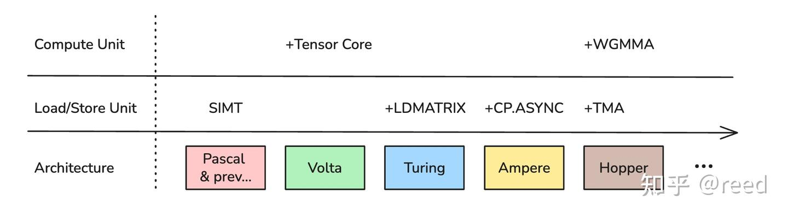
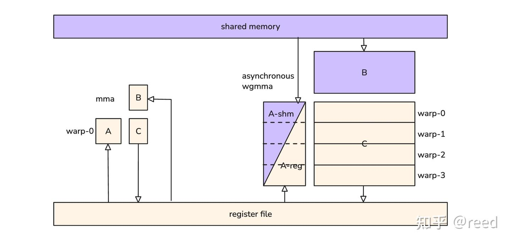
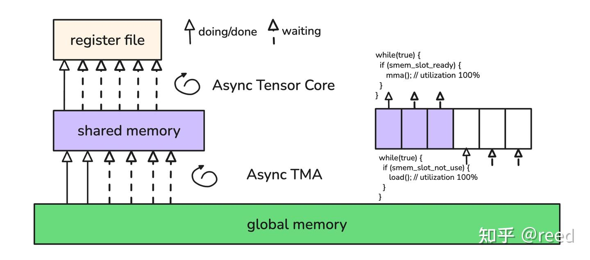
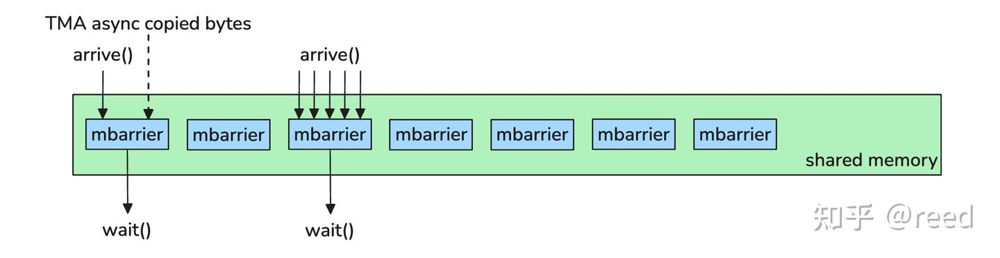
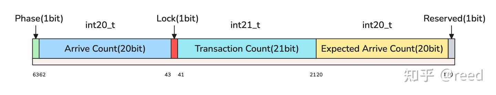
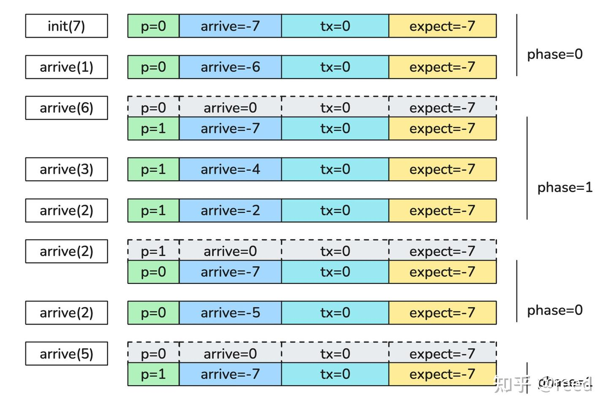
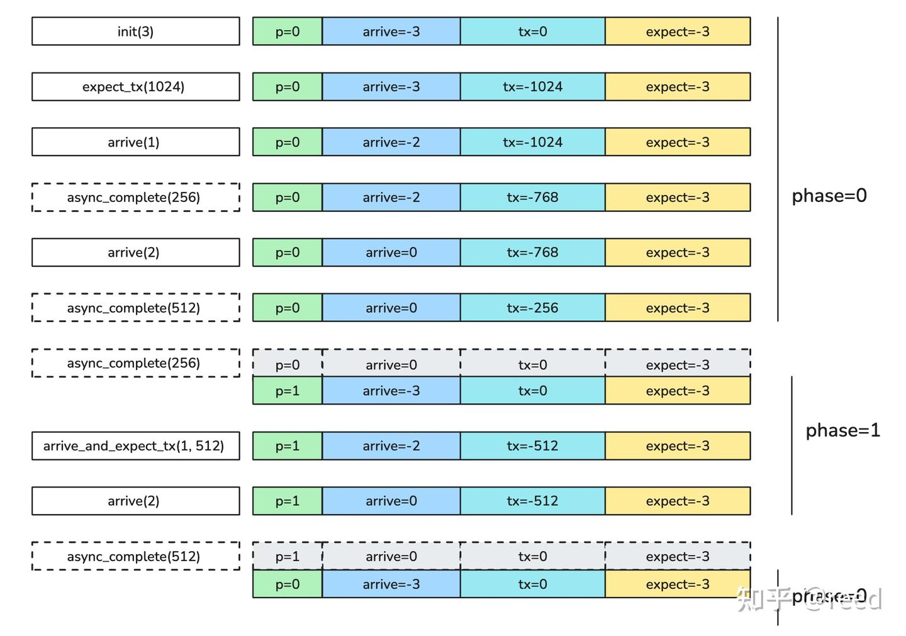

# CuTe Hopper 시리즈 2 - MBarrier

> 원문: https://zhuanlan.zhihu.com/p/1962636004235153810

Hopper 아키텍처는 더 효율적인 연산 유닛과 데이터 이동 유닛을 제공하며, 데이터 의존성을 통해 이 두 유닛의 실행 진행 상황을 조율하는 것이 매우 중요합니다. 이를 위해 Hopper 아키텍처는 **MBarrier** 기능 유닛을 제공합니다. 본 글은 MBarrier의 기능, 데이터 표현, 상태 전이를 중점적으로 소개하고, 실험의 형태로 그 상태 전이를 제시합니다. 글의 구성은 다음과 같습니다. 먼저 NVIDIA GPU의 Tensor Core와 데이터 이동 유닛을 되짚어 GPU의 동기화 유닛을 도입하고, 이어서 MBarrier의 핵심 기능·데이터 구조 표현·상태 전이를 중점적으로 다루며, 마지막으로 본문에서 설명한 예제 코드를 제시하고 전체를 정리합니다.

## 연산과 데이터 이동을 잇는 다리

고성능 프로세서 아키텍처 체계에는 두 가지 핵심이 있습니다. 하나는 **연산**이고 다른 하나는 **데이터 이동**입니다. 프로세서의 세대 교체는 언제나 더 효율적인 연산 코어와 더 효율적인 데이터 이동 엔진을 중심으로 진화해 왔습니다.

NVIDIA GPU의 진화도 당연히 이 패러다임 안에 있습니다. 그림 1과 같이 Volta 아키텍처부터 GPU의 프로세서 유닛인 SM(Stream Multiprocessor)에 Tensor Core가 탑재되어 연산 능력, 특히 행렬 연산 능력이 향상되었습니다. Turing 아키텍처부터는 `ldmatrix` 명령이 제공되어 shared memory에서 register로의 데이터 이동 능력이 강화되었고, Ampere 아키텍처에서는 `cp.async` 명령으로 global memory에서 shared memory로의 비동기 데이터 이동이 가능해졌습니다. Hopper 아키텍처에서는 연산 측면에서 비동기 실행 능력을 갖춘 **WGMMA**(WarpGroup Matrix Multiply-Accumulate) Tensor Core가 탑재되었고, 데이터 이동 측면에서는 독립적인 데이터 이동 유닛인 **TMA**(Tensor Memory Accelerator)가 탑재되었습니다.



Hopper 이전의 Tensor Core 유닛은 행렬 곱셈-누산을 수행할 때 명령의 소스 오퍼랜드와 목적 오퍼랜드가 모두 register였고(그림 2의 mma 명령), 명령의 실행 사이클도 고정되어 있었습니다. Hopper 아키텍처의 Tensor Core 연산 유닛은 mma 명령을 수행할 수 있을 뿐 아니라, 연속된 네 개의 warp가 warp group을 구성하여 함께 더 큰 규격의 행렬 곱을 완성할 수 있습니다. 이때 사용하는 명령이 warp group 계층의 명령, 즉 **WGMMA 명령**입니다. 이 명령에서 논리적 입력 행렬 A는 register뿐 아니라 shared memory에도 저장할 수 있고, B 행렬은 반드시 shared memory에 저장되어야 하며, 출력 행렬인 C는 register에 저장됩니다. 동기적인 MMA 명령과 달리 WGMMA 명령은 **비동기**이므로, 연산을 완료하고 결과의 가시성을 보장하기 위해 추가적인 commit 및 wait 명령과 함께 사용해야 합니다. 연산 규격이 더 크고 여러 warp가 협력하여 수행하며 더 낮은 입력 정밀도(예: FP8)까지 지원하므로 연산 효율이 더 높습니다.



Hopper는 행렬 연산을 수행하는 효율적인 WGMMA 능력과 더불어, 고효율 데이터 복사 엔진인 **TMA**도 제공합니다. TMA는 global memory와 shared memory 사이의 비동기적이고 효율적인 데이터 이동을 구현합니다. 이로써 TMA가 global memory에서 shared memory로의 로드를 담당하고, 비동기 Tensor Core가 WGMMA로 shared memory에서 데이터를 읽어 행렬 연산을 수행한 뒤 결과를 global memory로 출력하는 구성이 가능해집니다. 그림 3과 같이 전형적인 GEMM(General Matrix Multiplication) 구현에서는 데이터를 반복적으로 읽어 shared memory에 기록하고, 동시에 Tensor Core가 shared memory의 데이터를 반복적으로 읽어 행렬 연산을 수행한 뒤 결과를 register에 기록합니다. 여기서 비동기 데이터 이동 유닛인 TMA와 연산 유닛인 Tensor Core가 중간 매개인 shared memory를 통해 **데이터 의존성을 디커플링**하고 있음을 알 수 있습니다. 논리적으로 Tensor Core는 shared memory의 데이터가 어떻게 얻어졌는지 알 필요가 없고, 자신이 의존하는 데이터가 준비되었는지만 알면 됩니다. 의존하는 데이터가 shared memory에 이미 준비되어 있으면 곧바로 연산을 시작할 수 있고, shared memory에 데이터가 끊임없이 준비된다면 Tensor Core는 중단 없이 연산을 수행하여 최대 사용 효율에 도달할 수 있습니다. 한편 비동기 TMA 입장에서도 shared memory의 데이터를 누가 소비하는지 신경 쓸 필요가 없고, 기록할 수 있는 shared memory 공간이 있는지만 확인하면 됩니다. 해당 공간에 의존하는 대상이 없다면 새 데이터를 기록하여 Tensor Core가 사용하도록 할 수 있습니다. 이처럼 shared memory를 중간 데이터 교환 지점으로 사용하면 데이터 로드와 연산을 디커플링하여 각 측의 성능을 최대로 끌어올릴 수 있고, 동시에 shared memory를 중간 버퍼로 사용함으로써 데이터 로드의 지터로 인한 연산 성능 변동을 더 잘 완충할 수 있습니다.



이러한 프로그래밍 패러다임은 전통적인 알고리즘에서는 **producer-consumer 모델**로 나타나며, 전형적인 C++ 구현에서는 lock과 condition variable로 구현됩니다. 이 패러다임에 더 잘 부합하여 Tensor Core와 TMA가 각자의 성능을 충분히 발휘할 수 있도록, Hopper 아키텍처는 스레드 도착·데이터 도착·대기를 조율할 수 있는 효율적인 동기화 메커니즘인 **MBarrier**를 제공합니다.

## MBarrier

전통적인 barrier는 NVIDIA GPU 체계에서 독립적인 하드웨어 유닛으로 구현되어 있습니다. 자주 쓰이는 CUDA 스레드 동기화 함수 `__syncthreads()`를 보면 두 가지 의미를 가집니다. 첫째는 **실행 동기화**이고, 둘째는 **메모리 가시성 장벽**입니다. 실행 동기화란 참여하는 모든 스레드가 `__syncthreads()`를 호출한 뒤 다른 스레드를 기다리며, 모든 스레드가 해당 동기화 지점에 도달해야만 이후 명령을 계속 실행할 수 있다는 뜻입니다. 즉 i. 스레드 도착(arrive), ii. 다른 스레드의 도착 대기(wait)라는 두 단계로 표현할 수 있습니다. 가시성 측면에서 `__syncthreads()`는 이 호출 이전에 임의의 스레드가 발행한 shared memory 쓰기 연산이 호출 이후의 모든 스레드에게 보이도록 보장합니다. C++ 메모리 모델을 빌려 표현하면, 스레드 동기화 이전에 release 의미론을 적용하고 동기화 이후에 acquire 의미론을 적용하는 것으로 간단히 나타낼 수 있습니다. `__syncthreads()`를 간단히 분해하면 다음과 같습니다.

``` cpp
void __syncthreads() {
  memory_release();
  thread_arrive();
  wait_all_threads();
  memory_acquire();
} 
```

위와 같이 thread block 내 모든 스레드가 참여해야 하는 동기화 메커니즘인 `__syncthreads()` 외에도, CUDA는 PTX를 통해 [named barrier](https://docs.nvidia.com/cuda/parallel-thread-execution/#parallel-synchronization-and-communication-instructions-bar) 동기화 메커니즘 `bar.sync a b;`를 제공합니다. 여기서 a는 named barrier의 id로, 각 thread block은 0부터 15까지 총 16개의 named barrier를 사용할 수 있습니다. b는 thread block 내에서 몇 개의 스레드가 참여해야 하는지를 나타냅니다. 참여 스레드 전부가 동기화되어야 하는 `__syncthreads()`와 비교하면, named barrier는 **일부 스레드만의 동기화**를 구현할 수 있어 더 세밀한 동기화 제어가 가능합니다. 핵심 로직은 다음과 같이 분해할 수 있습니다.

``` cpp
void bar_sync(int id, int count) {
  memory_release();
  thread_arrive(id);
  wait_threads(id, count);
  memory_acquire();
}
```

여기서 더 나아가 barrier의 제어 능력과 세밀함을 높이기 위해 NVIDIA는 **mbarrier**를 제시했습니다. 이는 memory barrier의 약어로 메모리 위의 barrier라는 뜻이며, 여기서 말하는 메모리는 shared memory입니다. 개념적으로 mbarrier는 더 이상 개수가 제한된 하드웨어 유닛이 아니라, 그림 4처럼 shared memory 공간만큼 많이 만들 수 있습니다. mbarrier는 더 세밀한 의미론적 제어를 구현하여 독립적인 **arrive** 능력과 **wait** 능력을 제공합니다. 그뿐 아니라 mbarrier는 TMA 비동기 복사의 완료 메커니즘까지 통합하고 있어서, TMA 복사가 완료되면 해당 mbarrier의 상태를 변경할 수 있습니다. 따라서 통일된 wait 하나로 TMA 비동기 복사의 완료를 기다릴 수 있습니다.



mbarrier는 SM의 shared memory를 저장 백엔드로 사용하며, 연산 효율을 높이기 위해 하드웨어 차원에서 cache 구조로 가속합니다. barrier를 초기화하거나 파기할 때만 cache 내용이 shared memory로 write back되고, 그 외의 연산은 모두 cache 내에서 일어나며 shared memory로 기록되지 않습니다. 따라서 명령 계층에서 보면 barrier에 대응하는 SASS 명령 SYNCS의 연산 대상이 shared memory이지만, 그 연산 자체는 shared memory로 write back할 필요가 없어 shared memory 연산보다 훨씬 효율이 높습니다.



mbarrier는 데이터 표현상 **64bit 정수 타입 데이터**로 표현되며, 내부 각 필드의 정의는 그림 5와 같습니다. 전체적으로 여섯 개의 필드로 나뉩니다. 최하위 1비트의 예약(reserved) 필드, 1번 비트부터 20번 비트까지의 **Expected Arrive Count** 필드, 21번 비트부터 41번 비트까지의 **Transaction Count** 필드, 42번 비트 위치의 **Lock** 필드, 43번 비트부터 62번 비트까지의 **Arrive Count** 필드, 그리고 63번 비트 위치의 **Phase** 필드입니다.



구체적으로 살펴보면, mbarrier를 초기화할 때 Expected Arrive Count 필드와 Arrive Count 필드는 음수로 표현된 초기값으로 설정됩니다. 예를 들어 mbarrier를 7로 초기화하면, 즉 7번의 arrive 도착을 기다리게 하면 Expected Arrive Count와 Arrive Count가 모두 -7로 설정되어 7번의 도착을 기다려야 함을 나타냅니다. 이 두 필드는 모두 20비트이고 최상위 비트가 부호 비트이므로 int20_t 타입의 부호 있는 정수로 표현되며, 양수는 그대로, 음수는 2의 보수로 표현합니다. 예를 들어 -7은 `b11111111111111111001`로 표현됩니다. 초기화 시 Transaction Count 필드는 0으로 설정되며, 이 필드도 Arrive Count 필드와 마찬가지로 부호 있는 데이터이지만 비트 수가 하나 더 많아 전체적으로 int21_t 타입으로 표현됩니다. 초기화 시 Lock 필드는 0으로 설정되어 정상 상태임을 나타내고, Phase 필드는 0으로 설정되어 현재 phase 0임을 나타냅니다. Phase는 1비트로만 표현되므로 0과 1 두 가지 상태만 가지며, 이 두 상태를 사용해 mbarrier의 상태 유지와 재사용을 완성합니다. 구체적인 이론은 병렬 컴퓨팅 분야의 Sense Reversing Barrier 부분을 참고하시기 바랍니다. 그림 6과 같이 어떤 스레드가 arrive(n)을 호출하면 Arrive Count 필드에 n이 더해집니다. n을 더한 뒤 Arrive Count 필드가 정확히 0이 되면 해당 mbarrier가 완료된 것이므로 phase가 자동으로 다음 상태로 전환되고(예: 0에서 1로, 또는 1에서 0으로), 동시에 Arrive Count 필드는 Expected Arrive Count 값으로 자동 초기화되어 새로운 phase에서 새로운 arrive의 도착을 다시 기다리게 됩니다. n을 더해도 0에 도달하지 못하면 이번 도착으로는 해당 phase를 완료할 수 없다는 뜻이므로 phase는 그대로이고 Arrive Count에 n만 더해지며, 이후의 arrive가 도착해야 해당 phase를 완료할 수 있습니다. 한 번의 arrive 수량 n을 Arrive Count에 더한 결과가 0보다 크면 이 mbarrier는 오류 상태가 되어 Lock이 1로 설정되고 오류 잠금 상태에 들어갑니다. phase가 전환된 뒤에는(그림에서 회색으로 표시된 부분) 해당 mbarrier에 대한 wait 조건이 만족되므로 wait(phase)를 호출한 스레드는 계속 진행할 수 있습니다. 그렇지 않으면 wait 스레드는 Arrive Count가 0에 도달할 때까지 기다린 뒤에야 실행을 계속할 수 있습니다. 여기서 주목할 점은 초기화 상태, 즉 `p=0,arrive=-7,tx=0,expect=-7`은 `p=1,arrive=0,tx=0,expect=-7`에서 전환되어 온 상태로도 볼 수 있다는 것입니다. 따라서 이 상태에서 wait(phase=1)을 수행하면 조건이 만족됩니다.



이상으로 arrive 이벤트에 따라 mbarrier의 각 필드가 갱신되는 과정을 살펴보았습니다. 다음으로 transaction count와 관련된 상태 전이를 소개합니다. 그림 7과 같이 mbarrier를 초기화할 때 3으로 설정하면 Arrive Count와 Expected Arrive Count가 모두 -3으로 설정되어 3번의 arrive를 기다려야 함을 나타내고, 동시에 transaction count(tx)는 0으로, phase는 0으로 초기화됩니다. 이때 mbarrier가 기다려야 할 transaction bytes를 설정합니다. 그림의 예에서는 1024바이트를 설정했고, 설정 후 tx는 -1024로 갱신되어 1024바이트의 데이터 도착을 기다려야 함을 나타냅니다. 앞에서 설명한 것과 마찬가지로 arrive를 통해 도착을 완료할 수 있으며, 동시에 이 mbarrier를 TMA 복사 유닛에 설정해 둡니다. TMA가 복사를 완료하면 mbarrier의 tx를 자동으로 갱신합니다. 그림의 점선 박스 async_complete가 이에 해당하며, TMA가 데이터 복사를 완료하면 mbarrier에 데이터 도착을 통지하여 mbarrier의 tx 필드에 도착한 데이터량을 더합니다. tx가 도착한 뒤 arrive 필드와 tx 필드가 동시에 0에 도달하면 phase 반전이 완료되고, Arrive Count 필드는 Expected Arrive Count 값으로 초기화되며 Transaction Count 필드는 0으로 초기화됩니다. 이때 다음 라운드에서 기다릴 데이터를 새로 설정하여 mbarrier를 재사용할 수 있습니다. 그림의 회색 박스는 해당 phase의 완료를 나타내며, 이 시점에 해당 mbarrier에 대해 대응하는 phase로 wait를 수행하면 완료될 수 있습니다. 이 지점 이전에 대기하는 경우에는 arrive와 tx 이벤트가 모두 완료되어야 대기가 끝나고, phase 반전 이후에 이전 phase에 대해 대기하면 즉시 완료될 수 있습니다. 또한 mbarrier는 arrive와 tx를 동시에 지정할 수 있는 명령도 제공하여, 해당 데이터의 갱신을 원자적으로 수행함으로써 mbarrier를 조작하는 명령 호출 횟수를 줄일 수 있습니다. mbarrier에 직접 wait를 수행하는 방법 외에, PTX가 제공하는 test 명령으로 mbarrier의 상태를 탐지하는 방법도 있습니다.

mbarrier가 제공하는 wait는 메모리 가시성 scope를 지정할 수 있습니다. 이렇게 하면 wait가 성공했을 때 해당 scope 전체가 그 메모리 부수 효과를 볼 수 있음이 보장되므로, 모든 스레드가 wait해야 하는 상황을 피할 수 있습니다.

CUDA는 PTX의 형태로 mbarrier 기능을 제공하며, CuTe는 mbarrier에 대한 함수 래핑을 제공합니다(cute/arch/copy_sm90_desc.hpp에 위치). 자주 쓰이는 것은 다음과 같습니다.

``` cpp
void
initialize_barrier(uint64_t& smem_barrier,                 // 64 bits user-managed barrier in smem
                   int thread_count = 1)                   // Thread count expected to arrive/wait on this barrier
void
set_barrier_transaction_bytes(uint64_t& smem_barrier,      // 64 bits user-managed barrier in smem
                              uint32_t bytes)              // Number of bytes transfered by per TMA transaction
void
wait_barrier(uint64_t& smem_barrier,                       // 64 bits user-managed barrier in smem
             int phase_bit)                                // Current phase bit the barrier waiting to flip
void
arrive_barrier(uint64_t& smem_barrier)                      // 64 bits user-manged barrier in smem
```

이 밖의 일부 기능은 cutlass/arch/barrier.h에 래핑되어 있습니다.

## 사용 예제

위에서 설명한 mbarrier의 상태 전이 과정을 코드로 검증해 보았습니다. 일반적인 경우 mbarrier는 cache에 캐시되어 있고 shared memory로 write back되지 않으므로, 정상적인 상황에서는 shared memory를 읽어 mbarrier의 데이터를 얻을 수 없습니다. 하지만 `mbarrier.inval` 명령을 호출해 mbarrier를 파기하면 cache의 데이터가 shared memory로 write back되므로, 이때 shared memory를 읽어(LDS) mbarrier의 상태를 얻을 수 있습니다. 구체적인 실험 코드는 https://github.com/reed-lau/cute-gemm/tree/main/mbarrier 를 참고하시기 바랍니다.

## 정리

본 글은 Hopper의 하드웨어 가속 트랜잭션형 메모리 동기화 메커니즘인 MBarrier를 소개했고, 그중 핵심인 데이터 표현과 상태 전이를 중점적으로 다루었습니다. MBarrier는 Hopper의 효율적인 동기화 메커니즘으로서 producer-consumer 패턴을 구현하는 데 필수적인 구성 요소이며, TMA와 Tensor Core가 pipeline을 형성하는 핵심 구성 요소입니다. 또한 본 글에서는 코드 예제를 통해 mbarrier의 상태 전이 과정을 보여주었습니다.

## 참고

- https://patents.google.com/patent/US20230289242A1/en
- https://docs.nvidia.com/cuda/parallel-thread-execution/#parallel-synchronization-and-communication-instructions-bar
- https://mattchung.me/blog/2020/09/18/making-sense-of-the-sense-reversing-barrier-synchronization/
- https://en.cppreference.com/w/cpp/atomic/memory_order.html
