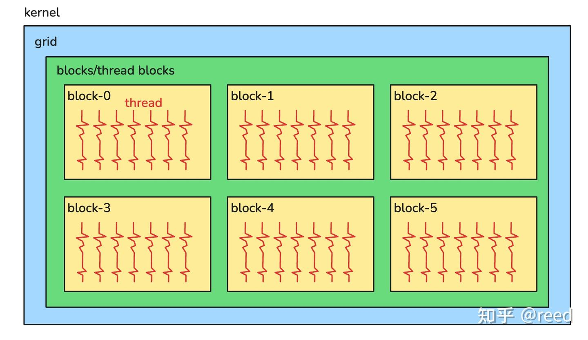
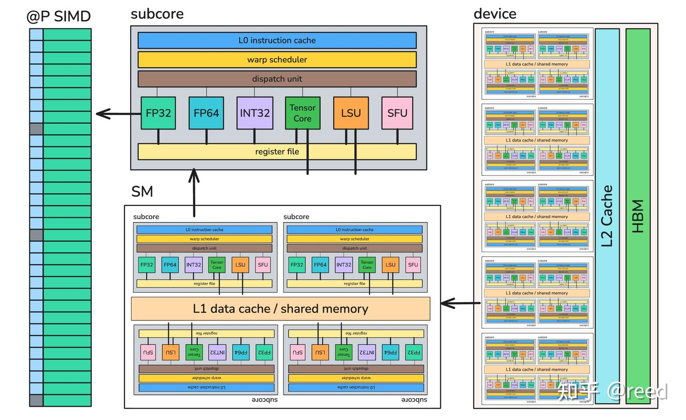
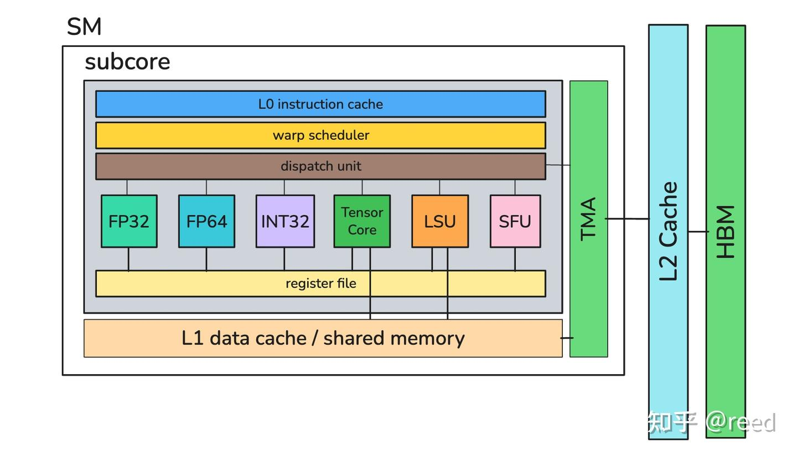
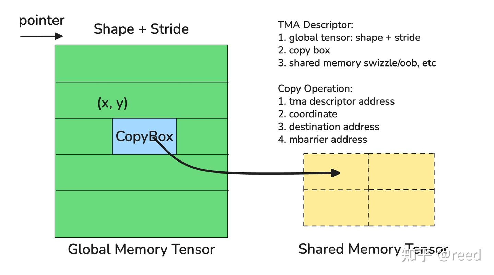
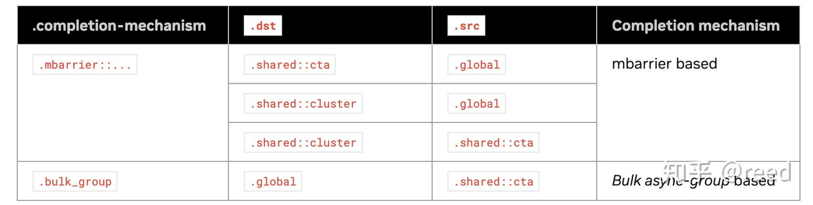
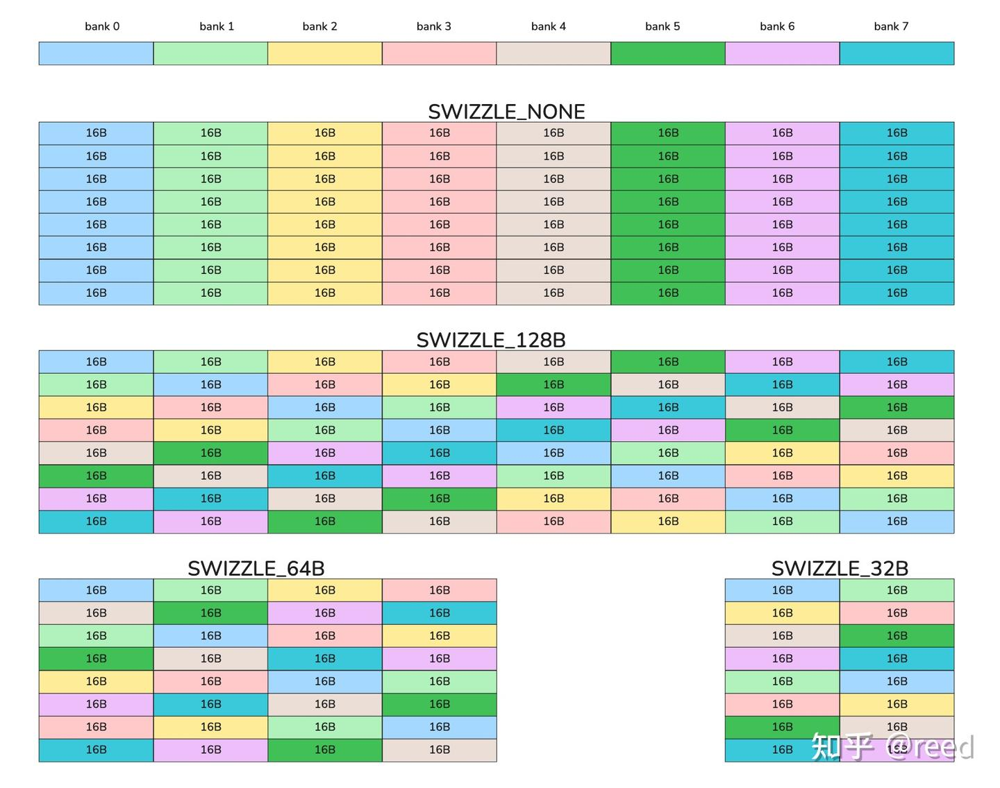
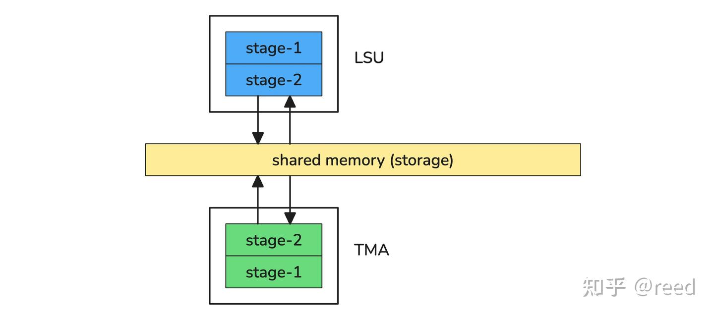
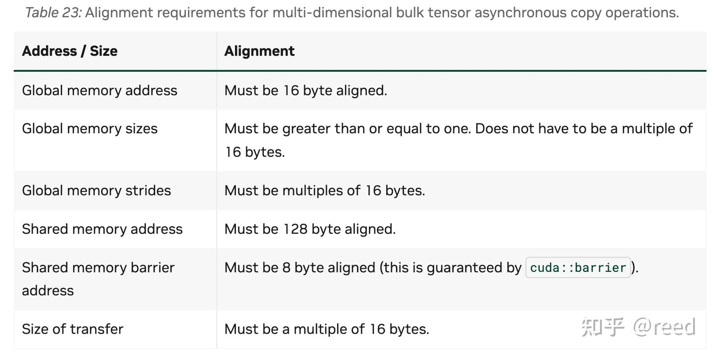

# CuTe Hopper 시리즈 3 - TMA

> 원문: https://zhuanlan.zhihu.com/p/1985678344352731952

Hopper 아키텍처 이전에는 모든 데이터 복사를 여러 thread가 함께 수행했습니다. 각 thread가 거의 동일한 주소 계산을 수행하고, thread 하나가 한 번에 최대 16바이트를 로드하며, 더 큰 규격의 데이터 이동은 여러 번의 루프로 완성했습니다. 그러나 Hopper 및 그 이후 아키텍처에서는 데이터 로드 효율을 높이고 복잡하며 오류가 나기 쉬운 로드 과정을 줄이기 위해, NVIDIA가 데이터 이동 작업을 **독립적인 하드웨어 유닛인 TMA(Tensor Memory Accelerator)** 로 추상화했습니다. TMA의 능력을 빌리면 Hopper에서 효율적인 데이터 이동을 구현할 수 있습니다. 본 글은 먼저 전통적인 SIMT 프로그래밍 모델과 그 모델에서의 데이터 이동을 소개하고, 이어서 Hopper의 TMA 능력과 프로그래밍 모델의 변화를 중점적으로 다루며, TMA descriptor와 복사 작업 발행 등의 특징을 자세히 설명합니다. 마지막으로 CuTe가 TMA 능력을 어떻게 캡슐화하고 추상화했는지 소개합니다.

## SIMT 프로그래밍 모델에서의 데이터 이동

CUDA는 처음부터 SIMT 프로그래밍 모델을 선택했습니다. 프로그래밍 논리 관점에서 거시적인 것부터 미시적인 것까지 살펴보면, 하나의 프로그램(kernel)은 하나의 thread grid로 구성되고, 각 thread grid는 하나 이상의 thread block(block)으로 구성되며, 각 thread block은 하나 이상의 thread로 구성됩니다(그림 1). thread grid는 일정한 지역성을 가지며, grid 내 여러 thread는 협력하여 계산과 동기화를 수행할 수 있습니다.



프로그래밍 모델은 소프트웨어 모델이며, 그 본질은 하드웨어 구조와 능력에 대한 추상입니다. SIMT 프로그래밍 모델이 이렇게 추상화된 것은 NVIDIA 하드웨어의 설계 방식에 의해 결정된 것입니다. 그림 2처럼 NVIDIA GPU 하드웨어 아키텍처는 전체적으로 네 계층으로 나뉩니다. 가장 안쪽의 실행 유닛은 predication 능력을 갖춘 SIMD 코어로, 단일 cycle 안에 벡터화된 부동소수점 연산을 완료할 수 있습니다. 그림의 FP32 코어는 한 주기에 IEEE 표준을 따르는 32bit 부동소수점 곱셈·덧셈·곱셈누산을 32개 수행할 수 있으며, predicate로 해당 lane의 실행 여부를 결정합니다. FP32 기능 유닛과 마찬가지로 NVIDIA 하드웨어는 정수 계산 유닛(INT32), 64bit 부동소수점 계산 유닛(FP64), 행렬 계산 유닛(Tensor Core), 데이터 로드 유닛(LSU), 특수 함수 유닛(SFU, 사인·코사인·역수·제곱근·지수·로그 등을 계산)을 제공합니다. 이렇게 서로 다른 계산 타입의 유닛들이 조합되어 다기능 계산 능력을 형성하고, 여기에 warp scheduler와 dispatch unit이 함께 결합되어 **subcore**를 이룹니다. subcore는 warp 레벨의 스케줄링과 실행 능력을 제공합니다. subcore 4개가 합쳐져 더 큰 계산 능력을 형성하고, 여기에 L1 data cache와 shared memory가 더해져 **SM(Stream Multiprocessor)** 이 됩니다. SM에는 여러 subcore의 데이터 동기화와 실행 진행도를 협조할 수 있는 barrier 하드웨어 유닛이 있으며, shared memory는 국소적인 데이터 재사용을 제공합니다. 여러 SM이 모이고 여기에 L2 cache와 HBM(High Bandwidth Memory)이 더해져 GPU device를 형성합니다.



소프트웨어의 grid는 하드웨어 device의 추상이며, 스케줄링 유닛을 통해 수가 제한된 SM으로도 그 규격을 훨씬 초과하는 크기의 grid를 지원할 수 있습니다. 소프트웨어의 block은 하드웨어 SM의 추상으로, block 안에는 여러 warp가 포함되고 block 내 thread들은 shared memory로 데이터를 공유하며 thread 동기화를 할 수 있습니다. 본질적으로는 하드웨어가 SM 계층에서 프로그래밍 가능한 cache 구조인 shared memory를 제공하고, 동시에 실행 동기화를 위한 barrier 능력을 제공하기 때문입니다. 하나의 block이 사용하는 자원이 많지 않을 때는 하나의 SM이 여러 block을 병렬로 수용하여 자원 이용 효율을 높일 수 있습니다. 소프트웨어의 warp는 하드웨어 subcore에 대한 추상이며, 단일 warp 내에서 병렬 계산을 수행하고 여러 타입의 명령을 처리할 수 있습니다. 그리고 predicate를 갖춘 SIMD 코어는 thread의 추상으로, predicate로 실행할 필요가 없는 lane을 mask하여 SIMT 의미를 구현합니다.

GPU로 특정 문제를 풀 때의 본질은, 작업을 병렬 실행 가능한 더 작은 하위 작업으로 분할하고 이들을 병렬로 실행되는 FP32나 INT32 등의 코어에 배정하는 것입니다. 구체적으로 각 thread는 자신이 속한 block 번호와 thread 번호(CUDA의 blockIdx와 threadIdx)에 따라 문제 영역의 아주 작은 계산 논리에 매핑됩니다. 데이터 계산과 로드 모두 마찬가지입니다. 전체적으로는 $T = P(\text{threadIdx}, \text{blockIdx})$ 로 표현할 수 있습니다. 이 작업 분할에 따라 FP32/INT32/LSU 등을 사용해 데이터 로드와 계산을 완성합니다.

이상이 SIMT 모델에서 GPU가 동작하는 논리입니다. 딥러닝 시나리오에서 계산이 마주하는 입출력은 보통 고차원 Tensor이며, 작업 분할 후 수행해야 하는 데이터 복사 역시 고차원 공간 안의 한 블록입니다. 자주 쓰이는 GEMM 계열 계산을 예로 들면, Ampere 아키텍처에서 각 thread가 담당하는 작업은 다음과 같습니다.

1. 데이터를 shared memory로 로드(INT32 사용)
2. shared memory 데이터를 register로 읽기
3. Tensor Core로 행렬 곱셈누산 계산 수행
4. 결과를 shared memory로 쓰기
5. shared memory 데이터를 register로 읽기
6. register 데이터를 global memory로 쓰기

위 GEMM 계산 관련 메모리 연산에 shared memory 조작이 다수 포함되어 있음을 알 수 있습니다. shared memory를 사용하면 데이터 재사용을 높이고 global memory 접근량을 줄여 낮은 대역폭 경로의 점유를 줄이고 계산 효율을 높일 수 있기 때문입니다. 그러나 global memory와 shared memory 사이의 읽기·쓰기에는 대량의 주소 계산과 번거로운 처리가 수반됩니다. global memory를 읽어 shared memory에 쓰는 경우를 예로 들면, 입력이 되는 global memory 데이터의 주소를 INT32 유닛으로 계산하고, 출력되는 shared memory의 주소도 INT32 유닛으로 계산해야 합니다. 또한 shared memory의 bank 구조 때문에 bank conflict를 회피하는 논리를 도입해야 하며, 여기에도 정수 및 논리 ALU 명령이 소모됩니다. bank conflict 처리 외에도 행렬 계산은 일반적으로 블록 단위로 수행되기 때문에, 경계가 나누어떨어지지 않는 경우(tile quantization) 읽기를 mask하고 출력되는 shared memory 부분은 0으로 채워야 하므로 추가 명령이 소모됩니다. 주목할 점은 SIMT 프로그래밍 모델에서는 이런 연산에 **모든 thread가 참여해야 한다**는 것입니다. 게다가 이런 종류의 문제는 실수하기도 쉽습니다. 통계에 따르면 CUDA 개발자는 시간의 90%를 데이터 접근 관련 문제 처리에 쓴다고 하며, 바꿔 말하면 CUDA 프로그래머는 대부분의 시간을 illegal memory 관련 문제와 씨름하며 보낸다는 뜻입니다.

## 효율적인 비동기 Tensor 메모리 복사 가속 유닛

SIMT 관점에서 발생하는 이런 하드웨어 계산 낭비, 높은 프로그래밍 오류율, 낮은 개발 효율 문제에 대해, NVIDIA는 Hopper 아키텍처에서 global memory와 shared memory 사이의 데이터 복사에 대한 소프트웨어·하드웨어 협동 해법을 제시했습니다. 하드웨어 측면에서는 독립적인 **TMA(Tensor Memory Accelerator)** 를 제공합니다. TMA는 데이터 복사 관련 기능을 추상화하고 고도로 집적하여 독립 하드웨어 유닛으로 만든 것으로, global memory와 shared memory 사이에서 1차원부터 5차원까지의 큰 블록 Tensor 의미의 복사를 수행할 수 있습니다. 복사와 동시에 shared memory bank conflict를 회피하는 swizzle 모드를 설정할 수 있고, 경계를 벗어나는 경우(Out Of Bound, OOB)의 채우기 모드도 설정할 수 있습니다. 복사와 계산의 병렬 효율을 높이기 위해 이 복사들은 비동기로 실행됩니다. 즉 SM은 복사 작업을 발행한 후 즉시 다른 작업을 수행할 수 있고, thread가 복사 때문에 블로킹되지 않습니다. 소프트웨어 측면에서도 기존 SIMT 프로그래밍 패러다임을 깨뜨려, 모든 thread가 주소 계산과 데이터 읽기에 참여할 필요 없이 **thread 하나만으로 큰 블록의 Tensor 복사 작업을 발행**할 수 있습니다.



그림 3처럼 TMA는 하드웨어 구조상 SM과 일대일로 대응하며 SM 내부에 배치됩니다. dispatch 유닛이 TMA 유닛으로 데이터 복사 명령을 보낼 수 있고, 명령이 전송되면 TMA가 비동기적으로 데이터를 복사하여 global memory에서 SM 내 shared memory로의 데이터 이동을 완성합니다.

### TMA descriptor

TMA로 global memory에서 shared memory로의 데이터 이동을 수행하려면 두 단계가 필요합니다. 첫 단계는 **TMA descriptor 정의**이고, 두 번째 단계는 **복사 수행(Copy Operation)** 단계입니다. TMA descriptor는 복사에 필요한 필수 정보를 기술한 메모리 구조입니다. 그림 4처럼 TMA descriptor에는 global memory의 기술 정보, 즉 입력 Tensor의 global memory 주소와 Tensor의 shape·stride 표현, 그리고 한 번의 복사에서 옮기는 복사 블록의 크기 표현(그림의 CopyBox), shared memory 상 Tensor의 swizzle 정보와 OOB 정보가 포함됩니다. descriptor의 정보를 통해 TMA는 입력 Tensor에 대한 완전하고 정확한 기술과 복사 수행 시 필요한 크기 및 데이터량을 알 수 있고, 동시에 shared memory에 쓸 때 어떻게 swizzle해야 하는지도 알게 됩니다. 복사 수행 단계, 즉 SM이 복사 작업을 발행할 때는 SM이 TMA에 TMA descriptor의 위치 정보를 제공해야 하며, TMA 유닛은 해당 위치에서 위 정보를 읽습니다. 또한 복사할 블록의 시작 위치(그림의 xy)도 제공해야 하고, shared memory를 목적지로 할 때는 shared memory의 주소와 복사 완료 메커니즘으로 쓰이는 MBarrier의 주소도 제공해야 합니다.



TMA descriptor 구축을 위해 CUDA는 아래와 같은 전용 Driver API `cuTensorMapEncodeTiled`를 제공합니다. 메모리 기술 정보 등을 입력하여 TMA descriptor(tensorMap)를 구축하며, TMA로 복사를 수행할 때 이 descriptor를 CUDA kernel에 전달해야 합니다.

```cpp
CUresult cuTensorMapEncodeTiled (
      CUtensorMap* tensorMap,
      CUtensorMapDataType tensorDataType,
      cuuint32_t tensorRank,
      void* globalAddress,
      const cuuint64_t* globalDim,
      const cuuint64_t* globalStrides,
      const cuuint32_t* boxDim,
      const cuuint32_t* elementStrides,
      CUtensorMapInterleave interleave,
      CUtensorMapSwizzle swizzle,
      CUtensorMapL2promotion l2Promotion,
      CUtensorMapFloatOOBfill oobFill);
```

현재 TMA descriptor를 kernel에 전달하는 방법은 세 가지가 있습니다. 첫 번째는 `const __grid_constant__` 한정자를 사용해 kernel parameter로 값을 전달하는 방법입니다.

```cpp
__global__ void tma_desc_demo1(const __grid_constant__ CUtensorMap map);
```

두 번째는 CUDA 런타임 API `cudaMemcpyToSymbol`로 descriptor를 `__constant__` 한정자가 붙은 device 변수에 복사하는 방법입니다.

```cpp
// device
__constant__ CUtensorMap device_tma_desc;

// Host
CUtensorMap host_tma_desc;
cudaMemcpyToSymbol(device_tma_desc, &host_tma_desc, sizeof(host_tma_desc));
```

세 번째는 TMA descriptor를 global memory에 저장하고, CUDA kernel 내부에서 TMA에 그 descriptor 주소를 직접 제공하는 방법입니다.

```cpp
__global__ void update_tma(CUtensorMap *desc) {
  // TMA descriptor 필드 갱신
  // global memory의 shape / stride 갱신
  // copy box 등 갱신
}
__global__ void tma_desc_demo3(CUtensorMap *desc) {
  // desc를 TMA operation에 전달
}
```

위 세 가지 형태는 서로 다른 시나리오에 적합합니다. 첫 번째는 host 측에서 global memory Tensor를 확정할 수 있는 경우, 예를 들어 길이가 고정된 linear 계층에 대응하는 GEMM에 적합합니다. 두 번째는 첫 번째와 유사하지만 복사 계열 API 호출이 하나 더 필요합니다. 세 번째는 global memory에 있는 Tensor의 차원 등 정보를 동적으로 수정해야 할 때 사용하는 방식으로, 대규모 모델의 MoE(Mixture of Experts) 계층에서 GroupGEMM을 구현할 때처럼 행렬의 m 축이 동적으로 변하는 경우 보통 세 번째 형태를 사용합니다. 어떤 형태이든 본질은 크기 128바이트의 기술 정보이며, 다만 이 정보가 비교적 고정적인지 아니면 런타임에 동적으로 갱신·변경되는지의 차이일 뿐입니다. 효율 측면에서 앞의 두 방법은 CUDA 드라이버 계층이 descriptor를 더 효율적인 캐시 시스템에 두도록 보장할 수 있어 TMA가 descriptor를 가져올 때 효율이 더 좋습니다. 세 번째 형태는 TMA 유닛이 HBM에서 L2 cache를 거쳐 descriptor를 가져와야 하므로 일정한 overhead가 발생합니다. 이 경우 소프트웨어 프로그래밍 관점에서 적절한 위치에 descriptor를 prefetch할 수 있으며, 사용하는 PTX 명령과 대응하는 SASS는 다음과 같습니다.

```cpp
// PTX
prefetch{.tensormap_space}.tensormap [a];

.tensormap_space =          { .const, .param };

// SASS
UTMACCTL.PF [UR4] ;  // Uniform TMA Cache ConTraL PreFetch
```

위 SASS 명령은 TMA 유닛이 동작 효율을 높이기 위해 TMA descriptor의 cache 구조를 가지고 있음을 드러냅니다. TMA는 복사 관련 작업을 수행할 때 먼저 로컬 cache 구조에서 descriptor 정보를 찾고, 적중하면 곧바로 해당 복사 작업을 발행하며, 적중하지 못하면 더 하위 계층의 저장 구조에서 읽어옵니다.

### 복사 작업 발행

TMA descriptor는 global memory의 상황과 실제 복사 시의 기본 블록을 정확히 기술합니다. 실제로 복사가 필요할 때는 PTX가 제공하는 명령으로 구현할 수 있으며, global memory에서 shared memory로의 복사를 예로 들면 구체적인 명령은 다음과 같습니다.

```text
cp.async.bulk.tensor.dim.dst.src{.load_mode}.completion_mechanism{.level::cache_hint}
                                   [dstMem], [tensorMap, tensorCoords], [mbar] {, cache-policy}

.dst =                  { .shared::cta }
.src =                  { .global }
.dim =                  { .1d, .2d, .3d, .4d, .5d }
.completion_mechanism = { .mbarrier::complete_tx::bytes }
.load_mode =            { .tile, .im2col }
.level::cache_hint =    { .L2::cache_hint }
```

여기서 `cp`는 copy의 약자로 데이터 이동 명령임을 나타내고, `async`는 비동기 명령임을 나타냅니다. 즉 명령이 실행되었다고 해서 복사가 완료된 것이 아니라 복사 작업이 발행되었음을 의미할 뿐입니다. `bulk`는 큰 블록 메모리 복사를 뜻하며 Ampere 아키텍처의 `cp.async` 명령과 구별됩니다(Ampere의 `cp.async`는 여전히 SIMT 패러다임의 명령입니다). `tensor`는 tensor를 대상으로 하는 복사, 즉 Tensor에서 Tensor로의 블록 복사임을 나타냅니다. `dim`은 tensor의 차원 정보(rank 정보)를 나타내며 1차원에서 5차원까지만 지원합니다. `dst`와 `src`는 복사의 목적지와 원본 메모리 타입을 지정하며, 각각 thread block의 shared memory와 global memory입니다. `load_mode`는 TMA의 로드 모드를 나타내는데, 본 글에서 중점적으로 다루는 tile 모드 외에 convolution 연산을 위한 im2col 모드도 있습니다. tile 모드는 블록 대 블록 모드로 입력과 출력의 크기가 같습니다. `completion_mechanism`은 완료 메커니즘을 나타내며, 여기서는 `mbarrier::complete_tx::bytes`로 완료 메커니즘이 MBarrier임을 뜻합니다. 복사가 완료되면 TMA가 복사한 바이트 수를 MBarrier의 transaction bytes 필드에 기록하고(「CuTe Hopper 시리즈 - MBarrier」 참고) 동시에 완료를 통지합니다. `level::cache_hint`는 사용할 L2 cache의 축출 정책을 나타내며 `evict_norm`, `evict_first`, `evict_last` 등이 있습니다. 데이터 재사용의 시간적·공간적 지역성에 따라 적절한 L2 축출 정책을 선택하면 L2 이용 효율을 높일 수 있습니다.

이상으로 TMA가 복사를 발행할 때의 modifier 속성을 소개했습니다. 구체적인 오퍼랜드 측면에서는, `dstMem`이 출력 주소를 지정하며 여기서는 shared memory의 주소를 가리킵니다. `tensorMap`과 `tensorCoords`는 TMA descriptor의 주소와 복사 블록의 좌표를 지정하며, modifier의 `dim` 선택에 따라 전달하는 인자의 개수가 달라집니다. `mbar`는 완료 시 통지 메커니즘인 MBarrier의 주소를 지정하고, `cache-policy`는 선택 항목으로 L2 축출 정책을 지정합니다.

특히 1차원 시나리오에서는 복잡한 TMA descriptor를 지정하지 않고 global memory의 주소와 size만 지정하여 큰 블록 데이터 이동을 완성할 수 있습니다. global memory에서 shared memory로의 복사에 대해 PTX가 제공하는 비동기 복사 명령은 다음과 같습니다.

```text
// global -> shared::cta
cp.async.bulk.dst.src.completion_mechanism{.level::cache_hint}
                      [dstMem], [srcMem], size, [mbar] {, cache-policy}

.dst =                  { .shared::cta }
.src =                  { .global }
.completion_mechanism = { .mbarrier::complete_tx::bytes }
.level::cache_hint =    { .L2::cache_hint }
```

modifier 측면에서는 전체적으로 tensor 버전과 유사하지만 `tensor`와 `dim` modifier가 더 이상 필요하지 않고, 인자 측면에서도 global memory의 주소와 size만 지정하면 되므로 비교적 복잡한 TMA descriptor 구축을 피할 수 있습니다. 1차원 복사에는 TMA descriptor가 필요하지 않지만 전체적인 동작 패러다임은 여전히 전통적인 SIMT 방식이 아닌 TMA 방식입니다. 명령 하나만으로 큰 블록 데이터의 복사를 완성할 수 있고, 모든 thread가 복사 작업에 참여할 필요가 없습니다.

### 완료 메커니즘

위 명령 소개에서 볼 수 있듯이, global memory에서 shared memory 방향의 복사는 MBarrier를 완료 메커니즘으로 사용하고, shared memory에서 global memory 방향의 복사는 bulk group 메커니즘, 즉 commit/wait 메커니즘을 사용합니다. 이는 Ampere의 `cp.async`와 유사하게 앞서 발행한 비동기 복사들을 한꺼번에 commit하고, commit 이후 wait 명령으로 이들의 완료를 확인하는 방식입니다. 원본과 목적지 메모리 조합에 따른 완료 메커니즘은 아래 그림과 같습니다(NVIDIA PTX 문서에서 인용).



### Swizzle 메커니즘

TMA descriptor를 생성할 때 shared memory의 읽기 또는 쓰기 충돌을 피하기 위해 swizzle 모드를 지정할 수 있으며, 자주 쓰이는 것은 다음 네 가지입니다.

```cpp
CU_TENSOR_MAP_SWIZZLE_NONE,
CU_TENSOR_MAP_SWIZZLE_32B,
CU_TENSOR_MAP_SWIZZLE_64B,
CU_TENSOR_MAP_SWIZZLE_128B
```



그림 6은 shared memory의 bank 상황을 보여줍니다. 여기서 최소 단위는 16바이트로 표현되며, shared memory에 bank가 8개 있다고 볼 수 있고 서로 다른 bank는 서로 다른 색으로 표시됩니다. swizzle을 하지 않는 경우, 즉 `SWIZZLE_NONE`에서는 가로 방향 128바이트가 서로 다른 bank이고 세로 방향으로는 swizzle을 하지 않으므로 각 행의 bank 색이 첫 행과 동일합니다. `SWIZZLE_128B`의 경우, 즉 swizzle의 경계가 128B인 경우에는 두 번째 행의 128B에 대해 16B를 단위로 한 열 번호와 행 번호를 XOR하여 swizzle 후의 bank 번호를 얻습니다. 즉 `ibank = irow ^ icol`입니다. `SWIZZLE_64B` 모드는 `SWIZZLE_128B`의 첫 행을 앞뒤 두 부분으로 나누어 두 번째 부분, 즉 뒤쪽 64B가 두 번째 행으로 접혀 두 행을 이루는 것으로 볼 수 있습니다. 세 번째 행과 네 번째 행은 `SWIZZLE_128B`의 두 번째 행의 앞뒤 절반이 두 행으로 배열된 것으로 볼 수 있습니다. `SWIZZLE_32B`도 같은 방식으로 유추할 수 있습니다. 전체 계산 논리는 다음과 같습니다.

```cpp
int banks[sizeh][sizew];
for (int irow = 0; irow < sizeh; ++irow) {
  for (int icol = 0; icol < sizew; ++icol) {
    int ioffset = irow * sizew + icol;
    int irow1 = ioffset / 8; 
    int icol1 = ioffset % 8;
    banks[irow][icol] = irow1 ^ icol1; 
  }
}
```

### Async 유닛과 가시성 보장

위 설명을 통해 TMA가 비동기적으로 shared memory를 읽고 쓸 수 있음을 알았습니다. 전통적인 LSU 또한 shared memory를 읽고 쓸 수 있습니다(`__shared__` 메모리에 대한 읽기·쓰기). 그러나 TMA와 LSU는 동작 파이프라인을 공유하지 않으므로, TMA와 LSU의 shared memory 조작에 대한 가시성을 보장하려면 추가적인 메커니즘이 필요합니다.



TMA가 global memory의 데이터를 읽어 shared memory에 쓰는 경우에는, MBarrier의 wait 메커니즘으로 thread block이 TMA의 읽기 결과를 볼 수 있음을 보장할 수 있으므로 LSU로 shared memory를 읽으면 올바른 결과를 얻습니다. 반대로 LSU로 shared memory에 데이터를 쓰고 TMA로 읽는 경우, 추가 조치를 하지 않으면 TMA가 잘못된 결과를 읽을 수 있습니다. 아래 예시처럼 LSU로 먼저 shared memory에 데이터를 쓴 뒤 thread block 동기화 함수 `__syncthreads`를 호출하고, 동기화 이후 단일 thread의 TMA로 shared memory를 읽는다고 합시다. 시간 순서상으로는 shared memory에 먼저 쓰고 그다음 TMA 읽기를 발행한 것처럼 보이지만, TMA가 발행된 후 실제로 데이터를 읽는 시점에 LSU의 shared memory 쓰기는 여전히 파이프라인 위에 있어 실제로 완료되지 않았을 수 있고, 이는 TMA에 대한 가시성도 보장하지 못합니다. 따라서 TMA가 잘못된 데이터를 읽을 가능성이 있습니다. 만약 `__syncthreads` 이후가 일반적인 shared memory 읽기라면 같은 파이프라인을 거치므로 올바른 데이터를 읽는 것이 보장됩니다.

```cpp
__shared__ float sdata[1024];

sdata[idx] = idx;
__syncthreads();

if(elected) {
  TMA::copy(sdata, ...);
}
```

이런 시나리오에서는 fence 명령을 명시적으로 사용해 메모리 트랜잭션의 일관성을 보장해야 합니다. 수정된 코드는 다음과 같습니다.

```cpp
sdata[idx] = idx;
asm volatile("fence.proxy.async.shared::cta;\n");
__syncthreads();

if(elected) {
  TMA::copy(sdata, ...);
}
```

여기서 fence 명령은 fence 이전의 메모리 트랜잭션이 추적되도록 하여 TMA가 해당 메모리 배리어 트랜잭션을 볼 수 있게 보장하고, `__syncthreads`는 가시성의 동기화가 아니라 실행 계층의 thread 동기화를 보장합니다. 이렇게 하면 TMA가 발행한 복사 작업은 fence 트랜잭션이 완료된 후에야 진행되므로 올바른 결과를 얻을 수 있습니다. 어느 정도는 fence 구문이 있음으로써 TMA가 LSU의 쓰기 완료를 볼 수 있고 쓰기가 끝나기를 기다린 후에야 shared memory 읽기를 시작하게 되어 올바른 결과를 얻는다고 이해할 수 있습니다.

### 그 밖의 측면

위에서 소개한 TMA의 기본 개념과 사용법 외에도, TMA는 cluster 내 **multicast** 능력을 제공합니다. 즉 한 번 읽은 데이터를 cluster 내 여러 block에 멀티캐스트할 수 있습니다. 또한 위에서 언급한 tile 복사 능력 외에 convolution 계산 방식을 위한 image2column 능력을 제공하여 복잡한 좌표 변환과 데이터 배열을 처리합니다. 동시에 TMA가 shared memory를 읽어 global memory로 쓸 때는 쓰기와 함께 reduce를 결합하는 능력도 사용할 수 있습니다. 이 부분의 능력은 구체적인 사용 시나리오에서 관련 문서를 참고하여 활성화할 수 있습니다.

앞서 TMA가 TMA descriptor에 대한 prefetch 능력을 제공한다고 언급했는데, TMA는 global memory에서 읽을 데이터 자체에 대한 prefetch 능력도 제공합니다. 이를 통해 프로그래머는 계산 과정 중에 필요한 데이터를 미리 가져와 메모리 접근 효율을 높일 수 있습니다.

TMA는 단일 thread 발행 패러다임이며 block과 warp 안에서 thread 하나만 있으면 큰 블록 데이터 복사를 완성할 수 있으므로, 명령 설계 측면에서 uniform 명령의 범주에 속합니다. 자연스럽게 그 인자도 uniform register이며, 이는 general register 사용을 줄여줍니다. 또한 이런 단일 thread 발행 방식을 돕기 위해 NVIDIA는 leader thread 선택을 더 잘 구현할 수 있도록 `elect.sync` PTX 명령을 제공합니다.

큰 블록 메모리 접근이기 때문에 효율을 고려하여 TMA가 접근하는 메모리에는 정렬 요구사항이 있습니다. 구체적인 정렬 요구사항은 다음과 같습니다(NVIDIA CUDA 프로그래밍 가이드 참고).



## CuTe의 캡슐화

TMA 능력에 대해서는 TMA descriptor의 생성, device 측의 복사 발행, TMA descriptor의 prefetch, 접근 예정 Tensor의 prefetch, fence 능력 등 모든 부분을 CuTe가 잘 캡슐화해 두었습니다. 이후 Hopper에서 효율적인 GEMM 구현을 완성할 때도 이 캡슐화를 사용할 것입니다. 핵심 캡슐화는 CuTe의 `cute/arch/copy_sm90_desc.hpp` 파일과 `cute/arch/copy_sm90_tma.hpp` 파일에 있습니다. 간단히 발췌하면, `cute/arch/copy_sm90_desc.hpp` 파일에는 TMA descriptor의 prefetch에 대한 캡슐화가 있습니다.

```cpp
void prefetch_tma_descriptor(TmaDescriptor const* desc_ptr);

enum class CacheHintSm90 : uint64_t {
  EVICT_NORMAL = 0x1000000000000000,
  EVICT_FIRST = 0x12F0000000000000,
  EVICT_LAST = 0x14F0000000000000,
};
```

`cute/arch/copy_sm90_tma.hpp`에는 복사 발행 능력에 대한 캡슐화가 있으며, LOAD, STORE, REDUCE, 1D 능력, IM2COL, MULTICAST 능력을 포함합니다.

```text
struct SM90_TMA_LOAD{_MULTICAST}[_1D/2D/3D/4D/5D]/PREFETCH
struct SM90_TMA_LOAD_IM2COL{_MULTICAST}[_3D/4D/5D]
struct SM90_TMA_STORE[_1D/2D/3D/4D/5D]
struct SM90_TMA_REDUCE_ADD[_1D/2D/3D/4D/5D]
struct SM90_BULK_COPY_G2S/S2G
```

## 정리

SIMT 프로그래밍 패러다임에서는 모든 thread가 데이터 읽기·쓰기에 참여해야 하고, 복잡한 경계 처리와 shared memory의 bank 구조로 인한 swizzle 최적화를 다뤄야 하며, 여기에 많은 정수 계산 명령이 소모되고 개발 효율도 그만큼 떨어집니다. 이런 문제에 대해 위의 계산과 처리 요구를 독립 하드웨어 유닛인 TMA로 캡슐화하면, shared memory와 global memory 사이의 데이터 복사를 효율적으로 수행하면서 설정 방식으로 swizzle 모드와 OOB 모드를 처리할 수 있어 주소 관련 계산이 줄고 프로그래밍 효율이 높아집니다. 이는 NVIDIA가 SIMT 프로그래밍 패러다임에서 이뤄낸 하나의 돌파구입니다. TMA 능력을 사용하려면 **TMA descriptor 구성**과 **복사 발행**이라는 두 부분이 필요하며, 본 글에서는 global memory에서 shared memory로의 복사를 예로 관련 명령을 자세히 소개하고, 개발 중 자주 마주칠 수 있는 가시성 문제를 설명하고 해석했습니다. CuTe는 이 능력에 대해 비교적 전면적이고 완전한 캡슐화를 제공하므로, CuTe를 잘 활용하면 TMA의 능력을 충분히 이용해 효율적인 데이터 복사를 완성할 수 있습니다. 이후에는 Hopper의 또 다른 중요한 기능 유닛인 WGMMA를 소개하고, 마지막으로 TMA로 효율적인 데이터 로드를, WGMMA로 효율적인 행렬 연산을, MBarrier로 효율적인 협동을 완성하여 이 셋의 힘으로 Hopper 아키텍처에서 효율적인 행렬 계산을 완성할 것입니다.

## 참고

- CuTe Hopper 시리즈 - MBarrier: https://zhuanlan.zhihu.com/p/1962636004235153810
- CuTe의 GEMM 파이프라인: https://zhuanlan.zhihu.com/p/665082713
- CuTe의 Swizzle: https://zhuanlan.zhihu.com/p/671419093
- CuTe의 Layout: https://zhuanlan.zhihu.com/p/661182311
- https://docs.nvidia.com/cuda/cuda-programming-guide/04-special-topics/async-copies.html#using-the-tensor-memory-accelerator-tma
- https://docs.nvidia.com/cuda/parallel-thread-execution/#data-movement-and-conversion-instructions-bulk-copy
- https://patents.google.com/patent/US20230289292A1/en
- https://resources.nvidia.com/en-us-hopper-architecture/nvidia-h100-tensor-c
