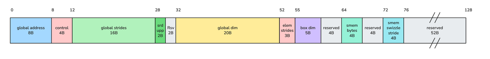
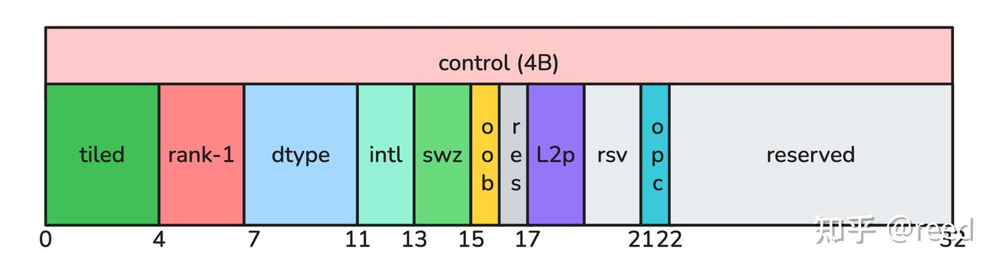
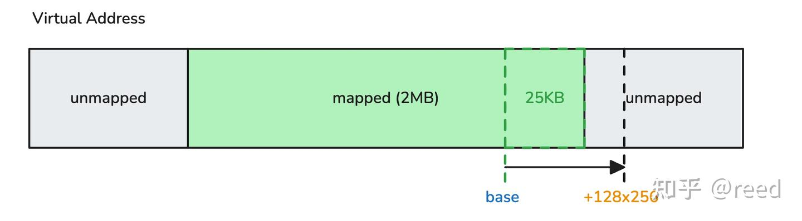
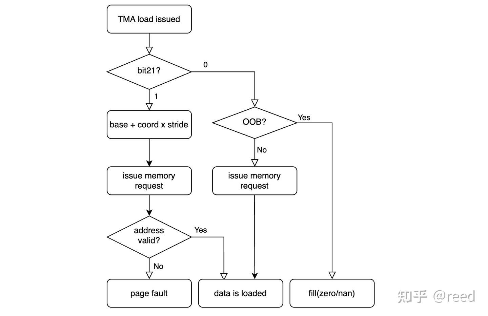

# CuTe TMA Descriptor 인코딩과 숨겨진 21번째 비트

> 원문: https://zhuanlan.zhihu.com/p/2037200219700449995

이전 글 "CuTe의 Hopper TMA"에서 TMA(Tensor Memory Access)의 기본 개념과 사용 방법을 소개했습니다. TMA는 128바이트 opaque descriptor로 tensor 배치를 기술하며, 하드웨어가 주소 계산, 경계 초과(out-of-bounds) fill, swizzle 등을 자동으로 처리합니다. 그중 "경계 초과 시 자동 fill"은 TMA가 프로그래머에게 제공하는 가장 친절한 약속입니다. 경계 clamp를 직접 작성할 필요 없이, tile 좌표가 `globalDim`을 벗어나기만 하면 하드웨어가 경계를 벗어난 원소를 zero 또는 NaN으로 채워줍니다.

`cuTensorMapEncodeTiled`의 인코딩 로직을 조사하고 서로 다른 드라이버 버전 사이에서 비교 검증하던 중, control word의 bit\[21\] 위치에서 동작 차이를 발견했습니다. 저희가 테스트한 580 버전 드라이버에서는 이 bit가 tensor 데이터량이 128KB에 도달했는지 여부에 따라 설정되는 반면, 테스트한 530 버전 드라이버에서는 이 bit가 항상 0이었습니다. 추가 실험 결과, bit21=1일 때 TMA 하드웨어는 **OOB 경계 검사를 건너뛰고** 경계를 벗어난 tile에 대해 곧바로 주소를 계산해 메모리 요청을 발행했습니다. 만약 목표 주소가 매핑되지 않은 가상 주소 영역에 놓이면 illegal memory access가 발생합니다.

본 글은 세 부분으로 전개됩니다. 먼저 TMA descriptor의 128바이트 이진 배치를 완전하게 제시합니다(bit21의 위치를 이해하기 위한 전제입니다). 그다음 GPU 가상 주소 매핑을 정밀하게 제어하는 실험을 통해 bit21이 OOB 동작에 미치는 영향을 검증합니다. 마지막으로 이 문서화되지 않은 bit가 `tensormap.replace` 기반의 동적 수정 시나리오에서 유발하는 실제 문제와 회피 방법을 논의합니다.

## TMA Descriptor의 완전한 이진 배치

`cuTensorMapEncodeTiled`가 구성하는 `CUtensorMap`은 128바이트 크기이며 128바이트로 정렬된 opaque 구조체입니다. NVIDIA는 이를 공식적으로 opaque type으로 정의하고 내부 인코딩 방식을 공개하지 않았습니다. 다양한 파라미터 조합에서의 출력을 byte 단위로 비교 분석하고, descriptor 각 필드에 대한 TMA 명령의 접근 동작을 함께 살펴본 결과 전체 이진 배치를 복원할 수 있었습니다.

### 전체 구조



```text
Offset   Size    Field
──────   ────    ─────────────────────────────────────────
 0- 7    8B      globalAddress (64-bit device pointer)
 8-11    4B      Control Word (bitfield, 아래에서 상세 설명)
12-27   16B      globalStrides[0..3] / 16 (각 32-bit, little-endian)
28-29    2B      stride upper bits (각 stride의 상위 4비트, nibble로 packed)
30-31    2B      reserved (=0)
32-51   20B      globalDim[0..4] - 1 (각 32-bit)
52-54    3B      elementStrides (각 차원 3 bits, packed)
55-59    5B      boxDim[0..4] - 1 (각 8-bit)
60-63    4B      reserved (=0)
64-67    4B      smem box total bytes
68-71    4B      reserved (=0)
72-75    4B      smem swizzle stride
76-127  52B      reserved (=0)
```

주요 필드 몇 가지에 대한 설명입니다.

- **globalAddress** (bytes 0-7): device global memory 내 tensor의 시작 주소입니다. TMA 하드웨어는 이를 base address로 삼고 `coord × stride`를 더해 각 tile의 실제 접근 주소를 계산합니다. descriptor에서 유일한 포인터 필드입니다.
- **globalStrides** (bytes 12-29): 최내측 차원을 제외한 각 차원의 stride이며, 바이트 단위 값을 16으로 나눈 뒤 저장합니다. 36-bit 인코딩(32-bit lower + 4-bit upper nibble)을 사용하여 최대 64GB의 stride 값을 지원합니다. 최내측 차원의 stride는 elemSize로 암묵적으로 정해지며 descriptor에 인코딩되지 않습니다.
- **globalDim** (bytes 32-51): 각 차원 크기에서 1을 뺀 값을 32-bit로 저장합니다. TMA 하드웨어는 이 값으로 OOB 여부를 판정하며, tile의 시작 좌표가 이 값을 넘어서면 OOB로 간주합니다. `tensormap.replace`가 가장 자주 수정하는 필드이기도 합니다.
- **smem box total bytes** (bytes 64-67): 한 번의 TMA tile load가 shared memory로 옮기는 총 바이트 수입니다. 계산 방식은 `product(boxDim[i] / elemStride[i]) × baseSize`이며, 여기서 `baseSize`는 interleave 모드에서 interleave 입도(16B 또는 32B)이고, 그 외에는 elemSize입니다.

### Control Word의 bitfield 배치

Control word(bytes 8-11)에는 descriptor의 모드 설정 정보가 응축되어 있습니다. 각 API 파라미터를 bit 단위로 변화시키며 출력 변화를 관찰한 결과, 다음 배치를 확인했습니다.



```text
bit 위치         의미
──────────      ────────────────────────────
bits[ 3: 0]    tensor type (0 = tiled)
bits[ 6: 4]    tensorRank - 1
bits[10: 7]    internal dtype code (4 bits, API enum 값과 재매핑 관계)
bits[12:11]    interleave (0=none, 1=16B, 2=32B)
bits[14:13]    swizzle (0=none, 1=32B, 2=64B, 3=128B)
bit [15]       oobFill (0=zero, 1=NaN)
bit [16]       reserved (=0)
bits[18:17]    l2Promotion (0=none, 1=64B, 2=128B, 3=256B)
bits[20:19]    reserved (=0)
bit [21]       OOB protection control ← 본 글의 주인공
bits[31:22]    reserved (=0)
```

강조해 둘 점은, 위 배치가 전적으로 실험을 통해 복원한 것이며 NVIDIA의 어떠한 공개 문서에서도 유래하지 않았다는 사실입니다. NVIDIA는 `CUtensorMap`의 내부 구조를 공개하지 않았습니다.

### 오픈소스 참조 구현

개발자가 TMA descriptor를 이해하고 디버깅하기 쉽도록, 순수 소프트웨어 참조 구현인 `cuTensorMapEncodeTiled_impl.h`를 제공합니다. 두 가지 핵심 기능을 갖추고 있습니다.

1.  **정방향 인코딩**: 동일한 API 파라미터가 주어지면 driver 580의 출력과 byte 단위로 일치하는 128바이트 descriptor를 생성합니다(bit21 로직 포함). 여러 세트의 테스트 벡터에서 공식 드라이버와 완전히 일치함을 검증했습니다.
2.  **파싱 및 출력**: 임의의 `CUtensorMap`이 주어지면 내부 필드를 전부 디코딩하여 형식화된 형태로 출력합니다. globalAddress, 각 차원의 dim/stride/box, control word의 모든 bitfield가 포함됩니다.

이는 `tensormap.replace` 이후 descriptor 상태를 디버깅할 때 특히 유용합니다. 수정 전후의 descriptor를 그대로 dump하여 필드별로 비교하면 불일치를 빠르게 찾아낼 수 있습니다.

### bit21의 설정 규칙

저희가 테스트한 두 드라이버 버전에서 bit21의 동작은 다음과 같습니다.

**Driver 530**: 입력 파라미터가 어떻게 바뀌든 bit21은 항상 0입니다.

**Driver 580**: bit21은 다음 조건에 따라 설정됩니다.

```cpp
bit21 = (product(globalDim[0..rank-1]) * elemSize >= 131072)  // ≥ 128KB
```

| dtype | dims | total bytes | bit21 (driver 580) |
|------------|----------------|-------------|--------------------|
| UINT8(fp8) | [256, 511] | 130816 | 0 |
| UINT8(fp8) | [256, 512] | 131072 | 1 |
| FLOAT16 | [256, 256] | 131072 | 1 |
| FLOAT32 | [128, 128] | 65535 | 0 |
| FLOAT32 | [128, 256] | 131072 | 1 |
| FLOAT32 | [32, 32, 32] | 131072 | 1 |
| FLOAT32 | [32, 32, 31] | 126976 | 0 |

임계값은 정확히 2^17 = 131072 바이트에 걸려 있습니다. 이 동작이 구체적으로 어느 드라이버 버전부터 도입되었는지는 확인하지 못했으며, 580에 존재하고 530에 존재하지 않는다는 사실만 확인했습니다.

## bit21의 하드웨어 의미: 실험 검증

bit21의 설정 규칙을 알았으니, 핵심 질문은 이것입니다. 이 bit는 어떤 하드웨어 동작을 제어하는가?

### 실험 설계

bit21의 영향을 분리하려면 bit21을 제외한 모든 조건이 완전히 동일한 실험을 구성하고, OOB tile에 대한 TMA의 처리 차이를 관찰해야 합니다.

실험 구성의 핵심 난점은 메모리 매핑에 있습니다. `cudaMalloc`의 suballocator는 내부적으로 요청 크기보다 훨씬 큰 가상 주소 영역을 매핑합니다(실측 결과 `cudaMalloc(2MB)`의 유효 매핑은 4MB 이상에 달했습니다). 이는 일반적인 할당 하에서는 OOB 주소가 여전히 유효 매핑 안에 있을 가능성이 크다는 뜻입니다. TMA는 fault 대신 "쓰레기 데이터"를 읽게 되므로, "검사를 건너뛰고 그대로 읽은 것"인지 "검사 후 fill한 것"인지 구분할 수 없습니다.

그래서 `cuMemCreate` + `cuMemMap`으로 매핑 경계를 정밀하게 제어했습니다. 연속된 가상 주소 공간에서 가운데 1개 page(2MB)만 매핑하고 앞뒤는 모두 unmapped 영역으로 둡니다. tensor 데이터(100행 × 256열 = 25KB)를 mapped 영역의 끝부분에 배치하여, OOB tile(coord_y=128)의 계산 주소가 반드시 뒤쪽 unmapped 영역에 떨어지도록 만듭니다.



실험 흐름은 두 개의 kernel로 구성됩니다.

1.  **Kernel 1**(update): 템플릿 descriptor를 shared memory로 복사 → `tensormap.replace`로 address와 dim\[1\]=100 수정 → `tensormap.cp_fenceproxy`로 global memory에 write back
2.  **Kernel 2**(load): `fence.proxy.tensormap` acquire → coord_y=128에서 TMA load(OOB: 128 > dim\[1\]=100)

두 실험군의 유일한 차이는 템플릿 생성 시의 dims입니다. \[256, 512\] 대 \[256, 511\]로, 전자는 bit21=1을, 후자는 bit21=0을 유발합니다.

### 실험 결과

| 템플릿 dims | bit21 | OOB TMA Load 결과 |
|-----------------------|-------|-----------------------|
| [256, 512] = 128KB | 1 | illegal memory access |
| [256, 511] < 128KB | 0 | zero fill, fault 없음 |

두 시나리오에서 `tensormap.replace` 이후의 실제 상태는 완전히 동일합니다. `globalDim[1]=100`, 동일한 base address, 동일한 OOB 좌표, 동일한 목표 물리 주소(모두 unmapped 영역에 위치)입니다. 유일한 차이는 control word의 bit21입니다.

### 하드웨어 동작 모델



실험 결과를 바탕으로 bit21의 하드웨어 동작 모델을 도출했습니다.

- **bit21=0**: TMA 프런트엔드는 어떠한 메모리 트랜잭션을 발행하기 전에 먼저 tile 좌표와 globalDim을 비교합니다. coord ≥ globalDim이면 해당 tile은 OOB로 판정되고, 하드웨어는 로컬에서 fill value(oobFill 설정에 따라 zero 또는 NaN)를 생성하며 메모리 요청을 전혀 발생시키지 않습니다. 목표 주소가 전혀 접근 불가능하더라도 절대적으로 안전합니다.
- **bit21=1**: TMA는 위 프런트엔드 검사를 건너뛰고 곧바로 `globalAddress + coord × stride`를 계산해 메모리 서브시스템에 요청을 발행합니다. 해당 주소가 유효하면(매핑된 VA 범위 안에 있으면) TMA는 그 위치의 데이터를 읽게 되는데, 이는 올바른 데이터일 수도 있고 무관한 쓰레기일 수도 있습니다. 해당 주소가 무효하면(매핑되지 않았으면) page fault가 발생하며 illegal memory access로 나타납니다.

bit21은 본질적으로 성능 최적화 스위치입니다. 큰 tensor에 대해서는 tile마다 수행하는 경계 검사를 건너뛰어 TMA 프런트엔드 지연을 줄일 수 있습니다. NVIDIA의 설계 가정은 아마도 다음과 같았을 것으로 추측합니다. 큰 tensor의 실제 메모리 할당은 보통 충분한 정렬과 padding을 가지므로, 정상적인 사용에서는 OOB tile의 주소가 page 경계 바깥으로 벗어나지 않는다는 것입니다.

## 성능 최적화가 동적 Shape을 만날 때

bit21의 의미를 이해하고 나면, 이것이 실제 문제를 일으키는 조건도 분명해집니다.

NVIDIA는 `tensormap.replace` 명령을 제공하여 kernel이 device 상에서 descriptor의 globalDim, globalAddress 등의 필드를 동적으로 수정할 수 있도록 합니다. 이는 variable-length sequence(LLM 추론의 group gemm, variable-length attention 등)를 처리하는 표준적인 방법입니다. 문제는 `tensormap.replace`가 dim을 수정할 때 control word의 bit21을 연동해서 갱신하지 않는다는 점입니다.

따라서 다음과 같은 사용 순서는 자기모순적인 descriptor를 만들어냅니다.

1\. 비교적 큰 max shape으로 템플릿 descriptor를 생성 → total ≥ 128KB이므로 bit21이 1로 설정됨

2\. 런타임에 `tensormap.replace`로 dim을 실제 값으로 축소 → bit21은 여전히 1(replace는 control word를 갱신하지 않음)

3\. TMA load가 OOB tile을 만남 → bit21=1 → 검사 건너뜀 → 주소 계산

대부분의 시나리오에서는 fault가 발생하지 않습니다. `cudaMalloc`이 매핑하는 VA 범위가 실제 할당보다 훨씬 크기 때문에, OOB 주소도 보통은 여전히 "접근 가능"하기 때문입니다(쓰레기를 읽을 뿐입니다). 그러나 다음 조건이 동시에 충족되면 illegal memory access가 발생합니다.

- 템플릿 tensor의 총 크기가 마침 ≥ 128KB (bit21=1)
- 런타임에 일부 batch/group의 실제 dim이 템플릿보다 훨씬 작음
- 대응하는 OOB 주소가 실제 page 매핑 경계를 마침 넘어감(memory pool allocator의 할당 경계, `cuMemCreate` 정밀 매핑 등의 시나리오)

이는 API 오용이 아닙니다. 사용자는 NVIDIA가 제공한 표준 API 경로를 따라 올바르게 프로그래밍했지만, 얻어진 descriptor는 의미적으로 일관되지 않은 상태에 놓입니다. globalDim 필드는 "tensor에 100행뿐"이라고 말하는데, bit21은 하드웨어에게 "이 tensor는 크니 OOB 보호가 필요 없다"고 알려주는 것입니다. CuTe의 `tma_descriptor_cp_fence_release`와 `tma_descriptor_fence_acquire` 역시 bit21의 동기 갱신에는 관여하지 않습니다.

bit21의 도입으로 OOB 검사가 조건부가 되었지만, `tensormap.replace`의 구현은 이 변화를 따라가지 못했습니다. OOB 판정에 참여하는 globalDim 필드는 갱신하면서도, OOB 검사의 수행 여부를 제어하는 bit21은 연동해 갱신하지 않습니다. 최적화가 도입된 뒤 인터페이스 의미론이 완전히 적응되지 못한 문제입니다.

### 회피 방법

**방법 1: 템플릿 생성 시 bit21을 강제로 0으로 만들기**

`cuTensorMapEncodeTiled`를 호출한 후, descriptor를 kernel에 넘겨 사용하기 전에 host 측에서 bit21을 수동으로 지웁니다.

```cpp
// descriptor 생성
cuTensorMapEncodeTiled(&tmap, ...);
// bit21을 강제로 지워 OOB 보호를 항상 켜진 상태로 유지
uint32_t control;
memcpy(&control, (uint8_t*)&tmap + 8, 4);
control &= ~(1u << 21);
memcpy((uint8_t*)&tmap + 8, &control, 4);
```

이 방법은 단순하고 직접적이며, 대가는 큰 tensor에서 TMA 프런트엔드 성능을 약간 잃을 수 있다는 점입니다(tile마다 경계를 검사해야 하므로). 대다수 응용 시나리오에서 이 비용은 무시할 수 있습니다.

**방법 2: `tensormap.replace`로 shape을 수정할 때 bit21도 함께 처리하기**

bit21의 성능 최적화(큰 tensor에서 검사 건너뛰기)를 유지하고 싶다면, dim을 replace할 때마다 새로운 실제 tensor 크기에 따라 bit21을 다시 결정하면 됩니다. `tensormap.replace`는 control word를 직접 수정하는 것을 지원하지 않으므로, shared memory에서 해당 바이트를 수동으로 patch한 뒤 `tensormap.cp_fenceproxy`로 write back해야 합니다.

```cpp
// smem에서 replace를 마친 뒤, 새 dims에 따라 bit21 갱신
uint64_t new_total = (uint64_t)new_dim0 * new_dim1 * elemSize;
uint32_t* ctrl_ptr = (uint32_t*)((uint8_t*)&smem_tmap + 8);
if (new_total >= 131072)
    *ctrl_ptr |= (1u << 21);
else
    *ctrl_ptr &= ~(1u << 21);
// 그다음 cp_fenceproxy를 실행해 gmem에 write back
```

### 결론

1.  TMA descriptor control word의 bit\[21\]은 문서화되지 않은 하드웨어 플래그입니다. 저희가 테스트한 driver 580에서는 `product(globalDim) × elemSize ≥ 128KB`일 때 1로 설정되며, 테스트한 driver 530에서는 항상 0입니다.
2.  bit21=1일 때 TMA 하드웨어는 tile 좌표의 경계 초과 검사를 건너뛰고(OOB fill 메커니즘이 비활성화됨) 목표 주소를 곧바로 계산해 접근합니다.
3.  `tensormap.replace` 명령은 globalDim을 수정할 때 bit21을 연동해 갱신하지 않으므로, descriptor가 "dim은 작은데 bit21=1"인 불일치 상태에 빠질 수 있습니다. OOB 주소가 마침 매핑되지 않은 영역에 떨어지면 illegal memory access가 발생합니다.
4.  회피 방법은 descriptor 생성 후 bit21을 강제로 0으로 만들거나, replace로 dim을 수정한 뒤 새로운 tensor 크기에 따라 bit21을 수동으로 갱신하는 것입니다.

본 글에서 다룬 전체 코드는 [https://github.com/reed-lau/cute-gemm/tree/main/tma-desc](https://github.com/reed-lau/cute-gemm/tree/main/tma-desc)에 있으며, 다음을 포함합니다.

- `cuTensorMapEncodeTiled_impl.h`: 참조 구현(정방향 인코딩 + 필드 파싱 출력, driver 580 출력과 bit 단위로 일치)
- `test_bit21_oob.cu`: bit21 OOB 동작의 최소 재현
- `main.cc` + `tests.txt`: 52세트 테스트 벡터의 전량 회귀 검증

## 참고

- https://docs.nvidia.com/cuda/cuda-driver-api/group__CUDA__TENSOR__MEMORY.html
- https://github.com/NVIDIA/cutlass/blob/main/include/cute/arch/copy_sm90_desc.hpp
- https://patents.google.com/patent/US20230289292A1
