지후(知乎) Reed 님의 cutlass 입문 노트를 복사한 것으로, cute를 기반으로 Ampere 아키텍처에서 SOTA GEMM을 구현한 내용이다. 취합 후 연속으로 읽는다.


# MMAOperation

operation은 명령어를 통해 D = AB + C 계산을 수행한다. 이 operation에는 A/B/C/D 피연산자의 타입을 지정해야 한다. fma의 인수 형태는 D/A/B/CRegisters의 타입과 데이터 양에 따라 결정된다. 즉, DRegister의 타입이 float[2]이면 fma 인터페이스의 앞 두 인수가 float 출력이 된다. SM75_16x8x8_F32F16F16F32_TN은 SM75 연산 능력의 Turing 아키텍처 MMA를 나타내며, 16x8x8은 행렬의 MNK 크기, F32F16F16F32는 D, A, B, C의 데이터 타입이 각각 float32, float16, float16, float32임을 의미한다. T는 A 행렬이 행 우선(row-major), B 행렬이 열 우선(column-major)임을 나타낸다(BLAS 관례에서 normal 행렬은 열 우선이며, T는 transpose를 의미하므로 열 우선 행렬을 전치하면 행 우선이 된다).

```shell
struct SM75_16x8x8_F32F16F16F32_TN {
  using DRegisters = float[4];
  using ARegisters = uint32_t[2];
  using BRegisters = uint32_t[1];
  using CRegisters = float[4];

  // Register asm fma
  CUTE_HOST_DEVICE static void
  fma(float         & d0, float         & d1, float      & d2, float      & d3,
      uint32_t const& a0, uint32_t const& a1,
      uint32_t const& b0,
      float    const& c0, float    const& c1, float const& c2, float const& c3)
  {
    asm volatile("mma.sync.aligned.m16n8k8.row.col.f32.f16.f16.f32" ...);
  }
};
```

그림의 `float[4]`(예: `using DRegisters = float[4];`, `using CRegisters = float[4];`)는 **해당 `mma.sync` 명령어가 "각 스레드(lane)"에서 행렬 fragment를 보유하는 데 사용하는 레지스터 수와 타입**을 나타낸다.

## `float[4]` 구체적 의미
- **전역 메모리/shared memory의 배열이 아니라** "타입 별칭"으로, 해당 스레드가 fragment 데이터를 저장하는 데 **32-bit 레지스터 4개**가 필요함을 의미한다.
- `SM75_16x8x8_F32F16F16F32_TN` MMA의 경우:
  - **C와 D는 FP32**(누산기/출력)이므로 `float`을 사용한다.
  - 각 스레드는 warp 레벨 MMA 연산 한 번에 출력 tile의 일부를 담당하므로 **4개의 FP32 출력 누산 값**을 갖게 되며, 이를 `float[4]`로 표현한다.

아래 인터페이스에서도 이 대응 관계를 직접 확인할 수 있다.

```cpp
fma(float &d0, float &d1, float &d2, float &d3, ...,
    float const& c0, float const& c1, float const& c2, float const& c3)
```

여기서 `d0..d3` / `c0..c3`이 바로 `float[4]`의 네 스칼라 레지스터다.

## A/B에 `uint32_t[...]`을 사용하는 이유
같은 코드에서:
- `ARegisters = uint32_t[2]`
- `BRegisters = uint32_t[1]`

**A/B는 FP16 입력**이며, PTX/하위 구현에서는 보통 **두 개의 half를 32-bit 레지스터 하나에 패킹**(예: half2 또는 비트 패킹)하므로, `uint32_t`를 "원시 비트 패턴 컨테이너"로 사용하는 편이 직관적이다.

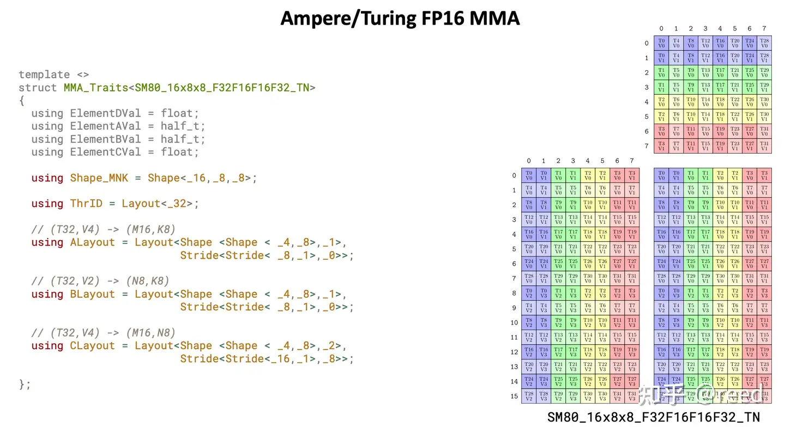

## 이 그림이 설명하는 것 (개요)

이 그림은 **warp 레벨 MMA 명령어 한 개**(`m16n8k8`, A/B는 FP16, 누산/출력은 FP32)를 두 부분으로 나눠 설명한다.

- **왼쪽 코드(CUTE / CUTLASS의 Traits)**: 여러 `Layout`으로  
  "**warp 내 32개 스레드**가 각각 A/B/C/D fragment의 어느 원소(레지스터)를 보유하는지", 그리고 이 레지스터들이 행렬 tile의 `(m,n,k)` 좌표에 어떻게 매핑되는지를 기술한다.
- **오른쪽 색상 격자 그림**: 이 "스레드-원소 매핑"을 시각화한다.  
  각 작은 격자는 tile의 원소 위치 하나를 나타내며, `T13 V1` 같은 표시는  
  **이 위치의 값이 13번 스레드(lane 13)의 첫 번째 레지스터 슬롯(V1)에 저장됨**을 의미한다.


## 왼쪽 코드 줄별 설명 (오른쪽 그림 대응)

### 1) 데이터 타입 (Element*Val)
```cpp
using ElementDVal = float;
using ElementAVal = half_t;
using ElementBVal = half_t;
using ElementCVal = float;
```
이 MMA의 의미:
- A, B 입력은 `half`(FP16)
- C 누산기와 D 출력은 `float`(FP32)

이것이 이전 그림에서 `CRegisters/DRegisters`가 `float[4]`인 이유다.  
**각 스레드는 4개의 FP32 누산/출력 레지스터 슬롯(V0..V3)을 갖는다.**


### 2) MMA tile 형상 (Shape_MNK)
```cpp
using Shape_MNK = Shape<16, 8, 8>;
```
각 `mma.sync`가 warp 내에서 수행하는 계산:

- `M = 16`
- `N = 8`
- `K = 8`

즉, **16×8 출력 블록**을 계산한다: `D(16×8) = A(16×8) * B(8×8) + C(16×8)`.


### 3) 스레드 레이아웃 (ThrID)
```cpp
using ThrID = Layout<_32>;
```
warp 내 lane id: `0..31`.


### 4) ALayout / BLayout / CLayout의 의미

주석은 다음과 같은 형태다:

- `// (T32, V4) -> (M16, K8)` (A에 해당)
- `// (T32, V2) -> (N8, K8)` (B에 해당)
- `// (T32, V4) -> (M16, N8)` (C/D에 해당)

여기서 `(T32, Vx)`가 핵심이다:

- `T32`: 32개 스레드(warp)
- `Vx`: **각 스레드가 보유하는 레지스터 슬롯 x개**(fragment의 "벡터 길이")

따라서:
- A: 스레드당 `V4`개 half(일반적 구현에서 half 4개, 2개의 `uint32`로 패킹될 수 있음)
- B: 스레드당 `V2`개 half
- C/D: 스레드당 `V4`개 float

#### ALayout 예시
```cpp
using ALayout = Layout<Shape<4,8,1>, Stride<-8,1,0>>;
```
이는 `(thread_id, v)` 형태의 "스레드 내 레지스터 번호"를 **A tile의 (m,k) 좌표**로 매핑한다.

`Stride<-8,1,0>`의 부호 의미를 꼭 외울 필요는 없다(CUTE가 전치/행렬 주 순서 등을 동시에 지원하기 위해 stride에 음수를 허용한다). 핵심은:

- **ALayout이 각 lane의 V0..V3이 A tile의 어느 (m,k) 원소에 대응하는지 정의한다.**  
- 오른쪽 A 격자 그림은 이 매핑을 펼쳐 보인 것으로, 각 `(m,k)` 격자에 `T? V?`가 기록되어 있다.

마찬가지로:
- `BLayout`은 `(thread_id, v)` -> `(n,k)` 정의
- `CLayout`은 `(thread_id, v)` -> `(m,n)` 정의(누산기/출력 블록의 할당)


## 오른쪽 그림들이 나타내는 것

오른쪽에는 일반적으로 A / B / C(D)의 tile 매핑 시각화가 있다:

- **위쪽 블록(주로 B 또는 A 시각)**  
  입력 fragment의 스레드 할당(누가 어느 입력 원소를 제공하는지)
- **중간/아래쪽 큰 블록(주로 C/D의 16×8 출력 블록)**  
  각 격자는 출력 `D(m,n)`의 원소 하나에 대응한다.  
  격자 내 `Txx Vyy`는: 이 출력 원소가 **lane xx의 yy번째 float 레지스터**에 저장됨을 의미한다.

> 다음 사실로 검증할 수 있다:  
> 출력 tile의 원소 수는 `16×8 = 128`개 float이다.  
> warp의 스레드 32개, 각 스레드당 `V4`개 float 레지스터: `32×4 = 128`.  
> 정확히 일대일 대응된다. 이것이 오른쪽 그림에서 `float[4]`가 나타나는 근본 이유다.


## 이 그림의 `TN`이란

`SM80_16x8x8_F32F16F16F32_TN`에서 `TN`은 **A가 Transpose, B가 Normal**(GEMM 피연산자 레이아웃 관례)을 의미한다.

이것은 `ALayout/BLayout`의 stride 선택에 반영되어(예: A의 stride에 음수 또는 다른 배열 방식이 나타날 수 있다), 오른쪽 그림에서 "스레드가 어느 위치를 담당하는지"의 패턴이 달라진다.

# MMA_Traits

특정 MMAOperation 타입에 대해 MMA_Atom이 사용할 보조 타입이나 값을 정의하여 블록 행렬 곱셈을 완성하는 데 사용한다. 제공해야 하는 타입 정보는 다음과 같다.

```c++
using ElementDVal =  // Logical A-value type
using ElementAVal =  // Logical B-value type
using ElementBVal =  // Logical C-value type
using ElementCVal =  // Logical D-value type

using ElementAFrg =  // A-type consumed by MMA  (if ommitted, same as ElementAVal)
using ElementBFrg =  // B_type consumed by MMA  (if ommitted, same as ElementBVal)
using ElementCFrg =  // C_type consumed by MMA  (if ommitted, same as ElementCVal)

using Shape_MNK =    // Logical MxNxK shape of the MMA

using ThrID     =    // Logical thread id (tid) -> tidx

using ALayout =      // (Logical thread id (tid), Logical value id (vid)) -> Flat MK-coord
using BLayout =      // (Logical thread id (tid), Logical value id (vid)) -> Flat NK-coord
using CLayout =      // (Logical thread id (tid), Logical value id (vid)) -> Flat MN-coord
```

# TiledMMA

TiledMMA는 행렬이 MNK 공간 차원에서 Atom을 통해 어떻게 구성되는지를 전체적으로 표현한다. 내부에 많은 함수가 정의되어 있으며, 이 함수들은 주어진 연산 블록에 대한 분할 능력을 제공한다. 하지만 초기에 최종 사용자는 이 부분을 너무 신경 쓸 필요 없이, 아래 두 가지 API에만 집중하면 된다. 첫 번째는 TiledMMA의 템플릿 파라미터이고, 두 번째는 TiledMMA가 제공하는 get_thread_slice 함수다. 템플릿 파라미터는 TiledMMA가 MMA_Atom을 확장하는 논리를 표현한다. `AtomLayoutMNK`는 M, N, K 방향에서 각각 Atom을 몇 번 반복하는지를 나타내며, 이 반복은 더 많은 실행 스레드를 요구한다. `ValueLayoutMNK`는 해당 Atom을 M, N, K 방향에서 몇 번 반복하는지를 나타내며, 이 반복은 반복 계산으로 수행된다. get_slice, get_thread_slice 함수는 주어진 스레드 id로 해당 스레드의 ThrMMA 구조체를 얻는 형태다.

```c++
template <class MMA_Atom,
          class AtomLayoutMNK   = Layout<Shape<_1,_1,_1>>,
          class ValLayoutMNK    = Layout<Shape<_1,_1,_1>>,
          class PermutationsMNK = Tile<Underscore,Underscore,Underscore>>
struct TiledMMA : MMA_Atom {
  ...;
  ThrMMA get_slice(ThrIdx thr_idx)；
  ThrMMA get_thread_slice(ThrIdx thr_idx);
  ...;
}

```

cutlass 3.4 버전에서 이 인터페이스가 업데이트되어 ValLayoutMNK가 제거되었다. 구체적인 파라미터 해석은 cute 핵심 저자 Cecka의 설명(link.zhihu.com/?target=https%3A//github.com/NVIDIA/cutlass/discussions/1345)을 참고하면 된다.

# ThrMMA

이 구조체는 TiledMMA가 구체적인 스레드 id를 기반으로 분해하여 얻는다(ThrMMA는 Thread MMA). 스레드 레벨에서 D = A x B + C 작업을 수행하는 기능 추상화를 기술하며, 주요 함수는 아래의 `partition` 계열 함수와 `partition_fragment` 계열 함수다. `partition` 함수는 해당 스레드에 대한 논리 Tensor를 분할한다. 즉, Tensor 인수로 큰 논리 행렬 단위를 제공하면 반환값으로 해당 스레드가 수행해야 하는 작업의 Tensor 기술을 반환한다. 예를 들어 Tensor C가 `BLK_M x BLK_N`이면, `partition_C`로 스레드 레벨의 작업을 얻을 수 있으며 차원은 `(MMA, MMA_M, MMA_N)`이다. MMA는 TileMMA가 한 번에 계산할 수 있는 단위를 나타내고, MMA_M, MMA_N은 M 방향과 N 방향에서의 분할 수를 나타낸다. `partition_fragment` 계열 함수는 `partition` 계열 함수가 반환하는 Tensor 형상에 맞게 생성된 레지스터 표현이다.

```c++
ThrMMA {
  Tensor partition_C(Tensor C);
  Tensor partition_A(Tensor A);
  Tensor partition_B(Tensor B);
  Tensor partition_fragment_C(Tensor C);
  Tensor partition_fragment_A(Tensor A);
  Tensor partition_fragment_B(Tensor B);
}
```

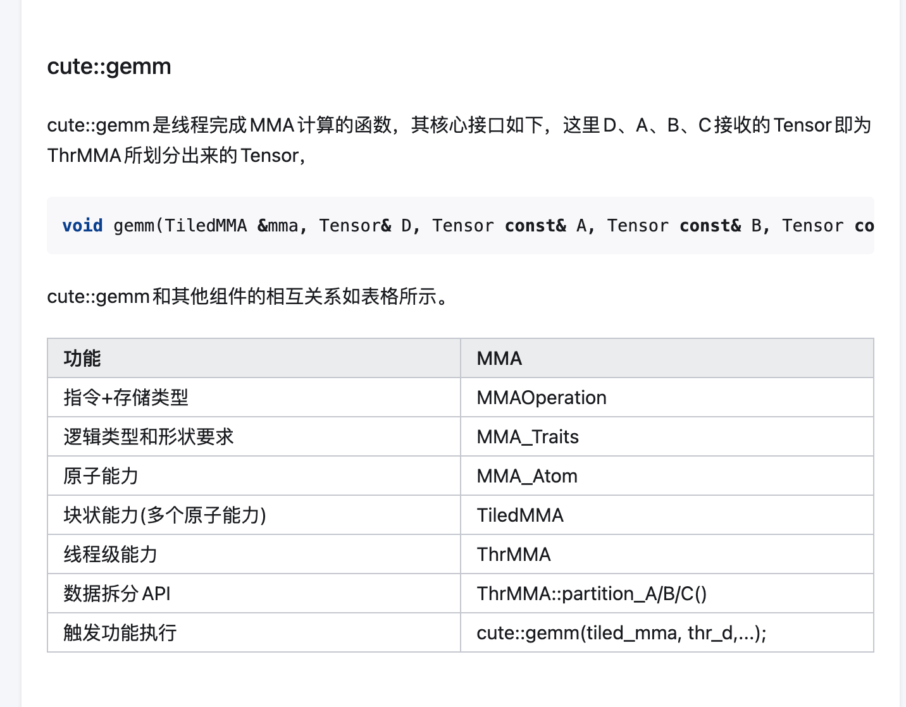

# CUDA의 저장 계층과 데이터 로드 경로

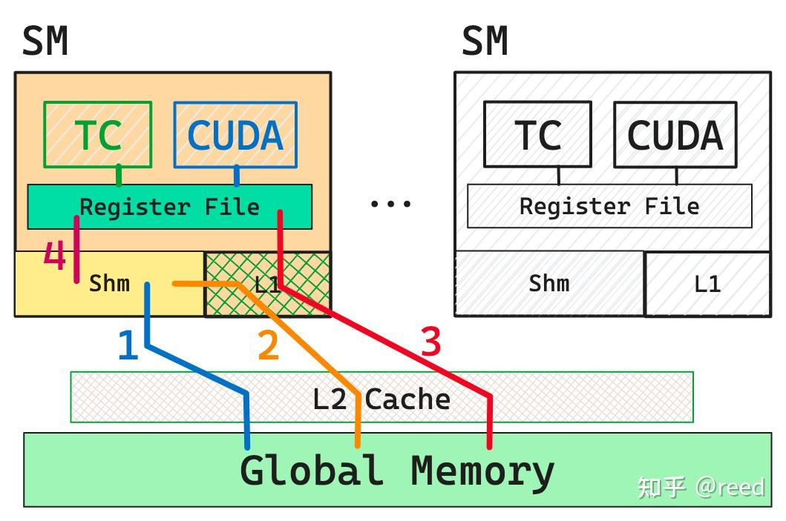

전형적인 GPU 저장 계층 구조는 그림 1과 같다. 주요 구성 요소는 다음과 같다. 칩 외부 저장 구조인 전역 메모리(global memory), 칩 내 SM(Stream Multi-Processor)의 shared memory와 L1 data cache, 레지스터 파일(register file), 그리고 전역 메모리와 SM 사이의 L2 Cache가 있다. 구체적으로, 전역 메모리(그림에서 녹색 global memory로 표시)는 용량이 가장 크며, 데이터센터급 A100 GPU에서는 최대 80GB이고 HBM2e 기술로 구현되어 최대 대역폭은 2TB/s에 달한다. 다음 안쪽으로 L2 Cache가 있으며, A100-80GB에서는 80MB이고 대역폭은 20TB/s에 달한다. 더 안쪽으로는 온칩(on-chip) 저장소인 shared memory와 L1 data cache가 있으며, 두 가지는 192KB의 공간을 공유하고 크기 설정이 가능하다. shared memory는 최대 164KB까지 설정할 수 있다. 계산 단위인 Tensor Core와 CUDA Core(그림에서 각각 TC와 CUDA로 표시)에 더 가까운 저장 구조가 레지스터 파일(그림에서 Register File로 표시)이다. 계산 단위가 연산에 필요한 데이터는 반드시 레지스터에서 가져와야 한다(Ampere 이전 아키텍처의 경우이며, Hopper 아키텍처의 Tensor Core는 shared memory에 저장된 데이터를 직접 읽어 계산할 수 있다). 레지스터 파일은 GPU에서 가장 빠른 저장 구조이며, 스레드당 최대 255개의 32-bit 레지스터를 사용할 수 있다. GPU로 계산을 수행하는 문제의 경우 원본 데이터는 전역 메모리에서 출발하여 세 가지 경로를 통해 핵심 계산 단위(Tensor Core 또는 CUDA Core)에 도달할 수 있다. 첫 번째 경로는 그림의 경로 1과 같이 global 메모리에서 L2를 거쳐 shared memory에 도달하고(L1 bypass), 이후 shared memory에서 레지스터로 이동한다. 두 번째 경로는 그림의 경로 2와 같이 global 메모리에서 L2를 거쳐 L1에 도달한 뒤 shared memory로, 다시 레지스터로 이동한다. 세 번째 경로는 global 메모리에서 L2를 거쳐 L1에 도달한 뒤 레지스터로 이동한다. 경로 1과 2는 Ampere 및 이후 아키텍처에서만 지원된다. Ampere 이전 아키텍처에서는 전역 메모리에서 레지스터로의 경로 3만 지원되며, 전역 메모리에서 shared memory로의 경로는 경로 3으로 레지스터에 데이터를 먼저 로드한 뒤 경로 4로 shared memory에 저장하는 방식만 가능하다. 이러한 저장 구조 중 프로그래밍으로 제어 가능한 부분은 전역 메모리, shared memory, 레지스터이며, L1 Cache와 L2 Cache는 캐시 구조로 bypass 여부를 제어할 수 있다. 또한 PTX 명령어 modifier로 L2 cache의 데이터 프리페치 동작도 제어할 수 있다.

## 효율적인 ldmatrix 명령어

행렬 계산 최적화에서 매우 중요한 기술 중 하나는 데이터 블록화를 통한 데이터 재사용이다. 데이터 재사용은 하위 저장소에 대한 접근 데이터 양을 줄여 데이터 접근 효율을 높이고 전체 계산 효율을 향상시킨다. GPU 구현에서 프로그래밍 가능한 데이터 재사용은 shared memory 영역에서 발생한다. 즉, 사용자가 프로그래밍으로 일부 데이터를 shared memory에 로드한 뒤 재사용하여, shared memory에서 레지스터로의 데이터 이동을 통해 더 효율적인 계산을 달성한다. 앞의 MMA 절에서 Tensor Core의 기본 정보를 소개했다. Tensor Core의 어셈블리 명령어를 자세히 살펴보면, 계산에 참여하는 warp 내 스레드들이 행렬의 일부 데이터만 보유하고 있으며, 이 데이터는 스레드의 전용 레지스터에 저장된다(SIMT 아키텍처에서 레지스터는 스레드 전용으로 간주할 수 있다). warp 내 모든 스레드의 레지스터가 합쳐져 완전한 행렬 계산 데이터를 구성한다. 이것이 NVIDIA가 SIMT 아키텍처에서 warp 레벨의 Tensor Core 계산을 구현한 혁신적인 방식이다. 그림 2와 같이, SIMT 관점에서 각 스레드는 두 개의 데이터를 보유하며(예: float16, 레지스터 하나로 표현 가능), warp 내 32개 스레드가 합쳐져 64개의 데이터를 구성하고 8x8의 warp 레벨 소행렬을 이루어 Tensor Core 계산에 사용된다.

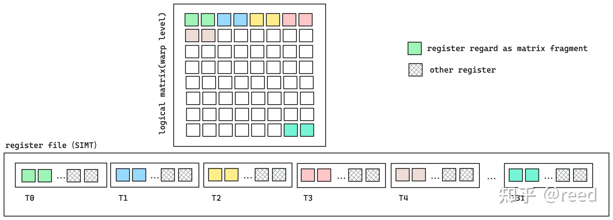

각 스레드가 제공하는 레지스터로 warp 레벨 행렬의 표현과 저장이 가능하며, Tensor Core를 이용하면 레지스터에 저장된 행렬의 효율적인 계산을 완료할 수 있다. 데이터의 shared memory에서 레지스터로의 로드 측면에서, SIMT 방식의 LDS(load shared)로 수행할 수 있으나, 데이터가 서로 다른 스레드의 레지스터에 분산되어 있어 연속성이 좋지 않다. 더 극한의 성능을 위해 NVIDIA는 Turing 아키텍처부터 이 시나리오에 특화된 로드 명령어 ldmatrix를 제공했다. 그림 3은 SIMT 방식의 행렬 데이터 로드와 ldmatrix 협력식 행렬 데이터 로드의 비교를 보여준다. ldmatrix 협력식 로드는 스레드가 shared memory 주소(16Byte 데이터 제공)를 제공하여 데이터를 로드한 뒤 warp 내 각 스레드의 레지스터에 데이터를 분배하는 방식으로, SIMT 레지스터 경계를 넘나드는 쓰기를 실현한다. SIMT 방식의 로드라면 더 좁은 데이터 폭을 사용해야 하므로 같은 양의 데이터를 읽고 쓰는 데 더 많은 명령어가 필요하다. ldmatrix는 단일 스레드가 16Byte의 데이터 주소를 제공하므로, warp 내 모든 스레드가 16Byte × 32 = 512Byte의 데이터를 레지스터로 로드할 수 있으며, 단일 명령어로 16x16 float16 행렬을 로드할 수 있다. 명령어 수를 줄여 스케줄링 효율을 높이고, 쓰기 시 행렬 전치 기능도 통합할 수 있다(tensorcore에서 ldmatrix 명령어의 장점에 관해서는 (https://www.zhihu.com/question/600927104/answer/3029266372)를 참고). ldmatrix를 통해 warp 레벨 shared memory에서 레지스터로의 데이터 이동을 구현할 수 있으며, cute는 이러한 데이터 이동에 대응하는 추상화 능력을 자연스럽게 제공한다.

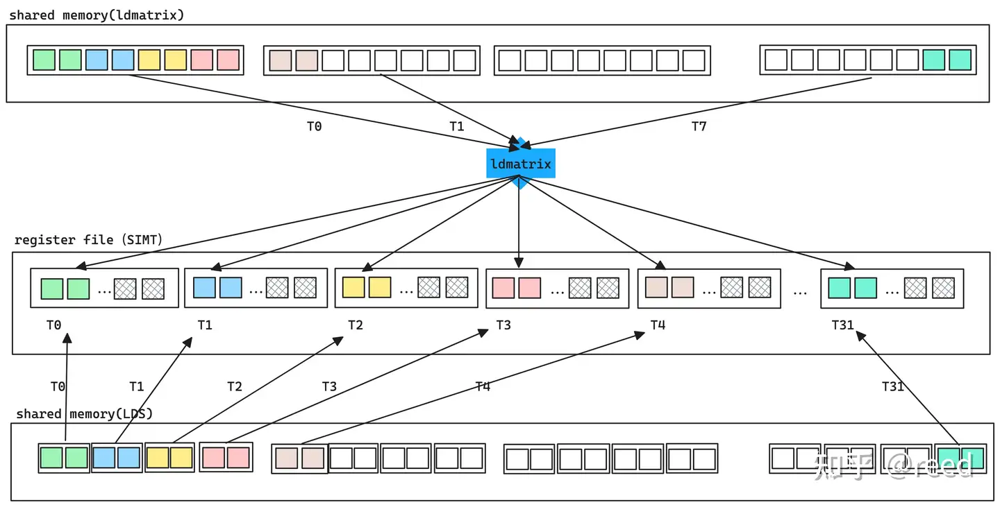


## cute Copy 추상화와 상호 관계

MMA와 유사하게, cute는 데이터 이동에 대한 데이터 구조 추상화를 제공한다. 주요 구성 요소는 `CopyOperation`, `Copy_Traits`, `Copy_Atom`, `TiledCopy`, `ThrCopy`와 복사 함수 `cute::copy`다. 이 구조체들과 함수들은 GPU의 각 저장 계층에 있는 데이터를 이동하는 추상화와 구현을 함께 완성한다. 구체적으로,

- CopyOperation은 명령어 레벨의 데이터 이동 캡슐화를 제공한다. NVIDIA는 서로 다른 하드웨어 아키텍처, 서로 다른 저장 계층 간 데이터 이동을 위한 다양한 명령어를 제공한다. 앞서 언급한 `ldmatrix`와 `LDS` 등, Ampere 아키텍처를 위한 `cp.async` 등이 있으며, 사용 시 지원하는 하드웨어 명령어와 이동할 메모리 계층에 따라 이미 제공된 Operation을 선택하면 된다.
- Copy_Traits는 MMA_Traits와 유사하게, CopyOperation 타입이 제공하지 않지만 사용자인 Copy_Atom이 필요로 하는 브릿지 역할의 정보를 제공한다.
- Copy_Atom은 명령어 레벨에서 분할 불가능한 데이터 이동의 복사 능력을 제공한다.
- TiledCopy는 Copy_Atom의 능력을 캡슐화하여 복사 실행 단위 수를 늘리거나(스레드 증가) 여러 번 복사하여 원자 능력을 반복하는 방식으로 확장한다.
- TiledCopy는 논리적인 복사의 개념을 제공한다. 실제 kernel 실행 시 CUDA 프로그래밍 패러다임에 맞게 스레드 레벨의 명령어로 작성해야 한다. ThrCopy는 TiledCopy가 기술한 분할 규칙에 따라 현재 스레드의 스레드 번호 threadIdx.x를 제공하여 큰 Tensor를 분할하고, 현재 스레드가 D = S 복사를 완료하기 위해 수행해야 하는 작업을 얻을 수 있다.
- cute::copy는 ThrCopy가 현재 스레드의 작업을 제공한 뒤, copy 함수로 실제 데이터 이동 명령어를 발행한다.

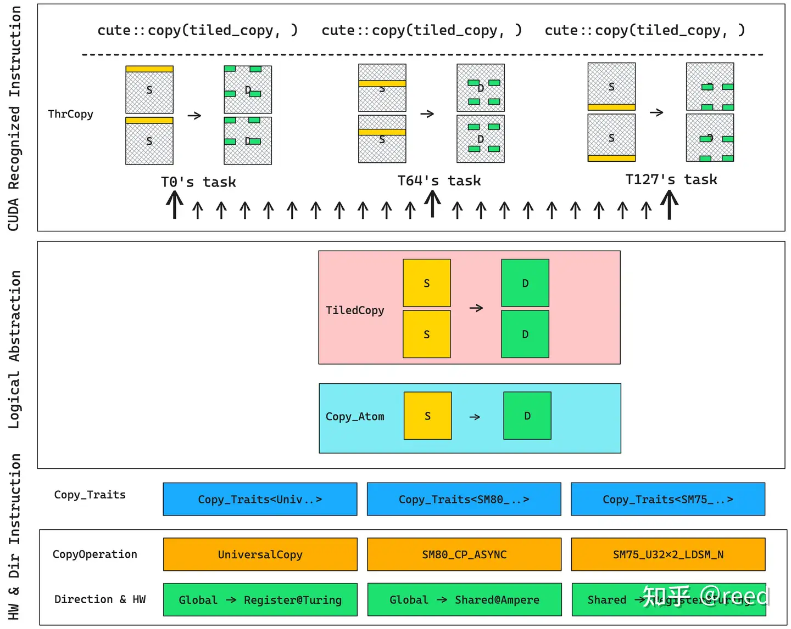


그림 4와 같이, 하드웨어와 복사 방향 위에 명령어 추상화 CopyOperation이 있고, 그 위에 D = S의 복사 논리 추상화가 형성된다. 명령어 레벨에서 수행 가능한 복사 원자 능력 Copy_Atom과 Atom을 반복하여 얻은 TiledCopy 능력을 포함한다. 논리 위에서 구체적인 스레드에 대해 스레드 레벨 작업을 분할하고, cute::copy 함수로 해당 복사 작업을 발행하며, 모든 스레드가 함께 Tensor에서 Tensor로의 복사를 완성한다. 아래에서 각 추상화 계층별로 각 데이터 구조와 추상화의 세부 사항을 구체적으로 소개한다.

## CopyOperation

Operation은 특정 하드웨어가 지원하는 복사 능력을 캡슐화한다. 일반적으로 PTX 어셈블리 명령어(또는 CUDA 구현)를 통해 구현하여 명령어 집합의 복사 능력 추상화를 완성한다. 소스 데이터 타입, 목표 데이터 타입, 개수를 정의하고 프레임워크 계층이 호출할 copy 함수를 제공한다. 예시는 다음과 같다. 소스 레지스터는 uint128_t(128-bit 데이터) 하나이고, 목표 레지스터는 uint32_t 데이터 하나다.

`CopyOperation`은 "**하드웨어 복사 명령어 하나의 C++ 캡슐화**"로 이해할 수 있으며, 두 가지 역할만 수행한다.

- **[레지스터 패킹 형태 규정]** `SRegisters` / `DRegisters`로 해당 명령어가 각 스레드에서 필요한 레지스터 슬롯 수와 각 슬롯의 비트 폭을 표현한다.
- **[최하위 실행 진입점 제공]** `copy(...)`로 해당 PTX 명령어를 호출하여 소스(보통 shared memory / global memory의 특정 뷰)에서 목표 레지스터로 데이터를 이동한다.

위 예시의 `uint128_t[1] -> uint32_t[1]`은 본질적으로 다음을 기술한다.

- **[SRegisters]** 해당 명령어가 한 번에 소스 측에서 128-bit 패킹 데이터 하나를 "본다"(shared memory의 여러 원소를 합친 것일 수 있다).
- **[DRegisters]** 명령어 실행 후 목표 측에서 32-bit 레지스터 값 하나를 출력한다(언패킹된 일부이거나 명령어 의미론에 따라 재배열된 fragment일 수 있다).

```c++
struct SM75_U32x1_LDSM_N {
  using SRegisters = uint128_t[1];
  using DRegisters = uint32_t[1];

  void copy(uint128_t const& smem_src, uint32_t& dst) {
    asm volatile ("ldmatrix.sync. ...\n");
  }
};
```

## Copy_Traits

traits는 CopyOperation의 정보를 보완한다. 예를 들어 operation 실행에 필요한 스레드 수, 소스 데이터와 목표 데이터의 Layout 배치 상황을 제공하며, 스레드와 데이터의 저장 관계(스레드 번호와 레지스터 번호로 데이터의 논리적 위치를 얻을 수 있음)를 기술한다. 또한 스레드 레벨 데이터 분할 시 retile 능력을 구현하기 위한 RefLayout을 제공한다. 구체적인 정의는 다음과 같다.

`Copy_Traits`는 CopyOperation의 "**사용 설명서/메타 정보**"로 볼 수 있으며, 세 가지 상위 수준 질문에 답한다.

- **[몇 개의 스레드가 협력해야 하는가]** `ThrID = Layout<_32>`는 보통 warp(32개 스레드) 하나가 협력하여 복사 원자 하나를 실행함을 나타낸다.
- **[각 스레드의 레지스터 fragment가 어느 데이터 부분에 해당하는가]** `SrcLayout`/`DstLayout`이 매핑을 정의한다:
  - 입력 측: `(src_thread, src_value_index) -> bit/coord`
  - 출력 측: `(dst_thread, dst_value_index) -> bit/coord`
- **[스레드 레벨 retile을 어떻게 하는가]** `RefLayout`이 "참조 좌표계"를 제공하여, 이미 스레드 전용이 된 데이터를 명령어가 원하는 형상으로 재배열하는 데 사용된다.

### `Layout<Shape<...>, Stride<...>>` 읽는 법

통일된 심성 모델로 이해할 수 있다:

- `Shape<...>`: 다차원 인덱스 공간의 크기를 기술한다(텐서의 차원과 유사).
- `Stride<...>`: 각 차원 인덱스가 1 증가할 때 선형 주소/bit-index가 얼마나 증가하는지를 기술한다.
- `Layout`: 다차원 인덱스를 선형 "좌표"로 매핑한다(여기서 주석은 `bit`라고 쓰여 있는데, 이는 bit-level 위치 지정을 수행함을 의미한다. 다른 컨텍스트에서는 element-level 위치 지정일 수도 있다).

따라서 "to bit"로 주석된 `SrcLayout`/`DstLayout` 형태의 layout은 `ldmatrix` 같은 명령어에서 자주 나타난다. 이 명령어들은 원소 순서뿐만 아니라 **bit 단위로 패킹/언패킹한 후의 레이아웃**도 신경 쓰기 때문이다.

```c++
struct Copy_Traits<SM75_U32x1_LDSM_N> {
  // Logical thread id to thread idx (warp)
  using ThrID = Layout<_32>;

  // Map from (src-thr,src-val) to bit
  using SrcLayout = Layout<Shape <Shape <  _8,_4>,_128>,
                           Stride<Stride<_128,_0>,  _1>>;
  // Map from (dst-thr,dst-val) to bit
  using DstLayout = Layout<Shape <_32,_32>,
                           Stride<_32, _1>>;

  // Reference map from (thr,val) to bit
  using RefLayout = DstLayout;
};
```

## Copy_Atom

Atom은 Operation과 Traits를 캡슐화하고 추상화하여 내부 데이터 타입을 정의하며, TiledCopy 구성과 이후의 ThrCopy 작업 분해 시 정보를 추출하는 데 사용된다. Traits로부터 스레드 상황과 데이터 Layout 상황을 상속받고, 하위 명령어 호출 진입점인 call 메서드를 제공한다.

`Copy_Atom`은 "**분할 불가능한 최소 복사 계산 단위(원자 복사 능력)**"로 이해할 수 있다. 다음 두 가지를 결합한다:

- Operation: 어떻게 명령어를 발행하고 레지스터를 패킹하는가(`copy`)
- Traits: 몇 개의 스레드가 필요하며 스레드와 데이터가 어떻게 매핑되는가(`ThrID/SrcLayout/DstLayout/RefLayout`)

이를 상위 계층에서 통일적으로 호출할 수 있는 인터페이스 `call(...)`로 조합한다.

프레임워크 관점에서 `Copy_Atom`은 후속 `TiledCopy`의 "빌딩 블록"이다. 스레드 수를 늘리거나 Atom을 여러 번 반복 실행하여 더 큰 복사로 조합한다.

```c++
struct Copy_Atom<Copy_Traits<Args...>, T>
  : Copy_Traits<Args...>
{
  using Traits = Copy_Traits<Args...>;

  // Bit and Thr layouts from the Copy_Traits
  using ThrID        = typename Traits::ThrID;
  using BitLayoutSrc = typename Traits::SrcLayout;
  using BitLayoutDst = typename Traits::DstLayout;
  using BitLayoutRef = typename Traits::RefLayout;

  using ValType = T;

  void call(Tensor<TS,SLayout> const& src, Tensor<TD,DLayout>& dst);
};

```

## TiledCopy

tiled 추상화는 Atom 능력을 반복하여 더 큰 블록의 복사 능력을 얻는다. Atom의 반복은 스레드-저장 Layout을 제공하거나, Atom 능력과 MMA의 tiled_mma를 조합한 `make_tiled_copy_A/B/C` 같은 함수를 통해 직접 제공할 수도 있다. MMA가 이미 `D = AxB + C` 계산에 필요한 데이터 분할 능력을 제공하기 때문이다. 물론 이 함수들은 레지스터 표현 능력을 위한 것이다. 구체적인 템플릿 파라미터와 인수는 다음과 같다. Atom 반복 방식 기술 외에, TiledCopy의 핵심 함수는 `get_slice`와 `get_thread_slice`이며, 이 함수들은 논리 Tensor의 복사 능력을 스레드 id에 따라 각 스레드의 Layout 기술 복사 작업으로 분해할 수 있다. 따라서 위 두 함수의 반환 객체는 ThrCopy다.

`TiledCopy`의 핵심 역할은 "원자 복사"를 **"tile 하나를 복사할 수 있는 복사기"**로 확장하는 것이다. 여기서 tile은 논리적 개념(MN/기타 좌표 공간)으로, block 차원과 직접 같지 않다.

두 가지 템플릿 파라미터에 주목한다:

- **[LayoutCopy_TV]** `(tid, vid) -> coord`: 스레드와 스레드 내 레지스터 슬롯(value index)이 이 tile을 어떻게 커버하는지 기술한다.
- **[ShapeTile_MN]** `coord space`: 이 tile의 논리 형상을 기술한다.

MMA의 tiled_mma와 유사하게 이해할 수 있다:

- MMA는 출력 tile의 계산을 warp 내 스레드에 할당한다.
- TiledCopy는 입력/출력 tile의 이동을 warp 또는 block 내 스레드에 할당한다.

```c++
template <class Copy_Atom,
          class LayoutCopy_TV,  // (tid,vid) -> coord   [Need not be 2D...]
          class ShapeTile_MN>   // coord space
struct TiledCopy : Copy_Atom {
  ThrCopy get_slice(ThrIdx const& thr_idx)；
  ThrCopy get_thread_slice(ThrIdx const& thr_idx));
};

CUTE_HOST_DEVICE
auto make_tiled_copy_A(Copy_Atom<Args...> const& copy_atom,
                  TiledMMA           const& tiled_mma)
```

## ThrCopy

thread copy는 스레드 레벨 복사의 추상화로, TiledCopy의 `get_slice` 메서드를 호출하여 얻는다. 핵심 함수는 `partition_S/D`와 `retile_S/D`이며, S와 D는 각각 source와 destination을 나타낸다. partition은 큰 논리 Tensor를 분할하여 현재 스레드의 복사에 필요한 소스 Tensor와 목표 Tensor를 얻는다. retile 계열 함수는 입력 데이터가 이미 현재 스레드의 전용 데이터이지만, 복사가 요구하는 형상을 만족하지 않을 수 있어 복사가 지원하는 형상으로 변환하는 함수다. 형태는 다음 코드와 같다.

`ThrCopy`는 **"tiled copy를 단일 스레드에서 어떻게 수행하는가"** 를 담당하는 계층이다.

아래 두 단계로 API를 이해할 수 있다:

- **[partition]** "전체 큰 Tensor"에서 "이 스레드가 담당할 작은 뷰"를 잘라낸다.
  - `partition_S`: 소스(S) 분할
  - `partition_D`: 목표(D) 분할
- **[retile]** 이미 스레드 전용 데이터가 있는 경우(예: 다른 방법으로 레지스터 fragment를 가져온 경우), 형상/레이아웃이 Copy_Atom의 요구 사항을 반드시 충족하지 않을 수 있어 뷰 변환/재배열이 필요하다. 이를 통해 명령어의 `(tid,vid)` 의미론에 맞춘다.
  - `retile_S` / `retile_D`: 스레드 전용 데이터를 Atom이 지원하는 형상으로 변환한다.

흔한 사용 시나리오: 이미 레지스터 fragment를 갖고 있는 경우(MMA의 partition에서 가져왔을 수 있음), 특정 copy atom으로 shared memory에 저장하거나 shared memory에서 레지스터로 가져오려 할 때 retile이 중요해진다.

```c++
template <class TiledCopy, class ThrIdx>
struct ThrCopy {
 auto partition_S(Tensor&& stensor);
 auto partition_D(Tensor&& dtensor);
 auto retile_S(Tensor&& stensor);
 auto retile_D(Tensor&& stensor);
};
```

## cute::copy

copy 함수는 복사의 실제 실행 함수다. 이 함수를 호출하면 스레드 레벨 복사가 발생하고, 스레드 명령어가 실행되어 src에서 dst로의 데이터 복사 명령어가 수행되며 논리적으로 `D = S`가 실현된다. 블록 단위로 데이터를 복사할 때 경계 처리가 필요한 경우, copy_if로 특정 데이터 복사에 mask를 적용하여 불법적인 데이터 접근을 방지할 수 있다. 함수 원형은 다음과 같다.

`cute::copy`는 최상위 **"실행기"** 다. `TiledCopy`와 소스/목표 tensor 뷰를 제공하면, 각 스레드에서 해당 `ThrCopy/Copy_Atom`을 호출하여 실제 하드웨어 복사 명령어를 발행한다.

핵심 사항:

- `copy(...)`는 `src/dst`가 이미 올바른 논리 레이아웃으로 구성되어 있어야 한다(보통 `partition_*`으로 스레드 뷰를 얻음).
- `copy_if(...)`는 서술자(predicate) `pred`로 mask를 적용하며, 경계 처리에 자주 사용된다:
  - 논리 tile이 행렬 가장자리 밖까지 커버하는 경우
  - 또는 shared memory의 일부 위치가 유효하지 않은 경우
  - 경계를 벗어난 lane이 복사를 발행하거나 다시 기록하지 않도록 한다.

```c++
void copy(TiledCopy const& copy, Tensor const& src, Tensor& dst);
void copy_if(TiledCopy const& copy, PrdTensor const& pred, Tensor const& src, Tensor& dst);
```

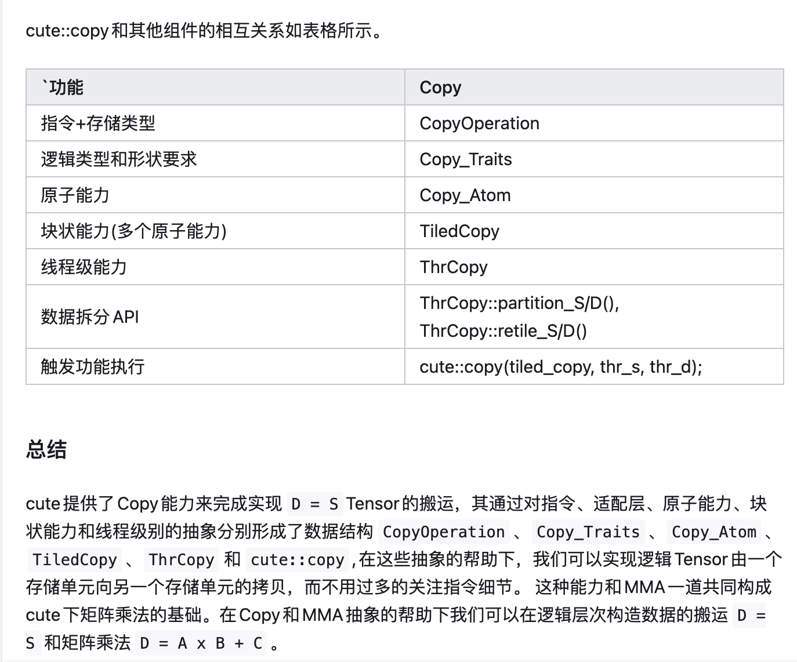

## "32x2x2=128 스레드, MNK=32x32x16"에 대한 보충 설명

이 추론의 핵심은 `make_tiled_mma(mma_atom{}, layout_m, layout_n)`이 warp 레벨의 `mma_atom`을 **M 방향**과 **N 방향**에서 반복(replication)하여 더 큰 `TiledMMA`로 조합한다는 것이다. 따라서 `TiledMMA`를 다음과 같이 이해할 수 있다:

> 여러 `mma_atom`으로 구성된 "원자 배열"로, 각 atom은 여전히 32개 스레드가 협력하여 실행하는 warp 레벨 MMA다.

아래에서 이 계산을 분해한다.

### 1) 스레드 수가 `32 x 2 x 2 = 128`인 이유

- **[32]**: `mma_atom` 자체가 warp-level(SM80 Tensor Core MMA)이며, 원자 MMA 하나에 warp 32개 스레드의 협력이 필요하다.
- **[x2]**: `make_layout(Shape<_2,_2,_1>{})` 으로 `mma_atom`이 어떤 2차원 격자에서 반복된다(atom이 2×2 "배열"로 배치되는 것으로 이해할 수 있으며, 협력에 참여하는 스레드/warp 수가 증가한다).
- **[다시 x2]**: 두 번째 `make_layout(Shape<_1,_2,_1>{})` 으로 atom이 다른 방향에서 한 번 더 반복된다(병렬 참여 스레드/warp 수가 더 늘어난다).

따라서 총 스레드 수는 "원자에 필요한 스레드 수 × atom 배열의 반복 규모"로 추정할 수 있다:

`threads = 32 * (M방향 반복수) * (N방향 반복수)`

본문에서 제시한 결과 `32x2x2=128`의 직관적 이해는 다음과 같다: 이 `TiledMMA`는 4개의 warp(총 128 스레드)가 협력하여 작업한다.

### 2) 커버하는 행렬 크기가 `MNK = 32 x 32 x 16`인 이유

단일 `mma_op = SM80_16x8x16_...`부터 출발하면 원자 형상은:

- **[M]**: 16
- **[N]**: 8
- **[K]**: 16

`make_tiled_mma`가 하는 일은 본질적으로:

- **M 방향**에 더 많은 atom을 붙이면 처리 가능한 **M**이 커진다.
- **N 방향**에 더 많은 atom을 붙이면 처리 가능한 **N**이 커진다.
- **K** 방향은 보통 "atom 붙이기"로 커지지 않고 외층 루프(sliced-k / split-k)로 진행하므로, 많은 구성에서 K 방향 반복은 1이다.

따라서:

- `M = 16 x 2 x 1 = 32`
  - 16은 원자 명령어에서 옴
  - `x2`는 특정 layout이 M 방향으로 반복
  - `x1`은 다른 layout이 M 방향으로 확장하지 않음
- `N = 8 x 2 x 2 = 32`
  - 8은 원자 명령어에서 옴
  - 두 layout 모두 N 방향으로 2씩 확장(또는 동등하게: 한 layout은 atom 배열을 확장하고, 다른 layout은 스레드당 레지스터/fragment가 N 방향에서 커버하는 횟수를 확장)
- `K = 16 x 1 x 1 = 16`
  - K는 여전히 원자 명령어로 결정(16)
  - `x1 x1`은 이번 tiled 조합이 K 방향으로 추가 확장하지 않음

### 3) 두 `make_layout(Shape<...>)`가 각각 표현하는 것

CUTE/CUTLASS의 `make_tiled_mma`에서 이 두 layout은 대략 두 가지 "반복 방식"의 인코딩으로 이해할 수 있다:

- **[layout 1]**: 더 큰 tile에서 atom의 "배치 격자"를 기술한다(여러 atom을 2D 좌표에 따라 큰 tile에 배치하는 것과 유사).
- **[layout 2]**: 각 atom 내부 A/B/C fragment가 더 큰 tile에서 추가로 펼쳐지는 방식을 기술한다(N 방향 B/C 확장에서 더 두드러지게 나타나는 경우가 많다).

더 엄밀한 대응 관계는 구체적인 `MMA_Traits`와 `TiledMMA`의 내부 레이아웃(`thr_mma.partition_*`의 layout)을 함께 봐야 한다. 하지만 노트 작성 시에는 다음의 신뢰할 수 있는 검증 방법을 사용할 수 있다:

- **스레드 수 검증**: 최종 `size(TiledMMA{})`가 계산한 스레드 수와 같은가.
- **원소 수 검증**: 출력 tile의 원소 수 `M*N`이 모든 스레드의 누산기 레지스터 슬롯 수의 합과 같은가(warp/group 내 per-thread accumulator 수 × 스레드 수).


# Cute의 간단한 행렬 곱셈

## Tensor 표현

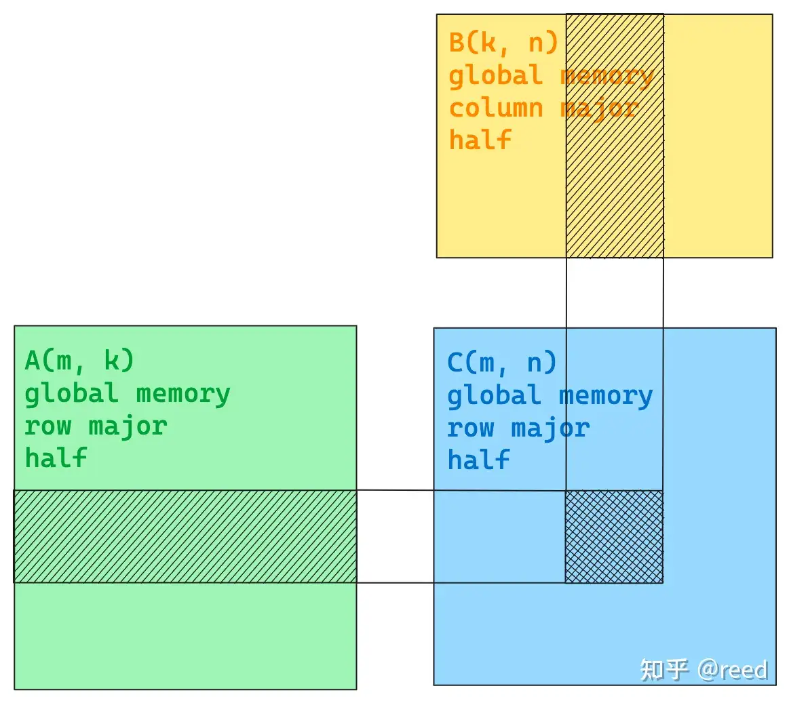

그림 2와 같이, 본 문서에서는 딥러닝에서 자주 사용되는 C = AB 행렬 곱셈 문제를 다룬다. 행렬 A, B는 GPU 전역 메모리에 저장되며, 출력 C 행렬도 전역 메모리에 저장된다. 차원 측면에서 A는 m행 k열, B는 k행 n열, 출력 C는 m행 n열이다. 데이터 저장 Layout 측면에서 A는 행 우선, B는 열 우선, C는 행 우선이다. 데이터 타입 측면에서 A, B, C 모두 16-bit 반정밀도 부동소수점으로 CUDA에서 half 타입(cute에서는 cute::half_t 타입으로 캡슐화)으로 표현한다. 행렬 ABC의 정보를 다음 표로 정리하고, row/column major를 stride 형태로 표현하여 포인터 변수명을 채운다.

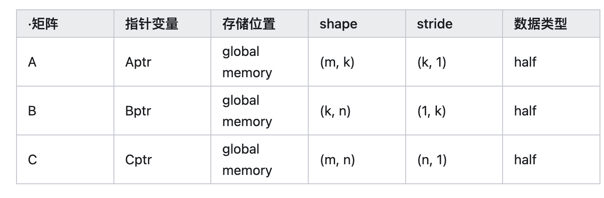

ABC를 Tensor 형태로 표현하면 다음과 같은 kernel 코드를 작성할 수 있다.

```c++
template <typename T>
__global__ void gemm_simple(T *Cptr, const T *Aptr, const T *Bptr, int m, int n, int k) {
  Tensor A = make_tensor(make_gmem_ptr(Aptr), make_shape(m, k), make_stride(k, Int<1>{}));
  Tensor B = make_tensor(make_gmem_ptr(Bptr), make_shape(n, k), make_stride(k, Int<1>{}));
  Tensor C = make_tensor(make_gmem_ptr(Cptr), make_shape(m, n), make_stride(n, Int<1>{})); 
}
```

`make_gmem_ptr()` 함수는 tensor 포인터의 저장 계층을 식별하여, 이후 사용 시 포인터에서 해당 저장 계층을 추출할 수 있게 한다. 또한 Tensor B의 행렬 표현을 수정하여 형상을 (n, k), 대응하는 stride를 (k, 1)로 표현했다. 이렇게 하면 이후 루프에서 reduce 형태로 작성할 수 있다. 컴파일 시 결정 및 최적화를 위해, stride의 연속 차원 1을 컴파일 타임 상수 형태 `Int<1>{}`로 표현했다. 이렇게 하면 이후 행렬 연산 시 stride 계산에 컴파일 타임 결정과 최적화를 활용하여 불필요한 런타임 연산을 줄일 수 있다.

## C 행렬 중심의 작업 분할 전략

GPU에는 여러 SM(Stream Multiprocessor)이 있으며, 프로그래밍 시에는 grid, block의 소프트웨어 계층으로 이 SM들을 활용한다. 행렬 계산에서는 출력 행렬 C를 thread block 분할의 단위로 삼아 작업을 분할한다. 즉, 하나의 thread block이 C 행렬의 작은 블록(TileC) 하나의 계산 작업을 완료한다. 그림 3과 같이 TileC의 크기를 kTileM, kTileN으로 정의하며, 각각 소블록 행렬의 행 수와 열 수를 나타낸다. 블록 행렬 곱셈 공식에 따라 TileC를 계산하려면 A 행렬의 초록색 하이라이트 부분과 B 행렬의 노란색 하이라이트 부분이 필요하며, 형상은 각각 (kTileM, k)와 (kTileN, k)다. AB 행렬의 k 축을 kTileK 크기로 분할하면 TileC 행렬을 AB 행렬 블록의 내적 연산으로 표현할 수 있다.

$$TileC = \sum_{i_{\text{tile}}=0}^{\text{num\_tile}} TileA_{i_{\text{tile}}}TileB_{i_{\text{tile}}}$$ 

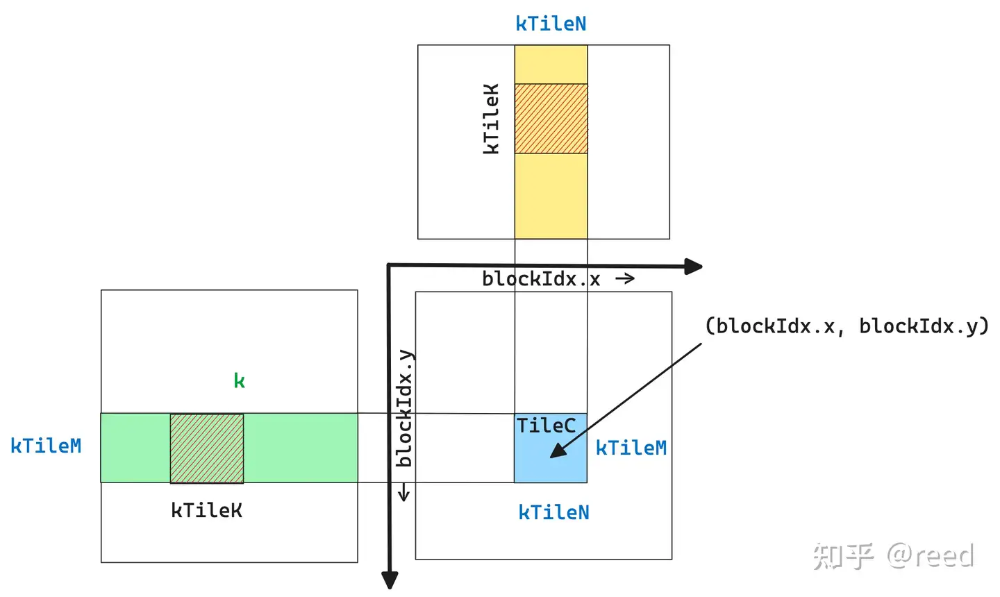

이처럼 k 축을 따라 kTileK를 이동하여 AB의 소블록 $TileA_{i_{\text{tile}}}$와 $TileB_{i_{\text{tile}}}$를 얻고, 이들의 곱을 TileC에 누산하면 TileC의 계산 결과를 얻는다. k 축을 따라 이동하는 이 전략을 sliced-k 방법이라 한다. 이렇게 하나의 block(그림의 blockIdx.x, blockIdx.y 좌표)으로 C 행렬의 소블록 하나의 완전한 계산을 완료할 수 있다. block 차원의 확장, 즉 그림에 나타난 C 행렬의 M 축 방향 blockIdx.y와 N 축 방향 blockIdx.x의 확장으로 전체 C 행렬의 계산을 완료할 수 있다. 이로부터 전체 C 행렬에 필요한 grid 차원을 계산할 수 있다: grid.x = N / kTileN, grid.y = M / kTileM (여기서는 나누어 떨어지지 않는 경우는 고려하지 않는다). 위의 계산 과정을 바탕으로 코드를 계속 발전시킬 수 있다.

```c++
template <typename T, int kTileM, int kTileN, int kTileK>
__global__ void gemm_simple(T *Cptr, const T *Aptr, const T *Bptr, int m, int n, int k) {
  Tensor A = make_tensor(make_gmem_ptr(Aptr), make_shape(m, k), make_stride(k, Int<1>{}));
  Tensor B = make_tensor(make_gmem_ptr(Bptr), make_shape(n, k), make_stride(k, Int<1>{}));
  Tensor C = make_tensor(make_gmem_ptr(Cptr), make_shape(m, n), make_stride(n, Int<1>{}));

  int ix = blockIdx.x;
  int iy = blockIdx.y;

  Tensor gA = local_tile(A, make_tile(Int<kTileM>{}, Int<kTileK>{}), make_coord(iy, _));
  Tensor gB = local_tile(B, make_tile(Int<kTileN>{}, Int<kTileK>{}), make_coord(ix, _));
  Tensor gC = local_tile(C, make_tile(Int<kTileM>{}, Int<kTileN>{}), make_coord(iy, ix));
}

int main() {
  ...
  dim3 grid(n / kTileN, m / kTileM);
  ...
}
```

위에서 설명한 대로, 템플릿 파라미터에 분할 하이퍼파라미터 kTileM, kTileN, kTileK를 지정하고, Tensor 절에서 소개한 local_tile 메서드로 행렬을 고정 크기로 분할한다. 좌표의 전체 slice 방법을 지정하여 현재 thread block이 처리할 Tensor gA, gB, gC를 얻는다. Tensor A 구성과 유사하게, Tensor 분할 시에도 컴파일 타임에 결정 가능한 양을 `Int<>`로 표현하여 해당 차원 정보가 컴파일 타임 상수임을 명시하고, 컴파일러가 컴파일 단계에서 필요한 경로 결정과 최적화를 수행할 수 있도록 하여 런타임 오버헤드를 줄인다. 또한 main 함수에서 grid 크기를 제공했다(위 코드 참고). 주목할 점은, `local_tile` 함수를 통해 얻은 gA, gB, gC의 차원 정보가 다음 표와 같다는 것이다.


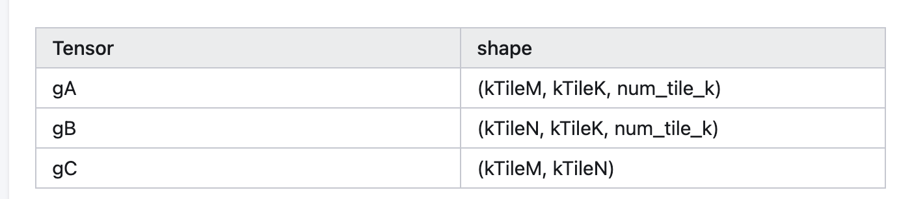

먼저 TileC를 선택한 뒤 k 축을 따라 소블록을 이동하며 누산하는 전략이 sliced-k이며, m, n 차원이 큰 경우(m n 분할에 필요한 block 수가 모든 SM을 채울 수 있는 경우)에 효과적이다. k가 크고 m, n이 작은 경우, C를 기준으로 thread block을 분할하면 필요한 thread block 수가 적어진다. 이 수가 모든 SM을 채울 수 없을 때 작업이 없는 SM이 많이 생기는 반면, 작업이 있는 SM은 여러 번 루프를 돌아야 하는 문제가 발생한다. 이 경우 k 축을 여러 구간으로 분할하여 각 구간이 TileC 결과를 계산하고, 마지막에 추가적인 누산 과정으로 여러 구간의 결과를 합산하는 방법을 고려할 수 있다. 이 작업 분할 방법을 split-k 방법이라 한다. 그림 4와 같이, k를 두 구간으로 분할하여 서로 다른 계산 단위가 각 구간을 계산하면 여러 개의 C를 얻게 되고, 마지막에 여러 C를 누산하여 최종 결과를 얻는다. 이 방법은 특수 시나리오에서 유용하며 구현이 어렵지 않다. 본 문서에서는 이 전략을 구현하지 않는다.

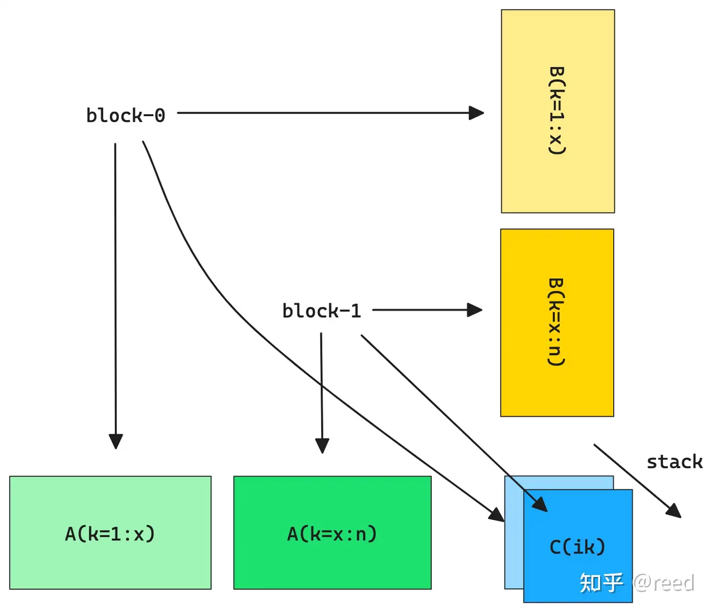

sliced-k, split-k 외에 작업 분할 측면에서 stream-k 방법도 있다. stream-k 저자들은 sliced-k나 split-k 방법이 모두 정적인 작업 분할이며, 분할한 작업 수가 SM 실행 단위와 나누어 떨어지지 않을 때 항상 어느 라운드(wave) 계산에서 SM 유휴 문제가 발생한다고 지적한다. stream-k는 작업 중심의 분할 논리를 버리고 컴퓨팅 자원 중심으로 작업을 할당하여 SM의 작업량이 기본적으로 균등해지도록 한다. 그림 5는 SM이 4개뿐인 경우를 가정하여 서로 다른 작업 분할 논리의 차이를 보여주며, stream-k가 컴퓨팅 자원을 가장 효율적으로 활용함을 확인할 수 있다. 자세한 내용은 PPoPP'23에 발표된 poster를 참고하면 된다. 현재 cuBLAS의 kernel은 여전히 대부분 sliced-k와 split-k로 구현되어 있다. 본 문서에서는 이 전략을 구현하지 않는다.

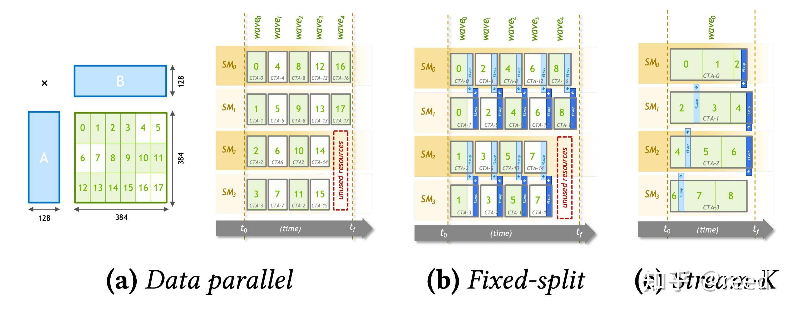

## TiledMMA: 호스트 측에서 명령어 선택, 장치 측에서 분할을 스레드로 배분

앞서 C++ 포인터를 Tensor로 캡슐화하고 `local_tile`로 Tensor를 소블록으로 분할하여 thread block이 처리할 작업을 얻었다. 이때 앞의 MMA 절에서 구성한 TiledMMA 능력이 있다면, 그 메서드를 통해 ThrMMA의 partition_A/B/C 메서드로 TileA, TileB, TileC를 분할하고, partition_fragment_A/B/C로 행렬 곱에 필요한 레지스터 표현을 구성할 수 있다. cute::gemm 메서드로 스레드 레벨 레지스터 표현의 행렬 곱셈을 완료할 수 있다. 구체적인 kernel 코드는 다음과 같다.

```c++
template <typename T, int kTileM, int kTileN, int kTileK, typename TiledMMA>
__global__ void gemm_simple(T *Cptr, const T *Aptr, const T *Bptr, int m, int n, int k) {
  Tensor A = make_tensor(make_gmem_ptr(Aptr), make_shape(m, k), make_stride(k, Int<1>{}));
  Tensor B = make_tensor(make_gmem_ptr(Bptr), make_shape(n, k), make_stride(k, Int<1>{}));
  Tensor C = make_tensor(make_gmem_ptr(Cptr), make_shape(m, n), make_stride(n, Int<1>{}));

  int ix = blockIdx.x;
  int iy = blockIdx.y;

  Tensor gA = local_tile(A, make_tile(Int<kTileM>{}, Int<kTileK>{}), make_coord(iy, _));
  Tensor gB = local_tile(B, make_tile(Int<kTileN>{}, Int<kTileK>{}), make_coord(ix, _));
  Tensor gC = local_tile(C, make_tile(Int<kTileM>{}, Int<kTileN>{}), make_coord(iy, ix));
  //  gA(kTileM, kTileK, num_tile_k)
  //  gB(kTileN, kTileK, num_tile_k)
  //  gC(kTileM, kTileN) 

  TiledMMA tiled_mma;
  auto thr_mma = tiled_mma.get_slice(threadIdx.x);
  auto tAgA = thr_mma.partition_A(gA);  // (MMA, MMA_M, MMA_K, num_tile_k)
  auto tBgB = thr_mma.partition_B(gB);  // (MMA, MMA_N, MMA_K, num_tile_k)
  auto tCgC = thr_mma.partition_C(gC);  // (MMA, MMA_M, MMA_N)

  auto tArA = thr_mma.partition_fragment_A(gA(_, _, 0));  // (MMA, MMA_M, MMA_K)
  auto tBrB = thr_mma.partition_fragment_B(gB(_, _, 0));  // (MMA, MMA_N, MMA_K)
  auto tCrC = thr_mma.partition_fragment_C(gC(_, _));     // (MMA, MMA_M, MMA_N)
 
  clear(tCrC); 
}

int main() {
  ...
  using mma_op = SM80_16x8x16_F16F16F16F16_TN;
  using mma_traits = MMA_Traits<mma_op>;
  using mma_atom = MMA_Atom<mma_traits>;

  auto MMA = decltype(make_tiled_mma(mma_atom{}, 
                      make_layout(Shape<_2, _2, _1>{}), 
                      make_layout(Shape<_1, _2, _1>{})));
  dim3 block(size(MMA{}));
  dim3 grid(n / kTileN, m / kTileM);
  ...
}
```

`get_slice` 함수는 TiledMMA 능력을 구체적인 스레드 id에 따라 각 스레드가 필요한 layout 정보로 분해한다. partition 함수로 gA, gB, gC 행렬을 스레드 레벨로 분해한다. partition 후 얻은 차원 정보는 (MMA, MMA_M, MMA_K, num_tile_k)이며, MMA는 TiledMMA가 한 번에 수행하는 행렬 연산에 필요한 데이터를, MMA_M, MMA_K는 (kTileM, kTileK)를 TiledMMA 능력으로 분할할 때 M 방향과 K 방향에서 몇 번 반복해야 하는지를 나타낸다. 즉 M, K 방향에서 TiledMMA를 몇 번 루프해야 계산이 완료되는지를 나타내며, num_tile_k는 gA의 차원이 자연스럽게 이어져 온 것이다. 즉 partition_A의 논리는 본질적으로 Tensor의 앞 두 차원을 분할하여 3차원 결과를 얻는 것이다. 첫 번째 차원은 TiledMMA 단일 처리 가능 데이터를, 다음 두 차원은 두 방향의 반복을 나타내며, 분할 대상 차원이 더 많다면 이후 차원이 자연스럽게 이어진다. partition_fragment 계열 함수는 앞의 것과 유사하나 레지스터 선언을 반환한다. 또한 partition_fragment_A/B의 입력 gA에서 앞 두 차원을 유지하고 세 번째 차원에서 위치 0을 선택했음에 주의한다. 이는 partition_fragment_A/B에 형상이 (kTileM, kTileK), (kTileN, kTileK)인 Tensor를 전달하는 것과 동등하다. 자연스럽게 반환 결과의 형상도 유사하다: 첫 번째 차원은 TiledMMA 단일 능력에 필요한 데이터, 다음 두 차원은 TileMMA 능력의 M 방향과 K 방향 반복 횟수다. TileC의 레지스터 표현을 얻은 뒤 clear 메서드로 0으로 초기화하여, 이후 행렬 곱셈의 누산 연산에 대비한다.

main 함수에서는 Ampere 아키텍처가 제공하는 16x8x16 Tensor Core 행렬 곱셈 명령어를 선택하며, 데이터 정밀도와 계산 정밀도 모두 fp16이다. 그런 다음 MMA_Traits로 mma_traits를 얻고, traits를 MMA_Atom으로 변환한다. SM80의 Tensor Core 실행은 warp 레벨이므로 MMA_Atom은 32개 스레드를 사용한다. MMA_Atom 능력을 스레드 추가 방식으로 M, N 방향에서 반복하고, B 행렬과 C 행렬이 N 방향으로 2번 더 많은 레지스터를 사용하도록 하여 main 함수의 MMA 타입을 얻는다. 이렇게 TiledMMA에 32x2x2 = 128 스레드가 필요하며, 처리 가능한 행렬 크기는 M = 16 x 2 x 1 = 32, N = 8 x 2 x 2 = 32, K = 16 x 1 x 1 = 16이다. 즉 TiledMMA가 처리 가능한 MNK는 32x32x16이다.

## 보충: `32x2x2=128 스레드`와 `MNK=32x32x16`의 인수가 각각 어디서 오는가

이 계산은 CUTE의 `make_tiled_mma(mma_atom, AtomLayout, ValLayout)` 관례적 이해로 설명할 수 있다:

- `mma_op = SM80_16x8x16_...`이 **단일 MMA atom**의 기본 형상을 결정한다:
  - `m_atom = 16`
  - `n_atom = 8`
  - `k_atom = 16`
- `mma_atom`은 **warp-level atom**이다: 각 atom에 warp(32개 스레드) 하나의 협력 실행이 필요하다.

코드에서:

```c++
auto MMA = decltype(make_tiled_mma(
  mma_atom{},
  make_layout(Shape<_2, _2, _1>{}),
  make_layout(Shape<_1, _2, _1>{})
));
```

두 `Shape<...>`를 다음과 같이 대략 이해할 수 있다:

- `AtomLayout = Shape<_2,_2,_1>`: **(M,N,K) 세 방향에서 atom 배열의 개수**
  - M 방향에 atom 2개 배치
  - N 방향에 atom 2개 배치
  - K 방향에 atom 1개 배치
- `ValLayout = Shape<_1,_2,_1>`: **각 스레드 레지스터/fragment의 (M,N,K) 방향 추가 펼침 배수**(atom 개수를 늘리지 않고, 주로 스레드당 레지스터 fragment가 출력 tile을 커버하는 방식을 변경)
  - M 방향 펼치지 않음(1)
  - N 방향 2배 펼침(본문에서 "B/C를 N 방향으로 2번 확장"한다는 직관적 표현의 출처)
  - K 방향 펼치지 않음(1)

### 1) 스레드 수가 `32 x 2 x 2 = 128`인 이유

스레드 수는 atom 수로 결정된다(각 atom에 warp 전체):

- atom 수 = `2 * 2 * 1 = 4`
- 각 atom의 스레드 수 = `32`

따라서 총 스레드 수 = `32 * 4 = 128`.

참고: 여기서 스레드 수는 주로 `AtomLayout`으로 결정된다. `ValLayout`은 레지스터 fragment/커버 방식의 펼침에 치우쳐 있으며, 일반적으로 warp 수를 추가로 늘리지 않는다.

### 2) MNK 커버 범위가 `32 x 32 x 16`인 이유

"단일 atom 형상"에 두 layout의 펼침 배수를 곱하면 tiled 커버 범위를 얻는다(노트 작성 시 유용한 암기법이다):

- `M = m_atom * AtomLayout.M * ValLayout.M = 16 * 2 * 1 = 32`
- `N = n_atom * AtomLayout.N * ValLayout.N = 8 * 2 * 2 = 32`
- `K = k_atom * AtomLayout.K * ValLayout.K = 16 * 1 * 1 = 16`

가장 핵심적인 점:

- `AtomLayout`은 tile을 M/N 방향에서 "더 큰 블록으로 조합"한다(더 많은 warp 협력).
- `ValLayout`은 주로 스레드당 레지스터 fragment가 특정 방향(여기서는 N)에서 더 많은 출력 위치를 커버하도록 하여 최종 N을 한 배 더 확대하는 데 사용된다.


## Loop Over K

TiledMMA의 데이터 분할이 끝나면 `cute::gemm`을 호출하여 `C[kTileM, kTileN] = A[kTileM, kTilleK] B[kTileN, kTileK]` Tensor Core 행렬 곱셈 능력을 완성한다. 이 블록에 대해 k 방향으로 루프하면 최종 행렬 계산 결과를 얻을 수 있으며, 구현은 다음과 같다.

```c++
template <typename T, int kTileM, int kTileN, int kTileK, typename TiledMMA>
__global__ void gemm_simple(T *Cptr, const T *Aptr, const T *Bptr, int m, int n, int k) {
  Tensor A = make_tensor(make_gmem_ptr(Aptr), make_shape(m, k), make_stride(k, Int<1>{}));
  Tensor B = make_tensor(make_gmem_ptr(Bptr), make_shape(n, k), make_stride(k, Int<1>{}));
  Tensor C = make_tensor(make_gmem_ptr(Cptr), make_shape(m, n), make_stride(n, Int<1>{}));

  int ix = blockIdx.x;
  int iy = blockIdx.y;

  Tensor gA = local_tile(A, make_tile(Int<kTileM>{}, Int<kTileK>{}), make_coord(iy, _));
  Tensor gB = local_tile(B, make_tile(Int<kTileN>{}, Int<kTileK>{}), make_coord(ix, _));
  Tensor gC = local_tile(C, make_tile(Int<kTileM>{}, Int<kTileN>{}), make_coord(iy, ix));
  //  gA(kTileM, kTileK, num_tile_k)
  //  gB(kTileN, kTileK, num_tile_k)
  //  gC(kTileM, kTileN) 

  TiledMMA tiled_mma;
  auto thr_mma = tiled_mma.get_slice(threadIdx.x);
  auto tAgA = thr_mma.partition_A(gA);  // (MMA, MMA_M, MMA_K, num_tile_k)
  auto tBgB = thr_mma.partition_B(gB);  // (MMA, MMA_N, MMA_K, num_tile_k)
  auto tCgC = thr_mma.partition_C(gC);  // (MMA, MMA_M, MMA_N)

  auto tArA = thr_mma.partition_fragment_A(gA(_, _, 0));  // (MMA, MMA_M, MMA_K)
  auto tBrB = thr_mma.partition_fragment_B(gB(_, _, 0));  // (MMA, MMA_N, MMA_K)
  auto tCrC = thr_mma.partition_fragment_C(gC(_, _));     // (MMA, MMA_M, MMA_N)
 
  clear(tCrC);
  
  int num_tile_k = size<2>(gA);
#pragma unroll 1
  for(int itile = 0; itile < num_tile_k; ++itle) {
    cute::copy(tAgA(_, _, _, itile), tArA);
    cute::copy(tBgB(_, _, _, itile), tBrB);

    cute::gemm(tiled_mma, tCrC, tArA, tBrB, tCrC);
  }

  cute::copy(tCrC, tCgC); 
}

int main() {
  ...
  using mma_op = SM80_16x8x16_F16F16F16F16_TN;
  using mma_traits = MMA_Traits<mma_op>;
  using mma_atom = MMA_Atom<mma_traits>;

  auto MMA = decltype(make_tiled_mma(mma_atom{}, 
                      make_layout(Shape<_2, _2, _1>{}), 
                      make_layout(Shape<_1, _2, _1>{})));
  dim3 block(size(MMA{}));
  dim3 grid(n / kTileN, m / kTileM);
  gemm_simple<T, kTileM, kTileN, kTileK, MMA>(Cptr, Aptr, Bptr, m, n, k);
  ...
}
```

gA로 k 방향 tile 루프 횟수 num_tile_k를 얻은 뒤, sliced-k 방식으로 k 방향 tile을 루프하고, `cute::copy`로 전역 메모리에서 레지스터로 직접 복사한다. 데이터가 레지스터로 복사된 뒤 `cute::gemm`으로 Tile 블록의 행렬 곱셈을 완료한다. 루프가 끝난 뒤 다시 `cute::copy`로 레지스터에서 전역 메모리로 쓰기한다. `cute::copy`는 Copy_Atom을 지정하지 않으면 UniversalCopy를 사용하며, 이는 단순히 CUDA 언어 레벨의 `T d = s` 형태다. 이로써 TileMMA와 cute::copy를 사용한 간단한 행렬 곱셈 구현이 가능해진다.


- gemm_simple.cu


```c++
#include <cuda.h>
#include <cublas_v2.h>
#include <stdlib.h>
#include <cute/tensor.hpp>

template <typename T>
void gen_rand_data(T *data, int n);

template <typename T, int kTileM, int kTileN, int kTileK, typename TiledMMA>
__global__ void gemm_simple(T *Cptr, const T *Aptr, const T *Bptr, int m, int n, int k) {

  using namespace cute;

  Tensor A = make_tensor(make_gmem_ptr(Aptr), make_shape(m, k), make_stride(k, Int<1>{}));
  Tensor B = make_tensor(make_gmem_ptr(Bptr), make_shape(n, k), make_stride(k, Int<1>{}));
  Tensor C = make_tensor(make_gmem_ptr(Cptr), make_shape(m, n), make_stride(n, Int<1>{}));

  int ix = blockIdx.x;
  int iy = blockIdx.y;

  Tensor gA = local_tile(A, make_tile(Int<kTileM>{}, Int<kTileK>{}), make_coord(iy, _));
  Tensor gB = local_tile(B, make_tile(Int<kTileN>{}, Int<kTileK>{}), make_coord(ix, _));
  Tensor gC = local_tile(C, make_tile(Int<kTileM>{}, Int<kTileN>{}), make_coord(iy, ix));
  //  gA(kTileM, kTileK, num_tile_k)
  //  gB(kTileN, kTileK, num_tile_k)
  //  gC(kTileM, kTileN) 

  TiledMMA tiled_mma;
  auto thr_mma = tiled_mma.get_slice(threadIdx.x);
  auto tAgA = thr_mma.partition_A(gA);  // (MMA, MMA_M, MMA_K, num_tile_k)
  auto tBgB = thr_mma.partition_B(gB);  // (MMA, MMA_N, MMA_K, num_tile_k)
  auto tCgC = thr_mma.partition_C(gC);  // (MMA, MMA_M, MMA_N)

  auto tArA = thr_mma.partition_fragment_A(gA(_, _, 0));  // (MMA, MMA_M, MMA_K)
  auto tBrB = thr_mma.partition_fragment_B(gB(_, _, 0));  // (MMA, MMA_N, MMA_K)
  auto tCrC = thr_mma.partition_fragment_C(gC(_, _));     // (MMA, MMA_M, MMA_N)
 
  clear(tCrC);
  
  int num_tile_k = size<2>(gA);
#pragma unroll 1
  for(int itile = 0; itile < num_tile_k; ++itile) {
    cute::copy(tAgA(_, _, _, itile), tArA);
    cute::copy(tBgB(_, _, _, itile), tBrB);

    cute::gemm(tiled_mma, tCrC, tArA, tBrB, tCrC);
  }

  cute::copy(tCrC, tCgC); 
}

int main() {
  srand(10086);

  using T = cute::half_t;
  using namespace cute;

  T *Cptr;
  T *Aptr;
  T *Bptr;

  int m = 81920;
  int n = 256;
  int k = 256;

  cudaMalloc(&Cptr, sizeof(T) * m * n);
  cudaMalloc(&Aptr, sizeof(T) * m * k);
  cudaMalloc(&Bptr, sizeof(T) * k * n);

  T *Aptr_host;
  T *Bptr_host;
  Aptr_host = (T*)malloc(sizeof(T) * m * k);
  Bptr_host = (T*)malloc(sizeof(T) * n * k);
  gen_rand_data(Aptr_host, m * k);
  gen_rand_data(Bptr_host, n * k);

  cudaMemcpy(Aptr, Aptr_host, sizeof(T) * m * k, cudaMemcpyHostToDevice);
  cudaMemcpy(Bptr, Bptr_host, sizeof(T) * n * k, cudaMemcpyHostToDevice);

  using mma_op = SM80_16x8x16_F16F16F16F16_TN;
  using mma_traits = MMA_Traits<mma_op>;
  using mma_atom = MMA_Atom<mma_traits>;

  using MMA = decltype(make_tiled_mma(mma_atom{}, 
                      make_layout(Shape<_2, _2, _1>{}), 
                      make_layout(Shape<_1, _2, _1>{})));
  constexpr int kTileM = 128; 
  constexpr int kTileN = 128; 
  constexpr int kTileK = 32; 

  dim3 block(size(MMA{}));
  dim3 grid(n / kTileN, m / kTileM);
  for (int i = 0; i < 100; ++i) {
    gemm_simple<T, kTileM, kTileN, kTileK, MMA><<<grid, block>>>(Cptr, Aptr, Bptr, m, n, k);
  }
  cudaDeviceSynchronize();
  auto err = cudaGetLastError();
  printf("err = %d, str = %s\n", err, cudaGetErrorString(err));

  // cublas
  T *Cptr_cublas;

  cudaMalloc(&Cptr_cublas, sizeof(T) * m * n);

  cublasHandle_t handle;
  cublasCreate(&handle);

  half alpha = half(1.f);
  half beta = half(0.f);
  for (int i = 0; i < 100; ++i) {
    cublasStatus_t ret = cublasHgemm(handle, CUBLAS_OP_T, CUBLAS_OP_N,
          	  n, m, k,
          	  &alpha,
          	  (half *)Bptr, k,
          	  (half *)Aptr, k,
          	  &beta,
          	  (half *)Cptr_cublas, n);
    if (ret != CUBLAS_STATUS_SUCCESS) {
      printf("blas err = %d, str = %s\n", ret, cublasGetStatusString(ret));
    }
  }

  cudaDeviceSynchronize();
  err = cudaGetLastError();
  printf("err = %d, str = %s\n", err, cudaGetErrorString(err));

  T *Cptr_host;
  T *Cptr_cublas_host;

  Cptr_host = (T*)malloc(sizeof(T) * m * n);
  Cptr_cublas_host = (T*)malloc(sizeof(T) * m * n);

  // compare
  cudaMemcpy(Cptr_host, Cptr, sizeof(T) * m * n, cudaMemcpyDeviceToHost);
  cudaMemcpy(Cptr_cublas_host, Cptr_cublas, sizeof(T) * m * n, cudaMemcpyDeviceToHost);

  float threshold = 0.1;
  for (int i = 0; i < m * n; ++i) {
    float v1 = Cptr_host[i];
    float v2 = Cptr_cublas_host[i];
    if (fabs(v2 - v1) > threshold) {
      printf("v1 = %f, v2 = %f\n", v1, v2);
    }
  }

  Tensor tensor_C = make_tensor(Cptr_host, make_shape(m, n), make_stride(n, 1));
  Tensor tensor_C_cublas = make_tensor(Cptr_cublas_host, make_shape(m, n), make_stride(n, 1));

  auto tile = make_tile(8, 8);
  auto coor = make_coord(0, 0);
  Tensor tc1 = local_tile(tensor_C, tile, coor);
  Tensor tc1_cublas = local_tile(tensor_C_cublas, tile, coor);

  print_tensor(tc1);
  print_tensor(tc1_cublas);
}

template <typename T>
void gen_rand_data(T *data, int n) {
  for (int i = 0; i < n; ++i) {
    float v = (rand() % 200 - 100) * 0.01;
    data[i] = v;
  }
}
```


# Cute의 GEMM 파이프라인

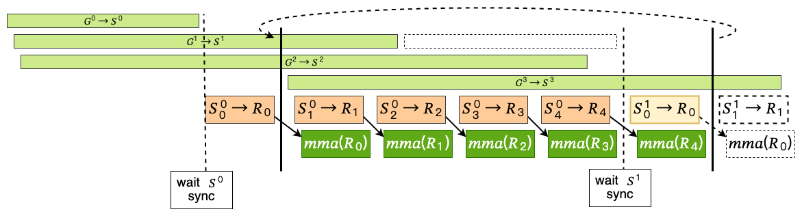

앞선 문서에서 cute의 Copy 추상화와 MMA 추상화를 소개하고, 이 추상화들을 기반으로 간단한 GEMM 구현을 진행했다. 논리적으로 cute 소개는 이미 끝났지만, 완성해야 할 GEMM 연산 측면에서 중요한 최적화 한 가지가 남아 있다. 바로 GPU의 데이터 로드 유닛과 계산 유닛을 어떻게 효율적으로, 병렬적으로 활용할 것인가 하는 문제다. 즉 cute의 Copy 추상화와 MMA 추상화를 어떻게 구성하여 효율적인 GEMM 계산을 완성할 것인지다. 이 부분은 GEMM의 전략에 속하며 cute의 기능 범위가 아니다. 하지만 이 시리즈 문서 제목의 대칭성을 위해 제목을 "cute의 GEMM 파이프라인"으로 그대로 유지한다. 핵심은, 파이프라인 부분 자체는 cute에 속하지 않고 GEMM의 최적화 전략이라는 점이다. 문서 구조 측면에서, 본 문서는 먼저 고전적인 RISC 하드웨어 구현의 명령어 파이프라인을 되돌아보며 파이프라인이 성능에 미치는 영향을 도입한다. 그런 다음 유추 방식으로 GEMM 알고리즘에서 자주 사용하는 소프트웨어 파이프라인(Tile 간 및 Tile 내)을 소개하고, NVIDIA Ampere 아키텍처가 제공하는 비동기 복사 명령어와 MultiStage 파이프라인을 소개한 뒤, 마지막으로 GEMM 파이프라인과 cute의 관계를 정리한다.


## RISC 하드웨어 파이프라인

현대 프로세서 마이크로아키텍처에서 파이프라인 기술은 명령어 병렬성을 높이는 핵심 기술이다. 파이프라인 프로세서는 각 명령어의 실행 과정을 여러 단계(Stage)로 나누고, 서로 다른 명령어의 서로 다른 단계를 동시에 처리할 수 있도록 허용한다. 고전적인 RISC(Reduced Instruction Set Computer) 파이프라인을 예로 들면, 명령어 실행은 다섯 단계로 나뉜다:

- 명령어 인출(IF = Instruction Fetch): 프로그램 실행 위치(PC = program counter)에 따라 명령어 캐시에서 실행할 명령어를 하나 가져온다.
- 명령어 해독(ID = Instruction Decode): 가져온 이진 인코딩을 수행할 연산 타입, 소스 레지스터, 목적 레지스터로 분해한다.
- 실행(EX = EXecute): 실행 유닛이 특정 연산을 수행한다.
- 메모리 접근(MEM = MEMory): 명령어가 메모리 접근을 필요로 하는 경우, 이 단계에서 해당 메모리 읽기/쓰기를 담당한다.
- 결과 기록(WB = Write Back): 실행 유닛의 실행 결과 및/또는 메모리 접근 결과를 목적 레지스터에 쓴다.

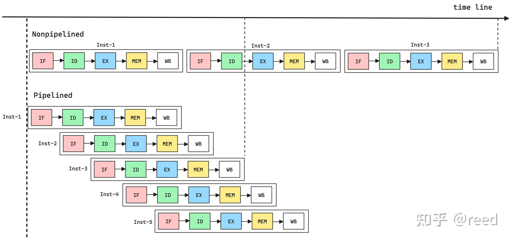

그림 1은 비파이프라인과 파이프라인 아키텍처의 명령어 실행 시간을 비교한다. 비파이프라인 구조에서는 각 명령어를 실행할 때 모든 단계를 거쳐야 하며, 세 개의 명령어(Inst-1, Inst-2, Inst-3)를 실행하는 데 필요한 시간이 그림 상단에 나타나 있다. 파이프라인 구조에서는 첫 번째 명령어가 인출을 마치고 해독 단계에 들어갈 때, 두 번째 명령어가 인출 단계에 진입할 수 있으며, 이후 명령어 단계들도 유사하게 겹쳐서 실행된다. 그림 하단과 같이, 파이프라인 방식으로 세 명령어를 실행하는 데 필요한 시간이 비파이프라인 방식보다 훨씬 적다. 파이프라인 방식은 명령어 실행의 각 단계의 서로 다른 유닛 사용률을 높여, 매 순간 모든 유닛이 충분히 활용될 수 있게 한다. 비파이프라인 구조에서는 한 시점에 일부 유닛만 실행되고 나머지는 모두 유휴 대기 상태에 있는 것과 대조적이다.

## GEMM 소프트웨어 파이프라인（Tile 간）

명령어 파이프라인이 하드웨어 설계 논리를 통해 각 유닛의 활용도를 높이고 병렬도를 향상시켜 실행 효율을 개선하는 것을 살펴보았다. GEMM 문제에서도 동일한 사고방식을 소프트웨어 프로그래밍 과정에서 적용하여 더 나은 병렬성을 구현할 수 있다.

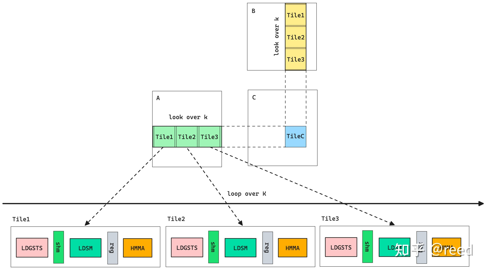

그림 2에서 보듯이, 전형적인 sliced-k 패턴의 GEMM 구현에서는 K 축 방향의 tile을 순환하며 누적하여 최종 CTile 결과를 얻는다. RISC의 파이프라인 패턴과 유사하게, 각 Tile의 행렬 곱 계산을 하나의 기본 단위（RISC의 명령어에 해당）로 보면, 해당 명령어의 실행을 RISC 파이프라인에 빗대어 여러 단계로 나눌 수 있다.

- 데이터를 shared memory에 로드（LDGSTS = LoaD Global STore Shared memory）
- 데이터를 register에 로드（LDSM = LoaD Shared Matrix）
- 블록 행렬 곱 연산（MMA = Matrix Multiply Accumulate）

첫 번째 단계의 출력 데이터는 shared memory에 저장되고, 두 번째 단계의 데이터는 register에 저장된다. RISC 파이프라인과 유사하게, 하나의 Tile 계산 과정을 세 단계로 나누어 각 단계가 중첩될 수 있다면 효율이 크게 향상된다. 이에 따라 파이프라인 방식으로 최적화된 GEMM 실행 효과가 그림 3에 나타나 있다.

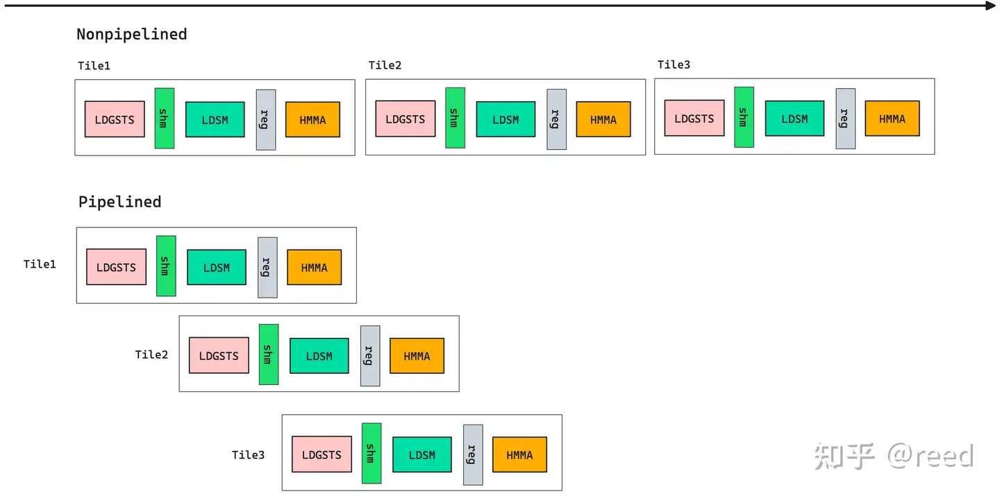

이렇게 세 단계의 실행을 병렬화할 수 있으며, 파이프라인을 통해 각 유닛이 동시에 동작하게 함으로써 전역 메모리에서 shared memory로의 데이터 로드, shared memory에서 register로의 데이터 로드, 행렬 계산 등 각 유닛의 활용 효율을 높이고 GEMM의 실행 효율을 향상시킨다.

## Tile 내 파이프라인

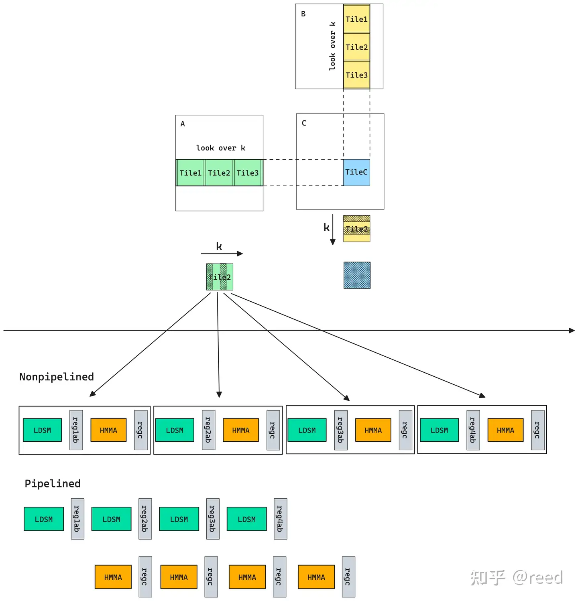

행렬 곱셈의 분할 패턴 Tile 내에서도 파이프라인 패턴을 사용할 수 있다（본 문서에서는 tile 내 소 k 루프라고 부른다）. 그림 4에서 보듯이, Tile 수준의 행렬 곱에서 하나의 Tile 안에 포함된 행렬 크기는 일반적으로 여러 개의 명령어（MMA_Atom 안의 명령어）를 통해야 행렬 곱셈을 완료할 수 있으며, 각 행렬 곱셈의 입력 데이터는 서로 독립적이다. 따라서 데이터 로드와 계산을 파이프라인 패턴으로 구성하여 데이터 로드 유닛과 계산 유닛의 활용률을 높일 수 있고, 이를 통해 Tile 내 파이프라인 패턴（2단계 파이프라인）을 형성할 수 있다. 그림의 pipelined로 표시된 부분과 같이, 데이터 로드와 계산을 중첩함으로써 Tile 내 행렬 계산의 전반적인 효율을 향상시킨다.

## 비동기 복사와 MultiStage 파이프라인

데이터 로드 효율을 높이기 위해 NVidia는 Ampere 아키텍처 GPU에서 비동기 복사 명령어 `cp.async`（SASS 어셈블리로는 LDGSTS = LoaD Global Store Shared）를 제공한다. 이 비동기 복사 명령어는 전역 메모리에서 shared memory로의 데이터 로드를 비동기적으로 완료할 수 있다. Ampere 아키텍처 이전에는 전역 메모리에서 shared memory로의 데이터 로드가 반드시 register를 거쳐야 했으므로 register 수준에서 데이터 의존성이 발생했다. GPU의 순차 실행 메커니즘과 scoreboard 의존성 해결 방식（in-order issue, in-order execute）으로 인해 전역 메모리에서 shared memory로의 데이터에 register 의존성에 의한 stall이 발생했다. Ampere에서 제공하는 `cp.async`는 이 제약을 극복하여 전역 메모리에서 shared memory로의 로드를 직접 구현한다. 데이터가 비동기적으로 로드되므로, 즉 명령어를 발행한 후 대기 없이 다음 명령어를 실행할 수 있으므로, 이 아키텍처는 commit와 wait 메커니즘을 통한 명시적 동기화를 제공한다. commit는 이벤트의 동기화 지점을 표시하는 데 사용되고, wait는 특정 동기화 지점까지 동기화하여 해당 지점 이전의 데이터가 모두 복사 완료되었음을 보장한다.

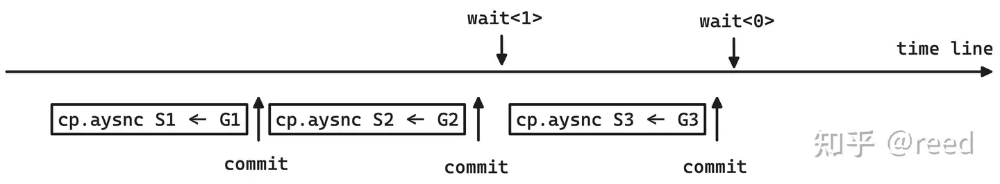

그림 5에서 보듯이, `cp.async` 명령어로 전역 메모리에서 shared memory로의 복사 작업을 세 개 제출하고, 동시에 commit로 세 개의 트랜잭션 지점과 두 개의 wait을 제출한다. `wait<1>`은 최대 하나의 미완료 비동기 트랜잭션（G2 -> S2）을 허용한다는 의미로, `wait<1>` 실행이 완료되면 G1에서 S1로의 복사가 완료되었음을 보장한다. `wait<0>`은 미완료 트랜잭션이 없음을 허용한다는 의미로, 이전의 모든 commit된 작업, 즉 G1->S1, G2->S2, G3->S3 전부가 완료될 때까지 대기한다.

비동기 데이터 복사 명령어를 통해 전역 메모리에서 shared memory로의 비동기 로드를 완료할 수 있게 됨으로써, 행렬 A와 B의 Tile 로드를 완료하고, Tile 간 파이프라인과 Tile 내 파이프라인을 통합하면 GEMM 계산의 MultiStage 파이프라인 모델을 얻을 수 있다. 그림 6에 나타나 있다.

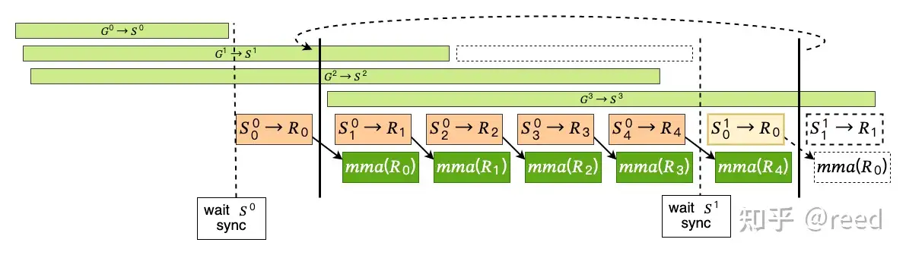

연두색 $G^i \rightarrow S^i$는 전역 메모리에서 shared memory로의 비동기 데이터 로드를 나타내며, 그 크기는 Tile 크기에 해당한다. 이는 TileA와 TileB의 데이터 로드를 합쳐 표현한 것이다（즉 tile 루프）. 갈색 $S_j \rightarrow R_j$는 shared memory에서 register로의 데이터 로드를 나타내며, Tile 내 소행렬의 데이터 로드에 해당하고 역시 A와 B의 로드를 합쳐 표현한 것이다（즉 tile 내 소 k 루프）. 진초록색 $\mathrm{mma}(R_i)$는 register 위에서의 행렬 곱 계산, 즉 tile 내 소 k 루프를 나타낸다. mma 경계에는 두 개의 검은 경계선이 있고, 두 경계선은 곡선 점선으로 연결되어 있으며, 이는 tile 내 소 k 루프의 시작점과 끝점을 나타낸다. 즉 검은 선 사이에서 tile 내 행렬 곱이 완료된다. 곡선 점선은 하나의 tile 계산이 완료된 후 다음 tile 계산을 계속함을 나타낸다. 첫 번째 tile 계산이 시작되기 전（즉 첫 번째 검은 실선 경계 이전）에 multistage 구현（그림에서 kStage는 4）에서는 stage - 1개의 비동기 전역 메모리에서 shared memory로의 로드 작업을 발행해야 한다（G0->S0, G1->S1, G2->S2）. 동시에 첫 번째 Tile의 내용을 읽을 수 있도록 모든 비동기 작업을 발행한 후 S0 완료를 wait한다. wait 이후에는 데이터가 shared memory에 도달했음을 의미하며, tile의 소 k 루프에 진입하기 전에 먼저 S0에서 ik = 0의 행렬 계산에 필요한 데이터를 register R0에 가져온다（첫 번째 검은 점선과 첫 번째 검은 실선 사이）. 이 시점에서 첫 번째 행렬 계산에 필요한 데이터가 준비되었으므로 tile 내 소 k 루프에 진입한다. 루프에 진입하면 세 가지 동작을 수행해야 한다: 1. 새로운 Tile 데이터 G3->S3를 비동기 읽기로 발행, 2. shared memory에서 다음 소 k 행렬 곱에 필요한 데이터 R1을 읽기, 3. 첫 번째 소 k의 행렬 연산 실행. 공유 메모리 출력 데이터와 mma에 필요한 데이터 의존 관계는 화살표로 표시된다. 소 k 루프에 진입한 후 위의 2, 3단계를 반복하면 파이프라인으로 데이터 로드와 계산을 완료할 수 있다. 마지막 소 k 루프 전에 다음 tile의 첫 번째 소 k 데이터를（shared memory에서 register로）읽어야 하지만, 이 시점에서 다음 tile의 데이터（전역 메모리에서 shared memory로）는 wait S1을 통해 데이터 로드 완료를 보장해야 한다. 따라서 마지막 소 k 루프 전에 S1의 비동기 트랜잭션 대기를 삽입해야 하며, 대기가 끝나면 이전에 소 k 루프에 진입하기 전과 마찬가지로 다음 루프（tile 루프）에 진입하기 전에 shared memory 데이터를 register에 로드한다. 주목할 점은 이 시점의 shared memory는 현재 tile이 아니라 다음 tile, 즉 S1이라는 것이다. R0를 읽은 후 마지막 소 k의 mma 계산을 완료하면 tile 내 소 k 루프가 끝나고, 소 k 루프가 끝나면 다음 tile의 계산을 반복하여 최종적으로 tile 루프를 완료한다.

위가 multi stage GEMM 파이프라인（Tile 간 다단계, Tile 내 2단계）이며, multi는 여러 개를 의미하고 구체적인 개수는 shared memory 중간 버퍼의 개수이다. 즉 stage가 5인 GEMM 파이프라인은 5개의 shared memory 버퍼를 가진 파이프라인 설계를 의미하며, 각 버퍼는 하나의 Tile 데이터（TileA와 TileB 포함）를 저장할 수 있다. Tile 루프가 시작되기 전에 stage - 1개의 전역 메모리에서 shared memory로의 로드를 먼저 발행하고, 루프 안에서 다음 Tile을 로드하며, 이렇게 위의 stage개 버퍼를 순환 사용하여 모든 데이터 로드를 완료한다. 비동기 복사를 지원하지 않는 GPU 아키텍처에서는 register 의존성과 `syncthread`의 전역적 영향으로 인해 최대 두 개의 memory 버퍼（실질적으로는 register 버퍼）만 가질 수 있는데, 하나는 현재 데이터 계산에 사용하고 다른 하나는 후속 데이터 로드에 사용한다. 이것이 흔히 말하는 더블 버퍼링（double buffer）메커니즘으로, multi stage에서 stage가 2인 특수 케이스로 볼 수 있다. 적절한 stage 크기는 본질적으로 데이터 로드 능력과 행렬 계산 능력의 균형으로, Tile 크기와 하드웨어 레이턴시에 의해 결정된다. 구체적인 선택 시에는 micro-benchmark를 통해 해당 명령어의 레이턴시를 구하여 정방향으로 설계할 수 있고, 구체적인 환경에서 실험적으로 튜닝하여 얻을 수도 있다. 이후 문서에서 이 소프트웨어 파이프라인 방식을 활용하여 더 효율적인 GEMM을 구현할 것이다.

적절한 stage 크기는 본질적으로 데이터 로드 능력과 행렬 계산 능력의 균형으로, Tile 크기와 하드웨어 레이턴시에 의해 결정된다. 구체적인 선택 시에는 micro-benchmark를 통해 해당 명령어의 레이턴시를 구하여 정방향으로 설계할 수 있고, 구체적인 환경에서 실험적으로 튜닝하여 얻을 수도 있다. 이후 문서에서 이 소프트웨어 파이프라인 방식을 활용하여 더 효율적인 GEMM을 구현할 것이다.

# cute의 Swizzle

앞선 문서에서 GEMM의 파이프라인 기술을 소개했는데, 파이프라인의 핵심은 복사와 계산을 병렬화하거나 데이터 로드를 계산 과정에 숨기는 것이다. 행렬 계산에서의 데이터 로드는 전역 메모리에서 shared memory를 거쳐 register로 이루어진다. shared memory는 중간 매체로서 행렬 계산 시 전역 메모리에 대한 접근 데이터 양을 줄여 계산 대 메모리 접근 비율을 향상시킨다. shared memory는 접근의 병렬성을 높이기 위해 멀티 bank 구조를 채택하는데, 이는 프로그래밍 시 어려움을 야기한다. cute는 swizzle 추상화를 제공하여 논리 공간과 멀티 bank 저장 공간 간의 매핑 복잡도를 단순화한다. 본 문서에서는 먼저 shared memory의 멀티 bank 저장 구조를 소개하고, 이어서 행렬 계산의 ldmatrix 명령어가 논리 공간과 저장 공간에 요구하는 사항을 소개한다. 다음으로 XOR 연산의 특성과 Swizzle 추상화를 소개하고, 마지막으로 Thread Block Swizzle을 간략히 소개하며 문서를 정리한다.

## 지역성 원리와 Shared Memory

지역성 원리（Principle of Locality）는 컴퓨터 과학의 기초 중 하나로, 공간 지역성과 시간 지역성을 포함한다. 그 중 공간 지역성（데이터 지역성이라고도 함）은 데이터 사용이 상대적으로 인접한 저장 공간에 한정됨을 의미한다. Cache는 공간 지역성에 대한 좋은 해결책이지만, Cache의 데이터 갱신 및 교체 로직은 일반적으로 하드웨어에 구현되어 프로그래밍이 불가능하다. SIMT（Single Instruction Multiple Thread）프로그래밍 모델에서 스레드 전용 register는 스레드 수준의 저장 능력을 제공하며, 때로는 스레드 간 특정 작업을 협력하여 완료하기 위해 일부 데이터를 교환해야 한다. 더 나은 데이터 지역성을 추구하고 스레드 간 데이터 공유를 구현하기 위해 프로그래밍 가능하고 스레드 간 공유 가능한 Cache를 제공하는 것이 특히 중요하다. CUDA는 하드웨어 SM（Stream Multiprocessor）에서 Shared Memory 저장 구조를 제공하고, 소프트웨어적으로 읽기/쓰기 인터페이스와 동기화 프리미티브를 제공하여 읽기/쓰기, 동기화, 가시성을 구현한다. 이를 통해 thread block 내의 스레드들이 shared memory를 통해 데이터를 공유할 수 있으며, thread block에서 공통으로 사용하는 데이터를 그 안에 저장하여 thread block 수준의 프로그래밍 가능한 데이터 지역성을 달성할 수 있다.

Shared Memory는 thread block을 위해 서비스하므로 thread block 내의 스레드들이 병렬로 접근할 수 있어야 한다（데이터 읽기와 쓰기 포함）. 멀티스레드 동시 읽기/쓰기에서 Shared Memory 저장 구조의 효율성（더 낮은 레이턴시와 더 높은 처리량）을 보장하기 위해 하드웨어는 멀티 bank 방식으로 구현된다. 각 bank는 독립적으로 주소 지정 가능한 저장 공간이며, bank 간에 병렬로 데이터를 읽고 쓸 수 있어 서로 영향을 주지 않는다. NVidia 아키텍처에서 shared memory는 32개의 bank를 포함하고, bank에서 주소 지정 가능한 기본 단위는 4byte이다. 그림 1에서 보듯이, 각 bank는 검은 테두리로 둘러싸인 단위이고, 사용자가 보는 주소 공간은 화살표 방향이다. 즉 인접한 4byte는 서로 다른 bank를 차지한다. 그림 2와 같이 32개의 스레드가 동시에 32개의 서로 다른 bank에 접근할 때, 각 bank는 병렬로 실행되어 효율이 최고이다. 즉 32개의 스레드가 32개의 bank 중 서로 다른 색상의 단위에 동시에 접근하는 것은 병렬로 가능하다. 주목할 점은 그 중 스레드 번호（그림 2의 T0으로 표시）와 bank 내의 행 위치 사이에 연속성 요구가 없다는 것이다. 그림 3에서처럼 두 스레드 T0, T2가 동일한 bank-2의 서로 다른 주소에 동시에 접근하려면, 이 두 접근은 순서대로 실행된다. 즉 먼저 해당 bank의 한 주소에 접근한 후 두 번째 주소에 접근한다. 이 두 접근은 작업 발행 차원（접근 요청 명령 생성）에서는 시간적으로 병렬이지만, 실제 bank 데이터 읽기/쓰기 차원에서는 시간적으로 직렬이다. 이것이 이른바 bank conflict이다. 하나의 bank에서 두 번의 충돌이 발생하므로 이 상황을 2-way conflict라고 한다.

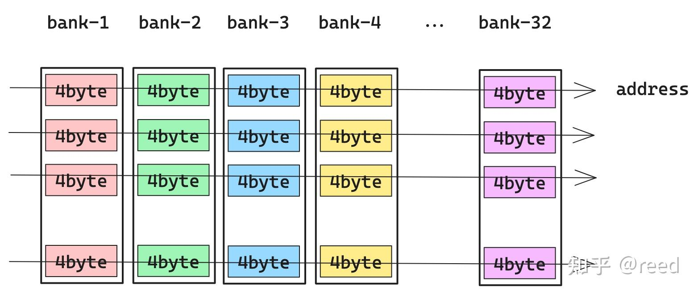

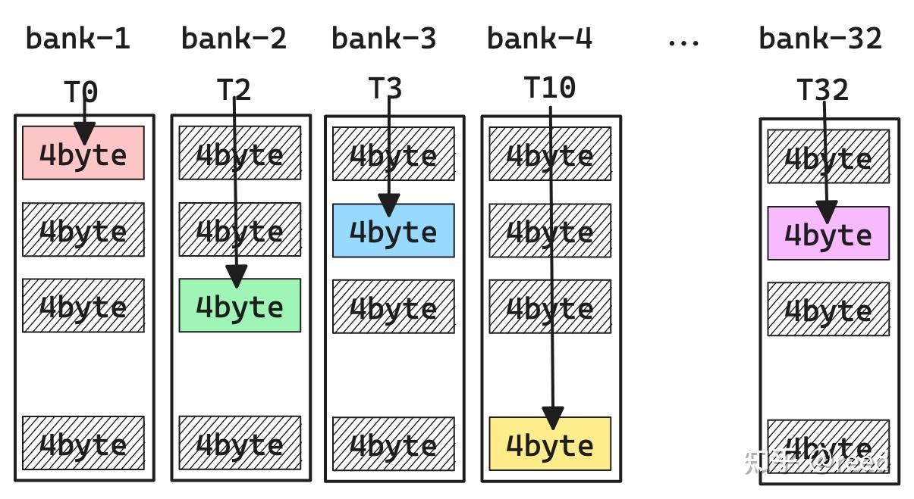

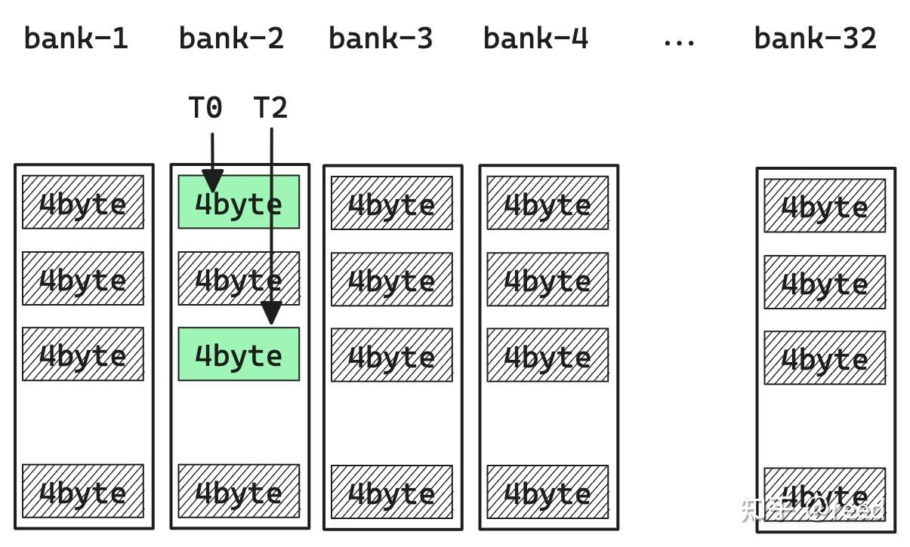

명령어 수를 줄이기 위해 kernel 최적화 시 벡터화된 읽기/쓰기 명령어（대형 워드 읽기/쓰기라고도 함）를 사용한다. 예를 들어 128bit 형태로 shared memory를 읽고 쓰면, 스레드가 접근해야 하는 단위 데이터 양은 16byte이고 32개 스레드가 접근해야 하는 데이터 양은 16byte x 32 = 512byte이다. 전체 512byte를 접근하려면 4개의 phase가 필요하다. 첫 번째 phase에서 T0-T7이 bank conflict 없이 모든 bank에 접근하고, 두 번째 phase에서 T8-T15가 bank conflict 없이 모든 bank에 접근하고, 세 번째 phase에서 T16-T23이 bank conflict 없이 모든 bank에 접근하고, 네 번째 phase에서 T24-T31이 bank conflict 없이 모든 bank에 접근한다. 이 상황은 다음과 같이 볼 수도 있다. shared memory 기본 단위를 16byte로 보면 총 bank 수는 8이고, 충돌 여부 분석은 32개 스레드가 아니라 4개 phase 안의 서로 다른 스레드에 대해 이루어진다. 64bit 접근 형태를 사용하면 해당 기본 단위는 8byte, 총 bank 수는 16이 되며, 충돌 여부 조건은 두 phase 내의 스레드가 충돌하는지 여부로 바뀐다. 전체적으로 shared memory 공간은 2차원 저장 공간으로 볼 수 있으며, 열 방향은 bank 상황을 나타내고 행 방향은 자유롭게 정의 가능한 크기를 나타낸다. 주목할 점은 충돌 여부는 메모리 접근 트랜잭션 수준에서 판단된다는 것이며, 구체적인 내용은 NVidia 개발자 포럼 토론（link.zhihu.com/?target=https%3A//forums.developer.nvidia.com/t/how-to-understand-the-bank-conflict-of-shared-mem/260900）을 참고할 수 있다.

## Shared Memory 읽기（ldmatrix 명령어）

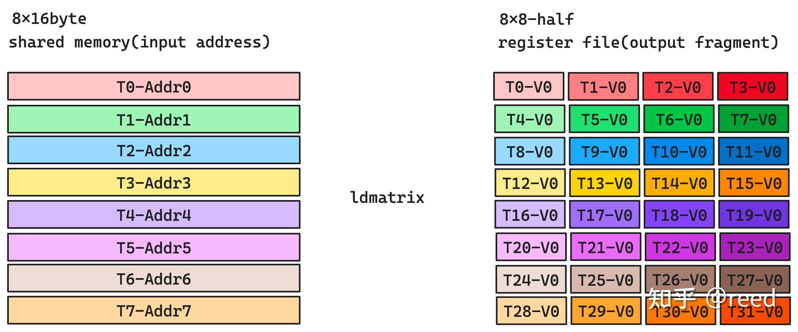

GEMM 파이프라인에서 Tensor Core를 사용하면 특정 규격의 행렬 계산（예: $D_{16\times8} = A_{16\times16} B_{16\times8} + C_{16\times8}$）을 완료할 수 있다. 여기서 행렬 데이터 A, B, C, D는 warp 내 모든 스레드가 각자 일부 register를 제공하여 공동으로 표현한다. 그림 4의 오른쪽 register file에서 보듯이, 32개의 스레드 T0-T31 각각이 register V0（4byte）하나를 제공하여 형태가 8x8인 half 타입의 행렬 블록을 공동으로 표현하며, 여러 개의 8x8 블록이 더 큰 16x16, 16x8 블록을 구성할 수 있다. 앞선 문서에서 소개했듯이, 이 데이터는 ldmatrix 명령어를 통해 warp 수준으로 구현할 수 있다. 출력인 8x8-half의 register 표현 행렬 블록에 대해 ldmatrix의 입력 요구 사항은 8개의 shared memory 주소이며, 각 주소는 shared memory 안의 16byte 데이터를 가리킨다. T0-Addr0이 가리키는 16byte 데이터는 ldmatrix를 통해 T0-T3의 V0 register에 배분된다. T1-Addr1이 가리키는 데이터는 T4-T7의 V0 register에 배분된다. ldmatrix 명령어를 통해 행렬 데이터를 shared memory에서 register로 로드할 수 있다. 앞에서 소개했듯이 shared memory는 bank 구조를 가지며, 16byte 형태로 읽기가 이루어지므로 T0-T7이 해당 데이터를 읽을 때 하나의 독립적인 phase로 처리된다. 따라서 16byte로 표현된 8개의 데이터가 모두 서로 다른 bank에 분포해야만 shared memory 데이터 읽기 시 bank conflict가 발생하지 않는다. 그림 5는 ldmatrix 시 bank conflict가 없는 레이아웃 형태를 보여준다.

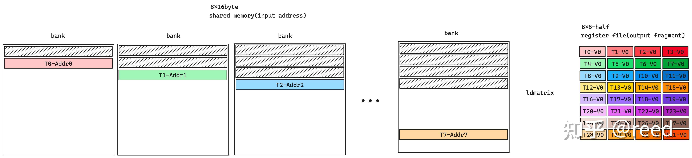

수학적 논리 관점에서 보면, 8x8-half의 register 데이터는 연속적인 행렬 블록을 표현하며, 8x16byte의 shared memory 역시 공간 지역성이 좋은 행렬 블록이다. 그러나 shared memory의 저장 논리 관점에서 보면, 읽기 시 bank conflict를 피하기 위해 서로 다른 bank에 배치되어야 한다. 따라서 shared memory 배치 시 가로 위치는 단순히 논리적으로 아래로 정렬되는 것이 아니라, bank conflict를 피하기 위해 가로 방향（bank 방향）으로 엇갈려야 한다.

## Shared Memory 쓰기

GEMM 파이프라인에서 데이터의 출발점은 전역 메모리이다. 그림 6에서 보듯이, 행렬 곱에 필요한 register 데이터는 shared memory에서 오고, shared memory 데이터는 전역 메모리에서 온다. 수학적 논리 관점에서 register가 표현하는 수학적 공간과 전역 메모리의 위치는 대응한다. 그러나 shared memory는 bank가 존재하므로 블록 데이터를 shared memory에 저장할 때 단순한 행렬 배열이 아니다. ldmatrix의 요구 사항에 따라 충돌을 피하도록 해야 하므로, 전역 메모리에서 데이터를 읽어 shared memory에 쓸 때도 논리 요구 사항에 따른 저장 공간 매핑을 수행해야 한다. 동시에 전역 메모리에서 shared memory로 로드할 때 전역 메모리 읽기 효율을 높이려면 합병 접근（coalesced access）과 L2 Cache line 상황을 고려해야 하며, 일반적으로 스레드가 선형 주소 공간 순서로 배열되어야 한다. 그림의 T0->Tn과 같다. 즉 전역 메모리에서 shared memory로 데이터를 이동할 때 사고 모델은 논리 공간이지만, 실행 시에는 bank conflict를 피하기 위해 저장 공간을 고려해야 한다.

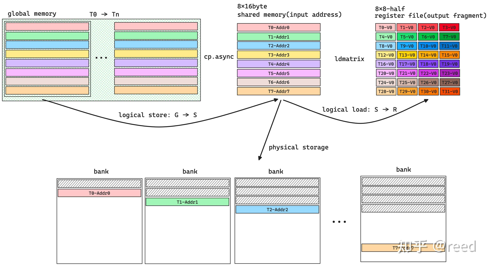

## XOR 연산의 폐쇄성과 전단사성

컴퓨터 XOR 명령어（기호는 보통 `^`로 쓰거나 $\oplus$로 표기）는 두 개의 입력을 받는다. 1bit 데이터의 경우 입력 bit가 같으면 0을 출력하고, 다르면 1을 출력한다. 다중 bit 데이터에 대해서는 각 위치에서 1bit XOR 연산을 수행한다. 예를 들어 $5 \oplus 3 = \texttt{0b0101} \oplus \texttt{0b0011} = \texttt{0b0110} = 6$이다. XOR 계산은 교환 법칙과 결합 법칙을 만족한다. 동시에 집합 $S = \{x \mid x \in [0, 2^n-1]\}$ 안의 임의의 두 원소에 대해 XOR로 얻은 출력도 $S$ 안에 속하므로 폐쇄성을 만족한다. 그림 7에서 보듯이, 이 결과는 전단사성（bijective）을 만족하며, 이러한 성질들은 집합 이론을 통해 엄밀하게 증명할 수 있다.

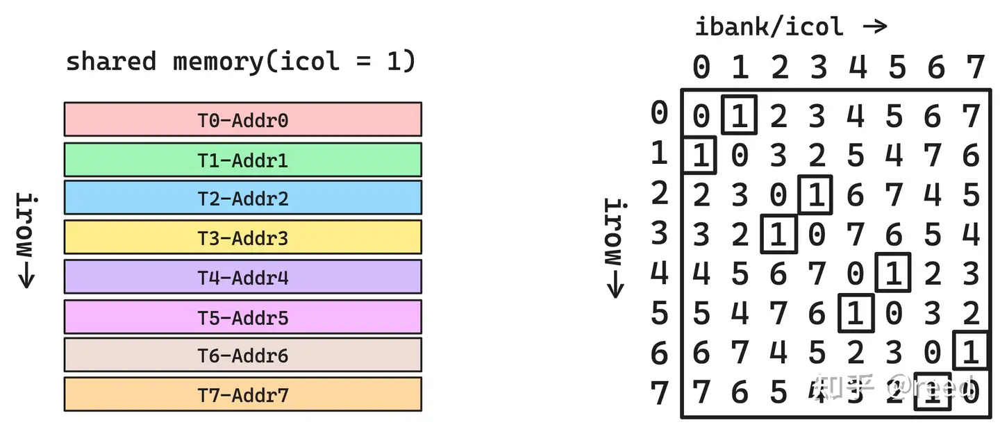

그림 7 왼쪽의 논리 행렬은 $i_{\text{col}}=1$의 shared memory 열로 볼 수 있으며, 이는 shared memory에서 하나의 bank에 해당한다. 즉 행렬의 논리 위치는 $(i_{\text{row}}\in[0,7],\ i_{\text{col}}=1)$이다. column에 XOR 매핑（swizzle）을 적용하여 새로운 bank 인덱스를 얻을 수 있다. 예를 들어 $i_{\text{bank}} = i_{\text{row}} \oplus i_{\text{col}}$로 정의하면 좌표를 $(i_{\text{row}}\in[0,7],\ i_{\text{bank}} = i_{\text{row}} \oplus i_{\text{col}})$로 쓸 수 있다. 그림 7의 오른쪽 검은 테두리로 표시된 부분에서 볼 수 있듯이, 이 데이터들이 서로 다른 bank에 배치되어 읽기/쓰기 시 bank conflict를 피할 수 있다.

## Swizzle 추상화

cute에서는 swizzle 추상화를 통해 shared memory bank conflict 해결을 구현한다. 앞의 설명에서 알 수 있듯이, 전체 계산 체계에서 필요한 것은 행렬 블록을 표현하는 2차원 논리 공간이지만, shared memory의 충돌을 피하기 위해 shared memory에 데이터를 저장할 때는 물리 공간이 필요하다. 앞서 소개했듯이 논리 공간을 표현하는 데는 Layout（본질적으로 함수）을 사용하고, bank conflict를 피하기 위해 cute에서는 swizzle 추상화를 정의한다. swizzle의 본질도 함수이며, swizzle은 layout에 작용한다. 즉 함수가 함수에 작용하는 것으로, 합성 함수의 정의와 같다. Layout의 역할은 좌표가 주어지면 offset을 반환하는 것이고, swizzle의 역할은 offset이 주어지면 bank conflict가 없는 offset을 반환하는 것이다. 즉 $\mathrm{offset}_{\text{bank\_conflict\_free}} = \mathrm{Swizzle}(\mathrm{Layout}(\mathrm{coord}))$이다. 이를 위해 Swizzle은 B, M, S의 세 파라미터를 정의한다. 이들은 함께 1차원 좌표를 2차원 공간으로 매핑하는 세 가지 수준을 표현한다. 1차원 좌표를 2차원 좌표로 변환할 때, 먼저 1차원에서 연속된 몇 개의 원소를 새 공간의 기본 원소로 삼고, 이어서 해당 2차원 공간의 행과 열의 수를 기술한다. 그 중 1차원 좌표에서 연속된 $2^M$개의 원소가 2차원 공간의 가장 기본적인 원소를 구성하고, $2^S$는 새 2차원 공간의 열의 수를, $2^B$는 새 2차원 공간의 행의 수를 나타낸다.

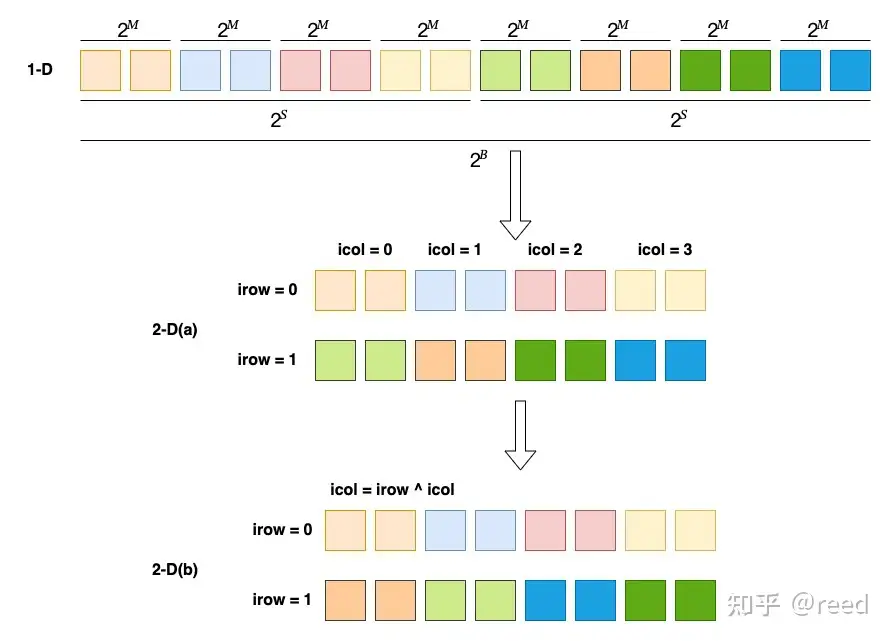

그림 8에서 보듯이, $B=1,\ M=1,\ S=2$일 때, $M$은 1차원 좌표의 연속 2개 원소가 2차원 공간의 기본 단위를 구성함을 나타내고, $S$는 2차원 공간의 열의 수를, $B$는 2차원 공간의 행의 수를 나타낸다. 이렇게 그림 2-D(a)를 얻는데, 이 2차원 공간은 2행 4열을 포함하고 기본 단위는 2개의 원소를 포함한다. 그런 다음 2차원 공간의 열 좌표와 해당 행 좌표에 XOR을 적용하여 새로운 열 번호를 얻는다（$i_{\text{col}}' = i_{\text{row}} \oplus i_{\text{col}}$）, 2-D(b)를 형성한다. 1차원 좌표를 매핑한 후 $2^B$ 크기를 초과하면 초과된 부분의 행 번호는 0부터 시작하지만, offset에는 이전의 모든 원소 수를 더해야 한다. 실제 운영 시, 예를 들어 half 타입이고 `shape: (8, 32), stride: (32, 1)`인 shared memory에서 `Swizzle<3, 3, 3>`을 해당 shared memory Layout에 적용하여 `A = Composition(Swizzle<3, 3, 3>{}, Layout<Shape<8, 32>, Stride<32, 1>>{});`를 형성하면, Layout에서 유효한 offset은 $0\sim 256$이다. Swizzle에서 $M=3$이므로 8개의 원소가 새로운 최소 원소를 구성한다. 즉 $8 \times 2\,\text{byte} = 16\,\text{byte}$. Swizzle에서 $S=3$이므로 2D 공간에서 한 행에 8개의 원소가 포함된다. 따라서 $8 \times 16\,\text{byte} = 128\,\text{byte}$이며, $128\,\text{byte}$는 shared memory에서 conflict 없이 모든 bank에 접근할 수 있는 최대 너비이다. Swizzle에서 $B=3$이면 2D 공간에서 $i_{\text{row}}$가 갱신되는 간격은 8이다. 이렇게 논리 공간을 2D의 shared memory 공간으로 매핑하는데, 열의 너비는 $128\,\text{byte}$로 모든 bank를 채우고, 행과 열에 XOR을 적용하여 새로운 열 번호를 얻음으로써 bank 방향（즉 icol 방향）의 충돌을 피한다.

## Thread Block Swizzle

shared memory 충돌 회피를 위한 swizzle 외에도, cute（cutlass）에는 또 다른 종류의 swizzle인 thread block swizzle이 있다. C 중심의 작업 분할 모드에서 Thread Block Swizzle 없이는 작업 블록이 선형 행 우선 또는 열 우선 순서로 모든 실행 유닛에 할당된다（그림 9의 SM0-3, 하드웨어에 4개의 SM만 있다고 가정）. Thread Block Swizzle을 적용하면 그림 9 오른쪽과 같은 작업 분할 관계를 형성할 수 있다. 특정 시나리오에서 L2 Cache 히트율을 향상시킬 수 있으며, 수학적으로는 동일한 원소가 더 큰 면적을 커버할 수 있고, 동시에 이 부분의 면적（A, B）이 L2에 잘 캐시될 수 있다. 구체적인 내용은 cutlass의 thread block swizzle 구현을 참고할 수 있다.

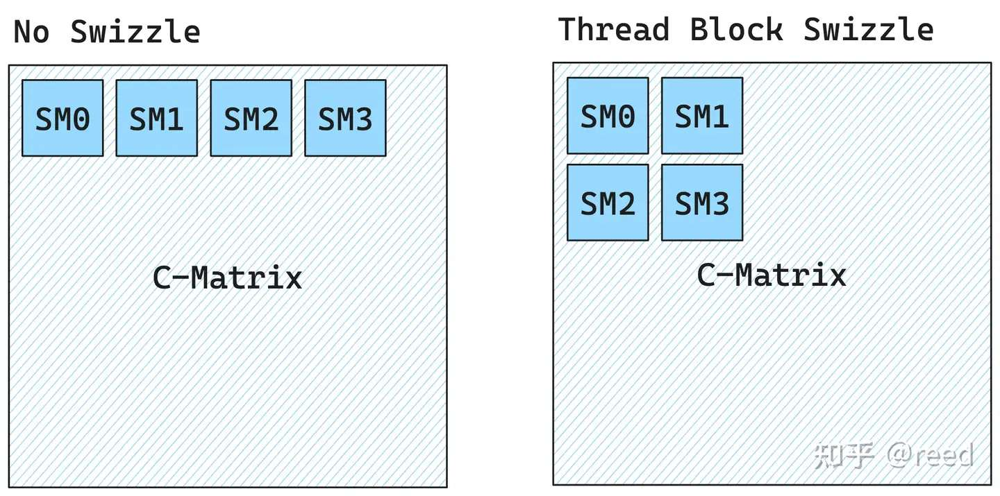

# cute를 이용한 고효율 GEMM 구현

앞선 문서에서 cute의 Layout 추상화, Tensor 추상화, MMA 추상화, Copy 추상화, Swizzle 추상화와 파이프라인 기술을 소개했다. 본 문서에서는 이러한 추상화와 기술을 조합하여 고효율 행렬 곱셈을 구현한다. 고효율 행렬 곱셈을 더 잘 구현하기 위해, 본 문서에서는 여러 차원에서 고효율 구현 방법을 소개한다. 문서 구조상 먼저 계산 고효율을 소개하고, 이어서 메모리 접근 고효율, 그 다음 알고리즘 고효율, 마지막으로 후처리 단계 고효율을 소개한다. 이러한 고효율 방안을 바탕으로 cute를 활용하여 고효율 행렬 곱셈을 구현하고, cuBLAS 및 cuBLASLt와 성능을 비교했다. 비교 결과는 우리의 구현이 SOTA 수준에 도달했음을 보여준다. 문서 마지막에서는 kernel 검색의 휴리스틱 알고리즘과 파라미터 호환성 문제를 논의하고 문서를 정리한다.

## 계산 고효율

GEMM의 핵심 계산 부분은 블록 행렬 곱셈이다. 입력이 반정밀도 타입（half precision）이고 Accumulator가 반정밀도 타입인 계산 작업에 대해, Ampere 아키텍처는 Tensor Core에서 다음 계산 명령어를 제공한다.

- `mma.sync.aligned.m16n8k8.row.col.f16.f16.f16.f16`
- `mma.sync.aligned.m16n8k16.row.col.f16.f16.f16.f16`

cute는 이 두 명령어를 MMA_Operation으로 추상화한다.

- `SM80_16x8x8_F16F16F16F16_TN`
- `SM80_16x8x16_F16F16F16F16_TN`

문제 규격이 클 때는 계산량이 더 큰 명령어를 가능한 한 선택한다. 그러면 동일한 명령어가 더 많은 계산 작업을 생성하여 명령어 수를 줄이고 스케줄링 효율을 향상시킨다.

계산 명령어를 선택한 후, MMA_Traits를 통해 그림 1에서처럼 MMA_Operation 위에 후속 계산에 필요한 기타 정보, 예를 들어 행렬 계산 형태, 해당 명령어에 필요한 협력 스레드（여기서는 32개 스레드）, A와 B 행렬의 register Layout 분포 상황 등을 보완할 수 있다. MMA_Traits가 완성되면 이를 MMA_Atom으로 추가 캡슐화할 수 있으며, MMA_Atom은 Traits가 제공하는 정보를 활용하여 데이터 분할에 필요한 정보와 Operation의 실행 기능을 제공한다. MMA_Atom은 행렬 계산의 원자적 능력（단일 명령어의 계산 능력, 최소 능력）을 기술하며, 더 많은 스레드를 추가하고 각 스레드가 여러 번 작업을 수행하게 함으로써 계산 규격을 키울 수 있다. 이렇게 하면 TiledMMA가 생성되고, TiledMMA는 각 스레드에 대해 ThrMMA로 분할된다. TiledMMA와 ThrMMA는 MMA_Atom이 제공하는 정보를 활용하여 행렬 블록의 분할을 구현할 수 있다. 해당 cute::gemm 함수를 호출하면 행렬 곱셈 계산을 완료할 수 있다.

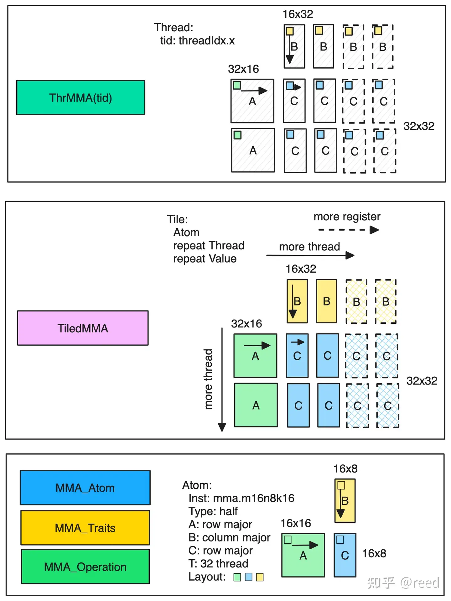


이때 다음과 같은 호스트 측 코드를 얻을 수 있다.

```cpp
using mma_op = SM80_16x8x16_F16F16F16F16_TN;
  using mma_traits = MMA_Traits<mma_op>;
  using mma_atom = MMA_Atom<mma_traits>;

  static constexpr int kMmaEURepeatM = 2;
  static constexpr int kMmaEURepeatN = 2;
  static constexpr int kMmaEURepeatK = 1;

  static constexpr int kMmaVRepeatM = 1;
  static constexpr int kMmaVRepeatN = 2;
  static constexpr int kMmaVRepeatK = 1;

  using MMA_EU_RepeatT = decltype(make_layout(make_shape(
      Int<kMmaEURepeatM>{}, Int<kMmaEURepeatN>{}, Int<kMmaEURepeatK>{})));
  using MMA_V_RepeatT = decltype(make_layout(make_shape(
      Int<kMmaVRepeatM>{}, Int<kMmaVRepeatN>{}, Int<kMmaVRepeatK>{})));

  using MMA =
      decltype(make_tiled_mma(mma_atom{}, MMA_EU_RepeatT{}, MMA_V_RepeatT{}));
```

앞의 세 줄에서 MMA 명령어를 선택하여 Atom 능력을 형성하고, 해당 Atom 능력의 반복 방법（스레드 반복 및 register 반복 포함）을 정의한다. 이들은 각각의 반복에 해당하는 Layout을 형성한 후 `make_tile_mma` 인터페이스를 활용하여 더 큰 블록의 행렬 곱셈 기술을 형성한다. 디바이스 측 코드는 다음과 같다.

```c++
TiledMMA tiled_mma;
  auto thr_mma = tiled_mma.get_slice(idx);
  auto tCrA = thr_mma.partition_fragment_A(gA(_, _, 0));  // (MMA, MMA_M, MMA_K)
  auto tCrB = thr_mma.partition_fragment_B(gB(_, _, 0));  // (MMA, MMA_N, MMA_K)
  auto tCrD = thr_mma.partition_fragment_C(gD);           // (MMA, MMA_M, MMA_N)
```

TileMMA에 스레드 번호를 제공하면 해당 스레드의 데이터 분할 능력을 얻고, 주어진 데이터 블록을 분할하여 스레드 수준의 데이터 기술을 얻는다.

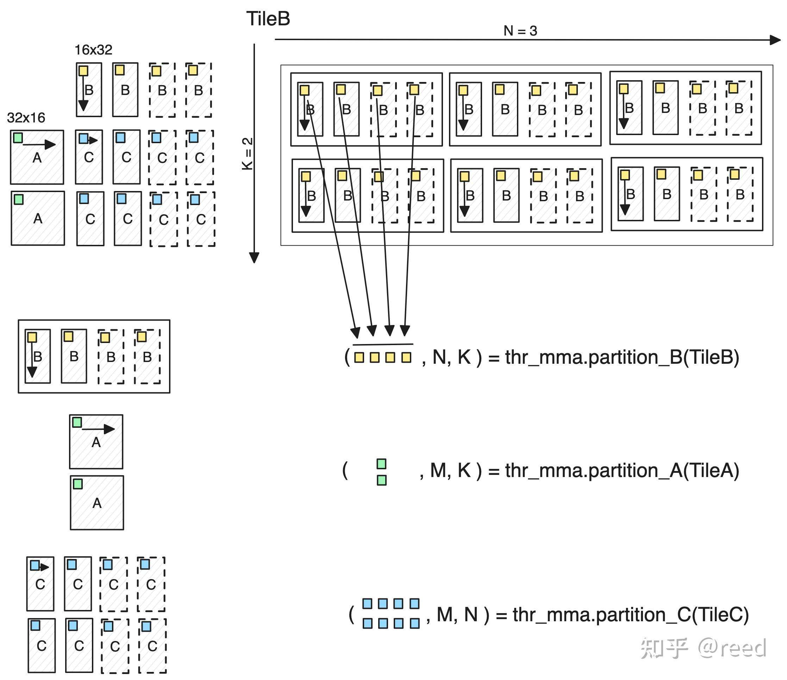

그림 2에서 보듯이, ThrMMA가 제공하는 partition_A/B/C 및 partition_fragment_A/B/C 함수의 계산 로직을 보여준다. 정적 크기의 Tensor TileB（분할 차원이 Int<> 컴파일 타임 상수）가 주어지면, thr_mma는 이를 분할할 수 있다. 분할 로직은 다음과 같다. TileMMA에서 기술된 행렬 크기로 대상 Tensor를 주기적으로 타일링하고, 강조 표시된 부분을 선택하여 새로운 행렬을 형성한다. 첫 번째 차원은 TiledMMA의 단일 스레드 데이터 기술이고, 두 번째 차원과 세 번째 차원은 행 방향과 열 방향으로 반복해야 하는 횟수이다. TileB의 차원이 2차원보다 높으면, 초과된 부분은 N, K 차원 이후로 상속된다. 마찬가지로 A/C의 분할도 동일한 로직을 따른다.

## 메모리 접근 고효율

전체 GEMM 계산 체계에서 데이터가 Tensor Core에 도달하여 계산되기 전에 전역 메모리에서 shared memory로, shared memory에서 register로의 과정이 필요하다. 파이프라인 챕터에서 전역 메모리에서 shared memory로의 비동기 복사 방법과 shared memory에서 register로의 ldmatrix 명령어를 소개했다. cute에서 전역 메모리에서 shared memory로의 복사에 대해 MMA 능력 선택과 유사하게 cute에서 이미 정의된 추상화 능력을 선택하면 된다. 여기서는 `SM80_CP_ASYNC_CACHEGLOBAL` Copy_Operation을 선택한다. 이 명령어는 전역 메모리에서 shared memory로의 비동기 복사를 구현할 수 있으며, CACHEGLOBAL은 데이터를 L2에서만 Cache하고 L1은 bypass한다는 것을 나타낸다. 이에 따라 다음과 같은 호스트 측 코드를 형성할 수 있다.

```c++
using g2s_copy_op = SM80_CP_ASYNC_CACHEGLOBAL<cute::uint128_t>;
  using g2s_copy_traits = Copy_Traits<g2s_copy_op>;
  using g2s_copy_atom = Copy_Atom<g2s_copy_traits, T>;

  using G2SCopyA =
      decltype(make_tiled_copy(g2s_copy_atom{},
                               make_layout(make_shape(Int<32>{}, Int<4>{}),
                                           make_stride(Int<4>{}, Int<1>{})),
                               make_layout(make_shape(Int<1>{}, Int<8>{}))));
  using G2SCopyB = G2SCopyA;
```

MMA 시의 make_tiled_mma와 유사하게, Copy 추상화는 make_tile_copy 능력을 제공한다. 이는 스레드와 데이터의 반복 방법을 지정하여 Atom 능력을 블록 능력으로 확장한다. 데이터 복사 시 A와 B 행렬의 서로 다른 복사 방법을 구분할 수 있으며, 여기서는 동일한 Copy 능력을 사용한다. 디바이스 측 코드는 다음과 같다.

```c++
G2SCopyA g2s_tiled_copy_a;
  auto g2s_thr_copy_a = g2s_tiled_copy_a.get_slice(idx);
  auto tAgA_copy = g2s_thr_copy_a.partition_S(gA);  // (CPY, CPY_M, CPY_K, k)
  auto tAsA_copy =
      g2s_thr_copy_a.partition_D(sA);  // (CPY, CPY_M, CPY_K, kStage)
```

그림 1의 MMA 계층과 유사하게, Copy 시 TileCopy에 스레드 번호를 지정하여 스레드 수준의 Copy 능력 추상화 ThrCopy를 얻는다. 그림 2의 MMA 분할과 유사하게, ThrCopy 추상화는 partition_S/D 함수를 제공하여 대형 행렬 블록을 스레드 차원으로 분할하는 것을 구현한다. partition_S/D로 분할된 데이터 차원은 (E, M, K)이며, E는 해당 스레드가 처리할 데이터 크기（분포 포함）를 나타내고, M과 K는 주어진 분할 블록이 세로 축과 가로 축에서 반복해야 하는 횟수를 나타낸다. 분할된 Tile의 차원이 2차원보다 크면, 초과된 차원은 （, M, K）차원 이후에 추가된다.

shared memory에서 register로의 복사에 대해, cute는 ldmatrix 명령어의 래핑을 제공한다. 호스트 측 코드와 디바이스 측 코드는 각각 다음과 같다.

```c++
// shared memory to register copy
  using s2r_copy_op = SM75_U32x4_LDSM_N;
  using s2r_copy_traits = Copy_Traits<s2r_copy_op>;
  using s2r_copy_atom = Copy_Atom<s2r_copy_traits, T>;

  using S2RCopyAtomA = s2r_copy_atom;
  using S2RCopyAtomB = s2r_copy_atom;
```

디바이스 측 코드:

```c++
auto s2r_tiled_copy_a = make_tiled_copy_A(S2RCopyAtomA{}, tiled_mma);
  auto s2r_thr_copy_a = s2r_tiled_copy_a.get_slice(idx);
  auto tAsA = s2r_thr_copy_a.partition_S(sA);  // (CPY, CPY_M, CPY_K, kStage)
  auto tCrA_view = s2r_thr_copy_a.retile_D(tCrA);  // (CPY, CPY_M, CPY_K)
```

호스트 측에서 ldmatrix 명령어의 x4 모드를 선택하여 Atom 추상화를 형성하고, 디바이스 측에서는 `make_tiled_copy_A` 함수를 통해 tiled_mma 추상화를 활용하여 shared memory에서 register로의 TileCopy를 만든다. 앞서의 전역 메모리에서 shared memory로의 TileCopy와 다른 점은, 여기서는 tiled_mma의 정보를 직접 활용하여 블록 복사를 형성한다는 것이다. 이는 TiledMMA가 계산에 필요한 데이터 기술을 포함하고 있기 때문에, 이를 목적지로 하는 Copy에 대해 tiled_mma는 이 데이터를 정확하게 기술하므로 사용자가 Copy_Atom에서 TileCopy로의 정보를 별도로 지정할 필요가 없고, MMA 능력에서 직접 얻을 수 있다. 이는 어느 정도 독립적인 설정의 불일치 문제를 피할 수 있다. MMA 시에 register 저장 공간이 이미 선언되었으므로, 여기서는 스레드 수준의 소 블록에 대해 retile만 수행하면 되며, 더 이상 대형 블록에서 소 블록으로의 partition이 아니다.

## 알고리즘 고효율

앞의 두 챕터에서 계산 고효율과 메모리 접근 고효율을 소개했다. 이 두 단계를 어떻게 결합하는지도 GEMM 성능의 핵심 요소이며, 이 부분을 알고리즘 고효율이라고 한다. 주로 두 부분을 포함한다: 1. 분할; 2. 파이프라인. 이 두 부분의 내용은 간단한 GEMM 구현과 파이프라인에서 이미 소개했으므로 여기서 다시 반복하지 않는다. 분할 부분에 대해 호스트 측과 디바이스 측 코드는 다음과 같다.


```c++
static constexpr int kTileM = kTileM_;
  static constexpr int kTileN = kTileN_;
  static constexpr int kTileK = kTileK_;
  static constexpr int kStage = kStage_;
```

디바이스 측:

```c++
작성자: reed
링크: https://zhuanlan.zhihu.com/p/675308830
출처: 知乎
저작권은 저자에게 있습니다. 상업적 전재는 저자의 승인을 받아야 하며, 비상업적 전재는 출처를 명시해야 합니다.

// slice the tensor to small one which is used for current thread block.
  Tensor gA = local_tile(A, make_tile(Int<kTileM>{}, Int<kTileK>{}),
                         make_coord(iy, _));  // (kTileM, kTileK, k)
  Tensor gB = local_tile(B, make_tile(Int<kTileN>{}, Int<kTileK>{}),
                         make_coord(ix, _));  // (kTileN, kTileK, k)
  Tensor gD = local_tile(D, make_tile(Int<kTileM>{}, Int<kTileN>{}),
                         make_coord(iy, ix));  // (kTileM, kTileN)

  // shared memory
  auto sA = make_tensor(make_smem_ptr(Ashm),
                        SmemLayoutA{});  // (kTileM, kTileK, kStage)
  auto sB = make_tensor(make_smem_ptr(Bshm),
                        SmemLayoutB{});  // (kTileN, kTileK, kStage)
```

각각 분할 크기와 디바이스 측에서 Tensor 추상화와 local_tile을 통해 행렬을 분할하는 방법을 정의한다.

파이프라인 측면에서 multi stage 파이프라인을 구현하려면 shared memory 할당 시 파이프라인 단계 수를 지정해야 하며, 디바이스 측에서 필요한 데이터 로드와 계산 중첩 방안을 수행해야 한다. 호스트 측 코드는 다음과 같다.

```c++
작성자: reed
링크: https://zhuanlan.zhihu.com/p/675308830
출처: 知乎
저작권은 저자에게 있습니다. 상업적 전재는 저자의 승인을 받아야 하며, 비상업적 전재는 출처를 명시해야 합니다.

static constexpr int kShmLoadSwizzleM = 3;
  static constexpr int kShmLoadSwizzleS = 3;
  static constexpr int kShmLoadSwizzleB = 3;

  using SmemLayoutAtom = decltype(composition(
      Swizzle<kShmLoadSwizzleB, kShmLoadSwizzleM, kShmLoadSwizzleS>{},
      make_layout(make_shape(Int<8>{}, Int<kTileK>{}),
                  make_stride(Int<kTileK>{}, Int<1>{}))));
  using SmemLayoutA = decltype(
      tile_to_shape(SmemLayoutAtom{},
                    make_shape(Int<kTileM>{}, Int<kTileK>{}, Int<kStage>{})));
  using SmemLayoutB = decltype(
      tile_to_shape(SmemLayoutAtom{},
                    make_shape(Int<kTileN>{}, Int<kTileK>{}, Int<kStage>{})));
```

shared memory의 Layout을 정의하며, Swizzle은 bank conflict를 피하기 위해 사용된다. 자세한 내용은 앞선 문서인 cute의 Swizzle 추상화를 참고할 수 있다. kStage는 파이프라인 단계 수를 나타낸다.

핵심 디바이스 측 코드는 두 개의 for 루프로 구성되며, 구체적인 내용은 다음과 같다.

```c++
작성자: reed
링크: https://zhuanlan.zhihu.com/p/675308830
출처: 知乎
저작권은 저자에게 있습니다. 상업적 전재는 저자의 승인을 받아야 하며, 비상업적 전재는 출처를 명시해야 합니다.

// loop over k: i. load tile, ii. mma
  int ntile = k / kTileK;
#pragma unroll 1
  for (int itile = 0; itile < ntile; ++itile) {
    int nk = size<2>(tCrA);

#pragma unroll
    for (int ik = 0; ik < nk; ++ik) {
      int ik_next = (ik + 1) % nk;

      if (ik == nk - 1) {
        cp_async_wait<kStage - 2>();
        __syncthreads();

        ismem_read = (ismem_read + 1) % kStage;
      }

      // shm -> reg s[itile][ik + 1] -> r[ik + 1]
      cute::copy(s2r_tiled_copy_a, tAsA(_, _, ik_next, ismem_read),
                 tCrA_view(_, _, ik_next));
      cute::copy(s2r_tiled_copy_b, tBsB(_, _, ik_next, ismem_read),
                 tCrB_view(_, _, ik_next));

      if (ik == 0) {
        if (itile_to_read < ntile) {
          cute::copy(g2s_tiled_copy_a, tAgA_copy(_, _, _, itile_to_read), tAsA_copy(_, _, _, ismem_write));
          cute::copy(g2s_tiled_copy_b, tBgB_copy(_, _, _, itile_to_read), tBsB_copy(_, _, _, ismem_write));

          ++itile_to_read;
          ismem_write = (ismem_write + 1) % kStage;
        }

        cp_async_fence();
      }

      cute::gemm(tiled_mma, tCrD, tCrA(_, _, ik), tCrB(_, _, ik), tCrD);
    }  // for ik
  }    // itile
```

외층 루프는 Tile에 대해 순환하고, 내층 루프는 Tile 내에서 k 루프를 수행한다. 동시에 ik == 0과 ik == nk - 1 시점에 후속 kStage-1개 Tile의 전역 메모리에서 shared memory로의 데이터 로드 발행과 곧 읽을 shared memory에 대한 데이터 동기화를 수행한다.


## 후처리 단계 고효율（Epilogue）

위의 계산, 로드, 알고리즘을 통해 행렬 곱 후의 블록 데이터를 얻을 수 있으며, 이 데이터는 스레드 내 register로 표현된다. 데이터 저장 관점에서 이 데이터를 저장하는 것은 간단하지 않다. 그림 3에서 보듯이, register 데이터를 직접 쓰면 전역 주소 공간에서 메모리 주소의 불연속이 발생하고, 이는 저장 시 더 많은 메모리 트랜잭션이 필요하고 벡터화 저장 명령어（STG.128）를 사용할 수 없게 된다.

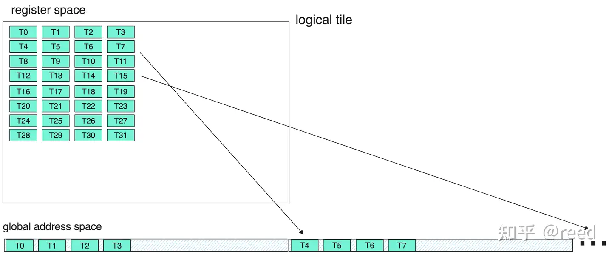

이 문제에 대응하여 cute에서（실질적으로 cutlass에서）전용 Epilogue를 제공하여 shared memory를 중간 매체로 활용한다. 먼저 register 데이터를 shared memory에 저장하고, 이어서 shared memory에서 더 연속적이고 더 넓은 비트폭 형태로 전역 메모리에 저장한다. PACT'20 Fireiron 논문에서 이 문제에 대한 자세한 논의가 있으며, 참고할 수 있다.

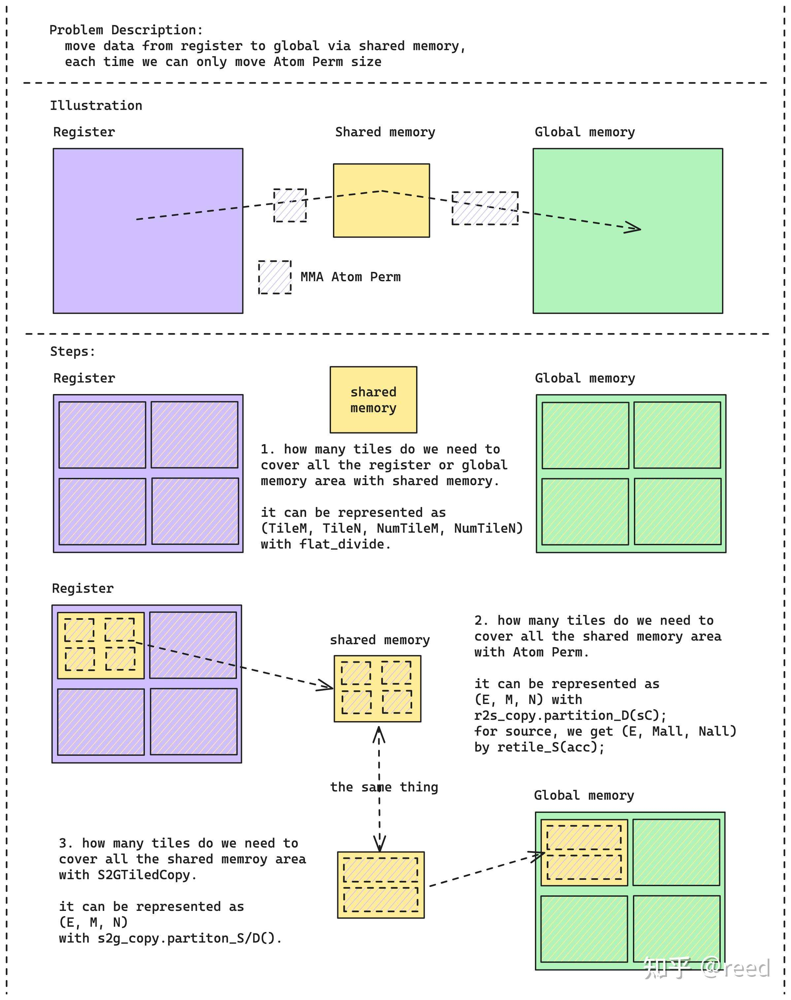

본 문서에서는 shared memory를 통해 고효율 TileC 저장을 구현하며, 구체적인 코드는 github 구현을 참고할 수 있다. 전체 과정은 그림 4와 같다.

```c++
#include <cublas_v2.h>
#include <cuda.h>
#include <stdarg.h>
#include <stdio.h>

#include <cute/tensor.hpp>

#include "detail/cublaslt-gemm.h"
#include "detail/data.h"

// 이 예제는 "multi-stage 파이프라인" GEMM을 보여준다:
// - 계산: Tensor Core(tiled_mma)를 사용하여 블록 MMA를 수행
// - 메모리 접근: cp.async로 gmem -> smem; ldmatrix로 smem -> reg
// - 파이프라인: k 방향으로 kStage개의 smem 버퍼를 링 버퍼(ring buffer)로 사용하여
//   전역 메모리 접근 레이턴시를 숨김
// - 후처리 단계(Epilogue): 각 스레드의 accumulator(reg)를 먼저 smem에 쓰고,
//   이후 더 연속적/더 넓은 쓰기 방식으로 gmem에 쓰기

template <typename Config>
__global__ void /* __launch_bounds__(128, 1) */
gemm_multi_stage(void *Dptr, const void *Aptr, const void *Bptr, int m, int n,
                 int k) {
  using namespace cute;
  using X = Underscore;

  // --------------------------
  // 1) Config에서 이 kernel의 "전략 파라미터(policy)"를 꺼냄
  // --------------------------
  // 이 using / constexpr들은 컴파일 타임에: tile 크기, 복사 명령어, layout, tiled_mma 형태
  // 등의 전략을 고정한다.
  using T = typename Config::T;
  using SmemLayoutA = typename Config::SmemLayoutA;
  using SmemLayoutB = typename Config::SmemLayoutB;
  using SmemLayoutC = typename Config::SmemLayoutC;
  using TiledMMA = typename Config::MMA;

  using S2RCopyAtomA = typename Config::S2RCopyAtomA;
  using S2RCopyAtomB = typename Config::S2RCopyAtomB;
  using G2SCopyA = typename Config::G2SCopyA;
  using G2SCopyB = typename Config::G2SCopyB;
  using R2SCopyAtomC = typename Config::R2SCopyAtomC;
  using S2GCopyAtomC = typename Config::S2GCopyAtomC;
  using S2GCopyC = typename Config::S2GCopyC;

  // tile / pipeline 형태
  constexpr int kTileM = Config::kTileM;
  constexpr int kTileN = Config::kTileN;
  constexpr int kTileK = Config::kTileK;
  constexpr int kStage = Config::kStage;

  // --------------------------
  // 2) 동적 shared memory 분할
  // --------------------------
  // shm_data는 A/B의 파이프라인 버퍼를 담으며, Epilogue 단계에서 C/D의 스크래치패드로 재사용된다.
  extern __shared__ T shm_data[];

  T *Ashm = shm_data;
  T *Bshm = shm_data + cute::cosize(SmemLayoutA{});

  // 현재 스레드(ThreadBlock 안), 그리고 현재 ThreadBlock에 해당하는 tile 좌표
  int idx = threadIdx.x;
  int ix = blockIdx.x;
  int iy = blockIdx.y;

  // --------------------------
  // 3) (ptr, shape, stride)를 cute::Tensor로 래핑
  // --------------------------
  // 참고: 여기서 A의 shape은 (m, k), B의 shape은 (n, k), D의 shape은 (m, n)
  // 이는 뒤에서 cublasHgemm의 CUBLAS_OP_T / CUBLAS_OP_N 배열과 일치한다.
  // use Tensor notation to represent device pointer + dimension
  Tensor A = make_tensor(make_gmem_ptr((T *)Aptr), make_shape(m, k),
                         make_stride(k, Int<1>{}));  // (M, K)
  Tensor B = make_tensor(make_gmem_ptr((T *)Bptr), make_shape(n, k),
                         make_stride(k, Int<1>{}));  // (N, K)
  Tensor D = make_tensor(make_gmem_ptr((T *)Dptr), make_shape(m, n),
                         make_stride(n, Int<1>{}));  // (M, N)

  // --------------------------
  // 4) ThreadBlock 수준 분할: 현재 block이 계산할 gA/gB/gD를 꺼냄
  // --------------------------
  // local_tile의 직관: 전역 대형 행렬을 (kTileM,kTileK)/(kTileN,kTileK)/(kTileM,kTileN)으로
  // 슬라이싱; iy/ix는 현재 block의 tile 좌표를 선택.
  // slice the tensor to small one which is used for current thread block.
  Tensor gA = local_tile(A, make_tile(Int<kTileM>{}, Int<kTileK>{}),
                         make_coord(iy, _));  // (kTileM, kTileK, k)
  Tensor gB = local_tile(B, make_tile(Int<kTileN>{}, Int<kTileK>{}),
                         make_coord(ix, _));  // (kTileN, kTileK, k)
  Tensor gD = local_tile(D, make_tile(Int<kTileM>{}, Int<kTileN>{}),
                         make_coord(iy, ix));  // (kTileM, kTileN)

  // --------------------------
  // 5) ThreadBlock 수준 shared memory tile(swizzle이 적용된 layout, bank conflict 감소 목적)
  // --------------------------
  // sA/sB의 layout에는 kStage 차원이 포함됨: 동일 ThreadBlock의 A/B tile이 smem에서
  // kStage개의 버퍼를 갖고, 파이프라인 링 큐로 사용됨을 나타낸다.
  // shared memory
  auto sA = make_tensor(make_smem_ptr(Ashm),
                        SmemLayoutA{});  // (kTileM, kTileK, kStage)
  auto sB = make_tensor(make_smem_ptr(Bshm),
                        SmemLayoutB{});  // (kTileN, kTileK, kStage)

  // --------------------------
  // 6) MMA: ThreadBlock의 tile을 TiledMMA 규칙에 따라 각 스레드의 register fragment로 분할
  // --------------------------
  // tiled_mma: "ThreadBlock 내 모든 스레드가 협력"하여 커버할 수 있는 MMA tile을 기술.
  // thr_mma:  현재 스레드 idx에 해당하는 슬라이스를 꺼냄(현재 스레드가 MMA에서 담당하는 fragment 부분).
  // dispatch TileA/TileB/TileC mma tensor into thread fragment via partition
  // method
  TiledMMA tiled_mma;
  auto thr_mma = tiled_mma.get_slice(idx);
  auto tCrA = thr_mma.partition_fragment_A(gA(_, _, 0));  // (MMA, MMA_M, MMA_K)
  auto tCrB = thr_mma.partition_fragment_B(gB(_, _, 0));  // (MMA, MMA_N, MMA_K)
  auto tCrD = thr_mma.partition_fragment_C(gD);           // (MMA, MMA_M, MMA_N)

  // fill zero for accumulator
  clear(tCrD);

  // --------------------------
  // 7) "복사" 추상화 구성:
  //    - g2s: gmem -> smem(일반적으로 cp.async 사용)
  //    - s2r: smem -> reg(일반적으로 ldmatrix / ldsm 사용)
  // --------------------------
  // s2r의 make_tiled_copy_A/B는 tiled_mma의 데이터 요구에 따라 적절한 smem->reg tile copy를 생성.
  // g2s의 G2SCopyA/B는 Config에서 직접 지정됨(각 스레드가 어떤 원소를 이동할지 기술).
  //
  // 기호 설명(이후 partition_S/partition_D의 흔한 차원):
  // - CPY:    스레드당 한 번의 copy "벡터화 원소 수/분포" 차원
  // - CPY_M/N/K: tile의 M/N/K 방향 반복 횟수
  // - kStage: shared memory 링 버퍼의 stage 차원
  // gmem -cp.async-> shm -ldmatrix-> reg
  auto s2r_tiled_copy_a = make_tiled_copy_A(S2RCopyAtomA{}, tiled_mma);
  auto s2r_thr_copy_a = s2r_tiled_copy_a.get_slice(idx);
  auto tAsA = s2r_thr_copy_a.partition_S(sA);  // ? (CPY, CPY_M, CPY_K, kStage)
  auto tCrA_view = s2r_thr_copy_a.retile_D(tCrA);  // ? (CPY, CPY_M, CPY_K)

  auto s2r_tiled_copy_b = make_tiled_copy_B(S2RCopyAtomB{}, tiled_mma);
  auto s2r_thr_copy_b = s2r_tiled_copy_b.get_slice(idx);
  auto tBsB = s2r_thr_copy_b.partition_S(sB);  // ? (CPY, CPY_M, CPY_K, kStage)
  auto tCrB_view = s2r_thr_copy_b.retile_D(tCrB);  // ? (CPY, CPY_M, CPY_K)

  G2SCopyA g2s_tiled_copy_a;
  auto g2s_thr_copy_a = g2s_tiled_copy_a.get_slice(idx);
  auto tAgA_copy = g2s_thr_copy_a.partition_S(gA);  // (CPY, CPY_M, CPY_K, k)
  auto tAsA_copy =
      g2s_thr_copy_a.partition_D(sA);  // (CPY, CPY_M, CPY_K, kStage)

  G2SCopyB g2s_tiled_copy_b;
  auto g2s_thr_copy_b = g2s_tiled_copy_b.get_slice(idx);
  auto tBgB_copy = g2s_thr_copy_b.partition_S(gB);  // (CPY, CPY_N, CPY_K, k)
  auto tBsB_copy =
      g2s_thr_copy_b.partition_D(sB);  // (CPY, CPY_N, CPY_K, kStage)

  // --------------------------
  // 8) multi-stage 파이프라인 상태
  // --------------------------
  // itile_to_read: 다음에 gmem에서 smem으로 이동할 k-tile 인덱스
  // ismem_write:   다음에 쓸 smem stage(링 큐 쓰기 포인터)
  // ismem_read:    현재 compute가 읽을 smem stage(링 큐 읽기 포인터)
  int itile_to_read = 0;
  int ismem_read = 0;
  int ismem_write = 0;

  // --------------------------
  // 9) 프리페치(prologue): kStage-1개 tile의 gmem->smem 비동기 복사를 먼저 제출
  // --------------------------
  // 전형적인 multi-stage 파이프라인: 주 루프 진입 전에 "곧 사용할" 앞 몇 블록 tile을 링 큐에 채운다.
  // cp_async_fence(): cp.async 한 그룹을 제출(commit)하여 "wait으로 추적 가능한" 큐에 넣는다.
  // cp_async_wait<N>(): 큐에 N그룹만 미완료로 남을 때까지 대기; 여기서 <kStage-2>는 최소 1그룹이 완료됨을 의미.
  // gmem -> shm
#pragma unroll
  for (int istage = 0; istage < kStage - 1; ++istage) {
    cute::copy(g2s_tiled_copy_a, tAgA_copy(_, _, _, istage),
               tAsA_copy(_, _, _, istage));
    cute::copy(g2s_tiled_copy_b, tBgB_copy(_, _, _, istage),
               tBsB_copy(_, _, _, istage));
    cp_async_fence();

    ++itile_to_read;
    ++ismem_write;
  }

  // wait one submitted gmem->smem done
  cp_async_wait<kStage - 2>();
  __syncthreads();

  // --------------------------
  // 10) 첫 번째 smem -> reg: stage=ismem_read의 0번째 k-slice(ik=0)를 register에 로드
  // --------------------------
  int ik = 0;
  // smem -> reg
  cute::copy(s2r_tiled_copy_a, tAsA(_, _, ik, ismem_read), tCrA_view(_, _, ik));
  cute::copy(s2r_tiled_copy_b, tBsB(_, _, ik, ismem_read), tCrB_view(_, _, ik));

  // --------------------------
  // 11) 주 루프: K 방향으로 전진
  // --------------------------
  // 외층 itile: K 방향으로 tile 단위로 전진(각 tile은 kTileK를 커버)
  // 내층 ik: 하나의 tile 내에서 더 세밀한 k-slice로 전진(tiled_mma / s2r_copy의 K 차원에 의해 결정)
  //
  // 핵심 아이디어: 현재 ik의 MMA를 수행하면서 가능한 한 미리 다음에 필요한 데이터를 register/shared memory로 이동.
  // 형성되는 구조:
  // - gmem->smem(cp.async), smem->reg(ldmatrix), mma(tensor core) 세 가지가 중첩
  // loop over k: i. load tile, ii. mma
  int ntile = k / kTileK;
#pragma unroll 1
  for (int itile = 0; itile < ntile; ++itile) {
    int nk = size<2>(tCrA);

#pragma unroll
    for (int ik = 0; ik < nk; ++ik) {
      int ik_next = (ik + 1) % nk;

      if (ik == nk - 1) {
        cp_async_wait<kStage - 2>();
        __syncthreads();

        ismem_read = (ismem_read + 1) % kStage;
      }

      // shm -> reg s[itile][ik + 1] -> r[ik + 1]
      cute::copy(s2r_tiled_copy_a, tAsA(_, _, ik_next, ismem_read),
                 tCrA_view(_, _, ik_next));
      cute::copy(s2r_tiled_copy_b, tBsB(_, _, ik_next, ismem_read),
                 tCrB_view(_, _, ik_next));

      if (ik == 0) {
        // 각 tile의 ik==0 시점: 다음 tile 블록의 gmem->smem 비동기 복사를 발행하기 좋은 타이밍.
        // (이 시점에 현재 tile 데이터 소비가 시작되었으므로, smem의 특정 stage가 곧 "비어" 쓸 수 있게 된다.)
        if (itile_to_read < ntile) {
          cute::copy(g2s_tiled_copy_a, tAgA_copy(_, _, _, itile_to_read),
                     tAsA_copy(_, _, _, ismem_write));
          cute::copy(g2s_tiled_copy_b, tBgB_copy(_, _, _, itile_to_read),
                     tBsB_copy(_, _, _, ismem_write));

          ++itile_to_read;
          ismem_write = (ismem_write + 1) % kStage;
        }

        cp_async_fence();
      }

      cute::gemm(tiled_mma, tCrD, tCrA(_, _, ik), tCrB(_, _, ik), tCrD);
    }  // for ik
  }    // itile

  // --------------------------
  // 12) Epilogue: accumulator(reg)를 gmem에 효율적으로 써 돌려보내기
  // --------------------------
  // 목표: "스레드별 reg를 직접 gmem에 쓰는" 것으로 인한 전역 쓰기 불연속을 피한다.
  // 방법: reg -> smem(더 정렬된 layout으로 배치) -> gmem(더 연속적이고 넓은 store).
  //
  // 여기서 sA의 특정 stage를 스크래치로 재사용(추가 smem 오버헤드를 최소화).
  // use less shared memory as a scratchpad tile to use large wide instuction
  // Dreg -> shm -> reg -> global
  auto sC = make_tensor(sA(_, _, ismem_read).data(), SmemLayoutC{});

  auto r2s_tiled_copy_c = make_tiled_copy_C(R2SCopyAtomC{}, tiled_mma);
  auto r2s_thr_copy_c = r2s_tiled_copy_c.get_slice(idx);
  auto tCrC_r2s = r2s_thr_copy_c.retile_S(tCrD);   // (CPY, CPY_M, CPY_N)
  auto tCsC_r2s = r2s_thr_copy_c.partition_D(sC);  // (CPY, _1, _1, pipe)

  S2GCopyC s2g_tiled_copy_c;
  auto s2g_thr_copy_c = s2g_tiled_copy_c.get_thread_slice(idx);
  auto tCsC_s2g = s2g_thr_copy_c.partition_S(sC);  // (CPY, _1, _1, pipe)
  auto tCgC_s2g = s2g_thr_copy_c.partition_D(gD);  // (CPY, CPY_M, CPY_N)

  auto tCgC_s2gx = group_modes<1, 3>(tCgC_s2g);  // (CPY_, CPY_MN)
  auto tCrC_r2sx = group_modes<1, 3>(tCrC_r2s);  // (CPY_, CPY_MN)

  // step(pipe)은 한 번의 reg->smem / smem->gmem에 거치는 파이프라인 깊이를 나타내며,
  // 일반적으로 tiled_copy의 "분할 쓰기" 방식과 관련이 있다.
  int step = size<3>(tCsC_r2s);  // pipe
#pragma unroll
  for (int i = 0; i < size<1>(tCrC_r2sx); i += step) {
    // reg -> shm
#pragma unroll
    for (int j = 0; j < step; ++j) {
      // we add a temp tensor to cope with accumulator and output data type
      // difference
      auto t = make_tensor_like<T>(tCrC_r2sx(_, i + j));
      cute::copy(tCrC_r2sx(_, i + j), t);

      cute::copy(r2s_tiled_copy_c, t, tCsC_r2s(_, 0, 0, j));
    }
    __syncthreads();

#pragma unroll
    // shm -> global
    for (int j = 0; j < step; ++j) {
      cute::copy(s2g_tiled_copy_c, tCsC_s2g(_, 0, 0, j), tCgC_s2gx(_, i + j));
    }

    __syncthreads();
  }
}

namespace config {

using namespace cute;

template <typename T_, int kTileM_ = 128, int kTileN_ = 128, int kTileK_ = 32,
          int kStage_ = 5, int kSmemLayoutCBatch_ = 2,
          typename ComputeType = T_>
struct GemmConfig {
  using T = T_;

  // --------------------------
  // tile / pipeline 설정
  // --------------------------
  // kTileM/N/K: ThreadBlock 수준 tile 크기
  // kStage:     multi-stage 파이프라인 깊이(smem 링 큐 버퍼 수)
  // kSmemLayoutCBatch: epilogue 단계에서 C/D의 smem layout의 "batch/pipe" 차원 전개
  static constexpr int kTileM = kTileM_;
  static constexpr int kTileN = kTileN_;
  static constexpr int kTileK = kTileK_;
  static constexpr int kStage = kStage_;
  static constexpr int kSmemLayoutCBatch = kSmemLayoutCBatch_;

  static constexpr int kShmLoadSwizzleM = 3;
  static constexpr int kShmLoadSwizzleS = 3;
  static constexpr int kShmLoadSwizzleB = 3;

  using SmemLayoutAtom = decltype(composition(
      Swizzle<kShmLoadSwizzleB, kShmLoadSwizzleM, kShmLoadSwizzleS>{},
      make_layout(make_shape(Int<8>{}, Int<kTileK>{}),
                  make_stride(Int<kTileK>{}, Int<1>{}))));
  using SmemLayoutA = decltype(
      tile_to_shape(SmemLayoutAtom{},
                    make_shape(Int<kTileM>{}, Int<kTileK>{}, Int<kStage>{})));
  using SmemLayoutB = decltype(
      tile_to_shape(SmemLayoutAtom{},
                    make_shape(Int<kTileN>{}, Int<kTileK>{}, Int<kStage>{})));

  using mma_op = SM80_16x8x16_F16F16F16F16_TN;

  using mma_traits = MMA_Traits<mma_op>;
  using mma_atom = MMA_Atom<mma_traits>;

  static constexpr int kMmaEURepeatM = 2;
  static constexpr int kMmaEURepeatN = 2;
  static constexpr int kMmaEURepeatK = 1;

  using mma_atom_shape = mma_traits::Shape_MNK;
  // MMA_P_T: 각 스레드의 "register fragment/출력 커버"를 추가로 전개(보통 N 방향으로 더 크게)
  // 여기서 kMmaPM/PN/PK로 Tile<Int<M>,Int<N>,Int<K>>를 구성.
  static constexpr int kMmaPM = 1 * kMmaEURepeatM * get<0>(mma_atom_shape{});
  static constexpr int kMmaPN = 2 * kMmaEURepeatN * get<1>(mma_atom_shape{});
  static constexpr int kMmaPK = 1 * kMmaEURepeatK * get<2>(mma_atom_shape{});

  using MMA_EU_RepeatT = decltype(make_layout(make_shape(
      Int<kMmaEURepeatM>{}, Int<kMmaEURepeatN>{}, Int<kMmaEURepeatK>{})));
  using MMA_P_T = Tile<Int<kMmaPM>, Int<kMmaPN>, Int<kMmaPK>>;

  using MMA = decltype(make_tiled_mma(mma_atom{}, MMA_EU_RepeatT{}, MMA_P_T{}));

  // --------------------------
  // gmem -> smem: cp.async(여기서는 uint128으로 16B 벡터화 이동)
  // --------------------------
  using g2s_copy_op = SM80_CP_ASYNC_CACHEGLOBAL<cute::uint128_t>;
  using g2s_copy_traits = Copy_Traits<g2s_copy_op>;
  using g2s_copy_atom = Copy_Atom<g2s_copy_traits, T>;

  using G2SCopyA =
      decltype(make_tiled_copy(g2s_copy_atom{},
                               make_layout(make_shape(Int<32>{}, Int<4>{}),
                                           make_stride(Int<4>{}, Int<1>{})),
                               make_layout(make_shape(Int<1>{}, Int<8>{}))));
  using G2SCopyB = G2SCopyA;

  // --------------------------
  // smem -> reg: ldmatrix(ldsm)
  // --------------------------
  using s2r_copy_op = SM75_U32x4_LDSM_N;
  using s2r_copy_traits = Copy_Traits<s2r_copy_op>;
  using s2r_copy_atom = Copy_Atom<s2r_copy_traits, T>;

  using S2RCopyAtomA = s2r_copy_atom;
  using S2RCopyAtomB = s2r_copy_atom;

  // --------------------------
  // epilogue: reg -> smem -> gmem
  // --------------------------
  // SmemLayoutC는 C/D가 shared memory에서 "연속 쓰기"에 더 적합한 방식으로 배치되도록 한다.
  using SmemLayoutAtomC = decltype(composition(
      Swizzle<2, 3, 3>{}, make_layout(make_shape(Int<kMmaPM>{}, Int<kMmaPN>{}),
                                      make_stride(Int<kMmaPN>{}, Int<1>{}))));
  using SmemLayoutC = decltype(tile_to_shape(
      SmemLayoutAtomC{},
      make_shape(Int<kMmaPM>{}, Int<kMmaPN>{}, Int<kSmemLayoutCBatch>{})));

  static_assert(size<0>(SmemLayoutA{}) * size<1>(SmemLayoutA{}) >=
                    size(SmemLayoutC{}),
                "C shared memory request is large than A's one pipe");

  using R2SCopyAtomC = Copy_Atom<UniversalCopy<int>, T>;

  using S2GCopyAtomC = Copy_Atom<UniversalCopy<cute::uint128_t>, T>;
  using S2GCopyC =
      decltype(make_tiled_copy(S2GCopyAtomC{},
                               make_layout(make_shape(Int<32>{}, Int<4>{}),
                                           make_stride(Int<4>{}, Int<1>{})),
                               make_layout(make_shape(Int<1>{}, Int<8>{}))));

  // 하나의 ThreadBlock의 스레드 수: size(MMA{})와 같음(tiled_mma에 몇 개의 스레드가 협력 필요한지)
  static constexpr int kThreadNum = size(MMA{});
  static constexpr int shm_size_AB =
      cute::cosize(SmemLayoutA{}) + cute::cosize(SmemLayoutB{});
  static constexpr int shm_size_C = cute::cosize(SmemLayoutC{});

  static constexpr int kShmSize =
      cute::max(shm_size_AB, shm_size_C) * sizeof(T);
};

}  // namespace config

int main(int argc, char *argv[]) {
  using T = cute::half_t;
  using namespace cute;
  using X = Underscore;

  srand(10086);

  cublasHandle_t handle;
  cublasCreate(&handle);
  int cublas_version;
  cublasGetVersion_v2(handle, &cublas_version);
  printf("cuBLAS version: %d\n", cublas_version);

  // --------------------------
  // 이 main은 "실행 가능한 데모 + 정확도 검증" 형태:
  // - A/B 할당/초기화
  // - cublas / cublaslt / 우리 kernel 실행
  // - 결과 비교 및 소형 tile 출력
  //
  // default;
  int M = 81920;
  int N = 256;
  int K = 256;

  int enable_cpu = 0;
  int enable_cublaslt = 1;
  int nt = 11;

  using ComputeType = T;

  T *Aptr;
  T *Bptr;
  T *Dptr;
  T *Dptr_cublas;
  T *Dptr_cublaslt;

  T *Aptr_host;
  T *Bptr_host;
  T *Dptr_host;
  T *Dptr_host_cpu;
  T *Dptr_host_blas;
  T *Dptr_host_cublaslt;

  Aptr_host = (T *)malloc(sizeof(T) * M * K);
  Bptr_host = (T *)malloc(sizeof(T) * N * K);
  Dptr_host = (T *)malloc(sizeof(T) * M * N);

  Dptr_host_cpu = (T *)malloc(sizeof(T) * M * N);
  Dptr_host_blas = (T *)malloc(sizeof(T) * M * N);
  Dptr_host_cublaslt = (T *)malloc(sizeof(T) * M * N);

  cudaMalloc(&Aptr, sizeof(T) * M * K);
  cudaMalloc(&Bptr, sizeof(T) * N * K);
  cudaMalloc(&Dptr, sizeof(T) * M * N);
  cudaMalloc(&Dptr_cublas, sizeof(T) * M * N);
  cudaMalloc(&Dptr_cublaslt, sizeof(T) * M * N);

  auto tA = make_tensor(Aptr_host, make_shape(M, K), make_stride(K, 1));
  auto tB = make_tensor(Bptr_host, make_shape(N, K), make_stride(K, 1));
  auto tD = make_tensor(Dptr_host, make_shape(M, N), make_stride(N, 1));

  cpu_rand_data(&tA);
  cpu_rand_data(&tB);

  clear(tD);

  cudaMemcpy(Aptr, Aptr_host, sizeof(T) * M * K, cudaMemcpyHostToDevice);
  cudaMemcpy(Bptr, Bptr_host, sizeof(T) * N * K, cudaMemcpyHostToDevice);
  cudaMemcpy(Dptr, Dptr_host, sizeof(T) * M * N, cudaMemcpyHostToDevice);
  cudaMemset(Dptr_cublas, 0, sizeof(T) * M * N);
  cudaMemset(Dptr_cublaslt, 0, sizeof(T) * M * N);

  CublasLtGemm<T, ComputeType> cublaslt_gemm;
  if (enable_cublaslt) {
    cublaslt_gemm.init(Dptr_cublaslt, Bptr, Aptr, N, M, K);
  }

  // kernel 설정 선택: (TileM, TileN, TileK, kStage) 사용
  // kStage가 클수록 일반적으로 더 많은 레이턴시를 숨길 수 있지만, smem 점유도 늘어난다.
  config::GemmConfig<T, 128, 128, 32, 3> gemm_config;

  print(typename decltype(gemm_config)::MMA{});

  // 하나의 block의 스레드 수는 tiled_mma에 의해 결정
  dim3 block = gemm_config.kThreadNum;
  dim3 grid((N + gemm_config.kTileN - 1) / gemm_config.kTileN,
            (M + gemm_config.kTileM - 1) / gemm_config.kTileM);
  int shm_size = gemm_config.kShmSize;

  half alpha = 1.f;
  half beta = 0.f;

  for (int it = 0; it < nt; ++it) {
    // blas
    cudaMemset(Dptr_cublas, 0, sizeof(T) * M * N);
    cublasStatus_t ret = cublasHgemm(handle, CUBLAS_OP_T, CUBLAS_OP_N, N, M, K,
                                     &alpha, (half *)Bptr, K, (half *)Aptr, K,
                                     &beta, (half *)Dptr_cublas, N);
    if (ret != CUBLAS_STATUS_SUCCESS) {
      printf("cublas err = %d, str = %s\n", ret, cublasGetStatusString(ret));
    }

    if (enable_cublaslt) {
      cudaMemset(Dptr_cublaslt, 0, sizeof(T) * M * N);
      cublaslt_gemm.run();
    }

    // multi-stage(우리 구현)
    cudaMemset(Dptr, 0, sizeof(T) * M * N);
    cudaFuncSetAttribute(gemm_multi_stage<decltype(gemm_config)>,
                         cudaFuncAttributeMaxDynamicSharedMemorySize, shm_size);
    gemm_multi_stage<decltype(gemm_config)>
        <<<grid, block, shm_size>>>(Dptr, Aptr, Bptr, M, N, K);
  }

  cudaMemcpy(Dptr_host, Dptr, sizeof(T) * M * N, cudaMemcpyDeviceToHost);
  cudaMemcpy(Dptr_host_blas, Dptr_cublas, sizeof(T) * M * N,
             cudaMemcpyDeviceToHost);
  cudaMemcpy(Dptr_host_cublaslt, Dptr_cublaslt, sizeof(T) * M * N,
             cudaMemcpyDeviceToHost);

  cudaDeviceSynchronize();
  auto err = cudaGetLastError();
  printf("block = (%d, %d), gird = (%d, %d), shm = %d\n", block.x, block.y,
         grid.x, grid.y, shm_size);

  if (err == cudaSuccess) {
    printf("err = %d, str = %s\n", err, cudaGetErrorString(err));
  } else {
    printf_fail("err = %d, str = %s\n", err, cudaGetErrorString(err));
  }

  gpu_compare(Dptr, Dptr_cublas, M * N);

  if (enable_cublaslt) {
    gpu_compare(Dptr, Dptr_cublaslt, M * N);
  }

  auto tD_host = make_tensor(Dptr_host, make_shape(M, N), make_stride(N, 1));
  auto tD_host_cpu =
      make_tensor(Dptr_host_cpu, make_shape(M, N), make_stride(N, 1));
  auto tD_host_blas =
      make_tensor(Dptr_host_blas, make_shape(M, N), make_stride(N, 1));
  auto tD_host_cublaslt =
      make_tensor(Dptr_host_cublaslt, make_shape(M, N), make_stride(N, 1));

  if (enable_cpu) {
    cpu_gemm(&tD_host_cpu, tA, tB);
    cpu_compare(tD_host_cpu, tD_host, 0.1f);
  }

  auto tile = make_tile(min(8, M), min(8, N));
  auto t32x32 = local_tile(tD_host, tile, make_coord(0, 0));
  auto t32x32_cpu = local_tile(tD_host_cpu, tile, make_coord(0, 0));
  auto t32x32_blas = local_tile(tD_host_blas, tile, make_coord(0, 0));
  auto t32x32_cublaslt = local_tile(tD_host_cublaslt, tile, make_coord(0, 0));

  printf("M = %d, N = %d, K = %d\n", M, N, K);

  printf("our-impl:\n");
  print_tensor(t32x32);
  if (enable_cpu) {
    printf("cpu:\n");
    print_tensor(t32x32_cpu);
  }
  printf("cublas:\n");
  print_tensor(t32x32_blas);

  if (enable_cublaslt) {
    printf("cublaslt:\n");
    print_tensor(t32x32_cublaslt);
  }
}
```
