# 실용 Swizzle 튜토리얼(1)
실험 repository 주소: https://github.com/Chtholly-Boss/swizzle
## 서문
최근 research work에서 Tensor Core를 사용해 operator optimization을 해야 했다. optimization 과정에서 많은 **Bank Conflict**를 발견해 꽤 괴로웠다. **CUTLASS**가 **Bank Conflict Free**한 **Swizzle** technique을 제안했다는 이야기를 들었고, 멋져 보여서 강도 높게 RTFM과 blog reading을 했다.
Zhihu에는 Swizzle 설명에 관한 훌륭한 글이 이미 꽤 있다. 필자는 읽고 나서 머리가 꽤 좋아진 느낌을 받았지만, 실제로 적용하려 할 때 내 손은 아직 배우지 못했다고 말했다. 그는 아래 몇 가지 점 때문에 매우 괴로워했다.

- CUTLASS library를 사용하고 싶지 않다. 아직 쓸 줄 모르기 때문이다.
- 어디서부터 작성해야 할지 모르겠다. 대부분의 blog에는 베낄 code가 없거나, code가 있어도 CUTLASS를 호출한다.

필자는 그에게 매우 실망했고, 그래서 이틀 사흘 정도 실험한 뒤 그를 위해 이 글을 썼다. 목표는 **Swizzle technique을 operator에 적용해 Bank Conflict를 제거하는 방법** 을 가르치는 것이다.

## 문제의 발생
Swizzle은 Bank Conflict를 해결할 수 있다. 그런데 conflict는 어디서 생기는가? 이는 처음 목표인 "Tensor Core를 사용해 operator optimization을 수행한다"에서 시작해야 한다. 구체적으로 [CUDA Programming Guide 7.24](https://docs.nvidia.com/cuda/cuda-c-programming-guide/index.html#warp-matrix-functions)를 찾아본 뒤, 아래 방식으로 Tensor Core API를 호출해 `(m,n,k) = (16,16,16)`의 `C = A B^T` FP16 matrix multiplication 한 번을 완료할 수 있음을 알 수 있다.

```Cpp
__device__ void mma_simple(half *a, half *b, half *c) {
    using namespace nvcuda::wmma;
    fragment<matrix_a, 16, 16, 16, half, row_major> a_frag;
    fragment<matrix_b, 16, 16, 16, half, col_major> b_frag;
    fragment<accumulator, 16, 16, 16, half> c_frag;

    load_matrix_sync(a_frag, a, 16);
    load_matrix_sync(b_frag, b, 16);

    fill_fragment(c_frag, 0.0f);

    mma_sync(c_frag, a_frag, b_frag, c_frag);

    store_matrix_sync(c, c_frag, 16, mem_row_major);
}
```

function의 구체적인 사용 설명은 [CUDA Programming Guide 7.24](https://docs.nvidia.com/cuda/cuda-c-programming-guide/index.html#warp-matrix-functions)를 직접 보면 된다.

이는 꽤 친절해 보였다. 그래서 나는 신나게 test code를 작성하고 빠르게 profile을 돌렸고, 아래 결과를 얻었다.

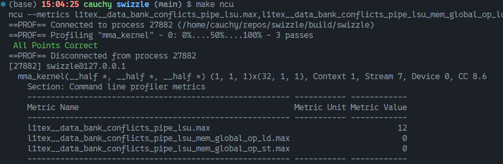

Emm..., 그림처럼 Global Load/Store는 bank conflict를 일으키지 않는다. 그렇다면 여기의 conflict 12번은 어디서 온 것일까? `mma_simple`을 호출할 때는 일반적으로 Shared Memory에서 data를 load/store한다. 필자의 test도 그렇다. 따라서 합리적으로 추론하면 mma 관련 operation이 conflict를 만들었다.

disassembly로 SASS code를 보면 `load_matrix_sync`는 `LDSM` instruction을 생성하고, `store_matrix_sync`는 `STS` instruction을 생성한다는 것을 알 수 있다. 따라서 대응 instruction이 만드는 conflict를 확인할 수 있다.

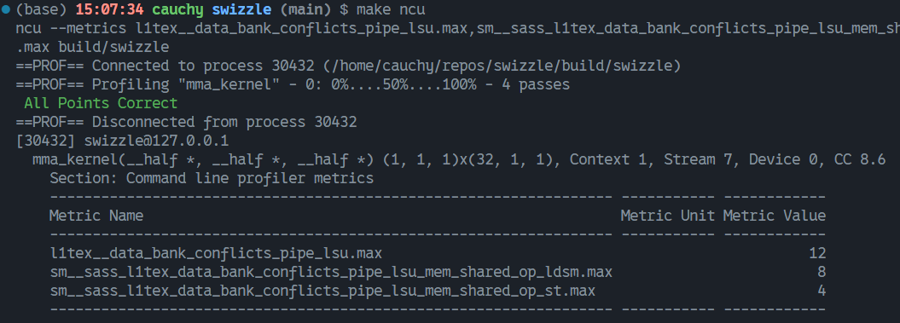

좋다. 우리는 성공적으로 culprit를 찾았다. 따라서 현재 문제는 아래 두 가지로 바뀐다.

- `load_matrix_sync`는 `LDSM`을 어떻게 사용하는가?
- `store_matrix_sync`가 write하는 pattern은 어떤가?

### LDSM instruction
앞의 문제를 해결하기 위해 AI를 한참 괴롭히고 RTFM한 뒤, `LDSM`에 대응하는 PTX instruction에 `ldmatrix`가 있다는 것을 알았다. [PTX ISA 9.7.14](https://docs.nvidia.com/cuda/parallel-thread-execution/index.html#warp-level-matrix-multiply-accumulate-instructions)를 찾아보면 instruction 관련 정보를 알 수 있다. 우리의 문제에서는 `ldmatrix.sync.aligned.x4.m8n8.shared.b16{.trans} r, [p];`의 사용법만 보면 된다.

이 instruction의 basic version은 `ldmatrix.sync.aligned.x1.m8n8.shared.b16`이다. instruction name에서 볼 수 있듯, 역할은 8x8 matrix 하나를 load하는 것이다. 이때 reader가 물을 수 있다.

- 왜 이런 load instruction이 필요한가? 일반 Load instruction이면 충분하지 않은가?

사실 이 instruction이 manual에서 위치한 곳만 보아도 `ldmatrix`가 Tensor Core의 matrix computation을 위해 태어난 load instruction임을 알 수 있다. HMMA instruction으로 Tensor Core를 사용해 matrix multiplication을 수행하려면 matrix element가 warp의 32개 thread에 **분산 저장** 되어야 한다. 16x16 FP16 matrix를 예로 들면, 32bit register 하나는 FP16 두 개를 저장할 수 있고, 각 thread는 `R0, R1, R2, R3` 4개 register를 제공해 총 `32 * 4 * 2 = 256`개의 matrix element를 함께 저장한다.
HMMA instruction으로 계산하려면 공식 manual은 matrix element와 thread의 각 register 사이에 일정한 correspondence를 요구한다. matrix A를 예로 들면 이 correspondence는 다음과 같다.

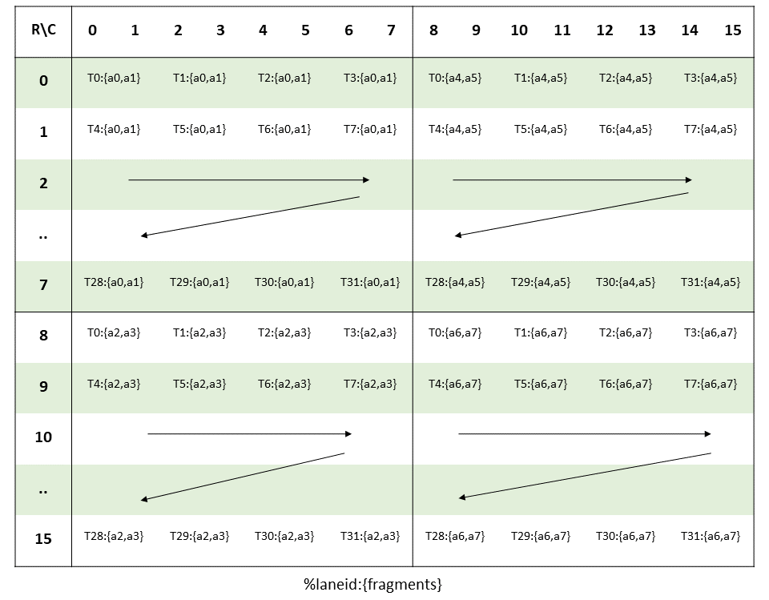

여기서 `{a0,a1}`은 register에 원래 matrix의 `a0, a1` element가 저장됨을 나타낸다.

이 그림에서 알 수 있듯, normal Load instruction으로 data를 register에 load하려면 4개의 instruction이 필요하다. 하지만 `ldmatrix.sync.aligned.x4.m8n8.shared.b16 {%r0, %r1, %r2, %r3}, [%addr];`를 사용하면 instruction 하나만 필요해 issue instruction 수를 크게 줄일 수 있다.

`ldmatrix`의 `.x{1,2,4}` modifier는 몇 개의 8x8 matrix를 load할지 지정한다. 각 matrix의 8개 row address는 대응 thread가 제공한다. 예를 들어 `thread0-7`이 제공한 8개 address는 첫 번째 8x8 matrix를 warp 안 각 thread의 `R0` register로 load하는 데 사용되고, `thread8-15`가 제공한 8개 address는 두 번째 8x8 matrix를 warp 안 각 thread의 `R1` register로 load하는 데 사용된다. 이 과정은 실제 runtime에서 4단계로 진행되어야 한다.

`load_matrix_sync(frag_a, smem_a, 16)`이 이 instruction을 사용하는 방식은 아래 그림으로 설명할 수 있다.

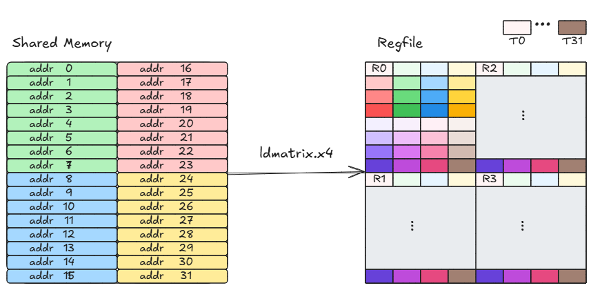


후속 호출을 편하게 하기 위해 이 instruction을 아래처럼 wrapping한다.
```cpp
#define REG(val) (*reinterpret_cast<uint32_t *>(&(val)))
__device__ __forceinline__ void ldmatrix_sync(fp16 *dst, void *addr) {
    asm volatile(
        "ldmatrix.sync.aligned.x4.m8n8.shared.b16 {%0, %1, %2, %3}, [%4];"
        : "=r"(REG(dst[0])),
          "=r"(REG(dst[2])),
          "=r"(REG(dst[4])),
          "=r"(REG(dst[6]))
        : "l"(__cvta_generic_to_shared(addr)));
}
```
여기서 `dst`에 전달되는 parameter는 half 8개를 포함하는 `fragment`다.

### STS instruction
STS는 st.shared, 즉 register 내용을 shared memory에 저장한다는 뜻이다. 이 instruction은 result matrix를 처리하므로 result matrix layout에 주목해야 한다. sm90 이후 result matrix 저장도 `stmatrix` instruction을 사용할 수 있다. 아이디어는 거의 같으므로 이 글은 Load에 중점을 둔다. reader는 필요에 따라 Store 과정도 optimize할지 결정할 수 있다.

### Bank Conflict 
`ldmatrix`의 첫 번째 stage를 관찰하면 아래 그림과 같다.

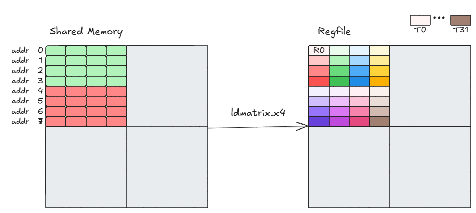

shared memory에는 32개의 4B bank가 있으므로 16x16 FP16 matrix의 4개 row가 모든 bank를 정확히 채운다는 것을 알 수 있다. 따라서 첫 번째 stage의 load에서는 위 그림처럼 conflict가 생긴다.

각 16x16 matrix는 conflict가 4번 생긴다. 우리는 A와 B 두 matrix를 load하므로 LDSM conflict는 총 8번이며, 실험 결과와 일치한다.

더 무서운 점은 global matrix의 한 row size가 모든 bank를 정확히 채우거나 128B의 integer multiple인 경우다. 예를 들어 16x64 FP16 matrix에서 local 16x16 matrix를 load할 때 7 * 4 = 28번의 conflict가 발생하고, 16x16 4개면 112번이다. 따라서 아무 처리 없이 Tensor Core API를 사용하면 memory access에서 performance loss가 발생할 수 있음을 알 수 있다.

## 해결책
앞에서 알 수 있듯 bank conflict는 `ldmatrix` instruction에 주어진 address가 shared memory에서 conflict를 일으키기 때문에 생긴다. 따라서 자연스럽게 이 방향으로 해결책을 찾을 수 있다.

### address permutation 방법
가장 자연스러운 생각은 주어진 address를 permute하는 것이다. 아래 그림과 같다.

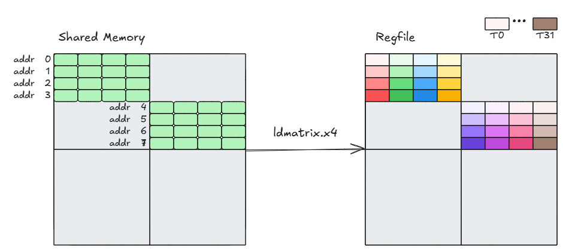

주의해야 할 점은 이때 `thread16-31`의 `R0` register에 저장되는 것은 원래 `R2` register가 저장하던 내용이어야 한다는 것이다. 후반에는 올바른 결과를 보장하기 위해 이들의 register 내용을 swap해야 한다.

하지만 이 방법은 scalable하지 않다. 16x64 FP16 matrix를 예로 들면, local 16x16 matrix의 각 row가 모두 이전 row와 conflict한다면 주어진 address를 어떻게 permute해도 conflict가 생긴다. 자세한 내용은 아래 그림을 참고한다.

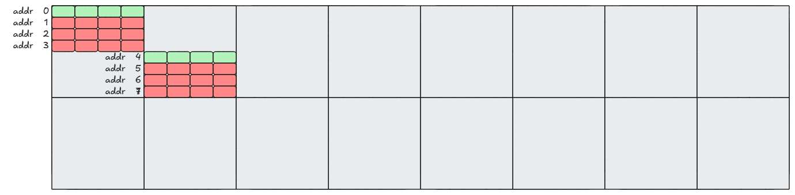

따라서 Shared Memory layout을 바꾸지 않는다면 bank conflict free 목표를 달성하기 어렵다.

### layout remapping 방법
layout remapping 방법은 8x8 sub-block의 각 row를 서로 다른 bank에 분산시켜 shared memory의 conflict-free access를 구현한다. 여기서는 global memory 안의 16x64 FP16 matrix에서 첫 번째 16x16 matrix block에 대해 `ldmatrix`를 수행하는 것을 예로 들며, 전체 과정은 아래 그림과 같다.

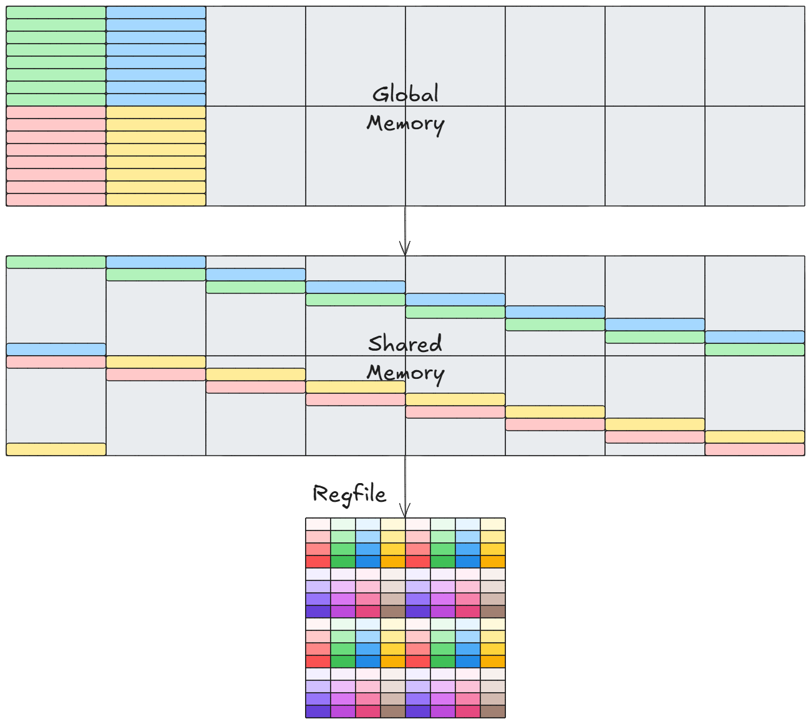

또 다른 가능한 방식은 아래 그림과 같다.

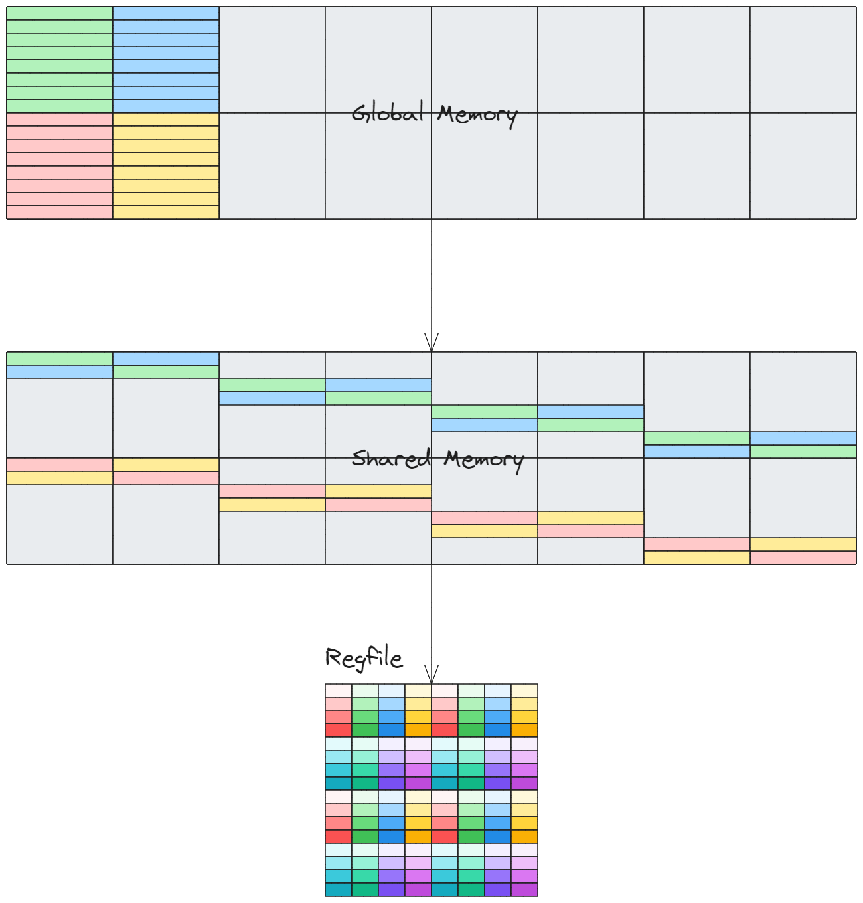

위 두 방식의 차이는 address mapping 방식뿐이다. 두 번째 방식은 CUTLASS가 사용하는 방식이며, xor를 이용해 remapping한다. 이 과정을 더 자세히 살펴보자.

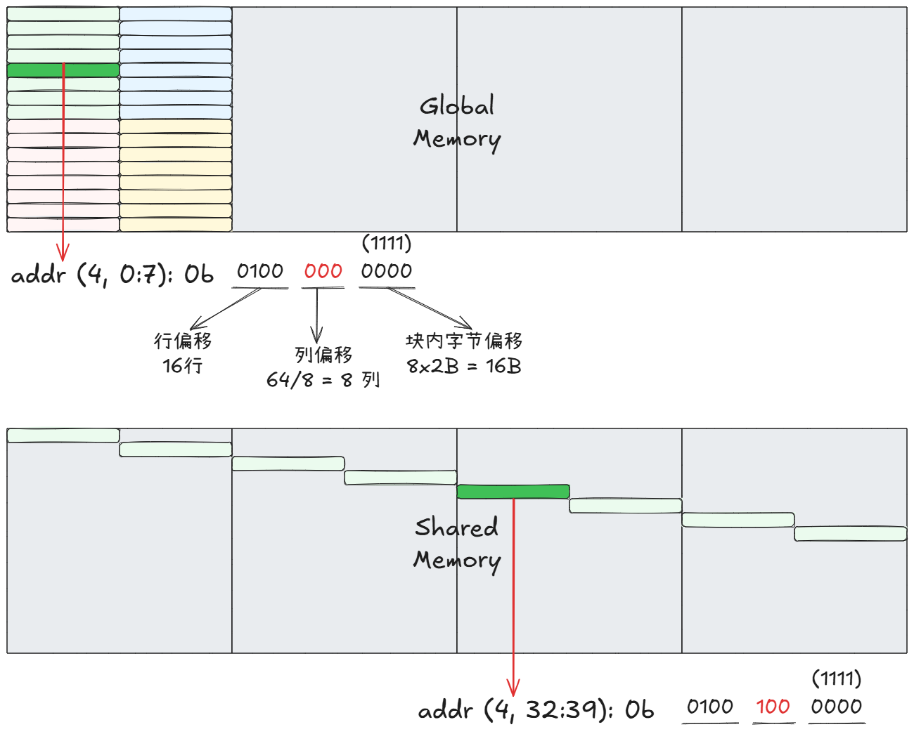

다음 몇 가지를 정리할 수 있다.

1. bank remapping을 구현하려면 column offset만 바꾸면 된다.
2. 각 row에 대해 우리는 서로 다른 column으로 map해야 한다.

두 번째 점에서 쉽게 알 수 있듯, shared memory의 column offset은 **row offset의 몇 bit** 와 **Global Memory의 column offset** 을 xor하여 얻을 수 있다. 실제 operation은 xor에 한정되지 않는다. 서로 다른 bank로 map할 수만 있다면 column offset에 다른 transform을 적용해도 된다.

Global Memory의 row/column은 logical row/column이라고 부른다. 즉 computation에서는 global memory layout을 기준으로 한다. Shared Memory의 row/column은 여기서는 physical row/column이라고 잠정적으로 부른다. 실제 storage에서는 bank conflict를 피해야 하므로 physical row/column은 우리가 일반적으로 생각하는 model처럼 배치되지 않으며, 직접 indexing하면 문제가 생길 수 있다.

logical row/column에서 physical row/column으로의 mapping은 실제 application에서 아래 code로 구현할 수 있다.

```cpp
// kernel launch: <<<1, dim3(32,4)>>>
// 16x64 A matrix를 shared memory로 load
half smem_a[16 * 64];
// vectorized load 128bit address
int tIdx = tx + ty * blockDim.x;
int gAddr = tIdx * 8;
int gRow = gAddr / 64;
int gCol = gAddr % 64;
int sCol = (gCol / 8) ^ (gRow & 0x7);
int sAddr = gRow * 64 + sCol * 8;
// ld_st_128bit(dst, src)
ld_st_128bit(smem_a + sAddr, a + gAddr);
```

그리고 `load_matrix_sync`를 다음처럼 rewrite한다.
```cpp
int r_ = threadIdx.x % 16;
int c_ = (r_ & 0x7) ^ (2 * threadIdx.y + threadIdx.x / 16);

// 앞의 wrapper 사용
ldmatrix_sync(a_frag.x, smem_a + r_ * 16 + c_ * 8)
```

위 implementation은 비교적 dirty하지만, 전체적으로 그림 속 아이디어를 반영한다.
matrix B의 operation도 비슷하다. Swizzle을 거치면 STS 때만 conflict가 발생해야 한다. 이제 최종 결과를 공개해보자.

실제 실행은 다음과 같다.

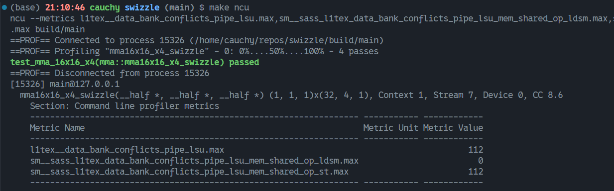

**Hoooooooray!!!**

마지막으로 다른 상황을 이야기해보자. 실제 예로 `ldmatrix`로 16x32 matrix를 load하는 경우를 들 수 있다. 여기까지 읽었다면 reader들도 추정할 수 있을 것이다. Swizzle을 하지 않으면 두 row마다 모든 bank가 채워지므로 총 3 * 4 * 2 = 24번의 conflict가 생긴다. 우리의 Swizzle은 아래 그림과 같은 아이디어로 진행해야 한다.

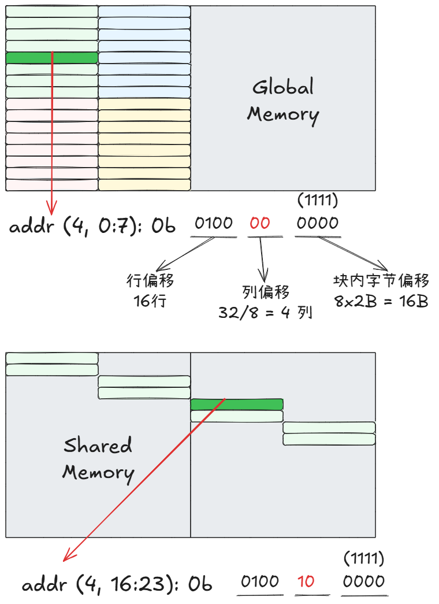

인접한 두 row는 conflict하지 않으므로 row offset의 lowest bit는 아무 contribution을 하지 않는다. row offset의 middle 2 bit와 original column offset을 xor하면 new column offset을 얻을 수 있다.

위 과정을 통해 우리는 Swizzle에 사용할 address의 세 부분을 추출했다는 것을 쉽게 알 수 있다.

- block 내부 byte offset
- column offset
- column offset과 xor할 row offset의 bit

**CUTLASS**에서 사용하는 세 parameter의 의미도 이와 비슷하다.

## 결어
지금까지 우리는 기본적으로 "from scratch"로 Swizzle technique을 직접 개발했다. 물론 **CUTLASS**는 Swizzle을 더 잘 abstract했고, **Block Swizzle**도 제안해 block issue order를 조정함으로써 Cache hit rate를 높인다. 이 글의 목적은 shared memory bank conflict 문제에 한정된다. 내 손도 이제 배웠으니 여기서 마무리하자.

## Reference
1. [CUDA C++ Programming Guide](https://docs.nvidia.com/cuda/cuda-c-programming-guide/index.html#warp-matrix-functions)
2. [CUDA PTX ISA](https://docs.nvidia.com/cuda/parallel-thread-execution/index.html#warp-level-matrix-multiply-accumulate-instructions)
