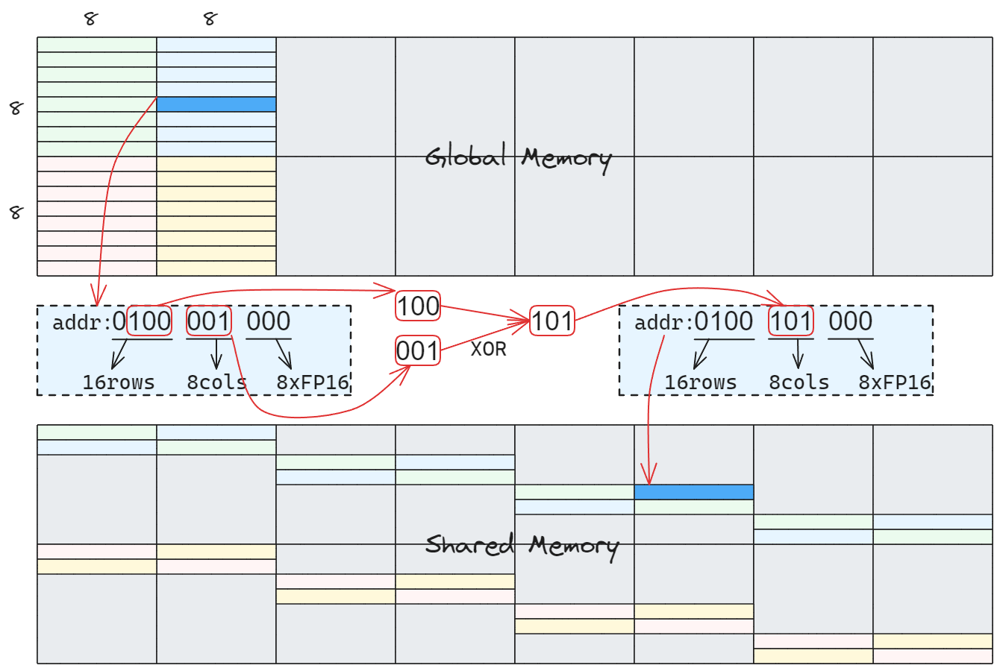
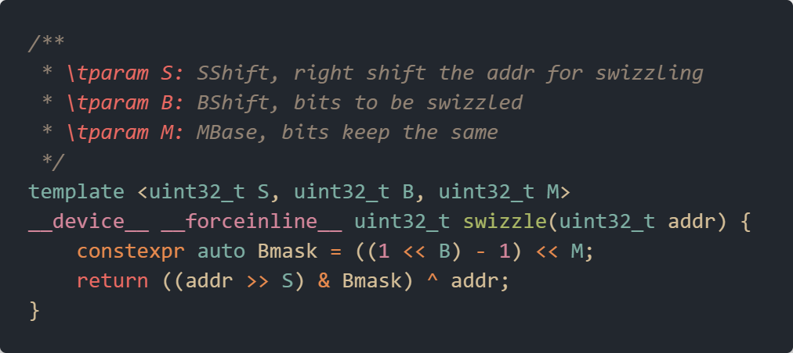
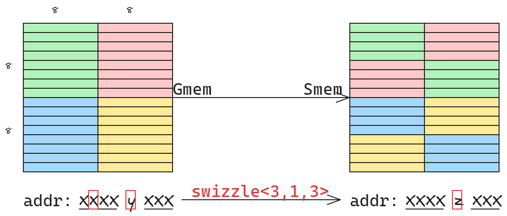
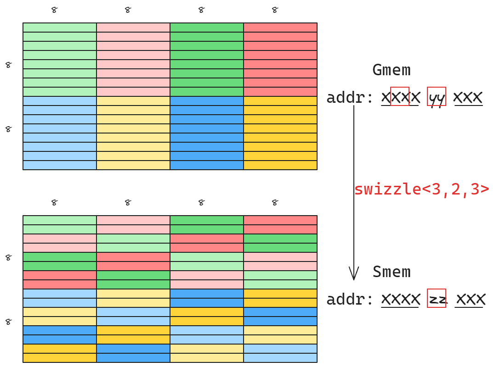
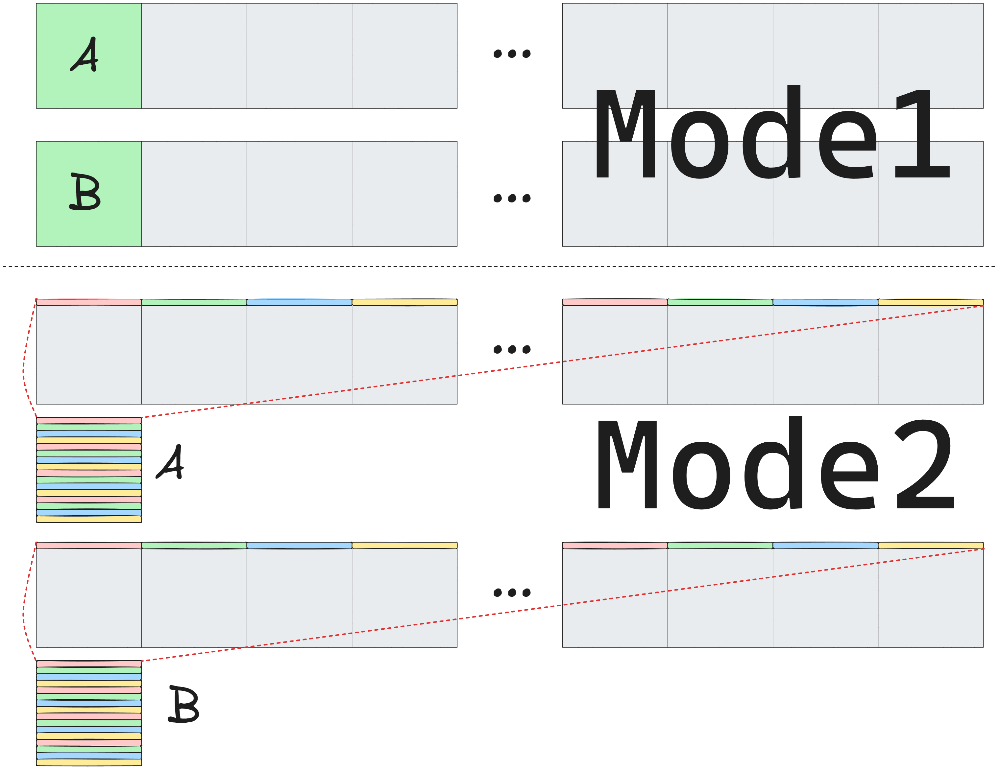
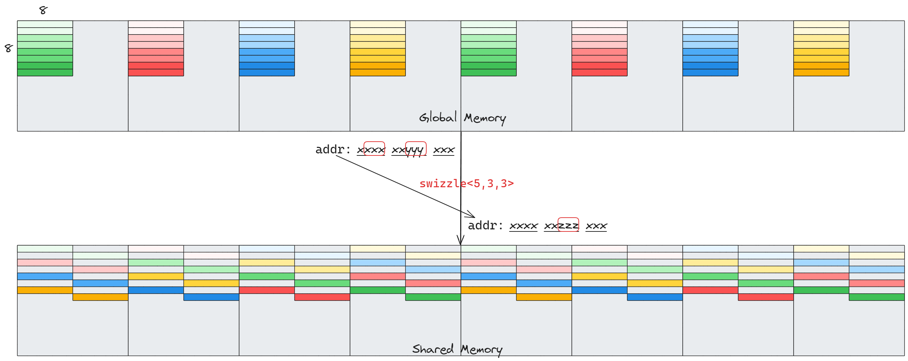
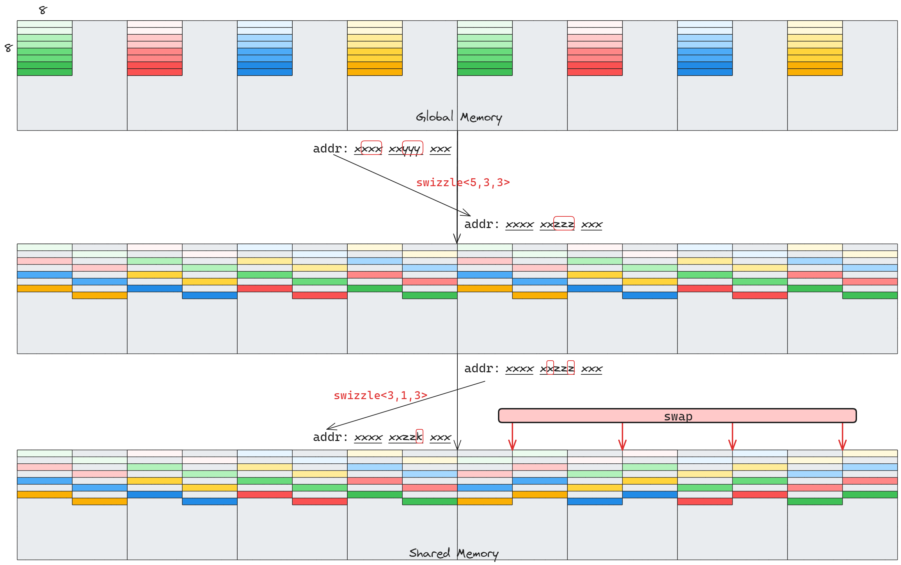

# 실용 Swizzle 튜토리얼(2)

실험 repository 주소: https://github.com/Chtholly-Boss/swizzle

## 서문

[실용 Swizzle 튜토리얼(1)](./blog1.md)에서 필자는 Swizzle을 초보적으로 탐색했다. 최근 며칠 동안 필자가 Swizzle을 사용해 operator 안의 모든 LDSM/STS bank conflict를 완전히 제거한 뒤, 은근히 operator 선인이 된 듯한 느낌이 들었다. 그래서 모두가 bank conflict free가 될 수 있는 아름다운 세상을 만들기 위해 이 글이 탄생했다. 이 글은 swizzle abstraction을 직접 수행하는 방법과 이를 여러 shared memory access pattern에 적용하는 방법을 조금 논의한다.

## 문제의 abstraction

[실용 Swizzle 튜토리얼(1)](./blog1.md)에서 swizzle의 기본 아이디어를 이미 이해했지만, 구현 과정에서는 약간 dirty한 방법, 즉 row/column offset을 수동 추출해 bit operation을 수행하는 방법을 사용했다. 자연스럽게 이를 효율적인 function으로 abstract해 reuse하고 싶어진다.

지난 글에서 제시한 예를 다시 보자.

위 그림에서 알 수 있듯 swizzle은 본질적으로 다음 문제를 해결한다.

- 여러 global address `gAddr`가 주어졌을 때, 위 그림에서는 warp 안 32개 thread가 32개 address를 제공한다. 이를 여러 shared memory address `sAddr`로 어떻게 map해야 어떤 access pattern `mode`, 위 그림에서는 8x8 같은 색 sub-block 접근이 shared memory에서 bank conflict 없이 수행되는가?

우리가 열심히 탐색한 뒤, 이 문제는 아래 문장으로 답할 수 있다.

- 각 `gAddr`의 **차이점** 을 shared memory의 **bank distribution** 에 작용시키면 된다.

사랑하는 reader여, 이 답이 **make sense** 하다고 느끼는가? 아니라면, 내가 천천히 설명해보겠다...

## Swizzle template implementation

지난 글의 address mapping 과정을 다시 살펴보자.

주의할 점은 그림 속 address가 실제로는 `FP16` pointer의 offset이라는 것이다. `8cols`가 나타내는 column은 실제로 `8*2B=16B`의 `bank4`, 즉 4개의 4B bank가 형성한 하나의 column이다.

그림에서 쉽게 알 수 있듯, access pattern이 8x8 matrix이므로 `gAddr`의 row offset을 `sAddr`의 column offset에 작용시킨다. 그 결과 `bank4` distribution을 나타내는 column offset bit가 `gAddr`의 row information을 포함하게 되고, 8x8 matrix의 각 row를 서로 다른 `bank4`에 성공적으로 분산시킨다.

이를 통해 `gAddr`로부터 `sAddr`를 만들 때 address의 다음 세 부분에 주목한다는 것을 알 수 있다.

- `MBase`: block 하나에 필요한 bit를 나타낸다. 위 예에서는 3이며, block 하나에는 8개의 `FP16`이 있다.
- `BBits`: bank distribution을 나타내는 bit다. 위 예에서는 3이며, middle 3 bit가 나타내는 `8cols`다.
- `SShift`: `gAddr` information을 포함하는 bit가 `BBits`로 이동하는 거리이며, bank distribution `BBits`를 mapping하는 데 사용된다.

나아가 우리는 아래 방식으로 swizzle을 abstract할 수 있다.

세 parameter를 template parameter로 사용해 compile-time computation을 구현한다. 이는 Cpp(ComPile time Programming)의 장점을 잘 활용할 수 있다. 실제 runtime에는 `return` 부분의 overhead만 있음을 볼 수 있다. 이 bit operation 부분은 필자가 compiler를 믿기로 했다.

**Elegant !!!** 우리는 성공적으로 우리만의 swizzle을 구현했다. 이제 이 abstraction을 사용해 사방을 휩쓸어보자.

## Swizzle 예시

이 부분에서는 몇 가지 예를 통해 practice에서 swizzle을 어떻게 사용하는지 설명한다. 필자는 이 부분이 재미있을 것이라고 믿는다. 이 부분은 16x16 matrix에 대한 `ldmatrix` load와 관련된 내용을 포함한다. 익숙하지 않은 reader는 [실용 Swizzle 튜토리얼(1)](./blog1.md)로 돌아가 복습할 수 있다.

각 예시의 reference implementation은 [실험 repository](https://github.com/Chtholly-Boss/swizzle)의 `src/mma.cuh`에서 볼 수 있다.

### 기본 사용법

- *Problem 1.1:* global memory에 있는 FP16 type 16x16 matrix $A$와 integer $n$이 주어졌을 때, Tensor Core를 사용해 $A^n$을 계산하라.
- *Problem 1.2:* global memory에 있는 FP16 type의 16x16 matrix 두 개 $A,B$를 concatenate해 만든 16x32 matrix $M$이 주어졌을 때, Tensor Core를 사용해 $A \times B$를 계산하라.

*Problem1.1*의 핵심은 shared memory 안의 16x16 matrix를 conflict 없이 access하는 것이다. 지난 글과 이 글의 abstraction을 거쳤으므로, reader는 가볍게 웃으며 아래 solution을 내놓을 수 있을 것이다.

*Problem1.2*도 비슷하다. 다만 두 16x16을 하나의 전체로 본다. reader는 여전히 어렵지 않게 아래 solution을 내놓을 수 있다.

### Multi-layer(Multi-) Swizzle

- *Problem 2.1*: global memory에 있는 FP16(half) type 16x256 matrix 두 개 $A, B$와 결과 저장 address 두 개 $C_1, C_2$가 주어지고, kernel launch configuration은 `<<<1, dim3(32,16)>>>`, 즉 16개 warp로 계산한다고 하자. 다음 operation을 완료해야 한다.
    - 16 column 단위로 각 16x16 matrix block에 대해 Tensor Core를 사용해 matrix multiplication `Csub = Asub * Bsub^T`를 수행한 뒤 global memory $C_1$에 write한다.
    - 각 row의 256개 element를 하나의 16x16 matrix block으로 보고, Tensor Core를 사용해 matrix multiplication `Csub = Asub * Bsub^T`를 수행한 뒤 global memory $C_2$에 write한다.

이 문제의 diagram은 다음과 같다.

이 문제의 어려움은 두 가지 access pattern의 conflict-free access를 동시에 지원하는 것이다. 직관이 강한 reader라면 이미 뭔가 깨달음에 오른 듯한 느낌을 받을 수 있다...

먼저 첫 번째 subproblem의 conflict-free access를 해결하기 위해 첫 번째 layer swizzle을 적용하는 것을 생각해보자. 아래 그림과 같다.

주의할 점은 이 mode에서 두 번째 subproblem의 access에는 여전히 conflict가 존재한다는 것이다. 첫 번째 row를 예로 들면, 예리한 reader는 이것이 *Problem1.1*과 같은 conflict를 만든다는 것을 이미 눈치챘을 것이다. 그래서 우리는 흥미로운 생각을 하게 된다.

**Swizzle을 한 layer 더 적용한다**

**You get it!** 두 layer의 Swizzle을 연속 적용하면 두 mode 모두에서 conflict-free access를 얻을 수 있다.

전체 과정은 아래 그림과 같다.

### Interleaving Swizzle 

- *Problem 3.1*: global memory에 있는 FP16(half) type 16x256 matrix 두 개 $A, B$와 result 저장 address $C$가 주어지고, kernel launch configuration은 `<<<1, dim3(32,16)>>>`, 즉 16개 warp로 계산한다고 하자. 다음 operation을 완료해야 한다.
    - 16 column 단위로 각 16x16 matrix block에 대해 Tensor Core를 사용해 matrix multiplication `Csub = Asub * Bsub^T`를 수행한 뒤 shared memory에 write back한다.
    - 각 row의 256개 element를 하나의 16x16 matrix block으로 보고, Tensor Core를 사용해 matrix multiplication `Csub = Asub * Bsub^T`를 수행한 뒤 shared memory에 write back한다.
    - shared memory 내용을 global memory에 write back한다.

세심한 reader는 이 예시가 multi-layer Swizzle과 같은 technique으로도 해결될 수 있음을 이미 발견했을 수 있다. 하지만 실제로는 더 재미있는 다른 방법도 있다. 여기서는 idea만 다음과 같이 제공한다.

1. 첫 번째 방식에 대해서만 Swizzle을 사용해 shared memory로 load한 뒤 첫 번째 subproblem의 computation을 수행한다.
2. 첫 번째 subproblem computation이 끝날 때 두 번째 방식의 Swizzle을 사용해 shared memory에 write back한다.
3. 두 번째 subproblem computation을 수행하고, 끝난 뒤 두 번째 방식의 Swizzle로 shared memory에 write back한다.
4. 두 번째 방식의 Swizzle로 shared memory 내용을 global memory에 write back한다.

주의해야 할 점은 두 번째 step의 write back 전에 block 내부 synchronization `syncthreads()`가 필요하다는 것이다. Swizzle 방식이 바뀌었기 때문에 write back하려는 address가 아직 첫 번째 step의 computation을 완료하지 않았을 수 있다.

Interleaving Swizzle을 통해 우리는 operator 전체 computation 과정에서 shared memory Layout을 자유롭게 전환해 서로 다른 access pattern에 적응할 수 있고, bank conflict free의 천국에서 반복해서 뛰어다닐 수 있다.

## 결어

**Congratulations!!!** 😆😆😆 reader들이 이제 자신만의 swizzle을 정의하고 사용하는 방법을 익혔으며, bank conflict free world에서 마음껏 헤엄칠 수 있게 되었으리라 믿는다. 필자는 현 단계의 operator optimization에서 **swizzle**이 이미 operator 선인들의 필수 법보 중 하나가 되었다고 본다. 이 글은 막 입문한 작업자들이 관련 개념과 사용법을 정리하는 데 도움을 주기 위한 것이며, 모두에게 도움이 되길 바란다.

reader가 다른 재미있는 문제나 활용법을 가지고 있다면 comment area에 관련 생각을 남겨주기 바란다.
