출처: https://zhuanlan.zhihu.com/p/20579515046 & https://zhuanlan.zhihu.com/p/21142007017

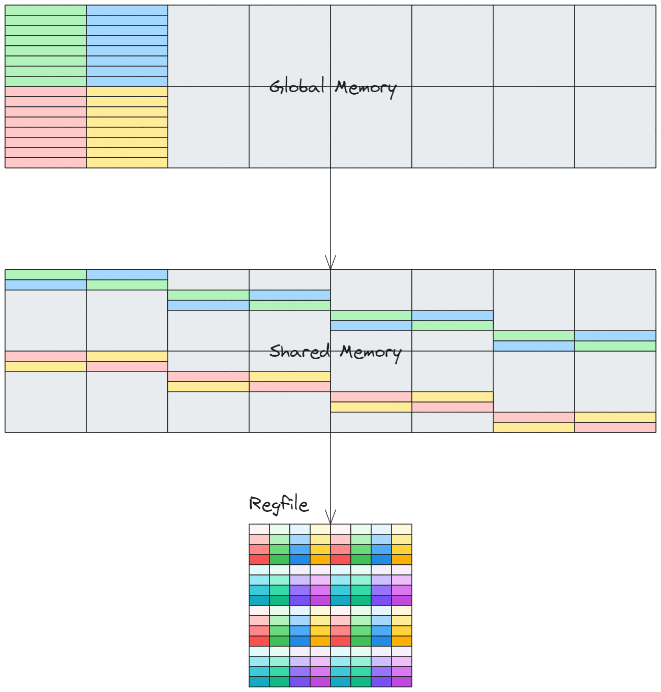

# 실용 Swizzle 튜토리얼 1편

이 글의 실험 repository 주소: Chtholly-Boss/swizzle: A practical way of learning Swizzle

## 머리말

최근 연구 작업에서 Tensor Core를 사용해 operator를 최적화해야 했는데, 최적화 과정에서 많은 Bank Conflict를 발견해 꽤 괴로웠습니다. CUTLASS가 Bank Conflict Free Swizzle 기법을 제안했다는 이야기를 들었고, 무척 고급스러워 보여서 강도 높은 RTFM과 blog 읽기를 진행했습니다. Zhihu에는 Swizzle을 설명하는 훌륭한 글이 이미 많이 있습니다. 필자는 읽고 나서 머리가 꽤 똑똑해진 느낌을 받았지만, 실제 구현에 들어가자 제 손이 아직 못 배웠다고 말했습니다. 손은 아래 몇 가지를 매우 괴로워했습니다.

    CUTLASS 라이브러리를 쓰고 싶지 않다. 아직 잘 모르기 때문이다.
    어디서부터 작성해야 할지 모르겠다. 대부분의 blog는 베껴 쓸 코드가 없거나, 코드가 있어도 CUTLASS를 호출한다.

필자는 손에게 매우 실망했고, 이틀에서 사흘 정도 실험한 뒤 손을 위해 이 글을 썼습니다. 목표는 **Swizzle 기법을 operator에 적용해 Bank Conflict를 제거하는 방법**을 가르치는 것입니다.

## 문제의 발생

Swizzle은 Bank Conflict를 해결할 수 있습니다. 그런데 conflict는 어디서 오는 것일까요? 이는 처음의 목표, 즉 "Tensor Core를 사용해 operator를 최적화한다"에서 출발해야 합니다. 구체적으로 CUDA Programming Guide 7.24(https://docs.nvidia.com/cuda/cuda-c-programming-guide/index.html#warp-matrix-functions) 를 살펴보면, 다음 방식으로 Tensor Core API를 호출해 `(m,n,k) = (16,16,16)` 의 `C = A B^T FP16` 행렬 곱셈을 한 번 수행할 수 있음을 알 수 있습니다.

```c++
__device__ void mma_simple(half *a, half *b, half *c) {
    using namespace nvcuda::wmma;
    fragment<matrix_a, 16, 16, 16, half, row_major> a_frag;
    fragment<matrix_b, 16, 16, 16, half, col_major> b_frag;
    fragment<accumulator, 16, 16, 16, half> c_frag;

    load_matrix_sync(a_frag, a, 16);
    load_matrix_sync(b_frag, b, 16);

    fill_fragment(c_frag, 0.0f);

    mma_sync(c_frag, a_frag, b_frag, c_frag);

    store_matrix_sync(c, c_frag, 16, mem_row_major);
}
```

함수의 구체적인 사용 설명은 CUDA Programming Guide 7.24(https://docs.nvidia.com/cuda/cuda-c-programming-guide/index.html#warp-matrix-functions) 를 직접 보면 됩니다.

이것은 꽤 친절해 보입니다. 그래서 저는 신나게 test code를 작성하고 한바탕 profile을 돌려 아래 결과를 얻었습니다.

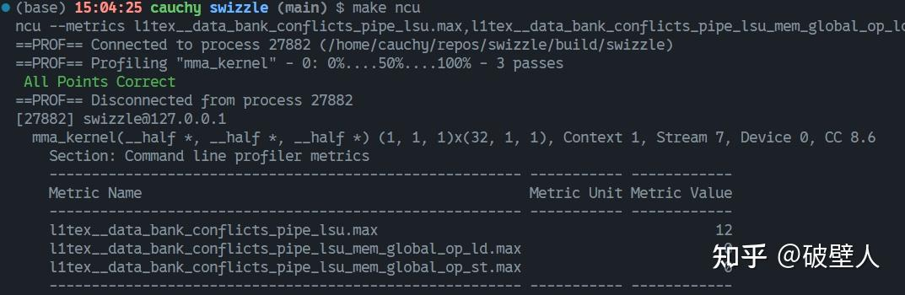

Emm..., 그림처럼 Global Load/Store는 모두 bank conflict를 만들지 않습니다. 그렇다면 여기의 12번 conflict는 어디서 온 것일까요? 우리는 `mma_simple`을 호출할 때 일반적으로 Shared Memory에서 data를 load/store합니다(필자의 test도 그렇습니다). 따라서 mma 관련 operation이 conflict를 만들었다고 합리적으로 추론할 수 있습니다.

Disassembly로 SASS code를 확인해 보면 `load_matrix_sync`는 `LDSM` instruction을 생성하고, `store_matrix_sync`는 `STS` instruction을 생성한다는 것을 알 수 있습니다. 따라서 해당 instruction이 만드는 conflict를 확인할 수 있습니다.

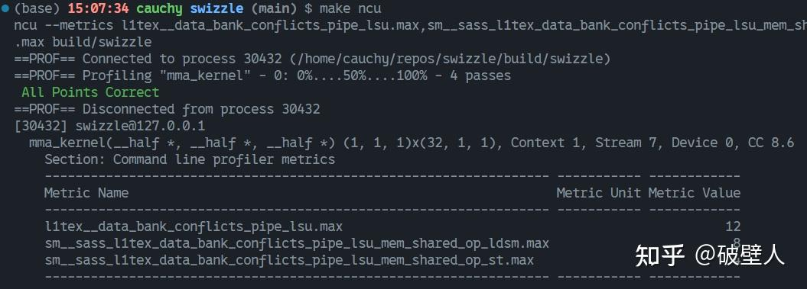

좋습니다. 우리는 성공적으로 주범을 찾았습니다. 따라서 이제 문제는 다음 두 가지로 바뀝니다.

- `load_matrix_sync`는 `LDSM`을 어떻게 사용하는가?
- `store_matrix_sync`의 write pattern은 어떤 모습인가?

## LDSM instruction

앞의 문제를 해결하기 위해 AI를 한바탕 괴롭히고 RTFM도 한 뒤, `LDSM`에 대응하는 PTX instruction으로 `ldmatrix`가 있음을 알게 되었습니다. PTX ISA 9.7.14(https://docs.nvidia.com/cuda/parallel-thread-execution/index.html#warp-level-matrix-multiply-accumulate-instructions) 를 찾아보면 instruction 관련 정보를 알 수 있습니다. 우리 문제에서는 `ldmatrix.sync.aligned.x4.m8n8.shared.b16{.trans} r, [p];` 의 사용법만 보면 됩니다.

이 instruction의 기본 버전은 `ldmatrix.sync.aligned.x1.m8n8.shared.b16`입니다. instruction 이름에서 알 수 있듯 역할은 8x8 행렬 하나를 load하는 것입니다. 이때 독자는 이렇게 물을 수 있습니다.

- 왜 이런 load instruction이 필요한가? 일반 Load instruction이면 충분하지 않은가?

사실 이 instruction이 manual에서 위치한 곳만 보아도 알 수 있듯, `ldmatrix`는 Tensor Core의 matrix compute를 위해 태어난 load instruction입니다. HMMA instruction으로 Tensor Core를 사용해 matrix multiplication을 수행하려면, matrix element가 한 warp의 32개 thread에 **분산 저장**되어 있어야 합니다. 16x16 FP16 행렬을 예로 들면, 각 32-bit register는 FP16 두 개를 저장할 수 있고, 각 thread가 register R0, R1, R2, R3 네 개를 제공하므로 총 32 * 4 * 2 = 256개 matrix element를 함께 저장합니다. HMMA instruction으로 계산하기 위해서는 공식 manual에서 matrix element와 thread의 각 register 사이에 일정한 대응 관계를 요구합니다. matrix A를 예로 들면 이 대응 관계는 다음과 같습니다.

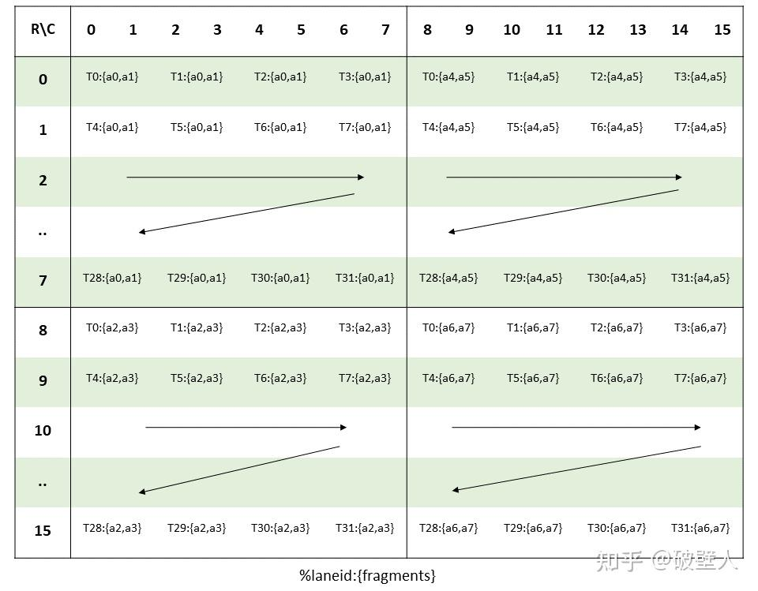

여기서 `{a0,a1}`는 register 안에 원래 matrix의 `a0, a1` element가 저장된다는 뜻입니다.

이 그림을 보면, 정상적인 Load instruction으로 data를 register에 load하려면 instruction 4개가 필요합니다. 하지만 `ldmatrix.sync.aligned.x4.m8n8.shared.b16 {%r0, %r1, %r2, %r3}, [%addr];` 를 사용하면 instruction 하나만 필요하므로 issue되는 instruction 수를 크게 줄일 수 있습니다.

`ldmatrix`의 `.x{1,2,4}` modifier는 몇 개의 8x8 matrix를 load할지 지정합니다. 각 matrix의 8개 row 주소는 대응하는 thread가 제공합니다. 예를 들어 `thread0-7`이 제공한 8개 주소는 첫 번째 8x8 matrix를 warp 안 각 thread의 `R0` register로 load하는 데 쓰이고, `thread8-15`가 제공한 8개 주소는 두 번째 8x8 matrix를 warp 안 각 thread의 `R1` register로 load하는 데 쓰입니다. 이 과정은 실제 실행에서 4단계로 진행되는 것으로 보입니다.

`load_matrix_sync(frag_a, smem_a, 16)` 이 이 instruction을 사용하는 방식은 아래 그림으로 설명할 수 있습니다.

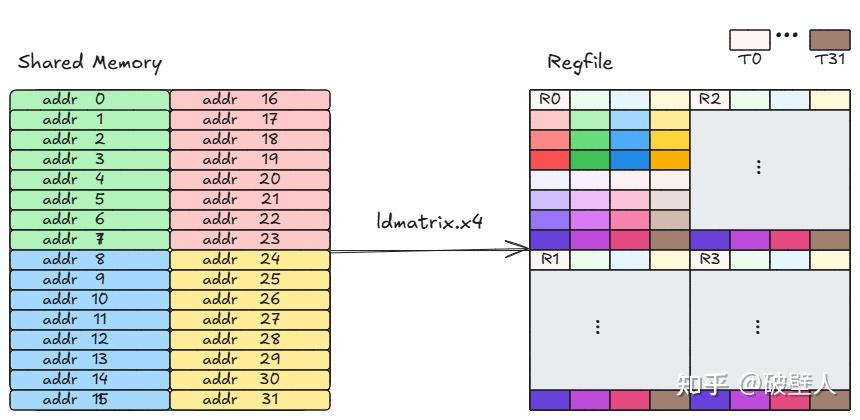

이후 호출을 편하게 하기 위해 이 instruction을 다음처럼 wrapping합니다.

```c++
#define REG(val) (*reinterpret_cast<uint32_t *>(&(val)))
__device__ __forceinline__ void ldmatrix_sync(fp16 *dst, void *addr) {
 asm volatile(
 "ldmatrix.sync.aligned.x4.m8n8.shared.b16 {%0, %1, %2, %3}, [%4];"
 : "=r"(REG(dst[0])),
 "=r"(REG(dst[2])),
 "=r"(REG(dst[4])),
 "=r"(REG(dst[6]))
 : "l"(__cvta_generic_to_shared(addr)));
}

// 각 32-bit register는 FP16(half precision floating point) 값 2개를 저장할 수 있다.
// ldmatrix instruction에서 .x4는 8x8 matrix 4개를 load한다는 뜻이다.
// 이 index 선택은 data가 대응하는 register 위치에 올바르게 load되도록 하기 위한 것이다.
// 구체적으로:
// dst[0]과 dst[1]은 첫 번째 register(R0)에 load된다.
// dst[2]와 dst[3]은 두 번째 register(R1)에 load된다.
// dst[4]와 dst[5]는 세 번째 register(R2)에 load된다.
// dst[6]과 dst[7]은 네 번째 register(R3)에 load된다.
// 왜 0,2,4,6 같은 간격을 선택하는가? 이유는 다음과 같다.
// 각 index 위치는 실제로 FP16 값 두 개를 포함한다(32-bit register가 FP16 두 개를 저장할 수 있기 때문).
// 이런 간격 선택은 data가 Tensor Core가 요구하는 특정 layout에 맞춰 register에 load되도록 보장한다.
// 이 layout은 이후 matrix multiplication operation(HMMA instruction)에 필요하다.
```


여기서 dst에 전달되는 parameter는 FP16 8개를 포함하는 `fragment`입니다.

## STS instruction

STS는 `st.shared`이며, register의 내용을 shared memory에 저장한다는 뜻입니다. 이 instruction이 처리하는 것은 result matrix이므로 result matrix의 layout에 주목해야 합니다. sm90 이후에는 result matrix 저장도 `stmatrix` instruction을 사용할 수 있습니다. 아이디어는 거의 비슷하므로 이 글에서는 Load에 초점을 맞추며, 독자는 필요에 따라 Store 과정도 최적화할지 결정할 수 있습니다.

## Bank Conflict

`ldmatrix`의 첫 번째 단계를 관찰하면 아래 그림과 같습니다.

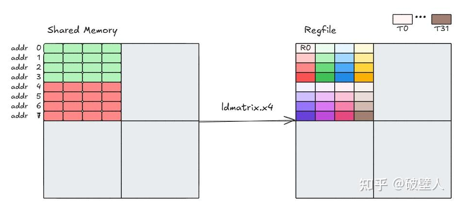

shared memory에는 32개의 4B bank가 있으므로, 16x16 FP16 matrix의 4개 row가 모든 bank를 정확히 채운다는 것을 알 수 있습니다. 따라서 첫 번째 단계의 load에서 위 그림과 같은 conflict가 발생합니다.

각 16x16 matrix에는 conflict가 4번 발생합니다. 우리는 A와 B 두 matrix를 load하므로 LDSM conflict는 총 8번이고, 이는 실험 결과와 일치합니다.

더 무서운 점은 global matrix의 한 row 크기가 모든 bank를 정확히 채우거나 128 B의 정수배인 경우입니다. 예를 들어 16x64 FP16 matrix에서는 local 16x16 matrix 하나를 load할 때 7 * 4 = 28번 conflict가 발생하고, 16x16 네 개면 112번입니다! 이로부터 아무 처리 없이 Tensor Core API를 사용하면 memory access에서 성능 손실이 생길 수 있음을 알 수 있습니다.

## 해결 방법

앞서 보았듯 bank conflict는 `ldmatrix` instruction이 제공한 주소가 shared memory 안에서 conflict를 일으키기 때문에 발생합니다. 따라서 자연스럽게 이 방향에서 해결책을 찾을 수 있습니다.

## 주소 재배열 방법

가장 자연스러운 생각은 제공된 주소를 재배열하는 것입니다. 아래 그림과 같습니다.

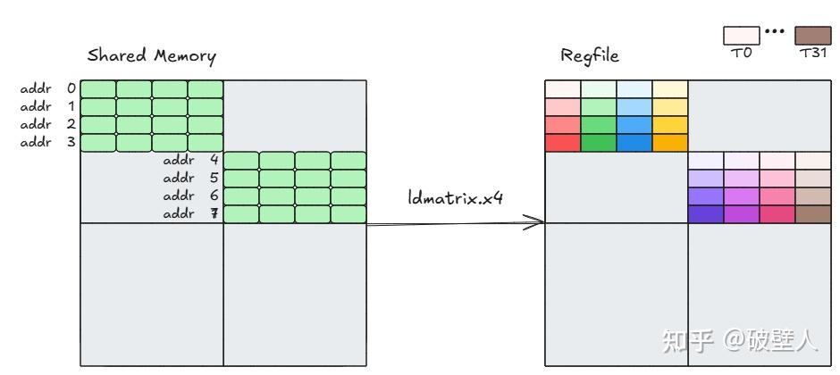

주의할 점은 이때 `thread16-31`의 `R0` register에는 원래 `R2` register에 저장되어야 할 내용이 저장된다는 것입니다. 이후 올바른 결과를 얻으려면 이들의 register 내용을 교환해야 합니다.

하지만 이 방법은 확장성이 없습니다. 16x64 FP16 matrix를 예로 들면, local 16x16 matrix의 각 row가 모두 이전 row와 conflict한다면, 제공 주소를 어떻게 재배열하더라도 conflict가 발생합니다. 구체적인 세부 사항은 아래 그림을 참고하세요.

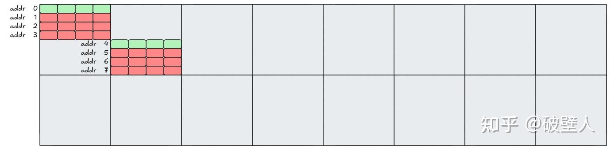

따라서 Shared Memory layout을 바꾸지 않는 경우 bank conflict free라는 목표를 달성하기 어렵습니다.

## layout remapping 방법

layout remapping 방법은 8x8 sub-block의 각 row를 서로 다른 bank에 분산해 shared memory의 conflict-free access를 구현합니다. 여기서는 global memory의 16x64 FP16 matrix에서 첫 번째 16x16 matrix block에 대해 `ldmatrix`를 수행하는 것을 예로 들겠습니다. 전체 과정은 아래 그림과 같습니다.

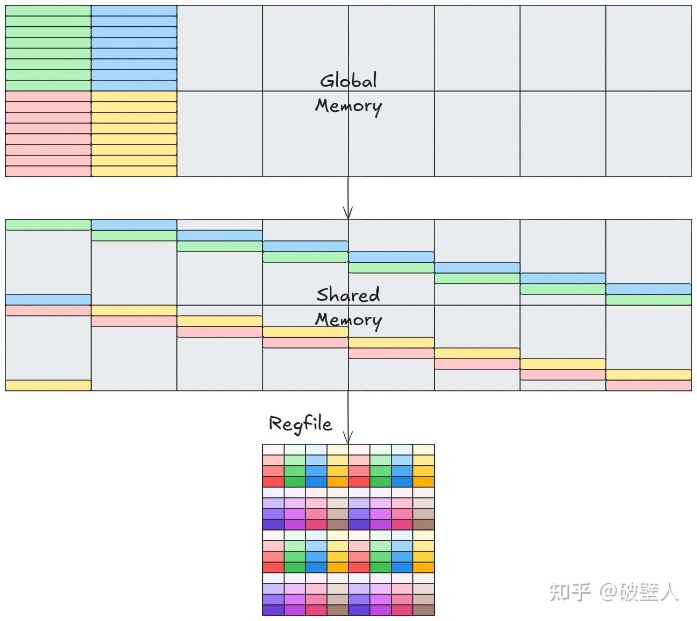

또 다른 가능한 방식은 아래 그림과 같습니다.


위 두 방식의 차이는 주소 mapping 방식뿐입니다. 두 번째가 CUTLASS가 사용하는 방식, 즉 XOR를 이용한 remapping입니다. 이 과정을 더 자세히 살펴보겠습니다.

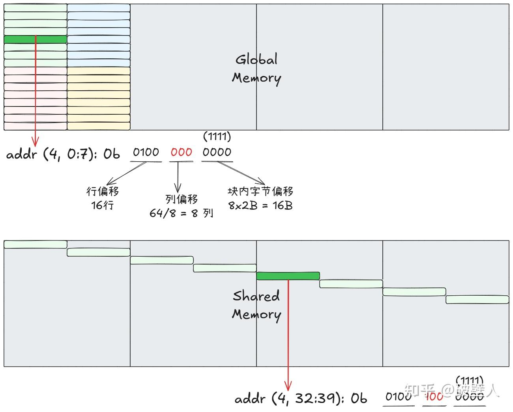

다음과 같이 정리할 수 있습니다.

- column offset만 바꾸면 bank remapping을 구현할 수 있습니다.
- 각 row에 대해 서로 다른 column으로 mapping해야 합니다.

두 번째 점에서 어렵지 않게 알 수 있듯, shared memory의 column offset은 **row offset의 몇몇 bit**와 **Global Memory의 column offset**을 XOR하여 얻을 수 있습니다. 실제 operation은 XOR에만 제한되지 않습니다. 서로 다른 bank로 mapping될 수만 있다면 column offset에 다른 변환을 해도 됩니다.

Global Memory의 row/column은 logical row/column이라고 부릅니다. 즉 연산할 때는 global memory의 layout을 기준으로 합니다. Shared Memory의 row/column은 여기서는 physical row/column이라고 임시로 부르겠습니다. 실제 저장에서는 bank conflict를 피해야 하므로 physical row/column은 우리가 보통 생각하는 model처럼 배치되지 않으며, 직접 indexing하면 문제가 생길 수 있습니다.

logical row/column에서 physical row/column으로의 mapping은 실제 응용에서 다음 코드로 구현할 수 있습니다.

```c++
// kernel launch: <<<1, dim3(32,4)>>>
// 16x64 A matrix를 shared memory로 load
half smem_a[16 * 64];
// 128bit 주소를 vectorized load
int tIdx = tx + ty * blockDim.x;
int gAddr = tIdx * 8;
int gRow = gAddr / 64;
int gCol = gAddr % 64;
int sCol = (gCol / 8) ^ (gRow & 0x7);
int sAddr = gRow * 64 + sCol * 8;
// ld_st_128bit(dst, src)
ld_st_128bit(smem_a + sAddr, a + gAddr);
```

그다음 `load_matrix_sync`를 다음처럼 고칩니다.

```c++
int r_ = threadIdx.x % 16;
int c_ = (r_ & 0x7) ^ (2 * threadIdx.y + threadIdx.x / 16);

// 앞의 wrapping 사용
ldmatrix_sync(a_frag.x, smem_a + r_ * 16 + c_ * 8)
```

matrix B에 대한 operation도 비슷합니다. Swizzle을 거친 뒤에는 STS 때에만 conflict가 발생해야 합니다. 이제 최종 결과를 공개해 보겠습니다!

실제 실행은 다음과 같습니다.

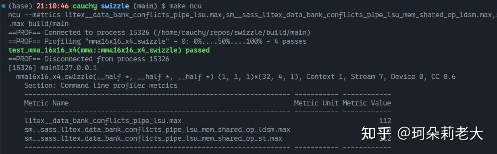

Hoooooooray!!!

마지막으로 다른 상황을 이야기해 보겠습니다. 실제 예시를 하나 더 들어 `ldmatrix`로 16x32 matrix를 load한다고 해 봅시다. 여기까지 읽었다면 독자들은 추정할 수 있을 것입니다. Swizzle을 하지 않으면 두 row마다 모든 bank를 채우므로 총 3 * 4 * 2 = 24번 conflict가 발생합니다. 우리의 Swizzle은 아래 그림의 아이디어처럼 진행해야 합니다.

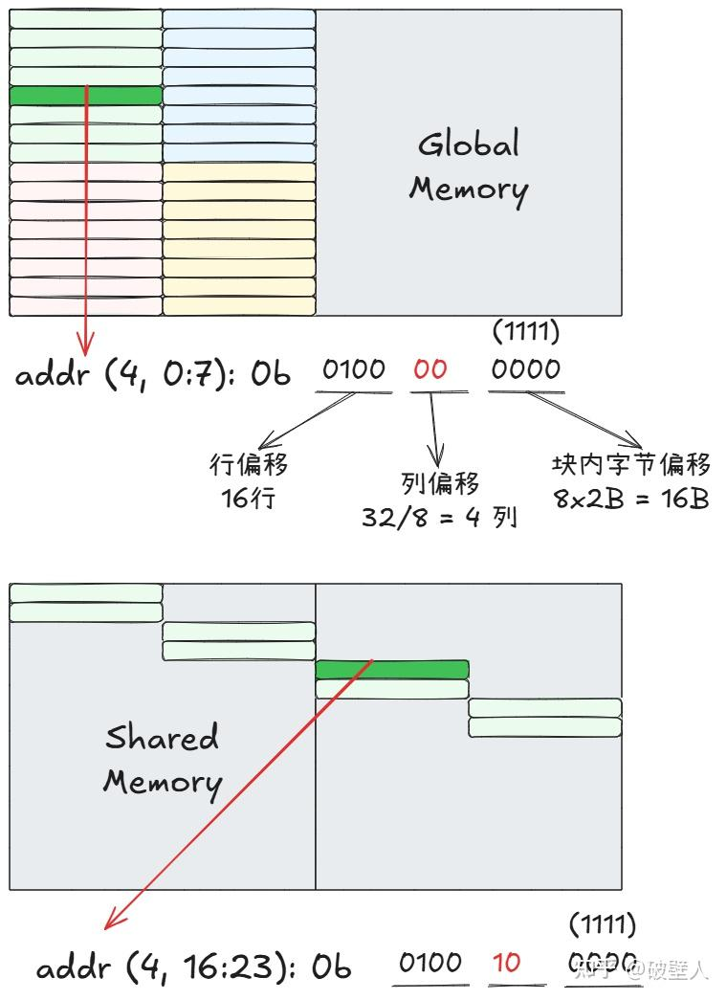

인접한 두 row는 conflict하지 않으므로 row offset의 lowest bit는 아무 기여를 하지 않습니다. row offset의 middle 2 bit와 원래 column offset을 XOR하면 새로운 column offset을 얻을 수 있습니다.

위 과정을 통해 주소의 세 부분을 추출해 Swizzle에 사용한다는 것을 알 수 있습니다.

- block 내부 byte offset
- column offset
- row offset 중 column offset과 XOR할 bit

CUTLASS에서 사용하는 세 parameter도 의미가 비슷합니다.

## 맺음말

여기까지 우리는 기본적으로 "처음부터" 직접 Swizzle 기법을 개발했습니다. 물론 CUTLASS는 Swizzle을 더 잘 추상화했고, Cache hit rate를 높이기 위해 block issue order를 조정하는 Block Swizzle도 제안했습니다. 이 글의 목적은 shared memory bank conflict 문제에 한정됩니다. 제 손도 이제 배웠으니, 여기서 마치겠습니다.


# 실용 Swizzle 튜토리얼 2편

## 문제의 추상화

실용 Swizzle 튜토리얼 1편에서 우리는 swizzle의 기본 아이디어를 이해했지만, 구현 과정에서는 row/column offset을 직접 추출해 bit operation을 수행하는 약간 dirty한 방식을 사용했습니다. 자연스럽게 이를 효율적인 함수로 추상화해 재사용하고 싶어집니다.

지난 글에서 제시한 예시를 돌아보겠습니다.


위 그림에서 알 수 있듯 swizzle은 본질적으로 다음 문제를 해결합니다.

- global address 집합 gAddr가 주어졌을 때(위 그림에서는 warp 안 32개 thread가 32개 주소를 제공), 어떤 access pattern mode(위 그림에서는 같은 색의 8x8 sub-block 하나에 접근)가 shared memory에서 bank conflict 없이 접근되도록 shared memory address 집합 sAddr로 어떻게 mapping할 것인가?

열심히 탐색한 뒤, 이 문제는 아래 문장으로 답할 수 있습니다.

- 각 gAddr의 **서로 다른 부분**을 shared memory의 **bank distribution**에 작용시키면 됩니다.

사랑하는 독자 여러분, 이 답이 make sense하다고 느껴지나요? 그렇지 않다면, 천천히 설명하겠습니다...

## Swizzle template 구현

지난 글의 주소 mapping 과정을 다시 보겠습니다.

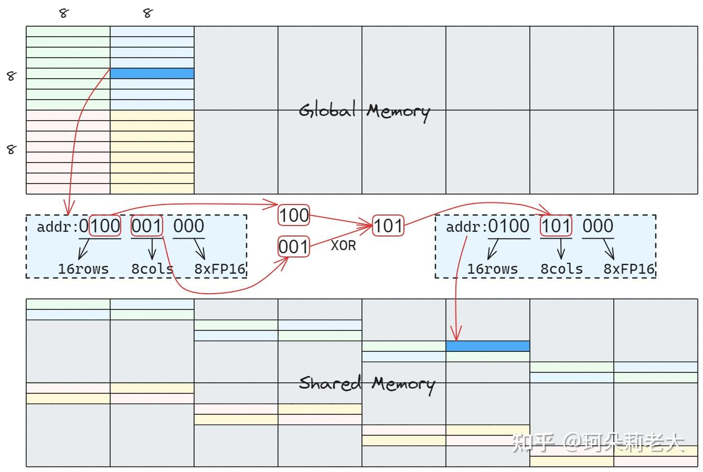

주의할 점은 그림의 주소가 실제로 `FP16` pointer의 offset이라는 것입니다. `8cols`가 나타내는 column은 실제로 `8*2B=16B`의 `bank4`, 즉 네 개의 `4B` bank로 형성된 하나의 column입니다.

그림에서 어렵지 않게 볼 수 있듯, 우리의 access pattern이 8x8 matrix이므로 `gAddr`의 row offset을 `sAddr`의 column offset에 작용시킵니다. 이렇게 하면 bank4 distribution을 나타내는 column offset bit가 `gAddr`의 row 정보를 포함하게 되고, 8x8 matrix의 각 row를 서로 다른 `bank4`에 성공적으로 분산할 수 있습니다.

따라서 `gAddr`에서 `sAddr`를 만들 때 우리는 주소의 다음 세 부분에 주목합니다.

- `MBase`: 하나의 block에 필요한 bit를 나타냅니다. 위 예에서는 3이고, 하나의 block은 8개의 `FP16`을 가집니다.
- `BBits`: bank distribution을 나타내는 bit입니다. 위 예에서는 3이고, 즉 middle 3 bit가 나타내는 8cols입니다.
- `SShift`: `gAddr` 정보를 포함하는 bit가 `BBits`로 이동하는 거리입니다. bank distribution `BBits`를 mapping하는 데 사용됩니다.

나아가 다음 방식으로 swizzle을 추상화할 수 있습니다.

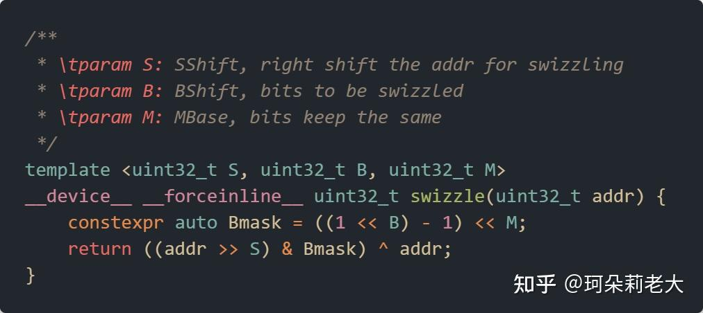

세 parameter를 template parameter로 사용해 compile-time 계산을 구현하면 Cpp(ComPile time Programming)의 장점을 잘 활용할 수 있습니다. 실제 runtime에는 `return` 부분의 overhead만 있음을 볼 수 있습니다. 이 bit operation 부분은 필자가 compiler를 믿기로 했습니다.

Elegant !!! 우리는 자신만의 swizzle을 성공적으로 구현했습니다. 이제 이 추상화를 사용해 사방을 정복해 봅시다. 흐흐~~~

## Swizzle 예시

이 부분에서는 몇 가지 예시로 실전에서 swizzle을 사용하는 방법을 설명합니다. 필자는 이 부분이 꽤 재미있을 것이라고 믿습니다(웃음). 이 부분은 16x16 matrix에 대해 ldmatrix load를 수행하는 관련 내용을 다룹니다. 익숙하지 않은 독자는 실용 Swizzle 튜토리얼 1편으로 돌아가 복습해도 좋습니다.

각 예시의 reference implementation은 실험 repository의 src/mma.cuh에서 볼 수 있습니다.

### 기본 사용법

- Problem 1.1: global memory에 FP16 type 16x16 matrix A와 integer n이 주어졌을 때, Tensor Core를 사용해 A의 n제곱을 계산하세요.
- Problem 1.2: global memory에 FP16 type matrix M이 주어지며, M은 두 개의 16x16 matrix A, B를 이어 붙인 16x32 matrix입니다. Tensor Core를 사용해 A와 B의 곱을 계산하세요.

Problem1.1의 핵심은 shared memory의 16x16 matrix에 conflict 없이 접근하는 것입니다. 지난 글과 이 글의 추상화를 거쳤으니, 독자는 가볍게 웃으며 아래 해법을 던질 수 있을 것입니다.

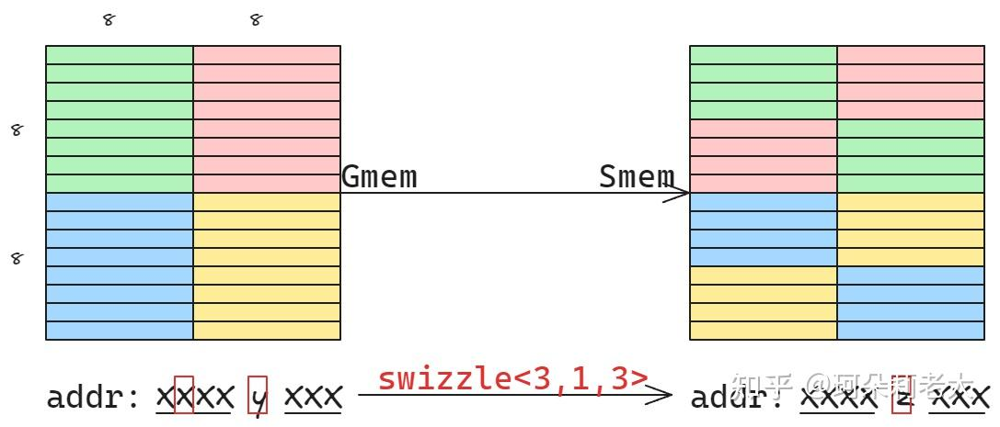

Problem1.2도 비슷합니다. 다만 두 개의 16x16을 하나의 전체로 보는 것입니다. 독자는 여전히 힘들이지 않고 아래 해법을 제시할 수 있습니다.

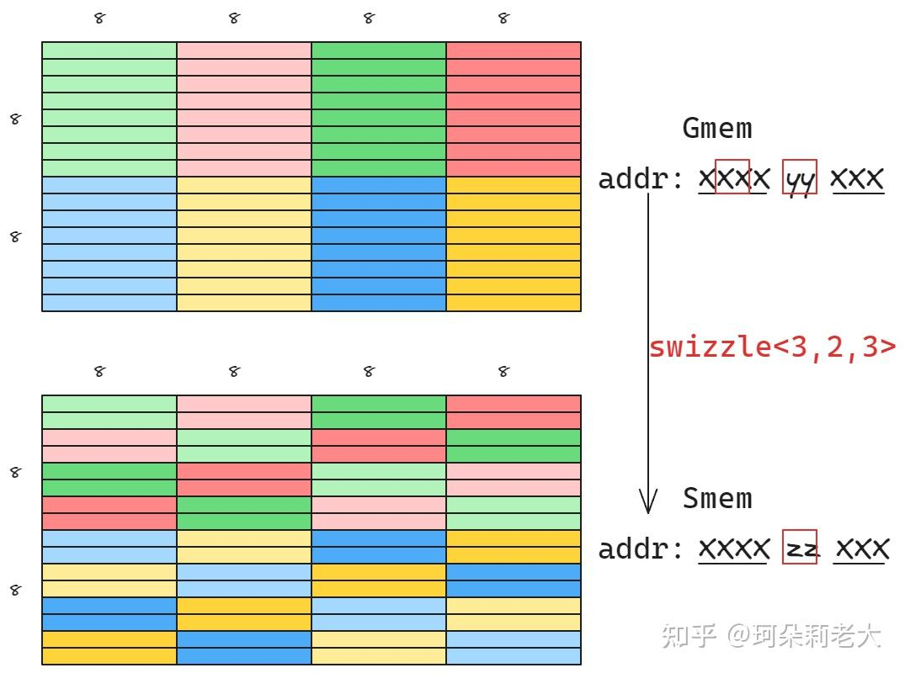

### Multi-layer Swizzle

- Problem 2.1: global memory에 FP16(half) type의 16x256 matrix A, B와 두 result storage address C1, C2가 주어지고, kernel launch configuration은 <<<1, dim3(32,16)>>>입니다. 즉 16개 warp를 사용해 계산합니다. 이제 다음 operation을 완료해야 합니다.
    - 16 column 단위로 각 16x16 matrix block에 대해 Tensor Core로 matrix multiplication Csub = Asub * Bsub^T를 수행한 뒤 global memory C1에 씁니다.
    - 각 row의 256개 element를 하나의 16x16 matrix block으로 보고, Tensor Core로 matrix multiplication Csub = Asub * Bsub^T를 수행한 뒤 global memory C2에 씁니다.

이 문제의 도식은 다음과 같습니다.

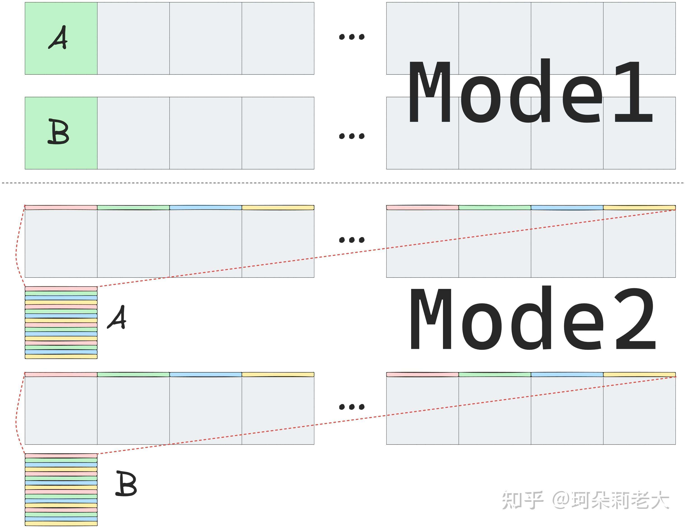

이 문제의 어려움은 두 access pattern의 conflict-free access를 동시에 지원하는 것입니다. 직관이 강한 독자라면 이미 깨달음을 얻는 느낌을 받았을지도 모릅니다...

우리는 먼저 첫 번째 sub-problem의 conflict-free access를 해결하기 위해 첫 번째 layer swizzle을 적용하는 것을 고려합니다. 아래 그림과 같습니다.

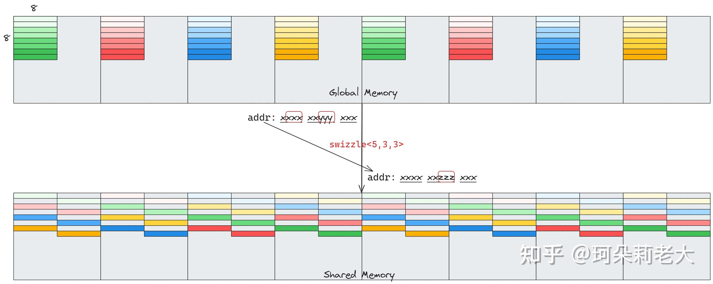

주의할 점은 이 pattern에서는 두 번째 sub-problem의 access에는 여전히 conflict가 존재한다는 것입니다. 첫 번째 row를 예로 들면, 예리한 독자는 이것이 Problem1.1과 같은 conflict를 만든다는 점을 이미 눈치챘을 수 있습니다. 그래서 우리는 흥미로운 생각을 하게 됩니다.

Swizzle을 한 layer 더 적용한다.

You get it!, 두 layer의 Swizzle을 연속으로 적용하면 두 pattern 모두에서 conflict-free access를 얻을 수 있습니다.

전체 과정은 아래 그림과 같습니다.

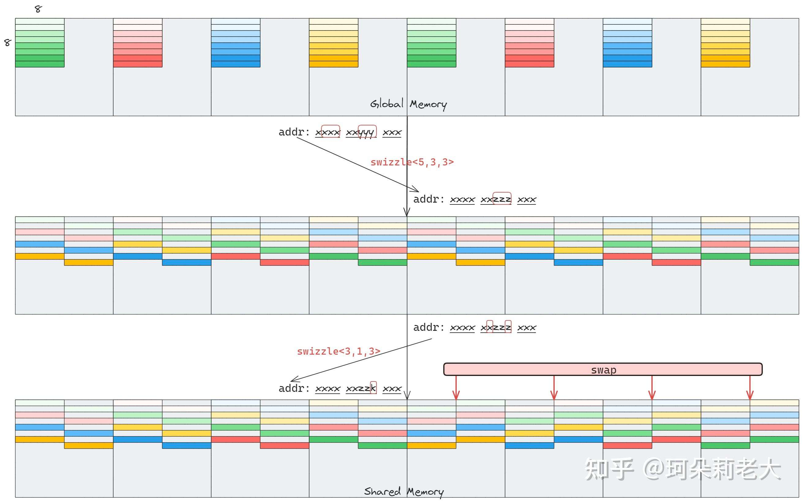


### Interleaving Swizzle

- Problem 3.1: global memory에 FP16(half) type의 16x256 matrix A, B와 result storage address C가 주어지고, kernel launch configuration은 <<<1, dim3(32,16)>>>입니다. 즉 16개 warp를 사용해 계산합니다. 이제 다음 operation을 완료해야 합니다.
    - 16 column 단위로 각 16x16 matrix block에 대해 Tensor Core로 matrix multiplication Csub = Asub * Bsub^T를 수행한 뒤 shared memory에 다시 씁니다.
    - 각 row의 256개 element를 하나의 16x16 matrix block으로 보고, Tensor Core로 matrix multiplication Csub = Asub * Bsub^T를 수행한 뒤 shared memory에 다시 씁니다.
    - shared memory의 내용을 global memory로 다시 씁니다.

세심한 독자는 이 예시도 Multi-layer Swizzle과 같은 기법으로 해결할 수 있음을 이미 발견했을 수 있습니다. 하지만 실제로는 더 재미있는 다른 방법도 있습니다. 여기서는 아이디어만 다음처럼 제공합니다.
    - 첫 번째 방식에만 Swizzle을 사용해 shared memory로 load한 뒤 첫 번째 sub-problem의 계산을 수행합니다.
    - 첫 번째 sub-problem 계산이 끝날 때, 두 번째 방식에 Swizzle을 사용해 shared memory에 다시 씁니다.
    - 두 번째 sub-problem의 계산을 수행하고, 끝난 뒤 두 번째 방식의 Swizzle로 shared memory에 다시 씁니다.
    - 두 번째 방식의 Swizzle로 shared memory의 내용을 global memory로 다시 씁니다.

주의할 점은 두 번째 단계에서 write back하기 전에 block 안에서 syncthreads()를 수행해야 한다는 것입니다. Swizzle 방식이 바뀌었기 때문에, write back할 주소의 첫 번째 단계 계산이 아직 끝나지 않았을 수 있습니다.

Interleaving Swizzle을 통해 operator의 전체 계산 과정에서 shared memory Layout을 마음대로 전환해 서로 다른 access pattern에 맞출 수 있고, bank conflict free의 세계에서 자유롭게 오갈 수 있습니다.

## 맺음말

Congratulations!!! 독자 여러분은 이제 자신만의 swizzle을 정의하고 사용하는 방법을 익혔고, bank conflict free의 세계를 마음껏 누빌 수 있으리라 믿습니다. 필자는 현 단계의 operator 최적화에서 swizzle이 이미 operator 장인들의 필수 도구 중 하나가 되었다고 생각합니다. 이 글도 입문자들이 관련 개념과 사용법을 정리하는 데 도움을 주기 위해 작성했습니다. 여러분께 도움이 되기를 바랍니다!

독자에게 다른 재미있는 문제나 활용법이 있다면 댓글 영역에 관련 생각을 남겨 주세요!
