# CUTLASS 2.x & CUTLASS 3.x Intro 학습 노트

> 원문: https://zhuanlan.zhihu.com/p/710516489

> CUTLASS GEMM 템플릿에는 조정·설정 가능한 템플릿 파라미터가 대량으로 존재하며, 이 파라미터 설정이 커널 성능에 크게 영향을 미칩니다. 본 글은 2.x에서 3.x로 넘어오면서 CUTLASS 커널 구현이 어떻게 변화했는지, 그리고 파라미터의 원리와 선택의 베스트 프랙티스를 소개합니다. 슬라이드는 BiliBili NVIDIA 채널의 《TensorRT-LLM의 Quantization GEMM(Ampere Mixed GEMM)의 CUTLASS 2.x 구현 강의》 영상에서 가져왔으며, 각 슬라이드의 요점을 더 자세히 기록했습니다. CUDA-MODE의 CUTLASS 과정의 선행 학습 자료로 삼을 만합니다.

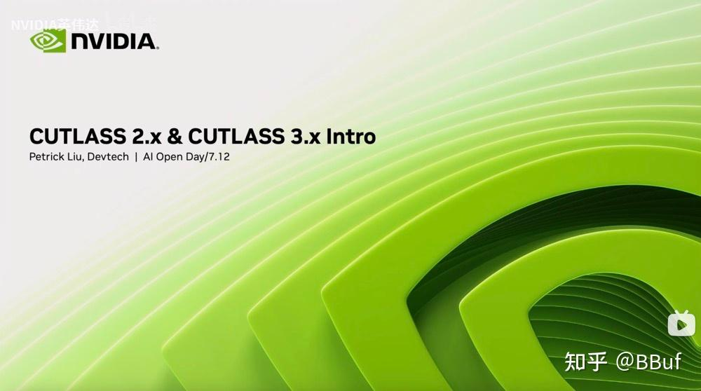

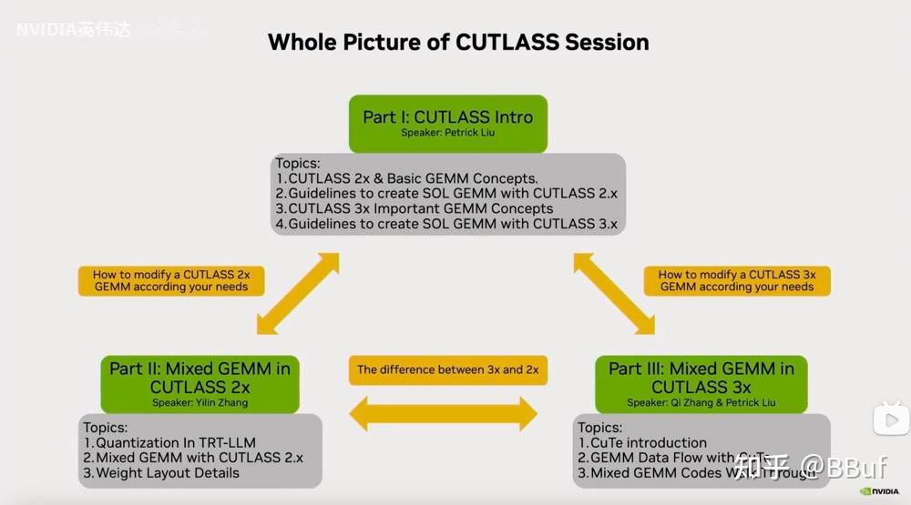

이 슬라이드는 CUTLASS 세션 전체 구조를 보여줍니다.

- **Part I: CUTLASS 소개** (발표자: Petrick Liu)
  - CUTLASS 2.x와 기본 GEMM 개념
  - CUTLASS 2.x로 SOL GEMM 만들기 가이드
  - CUTLASS 3.x의 중요 GEMM 개념
  - CUTLASS 3.x로 SOL GEMM 만들기 가이드
- **Part II: CUTLASS 2.x의 MixedGEMM** (발표자: Yilin Zhang)
  - TRT-LLM의 양자화
  - CUTLASS 2.x의 MixedGEMM
  - 가중치 layout 세부 사항
- **Part III: CUTLASS 3.x의 MixedGEMM** (발표자: Qi Zhang & Petrick Liu)
  - CuTe 소개
  - CuTe 기반 GEMM 데이터 흐름
  - MixedGEMM 코드 워크스루

슬라이드는 각 파트 간 관계도 보여줍니다 — 요구에 맞춰 CUTLASS 2.x·3.x GEMM을 수정하는 방법, 3.x와 2.x의 차이.

CUTLASS는 주로 커스텀 연산자 작성을 위한 것이지만, 학습 곡선이 매우 가파릅니다. CUTLASS를 아는 것과 실제로 CUTLASS로 동작하는 결과를 만드는 것 사이에는 큰 간격이 있습니다. Part II는 Hopper 이전 GPU에서 CUTLASS가 MixedGEMM을 어떻게 구현하는지, Part III는 Hopper 이후 CUTLASS 3.x에서의 MixedGEMM을 다룹니다.

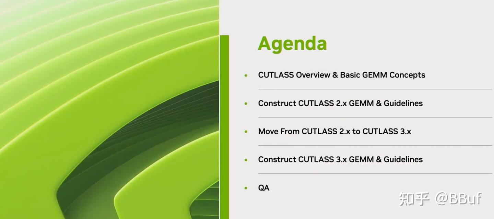

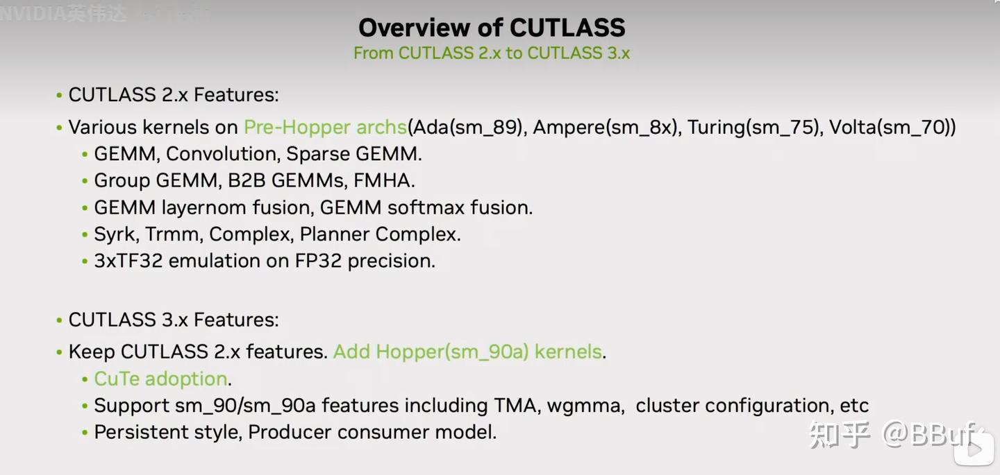

이 슬라이드는 CUTLASS(CUDA Templates for Linear Algebra Subroutines)가 2.x → 3.x로 오면서의 주요 특징·진화를 개관합니다.

**CUTLASS 2.x 특성:**

- Pre-Hopper GPU 지원: Ada(sm_89), Ampere(sm_8x), Turing(sm_75), Volta(sm_70)
- GEMM, convolution, sparse GEMM 등 핵심 기능 제공
- Group GEMM, B2B GEMMs, FMHA 지원
- GEMM LayerNorm/Softmax 융합
- Syrk, Trmm, Complex, Planar Complex 등 연산 지원
- FP32 정밀도에서 3xTF32 에뮬레이션 지원

**CUTLASS 3.x 특성:**

- 2.x의 모든 기능 유지 + Hopper(sm_90a) 지원
- **CuTe 추상** 채택
- sm_90/sm_90a 신기능(TMA, wgmma, cluster 등) 지원
- **Persistent style**과 **Producer-Consumer 모델** 도입

> CUTLASS 3.x는 코드 스타일에 큰 변화가 있습니다.

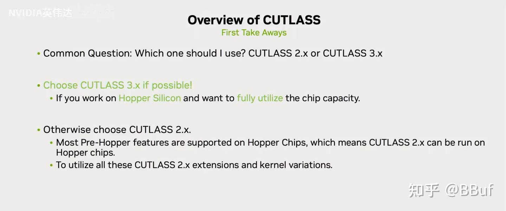

이 슬라이드는 CUTLASS 버전 선택 가이드입니다.

- **자주 묻는 질문**: CUTLASS 2.x와 3.x 중 무엇을 써야 할까?
- Hopper GPU에서 작업하고 칩 성능을 최대한 활용하려면 → **CUTLASS 3.x**
- 그 외에는 **CUTLASS 2.x**
  - Pre-Hopper 특성 대부분은 Hopper에서도 여전히 지원됨. 즉 2.x도 Hopper에서 동작
  - 2.x의 모든 확장과 커널 변형을 쓰려면 2.x

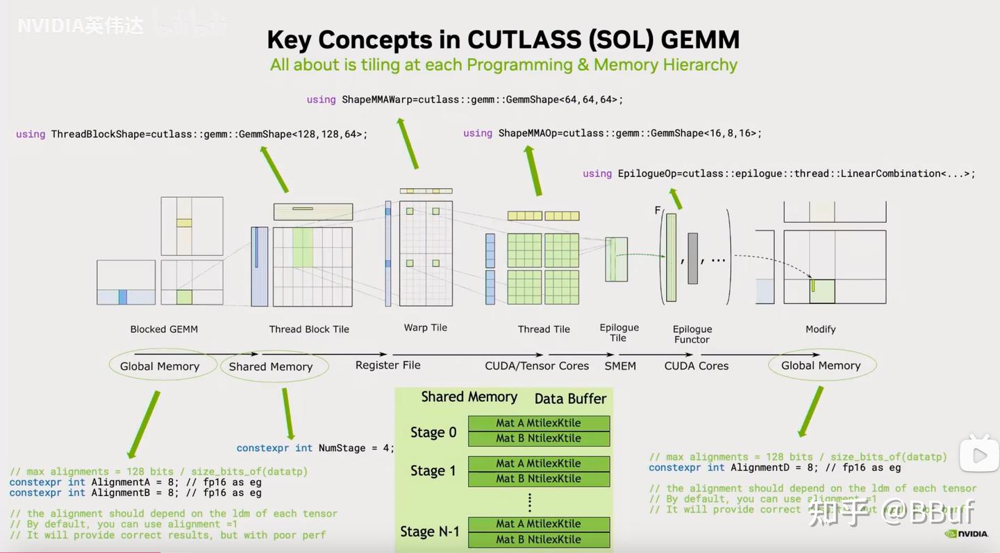

이 그림은 **CUTLASS GEMM의 핵심 개념도**입니다. C 행렬 관점에서 C를 작은 블록으로 자르고 각 block이 하나씩 담당하게 합니다. 그리고 warp를 지정해 block 안의 특정 블록(예: Thread Block Tile 그림의 녹색 부분)을 처리하게 합니다. 각 warp은 32 스레드. 각 스레드는 어떤 부분을 계산할까요? Warp Tile 그림은 확대해 보여주며, 그 안 4개 녹색 블록이 한 스레드가 담당할 C의 부분입니다. 마지막 thread 레벨에선 각자 레지스터로 작업합니다. 오른쪽 Epilogue는 많은 사람이 CUTLASS를 쓰는 첫 단계 — 예컨대 GEMM 뒤에 activation을 붙이는 후처리입니다. 마지막으로 데이터를 global memory로 써넣어 연산을 마무리합니다. 분할의 핵심 파라미터와 Epilogue 동작은 그림의 `using` 문으로 지정합니다.

이 그림은 CUTLASS의 개념뿐 아니라 **데이터 흐름**도 보여줍니다. 데이터는 global memory → shared memory → 레지스터로 단계적으로 전달됩니다. 타일링 외에 중요한 또 한 가지는 **고수준 캐시에 데이터를 최대한 재사용**하여 대역폭 이득을 얻고 global memory 접근을 줄이는 것입니다. 즉 데이터를 shared memory → 레지스터로 가져와 Tensor Core로 계산 후 다시 shared memory → global memory로 되돌립니다.

좌하·우하 영역은 global memory 읽기/쓰기 입도를 나타내며, FP16 기준 8(=128bit / 16bit)입니다. 타일링 외에 **오버랩**도 고려해야 합니다. `NumStage` 템플릿 파라미터로 계산·전송 오버랩을 위해 추가 버퍼를 얼마나 둘지 결정합니다(Double Buffering 참고). 위 파라미터들로 CUTLASS 커널을 완전히 구성할 수 있습니다.

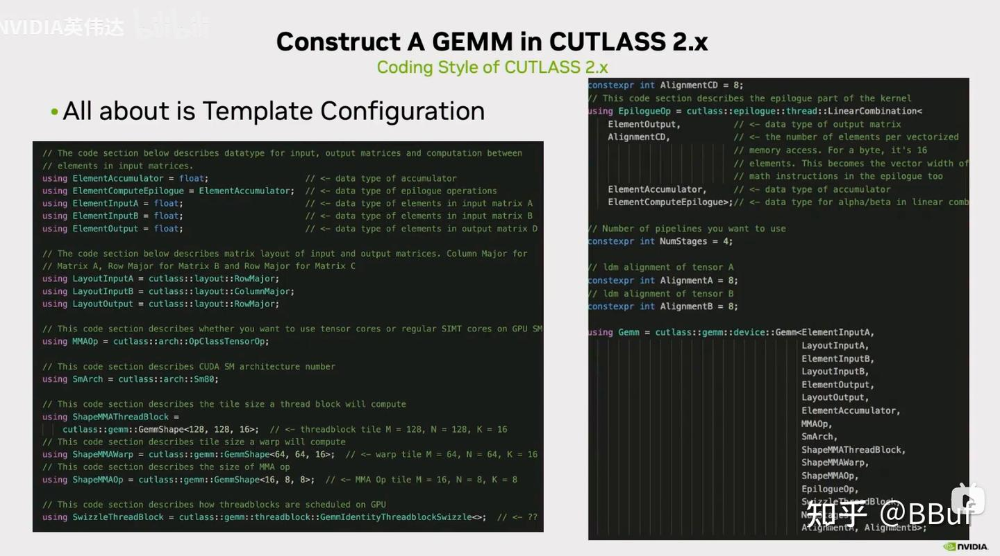

CUTLASS 2.x에서 GEMM을 구성하는 방법을 보여주는 슬라이드. 제목은 **"All about is Template Configuration"** — 모든 것이 템플릿 구성입니다.

CUTLASS 2.x GEMM의 구성 항목:

- **데이터 타입 정의**: 입출력 원소 타입, accumulator 타입, 후처리 타입
- **행렬 layout**: 입출력 row-major / column-major 정의
- **하드웨어 관련**: Tensor Core vs 일반 SIMT Core 선택, CUDA SM 아키텍처(예: SM80)
- **계산 관련**: thread block tile 크기, warp tile 크기, MMA 연산 크기, thread block 스케줄링 방식, C·D 메모리 정렬 요구, 파이프라인 stage 수, A·B 정렬

마지막으로 `Gemm` 타입 정의로 모든 구성을 묶어 **인스턴스화 가능한 Type**으로 만듭니다.

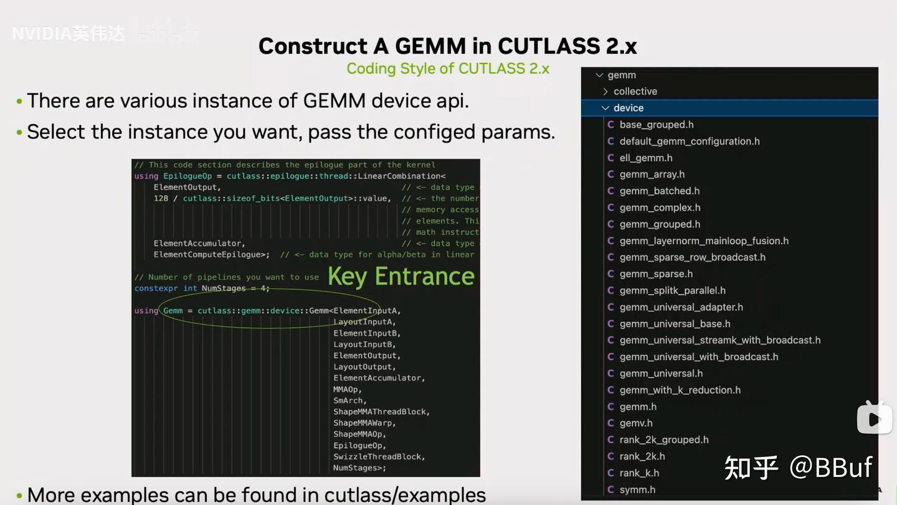

이 슬라이드는 적절한 GEMM 변형과 구성 파라미터를 골라 다양한 요구에 대응하는 방법을 보여줍니다. CUTLASS는 풍부한 GEMM 구현을 제공하므로 특수 상황·최적화 시나리오에 대응할 수 있습니다.

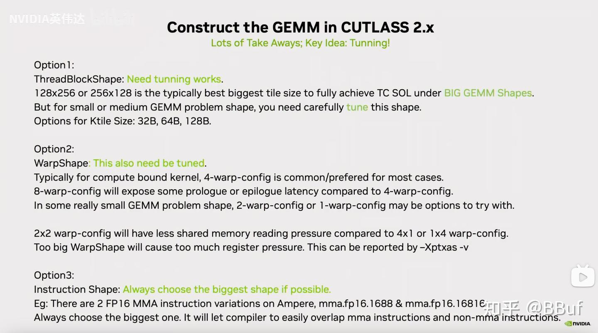

CUTLASS 2.x에서 GEMM을 만들 때 핵심 최적화 옵션들:

- **핵심**: 튜닝이 관건
- **Option 1: ThreadBlockShape**
  - 튜닝 필요
  - 대형 GEMM: `128×256` 또는 `256×128`가 보통 최적
  - 중·소형: 형상 세심히 조정
  - K 차원 tile 크기 옵션: 32B, 64B, 128B
- **Option 2: WarpShape**
  - 튜닝 필요
  - 계산 집약적 커널: **4-warp** 구성이 가장 일반적
  - 8-warp는 prologue/epilogue에 지연 가능
  - 매우 작은 GEMM: 2-warp·1-warp 시도
  - `2×2` 구성이 `4×1`/`1×4`보다 shared memory 읽기 압박 낮음
  - 너무 큰 WarpShape은 레지스터 압박. `-Xptxas -v`로 확인
- **Option 3: Instruction Shape**
  - 가능한 **가장 큰** shape 선택
  - 예: Ampere FP16 MMA는 `mma.fp16.16.8.8`과 `mma.fp16.16.16.16` 두 변형. 큰 것을 고르면 컴파일러가 MMA와 non-MMA를 더 쉽게 오버랩

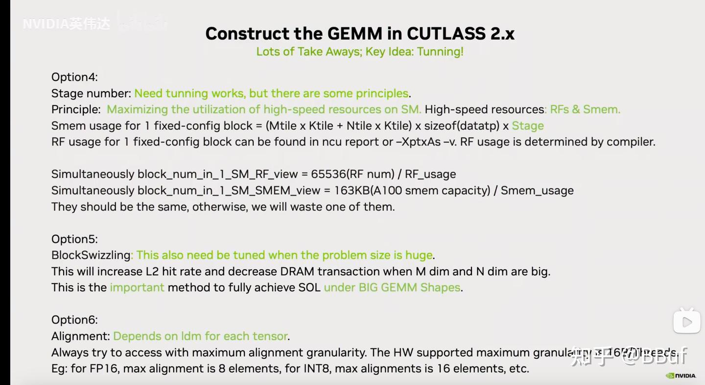

CUTLASS 2.x GEMM 최적화 옵션 추가.

- **Option 4: Stage number**
  - 튜닝 필요. 원칙은 SM의 고속 자원(RF·SMEM) 활용 극대화
  - Shared memory 사용량: `(Mtile × Ktile + Ntile × Ktile) × sizeof(dtype) × Stage`
  - 레지스터 사용량: ncu 리포트 또는 `-Xptxas -v`
  - SM당 동시 실행 block 수(RF 관점) = 65536 / (block당 RF 수)
  - SM당 동시 실행 block 수(SMEM 관점) = 163KB(A100 SMEM) / (block당 SMEM)
  - 두 값이 일치해야 함. 불일치하면 한쪽 자원이 병목이고 다른 쪽은 낭비. **RF와 SMEM 이용률을 동시에 최대화**가 핵심
- **Option 5: BlockSwizzling**
  - 문제 규모가 클 때 튜닝 필요
  - L2 캐시 히트율 향상, DRAM 트랜잭션 감소(특히 M·N 큰 경우)
  - 대형 GEMM의 **SOL(Speed Of Light)** 달성 핵심 수단
- **Option 6: Alignment**
  - 각 tensor의 `ldm`(leading dimension)에 의존
  - 항상 **최대 입도**로 접근 시도. HW 지원 최대는 **16B/스레드**
  - FP16: 8 원소, INT8: 16 원소 최대 정렬

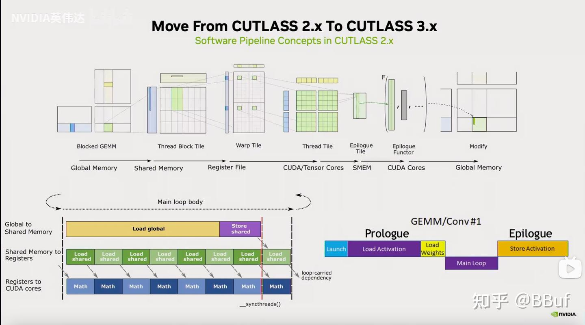

CUTLASS 2.x → 3.x의 아키텍처 변화. CUTLASS 2.0(Ampere 스타일)에서는 타일링·메모리 계층 재사용 외에 **소프트웨어 파이프라이닝**으로 global memory 읽기 지연을 계산으로 감추고자 합니다. 즉 현재 계산 중에 다음 라운드 데이터를 읽어오는 파이프라인. 정상 파이프라인 진입 전(Main loop body)에는 파이프라인 빌드업이 있습니다. 이 데이터 프리페치를 **Prologue**라 부르며, GEMM 전체는 **Prologue → Main Loop → Epilogue**로 나뉩니다. Tensor Core 계산은 Main Loop에서 일어납니다.

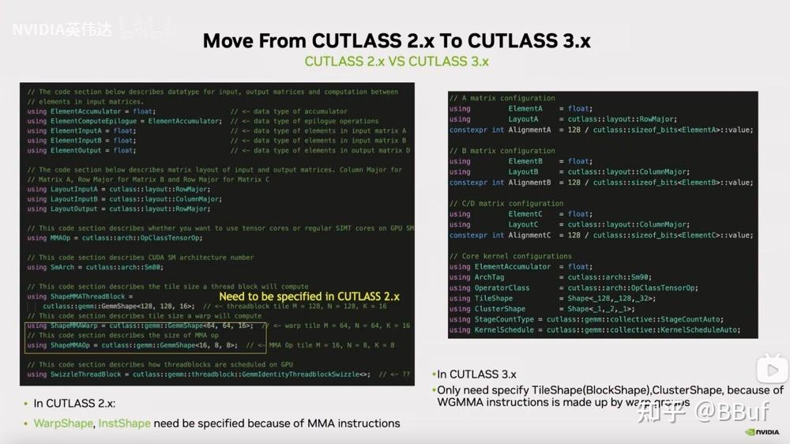

CUTLASS 2.x vs 3.x 설정 비교.

**CUTLASS 2.x**는 더 많은 구성을 명시해야 함:

- 입출력·계산 dtype, 행렬 layout, Tensor Core/SIMT, SM 버전
- thread block tile, warp tile, MMA 크기, 스케줄링 방식
- **WarpShape·InstShape 명시 필요** (MMA 명령과 연결)

**CUTLASS 3.x**는 더 간결:

- A·B·C/D의 원소 타입, layout, alignment
- 핵심 kernel 구성: accumulator, 아키텍처 태그, 오퍼레이션 클래스 등
- TileShape(BlockShape), ClusterShape
- **WarpShape·InstShape 명시 불필요** — WGMMA(Warp Group MMA)가 warp group 단위

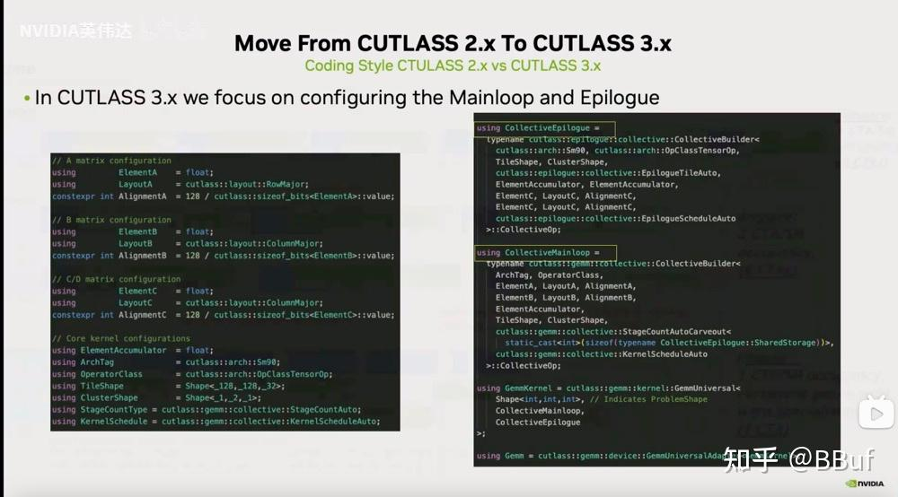

CUTLASS 3.x에서는 **CollectiveEpilogue**(후처리: 아키텍처, tile 형상, accumulator 타입 등)와 **CollectiveMainloop**(주 루프: 아키텍처 태그, 오퍼레이션 클래스, 행렬 구성, tile 형상 등)을 정의하고, 이 둘을 조합해 **GemmKernel**을 정의한 뒤 `GemmUniversalAdapter`로 **Gemm**을 마무리합니다. 2.x 대비 **추상 수준이 높아** 수동 지정 파라미터가 줄었습니다.

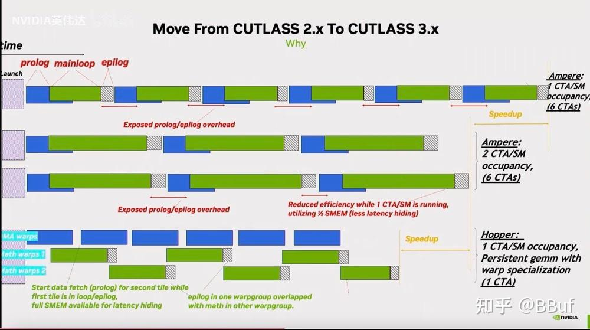

2.x → 3.x 진화의 이유: Ampere vs Hopper의 GEMM 실행 효율 비교.

- **Ampere (1 CTA/SM, 6 CTAs)**: prolog/mainloop/epilog 타임라인. prolog/epilog 오버헤드가 노출되어 효율 저하
- **Ampere (2 CTA/SM, 6 CTAs)**: 여전히 prolog/epilog 노출되나 개선됨. 1 CTA/SM일 땐 SMEM 절반만 활용되어 지연 은폐 약화
- **Hopper (1 CTA/SM, Persistent GEMM + Warp Specialization)**: 새 실행 모델 도입
  - Persistent GEMM: CTA가 SM을 지속 점유
  - Warp specialization: 서로 다른 warp 그룹이 다른 작업 수행
  - 첫 tile의 loop/epilog 단계에서 두 번째 tile의 데이터 fetch(prolog) 시작
  - SMEM을 지연 은폐에 최대 활용
  - 한 warp 그룹의 epilog를 다른 warp 그룹의 수학 연산과 오버랩

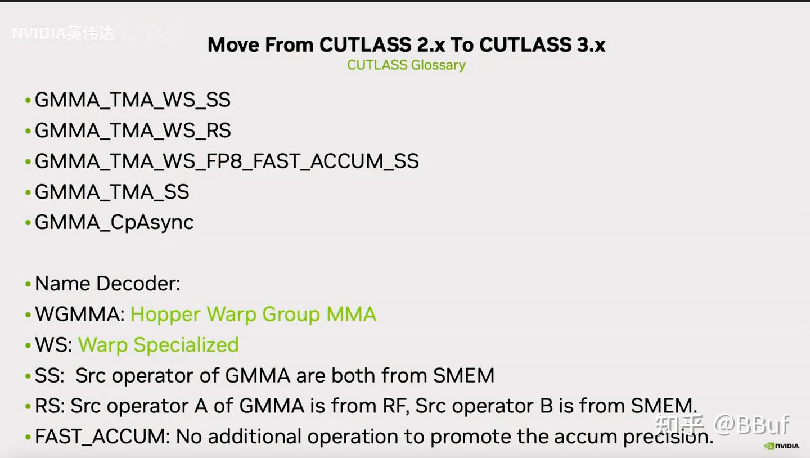

CUTLASS 용어·약어:

- **WGMMA**: Hopper Warp Group MMA
- **WS**: Warp Specialized — 다른 warp이 다른 전용 작업 수행
- **SS**: GMMA의 두 source operand 모두 SMEM에서
- **RS**: A는 RF, B는 SMEM
- **FAST_ACCUM**: accumulator 정밀도 향상을 위한 추가 동작 없음

> 아래부터 **Construct CUTLASS 3.x GEMM & Guidelines**.

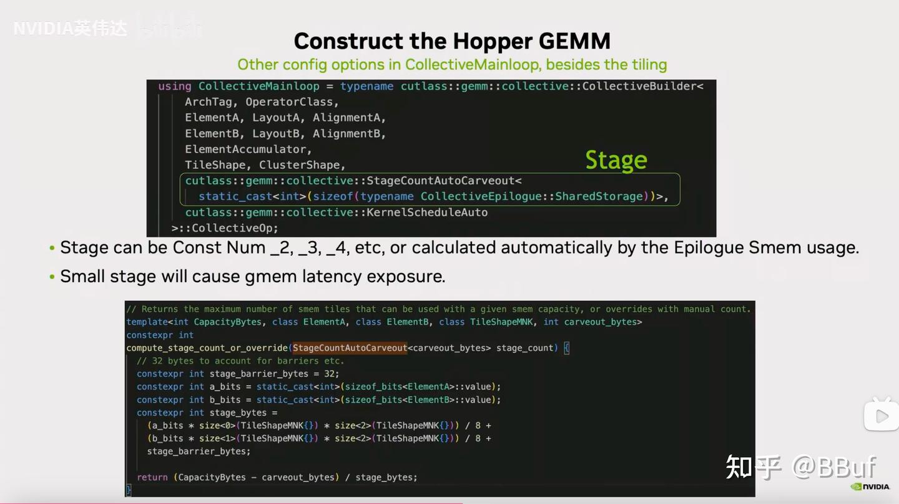

CUTLASS 3.x Hopper GEMM 구성 시 `CollectiveMainloop`의 **Stage 설정 옵션**. Stage는 `_2`, `_3`, `_4` 등 고정 상수로 지정하거나 Epilogue SMEM 사용량으로 자동 계산 가능. **주의**: 작은 Stage는 gmem 지연을 노출시킬 수 있음.

아래 코드는 `compute_stage_count_or_override` 함수로 최대 가용 Stage 수를 계산합니다.

- barrier 추가 바이트(32바이트) 고려
- 각 stage에 필요한 바이트 수 계산(A·B 행렬 데이터)
- 총 용량과 stage당 크기로 가용 stage 수 계산

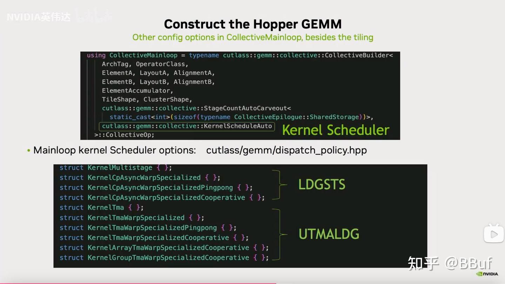

CollectiveMainloop 구성 코드. 특히 `KernelScheduleAuto` 파라미터 강조. Mainloop kernel scheduler 옵션은 `cutlass/gemm/dispatch_policy.hpp`에 정의되어 있고, Kernel Scheduler 타입은 **LDGSTS**(Ampere용)와 **UTMALDG**(Hopper용) 두 가지 비동기 명령 계열을 포함. UTMALDG가 가능하면 그것을 선택하는 게 더 빠름.

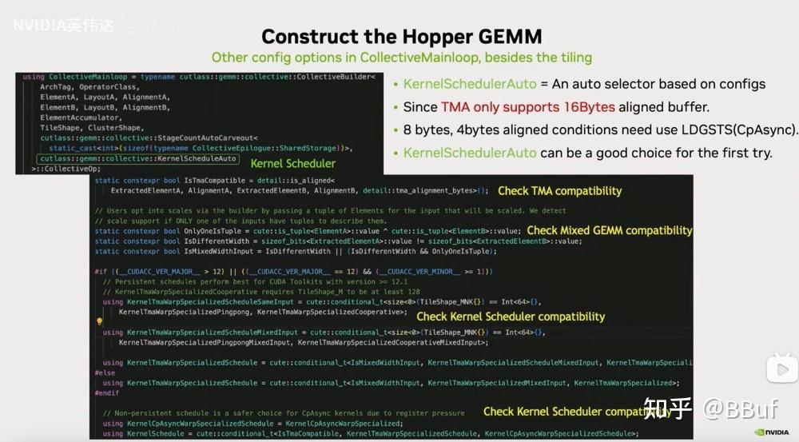

CUTLASS 3.x Hopper GEMM에서 **CollectiveMainloop의 Kernel Scheduler** 자동 선택 메커니즘.

- **KernelSchedulerAuto**: 구성 기반 자동 선택기. 첫 시도로 추천
- **TMA 제한**: TMA는 16B 정렬 버퍼만 지원. 8B/4B 정렬이면 LDGSTS(CpAsync) 필요
- 구현: `constexpr bool` 컴파일 타임 체크, CUDA 툴킷 버전별 다른 스케줄. CUDA 12.1 이상에선 persistent schedule이 최고 성능. `KernelTmaWarpSpecializedCooperative`는 `TileShape_M ≥ 128` 요구

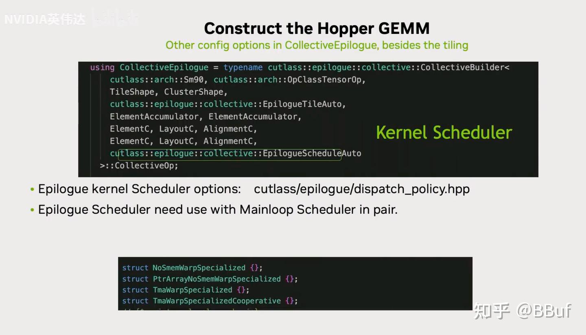

`CollectiveEpilogue` 구성 옵션. `EpilogueScheduleAuto`는 Epilogue의 kernel 스케줄러. `cutlass/epilogue/dispatch_policy.hpp`에 정의. **Epilogue Scheduler는 Mainloop Scheduler와 짝지어 사용**. CUTLASS 3.x에서 `EpilogueScheduleAuto`는 항상 유효한 커널을 보장. 선택 가능한 타입:

- `NoSmemWarpSpecialized`
- `PtrArrayNoSmemWarpSpecialized`
- `TmaWarpSpecialized`
- `TmaWarpSpecializedCooperative`

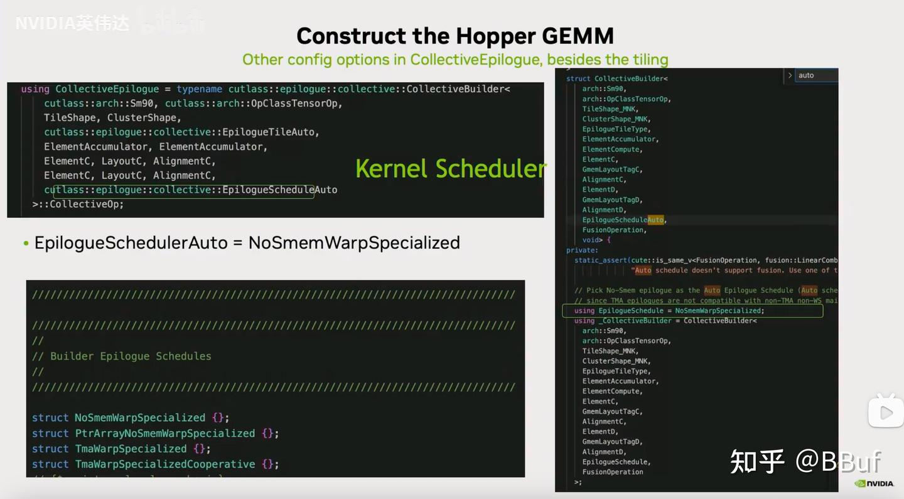

`EpilogueScheduleAuto`는 `NoSmemWarpSpecialized` Epilogue Scheduler를 추론하는데, 효율이 낮은 편임을 주의.

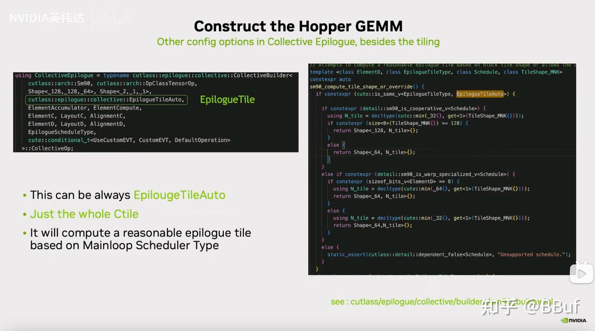

CUTLASS 3.x Hopper GEMM `CollectiveEpilogue`의 **EpilogueTile 설정**. `EpilogueTileAuto`를 항상 써도 좋음 — 이는 전체 CTile에 해당하며 Mainloop Scheduler 타입에 따라 합리적 epilogue tile을 계산함.

오른쪽은 `sm90_compute_tile_shape_or_override` 구현. 조건별 자동 계산:

- **cooperative 스케줄**: `TileShape_M ≥ 128`이면 `Shape<128, N_tile>`, 아니면 `Shape<64, N_tile>`
- **warp specialized 스케줄**: `ElementD`가 8B면 `Shape<64, N_tile>`, 아니면 `Shape<64, N_tile>`(`N_tile` 계산 방식 다름)

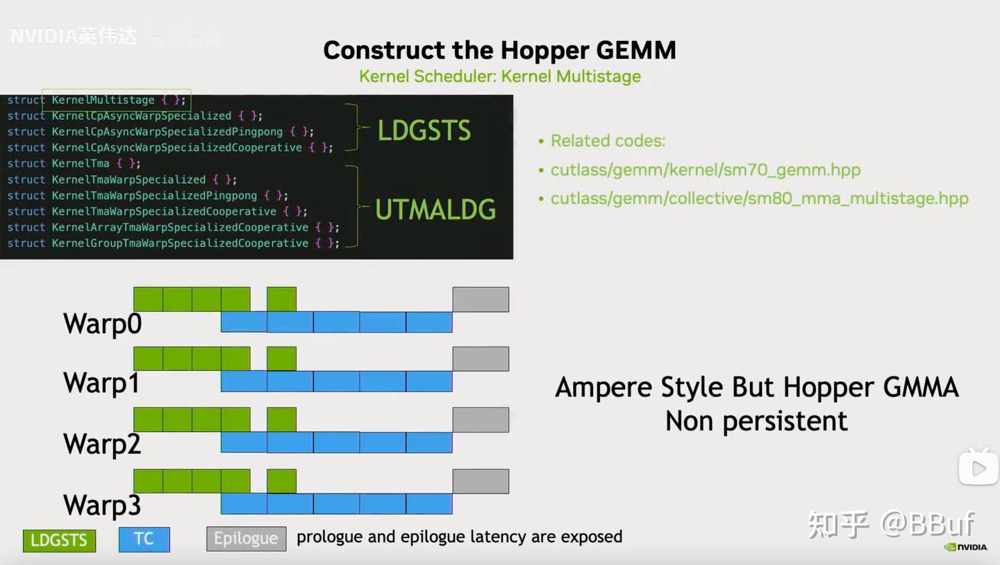

Hopper GEMM의 Kernel Scheduler 중 **KernelMultistage**.

- 두 계열: **LDGSTS**(Load Global Store Shared), **UTMALDG**(Unified TMA Load Global)
- 관련 코드: `cutlass/gemm/kernel/sm70_gemm.hpp`, `cutlass/gemm/collective/sm80_mma_multistage.hpp`
- 실행 모델: 4 warp(Warp0~Warp3), 각 warp 단계가 **LDGSTS(녹) → TC(청) → Epilogue(회)**
- prologue·epilogue 지연 **노출됨**
- "Ampere Style But Hopper GMMA" — Ampere 스타일에 Hopper GMMA 사용
- **Non persistent** 실행

> 각 warp이 같은 일을 하며, 청색 블록 앞 녹색 블록 수가 `num_stages`(프리페치).

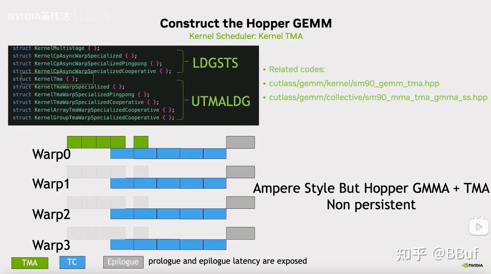

Hopper GEMM의 **Kernel TMA (Tensor Memory Access)** 스케줄러.

- 코드: `cutlass/gemm/kernel/sm90_gemm_tma.hpp`, `cutlass/gemm/collective/sm90_mma_tma_gmma_ss.hpp`
- 실행: 4 warp, 각 warp은 TMA(녹, **Warp0만 수행**) → TC(청) → Epilogue(회)
- "Ampere Style But Hopper GMMA + TMA"
- **Non persistent**
- prologue/epilogue 지연 **여전히 노출**
- **Warp0만 TMA 수행** → 더 효율적 메모리 접근
- KernelMultistage와의 차이: LDGSTS 대신 **TMA**, Warp0에 TMA 집중

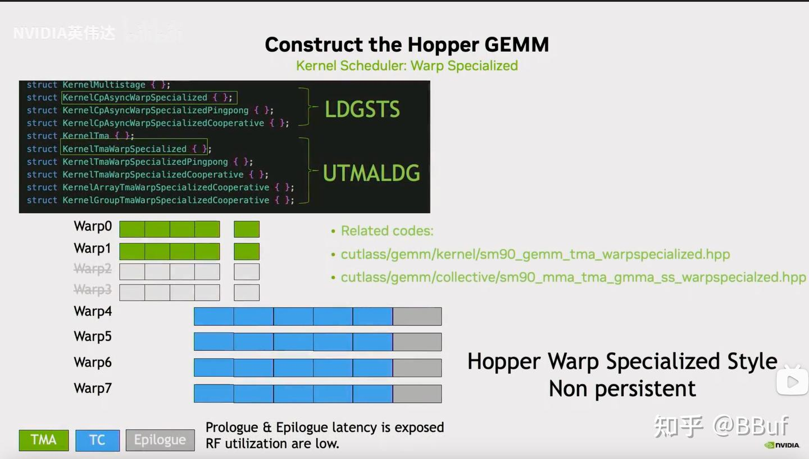

Hopper GEMM의 **Warp Specialized** 스케줄러.

- 코드: `cutlass/gemm/kernel/sm90_gemm_tma_warpspecialized.hpp`, `cutlass/gemm/collective/sm90_mma_tma_gmma_ss_warpspecialized.hpp`
- 실행: 8 warp(Warp0~Warp7)
  - **Warp0·Warp1**: TMA 전담(녹)
  - **Warp2·Warp3**: 유휴(회)
  - **Warp4~Warp7**: TC(청) + Epilogue(회) 전담
- "Hopper Warp Specialized Style"
- **Non persistent**
- prologue/epilogue 지연 여전히 노출, RF 이용률 낮음
- 명확한 warp 분업: 메모리 담당 / 계산 담당
- TMA 효율 우수

> Warp Specialized 스케줄러는 Tensor Core 계산과 Epilogue가 아직 오버랩되지 않아, Tensor Core 잠재력을 완전히 끌어내지 못함.

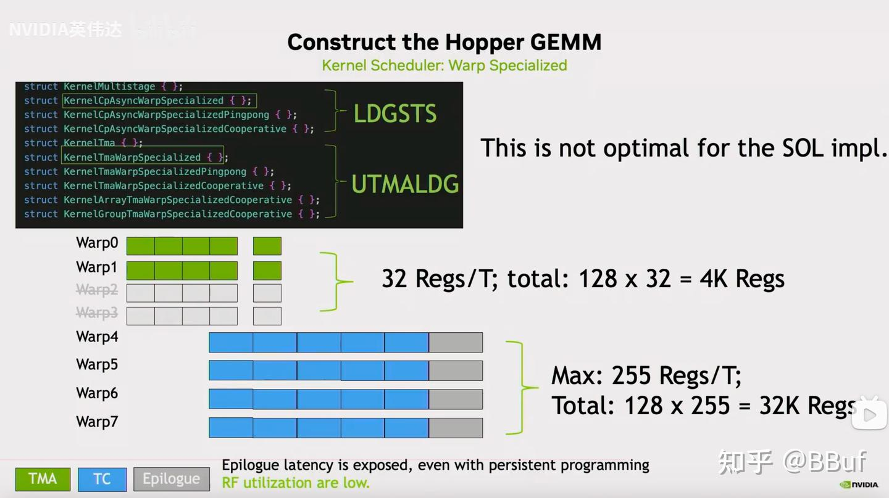

레지스터 분석 보충:

- **TMA warps (Warp0·1)**: 스레드당 32 레지스터, 총 `128 × 32 = 4K`
- **TC warps (Warp4~7)**: 스레드당 최대 255 레지스터, 총 `128 × 255 = 32K`

"This is not optimal for the SOL impl." — Epilogue 지연 여전히 노출되고 persistent 프로그래밍 사용해도 RF 이용률 낮음.

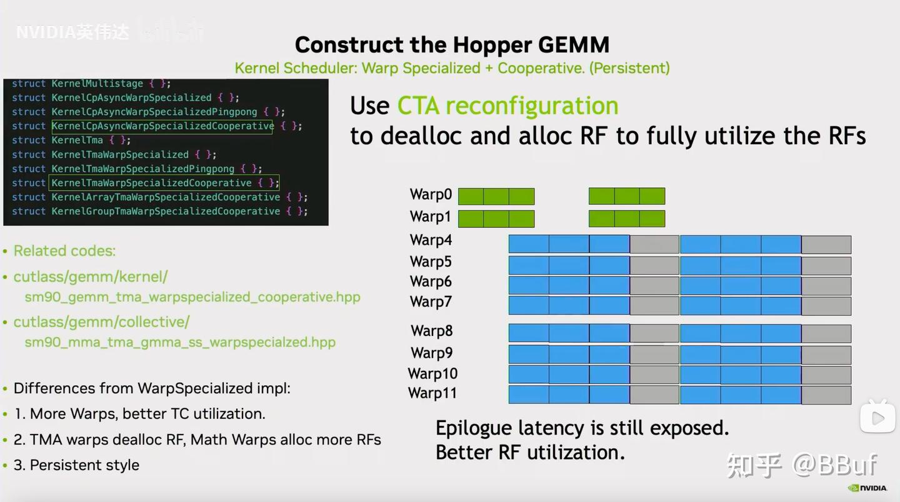

Hopper GEMM의 **Warp Specialized + Cooperative (Persistent)** 스케줄러.

- 코드: `cutlass/gemm/kernel/sm90_gemm_tma_warpspecialized_cooperative.hpp`, `cutlass/gemm/collective/sm90_mma_tma_gmma_ss_warpspecialized.hpp`
- 핵심: **"Use CTA reconfiguration to dealloc and alloc RF to fully utilize the RFs"** — CTA 재구성으로 RF를 해제·할당해 레지스터 자원 최대 활용
- 일반 WarpSpecialized와 차이:
  - 더 많은 warp, 더 나은 TC 활용률
  - TMA warp은 RF 해제, 수학 warp은 더 많은 RF 할당
  - Persistent style
- Epilogue 지연 여전히 노출되나 RF 이용률 향상

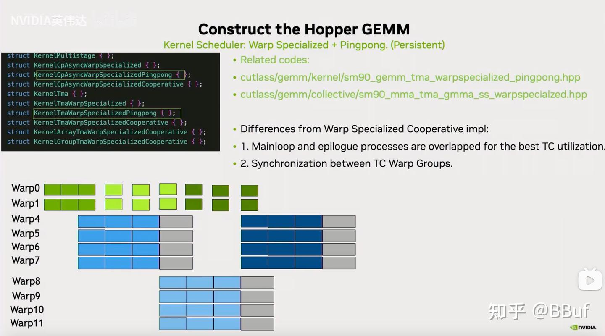

Hopper GEMM의 **Warp Specialized + Pingpong (Persistent)** 스케줄러.

- 코드: `cutlass/gemm/kernel/sm90_gemm_tma_warpspecialized_pingpong.hpp`, `cutlass/gemm/collective/sm90_mma_tma_gmma_ss_warpspecialized.hpp`
- WS Cooperative와의 주요 차이:
  - Mainloop와 epilogue **오버랩** → TC 활용 최적
  - TC Warp 그룹 간 동기화
- 실행 모델: 12 warp (Warp0~Warp11)
  - Warp0·1: TMA(녹), **pingpong 교차**
  - Warp4~Warp11: TC(연청·진청) + Epilogue(회), 교차 진행

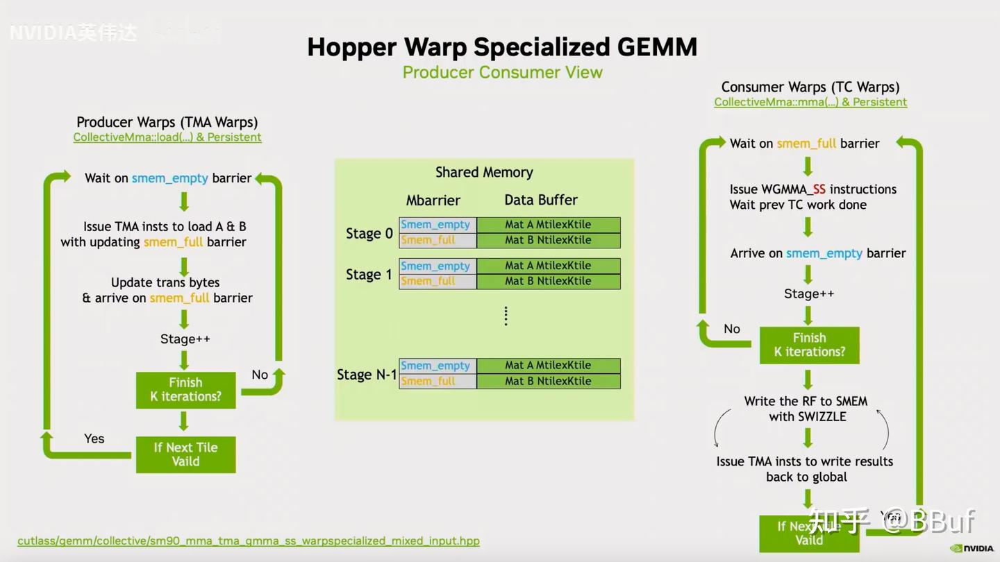

Hopper Warp Specialized GEMM의 **Producer-Consumer 모델**.

- 코드: `cutlass/gemm/collective/sm90_mma_tma_gmma_ss_warpspecialized_mixed_input.hpp`
- Producer(TMA) Warp + Consumer(TC) Warp — shared memory로 교환

**Producer Warps (TMA Warps)**:

- `CollectiveMma::load(...) & Persistent` 사용
- `smem_empty` barrier 대기
- TMA 명령으로 A·B 로드, `smem_full` barrier 업데이트
- 전송 바이트 수 업데이트하고 `smem_full` barrier 도달
- K회 반복

**Consumer Warps (TC Warps)**:

- `CollectiveMma::mma(...) & Persistent` 사용
- `smem_full` barrier 대기
- WGMMA_SS 명령 발행, 이전 TC 작업 완료 대기
- `smem_empty` barrier 도달
- K회 반복
- SWIZZLE로 RF → SMEM 쓰기
- TMA 명령으로 결과를 global memory로 저장

**공유 메모리 구조**:

- Mbarrier + Data Buffer
- 각 stage에 두 버퍼: `Mat A MtilexKtile`, `Mat B NtilexKtile`
- `smem_empty`·`smem_full` 플래그로 Producer·Consumer 동기화

**실행 흐름**: Producer·Consumer가 교차 작업, shared memory + barrier로 동기화. 여러 stage(0 ~ N-1)로 파이프라인. 모든 tile 완료까지 반복.

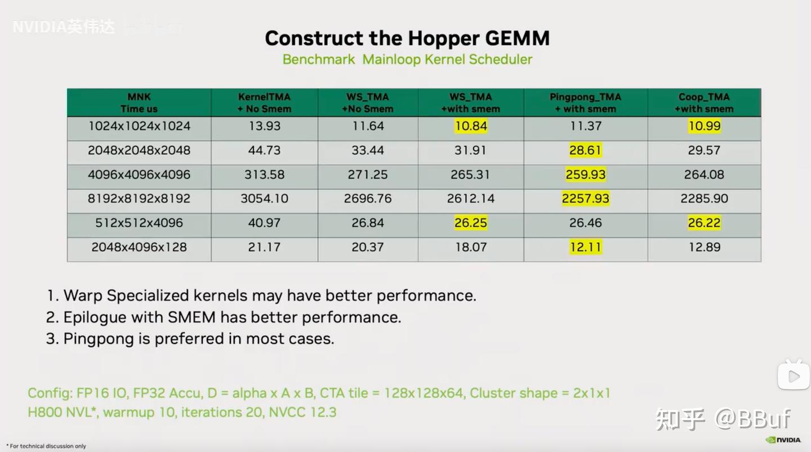

Hopper GEMM 스케줄러별 성능 벤치마크.

- 6가지 행렬 크기, 5가지 스케줄러(KernelTMA, WS_TMA(w/·w/o smem), Pingpong_TMA, Coop_TMA) 비교
- 노란색 강조: 각 행의 최고 성능
- 일반 관찰:
  - Warp Specialized 계열이 일반적으로 더 빠름
  - SMEM을 쓰는 Epilogue가 유리
  - 대부분 **Pingpong 전략 선호**
  - 큰 행렬(예: 8192³)은 Pingpong_TMA가 유의미하게 우위
  - 일부 크기(예: 1024³)은 WS_TMA w/ smem 최고
  - KernelTMA + No Smem은 전반적으로 열세
- 조건: FP16 입력, FP32 accumulate, `D = α × A × B`, CTA tile 128×128×64, Cluster 2×1×1, H800 NVL, warmup 10, iter 20, NVCC 12.3

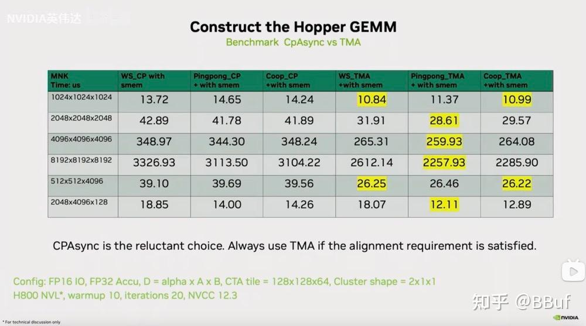

Hopper에서 **CpAsync vs TMA**. 대부분의 경우 TMA가 CpAsync보다 우수, TMA 중에서도 Pingpong_TMA가 보통 최고(특히 대형). **"CPAsync is the reluctant choice. Always use TMA if the alignment requirement is satisfied."** — 정렬 요구가 충족되면 TMA.

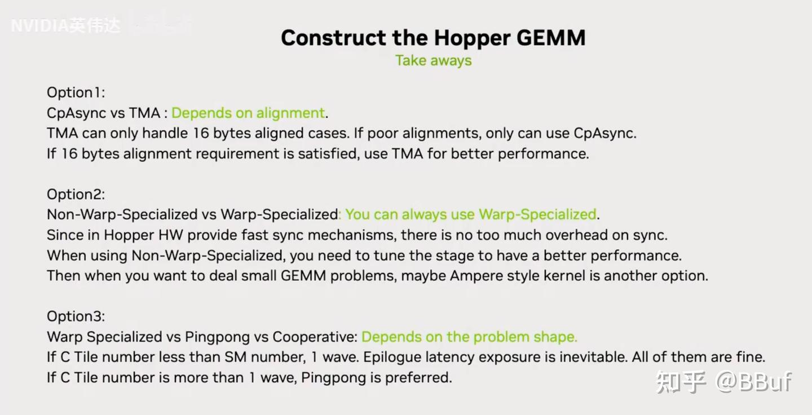

Hopper GEMM 구성의 핵심 결정·권장 사항 요약.

- **Option 1: CpAsync vs TMA**
  - 메모리 정렬에 의존. TMA는 16B 정렬만 처리. 정렬이 나쁘면 CpAsync. 16B 정렬 충족 시 **TMA 사용**
- **Option 2: Non-Warp-Specialized vs Warp-Specialized**
  - 항상 **Warp-Specialized 사용**. Hopper의 빠른 동기화 메커니즘 덕에 동기화 오버헤드 작음
  - Non-WS는 stage를 더 조정해야 성능 확보. 소형 GEMM은 Ampere 스타일 커널 고려
- **Option 3: Warp Specialized vs Pingpong vs Cooperative**
  - 문제 형상에 따라. C Tile 수가 SM 수 미만(1 wave)이면 epilogue 노출 불가피 — 셋 다 가능. 1 wave 초과면 **Pingpong 추천**

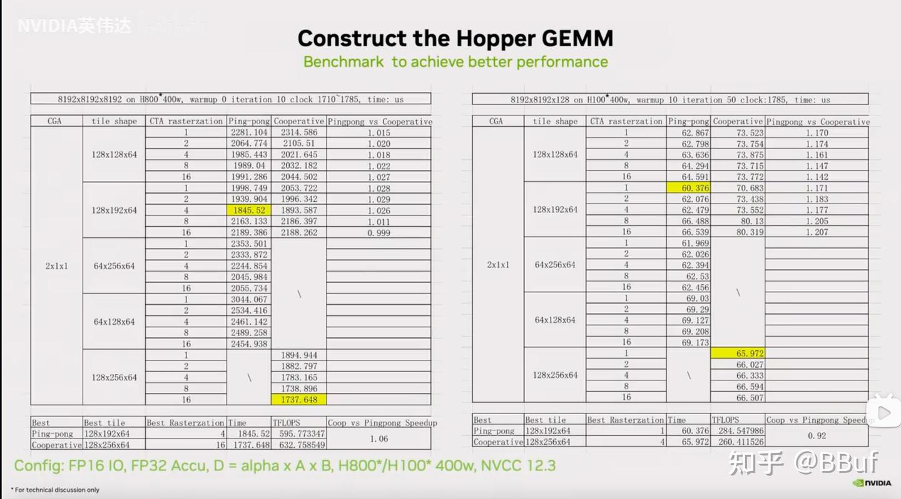

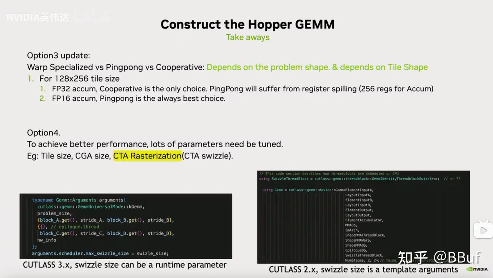

마지막 슬라이드는 Hopper GEMM 구성의 두 결정 지점을 이어서 논의.

- **Option 3 업데이트**: WS vs Pingpong vs Cooperative. 문제 형상·tile 크기에 따라:
  - `128×256` tile:
    - FP32 accumulate → Pingpong은 레지스터 스필 발생, **Cooperative가 유일한 선택**
    - FP16 accumulate → **Pingpong이 항상 최적**
- **Option 4**: 추가 튜닝 파라미터
  - Tile size, CGA(Cooperative Grid Array) size, CTA swizzle 등

코드 예시는 CUTLASS 3.x와 2.x에서 swizzle size 처리 차이:

- **3.x**: swizzle size가 런타임 파라미터
- **2.x**: swizzle size가 템플릿 파라미터

## 정리

CUTLASS 라이브러리는 2.x → 3.x로 넘어오며 NVIDIA GPU 아키텍처(Ampere → Hopper)에 대응해 큰 변화를 겪었습니다. 3.x는 **persistent 프로그래밍 스타일**과 **warp specialization**을 강조하여 계산 자원을 최대 활용하고 성능을 최적화합니다.

GEMM 구성 시, 2.x는 dtype, tile 크기 등 많은 저수준 파라미터를 수동 지정해야 하지만 3.x는 더 높은 추상을 제공해 단순화됩니다.

Hopper에서 CUTLASS를 쓴다면 3.x를 권장하며, 베스트 프랙티스:

- 메모리 접근은 **CpAsync보다 TMA** 우선
- **Warp Specialized** 커널 우선
- 문제 규모에 따라 **Warp Specialized / Pingpong / Cooperative** 중 가장 적합한 것 선택
- **BlockShape, ClusterShape, CTA swizzle** 등으로 추가 최적화

**End!**
