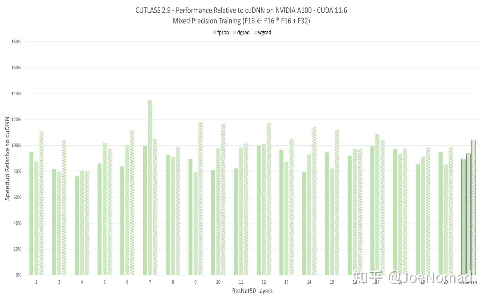
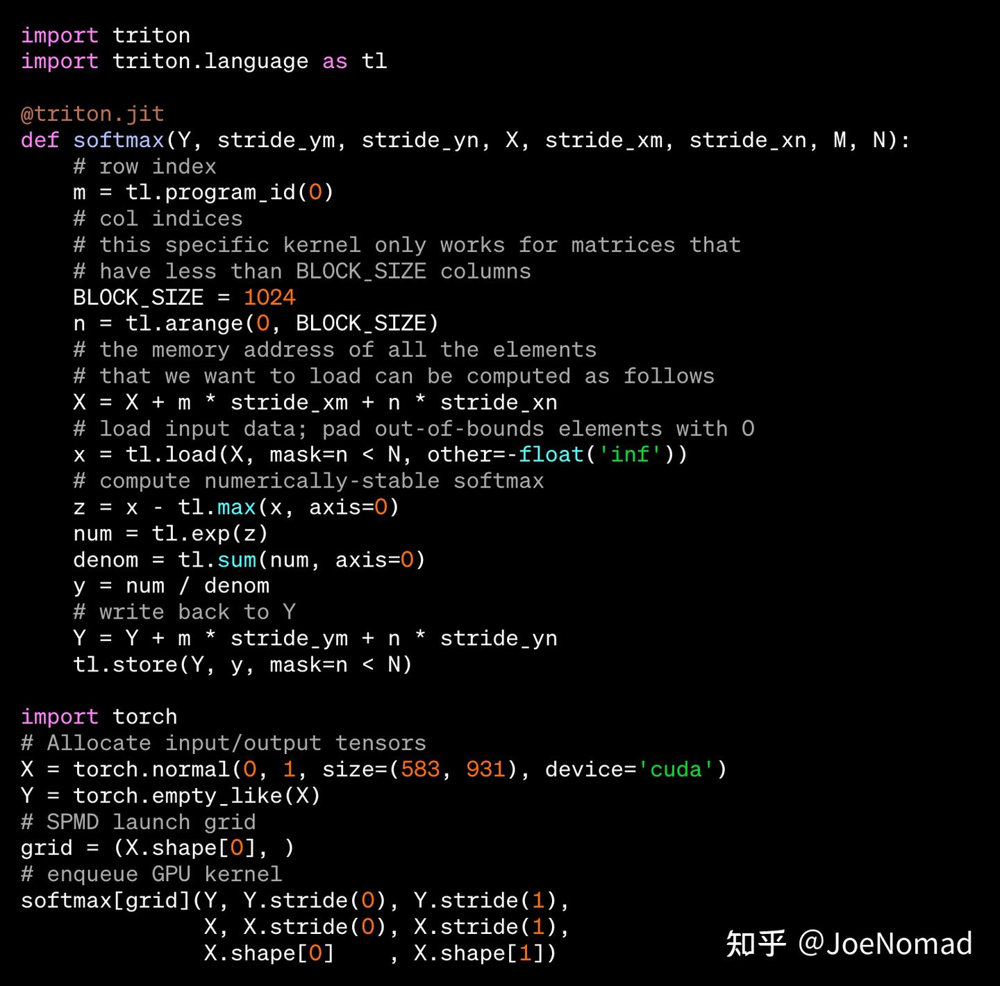
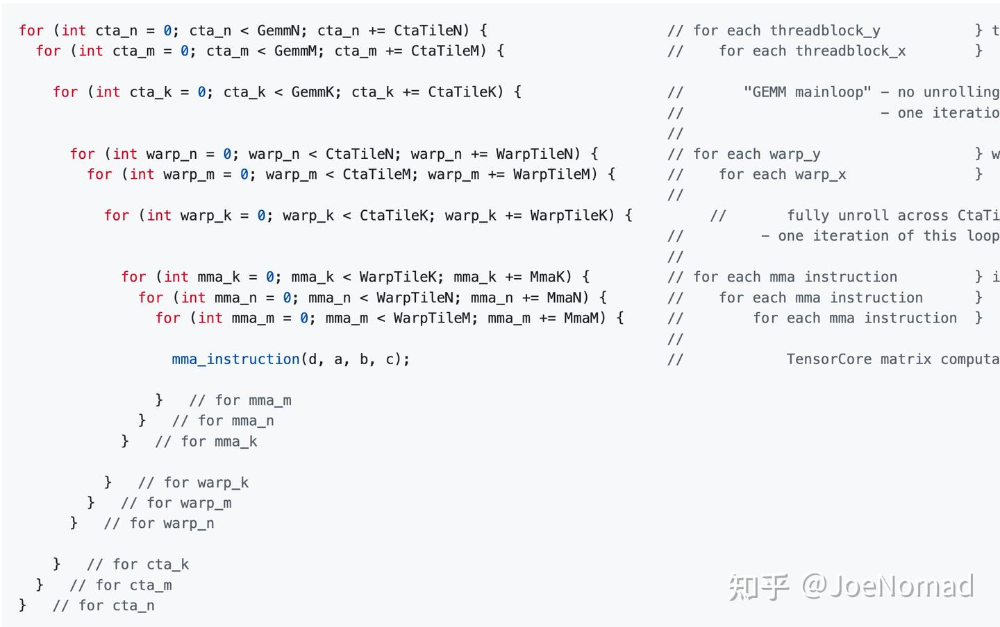

# [CUTLASS 심층 분석 시리즈] 0x00 — CUTLASS 기본 인식 — 왜 CUTLASS를 써야 하나

> 원문: https://zhuanlan.zhihu.com/p/677616101

## 시작

저는 AI 컴파일러 종사자 Joe입니다. 작업 일부가 dense 계산 성능 문제 해결이며, CUTLASS 오픈소스에 코드 기여 경험도 있습니다. CUTLASS는 현재 GPU dense 계산 분야에서 가장 우수한 오픈소스 작업 중 하나이며, 다양한 AI 프레임워크에 광범위하게 적용되어 있습니다. 본 시리즈는 high level부터 low level까지 CUTLASS를 전면 분석합니다. 첫 글은 **high level 관점에서 CUTLASS의 우수한 성능 이유**를 분석합니다.

## 서론

**선행 지식**: CUTLASS는 Tensor Core를 활용해 dense 계산을 최적화. CUDA·Tensor Core 기본·GPU HW 아키텍처는 다른 글들에서 충분히 다뤘으므로 생략.

### 왜 CUTLASS를 써야 하나, 어떤 문제를 해결?

딥러닝 프레임워크의 큰 과제는 **dense 계산 성능 문제** — conv2d·dense·matmul·attention 등. 극한 최적화된 dense 연산자를 작성하기는 매우 어렵습니다. CUTLASS는 **템플릿 라이브러리** 방식으로 고성능 dense 연산자 구현을 제공하며, **완전 화이트박스**, 많은 케이스에서 cuDNN을 능가하기도. 화이트박스 제어는 엔지니어링 통합·정방향 R&D에 매우 중요!!

### 다른 구현 경로의 장단점

고성능 dense 연산자 구현 두 경로:

- **DSL 기반 컴파일러** — Triton, TVM script
- **모듈화 C++ 템플릿 라이브러리** — CUTLASS

저수준 최적화 사상은 비슷하지만 **전체 최적화 체인은 크게 다름**. **DSL은 SW 아키텍처가 복잡** — 다층 lower와 많은 pass 변환을 거쳐 최종 코드 생성. **템플릿 라이브러리는 복잡한 컴포넌트 구현이 필요하나 SW 아키텍처는 단순**.

**1) DSL 컴파일러**: 프런트엔드에서 연산자 작성·추가가 비교적 쉬움. **DSL 자체 최적화 능력이 충분하다면** 내부 구현·도메인 지식을 너무 신경 쓸 필요 없음. 최적화 능력 부족으로 **2차 개발 필요 시 인지 비용·수정량이 큼** — 새 IR pass·새 명령 codegen 추가 등.

Triton 코드 예(공식):

**2) 템플릿 라이브러리**: 연산자 작성·추가 시 더 까다롭고 새 컴포넌트 구현 필요(예: fusion kernel). 그러나 **라이브러리 SW 아키텍처가 단순하고 직관적** — 최적화 사상 추가가 DSL 대비 쉽고 디버깅도 용이.

## 본론

### Dense 계산 최적화 문제 정의

**Dense 계산 최적화는 모두 행렬 곱·Conv2d(implicit gemm)·attention(batch matmul) 최적화로 환원**.

행렬 곱: `Mat(M, K) × Mat(K, N) = Mat(M, N)`.

HW 계산 파이프라인:

1. **Load**(left·right matrix)
2. **Compute**(mul + reduce sum)
3. **Write**(global memory)

**목표**: spatial·locality 수학적 기댓값 극대화(높은 병렬도·좋은 지역성), 메모리 대역폭과 Tensor Core 자원 최대 활용.

### CUTLASS는 왜 cuDNN보다 빠른가?

A100 기반(H100 최적화 사상은 다소 다름)으로 high level 관점 설명.

**핵심 명령**:

- **`ldmatrix`**: 4개의 8x8 행렬을 shared memory → register로 이동
- **`mma`**: 작은 블록 행렬 곱 — 예: `mma.m16n8k16`은 row-major (16, 16) × col-major (8, 16) 완성

**모든 최적화는 이 두 핵심 명령을 중심으로 전개**.

최적화 수단(중요도 순):

1. **bank conflict free shared memory layout**: CUTLASS가 처음 제안한 방법. **shared memory 쓰기**(global → shared)와 **읽기**(shared → register)의 bank conflict를 **동시 제거**

2. **block swizzle**: 중·대형 행렬 곱에서 효과 명확. block 발사 순서 변경으로 **locality 향상 → L2 cache 적중률 향상**. 핵심 코드는 modulo 연산뿐 — 단순하지만 유용

3. **multi-stage 파이프라인**: 2단까지는 `async.copy`(sm80) 불요, 2단 초과는 필요. 원리는 CPU 다단 파이프라인과 동일, 명령 적용이 핵심

4. **predicate iterator**: SW 컴포넌트 작성 최적화. **boolean 반환** — GPU 명령에서 special register, 메모리 load 필요 여부 표시. **Host 측에서 어느 인덱스를 load해야 할지 미리 계산하고 비트 연산으로 mask** — 계산·저장 비용 모두 작음(GPU에서 비트 연산 비용 작고, 1B에 8개 mask 값 저장). 저장 비용을 작게 하는 이유? **register는 비싼 자원** — 스레드당 255개 한도, 초과 시 local memory(매우 느림)에 저장. register 한 cycle 읽기, local memory는 훨씬 느림 → register 초과는 **성능에 치명적**

5. **shared memory 재배열 출력**: mma 결과는 register 저장. register 데이터는 **불연속**(32bit 연속) — mma 명령 특성. 벡터화 load/store가 대역폭을 높이므로 shared memory에서 재배열 후 일괄 출력. **단 항상 양의 최적화는 아님** — 재배열은 shared store/load 1회 추가. small channel conv2d처럼 register → global 직접 출력이 더 빠를 수도

6. **cooperative fetching·벡터화 load**: GPU 기본 최적화 — 더 큰 dtype으로 이동, warp 내 다른 스레드가 같은 블록의 연속 주소 접근

7. **tiling description**: 인스턴스화 방법으로 block·warp 계산량 조정 — **사용자에게 커스텀 루프 분할 정의 방법** 제공. loop tiling은 고전적 컴파일러 최적화 문제. polyhedral 외 모두 **tuning 기반**(인스턴스화 생성 방법만 다름 — 사전 정의 옵션, ML 기반 검색(TVM-Ansor) 등). Tensor Core 행렬 곱은 **강한 사전 지식**(mma·ldmatrix 명령 고정) → loop tiling 부분 문제는 결정해라 → 검색 공간이 크지 않음(하지만 여전히 큼)

## 마무리

CUTLASS 소스는 읽기 어려움. 입문자에게는 example 폴더 자세히 보기 권장. CUTLASS 연산자 개발 시작은 **fusion kernel 추가**부터 — 예: gemm 실행 가능하면 `gemm + bias_add + relu` 융합(힌트: Epilogue에 추가).

CUTLASS 메인 로직(mma)은 변경 가능한 부분이 많지 않지만, debug 시 **Nsight Compute로 memory bound vs compute bound 분석** → 어느 명령이 bound인지 → 기대치와 일치 여부 확인 → 표적 실험·수정 권장.

후속 글에서 시리즈 보충 예정.
