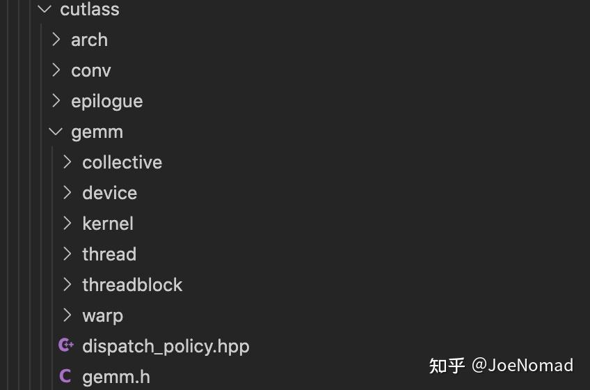
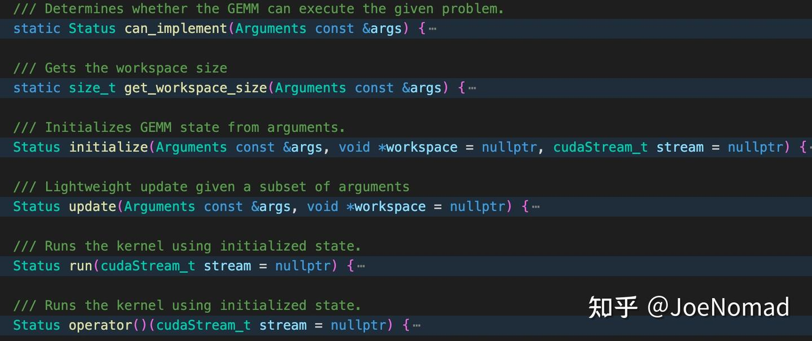
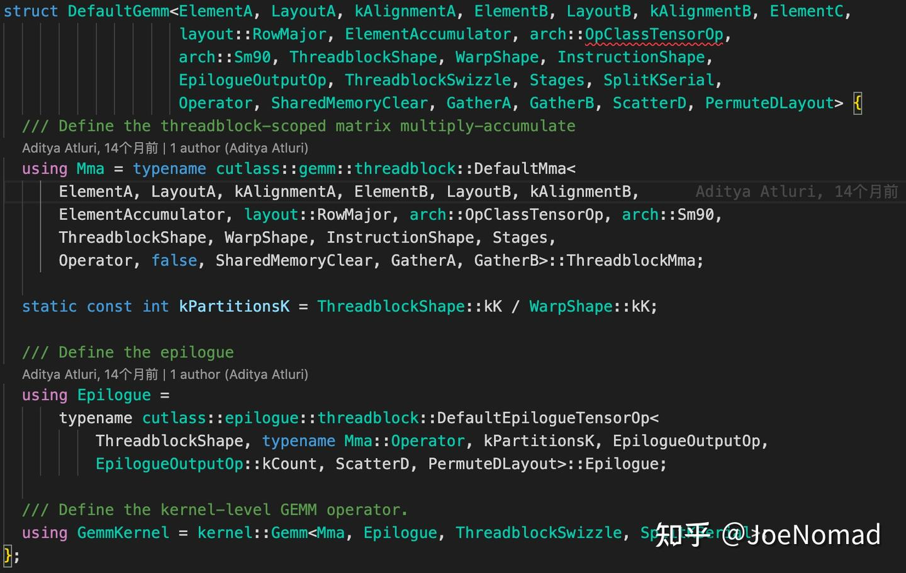
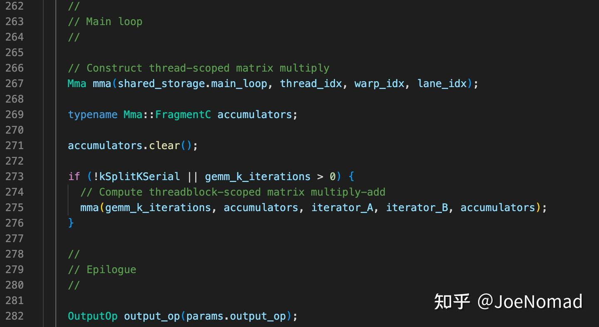
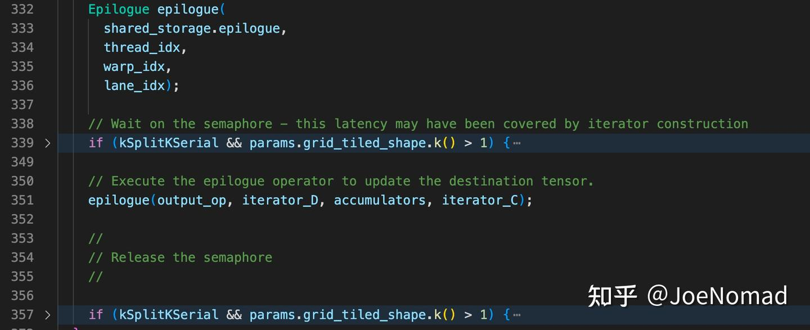
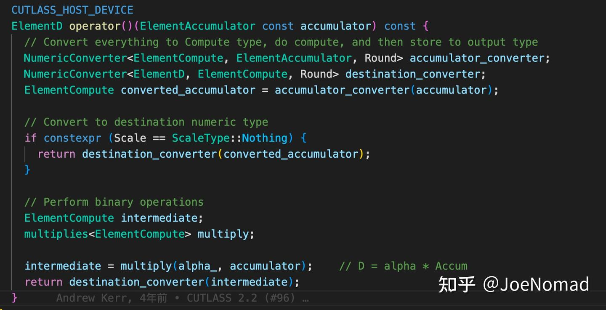
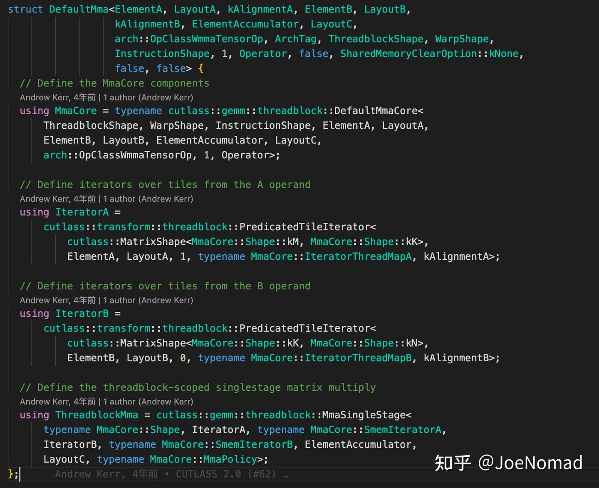
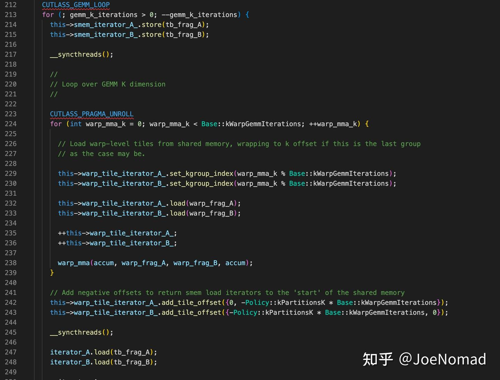
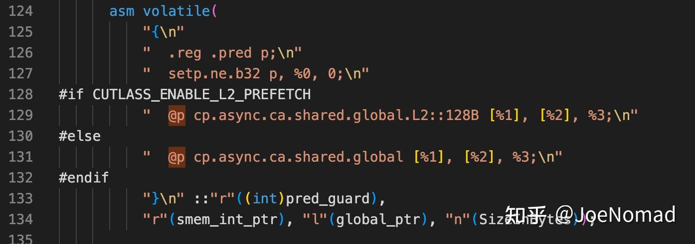
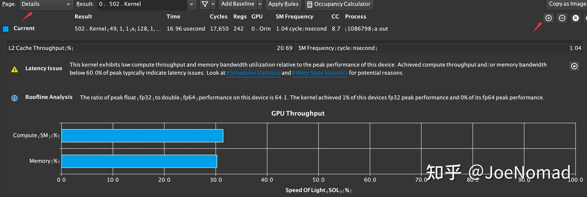

# [CUTLASS 심층 분석 시리즈] 0x01 — CUTLASS 소스 분석 (0): 소프트웨어 아키텍처 (ncu 성능 분석법 포함)

> 원문: https://zhuanlan.zhihu.com/p/678915618

## 시작

[이전 글](../B33_cutlass_basic_recognition/README.md)에서 CUTLASS의 high level 분석과 최적화 수단 overview를 다뤘습니다. 본 글부터 CUTLASS의 각 컴포넌트와 최적화 수단을 단계별로 분석합니다. 첫 글은 **전체 SW 아키텍처와 호출 체인**을 다루고 **debug·성능 분석 방법**을 공유합니다.


**본 글 초점**:

- CUTLASS의 주요 컴포넌트·SW 아키텍처 분석 — 빠른 warm up
- debug 방법 참고 제공

## CUTLASS의 SW 아키텍처

### 개요

CUTLASS의 **example 08**(sm75 행렬 곱)을 예로 위에서 아래로 SW 아키텍처 정리.

```
cutlass/examples/08_turing_tensorop_gemm/turing_tensorop_gemm.cu
```

**계산 로직 두 부분**:

- **MMA**: 행렬 곱 누적부 — load(global) → store(shared) → mma(결과는 register)
- **Epilogue**: 행렬 곱 결과를 받아 후속 계산(cast, fusion kernel — bias, relu 등)·출력 — (재배열 시 store(shared)) → Epilogue compute → store(global)

**CUTLASS의 SW 계층은 GPU HW 아키텍처와 거의 일치**:



```
device(host 측 호출 코드) → kernel(workload별 mma·epilogue dispatch + kernel mma 계산 로직과 epilogue 호출 정의)
  → threadblock(block 내 mma 계산 정의) → warp → thread
```

CUTLASS의 동작 이해는 **device·kernel·threadblock**에 집중. warp·thread는 단순 행렬 곱 — CUDA core·dp4a(simd 명령)·Tensor Core 등 다른 구현 존재(SM별 명령 다름 — fp16 sm75: m16n8k8, sm80: m16n8k16, 전방 호환).

### Device

host 측 호출 코드와 Arguments 구조체 정의 포함. **이 계층의 host 코드와 device 코드 분리 가능** — 예: CUTLASS 커널 사전 컴파일 후 다른 프로젝트에서 호출 시, host 측을 캡슐화·link 하면 nvcc 불요.

주목 파일(turing_tensorop_gemm.cu 기준):

```
cutlass/include/cutlass/gemm/device/gemm.h
```

API는 명명으로 이해 가능:



- **`can_implement`**: iterator 검사. L/R matrix 벡터화 load의 **align 검사** — 예: iterA align 16 요구인데 K가 24면 16으로 나누어떨어지지 않아 에러
- **`get_workspace_size`**: kernel 외 split-k 관련. split-k 미사용 시 workspace는 0. **split-k 보충 설명** — k 차원을 n 분할 reduce sum으로 kernel 병렬도 향상.
  - **kernel 내 reduce**: n개 결과를 shared memory에 저장 후 reduce sum. semaphore로 각 부분 행렬 곱 완료 보장
  - **kernel 외 reduce**: n개 결과를 global memory에 저장, 별도 reduce CUDA kernel로 sum. 추가 kernel 오버헤드
  - K가 크고 m, n 작을 때 이득. **resnet 마지막 층**처럼 input channel 512이지만 h, w가 7뿐인 경우

### Kernel

**kernel 템플릿 특수화**와 **kernel 실행 메인 로직** 포함. 주목 파일:

```
cutlass/include/cutlass/gemm/kernel/default_gemm.h
cutlass/include/cutlass/gemm/kernel/gemm.h
```



템플릿 특수화 — threadblock의 mma·Epilogue 선언.

계산 메인 로직(앞서 언급한 계층 구조에 매핑):



split-k 미사용이므로 275행 실행 — load → compute. **`accumulators`는 register**. CUDA에서 local memory와 register 선언 방법은 동일(C++ 정적 길이 배열 선언). 255 초과 시 local memory 사용. NVCC가 자동으로 register 재사용 분석(사용자 비가시).



mma 계산 완료 후 누적 결과를 epilogue로 전달(351행).



`linear_combination`(y = ax) 예로 epilogue 설명:

epilogue에서 register의 누적 결과를 받아 커스텀 후처리. **명시적 cast**로 계산 dtype 일관성 보장. **`ElementCompute`**: 계산 dtype, **`ElementD`**: 출력 dtype. 예: fp16 행렬 곱 후 bias add를 fp32 정밀도로 — 인스턴스화 시 `ElementCompute=float` 전달.

### Threadblock

여러 파일이 관여하지만 두 개에 집중:

```
cutlass/include/cutlass/gemm/threadblock/default_mma.h
cutlass/include/cutlass/gemm/threadblock/mma_singlestage.h
```

**주의**: example 08은 numstage=2이지만, **단일 스테이지 로직이 학습에 매우 명확**(numstage = 파이프라인 stage 수). numstage를 1로 바꾸면 singlestage 호출로 진입.



mma 특수화 인자, threadblock 계산 흐름(single 1 / pipelined 2 / multistage N) 정의. **bank conflict free 인덱스 계산은 ThreadMapA/B**. 최적화 세부는 후속 글에서.

`MmaSingleStage` 점프:



명확하게 matrixA/B 로드 + mma 계산. **`pragma unroll`** 보충:

- 컴파일러 공통 최적화 — for 루프 펼침. **순회 인덱스가 컴파일 타임 상수로 추론 가능** → 런타임 인덱스 계산(스칼라 mul, add 등) 비용 감소

### Warp & Thread

너무 깊이는 안 들어가지만, warp 내 mma 계산 방법·각 thread 작성 방법은 본질적으로 명령 응용. **global load 디테일** 주목:



`@p`는 이전 글에서 언급한 **special register로 load 필요 여부 판단**.

여기까지 SW 계층 아키텍처. 각 컴포넌트 최적화 디테일은 후속 글에서.

## CUTLASS 성능 병목 분석

CUDA 커널 성능 분석은 보통 **Nsight Compute** 사용.

### Nsight Compute(ncu) report 생성

```bash
# 컴파일 시 -lineinfo flag 추가 — report에서 sass 대응 source 확인 가능 (sm80 예)
nvcc -arch=sm_80 -lineinfo xxx.cu -I(필요한 헤더)

# ncu profile
# -o: 출력 파일명, --import-source: 소스 포함
# --set full: 모든 metrics
ncu -o xxx --import-source 1 --set full ./a.out
```

### GUI에서 report 열기

NVIDIA 공식 사이트에서 Nsight Compute GUI 다운로드·설치 후 report 열기.



detail 페이지에서 다양한 metrics(HW 활용률·명령 카운트 등) 확인. 분석 지식은 별도 글에서 다룰 예정.
