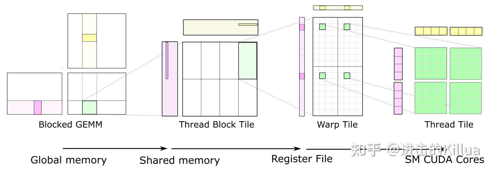
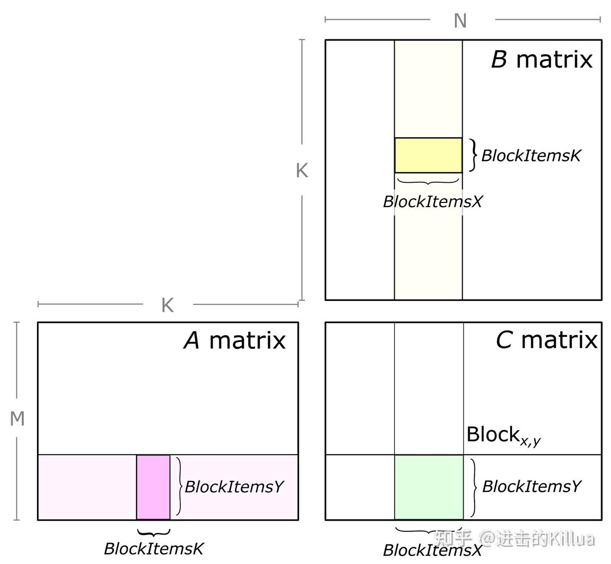
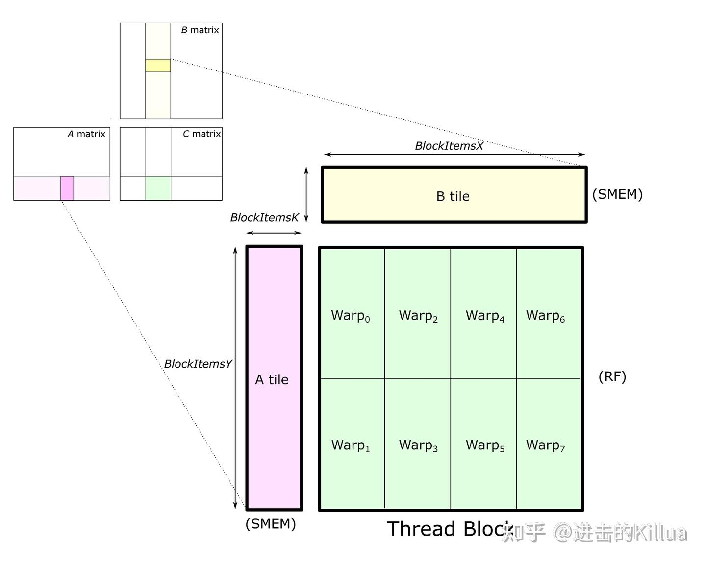
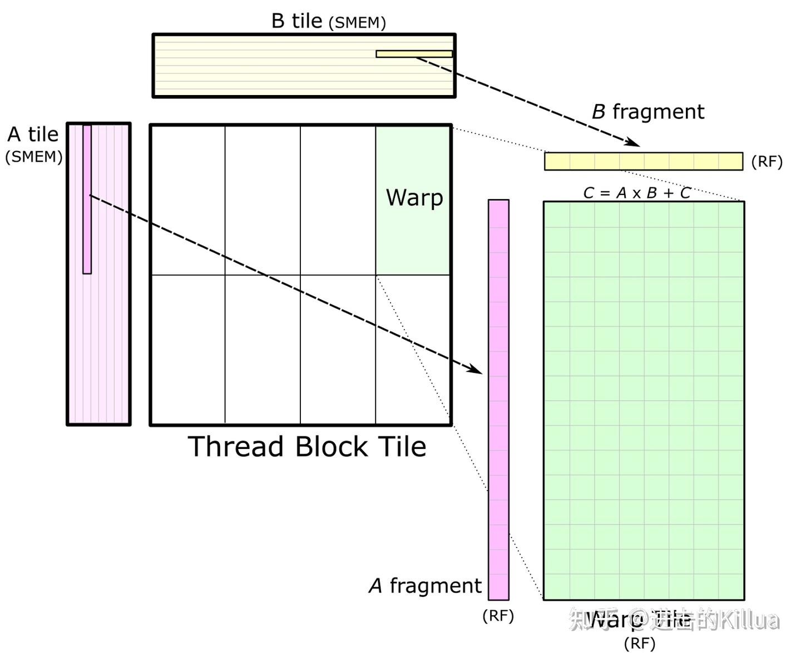
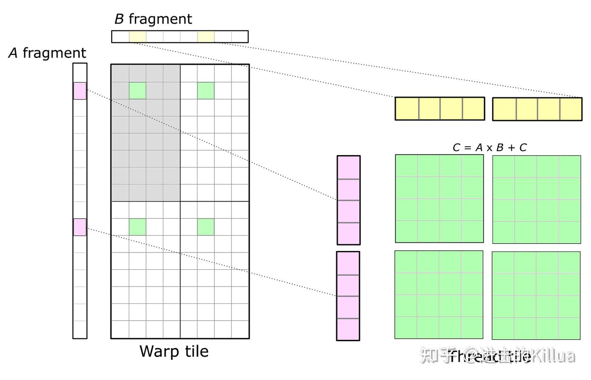
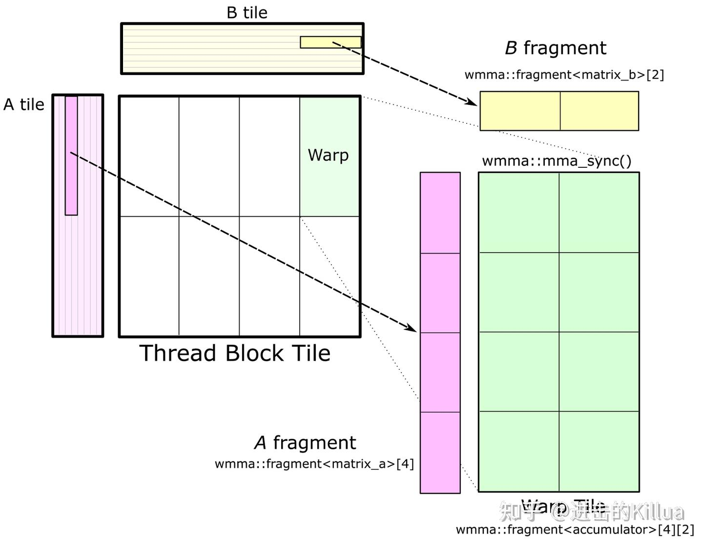

# CUTLASS 기초 소개

> 원문: https://zhuanlan.zhihu.com/p/671324125

본 글은 CUTLASS의 입문 소개. 정의·사용법부터 시작해 기본 원리까지 다룹니다.

## 1. CUTLASS 정의

> CUTLASS is a collection of CUDA C++ template abstractions for implementing high-performance matrix-multiplication (GEMM) and related computations at all levels and scales within CUDA.

- **CUDA C++ 템플릿 추상의 모음** — 추상 템플릿 라이브러리
- 목적: **고성능 행렬 곱과 관련 계산** 구현(현재는 conv도 지원)
- **모든 계층(thread block·warp·thread)** 에서 고성능 계산
- 관련 계산: GEMM 뒤의 activation·pointwise(bias·scales 등) — GEMM과 융합 가능

CUTLASS의 설계 의도는 GEMM의 **"가변 부분"을 C++ 추상 템플릿 기본 컴포넌트로 분해** — 개발자가 자신의 CUDA 커널에 쉽게 커스터마이즈. WMMA API로 Tensor Core 가속 행렬 곱.

## 2. CUTLASS 사용

### 가장 단순한 GEMM

1) **Gemm 타입 선언**:

```cpp
using ColumnMajor = cutlass::layout::ColumnMajor;

using CutlassGemm = cutlass::gemm::device::Gemm<float,        // A dtype
                                                ColumnMajor,  // A layout
                                                float,        // B dtype
                                                ColumnMajor,  // B layout
                                                float,        // C dtype
                                                ColumnMajor>; // C layout

CutlassGemm gemm_operator;
```

2) **Arguments 구성**:

```cpp
int M, N, K;
float alpha, beta;
int lda = M, ldb = K, ldc = M;

CutlassGemm::Arguments args({M, N, K},
                            {A, lda},
                            {B, ldb},
                            {C, ldc},
                            {C, ldc},
                            {alpha, beta});
```

3) **`gemm_operator(args)` 호출**:

```cpp
cutlass::Status status = gemm_operator(args);
if (status != cutlass::Status::kSuccess) {
  return cudaErrorUnknown;
}
```

CUTLASS GEMM 호출 한 번 완성 — 비교적 단순.

### 고전적 OP Fusion 예제

CUTLASS API로 데이터 정의 후 행렬 곱 + 선형 연산 수행. 모듈 파라미터가 많지만 익숙해지면 일상적.

`EpilogueOp = cutlass::epilogue::thread::LinearCombination` — gemm 후 선형 연산. **연산자 융합의 전형 응용** — gemm 뒤 후속 op를 epilogue에 융합 → 메모리 접근 감소·커널 호출 감소·연산 효율 향상.

```cpp
using ElementAccumulator = float;
using ElementComputeEpilogue = ElementAccumulator;
using ElementInputA = cutlass::half_t;
using ElementInputB = cutlass::half_t;
using ElementOutput = float;

using LayoutInputA = cutlass::layout::ColumnMajor;
using LayoutInputB = cutlass::layout::RowMajor;
using LayoutOutput = cutlass::layout::RowMajor;

using MMAOp = cutlass::arch::OpClassTensorOp;
using SmArch = cutlass::arch::Sm70;

using ShapeMMAThreadBlock = cutlass::gemm::GemmShape<128, 128, 32>;
using ShapeMMAWarp = cutlass::gemm::GemmShape<64, 64, 32>;
using ShapeMMAOp = cutlass::gemm::GemmShape<8, 8, 4>;

using SwizzleThreadBlock = cutlass::gemm::threadblock::GemmIdentityThreadblockSwizzle<>;

using EpilogueOp = cutlass::epilogue::thread::LinearCombination<
    ElementOutput,
    128 / cutlass::sizeof_bits<ElementOutput>::value,
    ElementAccumulator,
    ElementComputeEpilogue>;

constexpr int NumStages = 2;

using Gemm = cutlass::gemm::device::Gemm<ElementInputA, LayoutInputA,
                                         ElementInputB, LayoutInputB,
                                         ElementOutput, LayoutOutput,
                                         ElementAccumulator,
                                         MMAOp, SmArch,
                                         ShapeMMAThreadBlock,
                                         ShapeMMAWarp,
                                         ShapeMMAOp,
                                         EpilogueOp,
                                         SwizzleThreadBlock,
                                         NumStages>;
```

CUTLASS API로 입출력 변수 생성·채움·할당. arguments 구성:

```cpp
const int length_m = 5120, length_n = 4096, length_k = 4096;

cutlass::gemm::GemmCoord problem_size(length_m, length_n, length_k);

cutlass::HostTensor<ElementInputA, LayoutInputA> tensor_a(problem_size.mk());
cutlass::HostTensor<ElementInputB, LayoutInputB> tensor_b(problem_size.kn());
cutlass::HostTensor<ElementOutput, LayoutOutput> tensor_c(problem_size.mn());
cutlass::HostTensor<ElementOutput, LayoutOutput> tensor_d(problem_size.mn());
cutlass::HostTensor<ElementOutput, LayoutOutput> tensor_ref_d(problem_size.mn());

// 호스트에서 random fill
cutlass::reference::host::TensorFillRandomUniform(tensor_a.host_view(), 1, ElementInputA(4), ElementInputA(-4), 0);
cutlass::reference::host::TensorFillRandomUniform(tensor_b.host_view(), 1, ElementInputB(4), ElementInputB(-4), 0);
cutlass::reference::host::TensorFillRandomUniform(tensor_c.host_view(), 1, ElementOutput(4), ElementOutput(-4), 0);
cutlass::reference::host::TensorFill(tensor_d.host_view());
cutlass::reference::host::TensorFill(tensor_ref_d.host_view());

tensor_a.sync_device();
tensor_b.sync_device();
tensor_c.sync_device();
tensor_d.sync_device();
tensor_ref_d.sync_device();

ElementComputeEpilogue alpha = ElementComputeEpilogue(1);
ElementComputeEpilogue beta = ElementComputeEpilogue(0);

typename Gemm::Arguments arguments{problem_size,
                                   tensor_a.device_ref(),
                                   tensor_b.device_ref(),
                                   tensor_c.device_ref(),
                                   tensor_d.device_ref(),
                                   {alpha, beta},
                                   split_k_slices};
```

`gemm_op` 호출 — workspace 미리 할당, `can_implement` 검증, 실제 호출:

```cpp
size_t workspace_size = Gemm::get_workspace_size(arguments);
cutlass::device_memory::allocation<uint8_t> workspace(workspace_size);

Gemm gemm_op;
cutlass::Status status = gemm_op.can_implement(arguments);
CUTLASS_CHECK(status);

status = gemm_op.initialize(arguments, workspace.get());
CUTLASS_CHECK(status);

status = gemm_op();
CUTLASS_CHECK(status);
```

### 요약

CUTLASS 기본 패러다임 3단계:

1. operator 정의
2. args 정의
3. operator(args) 호출

```cpp
CutlassGemm gemm_operator;
CutlassGemm::Arguments args;
cutlass::Status status = gemm_operator(args);
```

### 확장

복잡성은 operator·args 전개에서 옴. operator는 `cutlass::gemm::device` 네임스페이스 구현체:

```cpp
cutlass::gemm::device::Gemm          // 통용
cutlass::gemm::device::GemmArray
cutlass::gemm::device::GemmBatched   // 같은 shape 배치
cutlass::gemm::device::GemmGrouped   // 다른 shape 배치
```

`cutlass::gemm::device::Gemm` 정의 — 타입·데이터·함수 포함. `EpilogueOutputOp_`는 gemm 후 처리 타입 파라미터, `GemmKernel`은 실행 커널(논리 핵심), `Arguments`는 계산 내용.

```cpp
using CutlassGemm = cutlass::gemm::device::Gemm
{
   using EpilogueOutputOp = EpilogueOutputOp_;
   using GemmKernel = typename kernel::DefaultGemm::GemmKernel;
   struct Arguments {
     typename EpilogueOutputOp::Params epilogue_;
   }

   static Status can_implement(Arguments const &args);
   static size_t get_workspace_size(Arguments const &args);
   Status initialize(Arguments const &args, void *workspace = nullptr, cudaStream_t stream = nullptr);
   Status update(Arguments const &args, void *workspace = nullptr);
   Status run(cudaStream_t stream = nullptr) {
     cutlass::Kernel<GemmKernel><<<grid, block, smem_size, stream>>>(params_);
   }
   Status operator()(cudaStream_t stream = nullptr) {
     return run(stream);
   }
}
```

`cutlass::gemm::device::Gemm`은 사실 **`cutlass::gemm::kernel`의 캡슐화** — 실제 작업은 kernel 레벨에서:

```cpp
cutlass::gemm::kernel::DefaultGemm {
    using Mma = typename cutlass::gemm::threadblock::DefaultMma::ThreadblockMma;
    using Epilogue = typename platform::conditional<...>::type;
    using GemmKernel = cutlass::gemm::kernel::Gemm<Mma, Epilogue, ThreadblockSwizzle, SplitKSerial> {
        struct Params;
        static Status can_implement();
        // 핵심 코드
        CUTLASS_DEVICE void operator()(Params const &params, SharedStorage &shared_storage);
    }
}
```

`operator()` 구현(전체 코드: https://github.com/NVIDIA/cutlass/blob/main/include/cutlass/gemm/kernel/gemm.h):

```cpp
CUTLASS_DEVICE
void operator()(Params const &params, SharedStorage &shared_storage) {
    ThreadblockSwizzle threadblock_swizzle;
    cutlass::gemm::GemmCoord threadblock_tile_offset =
        threadblock_swizzle.get_tile_offset(params.swizzle_log_tile);

    if (params.grid_tiled_shape.m() <= threadblock_tile_offset.m() ||
        params.grid_tiled_shape.n() <= threadblock_tile_offset.n()) {
        return;
    }

    cutlass::MatrixCoord tb_offset_A{
        threadblock_tile_offset.m() * Mma::Shape::kM,
        threadblock_tile_offset.k() * params.gemm_k_size,
    };
    cutlass::MatrixCoord tb_offset_B{
        threadblock_tile_offset.k() * params.gemm_k_size,
        threadblock_tile_offset.n() * Mma::Shape::kN
    };

    int problem_size_k = min(
        params.problem_size.k(),
        (threadblock_tile_offset.k() + 1) * params.gemm_k_size);

    int gemm_k_iterations = (problem_size_k - tb_offset_A.column() + Mma::Shape::kK - 1)
                            / Mma::Shape::kK;
    int thread_idx = threadIdx.x;

    typename Mma::IteratorA iterator_A(
        params.params_A, params.ref_A.data(),
        {params.problem_size.m(), problem_size_k},
        thread_idx, tb_offset_A,
        params.gather_A_indices);

    typename Mma::IteratorB iterator_B(
        params.params_B, params.ref_B.data(),
        {problem_size_k, params.problem_size.n()},
        thread_idx, tb_offset_B,
        params.gather_B_indices);

    int warp_idx = canonical_warp_idx_sync();
    int lane_idx = threadIdx.x % 32;

    // Main loop
    Mma mma(shared_storage.main_loop, thread_idx, warp_idx, lane_idx);
    typename Mma::FragmentC accumulators;
    accumulators.clear();

    if (!kSplitKSerial || gemm_k_iterations > 0) {
        mma(gemm_k_iterations, accumulators, iterator_A, iterator_B, accumulators);
    }

    // Epilogue
    OutputOp output_op(params.output_op);
    threadblock_tile_offset =
        threadblock_swizzle.get_tile_offset(params.swizzle_log_tile);

    MatrixCoord threadblock_offset(
        threadblock_tile_offset.m() * Mma::Shape::kM,
        threadblock_tile_offset.n() * Mma::Shape::kN
    );

    int block_idx = threadblock_tile_offset.m() + threadblock_tile_offset.n() * params.grid_tiled_shape.m();

    Semaphore semaphore(params.semaphore + block_idx, thread_idx);

    if (kSplitKSerial && params.grid_tiled_shape.k() > 1) {
        semaphore.fetch();
        output_op.set_k_partition(threadblock_tile_offset.k(), params.grid_tiled_shape.k());
    }

    typename Epilogue::OutputTileIterator iterator_C(
        params.params_C, params.ref_C.data(),
        params.problem_size.mn(),
        thread_idx, threadblock_offset,
        params.scatter_D_indices
    );

    typename Epilogue::OutputTileIterator iterator_D(
        params.params_D, params.ref_D.data(),
        params.problem_size.mn(),
        thread_idx, threadblock_offset,
        params.scatter_D_indices
    );

    Epilogue epilogue(shared_storage.epilogue, thread_idx, warp_idx, lane_idx);

    if (kSplitKSerial && params.grid_tiled_shape.k() > 1) {
        if (threadblock_tile_offset.k()) {
            iterator_C = iterator_D;
        }
        semaphore.wait(threadblock_tile_offset.k());
    }

    epilogue(output_op, iterator_D, accumulators, iterator_C);

    if (kSplitKSerial && params.grid_tiled_shape.k() > 1) {
        int lock = 0;
        if (params.grid_tiled_shape.k() == threadblock_tile_offset.k() + 1) {
            lock = 0;
        } else {
            lock = threadblock_tile_offset.k() + 1;
        }
        semaphore.release(lock);
    }
}
```

## 3. CUTLASS 원리

CUTLASS의 핵심은 행렬 곱 — 계산 과정을 **thread block tile, warp tile, thread tile**의 계층 구조로 분해. 행렬 곱 누적 전략을 적용해 GPU 기반 효율적 GEMM 완성. 이 계층은 NVIDIA CUDA 프로그래밍 모델과 정확히 대응:

- **global → shared**: 행렬 → thread block tile
- **shared → register**: thread block tile → warp tile
- **register → CUDA core**: warp tile → thread tile



각 level 파라미터로 GEMM 분해 방식 커스텀 가능.

### Thread Block

각 thread block은 입력 행렬에서 행렬 데이터를 계속 읽어 누적 행렬 곱 ($\mathbf{C} \mathrel{+}= \mathbf{A} * \mathbf{B}$) 수행. C의 부분 행렬은 녹색 — A의 tile과 B의 tile 곱셈 결과. K 차원으로 행렬을 여러 tile로 분할 후 각 tile 행렬 곱·누적.



A·B의 tile은 global → shared로 로드 → 같은 thread block 내 warp들이 상호 접근 가능. thread block 출력 tile은 공간적으로 여러 warp로 분할. **Accumulator는 SM에서 가장 빠른 메모리(register)에 거주** — 매 수학 연산마다 갱신.



### Warp

shared memory에 데이터 저장 후, 각 warp이 K 차원으로 반복하며 행렬 곱 누적 — shared에서 부분 행렬(fragment) 로드 후 외층 곱·누적. fragment 크기는 K 차원보다 훨씬 작음 — shared 로드 데이터의 **계산 강도 최대화**로 shared 대역폭 병목 회피.

같은 thread block의 warp 간 shared 공유 — **같은 행 번호 warp은 A의 같은 fragment**, **같은 열 번호 warp은 B의 같은 fragment** 읽음.



### Thread

CUDA 프로그래밍 모델은 thread block과 단일 thread 위에 정의됨. warp 구조는 사실 **개별 thread 작업으로 매핑**. 스레드는 서로의 register에 접근 불가 → **register 값을 같은 thread의 여러 수학 명령에서 재사용**할 수 있게 조직. 단일 thread 내 2D tile 구조 필요.



독립 스레드(우)가 register의 fragment로 warp 레벨 행렬 곱(좌)에 참여. warp accumulator 분할은 녹색 — warp의 일부 thread, 보통 2D tile 형태.

### WMMA GEMM

warp tile 구조는 **CUDA WMMA API**(CUDA 9 도입, Volta V100·Tensor Core)로 구현. 행렬 fragment 로드와 곱-누적 추상 제공. CUTLASS는 `block_task_wmma.h`에 WMMA 기반 GEMM 구현. **warp tile 차원은 `nvcuda::wmma` 템플릿이 정의하는 행렬 곱-누적 크기의 정수 배**여야 함(CUDA Compute Capability에 따름).



여기서 마무리. 관심 있는 분은 공식 https://github.com/NVIDIA/cutlass 의 examples 컴파일·실행 권장.

## 4. 참고

- CUTLASS: Fast Linear Algebra in CUDA C++ | NVIDIA Technical Blog
- 패왕수창퇴(霸王手枪腿): cutlass 소스 도입 (1) — API와 설계 이념
- 패왕수창퇴: cutlass 소스 도입 (2) — Gemm 계산 흐름
- https://github.com/NVIDIA/cutlass
