# 잡담 CUTLASS GTC 2020 SLIDES

> 원문: https://zhuanlan.zhihu.com/p/674693873

## 서문


> 본 글은 CUTLASS GTC 2020 슬라이드 기반: https://www.nvidia.com/en-us/on-demand/session/gtcsj20-s21745/ — 개인적으로 수십 번 읽어야 할 CUDA 슬라이드. 본 글 대부분은 개인 이해이며, 오류가 있으면 지적 부탁.

## What are tensor cores?

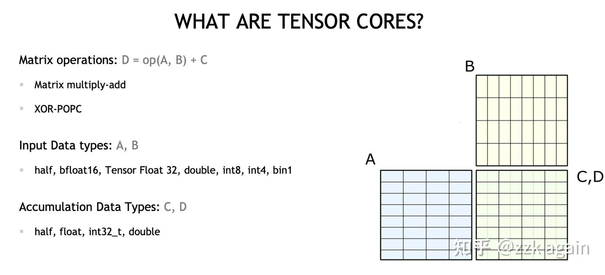

Tensor Core는 HW 개념. 행렬 곱(MMA) 가속용:

$$D = A * B + C$$

다양한 입력·누적 타입 지원.

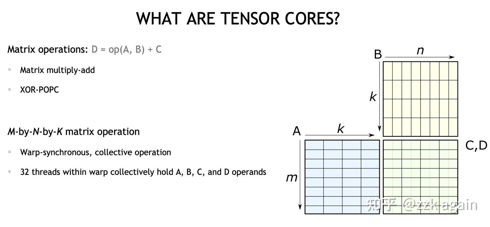

프로그래밍 계층상 Tensor Core는 **Warp**(연속 32 thread) 레벨. warp 내에 A·B·C·D 4 오퍼랜드 데이터 보유.

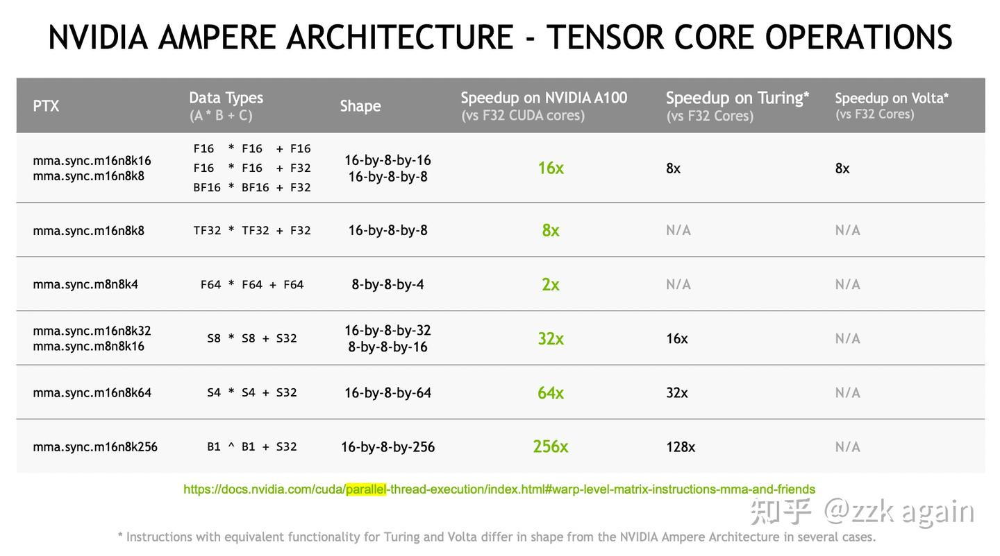

Ampere가 지원하는 MMA 명령 — 다양한 크기·dtype.

## S8 * S8 + S32 코드

Tensor Core 사용 시 **데이터 배치에 특수 요구**. MMA는 warp 내 실행 — **각 thread의 데이터 접근 위치에 특수 매핑** 존재.

`int8 × int8 = int32` (8x16 matmul 16x8 = 8x8) 예 — 슬라이드 배치:

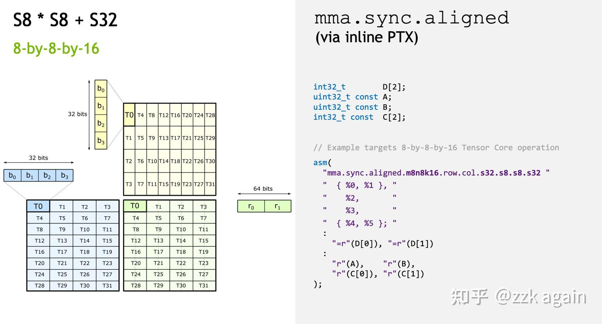

각 thread는 A의 `4 × 8bit = 32bit`, B의 `4 × 8bit = 32bit`, C/D의 `2 × 32bit = 64bit` 보유.

행렬 가정:

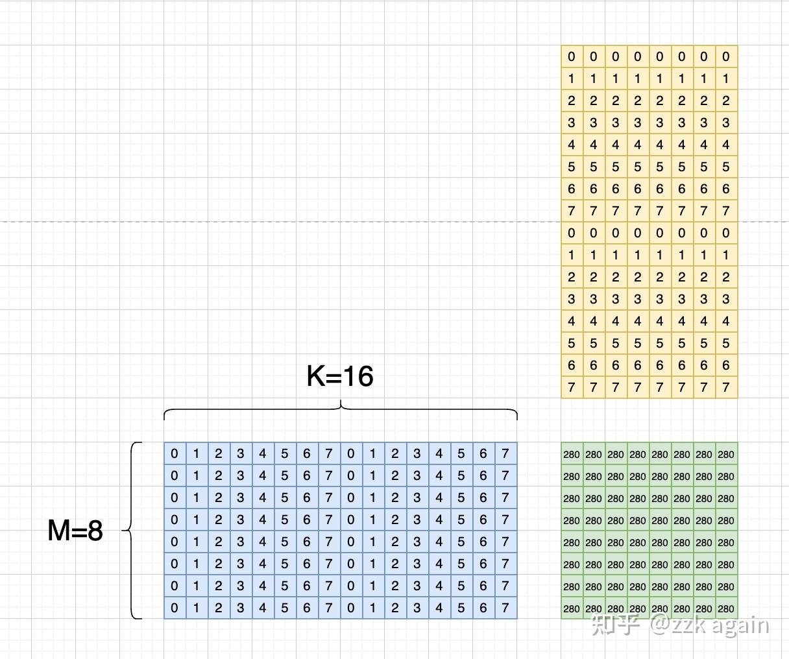

스레드 매핑과 원소 함께 표시:

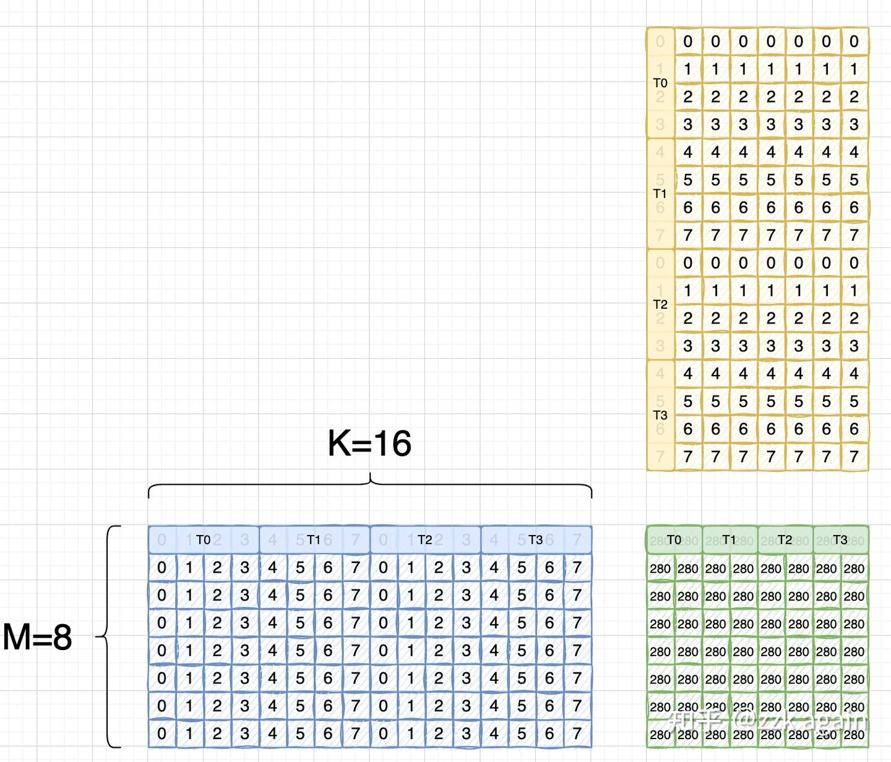

Tensor Core 명령은 **TN layout**.

> BLAS 표기 — `a × b = c → b_T × a_T = c_T`. T는 B가 transpose, 즉 A는 RowMajor, B는 ColMajor.

실제는:

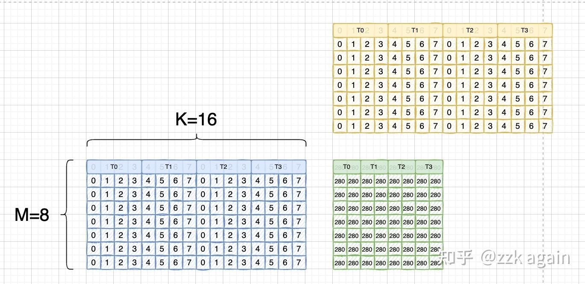

A 행렬과 완전 동일 → 두 행렬 레지스터의 인덱스가 일치.

슬라이드 example 코드:

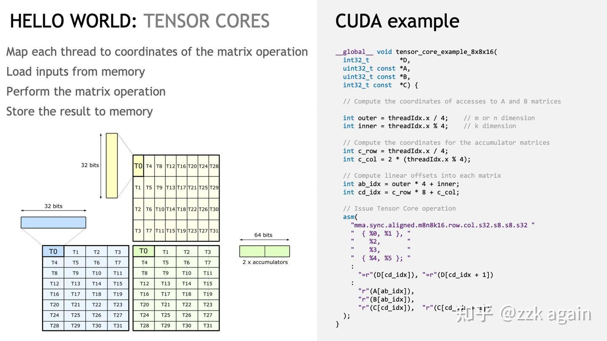

초기화 커널:

```cpp
#include "stdio.h"
#include "stdint.h"

__global__ void set_value(int8_t* x, int32_t elem_cnt) {
    for (int i = 0; i < elem_cnt; i++) {
        x[i] = static_cast<int8_t>(i % 8);
    }
}
```

Tensor Core 연산 커널 — int32 타입 사용, `s8 × s8 = s32`이므로 호출 시 `reinterpret_cast`:

```cpp
__global__ void tensor_core_example_8x8x16(int32_t *D,
                                           uint32_t const *A,
                                           uint32_t const *B,
                                           int32_t const *C) {
    int outer = threadIdx.x / 4;
    int inner = threadIdx.x % 4;
    int c_row = threadIdx.x / 4;
    int c_col = 2 * (threadIdx.x % 4);
    int ab_idx = outer * 4 + inner;
    int cd_idx = c_row * 8 + c_col;

    asm volatile("mma.sync.aligned.m8n8k16.row.col.s32.s8.s8.s32 {%0,%1}, {%2}, {%3}, {%4,%5};\n"
      : "=r"(D[cd_idx]), "=r"(D[cd_idx+1])
      : "r"(A[ab_idx]), "r"(B[ab_idx]), "r"(C[cd_idx]), "r"(C[cd_idx+1]));
}
```

main + 출력:

```cpp
__global__ void printMatrix(int32_t* result, const int m, const int n) {
    for (int row = 0; row < m; row++) {
        for (int col = 0; col < n; col++) {
            printf("Row id: %d, Col id: %d, result is: %d \n", row, col, result[row * n + col]);
        }
    }
}

int main() {
    int8_t* a;
    int8_t* b;
    int32_t* c;
    int32_t* d;

    const int32_t m = 8, k = 16, n = 8;

    cudaMalloc(&a, m * k * sizeof(int8_t));
    cudaMalloc(&b, k * n * sizeof(int8_t));
    cudaMalloc(&c, m * n * sizeof(int32_t));
    cudaMalloc(&d, m * n * sizeof(int32_t));

    set_value<<<1, 1>>>(a, m * k);
    set_value<<<1, 1>>>(b, k * n);
    cudaMemset(c, 0, sizeof(int32_t) * m * n);
    cudaMemset(d, 0, sizeof(int32_t) * m * n);

    tensor_core_example_8x8x16<<<1, 32>>>(reinterpret_cast<int32_t*>(d),
                                          reinterpret_cast<uint32_t*>(a),
                                          reinterpret_cast<uint32_t*>(b),
                                          reinterpret_cast<int32_t*>(c));

    printMatrix<<<1, 1>>>(d, m, n);
    cudaDeviceSynchronize();
    cudaFree(a); cudaFree(b); cudaFree(c); cudaFree(d);
}
```

## 거동 예제 — fp16 × fp16 + fp32 (16x8x8)

다른 명령 — 스레드 보유 데이터가 약간 다름:

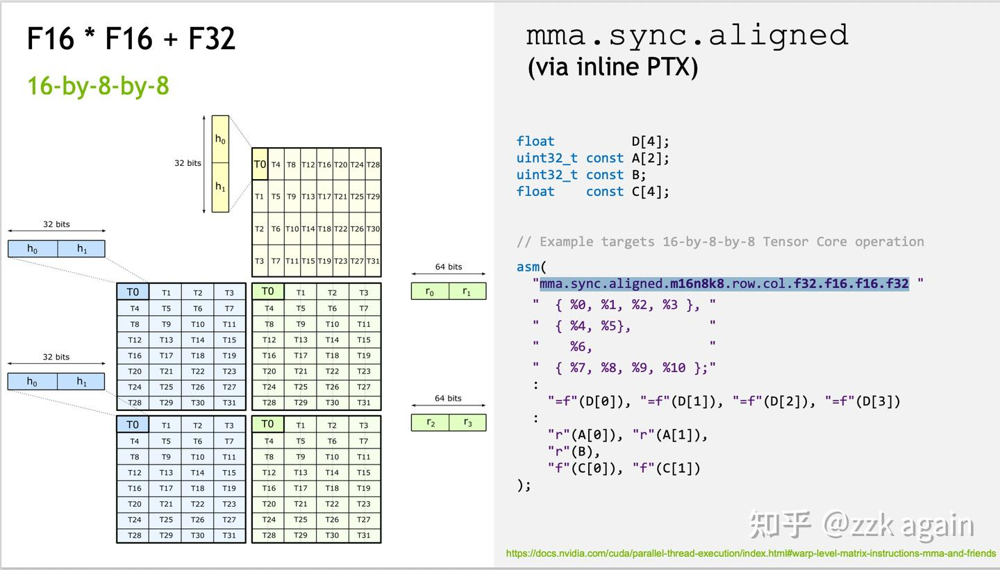

```cpp
#include "stdio.h"
#include "stdint.h"
#include "cuda_fp16.h"

template<typename T>
__global__ void set_value(T* x, int32_t elem_cnt) {
    for (int i = 0; i < elem_cnt; i++) x[i] = static_cast<T>(i % 8);
}

__global__ void tensor_core_example_16x8x8(float *D,
                                           uint32_t const *A,
                                           uint32_t const *B,
                                           float const *C) {
    int outer = threadIdx.x / 4;
    int inner = threadIdx.x % 4;
    int c_row = threadIdx.x / 4;
    int c_col = 2 * (threadIdx.x % 4);
    int ab_idx = outer * 4 + inner;
    int cd_idx = c_row * 8 + c_col;

    asm volatile("mma.sync.aligned.m16n8k8.row.col.f32.f16.f16.f32 "
                 "{%0,%1,%2,%3}, {%4,%5}, {%6}, {%7,%8,%9,%10};\n"
      : "=f"(D[cd_idx]), "=f"(D[cd_idx+1]), "=f"(D[cd_idx+64]), "=f"(D[cd_idx+1+64])
      : "r"(A[ab_idx]), "r"(A[ab_idx+32]),
        "r"(B[ab_idx]),
        "f"(C[cd_idx]), "f"(C[cd_idx+1]), "f"(C[cd_idx+64]), "f"(C[cd_idx+1+64]));
}

int main() {
    half *a, *b;
    float *c, *d;
    const int32_t m = 16, k = 8, n = 8;

    cudaMalloc(&a, m * k * sizeof(half));
    cudaMalloc(&b, k * n * sizeof(half));
    cudaMalloc(&c, m * n * sizeof(float));
    cudaMalloc(&d, m * n * sizeof(float));

    set_value<half><<<1, 1>>>(a, m * k);
    set_value<half><<<1, 1>>>(b, k * n);
    cudaMemset(c, 0, sizeof(float) * m * n);
    cudaMemset(d, 0, sizeof(float) * m * n);

    tensor_core_example_16x8x8<<<1, 32>>>(reinterpret_cast<float*>(d),
                                          reinterpret_cast<uint32_t*>(a),
                                          reinterpret_cast<uint32_t*>(b),
                                          reinterpret_cast<float*>(c));

    cudaDeviceSynchronize();
    cudaFree(a); cudaFree(b); cudaFree(c); cudaFree(d);
}
```

다른 MMA 명령 → 다른 행렬 규모·dtype. CUTLASS는 이를 한 템플릿으로 통일:

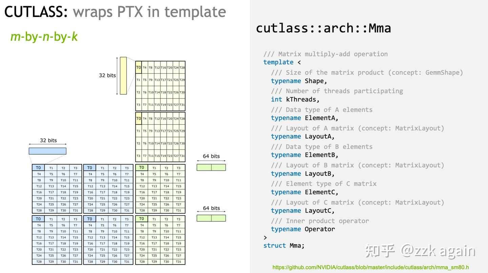

실제 사용 시 MMA 템플릿 인스턴스화:

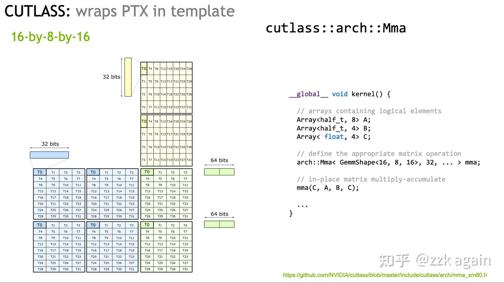

## 데이터 이동 (Data Movement)

행렬 곱의 데이터 이동·새 아키텍처의 LDMatrix 명령.

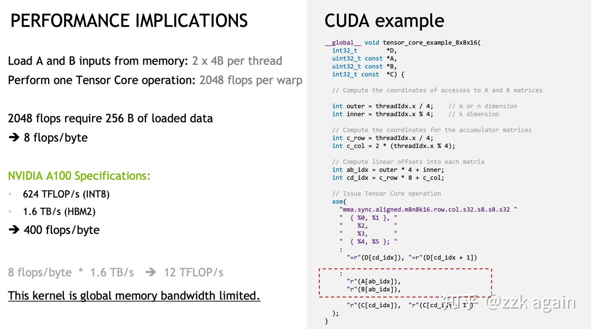

`s8 × s8 = s32` MMA 예. warp 1개가 8x16 matmul 16x8 → A·B 행렬 합 `(8×16 + 16×8) = 256B` 로드. FLOPS:

```
C 원소 8 × 8 = 64
원소당 16 곱·16 합 → FLOPS = 64 × 16 × 2 = 2048
```

→ **계산/메모리 비율 = 8 flops/byte**.

Ampere 백서: A100 INT8 Tensor Core 624 TFLOPS, 80GB A100 HBM 1.6 TB/s → 이상적 비율 **400 flops/byte**.

비교하면 Tensor Core 사용 시 **메모리 접근이 병목** — GEMM 최적화에서 데이터 이동이 중요한 이유.

> 이는 이상적 추정. 실제는 캐시 적중률 등 더 복잡(이샤오샤(李少侠)의 글 참고).

CUTLASS는 효율적 데이터 이동 흐름을 추상화:

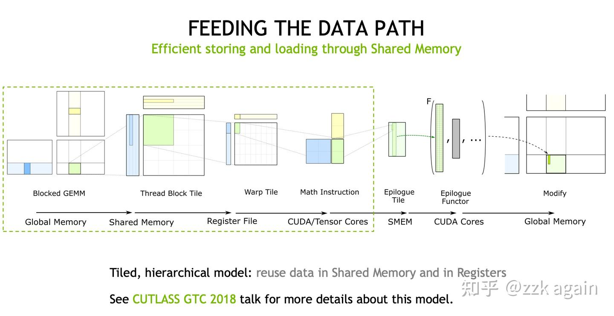

Ampere에 새로 도입된 **AsyncCopy** — global → shared 단계. 기존엔 global → register → shared였지만 **이 명령은 한 번에 global → shared** → 레지스터 압박 일부 완화.

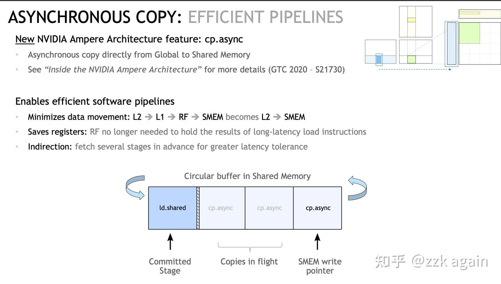

비동기 작업 — **여러 라운드 데이터 프리페치 명령을 미리 발사**(CUTLASS의 Stage)해 지연 은폐(난 옮기고 너는 계산).

다른 특수 명령 **LDMatrix** — shared → register 단계.

대역폭을 채우려 global → shared에서 각 스레드가 128bit 입도로 저장. Tensor Core는 각 스레드가 다른 인덱스의 데이터 필요 → **각 스레드의 원소가 shared에서 불연속**:

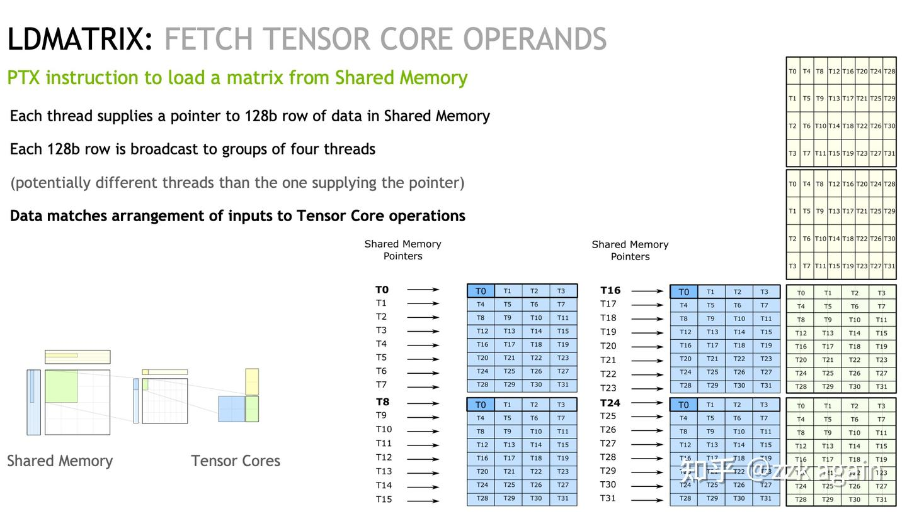

T0 스레드는 T0·T8·T16·T24의 첫 원소가 필요. LDMatrix 없으면 **LDS32 4회**, LDMatrix는 **한 명령**:

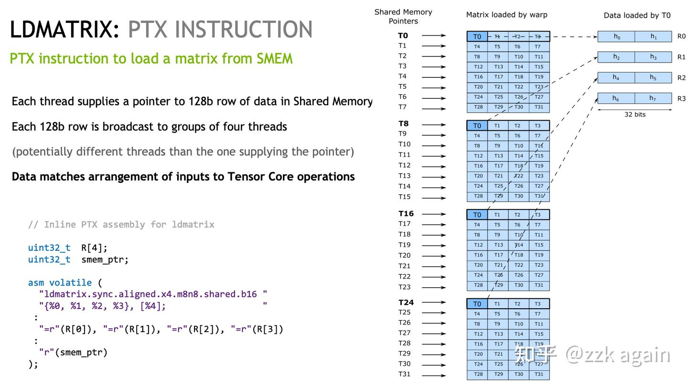

CUTLASS의 **crosswise Layout** 간단 언급(완전 이해는 아님). bank conflict 회피는 보통 padding으로 warp 내 thread 접근을 어긋나게 함 → shared 낭비. CUTLASS는 복잡한 XOR로 인덱스 계산해 새 layout:

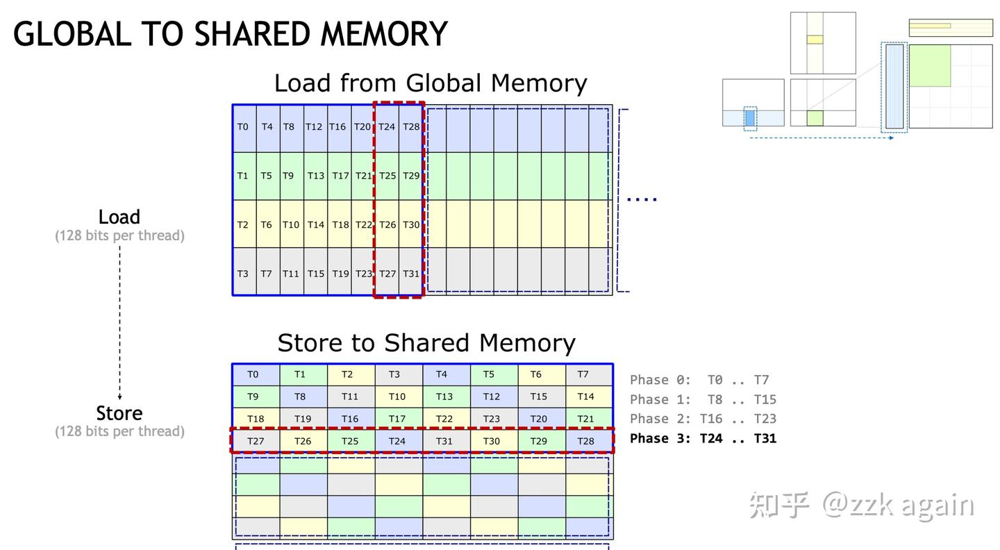

각 스레드가 128bit = 4 bank 차지. T0이 필요한 데이터 — T0·T8·T16·T24가 다른 bank로 분산.

## LDMatrix 예제

```cpp
#include "stdio.h"
#include "stdint.h"
#include "cuda_fp16.h"

#define LDMATRIX_X4(R0, R1, R2, R3, addr) \
    asm volatile("ldmatrix.sync.aligned.x4.m8n8.shared.b16 {%0, %1, %2, %3}, [%4];\n" \
                 : "=r"(R0), "=r"(R1), "=r"(R2), "=r"(R3) \
                 : "r"(addr))

template<typename T>
__global__ void set_value(T* x, int32_t elem_cnt) {
    for (int i = 0; i < elem_cnt; i++) x[i] = static_cast<T>(i % 8);
}

// CUTLASS에서 가져옴
__device__ uint32_t cast_smem_ptr_to_uint(void const* const ptr) {
#if CUTE_CVTA_GENERIC_TO_SHARED_ACTIVATED
    return static_cast<uint32_t>(__cvta_generic_to_shared(ptr));
#elif CUTE_NVVM_GET_SMEM_POINTER_ACTIVATED
    return __nvvm_get_smem_pointer(ptr);
#elif defined(__CUDA_ARCH__)
    uint32_t smem_ptr;
    asm("{ .reg .u64 smem_ptr; cvta.to.shared.u64 smem_ptr, %1; cvt.u32.u64 %0, smem_ptr; }\n"
        : "=r"(smem_ptr) : "l"(ptr));
    return smem_ptr;
#else
    (void)ptr;
    printf("ERROR: cast_smem_ptr_to_uint not supported but used.\n");
    return 0;
#endif
}

__global__ void ldmatrix_example(uint32_t* x, uint32_t* y) {
    const int32_t row_tid = threadIdx.x / 8;
    uint32_t RegisterLoad[4];
    uint32_t RegisterTensorcore[4];
    __shared__ half smem[4][64];
    *reinterpret_cast<float4*>(RegisterLoad) =
        *reinterpret_cast<float4*>((x + threadIdx.x * 4));

    int32_t xor_idx = threadIdx.x;
    if (row_tid == 1) xor_idx ^= 1;
    if (row_tid == 2) xor_idx ^= 2;
    if (row_tid == 3) xor_idx ^= 3;

    const int32_t store_smem_row_tid = xor_idx / 8;
    const int32_t store_smem_col_tid = xor_idx % 8;

    half* smem_ptr = &(smem[store_smem_row_tid][store_smem_col_tid * 8]);
    *reinterpret_cast<float4*>(smem_ptr) = *reinterpret_cast<float4*>(RegisterLoad);
    __syncthreads();

    uint32_t addr = cast_smem_ptr_to_uint(smem_ptr);
    LDMATRIX_X4(RegisterTensorcore[0], RegisterTensorcore[1],
                RegisterTensorcore[2], RegisterTensorcore[3], addr);
}

int main() {
    half *x, *y;
    const int32_t m = 16, k = 16;

    cudaMalloc(&x, m * k * sizeof(half));
    cudaMalloc(&y, m * k * sizeof(half));

    set_value<half><<<1, 1>>>(x, m * k);
    cudaMemset(y, 0, sizeof(half) * m * k);

    ldmatrix_example<<<1, 32>>>(reinterpret_cast<uint32_t*>(x),
                                reinterpret_cast<uint32_t*>(y));

    cudaDeviceSynchronize();
    cudaFree(x); cudaFree(y);
}
```

`cast_smem_ptr_to_uint`에 대해 — 元戎启行 행렬 전치 블로그에서 인용:

> 공유 메모리 주소는 Generic Address가 아니라서 데이터 읽기·쓰기 전 `__cvta_generic_to_shared`를 거쳐야 함. PTX 직접 작성도 가능.

## XOR 인덱스 변환 예제

```python
for i in range(8, 16):
    print(i, i ^ 1)

for i in range(16, 24):
    print(i, i ^ 2)

for i in range(24, 32):
    print(i, i ^ 3)
```
