# [CUTLASS 심층 분석 시리즈] 0x02 — CUTLASS 소스 분석 (1): block swizzle과 tile iterator (TVM 등가 코드 포함)

> 원문: https://zhuanlan.zhihu.com/p/679929705

## 시작

[이전 글](../B34_cutlass_software_architecture/README.md)에서 GEMM 케이스 기반으로 repo의 SW 아키텍처와 일부 디테일을 정리했습니다.

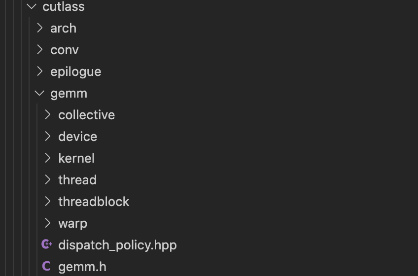

이후 글에서는 각 컴포넌트를 분해해 로직 분석. repo 컴포넌트가 많아 한 글에 다 넣으면 가독성 저하 → 실행 과정대로 여러 part로 분해. 본 글은 **block swizzle**과 **tile iterator** — 실행 과정의 시작점.

**본 글 초점**:

- Block Swizzle 내부 로직과 소스 분석(TVM 등가 for loop 변환 코드 포함)
- Conv2d tile iterator로 CUTLASS의 tile iterator 최적화 수단 분석

## 개요

- **Block Swizzle**: 스레드 블록 발사 순서 변경 → L2 cache 적중률 향상
- **Tile Iterator**: 분할별 global load 인덱스 계산. ThreadMap으로 load/store function 제공

## Block Swizzle

### 소스 위치

block swizzle 로직은 비교적 단순. **일정 step마다 줄바꿈 작업** — 핵심은 **modulo 연산**, hyper-param으로 swizzle step 제한. 주목 파일:

```
include/cutlass/gemm/threadblock/threadblock_swizzle.h
include/cutlass/gemm/kernel/gemm.h
```

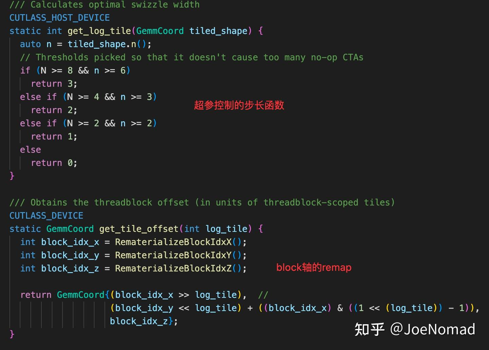

GPU에서 block 발사 순서는 x → y → z. `((block_idx_x) & ((1 << (log_tile)) - 1))`은 **x축 modulo 연산** — hyper-param이 2의 거듭제곱이라 **비트 연산으로 modulo 등가**, 비트 연산이 비용 더 작음.

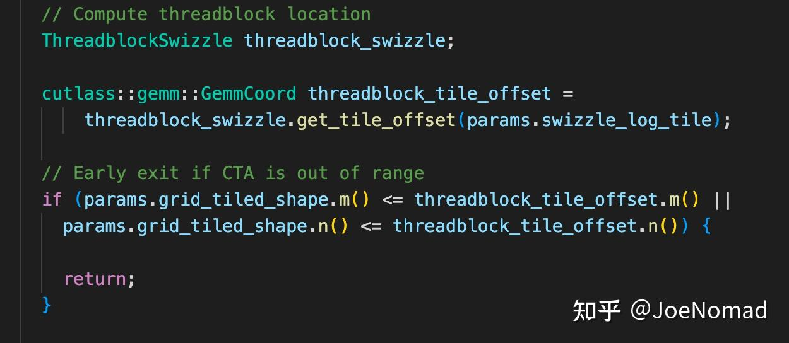

### Block Swizzle 로직 분석

**`4096 × 4096 × 1024` 행렬 곱** 예:

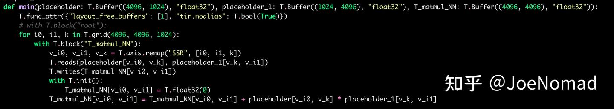

threadblock tile `(64, 64)` 가정:

> 무관 정보 배제를 위해 K 차원은 우선 무시. 실제 CUTLASS tile은 M·N·K 3차원이고 K는 reduce 축이라 swizzle에 영향 없음.

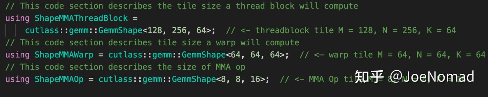

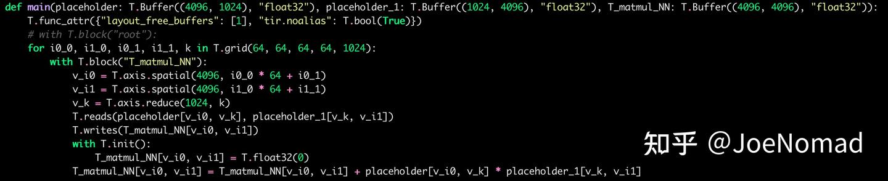

block swizzle 미적용 시 각 threadblock tile을 `(tbm, tbn)`으로 표기하면, 스레드 블록은 **axis n 방향 `(n + (tbn-1)) / tbn` 개를 먼저 발사**한 뒤 axis m을 순회. n이 매우 크면 **사실상 긴 직사각형 행렬 곱** — 발사된 모든 block이 우 행렬의 다른 global 위치를 읽음.

메모리 접근량:

$$\text{mem} = \text{leftmem} \times \text{lnums} + \text{rightmem} \times \text{rnums}$$
$$\text{leftmem} = tbm \times k, \quad \text{rightmem} = k \times tbn$$

- 미적용: `lnums = 1`, `rnums = n`
- 적용: 주어진 N step 안에서 다음 행으로 이동 → `lnums = N`, `rnums = n/N`. L2가 비었다고 가정 시 우 행렬 3회 적중

**swizzle 후, 같은 계산량에서 단일 tile 메모리 접근량이 작아지고**(전체 GEMM 총량은 변하지 않음), **load 과정에서 cache miss 감소**.

step = 4 예:

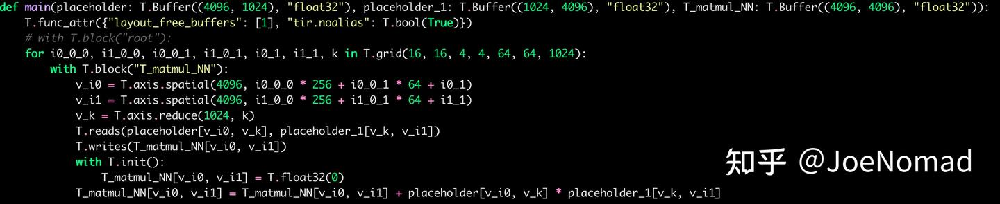

**On-chip cache는 비싼 자원이고 저장 공간이 작음**. 메모리 접근량이 L2 capacity 초과 시 이전 저장 내용이 밀려나 → 다시 접근 시 cache miss → HBM 접근 → load cycle 증가.

### TVM 등가 코드

위 로직 예시는 TVM으로 작성(더 간결·명확):

```python
from tvm import te, tir, topi

A = te.placeholder([4096, 1024], "float")
B = te.placeholder([1024, 4096], "float")
C = topi.nn.matmul(A, B)

func = te.create_prim_func([A, B, C])
sch = tir.Schedule(func)
sch.show()
mm_b = sch.get_block("T_matmul_NN")
v_m, v_n, k = sch.get_loops(mm_b)

# block tiling
tb_m, tb_n = (64, 64)
v_m_o, v_m_i = sch.split(v_m, [None, tb_m])
v_n_o, v_n_i = sch.split(v_n, [None, tb_n])
sch.reorder(v_m_o, v_n_o, v_m_i, v_n_i)
sch.show()

# block swizzle
N = 4  # step
v_m_o_o, v_m_o_i = sch.split(v_m_o, [None, N])
v_n_o_o, v_n_o_i = sch.split(v_n_o, [None, N])
sch.reorder(v_m_o_o, v_n_o_o, v_m_o_i, v_n_o_i, v_m_i, v_n_i)
sch.show()
```

## Tile Iterator

### 풀려는 문제

Tile iterator는 **좌·우 행렬의 load/store 메서드** 제공. 본 글은 conv2d iterator로 설명(상대적으로 복잡, 다룰 모든 최적화 수단 포함). 기본 로직 — 분할에 집중하면 **각 thread의 load 위치가 load 필요 여부**를 판단해야 함:

- **Conv2d padding**: kernel 3x3에서 슬라이딩 윈도가 좌상단이면 일부 원소는 padding — 실제 load 불필요, 0으로 채움
- **Conv2d·gemm 공통 — 꼬리 블록 처리**: 분할로 나누어떨어지지 않을 때 features 끝에서 초과분 발생. 0으로 채워 곱·누적해도 0이지만 계산 오버헤드 증가

### 소스 위치

conv2d iterator에 두 일반 케이스 — **analytic**과 **optimized**. 차이는 **mask pre-compute로 load 인덱스 계산 비용 감소** 여부.

```
include/cutlass/conv/threadblock/conv2d_fprop_activation_tile_access_iterator_analytic.h
include/cutlass/conv/threadblock/conv2d_fprop_activation_tile_access_iterator_optimized.h
include/cutlass/conv/threadblock/conv2d_tile_iterator.h
```

다른 iterator(filter iterator는 activation보다 단순, fewchannel은 강한 사전 지식 보유)도 있음. 위 3개로 iterator 최적화 방법 모두 설명 가능.

`conv2d_tile_iterator`는 공통 클래스 — load/store 구현:

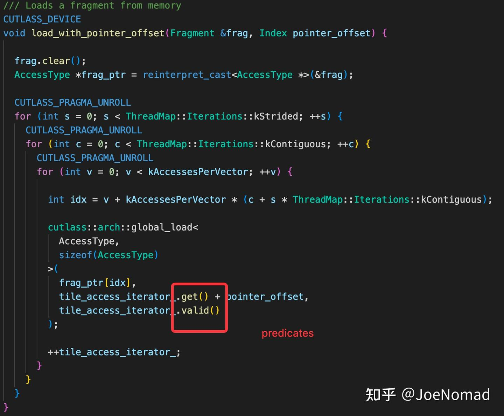

각 iterator 파일은 자체 요구로 특정 판단 — load pointer 인덱스 계산:

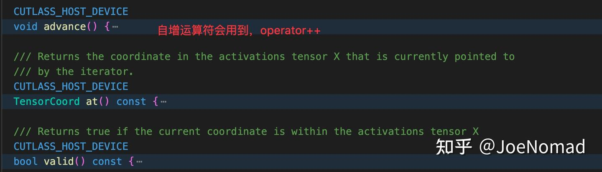

### Tile Iterator 로직 분석

shared memory load 방법: **각 threadblock 크기를 각 warp에 균분**, 각 warp이 분할 블록 읽음. GPU 메모리 접근 명령 **최대 대역폭은 128bit = 16B** — fp16에서 warp 1회 최대 `32 × 8` 값 load. 한 번에 다 못 읽으므로 **threadmap의 `kStride`** 가 다음 접근 step. **`kContiguous`** 는 최대 접근 명령 사용 시 1. **CUTLASS는 contiguous당 128bit 처리** — align 미충족 시 매번 `128bits / align` 회 루프. **큰 align이 성능 향상** — `k=33`과 `k=32` 성능 차가 크지만 계산량은 비슷.

**analytic iterator** — 기초 구현, 로직 명확:

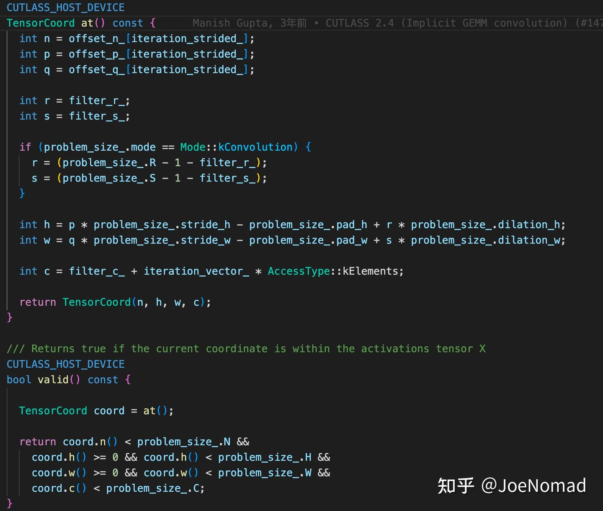

n·p·q·k·r·s 의미는 CUTLASS 문서의 **implicit_gemm** 로직 참고.

iterator 생성자에서 각 stride에 대해 **n·p·q 값 미리 계산**. `at` 함수는 현재 슬라이딩 윈도 위치로 feature의 **n·h·w·c 역추산**. `valid` 함수는 단순 — n·h·w·c가 조건 충족 여부 boolean → special register → 실행 시 load 여부 판단.

여기서 발견 — n·h·w·c 계산·판단에 **scalar 연산이 많음**. GPU에서 이런 연산(특히 `&&`)은 비용이 큼 — 가능한 한 불필요 scalar 연산 최적화 필요. **optimized iterator의 처리가 매우 정교**:

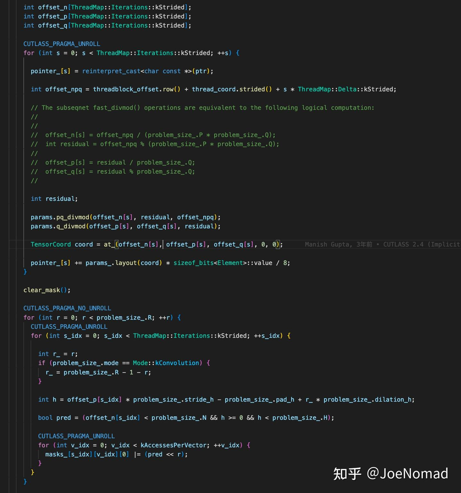

각 stride에 대해 **특정 슬라이딩 윈도 위치 접근 시 valid 여부를 미리 계산** — boolean이므로 **int32 하나에 비트로 표현**. 예: 3×3 kernel에서 kw mask가 `00000011`(앞 8 bit만) — kw가 슬라이딩 윈도 `(x, 0), (x, 1)` 접근 시 read, `(x, 2)`는 안 함. 본질은 **공간으로 시간 교환**.

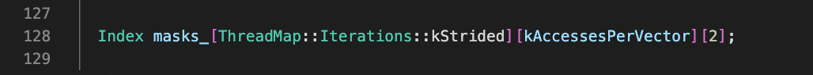

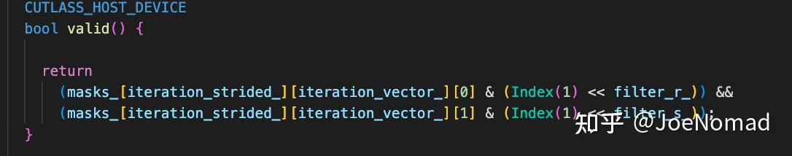

코드에서 **scalar 연산 많이 감소** → load 시 인덱스 계산에 덜 bound. 그러나 전체 GEMM for loop 메모리 접근 인덱스 계산 관점에서는 추가 최적화 여지 — 하지만 **컴포넌트 단위**라 DSL처럼 **overall symbolic 표현으로 대수 단순화·공통 부분식 제거** 불가. NVCC 내부 분석 능력에 의존. 이런 작성법 자체에 한계 — 예: 이전에 `CS2R` 같은 이상한 명령에 bound된 적 있음. 컴파일러가 최적화하기 어려운 영역.
