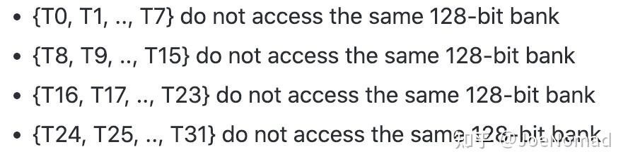
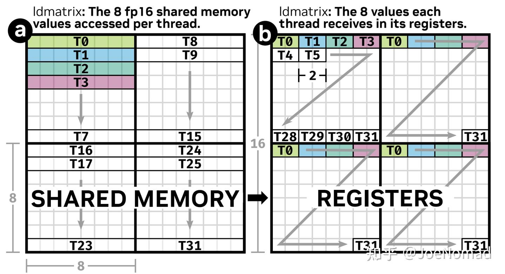
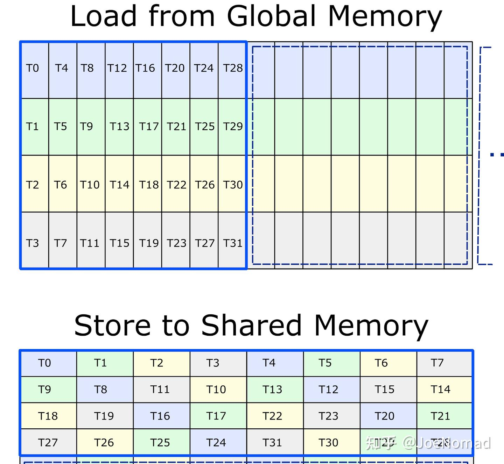
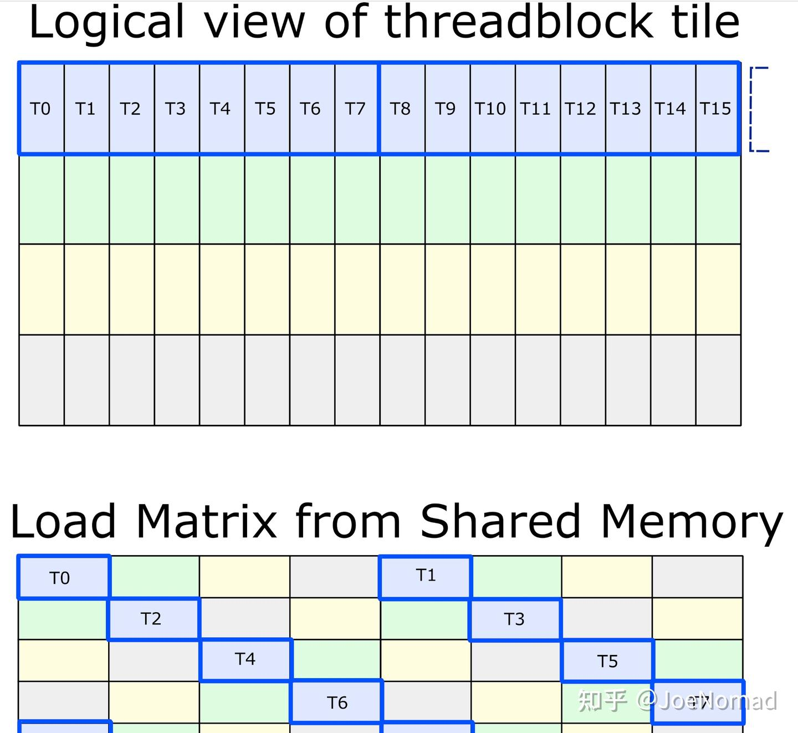
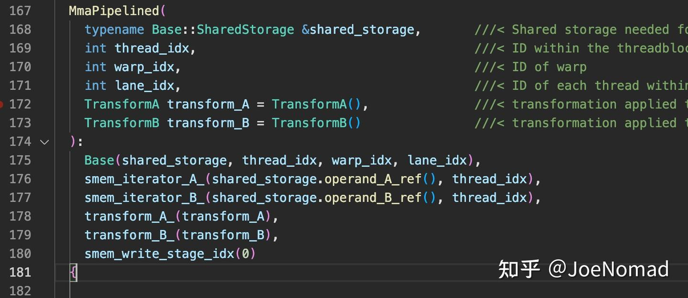
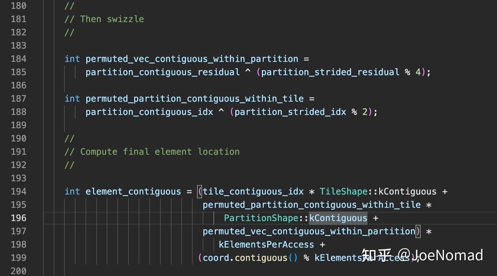
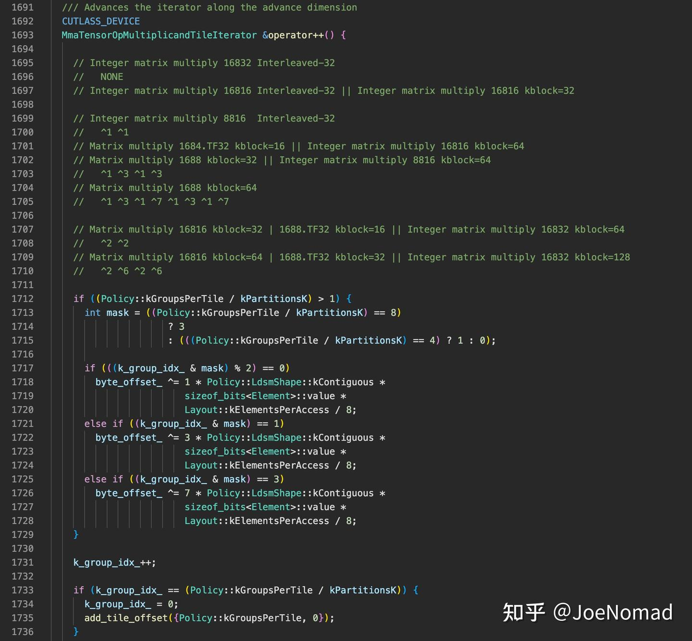
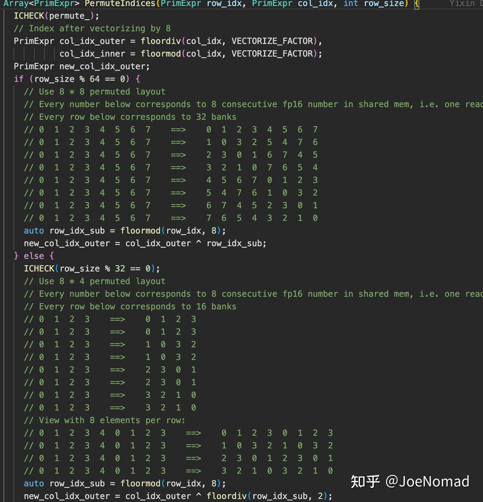
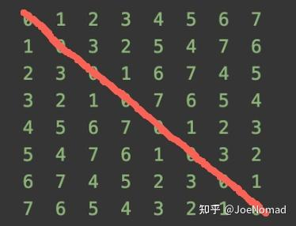

# [CUTLASS 심층 분석 시리즈] 0x03 — CUTLASS 소스 분석 (2): bank conflict free shared memory layout (TVM 등가 pass 포함)

> 원문: https://zhuanlan.zhihu.com/p/681966685

## 시작

[이전 글](../B37_cutlass_block_swizzle_tile_iterator/README.md)에서 block swizzle과 iterator의 global ptr 인덱스 계산 로직을 분석했습니다. 본 글은 global → shared와 shared → register의 매우 중요한 최적화 — **bank conflict free smem layout** (smem swizzle, CuTe 3.0 API에는 swizzle IR 추상이 있음). 이 최적화로 **shared store/load의 bank conflict를 동시 제거**해 메모리 접근 효율 향상.

**본 글 초점**:

1. swizzle이 왜 필요한가, 행렬 곱에서 bank conflict 원인
2. swizzle이 어떻게 bank conflict를 제거하는가
3. swizzle의 수학식 유도와 핵심 코드 위치

## 서론

### 개요

행렬 곱의 shared memory bank conflict는 **for loop tiling으로 인한 load/store 축 교환**에서 발생. ldmatrix의 load 행동은 tiling의 강한 사전 지식 — for loop tiling 방식을 제한.

먼저 두 가지 확인:

1. bank conflict 원인과 일반 해법
2. ldmatrix 작동 원리

### Bank Conflict 원인과 일반 해법

shared memory는 32 bank, 각 bank 폭 4B. 같은 warp의 다른 thread가 같은 bank 접근 시 conflict. 그러나 GPU 각 thread 접근이 4B 초과(=warp 128B 초과)면 **각 warp이 여러 transaction으로 분할 실행**, 각 transaction이 thread 내 접근이 같은 bank에 떨어지지 않으면 됨. 최대 접근 명령 사용 시 **1/4 연속 thread에 주소 중첩이 없어야 함**.



흔한 케이스 — **transpose**. `(32, 32)` float 행렬 접근, smem도 같은 크기 array. **store 시 bank conflict 없음**. 그러나 **load 시 transpose를 위해 한 열 접근** → 32 thread가 같은 bank로 떨어짐 → bank conflict.

```cpp
// transpose에서 padding으로 해결:
// 한 열 접근 시 column id가 행마다 우측 오프셋 → bank conflict 회피
__shared__ float tile[TILE_DIM][TILE_DIM+1];
```

행렬 곱 bank conflict 로직도 동일 — 한 행 × 한 열(직사각형 블록, 폭 ≠ 1)이라 conflict 발생. padding으로 해결할 수 있지만, **행렬 곱의 shared memory 사용량이 매우 커서 padding은 인덱스 오프셋 용도일 뿐 실제 저장 가치 없음** → **occupancy 저하**, 과한 낭비는 커널 성능 저하.

### ldmatrix(LDSM) 명령 작동 방식

ldmatrix는 **최대 4개의 8x8 행렬**(16bit 폭 데이터)을 register로 load. **각 thread는 128bit 데이터 load 후 인접 4 thread에 broadcast**(원리는 `__shfl_sync`와 유사). 각 thread는 최종 4 × 32bit 데이터(4개 8x8 행렬) 획득. graphene(ASPLOS'23 NV 논문)의 도해가 가장 직관적:



다만 그림의 broadcast 동작에 약간 오해 — T0이 8 값 read 후 4분할해 T0-T3에 공유하는 게 아니라, **녹색 4개 32bit 데이터는 사실 `{T0, T8, T16, T24}`에서 옴** → **각 thread가 받는 데이터는 실제 불연속**.

## 본론

### 문제 단순화

**1/4 warp이 다른 bank에 접근하면 conflict free** → 부분 문제 도출: **`(4, 64)` 블록에서 bank conflict 없으면 됨**. 좌·우 행렬은 이 블록으로 n개 tile로 분할.

### 핵심 layout 변환 — bank conflict free layout

CUTLASS 문서의 row-major filter 예. 32x8 load 후 transpose하여 row-major로 shared에 저장(ldmatrix는 `.trans`로 명령 내부 transpose 가능):



store 시 **각 1/4 warp이 같은 행 = 다른 bank**:



load 시 각 thread fragment의 index도 다른 열 → **bank conflict 없음**.

```cpp
// (4, 64) 블록 안 각 thread 분할:
int row = (lane_id >> 1) & 3;
int store_column = (lane_id % 8) ^ (lane_id / 8);
```

**한 행이 group, 4 행이 한 cycle**. XOR은 결합법칙 만족 → **첫 group column 값을 먼저 계산 후 재귀형으로**:

```cpp
// k = {0, 1, 2, 3}
// ^1: k=0 → k=1
// ^3: k=1 → k=2
// ^1: k=2 → k=3
// ^3: k=3 → k=0
// 유도: x ^ 2 = x ^ (1 ^ 3) = (x ^ 1) ^ 3 = x_1 ^ 3
int store_column_next = (k & 1 == 0) ? (store_column ^ 1) : (store_column ^ 3);
```

### 소스 위치

```
cutlass/layout/tensor_op_multiplicand_sm75.h
cutlass/gemm/warp/mma_tensor_op_tile_iterator.h
cutlass/gemm/threadblock/mma_pipelined.h
```

2 stage 예 — shared store init offset은 생성자에서 완성:





cuda-gdb로 break point 걸면 backtrace가 명확해짐:



### TVM의 등가 pass

TVM에 동일 사상의 pass — 주석만 보면 layout 작용·유효 케이스 이해 가능:



`(64, 64)` 블록 load 가정 — ldmatrix 1회로 다 못 읽음. 행렬 곱 부분 문제를 `(8, 32) × (32, 8)`(ldmatrix 1회 접근량)로 변환. 좌 행렬 `{T0-T7}`은 **대각선 위치 read** → bank conflict 없음:



```python
# tvm/tests/python/tir-transform/test_tir_transform_inject_permuted_layout.py 참고

# schedule
sch.annotate(block_or_loop=b53, ann_key="permuted_layout", ann_val="g2s_A")

# primfunc block
T.block_attr({"permuted_layout": "g2s_A"})
for ax0_ax1_fused_0 in range(4):
    for ax0_ax1_fused_3 in T.vectorized(8):
        X_reindex_shared_dyn[
            ax0_ax1_fused_0 * 32 + threadIdx_y * 8 + threadIdx_x // 4,
            threadIdx_x % 4 * 8 + ax0_ax1_fused_3
        ] = X[
            blockIdx_y // 8 * 128 + ax0_ax1_fused_0 * 32 + threadIdx_y * 8 + threadIdx_x // 4,
            ax2_0_0 * 32 + threadIdx_x % 4 * 8 + ax0_ax1_fused_3
        ]
```

## 마무리

새해 복 많이 받으세요~

## Reference

- An Efficient Matrix Transpose in CUDA C/C++ | NVIDIA Technical Blog
- Tensor Core의 ldmatrix 명령 장점
- Graphene: An IR for Optimized Tensor Computations on GPUs (ASPLOS'23)
