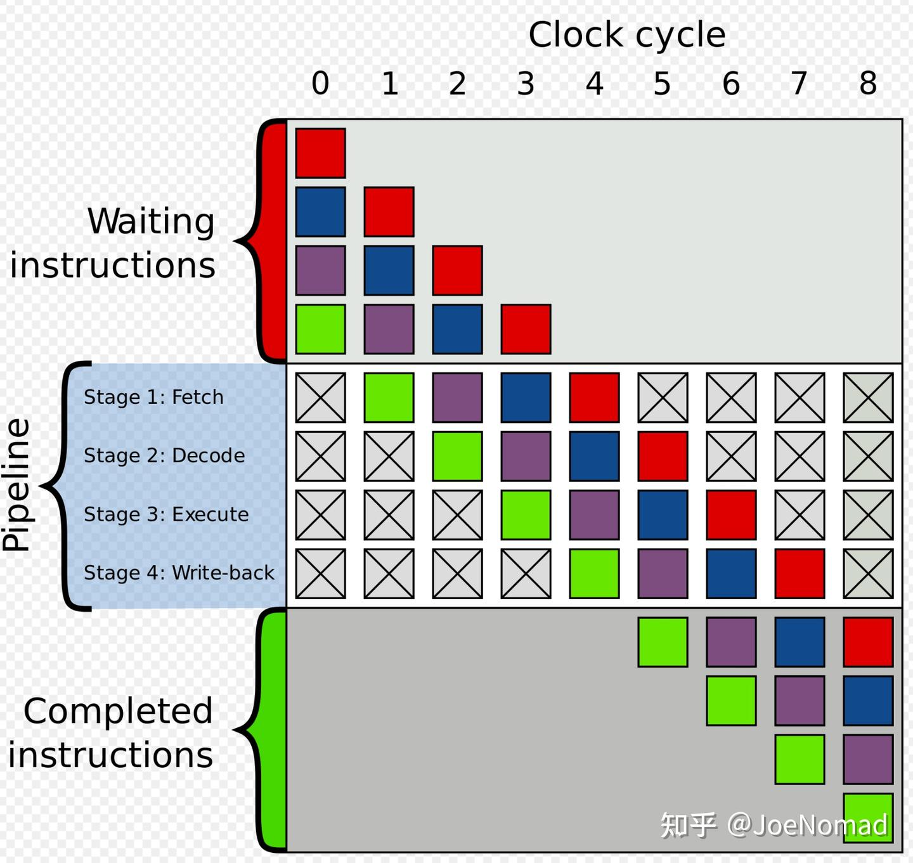
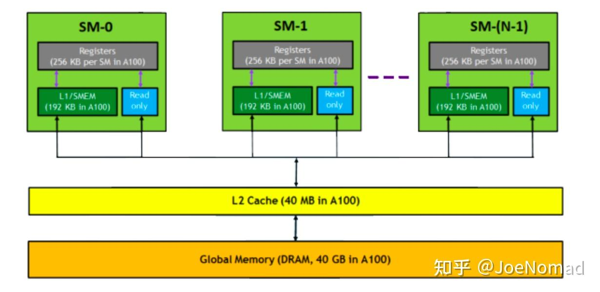
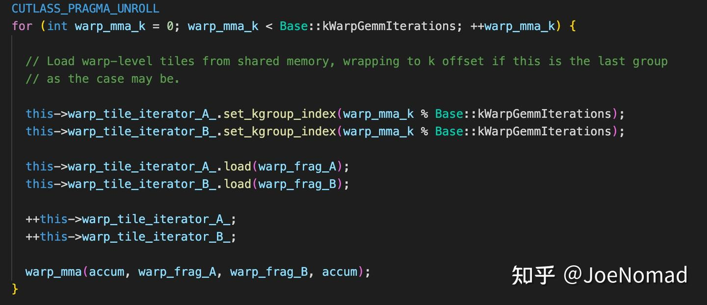
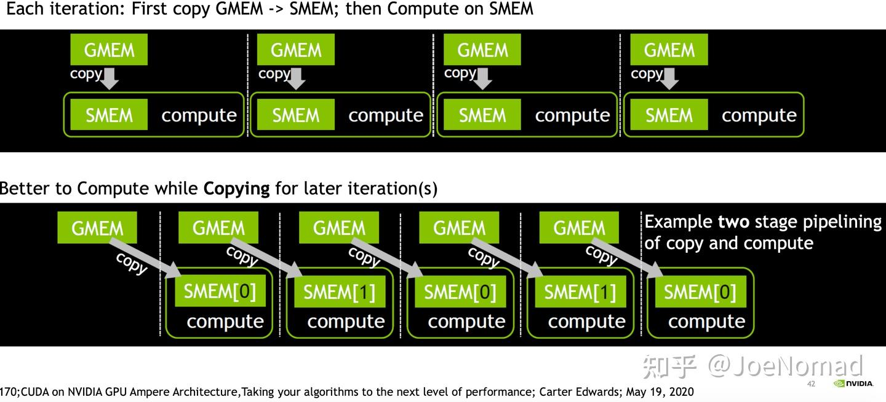
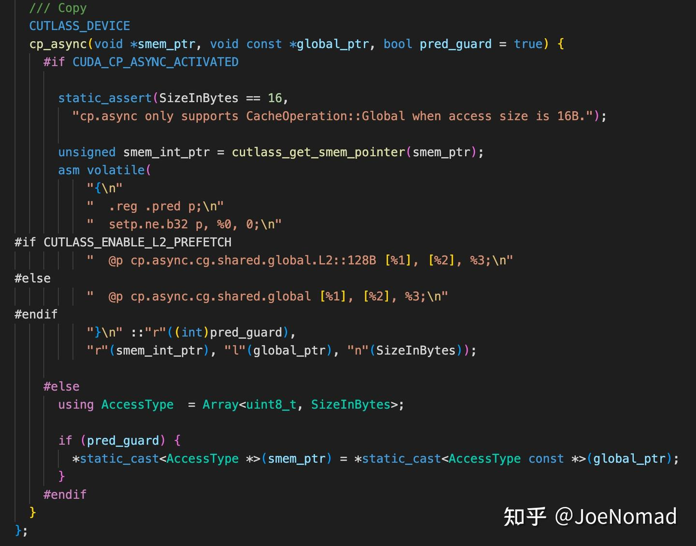
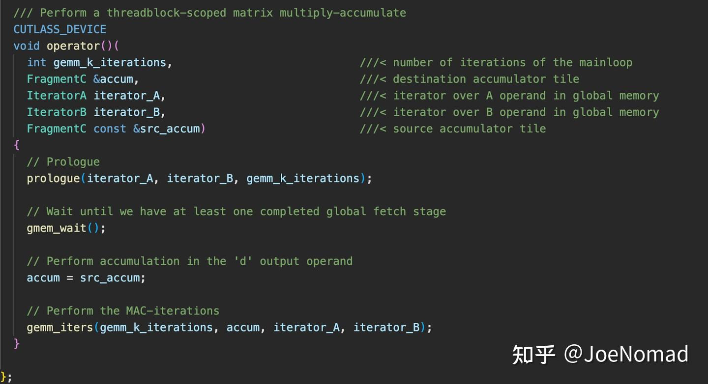

# [CUTLASS 심층 분석 시리즈] 0x04 — CUTLASS 소스 분석 (3): 다단 파이프라인 (software pipeline)

> 원문: https://zhuanlan.zhihu.com/p/687397095

## 시작

본 글은 짧음. 소스 분석 시리즈의 마지막으로, **다단 파이프라인**을 다룹니다. 다른 최적화 수단은 앞 글들에서 충분히 다뤘습니다. 이후엔 더 high level 내용(다른 AI infra에서 CUTLASS 응용)을 다룰 예정.

## 서론

### 다단 파이프라인 개념

오랜 역사를 가진 개념. **다른 HW 유닛이 처리하는 작업을 오버랩** → 전체 HW 활용률 향상. 이상적으로 프로그램 실행 시 모든 HW가 바쁘게 — 대기 최소화.



### GPU 다층 메모리

smem 데이터 이동: **global → L2 → L1 → RF → smem**

`cp.async`는 **L1과 RF를 bypass**, L2에서 smem으로 직접 복사.



## 본론

### Warp 내 GEMM 로직

Multi-level-tiling GEMM에서 split-k 미사용 시 각 warp이 분할 블록 `(tile_m, k) × (k, tile_n)` 처리. shared_memory 제약으로 k 차원 tiling → 계산 로직은 **`k/tile_k` 회 루프** → 작은 블록 최종 계산 값 획득.



### 데이터 의존성 처리

for 루프에서 **reduce sum** 계산 → **누적 부분에 읽기-쓰기 의존성** 있음. 그러나 분리해 보면 **누적 전 부분은 각 iter가 상호 독립**. stage 2 예 — **2 × smem + 2 × register file**(ldg → smem → rf → mma → rf)으로 두 다른 iter의 **누적 전 데이터 의존성 없음** 보장. 다단 파이프라인으로 일반화: **RF·smem 사용량은 stage 수와 선형 관계**.



다단 파이프라인은 **비동기 복사 `cp.async` asm**으로 완성:



sm80 이전 HW는 **2단 파이프라인만 가능**, 로직도 단순. 데이터 의존성만 잘 처리하면 컴파일러가 루프 펼침 시 load·compute 병렬 자동 완성. 비동기 다단 파이프라인도 로직은 큰 차이 없음 — **현재 iter에 사용할 smem·rf 인덱스 계산만 다름**.



## 마무리

### TVM의 software pipeline pass

TVM의 **`injective_software_pipeline`** pass도 같은 일을 수행. TVM script의 for loop에 annotation 추가 → pass 실행 시 루프 펼침과 데이터 의존성 처리 변환 완성. 자세한 구현은 `inject_software_pipeline.cc` 참고.

샘플:

```python
# before
@T.prim_func
def simple_compute(A: T.Buffer[(16, 16), "float32"], C: T.Buffer[(16, 16), "float32"]):
    for tx in T.thread_binding(0, 16, thread="threadIdx.x"):
        for i in T.serial(
            0, 16,
            annotations={
                "software_pipeline_stage": [0, num_stages],
                "software_pipeline_order": [0, 1],
            },
        ):
            with T.block("compute"):
                T.reads(A[tx, i])
                T.writes(C[tx, i])
                B = T.alloc_buffer((16, 1), dtype="float32", scope="shared")
                with T.block():
                    T.reads(A[tx, i])
                    T.writes(B[tx, 0])
                    B[tx, 0] = A[tx, i] * T.float32(2)
                with T.block():
                    T.reads(B[tx, 0])
                    T.writes(C[tx, i])
                    C[tx, i] = B[tx, 0] + T.float32(1)


# after
@T.prim_func
def transformed_simple_compute(
    A: T.Buffer[(16, 16), "float32"], C: T.Buffer[(16, 16), "float32"]
) -> None:
    for tx in T.thread_binding(0, 16, thread="threadIdx.x"):
        with T.block():
            T.reads([A[tx, 0:16]])
            T.writes([C[tx, 0:16]])
            B = T.alloc_buffer([2, 16, 1], dtype="float32", scope="shared")
            with T.block():
                T.reads([A[tx, 0]])
                T.writes([B[0, tx, 0]])
                B[0, tx, 0] = A[tx, 0] * T.float32(2)
            with T.block():
                T.reads([A[tx, 1:16], B[0:2, tx, 0]])
                T.writes([B[0:2, tx, 0], C[tx, 0:15]])
                for i in T.serial(0, 15):
                    with T.block():
                        T.reads([A[tx, i + 1]])
                        T.writes([B[(i + 1) % 2, tx, 0]])
                        B[(i + 1) % 2, tx, 0] = A[tx, i + 1] * T.float32(2)
                    with T.block():
                        T.reads([B[i % 2, tx, 0]])
                        T.writes([C[tx, i]])
                        C[tx, i] = B[i % 2, tx, 0] + T.float32(1)
            with T.block():
                T.reads([B[1, tx, 0]])
                T.writes([C[tx, 15]])
                C[tx, 15] = B[1, tx, 0] + T.float32(1)
```

CUTLASS 관련 최적화 수단 정리는 여기까지. 누락·오류 있으면 댓글 환영.
