# CUTLASS 2.x & CUTLASS 3.x Intro 학습 노트

> CUTLASS GEMM template에는 조정하고 설정할 수 있는 template parameter가 매우 많고, 이 parameter 설정은 Kernel performance에 큰 영향을 준다. 이 sharing은 2.x부터 3.x까지 CUTLASS kernel implementation이 어떻게 변했는지, 이런 parameter의 principle과 선택 best practice를 소개한다. Slides는 BiliBili NVIDIA 채널에 올라온 "TensorRT-LLM의 Quantization GEMM(Ampere Mixed GEMM) CUTLASS 2.x 구현 해설" video explanation에서 왔다. 여기서는 video를 참고하고 각 Slides의 핵심을 더 자세히 기록했다. 이 video를 통해 CUTLASS를 macro하게 처음 이해했고, CUDA-MODE의 CUTLASS course를 듣기 전 사전 학습 내용으로 삼았다.

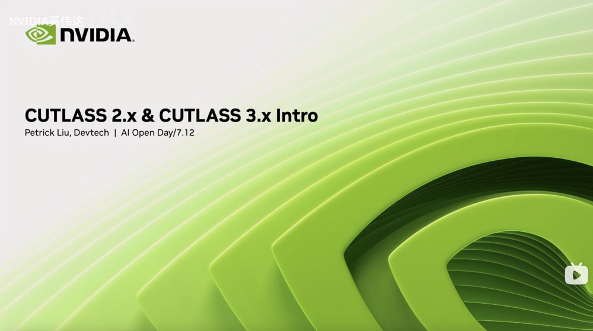

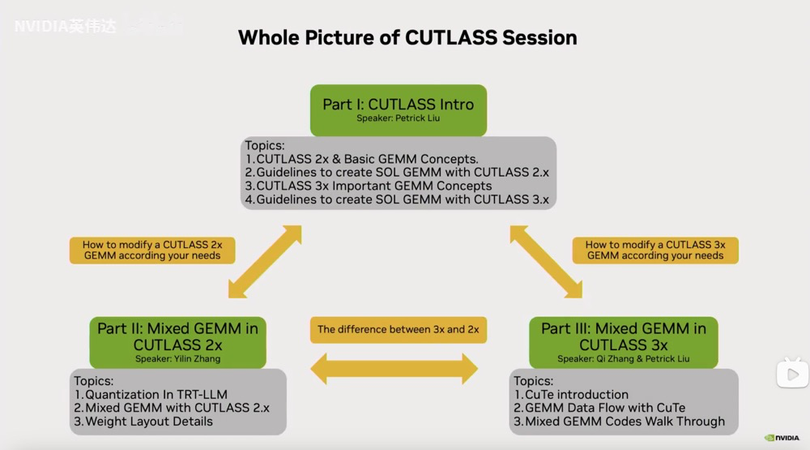

이 Slides는 CUTLASS session의 overall structure를 보여주며, 주로 세 부분으로 구성된다.

Part I: CUTLASS introduction
    - speaker: Petrick Liu
    - topic:
        - CUTLASS 2x와 basic GEMM concept
        - CUTLASS 2x로 SOL GEMM을 만드는 guide
        - CUTLASS 3x의 important GEMM concept
        - CUTLASS 3x로 SOL GEMM을 만드는 guide
Part II: CUTLASS 2x의 MixedGEMM
    - speaker: Yilin Zhang
    - topic:
        - TRT-LLM의 quantization
        - CUTLASS 2.x를 사용한 MixedGEMM
        - weight layout detail
Part III: CUTLASS 3x의 MixedGEMM
    - speaker: Qi Zhang & Petrick Liu
    - topic:
        - CuTe introduction
        - CuTe를 사용한 GEMM dataflow
        - MixedGEMM code walkthrough

Slides는 각 part 사이의 relation도 보여준다.
    - requirement에 따라 CUTLASS 2x와 3x GEMM을 어떻게 modify하는가
    - 3x와 2x의 difference

여기서는 CUTLASS가 주로 custom operator를 만들기 위한 것이라고 언급한다. 하지만 learning curve가 매우 가파르고, CUTLASS를 이해하고 배우는 단계에서 CUTLASS로 실제 work하는 무언가를 만드는 단계 사이에는 큰 gap이 있다. 두 번째 part는 Hopper architecture 이전 GPU에서 CUTLASS가 MixedGEMM을 어떻게 수행하는지 소개한다. 세 번째 part는 Hopper와 Hopper 이후 GPU에서 CUTLASS 3x의 MixedGEMM을 소개한다.

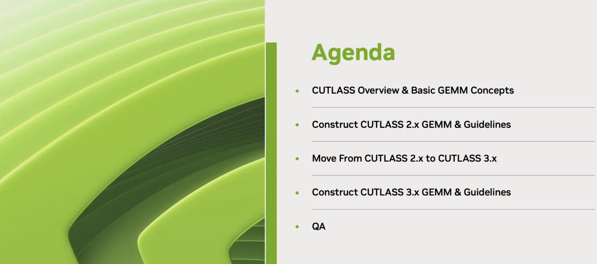

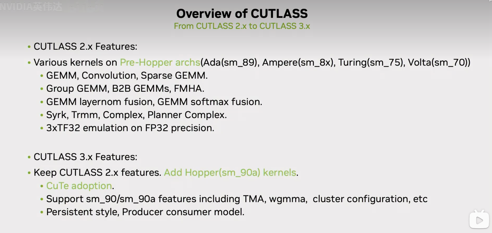

이 Slides는 CUTLASS(CUDA Templates for Linear Algebra Subroutines)가 2.x version에서 3.x version으로 오면서 가진 주요 feature와 progress를 개괄한다.

CUTLASS 2.x feature:

- Ada(sm_89), Ampere(sm_8x), Turing(sm_75), Volta(sm_70)를 포함한 여러 Pre-Hopper architecture GPU를 지원한다.
- GEMM, convolution, sparse GEMM 같은 다양한 core feature를 제공한다.
- Group GEMM, B2B GEMMs, FMHA를 지원한다.
- GEMM layernorm fusion, GEMM softmax fusion.
- Syrk, Trmm, Complex, Planner Complex 등의 operation을 지원한다.
- FP32 precision에서 3xTF32 emulation을 지원한다.

CUTLASS 3.x feature:

- CUTLASS 2.x의 모든 feature를 유지하면서 Hopper architecture(sm_90a) 지원을 추가했다.
- CuTe abstraction(CUDA Templates)을 채택했다.
- sm_90/sm_90a의 new feature를 지원한다. TMA, wgmma, cluster configuration 등이 포함된다.
- persistent style과 producer-consumer model을 도입했다.

> CUTLASS 3.x의 code style은 크게 변했다.

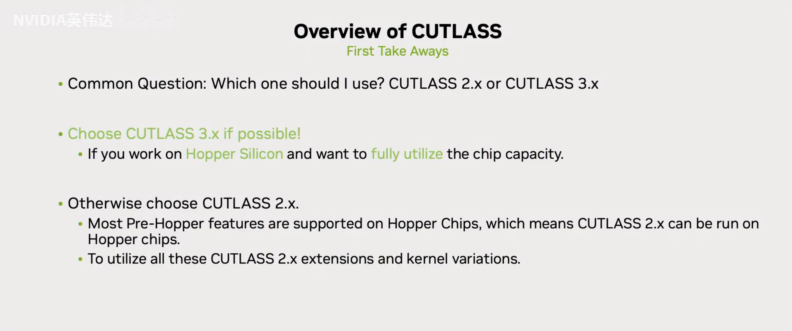

이 Slides는 CUTLASS library version selection guide를 설명한다.

- common question: CUTLASS 2.x를 써야 하는가, CUTLASS 3.x를 써야 하는가?
- **Hopper architecture GPU에서** 작업하고 chip performance를 **fully utilize**하고 싶다면 CUTLASS 3.x를 선택한다.
- 그렇지 않다면 CUTLASS 2.x를 선택한다.
    - 대부분의 Pre-Hopper(Hopper 이전 architecture) feature는 Hopper chip에서도 여전히 지원되므로, CUTLASS 2.x도 Hopper chip에서 run할 수 있다.
    - CUTLASS 2.x의 모든 extension과 kernel variant를 사용하고 싶을 때.

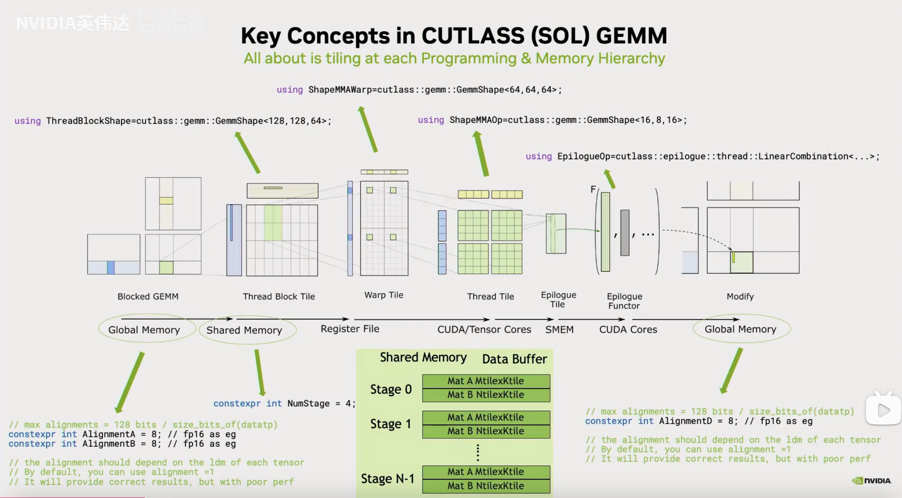

이 그림은 CUTLASS GEMM의 core concept diagram이다. C matrix 관점에서 보면, matrix C를 작은 block으로 나누고 각 BLOCK이 하나씩 맡아 computation한다. 이어 WARP가 computation을 담당하도록 지정한다. WARP는 이 small block 안의 특정 part를 맡는다. 예를 들어 그림의 Thread Block Tile에서 green block이다. 각 WARP에는 32 thread가 있고, 각 thread는 어느 부분을 계산해야 하는가? Warp Tile 그림은 이 detail을 더 확대한다. green block 네 개는 thread 하나가 담당할 matrix C의 일부를 나타낸다. 마지막으로 thread level까지 내려가면 각 thread는 자신의 register를 가지고 자신의 work를 수행한다. 더 오른쪽은 Epilogue다. 많은 사람이 CUTLASS를 사용할 때 첫 번째로 하는 것이 GEMM 뒤에 Activation 같은 post-processing을 붙이는 일이다. 마지막으로 data를 Global Memory에 write back하여 전체 operation을 완료한다. tiling의 key parameter와 Epilogue operation type은 그림의 using statement가 지정한다.

이 그림은 CUTLASS의 concept이지만 data movement도 함께 그린다. data는 Global Memory에서 level by level로 전달되어야 한다. Tiling 외의 또 다른 중요한 concept은 data를 가능한 한 high-level cache에 reuse하여 더 높은 bandwidth를 얻고, global memory data를 자주 읽는 일을 피하는 것이다. 따라서 data를 Shared Memory와 register에 두고, Tensor Core가 register에서 compute한 뒤 Shared Memory에 write하고, 마지막으로 Shared Memory에서 Global Memory로 write back한다.

이어 그림의 왼쪽 아래와 오른쪽 아래는 각각 Global Memory read/write granularity를 나타낸다. FP16을 예로 들면 8로 설정한다(128 bits / size_bits_of(datatp)). Tiling 외에도 Overlap을 고려해야 한다. 지금은 Tiling으로 thread block/thread가 어떤 일을 해야 하는지 결정하고, memory Streaming process를 통해 data를 가능한 한 storage hierarchy에서 reuse한다. `NumStage` template parameter는 computation과 transfer overlap을 위해 추가 Buffer를 몇 개 열지 결정한다(Double Buffering 참고). 이는 가장 아래 가운데 그림과 같다.

위 parameter를 통해 하나의 CUTLASS Kernel을 완전히 configure할 수 있다.

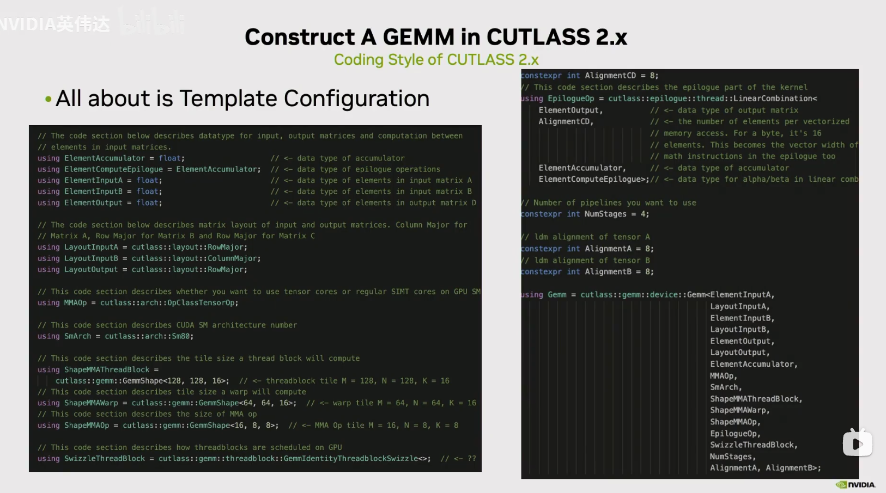

이 Slides는 CUTLASS 2.x에서 GEMM(general matrix multiplication) operation을 구성하는 방법을 보여준다. title은 CUTLASS 2.x coding style을 강조한다. "All about is Template Configuration", 즉 모든 것은 template configuration에 관한 것이다.

code example은 CUTLASS 2.x의 GEMM operation에 대한 여러 configuration item을 보여준다.
- data type definition:
    - input/output matrix element type
    - accumulator type
    - post-processing operation type
- matrix layout:
    - input/output matrix의 row-major 또는 column-major를 정의한다.
- hardware-related configuration:
    - Tensor Core를 사용할지 ordinary SIMT core를 사용할지 선택한다.
    - CUDA SM architecture version, 예: SM80을 지정한다.
- computation-related configuration:
    - thread block tile size
    - warp tile size
    - MMA(matrix multiply-accumulate) operation size
- GPU 위의 thread block scheduling method
- CD(output tensor?) memory access alignment requirement
- pipeline stage count, 위에서 말한 computation/memory access pipeline
- tensor A와 B의 alignment

마지막에는 하나의 `Gemm` type definition을 통해 이 모든 configuration item을 합쳐 instantiate할 수 있는 Type으로 만든다.

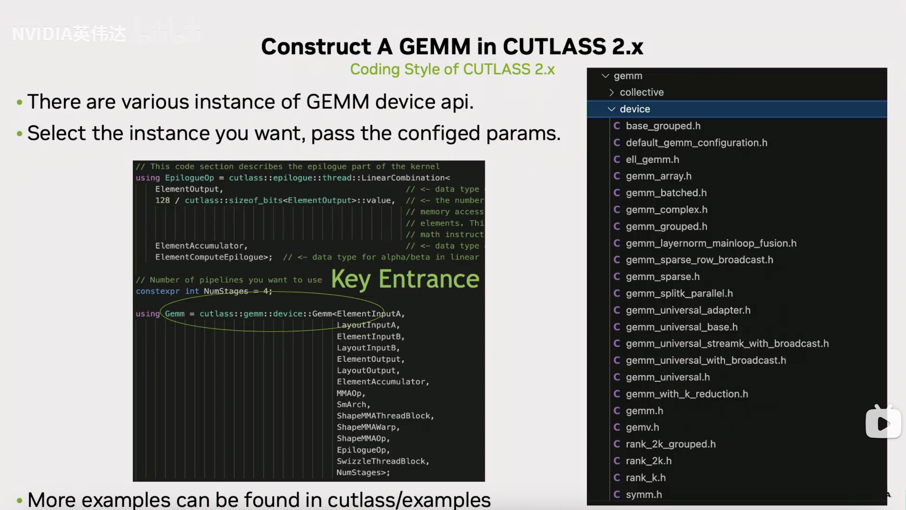

이 Slides는 적절한 GEMM variant와 configuration parameter를 선택해 서로 다른 requirement를 만족시키는 방법을 보여준다. 동시에 CUTLASS가 매우 풍부한 GEMM implementation을 제공하여 다양한 special case와 optimization scenario를 처리할 수 있음을 지적한다. 이 방식으로 developer는 concrete requirement에 따라 가장 알맞은 GEMM implementation을 선택하고 fine-grained performance optimization을 수행할 수 있다.

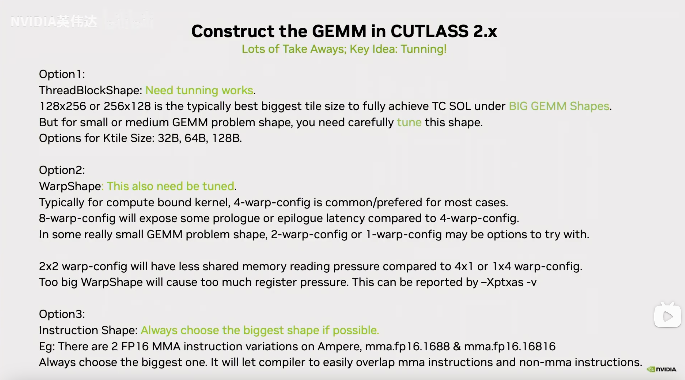

이 Slides는 CUTLASS 2.x에서 GEMM을 구성할 때의 key optimization option을 설명한다. 주요 내용은 다음과 같다.
- core idea: tuning이 핵심이다.
- Option 1: ThreadBlockShape
    - tuning이 필요하다.
    - large GEMM의 경우 128x256 또는 256x128이 보통 best tile size다.
    - small/medium GEMM의 경우 이 shape를 세심하게 조정해야 한다.
    - K dimension tile size option: 32B, 64B, 128B.
- Option 2: WarpShape
    - 역시 tuning이 필요하다.
    - compute-intensive kernel의 경우 4-warp configuration이 일반적으로 가장 많이 쓰이거나 preferred된다.
    - 8-warp configuration은 prologue 또는 epilogue stage에 latency를 도입할 수 있다.
    - very small GEMM problem에서는 2-warp 또는 1-warp configuration을 시도할 수 있다.
    - 2x2 warp configuration은 4x1 또는 1x4 configuration보다 shared memory read pressure가 더 낮다.
    - 너무 큰 WarpShape는 register pressure를 크게 만들며, `-Xptxas -v` command로 확인할 수 있다.
- Option 3: Instruction Shape
    - 항상 가능한 maximum shape를 선택한다.
    - 예: Ampere architecture에는 FP16 MMA instruction variant가 두 가지 있다. `mma.fp16.16.8.8`과 `mma.fp16.16.16.16`이다.
    - 가장 큰 것을 선택하면 compiler가 MMA instruction과 non-MMA instruction을 overlap하기 더 쉬워진다.

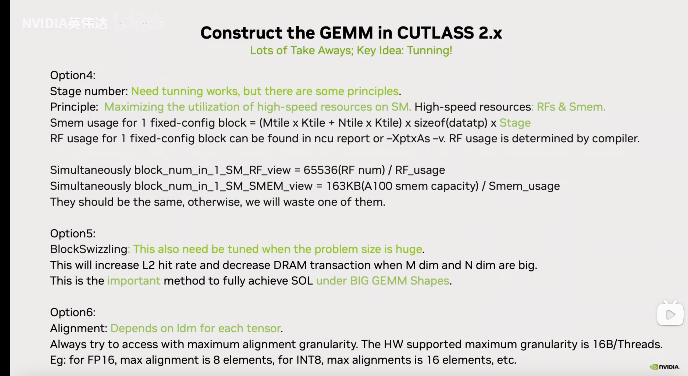

이 Slides는 CUTLASS 2.x에서 GEMM을 구성할 때의 더 많은 optimization option을 이어서 설명한다. 주요 내용은 다음과 같다.
- Option 4: Stage number
    - tuning이 필요하지만 몇 가지 principle이 있다.
    - principle: SM 위의 high-speed resource utilization을 maximize한다. high-speed resource에는 register file(RFs)과 shared memory(Smem)가 포함된다.
    - shared memory usage formula: `(Mtile x Ktile + Ntile x Ktile) x sizeof(datatp) x Stage`
    - register usage는 ncu report 또는 `-XptxAs -v` command로 볼 수 있다.
    - 한 SM에서 동시에 run 가능한 thread block 수 = 65536(total RF count) / thread block당 RF usage
    - 한 SM에서 동시에 run 가능한 thread block 수 = 163KB(A100 GPU의 SMEM capacity) / thread block당 SMEM usage
    - 이 두 계산 결과가 같아야 한다. 같지 않으면 RF 또는 SMEM 중 하나의 resource가 충분히 활용되지 않고 waste가 생긴다는 뜻이다. 이 principle의 core idea는 RF와 SMEM utilization을 동시에 maximize하는 것이다. RF 관점에서 계산한 concurrent block count와 SMEM 관점에서 계산한 값이 다르면, 한 resource는 bottleneck이고 다른 resource는 underutilized라는 뜻이다.
- Option 5: BlockSwizzling
    - problem size가 클 때 tuning이 필요하다.
    - L2 cache hit rate를 높이고 DRAM transaction을 줄일 수 있다. 특히 M dimension과 N dimension이 클 때 그렇다.
    - large GEMM shape에서 SOL(Speed Of Light)을 구현하는 important method다.
- Option 6: Alignment
    - 각 tensor의 ldm(leading dimension)에 따라 달라진다.
    - 항상 가능한 largest alignment granularity로 access하려고 시도한다. hardware가 지원하는 maximum granularity는 16B/thread다.
    - 예: FP16의 maximum alignment는 8 elements, INT8의 maximum alignment는 16 elements다.

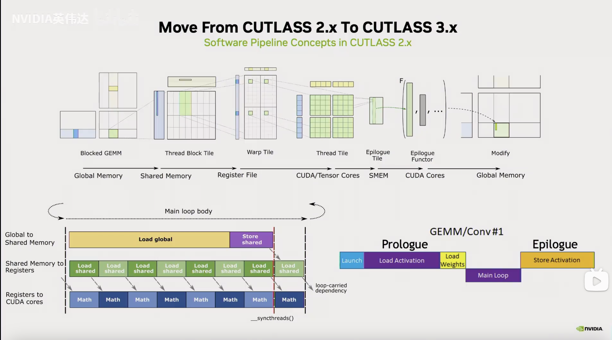

이 Slides는 CUTLASS 2.x에서 CUTLASS 3.x로의 architecture change를 보여준다. CUTLASS 2.0(Ampere-like architecture style)에서는 Tiling과 memory hierarchy reuse 외에도 software pipeline 방식으로 global memory read/write latency와 computation을 hide하고 싶어 한다. 즉 current computation을 수행하는 동안 다음 computation round에 필요한 data를 읽어오고, 이 process를 pipeline으로 만든다. stable pipeline에 들어가기 전, 즉 그림의 Main loop body에는 pipeline을 build하는 process가 있다. computation prefetch를 수행했으므로 current computation data는 이미 이전 몇 round에서 가져와져 있어야 한다. data prefetch는 Prologue라고 부르며, GEMM의 전체 computation process는 Prologue, Main Loop, Epilogue로 나뉜다. Tensor Core computation은 Main Loop에서 발생한다.

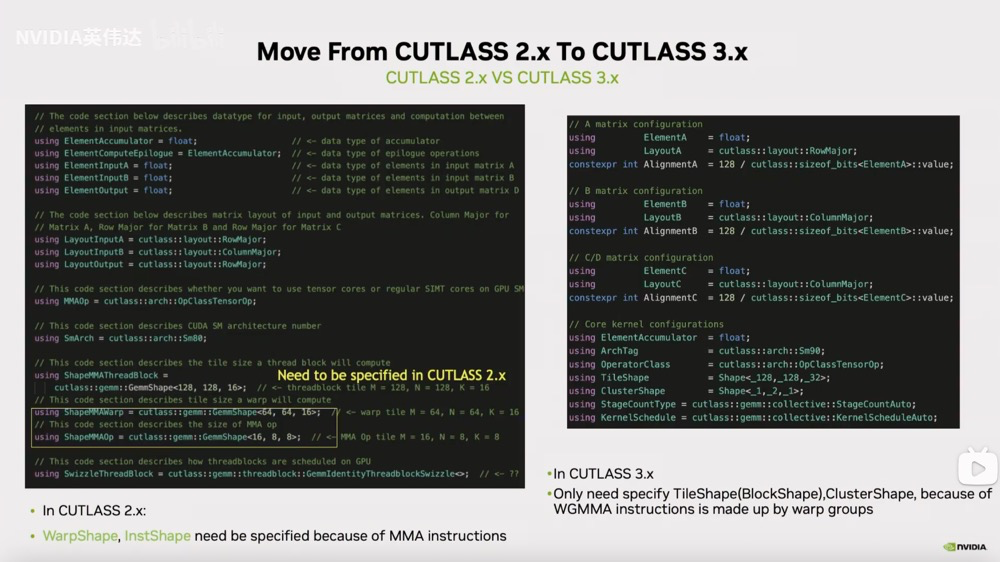

이 Slides는 CUTLASS 2.x와 CUTLASS 3.x가 GEMM operation을 configure할 때의 main difference를 비교한다.

- CUTLASS 2.x:
    - 더 많은 configuration parameter를 명시적으로 지정해야 한다.
        - input, output, compute data type
        - matrix layout
        - Tensor Core 또는 SIMT core 사용 여부
        - CUDA SM architecture version
        - thread block tile size
        - Warp tile size
        - MMA(matrix multiply-accumulate) instruction size
        - thread block scheduling method
    - WarpShape와 InstShape를 지정해야 한다는 점을 강조한다. 이것이 MMA instruction과 관련되기 때문이다.

- CUTLASS 3.x:
    - configuration이 더 단순해지고, 주로 다음을 지정한다.
        - matrix A, B, C/D의 element type, layout, alignment
        - core kernel configuration, including accumulator type, architecture tag, operation class
        - TileShape(BlockShape)와 ClusterShape
    - WarpShape와 InstShape를 명시적으로 지정할 필요가 없다. WGMMA(Warp Group Matrix Multiply-Accumulate) instruction이 warp group으로 구성되기 때문이다.

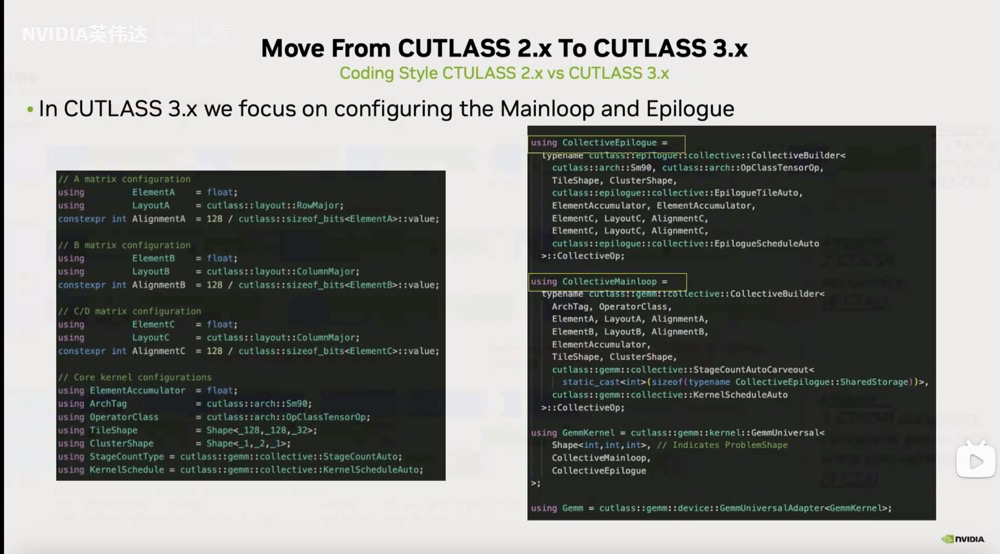

CUTLASS 3.x에서는 Mainloop와 Epilogue configuration에 집중한다. 구체적으로는 `CollectiveEpilogue` type으로 post-processing operation을 정의한다. architecture, tile shape, accumulator type 같은 parameter를 포함한다. `CollectiveMainloop` type으로 main loop를 정의한다. architecture tag, operation class, matrix configuration, tile shape 같은 parameter를 포함한다. `GemmKernel`을 정의해 Mainloop와 Epilogue를 combine한다. 마지막으로 `Gemm`을 정의하고 `GemmUniversalAdapter`를 사용한다.

CUTLASS 3.x는 2.x보다 higher-level abstraction을 제공하여 user가 manually specify해야 하는 parameter를 줄인다.

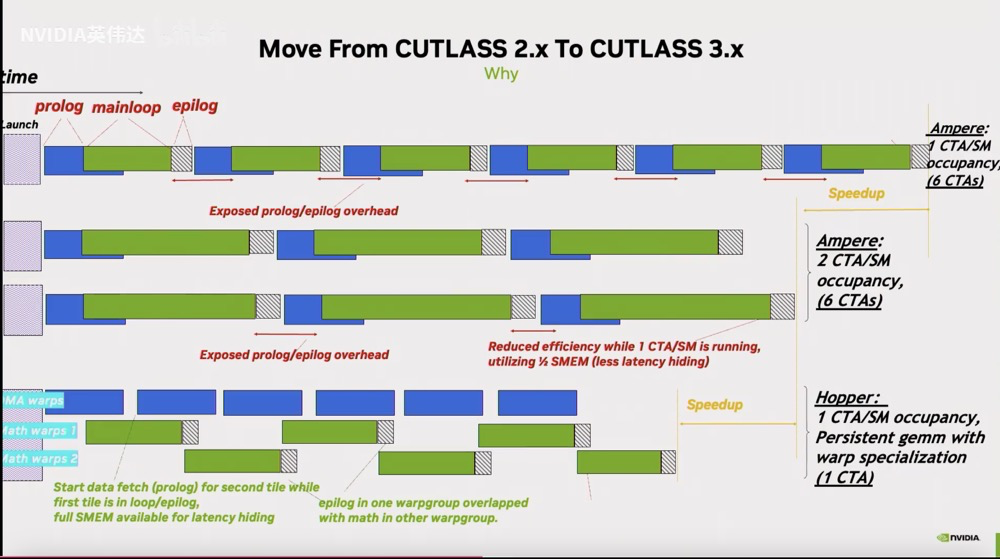

이 Slides는 CUTLASS 2.x에서 CUTLASS 3.x로 evolve한 이유를 보여준다. 주로 Ampere와 Hopper라는 GPU architecture에서 GEMM operation execution efficiency를 비교해 설명한다.

- Ampere architecture(1 CTA/SM, 6 CTAs):
    - prolog, mainloop, epilog execution timeline을 보여준다.
    - prolog/epilog overhead가 노출되어 overall efficiency에 영향을 준다.
- Ampere architecture(2 CTA/SM, 6 CTAs):
    - 여전히 exposed prolog/epilog overhead가 있다. 하지만 위 경우보다는 빨라졌다.
    - 1 CTA/SM만 run하면 efficiency가 낮아지고 SMEM(shared memory)의 절반만 사용하게 되어 latency hiding capability가 줄어든다.
- Hopper architecture(1 CTA/SM, persistent GEMM and warp specialization):
    - new execution model을 도입한다.
    - persistent GEMM technique을 사용해 하나의 CTA가 SM을 지속적으로 점유할 수 있다.
    - warp specialization을 구현하여 서로 다른 warp group이 서로 다른 task를 수행한다.
    - 첫 번째 tile이 loop/epilog stage에 있을 때 두 번째 tile의 data fetching(prolog)을 시작할 수 있다.
    - latency hiding을 위해 SMEM을 충분히 활용한다.
    - 한 warp group의 epilog는 다른 warp group의 math computation과 overlap될 수 있다.

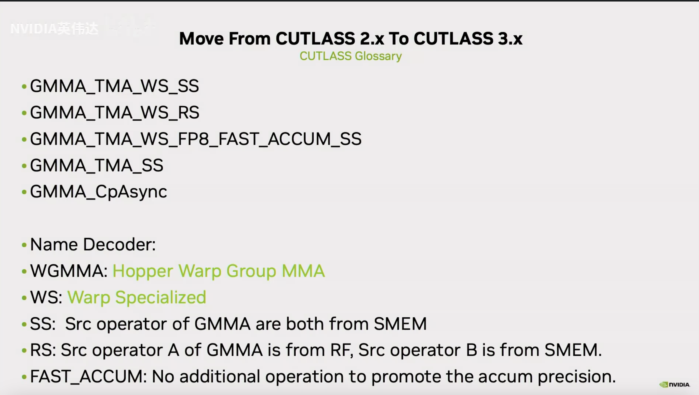

이 Slides는 CUTLASS library에서 사용하는 몇 가지 key term과 abbreviation을 설명한다.

- WGMMA: Hopper Warp Group MMA(matrix multiply-accumulate operation)
설명: Hopper architecture의 warp-group matrix multiply-accumulate operation이다.
- WS: Warp Specialized
설명: warp specialization을 뜻하며, 서로 다른 warp가 서로 다른 specialized task를 수행한다.
- SS: Src operator of GMMA are both from SMEM
설명: GMMA operation의 두 source operand가 모두 shared memory(SMEM)에서 온다.
- RS: Src operator A of GMMA is from RF, Src operator B is from SMEM
설명: GMMA operation의 source operand A는 register file(RF)에서 오고, source operand B는 shared memory(SMEM)에서 온다.
- FAST_ACCUM: No additional operation to promote the accum precision
설명: accumulator precision을 높이기 위한 additional operation을 수행하지 않는다.

> 아래는 Construct CUTLASS 3.x GEMM & Guidelines다.

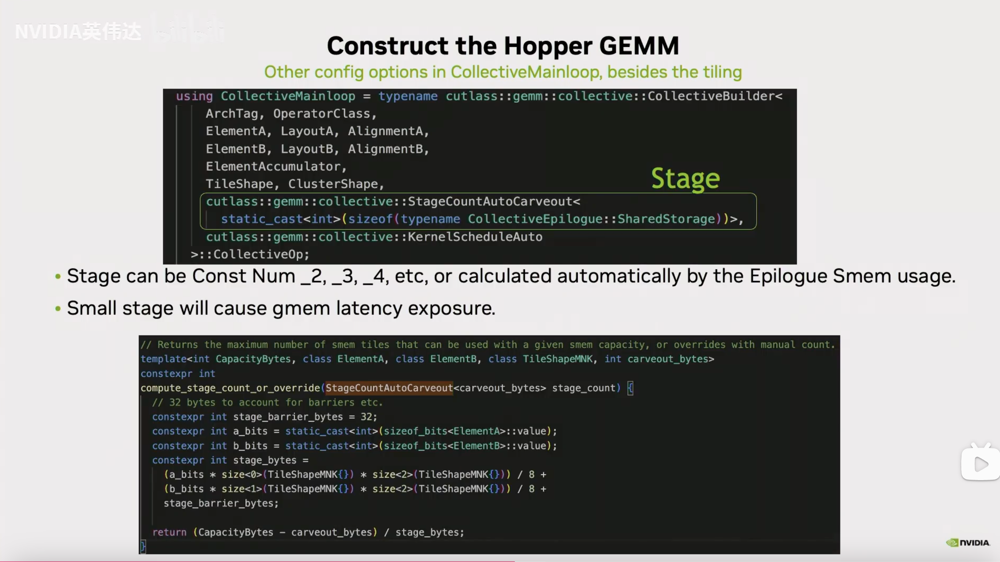

이 Slides는 CUTLASS 3.x에서 Hopper architecture GEMM operation을 구성할 때 `CollectiveMainloop`의 Stage configuration option을 설명한다. CUTLASS 3.x에서 Stage는 `_2`, `_3`, `_4` 같은 fixed constant일 수 있다. 또는 Epilogue Smem usage에 따라 automatic calculation될 수도 있다. warning: 작은 Stage count는 global memory(gmem) latency를 expose할 수 있다.

Slides 아래 code fragment는 `compute_stage_count_or_override` function implementation을 보여준다. 이 function은 maximum available Stage count를 계산하는 데 쓰인다.
- barrier에 필요한 extra bytes(32 bytes)를 고려한다.
- A/B matrix data를 포함하여 stage마다 필요한 byte count를 계산한다.
- 마지막으로 total capacity와 stage당 size를 바탕으로 available stage count를 계산한다.

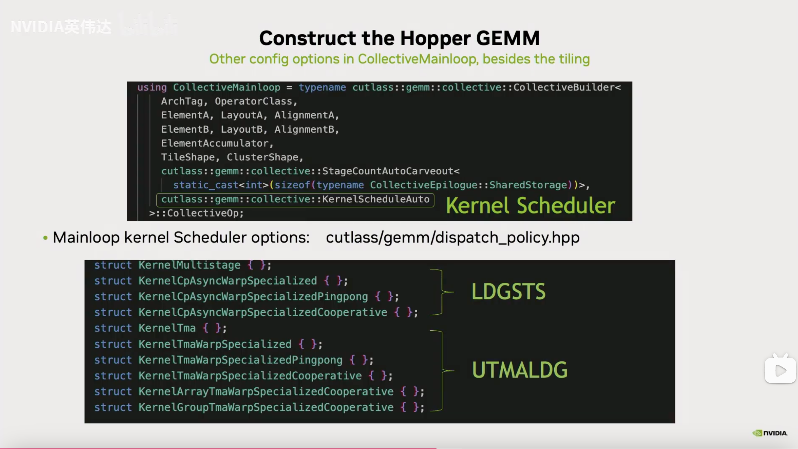

이 Slides는 `CollectiveMainloop` configuration code를 보여주며, 특히 `KernelScheduleAuto` parameter를 강조한다. Mainloop kernel Scheduler option은 `cutlass/gemm/dispatch_policy.hpp` file에 정의되어 있다고 지적한다. Kernel Scheduler type은 LDGSTS와 UTMALDG라는 두 async instruction type을 포함하며, 각각 Ampere와 Hopper architecture를 겨냥한다. UTMALDG type instruction을 사용할 수 있다면 그것을 선택하는 것이 더 빠르다.

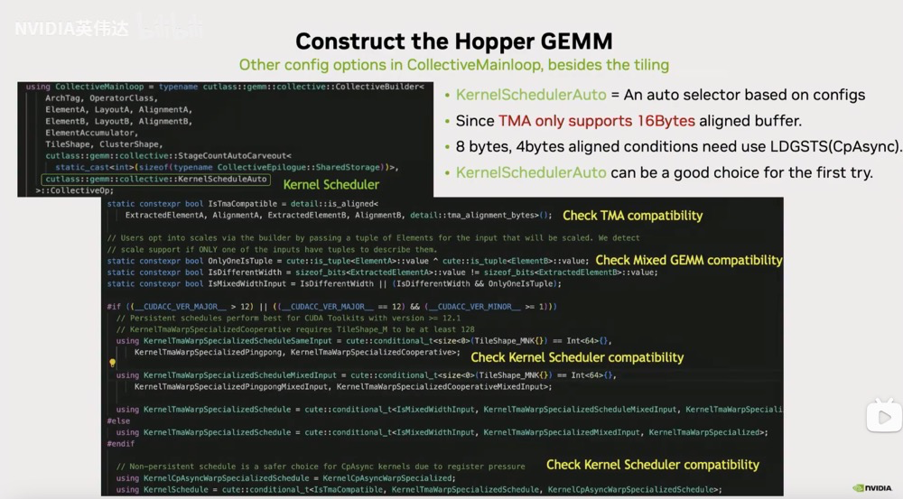

이 Slides는 CUTLASS 3.x에서 Hopper architecture GEMM operation을 구성할 때 `CollectiveMainloop`의 Kernel Scheduler configuration option과 auto selection mechanism을 소개한다. 핵심은 다음과 같다.
- KernelSchedulerAuto:
    - configuration 기반 auto selector다.
    - 첫 시도에 좋은 선택으로 추천된다.
- TMA(Tensor Memory Accelerator) restriction:
    - TMA는 16-byte aligned buffer만 지원한다.
    - 8-byte 또는 4-byte alignment의 경우 LDGSTS(CpAsync)를 사용해야 한다.
- implementation detail:
    - `constexpr bool`을 사용해 compile-time condition check를 수행한다.
    - CUDA toolkit version에 따라 다른 scheduling strategy를 선택한다.
    - CUDA Toolkit version >= 12.1에서는 persistent scheduling이 가장 잘 동작한다.
    - `KernelTmaWarpSpecializedCooperative`는 `TileShape_M`이 최소 128일 것을 요구한다.
    ...

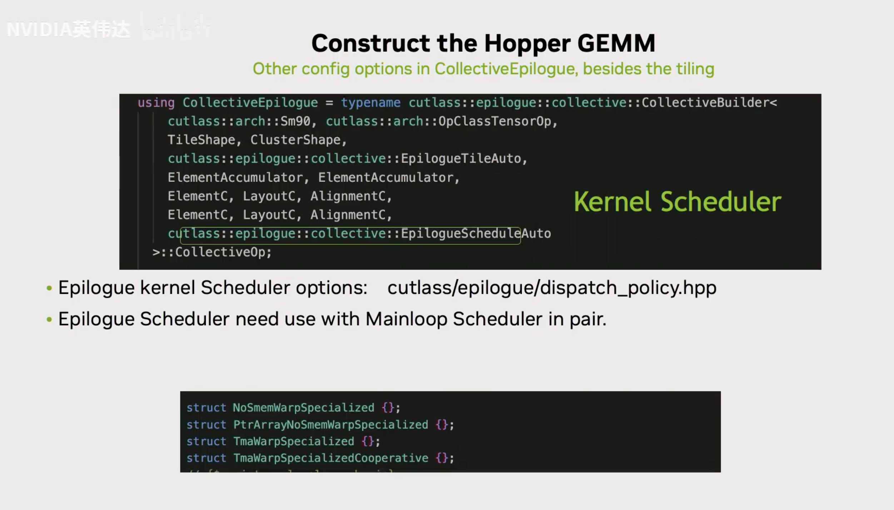

이 Slides는 CUTLASS 3.x에서 Hopper architecture GEMM operation을 구성할 때 `CollectiveEpilogue` configuration option을 설명한다. `EpilogueScheduleAuto` parameter를 강조하는데, 이것은 Epilogue의 Kernel scheduler다. Epilogue kernel Scheduler option은 `cutlass/epilogue/dispatch_policy.hpp` file에 정의되어 있다고 지적한다. 또한 Epilogue Scheduler는 Mainloop Scheduler와 pair로 사용되어야 함을 강조한다. CUTLASS 3.x에서 `EpilogueScheduleAuto`를 사용하면 반드시 legal Kernel을 얻을 수 있다. Epilogue Scheduler option에는 몇 가지 available Epilogue Scheduler type이 있다.

- NoSmemWarpSpecialized
- PtrArrayNoSmemWarpSpecialized
- TmaWarpSpecialized
- TmaWarpSpecializedCooperative

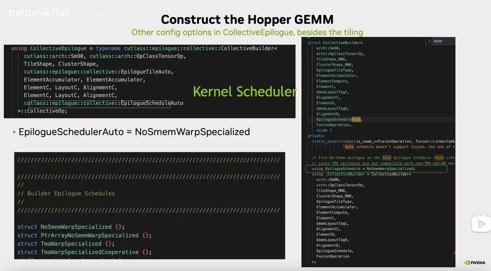

이 Slides는 `EpilogueScheduleAuto`의 selection이 `NoSmemWarpSpecialized` Epilogue Scheduler type을 infer할 수 있고, 이 경우 efficiency가 낮아질 수 있다고 지적한다.

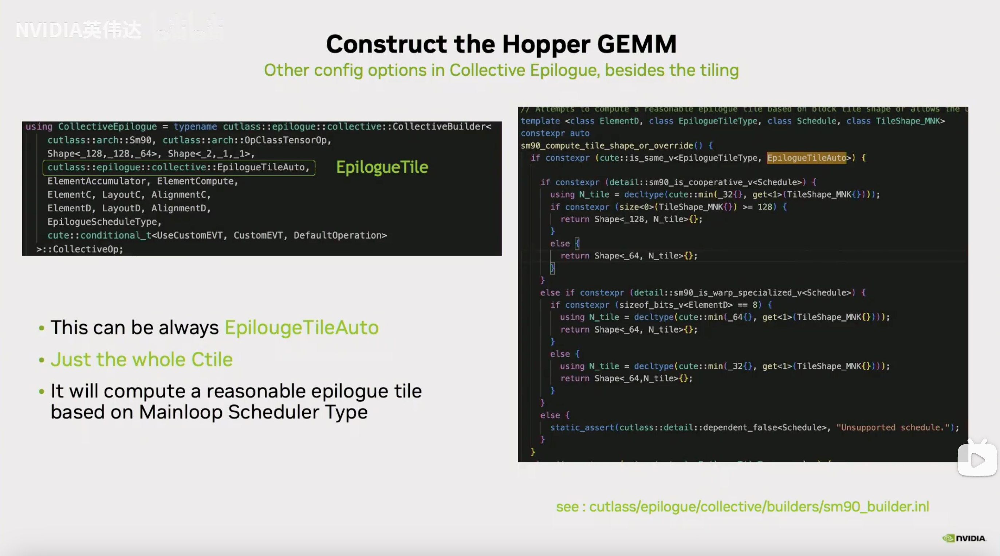

이 Slides는 CUTLASS 3.x의 Hopper architecture GEMM operation에서 `CollectiveEpilogue` configuration을 설명하며, 특히 `EpilogueTile` setting을 다룬다. 우리는 항상 `EpilogueTileAuto`를 사용할 수 있는데, 이는 entire CTile을 나타낸다. `EpilogueTileAuto`는 Mainloop Scheduler type에 따라 reasonable epilogue tile을 계산한다.

오른쪽은 `sm90_compute_tile_shape_or_override` function implementation을 보여준다. 이 function은 서로 다른 condition에 따라 epilogue tile size를 automatic calculation한다.
- a. cooperative scheduling의 경우:
    - `TileShape_M >= 128`이면 `Shape<128, N_tile>`을 return한다.
    - 그렇지 않으면 `Shape<64, N_tile>`을 return한다.
- b. warp specialized scheduling의 경우:
    - `ElementD`가 8 bytes이면 `Shape<64, N_tile>`을 return한다.
    - 그렇지 않으면 `Shape<64, N_tile>`을 return한다. 단, `N_tile` computation method는 다르다.

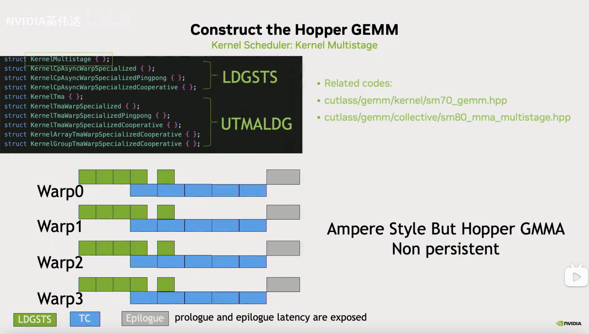

이 Slides는 CUTLASS library의 Hopper architecture GEMM operation Kernel Scheduler, 특히 `KernelMultistage` scheduler를 소개한다.

- Kernel Scheduler type list: LDGSTS(Load Global Store Shared)와 UTMALDG(Unified Tensor Memory Accelerator Load Global) 두 종류로 나뉜다.
- related code file: `cutlass/gemm/kernel/sm70_gemm.hpp` & `cutlass/gemm/collective/sm80_mma_multistage.hpp`
- KernelMultistage execution model diagram:
    - 4 warps(Warp0부터 Warp3)의 execution mode를 보여준다.
    - 각 warp의 execution process는 세 stage로 나뉜다. LDGSTS(green), TC(blue, 아마 Tensor Core computation), Epilogue(gray).
    - prologue와 epilogue latency는 exposed된다.
- execution characteristic:
    - "Ampere Style But Hopper GMMA"라고 표시되어 있으며, Ampere architecture와 유사하지만 Hopper GMMA(General Matrix Multiply-Accumulate) instruction을 사용한다는 뜻이다.
    - non-persistent execution mode.
- performance characteristic:
    - prologue와 epilogue latency가 exposed되어 overall performance에 영향을 줄 수 있다.
    - 각 warp가 data load, computation, result store를 포함한 full GEMM operation flow를 independent하게 수행한다.

> 각 WARP는 같은 일을 하며, 그림의 blue block 앞 green small block은 data prefetch의 `num_stages` 수를 나타낸다.

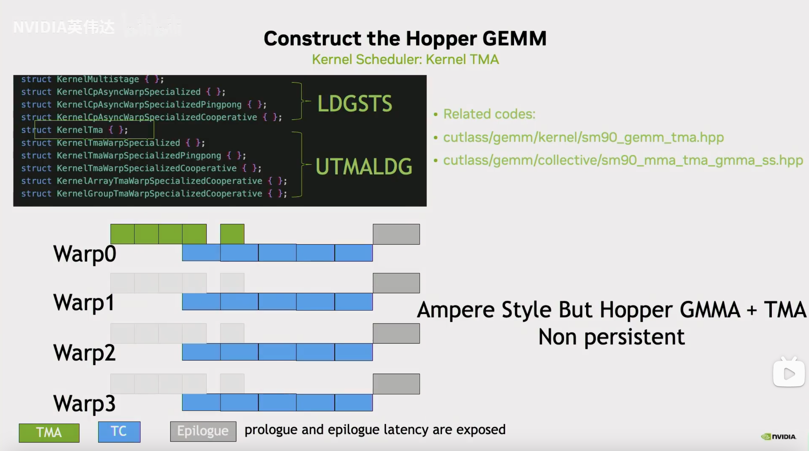

이 Slides는 CUTLASS library의 Hopper architecture GEMM operation Kernel TMA(Tensor Memory Accelerator) scheduler를 소개한다.
- related code file: `cutlass/gemm/kernel/sm90_gemm_tma.hpp` & `cutlass/gemm/collective/sm90_mma_tma_gmma_ss.hpp`
- KernelTMA execution model diagram:
    - 4 warps(Warp0부터 Warp3)의 execution mode를 보여준다.
    - 각 warp의 execution process는 세 stage로 나뉜다. TMA(green, Warp0만 수행), TC(blue, Tensor Core computation), Epilogue(gray).
    - Warp1부터 Warp3의 TMA 부분은 gray이며, 이들이 TMA operation을 수행하지 않음을 나타낸다.
- execution characteristic:
    - "Ampere Style But Hopper GMMA + TMA"라고 표시되어 있으며, Ampere architecture와 유사하지만 Hopper GMMA instruction과 TMA technique을 사용한다는 뜻이다.
    - non-persistent execution mode.
- performance characteristic:
    - prologue와 epilogue latency는 여전히 exposed된다.
    - Warp0만 TMA operation을 수행한다. 이는 더 efficient한 memory access를 의미할 수 있다.
- KernelMultistage와의 difference:
    - main difference는 LDGSTS operation을 TMA로 대체한다는 점이다.
    - TMA operation은 각 warp가 수행하는 대신 Warp0에 집중된다.

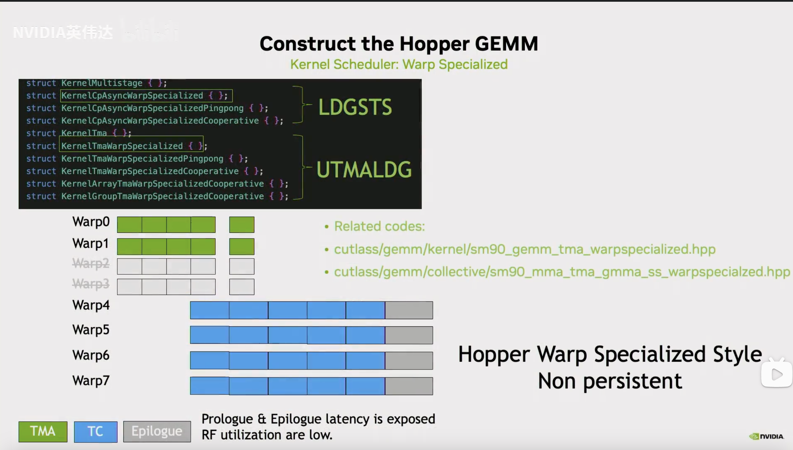

이 Slides는 CUTLASS library의 Hopper architecture GEMM operation Warp Specialized scheduler를 소개한다.
- related code file: `cutlass/gemm/kernel/sm90_gemm_tma_warpspecialized.hpp` & `cutlass/gemm/collective/sm90_mma_tma_gmma_ss_warpspecialized.hpp`
- Warp Specialized execution model diagram:
    - 8 warps(Warp0부터 Warp7)의 execution mode를 보여준다.
    - Warp0과 Warp1은 TMA(green) operation을 전담한다.
    - Warp2와 Warp3은 아무 operation도 수행하지 않는다(gray).
    - Warp4부터 Warp7은 TC(blue, Tensor Core computation)와 Epilogue(gray) operation을 전담한다.
- execution characteristic:
    - "Hopper Warp Specialized Style"이라고 표시되어 있으며, Hopper architecture-specific warp specialization execution 방식이라는 뜻이다.
    - non-persistent execution mode.
- performance characteristic:
    - Prologue와 Epilogue latency가 여전히 exposed된다.
    - register file(RF) utilization이 낮다.
- previous scheduler와의 difference:
    - 명확한 warp division of labor가 있다. 일부 warp는 memory operation을 전담하고, 일부는 computation을 담당한다.
    - TMA technique을 더 efficient하게 활용한다.

> Warp Specialized scheduler의 Tensor Core computation과 Epilogue는 아직 overlap되지 않으므로 Tensor Core capability를 충분히 활용할 수 없다.

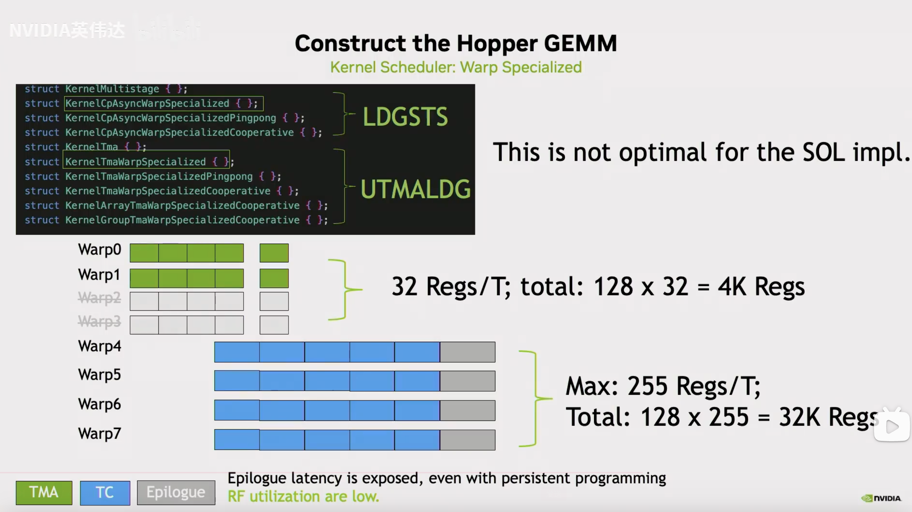

이 Slides는 register analysis를 보충한다. TMA warps(Warp0과 Warp1)는 thread당 32 registers를 사용하고, 총 128 x 32 = 4K registers를 사용한다. TC warps(Warp4부터 Warp7)는 thread당 최대 255 registers를 사용할 수 있고, 총 128 x 255 = 32K registers를 사용한다.

Slides는 또한 "This is not optimal for the SOL impl."이라고 지적한다. 즉 SOL implementation에는 최적이 아니다. persistent programming을 사용하고 RF(register file) utilization이 낮아도 Epilogue latency는 여전히 exposed된다.

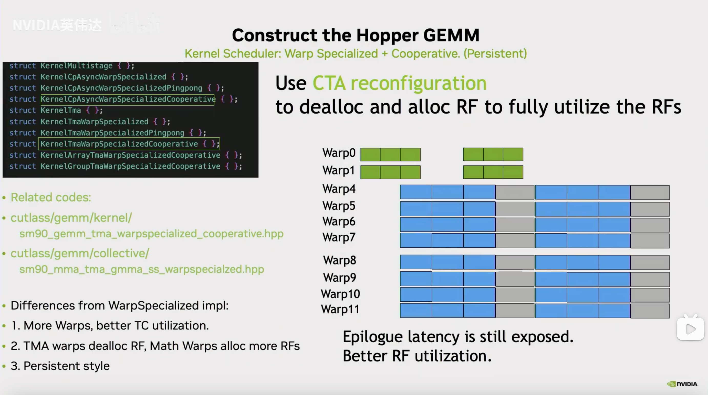

이 Slides는 CUTLASS library의 Hopper architecture GEMM operation Warp Specialized + Cooperative(Persistent) scheduler를 소개한다.
- related code file: `cutlass/gemm/kernel/sm90_gemm_tma_warpspecialized_cooperative.hpp` & `cutlass/gemm/collective/sm90_mma_tma_gmma_ss_warpspecialized.hpp`
- core optimization strategy는 "Use CTA reconfiguration to dealloc and alloc RF to fully utilize the RFs"다.
CTA(Cooperative Thread Array) reconfiguration을 사용해 register file(RF)을 release하고 allocate하여 register resource를 fully utilize한다.
- ordinary WarpSpecialized implementation과의 difference:
    - 더 많은 Warps와 더 나은 TC utilization.
    - TMA warps는 RF를 release하고, math computation Warps는 더 많은 RF를 allocate한다.
    - persistent style.
- performance 측면에서는 Epilogue latency가 여전히 exposed되지만 RF utilization은 더 좋다.

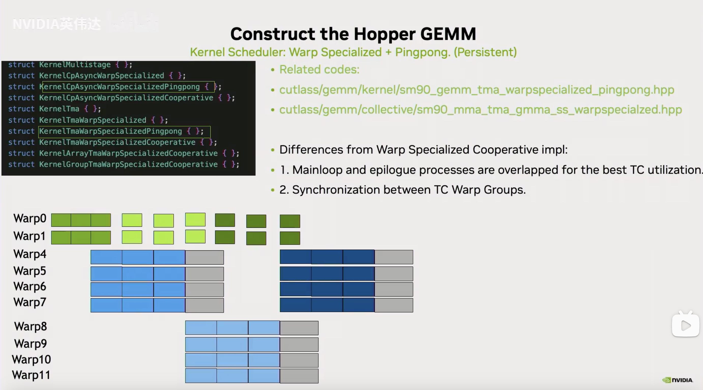

이 Slides는 CUTLASS library의 Hopper architecture GEMM operation Warp Specialized + Pingpong(Persistent) scheduler를 소개한다.
- related code file: `cutlass/gemm/kernel/sm90_gemm_tma_warpspecialized_pingpong.hpp` & `cutlass/gemm/collective/sm90_mma_tma_gmma_ss_warpspecialized.hpp`
- Warp Specialized Cooperative implementation과의 main difference:
    - Mainloop와 epilogue process가 overlap되어 best TC(Tensor Core) utilization을 실현한다.
    - TC Warp group 간 synchronization.
- execution model diagram:
    - 12 warps(Warp0부터 Warp11)의 execution mode를 보여준다.
    - Warp0과 Warp1은 TMA operation(green)을 수행하지만 pingpong 방식으로 alternating한다.
    - Warp4부터 Warp11은 TC(light blue/dark blue)와 Epilogue(gray) operation을 수행하고, 이 또한 alternating 방식이다.

이 Slides는 Hopper architecture의 Warp Specialized GEMM implementation을 소개하며, producer-consumer model을 사용한다. 내용은 다음과 같다.
- source code location: `cutlass/gemm/collective/sm90_mma_tma_gmma_ss_warpspecialized_mixed_input.hpp`
- overall architecture는 Producer Warps(TMA Warps)와 Consumer Warps(TC Warps)로 나뉘며, shared memory로 data를 exchange한다.
- Producer Warps(TMA Warps):
    - `CollectiveMma::load(...)` & Persistent method를 사용한다.
    - `smem_empty` barrier를 기다린다.
    - TMA instruction을 issue해 A/B matrix를 load하고, `smem_full` barrier를 update한다.
    - transferred bytes count를 update하고 `smem_full` barrier에 arrive한다.
    - K iterations를 loop한다.
- Consumer Warps(TC Warps):
    - `CollectiveMma::mma(...)` & Persistent method를 사용한다.
    - `smem_full` barrier를 기다린다.
    - WGMMA_SS instruction을 issue하고 previous TC work가 완료될 때까지 wait한다.
    - `smem_empty` barrier에 arrive한다.
    - K iterations를 loop한다.
    - SWIZZLE을 사용해 register file(RF)을 shared memory(SMEM)에 write한다.
    - TMA instruction을 issue해 result를 global memory에 write back한다.
- shared memory structure:
    - Mbarrier와 Data Buffer 두 part를 포함한다.
    - stage마다 두 buffer가 있다. Mat A MtilexKtile과 Mat B NtilexKtile.
    - `smem_empty`와 `smem_full` flag를 사용해 Producer와 Consumer를 synchronize한다.
- execution flow:
    - Producer와 Consumer가 alternately work하고, shared memory와 barrier mechanism으로 synchronize한다.
    - multiple stages(0부터 N-1까지)가 pipeline operation에 사용된다.
    - 모든 tile computation이 끝날 때까지 loop한다.

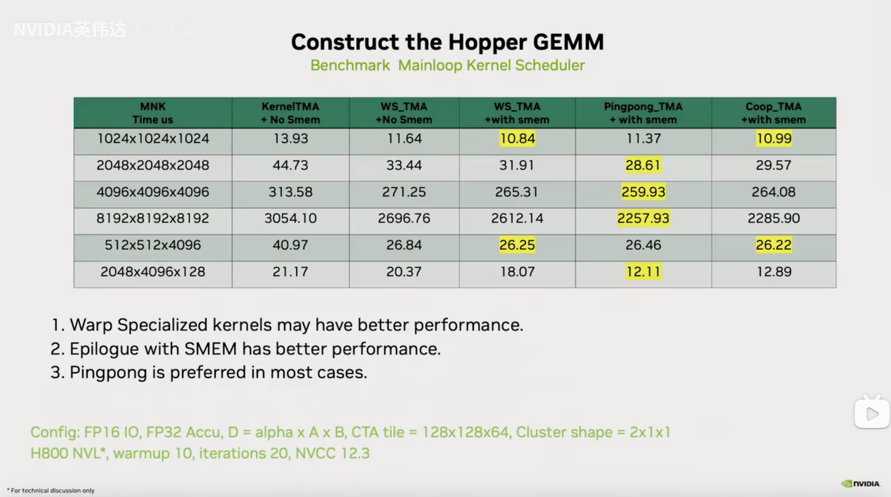

이 Slides는 Hopper architecture에서 서로 다른 GEMM kernel scheduler의 performance benchmark result를 보여준다.

- test matrix size와 kernel type:
    - 서로 다른 size의 matrix multiplication operation 6개를 test했다.
    - KernelTMA, WS_TMA(no/with shared memory), Pingpong_TMA, Coop_TMA라는 5개 kernel scheduler를 비교했다.
- performance data and analysis:
    - table에는 여러 combination의 execution time이 microsecond 단위로 표시된다.
    - yellow highlight는 각 row에서 best performance result를 표시한다.
    - Warp Specialized kernels가 보통 더 좋은 performance를 보인다.
    - shared memory(SMEM)를 사용하는 Epilogue가 더 좋다.
    - 대부분의 경우 Pingpong strategy가 preferred된다.
    - larger matrix, 예: 8192x8192x8192에서는 Pingpong_TMA strategy가 다른 method보다 크게 우수하다.
    - 일부 specific size, 예: 1024x1024x1024에서는 WS_TMA with smem이 best performance를 보인다.
    - KernelTMA + No Smem은 모든 경우 performance가 나쁘다.
- configuration information:
    - FP16 input, FP32 accumulation, D = alpha x A x B operation, CTA tile size = 128x128x64, Cluster shape = 2x1x1, H800 NVL* hardware 사용, warmup 10회, iteration 20회, NVCC version 12.3.

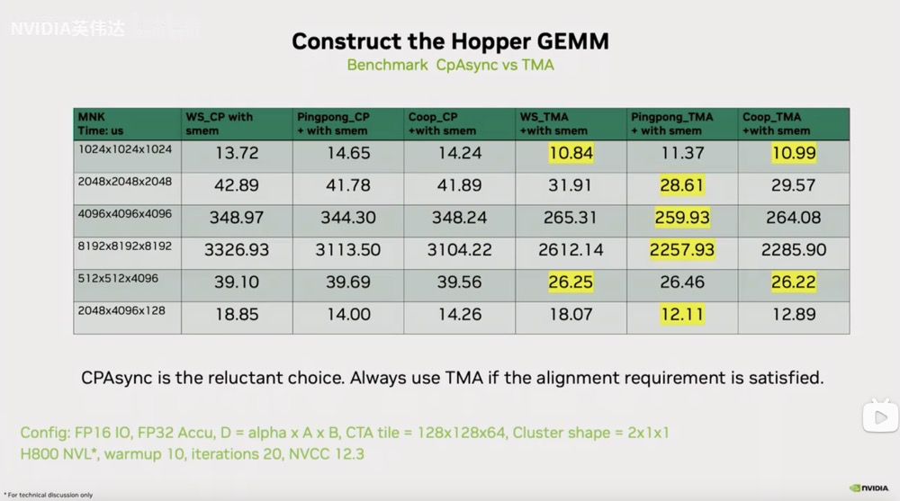

이 Slides는 Hopper architecture에서 CPAsync와 TMA라는 두 memory access method가 GEMM operation에서 보이는 performance를 비교한다. main conclusion은 TMA method가 거의 모든 경우 CPAsync method보다 좋고, TMA method 중에서는 Pingpong_TMA가 보통 best performance를 보인다는 것이다. 특히 large matrix에서 그렇다. "CPAsync is the reluctant choice. Always use TMA if the alignment requirement is satisfied." 즉 CPAsync는 어쩔 수 없을 때의 선택이고, alignment requirement를 만족하면 항상 TMA를 사용하라는 뜻이다.

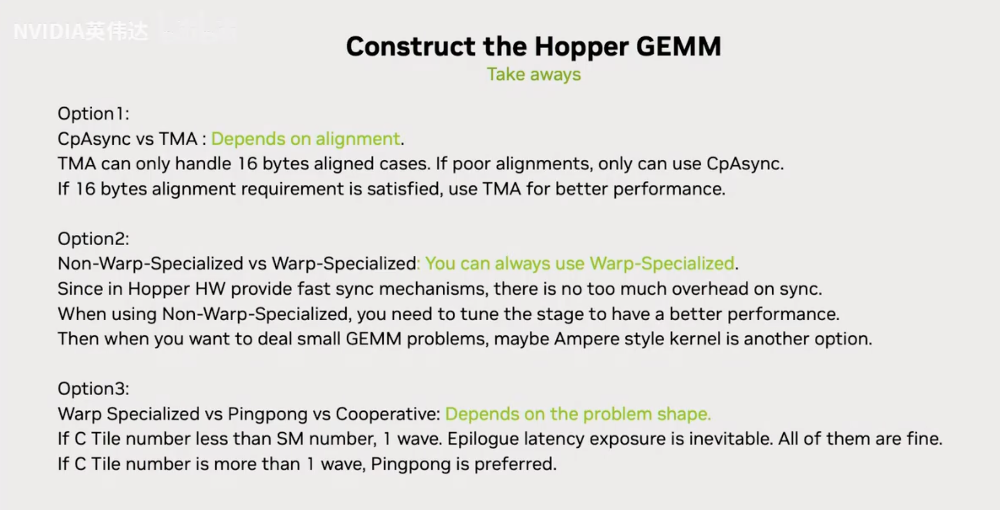

이 Slides는 Hopper architecture에서 GEMM을 구성할 때의 몇 가지 key decision point와 recommendation을 요약한다.
- Option 1: CpAsync vs TMA
    - memory alignment에 따라 선택한다. TMA는 16-byte aligned case만 처리할 수 있다. alignment가 나쁘면 CpAsync만 사용할 수 있다. 16-byte alignment requirement를 만족한다면 better performance를 얻기 위해 TMA를 사용해야 한다.
- Option 2: Non-Warp-Specialized vs Warp-Specialized
    - 항상 Warp-Specialized를 사용하는 것을 권장한다. Hopper hardware는 fast synchronization mechanism을 제공하므로 sync overhead가 크지 않다. Non-Warp-Specialized를 사용할 때는 better performance를 위해 stage를 조정해야 한다. small GEMM problem에서는 Ampere-style kernel도 고려할 수 있다.
- Option 3: Warp Specialized vs Pingpong vs Cooperative
    - problem shape에 따라 선택한다. C Tile count가 SM count보다 작으면(1 wave), epilogue latency exposure는 피할 수 없고 세 method 모두 가능하다. C Tile count가 1 wave를 넘으면 Pingpong method를 추천한다.

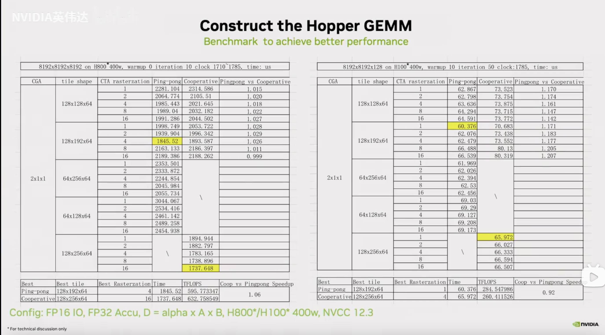

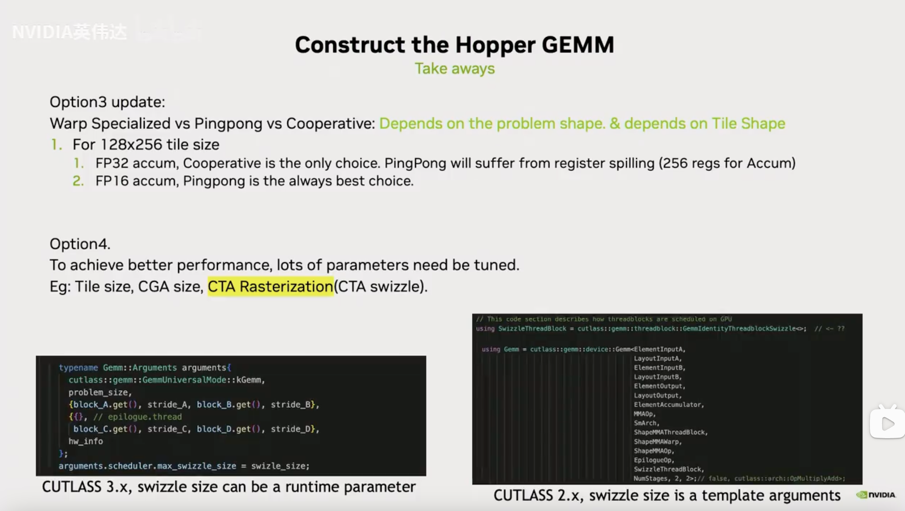

마지막 Slides는 Hopper GEMM을 구성할 때의 key point 두 가지를 이어서 논의한다.

- option 3 update: Warp Specialized, Pingpong, Cooperative 세 method를 비교한다. 선택은 problem shape와 tile size에 따라 달라진다.
    - 128x256 tile size의 경우:
        - FP32 accumulation을 사용하면 Cooperative가 유일한 선택이다. Pingpong은 register spill problem을 만난다.
        - FP16 accumulation을 사용하면 Pingpong이 항상 best choice다.
- option 4:
    - better performance를 얻기 위해 여러 parameter를 조정해야 한다.
        - Tile size
        - CGA(Cooperative Grid Array) size
        - CTA swizzle

code example은 CUTLASS 3.x와 2.x version이 swizzle size parameter를 처리하는 difference를 보여준다.
- CUTLASS 3.x: swizzle size는 runtime parameter일 수 있다.
- CUTLASS 2.x: swizzle size는 template parameter다.

요약하면:

CUTLASS library는 2.x에서 3.x로 iteration하면서 큰 변화를 겪었다. 이는 주로 NVIDIA GPU architecture가 Ampere에서 Hopper로 evolve한 것에 적응하기 위해서다. 3.x version은 persistent programming style과 warp specialization feature를 특히 강조하며, compute resource를 fully utilize하고 performance를 optimize하는 것을 목표로 한다.

GEMM operation을 configure할 때 2.x version은 data type, tile size 같은 low-level parameter를 많이 manually specify해야 한다. 반면 3.x version은 higher-level abstraction을 제공하여 configuration process를 단순화한다.

Hopper architecture에서 CUTLASS를 사용한다면 3.x version을 채택하고 다음 best practice를 참고하는 것이 좋다.

- memory access에서는 CpAsync보다 TMA(Tensor Memory Accelerator)를 우선 사용한다.
- Warp Specialized type kernel을 우선 선택한다.
- problem scale에 따라 Warp Specialized, Pingpong, Cooperative 세 kernel 중 가장 알맞은 것을 선택한다.
- BlockShape, ClusterShape, CTA swizzle 같은 parameter를 조정해 performance를 더 optimize한다.

End!
