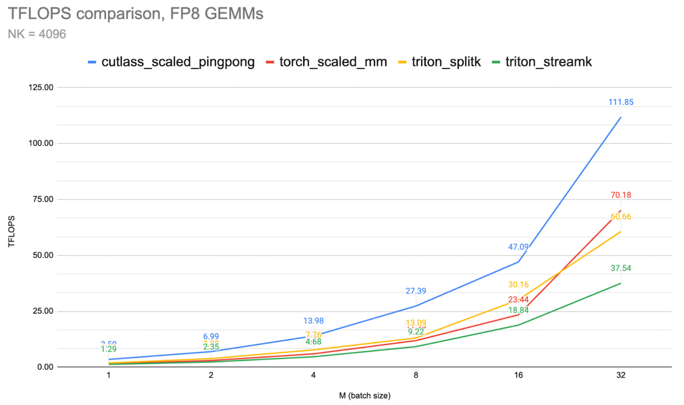
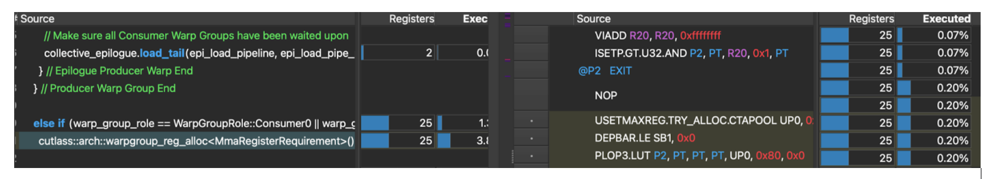
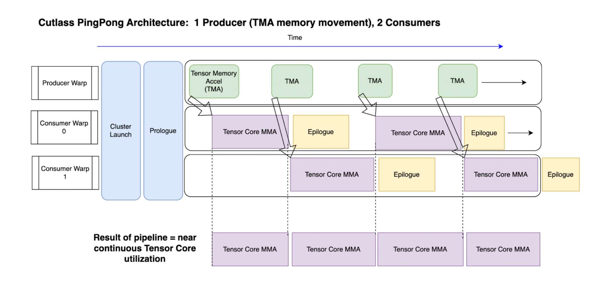
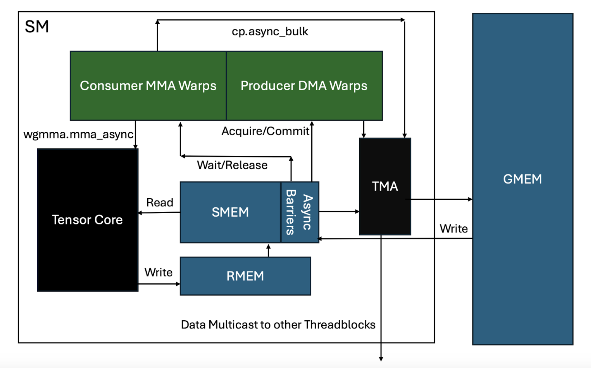
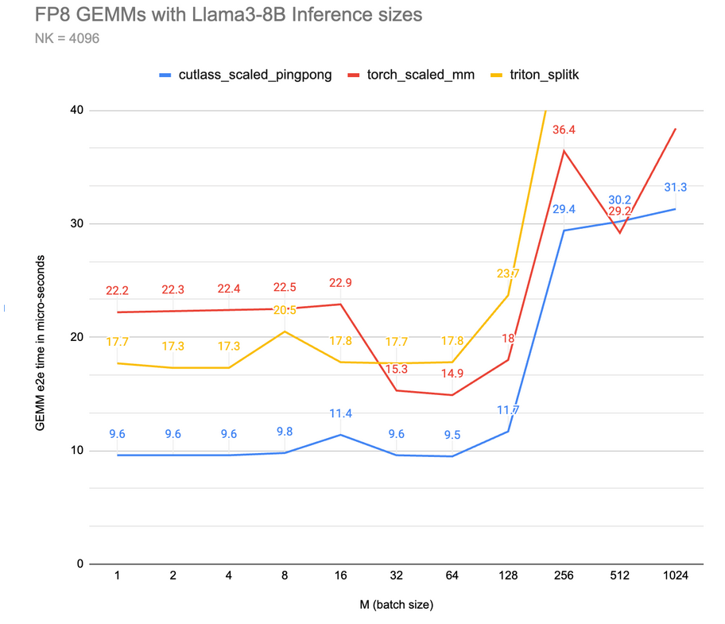
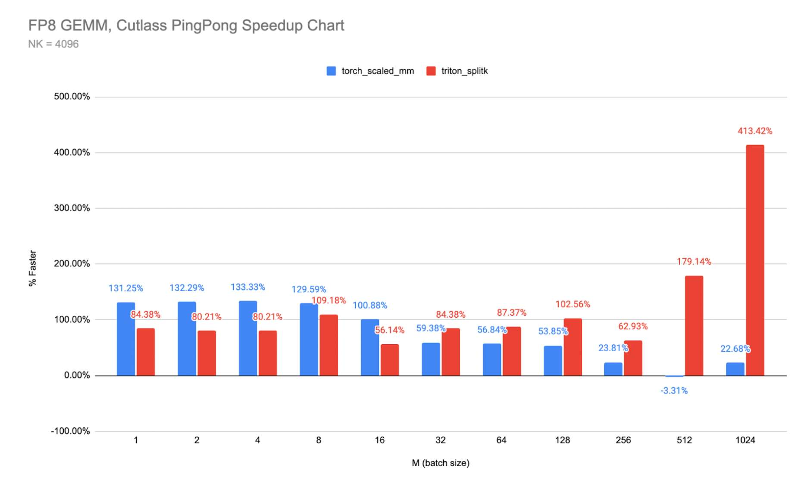

> 블로그 출처: https://pytorch.org/blog/cutlass-ping-pong-gemm-kernel/ 를 번역했습니다. 이 PyTorch blog는 CUTLASS의 Ping-Pong GEMM kernel design을 간략히 소개합니다. 이는 Hopper GPU architecture에 맞게 특별히 최적화된 high-performance matrix multiplication implementation입니다. producer-consumer pattern의 asynchronous pipeline design, TMA hardware acceleration, specialized warp group을 결합해 Tensor Core를 효율적으로 활용합니다. 글은 benchmark를 통해 이 design이 cuBLAS와 Triton 같은 다른 implementation보다 뚜렷한 장점을 가진다는 것을 보여주며, new-generation GPU architecture에서 deep asynchronization으로 compute throughput을 극대화하는 방법을 잘 보여줍니다. 또한 이 CUTLASS code 부분을 따로 떼어 PyTorch에서 사용할 수 있는 extension도 작성했습니다. https://github.com/pytorch-labs/applied-ai/tree/main/kernels/cuda/cutlass_gemm 를 참고하세요.

# CUTLASS Ping-Pong GEMM kernel 심층 분석



## Abstract

이 글에서는 CUTLASS Ping-Pong GEMM kernel을 개요 수준에서 설명하고, 관련 FP8 inference kernel benchmark를 제공합니다.

Ping-Pong은 Hopper GPU architecture에서 사용할 수 있는 가장 빠른 matrix multiplication(GEMM) kernel architecture 중 하나입니다. Ping-Pong은 Warp Group Specialized Persistent Kernels family에 속하며, 이 family에는 Cooperative와 Ping-Pong 두 variant가 있습니다. 이전 GPU와 비교해 Hopper의 강력한 Tensor Core compute capability는 peak performance를 달성하기 위해 deep asynchronous software pipeline을 필요로 합니다.
 
Ping-Pong과 Cooperative kernel은 이 paradigm을 잘 보여줍니다. key design pattern은 launch 및 prologue overhead를 amortize하기 위한 persistent kernel, 그리고 두 consumer와 하나의 producer를 포함하는 "fully asynchronous" specialized warp group입니다. 이를 통해 Tensor Core에 지속적으로 data를 공급할 수 있는 highly overlapped processing pipeline을 만듭니다.

H100(Hopper) GPU가 release되었을 때 Nvidia는 이를 최초의 진정한 asynchronous GPU라고 불렀습니다. 이 표현은 H100-specific kernel architecture 역시 compute/GEMM throughput을 충분히 극대화하려면 asynchronous해야 함을 강조합니다.

CUTLASS 3.x에 도입된 pingpong GEMM은 kernel의 모든 측면을 "fully asynchronous" processing paradigm으로 옮겨 이 점을 구현합니다. 이 blog에서는 ping-pong kernel design의 core feature를 보여주고, inference workload에서 cublas 및 triton split-k kernel과 비교한 performance를 보여줍니다.

## Ping-Pong kernel design

Ping-Pong, 더 기술적으로는 `sm90_gemm_tma_warpspecialized_pingpong`은 warp specialization을 활용해 asynchronous pipeline으로 동작합니다. traditional homogeneous kernel과 달리 "warp group"이 specialized role을 맡습니다. 하나의 warp group은 4개 warp, 각 warp 32 thread, 총 128 thread로 구성된다는 점에 주의하세요.

초기 architecture에서는 보통 각 SM에서 여러 thread block을 실행해 latency를 숨겼습니다. 하지만 Hopper에서는 Tensor Core throughput이 매우 높아서 더 깊은 pipeline으로 전환해야 합니다. 이러한 deep pipeline은 각 SM에서 여러 thread block을 실행하는 것을 방해합니다. 따라서 persistent thread block은 이제 여러 Tile과 여러 warp group 사이에서 collective main loop를 issue합니다. thread block cluster는 전체 SM 수에 따라 할당됩니다.

Ping-Pong에서 각 warp group은 data producer 또는 data consumer라는 specialized role을 맡습니다.

producer warp group은 TMA를 통해 data movement를 발생시켜 shared memory buffer를 채우는 데 집중합니다. 다른 두 warp group은 specialized consumer로, Tensor Core를 사용하는 math(MMA) 부분을 처리한 뒤, 필요한 후속 작업을 수행하고 result를 global memory로 write back합니다(epilogue).

producer warp group은 TMA(Tensor Memory Accelerator)와 함께 동작하며, 의도적으로 가능한 한 lightweight하게 유지됩니다. 실제로 Ping-Pong에서는 occupancy를 높이기 위해 register resource를 의도적으로 줄입니다. producer는 maximum register 수를 40으로 줄이고, consumer는 maximum register 수를 232로 늘립니다. 이 effect는 CUTLASS source code와 해당 SASS에서 볼 수 있습니다.



Ping-Pong의 고유한 점은 각 consumer가 서로 다른 C output Tile에서 작업한다는 것입니다. 참고로 cooperative kernel은 대부분 Ping-Pong과 같지만, 두 consumer group이 같은 C output Tile에서 작업합니다. 또한 두 consumer warp group은 main loop MMA와 epilogue 사이에서 work를 나눕니다.

이는 아래 그림에 표시되어 있습니다.



두 consumer가 있으면 하나는 Tensor Core로 MMA를 수행하고, 다른 하나는 epilogue를 수행한 뒤 서로 역할을 바꿀 수 있습니다. 이는 각 SM에서 Tensor Core의 "continuous use"를 극대화하며, maximum throughput을 달성하는 핵심 이유 중 하나입니다. Tensor Core는 (거의) maximum compute capability를 달성할 수 있도록 지속적으로 data를 공급받습니다. 위 Fig 2의 아래쪽 부분을 참고하세요.

producer thread가 data movement에만 집중하는 것처럼, MMA thread는 peak issue rate를 달성하기 위해 MMA instruction만 issue합니다. MMA thread는 여러 MMA instruction을 issue하고, 이 instruction들이 TMA wait barrier 위에서 계속 진행되게 해야 합니다.

아래는 specialization 측면을 더 명확히 보여주는 kernel code excerpt입니다.

```c++
// Two types of warp group 'roles' 
enum class WarpGroupRole {
      Producer = 0,
      Consumer0 = 1,
      Consumer1 = 2
    };

//warp group role assignment
auto warp_group_role = WarpGroupRole(canonical_warp_group_idx());
```

## Producer와 Tensor Memory Accelerator를 사용한 data movement

producer warp는 data movement에 집중합니다. 구체적으로는 가능한 한 lightweight하게 유지되며, 실제로 일부 register space를 consumer warp에게 양보합니다. producer는 40 register만 보유하고, consumer는 232 register를 얻습니다. producer의 주요 task는 shared memory buffer가 empty로 signal되면 즉시 TMA command를 issue해 data를 global memory에서 shared memory로 옮기는 것입니다.

TMA(Tensor Memory Accelerator)를 조금 더 설명하면, TMA는 H100과 함께 도입된 hardware component로, HBM(global memory)에서 shared memory로의 memory transfer를 asynchronous하게 처리합니다. memory movement 전용 hardware unit이 있으면 worker thread는 data movement를 계산하고 관리하는 대신 다른 작업을 할 수 있습니다. TMA는 data 자체의 movement뿐 아니라 필요한 target memory address도 계산하고, data에 필요한 transformation(reduction 등)을 적용할 수 있으며, layout transformation도 처리할 수 있습니다. interleaved mode로 data를 shared memory에 전달해 bank conflict 없이 사용할 수 있게 합니다. 마지막으로 필요하면 같은 data를 같은 thread cluster에 속한 다른 SM으로 multicast할 수도 있습니다. data delivery가 완료되면 TMA는 관련 consumer에게 data가 준비되었다고 signal합니다.

## CUTLASS asynchronous pipeline class

producer와 consumer 사이의 이러한 signaling은 새로운 asynchronous pipeline class로 조정됩니다. CUTLASS는 이를 다음처럼 설명합니다.

"persistent GEMM algorithm을 구현하려면 circular list로 구성된 여러 barrier로 synchronization되는 수십 가지 서로 다른 asynchronous execution operation을 관리해야 합니다.

이 complexity는 human programmer가 직접 관리하기에는 너무 어렵습니다.

따라서 우리는 [CUTLASS Pipeline Async Class](https://github.com/NVIDIA/cutlass/blob/main/include/cutlass/pipeline/sm90_pipeline.hpp)를 개발했습니다..."

## Ping-Pong asynchronous pipeline의 barrier와 synchronization

producer는 `producer_acquire`를 통해 주어진 shared memory buffer를 "acquire"해야 합니다. 시작 시 pipeline은 empty이므로 producer thread는 즉시 barrier를 acquire하고 data movement를 시작할 수 있습니다.

```c++
PipelineState mainloop_pipe_producer_state = cutlass::make_producer_start_state<MainloopPipeline>();
```

data movement가 완료되면 producer는 `producer_commit` method를 issue해 consumer thread에게 data가 준비되었음을 알립니다. 하지만 Ping-Pong에서는 이것이 사실상 no-op instruction입니다. TMA 기반 producer barrier는 TMA가 write를 완료할 때 자동으로 update되기 때문입니다.

consumer_wait - producer thread에서 오는 data를 기다립니다(blocking).

consumer_release - waiting producer thread에게 주어진 shared memory buffer의 data consumption이 끝났음을 signal합니다. 즉 producer가 이 buffer를 새 data로 다시 채우기 시작할 수 있게 합니다.

그 이후 synchronization이 본격적으로 시작됩니다. producer는 blocking producer acquire에서 lock을 얻을 수 있을 때까지 기다리고, 그 시점에 data movement work를 반복합니다. 이는 work가 완료될 때까지 계속됩니다.

pseudo code overview는 다음과 같습니다.

```shell
//producer
While (work_tile_info.is_valid_tile) {

	collective_mainloop.dma() // fetch data with TMA
	scheduler.advance_to_next_work()
	Work_tile_info = scheduler.get_current_work()

}

// Consumer 1, Consumer 2
While (work_tile_info.is_valid_tile()) {

	collective_mainloop.mma()
	scheduler.advance_to_next_work()
	Work_tile_info = scheduler.get_current_work()

}
```

그리고 모든 것을 underlying hardware와 연결한 bird's-eye view는 다음과 같습니다.



그림의 세부 사항을 보충하면 다음과 같습니다.

1. 주요 component:
- SM 안에는 Consumer MMA Warps와 Producer DMA Warps가 있습니다.
- Tensor Core: matrix multiplication operation을 수행합니다.
- SMEM(shared memory): asynchronous barrier mechanism을 가집니다.
- RMEM(register memory)
- TMA(Tensor Memory Accelerator)
- GMEM(global memory)
2. data flow path:
- Producer DMA Warps는 `cp_async_bulk` instruction으로 TMA와 상호작용합니다.
- TMA는 GMEM과 SMEM 사이의 data transfer를 담당합니다.
- Consumer MMA Warps는 `wgmma.mma_async` instruction으로 SMEM에서 Tensor Core로 data를 읽습니다.
- Tensor Core compute result는 RMEM에 write됩니다.
- data는 다른 thread block으로 multicast될 수 있습니다.
3. synchronization mechanism:
- Producer와 Consumer는 Acquire/Commit 및 Wait/Release operation으로 synchronize합니다.
- SMEM의 asynchronous barrier는 data access를 coordinate합니다.
- TMA는 asynchronous data transfer를 처리합니다.
4. key feature:
- 전체 flow가 highly asynchronous합니다.
- specialized warp group으로 producer-consumer pattern을 구현합니다.
- TMA로 efficient memory transfer를 구현합니다.
- thread block 간 data multicast를 지원합니다.


## Ping-Pong compute loop의 step-by-step decomposition

마지막으로 Ping-Pong processing loop를 더 자세히 logic decomposition하면 다음과 같습니다.

A - producer(DMA) warp group이 shared memory buffer lock을 acquire합니다.

B - 이를 통해 single thread가 TMA chip에 tma `cp_async.bulk` request를 시작합니다.

C - TMA는 필요한 실제 shared memory addressing을 계산하고 data를 shared memory로 이동합니다. 이 과정의 일부로 interleaving operation이 수행되어 shared memory 안에서 data가 가장 빠른(bank conflict 없는) access를 위해 layout됩니다.

C1 - 가능하다면 data를 다른 SM으로 multicast할 수도 있고, 또는 load 완료를 위해 다른 tma multicast에서 오는 data를 기다려야 할 수도 있습니다. 이제 thread block cluster는 여러 SM 사이에서 shared memory를 공유합니다!

D - 이 시점에 barrier가 update되어 shared memory에 data가 도착했음을 signal합니다.

E - 관련 consumer warp group이 이제 작업을 시작하고, 여러 `wgmma.mma_async` command를 issue합니다. 이 command들은 `wgmma.mma_async` matrix multiplication operation의 일부로 shared memory에서 Tensor Core로 data를 읽습니다.

F - Tile이 완료되면 MMA accumulator value가 register memory에 write됩니다.

G - consumer warp group은 shared memory의 barrier를 release합니다.

H - producer warp group이 작업을 시작해 다음 tma instruction을 issue하고, 이제 비어 있는 shared memory buffer를 다시 채웁니다.

I - consumer warp group은 동시에 accumulator에 epilogue operation을 적용한 뒤, data를 register에서 다른 shared memory buffer로 이동합니다.

J - consumer warp는 `cp_async` command를 issue해 data를 shared memory에서 global memory로 옮깁니다.

이 loop는 work가 완료될 때까지 반복됩니다. 이것이 Ping-Pong의 인상적인 performance를 뒷받침하는 core concept을 이해하는 데 도움이 되기를 바랍니다.

## Microbenchmark

Ping-Pong의 performance를 보여주기 위해, fast inference kernel design과 관련된 몇 가지 comparison chart를 아래에 제시합니다.

먼저 현재 가장 빠른 세 kernel의 general benchmark입니다. 낮을수록 좋습니다.



이를 Ping-Pong과 cuBLAS, Triton의 relative speedup chart로 바꾸면 다음과 같습니다.



Ping-Pong kernel의 full source code는 여기 있습니다. 619 lines의 deeply templated CUTLASS code입니다. 유명한 turtle meme식으로 말하면 "전부 template입니다... 끝까지요!"

- https://github.com/NVIDIA/cutlass/blob/main/include/cutlass/gemm/kernel/sm90_gemm_tma_warpspecialized_pingpong.hpp

또한 우리는 PingPong을 CPP extension으로 구현해 PyTorch와 쉽게 integrate할 수 있게 했습니다. 사용법을 보여주는 simple test script도 함께 있습니다.

- https://github.com/pytorch-labs/applied-ai/tree/main/kernels/cuda/cutlass_gemm

마지막으로 계속 학습하려면 Nvidia의 CUTLASS kernel design deep dive GTC video 두 개가 있습니다.

- Developing Optimal CUDA Kernels on Hopper Tensor Cores | GTC Digital Spring 2023 | NVIDIA On-Demand(https://www.nvidia.com/en-us/on-demand/session/gtcspring23-s51413/)
- CUTLASS: A Performant, Flexible, and Portable Way to Target Hopper Tensor Cores | GTC 24 2024 | NVIDIA On-Demand(https://www.nvidia.com/en-us/on-demand/session/gtc24-s61198/)

## Future work

data movement는 보통 어떤 kernel이든 최고 performance를 구현할 때 가장 큰 장애물입니다. 따라서 Hopper의 TMA(Tensor Memory Accelerator)에 대한 optimal strategy를 이해하는 것이 중요합니다. 우리는 이전에 Triton에서 TMA를 사용하는 작업(https://mp.weixin.qq.com/s/cZRoRq_gzAdA2iaMpZ08VA)을 공개했습니다. Triton에서 warp specialization 같은 기능이 활성화되면, FP8 GEMM과 FlashAttention 같은 Triton kernel이 Hopper GPU에서 Ping-Pong 같은 kernel design을 어떻게 활용해 가속할 수 있는지 다시 깊게 연구할 계획입니다.
