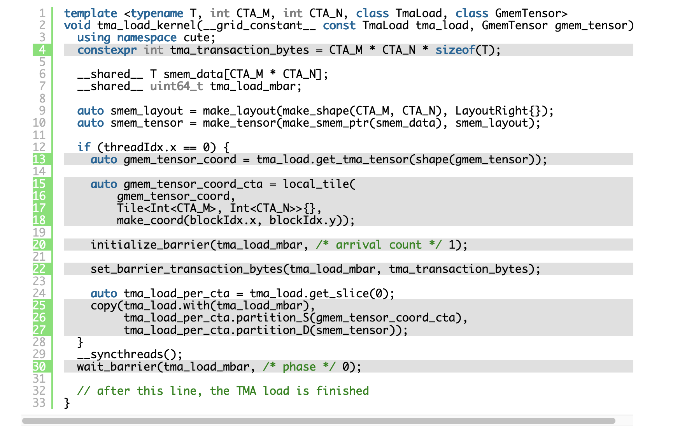
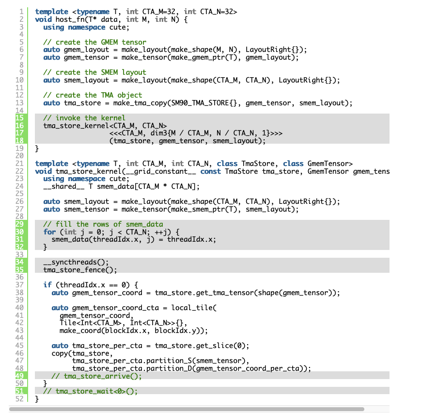
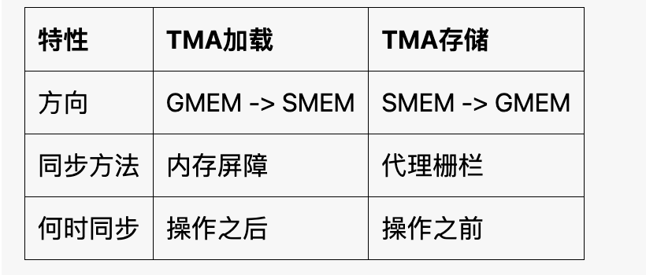
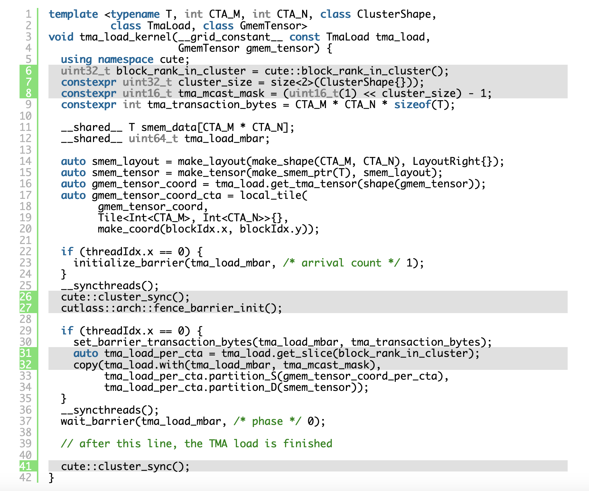
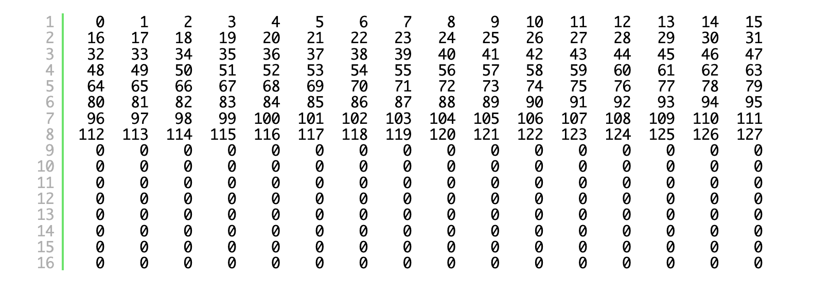
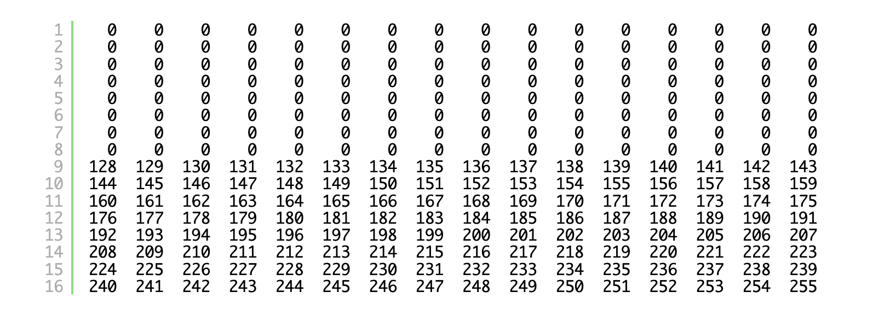

> 블로그 원 주소: https://research.colfax-intl.com/tutorial-hopper-tma/
> 블로그에 대응하는 전체 코드: https://github.com/ColfaxResearch/cfx-article-src/tree/master/tma

# CUTLASS 튜토리얼: NVIDIA® Tensor Memory Accelerator (TMA) 마스터하기

TMA(Tensor Memory Accelerator)는 NVIDIA Hopper™ 아키텍처에 도입된 새 기능으로, GPU의 global memory(GMEM)와 thread block, 즉 CTA의 shared memory(SMEM) 사이에서 asynchronous memory copy를 수행하는 데 사용된다. 이전 방법과 비교해 TMA는 많은 장점을 제공한다. 예를 들어 (1) asynchronous 방식으로 전용 warp(https://github.com/NVIDIA/cutlass/blob/main/media/docs/efficient_gemm.md#warp-specialization)를 촉진하는 kernel scheduling을 가능하게 해 GPU utilization을 높이고, (2) TMA copy descriptor를 통해 주소와 stride 같은 보조 copy data 계산을 단일 thread 방식으로 처리해 register를 더 절약하면서 필요한 predicate(예: boundary check)도 처리할 수 있다. NVIDIA의 기술 블로그(https://developer.nvidia.com/blog/nvidia-hopper-architecture-in-depth/)와 Hopper tuning guide(https://docs.nvidia.com/cuda/hopper-tuning-guide/index.html#tensor-memory-accelerator)는 이러한 장점을 잘 설명하고 있으며, TMA 설계 뒤의 원리를 이해하려면 독자에게 이 자료들을 읽어 보기를 강력히 권한다.

그러한 자료들과 달리 이 블로그 글은 TMA를 사용하는 kernel을 어떻게 작성할지에 초점을 맞춰, 조작 가능한 이해를 얻는 데 목적이 있다. 전체 과정에서 우리는 CuTe 라이브러리에 의존한다. 이 라이브러리는 low-level GPU instruction을 감싼 API를 통해 TMA를 노출한다. 이러한 instruction에는 PTX instruction `cp.async.bulk.tensor`와 `cp.reduce.async.bulk.tensor`, 그리고 `cuTensorMap` operand가 포함되며, 이 글에서도 이 내용을 다룬다.

이 블로그 글은 세 가지 주요 부분으로 구성된다. 첫 번째는 TMA load, 두 번째는 TMA save, 마지막 세 번째는 TMA load reduce와 TMA save Multicast 같은 더 고급 operation을 다룬다. 본질적으로 TMA load는 GPU의 GMEM에서 CTA의 SMEM으로 데이터를 copy("load")하고, TMA save는 CTA의 SMEM에서 GPU의 GMEM으로 데이터를 copy("store")한다. TMA load, TMA save, 더 고급 variant들이 많은 개념을 공유하므로, TMA load 부분에서 대부분의 필요한 개념을 소개한 뒤 이어지는 부분에서는 남은 차이점에만 집중한다.

또한 TMA는 asynchronous operation(asynchronous proxy에서 실행)이라는 점을 고려하면, kernel의 올바른 동작을 보장하기 위해 asynchronous memory barrier, 즉 `mbarrier`, asynchronous memory fence, 즉 `fence.proxy.async` 같은 memory consistency 강제 도구를 사용해야 한다. synchronization 자체는 폭넓은 논의 주제이므로, 여기서는 실제 사용에 필요한 정도까지만 이 개념들을 다룬다.

마지막으로, CUTLASS나 CuTe 개념을 포함하지 않으면서도 같은 핵심을 많이 다루는 자료를 찾는 독자에게는 CUDA® programming guide의 TMA 부분(https://docs.nvidia.com/cuda/cuda-c-programming-guide/index.html#tensor-memory-access)을 추천한다.

## TMA Load

TMA load는 데이터를 GMEM에서 SMEM으로 copy한다. 이 절에서는 TMA load를 사용해 이 목표를 달성하는 kernel을 어떻게 작성하는지 보여 준다. TMA load를 사용하는 kernel은 다른 memory copy 방법을 사용하는 kernel과 크게 다르므로, 먼저 간단한 예제 작업에 대해 이런 kernel을 작성하는 방법을 보여 준다. 그런 다음 관련 개념을 설명한다.

### 예제 작업

TMA load의 사용을 보여 주기 위해 간단한 작업을 고려한다. 2D row-major matrix를 block으로 나누는 것이다. shape가 `[m,n]`인 matrix A와 두 양의 정수 `CTA_M`, `CTA_N`이 주어진다. `CTA_M`과 `CTA_N`은 compile time에 알려져 있고, `m`과 `n`은 runtime에 matrix A를 통해 주어진다는 점에 유의하라. 단순함을 위해 `m % CTA_M == n % CTA_N == 0`이라고도 가정하지만, 뒤에서 이 요구를 완화할 수 있음을 보게 된다.

우리는 크기가 `{m/CTA_M, n/CTA_N, 1}`인 CTA grid를 실행한다. 여기서 `(i,j)`번째 CTA의 SMEM은 A에서 온 shape `[CTA_M, CTA_N]`의 `(i,j)`번째 block을 저장한다. 이 할당은 numpy pseudo code로 다음처럼 설명할 수 있다.

```python
A = np.random.uniform(M, N)
for i in range(M):
  for j in range(N):
    cta_i_j = A.reshape(M // CTA_M, CTA_M, N // CTA_N, N)[i, :, j, :]
```

**두 단계 과정**. 이 작업을 수행하기 위해 TMA load를 사용한다. CuTe에서 TMA load operation은 두 단계로 구현된다. 첫 번째 단계는 host code에서 TMA copy descriptor를 구성하는 것이고, 두 번째 단계는 kernel code에서 이 descriptor를 사용해 실제 TMA load를 수행하는 것이다. 이 두 단계 과정은 우리가 일반적으로 CuTe의 TiledCopy를 사용하는 방식과 다르다는 점에 유의하라. TiledCopy에서는 모든 copy step이 kernel code 안에 쓰인다. 튜토리얼(https://github.com/NVIDIA/cutlass/blob/637b15906358191cb4238af419d408a65819d7ec/examples/cute/tutorial/tiled_copy.cu#L120-L124)에 나온 것처럼 말이다.


### Host Code

host 쪽에서는 세 객체를 만든다. copy source인 GMEM tensor, 각 CTA 위에서 copy destination이 되는 SMEM tensor의 layout, 그리고 이 둘을 parameter로 받는 `tma_load` 객체다. SMEM layout을 host 쪽에서 만들기 때문에 모든 CTA가 TMA load에 같은 SMEM layout을 공유한다는 점에 유의하라. 이 객체들이 준비되면 device의 kernel로 전달할 수 있고, kernel에서 TMA load operation을 호출한다.

host 쪽 전체 code block은 다음과 같다.

```c++
template <typename T, int CTA_M, int CTA_N>
void host_fn(T* data, int M, int N) {
  using namespace cute;
 
  // create the GMEM tensor
  auto gmem_layout = make_layout(make_shape(M, N), LayoutRight{});
  auto gmem_tensor = make_tensor(make_gmem_ptr(T), gmem_layout);
 
  // create the SMEM layout
  auto smem_layout = make_layout(make_shape(CTA_M, CTA_N), LayoutRight{});
 
  // create the TMA object
  auto tma_load = make_tma_copy(SM90_TMA_LOAD{}, gmem_tensor, smem_layout);
 
  // invoke the kernel
  tma_load_kernel<CTA_M, CTA_N>
                 <<<1, dim3{M / CTA_M, N / CTA_N, 1}>>>
                 (tma_load, gmem_tensor, smem_layout);
}
```

gmem_layout, gmem_tensor, smem_tensor를 만드는 code line은 기본적인 CuTE 개념만 사용하므로, 기억을 되살리려면 독자에게 이 CuTe 튜토리얼들(https://github.com/NVIDIA/cutlass/blob/637b15906358191cb4238af419d408a65819d7ec/media/docs/cute/01_layout.md, https://github.com/NVIDIA/cutlass/blob/637b15906358191cb4238af419d408a65819d7ec/media/docs/cute/02_layout_algebra.md, https://github.com/NVIDIA/cutlass/blob/637b15906358191cb4238af419d408a65819d7ec/media/docs/cute/03_tensor.md)을 참고하기를 권한다. 여기서는 `tma_load` 객체를 설명하는 데 집중한다. 이 객체는 cute::TiledCopy의 instance이며, CTA 범위의 copy operation을 수행하는 정보와 구현 방법을 포함한다. code snippet에서 `tma_load` 객체는 `cute::make_tma_copy` 함수의 이 explicit default value로 생성된다. 이 함수의 전체 구현에는 몇 가지 미묘한 차이가 있으며, 뒤에서 `MULTICAST`를 논의할 때 깊이 살펴보겠지만, 대부분의 use case(우리의 예제 작업처럼)에서는 explicit default value로 충분하다. 불필요한 복잡성(과 오류)을 피하기 위해 explicit default value를 사용하는 것을 권한다.

`make_tma_copy`에 사용한 signature를 보자.

- 마지막 두 parameter는 `gmem_tensor`와 `smem_layout`이다. 내부적으로 `make_tma_copy`는 이 정보를 사용해 `TmaDescriptor`를 만든다. 이는 `CUtensorMap`의 alias(https://github.com/NVIDIA/cutlass/blob/637b15906358191cb4238af419d408a65819d7ec/include/cute/arch/copy_sm90_desc.hpp#L178)에 불과하다. 이 descriptor 객체는 TMA kernel에서 사용된다.
- 첫 번째 parameter는 SM90_TMA_LOAD(https://github.com/NVIDIA/cutlass/blob/637b15906358191cb4238af419d408a65819d7ec/include/cute/arch/copy_sm90_tma.hpp#L269)의 instance다. 이 객체는 copy operation을 필요한 `cp.async.bulk.tensor` PTX 호출로 dispatch하며, 아래 세 번째 부분에서 더 깊이 살펴본다.

### Kernel code

관련 kernel code snippet은 아래와 같다. 이 code line들은 많은 중요한 TMA 개념을 포함하고 있으며, 아래에서 설명한다.



먼저 2번째 줄에서 kernel의 tma_load parameter는 반드시 `__grid_constant__ const` annotation이 붙어야 한다. GMEM에서 SMEM으로 copy할 tensor가 두 개라면 각 tensor는 자신의 `TiledCopy` instance를 가져야 하고, 각 instance도 모두 `__grid_constant__ const`여야 한다. 이는 host에서 device로 `cuTensorMap`을 전달하기 위한 요구사항이며, 예를 들어 여기 문서(https://docs.nvidia.com/cuda/cuda-c-programming-guide/index.html#asynchronous-data-copies-using-tensor-memory-access-tma)에 설명되어 있다.

다음으로 중요한 점은 TMA Copy에서는 단 하나의 thread만 TMA operation을 issue한다는 것이다. code snippet에서 TMA 관련 모든 변수와 instruction은 12번째 줄부터 시작하는 if block 안에 있고, 이 block은 thread 0만 실행한다. 반면 30번째 줄에는 CTA 안의 모든 thread가 TMA operation 완료를 기다리게 하는 instruction이 포함되어 있다.

**좌표와 산술 tuple**

이제 TMA load logic을 보자. 13번째 줄에서 시작하며, copy할 GMEM tensor의 좌표를 저장하는 `gmem_tensor_coord` 객체를 만든다. 다음 작업을 시도하면

```c++
if (cute::thread(0)) { cute::print(gmem_tensor_coord); }
```

아래와 같은 output을 보게 된다(M=N=1024인 경우).

```c++
ArithTuple(_0,_0) o (1024,1024):(_1@1,_1@0)
```

CuTe에서 tiled copy가 동작하는 방식에 익숙한 독자에게는 15-18번째 줄이 자명하다. 여기서 GMEM tensor는 더 작은 partitions로 tiled되고, 각 CTA는 block coordinate에 따라 tiled tensor를 slice해 자신의 GMEM view를 얻는다. 하지만 partitions가 gmem_tensor 자체가 아니라, 위에서 gmem_tensor 좌표를 표현한 ArithTuple에 적용된다는 점에 유의하라. 특히 ArithTuple은 shape `[CTA_M,CTA_N]`의 block으로 나뉘고, 각 CTA는 자신의 block을 취한다.

다음과 같이 `print_tensor`를 사용해 `gmem_tensor_coord_cta`를 출력하면

```c++
if (cute::block(7)) { cute::print_tensor(gmem_tensor_coord_cta); }
```

아래와 같은 output을 보게 된다.

```c++
ArithTuple(0,112) o (_16,_16):(_1@1,_1@0):
  (0,112)  (1,112)  (2,112)  (3,112)  (4,112)  (5,112)  (6,112)  (7,112)  (8,112)  (9,112)  (10,112)  (11,112)  (12,112)  (13,112)  (14,112)  (15,112)
  (0,113)  (1,113)  (2,113)  (3,113)  (4,113)  (5,113)  (6,113)  (7,113)  (8,113)  (9,113)  (10,113)  (11,113)  (12,113)  (13,113)  (14,113)  (15,113)
  // more lines
  (0,127)  (1,127)  (2,127)  (3,127)  (4,127)  (5,127)  (6,127)  (7,127)  (8,127)  (9,127)  (10,127)  (11,127)  (12,127)  (13,127)  (14,127)  (15,127)
```

이 숫자들은 `gmem_tensor` 안의 좌표이며, 그 값들이 CTA 7의 `smem_tensor`로 copy된다. 독자에게 이 code snippet을 실행해 보고 `cute::block(7)`을 다른 index로 바꾸어, 서로 다른 CTA가 `gmem_tensor`의 어떤 좌표에서 데이터를 copy하는지 이해해 보기를 권한다.

다음으로 25-27번째 줄에서 issue되는 copy operation 자체는 TiledCopy operation의 일반적인 signature를 가진다. 여기서는 source tensor가 partition된 좌표로 대체되어 있다.

**Memory barrier**

20, 22, 30번째 줄은 생략했는데, 이 줄들은 모두 SMEM 안의 `uint64_t` 변수 `tma_load_mbar`와 관련된다. 이는 TMA load와 kernel의 나머지 부분이 SMEM에 load된 결과 데이터를 consume하는 것을 synchronize하기 위해 사용하는 **asynchronous transaction barrier**다. NVIDIA의 Hopper architecture technical blog(https://developer.nvidia.com/blog/nvidia-hopper-architecture-in-depth/)에는 이런 barrier의 high-level 설명이 있다. 우리의 kernel에서 중요한 점은 다음과 같다.

- 20번째 줄에서 shared memory 안에 mbarrier 객체를 initialize한다. CuTe method `initialize_barrier`는 PTX instruction `mbarrier.init.shared.b64`를 감싸며, 이 instruction은 추가 arrive count parameter를 요구한다. 우리의 context에서는 단일 thread가 TMA load를 시작하므로 arrive count를 1로 설정해야 한다. 또한 mbarrier의 시작 phase는 항상 0으로 설정된다.
- 22번째 줄에서 CuTe method `set_barrier_transaction_bytes`를 사용해 arrive-on operation을 수행하는 동시에 mbarrier 객체에 expected transaction count를 설정한다. 이 method는 PTX instruction `mbarrier.arrive_expect_tx.shared::cta.b64`를 감싼다. transaction count는 TMA load가 전송하는 byte 수와 같게 설정되며, 우리는 4번째 줄에서 이 값을 계산한다.
- 25-27번째 줄에서 copy instruction(필요한 `cp.async.bulk.tensor` type으로 dispatch됨)은 항상 completion mechanism을 `barrier::complete_tx::bytes`로 설정하고, 제공된 mbarrier 객체를 사용한다.
- 30번째 줄에서 mbarrier 객체에 대해 wait operation을 수행한다. 모든 thread가 mbarrier에서 wait한다는 점에 유의하라. 이는 thread 0만 mbarrier에 arrive하는 것과 대조된다. 또한 thread divergence를 해결하기 위해 `wait_barrier` 전에 `__syncthreads()`를 호출하는 것이 필요하다.
여기서 `wait_barrier`는 PTX instruction `mbarrier.try_wait.parity.shared::cta.b64`를 감싼다. `try_wait` qualifier(`test_wait`와 대비됨)는 wait가 blocking instruction임을 의미한다. `parity` qualifier(사용 시 phase 제공 필요)는 thread가 mbarrier의 해당 phase가 flip될 때까지 sleep함을 뜻한다. 이것은 initialization 이후 mbarrier를 completion tracking에 처음 사용하는 것이므로 phase로 0을 제공한다. 또 다른 TMA load를 수행하려면 mbarrier를 재사용하기 위해 phase를 flip해야 한다.
전체적으로 CUTLASS Pipeline APIs(https://github.com/NVIDIA/cutlass/blob/main/media/docs/pipeline.md)는 일련의 TMA load를 처리할 때 mbarrier 객체의 lifetime을 관리하는 더 high-level 방법을 제공한다. software pipeline(https://github.com/NVIDIA/cutlass/blob/main/media/docs/efficient_gemm.md#pipelining) 방안에서 그럴 수 있는 것처럼 말이다.
- `wait_barrier` 이후 memory consistency model은 다음 보장을 제공한다. TMA load가 SMEM에 쓴 내용은 `wait_barrier`를 호출한 모든 thread(우리 예제 kernel에서는 CTA 안의 모든 thread)에게 visible하다.

**TMA를 사용할 때의 remainder TILES와 stride 요구사항**

위 예제에서는 `m%CTA_M==0`과 `n%CTA_N==0`이라고 가정했다. 하지만 TMA load를 수행하기 위해 이 가정을 완전히 버릴 수 있다. GMEM에서 SMEM으로 remainder block을 load할 때의 out-of-bound logic을 직접 처리할 필요가 없다. TMA copy unit이 memory copy가 out-of-bound 데이터를 읽지 않도록 필연적으로 제한(https://github.com/NVIDIA/cutlass/blob/main/media/docs/cute/0y_predication.md)하기 때문이다. 이는 위 TMA load에서 특별한 "implicit" CuTe tensor와 `ArithTuple`을 사용하는 것과 일치한다. 일반 CuTe tensor를 사용하면 slice되어 새로운 CuTe tensor가 생길 수 있고, GMEM을 가리키는 out-of-bound pointer를 포함할 수 있어 필연적으로 bug를 일으킨다.

하지만 TMA에서는 GMEM tensor 자체의 stride에 중요한 요구사항이 있음을 기억해야 한다. 즉 **16-byte boundary requirement**다. 예상할 수 있듯이 TMA는 GMEM 안에서 arbitrary stride의 region을 copy하는 것을 지원하지 않는다. 대신 copy되는 block이 (i) 하나의 contiguous direction(stride 1)과 (ii) 다른 stride가 16 byte의 배수라는 조건을 가진다고 가정해야 한다. 이는 CUTLASS codebase에서 assertion(https://github.com/NVIDIA/cutlass/blob/7d49e6c7e2f8896c47f586706e67e1fb215529dc/include/cute/atom/copy_traits_sm90_tma.hpp#L846)되어 있다.

예를 들어 shape가 (m, n), stride가 (n, 1)인 row-major GMEM float tensor에서는 n%4==0이어야 한다. 이 조건을 만족하지 않으면 kernel을 호출하기 전에 input tensor를 올바른 크기로 padding할 수 있다.

## TMA Store

TMA load의 기본 지식을 익히고 나면, 두 operation 사이의 많은 유사성 때문에 TMA store를 배우는 것은 훨씬 쉬워진다. TMA load와 마찬가지로 TMA store를 구현하는 것도 두 단계 과정이다. host에서 TMA copy descriptor를 정의한 뒤 kernel에서 TMA store operation을 issue한다.

### 예제 작업과 코드

설명을 위해 TMA load의 반대 예제를 고려해 보자. 여러 CTA의 SMEM에서 partition된 GMEM tensor의 해당 block으로 copy하는 것이다. 여기서 한 가지 차이는 GMEM으로 copy하기 전에 간단한 숫자 pattern으로 CTA 안의 SMEM block을 채운다는 점이다(그렇지 않으면 undefined value를 copy하게 된다). 동작하는 code snippet은 다음과 같다.



host code는 tma_store_kernel 호출을 제외하면 TMA load와 거의 같다. 각 CTA가 CTA_M개의 thread를 갖도록 배치했다는 점에 유의하라. 우리의 예제에서 각 CTA는 SMEM에 `[CTA_M,CTA_N]` block을 보유하므로, 29-32번째 줄에서 thread i가 i번째 row를 값 i로 채운다.

kernel code에서 39-49번째 줄의 if block은 tma_load_kernel의 if block과 비슷하다. 특히 thread 0만 TMA store operation을 issue한다. 모든 tensor tiling logic은 개념적으로 동일하다. 그러나 copy direction은 반대다. TMA store에서는 `tma_store_per_cta.partition_S` method가 `smem_tensor`에 적용되고, `tma_store_per_cta.partition_D` method가 GMEM tensor의 좌표에 적용된다. 좌표도 TMA load와 비슷하게 `ArithTuple`로 표현된다는 점에 유의하라.


**Memory fence**

TMA load와 store code 사이의 가장 중요한 차이는 TMA store와 함께 사용되는 mbarrier 객체가 더 이상 보이지 않는다는 점이다. 이는 TMA store가 memory consistency를 강제하기 위해 다른 mechanism, 즉 memory fence를 사용하기 때문이다.

memory fence의 목적은 실행 thread가 fence 전후에 요청한 memory access 사이에 보장된 순서를 설정하는 것이다. 우리의 예제에서는 29-32번째 줄의 SMEM에 대한 모든 write가 thread 0이 수행하는 TMA store에 visible하다는 것을 보장해야 한다. 이를 위해 35번째 줄에 CuTe method `tma_store_fence()`가 있고, 이는 PTX instruction `fence.proxy.async.shared::cta`를 감싼다.

이 instruction은 fence의 효과를 설명하는 두 중요한 qualifier, 즉 scope와 proxy type을 포함한다. scope는 fence가 강제하는 순서에 참여하는 thread 집합을 나타낸다. 우리의 예에서 qualifier(https://docs.nvidia.com/cuda/parallel-thread-execution/index.html#scope) cta는 scope를 CTA 안의 모든 thread로 정의한다(이는 memory consistency model 목적에서 가능한 최소 scope다). proxy type(https://docs.nvidia.com/cuda/parallel-thread-execution/index.html#proxies)은 generic proxy 외에 fence가 강제하는 순서에 참여할 proxy type을 나타낸다. 우리의 예에서는 proxy type을 `async.shared`로 선택한다. TMA store가 asynchronous proxy에서 실행되기 때문이다(각 CTA에 대해). asynchronous fence를 asynchronous proxy와 관련 없는 다른 memory fence primitive(예: `__threadfence_block()`)로 대체하면 kernel의 올바른 동작에 필요한 보장을 깨뜨리고, 실제로 race condition을 일으킨다.

**TMA store arrive와 wait**

49번째 줄과 51번째 줄에는 `tma_store_arrive()`와 `tma_store_wait<Count>()`가 있다. 전자는 TMA store operation을 commit하고(기술적으로는 `cp.async.bulk-group`으로), 후자는 최대 `Count`개의 committed TMA store operation이 pending 상태가 될 때까지 기다린다(예를 들어 모든 operation이 완료되어야 한다면 `Count`를 0으로 설정한다). kernel 안에서 TMA store 완료를 기다리는 다른 작업이 있을 때 이러한 operation은 유용하다. 예를 들어 write-out 이후 해제된 SMEM을 재사용할 때 필요하다. 하지만 우리의 kernel은 TMA store 완료 후 단순히 종료하므로, 여기서는 TMA store arrive와 wait pattern이 필요 없어서 이 줄들을 주석 처리했다.

## TMA operation 더 깊이 이해하기

TMA load와 TMA store operation 비교 표:




지금까지 TMA load와 TMA store operation을 호출하는 방법을 배웠다. 위 표는 이 operation들을 비교하고 대조한다. 어느 operation이든 호출하려면 host code에서 `cute::make_tma_copy` method를 통해 TiledCopy와 비슷한 객체를 만들고, 이 객체를 kernel function으로 전달한 뒤, 그곳에서 `cute::copy`를 사용해 실제로 operation을 호출해야 한다. 이 절에서는 kernel function에서 이러한 TiledCopy 객체를 호출할 때 실제로 어떤 일이 일어나는지 깊이 살펴본다. 이 탐구를 바탕으로 두 가지 확장, 즉 TMA store reduction과 TMA load multicast를 논의한다.

### TMA load와 store의 PTX instruction

PTX(Parallel Thread Execution)는 NVIDIA GPU의 low-level intermediate language다. 우리의 논의에서 PTX의 관련 부분은 `asm volatile` keyword로 감싼 block을 CUDA code에 삽입할 수 있는 instruction 집합이다. 특히 앞 절에서 설명했듯 `cute::copy(tma_load, ...)` 또는 `cute::copy(tma_store, ...)`를 호출하면 특정 PTX instruction이 호출되어 이 operation들을 수행한다. PTX를 살펴보면 TMA load와 TMA store를 더 잘 이해할 수 있다.

TMA load부터 시작하자. host code에서 `tma_load` 객체를 만들 때 source data를 포함하는 GMEM tensor와 각 CTA에서 data가 저장되는 방식을 설명하는 SMEM layout을 제공해야 했다는 점을 떠올리자. 이 tensor와 layout을 사용해 CuTe는 kernel에서 `cute::copy(tma_load, ...)`를 호출할 때 실행할 underlying PTX instruction을 결정한다. PTX instruction 선택은 GMEM tensor의 rank에 의존한다(여기서 rank는 tensor의 dimension 수를 뜻하며, linear algebra의 matrix rank/nullity가 아님에 유의하라). 우리의 예제에서 GMEM tensor의 rank는 2이므로 다음 PTX instruction(https://github.com/NVIDIA/cutlass/blob/637b15906358191cb4238af419d408a65819d7ec/include/cute/arch/copy_sm90_tma.hpp#L100-L106)이 실행된다.

```c++
// inline assembly를 사용해 TMA load operation을 수행한다
asm volatile (
  // PTX instruction "cp.async.bulk.tensor.2d.shared::cluster.global.mbarrier::complete_tx::bytes"
  // 이 instruction은 global memory(GMEM)에서 shared memory(SMEM)로 데이터를 asynchronous load하는 데 사용된다
  // 여기서 "2d"는 2D tensor를 뜻하고, "shared::cluster"는 destination이 shared memory cluster임을 뜻한다.
  // "global"은 source data가 global memory에 있음을 뜻하고, "mbarrier::complete_tx"는 memory barrier를 사용해 transfer를 완료함을 뜻한다.
  // "bytes"는 전송되는 data unit이 byte임을 뜻한다
  "cp.async.bulk.tensor.2d.shared::cluster.global.mbarrier::complete_tx::bytes"
  // instruction의 operand 부분
  " [%0], [%1, {%3, %4}], [%2];"
  :
  // output operand는 비어 있다
  :
  // input operand
  // "r"(smem_int_ptr) - shared memory pointer, SMEM 안의 data destination을 가리킨다
  // "l"(gmem_int_desc) - global memory descriptor, GMEM 안의 source data 위치를 설명한다
  // "r"(smem_int_mbar) - memory barrier, data transfer의 ordering을 보장한다
  // "r"(crd0) - coordinate 0, 2D tensor의 첫 번째 dimension을 나타낸다
  // "r"(crd1) - coordinate 1, 2D tensor의 두 번째 dimension을 나타낸다
  : "r"(smem_int_ptr), "l"(gmem_int_desc), "r"(smem_int_mbar),
    "r"(crd0), "r"(crd1)
  // "memory" - 이 instruction이 memory를 수정함을 나타내며, compiler가 memory operation을 optimize하지 못하게 한다
  : "memory");
```

이 PTX instruction을 보면 많은 익숙한 개념이 보인다. 예를 들어 `gmem_int_desc`는 TMA descriptor에 저장된 좌표를 가리키고, `mbarrier::complete_tx::bytes`와 `smem_int_mbar`는 memory barrier를 가리킨다. 또한 `tensor.2d`는 우리가 2차 tensor, 즉 2D matrix를 copy하고 있음을 뜻한다.

사실 TMA load뿐 아니라 모든 TMA operation은 특정 `cp.async.bulk` instruction의 wrapper다. NVIDIA PTX 문서는 `cp.async.bulk` instruction, 특히 그 syntax와 operand를 논의하는 데 별도의 한 절을 할애한다. 독자에게 그 절과 그 안의 참고 자료를 읽고 TMA operation을 더 전면적으로 연구하기를 권한다. 이러한 operation이 다루는 범위는 이 블로그 글에서 논의하려는 범위보다 훨씬 넓다. 여기서는 이 `cp.async.bulk` instruction을 통해 노출되는 TMA의 두 가지 확장을 논의한다.

#### TMA Store Reduce

TMA store operation은 여러 CTA의 SMEM에 있는 데이터를 GMEM tensor의 해당 block으로 copy한다는 점을 떠올리자. TMA store는 다음 Python pseudo code가 보여 주는 assignment operation으로 해석할 수 있다.

```python
for cta_idx in range(number_of_ctas):
    gmem_dst[cta_idx] = smem_src[cta_idx]
```

만약 다음 작업을 수행하고 싶다면 어떨까?

```python
for cta_idx in range(number_of_ctas):
    gmem_dst[cta_idx] += smem_src[cta_idx]
    # 또는 이것:
    gmem_dst[cta_idx] = max(gmem_dst[cta_idx], smem_src[cta_idx])
    # 또는:
    gmem_dst[cta_idx] = min(gmem_dst[cta_idx], smem_src[cta_idx])
```

이 모든 operation, 즉 reduction sum, reduction max, reduction min은 tensor program에서 꽤 흔하다. 특히 reduction sum은 Split-K GEMM에서 피할 수 없는 subroutine이고, reduction max와 reduction min은 attention mechanism에서 자주 사용된다. 이 operation들이 단순해 보이지만 CUDA kernel에서 구현하는 것은 그렇게 직접적이지 않다. 다음 문단을 읽기 전에, 이러한 목표를 달성하려면 GMEM과 SMEM 사이에서 몇 round의 data movement가 필요한지 잠시 생각해 보기를 독자에게 권한다.

한 CTA의 SMEM 값이 GMEM tensor의 한 block으로 "accumulate"되는 reduction operation의 원시 구현은 GMEM read 한 번, block 처리 한 번, GMEM write 한 번을 포함한다. 먼저 GMEM에서 원래 값을 CTA의 SMEM 또는 register로 load한 뒤 reduction operation을 수행하고, 마지막으로 결과를 다시 write한다. 이 과정은 느리다.

TMA store TiledCopy 객체의 constructor를 약간 수정하면, 이 세 단계 과정을 단 하나의 PTX instruction으로 압축할 수 있다. 즉 `cp.async.bulk` 대신 `cp.reduce.async.bulk`(https://docs.nvidia.com/cuda/parallel-thread-execution/index.html#data-movement-and-conversion-instructions-cp-reduce-async-bulk)를 사용하는 것이다. 구체적으로 host code에서 다음 한 줄을 바꾸면 된다.

```c++
// original: create a TMA store object
auto tma_store = make_tma_copy(SM90_TMA_STORE{}, gmem_tensor, smem_layout);
 
// to create a TMA reduce sum object
auto tma_reduce_sum = make_tma_copy(SM90_TMA_REDUCE_ADD{}, gmem_tensor, smem_layout);
```

그런 다음 `tma_store` 대신 `tma_reduce_sum`을 사용하면, 이제 내부에서 `cp.async.bulk`가 아니라 `cp.reduce.async.bulk`를 호출한다.

덧붙여 말하면 PTX instruction `cp.reduce.async.bulk`는 CUDA 12.0 release 이후 이미 사용할 수 있었지만, CUTLASS 3.5 release가 되어서야 CUTLASS와 CuTe를 통해 노출되었다. 우리는 다른 reduction operation들이 future version에서 공개되기를 바라지만, 그렇지 않더라도 max/min reduction과 다른 bitwise reduction을 수행하도록 CuTe code를 TMA reduction에 맞추는 것은 꽤 간단하다(`cp.reduce.async.bulk`는 and, or, xor, inc, dec를 제공한다).


#### TMA Load Multicast

앞 절에서 PTX instruction을 연구하면 일부 application scenario에서 TMA store를 대체할 수 있는 TMA reduction operation을 발견할 수 있음을 보았다. 이 절에서는 TMA load의 multicast 확장을 연구한다.

이해를 돕기 위해 먼저 `cp.async.bulk.tensor`의 전체 syntax(https://docs.nvidia.com/cuda/parallel-thread-execution/index.html#data-movement-and-conversion-instructions-cp-async-bulk-tensor)를 보자.

```c++
// global -> shared::cluster:
cp.async.bulk.tensor.dim.dst.src{.load_mode}.completion_mechanism
{.multicast}{.level::cache_hint}
  [dstMem],                // destination memory address
  [tensorMap, tensorCoords], // tensor map과 coordinate
  [mbar]                   // memory barrier
  {, im2colOffsets}        // optional: im2col offset
  {, ctaMask}              // optional: CTA mask
  {, cache-policy}         // optional: cache policy
 
.dst =                  { .shared::cluster } // destination은 cluster shared memory
.src =                  { .global }          // source는 global memory
.dim =                  { .1d, .2d, .3d, .4d, .5d } // 지원되는 tensor dimension
.completion_mechanism = { .mbarrier::complete_tx::bytes } // memory barrier로 transfer 완료
.load_mode =            { .tile, .im2col }   // load mode: tile 또는 im2col
.level::cache_hint =    { .L2::cache_hint }  // L2 cache hint
.multicast =            { .multicast::cluster  } // cluster 내 Multicast
```

다시 강조하자면 PTX instruction의 syntax를 완전히 이해할 필요는 없다. `.dim`, `src`에 사용되는 `.global`, `completion_mechanism`에 사용되는 `.mbarrier`처럼 익숙한 개념을 볼 수 있다. 이 절에서는 `multicast` operand에 집중한다.

Multicast는 GMEM tensor 안의 한 block을 여러 CTA 안의 여러 SMEM 위치로 copy하고 싶은 상황을 뜻한다. 이는 보통 GEMM kernel, 즉 matrix multiplication에서 발생한다. 한 input matrix column block이 여러 row block에 사용되어야 하거나 그 반대인 경우다. 이 상황에서 TMA Load는 여전히 완전히 사용할 수 있다. 필요한 여러 CTA에 같은 TMA descriptor를 제공하기만 하면 된다. 하지만 `.multicast` operand는 L2 cache hit를 보장할 수 있게 해 준다.

위 TMA Load 예제를 Multicast를 포함하도록 확장하는 것을 생각해 보자. 먼저 kernel의 cluster dimension을 non-trivial하게 정의해야 한다. 한 CTA 묶음이 TMA Load Multicast operation에 함께 참여하려면 같은 thread block cluster에 속해야 하기 때문이다. 단순함을 위해 grid dimension만 다음처럼 바꾼다.

```c++
// old grid dimensions and implicit trivial cluster dimensions
dim3 grid_dims = dim3{M / CTA_M, N / CTA_N, 1};
dim3 cluster_dums = dim3{1, 1, 1};
 
// new grid dimensions and cluster dimensions
dim3 grid_dims = dim3{M / CTA_M, N / CTA_N, 2};
dim3 cluster_dums = dim3{1, 1, 2};
```

cluster를 사용할 때 cluster dimension은 grid dimension을 균등하게 나누어야 한다. 그렇지 않으면 kernel이 launch되지 않는다. 우리의 새 kernel에서는 같은 GMEM block을 같은 cluster 안의 각 CTA pair의 SMEM으로 load하도록 배치한다. 이는 두 CTA가 같은 blockIdx.x와 blockIdx.y를 가질 때, 그리고 그때만 발생한다.

먼저 host code에서 TMA Load `TiledCopy` 객체 정의를 다음처럼 바꾼다.

```c++
// original: create a TMA load object
auto tma_load = make_tma_copy(SM90_TMA_LOAD{}, gmem_tensor, smem_layout);
 
// new: create a TMA load multicast object for the given cluster size
auto tma_load = make_tma_copy(SM90_TMA_LOAD_MULTICAST{},
      gmem_tensor, smem_layout, cute::_2{});
```

마지막 parameter(cluster size)에 `_2{}`를 써서 compile-time constant로 전달한다. 이를 위해 제공되는 CuTe integer type(https://github.com/NVIDIA/cutlass/blob/main/media/docs/cute/01_layout.md#integers)을 사용한다. 실제로는 보통 `ClusterShape` type(우리의 경우 `Shape<_1,_1,_2>`)을 미리 정의하고, 이 parameter에 `size<2>ClusterShape{}`를 쓰는 방식이 더 익숙하다.

그런 다음 kernel code를 다음처럼 바꾼다.



관련 변경 사항을 강조해 두었다. 먼저 이제 CTA가 자신의 cluster 안에서 갖는 내부 index를 추적해야 하며, CuTe method `block_rank_in_cluster()`로 이를 얻는다. 이는 special register `%cluster_ctarank`의 값을 반환하고, 우리의 예제에서는 0과 1 값을 갖는다. 간결함을 위해 이를 `ctaid`라고 부르자.
그런 다음 code에 다음 세 가지 수정을 한다.

- 추가적인 cluster synchronization primitive.
- Multicast operation에서 uint16 bit mask 사용.
- `ctaid`를 사용해 GMEM과 SMEM tensor를 나누는 데 쓰이는 `TiledCopy` 객체의 slice 부분을 결정.

(1)의 경우 CuTe method `cluster_sync()`를 사용한다. 이는 cluster barrier arrive와 wait operation을 차례로 수행한다. 우리는 이를 두 위치에 삽입한다. 26-27번째 줄에서는 `cluster_sync()`와 fence를 사용해 cluster 범위에서 mbarrier initialization의 visibility를 보장하고, 41번째 줄에서는 또 다른 `cluster_sync()`를 사용해 cluster 안의 두 CTA 중 하나가 다른 CTA가 아직 Multicast load 완료를 기다리는 중인데 너무 일찍 종료하지 않도록 보장한다. 보통 SMEM으로 load된 data에 대해 계산을 수행하게 되며, 마지막 `cluster_sync()`는 kernel code의 마지막에 나타난다.

(2)의 경우 copy operation에 uint16 bit mask를 전달해 어떤 CTA가 TMA Multicast load에 참여할지 지정한다. mask에서 1로 설정된 bit는 어떤 CTA가 active인지 나타낸다. 하나의 cluster에는 최대 16개 CTA(최대 non-portable size, https://docs.nvidia.com/cuda/hopper-tuning-guide/index.html#thread-block-clusters)가 있을 수 있으며, bit position은 ctaid에 대응한다. 따라서 우리의 예제에서는 `tma_mcast_mask`를 `0b11`로 설정해 cluster 안의 두 CTA가 모두 참여하도록 지정한다.

마지막으로 (3)의 경우 `ctaid`는 주어진 CTA에서 TMA Multicast load operation을 시작할 때 GMEM으로 slice할 offset을 지정하는 데 사용된다. 이를 명확히 설명하기 위해 다음 예를 생각해 보자. GMEM에서 16 x 16 integer block을 cluster 안의 두 CTA의 SMEM으로 load하고, 이 block은 row-major ascending order로 0-255로 초기화되어 있다. 우리가 실수로 두 CTA의 `tma_load.get_slice()`에 모두 0을 parameter로 주었다고 가정하자. 그러면 load 완료 후 두 CTA의 SMEM에서 다음 결과를 얻는다.



반대로 두 CTA 모두에 parameter 1을 주면, 두 CTA의 SMEM에서 다음 결과를 얻는다.



마지막으로 `ctaid` 1에서 0을 주고 `ctaid` 0에서 1을 주거나, `ctaid` 0에서 0을 주고 `ctaid` 1에서 1을 주면 전체 block이 두 CTA의 SMEM에 올바르게 load된다. 이 output들은 cluster 안의 한 CTA에서 Multicast operation을 issue하면 GMEM의 절반이 두 CTA의 SMEM으로 load되고, TiledCopy의 slice가 각 절반을 결정한다는 점을 보여 준다. 이는 PTX 문서의 `cp.async.bulk.tensor` Multicast 설명과 일치한다.

> source data는 각 target CTA의 shared memory 안 같은 CTA-relative offset dstMem으로 Multicast된다.

`TiledCopy` 객체 관점에서 보면, 이것은 보통 thread-value tuple을 slice logical coordinate로 map하는 `TiledLayout_TV` layout을 가지며, CuTe는 slice 목적에서 ctaid를 thread index로 본다. 예를 들어 16 x 16 예제에서 TiledCopy를 출력하면 다음 결과가 나온다.

```c++
TiledCopy
  Tiler_MN:       (_16,_16)
  TiledLayout_TV: (_2,((_16,_16))):(_8,((_16,_1)))
Copy_Atom
  ThrID:        _1:_0
  ValLayoutSrc: (_1,_256):(_0,_1)
  ValLayoutDst: (_1,_256):(_0,_1)
  ValLayoutRef: (_1,_256):(_0,_1)
  ValueType:    32b
```

여기에는 cluster 안의 두 CTA에 대응하는 두 "thread"가 있으며, ctaid 1의 offset position은 `(16,16)` slice 안의 logical coordinate `(8,0)`으로 주어진다.

## 결론

이 블로그 글에서는 몇 가지 단순화된 예제를 통해 CUTLASS 라이브러리가 제공하는 방법을 사용해 CUDA kernel에서 TMA Load, TMA Store, TMA Store Reduce, TMA Load Multicast를 활용하여 GMEM과 SMEM 사이의 memory copy를 수행하는 방법을 보여 주었다.

먼저 TMA를 개관하고, 사용자가 GPU kernel에서 이러한 operation들을 어떻게 호출하는지 소개했다. 그런 다음 low-level PTX instruction을 깊이 살펴보며 TMA에 대한 더 깊은 이해를 얻었다. 이 블로그 글이 TMA를 이해하고 싶거나, 관련 지식을 복습하고 싶거나, TMA를 사용하는 기존 project를 debugging하려는 독자에게 도움이 되기를 바란다.

우리는 TMA가 지원하는 swizzling mode, 그리고 TMA가 GMEM을 SMEM으로 copy할 때 interleaved format으로 배치하는 능력, 즉 contiguous dimension 바깥에서 stride를 permutation하는 능력 같은 중요한 주제를 생략했다. 이들은 TMA를 Warpgroup matrix-multiply-accumulate(WGMMA) instruction과 함께 사용할 때 중요하다. WGMMA instruction 역시 Hopper architecture의 새로운 기능이며, WGMMA와 compatible한 memory format으로 tensor data를 load하는 데 사용된다. 이러한 요점들은 future post에서 Hopper 기반 GEMM을 논의할 때 설명할 것이다.

마지막으로 이 블로그 글에서 논의한 kernel의 전체 예제는 우리의 Colfax Research GitHub repository(https://github.com/ColfaxResearch/cfx-article-src/tree/master/tma)에서 찾을 수 있다.
