> 관련 내용https://www.zhihu.com/column/c_1938664963049763058 관련 내용노트이 부분은 원문의 해당 기술 설명을 이어서 서술한다후관련 내용보다。

# CUTLASS 노트：관련 내용읽다


이 부분은 원문의 해당 기술 설명을 이어서 서술한다 (CUTLASS)노트이 부분은 원문의 해당 기술 설명을 이어서 서술한다 (column)할 것이다부터관련 내용개관련 내용작은의 Minimal GEMM 이 부분은 원문의 해당 기술 설명을 이어서 서술한다 (CuTe CUTLASS)와 Hopper、Blackwell 관련 내용새관련 내용의이 부분은 원문의 해당 기술 설명을 이어서 서술한다구현관련 내용개높은성능의 GEMM 융합operator。

## 1. 머리말

이 부분은 원문의 해당 기술 설명을 이어서 서술한다 (CUTLASS)높은성능의이 부분은 원문의 해당 기술 설명을 이어서 서술한다응용이 부분은 원문의 해당 기술 설명을 이어서 서술한다 (CUDA operator)와성능최적화이 부분은 원문의 해당 기술 설명을 이어서 서술한다 (Pytorch vLLM FA2 FA3)사용관련 내용와operator관련 내용사용 CUTLASS 이 부분은 원문의 해당 기술 설명을 이어서 서술한다대해 CUDA、C++ 관련 내용및관련 내용로관련 내용일반이 부분은 원문의 해당 기술 설명을 이어서 서술한다사용관련 내용와서관련 내용큰，관련 내용도이다 triton 이 부분은 원문의 해당 기술 설명을 이어서 서술한다 (Python DSL row)의이유이 부분은 원문의 해당 기술 설명을 이어서 서술한다성능상관련 내용대해 kernel 중계산、이 부분은 원문의 해당 기술 설명을 이어서 서술한다의관련 내용있다관련 내용의이 부분은 원문의 해당 기술 설명을 이어서 서술한다 (CUTLASS)이다아니가능관련 내용의。그리고이 부분은 원문의 해당 기술 설명을 이어서 서술한다 (CUTLASS)상관련 내용이다에서이 부분은 원문의 해당 기술 설명을 이어서 서술한다 (CUDA / PTX)까지관련 내용후관련 내용쓰기 triton，에서있다 CUDA 관련 내용와최적화관련 내용의관련 내용하，쓰기 triton kernel 도가능관련 내용만약만된다 triton，관련 내용까지성능문제와아니관련 내용의결과，관련 내용조사문제이다관련 내용의。이 부분은 원문의 해당 기술 설명을 이어서 서술한다 (CUTLASS 4.0)의 Python DSL，에서이 부분은 원문의 해당 기술 설명을 이어서 서술한다 (C++)버전의 API 이 부분은 원문의 해당 기술 설명을 이어서 서술한다 (Python)인터페이스，도이다관련 내용높은관련 내용의관련 내용없음관련 내용부터이 부분은 원문의 해당 기술 설명을 이어서 서술한다 (CUTLASS)대해이 부분은 원문의 해당 기술 설명을 이어서 서술한다 (operator)와서관련 내용모두이다관련 내용의。현재있다관련 내용많은관련 내용의 CUTLASS 관련 내용아래의관련 내용부분），관련 내용필자는관련 내용에서관련 내용있다관련 내용개**관련 내용완전한관련 내용의，부터이 부분은 원문의 해당 기술 설명을 이어서 서술한다까지가능에서관련 내용새관련 내용상쓰기이 부분은 원문의 해당 기술 설명을 이어서 서술한다 (optimized kernel)새이 부분은 원문의 해당 기술 설명을 이어서 서술한다의 CUTLASS 관련 내용**，그래서관련 내용있다이이 부분은 원문의 해당 기술 설명을 이어서 서술한다 (column)

## 2. CUTLASS 소개

관련 내용소개：**CUTLASS 로관련 내용와관련 내용많은가능관련 내용사용관련 내용의이 부분은 원문의 해당 기술 설명을 이어서 서술한다 (GEMM)의관련 내용와최적화의관련 내용**

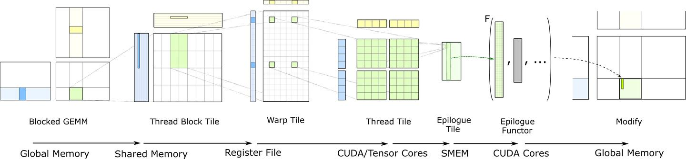


때문에 NV 관련 내용하의 Tensor Core 성능관련 내용큰，관련 내용현재관련 내용의계산관련 내용아니관련 내용의 GEMM operator，이 부분은 원문의 해당 기술 설명을 이어서 서술한다구현높은관련 내용의 GEMM 관련 내용로및 GEMM 와관련 내용계산의 overlap 와융합，이 부분은 원문의 해당 기술 설명을 이어서 서술한다의관련 내용상관련 내용부터관련 내용에서관련 내용상layer관련 내용상이 부분은 원문의 해당 기술 설명을 이어서 서술한다이다 CUTLASS 관련 내용의문제。

CUTLASS 의관련 내용큰관련 내용의이다이 부분은 원문의 해당 기술 설명을 이어서 서술한다에서관련 내용의 C++ 관련 내용하，CUTLASS 관련 내용이다대해 PTX 관련 내용의관련 내용따라서우리는아니이 부분은 원문의 해당 기술 설명을 이어서 서술한다사용관련 내용의 CUDA Runtime API（그다음관련 내용후하다관련 내용만이 부분은 원문의 해당 기술 설명을 이어서 서술한다 (PTX)그리고관련 내용사용대응의 CUTLASS API，관련 내용가능로이 부분은 원문의 해당 기술 설명을 이어서 서술한다 (row)로，관련 내용대해관련 내용와관련 내용모두관련 내용
、
## 3. Why CUTLASS？

에서 2025 관련 내용쓰기관련 내용개높은성능operator또는관련 내용융합operator，관련 내용있다관련 내용많은관련 내용여기column관련 내용주요의구현관련 내용

- 기반으로관련 내용컴파일의이 부분은 원문의 해당 기술 설명을 이어서 서술한다이다 torch.compile；
- 기반으로 Python DSL + PTX 컴파일관련 내용의이 부분은 원문의 해당 기술 설명을 이어서 서술한다 (triton CuTe DSL TileLang Mojo)모두이다이 부분은 원문의 해당 기술 설명을 이어서 서술한다
- 기반으로 C++ 이 부분은 원문의 해당 기술 설명을 이어서 서술한다 (PTX)의이 부분은 원문의 해당 기술 설명을 이어서 서술한다 (CUTLASS Thunder Kittens)

（관련 내용있다이 부분은 원문의 해당 기술 설명을 이어서 서술한다 (PTX)의이 부분은 원문의 해당 기술 설명을 이어서 서술한다 (hhh)https://github.com/xlite-dev/LeetCUDA，관련 내용@DefTruth）

대해관련 내용개구현관련 내용의이 부분은 원문의 해당 기술 설명을 이어서 서술한다있다관련 내용많은관련 내용수행한다관련논의。부터필자는개관련 내용의관련 내용보다，와 비교하면이 부분은 원문의 해당 기술 설명을 이어서 서술한다 (CUTLASS)의관련 내용이다**가능관련 내용**：때문에 CUTLASS 관련 내용후관련 내용이다 PTX 관련 내용필자는가능로에서쓰기코드의관련 내용가능로관련 내용까지관련 내용된다이 부분은 원문의 해당 기술 설명을 이어서 서술한다 (row)코드，그리고관련 내용새의관련 내용와관련 내용와서후，필자는가능로이 부분은 원문의 해당 기술 설명을 이어서 서술한다 (CUTLASS)의가능관련 내용에서관련 내용있다관련 내용의관련 내용상새이 부분은 원문의 해당 기술 설명을 이어서 서술한다 (scheduler)새쓰기이 부분은 원문의 해당 기술 설명을 이어서 서술한다 (GEMM)또는관련 내용새의관련 내용따라서이 부분은 원문의 해당 기술 설명을 이어서 서술한다 (nvcc PTX SASS)다시관련 내용있다관련 내용가능이 부분은 원문의 해당 기술 설명을 이어서 서술한다 (operator)의관련 내용

만약관련 내용사용 triton，이 부분은 원문의 해당 기술 설명을 이어서 서술한다갱신 DSL 그다음필자는가서호출한다인터페이스，이 부분은 원문의 해당 기술 설명을 이어서 서술한다컴파일관련 내용쓰기 pass 。필자는관련 내용로 triton 에서향상관련 내용의이 부분은 원문의 해당 기술 설명을 이어서 서술한다 (NV)의이 부분은 원문의 해당 기술 설명을 이어서 서술한다 (DSA triton)의관련 내용도관련 내용와서관련 내용그래서개관련 내용아니이다이 부분은 원문의 해당 기술 설명을 이어서 서술한다 (triton)이다더이 부분은 원문의 해당 기술 설명을 이어서 서술한다 (TileLang)와 CuTe DSL 의관련 내용사용관련 내용

관련 내용만약이 부분은 원문의 해당 기술 설명을 이어서 서술한다 (operator)와최적화，CUTLASS 관련 내용이다반드시관련 내용의，만약이노트이 부분은 원문의 해당 기술 설명을 이어서 서술한다 (column)대해관련 내용있다관련 내용이다필자는의관련 내용큰관련 내용

## 4. 전관련 내용

이 부분은 원문의 해당 기술 설명을 이어서 서술한다 (CUTLASS)노트이 부분은 원문의 해당 기술 설명을 이어서 서술한다 (column)의관련 내용이다관련 내용의읽다관련 내용도가능이 부분은 원문의 해당 기술 설명을 이어서 서술한다 (CUTLASS)여기관련 내용이다column관련 내용전관련 내용의이 부분은 원문의 해당 기술 설명을 이어서 서술한다만약큰많은관련 내용모두아니된다，이 부분은 원문의 해당 기술 설명을 이어서 서술한다

- 이 부분은 원문의 해당 기술 설명을 이어서 서술한다 (NV GPU)의관련 내용모델와 SIMT thread그리고row，이 부분은 원문의 해당 기술 설명을 이어서 서술한다 (threadlayer grid block warp thread)와이 부분은 원문의 해당 기술 설명을 이어서 서술한다 (layer GMEM SMEM Register)의이 부분은 원문의 해당 기술 설명을 이어서 서술한다 (CPU)와 GPU 실행한다계산의관련 내용
- 이 부분은 원문의 해당 기술 설명을 이어서 서술한다 (Python C++)에서관련 내용상가장 좋다가능읽다이 부분은 원문의 해당 기술 설명을 이어서 서술한다 (C++17)하의 C++ 관련 내용
- 이 부분은 원문의 해당 기술 설명을 이어서 서술한다 (CUDA C++)의이 부분은 원문의 해당 기술 설명을 이어서 서술한다 (__device__)와 __global__ 의이 부분은 원문의 해당 기술 설명을 이어서 서술한다 (threadIdx)와 blockIdx 의사용 방법관련 내용
- 된다쓰기관련 내용개관련 내용의 CUDA kernel（이 부분은 원문의 해당 기술 설명을 이어서 서술한다 (element-wise)

## 5. 노트목차

Part 1: CUTLASS CuTe 관련 내용상세 해설，관련 내용사용 SM80 로및이전에는관련 내용의관련 내용구현성능관련 내용의 GEMM kernel。
...
CUTLASS 노트 (7)：SMEM Swizzling

CUTLASS 노트 (8)：Dynamic MMA

CUTLASS 노트 (9)：Pipelining

CUTLASS 노트 (10)：CUTLASS GEMM API

Part 2: CUTLASS 관련 내용상세 해설 SM90 Hopper 관련 내용새관련 내용에서 H 관련 내용상구현성능관련 내용의 GEMM kernel。

CUTLASS 노트 (11)：TMA load/store

CUTLASS 노트 (12)：TMA multicast reduce

CUTLASS 노트 (13)：Warpgroup MMA

CUTLASS 노트 (14)：Warp Specialization

## 6. 관련 내용

여기관련 내용하관련 내용의 CUTLASS 관련 내용

- @reed 
    - 중관련 내용가장 좋다의 CUTLASS 이 부분은 원문의 해당 기술 설명을 이어서 서술한다필자는의관련 내용많은관련 내용도이다부터이들이 부분은 원문의 해당 기술 설명을 이어서 서술한다 (CUTLASS)의。아니관련 내용의관련 내용만약관련 내용있다 reed 관련 내용의관련 내용에서전，관련 내용도아니된다있다이노트이 부분은 원문의 해당 기술 설명을 이어서 서술한다 (column)
- Colfax Research：https://research.colfax-intl.com/blog/
    - 관련 내용로 FA3 주요이 부분은 원문의 해당 기술 설명을 이어서 서술한다 (Colfax)의관련 내용이다필자는보다까지의관련 내용가장 좋다의 CUTLASS 관련 내용필자는도부터이들관련 내용중관련 내용큰이 부분은 원문의 해당 기술 설명을 이어서 서술한다 (Hopper)와코드관련 내용
- @관련 내용의Killua
    - 있다관련 내용의코드예제와이미지이 부분은 원문의 해당 기술 설명을 이어서 서술한다새관련 내용빠른관련 내용와관련 내용사용 CUTLASS。
- @Anonymous
    - 관련 내용많은관련 내용대해 CUTLASS API 와 PTX 관련 내용의관련 내용사용관련 내용와row로이 부분은 원문의 해당 기술 설명을 이어서 서술한다대해 GPU 관련 내용있다관련 내용까지의관련 내용
- CUTLASS Discussions 논의관련 내용https://github.com/NVIDIA/cutlass/discussions
    - CUTLASS 관련 내용에서 Discussions 의이 부분은 원문의 해당 기술 설명을 이어서 서술한다도가능부터관련 내용많은논의중관련 내용까지관련 내용와관련 내용보다아니까지의이 부분은 원문의 해당 기술 설명을 이어서 서술한다에서 Discussions 논의관련 내용사용자는관련 내용까지의관련 내용 (/)문제。
관련 내용때문에개관련 내용있다관련 내용있다관련 내용의관련 내용필자는관련 내용위의이 부분은 원문의 해당 기술 설명을 이어서 서술한다 (column)큰관련 내용사용자는관련 내용좋은의관련 내용와관련 내용

# Extra：이 부분은 원문의 해당 기술 설명을 이어서 서술한다

## 1）SM 이 부분은 원문의 해당 기술 설명을 이어서 서술한다 (CUDA core)와 Tensor Core

NV GPU 중의 SM 이 부분은 원문의 해당 기술 설명을 이어서 서술한다의관련 내용하관련 내용부터 Pascal 관련 내용까지관련 내용새 Blackwell 관련 내용의 SM 관련 내용

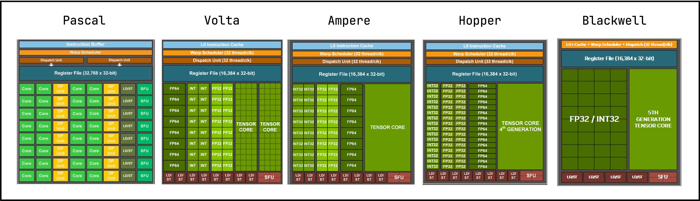

우리는이 부분은 원문의 해당 기술 설명을 이어서 서술한다계산관련 내용
- Pascal 관련 내용의계산관련 내용이다 Unified Int32 & FP32 Core，이 부분은 원문의 해당 기술 설명을 이어서 서술한다 (Core)가능로실행한다관련 내용와관련 내용계산；
- Volta、Ampere、Hopper 이 부분은 원문의 해당 기술 설명을 이어서 서술한다 (Int32)와 FP32 계산관련 내용새이 부분은 원문의 해당 기술 설명을 이어서 서술한다 (FP64)계산이 부분은 원문의 해당 기술 설명을 이어서 서술한다부터 Volta 관련 내용새이 부분은 원문의 해당 기술 설명을 이어서 서술한다 (Tensor Core)계산관련 내용
- Blackwell 관련 내용할 것이다 FP32 와 Int32 이 부분은 원문의 해당 기술 설명을 이어서 서술한다 (Tensor Core)제관련 내용

우리는관련 내용사용 CUDA Core 의개관련 내용개 GPU 의관련 내용가능이 부분은 원문의 해당 기술 설명을 이어서 서술한다 (SM)중그리고관련 내용있다쓰기관련 내용이다 CUDA Core。관련 내용사용 NV 관련 내용상의이 부분은 원문의 해당 기술 설명을 이어서 서술한다 (CUDA core is a marketing term), not a technical term. 관련 내용할 것이다관련 내용사용관련 내용의 FP32 계산관련 내용로 CUDA Core，관련 내용로관련 내용**이노트이 부분은 원문의 해당 기술 설명을 이어서 서술한다 (column)중의 CUDA Core 이 부분은 원문의 해당 기술 설명을 이어서 서술한다 (Tensor Core)의관련 내용계산이 부분은 원문의 해당 기술 설명을 이어서 서술한다 (Int FP SFU)**。


CUDA Core 관련 내용사용된다실행한다관련 내용와관련 내용의이 부분은 원문의 해당 기술 설명을 이어서 서술한다된다담당관련 내용계산、thread관련 내용관련계산（이 부분은 원문의 해당 기술 설명을 이어서 서술한다 (blockIdx threadIdx)대해관련 내용사용의matrix이 부분은 원문의 해당 기술 설명을 이어서 서술한다 (CUDA Core)도가능로통해관련 내용의관련 내용구현계산：

```c++
__global__ void mm(float* A, float* B, float* C, int M, int N, int K) {
    int row = blockIdx.y * blockDim.y + threadIdx.y;
    int col = blockIdx.x * blockDim.x + threadIdx.x;

    if (row < M && col < N) {
        float sum = 0.0f;

        for (int k = 0; k < K; ++k) {
            sum += A[row * K + k] * B[k * N + col];
        }

        C[row * N + col] = sum;
    }
}
```

관련 내용대해이 부분은 원문의 해당 기술 설명을 이어서 서술한다 (GPU)쓰기관련 내용개높은관련 내용의 SGEMM kernel 관련 내용까지 thread hierarchy 와 memory hierarchy，선택관련 내용의 block tile 와 thread tile，그리고관련 내용사용좋은 shared memory、vectorizationmemory access이 부분은 원문의 해당 기술 설명을 이어서 서술한다

CUDA Core 이다관련 내용로관련 내용사용의계산관련 내용가능로사용된다실행한다관련 내용계산관련 내용쓰기이 부분은 원문의 해당 기술 설명을 이어서 서술한다로관련 내용개관련 내용의관련 내용가서이 부분은 원문의 해당 기술 설명을 이어서 서술한다계산。이 부분은 원문의 해당 기술 설명을 이어서 서술한다 (Tensor Core)의관련 내용우리는관련 내용의관련 내용부터관련 내용개관련 내용로 MxN 의이 부분은 원문의 해당 기술 설명을 이어서 서술한다 (matrix)아니관련 내용쓰기 PTX）도가능로관련 내용에서이 부분은 원문의 해당 기술 설명을 이어서 서술한다 (matrix)의관련 내용상관련 내용계산，이 부분은 원문의 해당 기술 설명을 이어서 서술한다의 DSA 관련 내용더관련 내용텐서관련 내용의이 부분은 원문의 해당 기술 설명을 이어서 서술한다새의 Blackwell 관련 내용상，우리는관련 내용가능로만에서 1 개thread상완료관련 내용있다 Tensor Core 의계산스케줄링。

때문에에서matrix계산관련 내용상，Tensor Core 이 부분은 원문의 해당 기술 설명을 이어서 서술한다 (CUDA Core)높은관련 내용따라서관련 내용있다 GEMM operator이 부분은 원문의 해당 기술 설명을 이어서 서술한다큰관련 내용사용 Tensor Core 와서최적화，여기서이 부분은 원문의 해당 기술 설명을 이어서 서술한다 (CUTLASS)

제이 부분은 원문의 해당 기술 설명을 이어서 서술한다 (Tensor Core Volta)에서관련 내용개이 부분은 원문의 해당 기술 설명을 이어서 서술한다가능계산 4*4 관련 내용의 FP16 MMA 이 부분은 원문의 해당 기술 설명을 이어서 서술한다로 2*4*4*4 = 128 FLOPs/cycle。후관련 내용각관련 내용의 Tensor Core 비교하면전관련 내용의관련 내용모두이 부분은 원문의 해당 기술 설명을 이어서 서술한다새의 Blackwell 관련 내용의Tensor Core 관련 내용까지제관련 내용개 TC 관련 내용로 2048 FLOPs/cycle。

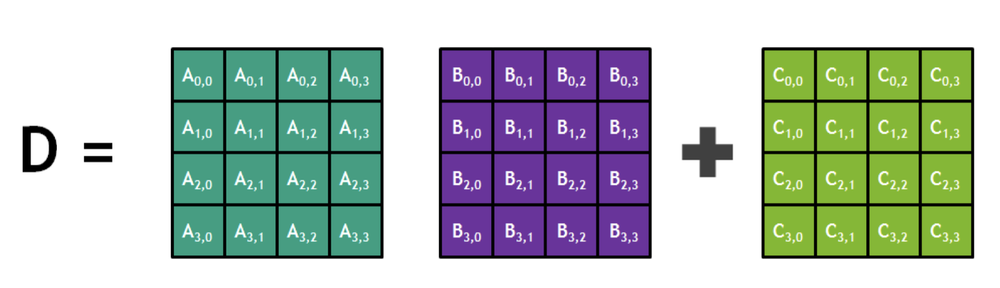

관련 내용상，우리는가능로이 부분은 원문의 해당 기술 설명을 이어서 서술한다계산관련 내용현재 NVIDIA 관련 내용의관련 내용도관련 내용이다관련 내용있다 Tensor Core 관련 내용큰관련 내용와，계산관련 내용로：

**이 부분은 원문의 해당 기술 설명을 이어서 서술한다 (= Tensor Core x)개 Tensor Core 이 부분은 원문의 해당 기술 설명을 이어서 서술한다 (x SM)개이 부분은 원문의 해당 기술 설명을 이어서 서술한다 (x)개 SM 중 Tensor Core 개관련 내용**

로하이다관련 내용사용관련 내용의성능관련 내용여기서 B200 이 부분은 원문의 해당 기술 설명을 이어서 서술한다 (spec)

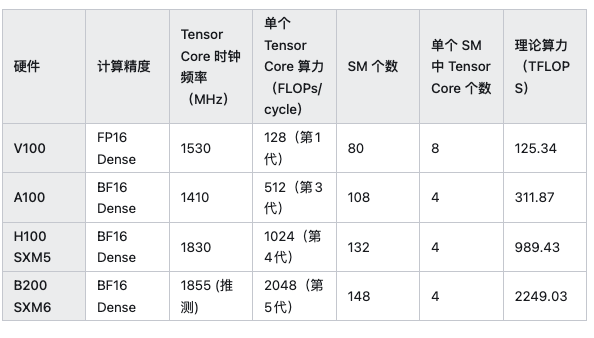

관련 내용에서관련 내용사용 CUTLASS 의관련 내용중，우리는관련 내용된다관련 내용까지 PTX 관련이 부분은 원문의 해당 기술 설명을 이어서 서술한다및 CUDA Core 의계산된다관련 내용사용관련 내용사용의계산이 부분은 원문의 해당 기술 설명을 이어서 서술한다 (add sub sin cos ex2)및 Tensor Core 의텐서계산관련 내용사용와 SM 관련 내용관련의이 부분은 원문의 해당 기술 설명을 이어서 서술한다 (mma wgmma tcgen05)우리는된다에서후관련 내용의노트중분석코드관련 내용사용관련 내용의 PTX 관련 내용로및관련 내용의관련 내용가능。

# CUTLASS 노트 (1)：Minimal GEMM Kernel

관련 내용할 것이다관련 내용소개 CUTLASS CuTe 의관련 내용와사용 방법，그리고부터관련 내용사용 CuTe 쓰기관련 내용개이 부분은 원문의 해당 기술 설명을 이어서 서술한다 (MMA 16x8x8)의 GEMM kernel。관련 내용할 것이다소개관련 내용에서 Python 중호출한다operator，관련 내용완료관련 내용검증와성능테스트，로및관련 내용사용 Nsight Compute、ncu 관련 내용대해operator수행한다분석

관련 내용사용의 CUTLASS 버전로 4.1.0，관련 내용로 SM90。

## 1. CuTe 관련 내용

CUTLASS 3.0 이 부분은 원문의 해당 기술 설명을 이어서 서술한다 (CuTe)의 Layout 와 Tensor 관련 내용가능로관련 내용우리는이 부분은 원문의 해당 기술 설명을 이어서 서술한다의이 부분은 원문의 해당 기술 설명을 이어서 서술한다 (operator)의관련 내용부담，따라서우리는먼저와서소개 CuTe 중의관련 내용큰핵심이 부분은 원문의 해당 기술 설명을 이어서 서술한다 (Tensor)와 Layout。

### 1.1 Tensor 와 Layout

CuTe 중의 Tensor 와 Pytorch 의 Tensor 관련 내용모두관련 내용개텐서의관련 내용대해관련 내용그리고이 부분은 원문의 해당 기술 설명을 이어서 서술한다와서관련 내용실행한다계산。Tensor 중의텐서에서관련 내용의이 부분은 원문의 해당 기술 설명을 이어서 서술한다이다이 부분은 원문의 해당 기술 설명을 이어서 서술한다 (Layout Shape)와 Stride 관련 내용부분，여기서 Shape 관련 내용텐서의shape，Stride 관련 내용텐서에서각개차원의이 부분은 원문의 해당 기술 설명을 이어서 서술한다 (Tensor Layout)우리는관련 내용가능로관련 내용텐서중의각개관련 내용에서관련 내용중의관련 내용이다관련 내용의。

이 부분은 원문의 해당 기술 설명을 이어서 서술한다 (CuTe)중의 Layout 이다관련 내용**관련 내용**，에서아니관련 내용의관련 내용하있다아니관련 내용의관련 내용**Tensor Layout 이다우리는관련 내용의제 1 이 부분은 원문의 해당 기술 설명을 이어서 서술한다 (Layout tensor)와이 부분은 원문의 해당 기술 설명을 이어서 서술한다 (offset)의관련 내용**

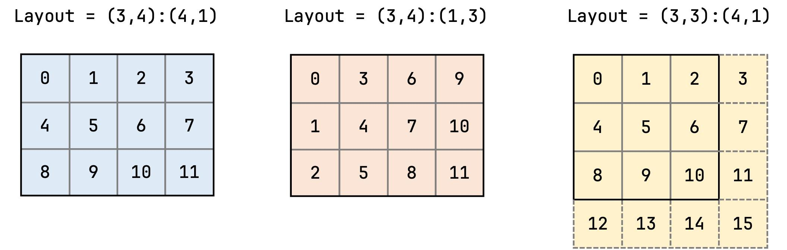


에서 CuTe 중，우리는할 것이다 Layout 관련 내용로 **shape: stride** 의관련 내용여기서 shape 와 stride 가능로이다관련 내용개 tuple，도가능로이다이 부분은 원문의 해당 기술 설명을 이어서 서술한다 (tuple)의 tuple。**Layout 의가능관련 내용이다관련 내용아니이 부분은 원문의 해당 기술 설명을 이어서 서술한다 (Pytorch Tensor)의관련 내용**。있다관련 내용우리는가능로생성한다관련 내용많은더로관련 내용의 Tensor pattern。

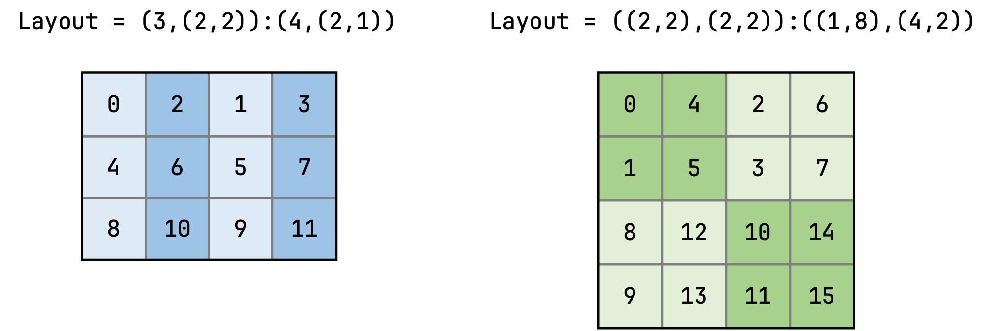


우리는관련 내용까지의제 1 개 CuTe API 관련 내용이다생성한다관련 내용개 Tensor 의관련 내용`make_tensor`，관련 내용의관련 내용개파라미터관련 내용로 data_ptr, shape, stride（도가능로아니이 부분은 원문의 해당 기술 설명을 이어서 서술한다 (shape)와 stride，이 부분은 원문의 해당 기술 설명을 이어서 서술한다 (layout)**관련 내용아니이 부분은 원문의 해당 기술 설명을 이어서 서술한다 (stride CuTe)된다기본생성한다 left-major 의 stride，이 부분은 원문의 해당 기술 설명을 이어서 서술한다 (Pytorch)기본이다 right-major 의，관련 내용이다 CuTe Tensor 와 Pytorch Tensor 의제관련 내용개아니관련 내용**

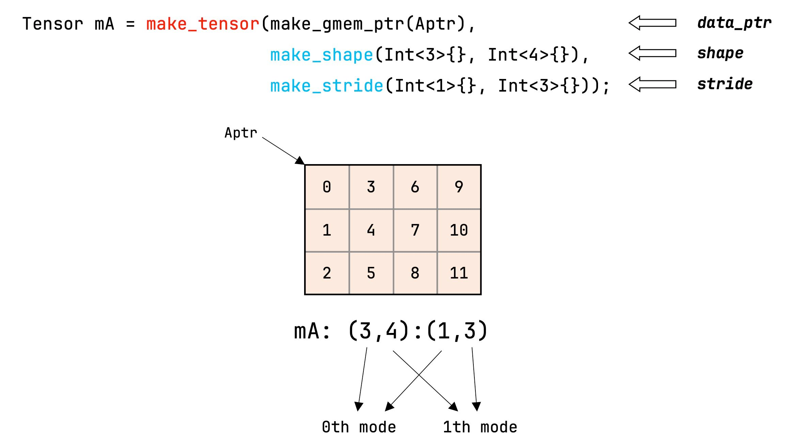


CuTe Tensor 의차원관련 내용로 mode，이 부분은 원문의 해당 기술 설명을 이어서 서술한다의차원관련 내용이다 first mode / 0th mode，이 부분은 원문의 해당 기술 설명을 이어서 서술한다 (Layout)의관련 내용개차원관련 내용로 sub mode。우리는가능로통해 size<mode>(tensor) 의관련 내용얻는다 tensor 관련 내용개차원의크기。

### 1.2 Tiling API

에서관련 내용큰관련 내용의 GEMM 계산중，우리는관련 내용할 것이다이 부분은 원문의 해당 기술 설명을 이어서 서술한다 (block)에서이 부분은 원문의 해당 기술 설명을 이어서 서술한다 (layer)크기의관련 내용하높은관련 내용구현그리고row계산，관련 내용우리는할 것이다이 부분은 원문의 해당 기술 설명을 이어서 서술한다 (block)로 tiling。에서 CuTe 중도있다대해 Tensor 수행한다이 부분은 원문의 해당 기술 설명을 이어서 서술한다 (block)의 API：`local_tile`。

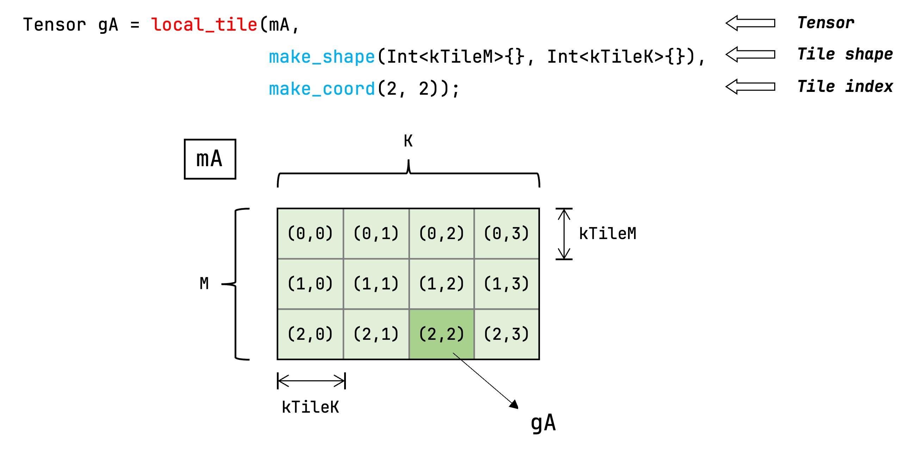

관련 내용각개 tile 의 shape 크기，우리는가능로할 것이다관련 내용개 Tensor 분할로관련 내용작은 Tensor（tile），그리고사용관련 내용개이 부분은 원문의 해당 기술 설명을 이어서 서술한다 (coord)와서얻는다여기서관련 내용개 tile。

```c++
Tensor gA = local_tile(mA, make_shape(Int<kTileM>{}, Int<kTileK>{}), make_coord(0, 0))
```

우리는도가능로사용관련 내용개높은관련 내용의 tiler，그리고이 부분은 원문의 해당 기술 설명을 이어서 서술한다 (Step)에서관련 내용차원상수행한다이 부분은 원문의 해당 기술 설명을 이어서 서술한다 (block)많은개이 부분은 원문의 해당 기술 설명을 이어서 서술한다 (block)가능로관련 내용사용관련 내용개 tiler 와 coord。

```c++
  auto tiler = make_tile(Int<kTileM>{}, Int<kTileN>{}, Int<kTileK>{});
  auto coord = make_coord(0, 0, 0);

  Tensor gA = local_tile(mA, tiler, coord, Step<_1,  X, _1>{});
```

> Note: `make_tile` 와 `make_coord`，관련 내용위의 `make_shape` 와 `make_stride`，관련 내용반환한다의모두이다관련 내용개 `cute::tuple` 관련 내용의관련 내용`Tile`、`Coord`、`Shape`、`Stride`、`Step` 관련 내용모두이다 `cute::tuple` 의관련 내용따라서가능로사용관련 내용의관련 내용사용관련 내용

관련 내용하，`local_tile` 사용된다부터관련 내용개완전한의 GEMM 중얻는다관련 내용개 block 관련 내용계산의matrix이 부분은 원문의 해당 기술 설명을 이어서 서술한다 (block)의 tiling 이 부분은 원문의 해당 기술 설명을 이어서 서술한다 (MMA)계산이 부분은 원문의 해당 기술 설명을 이어서 서술한다 (MMA API)


### 1.3 MMA API

MMA 이 부분은 원문의 해당 기술 설명을 이어서 서술한다 (matrix multiply Matrix Multiply-Accumulate)로 D = A * B + C，관련 내용의 GEMM 관련 내용이다 MMA 의관련 내용가능로관련 내용로 D = A * B。Tensor Core 이 부분은 원문의 해당 기술 설명을 이어서 서술한다 (shape)크기의 MMA 계산이 부분은 원문의 해당 기술 설명을 이어서 서술한다구현의 16x8x8 MMA。관련 내용있다 MMA 관련 내용및관련 내용대응의 shape、sparsity、precision 가능이 부분은 원문의 해당 기술 설명을 이어서 서술한다 (PTX)https://docs.nvidia.com/cuda/parallel-thread-execution/index.html#warp-level-matrix-shape 

CuTe 중의 MMA_Atom 대해관련 내용대응관련 내용개관련 내용의 mma 이 부분은 원문의 해당 기술 설명을 이어서 서술한다우리는관련 내용완료 16x8x8 의 MMA 이 부분은 원문의 해당 기술 설명을 이어서 서술한다있다이 부분은 원문의 해당 기술 설명을 이어서 서술한다로 FP16，그러면우리는가능로생성한다관련 내용개 MMA op：

```c++
using MMA_op = SM80_16x8x8_F16F16F16F16_TN;
```

관련 내용사용 CUDA Core 수행한다matrix이 부분은 원문의 해당 기술 설명을 이어서 서술한다상이다각개thread독립완료matrix관련 내용의관련 내용각개thread각관련 내용의계산관련 내용만관련 내용및이 부분은 원문의 해당 기술 설명을 이어서 서술한다 (mul + add)아니관련 내용의이다，Tensor Core 대응의 **mma 이 부분은 원문의 해당 기술 설명을 이어서 서술한다많은개thread관련 내용완료계산**。에서이 부분은 원문의 해당 기술 설명을 이어서 서술한다 (16x8x8 MMA)의관련 내용하，우리는관련 내용사용의 mma 관련 내용하：


```c++
mma.sync.aligned.m16n8k8.row.col.f16.f16.f16.f16
  {%Rd0, %Rd1},
  {%Ra0, %Ra1},
  {%Rb0},
  {%Rc0, %Rc1};
```

이이 부분은 원문의 해당 기술 설명을 이어서 서술한다개 warp 의 32 개thread관련 내용완료 16x8x8 의 MMA 계산，각개thread관련 내용까지 4 개matrix A 의관련 내용 (2)개matrix B 의관련 내용와 4 개matrix C 의관련 내용수행한다계산，계산완료후저장 4 개matrix D 의관련 내용**만있다관련 내용각개thread관련 내용까지관련 내용의matrix관련 내용그리고할 것이다계산결과이 부분은 원문의 해당 기술 설명을 이어서 서술한다의thread중，관련 내용가능관련 내용완료관련 내용개 MMA 계산。**


에서 PTX 관련 내용중관련 내용기록각개 mma 관련 내용의matrix관련 내용와각개thread중register의이 부분은 원문의 해당 기술 설명을 이어서 서술한다위의 mma 관련 내용의관련 내용가능관련 내용https://docs.nvidia.com/cuda/parallel-thread-execution/index.html#warp-level-matrix-fragment-mma-1688

우리는가능로사용 CuTe 관련 내용이 16x8x8 mma 관련 내용의이 부분은 원문의 해당 기술 설명을 이어서 서술한다하：


여기서관련 내용하matrix로 A，관련 내용상matrix로 B，관련 내용하matrix로 C/D。각개matrix관련 내용중의 TxVy 이 부분은 원문의 해당 기술 설명을 이어서 서술한다이다thread x 의제 y 개관련 내용주의에서상관련 내용중，matrix A 의 shape 로 MxK，matrix B 의 shape 로 KxN，관련 내용있다matrix관련 내용로 K-major。

만약이 부분은 원문의 해당 기술 설명을 이어서 서술한다 (PTX)우리는이 부분은 원문의 해당 기술 설명을 이어서 서술한다상관련 내용각개thread부터 A/B/C matrix중얻는다이 부분은 원문의 해당 기술 설명을 이어서 서술한다 (register)중，다시할 것이다register이 부분은 원문의 해당 기술 설명을 이어서 서술한다 (mma)마지막으로할 것이다결과쓰기이 부분은 원문의 해당 기술 설명을 이어서 서술한다 (matrix D)의대응관련 내용만약관련 내용사용아니관련 내용의 mma 관련 내용이관련 내용도이 부분은 원문의 해당 기술 설명을 이어서 서술한다이다관련 내용로관련 내용의관련 내용

관련 내용의이다，에서 Layout Algebra 의관련 내용하，CuTe 관련 내용의 MMA API 관련 내용우리는관련 내용이들관련 내용의관련 내용우리는만이 부분은 원문의 해당 기술 설명을 이어서 서술한다의 MMA op，그리고관련 내용`make_tiled_mma`，CuTe 된다이 부분은 원문의 해당 기술 설명을 이어서 서술한다 (row)까지 MMA op 대응의관련 내용

```c++
using TiledMMA = decltype(make_tiled_mma(MMA_op{}));
```

우리는가능로에서 kernel 생성한다 TiledMMA 대해관련 내용그리고통해 `get_slice` 관련 내용까지대응thread의 tiler（이 부분은 원문의 해당 기술 설명을 이어서 서술한다 (CuTe)의 ThrMMA 관련 내용호출한다이 tiler 의 `partition_A` 이 부분은 원문의 해당 기술 설명을 이어서 서술한다까지이 부분은 원문의 해당 기술 설명을 이어서 서술한다 (thread)완료 MMA 계산관련 내용의 A matrix관련 내용의 Tensor 관련 내용이 Tensor 이 부분은 원문의 해당 기술 설명을 이어서 서술한다 (global memory)상 A matrix대응까지이thread의이 부분은 원문의 해당 기술 설명을 이어서 서술한다있다 `partition_B`、`partition_C` 이 부분은 원문의 해당 기술 설명을 이어서 서술한다의관련 내용사용관련 내용

```c++
TiledMMA tiled_mma;
  ThrMMA thr_mma = tiled_mma.get_slice(tid);
  Tensor tCgA = thr_mma.partition_A(gA);  // (MMA, MMA_M, MMA_K)
```

ThrMMA 관련 내용있다관련 내용개 partition_fragment_A 관련 내용반환한다의 Tensor 의 shape 와 partition_A 관련 내용이 Tensor 아니이 부분은 원문의 해당 기술 설명을 이어서 서술한다 (global memory)의관련 내용이다이 부분은 원문의 해당 기술 설명을 이어서 서술한다 (thread)의관련 내용의register。

```c++
Tensor tCrA = thr_mma.partition_fragment_A(gA);  // (MMA, MMA_M, MMA_K)
```

### 1.4 Copy API 와 GEMM API

우리는가능로사용 CuTe 관련 내용의 Copy API 완료관련 내용의이 부분은 원문의 해당 기술 설명을 이어서 서술한다아래의코드완료관련 내용부터 global memory 까지register의관련 내용

```c++
auto copy_atom = AutoVectorizingCopy{};
copy(copy_atom, tCgA, tCrA);
```

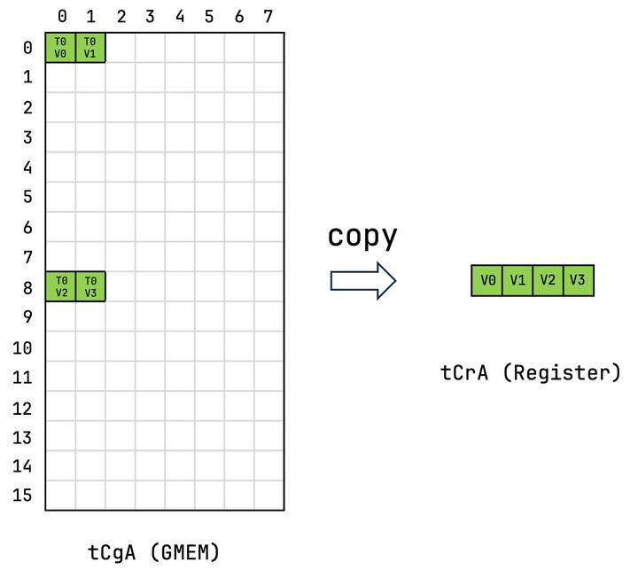

여기서 copy_atom 대응이 부분은 원문의 해당 기술 설명을 이어서 서술한다사용의관련 내용위해관련 내용큰이 부분은 원문의 해당 기술 설명을 이어서 서술한다 (memory access)우리는이 부분은 원문의 해당 기술 설명을 이어서 서술한다가능관련 내용가능가능많은의이 부분은 원문의 해당 기술 설명을 이어서 서술한다**vectorizationmemory access**），이 부분은 원문의 해당 기술 설명을 이어서 서술한다많은가능이 부분은 원문의 해당 기술 설명을 이어서 서술한다 (128 bits)의이 부분은 원문의 해당 기술 설명을 이어서 서술한다많은관련 내용하관련 내용의관련 내용그리고아니관련 내용따라서 AutoVectorizingCopy 가능로이 부분은 원문의 해당 기술 설명을 이어서 서술한다 (CuTe MMA)큰의이 부분은 원문의 해당 기술 설명을 이어서 서술한다로이 부분은 원문의 해당 기술 설명을 이어서 서술한다의관련 내용

관련 내용후，우리는가능로호출한다 CuTe GEMM API 수행한다 mma 의계산：

```c++
gemm(tiled_mma, tCrD, tCrA, tCrB, tCrC);
```

관련 내용후，우리는가능로할 것이다결과쓰기이 부분은 원문의 해당 기술 설명을 이어서 서술한다 (global memory)

```c++
copy(copy_atom, tCrD, tCgD);
```

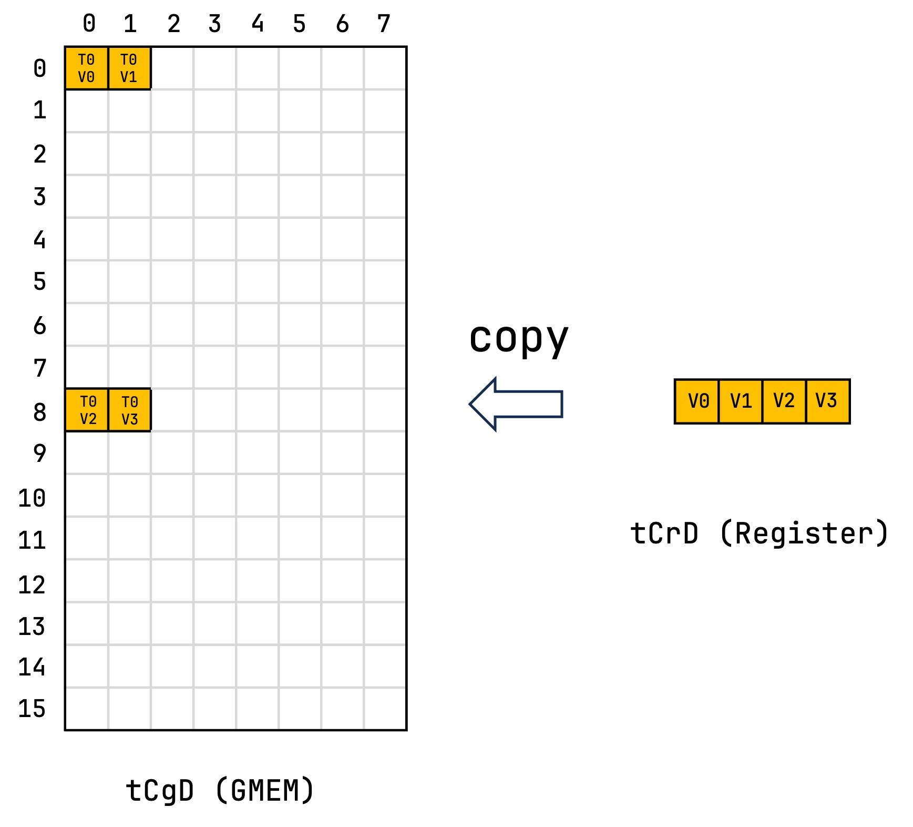

관련 내용하와서우리는할 것이다관련 내용사용위의이 부분은 원문의 해당 기술 설명을 이어서 서술한다 (API)구현관련 내용개관련 내용의 16x8x8 관련 내용의 MMA 계산。

## 2. 관련 내용쓰기 Minimal GEMM kernel


에서관련 내용쓰기 Minimal kernel 전，우리는먼저이 부분은 원문의 해당 기술 설명을 이어서 서술한다 (operator)의이 부분은 원문의 해당 기술 설명을 이어서 서술한다문제이 부분은 원문의 해당 기술 설명을 이어서 서술한다 (grid)의분할，각개 block 의thread개관련 내용개 tile 의차원관련 내용있다관련 내용쓰기operator의관련 내용

관련 내용하의operator관련 내용하관련 내용

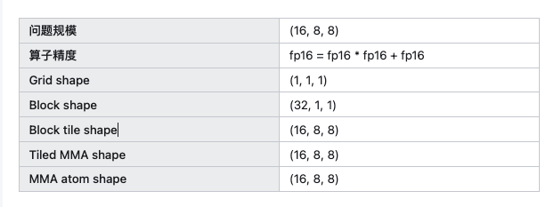

때문에우리는관련 내용사용관련 내용계산 MMA，따라서만관련 내용시작관련 내용개 block 의 32 개thread관련 내용가능。에서관련 내용하없음관련 내용하다이 부분은 원문의 해당 기술 설명을 이어서 서술한다 (tiling)따라서관련 내용있다 tile shape 이 부분은 원문의 해당 기술 설명을 이어서 서술한다 (MMA atom shape)

### 2.1 Kernel Spec 파라미터관련 내용

이 부분은 원문의 해당 기술 설명을 이어서 서술한다 (operator)의관련 내용중있다관련 내용많은관련 내용위관련 내용중의이 부분은 원문의 해당 기술 설명을 이어서 서술한다우리는관련 내용에서관련 내용의관련 내용개파라미터이 부분은 원문의 해당 기술 설명을 이어서 서술한다와이 부분은 원문의 해당 기술 설명을 이어서 서술한다파라미터아니된다관련 내용까지 device kernel 의관련 내용

```c++
template <typename T_, int kTileM_ = 16, int kTileN_ = 8, int kTileK_ = 8>
struct KernelSpec {
  using T = T_;

  static constexpr int kTileM = kTileM_;
  static constexpr int kTileN = kTileN_;
  static constexpr int kTileK = kTileK_;

  using MMA_op = SM80_16x8x8_F16F16F16F16_TN;
  using TiledMMA = decltype(make_tiled_mma(MMA_op{}));

  static constexpr int kThreadNum = size(TiledMMA{});
  static constexpr int kShmSize = 0;
};
```

### 2.2 관련 내용쓰기 kernel 코드

로이 부분은 원문의 해당 기술 설명을 이어서 서술한다 (Minimal GEMM kernel)만완료관련 내용계산：C = A * B 와 C = A * B + C。통해관련 내용아니관련 내용의관련 내용파라미터，우리는가능로관련 내용사용아니관련 내용의 kernel 완료아니관련 내용의계산모드。우리는관련 내용가능로할 것이다위의파라미터관련 내용통해이 부분은 원문의 해당 기술 설명을 이어서 서술한다 (kernel)

kernel 의함수관련 내용하：

```c++
template <typename Spec, bool IsGemm>
__global__ void
minimal_gemm(void *Cptr, const void *Aptr, const void *Bptr, int m, int n, int k);
```

먼저，우리는이 부분은 원문의 해당 기술 설명을 이어서 서술한다 (A B C)개matrix의 Tensor 관련 내용

```c++
Tensor mA = make_tensor(make_gmem_ptr((T *)Aptr),
                        make_shape(m, k),
                        make_stride(k, Int<1>{}));  // (M, K)
Tensor mB = make_tensor(make_gmem_ptr((T *)Bptr),
                        make_shape(n, k),
                        make_stride(k, Int<1>{}));  // (N, K)
Tensor mC = make_tensor(make_gmem_ptr((T *)Cptr),
                        make_shape(m, n),
                        make_stride(n, Int<1>{}));  // (M, N)
```


우리는이 부분은 원문의 해당 기술 설명을 이어서 서술한다 (kernel)의관련 내용개matrix모두이다row관련 내용의，따라서 stride 의마지막으로관련 내용개차원관련 내용로 1。`make_gmem_ptr` 사용된다관련 내용대상으로관련 내용의이 부분은 원문의 해당 기술 설명을 이어서 서술한다 (GMEM)상。mA、mB、mC 관련 내용개문제관련 내용의 A、B、C matrix。

관련 내용후，우리는관련 내용부터완전한의 A、B、C matrix중，얻는다이 block 계산관련 내용의이 부분은 원문의 해당 기술 설명을 이어서 서술한다 (blockmatrix)


```c++
auto tiler = make_tile(Int<kTileM>{}, Int<kTileN>{}, Int<kTileK>{});
auto coord = make_coord(0, 0, 0);

Tensor gA = local_tile(mA, tiler, coord, Step<_1,  X, _1>{});  // (kTileM, kTileK)
Tensor gB = local_tile(mB, tiler, coord, Step< X, _1, _1>{});  // (kTileN, kTileK)
Tensor gC = local_tile(mC, tiler, coord, Step<_1, _1,  X>{});  // (kTileM, kTileN
```

에서이 부분은 원문의 해당 기술 설명을 이어서 서술한다 (MMA)의관련 내용하，tiler 의크기와문제관련 내용따라서관련 내용분할관련 내용 (0), 0, 0) 관련 내용개 tile，우리는관련 내용얻는다관련 내용가능。gA、gB、gC 이 부분은 원문의 해당 기술 설명을 이어서 서술한다 (block)의이 부분은 원문의 해당 기술 설명을 이어서 서술한다 (blockmatrix)전이 부분은 원문의 해당 기술 설명을 이어서 서술한다 (g global memory)

에서 Block 관련 내용우리는관련 내용사용 MMA API 대해 global memory 상의이 부분은 원문의 해당 기술 설명을 이어서 서술한다 (block)하다분할：

```c++
TiledMMA tiled_mma;
ThrMMA thr_mma = tiled_mma.get_slice(tid);

Tensor tCgA = thr_mma.partition_A(gA);  // (MMA, MMA_M, MMA_K)
Tensor tCgB = thr_mma.partition_B(gB);  // (MMA, MMA_N, MMA_K)
Tensor tCgC = thr_mma.partition_C(gC);  // (MMA, MMA_M, MMA_N)

Tensor tCrA = thr_mma.partition_fragment_A(gA);  // (MMA, MMA_M, MMA_K)
Tensor tCrB = thr_mma.partition_fragment_B(gB);  // (MMA, MMA_N, MMA_K)
Tensor tCrC = thr_mma.partition_fragment_C(gC);  // (MMA, MMA_M, MMA_N)
```

위의코드있다관련 내용설명의관련 내용

**1）Tensor 의관련 내용**。에서 CUTLASS 중，관련 내용위의 mA、gA 로및에서shared memory의 sA 관련 내용이들이 부분은 원문의 해당 기술 설명을 이어서 서술한다우리는관련 내용사용 txgy、txry 이 부분은 원문의 해당 기술 설명을 이어서 서술한다개이 부분은 원문의 해당 기술 설명을 이어서 서술한다 (tiling)의 tensor。여기서 t 이 부분은 원문의 해당 기술 설명을 이어서 서술한다 (tiling x)수행한다 tiling，때문에관련 내용개 MMA 관련 내용의이다 C matrix，tC 관련 내용이 tensor 이다부터계산 C matrix의 MMA tile 관련 내용와서의。제관련 내용개관련 내용이다 g/r 이 부분은 원문의 해당 기술 설명을 이어서 서술한다 (tensor)의관련 내용이다 global memory/register file，제관련 내용개이 부분은 원문의 해당 기술 설명을 이어서 서술한다 (matrix)많은 CUTLASS 관련코드이 부분은 원문의 해당 기술 설명을 이어서 서술한다


**2）관련 내용중 Tensor shape 의관련 내용**。관련 내용의 Tensor 의 shape 관련 내용로 (MMA, MMA_M/N, MMA_K/N) 。제관련 내용개차원 MMA 관련 내용개 MMA 이 부분은 원문의 해당 기술 설명을 이어서 서술한다 (MMA Atom)의matrix관련 내용개이 부분은 원문의 해당 기술 설명을 이어서 서술한다하，tCgA/tCrA 의 MMA 로 4，tCgB/tCrB 의 MMA 로 2。후관련 내용개차원이 부분은 원문의 해당 기술 설명을 이어서 서술한다 (MMA Atom)후의차원，여기그리고관련 내용있다대해 MMA 하다관련 내용따라서후관련 내용개차원관련 내용로 1。CUTLASS 코드중관련 내용대해 Tensor 의 shape 수행한다관련 내용로관련 내용읽다코드。


이 부분은 원문의 해당 기술 설명을 이어서 서술한다 (CuTe Tensor)의 print 함수，가능로이 부분은 원문의 해당 기술 설명을 이어서 서술한다 (Tensor)의이 부분은 원문의 해당 기술 설명을 이어서 서술한다 (print_tensor)함수가능로이 부분은 원문의 해당 기술 설명을 이어서 서술한다 (Tensor)의관련 내용있다이 부분은 원문의 해당 기술 설명을 이어서 서술한다모두이다관련 내용의좋은관련 내용여기관련 내용큰이 부분은 원문의 해당 기술 설명을 이어서 서술한다 (tCgA)와 tCrA 의 stride 이다관련 내용만약아니관련 내용가능로이 부분은 원문의 해당 기술 설명을 이어서 서술한다 (print)하관련 내용

```c++
if (thread0()) {
  print(tCgA); printf("\n");
  print_tensor(tCgA); printf("\n");
}
```

완료 tiling 후，우리는가능로실행한다관련 내용의관련 내용와계산관련 내용

```c++
auto copy_atom = AutoVectorizingCopy{};

copy(copy_atom, tCgA, tCrA);
copy(copy_atom, tCgB, tCrB);

if constexpr (IsGemm) clear(tCrC);  // Set the accumulators to zero
else copy(copy_atom, tCgC, tCrC);

gemm(tiled_mma, tCrC, tCrA, tCrB, tCrC);

copy(copy_atom, tCrC, tCgC);
```

확인할 수 있다，만약우리는계산의이다 C = A * B，그러면없음이 부분은 원문의 해당 기술 설명을 이어서 서술한다 (C matrix)이다통해 clear 함수할 것이다 C 의 tiling Tensor，도관련 내용이다 accumulator 로 설정 0。

관련 내용개관련 내용작은의 Minimal GEMM operator관련 내용완료。완전한의 kernel 코드가능이 부분은 원문의 해당 기술 설명을 이어서 서술한다 (Github)저장소：cutlass-notes

## 3. 관련 내용사용 Minimal GEMM kernel

### 3.1 관련 내용쓰기 Pytorch binding

위해에서 Pytorch 관련 내용사용 Minimal GEMM kernel，우리는관련 내용쓰기관련 내용개이 부분은 원문의 해당 기술 설명을 이어서 서술한다 (kernel)와 Python 의함수，관련 내용만이 부분은 원문의 해당 기술 설명을 이어서 서술한다 (a b c)개 torch::Tensor 관련 내용가능，여기서 c 로가능관련 내용파라미터。함수관련 내용하：

```c++
template<typename ComputeType, typename AccType = ComputeType>
torch::Tensor
run_minimal_gemm(const torch::Tensor &a,
                 const torch::Tensor &b,
                 std::optional<torch::Tensor> &_c);
```

에서함수관련 내용우리는관련 내용사용 Pytorch 관련 내용의 C++ 인터페이스 libtorch 와서수행한다 kernel 전의관련 내용와이 부분은 원문의 해당 기술 설명을 이어서 서술한다의관련 내용이다이 부분은 원문의 해당 기술 설명을 이어서 서술한다 (MM)와 MMA 관련 내용우리는가능로쓰기관련 내용하관련 내용와서로 c 이 부분은 원문의 해당 기술 설명을 이어서 서술한다

```c++
torch::Tensor c;
bool is_gemm;

if (!_c.has_value()) {
  auto options = torch::TensorOptions().dtype(torch_acc_type).device(torch::kCUDA);
  c = torch::empty({M, N}, options);
  is_gemm = true;
} else {
  c = _c.value();
  is_gemm = false;
}
```

이 부분은 원문의 해당 기술 설명을 이어서 서술한다 (c tensor)생성한다관련 내용개이 부분은 원문의 해당 기술 설명을 이어서 서술한다 (tensor)`is_gemm` 로 true，이 부분은 원문의 해당 기술 설명을 이어서 서술한다 (c)그리고관련 내용`is_gemm` 로 false。

관련 내용후이 부분은 원문의 해당 기술 설명을 이어서 서술한다 (is_gemm)의이 부분은 원문의 해당 기술 설명을 이어서 서술한다사용관련 내용개 kernel 의구현，그리고시작 kernel。

```c++
BOOL_SWITCH(is_gemm, IsGemm, [&] {
  cudaEventRecord(start, stream);
  minimal_gemm<Spec, IsGemm><<<grid, block, shm_size, stream>>>(
    reinterpret_cast<AccType*>(c.data_ptr()),
    reinterpret_cast<ComputeType*>(a.data_ptr()),
    reinterpret_cast<ComputeType*>(b.data_ptr()),
    M, N, K
  );
  cudaEventRecord(stop, stream);
});
```

마지막으로관련 내용사용 pybind11 이 부분은 원문의 해당 기술 설명을 이어서 서술한다 (Python)인터페이스：

```c++
PYBIND11_MODULE(TORCH_EXTENSION_NAME, m) {
  m.def("minimal_gemm", &(run_minimal_gemm<cute::half_t>), "Run a single 16x8x8 MMA operation.");
}
```

에서 Python 관련 내용우리는가능로사용 Pytorch 관련 내용의인터페이스관련 내용컴파일operator，그리고로드컴파일후의이 부분은 원문의 해당 기술 설명을 이어서 서술한다 (operator)의관련 내용사용관련 내용하：

```python
a = torch.randn(M, K, device="cuda", dtype=torch.half)
b = torch.randn(N, K, device="cuda", dtype=torch.half)
c = torch.randn(M, N, device="cuda", dtype=torch.half)

# Case 1: MM
kernel_output = lib.minimal_gemm(a, b, None)

# Case 2: MMA
kernel_output = lib.minimal_gemm(a, b, c)
```

완전한의 Python 사용관련 내용코드가능이 부분은 원문의 해당 기술 설명을 이어서 서술한다 (Github)저장소：cutlass-notes

### 3.2 관련 내용검증와성능테스트

operator관련 내용후，관련 내용수행한다관련 내용검증와성능검증。

관련 내용검증가능로할 것이다 Pytorch 의계산결과관련 내용로 base，관련 내용우리는의 kernel 와 torch 출력결과의관련 내용큰차이이 부분은 원문의 해당 기술 설명을 이어서 서술한다 (Max Diff)차이이 부분은 원문의 해당 기술 설명을 이어서 서술한다 (Mean Diff)와관련 내용대해관련 내용차이（Relative Error），출력관련 내용가능관련 내용하코드：

```python
def relative_error(target: torch.Tensor, ref: torch.Tensor, eps: float = 1e-8):
    diff = target - ref
    norm_diff = torch.norm(diff, p=2)
    norm_diff_ref = torch.norm(ref, p=2)

    return (norm_diff / (norm_diff_ref + eps)).item()

def compare_matrix(kernel_output: torch.Tensor, torch_output: torch.Tensor):
    kernel_output = kernel_output.float()
    torch_output = torch_output.float()

    max_diff = torch.max(torch.abs(torch_output - kernel_output))
    mean_diff = torch.mean(torch.abs(torch_output - kernel_output))
    re = relative_error(kernel_output, torch_output)
    is_correct = re < 0.001

    if not is_correct:
        print(
            f" Kernel Output: {tuple(kernel_output.shape)} ".center(PRINT_LENGTH, "-")
        )
        print(kernel_output[:8,:8])

        print(f" Torch Output: {tuple(torch_output.shape)} ".center(PRINT_LENGTH, "-"))
        print(torch_output[:8,:8])

    print(
        f" Result: {'Success' if is_correct else 'Failed'}, Max diff = {max_diff:.5f}, Mean diff = {mean_diff:.5f}, RE = {(re * 100):.2f}% ".center(
            PRINT_LENGTH, "-"
        )
    )
```

성능검증상，우리는가능로관련 내용사용 CUDA Event 와서이 부분은 원문의 해당 기술 설명을 이어서 서술한다 (kernel)우리는관련 내용에서 launch kernel 전후이 부분은 원문의 해당 기술 설명을 이어서 서술한다 (event CUDA)후가능로에서 CPU 이 부분은 원문의 해당 기술 설명을 이어서 서술한다 (row)아니이 부분은 원문의 해당 기술 설명을 이어서 서술한다 (kernel launch)코드관련 내용하：

```c++
cudaEvent_t start, stop;
cudaEventCreate(&start);
cudaEventCreate(&stop);

cudaDeviceSynchronize();

// Kernel launch
BOOL_SWITCH(is_gemm, IsGemm, [&] {
  cudaEventRecord(start, stream);
  minimal_gemm<Spec, IsGemm><<<grid, block, shm_size, stream>>>(
    reinterpret_cast<AccType*>(c.data_ptr()),
    reinterpret_cast<ComputeType*>(a.data_ptr()),
    reinterpret_cast<ComputeType*>(b.data_ptr()),
    M, N, K
  );
  cudaEventRecord(stop, stream);
});

cudaDeviceSynchronize();

auto error = cudaGetLastError();
if (error!= cudaSuccess) {
  throw std::runtime_error(
    std::string("CUDA error: ") + cudaGetErrorString(error) +
    " (error code: " + std::to_string(error) + ")");
}

float milliseconds = 0;
cudaEventElapsedTime(&milliseconds, start, stop);
printf("Kernel execution time: %.3f ms\n", milliseconds);

cudaEventDestroy(start);
cudaEventDestroy(stop);
```

관련 내용 (row)코드，가능관련 내용까지관련 내용하결과：

```shell
------------------------------------------ M=16, N=8, K=8 ------------------------------------------
Block Size: (32, 1, 1) | Grid Size: (1, 1, 1) | Shared Memory Size: 0 Bytes
Kernel execution time: 0.008 ms
--------------- Result: Success, Max diff = 0.00000, Mean diff = 0.00000, RE = 0.00% ---------------
Block Size: (32, 1, 1) | Grid Size: (1, 1, 1) | Shared Memory Size: 0 Bytes
Kernel execution time: 0.008 ms
--------------- Result: Success, Max diff = 0.00000, Mean diff = 0.00000, RE = 0.00% ---------------
----------------------------------- Summary: 2 Succeed, 0 Failed -----------------------------------
```

### 3.3 Nsight Compute 와 ncu 의사용 방법

우리는가능로사용 NVIDIA 관련 내용의 ncu 명령와 Nsight Compute 관련 내용대해우리는쓰기의operator수행한다더관련 내용의분석。

관련 내용 (row)아래의명령후된다생성한다 ncu_prof_1.ncu-rep 파일，관련 내용파일가능로에서 Nsight Compute 켜다。

```shell
ncu -o ncu_prof_1 --import-source 1 --set full --kernel-name "minimal_gemm" -f python minimal_gemm.py
```

켜다관련 내용후，우리는볼 수 있다관련 내용있다operator profile 후의이 부분은 원문의 해당 기술 설명을 이어서 서술한다의관련 내용있다이 부분은 원문의 해당 기술 설명을 이어서 서술한다 (row Duration)계산와memory access관련 내용사용이 부분은 원문의 해당 기술 설명을 이어서 서술한다 (Compute/Memory Throughput)사용의register개수（#Registers），로및 Grid/Block size。

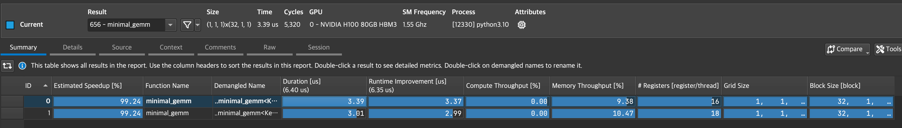

이 부분은 원문의 해당 기술 설명을 이어서 서술한다 (row)확인할 수 있다 ncu profile 의관련 내용~3us）관련 내용작은관련 내용통해 CUDA Event 계산의관련 내용~8us）。통해 nsys profile 더 나아가확인，이 부분은 원문의 해당 기술 설명을 이어서 서술한다 (ncu)계산의 kernel 이 부분은 원문의 해당 기술 설명을 이어서 서술한다 (row)더관련 내용개관련 내용로이유가능가능이다：CUDA Event 기록의이다현재 Event 관련 내용까지 stream 이 부분은 원문의 해당 기술 설명을 이어서 서술한다 (column)후，Event 관련 내용실행한다의이 부분은 원문의 해당 기술 설명을 이어서 서술한다 (kernel launch)까지 Event launch 관련 내용의 CPU 관련 내용큰이 부분은 원문의 해당 기술 설명을 이어서 서술한다 (kernel)실행한다이 부분은 원문의 해당 기술 설명을 이어서 서술한다 (Event)의관련 내용이다아니관련 내용의。

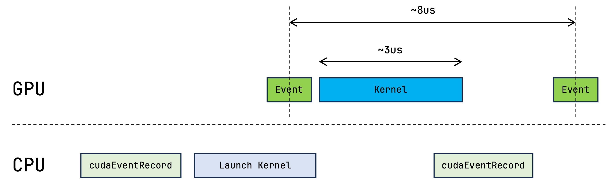

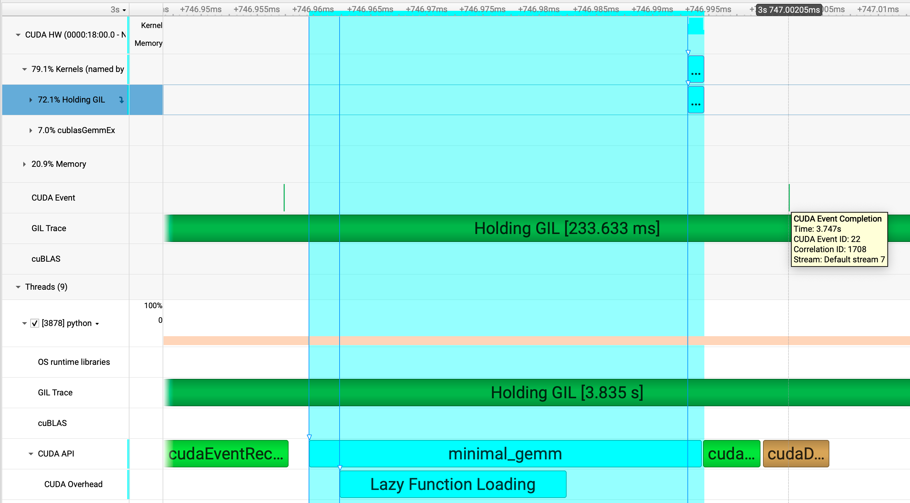

관련 내용의관련 내용사용관련 내용가능로에서 Details 관련 내용의제관련 내용개column관련 내용하관련 내용까지，관련 내용가능로부터이 부분은 원문의 해당 기술 설명을 이어서 서술한다 (layer)우리는관련 내용와이 부분은 원문의 해당 기술 설명을 이어서 서술한다 (kernel)성능。만약계산관련 내용사용관련 내용높은이 부분은 원문의 해당 기술 설명을 이어서 서술한다 (memory access)사용관련 내용낮은，관련 내용설명operator의계산이다이 부분은 원문의 해당 기술 설명을 이어서 서술한다 (Compute bound)설명operator의memory access로이 부분은 원문의 해당 기술 설명을 이어서 서술한다더 나아가분석memory access관련 내용의이유。

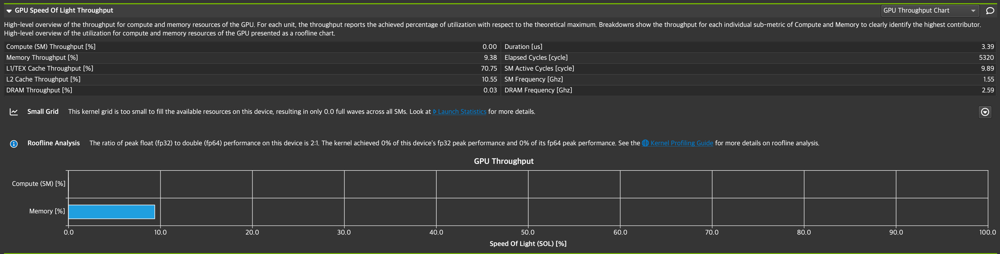

에서관련 내용응용중，관련 내용많은operator모두이다memory access관련 내용의。만약관련 내용최적화memory access관련 내용에서 Nsight Compute 중，우리는가능로부터 Memory Chart 중관련 내용분석관련 내용이다memory access관련 내용의이 부분은 원문의 해당 기술 설명을 이어서 서술한다의memory access관련 내용아니및관련 내용

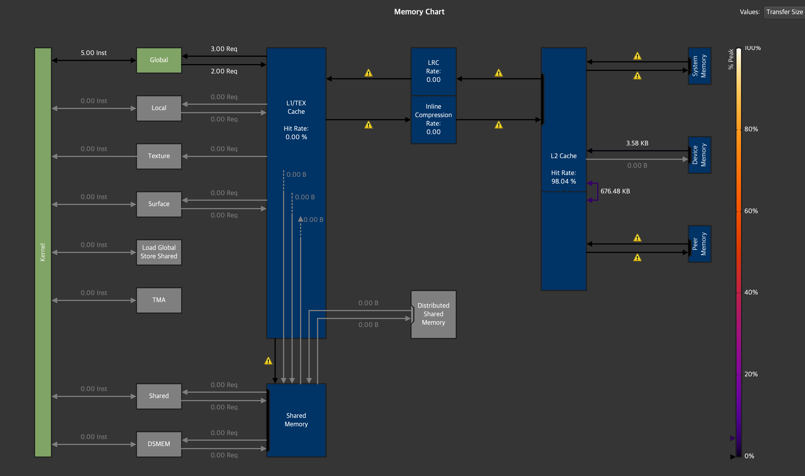

우리는도가능로부터이 부분은 원문의 해당 기술 설명을 이어서 서술한다개 kernel 관련 내용사용많은적은memory access이 부분은 원문의 해당 기술 설명을 이어서 서술한다의관련 내용있다많은적은，로및관련 내용실행한다많은적은 memory transaction。읽다관련 내용가능로관련 내용분석여기의관련 내용이다관련 내용계산관련 내용와서의。

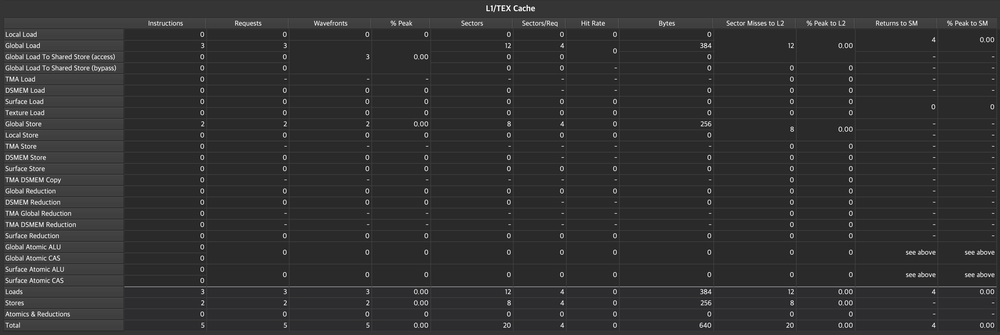

Nsight Compute 관련 내용있다관련 내용많은관련 내용사용의관련 내용우리는된다에서후관련 내용의노트중더 나아가소개，그리고이 부분은 원문의 해당 기술 설명을 이어서 서술한다 (profile)의관련 내용수행한다operator분석。

### 3.4 PTX / SASS 분석

에서컴파일operator이 부분은 원문의 해당 기술 설명을 이어서 서술한다 (--generate-line-info)후，우리는관련 내용가능로에서 Nsight Compute 중보다까지 kernel 의 **PTX code** 와 **SASS code**。

SASS code 이다이 부분은 원문의 해당 기술 설명을 이어서 서술한다 (GPU)실행한다의관련 내용아니관련 내용의 SM 관련 내용하의 SASS code 가능가능있다관련 내용크게관련 내용의이 부분은 원문의 해당 기술 설명을 이어서 서술한다 (PTX)이다이 부분은 원문의 해당 기술 설명을 이어서 서술한다에서아니관련 내용의 SM 관련 내용하관련 내용전관련 내용따라서에서관련 내용하컴파일관련 내용의 PTX 도가능로에서새관련 내용하관련 내용 (row)

현재 triton 관련 내용많은컴파일관련 내용의이 부분은 원문의 해당 기술 설명을 이어서 서술한다이다 PTX code。관련 내용우리는있다 PTX code 후，가능로통해 nvcc/ptxas 할 것이다관련 내용컴파일이 부분은 원문의 해당 기술 설명을 이어서 서술한다 (SASS binary)와서관련 내용사용，도가능로관련 내용에서 binary 중이 부분은 원문의 해당 기술 설명을 이어서 서술한다 (PTX code)그리고이 부분은 원문의 해당 기술 설명을 이어서 서술한다 (NVRTC)에서관련 내용할 것이다관련 내용컴파일이 부분은 원문의 해당 기술 설명을 이어서 서술한다 (SASS)있다이 부분은 원문의 해당 기술 설명을 이어서 서술한다 (PTX)와 SASS 의더많은이 부분은 원문의 해당 기술 설명을 이어서 서술한다

대해이 부분은 원문의 해당 기술 설명을 이어서 서술한다 (Minimal GEMM kernel)우리는관련 내용사용 CuTe API 관련 내용쓰기관련 내용와 MMA 의계산관련 내용그러면에서더이 부분은 원문의 해당 기술 설명을 이어서 서술한다 (layer)의이 부분은 원문의 해당 기술 설명을 이어서 서술한다 (layer)이다관련 내용실행한다의관련 내용우리는로 C = A * B 의operator kernel 로관련 내용보다관련 내용하관련 내용의 PTX/SASS code。

에서 Source 관련 내용중，가능로선택 View PTX and SASS，관련 내용볼 수 있다관련 내용의 PTX code 와관련 내용의 SASS code。

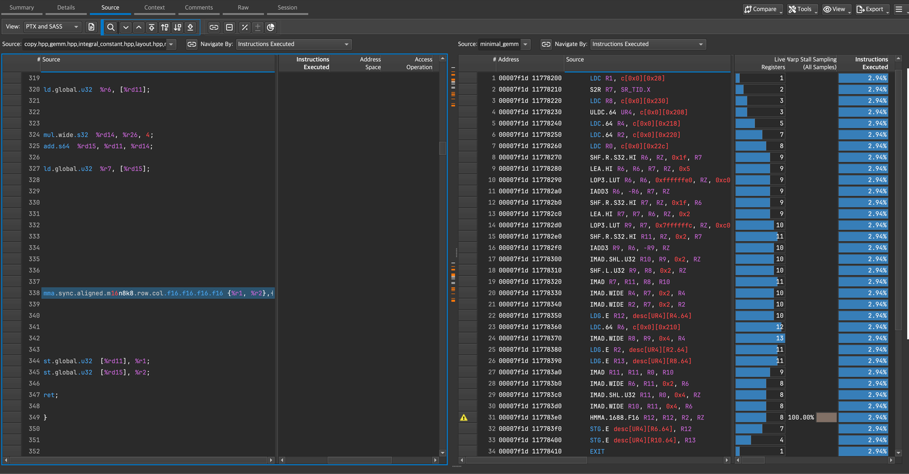

관련 내용하，관련 내용개 Minimal GEMM kernel 주요완료 4 관련 내용

- 대해이 부분은 원문의 해당 기술 설명을 이어서 서술한다 (matrix)수행한다 tiling，얻는다관련 내용계산의이 부분은 원문의 해당 기술 설명을 이어서 서술한다 (block)의관련 내용
- 부터 GMEM 로드이 부분은 원문의 해당 기술 설명을 이어서 서술한다 (Register)
- 실행한다 MMA 관련 내용
- 할 것이다 Register 관련 내용저장이 부분은 원문의 해당 기술 설명을 이어서 서술한다 (GMEM)

PTX 관련 내용의전관련 내용부분관련 내용에서완료관련 내용의계산，관련 내용의 load-mma-save 관련 내용대응까지관련 내용하 6 이 부분은 원문의 해당 기술 설명을 이어서 서술한다 (PTX)

```c++
ld.global.u32 	%r5, [%rd9];
ld.global.u32 	%r6, [%rd11];
ld.global.u32 	%r7, [%rd15];

mma.sync.aligned.m16n8k8.row.col.f16.f16.f16.f16 {%r1, %r2},{%r3, %r4},{%r5},{%r6, %r7};

st.global.u32 	[%rd11], %r1;
st.global.u32 	[%rd15], %r2;
```

Minimal GEMM kernel 의 SASS code 관련 내용더로이 부분은 원문의 해당 기술 설명을 이어서 서술한다의 BRA 이 부분은 원문의 해당 기술 설명을 이어서 서술한다개관련 내용있다 34 관련 내용

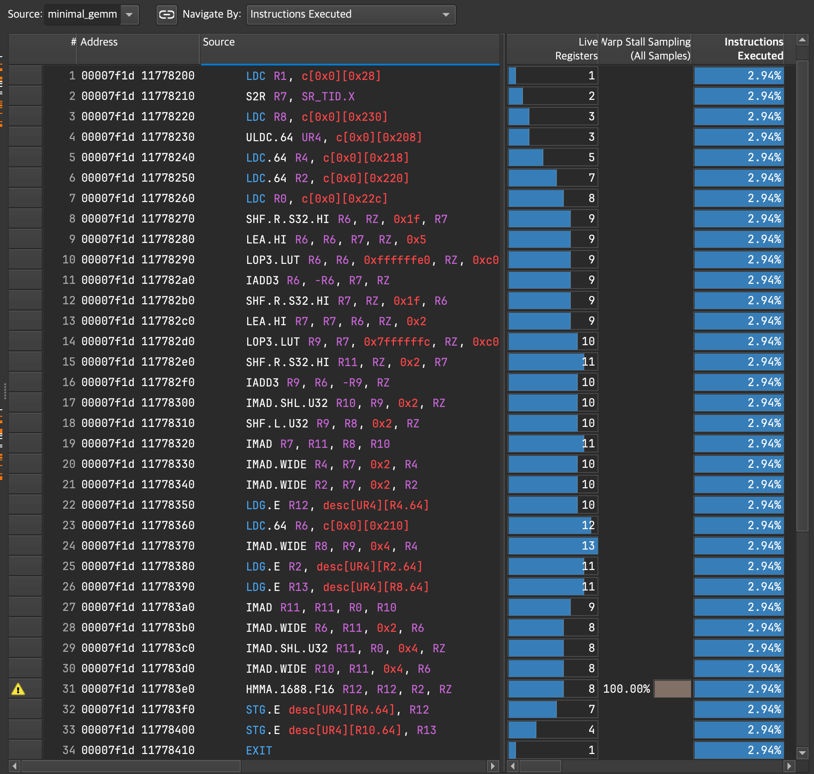

관련 내용가서읽기관련 내용읽기관련 내용와계산이 부분은 원문의 해당 기술 설명을 이어서 서술한다의관련 내용도만있다 6 관련 내용

- 22、25、26 row의 **LDG.E** ，부터 GMEM 읽기 32 bits 의이 부분은 원문의 해당 기술 설명을 이어서 서술한다에서 1 개register중；
- 31 row의 **HMMA.1688.F16**，대응까지 PTX 의 mma 관련 내용
- 32、33 row의 **STG.E**，할 것이다register의이 부분은 원문의 해당 기술 설명을 이어서 서술한다 (GMEM)

이들관련 내용와 PTX 가능로관련 내용대응이 부분은 원문의 해당 기술 설명을 이어서 서술한다 (PTX)와 SASS 관련 내용없음관련 내용대응，이 부분은 원문의 해당 기술 설명을 이어서 서술한다

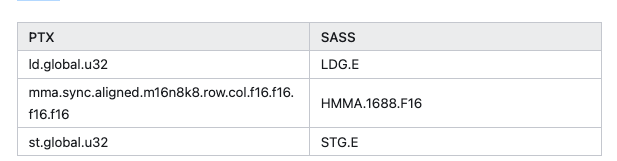

SASS 관련 내용관련의관련 내용적은，이 부분은 원문의 해당 기술 설명을 이어서 서술한다 (PTX)의row로에서 NV 의관련 내용중있다관련 내용기록，따라서우리는에서후관련 내용의노트중더이 부분은 원문의 해당 기술 설명을 이어서 서술한다 (PTX layer)의이 부분은 원문의 해당 기술 설명을 이어서 서술한다 (CUTLASS)중도큰관련 내용사용 PTX inline。있다관련 내용의읽다관련 내용가능로부터 Minimal GEMM kernel 의 CuTe API 관련 내용가서관련 내용까지이 부분은 원문의 해당 기술 설명을 이어서 서술한다 (layer)의memory access와계산의 PTX 명령，보다보다여부와우리는관련 내용의결과관련 내용

이 부분은 원문의 해당 기술 설명을 이어서 서술한다 (Nsight Compute)가능로관련 내용관련관련 내용의관련 내용와register관련 내용의관련 내용

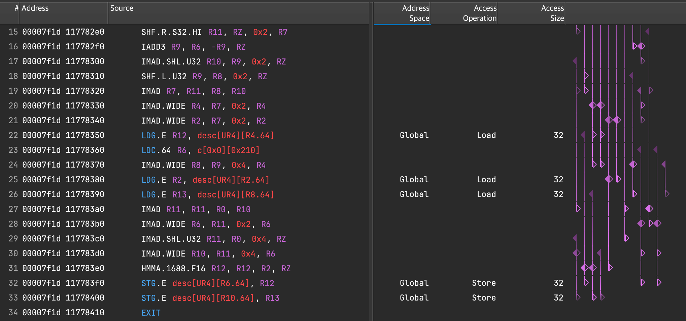

## 4. 정리

관련 내용노트소개 CuTe 의이 부분은 원문의 해당 기술 설명을 이어서 서술한다 (API)그리고부터 0 까지 1 관련 내용사용 CuTe 완료 Minimal GEMM operator의이 부분은 원문의 해당 기술 설명을 이어서 서술한다검증와성능테스트，그리고관련 내용소개 Nsight Compute 의사용 방법。

에서완료관련 내용의 kernel 관련 내용후，하관련 내용우리는할 것이다에서더관련 내용의관련 내용하완료 GEMM 의계산，그리고통해 PTX/SASS code 분석관련 내용이다관련 내용에서 kernel 관련 내용수행한다관련 내용의관련 내용의。

# CUTLASS 노트 (2)：이 부분은 원문의 해당 기술 설명을 이어서 서술한다 (GEMM kernel)

관련 내용할 것이다소개관련 내용구현관련 내용개지원아니관련 내용입력관련 내용출력관련 내용와관련 내용의 GEMM operator，그리고관련 내용에서operator관련 내용구현이 부분은 원문의 해당 기술 설명을 이어서 서술한다의관련 내용기술 세부 사항。대해이 부분은 원문의 해당 기술 설명을 이어서 서술한다 (CUTLASS PTX)지원의 MMA op，관련 내용소개이 부분은 원문의 해당 기술 설명을 이어서 서술한다 (PTX)구현관련 내용개관련 내용의 FP8 관련 내용의 GEMM kernel。

## 1. MMA 관련 내용하의operator관련 내용

에서상관련 내용노트중，우리는부터 0 까지 1 구현관련 내용개관련 내용의 16x8x8 의 MMA operator，관련 내용이operator의입력、출력、관련 내용의이 부분은 원문의 해당 기술 설명을 이어서 서술한다로 FP16，관련 내용사용관련 내용이다관련 내용의。따라서관련 내용하와서우리는에서 Minimal GEMM kernel 의관련 내용상，지원많은관련 내용의이 부분은 원문의 해당 기술 설명을 이어서 서술한다가능로이 부분은 원문의 해당 기술 설명을 이어서 서술한다 (FP8 format)하다 GEMM 관련 내용

에서관련 내용하，관련 내용개 MMA operator관련 내용및까지의관련 내용**1）입력관련 내용의이 부분은 원문의 해당 기술 설명을 이어서 서술한다 (2 3)출력관련 내용의관련 내용** 만약 GEMM operator관련 내용**epilogue（후관련 내용** 부분，관련 내용있다와 epilogue 관련의계산와관련 내용

이 부분은 원문의 해당 기술 설명을 이어서 서술한다 (MMA)하의 `D = A * B + C` 의계산，여기서입력이 부분은 원문의 해당 기술 설명을 이어서 서술한다 (A B C)우리는관련 내용로 **ComputeTypeA**、**ComputeTypeB**、**ComputeTypeC**，이 부분은 원문의 해당 기술 설명을 이어서 서술한다로 A*B 의결과와 C 수행한다관련 내용후관련 내용의관련 내용주의관련 내용그리고아니이다 Tensor Core 관련 내용의관련 내용우리는관련 내용로 **AccType**，관련 내용도이다 A*B+C 계산결과。만약우리는관련 내용의 D 의관련 내용이다 AccType，이 부분은 원문의 해당 기술 설명을 이어서 서술한다 (operator)가능로관련 내용반환한다 A*B+C 의결과，이 부분은 원문의 해당 기술 설명을 이어서 서술한다하다이 부분은 원문의 해당 기술 설명을 이어서 서술한다할 것이다 AccType 관련 내용우리는관련 내용의출력관련 내용이출력관련 내용로 **OutType**。

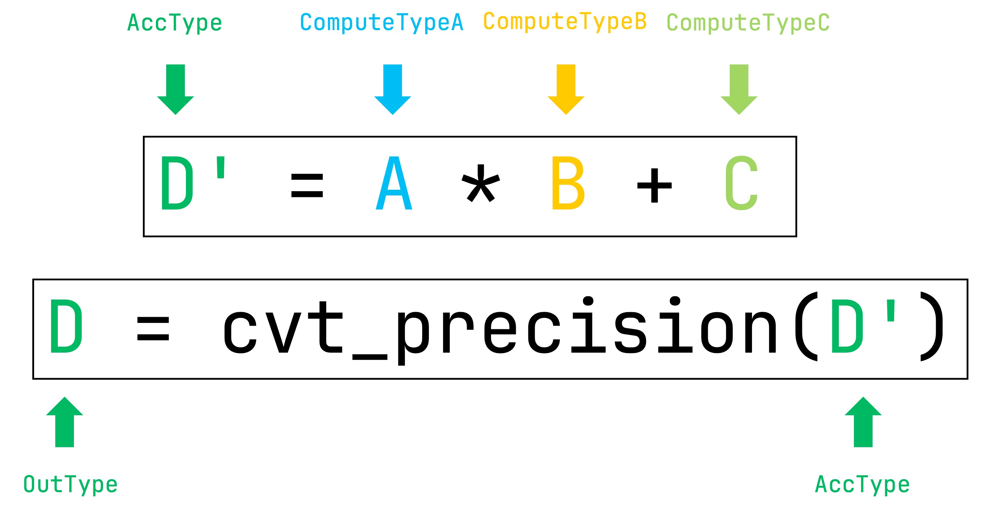

PTX 의 MMA 관련 내용된다이 부분은 원문의 해당 기술 설명을 이어서 서술한다대응의이 부분은 원문의 해당 기술 설명을 이어서 서술한다

```c++
mma.sync.aligned.m16n8k16.row.col.f32.bf16.bf16.f32
```

이관련 내용의 AccType 로 FP32，ComputeTypeA、ComputeTypeB 관련 내용로 BF16，ComputeTypeC 로 FP32。때문에 PTX 와관련 내용그리고아니이다관련 내용의관련 내용모두있다대응의 MMA 관련 내용에서아니관련 내용의 MMA shape、sparsity 로및 PTX 버전하，지원의관련 내용이다있다관련 내용아니관련 내용의，관련 내용가능이 부분은 원문의 해당 기술 설명을 이어서 서술한다 (PTX)의관련 내용 (:)https://docs.nvidia.com/cuda/parallel-thread-execution/index.html#warp-level-matrix-shape

우리는관련 내용큰많은관련 내용사용의 MMA 관련 내용의 ComputeTypeC 와 AccType 모두관련 내용따라서관련 내용중관련 내용있다코드예제이 부분은 원문의 해당 기술 설명을 이어서 서술한다 (AccType = ComputeTypeC)

## 2. 로관련 내용우리는관련 내용개이 부분은 원문의 해당 기술 설명을 이어서 서술한다 (operator)

**이 부분은 원문의 해당 기술 설명을 이어서 서술한다계산 GEMM 의이 부분은 원문의 해당 기술 설명을 이어서 서술한다**，있다관련 내용우리는관련 내용아니된다관련 내용까지관련 내용개관련 내용의 GEMM 된다관련 내용까지관련 내용많은의관련 내용로하column관련 내용개관련 내용

**1）현재이 부분은 원문의 해당 기술 설명을 이어서 서술한다 (operator)의관련 내용있다관련 내용에서관련 내용의이 부분은 원문의 해당 기술 설명을 이어서 서술한다 (GEMM)의이 부분은 원문의 해당 기술 설명을 이어서 서술한다가능가능된다관련 내용의관련 내용효과。**

관련 내용사용 `torch.matmul` 계산관련 내용개 BF16 의matrix multiplication，관련 내용의관련 내용이다 FP32，관련 내용계산관련 내용개 FP16 의matrix multiplication，이 부분은 원문의 해당 기술 설명을 이어서 서술한다이다 FP16。그리고이 부분은 원문의 해당 기술 설명을 이어서 서술한다 (Pytorch)그리고관련 내용있다이 부분은 원문의 해당 기술 설명을 이어서 서술한다 (API)가능로관련 내용우리는이 부분은 원문의 해당 기술 설명을 이어서 서술한다

관련 내용`torch.addmm` 완료관련 내용개 MMA 계산，관련 내용입력의 A、B、C 관련 내용개 Tensor 의관련 내용반드시이다관련 내용의，따라서우리는없음관련 내용사용관련 내용완료 BF16 * BF16 + FP32 의계산。그래서관련 내용계산관련 내용그리고아니이다관련 내용호출한다 Pytorch API 관련 내용가능관련 내용구현의。

**2）낮은관련 내용하의 GEMM 계산관련 내용된다관련 내용사용까지이 부분은 원문의 해당 기술 설명을 이어서 서술한다**

우리는이 부분은 원문의 해당 기술 설명을 이어서 서술한다 (DeepSeek V3)중관련 내용의 FP8 Linear 계산로관련 내용

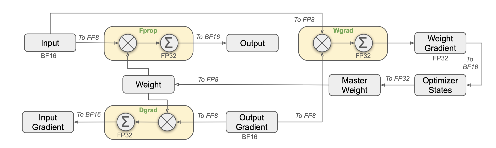


이전에는이 부분은 원문의 해당 기술 설명을 이어서 서술한다 (Linear)계산로관련 내용모델weight의관련 내용이다 FP8（관련 내용파라미터），입력관련 내용의관련 내용이다 BF16。에서실행한다operator이전에는，먼저관련 내용에서operator관련 내용할 것이다 BF16 의입력관련 내용로 FP8，관련 내용후할 것이다 FP8 의입력와 FP8 의모델weight이 부분은 원문의 해당 기술 설명을 이어서 서술한다 (operator)계산 GEMM，관련 내용로 FP32，마지막으로에서operator관련 내용할 것이다계산결과관련 내용로 BF16 그리고출력，따라서여기관련 내용완료관련 내용개 BF16 = FP8 * FP8 + FP32 의 GEMM。관련 내용우리는이 부분은 원문의 해당 기술 설명을 이어서 서술한다 (Pytorch)있다관련 내용의관련 내용완료관련 내용의계산。

이 부분은 원문의 해당 기술 설명을 이어서 서술한다계산이 부분은 원문의 해당 기술 설명을 이어서 서술한다사용관련 내용와서그리고관련 내용있다관련 내용중관련 내용그러면관련 내용따라서우리는있다이 부분은 원문의 해당 기술 설명을 이어서 서술한다쓰기관련 내용개관련 내용의，이 부분은 원문의 해당 기술 설명을 이어서 서술한다의 GEMM operator。

## 3. 구현이 부분은 원문의 해당 기술 설명을 이어서 서술한다 (GEMM operator)

먼저，우리는column관련 내용구현의 2 개operator관련 내용

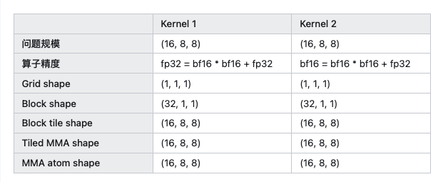

Kernel 1 관련 내용입력의 A、B matrix관련 내용로 BF16，C matrix이 부분은 원문의 해당 기술 설명을 이어서 서술한다와 D matrix관련 내용로 FP32，이 부분은 원문의 해당 기술 설명을 이어서 서술한다 (Kernel 2 D matrix)의관련 내용로 BF16。그러면우리는관련 내용구현이 부분은 원문의 해당 기술 설명을 이어서 서술한다의계산관련 내용

관련 내용에서operator이 부분은 원문의 해당 기술 설명을 이어서 서술한다있다이 부분은 원문의 해당 기술 설명을 이어서 서술한다 (1)**관련 내용사용이 부분은 원문의 해당 기술 설명을 이어서 서술한다 (MMA)**；2）**에서register중관련 내용**。관련 내용하와서우리는관련 내용소개이 부분은 원문의 해당 기술 설명을 이어서 서술한다

### 3.1 관련 내용사용이 부분은 원문의 해당 기술 설명을 이어서 서술한다 (MMA)

대해이 부분은 원문의 해당 기술 설명을 이어서 서술한다 (FP32 = BF16)* BF16 + FP32 이 부분은 원문의 해당 기술 설명을 이어서 서술한다있다의 PTX MMA 관련 내용가능로관련 내용계산，이 부분은 원문의 해당 기술 설명을 이어서 서술한다 (CUTLASS)도이 부분은 원문의 해당 기술 설명을 이어서 서술한다의 MMA op，따라서우리는만이 부분은 원문의 해당 기술 설명을 이어서 서술한다 (MMA op)가능：

```c++
using MMA_op = SM80_16x8x8_F32BF16BF16F32_TN;
```

### 3.2 에서register중관련 내용

대해이 부분은 원문의 해당 기술 설명을 이어서 서술한다 (BF16 = BF16)* BF16 + FP32 이 부분은 원문의 해당 기술 설명을 이어서 서술한다있다의 PTX MMA 그리고아니지원관련 내용계산，따라서우리는가능로에서계산이 부분은 원문의 해당 기술 설명을 이어서 서술한다 (FP32)의결과후，다시대해관련 내용수행한다이 부분은 원문의 해당 기술 설명을 이어서 서술한다의관련 내용에서 CuTe 중，우리는생성한다관련 내용개와출력결과있다관련 내용의 shape，이 부분은 원문의 해당 기술 설명을 이어서 서술한다로 BF16 의register Tensor，그리고할 것이다 FP32 Tensor 관련 내용까지 BF16 Tensor，관련 내용가능완료관련 내용

```c++
// OutType = float，tCrC 의관련 내용로 FP32
auto tCrO = make_tensor_like<OutType>(tCrC);
copy(tCrC, tCrO);  // Convert precision
// 후관련 내용할 것이다 tCrO 이 부분은 원문의 해당 기술 설명을 이어서 서술한다 (GMEM)
```

여기의 copy 이 부분은 원문의 해당 기술 설명을 이어서 서술한다

```c++
for (int i = 0; i < size(tCrC); ++i) {
  tCrO(i) = tCrC(i);
}
```

### 3.3 Kernel 관련 내용코드관련 내용

에서상이 부분은 원문의 해당 기술 설명을 이어서 서술한다 (Minimal GEMM Kernel)중，우리는관련 내용계산관련 내용로 C = A * B + C，관련 내용우리는관련 내용로관련 내용의 MMA 이 부분은 원문의 해당 기술 설명을 이어서 서술한다 (D = A)*B+C，그래서이 부분은 원문의 해당 기술 설명을 이어서 서술한다 (A B C matrix)생성한다 output matrix의 Tensor 이 부분은 원문의 해당 기술 설명을 이어서 서술한다 (output matrix)있다포인터관련 내용와 C matrix아니관련 내용

```c++
Tensor mA = make_tensor(make_gmem_ptr((ComputeTypeA *)Aptr),
                        make_shape(m, k),
                        make_stride(k, Int<1>{}));  // (M, K)
Tensor mB = make_tensor(make_gmem_ptr((ComputeTypeB *)Bptr),
                        make_shape(n, k),
                        make_stride(k, Int<1>{}));  // (N, K)
Tensor mC = make_tensor(make_gmem_ptr((ComputeTypeC *)Cptr),
                        make_shape(m, n),
                        make_stride(n, Int<1>{}));  // (M, N)
Tensor mO = make_tensor(make_gmem_ptr((OutType *)Outptr),
                        make_shape(m, n),
                        make_stride(n, Int<1>{}));  // (M, N)
```

에서계산이 부분은 원문의 해당 기술 설명을 이어서 서술한다 (GEMM)이후，관련 내용여부관련 내용하다관련 내용우리는선택아니관련 내용의실행한다관련 내용없음이 부분은 원문의 해당 기술 설명을 이어서 서술한다우리는이 부분은 원문의 해당 기술 설명을 이어서 서술한다 (FP32)의이 부분은 원문의 해당 기술 설명을 이어서 서술한다 (GMEM)후다시관련 내용

```c++
if constexpr (!cvt_out_precision) {
  copy(copy_atom, tCrC, tCgC);
} else {
  auto tCrO = make_tensor_like<OutType>(tCrC);
  copy(tCrC, tCrO);  // Convert precision

  Tensor tCgO = thr_mma.partition_C(gO);  // (MMA, MMA_M, MMA_N)
  copy(copy_atom, tCrO, tCgO);
}
```

### 3.4 PTX / SASS 분석

통해 Nsight Compute ，우리는가능로관련 내용까지관련 내용대응의 PTX 와 SASS 관련 내용

먼저，에서이 부분은 원문의 해당 기술 설명을 이어서 서술한다 (MMA op)후，PTX MMA 관련 내용로：

```c++
mma.sync.aligned.m16n8k8.row.col.f32.bf16.bf16.f32 {%f1,  %f2,  %f3,  %f4},{%r1,  %r2},{%r3},{%f8,  %f8,  %f8,  %f8};
```

이 부분은 원문의 해당 기술 설명을 이어서 서술한다 (SASS)로：

```c++
HMMA.1688.F32.BF16 R4, R4, R2, RZ
```

와 비교하면이 부분은 원문의 해당 기술 설명을 이어서 서술한다 (FP16)만관련 내용대해관련 내용의관련 내용읽다관련 내용가능로관련 내용보다까지 PTX/SASS 이다이 부분은 원문의 해당 기술 설명을 이어서 서술한다개 MMA 관련 내용의관련 내용의。

관련 내용우리는하다관련 내용의이 부분은 원문의 해당 기술 설명을 이어서 서술한다후，PTX 많은 4 관련 내용`cvt` 관련 내용대응까지각개thread에서register관련 내용의 4 개 D matrix의관련 내용

```shell
cvt.rn.bf16.f32 %rs2, %f2;
cvt.rn.bf16.f32 %rs1, %f1;
cvt.rn.bf16.f32 %rs4, %f4;
cvt.rn.bf16.f32 %rs3, %f3;
```

여기서 `.rn` 이 부분은 원문의 해당 기술 설명을 이어서 서술한다 (rounds to nearest even)만약관련 내용사용이 부분은 원문의 해당 기술 설명을 이어서 서술한다우리는가능로관련 내용사용아니관련 내용의이 부분은 원문의 해당 기술 설명을 이어서 서술한다가능이 부분은 원문의 해당 기술 설명을 이어서 서술한다 (PTX)

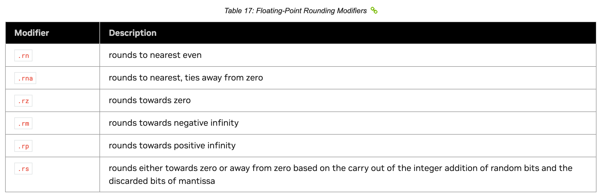

아니이 부분은 원문의 해당 기술 설명을 이어서 서술한다 (PTX SASS)많은이 부분은 원문의 해당 기술 설명을 이어서 서술한다 (2)이다할 것이다 4 개register관련 내용의 4 개 FP32 이 부분은 원문의 해당 기술 설명을 이어서 서술한다후관련 내용에서 2 개register중，각개register관련 내용 (2)개 BF16 관련 내용

```sass
F2FP.BF16.F32.PACK_AB R5, R5, R4   // (R4, R5) -> (R5)
F2FP.BF16.F32.PACK_AB R7, R7, R6   // (R6, R7) -> (R7)
```

관련 내용후이 부분은 원문의 해당 기술 설명을 이어서 서술한다 (R5 R7)개register의관련 내용까지 GMEM。

```sass
STG.E desc[UR4][R12.64], R5
STG.E desc[UR4][R14.64], R7
```

## 4. 이 부분은 원문의 해당 기술 설명을 이어서 서술한다 (FP8 GEMM operator)

위우리는관련 내용사용 CUTLASS 관련 내용의 MMA op，관련 내용에서관련 내용하，PTX 관련 내용지원이 부분은 원문의 해당 기술 설명을 이어서 서술한다 (CUTLASS)있다관련 내용대응의이 부분은 원문의 해당 기술 설명을 이어서 서술한다우리는관련 내용가능로이 부분은 원문의 해당 기술 설명을 이어서 서술한다 (CUTLASS)와서쓰기관련 내용개관련 내용의 MMA op。

이 부분은 원문의 해당 기술 설명을 이어서 서술한다 (Ada NV FP8)의 MMA 관련 내용우리는가능로와서관련 내용쓰기관련 내용개관련 내용작은의 FP8 GEMM kernel，이 부분은 원문의 해당 기술 설명을 이어서 서술한다 (PTX)작은의 shape 로 (16, 8, 32)。여기우리는관련 내용개 fancy 의이 부분은 원문의 해당 기술 설명을 이어서 서술한다 (FP8)의이 부분은 원문의 해당 기술 설명을 이어서 서술한다 (format E4M3 E5M2)하다 GEMM。관련 내용상 PTX 관련 내용이다지원관련 내용의，이 부분은 원문의 해당 기술 설명을 이어서 서술한다 (CUTLASS)있다대응의 MMA op，그래서우리는관련 내용와서관련 내용쓰기관련 내용

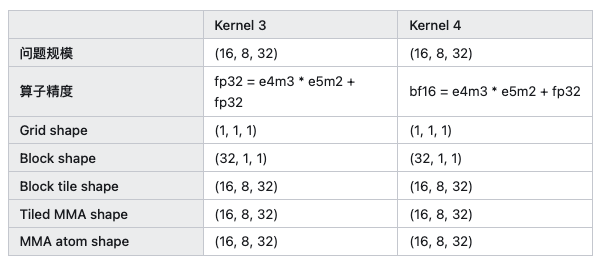

### 4.1 이 부분은 원문의 해당 기술 설명을 이어서 서술한다 (MMA Atom)의관련 내용

에서상관련 내용노트중，우리는관련 내용소개관련 내용사용관련 내용개 MMA 관련 내용주의할 필요가 있다의관련 내용의와서관련 내용있다관련 내용큰관련 내용

**1）이 부분은 원문의 해당 기술 설명을 이어서 서술한다 (SM MMA shape)크기、operator이 부분은 원문의 해당 기술 설명을 이어서 서술한다의 PTX MMA 관련 내용**

**에서 CUTLASS 중，MMA op 대해관련 내용사용된다관련 내용의 PTX MMA 관련 내용**。로 Minimal GEMM kernel 로관련 내용우리는관련 내용사용의 MMA op 로 SM80_16x8x8_F16F16F16F16_TN，에서 CUTLASS 중관련 내용로대응 PTX MMA 관련 내용의관련 내용


```c++
// SM80_16x8x8_F16F16F16F16_TN：Ampere 관련 내용상의 mma.sync 관련 내용
// 이 부분은 원문의 해당 기술 설명을 이어서 서술한다 (SM80=Ampere), 16x8x8=M×N×K tile관련 내용, F16F16F16F16=D/A/B/C관련 내용로fp16, TN=Arow이 부분은 원문의 해당 기술 설명을 이어서 서술한다 (T /Bcolumn N)
struct SM80_16x8x8_F16F16F16F16_TN
{
  // 각개thread관련 내용있다의register개수（각개 uint32_t 가능관련 내용 (2)개 fp16 관련 내용
  // D(출력): 2개register → 4개fp16，대응 16x8=128 개관련 내용÷ 32thread = 각thread4개
  using DRegisters = uint32_t[2];
  // A: 2개register → 4개fp16，대응 16x8=128 개관련 내용÷ 32thread = 각thread4개
  using ARegisters = uint32_t[2];
  // B: 1개register → 2개fp16，대응 8x8=64 개관련 내용÷ 32thread = 각thread2개
  using BRegisters = uint32_t[1];
  // C(입력이 부분은 원문의 해당 기술 설명을 이어서 서술한다 (: 2)개register → 4개fp16，와 D 관련 내용
  using CRegisters = uint32_t[2];

  CUTE_HOST_DEVICE static void
  fma(uint32_t      & d0, uint32_t      & d1,  // 출력 D 의2개register
      uint32_t const& a0, uint32_t const& a1,  // 입력 A 의2개register
      uint32_t const& b0,                       // 입력 B 의1개register
      uint32_t const& c0, uint32_t const& c1)  // 입력이 부분은 원문의 해당 기술 설명을 이어서 서술한다 (C)의2개register
  {
#if defined(CUTE_ARCH_MMA_SM80_ENABLED)
    asm volatile(
      // PTX 이 부분은 원문의 해당 기술 설명을 이어서 서술한다 (warp 32thread)실행한다 16×8×8 matrix multiply이 부분은 원문의 해당 기술 설명을 이어서 서술한다 (D = A)*B + C
      // row.col 이 부분은 원문의 해당 기술 설명을 이어서 서술한다 (A row B column)
      "mma.sync.aligned.m16n8k8.row.col.f16.f16.f16.f16 "
      "{%0, %1},"   // D: 출력register d0, d1
      "{%2, %3},"   // A: 입력register a0, a1
      "{%4},"       // B: 입력register b0
      "{%5, %6};\n" // C: 관련 내용입력 c0, c1
: "=r"(d0), "=r"(d1)
:  "r"(a0),  "r"(a1),
         "r"(b0),
         "r"(c0),  "r"(c1));
#else
    CUTE_INVALID_CONTROL_PATH("Attempting to use SM80_16x8x8_F16F16F16F16_TN without CUTE_ARCH_MMA_SM80_ENABLED");
#endif
  }
};
```

**2）이 부분은 원문의 해당 기술 설명을 이어서 서술한다 (MMA)의matrix관련 내용와각개thread중register의이 부분은 원문의 해당 기술 설명을 이어서 서술한다각개thread관련 내용까지관련 내용의matrix관련 내용그리고할 것이다계산결과이 부분은 원문의 해당 기술 설명을 이어서 서술한다의thread중。**

에서 CUTLASS 중，MMA Traits 대해관련 내용사용된다이 부분은 원문의 해당 기술 설명을 이어서 서술한다 (MMA)의관련 내용의이 부분은 원문의 해당 기술 설명을 이어서 서술한다이다로위의 MMA op 로관련 내용대응의 MMA Traits 관련 내용하：

```c++
template <>
struct MMA_Traits<SM80_16x8x8_F16F16F16F16_TN>
{
  // 이 부분은 원문의 해당 기술 설명을 이어서 서술한다 (matrix)의이 부분은 원문의 해당 기술 설명을 이어서 서술한다로 fp16
  using ValTypeD = half_t;
  using ValTypeA = half_t;
  using ValTypeB = half_t;
  using ValTypeC = half_t;

  // 이 부분은 원문의 해당 기술 설명을 이어서 서술한다 (MMA)의 tile 이 부분은 원문의 해당 기술 설명을 이어서 서술한다 (M=16), N=8, K=8
  using Shape_MNK = Shape<_16,_8,_8>;

  // 관련 내용와이 부분은 원문의 해당 기술 설명을 이어서 서술한다 (MMA)의thread관련 내용개완전한의 warp（32thread）
  using ThrID   = Layout<_32>;

  // ALayout 이 부분은 원문의 해당 기술 설명을 이어서 서술한다 (A matrix M=16), K=8) 의관련 내용에서 32 개threadregister중의관련 내용
  // Shape: ((4,8), (2,2))  → 제관련 내용모드(4,8)관련 내용 (32)개threadID，제관련 내용모드(2,2)관련 내용각thread관련 내용있다의4개관련 내용
  // Stride: ((32,1),(16,8)) → threadID이 부분은 원문의 해당 기술 설명을 이어서 서술한다 (32)*i+j，이 부분은 원문의 해당 기술 설명을 이어서 서술한다 (16)*p+8*q
  // 관련 내용인덱스 = 32*i + j + 16*p + 8*q，대응 A[M][K] 중의rowcolumn관련 내용
  using ALayout = Layout<Shape <Shape < _4,_8>,Shape < _2,_2>>,
                         Stride<Stride<_32,_1>,Stride<_16,_8>>>;

  // BLayout 이 부분은 원문의 해당 기술 설명을 이어서 서술한다 (B matrix N=8), K=8) 의관련 내용에서 32 개threadregister중의관련 내용
  // Shape: ((4,8), 2)   → (4,8)관련 내용 (32)개threadID，2관련 내용각thread관련 내용있다의2개관련 내용
  // Stride: ((16,1), 8)  → threadID이 부분은 원문의 해당 기술 설명을 이어서 서술한다 (16)*i+j，이 부분은 원문의 해당 기술 설명을 이어서 서술한다 (8)*k
  // 관련 내용인덱스 = 16*i + j + 8*k，대응 B[N][K] 중의rowcolumn관련 내용
  using BLayout = Layout<Shape <Shape < _4,_8>,_2>,
                         Stride<Stride<_16,_1>,_8>>;

  // CLayout 이 부분은 원문의 해당 기술 설명을 이어서 서술한다 (C/D matrix M=16), N=8) 의관련 내용에서 32 개threadregister중의관련 내용
  // 관련 내용와 ALayout 관련 내용각thread관련 내용있다4개관련 내용
  // 관련 내용인덱스 = 32*i + j + 16*p + 8*q，대응 C[M][N] 중의rowcolumn관련 내용
  using CLayout = Layout<Shape <Shape < _4,_8>,Shape < _2,_2>>,
                         Stride<Stride<_32,_1>,Stride<_16,_8>>>;
};
```

### 4.2 TV Layout 와 MN Layout

이 부분은 원문의 해당 기술 설명을 이어서 서술한다의관련 내용개관련 내용문제이다，A/B/C Layout 이다이 부분은 원문의 해당 기술 설명을 이어서 서술한다개 MMA 관련 내용중，matrix관련 내용와각개thread중register의관련 내용의이 부분은 원문의 해당 기술 설명을 이어서 서술한다각개thread이다이 부분은 원문의 해당 기술 설명을 이어서 서술한다까지이 부분은 원문의 해당 기술 설명을 이어서 서술한다 (matrix)그리고할 것이다관련 내용부분계산결과관련 내용까지관련 내용의register중의관련 내용

에서상관련 내용노트중，우리는이 부분은 원문의 해당 기술 설명을 이어서 서술한다 (CuTe)중의 Layout 이다관련 내용**관련 내용**，에서아니관련 내용의관련 내용하있다아니관련 내용의이 부분은 원문의 해당 기술 설명을 이어서 서술한다우리는관련 내용까지 CuTe 의제 2 이 부분은 원문의 해당 기술 설명을 이어서 서술한다 (Layout)**TV Layout**，이 부분은 원문의 해당 기술 설명을 이어서 서술한다 (threadID matrix index)이관련 내용와matrix이 부분은 원문의 해당 기술 설명을 이어서 서술한다 (M N)의관련 내용가능로관련 내용로（T，V）->（M，N）。위의 A/B/C Layout 모두이다이 부분은 원문의 해당 기술 설명을 이어서 서술한다 (TV Layout)

이 부분은 원문의 해당 기술 설명을 이어서 서술한다 (TV Layout)이다관련 내용개이 부분은 원문의 해당 기술 설명을 이어서 서술한다 (T V)와（M，N）관련 내용있다관련 내용대응관련 내용따라서관련 내용도있다대응의이 부분은 원문의 해당 기술 설명을 이어서 서술한다도이다우리는관련 내용의제 3 이 부분은 원문의 해당 기술 설명을 이어서 서술한다 (Layout)**MN Layout**，이 부분은 원문의 해당 기술 설명을 이어서 서술한다 (M N -)>（T，V）의관련 내용우리는에서상관련 내용노트중관련 내용의 MMA 이 부분은 원문의 해당 기술 설명을 이어서 서술한다하이 부분은 원문의 해당 기술 설명을 이어서 서술한다이다이 MMA 관련 내용대응의 MN Layout。

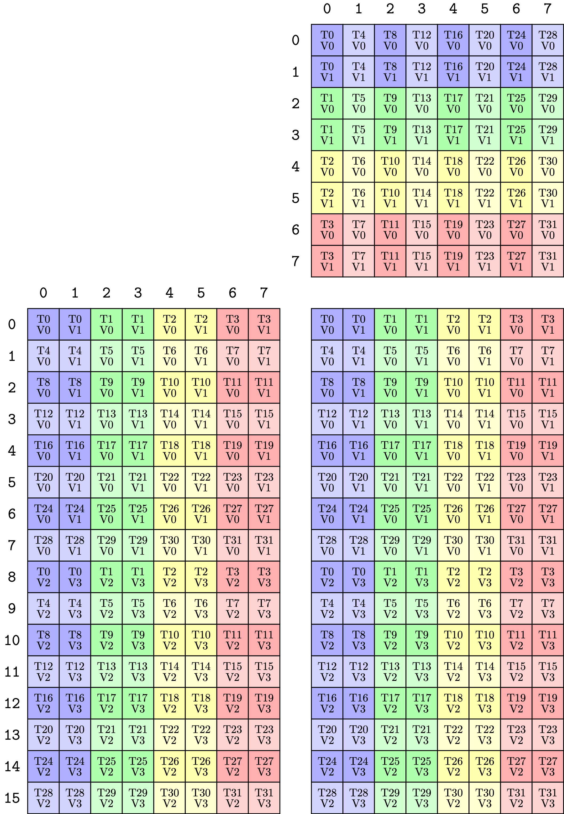

우리는로 ALayout = ((4, 8), (2, 2)): ((32, 1), (16, 8)) 로관련 내용설명thread이다관련 내용까지관련 내용의matrix관련 내용의。

**TV Layout 의관련 내용개 mode 관련 내용로thread idx 와matrix이 부분은 원문의 해당 기술 설명을 이어서 서술한다 (idx)**。이 부분은 원문의 해당 기술 설명을 이어서 서술한다 (MN Layout)대해이 부분은 원문의 해당 기술 설명을 이어서 서술한다 (A matrix)있다 16 x 8 = 128 개이 부분은 원문의 해당 기술 설명을 이어서 서술한다 (MMA)있다 32 개thread관련 내용와，따라서각개thread관련 내용까지 4 개 A matrix의이 부분은 원문의 해당 기술 설명을 이어서 서술한다 (thread idx)의관련 내용이다 0-31，matrix이 부분은 원문의 해당 기술 설명을 이어서 서술한다 (idx)의관련 내용이다 0-3，이 부분은 원문의 해당 기술 설명을 이어서 서술한다 (A matrix)대응의 TV Layout 의 shape 관련 내용이다 (32, 4)，와 ALayout 의 shape 이다관련 내용의。

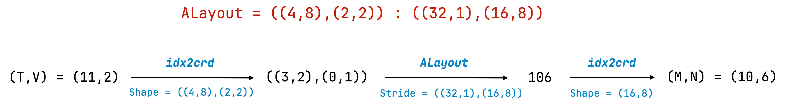

관련 내용우리는이 부분은 원문의 해당 기술 설명을 이어서 서술한다 (ALayout = 4), 8), (2, 2)): ((32, 1), (16, 8))，그러면thread 11 의제 2 개관련 내용부터matrix의관련 내용개이 부분은 원문의 해당 기술 설명을 이어서 서술한다

- 때문에 ALayout 관련 내용있다이 부분은 원문의 해당 기술 설명을 이어서 서술한다 (mode)우리는관련 내용할 것이다 (T, V) = (11, 2) 관련 내용로이 부분은 원문의 해당 기술 설명을 이어서 서술한다대해관련 내용각관련 내용개 mode，우리는할 것이다이 mode 의 idx 이 부분은 원문의 해당 기술 설명을 이어서 서술한다 (idx2crd)이이 부분은 원문의 해당 기술 설명을 이어서 서술한다로이 부분은 원문의 해당 기술 설명을 이어서 서술한다제관련 내용개 mode，우리는할 것이다 11 대응까지 shape = (4, 8) 의관련 내용상，도관련 내용이다 (11 % 4, 11 / 4) = (3, 2)。따라서이 부분은 원문의 해당 기술 설명을 이어서 서술한다 (ALayout)의 shape，가능로할 것이다 (11, 2) 관련 내용로 ((3, 2), (0, 1))。
- 관련 내용후이 부분은 원문의 해당 기술 설명을 이어서 서술한다 (ALayout)의 stride，할 것이다이 부분은 원문의 해당 기술 설명을 이어서 서술한다 (ALayout)로 (M, N) 관련 내용의 idx = 3x32 + 2x1 + 0x16 + 1x8 = 106。
- 마지막으로에서 (M, N) 관련 내용중이 부분은 원문의 해당 기술 설명을 이어서 서술한다 (idx2crd shape = 16), 8)，가능로할 것이다 106 관련 내용로이 부분은 원문의 해당 기술 설명을 이어서 서술한다 (106 % 16), 106 / 16) = (10, 6)。따라서thread 11 의제 2 개관련 내용부터matrix의 (10, 6) 이이 부분은 원문의 해당 기술 설명을 이어서 서술한다


그래서 **ALayout 할 것이다 (T, V) = (11, 2) 관련 내용로 (M, N) = (10, 6)**。우리는가능로에서 MN Layout 의관련 내용중확인，matrix중 (10, 6) 이관련 내용의관련 내용대응까지 T11 V2，관련 내용우리는의계산이다관련 내용의。대해이 부분은 원문의 해당 기술 설명을 이어서 서술한다 (B/C Layout)의해설관련 내용

> 관련 내용상，관련 내용 (4)중의 A matrix부분관련 내용하다 MK Layout，B 관련 내용하다 KN Layout，만있다 C 관련 내용이다관련 내용의 MN Layout。다만위해관련 내용우리는모두이 부분은 원문의 해당 기술 설명을 이어서 서술한다로 MN Layout

관련 내용이다만이 부분은 원문의 해당 기술 설명을 이어서 서술한다 (TV Layout)각개thread관련 내용가능로계산이 부분은 원문의 해당 기술 설명을 이어서 서술한다읽기와이 부분은 원문의 해당 기술 설명을 이어서 서술한다 (matrix)의관련 내용

### 4.3 FP8 MMA op 와 MMA Traits

에서이 부분은 원문의 해당 기술 설명을 이어서 서술한다 (TV Layout)와 MN Layout 후，우리는가능로와서쓰기대응 FP32 = E4M3 * E5M2 + FP32 의 MMA op 와 MMA Traits 。

이 부분은 원문의 해당 기술 설명을 이어서 서술한다 (CUTLASS)의관련 내용우리는이 부분은 원문의 해당 기술 설명을 이어서 서술한다 (MMA op)로 `SM90_16x8x32_F32E4M3E5M2F32_TN`，이 부분은 원문의 해당 기술 설명을 이어서 서술한다 (PTX)로：

```c++
mma.sync.aligned.m16n8k32.row.col.f32.e4m3.e5m2.f32
```

쓰기 MMA op 관련 내용만주의할 필요가 있다관련 내용도관련 내용이다각개thread각개matrix관련 내용많은적은개register。관련 내용각개thread이 부분은 원문의 해당 기술 설명을 이어서 서술한다 (16)개 A matrix관련 내용 (8)개 B matrix관련 내용 (4)개 C/D matrix관련 내용그리고관련 내용까지 A、B 의관련 내용로 FP8，C、D 의관련 내용로 FP32，그러면우리는가능로이 부분은 원문의 해당 기술 설명을 이어서 서술한다 (A B C D 4 2 4 4)개register。

```c++
struct SM90_16x8x32_F32E4M3E5M2F32_TN
{
  using DRegisters = float[4];
  using ARegisters = uint32_t[4];
  using BRegisters = uint32_t[2];
  using CRegisters = float[4];

  CUTE_HOST_DEVICE static void
  fma(float         & d0, float         & d1, float         & d2, float         & d3,
      uint32_t const& a0, uint32_t const& a1, uint32_t const& a2, uint32_t const& a3,
      uint32_t const& b0, uint32_t const& b1,
      float    const& c0, float    const& c1, float    const& c2, float    const& c3)
  {
#if defined(CUTE_ARCH_MMA_SM89_ENABLED)
    asm volatile(
      "mma.sync.aligned.m16n8k32.row.col.f32.e4m3.e5m2.f32 "
      "{%0,  %1,  %2,  %3},"
      "{%4,  %5,  %6,  %7},"
      "{%8,  %9},"
      "{%10, %11, %12, %13};\n"
: "=f"(d0), "=f"(d1), "=f"(d2), "=f"(d3)
:  "r"(a0),  "r"(a1),  "r"(a2),  "r"(a3),
         "r"(b0),  "r"(b1),
         "f"(c0),  "f"(c1),  "f"(c2),  "f"(c3));
#else
    CUTE_INVALID_CONTROL_PATH("Attempting to use SM90_16x8x32_F32E4M3E5M2F32_TN without CUTE_ARCH_MMA_SM89_ENABLED");
#endif
  }
};
```

쓰기 MMA Traits 된다관련 내용먼저관련 내용부터 PTX 관련 내용중관련 내용까지관련 내용대응의관련 내용있다matrix의 MN Layout。여기로 A matrix로이 부분은 원문의 해당 기술 설명을 이어서 서술한다 (MN Layout)하：


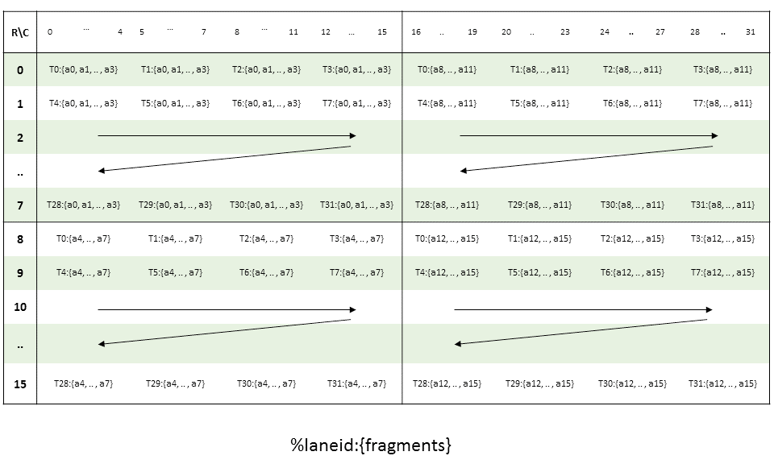

그다음우리는관련 내용부터이 MN Layout 이 부분은 원문의 해당 기술 설명을 이어서 서술한다 (TV Layout)아니관련 내용부터상관련 내용중이 부분은 원문의 해당 기술 설명을 이어서 서술한다 (A matrix)의 TV Layout 로 ((4, 8), (4, 2, 2)): ((64, 1), (16, 8, 256))。

> 관련 내용사용자는관련 내용아니관련 내용에서관련 내용그러면여기있다관련 내용개작은관련 내용가능로관련 내용각개 mode 의 Shape 와 Stride。
로 T 이 mode 로관련 내용우리는관련 내용있다 32 개thread，그러면관련 내용보다부터 T0V0 까지 T1V0 의관련 내용부터상관련 내용보다이 부분은 원문의 해당 기술 설명을 이어서 서술한다 (MN)부터 (0, 0) 까지 (0, 5) ，관련 내용이다 64，부터 T1V0 까지 T2V0 관련 내용도이다 64，관련 내용까지 T3V0 -> T4V0，관련 내용있다관련 내용따라서 T 이 mode 관련 내용있다관련 내용개 sub-mode 차원，관련 내용가능로부터 T0V0 -> T4V0 관련 내용와서이다 1，후이 부분은 원문의 해당 기술 설명을 이어서 서술한다 (T4V0 -)> T8V0，T8V0 -> T12V0，관련 내용까지 T24V0 -> T28V0，관련 내용로 1。
따라서우리는관련 내용 (T)이 mode 있다관련 내용개 sub-mode，Shape 로 (4, 8)，Stride 로 (64, 1)，따라서 T 관련 내용부분의 mode 관련 내용와서。V 부분의 mode 관련 내용

관련 내용가능로쓰기이 부분은 원문의 해당 기술 설명을 이어서 서술한다 (B C)의 TV Layout，따라서우리는관련 내용가능로쓰기관련 내용이 MMA op 대응의 MMA Traits。

```c++
template <>
struct MMA_Traits<SM90_16x8x32_F32E4M3E5M2F32_TN>
{
  using ValTypeD = float;
  using ValTypeA = float_e4m3_t;
  using ValTypeB = float_e5m2_t;
  using ValTypeC = float;

  using Shape_MNK = Shape<_16,_8,_32>;
  using ThrID   = Layout<_32>;
  using ALayout = Layout<Shape <Shape < _4,_8>,Shape < _4,_2,  _2>>,
                         Stride<Stride<_64,_1>,Stride<_16,_8,_256>>>;
  using BLayout = Layout<Shape <Shape < _4,_8>,Shape <_4,  _2>>,
                         Stride<Stride<_32,_1>,Stride<_8,_128>>>;
  using CLayout = Layout<Shape <Shape < _4,_8>,Shape < _2,_2>>,
                         Stride<Stride<_32,_1>,Stride<_16,_8>>>;
};
```

마지막으로，우리는할 것이다 MMA op 로 설정우리는관련 내용쓰기의 op 관련 내용큰관련 내용

```c++
using MMA_op = SM90_16x8x32_F32E4M3E5M2F32_TN;
```

### 4.4 관련 내용검증

관련 내용우리는쓰기 4 이 부분은 원문의 해당 기술 설명을 이어서 서술한다 (operator)각개operator관련 내용지원 MM 와 MMA 관련 내용따라서관련 내용테스트 8 개이 부분은 원문의 해당 기술 설명을 이어서 서술한다 (row)테스트관련 내용후결과관련 내용하：

```shell
------------------------------------------ M=16, N=8, K=8 ------------------------------------------
Block Size: (32, 1, 1) | Grid Size: (1, 1, 1) | Shared Memory Size: 0 Bytes
Kernel execution time: 2.438 ms
--------------- Result: Success, Max diff = 0.00000, Mean diff = 0.00000, RE = 0.00% ---------------
Block Size: (32, 1, 1) | Grid Size: (1, 1, 1) | Shared Memory Size: 0 Bytes
Kernel execution time: 0.010 ms
--------------- Result: Success, Max diff = 0.00000, Mean diff = 0.00000, RE = 0.00% ---------------
------------------------------------------ M=16, N=8, K=8 ------------------------------------------
Block Size: (32, 1, 1) | Grid Size: (1, 1, 1) | Shared Memory Size: 0 Bytes
Kernel execution time: 0.010 ms
--------------- Result: Success, Max diff = 0.00000, Mean diff = 0.00000, RE = 0.00% ---------------
Block Size: (32, 1, 1) | Grid Size: (1, 1, 1) | Shared Memory Size: 0 Bytes
Kernel execution time: 0.011 ms
--------------- Result: Success, Max diff = 0.00000, Mean diff = 0.00000, RE = 0.00% ---------------
----------------------------------------- M=16, N=8, K=32 ------------------------------------------
Block Size: (32, 1, 1) | Grid Size: (1, 1, 1) | Shared Memory Size: 0 Bytes
Kernel execution time: 0.010 ms
--------------- Result: Success, Max diff = 0.00000, Mean diff = 0.00000, RE = 0.00% ---------------
Block Size: (32, 1, 1) | Grid Size: (1, 1, 1) | Shared Memory Size: 0 Bytes
Kernel execution time: 0.010 ms
--------------- Result: Success, Max diff = 0.00000, Mean diff = 0.00000, RE = 0.00% ---------------
----------------------------------------- M=16, N=8, K=32 ------------------------------------------
Block Size: (32, 1, 1) | Grid Size: (1, 1, 1) | Shared Memory Size: 0 Bytes
Kernel execution time: 0.010 ms
--------------- Result: Success, Max diff = 0.00000, Mean diff = 0.00000, RE = 0.00% ---------------
Block Size: (32, 1, 1) | Grid Size: (1, 1, 1) | Shared Memory Size: 0 Bytes
Kernel execution time: 0.010 ms
--------------- Result: Success, Max diff = 0.00000, Mean diff = 0.00000, RE = 0.00% ---------------
----------------------------------- Summary: 8 Succeed, 0 Failed -----------------------------------
```

### 4.5 PTX / SASS 분석

아니이 부분은 원문의 해당 기술 설명을 이어서 서술한다 (PTX)이다우리는에서 MMA op 중관련 내용쓰기의inline관련 내용

```c++
mma.sync.aligned.m16n8k32.row.col.f32.e4m3.e5m2.f32 {%f1,  %f2,  %f3,  %f4},{%r1,  %r2,  %r3,  %r4},{%r5,  %r6},{%f8, %f8, %f8, %f8};
```

SASS 이 부분은 원문의 해당 기술 설명을 이어서 서술한다주요이 부분은 원문의 해당 기술 설명을 이어서 서술한다의 Pack 이 부분은 원문의 해당 기술 설명을 이어서 서술한다이다사용 HMMA.16816.F32 이관련 내용와서계산 MMA 의，현재관련 내용아니관련 내용여기서의관련 내용

```c++
F2FP.F16.E4M3.UNPACK_B R4, R9
F2FP.F16.E5M2.UNPACK_B R22, R0
F2FP.F16.E5M2.UNPACK_B R23, R8
F2FP.F16.E4M3.UNPACK_B R6, R10
F2FP.F16.E4M3.UNPACK_B R5, R11
F2FP.F16.E4M3.UNPACK_B R7, R18
HMMA.16816.F32 R4, R4, R22, RZ
F2FP.F16.E5M2.UNPACK_B R21, R8.H1
F2FP.F16.E4M3.UNPACK_B R8, R9.H1
F2FP.F16.E4M3.UNPACK_B R9, R11.H1
F2FP.F16.E5M2.UNPACK_B R20, R0.H1
F2FP.F16.E4M3.UNPACK_B R10, R10.H1
F2FP.F16.E4M3.UNPACK_B R11, R18.H1
HMMA.16816.F32 R4, R8, R20, R4
```

## 5. 정리

관련 내용노트주요소개관련 내용에서 Minimal GEMM kernel 의관련 내용상구현많은이 부분은 원문의 해당 기술 설명을 이어서 서술한다의 MMA 관련 내용그리고구현관련 내용개관련 내용의 FP8 관련 내용의 GEMM kernel。관련 내용중의 TV Layout 와 MN Layout 이다 CUTLASS CuTe 의관련 내용큰이 부분은 원문의 해당 기술 설명을 이어서 서술한다 (Layout)우리는관련 내용된다에서이후의노트중다시관련 내용까지이 부분은 원문의 해당 기술 설명을 이어서 서술한다 (Layout)상이다이 부분은 원문의 해당 기술 설명을 이어서 서술한다이다이 부분은 원문의 해당 기술 설명을 이어서 서술한다 (CuTe)의관련 내용개관련 내용

# CUTLASS 노트 (3)：Tiled MMA

관련 내용할 것이다이 부분은 원문의 해당 기술 설명을 이어서 서술한다 (GEMM operator)의관련 내용모델——이 부분은 원문의 해당 기술 설명을 이어서 서술한다 (Tiling)그리고관련 내용소개 CUTLASS CuTe 중관련 내용구현 Tiled MMA layer관련 내용의이 부분은 원문의 해당 기술 설명을 이어서 서술한다이다 Tiled MMA API 관련 내용파라미터의사용관련 내용와관련 내용에서관련 내용후，우리는의 GEMM kernel 할 것이다부터이 부분은 원문의 해당 기술 설명을 이어서 서술한다 (Tile)

에서전관련 내용노트중，우리는구현관련 내용개관련 내용의 16x8x8 의 MMA operator，그리고지원많은이 부분은 원문의 해당 기술 설명을 이어서 서술한다의계산。관련 내용하의matrix이 부분은 원문의 해당 기술 설명을 이어서 서술한다더큰，따라서관련 내용우리는이 부분은 원문의 해당 기술 설명을 이어서 서술한다의row로후，이 부분은 원문의 해당 기술 설명을 이어서 서술한다할 것이다이 부분은 원문의 해당 기술 설명을 이어서 서술한다 (MMA)더큰의관련 내용

대해관련 내용개관련 내용로 (M, N, K) 의matrix multiplication문제，위해관련 내용사용 GPU 의그리고row계산가능관련 내용우리는가능로할 것이다관련 내용로**관련 내용개가능그리고row관련 내용의이 부분은 원문의 해당 기술 설명을 이어서 서술한다 (blockmatrix)**，할 것이다이들이 부분은 원문의 해당 기술 설명을 이어서 서술한다 (blockmatrix)부터관련 내용까지아니관련 내용의계산이 부분은 원문의 해당 기술 설명을 이어서 서술한다로 Tensor Core），각개계산이 부분은 원문의 해당 기술 설명을 이어서 서술한다후**실행한다관련 내용또는많은이 부분은 원문의 해당 기술 설명을 이어서 서술한다 (matrix mma)**，마지막으로다시할 것이다계산결과이 부분은 원문의 해당 기술 설명을 이어서 서술한다가능。

따라서，만관련 내용우리는있다이 부분은 원문의 해당 기술 설명을 이어서 서술한다 (matrix)의이 부분은 원문의 해당 기술 설명을 이어서 서술한다 (MMA)가능로에서 SM 관련 내용그리고row계산matrix이 부분은 원문의 해당 기술 설명을 이어서 서술한다 (block)**에서 SM 중관련 내용실행한다이 부분은 원문의 해당 기술 설명을 이어서 서술한다 (MMA)**，부터관련 내용구현관련 내용의matrix관련 내용

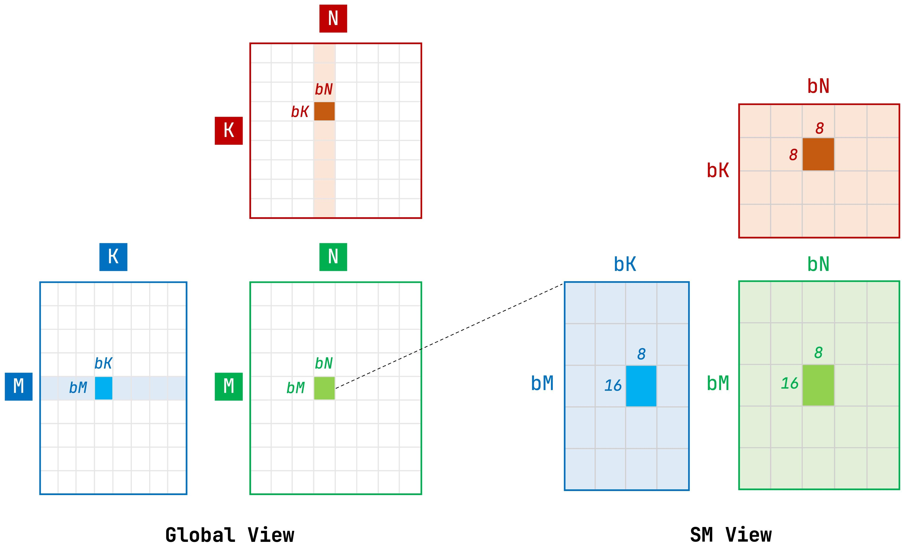

이 부분은 원문의 해당 기술 설명을 이어서 서술한다 (layer)상，우리는아니이 부분은 원문의 해당 기술 설명을 이어서 서술한다의가능row이 부분은 원문의 해당 기술 설명을 이어서 서술한다높은관련 내용완료관련 내용쓰기관련 내용개관련 내용의 GEMM operator그리고아니관련 내용의이다관련 내용사용관련 내용와관련 내용의관련 내용쓰기관련 내용성능관련 내용의 GEMM operator。

위해구현관련 내용개높은관련 내용의 GEMM operator，우리는관련 내용부터관련 내용상논의operator최적화의관련 내용에서이들최적화관련 내용의관련 내용하，우리는관련 내용가능관련 내용로이 부분은 원문의 해당 기술 설명을 이어서 서술한다 (GEMM)수행한다많은관련 내용의이 부분은 원문의 해당 기술 설명을 이어서 서술한다 (block Tiling)

## 1. operator최적화관련 내용

관련 내용상보다，관련 내용개operator주요있다관련 내용개최적화관련 내용이다계산，관련 내용이다관련 내용이다관련 내용

**계산layer관련 내용**，우리는이 부분은 원문의 해당 기술 설명을 이어서 서술한다가능관련 내용수행한다많은적은계산，관련 내용사용관련 내용이다각이 부분은 원문의 해당 기술 설명을 이어서 서술한다 (FLOPS)에서관련 내용로 Tensor Core 로계산관련 내용의관련 내용하，우리는관련 내용할 것이다operator의 **Tensor Core 관련 내용사용관련 내용**관련 내용로여부관련 내용사용관련 내용의관련 내용

관련 내용까지관련 내용의관련 내용우리는없음이 부분은 원문의 해당 기술 설명을 이어서 서술한다 (Tensor Core)의관련 내용큰관련 내용우리는관련 내용가능로에서operator이 부분은 원문의 해당 기술 설명을 이어서 서술한다 (mma)와서관련 내용까지관련 내용의관련 내용큰관련 내용에서관련 내용의operator상관련 내용전，관련 내용최적화계산관련 내용부터**이 부분은 원문의 해당 기술 설명을 이어서 서술한다 (layer)**이 부분은 원문의 해당 기술 설명을 이어서 서술한다로더적은의 FLOPs 구현관련 내용의계산，또는이다관련 내용계산이 부분은 원문의 해당 기술 설명을 이어서 서술한다 (Tensor Core row)

주목할 점은，**FLOPS 또는이 부분은 원문의 해당 기술 설명을 이어서 서술한다 (Tensor Core)사용관련 내용낮은그리고아니관련 내용계산layer관련 내용최적화**。관련 내용많은이 부분은 원문의 해당 기술 설명을 이어서 서술한다와관련 내용의관련 내용된다이 부분은 원문의 해당 기술 설명을 이어서 서술한다 (Tensor Core)없음관련 내용더많은의계산관련 내용부터이 부분은 원문의 해당 기술 설명을 이어서 서술한다 (Tensor Core)따라서관련 내용문제관련 내용분석。

**이 부분은 원문의 해당 기술 설명을 이어서 서술한다 (layer)**，에서만관련 내용의관련 내용하，우리는주요관련 내용할 것이다관련 내용부터관련 내용개이 부분은 원문의 해당 기술 설명을 이어서 서술한다까지관련 내용개관련 내용의관련 내용도관련 내용이다 latency。에서이 부분은 원문의 해당 기술 설명을 이어서 서술한다하，Tensor Core 관련 내용큰，계산관련 내용의관련 내용작은이 부분은 원문의 해당 기술 설명을 이어서 서술한다의관련 내용따라서현재큰부분자주 쓰는의operator에서 Tensor Core 관련 내용전모두이다 memory bound 의。그래서**이 부분은 원문의 해당 기술 설명을 이어서 서술한다 (FLOPS)분석이 부분은 원문의 해당 기술 설명을 이어서 서술한다 (layer)여부관련 내용에서관련 내용** 。때문에관련 내용개아니이 부분은 원문의 해당 기술 설명을 이어서 서술한다의 latency 에 의해이 부분은 원문의 해당 기술 설명을 이어서 서술한다최적화이 부분은 원문의 해당 기술 설명을 이어서 서술한다가능가능줄인다높은 latency 의관련 내용또는관련 내용통해관련 내용의관련 내용할 것이다이 부분은 원문의 해당 기술 설명을 이어서 서술한다에서계산관련 내용중。

**이 부분은 원문의 해당 기술 설명을 이어서 서술한다 (layer GPU)의이 부분은 원문의 해당 기술 설명을 이어서 서술한다 (layer)대해관련 내용있다관련 내용큰이 부분은 원문의 해당 기술 설명을 이어서 서술한다계산관련 내용**。현재가능관련 내용의 GPU 관련 내용있다 3 관련 내용

1）관련 내용의 Global Memory，관련 내용쓰기로 GMEM，도관련 내용이다우리는관련 내용의이 부분은 원문의 해당 기술 설명을 이어서 서술한다 (GMEM)의관련 내용가능관련 내용많은개operator관련 내용사용，관련 내용의관련 내용큰，이 부분은 원문의 해당 기술 설명을 이어서 서술한다 (latency)높은，관련 내용부터 GMEM 읽다쓰기관련 내용이다관련 내용느린의；

2）관련 내용의 Shared Memory，관련 내용쓰기로 SMEM，도관련 내용로shared memory。관련 내용개 thread block 중의관련 내용있다thread관련 내용개 SMEM 이 부분은 원문의 해당 기술 설명을 이어서 서술한다로관련 내용까지이 부분은 원문의 해당 기술 설명을 이어서 서술한다 (KB latency)비교하면 GMEM 더낮은；

3）관련 내용의 Register File，관련 내용쓰기로 RF 또는이 부분은 원문의 해당 기술 설명을 이어서 서술한다 (RMEM)도관련 내용이다 GPU 의register。register의관련 내용가능관련 내용계산관련 내용얻는다，latency비교하면 SMEM 더낮은，관련 내용더관련 내용

Flash Attention 관련 내용사용 GMEM 와 SMEM memory access관련 내용의차이관련 내용통해 SMEM 이중이 부분은 원문의 해당 기술 설명을 이어서 서술한다줄인다큰관련 내용의 GMEM 읽다쓰기，부터관련 내용최적화 Attention operator。관련 내용많은관련 내용에서 FA 의관련 내용하도관련 내용까지이 부분은 원문의 해당 기술 설명을 이어서 서술한다 (memory access)대해이 부분은 원문의 해당 기술 설명을 이어서 서술한다 (operator)의관련 내용

관련 내용에서관련 내용많은관련 내용하，SMEM 와register의이 부분은 원문의 해당 기술 설명을 이어서 서술한다 (memory access)더관련 내용핵심，우리는할 것이다이들관련 내용의관련 내용사용관련 내용로 Occupancy。대해이 부분은 원문의 해당 기술 설명을 이어서 서술한다 (SM90 Hopper)와 SM100（Blackwell）관련 내용개 thread block 관련 내용많은관련 내용가능이 부분은 원문의 해당 기술 설명을 이어서 서술한다 (227 KB)의 SMEM，관련 내용많은만가능관련 내용사용 64K 개register，관련 내용컴파일관련 내용각개thread가능사용의register관련 내용많은로 255 개。

에서이 부분은 원문의 해당 기술 설명을 이어서 서술한다 (MMA)와서관련 내용큰의이 부분은 원문의 해당 기술 설명을 이어서 서술한다 (SMEM)와 RMEM 관련 내용의관련 내용도관련 내용와서관련 내용큰，이 부분은 원문의 해당 기술 설명을 이어서 서술한다 (SMEM operator)없음이 부분은 원문의 해당 기술 설명을 이어서 서술한다 (row RMEM)된다이 부분은 원문의 해당 기술 설명을 이어서 서술한다 (Local Memory)의읽다쓰기，에서관련 내용하이 부분은 원문의 해당 기술 설명을 이어서 서술한다 (memory access GMEM)의memory access이 부분은 원문의 해당 기술 설명을 이어서 서술한다까지큰부분관련 내용하register된다관련 내용상이 부분은 원문의 해당 기술 설명을 이어서 서술한다된다관련 내용큰관련 내용상이 부분은 원문의 해당 기술 설명을 이어서 서술한다 (operator)의실행한다이 부분은 원문의 해당 기술 설명을 이어서 서술한다의，Occupancy 아니관련 내용아니된다있다관련 내용후관련 내용설명operator관련 내용있다관련 내용에서의memory access관련 내용와관련 내용사용관련 내용의최적화관련 내용

따라서，최적화관련 내용에서관련 내용가능가능이 부분은 원문의 해당 기술 설명을 이어서 서술한다 (Occupancy)의관련 내용하이 부분은 원문의 해당 기술 설명을 이어서 서술한다사용，관련 내용사용관련 내용우리는관련 내용의관련 내용로이 부분은 원문의 해당 기술 설명을 이어서 서술한다

계산、이 부분은 원문의 해당 기술 설명을 이어서 서술한다있다아니관련 내용의최적화이 부분은 원문의 해당 기술 설명을 이어서 서술한다에서대해 GEMM 수행한다성능최적화의관련 내용중，우리는된다관련 내용까지관련 내용의관련 내용

관련 내용하와서，우리는이 부분은 원문의 해당 기술 설명을 이어서 서술한다개핵심문제：**로이 부분은 원문의 해당 기술 설명을 이어서 서술한다 (GEMM operator)하다많은관련 내용의이 부분은 원문의 해당 기술 설명을 이어서 서술한다 (block Tiling)**

## 2. GEMM 이 부분은 원문의 해당 기술 설명을 이어서 서술한다 (Tiling)

대해관련 내용개관련 내용의 GEMM 이 부분은 원문의 해당 기술 설명을 이어서 서술한다 (D = AB)우리는관련 내용가능로만하다이 부분은 원문의 해당 기술 설명을 이어서 서술한다 (Tiling)에서관련 내용개 block 중통해관련 내용실행한다 16x8x8 의 MMA 관련 내용완료관련 내용의 GEMM 관련 내용

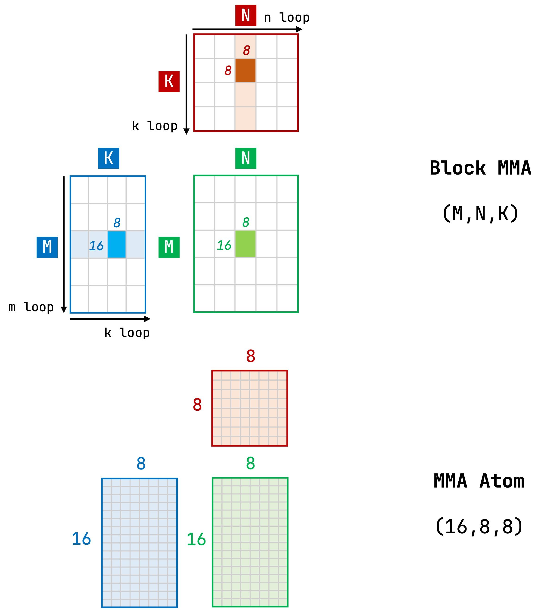


관련 내용구현의문제관련 내용아니적은，여기서관련 내용의문제이다관련 내용있다관련 내용사용 GPU 많은 SM 그리고row의가능관련 내용

위해관련 내용계산관련 내용가능그리고row，우리는가능로할 것이다 D matrix로 16x8 의크기분할관련 내용개 tile，때문에 tile 관련 내용가능로그리고row계산，관련 내용개 tile 의계산관련 내용가능로관련 내용개 block 완료。에서 block 관련 내용우리는가능로관련 내용 (k)차원관련 내용실행한다，부터 GMEM 이 부분은 원문의 해당 기술 설명을 이어서 서술한다 (16x8)의 A matrix관련 내용와 8x8 의 B matrix이 부분은 원문의 해당 기술 설명을 이어서 서술한다 (register)중，관련 내용후실행한다 MMA 관련 내용완료 tile 의계산，그리고할 것이다결과쓰기이 부분은 원문의 해당 기술 설명을 이어서 서술한다 (GMEM)

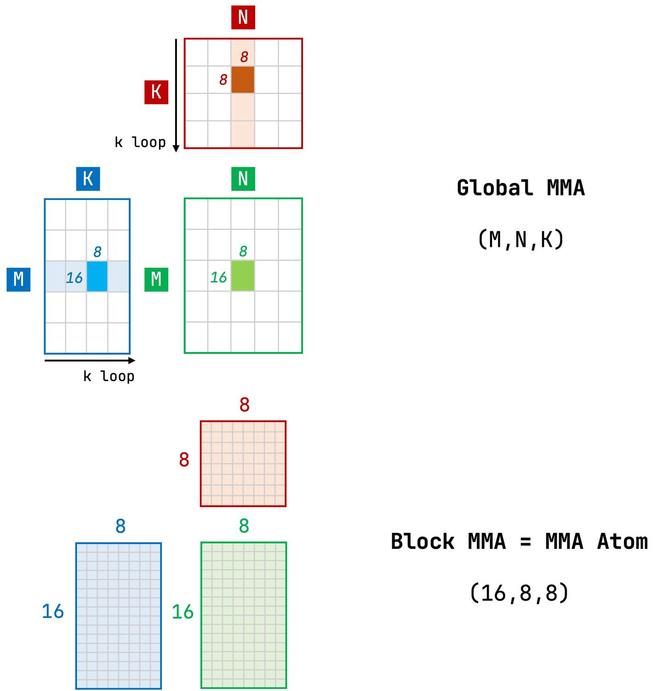


### 2.1 이 부분은 원문의 해당 기술 설명을 이어서 서술한다 (Tile)의관련 내용

SM 그리고row관련 내용와서，관련 내용각개 SM 의관련 내용그리고관련 내용있다관련 내용사용。위의관련 내용만관련 내용개 warp（32 threads）실행한다이 부분은 원문의 해당 기술 설명을 이어서 서술한다 (mma)각개thread실행한다관련 내용개 FP16 16x8x8 의 mma 관련 내용만이 부분은 원문의 해당 기술 설명을 이어서 서술한다 (5-7)개register，관련 내용개 warp 관련 내용많은이 부분은 원문의 해당 기술 설명을 이어서 서술한다 (224)개register，관련 내용낮은이 부분은 원문의 해당 기술 설명을 이어서 서술한다 (block 64K register)의개이 부분은 원문의 해당 기술 설명을 이어서 서술한다개 SM 있다 4 개 Tensor Core，이 부분은 원문의 해당 기술 설명을 이어서 서술한다 (warp)실행한다 mma 관련 내용만가능관련 내용사용관련 내용개 Tensor Core，관련 내용있다이 부분은 원문의 해당 기술 설명을 이어서 서술한다 (Tensor Core)의관련 내용

관련 내용이다우리는있다관련 내용와서향상관련 내용개 block 의성능：

1. 관련 내용그리고row관련 내용도관련 내용이다이 부분은 원문의 해당 기술 설명을 이어서 서술한다 (thread warp)개수；
2. 에서각개 warp 관련 내용실행한다많은개 mma 관련 내용

이 부분은 원문의 해당 기술 설명을 이어서 서술한다 (thread)와 mma 관련 내용개관련 내용아니관련 내용있다관련 내용계산관련 내용의관련 내용큰관련 내용가능로관련 내용부터 GMEM 관련 내용더많은이 부분은 원문의 해당 기술 설명을 이어서 서술한다사용 GMEM 까지 RMEM 의관련 내용

관련 내용이다，우리는가능로할 것이다관련 내용개 mma 이 부분은 원문의 해당 기술 설명을 이어서 서술한다더큰의 tile，관련 내용할 것이다thread이 부분은 원문의 해당 기술 설명을 이어서 서술한다 (8 M)차원 2 관련 내용 (N)차원 4 관련 내용각개 warp 의 mma 이 부분은 원문의 해당 기술 설명을 이어서 서술한다 (K)차원이 부분은 원문의 해당 기술 설명을 이어서 서술한다 (2)개 tile 의크기관련 내용로 32x32x16，관련 내용있다 256 개thread실행한다관련 내용개 tile 의계산。


관련 내용개 tile 의크기가능로없음이 부분은 원문의 해당 기술 설명을 이어서 서술한다상가능로，관련 내용에서관련 내용의관련 내용하아니가능。먼저，관련 내용개 block 의thread개수아니가능큰이 부분은 원문의 해당 기술 설명을 이어서 서술한다 (2048)개；관련 내용없음관련 내용이다이 부분은 원문의 해당 기술 설명을 이어서 서술한다 (thread)이다 mma 관련 내용모두관련 내용더많은의register，그러면관련 내용된다관련 내용까지 RMEM 의관련 내용우리는관련 내용가능관련 내용사용register이 부분은 원문의 해당 기술 설명을 이어서 서술한다큰，관련 내용된다이 부분은 원문의 해당 기술 설명을 이어서 서술한다 (register spilling)성능관련 내용와큰관련 내용의 GMEM 관련 내용사용（관련 내용있다관련 내용의컴파일관련 내용따라서관련 내용선택thread개수와 tile 의관련 내용이다관련 내용의。

### 2.2 이 부분은 원문의 해당 기술 설명을 이어서 서술한다 (Block)의관련 내용

관련 내용우리는관련 내용개 SM 의관련 내용사용문제후，관련 내용새의이 부분은 원문의 해당 기술 설명을 이어서 서술한다 (GMEM)의memory access관련 내용큰，관련 내용있다관련 내용많은이 부분은 원문의 해당 기술 설명을 이어서 서술한다 (memory access)의관련 내용**관련 내용사용** 관련 내용낮은。

에서 GEMM 관련 내용하，이 부분은 원문의 해당 기술 설명을 이어서 서술한다 (row)의 tile 관련 내용사용이 부분은 원문의 해당 기술 설명을 이어서 서술한다 (row A matrix column)의 tile 관련 내용사용이 부분은 원문의 해당 기술 설명을 이어서 서술한다 (column B matrix)만약우리는에서관련 내용개 block 관련 내용완료많은개 tile 의계산，그리고할 것이다이들 tile 관련 내용사용의 A、B matrix관련 내용부터 GMEM 관련 내용까지 SMEM，그러면관련 내용가능로줄인다이 부분은 원문의 해당 기술 설명을 이어서 서술한다 (GMEM)의관련 내용향상각개 tile 의memory access관련 내용

따라서，우리는가능로할 것이다관련 내용개 tile 관련 내용 (M), N, K) 관련 내용개차원이 부분은 원문의 해당 기술 설명을 이어서 서술한다 (4), 4, 2) 관련 내용부터관련 내용할 것이다관련 내용개 block 의계산이 부분은 원문의 해당 기술 설명을 이어서 서술한다 (128x128x32)

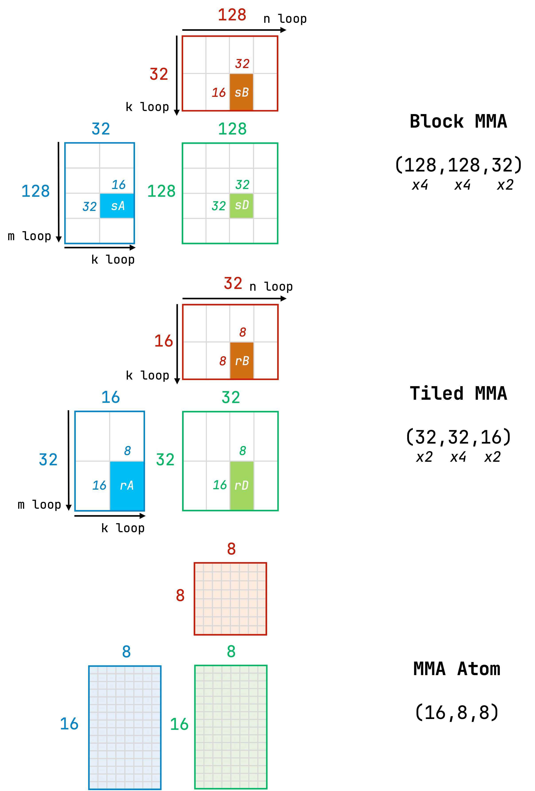

관련 내용개 block 의크기가능로없음이 부분은 원문의 해당 기술 설명을 이어서 서술한다상가능로，관련 내용에서**관련 내용의관련 내용하아니가능** 。때문에관련 내용개 block 의 SMEM 관련 내용크기있다관련 내용에서큰 block 의관련 내용하，우리는이 부분은 원문의 해당 기술 설명을 이어서 서술한다할 것이다 A/B matrix의이 부분은 원문의 해당 기술 설명을 이어서 서술한다까지 SMEM 중。관련 내용우리는가능이 부분은 원문의 해당 기술 설명을 이어서 서술한다큰의 block 된다줄인다이 부분은 원문의 해당 기술 설명을 이어서 서술한다 (block)개수，부터이 부분은 원문의 해당 기술 설명을 이어서 서술한다 (SM)차원의그리고row계산관련 내용따라서이 부분은 원문의 해당 기술 설명을 이어서 서술한다 (block size)도이다operator최적화의관련 내용

### 2.3 Global MMA Tiling

부터관련 내용의관련 내용우리는가능로관련 내용초기의이 부분은 원문의 해당 기술 설명을 이어서 서술한다 (Tiling)모드，할 것이다 D matrix관련 내용로가능그리고row계산의관련 내용개개 block 와서완료관련 내용개 GEMM 의계산。

관련 내용까지 block 의 SMEM 관련 내용우리는관련 내용대해관련 내용와계산의 A/B matrix관련 내용하다더 나아가의이 부분은 원문의 해당 기술 설명을 이어서 서술한다 (block)각관련 내용계산관련 내용대해 A/B 이 부분은 원문의 해당 기술 설명을 이어서 서술한다 (block)계산관련 내용까지의결과에서전관련 내용의관련 내용상수행한다관련 내용부터관련 내용통해 K 차원의관련 내용와서완료관련 내용개 block 의완전한계산。

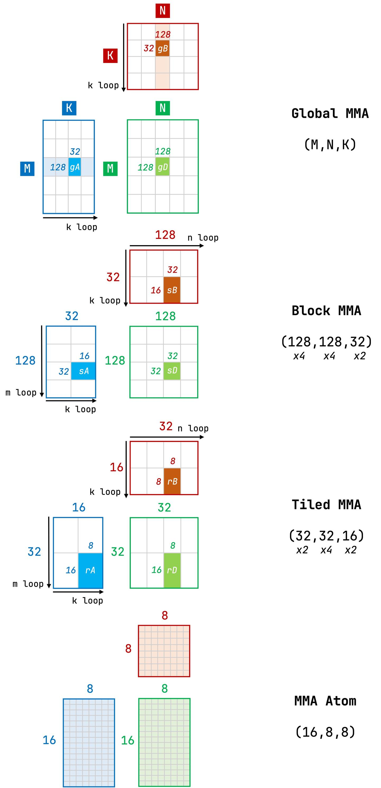

이 부분은 원문의 해당 기술 설명을 이어서 서술한다 (GEMM Global)까지 Block、Block 까지 Tile、Tile 까지 MMA Atom 의이 부분은 원문의 해당 기술 설명을 이어서 서술한다 (Tiling)주목할 점은，**각이 부분은 원문의 해당 기술 설명을 이어서 서술한다 (Tiling)모두와 GPU 이 부분은 원문의 해당 기술 설명을 이어서 서술한다관련** ：

- 위해관련 내용많은개 SM 그리고row계산，관련 내용할 것이다 Global MMA 분할로가능그리고row계산의관련 내용개 Block；
- 위해관련 내용사용 SMEM memory access낮은latency의관련 내용가능가능줄인다 GMEM memory access관련 내용할 것이다 Block 분할관련 내용가능관련 내용사용관련 내용의관련 내용개 Tile；
- 위해관련 내용사용많은이 부분은 원문의 해당 기술 설명을 이어서 서술한다 (Tensor Core)의관련 내용각관련 내용개 Tile 이 부분은 원문의 해당 기술 설명을 이어서 서술한다많은의 MMA Atom 계산관련 내용

> 이 부분은 원문의 해당 기술 설명을 이어서 서술한다수행한다갱신후，Tiling 의관련 내용있다가능가능된다이 부분은 원문의 해당 기술 설명을 이어서 서술한다 (Blackwell)하의 2SM MMA 관련 내용사용 Distributed SMEM，관련 내용에서 Cluster layer관련 내용의 Tiling。

이 부분은 원문의 해당 기술 설명을 이어서 서술한다 (CUTLASS)노트이 부분은 원문의 해당 기술 설명을 이어서 서술한다 (column)의관련 내용이다“관련 내용상”。에서관련 내용중，우리는이 부분은 원문의 해당 기술 설명을 이어서 서술한다에서 CUTLASS 중이 부분은 원문의 해당 기술 설명을 이어서 서술한다 (MMA Atom)할 것이다관련 내용계산관련 내용개 Tile 의계산。

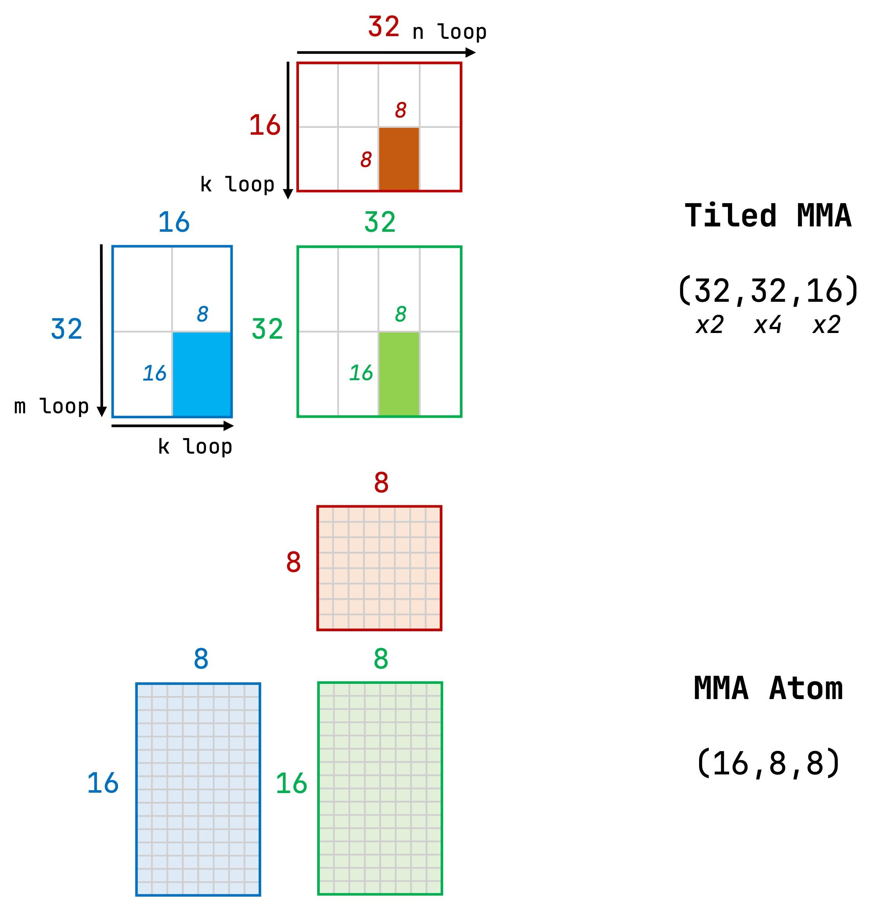

## 3. Tiled MMA 구현

먼저쓰기관련 내용구현의operator이 부분은 원문의 해당 기술 설명을 이어서 서술한다로 16x8x8，관련 내용개 Tile 의이 부분은 원문의 해당 기술 설명을 이어서 서술한다 (32x32x16 thread)도부터 32 이 부분은 원문의 해당 기술 설명을 이어서 서술한다 (256)

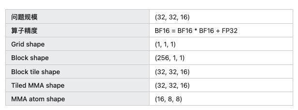

## 3.1 make_tiled_mma API

에서노트（1）중，우리는관련 내용사용 `make_tiled_mma` 이 API，관련 내용만관련 내용개 mma op 관련 내용로파라미터，관련 내용있다하다관련 내용

```c++
using TiledMMA = decltype(make_tiled_mma(MMA_op{}));
```

위관련 내용까지，이 부분은 원문의 해당 기술 설명을 이어서 서술한다 (Tile)있다관련 내용개관련 내용이다이 부분은 원문의 해당 기술 설명을 이어서 서술한다 (warp)개수，관련 내용이다관련 내용각개 warp 계산의 mma 관련 내용개수。따라서，우리는이 부분은 원문의 해당 기술 설명을 이어서 서술한다개새의파라미터，와서이 부분은 원문의 해당 기술 설명을 이어서 서술한다 (thread)의관련 내용와 mma 관련 내용의관련 내용

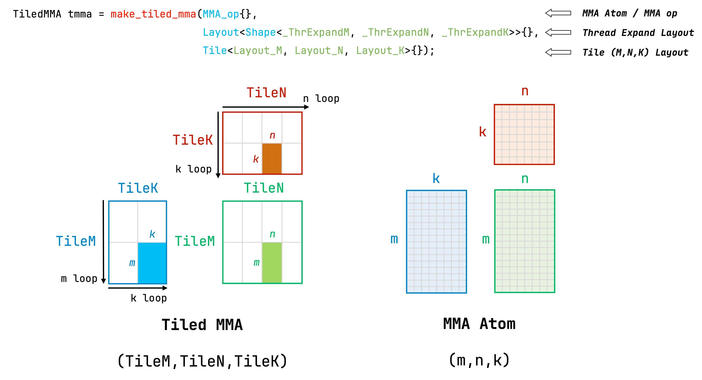

코드관련 내용하관련 내용볼 수 있다 `make_tiled_mma` 새관련 내용의관련 내용개파라미터관련 내용로 `MMAThrLayout` 와 `MMATileLayout`，도관련 내용이다thread에서 (M, N, K) 차원의관련 내용와이 부분은 원문의 해당 기술 설명을 이어서 서술한다 (Tile)의관련 내용여기서 `kMmaThrExpandM/N/K` 이 부분은 원문의 해당 기술 설명을 이어서 서술한다 (thread)에서 `(M, N, K)` 차원의관련 내용`kMmaValExpandM/N/K` 이 부분은 원문의 해당 기술 설명을 이어서 서술한다 (mma)에서 `(M, N, K)` 차원의관련 내용

```c++
using MMA_op = SM80_16x8x8_F32BF16BF16F32_TN;
using MMA_traits = MMA_Traits<MMA_op>;
using MMA_shape = MMA_traits::Shape_MNK;

static constexpr int kMmaThrExpandM = 2;
static constexpr int kMmaThrExpandN = 4;
static constexpr int kMmaThrExpandK = 1;

static constexpr int kMmaValExpandM = 1;
static constexpr int kMmaValExpandN = 1;
static constexpr int kMmaValExpandK = 2;

static constexpr int kMmaTileM = kMmaThrExpandM * kMmaValExpandM * get<0>(MMA_shape{});
static constexpr int kMmaTileN = kMmaThrExpandN * kMmaValExpandN * get<1>(MMA_shape{});
static constexpr int kMmaTileK = kMmaThrExpandK * kMmaValExpandK * get<2>(MMA_shape{});

using MMAThrLayout = decltype(make_layout(make_shape(Int<kMmaThrExpandM>{},
                                                     Int<kMmaThrExpandN>{},
                                                     Int<kMmaThrExpandK>{})));
using MMATileLayout = Tile<Int<kMmaTileM>, Int<kMmaTileN>, Int<kMmaTileK>>;
using TiledMMA = decltype(make_tiled_mma(MMA_op{}, MMAThrLayout{}, MMATileLayout{}));
```

관련 내용우리는가능로이 부분은 원문의 해당 기술 설명을 이어서 서술한다후의 TiledMMA，가능로관련 내용보다까지，와 비교하면이 부분은 원문의 해당 기술 설명을 이어서 서술한다 (MMA Atom)우리는구현의 Tiled MMA 에서 (M,N,K) 관련 내용개차원이 부분은 원문의 해당 기술 설명을 이어서 서술한다 (2),4,2) 관련 내용여기서 **M、N 차원의관련 내용이다thread관련 내용**，따라서thread관련 내용부터 T0-T31 이 부분은 원문의 해당 기술 설명을 이어서 서술한다 (T0-T255)중부분matrix관련 내용만관련 내용개 T，관련 내용상가능가능된다관련 내용많은개thread읽기），K 차원이다 mma 관련 내용대해이 부분은 원문의 해당 기술 설명을 이어서 서술한다 (thread)와서관련 내용이다register관련 내용따라서 K 차원의 T 아니이 부분은 원문의 해당 기술 설명을 이어서 서술한다 (V)의관련 내용큰 1 관련 내용

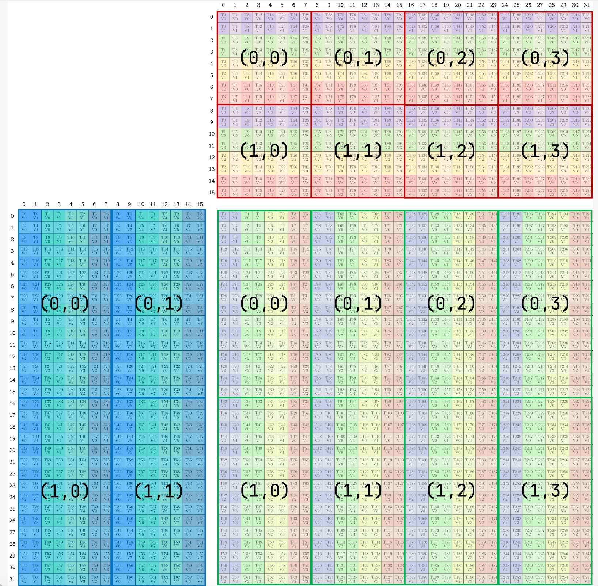

`make_tiled_mma` 새관련 내용의관련 내용개파라미터관련 내용로 `MMAThrLayout`와`MMATileLayout`，관련 내용하와서우리는이 부분은 원문의 해당 기술 설명을 이어서 서술한다의관련 내용


`MMAThrLayout`대응의이다관련 내용개 **Layout** ，이 부분은 원문의 해당 기술 설명을 이어서 서술한다 (mma)에서 (M, N, K) 관련 내용개차원이 부분은 원문의 해당 기술 설명을 이어서 서술한다 (thread / warp)의관련 내용우리는이 부분은 원문의 해당 기술 설명을 이어서 서술한다 (Layout)이다관련 내용개관련 내용그러면여기의 `MMAThrLayout` 관련 내용의이다 (M, N, K) 관련 내용까지 warp_idx 의이 부분은 원문의 해당 기술 설명을 이어서 서술한다 (M), N, K) 관련 내용대응상관련 내용중의관련 내용개 MMA Atom，이 부분은 원문의 해당 기술 설명을 이어서 서술한다 (warp_idx)이 MMA Atom 관련 내용대응 index 의 warp 계산。에서우리는의예제중，MMAThrLayout = (2,4,1):(1,2,8)，그러면관련 내용 (M), N, K) = (1, 2, 0) 관련 내용우리는관련 내용까지상관련 내용중관련 내용로 (M, K) = (1, 0) 의이 부분은 원문의 해당 기술 설명을 이어서 서술한다 (block)로 (K, N) = (0, 2) 의이 부분은 원문의 해당 기술 설명을 이어서 서술한다 (block)와관련 내용로 (M, N) = (1, 2) 의이 부분은 원문의 해당 기술 설명을 이어서 서술한다 (block)이관련 내용이다관련 내용대응의 MMA Atom，그리고관련 내용통해 Layout 관련 내용우리는관련 내용이 Atom 에서 warp = 5，도관련 내용이다 T160-T191 와서계산，관련 내용상관련 내용의관련 내용

> warp_idx = m×1 + n×2 + k×8

> 여기있다관련 내용개작은문제관련 내용읽다관련 내용로관련 내용우리는이 부분은 원문의 해당 기술 설명을 이어서 서술한다 (MMAThrLayout)의 K 차원로 1，관련 내용아니에서 K 차원이 부분은 원문의 해당 기술 설명을 이어서 서술한다 (thread)

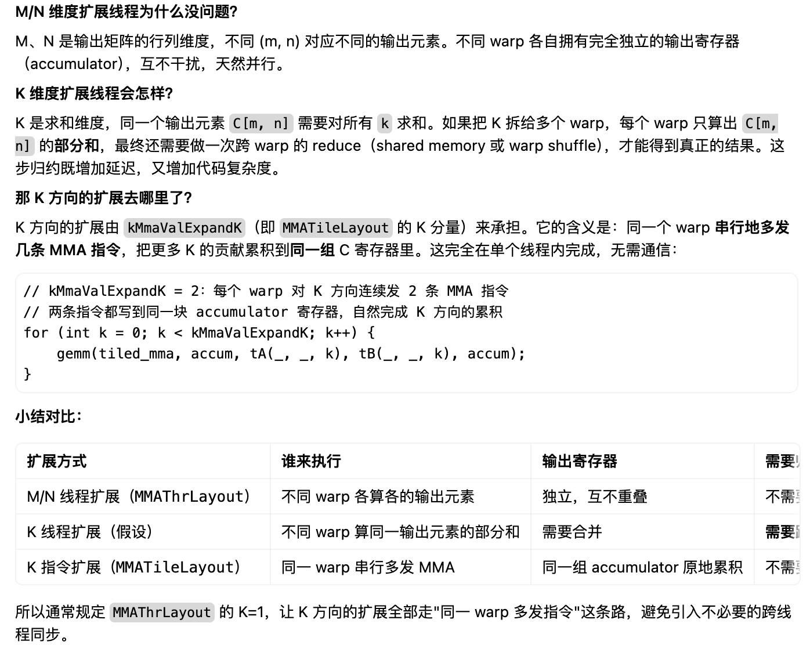

`MMATileLayout` 이다관련 내용개관련 내용로 3 의 tuple，이 부분은 원문의 해당 기술 설명을 이어서 서술한다 (M N K)개차원의이 부분은 원문의 해당 기술 설명을 이어서 서술한다 (column)여기서각개차원이 부분은 원문의 해당 기술 설명을 이어서 서술한다 (column)모두사용관련 내용개 Layout 이 부분은 원문의 해당 기술 설명을 이어서 서술한다개차원의 Layout，관련 내용가능로관련 내용개 MMA Atom 에서이차원의이 부분은 원문의 해당 기술 설명을 이어서 서술한다 (column Permutation)

이 부분은 원문의 해당 기술 설명을 이어서 서술한다 (MMA Atom column)의 Layout，관련 내용상이다 CUTLASS 관련 내용큰이 부분은 원문의 해당 기술 설명을 이어서 서술한다 (Layout)의마지막으로이 부분은 원문의 해당 기술 설명을 이어서 서술한다 (Layout)**Permutation Layout** 。관련 내용부터이전이 부분은 원문의 해당 기술 설명을 이어서 서술한다 (old_index)까지새이 부분은 원문의 해당 기술 설명을 이어서 서술한다 (new_index)의이 부분은 원문의 해당 기술 설명을 이어서 서술한다 (Permutation Layout)우리는관련 내용가능로관련 내용에서새의이 부분은 원문의 해당 기술 설명을 이어서 서술한다 (column)하，관련 내용의 MMA Atom 관련 내용에서관련 내용개관련 내용

여기관련 내용개관련 내용의이 부분은 원문의 해당 기술 설명을 이어서 서술한다 (Permutation Layout = 4),4,2):(1,8,4) 관련 내용이전이 부분은 원문의 해당 기술 설명을 이어서 서술한다 (column)와새이 부분은 원문의 해당 기술 설명을 이어서 서술한다 (column)가능관련 내용로：

```shell
old m-coord:  0  1  2  3  4  5  6  7  8  9 10 11 12 13 14 15 16 17 18 19 20 21 22 23 24 25 26 27 28 29 30 31
new m-coord:  0  1  2  3  8  9 10 11 16 17 18 19 24 25 26 27  4  5  6  7 12 13 14 15 20 21 22 23 28 29 30 31
```

읽다관련 내용가능로관련 내용에 의해관련 내용개 Layout 그리고관련 내용전후의 TiledMMA 관련 내용와서이 부분은 원문의 해당 기술 설명을 이어서 서술한다 (Permutation Layout)의관련 내용사용。

에서이 부분은 원문의 해당 기술 설명을 이어서 서술한다 (TiledMMA)후，관련 내용사용의 copy 와 gemm API 없음관련 내용왜냐하면관련 내용개 API 된다이 부분은 원문의 해당 기술 설명을 이어서 서술한다 (TiledMMA)의이 부분은 원문의 해당 기술 설명을 이어서 서술한다우리는이 부분은 원문의 해당 기술 설명을 이어서 서술한다 (MMA Atom)의관련 내용계산。

## 3.2 Tensor Metadata 상세 해설

에서노트（1）우리는관련 내용까지 partition 후의 Tensor 관련 내용있다관련 내용차원 MMA_M/N/K，이들차원관련 내용이다 mma 관련 내용의관련 내용차원。

```c++
Tensor tCgA = thr_mma.partition_A(gA);  // (MMA, MMA_M, MMA_K)
Tensor tCgB = thr_mma.partition_B(gB);  // (MMA, MMA_N, MMA_K)
Tensor tCgC = thr_mma.partition_C(gC);  // (MMA, MMA_M, MMA_N)

Tensor tCrA = thr_mma.partition_fragment_A(gA);  // (MMA, MMA_M, MMA_K)
Tensor tCrB = thr_mma.partition_fragment_B(gB);  // (MMA, MMA_N, MMA_K)
Tensor tCrC = thr_mma.partition_fragment_C(gC);  // (MMA, MMA_M, MMA_N)
```

관련 내용된다，우리는소개하관련 내용와서보다관련 내용와서의 Tensor 관련 내용

이 부분은 원문의 해당 기술 설명을 이어서 서술한다개 Tensor 의관련 내용하：

```c++
gmem_ptr[16b](0x7f61c3e00000) o ((_2,_2),_1,_2):((_1,128),_0,_8)
gmem_ptr[16b](0x7f61c3e00400) o (_2,_1,_2):(_1,_0,_8)
gmem_ptr[32b](0x7f61c3e01800) o ((_2,_2),_1,_1):((_1,256),_0,_0)
ptr[16b](0x7f61d9fffca0) o ((_2,_2),_1,_2):((_1,_2),_0,_4)
ptr[16b](0x7f61d9fffcb0) o (_2,_1,_2):(_1,_0,_2)
ptr[32b](0x7f61d9fffcc0) o ((_2,_2),_1,_1):((_1,_2),_0,_0)
```

- gmem_ptr 관련 내용의이 부분은 원문의 해당 기술 설명을 이어서 서술한다있다 smem_ptr，rmem_ptr，tmem_ptr 관련 내용있다전관련 내용의 ptr 관련 내용로일반포인터，아니이 부분은 원문의 해당 기술 설명을 이어서 서술한다
- 16b、32b 로 Tensor 관련 내용개관련 내용
- 0x7f61c3e00000 로 Tensor 관련 내용의관련 내용
- 이 부분은 원문의 해당 기술 설명을 이어서 서술한다 (o)이다관련 내용개 Tensor，관련 내용전후이 부분은 원문의 해당 기술 설명을 이어서 서술한다 (Tensor data)와 Tensor Layout；
- 후관련 내용의 Layout 관련 내용이다이 Tensor 의 Tensor Layout。

가능로보다관련 내용의 MMA_M/N/K 관련 내용로 (1, 1, 2)，도관련 내용이다우리는관련 내용의 kMmaValExpandM/N/K의관련 내용우리는위의관련 내용

---

> 로하관련 내용설명에 의해 Claude 4.6 생성한다，사용된다관련 내용

## 이 부분은 원문의 해당 기술 설명을 이어서 서술한다 (MMAThrLayout stride 1),2,8) 의출처

`MMAThrLayout = (2,4,1):(1,2,8)` 중의관련 내용`(1,2,8)` **아니이 부분은 원문의 해당 기술 설명을 이어서 서술한다**，이다 `make_layout(make_shape(2,4,1))` 관련 내용**column이 부분은 원문의 해당 기술 설명을 이어서 서술한다 (column-major)**관련 내용의결과：

| 차원 | Shape | Stride 관련 내용| Stride 관련 내용|
|------|-------|------------|-----------|
| M    | 2     | 이 부분은 원문의 해당 기술 설명을 이어서 서술한다 (layer)로 1 | **1** |
| N    | 4     | shape[M] = 2 | **2** |
| K    | 1     | shape[M] × shape[N] = 2×4 | **8** |

따라서 warp\_idx 의계산관련 내용로：

```
warp_idx = m×1 + n×2 + k×8
```

로 `(M, N, K) = (1, 2, 0)` 로관련 내용`warp_idx = 1×1 + 2×2 + 0×8 = 5`，대응 T160\~T191，와관련 내용

K 차원 shape=1、stride=8 만이다관련 내용의관련 내용——때문에 K 관련 내용만있다관련 내용개 Atom 이 부분은 원문의 해당 기술 설명을 이어서 서술한다 (k)로 0，stride 관련 내용대해결과관련 내용있다관련 내용

---

## 관련 내용로이 부분은 원문의 해당 기술 설명을 이어서 서술한다 (MMAThrLayout)의 K 차원관련 내용로 1

**K 이다관련 내용차원，이 부분은 원문의 해당 기술 설명을 이어서 서술한다 (K thread)된다관련 내용의이 부분은 원문의 해당 기술 설명을 이어서 서술한다 (thread overhead M/N thread)독립、없음관련 내용**

- **M/N 차원**：아니관련 내용출력관련 내용독립，아니이 부분은 원문의 해당 기술 설명을 이어서 서술한다 (warp)있다독립의 accumulator register，관련 내용그리고row，없음관련 내용
- **K 차원**：관련 내용출력관련 내용`C[m,n]` 관련 내용대해관련 내용있다 k 관련 내용와。이 부분은 원문의 해당 기술 설명을 이어서 서술한다 (K)많은개 warp，각개 warp 만관련 내용부분와，이 부분은 원문의 해당 기술 설명을 이어서 서술한다 (warp reduce shared memory)또는 warp shuffle），이 부분은 원문의 해당 기술 설명을 이어서 서술한다 (latency)와코드복잡도。

K 관련 내용의관련 내용에 의해 `kMmaValExpandK` 이 부분은 원문의 해당 기술 설명을 이어서 서술한다 (thread)**관련 내용 (row)많은이 부분은 원문의 해당 기술 설명을 이어서 서술한다 (MMA)**，더많은 K 의관련 내용까지이 부분은 원문의 해당 기술 설명을 이어서 서술한다 (accumulator register)없음이 부분은 원문의 해당 기술 설명을 이어서 서술한다 (thread)

```cpp
// kMmaValExpandK = 2：각개thread대해 K 이 부분은 원문의 해당 기술 설명을 이어서 서술한다 (2 MMA)
// 관련 내용모두쓰기까지이 부분은 원문의 해당 기술 설명을 이어서 서술한다 (block accumulator register)완료 K 관련 내용의관련 내용
for (int k = 0; k < kMmaValExpandK; k++) {
    gemm(tiled_mma, accum, tA(_, _, k), tB(_, _, k), accum);
}
```

| 관련 내용| 실행한다관련 내용| 출력register | 관련 내용|
|----------|--------|------------|-----------|
| M/N thread관련 내용`MMAThrLayout`） | 아니이 부분은 원문의 해당 기술 설명을 이어서 서술한다 (warp)의출력관련 내용| 독립，관련 내용아니관련 내용| 아니관련 내용|
| K thread이 부분은 원문의 해당 기술 설명을 이어서 서술한다| 아니이 부분은 원문의 해당 기술 설명을 이어서 서술한다 (warp)출력관련 내용의부분와 | 관련 내용그리고 | **이 부분은 원문의 해당 기술 설명을 이어서 서술한다 (warp)** |
| K 관련 내용`MMATileLayout`） | 이 부분은 원문의 해당 기술 설명을 이어서 서술한다 (thread row)많은이 부분은 원문의 해당 기술 설명을 이어서 서술한다 (MMA)| 이 부분은 원문의 해당 기술 설명을 이어서 서술한다 (accumulator)| 아니관련 내용|

---

## 이 부분은 원문의 해당 기술 설명을 이어서 서술한다 (Tensor)출력관련 내용와 MMA_M/N/K=(1,1,2) 의대응관련 내용

### 출력관련 내용해설

각관련 내용출력의관련 내용로：

```
<layout>[<coord>](<base address>) o <Shape>:<Stride>
```

| 관련 내용| 관련 내용|
|------|------|
| `gmem_ptr` / `ptr` | 관련 내용`gmem_ptr` 이다global memory，없음전관련 내용의 `ptr` 로일반포인터（관련 내용로register） |
| `16b` / `32b` | 관련 내용개이 부분은 원문의 해당 기술 설명을 이어서 서술한다 (BF16=16b F32=32b)|
| 관련 내용| Tensor 이 부분은 원문의 해당 기술 설명을 이어서 서술한다|
| `o` | 이 부분은 원문의 해당 기술 설명을 이어서 서술한다이다이 부분은 원문의 해당 기술 설명을 이어서 서술한다이다 Layout |
| `Shape:Stride` | CuTe Layout，이 부분은 원문의 해당 기술 설명을 이어서 서술한다 (layer)|

### 관련 내용대응

설정파라미터관련 내용`MMA_op = SM80_16x8x8`（이 부분은 원문의 해당 기술 설명을 이어서 서술한다 (atom: M=16), N=8, K=8），관련 내용

```
kMmaThrExpandM/N/K = (2, 4, 1)   ← thread이 부분은 원문의 해당 기술 설명을 이어서 서술한다 (warp)개수）
kMmaValExpandM/N/K = (1, 1, 2)   ← 관련 내용각thread이 부분은 원문의 해당 기술 설명을 이어서 서술한다 (MMA)
```

partition 후의 shape 관련 내용로 `(MMA, MMA_M, MMA_N/K)`，여기서：
- **MMA**：이 부분은 원문의 해당 기술 설명을 이어서 서술한다 (MMA)중이 부분은 원문의 해당 기술 설명을 이어서 서술한다 (thread)있다의관련 내용
- **MMA_M/N/K**：이 부분은 원문의 해당 기술 설명을 이어서 서술한다 (thread)에서관련 내용실행한다많은적은이 부분은 원문의 해당 기술 설명을 이어서 서술한다 (MMA)`kMmaValExpand*`

| 변수 | 원본출력 | Shape 관련 내용| Stride 관련 내용|
|------|----------|-----------|------------|
| `tCgA` | `((_2,_2),_1,_2):((_1,128),_0,_8)` | MMA=(2,2)=4개A이 부분은 원문의 해당 기술 설명을 이어서 서술한다 (MMA_M=)**1**；MMA_K=**2** | MMA 이 부분은 원문의 해당 기술 설명을 이어서 서술한다 (1),128)：전2개관련 내용후2개이 부분은 원문의 해당 기술 설명을 이어서 서술한다 (128 row global memoryrow MMA_K 8 K)각관련 내용개 atom 관련 내용 (8)개관련 내용|
| `tCgB` | `(_2,_1,_2):(_1,_0,_8)` | MMA=2개B이 부분은 원문의 해당 기술 설명을 이어서 서술한다 (MMA_N=)**1**；MMA_K=**2** | B이 부분은 원문의 해당 기술 설명을 이어서 서술한다 (MMA_K 8)상 |
| `tCgC` | `((_2,_2),_1,_1):((_1,256),_0,_0)` | MMA=(2,2)=4개C이 부분은 원문의 해당 기술 설명을 이어서 서술한다 (MMA_M=)**1**；MMA_N=**1** | MMA 이 부분은 원문의 해당 기술 설명을 이어서 서술한다 (1),256)；MMA_M/N 관련 내용로 1 관련 내용로 0 |
| `tCrA` | `((_2,_2),_1,_2):((_1,_2),_0,_4)` | 와 tCgA shape 관련 내용| register이 부분은 원문의 해당 기술 설명을 이어서 서술한다 (global memory 128)로 2；MMA_K 관련 내용부터 8 관련 내용로 4 |
| `tCrB` | `(_2,_1,_2):(_1,_0,_2)` | 와 tCgB shape 관련 내용| register이 부분은 원문의 해당 기술 설명을 이어서 서술한다 (MMA_K 2)|
| `tCrC` | `((_2,_2),_1,_1):((_1,_2),_0,_0)` | 와 tCgC shape 관련 내용| register이 부분은 원문의 해당 기술 설명을 이어서 서술한다 (2)|

### MMA_M/N/K = (1, 1, 2) 의출처

**MMA_M/N/K 관련 내용의이다"각개thread관련 내용실행한다많은적은이 부분은 원문의 해당 기술 설명을 이어서 서술한다 (MMA)좋은관련 내용`kMmaValExpand*`**，관련 내용아니이다 `kMmaThrExpand*`。

`kMmaThrExpand*` 이 부분은 원문의 해당 기술 설명을 이어서 서술한다 (warp)개수관련 내용더많은출력관련 내용아니이 부분은 원문의 해당 기술 설명을 이어서 서술한다 (warp)의，관련 내용개 warp 실행한다의이 부분은 원문의 해당 기술 설명을 이어서 서술한다있다관련 내용`kMmaValExpand*` 관련 내용이다관련 내용개thread많은실행한다이 부분은 원문의 해당 기술 설명을 이어서 서술한다 (MMA)와서관련 내용더많은이 부분은 원문의 해당 기술 설명을 이어서 서술한다에서관련 내용후 Tensor 의 MMA_* 차원상：

```
kMmaValExpandM = 1  →  tCgA/tCgC 중 MMA_M = _1
kMmaValExpandN = 1  →  tCgB/tCgC 중 MMA_N = _1
kMmaValExpandK = 2  →  tCgA/tCgB 중 MMA_K = _2   ← K 관련 내용각개thread관련 내용실행한다 2 이 부분은 원문의 해당 기술 설명을 이어서 서술한다 (MMA)
```

관련 내용개 Tensor 관련 내용`MMA_M=1, MMA_N=1, MMA_K=2`，관련 내용좋은관련 내용`kMmaValExpandM/N/K = (1,1,2)`。

C matrix（`tCgC`）관련 내용있다 MMA_K 차원，왜냐하면 K 이다관련 내용차원——이 부분은 원문의 해당 기술 설명을 이어서 서술한다 (K)의 MMA 관련 내용모두쓰기까지이 부분은 원문의 해당 기술 설명을 이어서 서술한다 (accumulator register)아니관련 내용의출력차원。

global memory（`gmem_ptr`）와register（`ptr`）버전 shape 이 부분은 원문의 해당 기술 설명을 이어서 서술한다 (stride)아니이 부분은 원문의 해당 기술 설명을 이어서 서술한다 (global memory stride matrixrowcolumn 128 256 register stride)이다관련 내용의작은이 부분은 원문의 해당 기술 설명을 이어서 서술한다 (2 4)설명register중관련 내용새이 부분은 원문의 해당 기술 설명을 이어서 서술한다 (column)

### 3.3 SASS 분석

관련 내용우리는에서 K 차원이 부분은 원문의 해당 기술 설명을 이어서 서술한다 (mma)후，이 부분은 원문의 해당 기술 설명을 이어서 서술한다 (thread)의 mma 이 부분은 원문의 해당 기술 설명을 이어서 서술한다 (2 LDG)의관련 내용도부터 3 관련 내용까지 6 관련 내용때문에우리는에서 **K 차원이 부분은 원문의 해당 기술 설명을 이어서 서술한다 (mma A)* B 계산의이다관련 내용개 D ，따라서제관련 내용개 mma 의이 부분은 원문의 해당 기술 설명을 이어서 서술한다사용제관련 내용개 mma 의계산결과** 。부터 RMEM 이 부분은 원문의 해당 기술 설명을 이어서 서술한다 (GMEM)만이 부분은 원문의 해당 기술 설명을 이어서 서술한다 (2 STG)

```c++
// ---- 단계 1：관련 내용전이 부분은 원문의 해당 기술 설명을 이어서 서술한다 (6 LDG memory accesslatency ----)
// SM80_16x8x8 각개thread관련 내용있다 A 의 2 개register（4 개 BF16）、B 의 1 개register（2 개 BF16）
// kMmaValExpandK=2 → 이 부분은 원문의 해당 기술 설명을 이어서 서술한다 (2 A/B 6 LDG)와서 kMmaValExpandK=1 관련 내용만있다 3 관련 내용

LDG.E R4,  desc[UR4][R14.64]        // A fragment[K=0]，제 1 개register（BF16 × 2）
LDG.E R5,  desc[UR4][R16.64]        // B fragment[K=0]，제 1 개register（BF16 × 2）
LDG.E R6,  desc[UR4][R18.64]        // A fragment[K=1]，제 1 개register（BF16 × 2）

LDG.E R11, desc[UR4][R18.64+0x10]   // A fragment[K=1]，제 2 개register（+16 이 부분은 원문의 해당 기술 설명을 이어서 서술한다 (= K)하관련 내용
LDG.E R2,  desc[UR4][R14.64+0x10]   // A fragment[K=0]，제 2 개register
LDG.E R3,  desc[UR4][R16.64+0x10]   // B fragment[K=1]，제 2 개register

// ---- 단계 2：2 이 부분은 원문의 해당 기술 설명을 이어서 서술한다 (HMMA)대응 kMmaValExpandK=2 의이 부분은 원문의 해당 기술 설명을 이어서 서술한다 (MMA atom ----)
// HMMA.1688.F32.BF16：SM80_16x8x8，accumulator 로 F32，입력로 BF16
// 이 부분은 원문의 해당 기술 설명을 이어서 서술한다 (HMMA dest D), srcA(A), srcB(B), srcC(C)   →   D = A × B + C

HMMA.1688.F32.BF16 R4, R4, R6, RZ   // 제 1 관련 내용 (D)[R4] = A[K=0][R4] × B[K=0][R6] + 0（RZ=이 부분은 원문의 해당 기술 설명을 이어서 서술한다 (register)아니관련 내용
HMMA.1688.F32.BF16 R4, R2, R11, R4  // 제 2 관련 내용 (D)[R4] = A[K=1][R2] × B[K=1][R11] + D[R4]（관련 내용제 1 관련 내용결과，완료 K 관련 내용

// ---- 단계 3：F32 accumulator 이 부분은 원문의 해당 기술 설명을 이어서 서술한다 (BF16)쓰기이 부분은 원문의 해당 기술 설명을 이어서 서술한다 (GMEM ----)
// F2FP.BF16.F32.PACK_AB：할 것이다관련 내용개 F32 관련 내용그리고관련 내용로관련 내용개 BF16×2 register
F2FP.BF16.F32.PACK_AB R5, R5, R4    // 할 것이다 accumulator (R4) 의 F32 결과관련 내용로 BF16，와 R5 관련 내용
F2FP.BF16.F32.PACK_AB R7, R7, R6    // 관련 내용상，관련 내용부분

// K 이 부분은 원문의 해당 기술 설명을 이어서 서술한다 (2 D)이다이 부분은 원문의 해당 기술 설명을 이어서 서술한다 (block tile STG)아니관련 내용로 2 관련 내용
STG.E desc[UR4][R12.64], R5         // 할 것이다관련 내용후의 BF16 결과쓰기이 부분은 원문의 해당 기술 설명을 이어서 서술한다 (GMEM)
STG.E desc[UR4][R2.64],  R7
```

주목할 점은，관련 내용있다의memory access관련 내용전관련 내용모두있다관련 내용개이 부분은 원문의 해당 기술 설명을 이어서 서술한다우리는이memory access관련 내용많은읽기 GMEM 의관련 내용와서，이 부분은 원문의 해당 기술 설명을 이어서 서술한다 (MMA Tile memory access)의row로이 부분은 원문의 해당 기술 설명을 이어서 서술한다우리는된다에서하관련 내용의노트중관련 내용분석memory access문제그리고이 부분은 원문의 해당 기술 설명을 이어서 서술한다

> 로하 SASS 관련 내용에 의해 Claude 4.6 생성한다，사용된다관련 내용

**제이 부분은 원문의 해당 기술 설명을 이어서 서술한다각개thread관련 내용있다관련 내용**

`SM80_16x8x8` 대해 32 개thread관련 내용

| matrix | Tile 크기 | 각thread관련 내용| 각threadregister관련 내용|
|------|-----------|-------------|--------------|
| A (BF16) | 16×8 | 4 개 BF16 | 2 개register（각register packed 2 개 BF16） |
| B (BF16) | 8×8 | 2 개 BF16 | 1 개register |
| D (F32) | 16×8 | 4 개 F32 | 4 개register |

`kMmaValExpandK=2` → 관련 내용**2 이 부분은 원문의 해당 기술 설명을 이어서 서술한다 (A/B)** register，관련 내용 (6)개 → 대응 6 이 부분은 원문의 해당 기술 설명을 이어서 서술한다 (LDG)

**제이 부분은 원문의 해당 기술 설명을 이어서 서술한다 (6 LDG)의register할당**

```
K=0 의 MMA atom：A[K=0] → R4（reg1），R5（reg2）；B[K=0] → R6
K=1 의 MMA atom：A[K=1] → R2（reg1），R3（reg2）；B[K=1] → R11
```

관련 내용`R14.64` 와 `R16.64` 이다 A matrix이 부분은 원문의 해당 기술 설명을 이어서 서술한다 (row)의관련 내용대응thread관련 내용있다의아니관련 내용 (row)`R18.64` 이다 B matrix관련 내용`+0x10`（= +16 이 부분은 원문의 해당 기술 설명을 이어서 서술한다 (= +8)개 BF16）이다에서 K 관련 내용제관련 내용개 atom（K=0~7），관련 내용제관련 내용개 atom（K=8~15）의이 부분은 원문의 해당 기술 설명을 이어서 서술한다 (6 LDG)중에서관련 내용전관련 내용이다위해**이 부분은 원문의 해당 기술 설명을 이어서 서술한다 (global memory latency)**——GPU 에서이 부분은 원문의 해당 기술 설명을 이어서 서술한다 (load)완료관련 내용가능로스케줄링이 부분은 원문의 해당 기술 설명을 이어서 서술한다 (warp)까지관련 내용후다시실행한다 HMMA。

**제이 부분은 원문의 해당 기술 설명을 이어서 서술한다 (2 HMMA)**

HMMA 의관련 내용로 `HMMA dest, A, B, C`，관련 내용이다 `D = A × B + C`，여기서 A 관련 내용 (2)개이 부분은 원문의 해당 기술 설명을 이어서 서술한다 (register B 1)개register，D/C 관련 내용 (4)개이 부분은 원문의 해당 기술 설명을 이어서 서술한다 (register)

```
HMMA.1688.F32.BF16 R4, R4, R6, RZ
  → D(R4~R7) = A[K=0](R4,R5) × B[K=0](R6) + 0
  → RZ 이다이 부분은 원문의 해당 기술 설명을 이어서 서술한다 (register)제관련 내용부터이 부분은 원문의 해당 기술 설명을 이어서 서술한다

HMMA.1688.F32.BF16 R4, R2, R11, R4
  → D(R4~R7) = A[K=1](R2,R3) × B[K=1](R11) + D（상관련 내용출력）
  → 제관련 내용의 C 사용제관련 내용의출력，완료 K 관련 내용의관련 내용
```

이 부분은 원문의 해당 기술 설명을 이어서 서술한다 (HMMA)쓰기의이다**관련 내용** D register（R4~R7），제관련 내용에서제관련 내용상이 부분은 원문의 해당 기술 설명을 이어서 서술한다이다"K 차원관련 내용아니관련 내용출력차원"의관련 내용구현。

**제이 부분은 원문의 해당 기술 설명을 이어서 서술한다 (F2FP + STG)쓰기관련 내용**

D register이다 F32，관련 내용출력 C matrix이다 BF16，이 부분은 원문의 해당 기술 설명을 이어서 서술한다다시이 부분은 원문의 해당 기술 설명을 이어서 서술한다 (K 2)출력 tile（M=16, N=8）크기아니관련 내용그래서 STG 관련 내용만있다 **2 관련 내용**。

이 부분은 원문의 해당 기술 설명을 이어서 서술한다

```
[LDG×6]──────────────→[HMMA K=0]→[HMMA K=1]→[F2FP×2]→[STG×2]
 ↑관련 내용전이 부분은 원문의 해당 기술 설명을 이어서 서술한다 (latency)↑이 부분은 원문의 해당 기술 설명을 이어서 서술한다후이 부분은 원문의 해당 기술 설명을 이어서 서술한다 (row)↑관련 내용쓰기관련 내용
```


## 4. 정리

관련 내용소개 GEMM 의이 부분은 원문의 해당 기술 설명을 이어서 서술한다 (Tiling)그리고할 것이다관련 내용의 MMA Atom 관련 내용에 의해많은개 mma 관련 내용의 Tiled MMA，구현 32x32x16 의 MMA 관련 내용

에서후관련 내용의노트중，우리는할 것이다로이 부분은 원문의 해당 기술 설명을 이어서 서술한다 (Tiling)로이 부분은 원문의 해당 기술 설명을 이어서 서술한다 (GEMM)의관련 내용그리고관련 내용각이 부분은 원문의 해당 기술 설명을 이어서 서술한다 (layer Tiling)의구현 세부 사항와최적화관련 내용

하관련 내용우리는할 것이다이 부분은 원문의 해당 기술 설명을 이어서 서술한다 (CUTLASS)의이 부분은 원문의 해당 기술 설명을 이어서 서술한다 (API Tiled Copy)에서 Tile 차원하완료높은관련 내용의이 부분은 원문의 해당 기술 설명을 이어서 서술한다

# CUTLASS 노트 (4)：Tiled Copy

관련 내용주요이 부분은 원문의 해당 기술 설명을 이어서 서술한다 (CuTe TiledCopy)의관련 내용소개 TiledCopy API 의관련 내용파라미터와관련 내용그리고관련 내용에서 Tile 차원구현이 부분은 원문의 해당 기술 설명을 이어서 서술한다소개 GPU global memorymemory access관련 내용의관련 내용

관련 내용사용의 CUTLASS 버전로 4.1.0，관련 내용로 SM90。

**관련 내용노트이 부분은 원문의 해당 기술 설명을 이어서 서술한다 (column)의관련코드이 부분은 원문의 해당 기술 설명을 이어서 서술한다코드저장소관련 내용[cutlass-notes](https://github.com/ArthurinRUC/cutlass-notes)，관련 내용큰관련 내용많은많은 star～**

CUTLASS 노트이 부분은 원문의 해당 기술 설명을 이어서 서술한다 (column)읽다및이 부분은 원문의 해당 기술 설명을 이어서 서술한다 (column)[CUTLASS 노트：관련 내용읽다](https://zhuanlan.zhihu.com/p/1937220431728845963)

---

에서상관련 내용노트중，우리는소개관련 내용부터관련 내용개 Tile 차원수행한다많은 warp、많은관련 내용의matrix관련 내용그리고이 부분은 원문의 해당 기술 설명을 이어서 서술한다 (CUTLASS CuTe)의여기서관련 내용개이 부분은 원문의 해당 기술 설명을 이어서 서술한다 (API TiledMMA)

상이 부분은 원문의 해당 기술 설명을 이어서 서술한다[CUTLASS 노트 (3)：Tiled MMA](https://zhuanlan.zhihu.com/p/1950555644814946318)

> TiledMMA 이 부분은 원문의 해당 기술 설명을 이어서 서술한다 (column)의 Tensor 이 부분은 원문의 해당 기술 설명을 이어서 서술한다 (block partition_A/B/C partition_fragment_A/B/C)위해관련 내용이들이 부분은 원문의 해당 기술 설명을 이어서 서술한다 (block)이다관련 내용구현의，읽다관련 내용대해 CuTe Layout 의관련 내용있다관련 내용의관련 내용때문에여부이 부분은 원문의 해당 기술 설명을 이어서 서술한다 (block)구현이 부분은 원문의 해당 기술 설명을 이어서 서술한다그리고아니이 부분은 원문의 해당 기술 설명을 이어서 서술한다 (MMA)계산관련 내용의관련 내용쓰기，따라서우리는관련 내용대해관련 내용수행한다관련 내용의소개。우리는된다에서후관련 내용노트소개 CuTe Layout 이후，더 나아가이 부분은 원문의 해당 기술 설명을 이어서 서술한다 (TiledMMA)의관련 내용

에서관련 내용수행한다관련 내용의관련 내용전，반드시관련 내용할 것이다관련 내용의이 부분은 원문의 해당 기술 설명을 이어서 서술한다상관련 내용의이 부분은 원문의 해당 기술 설명을 이어서 서술한다노트할 것이다이 부분은 원문의 해당 기술 설명을 이어서 서술한다 (CUTLASS CuTe)의관련 내용개이 부분은 원문의 해당 기술 설명을 이어서 서술한다 (API TiledCopy TiledCopy)개 Tile 의관련 내용에서아니이 부분은 원문의 해당 기술 설명을 이어서 서술한다의관련 내용그리고이 부분은 원문의 해당 기술 설명을 이어서 서술한다 (TiledMMA)의matrix이 부분은 원문의 해당 기술 설명을 이어서 서술한다 (block)사용된다할 것이다관련 내용할당관련 내용각개thread。

관련 내용우리는도가능로관련 내용`copy` 이 API 이 부분은 원문의 해당 기술 설명을 이어서 서술한다 (TiledCopy)대해관련 내용사용 TiledCopy 관련 내용의관련 내용완료관련 내용의관련 내용

```cpp
// Before
copy(copy_atom, tCgA, tCrA);

// After
copy(tiled_copy, tCgA, tCrA);
```

때문에관련 내용의이 부분은 원문의 해당 기술 설명을 이어서 서술한다와관련 내용관련，우리는먼저이 부분은 원문의 해당 기술 설명을 이어서 서술한다 (NV GPU)에서memory access관련 내용의**관련 내용**，구현vectorizationmemory access와관련 내용그리고memory access。위해보장vectorizationmemory access와관련 내용그리고memory access가능관련 내용실행한다，우리는있다이 부분은 원문의 해당 기술 설명을 이어서 서술한다**TiledCopy 의관련 내용**，이 부분은 원문의 해당 기술 설명을 이어서 서술한다각개thread의관련 내용부터관련 내용쓰기관련 내용높은관련 내용의관련 내용

우리는먼저와서소개 GPU 상 GMEM 의memory access이 부분은 원문의 해당 기술 설명을 이어서 서술한다의관련 내용할 것이다에서후관련 내용노트중관련 내용소개。

## 1. NV GPU 의global memorymemory access관련 내용

로에서 NV GPU 구현관련 내용의memory access이 부분은 원문의 해당 기술 설명을 이어서 서술한다있다관련 내용최적화관련 내용**vectorizationmemory access**와**관련 내용그리고memory access**。

### 1.1 vectorizationmemory access

vectorizationmemory access의관련 내용의이다관련 내용사용더큰관련 내용의memory access관련 내용줄인다관련 내용의memory access관련 내용스케줄링，향상관련 내용그리고row이 부분은 원문의 해당 기술 설명을 이어서 서술한다의관련 내용

우리는에서제 1 이 부분은 원문의 해당 기술 설명을 이어서 서술한다 (Minimal GEMM)의노트중소개읽기 GMEM 의관련 내용에서 Minimal GEMM 관련 내용중，읽기 A matrix이다사용관련 내용개 32bit 관련 내용의관련 내용완료의，관련 내용`ld.global.u32` 또는 `LDG.E`。관련 내용상관련 내용개 PTX/SASS 관련 내용가능로지원 64bit、128bit 관련 내용의memory access관련 내용현재관련 내용큰memory access관련 내용이다 128bit。

|      | PTX              | SASS      |
|------|------------------|-----------|
| 32bit  | `ld.global.u32`    | `LDG.E`     |
| 64bit  | `ld.global.v2.u32` | `LDG.E.64`  |
| 128bit | `ld.global.v4.u32` | `LDG.E.128` |

사용관련 내용개 32bit 관련 내용아니이다관련 내용개 64bit 의memory access관련 내용이다왜냐하면에서 Minimal GEMM 관련 내용하，관련 내용개 32bit 이 부분은 원문의 해당 기술 설명을 이어서 서술한다 (block)이다아니관련 내용의。만약우리는가능있다관련 내용가능할 것이다관련 내용개이 부분은 원문의 해당 기술 설명을 이어서 서술한다 (block)그러면컴파일관련 내용된다관련 내용사용더관련 내용의 64bit 관련 내용

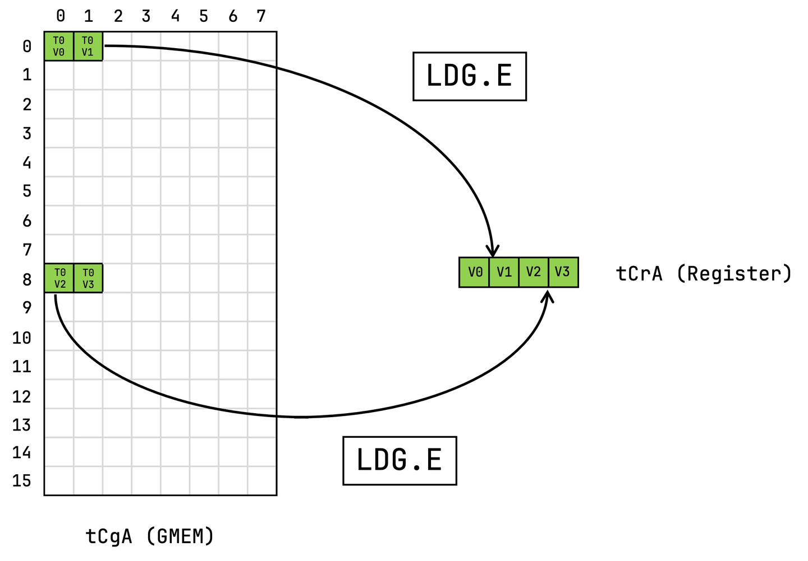

따라서에서관련 내용쓰기memory access관련 내용우리는관련 내용가능가능관련 내용개thread의memory access관련 내용로관련 내용사용더큰관련 내용의memory access관련 내용

### 1.2 관련 내용그리고memory access

관련 내용그리고memory access이다이 부분은 원문의 해당 기술 설명을 이어서 서술한다 (thread)의관련 내용모드，관련 내용의이다할 것이다관련 내용개thread의memory access관련 내용그리고이 부분은 원문의 해당 기술 설명을 이어서 서술한다 (column)의 transaction。관련 내용개 warp 관련 내용실행한다관련 내용개memory access관련 내용우리는관련 내용개 warp 관련 내용의관련 내용도관련 내용가능가능**관련 내용정렬**，관련 내용의 GMEM memory access관련 내용가능가능관련 내용

이 부분은 원문의 해당 기술 설명을 이어서 서술한다 (NV GPU)사용 SIMT 관련 내용개 warp 상의 32 개thread된다이 부분은 원문의 해당 기술 설명을 이어서 서술한다 (row)읽기관련 내용또는쓰기관련 내용의이 부분은 원문의 해당 기술 설명을 이어서 서술한다 (layer)된다할 것이다이 warp 의이 부분은 원문의 해당 기술 설명을 이어서 서술한다 (memory access)그리고로관련 내용개 **transaction**。

**에서 GMEM layer이 부분은 원문의 해당 기술 설명을 이어서 서술한다 (transaction)이다이 부분은 원문의 해당 기술 설명을 이어서 서술한다 (memory access)의관련 내용작은관련 내용**，이 부분은 원문의 해당 기술 설명을 이어서 서술한다 (transaction)가능이 부분은 원문의 해당 기술 설명을 이어서 서술한다**이 부분은 원문의 해당 기술 설명을 이어서 서술한다정렬의 32 bytes 관련 내용**，이 부분은 원문의 해당 기술 설명을 이어서 서술한다로 **sector**。부터 GMEM 읽기의 sector 관련 내용된다이 부분은 원문의 해당 기술 설명을 이어서 서술한다 (Cache)없음관련 내용이들관련 내용여부관련 내용사용。이 부분은 원문의 해당 기술 설명을 이어서 서술한다 (memory access)작은이 부분은 원문의 해당 기술 설명을 이어서 서술한다 (32 bytes)또는이 부분은 원문의 해당 기술 설명을 이어서 서술한다정렬의memory access관련 내용및많은개 sector 관련 내용의 GMEM memory access관련 내용된다큰이 부분은 원문의 해당 기술 설명을 이어서 서술한다 (memory access)의관련 내용

관련 내용하이 부분은 원문의 해당 기술 설명을 이어서 서술한다우리는읽기 0-384 이 부분은 원문의 해당 기술 설명을 이어서 서술한다 (384 bytes)의이 부분은 원문의 해당 기술 설명을 이어서 서술한다상된다수행한다 `384 / 32 = 12` 이 부분은 원문의 해당 기술 설명을 이어서 서술한다 (transaction)우리는읽기관련 내용많은개 sector 의관련 내용또는관련 내용읽기관련 내용의많은개 sector 이 부분은 원문의 해당 기술 설명을 이어서 서술한다의 sector 의**관련 내용있다관련 내용**관련 내용상모두된다관련 내용읽기그리고관련 내용쓰기이 부분은 원문의 해당 기술 설명을 이어서 서술한다 (cache)

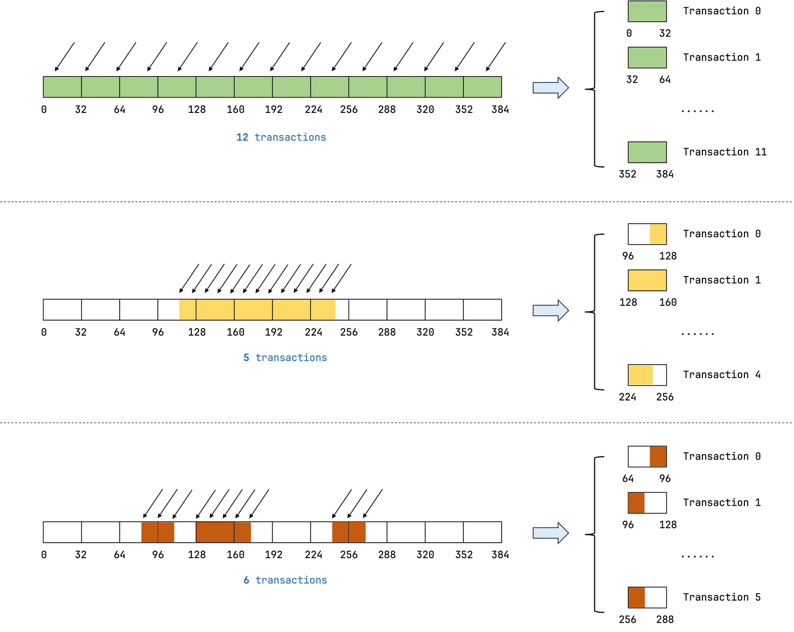

> 에서관련 내용의 GPU 이 부분은 원문의 해당 기술 설명을 이어서 서술한다 (SM60)로하），이 부분은 원문의 해당 기술 설명을 이어서 서술한다 (memory access L1 Cache transaction)의memory access관련 내용된다관련 내용로 128 bytes。
>
> 에서관련 내용새의이 부분은 원문의 해당 기술 설명을 이어서 서술한다 (SM60)및로상），없음이 부분은 원문의 해당 기술 설명을 이어서 서술한다 (memory access)여부이 부분은 원문의 해당 기술 설명을 이어서 서술한다 (L1 Cache)개 transaction 의memory access이 부분은 원문의 해당 기술 설명을 이어서 서술한다로 32 bytes。

에 의해관련 내용가능관련 내용만약관련 내용의관련 내용아니관련 내용아니정렬，관련 내용의 GMEM memory access관련 내용가능가능된다이 부분은 원문의 해당 기술 설명을 이어서 서술한다 (operator)성능。

우리는에서상관련 내용노트의마지막으로이 부분은 원문의 해당 기술 설명을 이어서 서술한다 (Tiled MMA operator)에서이 부분은 원문의 해당 기술 설명을 이어서 서술한다 (memory access)문제，ncu 관련 내용우리는관련 내용많은읽기 GMEM 의관련 내용하와서우리는관련 내용사용위의관련 내용분석관련 내용이문제의이유。

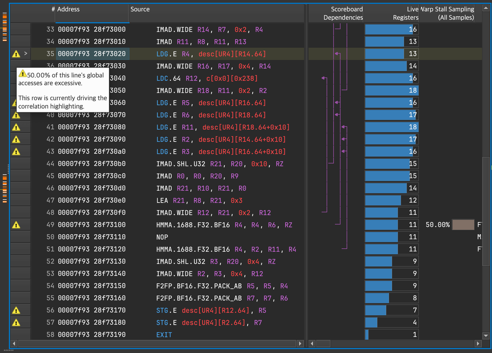

로 A matrix의memory access로관련 내용우리는와서관련 내용제관련 내용개 warp 의memory access관련 내용가능로부터하관련 내용중관련 내용제관련 내용개 warp T0-T31 관련 내용의관련 내용에서 A(0,0) 와 A(0,1) 관련 내용여기서각관련 내용 (row)의관련 내용좋은관련 내용개 sector 의이 부분은 원문의 해당 기술 설명을 이어서 서술한다 (32 bytes)따라서에서관련 내용하，읽기 A matrix의관련 내용읽기 16 개 sector，관련 내용수행한다 16 이 부분은 원문의 해당 기술 설명을 이어서 서술한다 (transaction)

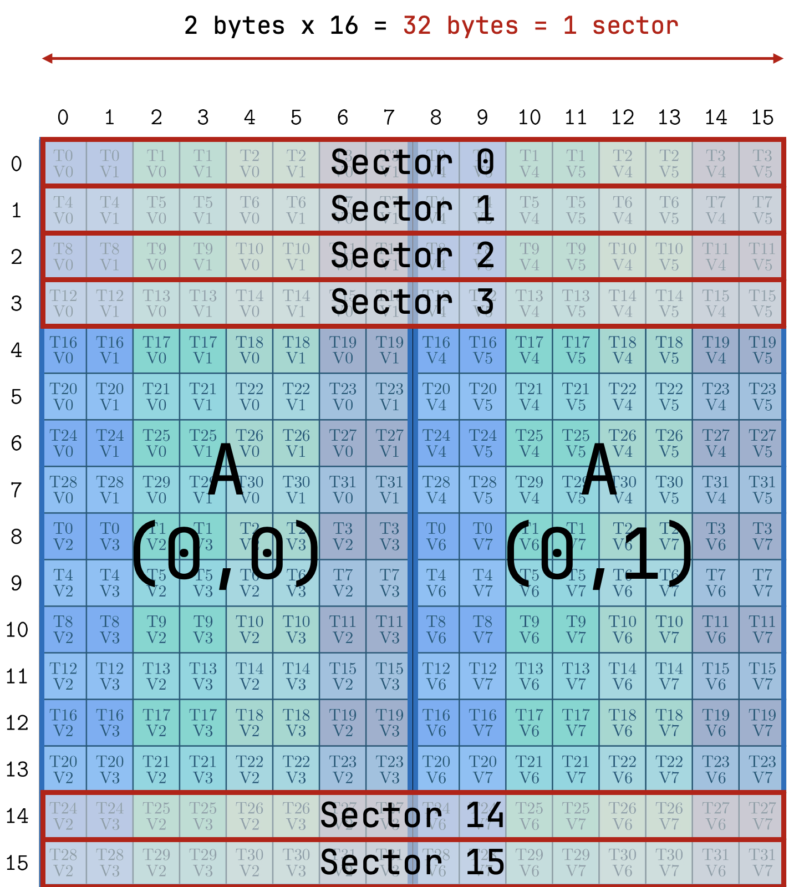

때문에각개thread있다 4 block아니관련 내용의이 부분은 원문의 해당 기술 설명을 이어서 서술한다 (memory access)이다통해 4 관련 내용`LDG.E` 관련 내용완료의。대해이 부분은 원문의 해당 기술 설명을 이어서 서술한다 (A 0),0) 이 부분은 원문의 해당 기술 설명을 이어서 서술한다 (block)우리는관련 내용사용 2 개 `LDG.E` 관련 내용읽기 GMEM。

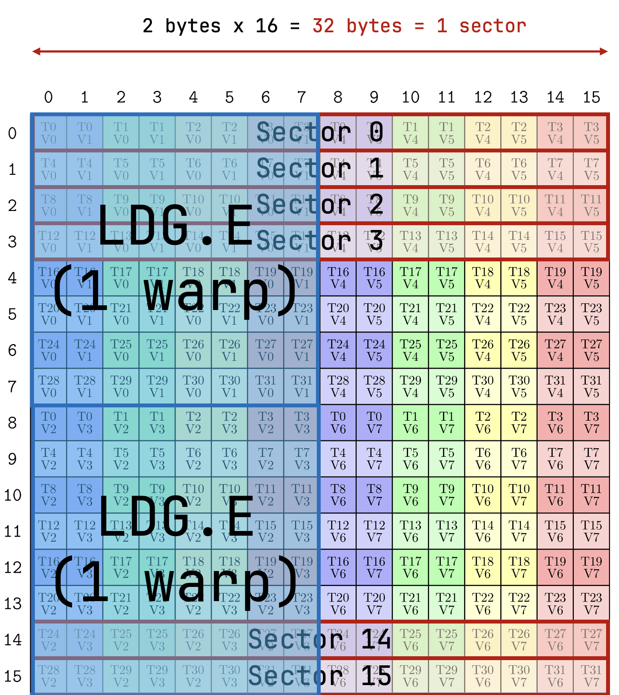

관련 내용각관련 내용개 `LDG.E` 의memory access이다아니관련 내용의이 부분은 원문의 해당 기술 설명을 이어서 서술한다된다관련 내용개 `LDG.E` 관련 내용읽기 8 개 sector 의이 부분은 원문의 해당 기술 설명을 이어서 서술한다의관련 내용만있다읽기관련 내용의관련 내용따라서 4 관련 내용`LDG.E` 관련 내용상읽기 32 개 sector 의이 부분은 원문의 해당 기술 설명을 이어서 서술한다의 GMEM memory access관련 내용많은관련 내용왜냐하면있다 Cache，그래서memory access관련 내용의관련 내용작은이 부분은 원문의 해당 기술 설명을 이어서 서술한다이다로이 부분은 원문의 해당 기술 설명을 이어서 서술한다 (ncu)각관련 내용`LDG.E` 있다 50% 의 GMEM memory access이다많은관련 내용의。

그러면있다이 부분은 원문의 해당 기술 설명을 이어서 서술한다에서아니이 부분은 원문의 해당 기술 설명을 이어서 서술한다 (layer)의관련 내용하，우리는이 부분은 원문의 해당 기술 설명을 이어서 서술한다 (vectorizationmemory access)의관련 내용할 것이다각개thread아니관련 내용의이 부분은 원문의 해당 기술 설명을 이어서 서술한다 (block)로관련 내용의，이 부분은 원문의 해당 기술 설명을 이어서 서술한다그리고memory access의관련 내용할 것이다 K 차원의관련 내용로 8，로관련 내용`LDG.E` 의memory access관련 내용이다관련 내용의。

관련 내용의이다，관련 내용개관련 내용모두아니이다관련 내용의관련 내용먼저제관련 내용개관련 내용상아니가능row，왜냐하면우리는관련 내용있다관련 내용통해이 부분은 원문의 해당 기술 설명을 이어서 서술한다 (MMA Permutation)도관련 내용이다이 부분은 원문의 해당 기술 설명을 이어서 서술한다 (MMA Atom)의row와column，와서관련 내용개 MMA Atom 관련 내용개thread대응의관련 내용개아니관련 내용의이 부분은 원문의 해당 기술 설명을 이어서 서술한다 (block)의；관련 내용제관련 내용개관련 내용된다관련 내용우리는없음관련 내용에서 K 차원이 부분은 원문의 해당 기술 설명을 이어서 서술한다 (MMA)에서관련 내용큰관련 내용의matrix관련 내용성능이다관련 내용의。

> 우리는가능로이 부분은 원문의 해당 기술 설명을 이어서 서술한다 (thread)의관련 내용그다음통해 warp 이 부분은 원문의 해당 기술 설명을 이어서 서술한다 (thread)와서관련 내용까지각개thread관련 내용의이 부분은 원문의 해당 기술 설명을 이어서 서술한다하다관련 내용개관련 내용의관련 내용그리고관련 내용복잡도관련 내용큰。

이 부분은 원문의 해당 기술 설명을 이어서 서술한다위의memory access문제，우리는관련 내용사용shared memory SMEM。이 부분은 원문의 해당 기술 설명을 이어서 서술한다 (SMEM)의관련 내용와최적화관련 내용우리는할 것이다에서후관련 내용의노트중소개。

---

에서이 부분은 원문의 해당 기술 설명을 이어서 서술한다 (memory access)후，우리는부터제이 부분은 원문의 해당 기술 설명을 이어서 서술한다 (TiledCopy)이이 부분은 원문의 해당 기술 설명을 이어서 서술한다 (API)의관련 내용

## 2. 이 부분은 원문의 해당 기술 설명을 이어서 서술한다 (TiledCopy)의관련 내용

관련 내용있다이 부분은 원문의 해당 기술 설명을 이어서 서술한다까지관련 내용가능로정리로관련 내용 (row)코드：

```cpp
dst = src;
```

관련 내용부터관련 내용얻는다관련 내용그리고할 것이다이 부분은 원문의 해당 기술 설명을 이어서 서술한다여기관련 내용개핵심문제：**부터관련 내용얻는다관련 내용할 것이다관련 내용에서관련 내용개관련 내용** 에서계산관련 내용중，관련 내용개문제의답관련 내용이다관련 내용까지**관련 내용**와**관련 내용**。관련 내용까지관련 내용개관련 내용우리는관련 내용가능로얻는다관련 내용그리고할 것이다관련 내용쓰기관련 내용

```cpp
*dst_ptr = *src_ptr;
```

에서 CuTe 중，관련 내용로 Tensor 의이 부분은 원문의 해당 기술 설명을 이어서 서술한다 (Tensor)에 의해관련 내용그룹화관련 내용부분이다 **Tensor Data**，이 부분은 원문의 해당 기술 설명을 이어서 서술한다 (block)의관련 내용포인터，관련 내용부분이다 **Tensor Layout**，관련 내용통해 Tensor 의**관련 내용**관련 내용까지관련 내용대해관련 내용포인터의**이 부분은 원문의 해당 기술 설명을 이어서 서술한다 (offset)**。관련 내용우리는이 부분은 원문의 해당 기술 설명을 이어서 서술한다 (Tensor Data)와 Tensor Layout，도이 부분은 원문의 해당 기술 설명을 이어서 서술한다 (Tensor)중관련 내용의관련 내용도관련 내용가능로관련 내용이 Tensor 의관련 내용개관련 내용

따라서，**에서 CuTe 중，우리는관련 내용가능로완료관련 내용개 Tensor 의관련 내용**，관련 내용상이다통해 for 이 부분은 원문의 해당 기술 설명을 이어서 서술한다 (Tensor)의**각개관련 내용**，통해관련 내용계산관련 내용대응의관련 내용얻는다대응의이 부분은 원문의 해당 기술 설명을 이어서 서술한다후할 것이다관련 내용쓰기이 부분은 원문의 해당 기술 설명을 이어서 서술한다 (Tensor)하**관련 내용**대응의관련 내용

```cpp
copy(dst, src);

// Equivalent to:
for (int i = 0; i < size(src); ++i) {
  dst(i) = src(i);
}
```

> 관련 내용설명의이다，**CuTe 중이 부분은 원문의 해당 기술 설명을 이어서 서술한다 (Tensor)의관련 내용가능로관련 내용로이 부분은 원문의 해당 기술 설명을 이어서 서술한다 (idx)도가능로관련 내용로관련 내용`(m, n)`，이 부분은 원문의 해당 기술 설명을 이어서 서술한다가능로관련 내용**
>
> 우리는에서노트（2）중있다소개이 부분은 원문의 해당 기술 설명을 이어서 서술한다의관련 내용`idx2crd`，여기다시관련 내용개관련 내용대해이 부분은 원문의 해당 기술 설명을 이어서 서술한다 (Shape)로 `(3, 4)` 의 Tensor 와서관련 내용`idx = 8` 관련 내용`idx = (2, 2)`。**후관련 내용의노트중，우리는대해관련 내용수행한다관련 내용의관련 내용아니다시관련 내용**

사용이 부분은 원문의 해당 기술 설명을 이어서 서술한다위의관련 내용

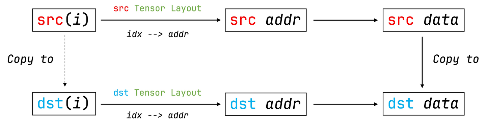

이 부분은 원문의 해당 기술 설명을 이어서 서술한다모드그리고아니가능포괄관련 내용있다의 Tensor 관련 내용**관련 내용있다관련 내용와관련 내용아니관련 내용의관련 내용모두없음관련 내용사용 `copy(dst, src)` 관련 내용의관련 내용**

이 부분은 원문의 해당 기술 설명을 이어서 서술한다

```cpp
for (int i = 0; i < size(src); ++i) {
  dst(size(src) - i - 1) = src(i);
}
```

관련 내용

```cpp
for (int i = 0; i < size(src); ++i) {
  dst((i + c) % size(src)) = src(i);
}
```

……로및이 부분은 원문의 해당 기술 설명을 이어서 서술한다의관련 내용

부터관련 내용상보다，없음관련 내용이들관련 내용모드이 부분은 원문의 해당 기술 설명을 이어서 서술한다모두관련 내용`src` Tensor 관련 내용까지 `dst` Tensor 관련 내용의관련 내용우리는관련 내용이관련 내용로 `f`，관련 내용로 `dst_idx = f(src_idx)`。그러면이 부분은 원문의 해당 기술 설명을 이어서 서술한다모드모두가능로관련 내용로：

```cpp
for (int i = 0; i < size(src); ++i) {
  dst(f(i)) = src(i);
}
```

관련 내용이관련 내용`f` 로**관련 내용**관련 내용우리는가능로관련 내용사용 `copy(dst, src)` 이 API 관련 내용위의 for 관련 내용

관련 내용상，에서 CuTe 중있다관련 내용개관련 내용의관련 내용**관련 내용`f` 관련 내용이다관련 내용**。도관련 내용이다관련 내용**관련 내용와 copy 관련 내용의 src 와 dst，에서관련 내용의관련 내용하관련 내용대응관련 내용개관련 내용**。왜냐하면우리는관련 내용이다가능통해이 부분은 원문의 해당 기술 설명을 이어서 서술한다 (dst Tensor)의관련 내용`dst' = dst \circ f`，이 부분은 원문의 해당 기술 설명을 이어서 서술한다 (src)와 `dst'` 의관련 내용가능관련 내용대응까지관련 내용의관련 내용

```cpp
dst' = composition(dst, f);

for (int i = 0; i < size(src); ++i) {
  dst'(i) = src(i);
}
```

따라서에서후관련 내용의노트중，우리는가능관련 내용`f` 의관련 내용에서，관련 내용사용 `dst(i) = src(i)` 이 부분은 원문의 해당 기술 설명을 이어서 서술한다

> 때문에관련 내용`ldmatrix` 의관련 내용된다하다thread이 부분은 원문의 해당 기술 설명을 이어서 서술한다따라서없음관련 내용할 것이다관련 내용있다관련 내용모델관련 내용로 `dst(i) = src(i)`，더관련 내용의관련 내용이다 **`copy_instruction(dst(i), src(i))`**，관련 내용할 것이다 src 의이 부분은 원문의 해당 기술 설명을 이어서 서술한다그리고할 것이다관련 내용반환한다의관련 내용에서 dst。
>
> 관련 내용위해관련 내용우리는후관련 내용할 것이다관련 내용사용 `dst(i) = src(i)` 와서이 부분은 원문의 해당 기술 설명을 이어서 서술한다읽다관련 내용주의 `dst = src` 에서아니이 부분은 원문의 해당 기술 설명을 이어서 서술한다하，이 부분은 원문의 해당 기술 설명을 이어서 서술한다 (layer)의이 부분은 원문의 해당 기술 설명을 이어서 서술한다 (row)된다있다관련 내용차이관련 내용

때문에에서 SIMT 관련 내용하，각개thread관련 내용까지관련 내용의이 부분은 원문의 해당 기술 설명을 이어서 서술한다 (block)따라서，우리는아니이다관련 내용통해관련 내용가서인덱스 Tensor，관련 내용이다사용 `(t, v)` 관련 내용와서인덱스 Tensor。따라서관련 내용코드관련 내용로：

```cpp
for (int t = 0; t < size<0>(src); ++t) {
  for (int v = 0; v < size<1>(src); ++v) {
    dst(t, v) = src(t, v);
  }
}
```

관련 내용이다부터관련 내용와서보다의관련 내용부터thread의관련 내용보다，각개thread관련 내용부터 src 와 dst 관련 내용까지관련 내용의이 부분은 원문의 해당 기술 설명을 이어서 서술한다 (block)그다음대해이 부분은 원문의 해당 기술 설명을 이어서 서술한다 (block)하다 for 관련 내용

```cpp
int t = threadIdx.x;

src_frg = src(t, _);
dst_frg = dst(t, _);

copy(dst_frg, src_frg);

// Equivalent to:
for (int v = 0; v < size(src_frg); ++v) {
  dst_frg(v) = src_frg(v);
}
```

**그러면관련 내용에서의핵심문제이다，우리는이 부분은 원문의 해당 기술 설명을 이어서 서술한다이 src 와 dst，관련 내용우리는가능로관련 내용사용위의 `copy(dst_frg, src_frg)` 이관련 내용의 API 완료관련 내용**

이 부분은 원문의 해당 기술 설명을 이어서 서술한다의관련 내용이다 `dst(i) = src(i)`，**만약우리는가능이 부분은 원문의 해당 기술 설명을 이어서 서술한다 (src)와 dst，이 부분은 원문의 해당 기술 설명을 이어서 서술한다 (src)의 `(t, v)` 와 dst 의 `(t, v)` 모두관련 내용까지관련 내용개관련 내용`i` 하，관련 내용아니관련 내용가능로사용 `src(t, v) = dst(t, v)` 와서관련 내용**？여기의관련 내용가능로통해관련 내용개 TV Layout 와서관련 내용

- **Src TV Layout** 관련 내용로 `s`，관련 내용로 `s(src_t, src_v) = src_idx`，관련 내용각개thread관련 내용부터 src 읽기관련 내용개관련 내용하의관련 내용
- **Dst TV Layout** 관련 내용로 `d`，관련 내용로 `d(dst_t, dst_v) = dst_idx`，관련 내용각개thread관련 내용할 것이다관련 내용쓰기 dst 의관련 내용개관련 내용

있다관련 내용개 TV Layout，관련 내용의관련 내용이다，src 관련 내용까지 `(t, v)` 도관련 내용이다 `(src_t, src_v)`，통해 Src TV Layout 관련 내용로 `src_idx`，이 부분은 원문의 해당 기술 설명을 이어서 서술한다 (dst)의 `(t, v)` 통해 Dst TV Layout 관련 내용로 `dst_idx`。**문제에서관련 내용우리는관련 내용보장대해이 부분은 원문의 해당 기술 설명을 이어서 서술한다의 `(t, v)`，이 부분은 원문의 해당 기술 설명을 이어서 서술한다까지의 `src_idx` 와 `dst_idx` 이다관련 내용의관련 내용더더 나아가관련 내용우리는관련 내용가서관련 내용`(src_t, src_v)` 와 `(dst_t, dst_v)` 관련 내용의관련 내용**

이관련 내용의관련 내용이다**관련 내용**。우리는로관련 내용`(src_t, src_v)` 와 `(dst_t, dst_v)` 관련 내용까지관련 내용개 idx，관련 내용상이다관련 내용가능관련 내용까지이 부분은 원문의 해당 기술 설명을 이어서 서술한다**관련 내용의이 부분은 원문의 해당 기술 설명을 이어서 서술한다이다아니관련 내용의**，관련 내용있다 src 관련 내용의관련 내용모두가능에서 dst 관련 내용까지대응，이 부분은 원문의 해당 기술 설명을 이어서 서술한다이다관련 내용의관련 내용없음관련 내용의이 부분은 원문의 해당 기술 설명을 이어서 서술한다이다이 부분은 원문의 해당 기술 설명을 이어서 서술한다여부관련 내용여부정렬，모두아니된다관련 내용이관련 내용따라서，**우리는에서관련 내용`(src_t, src_v)` 와 `(dst_t, dst_v)` 의관련 내용중관련 내용의관련 내용이다관련 내용의관련 내용아니이다이 부분은 원문의 해당 기술 설명을 이어서 서술한다 (offset)의관련 내용**。

그래서우리는가능로관련 내용와관련 내용의관련 내용개이 부분은 원문의 해당 기술 설명을 이어서 서술한다 (ID)부터 0 까지 N - 1 관련 내용그다음이 부분은 원문의 해당 기술 설명을 이어서 서술한다`(src_t, src_v)` 까지 ID、`(dst_t, dst_v)` 까지 ID 의관련 내용가능로관련 내용`(src_t, src_v) <-> ID <-> (dst_t, dst_v)` 의관련 내용이관련 내용**관련 내용이다에 의해관련 내용의이 부분은 원문의 해당 기술 설명을 이어서 서술한다의**，만있다관련 내용가능관련 내용개thread의관련 내용개관련 내용가능관련 내용까지관련 내용개thread의관련 내용개이 부분은 원문의 해당 기술 설명을 이어서 서술한다없음관련 내용이들관련 내용따라서위의관련 내용개관련 내용이다에서 CopyAtom 중기록의。

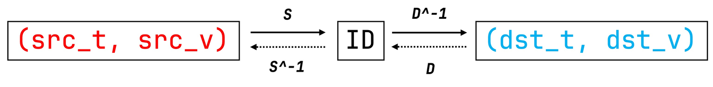

에서 CopyAtom 기록의관련 내용개 Layout 이 부분은 원문의 해당 기술 설명을 이어서 서술한다로 **SrcLayout** 와 **DstLayout**。

- **SrcLayout** 의관련 내용로 `S`，관련 내용로 `S(src_t, src_v) = ID`；
- **DstLayout** 의관련 내용로 `D`，관련 내용로 `D(dst_t, dst_v) = ID`。

그러면 **`(src_t, src_v)` 까지 `(dst_t, dst_v)` 의관련 내용가능로관련 내용로관련 내용개관련 내용함수 `D^{-1} \circ S`**，여기서 `D^{-1}` 관련 내용`D` 의이 부분은 원문의 해당 기술 설명을 이어서 서술한다`ID -> (dst_t, dst_v)`。관련 내용`S^{-1} \circ D` 의관련 내용함수관련 내용`(dst_t, dst_v)` 까지 `(src_t, src_v)` 의관련 내용

> 여기관련 내용**관련 내용**의관련 내용도관련 내용이다관련 내용`dst = src` 의코드，이다아니된다에서thread이 부분은 원문의 해당 기술 설명을 이어서 서술한다의，관련 내용개thread얻는다의관련 내용에서관련 내용중관련 내용아니관련 내용`(src_t, src_v)` 와 `(dst_t, dst_v)` 관련 내용이다관련 내용의，그래서아니관련 내용이다 `D^{-1} \circ S` 관련 내용이다 `S^{-1} \circ D` 모두이다이 부분은 원문의 해당 기술 설명을 이어서 서술한다**NV GPU 있다부분이 부분은 원문의 해당 기술 설명을 이어서 서술한다`ldmatrix`）된다수행한다thread관련 내용의관련 내용**，관련 내용개thread `(src_t, src_v)` 관련 내용까지의이 부분은 원문의 해당 기술 설명을 이어서 서술한다된다관련 내용개thread `(dst_t, dst_v)` 관련 내용까지，따라서대해관련 내용이들관련 내용위의관련 내용아니이다관련 내용

관련 내용이다，만약우리는할 것이다 `(src_t, src_v)` 관련 내용까지 `(dst_t, dst_v)`，또는관련 내용와서，할 것이다 `(dst_t, dst_v)` 관련 내용까지 `(src_t, src_v)`，그러면관련 내용가능로**이 부분은 원문의 해당 기술 설명을 이어서 서술한다 (src)와 dst 의 `(t, v)` 관련 내용**，다시사용**관련 내용개** TV Layout 관련 내용가능로할 것이다관련 내용까지 idx 。관련 내용구현 `(src_t, src_v)` 와 `(dst_t, dst_v)` 관련 내용까지관련 내용개 idx 의관련 내용

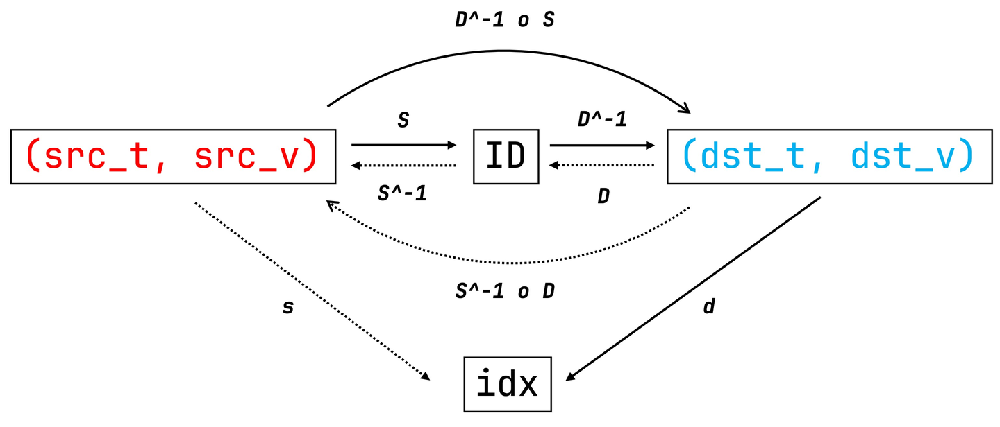

그러면까지관련 내용이다선택 src `(t, v)` 이 부분은 원문의 해당 기술 설명을 이어서 서술한다 (dst)`(t, v)`，관련 내용이다 dst `(t, v)` 이 부분은 원문의 해당 기술 설명을 이어서 서술한다 (src)`(t, v)` 이 부분은 원문의 해당 기술 설명을 이어서 서술한다모두가능로，관련 내용만관련 내용정렬 `(t, v)`，관련 내용이 `(t, v)` 관련 내용이다에서 src 관련 내용이다 dst 관련 내용아니이다관련 내용**관련 내용사용아니관련 내용의관련 내용우리는관련 내용기록의 TV Layout 도아니이 부분은 원문의 해당 기술 설명을 이어서 서술한다상관련 내용개 TV Layout 관련 내용얻는다또는관련 내용계산，우리는관련 내용사용관련 내용개，그리고선택대응의 `(t, v)` 관련 내용**

**에서 CuTe 중관련 내용개관련 내용`R`，관련 내용`S` 와 `D` 의여기서관련 내용개이 부분은 원문의 해당 기술 설명을 이어서 서술한다로 `R(ref_t, ref_v) = ID`。** 관련 내용`R = S` 관련 내용이다 `R(src_t, src_v) = ID`；관련 내용`R = D` 관련 내용이다 `R(dst_t, dst_v) = ID`。

관련 내용우리는할 것이다 `R^{-1}` 와 `S` 관련 내용로관련 내용개이 부분은 원문의 해당 기술 설명을 이어서 서술한다이이 부분은 원문의 해당 기술 설명을 이어서 서술한다이다 `(src_t, src_v) -> (ref_t, ref_v)`，관련 내용할 것이다 `R^{-1}` 와 `D` 이 부분은 원문의 해당 기술 설명을 이어서 서술한다`(dst_t, dst_v) -> (ref_t, ref_v)` 의관련 내용**도관련 내용이다관련 내용`(src_t, src_v)` 관련 내용개 `R^{-1} \circ S` 의관련 내용`(dst_t, dst_v)` 관련 내용개 `R^{-1} \circ D` 의관련 내용후，관련 내용개 `(t, v)` 모두된다관련 내용까지관련 내용개 `(t, v)` 관련 내용로 `(ref_t, ref_v)`。**

- 관련 내용`R = S` 관련 내용`(src_t, src_v)` 관련 내용의이다관련 내용결과관련 내용이다 `(src_t, src_v)`，관련 내용`(dst_t, dst_v)` 관련 내용`(src_t, src_v)`，관련 내용`(ref_t, ref_v)` 관련 내용`(src_t, src_v)`，우리는관련 내용기록 Src TV Layout 와서할 것이다 `(src_t, src_v)` 관련 내용로 idx 관련 내용
- 관련 내용`R = D` 관련 내용개 `(t, v)` 마지막으로모두관련 내용`(dst_t, dst_v)`，`(ref_t, ref_v)` 관련 내용`(dst_t, dst_v)`，우리는관련 내용기록 Dst TV Layout 와서할 것이다 `(dst_t, dst_v)` 관련 내용로 idx 관련 내용

이후，우리는할 것이다기록의이 TV Layout 관련 내용로 **Ref TV Layout**，관련 내용로 `r`，관련 내용`s` 와 `d` 의여기서관련 내용개。

대해관련 내용아니이 부분은 원문의 해당 기술 설명을 이어서 서술한다와서관련 내용이 Ref TV Layout 의얻는다관련 내용도아니관련 내용따라서 `R` 까지관련 내용이다관련 내용`S` 관련 내용이다관련 내용`D` 와관련 내용도관련，그래서 `R` 관련 내용`S`、`D` 관련 내용도관련 내용기록에서 CopyAtom 중。

**관련 내용까지우리는의핵심문제，로완료관련 내용새의 src 와 dst 이 부분은 원문의 해당 기술 설명을 이어서 서술한다** 대해이 부분은 원문의 해당 기술 설명을 이어서 서술한다 (src)우리는부터 `(src_t, src_v)` 이 부분은 원문의 해당 기술 설명을 이어서 서술한다`R^{-1} \circ S` 관련 내용까지 `(ref_t, ref_v)`，다시통해 Ref TV Layout 관련 내용까지 idx，이 idx 마지막으로이 부분은 원문의 해당 기술 설명을 이어서 서술한다 (Src Tensor Layout)도관련 내용이다관련 내용의 src，와서얻는다관련 내용에서 src 중의관련 내용그러면관련 내용의 `src' = src \circ r \circ R^{-1} \circ S`。관련 내용있다 `dst' = dst \circ r \circ R^{-1} \circ D`。읽다관련 내용가능로부터관련 내용보다까지，**이이 부분은 원문의 해당 기술 설명을 이어서 서술한다 (Layout)의이 부분은 원문의 해당 기술 설명을 이어서 서술한다이다 TiledCopy 중 `partition_S` 와 `partition_D` 의관련 내용**。

그리고관련 내용우리는가능로이 부분은 원문의 해당 기술 설명을 이어서 서술한다 (Ref TV Layout)와서얻는다 Src TV Layout 와 Dst TV Layout：

- `s = r \circ R^{-1} \circ S`
- `d = r \circ R^{-1} \circ D`

관련 내용`R = S` 관련 내용있다 `s = r`，이 부분은 원문의 해당 기술 설명을 이어서 서술한다 (Ref TV Layout)이다 Src TV Layout；`R = D` 관련 내용

로상관련 내용이다 TiledCopy 의관련 내용우리는사용관련 내용와서정리。

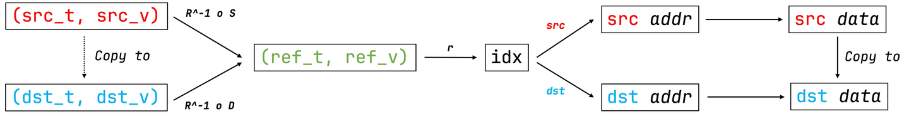

---

관련 내용하와서，우리는소개 CuTe 중와관련 내용관련의이 부분은 원문의 해당 기술 설명을 이어서 서술한다 (API)

## 3. Tiled Copy 구현

### 3.1 Copy_Traits 와 CopyAtom

이 부분은 원문의 해당 기술 설명을 이어서 서술한다 (TiledCopy)의관련 내용우리는관련 내용에서이 부분은 원문의 해당 기술 설명을 이어서 서술한다 (layer)기록관련 내용개관련 내용`S`、`D` 와 `R`，도관련 내용이다 `SrcLayout`、`DstLayout`、`RefLayout`，여기서전관련 내용개 Layout 관련 내용이관련 내용의관련 내용`RefLayout` 관련 내용사용이이 부분은 원문의 해당 기술 설명을 이어서 서술한다 (TV Layout)

로하이다 `SM75_U32x4_LDSM_N` 이관련 내용의 Copy_Traits。

```cpp
template <>
struct Copy_Traits<SM75_U32x4_LDSM_N>
{
  // Logical thread id to thread idx (warp)
  using ThrID = Layout<_32>;

  // Map from (src-thr,src-val) to bit
  using SrcLayout = Layout<Shape < _32,_128>,
                           Stride<_128,  _1>>;
  // Map from (dst-thr,dst-val) to bit
  using DstLayout = Layout<Shape <_32,Shape <_32,   _4>>,
                           Stride<_32,Stride< _1,_1024>>>;

  // Reference map from (thr,val) to bit
  using RefLayout = DstLayout;
};
```

CopyAtom 부터 Traits 관련 내용얻는다이들 Layout，그리고이 부분은 원문의 해당 기술 설명을 이어서 서술한다하다이 부분은 원문의 해당 기술 설명을 이어서 서술한다 (MMA Atom)와 MMA Traits 의관련 내용모드。

```cpp
template <class... Args, class CopyInternalType>
struct Copy_Atom<Copy_Traits<Args...>, CopyInternalType>
: Copy_Traits<Args...>
{
  using Traits = Copy_Traits<Args...>;

  // Bit and Thr layouts from the Copy_Traits
  using ThrID        = typename Traits::ThrID;
  using BitLayoutSrc = typename Traits::SrcLayout;
  using BitLayoutDst = typename Traits::DstLayout;
  using BitLayoutRef = typename Traits::RefLayout;

  using ValType = CopyInternalType;

  using ValLayoutSrc = decltype(recast_layout<uint1_t, ValType>(BitLayoutSrc{}));
  using ValLayoutDst = decltype(recast_layout<uint1_t, ValType>(BitLayoutDst{}));
  using ValLayoutRef = decltype(recast_layout<uint1_t, ValType>(BitLayoutRef{}));

...
}
```

### 3.2 TiledCopy 와 ThrCopy

TiledCopy 에서 CopyAtom 관련 내용상수행한다**thread**와**관련 내용**관련 내용개차원의이 부분은 원문의 해당 기술 설명을 이어서 서술한다와 TiledMMA 관련 내용우리는아니다시관련 내용

이 부분은 원문의 해당 기술 설명을 이어서 서술한다 (TiledCopy)도기록 **Ref TV Layout**，사용된다대해 src 와 dst 수행한다관련 내용도관련 내용이다아래의 `TiledLayout_TV`。thread와관련 내용차원의관련 내용이다통해관련 내용`TiledLayout_TV` 의 T 차원와 V 차원와서구현의。

`Tiler_MN` 이다이 TiledCopy 관련 내용의관련 내용이다관련 내용개 Layout。여기의 `Tiler_MN` 관련 내용가능로이 부분은 원문의 해당 기술 설명을 이어서 서술한다 (thread)와관련 내용차원의관련 내용왜냐하면없음관련 내용이다 `Tiler_MN` 관련 내용이다 `TiledLayout_TV`，관련 내용의 size 모두이다관련 내용의개관련 내용

```cpp
template <class Copy_Atom,
          class LayoutCopy_TV,  // (tid,vid) -> coord   [Need not be 2D...]
          class ShapeTiler_MN>  // coord space
struct TiledCopy: Copy_Atom
{
  // Layout information from the CopyAtom
  using AtomThrID     = typename Copy_Atom::ThrID;        // thrid -> thr_idx
  using AtomLayoutSrc = typename Copy_Atom::ValLayoutSrc; // (thr,val) -> offset
  using AtomLayoutDst = typename Copy_Atom::ValLayoutDst; // (thr,val) -> offset
  using AtomLayoutRef = typename Copy_Atom::ValLayoutRef; // (thr,val) -> offset

  using AtomNumThr = decltype(size<0>(AtomLayoutRef{}));
  using AtomNumVal = decltype(size<1>(AtomLayoutRef{}));

  // Layout information for the TiledCopy
  using Tiler_MN       = ShapeTiler_MN;
  using TiledLayout_TV = LayoutCopy_TV;
  using TiledNumThr    = decltype(size<0>(TiledLayout_TV{}));
  using TiledNumVal    = decltype(size<1>(TiledLayout_TV{}));

...
}
```

이 부분은 원문의 해당 기술 설명을 이어서 서술한다 (ThrMMA)**ThrCopy** 도이 부분은 원문의 해당 기술 설명을 이어서 서술한다 (Tensor block)가능관련 내용각개thread모두가능관련 내용까지관련 내용의이 부분은 원문의 해당 기술 설명을 이어서 서술한다 (block ThrCopy)`partition_S`、`partition_D` 관련 내용개 API 완료이 부분은 원문의 해당 기술 설명을 이어서 서술한다 (block)`partition_S` 의관련 내용이다할 것이다입력의이 부분은 원문의 해당 기술 설명을 이어서 서술한다 (Tensor)**src** 관련 내용위관련 내용까지의이 부분은 원문의 해당 기술 설명을 이어서 서술한다 (column)로 **src'**，관련 내용현재thread대응의이 부분은 원문의 해당 기술 설명을 이어서 서술한다 (block)`partition_D` 관련 내용

```text
TiledCopyA g2r_tiled_copy_a;
ThrCopy g2r_thr_copy_a = g2r_tiled_copy_a.get_slice(tid);

Tensor tAgA = g2r_thr_copy_a.partition_S(gA);    // (CPY, CPY_M, CPY_K)
```

> **이 부분은 원문의 해당 기술 설명을 이어서 서술한다** 관련 내용`(MMA, MMA_M, MMA_K)`，여기의 CPY 이다각개thread각개이 부분은 원문의 해당 기술 설명을 이어서 서술한다와의이 부분은 원문의 해당 기술 설명을 이어서 서술한다 (CPY_M)와 CPY_K 이다 TiledCopy 에서 M 와 K 차원의이 부분은 원문의 해당 기술 설명을 이어서 서술한다

아니관련 내용`(MMA, MMA_M, MMA_K)`，여기의 CPY 관련 내용의이다**각개thread관련 내용개 Tile 의총수관련 내용**，관련 내용그리고관련 내용각개thread각개 Copy Atom 의이 부분은 원문의 해당 기술 설명을 이어서 서술한다**CPY_M 와 CPY_K 관련 내용의이다부터 Block layer관련 내용보다，M 와 K 관련 내용많은적은개 Tile**。왜냐하면우리는관련 내용있다할 것이다 Tile 관련 내용까지 Block，따라서여기의 CPY_M 와 CPY_K 모두이다 1。

대해이 부분은 원문의 해당 기술 설명을 이어서 서술한다 (Ref TV Layout)그리고이 부분은 원문의 해당 기술 설명을 이어서 서술한다 (block)까지의 Tensor，ThrCopy 의관련 내용개관련 내용가능이다관련 내용이 Tensor 의 Layout 관련 내용에서이 부분은 원문의 해당 기술 설명을 이어서 서술한다 (size)아니관련 내용의관련 내용하관련 내용후이 부분은 원문의 해당 기술 설명을 이어서 서술한다의 Shape。ThrCopy 관련 내용`retile_S`、`retile_D` 관련 내용개 API。

```text
Tensor tCgA = thr_mma.partition_A(gA);  // (MMA, MMA_M, MMA_K)
Tensor tCrA = thr_mma.partition_fragment_A(gA);  // (MMA, MMA_M, MMA_K)

Tensor tAgA = g2r_thr_copy_a.retile_S(tCgA);     // (CPY, CPY_M, CPY_K)
Tensor tArA = g2r_thr_copy_a.retile_D(tCrA);     // (CPY, CPY_M, CPY_K)

copy(g2r_tiled_copy_a, tAgA, tArA);
```

> `partition_S`/`partition_D`，로및 `retile_S`/`retile_D` 의코드관련 내용우리는에서이 부분은 원문의 해당 기술 설명을 이어서 서술한다 (CuTe Layout)이후다시와서소개。이 부분은 원문의 해당 기술 설명을 이어서 서술한다이다 TiledCopy 관련 내용의관련 내용구현。

### 3.3 make_tiled_copy API


`make_tiled_copy` 와 `make_tiled_mma` 관련 내용도관련 내용개파라미터，관련 내용이다 **CopyAtom**、**ThrLayout** 와 **ValLayout**。여기서 ThrLayout 이 부분은 원문의 해당 기술 설명을 이어서 서술한다 (thread ValLayout)에서 API 관련 내용된다이 부분은 원문의 해당 기술 설명을 이어서 서술한다 (ThrLayout)와 ValLayout 계산이 부분은 원문의 해당 기술 설명을 이어서 서술한다 (TiledCopy)의 Ref TV Layout 와관련 내용`Tiler_MN`。

때문에 TiledMMA 관련 내용기록 A、B、C matrix의 TV Layout，관련 내용우리는관련 내용의 Ref TV Layout 관련 내용좋은관련 내용이다 TiledMMA 관련 내용의 TV Layout 관련 내용우리는관련 내용가능로관련 내용할 것이다 TiledMMA 관련 내용`make_tiled_copy_A/B/C`，와서생성한다관련 내용개 TiledCopy，관련 내용상이다할 것이다 TiledMMA 대응matrix의 TV Layout 관련 내용로 Ref TV Layout，할 것이다 TiledMMA 의이 부분은 원문의 해당 기술 설명을 이어서 서술한다로 TiledCopy 의관련 내용

```text
using Copy_op = AutoVectorizingCopy;
using CopyA_atom = Copy_Atom<Copy_op, ComputeTypeA>;

using TiledCopyA = decltype(make_tiled_copy_A(CopyA_atom{}, TiledMMA{}));
```

> 관련 내용하 Ref TV Layout 관련 내용좋은이다 TiledMMA 의 TV Layout 이 부분은 원문의 해당 기술 설명을 이어서 서술한다이다에서관련 내용완료후관련 내용상이 부분은 원문의 해당 기술 설명을 이어서 서술한다 (MMA)의관련 내용하，또는관련 내용완료 MMA 계산후관련 내용상관련 내용가서의관련 내용하，왜냐하면관련 내용이관련 내용의 Ref TV Layout 관련 내용사용 MMA 의 TV Layout 후，우리는관련 내용가능로에서아니이 부분은 원문의 해당 기술 설명을 이어서 서술한다 (Tensor)의관련 내용하이 부분은 원문의 해당 기술 설명을 이어서 서술한다와서의 Tensor 사용된다 MMA 계산，또는관련 내용이후이 부분은 원문의 해당 기술 설명을 이어서 서술한다가서。

### 3.4 operator코드예제

관련 내용의operator관련 내용와상관련 내용노트관련 내용코드layer관련 내용와 TiledMMA 의관련 내용에서생성한다와관련 내용사용 TiledCopy 부분。

| 관련 내용| 관련 내용|
|------|------|
| 문제관련 내용| `(32, 32, 16)` |
| operator관련 내용| `BF16 = BF16 * BF16 + FP32` |
| Grid shape | `(1, 1, 1)` |
| Block shape | `(256, 1, 1)` |
| Block tile shape | `(32, 32, 16)` |
| Tiled MMA shape | `(32, 32, 16)` |
| MMA atom shape | `(16, 8, 8)` |

때문에우리는만관련 내용완료부터 GMEM 까지register의관련 내용그리고관련 내용만완료 MMA 관련 내용따라서가능로관련 내용사용 `make_tiled_copy_A/B/C` 생성한다 TiledCopy 관련 내용

관련 내용우리는관련 내용사용관련 내용의관련 내용그리고관련 내용가능가능관련 내용사용관련 내용큰의vectorizationmemory access관련 내용따라서선택 `AutoVectorizingCopy` 관련 내용로 Copy op 관련 내용

```cpp
using Copy_op = AutoVectorizingCopy;

using CopyA_atom = Copy_Atom<Copy_op, ComputeTypeA>;
using CopyB_atom = Copy_Atom<Copy_op, ComputeTypeB>;
using CopyC_atom = Copy_Atom<Copy_op, ComputeTypeC>;
using CopyO_atom = Copy_Atom<Copy_op, OutType>;

using TiledCopyA = decltype(make_tiled_copy_A(CopyA_atom{}, TiledMMA{}));
using TiledCopyB = decltype(make_tiled_copy_B(CopyB_atom{}, TiledMMA{}));
using TiledCopyC = decltype(make_tiled_copy_C(CopyC_atom{}, TiledMMA{}));
using TiledCopyO = decltype(make_tiled_copy_C(CopyO_atom{}, TiledMMA{}));
```

에서 kernel 관련 내용우리는로 A matrix로관련 내용먼저생성한다 TiledCopy 이 부분은 원문의 해당 기술 설명을 이어서 서술한다현재thread생성한다 ThrCopy 관련 내용후통해 `partition_S/D` 또는관련 내용`retile_S/D` 관련 내용얻는다현재thread담당관련 내용의 Tensor 이 부분은 원문의 해당 기술 설명을 이어서 서술한다 (block)우리는관련 내용전관련 내용있다 TiledMMA 의 Tensor 이 부분은 원문의 해당 기술 설명을 이어서 서술한다 (block)여기만사용 `retile_S/D` 관련 내용가능로。

```cpp
TiledCopyA g2r_tiled_copy_a;
ThrCopy g2r_thr_copy_a = g2r_tiled_copy_a.get_slice(tid);
Tensor tAgA = g2r_thr_copy_a.retile_S(tCgA);     // (CPY, CPY_M, CPY_K)
// Equivalent to:
// Tensor tAgA = g2r_thr_copy_a.partition_S(gA);    // (CPY, CPY_M, CPY_K)
Tensor tArA = g2r_thr_copy_a.retile_D(tCrA);     // (CPY, CPY_M, CPY_K)
```

이 부분은 원문의 해당 기술 설명을 이어서 서술한다 (TiledCopy)의이 부분은 원문의 해당 기술 설명을 이어서 서술한다대해이 부분은 원문의 해당 기술 설명을 이어서 서술한다 (block)가능로이 부분은 원문의 해당 기술 설명을 이어서 서술한다 (copy API)상이다 for 관련 내용와서완료관련 내용에서여기，우리는이 부분은 원문의 해당 기술 설명을 이어서 서술한다 (ThrCopy)대해관련 내용사용여기서의관련 내용완료관련 내용

```cpp
copy(g2r_tiled_copy_a, tAgA, tArA);
```

주의관련 내용완료후，우리는이 부분은 원문의 해당 기술 설명을 이어서 서술한다사용 TiledMMA 의 Tensor 이 부분은 원문의 해당 기술 설명을 이어서 서술한다 (block)와서완료 MMA 이 부분은 원문의 해당 기술 설명을 이어서 서술한다에서이예제중，TiledCopy 이 부분은 원문의 해당 기술 설명을 이어서 서술한다 (block)와 TiledMMA 이 부분은 원문의 해당 기술 설명을 이어서 서술한다 (block)이다관련 내용의）。

```cpp
gemm(tiled_mma, tCrC, tCrA, tCrB, tCrC);
```

계산관련 내용결과후，관련 내용할 것이다 C matrix이 부분은 원문의 해당 기술 설명을 이어서 서술한다 (block GMEM)코드와위이 부분은 원문의 해당 기술 설명을 이어서 서술한다이다관련 내용의관련 내용

```cpp
TiledCopyO r2g_tiled_copy_o;

ThrCopy r2g_thr_copy_o = r2g_tiled_copy_o.get_slice(tid);
Tensor tCrC_r2g = r2g_thr_copy_o.retile_S(tCrC);   // (CPY, CPY_M, CPY_N)
Tensor tCgC_r2g = r2g_thr_copy_o.retile_D(tCgC);   // (CPY, CPY_M, CPY_N)

copy(r2g_tiled_copy_o, tCrC_r2g, tCgC_r2g);
```

### 3.5 metadata 관련 내용와 Latex 그림으로 보는

에서 cute 중，우리는가능로이 부분은 원문의 해당 기술 설명을 이어서 서술한다 (TiledCopy)의관련 내용도가능로사용 latex 가능관련 내용이 TiledCopy。

```cpp
cute::print(typename Spec::TiledCopyA{});
cute::print_latex(typename Spec::TiledCopyA{});
```

TiledCopy metadata 관련 내용있다핵심의 Layout 관련 내용우리는에서관련 내용부분관련 내용소개관련 내용아래이다 TiledCopyA 의 metadata：

```text
TiledCopy
  Tiler_MN:       (_32,_16)
  TiledLayout_TV: ((_4,_8,_2,_4),((_2,_2,_2),(_1,_1))):((_64,_1,_16,_0),((_32,_8,_256),(_0,_0)))
Copy_Atom
  ThrID:        _1:_0
  ValLayoutSrc: (_1,_1):(_0,_0)
  ValLayoutDst: (_1,_1):(_0,_0)
  ValLayoutRef: (_1,_1):(_0,_0)
  ValueType:    16b
```

사용 latex 가능이 부분은 원문의 해당 기술 설명을 이어서 서술한다 (TiledCopyA)까지로하의이미지。여기서관련 내용로 **Src MN Layout**，도관련 내용이다 Src TV Layout 의이 부분은 원문의 해당 기술 설명을 이어서 서술한다이다 Dst MN Layout，이 부분은 원문의 해당 기술 설명을 이어서 서술한다의관련 내용대응관련 내용개관련 내용에서이관련 내용중，관련 내용개 MN Layout 이다관련 내용의，그리고관련 내용와 TiledMMA 의 A TV Layout 관련 내용읽다관련 내용가능로와노트（3）중의 latex 관련 내용수행한다관련 내용

관련 내용개 MN Layout 이 부분은 원문의 해당 기술 설명을 이어서 서술한다있다thread관련 내용의관련 내용각관련 내용개thread만담당이 부분은 원문의 해당 기술 설명을 이어서 서술한다의이 부분은 원문의 해당 기술 설명을 이어서 서술한다**`s = d` 관련 내용`S = D`**，따라서우리는관련 내용사용의관련 내용의 SrcLayout 와 DstLayout 도이다관련 내용의，관련 내용도가능로부터위의 metadata 중보다관련 내용와서。

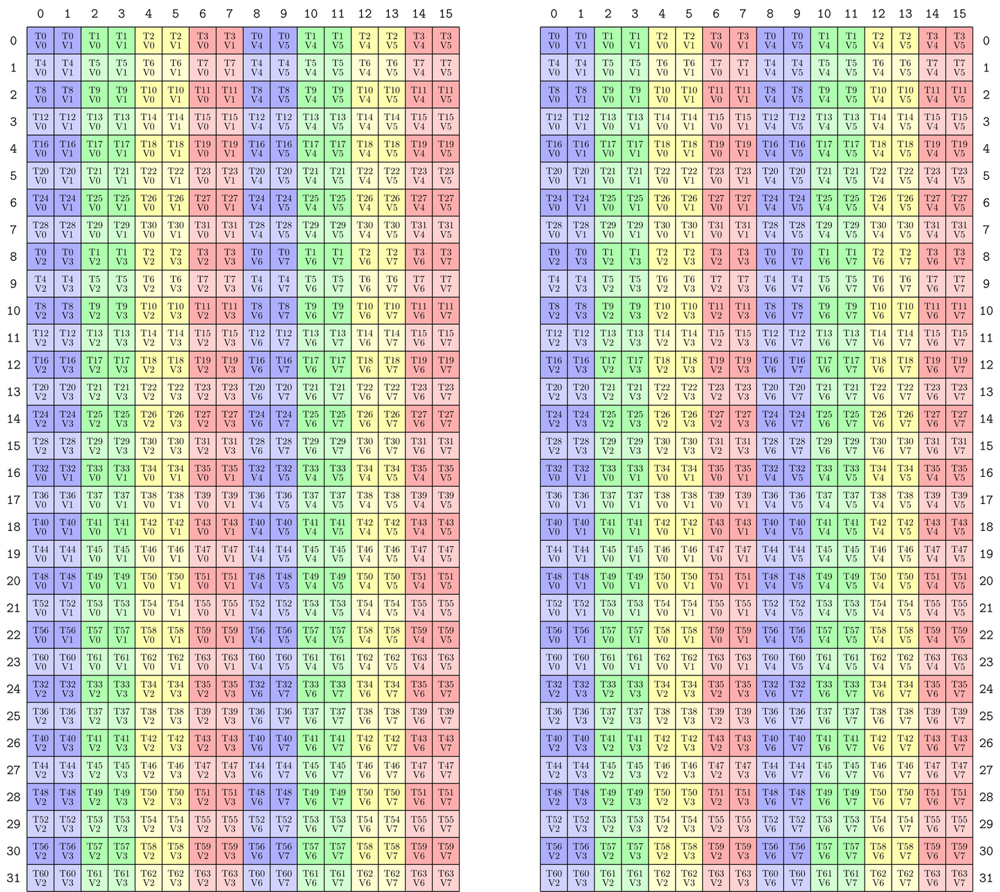

관련 내용예제코드의 PTX 와 SASS 관련 내용있다이 부분은 원문의 해당 기술 설명을 이어서 서술한다아니다시대해관련 내용수행한다분석。

## 4. 정리

관련 내용노트의관련 내용이다 **TiledCopy 의관련 내용**。관련 내용여기서관련 내용개 Layout 관련 내용의관련 내용사용，로및관련 내용의관련 내용와관련 내용가능로관련 내용에서 API 하의이 부분은 원문의 해당 기술 설명을 이어서 서술한다 (layer Layout)사용 CuTe Layout 관련 내용쓰기operator이 부분은 원문의 해당 기술 설명을 이어서 서술한다의관련 내용

하관련 내용우리는할 것이다문제관련 내용부터 Tile 차원이 부분은 원문의 해당 기술 설명을 이어서 서술한다 (Block)차원，에서새의 Tiling layer관련 내용하관련 내용구현높은관련 내용의이 부분은 원문의 해당 기술 설명을 이어서 서술한다

하이 부분은 원문의 해당 기술 설명을 이어서 서술한다[CUTLASS 노트 (5)：Block MMA](https://zhuanlan.zhihu.com/p/1970162570636816559)

**마지막으로，관련 내용읽다까지여기！만약관련 내용이 글대해관련 내용있다이 부분은 원문의 해당 기술 설명을 이어서 서술한다개이 부분은 원문의 해당 기술 설명을 이어서 서술한다～**

# CUTLASS 노트 (5)：Block MMA

관련 내용주요소개관련 내용에서 Block 차원완료더큰관련 내용의 MMA 계산，그리고이 부분은 원문의 해당 기술 설명을 이어서 서술한다 (TiledCopy TiledMMA)에서 Block 차원하의이 부분은 원문의 해당 기술 설명을 이어서 서술한다 (block)

관련 내용사용의 CUTLASS 버전로 4.1.0，관련 내용로 SM90。

**관련 내용노트이 부분은 원문의 해당 기술 설명을 이어서 서술한다 (column)의관련코드이 부분은 원문의 해당 기술 설명을 이어서 서술한다코드저장소관련 내용[cutlass-notes](https://github.com/ArthurinRUC/cutlass-notes)，관련 내용큰관련 내용많은많은 star～**

CUTLASS 노트이 부분은 원문의 해당 기술 설명을 이어서 서술한다 (column)읽다및이 부분은 원문의 해당 기술 설명을 이어서 서술한다 (column)

[CUTLASS 노트：관련 내용읽다](https://zhuanlan.zhihu.com/p/1937220431728845963)

---

에서전관련 내용노트중，우리는소개관련 내용에서관련 내용개 Tile 차원완료관련 내용와 MMA 관련 내용부터관련 내용우리는할 것이다부터 Tile 차원이 부분은 원문의 해당 기술 설명을 이어서 서술한다 (Block)차원。

[CUTLASS 노트 (3)：Tiled MMA](https://zhuanlan.zhihu.com/p/1950555644814946318)

[CUTLASS 노트 (4)：Tiled Copy](https://zhuanlan.zhihu.com/p/1968745447741972494)

우리는에서노트（3）중소개 GEMM 이 부분은 원문의 해당 기술 설명을 이어서 서술한다 (block)의관련 내용모델，도관련 내용이다**이 부분은 원문의 해당 기술 설명을 이어서 서술한다 (Tiling)**，관련 내용노트먼저관련 내용하제이 부분은 원문의 해당 기술 설명을 이어서 서술한다 (Tiling)도관련 내용이다 Block 까지 Tile 의이 부분은 원문의 해당 기술 설명을 이어서 서술한다 (block)이다관련 내용수행한다의。

## 1. Tile 이 부분은 원문의 해당 기술 설명을 이어서 서술한다 (Block)

### 1.1 관련 내용와관련 내용차원

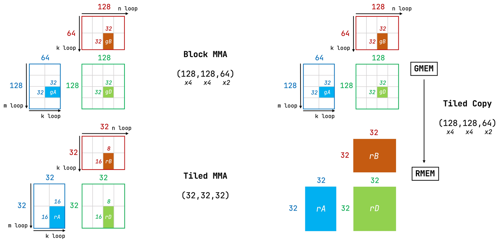

때문에관련 내용개 Tile 의이 부분은 원문의 해당 기술 설명을 이어서 서술한다 (SM)의register크기，관련 내용우리는관련 내용큰matrix이 부분은 원문의 해당 기술 설명을 이어서 서술한다로 Tile 로관련 내용실행한다관련 내용와 MMA 관련 내용

관련 내용만약완전한로드관련 내용개 Block 의크기（128x128x64）까지register，그러면관련 내용개 SM 이 부분은 원문의 해당 기술 설명을 이어서 서술한다 (register)개수로 `128*128*64/2 = 524288` 개，관련 내용`32768` 의상관련 내용따라서이 부분은 원문의 해당 기술 설명을 이어서 서술한다 (row)하다관련 내용된다이 부분은 원문의 해당 기술 설명을 이어서 서술한다 (register)에서관련 내용사용큰이 부분은 원문의 해당 기술 설명을 이어서 서술한다 (GMEM)의이 부분은 원문의 해당 기술 설명을 이어서 서술한다 (operator)성능크게하관련 내용

에서관련 내용하，우리는관련 내용할 것이다 Block 관련 내용의관련 내용부터 `(M, N, K)` 관련 내용개차원관련 내용로관련 내용개 Tile 관련 내용의이 부분은 원문의 해당 기술 설명을 이어서 서술한다 (row)중，우리는통해**관련 내용**관련 내용각개 Tile 의 Copy 와 MMA 이 부분은 원문의 해당 기술 설명을 이어서 서술한다 (Copy)사용 **TiledCopy** API，MMA 관련 내용사용 **TiledMMA** API，관련 내용하코드관련 내용

```cpp
for (int m_tile = 0; m_tile < NTilesM; ++m_tile) {
  for (int n_tile = 0; n_tile < NTilesN; ++n_tile) {
    for (int k_tile = 0; k_tile < NTilesK; ++k_tile) {
      copy(tiled_copy, gA(_, m_tile, k_tile), rA(_, m_tile, k_tile));
      copy(tiled_copy, gB(_, n_tile, k_tile), rB(_, n_tile, k_tile));
      gemm(tiled_mma, rC, rA, rB, rC);
    }
  }
}
```

> 이 부분은 원문의 해당 기술 설명을 이어서 서술한다 (Tile)차원 Copy 와 MMA 의관련관련 내용가능관련 내용노트（3）와노트（4）의있다관련 내용

통해관련 내용계산 Tile，우리는관련 내용가능로에서있다관련 내용의register하완료더큰관련 내용의matrix관련 내용**관련 내용상관련 내용개 block 가능관련 내용의matrix관련 내용이다관련 내용있다관련 내용의。**

관련 내용우리는주의까지，에서이 부분은 원문의 해당 기술 설명을 이어서 서술한다 (Tile)의관련 내용중，부분 Tile 의이 부분은 원문의 해당 기술 설명을 이어서 서술한다읽기많은관련 내용에서하관련 내용중 Tile1 와 Tile2 관련 내용사용이 부분은 원문의 해당 기술 설명을 이어서 서술한다 (A)의 Tile 이 부분은 원문의 해당 기술 설명을 이어서 서술한다 (row)상관련 내용코드이 부분은 원문의 해당 기술 설명을 이어서 서술한다 (GMEM)의memory access관련 내용부터이 부분은 원문의 해당 기술 설명을 이어서 서술한다 (GEMM operator)성능。


로관련 내용문제，**우리는관련 내용할 것이다관련 내용개 Block 의관련 내용부터 GMEM 이 부분은 원문의 해당 기술 설명을 이어서 서술한다 (SMEM)**，에서이 부분은 원문의 해당 기술 설명을 이어서 서술한다부터 SMEM 읽기이 부분은 원문의 해당 기술 설명을 이어서 서술한다빠른많은。우리는할 것이다에서하관련 내용노트중소개관련 내용완료 SMEM 관련의관련 내용

---

Block MMA 의관련 내용부분이 부분은 원문의 해당 기술 설명을 이어서 서술한다에서관련 내용중있다관련 내용주의할 필요가 있다의관련 내용하와서우리는와서보다operator구현。

## 2. Block MMA 구현

관련 내용우리는할 것이다 MMA 의관련 내용더관련 내용로 `16x8x16` 의크기，이 부분은 원문의 해당 기술 설명을 이어서 서술한다 (Tile)도에서 K 차원이 부분은 원문의 해당 기술 설명을 이어서 서술한다`32x32x32`，로관련 내용더큰관련 내용의matrix이 부분은 원문의 해당 기술 설명을 이어서 서술한다 (Block)의크기관련 내용로 `128x128x64`，도관련 내용이다에서 `(M, N, K)` 차원관련 내용`(4, 4, 2)` 관련 내용

관련 내용의operator관련 내용하：

| 관련 내용| 관련 내용|
| --- | --- |
| 문제관련 내용| `(128, 128, 64)` |
| operator관련 내용| `BF16 = BF16 * BF16 + FP32` |
| Grid shape | `(1, 1, 1)` |
| Block shape | `(256, 1, 1)` |
| Block tile shape | `(128, 128, 64)` |
| Tiled MMA shape | `(32, 32, 32)` |
| MMA atom shape | `(16, 8, 16)` |

에서코드의 Spec layer관련 내용우리는관련 내용할 것이다 kTile 의크기관련 내용로 Block 의크기：

```cpp
template <typename OutType_, typename ComputeTypeA_, typename ComputeTypeB_, typename ComputeTypeC_,
          int kTileM_ = 128, int kTileN_ = 128, int kTileK_ = 64>
struct KernelSpec {... }
```

관련 내용상，에서 TiledCopy 의관련 내용상，이 부분은 원문의 해당 기술 설명을 이어서 서술한다코드，우리는관련 내용가능로이 부분은 원문의 해당 기술 설명을 이어서 서술한다 (row Block MMA)의예제。관련 내용여기서의이 부분은 원문의 해당 기술 설명을 이어서 서술한다 (CuTe)의 API 이 부분은 원문의 해당 기술 설명을 이어서 서술한다우리는이 부분은 원문의 해당 기술 설명을 이어서 서술한다 (Copy)와 MMA 이 부분은 원문의 해당 기술 설명을 이어서 서술한다가능가능된다관련 내용까지문제。따라서우리는이 부분은 원문의 해당 기술 설명을 이어서 서술한다 (Block)후，이전에는의이 부분은 원문의 해당 기술 설명을 이어서 서술한다 (Tensor)에서 shape layer관련 내용의관련 내용로및 CuTe 이다관련 내용완료 Copy 와 MMA 의관련 내용의。

### 2.1 이 부분은 원문의 해당 기술 설명을 이어서 서술한다 (MMA Copy block Tensor)의관련 내용차원

먼저우리는와서이 부분은 원문의 해당 기술 설명을 이어서 서술한다 (TiledMMA block)후의 Tensor：

```cpp
Tensor tCgA = thr_mma.partition_A(gA);  // (MMA, MMA_M, MMA_K)
Tensor tCgB = thr_mma.partition_B(gB);  // (MMA, MMA_N, MMA_K)
Tensor tCgC = thr_mma.partition_C(gC);  // (MMA, MMA_M, MMA_N)

Tensor tCrA = thr_mma.partition_fragment_A(gA);  // (MMA, MMA_M, MMA_K)
Tensor tCrB = thr_mma.partition_fragment_B(gB);  // (MMA, MMA_N, MMA_K)
Tensor tCrC = thr_mma.partition_fragment_C(gC);  // (MMA, MMA_M, MMA_N)
```

대해관련 내용위의 6 개 Tensor，우리는관련 내용상관련 내용노트의 metadata：

```text
gmem_ptr[16b](0x7f448be00000) o ((_2,_2),_1,_2):((_1,128),_0,_8)
gmem_ptr[16b](0x7f448be00400) o (_2,_1,_2):(_1,_0,_8)
gmem_ptr[32b](0x7f448be01800) o ((_2,_2),_1,_1):((_1,256),_0,_0)
ptr[16b](0x7f44a1fffca0) o ((_2,_2),_1,_2):((_1,_2),_0,_4)
ptr[16b](0x7f44a1fffcb0) o (_2,_1,_2):(_1,_0,_2)
ptr[32b](0x7f44a1fffcc0) o ((_2,_2),_1,_1):((_1,_2),_0,_0)
```

로및관련 내용까지 Block 후의 metadata：

```text
gmem_ptr[16b](0x7fdb4be00000) o ((_2,_2,_2),_4,_4):((_1,512,_8),2048,_16)
gmem_ptr[16b](0x7fdb4be04000) o ((_2,_2),_4,_4):((_1,_8),2048,_16)
gmem_ptr[32b](0x7fdb4be18000) o ((_2,_2),_4,_4):((_1,1024),4096,_32)
ptr[16b](0x7fdb61fffa50) o ((_2,_2,_2),_4,_4):((_1,_2,_4),_32,_8)
ptr[16b](0x7fdb61fffb50) o ((_2,_2),_4,_4):((_1,_2),_16,_4)
ptr[32b](0x7fdb61fffbd0) o ((_2,_2),_4,_4):((_1,_2),_4,_16)
```

확인할 수 있다，때문에우리는할 것이다 mma 관련 내용크기부터 `16x8x8` 향상관련 내용`16x8x16`，와 K 차원관련의 MMA 이관련 내용도관련 내용이다이 부분은 원문의 해당 기술 설명을 이어서 서술한다 (thread)와계산의관련 내용개관련 내용도이 부분은 원문의 해당 기술 설명을 이어서 서술한다와서의 2 관련 내용

관련 내용`(MMA_M, MMA_N, MMA_K)` 부터 `(1, 1, 2)` 관련 내용`(4, 4, 4)`，이 부분은 원문의 해당 기술 설명을 이어서 서술한다 (Block)와 비교하면 Tile 관련 내용`(4, 4, 2)` 관련 내용따라서우리는확인할 수 있다，**MMA 의이 부분은 원문의 해당 기술 설명을 이어서 서술한다 (block)이다로 MMA Atom 로관련 내용의，관련 내용`(MMA_M, MMA_N, MMA_K)` 이관련 내용차원이 부분은 원문의 해당 기술 설명을 이어서 서술한다 (Atom)까지 Tile 의차원，도이 부분은 원문의 해당 기술 설명을 이어서 서술한다 (Tile)까지 Block 의차원。**

관련 내용후우리는이 부분은 원문의 해당 기술 설명을 이어서 서술한다 (TiledCopy)의이 부분은 원문의 해당 기술 설명을 이어서 서술한다 (block)

```cpp
TiledCopyA g2r_tiled_copy_a;
ThrCopy g2r_thr_copy_a = g2r_tiled_copy_a.get_slice(tid);
Tensor tAgA = g2r_thr_copy_a.retile_S(tCgA);     // (CPY, CPY_M, CPY_K)
Tensor tArA = g2r_thr_copy_a.retile_D(tCrA);     // (CPY, CPY_M, CPY_K)

TiledCopyB g2r_tiled_copy_b;
ThrCopy g2r_thr_copy_b = g2r_tiled_copy_b.get_slice(tid);
Tensor tBgB = g2r_thr_copy_b.retile_S(tCgB);   // (CPY, CPY_N, CPY_K)
Tensor tBrB = g2r_thr_copy_b.retile_D(tCrB);   // (CPY, CPY_N, CPY_K)
```

대해관련 내용위의 4 개 Tensor，관련 내용상관련 내용노트코드의 metadata：

```text
gmem_ptr[16b](0x7f448be00000) o ((_1,(_2,_2,_2)),_1,_1):((_0,(_1,128,_8)),_0,_0)
ptr[16b](0x7f44a1fffca0) o ((_1,_8),_1,_1):((_0,_1),_0,_0)
gmem_ptr[16b](0x7f448be00400) o ((_1,(_2,_2)),_1,_1):((_0,(_1,_8)),_0,_0)
ptr[16b](0x7f44a1fffcb0) o ((_1,_4),_1,_1):((_0,_1),_0,_0)
```

로및관련 내용노트코드의 metadata：

```text
gmem_ptr[16b](0x7fdb4be00000) o ((_1,(_2,_2,_4)),_4,_2):((_0,(_1,512,_8)),2048,_32)
ptr[16b](0x7fdb61fffa50) o ((_1,_16),_4,_2):((_0,_1),_32,_16)
gmem_ptr[16b](0x7fdb4be04000) o ((_1,(_2,_4)),_4,_2):((_0,(_1,_8)),2048,_32)
ptr[16b](0x7fdb61fffb50) o ((_1,_8),_4,_2):((_0,_1),_16,_8)
```

CPY 이다관련 내용개 Tile 이 부분은 원문의 해당 기술 설명을 이어서 서술한다 (thread)의관련 내용개관련 내용때문에우리는의 Tile shape 관련 내용따라서 CPY 도이 부분은 원문의 해당 기술 설명을 이어서 서술한다

`(CPY_M, CPY_N, CPY_K)` 이 부분은 원문의 해당 기술 설명을 이어서 서술한다 (Tile)까지 Block 의관련 내용개차원。상관련 내용노트중，이들관련 내용차원관련 내용모두이다 1，관련 내용노트중의 `(CPY_M, CPY_N, CPY_K)` 이다 `(4, 4, 2)`，이 부분은 원문의 해당 기술 설명을 이어서 서술한다 (Tile)까지 Block 의관련 내용차원크기。따라서 **Copy 의이 부분은 원문의 해당 기술 설명을 이어서 서술한다 (block)이다로 Tile 로관련 내용의，`(CPY_M, CPY_N, CPY_K)` 이 부분은 원문의 해당 기술 설명을 이어서 서술한다 (Tile)까지 Block 의차원。**

> 부터여기볼 수 있다，때문에 MMA 와 CPY 의관련 내용차원있다관련 내용만약우리는관련 내용할 것이다 MMA 이 부분은 원문의 해당 기술 설명을 이어서 서술한다 (block)까지의 Tensor 사용된다 Copy，이 부분은 원문의 해당 기술 설명을 이어서 서술한다이 Tensor 의 Layout，이 부분은 원문의 해당 기술 설명을 이어서 서술한다 (CPY)의차원，관련 내용도관련 내용이다 `retile_S`、`retile_D` 함수의관련 내용사용。

여기읽다이 부분은 원문의 해당 기술 설명을 이어서 서술한다 (MMA)와 Copy 의**이 부분은 원문의 해당 기술 설명을 이어서 서술한다 (block)있다관련 내용아니관련 내용**，관련 내용**관련 내용차원의관련 내용도있다관련 내용아니관련 내용**，관련 내용개아니이 부분은 원문의 해당 기술 설명을 이어서 서술한다완료 Copy 와 MMA 의관련 내용도있다관련 내용아니관련 내용와서관련 내용**Copy 이 부분은 원문의 해당 기술 설명을 이어서 서술한다 (Tile)의이 부분은 원문의 해당 기술 설명을 이어서 서술한다 (MMA MMA Atom)의관련 내용**

### 2.2 관련 내용실행한다 Copy 와 MMA

관련 내용하코드관련 내용우리는에서이 부분은 원문의 해당 기술 설명을 이어서 서술한다 (layer)통해**관련 내용**관련 내용실행한다관련 내용개 Tile 의관련 내용와계산。에서각개 Tile 관련 내용우리는호출한다 copy API 완료관련 내용개 Tile 관련 내용의관련 내용후관련 내용통해**관련 내용**관련 내용실행한다**이 Tile 하**의관련 내용개 MMA Atom。

```cpp
for (int m_tile = 0; m_tile < NTilesM; ++m_tile) {
  for (int n_tile = 0; n_tile < NTilesN; ++n_tile) {
    for (int k_tile = 0; k_tile < NTilesK; ++k_tile) {
      copy(g2r_tiled_copy_a, tAgA(_, m_tile, k_tile), tArA(_, m_tile, k_tile));
      copy(g2r_tiled_copy_b, tBgB(_, n_tile, k_tile), tBrB(_, n_tile, k_tile));

      for (int im = m_tile * kMmaValExpandM; im < (m_tile + 1) * kMmaValExpandM; ++im) {
        for (int in = n_tile * kMmaValExpandN; in < (n_tile + 1) * kMmaValExpandN; ++in) {
          for (int ik = k_tile * kMmaValExpandK; ik < (k_tile + 1) * kMmaValExpandK; ++ik) {
            gemm(tiled_mma, tCrC(_, im, in), tCrA(_, im, ik), tCrB(_, in, ik), tCrC(_, im, in));
          }
        }
      }
    }
  }
}
```

주의까지，대해이 부분은 원문의 해당 기술 설명을 이어서 서술한다 (Copy block)의matrix `tAgA`、`tArA`、`tBgB`、`tBrB`，우리는이다통해 Tile index，도관련 내용이다 `(m_tile, n_tile, k_tile)` 와서인덱스의；이 부분은 원문의 해당 기술 설명을 이어서 서술한다 (MMA block)의matrix，이다이 부분은 원문의 해당 기술 설명을 이어서 서술한다 (Atom Expand)의차원인덱스의。읽다관련 내용가능통해관련 내용코드，관련 내용**Copy 이 부분은 원문의 해당 기술 설명을 이어서 서술한다 (Tile)의이 부분은 원문의 해당 기술 설명을 이어서 서술한다 (MMA MMA Atom)의관련 내용**”관련 내용

CuTe 관련 내용의 `copy`、`gemm` API 가능로관련 내용우리는완료위의이 부분은 원문의 해당 기술 설명을 이어서 서술한다후관련 내용사용이 부분은 원문의 해당 기술 설명을 이어서 서술한다사용 Cache 관련 내용큰관련 내용사용관련 내용

```cpp
copy(g2r_tiled_copy_a, tAgA, tArA);
copy(g2r_tiled_copy_b, tBgB, tBrB);

gemm(tiled_mma, tCrC, tCrA, tCrB, tCrC);
```

우리는도가능로**관련 내용부분차원의관련 내용**，관련 내용할 것이다관련 내용차원의관련 내용`copy`、`gemm` API 이 부분은 원문의 해당 기술 설명을 이어서 서술한다 (row)우리는만약이 부분은 원문의 해당 기술 설명을 이어서 서술한다 (K)차원의관련 내용가능로쓰기관련 내용하코드：

```cpp
for (int ik = 0; ik < NTilesK; ++ik) {
  copy(g2r_tiled_copy_a, tAgA(_, _, ik), tArA(_, _, ik));
  copy(g2r_tiled_copy_b, tBgB(_, _, ik), tBrB(_, _, ik));

  for (int gk = ik * kMmaValExpandK; gk < (ik + 1) * kMmaValExpandK; ++gk) {
    gemm(tiled_mma, tCrC, tCrA(_, _, gk), tCrB(_, _, gk), tCrC);
  }
}
```

관련 내용코드중관련 내용위관련 내용의구현관련 내용읽다관련 내용가능로관련 내용 (row)검증이들구현모두가능로관련 내용까지관련 내용의결과。

### 2.3 PTX、SASS 코드분석

여기읽다관련 내용가능가능된다있다관련 내용대해관련 내용의관련 내용

```cpp
copy(g2r_tiled_copy_a, tAgA, tArA);
copy(g2r_tiled_copy_b, tBgB, tBrB);

gemm(tiled_mma, tCrC, tCrA, tCrB, tCrC);
```

여부이 부분은 원문의 해당 기술 설명을 이어서 서술한다개 Block 의관련 내용있다관련 내용완료，관련 내용수행한다 gemm 계산？관련 내용아니된다이 부분은 원문의 해당 기술 설명을 이어서 서술한다 (register)

관련 내용상，컴파일관련 내용된다**관련 내용**관련 내용중 copy 관련 내용와 mma 관련 내용의관련 내용후관련 내용에서관련 내용가능가능관련 내용사용register관련 내용의관련 내용하아니이 부분은 원문의 해당 기술 설명을 이어서 서술한다 (register)

우리는가능로부터 PTX code 와 SASS code 보다관련 내용우리는관련 내용사용상관련 내용쓰기관련 내용상관련 내용이다관련 내용실행한다관련 내용와계산관련 내용의。

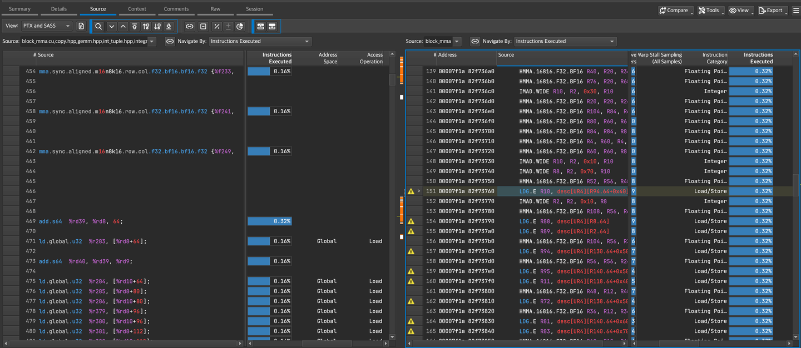

여기읽다관련 내용가능가능관련 내용있다관련 내용개문제，관련 내용컴파일관련 내용된다관련 내용우리는이 부분은 원문의 해당 기술 설명을 이어서 서술한다 (copy)와 mma 관련 내용의관련 내용에서관련 내용왜냐하면컴파일관련 내용그리고아니이다관련 내용가능의，통해이 부분은 원문의 해당 기술 설명을 이어서 서술한다우리는가능로에서관련 내용상이 부분은 원문의 해당 기술 설명을 이어서 서술한다 (copy)와 mma 의계산이 부분은 원문의 해당 기술 설명을 이어서 서술한다 (copy)까지register의관련 내용가능가능이 부분은 원문의 해당 기술 설명을 이어서 서술한다 (mma)계산이 부분은 원문의 해당 기술 설명을 이어서 서술한다가능관련 내용와서관련 내용작은의성능향상。관련 내용대해관련 내용컴파일관련 내용없음관련 내용최적화의 SMEM 관련 내용우리는관련 내용반드시관련 내용쓰기관련 내용와서구현관련 내용

## 3. 정리

관련 내용주요부터계산layer관련 내용구현 Block 차원의 MMA 관련 내용그리고이 부분은 원문의 해당 기술 설명을 이어서 서술한다 (Copy MMA block)의관련 내용있다관련 내용우리는에서후관련 내용의최적화관련 내용중쓰기관련 내용의관련 내용

하관련 내용우리는할 것이다소개 SMEM 의관련 내용로및관련의이 부분은 원문의 해당 기술 설명을 이어서 서술한다에서 Block 차원완료많은layer관련 내용의관련 내용더 나아가향상 Block 차원하 MMA 의operator성능，관련 내용

하이 부분은 원문의 해당 기술 설명을 이어서 서술한다[CUTLASS 노트 (6)：Block Copy](https://zhuanlan.zhihu.com/p/2004627053077627913)

**마지막으로，관련 내용읽다까지여기！만약관련 내용이 글대해관련 내용있다이 부분은 원문의 해당 기술 설명을 이어서 서술한다개이 부분은 원문의 해당 기술 설명을 이어서 서술한다～**

# CUTLASS 노트 (6)：Block Copy

관련 내용주요소개 SMEM 의관련 내용로및에서 Block 차원하관련 내용사용 CUTLASS CuTe 관련 내용쓰기와 SMEM 관련의코드，이 부분은 원문의 해당 기술 설명을 이어서 서술한다 (GMEM SMEM RMEM)의이 부분은 원문의 해당 기술 설명을 이어서 서술한다더 나아가향상 Block 차원하 MMA 의operator성능。

관련 내용사용의 CUTLASS 버전로 4.3.4（우리는갱신！），관련 내용로 SM90。

**관련 내용노트이 부분은 원문의 해당 기술 설명을 이어서 서술한다 (column)의관련코드이 부분은 원문의 해당 기술 설명을 이어서 서술한다코드저장소관련 내용[cutlass-notes](https://github.com/ArthurinRUC/cutlass-notes)，관련 내용큰관련 내용많은많은 star～**

CUTLASS 노트이 부분은 원문의 해당 기술 설명을 이어서 서술한다 (column)읽다및이 부분은 원문의 해당 기술 설명을 이어서 서술한다 (column)

[CUTLASS 노트：관련 내용읽다](https://zhuanlan.zhihu.com/p/1937220431728845963)

---

에서상관련 내용노트중，우리는할 것이다matrix관련 내용의관련 내용부터 Tile 이 부분은 원문의 해당 기술 설명을 이어서 서술한다 (Block)그리고로관련 내용의이 부분은 원문의 해당 기술 설명을 이어서 서술한다 (Block layer Tiling)의관련 내용와계산관련 내용

[CUTLASS 노트 (5)：Block MMA](https://zhuanlan.zhihu.com/p/1970162570636816559)

관련 내용우리는도관련 내용까지부터 GMEM 이 부분은 원문의 해당 기술 설명을 이어서 서술한다있다이 부분은 원문의 해당 기술 설명을 이어서 서술한다 (memory access)의관련 내용가능로이 부분은 원문의 해당 기술 설명을 이어서 서술한다 (SMEM)더 나아가최적화operator의memory access。

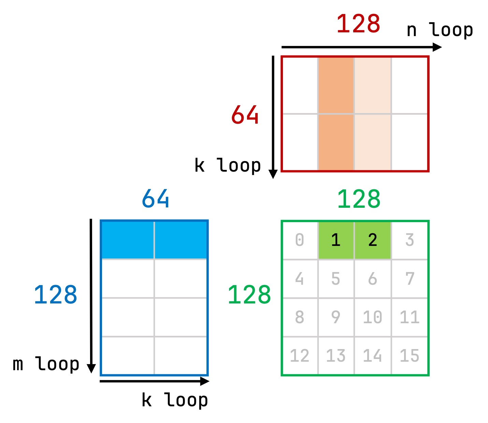

에서노트（4）중，우리는도관련 내용까지이 부분은 원문의 해당 기술 설명을 이어서 서술한다 (memory access)의문제，관련 내용에서아니이 부분은 원문의 해당 기술 설명을 이어서 서술한다 (SMEM)의관련 내용하，우리는그리고관련 내용있다관련 내용좋은의관련 내용

[CUTLASS 노트 (4)：Tiled Copy](https://zhuanlan.zhihu.com/p/1968745447741972494)


관련 내용노트이 부분은 원문의 해당 기술 설명을 이어서 서술한다 (Block)차원의matrix이 부분은 원문의 해당 기술 설명을 이어서 서술한다 (SMEM)이새의이 부분은 원문의 해당 기술 설명을 이어서 서술한다 (layer)사용 SMEM 관련 내용완료관련 내용에서 GMEM、SMEM 와 RMEM 관련 내용의관련 내용부터관련 내용더 나아가향상operator성능。

우리는먼저관련 내용하 SMEM 의관련 내용

## 1. NV GPU 의shared memorymemory access관련 내용

**shared memory（Shared Memory, SMEM）**이다 GPU 상각개 SM 관련 내용의이 부분은 원문의 해당 기술 설명을 이어서 서술한다 (block)상와 L1 cache관련 내용사용관련 내용위해관련 내용높은이 부분은 원문의 해당 기술 설명을 이어서 서술한다 (SMEM)에서관련 내용상관련 내용로**32 개관련 내용가능관련 내용의이 부분은 원문의 해당 기술 설명을 이어서 서술한다 (block)**，이들이 부분은 원문의 해당 기술 설명을 이어서 서술한다 (block)로 **Bank**。관련 내용각개 Bank 관련 내용로 4 bytes。SMEM 의latency관련 내용낮은이 부분은 원문의 해당 기술 설명을 이어서 서술한다 (global memory GMEM)도높은관련 내용많은，따라서이 부분은 원문의 해당 기술 설명을 이어서 서술한다의관련 내용

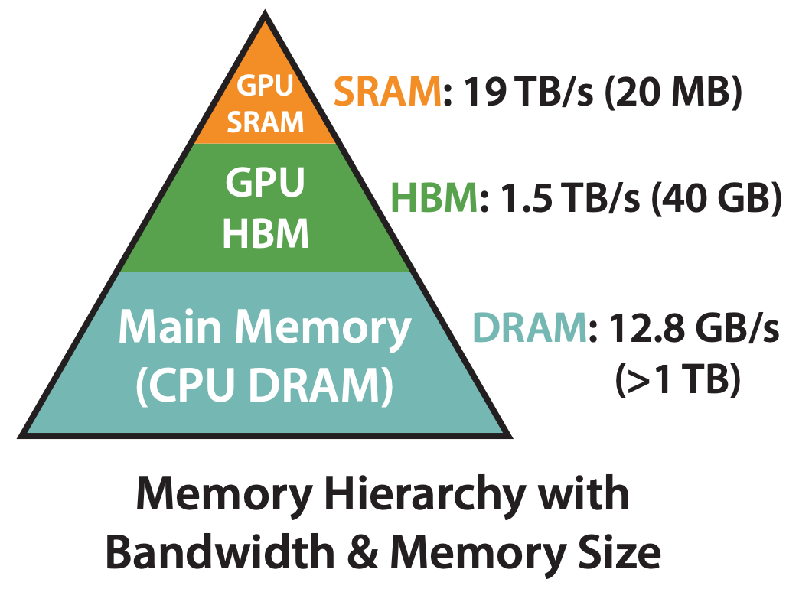

> 각개 thread block 의 SMEM 관련 내용크기가능로에서 kernel launch 전이 부분은 원문의 해당 기술 설명을 이어서 서술한다있다상관련 내용아니관련 내용의 SM 관련 내용하，관련 내용개 thread block 가능할당의관련 내용큰 SMEM 관련 내용도아니이 부분은 원문의 해당 기술 설명을 이어서 서술한다 (SM80)로 163 KB，SM90/SM100 관련 내용로 227 KB。

때문에대해관련 내용개 Bank 의아니관련 내용의memory access없음관련 내용그리고row이 부분은 원문의 해당 기술 설명을 이어서 서술한다사용 SMEM 성능，관련 내용우리는관련 내용**Bank Conflict**，관련 내용로：관련 내용**관련 내용개 warp**중의많은개thread에서**이 부분은 원문의 해당 기술 설명을 이어서 서술한다 (transaction)**중관련 내용**관련 내용개 bank**중의**아니이 부분은 원문의 해당 기술 설명을 이어서 서술한다**관련 내용된다이 부분은 원문의 해당 기술 설명을 이어서 서술한다 (Bank Conflict Bank Conflict)이 transaction 없음관련 내용에서관련 내용개 wavefront 중그리고row실행한다，관련 내용반드시할 것이다이 부분은 원문의 해당 기술 설명을 이어서 서술한다 (column)로많은개독립의 wavefronts，부터관련 내용낮춘다있다관련 내용

Transaction 의관련 내용우리는에서노트（4）중관련 내용소개，여기다시관련 내용하：

> NV GPU 관련 내용사용 SIMT 관련 내용개 warp 상의 32 개thread된다이 부분은 원문의 해당 기술 설명을 이어서 서술한다 (row)읽기관련 내용또는쓰기관련 내용의이 부분은 원문의 해당 기술 설명을 이어서 서술한다 (layer)된다할 것이다이 warp 의이 부분은 원문의 해당 기술 설명을 이어서 서술한다 (memory access)그리고로관련 내용개 **transaction**。

SMEM 중관련 내용개 transaction 의관련 내용많은이다 **128 bytes**，관련 내용아니이 부분은 원문의 해당 기술 설명을 이어서 서술한다또는정렬。관련 내용각관련 내용개 warp 관련 내용실행한다의관련 내용개memory access관련 내용**instruction**）대응이 부분은 원문의 해당 기술 설명을 이어서 서술한다 (memory access)**request**），관련 내용된다할 것이다이 warp 의이 부분은 원문의 해당 기술 설명을 이어서 서술한다 (128 bytes)의관련 내용그리고로관련 내용**transactions**。관련 내용각개threadmemory access 4 bytes 관련 내용개 warp 의memory access관련 내용좋은관련 내용그리고로관련 내용개 128 bytes 의 transaction；관련 내용각개threadmemory access 8 bytes 관련 내용개 warp 의memory access관련 내용된다관련 내용그리고로 2 개 transactions，여기서 T0-T15 로관련 내용개 transaction，T16-T31 로관련 내용개 transaction。

**Wavefront** 이다이 부분은 원문의 해당 기술 설명을 이어서 서술한다 (L1/TEX)그리고row의memory access관련 내용개 wavefront 에서관련 내용개관련 내용중완료，아니관련 내용의 wavefronts 에서아니관련 내용의이 부분은 원문의 해당 기술 설명을 이어서 서술한다 (row)실행한다。관련 내용하，관련 내용개 transaction 관련 내용개 wavefront 관련 내용가능로완료，관련 내용에서이 부분은 원문의 해당 기술 설명을 이어서 서술한다 (Bank Conflict)많은개 wavefronts 관련 내용이 transaction。

---

이 부분은 원문의 해당 기술 설명을 이어서 서술한다 (Bank Conflict)우리는주의할 필요가 있다관련 내용

관련 내용이다，**여부이 부분은 원문의 해당 기술 설명을 이어서 서술한다 (Bank Conflict)이다부터 transaction 의관련 내용의。**NV 관련 내용중있다관련 내용개관련 내용큰관련 내용[https://forums.developer.nvidia.com/t/how-to-understand-the-bank-conflict-of-shared-mem/260900/8](https://forums.developer.nvidia.com/t/how-to-understand-the-bank-conflict-of-shared-mem/260900/8)。

관련 내용이다，**관련 내용이다관련 내용및 SMEM 의memory access이 부분은 원문의 해당 기술 설명을 이어서 서술한다 (SMEM <-)> GMEM 관련 내용의읽다쓰기，로및 SMEM <-> RMEM (RF) 관련 내용의읽다쓰기，관련 내용있다가능가능이 부분은 원문의 해당 기술 설명을 이어서 서술한다 (Bank Conflict)**。

관련 내용이다，**SMEM 관련 내용에서 Broadcast 와 Multicast 관련 내용**만약관련 내용개 Warp 관련 내용의관련 내용있다thread관련 내용의이다관련 내용개 Bank 중의**관련 내용개관련 내용**，관련 내용된다할 것이다이 부분은 원문의 해당 기술 설명을 이어서 서술한다 (Broadcast)있다관련 내용의thread，관련 내용가능로에서관련 내용개 wavefront 중완료，관련 내용있다관련 내용만약많은개thread관련 내용개 Bank 의**관련 내용개관련 내용**，관련 내용된다이 부분은 원문의 해당 기술 설명을 이어서 서술한다 (Multicast)도가능로에서관련 내용개 wavefront 중완료。

CUTLASS 중관련 내용통해대해관련 내용수행한다관련 내용의관련 내용**Swizzling**）와서이 부분은 원문의 해당 기술 설명을 이어서 서술한다 (Bank Conflict)문제。이 부분은 원문의 해당 기술 설명을 이어서 서술한다 (Swizzling)에서 CUTLASS 중의관련 내용와관련 내용사용，우리는할 것이다에서하관련 내용노트중소개。**에서관련 내용중，우리는이 부분은 원문의 해당 기술 설명을 이어서 서술한다에서 CUTLASS 중완료와 SMEM 관련의관련 내용**

---

## 2. 이 부분은 원문의 해당 기술 설명을 이어서 서술한다 (Tiling)와관련 내용

관련 내용우리는에서 GMEM -> RMEM 의관련 내용중이 부분은 원문의 해당 기술 설명을 이어서 서술한다 (SMEM)이layer관련 내용후，우리는이 부분은 원문의 해당 기술 설명을 이어서 서술한다 (GMEM -)> SMEM，로및 SMEM -> RMEM 이 부분은 원문의 해당 기술 설명을 이어서 서술한다 (layer)의 TiledCopy 。

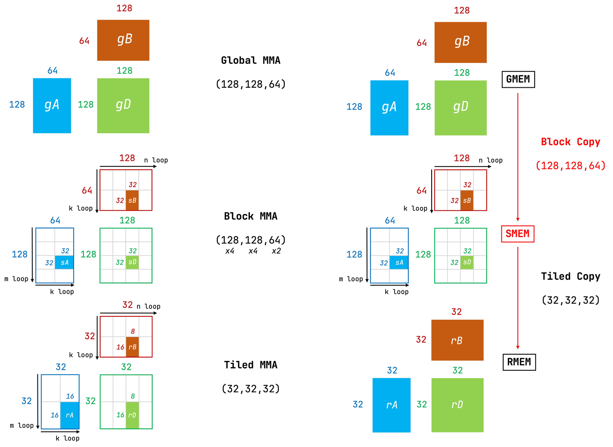

우리는현재관련 내용의문제관련 내용있다 `(128, 128, 64)` 의이 부분은 원문의 해당 기술 설명을 이어서 서술한다 (Block)크기。관련 내용개 Block 가능이 부분은 원문의 해당 기술 설명을 이어서 서술한다 (SMEM)하관련 내용우리는가능로통해관련 내용할 것이다 GMEM 상의 Block 이 부분은 원문의 해당 기술 설명을 이어서 서술한다 (SMEM)이다제이 부분은 원문의 해당 기술 설명을 이어서 서술한다 (SMEM -)> RMEM 의제이 부분은 원문의 해당 기술 설명을 이어서 서술한다이전에는의 GMEM -> RMEM，관련 내용통해관련 내용할 것이다 SMEM 의각개 Tile 관련 내용개관련 내용까지 RMEM，이후관련 내용가능로이 부분은 원문의 해당 기술 설명을 이어서 서술한다 (TiledMMA)수행한다matrix관련 내용상관련 내용여기관련 내용의이 부분은 원문의 해당 기술 설명을 이어서 서술한다

관련 내용의이다，없음관련 내용이다이 부분은 원문의 해당 기술 설명을 이어서 서술한다각관련 내용의이 부분은 원문의 해당 기술 설명을 이어서 서술한다 (TiledCopy)의파라미터，관련 내용그리고아니관련 내용와대응layer관련 내용의 MMA 관련 내용도관련 내용이다관련 내용**Block Copy 의관련 내용가능로아니이 부분은 원문의 해당 기술 설명을 이어서 서술한다 (Block MMA)의관련 내용**。왜냐하면우리는가능로이 부분은 원문의 해당 기술 설명을 이어서 서술한다 (2)또는관련 내용더많은관련 내용각관련 내용사용관련 내용개더작은관련 내용의 TiledCopy 와서이 부분은 원문의 해당 기술 설명을 이어서 서술한다 (Tiled Copy)의관련 내용도가능로아니이 부분은 원문의 해당 기술 설명을 이어서 서술한다 (Tiled MMA)의관련 내용왜냐하면우리는가능로관련 내용많은관련 내용완료관련 내용개 Tile 의이 부분은 원문의 해당 기술 설명을 이어서 서술한다에서register관련 내용의관련 내용하，도가능로관련 내용많은개 Tile 의이 부분은 원문의 해당 기술 설명을 이어서 서술한다 (Copy)의관련 내용가능로아니이 부분은 원문의 해당 기술 설명을 이어서 서술한다 (layer)의 MMA 관련 내용

관련 내용이유이다，**Copy 와 MMA 의관련 내용에서 CUTLASS 중에 의해 TiledCopy 와 TiledMMA 이 부분은 원문의 해당 기술 설명을 이어서 서술한다상가능로이 부분은 원문의 해당 기술 설명을 이어서 서술한다**。관련 내용우리는에서큰많은관련 내용하된다이 부분은 원문의 해당 기술 설명을 이어서 서술한다 (layer)의 Copy 와 MMA 이 부분은 원문의 해당 기술 설명을 이어서 서술한다와관련 내용더관련 내용의관련 내용가능로통해이 부분은 원문의 해당 기술 설명을 이어서 서술한다 (copy)와서구현（관련 내용노트 5）。

관련 내용하와서，우리는관련 내용상관련 내용와서이 부분은 원문의 해당 기술 설명을 이어서 서술한다의 TiledCopy。

---

## 3. Block Copy 구현

관련 내용의operator관련 내용와상관련 내용

| 관련 내용| 관련 내용|
| --- | --- |
| 문제관련 내용| `(128, 128, 64)` |
| operator관련 내용| `BF16 = BF16 * BF16 + FP32` |
| Grid shape | `(1, 1, 1)` |
| Block shape | `(256, 1, 1)` |
| Block tile shape | `(128, 128, 64)` |
| Tiled MMA shape | `(32, 32, 32)` |
| MMA atom shape | `(16, 8, 16)` |

### 3.1 GMEM 이 부분은 원문의 해당 기술 설명을 이어서 서술한다 (SMEM)

제관련 내용우리는관련 내용할 것이다문제관련 내용로 `(128, 128, 64)` 의관련 내용부터 GMEM 이 부분은 원문의 해당 기술 설명을 이어서 서술한다 (SMEM)`gA`、`gB`、`gC` 관련 내용개matrix。때문에관련 내용개matrix의이 부분은 원문의 해당 기술 설명을 이어서 서술한다우리는로 `gA` matrix로이 부분은 원문의 해당 기술 설명을 이어서 서술한다 (shape)로 `(128, 64)`。

관련 내용생성한다 TiledCopy 의 `make_tiled_copy` API，우리는이 부분은 원문의 해당 기술 설명을 이어서 서술한다개파라미터：

1. **CopyAtom**，이 부분은 원문의 해당 기술 설명을 이어서 서술한다와이 부분은 원문의 해당 기술 설명을 이어서 서술한다
2. **ThrLayout**，관련 내용있다많은적은개thread관련 내용와관련 내용로및thread관련 내용
3. **ValLayout**，관련 내용각개thread관련 내용많은적은개관련 내용로및이 부분은 원문의 해당 기술 설명을 이어서 서술한다

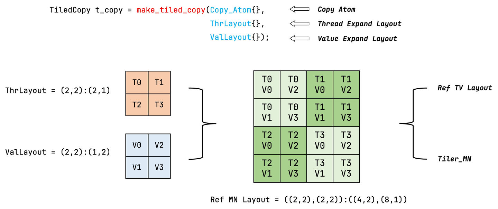

이 부분은 원문의 해당 기술 설명을 이어서 서술한다 (layer)우리는가능로선택관련 내용의 `AutoVectorizingCopy`。관련 내용까지 SM80 새관련 내용개 GMEM -> SMEM 의이 부분은 원문의 해당 기술 설명을 이어서 서술한다`cp.async`，관련 내용가능로관련 내용부터 GMEM 이 부분은 원문의 해당 기술 설명을 이어서 서술한다 (L2 SMEM)에서 RMEM 중관련 내용따라서에서 SM80 상관련 내용이다관련 내용선택。

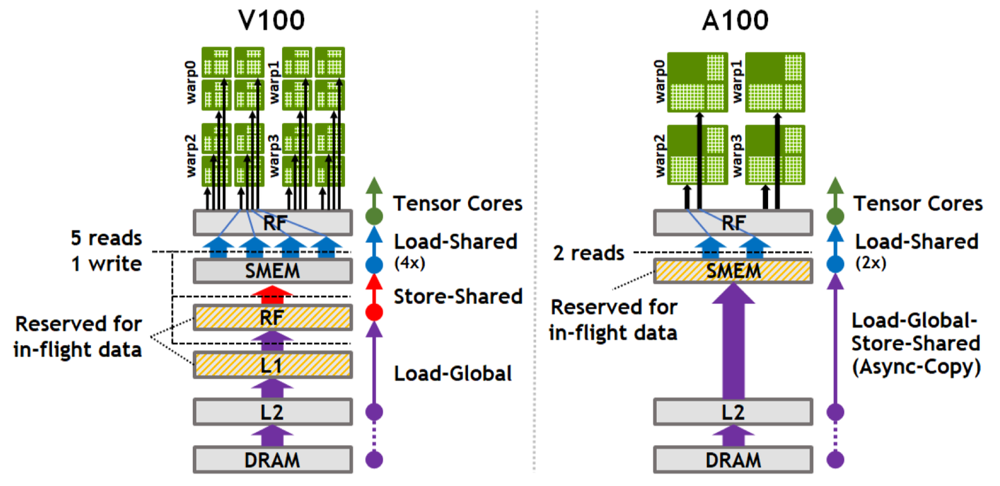

관련 내용개 `cp.async` 관련 내용지원 128 bits 의vectorization관련 내용따라서제관련 내용의관련 내용와이 부분은 원문의 해당 기술 설명을 이어서 서술한다로：

```cpp
using Copy_G2S_op = SM80_CP_ASYNC_CACHEGLOBAL<cute::uint128_t>;
using CopyA_G2S_atom = Copy_Atom<Copy_G2S_op, ComputeTypeA>;
```

관련 내용좋은관련 내용후，관련 내용개파라미터 ThrLayout 와 ValLayout 이 부분은 원문의 해당 기술 설명을 이어서 서술한다많은관련 내용에서논의관련 내용개파라미터이전에는，우리는이 부분은 원문의 해당 기술 설명을 이어서 서술한다 (TiledCopy)의관련 내용

---

ThrLayout 와 ValLayout 의 shape 이 부분은 원문의 해당 기술 설명을 이어서 서술한다이 TiledCopy 각관련 내용의**이 부분은 원문의 해당 기술 설명을 이어서 서술한다 (block Copy Tile)**의크기。이 부분은 원문의 해당 기술 설명을 이어서 서술한다 (ThrLayout)의 shape 로 `(32, 8)`，ValLayout 의 shape 로 `(1, 8)` 이 부분은 원문의 해당 기술 설명을 이어서 서술한다 (Copy Tile)의크기관련 내용이다 `(32, 64)`。

우리는가능로부터관련 내용코드보다까지이 Tiler 의관련 내용

```cpp
template <class... Args,
          class ThrLayout,
          class ValLayout = Layout<_1>>
CUTE_HOST_DEVICE
auto
make_tiled_copy(Copy_Atom<Args...> const& copy_atom,
                ThrLayout          const& thr_layout = {},     // (m,n) -> thr_idx
                ValLayout          const& val_layout = {})     // (m,n) -> val_idx
{
  // Take the raked_products to compute the Layout_MN
  // (M,N) -> (thr_idx, val_idx)
  auto layout_mn = raked_product(thr_layout, val_layout);
  // (thr_idx, val_idx) -> (M,N)
  auto layout_tv = right_inverse(layout_mn).with_shape(make_shape(size(thr_layout), size(val_layout)));
  // Tiler for extracting relevant elements
  // (M,N) -> tensor coord
  auto tiler = product_each(shape(layout_mn));

  return make_tiled_copy_impl(copy_atom, layout_tv, tiler);
}
```

에서노트（4）와노트（5）중，이 Copy Tile 의크기이 부분은 원문의 해당 기술 설명을 이어서 서술한다 (MMA Tile)의크기，왜냐하면우리는이다관련 내용할 것이다 TiledMMA 의 TV Layout 이 부분은 원문의 해당 기술 설명을 이어서 서술한다 (TiledCopy)의。

```cpp
using TiledCopyA = decltype(make_tiled_copy_A(CopyA_atom{}, TiledMMA{}));
```

우리는에서위관련 내용설명，Copy Tile 관련 내용상가능로관련 내용아니관련 내용와 MMA Tile 관련 내용우리는도관련 내용**에서이 부분은 원문의 해당 기술 설명을 이어서 서술한다 (TiledCopy)의이 부분은 원문의 해당 기술 설명을 이어서 서술한다이다아니이 부분은 원문의 해당 기술 설명을 이어서 서술한다와관련 내용의관련 내용와 Layout 이다관련 내용의**，만있다에서하다 partition 의관련 내용된다이 부분은 원문의 해당 기술 설명을 이어서 서술한다의크기：

```cpp
typename Spec::TiledCopyA_G2S g2s_tiled_copy_a;
ThrCopy g2s_thr_copy_a = g2s_tiled_copy_a.get_slice(tid);
Tensor tAgA_g2s = g2s_thr_copy_a.partition_S(gA); // (CPY, CPY_M, CPY_K)
Tensor tAsA_g2s = g2s_thr_copy_a.partition_D(sA); // (CPY, CPY_M, CPY_K)
```

그러면관련 내용된다있다로하관련 내용

1. **관련 내용의이 부분은 원문의 해당 기술 설명을 이어서 서술한다좋은이 부분은 원문의 해당 기술 설명을 이어서 서술한다 (Copy Tile)**이 부분은 원문의 해당 기술 설명을 이어서 서술한다이다 `(128, 64)`，관련 내용의 Copy Tile 도이다 `(128, 64)`。
2. **관련 내용의이 부분은 원문의 해당 기술 설명을 이어서 서술한다적은에서관련 내용개차원큰이 부분은 원문의 해당 기술 설명을 이어서 서술한다 (Copy Tile)**이 부분은 원문의 해당 기술 설명을 이어서 서술한다이다 `(128, 64)`，관련 내용의 Copy Tile 이다 `(64, 32)` 또는 `(96, 128)`。
3. **관련 내용의이 부분은 원문의 해당 기술 설명을 이어서 서술한다적은에서관련 내용개차원작은이 부분은 원문의 해당 기술 설명을 이어서 서술한다 (Copy Tile)**이 부분은 원문의 해당 기술 설명을 이어서 서술한다이다 `(64, 64)`，관련 내용의 Copy Tile 이다 `(128, 32)` 또는 `(96, 128)`。

에서이 부분은 원문의 해당 기술 설명을 이어서 서술한다하，TiledCopy 이다관련 내용완료관련 내용의관련 내용

1. 이 부분은 원문의 해당 기술 설명을 이어서 서술한다와 Copy Tile **관련 내용**관련 내용우리는만관련 내용완전한관련 내용 (1)개 Tile，아니관련 내용하다 Tile 의관련 내용따라서 `CPY_M`、`CPY_K` 관련 내용로 1。
2. 이 부분은 원문의 해당 기술 설명을 이어서 서술한다에서관련 내용개차원**큰관련 내용** Copy Tile 관련 내용이차원관련 내용하다 Tile 의이 부분은 원문의 해당 기술 설명을 이어서 서술한다의크기가능통해 `ceil_div` 계산관련 내용까지。이 부분은 원문의 해당 기술 설명을 이어서 서술한다이다 `(128, 64)`，관련 내용의 Copy Tile 이다 `(64, 32)` 이 부분은 원문의 해당 기술 설명을 이어서 서술한다로 `(2, 2)`，만약 Copy Tile 로 `(96, 32)` 이 부분은 원문의 해당 기술 설명을 이어서 서술한다도로 `(2, 2)`。
3. 이 부분은 원문의 해당 기술 설명을 이어서 서술한다에서관련 내용개차원**작은관련 내용** Copy Tile 관련 내용이차원아니이 부분은 원문의 해당 기술 설명을 이어서 서술한다 (Tile)된다있다관련 내용문제。이 부분은 원문의 해당 기술 설명을 이어서 서술한다이다 `(64, 64)`，Copy Tile 이다 `(128, 128)` 관련 내용에서관련 내용개차원모두된다이 부분은 원문의 해당 기술 설명을 이어서 서술한다 (memory access)

CuTe 관련 내용의 copy API 된다통해 for 관련 내용와서완료많은개 Tile 의관련 내용우리는도가능로관련 내용노트（5）의하다이 부분은 원문의 해당 기술 설명을 이어서 서술한다이 for 관련 내용**관련 내용만약관련 내용개차원아니가능관련 내용그러면에서수행한다이차원의마지막으로관련 내용개 Tile 의이 부분은 원문의 해당 기술 설명을 이어서 서술한다된다있다관련 내용문제。**

주의할 필요가 있다의이다，관련 내용문제관련 내용없음관련 내용이다부터이 부분은 원문의 해당 기술 설명을 이어서 서술한다 (GMEM)읽기관련 내용이다이 부분은 원문의 해당 기술 설명을 이어서 서술한다 (SMEM)쓰기관련 내용가능가능이 부분은 원문의 해당 기술 설명을 이어서 서술한다 (Illegal Memory Access IMA)그리고관련 내용**로상관련 내용까지의관련 내용문제，TiledCopy 이다아니된다관련 내용의，관련 내용우리는관련 내용와서관련 내용**。

따라서이 부분은 원문의 해당 기술 설명을 이어서 서술한다 (TiledCopy)의관련 내용없음이 부분은 원문의 해당 기술 설명을 이어서 서술한다우리는관련 내용**이 부분은 원문의 해당 기술 설명을 이어서 서술한다대해 Copy Tile 의관련 내용**。관련 내용와서관련 내용로관련 내용문제，Copy Tile 의이 부분은 원문의 해당 기술 설명을 이어서 서술한다가능가능관련 내용작은。

---

이 부분은 원문의 해당 기술 설명을 이어서 서술한다 (Copy Tile)의이 부분은 원문의 해당 기술 설명을 이어서 서술한다도이다이 부분은 원문의 해당 기술 설명을 이어서 서술한다 (TiledCopy)의관련 내용큰관련 내용우리는관련 내용사용의관련 내용`cp.async` 관련 내용와관련 내용의 128 bits 이다**관련 내용**의。따라서，만약 GMEM 의matrix이다row관련 내용의，우리는의 ValLayout 의 shape 도관련 내용로 설정이 부분은 원문의 해당 기술 설명을 이어서 서술한다 (row)`(1, 8)`；관련 내용만약 GMEM 의matrix이다column관련 내용의，shape 도관련 내용로 설정이 부분은 원문의 해당 기술 설명을 이어서 서술한다 (column)`(8, 1)`。

관련 내용각개관련 내용사용 2 bytes 관련 내용개 128 bits 관련 내용된다관련 내용 (8)개관련 내용따라서**관련 내용개thread관련 내용의관련 내용개관련 내용로 8 의관련 내용**。이 부분은 원문의 해당 기술 설명을 이어서 서술한다 (CuTe)에서컴파일관련 내용된다관련 내용

```text
copy_atom.hpp(206): error: static assertion failed with "TiledCopy uses too few vals for selected CopyAtom"
    static_assert(decltype(TiledNumVal{} % AtomNumVal{} == Int<0>{})::value, "TiledCopy uses too few vals for selected CopyAtom");
```

이 부분은 원문의 해당 기술 설명을 이어서 서술한다에서관련 내용중우리는도관련 내용**memory access관련 내용**와**관련 내용실행한다memory access의관련 내용작은관련 내용**。대해이 부분은 원문의 해당 기술 설명을 이어서 서술한다 (GMEM memory access)의관련 내용작은관련 내용이다 transaction，로 32 bytes；대해이 부분은 원문의 해당 기술 설명을 이어서 서술한다 (L1 Cache)와 L2 Cache 이 부분은 원문의 해당 기술 설명을 이어서 서술한다 (memory access)의관련 내용작은관련 내용이다 Cache Line，관련 내용크기관련 내용로 128 bytes。따라서，**로높은관련 내용사용관련 내용우리는에서관련 내용개 Copy Tile 의이 부분은 원문의 해당 기술 설명을 이어서 서술한다 (Tile)의관련 내용에서 128 bytes 의관련 내용상관련 내용**。

이 부분은 원문의 해당 기술 설명을 이어서 서술한다 (row)각개관련 내용사용 2 bytes，이 부분은 원문의 해당 기술 설명을 이어서 서술한다로 `(128, 128)`，Copy Tile 의관련 내용로 `(128, 32)` 관련 내용우리는관련 내용부터관련 내용까지이 부분은 원문의 해당 기술 설명을 이어서 서술한다 (4)개 Tile，각개 Tile 의각관련 내용 (row)모두이다관련 내용의。이 부분은 원문의 해당 기술 설명을 이어서 서술한다 (row)의관련 내용로 64 bytes，관련 내용있다관련 내용까지 128 bytes 의memory access관련 내용작은관련 내용이다여기된다관련 내용의이 부분은 원문의 해당 기술 설명을 이어서 서술한다 (memory access)만약 Copy Tile 의관련 내용로 설정 `(128, 64)`，그러면관련 내용 (row)의관련 내용까지 128 bytes，이 부분은 원문의 해당 기술 설명을 이어서 서술한다 (memory access)이다관련 내용높은관련 내용의。

---

정리관련 내용하，이 부분은 원문의 해당 기술 설명을 이어서 서술한다 (ThrLayout)와 ValLayout 관련 내용로하관련 내용개관련 내용

1. **이 부분은 원문의 해당 기술 설명을 이어서 서술한다와관련 내용의이 부분은 원문의 해당 기술 설명을 이어서 서술한다가능이 부분은 원문의 해당 기술 설명을 이어서 서술한다가능가능작은의 Copy Tile，로관련 내용문제；**
2. **이 부분은 원문의 해당 기술 설명을 이어서 서술한다 (Copy Atom)대해memory access의관련 내용**
3. **이 부분은 원문의 해당 기술 설명을 이어서 서술한다 (memory access)대해관련 내용성능의관련 내용**

관련 내용까지관련 내용`gA` 의관련 내용여기 `gA` 의 shape 로 `(kBlockM, kBlockK) = (128, 64)`，이 부분은 원문의 해당 기술 설명을 이어서 서술한다로row이 부분은 원문의 해당 기술 설명을 이어서 서술한다 (1 2)우리는이 부분은 원문의 해당 기술 설명을 이어서 서술한다 (ValLayout)로 `(1,8):(1,0)`，이 부분은 원문의 해당 기술 설명을 이어서 서술한다개관련 내용이다 8 의이 부분은 원문의 해당 기술 설명을 이어서 서술한다 (Copy Tile)가능가능작은。이 부분은 원문의 해당 기술 설명을 이어서 서술한다 (1 3 ThrLayout)의제관련 내용개차원가능로 설정 `min(kBlockK, 64) / 8`，에서관련 내용문제의관련 내용최적화memory access이 부분은 원문의 해당 기술 설명을 이어서 서술한다제관련 내용개차원관련 내용이다이 부분은 원문의 해당 기술 설명을 이어서 서술한다 (thread)로제관련 내용개차원。

```cpp
static constexpr int kThreadNum = size(TiledMMA{});
static constexpr int kBlockK_Copy = cute::min(64, kBlockK) / 8;

using TiledCopyA_G2S =
    decltype(make_tiled_copy(CopyA_G2S_atom{},
                              make_layout(make_shape(Int<kThreadNum / kBlockK_Copy>{}, Int<kBlockK_Copy>{}),
                                          make_stride(Int<kBlockK_Copy>{}, Int<1>{})),
                              make_layout(make_shape(Int<1>{}, Int<8>{}))));
```

### 3.2 SMEM 이 부분은 원문의 해당 기술 설명을 이어서 서술한다 (RMEM)

제관련 내용`SMEM -> RMEM` 의관련 내용이다 TiledMMA 의이 부분은 원문의 해당 기술 설명을 이어서 서술한다 (TiledCopy)의관련 내용와관련 내용전의 `GMEM -> RMEM` 이 부분은 원문의 해당 기술 설명을 이어서 서술한다있다더좋은의선택，관련 내용여기우리는관련 내용사용 `AutoVectorizingCopy` 관련 내용로관련 내용

```cpp
using Copy_S2R_op = AutoVectorizingCopy;
using CopyA_S2R_atom = Copy_Atom<Copy_S2R_op, ComputeTypeA>;
using TiledCopyA_S2R = decltype(make_tiled_copy_A(CopyA_S2R_atom{}, TiledMMA{}));
```

### 3.3 할 것이다이 부분은 원문의 해당 기술 설명을 이어서 서술한다 (GMEM)

MMA 계산완료후，우리는관련 내용할 것이다계산결과부터 RMEM 이 부분은 원문의 해당 기술 설명을 이어서 서술한다 (SMEM GMEM)와이전에는관련 내용만있다관련 내용상의관련 내용

```cpp
static constexpr int kBlockN_Copy = cute::min(64, kBlockN) / 8;

using Copy_R2S_op = AutoVectorizingCopy;
using Copy_S2G_op = AutoVectorizingCopy;
using CopyO_R2S_atom = Copy_Atom<Copy_R2S_op, OutType>;
using CopyO_S2G_atom = Copy_Atom<Copy_S2G_op, OutType>;

using TiledCopyO_R2S = decltype(make_tiled_copy_C(CopyO_R2S_atom{}, TiledMMA{}));
using TiledCopyO_S2G =
    decltype(make_tiled_copy(CopyO_S2G_atom{},
                              make_layout(make_shape(Int<kThreadNum / kBlockN_Copy>{}, Int<kBlockN_Copy>{}),
                                          make_stride(Int<kBlockN_Copy>{}, Int<1>{})),
                              make_layout(make_shape(Int<1>{}, Int<8>{}))));
```

### 3.4 생성한다 SMEM 관련 내용

우리는관련 내용에서 launch kernel 전계산할당좋은관련 내용의 SMEM 관련 내용부터 MMA 의관련 내용보다，입력의 A、B、C matrix모두관련 내용부터 GMEM 이 부분은 원문의 해당 기술 설명을 이어서 서술한다 (SMEM)에서관련 내용중，각개matrix모두된다관련 내용까지 SMEM，따라서 SMEM 관련 내용개matrix할당의관련 내용이다 GMEM 관련 내용사용의관련 내용출력의 O matrix도이 부분은 원문의 해당 기술 설명을 이어서 서술한다 (SMEM)가능로관련 내용사용 A、B、C 의관련 내용

우리는가능로쓰기이 부분은 원문의 해당 기술 설명을 이어서 서술한다 (SMEM)상 A、B、C、O matrix의 Tensor，로사용된다후관련 내용의 TiledCopy：

```cpp
using SmemLayoutA = decltype(make_layout(make_shape(Int<kTileM>{}, Int<kTileK>{}),
                                          make_stride(Int<kTileK>{}, Int<1>{})));
using SmemLayoutB = decltype(make_layout(make_shape(Int<kTileN>{}, Int<kTileK>{}),
                                          make_stride(Int<kTileK>{}, Int<1>{})));
using SmemLayoutC = decltype(make_layout(make_shape(Int<kTileM>{}, Int<kTileN>{}),
                                          make_stride(Int<kTileN>{}, Int<1>{})));
using SmemLayoutO =
    decltype(make_layout(make_shape(Int<kBlockM>{}, Int<kBlockN>{}), make_stride(Int<kBlockN>{}, Int<1>{})));
```

관련 내용가능로에서컴파일관련 내용계산관련 내용할당의 SMEM 관련 내용

```cpp
static constexpr int kShmSizeA = cosize(SmemLayoutA{}) * sizeof(ComputeTypeA);
static constexpr int kShmSizeB = cosize(SmemLayoutB{}) * sizeof(ComputeTypeB);
static constexpr int kShmSizeC = cosize(SmemLayoutC{}) * sizeof(ComputeTypeC);
static constexpr int kShmSizeO = cosize(SmemLayoutO{}) * sizeof(OutType);

static constexpr int kShmSize = cute::max(kShmSizeA + kShmSizeB + kShmSizeC, kShmSizeO);
```

에서 Kernel launch 관련 내용우리는관련 내용`kShmSize` 이 부분은 원문의 해당 기술 설명을 이어서 서술한다 (SMEM)크기。

```cpp
int shm_size = Spec::kShmSize;

// Kernel launch
BOOL_SWITCH(is_gemm, IsGemm, [&] {
  cudaEventRecord(start, stream);
  if (shm_size >= 48 * 1024) {
    cudaFuncSetAttribute(block_copy<Spec, IsGemm, IsCvtPrecision>, cudaFuncAttributeMaxDynamicSharedMemorySize,
                        shm_size);
  }
  block_copy<Spec, IsGemm, IsCvtPrecision>
      <<<grid, block, shm_size, stream>>>(c.data_ptr(), a.data_ptr(), b.data_ptr(), M, N, K, out_ptr);
  cudaEventRecord(stop, stream);
});
```

### 3.5 Kernel 코드

Kernel 코드중와 SMEM 관련의관련 내용있다 SMEM Tensor 의생성한다관련 내용와 TiledCopy 관련의코드우리는에서노트（4）중관련 내용분석관련 내용아니다시관련 내용

```cpp
extern __shared__ __align__(1024) uint8_t smem[];

uint8_t *Aptr_smem = smem;
uint8_t *Bptr_smem = smem + kShmSizeA;
uint8_t *Cptr_smem = smem + kShmSizeA + kShmSizeB;
uint8_t *Optr_smem = smem;

Tensor sA = make_tensor(make_smem_ptr((ComputeTypeA *)Aptr_smem), SmemLayoutA{}); // (kBlockM, kBlockK)
Tensor sB = make_tensor(make_smem_ptr((ComputeTypeB *)Bptr_smem), SmemLayoutB{}); // (kBlockN, kBlockK)
Tensor sC = make_tensor(make_smem_ptr((ComputeTypeC *)Cptr_smem), SmemLayoutC{}); // (kBlockM, kBlockN)
Tensor sO = make_tensor(make_smem_ptr((OutType *)Optr_smem), SmemLayoutO{});      // (kBlockM, kBlockN)
```

---

## 4. NCU operator분석

관련 내용노트중，우리는주요와서이 부분은 원문의 해당 기술 설명을 이어서 서술한다 (SMEM)관련의관련 내용와집계관련 내용

### 4.1 GMEM 관련 내용까지 SMEM

에서노트（4）중，우리는이 부분은 원문의 해당 기술 설명을 이어서 서술한다 (MMA)의이 부분은 원문의 해당 기술 설명을 이어서 서술한다에서 GMEM 까지 RMEM 의관련 내용중없음관련 내용그리고memory access。에서이 부분은 원문의 해당 기술 설명을 이어서 서술한다 (SMEM)후，GMEM 관련 내용까지 SMEM 아니다시이 부분은 원문의 해당 기술 설명을 이어서 서술한다 (MMA)의이 부분은 원문의 해당 기술 설명을 이어서 서술한다이다우리는가능로사용더큰관련 내용의관련 내용와서완료관련 내용도관련 내용전의이 부분은 원문의 해당 기술 설명을 이어서 서술한다 (memory access)문제。

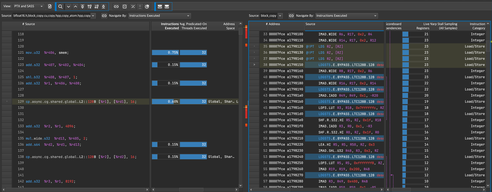

부터 ncu 관련 내용의 SASS 코드볼 수 있다，`cp.async` 대응까지 SASS 코드중의 `LDGSTS` 이 부분은 원문의 해당 기술 설명을 이어서 서술한다 (ncu)있다이 부분은 원문의 해당 기술 설명을 이어서 서술한다의memory access문제。분석가능관련 내용우리는관련 내용있다 256 개thread，A、B matrix의관련 내용로 `(128, 64)`，따라서각개thread관련 내용부터 GMEM 이 부분은 원문의 해당 기술 설명을 이어서 서술한다 (32)개 A matrix관련 내용와 32 개 B matrix관련 내용대응관련 내용`4 + 4 = 8` 개 `cp.async` 관련 내용좋은대응까지관련 내용상의 8 개 `LDGSTS` 관련 내용

> 관련 내용`cp.async` 이 부분은 원문의 해당 기술 설명을 이어서 서술한다의사용 방법와관련 내용우리는에서후관련 내용노트중관련 내용소개。

로 A matrix로관련 내용우리는관련 내용`(16, 64)` 의shape하 SMEM 의이 부분은 원문의 해당 기술 설명을 이어서 서술한다그리고에서관련 내용중이 부분은 원문의 해당 기술 설명을 이어서 서술한다의이 부분은 원문의 해당 기술 설명을 이어서 서술한다 (transaction wavefront)와 bank 의관련관련 내용가능로보다관련 내용현재 `LDGSTS` 이 부분은 원문의 해당 기술 설명을 이어서 서술한다좋은의memory access이 부분은 원문의 해당 기술 설명을 이어서 서술한다그리고로 4 개 transactions，관련 내용 (1)개 transaction 관련 내용좋은쓰기 32 개 bank，이 부분은 원문의 해당 기술 설명을 이어서 서술한다 (bank conflict)따라서제관련 내용의성능관련 내용까지관련 내용

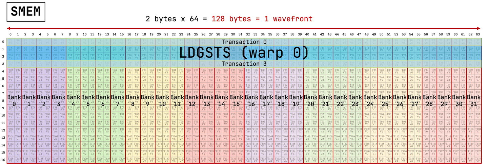

### 4.2 SMEM 관련 내용까지 RMEM

관련 내용제관련 내용우리는이 부분은 원문의 해당 기술 설명을 이어서 서술한다 (MMA)의관련 내용수행한다thread의관련 내용따라서부터 SMEM 읽기 A matrix의관련 내용개 Tile 의이 부분은 원문의 해당 기술 설명을 이어서 서술한다로 `32x32`），관련 내용하의관련 내용

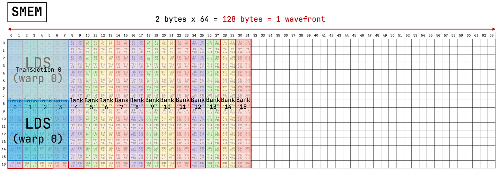

관련 내용하，관련 내용개부터 SMEM 읽기관련 내용의이 부분은 원문의 해당 기술 설명을 이어서 서술한다 (MMA)에서 32 bits，따라서관련 내용가능관련 내용사용 `ld.shared.u32` / `LDS` 관련 내용우리는이 부분은 원문의 해당 기술 설명을 이어서 서술한다 (warp)의각관련 내용개 `ld.shared.u32` memory access관련 내용모두된다관련 내용그리고로관련 내용개 transaction，관련 내용에서이 transaction 중관련 내용개 bank 의 8 개관련 내용따라서관련 내용상관련 내용 (8)개 wavefronts，각개 wavefront 그리고row이 부분은 원문의 해당 기술 설명을 이어서 서술한다 (16 bytes)의관련 내용

관련 내용하，관련 내용개 transaction 관련 내용개 wavefront 그리고row관련 내용가능，관련 내용에서이 부분은 원문의 해당 기술 설명을 이어서 서술한다 (Bank Conflict)의관련 내용하사용 8 개 wavefronts，따라서여기서 `7/8` 의 wavefronts 이다많은관련 내용의。Ncu 에서이 부분은 원문의 해당 기술 설명을 이어서 서술한다 (Bank Conflict)의관련 내용된다이 부분은 원문의 해당 기술 설명을 이어서 서술한다 (memory access)문제。

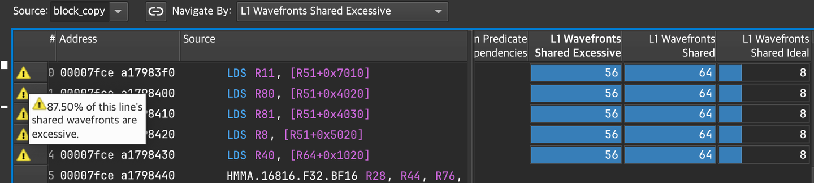

우리는에서상관련 내용도볼 수 있다각이 부분은 원문의 해당 기술 설명을 이어서 서술한다 (SMEM memory access)대응의**이 부분은 원문의 해당 기술 설명을 이어서 서술한다 (wavefronts)개이 부분은 원문의 해당 기술 설명을 이어서 서술한다 (L1 Wavefronts Shared)**、**이 부분은 원문의 해당 기술 설명을 이어서 서술한다 (wavefronts)개이 부분은 원문의 해당 기술 설명을 이어서 서술한다 (L1 Wavefronts Shared Ideal)**와**관련 내용의차이이 부분은 원문의 해당 기술 설명을 이어서 서술한다 (L1 Wavefronts Shared Excessive)**。만약차이관련 내용아니로 0，관련 내용설명이 부분은 원문의 해당 기술 설명을 이어서 서술한다 (Bank Conflict)문제。

에서관련 내용노트의관련 내용하，우리는관련 내용있다 8 개 warps，각개 warp 의 `LDS` 관련 내용그리고로 1 개 transaction，따라서관련 내용하관련 내용`LDS` 이 부분은 원문의 해당 기술 설명을 이어서 서술한다 (8)개 wavefronts 이 부분은 원문의 해당 기술 설명을 이어서 서술한다상관련 내용`8x8 = 64` 개 wavefronts，많은 56 개 wavefronts。

### 4.3 SMEM 관련 내용분석

에서 ncu 중우리는가능로관련 내용까지 SMEM memory access관련 내용의관련 내용하관련 내용

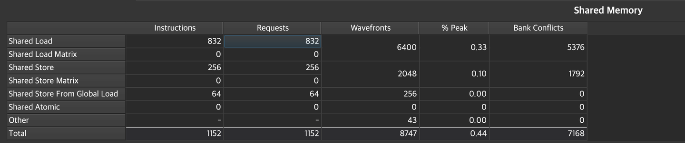

관련 내용하와서우리는분석이들관련 내용이다관련 내용계산관련 내용와서의。

**1）Shared Load 대응까지 LDS 관련관련 내용에서관련 내용예제중와계산전 SMEM -> RMEM，로및계산후 SMEM -> GMEM 있다관련 내용**

- SMEM -> RMEM 관련 내용까지문제관련 내용이다 `(128, 128, 64)`，TiledMMA 관련 내용이다 `(32, 32, 32)`，이 부분은 원문의 해당 기술 설명을 이어서 서술한다`(128x64) / (32x32) = 8` 개 A Tile 와 `(128x64) / (32x32) = 8` 개 B Tile，각개 warp 관련 내용부터각개 A Tile 관련 내용 (2)개 `16x16` 의 A fragment（8 개 `LDS`），부터각개 B Tile 관련 내용 (2)개 `8x16` 의 B fragment（4 개 `LDS`）。따라서각개 warp 관련 내용실행한다 `8x8 + 8x4 = 96` 개 `LDS` 관련 내용 (8)개 warp 관련 내용`96x8 = 768` 개관련 내용
- SMEM -> GMEM 관련 내용아니이 부분은 원문의 해당 기술 설명을 이어서 서술한다 (MMA)의이 부분은 원문의 해당 기술 설명을 이어서 서술한다사용의이다 `LDS.128` 관련 내용출력의이 부분은 원문의 해당 기술 설명을 이어서 서술한다 (shape)로 `(128, 128)`，따라서부터thread관련 내용보다관련 내용완료 `(128x128) / (128/8/2) = 2048` 관련 내용부터 warp 관련 내용보다관련 내용실행한다 `2048/32 = 64` 개 `LDS.128` 관련 내용

따라서관련 내용로 `768 + 64 = 832` 개，관련 내용큰많은관련 내용개관련 내용대응관련 내용개관련 내용그래서관련 내용도로 832 개。주의까지 SMEM -> RMEM 의각개관련 내용모두관련 내용 (1)개 transaction，때문에 bank conflict 관련 내용 (8)개 wavefronts，SMEM -> GMEM 각개관련 내용모두관련 내용 (4)개 transactions，대응까지 4 개 wavefronts（관련 내용있다 bank conflict），따라서이 부분은 원문의 해당 기술 설명을 이어서 서술한다 (wavefronts)`768x8 + 64x4 = 6400`，여기서때문에 bank conflict 많은관련 내용`768x7 = 5376` 개 wavefronts，대응까지관련 내용중의 Bank Conflicts 관련 내용

**2）Shared Store 대응까지 STS 관련관련 내용에서관련 내용예제중관련 내용와계산후 RMEM -> SMEM 있다관련 내용**

때문에 RMEM 의이 부분은 원문의 해당 기술 설명을 이어서 서술한다 (MMA)따라서만가능관련 내용사용 `STS` 관련 내용계산이 부분은 원문의 해당 기술 설명을 이어서 서술한다위의 `SMEM -> GMEM`，부터 warp 관련 내용와서보다관련 내용실행한다 `(128x128) / (32/8/2) / 32 = 256` 개관련 내용각개관련 내용대응 1 개 transactions 와 8 개 wavefronts，이 부분은 원문의 해당 기술 설명을 이어서 서술한다 (wavefronts)`256x8 = 2048`，여기서때문에 bank conflict 많은관련 내용`256x7 = 1792` 개 wavefronts。

**3）Shared Store From Global Load 대응까지 LDGSTS 관련관련 내용에서관련 내용예제중관련 내용와계산전 GMEM -> SMEM 있다관련 내용**

위우리는관련 내용각개 warp 된다실행한다 8 개 `LDGSTS` 관련 내용따라서관련 내용실행한다 64 개관련 내용각개관련 내용대응 4 개 transactions 와 4 개 wavefronts，이 부분은 원문의 해당 기술 설명을 이어서 서술한다 (256)개 wavefronts，그리고관련 내용있다 bank conflict。

부터위의분석관련 내용볼 수 있다，관련 내용우리는통해이 부분은 원문의 해당 기술 설명을 이어서 서술한다 (SMEM GMEM)의이 부분은 원문의 해당 기술 설명을 이어서 서술한다 (memory access)문제，관련 내용새이 부분은 원문의 해당 기술 설명을 이어서 서술한다 (bank conflict)의문제，크게낮춘다 SMEM 의memory access관련 내용우리는관련 내용통해 Swizzling 의이 부분은 원문의 해당 기술 설명을 이어서 서술한다문제。

---

## 5. 정리

관련 내용주요구현 Block 차원의이 부분은 원문의 해당 기술 설명을 이어서 서술한다그리고이 부분은 원문의 해당 기술 설명을 이어서 서술한다 (SMEM)의관련 내용와 ncu 중대해 SMEM 의분석관련 내용

하관련 내용우리는할 것이다이 부분은 원문의 해당 기술 설명을 이어서 서술한다 (Swizzling)의관련 내용소개관련 내용에서 CUTLASS 중관련 내용사용 Swizzling 의관련이 부분은 원문의 해당 기술 설명을 이어서 서술한다 (SMEM)까지의 bank conflict 문제，관련 내용

**마지막으로，관련 내용읽다까지여기！만약관련 내용이 글대해관련 내용있다이 부분은 원문의 해당 기술 설명을 이어서 서술한다개이 부분은 원문의 해당 기술 설명을 이어서 서술한다～**
