> 즈후 https://www.zhihu.com/column/c_1938664963049763058 칼럼 노트를 복사한 것이다. 모아서 이어 볼 수 있다.

# CUTLASS 노트: 길잡이

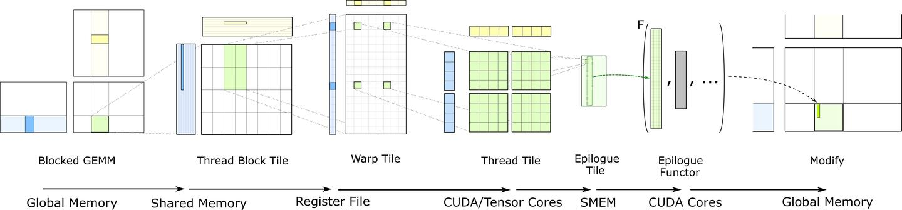

이 CUTLASS 노트 시리즈는 가장 작은 Minimal GEMM에서 출발해 CuTe와 CUTLASS의 각종 컴포넌트, 그리고 Hopper, Blackwell 등 새로운 아키텍처의 특성을 차례로 확장해 나가며, 최종적으로 고성능 GEMM 융합 연산자를 구현한다.

## 1. 머리말

잘 알려져 있듯이 CUTLASS는 오픈 소스이고 유연하며 고성능이라는 특징 덕분에 커스텀 CUDA 연산자 개발과 성능 최적화 시나리오에 널리 쓰인다. 예를 들어 Pytorch, vLLM, FA2, FA3 등 자주 쓰이는 프레임워크와 연산자 라이브러리가 모두 CUTLASS로 개발되었다. 그러나 학습 곡선이 가파르고 CUDA, C++ 문법과 특성에 상당히 익숙해야 하기 때문에 일반적인 알고리즘 개발자가 사용하기에는 난이도가 높다. 이것이 triton 같은 Python DSL이 유행하게 된 이유 중 하나이기도 하다. 하지만 성능의 상한을 추구하면서 동시에 kernel 안의 계산, 통신, 저장의 각종 세부 사항을 유연하게 제어해야 하는 요구가 있다면 CUTLASS는 여전히 대체 불가능하다. 게다가 CUTLASS를 배우는 것은 본질적으로 CUDA / PTX를 배우는 것이므로, 개발 비용을 고려해 triton을 써야 하는 경우에도 CUDA 지식과 최적화 방법론이 갖춰져 있다면 triton kernel을 훨씬 능숙하게 작성할 수 있다. 만약 triton만 다룰 줄 안다면 성능 문제나 기대에 어긋나는 결과를 만났을 때 문제를 깊이 파고들기가 대단히 어렵다. 또한 CUTLASS 4.0부터 나온 Python DSL은 C++ 버전의 API를 원형 그대로 유지하면서 Python 인터페이스를 제공하므로, 가성비가 높은 개발 방안이기도 하다. 어떤 관점에서 보더라도 CUTLASS를 배우는 것은 연산자 개발자에게 필수적이다. 현재 아주 많은 훌륭한 CUTLASS 글이 있지만(아래의 튜토리얼 추천 부분을 보라), 나는 아직 **매우 완결적이고 체계적이며, 제로 베이스에서 시작해 점진적으로 나아가 최신 하드웨어 아키텍처 위에서 optimized kernel을 작성할 수 있는 수준까지 이르게 하는, 초보자가 배우기에도 적합하고 숙련자가 수시로 들춰 참고하기에도 적합한 CUTLASS 콘텐츠**는 없다고 느꼈다. 그래서 이 시리즈 글을 쓰게 되었다.

## 2. CUTLASS 소개

한마디로 소개하자면, **CUTLASS는 템플릿 라이브러리와 다수의 재사용 가능한 컴포넌트의 형태로 GEMM을 둘러싼 알고리즘 개발과 최적화의 해법을 제공한다.**


NV 하드웨어의 Tensor Core는 성능이 강력하고, 현재 주류 계산 작업은 모두 기본적인 GEMM 연산자를 벗어날 수 없다. 개발자가 어떻게 하면 효율적인 GEMM 연산을 편리하게 구현할 수 있는지, 그리고 GEMM과 다른 계산의 overlap 및 융합을 통해 하드웨어의 연산 성능 상한을 끌어내고, 나아가 각종 상위 작업에서 품질과 효율을 높일 수 있는지가 바로 CUTLASS가 해결하려는 문제다.

CUTLASS의 큰 장점 하나는 완전한 화이트박스라는 점이다! 복잡한 C++ 템플릿 아래에서 CUTLASS의 본질은 PTX 명령어에 대한 래핑이다. 따라서 우리는 각종 복잡한 CUDA Runtime API를 배워서 사용할 필요가 없고(그러고 나서 그 뒤에서 무슨 일이 일어나는지 추측할 필요도 없고), PTX 명령어를 이해하고 대응하는 CUTLASS API를 쓰기만 하면 하드웨어의 동작을 거의 완전히 장악할 수 있다. 이 점은 연구에서든 엔지니어링에서든 매우 중요하다!
、
## 3. Why CUTLASS？

2025년에 고성능 연산자나 융합 연산자를 하나 작성하려 한다면 이미 매우 많은 해법이 존재한다. 여기서는 세 가지 주요한 구현 경로를 정리한다.

- 자동 컴파일 기반 경로. 대표적인 예가 torch.compile이다.
- Python DSL + PTX 컴파일러 기반 경로. triton, CuTe DSL, TileLang, Mojo 등이 모두 이 경로를 택했다.
- C++ 템플릿으로 PTX를 래핑하는 경로. 예를 들어 CUTLASS, Thunder Kittens 등이 있다.

（물론 PTX를 손으로 직접 짜는 경로도 있다 hhh. 예를 들어 https://github.com/xlite-dev/LeetCUDA 가 있다. 수동으로 @DefTruth）

각 구현 경로의 장단점에 대해서는 이미 많은 글이 관련 논의를 진행했다. 개인적인 관점에서 볼 때 다른 방안과 비교했을 때 CUTLASS의 독특한 장점은 바로 **제어 가능하고 유연하다**는 점이다. CUTLASS의 배후는 곧 PTX 명령어이므로, 나는 코드를 작성하는 과정에서 하드웨어가 이 코드를 어떻게 실행할지 감지할 수 있고, 새로운 알고리즘과 명령어 집합이 나왔을 때 CUTLASS의 능력을 손쉽게 확장하여 기존 컴포넌트를 기반으로 어떤 종류의 scheduler를 새로 추가하거나, GEMM 편성 방식을 새로 작성하거나, 새로운 명령어를 녹여 넣을 수 있다. 따라서 nvcc, PTX, SASS를 제외하면 연산자 개발을 제약하는 다른 요소는 없다!

triton을 쓴다면, 개발팀이 DSL을 업데이트하기를 기다렸다가 인터페이스를 호출하든지, 아니면 직접 컴파일러를 고치고 직접 pass를 작성해야 한다. 나는 triton이 개발 효율을 높이는 동시에 유연성을 희생했다고 생각하며, NV의 아키텍처가 DSA화되어 감에 따라 triton의 문법도 갈수록 복잡해지고 있다. 그래서 개인적으로는 triton을 특별히 좋아하지 않고, TileLang과 CuTe DSL의 사용 방식을 더 선호한다.

물론 연산자 개발과 최적화를 깊이 파고들고 싶다면 CUTLASS는 반드시 익혀야 하는 것이다. 이 노트 시리즈가 여러분에게 도움이 된다면 그것은 나에게 더없는 영광이다.

## 4. 사전 지식

이 CUTLASS 노트 시리즈의 취지는 기초가 전혀 없는 독자도 CUTLASS를 이해할 수 있게 하는 것이지만, 그래도 사전에 갖춰 두면 좋은 지식들을 정리해 둔다(대부분을 모른다면 열심히 보충 학습을 해야 한다).

- NV GPU의 프로그래밍 모델과 SIMT 스레드 병렬을 이해할 것. 예를 들어 스레드 계층(grid, block, warp, thread)과 메모리 계층(GMEM, SMEM, Register)의 기초 개념, 그리고 CPU와 GPU가 계산을 수행하는 방식의 차이를 이해할 것.
- Python, C++ 기본 문법에 익숙할 것. 그 위에 C++17 표준의 C++ 템플릿 문법을 읽을 수 있으면 가장 좋다.
- CUDA C++의 확장 문법을 이해할 것. 예를 들어 __device__ 와 __global__ 의 차이, threadIdx 와 blockIdx 의 사용법 등이다.
- 간단한 CUDA kernel을 작성할 수 있을 것(예를 들어 element-wise 벡터 덧셈).

## 5. 노트 목차

Part 1: CUTLASS CuTe 기초 지식 상세 해설. SM80 및 그 이전 아키텍처의 특성을 사용해 성능이 최적인 GEMM kernel을 구현한다.
...
CUTLASS 노트 (7): SMEM Swizzling

CUTLASS 노트 (8): Dynamic MMA

CUTLASS 노트 (9): Pipelining

CUTLASS 노트 (10): CUTLASS GEMM API

Part 2: CUTLASS 심화 내용. SM90 Hopper 아키텍처의 새로운 특성을 상세히 해설하고, H 카드 위에서 성능이 최적인 GEMM kernel을 구현한다.

CUTLASS 노트 (11): TMA load/store

CUTLASS 노트 (12): TMA multicast reduce

CUTLASS 노트 (13): Warpgroup MMA

CUTLASS 노트 (14): Warp Specialization

## 6. 튜토리얼 추천

여기서 훌륭한 CUTLASS 글의 저자들을 추천한다.

- @reed 
    - 중국어 커뮤니티 최고의 CUTLASS 튜토리얼이다. 나를 포함한 많은 사람이 이 글들로 CUTLASS 학습을 시작했으리라 믿는다. 과장 없이 말해서 reed 님의 훌륭한 선행 작업이 없었다면 이 노트 시리즈도 없었을 것이다.
- Colfax Research: https://research.colfax-intl.com/blog/
    - FA3의 주요 개발 팀으로서, Colfax의 블로그는 내가 본 해외 자료 중 최고의 CUTLASS 튜토리얼이다. 나 또한 이 블로그들에서 Hopper 특성과 코드 예제를 대량으로 배웠다.
- @进击的Killua
    - 풍부한 코드 예제와 그림 설명이 있어, 초보자가 CUTLASS를 빠르게 입문하고 사용하기에 적합하다.
- @Anonymous
    - 여러 글이 CUTLASS API와 PTX 명령어의 사용 세부 사항과 동작을 매우 깊이 연구했으며, GPU 아키텍처에 대해 독자적인 이해를 갖추고 있다.
- CUTLASS Discussions 토론 게시판: https://github.com/NVIDIA/cutlass/discussions
    - CUTLASS 개발자들이 Discussions에서 매우 적극적으로 답변하며, 여러 논의에서 소스 코드나 블로그에서는 볼 수 없는 세부 사항을 배울 수 있다. 여러분이 마주친 의문이나 문제를 Discussions 토론 게시판에 올려 볼 것을 강력히 추천한다.
물론 개인의 여력에는 한계가 있어 내가 발견하지 못한 훌륭한 글이 분명히 있을 것이고, 위의 추천 목록은 빠뜨린 것이 많을 수밖에 없다. 여러분이 좋다고 생각하는 글과 저자를 추천해 주기 바란다!

# Extra: 기초 지식 참고

## 1）SM 아키텍처, CUDA core 와 Tensor Core

NV GPU의 SM 아키텍처는 여러 세대의 진화를 거쳤다. 아래 그림은 Pascal 아키텍처부터 최신 Blackwell 아키텍처까지의 SM 구조를 보여 준다.

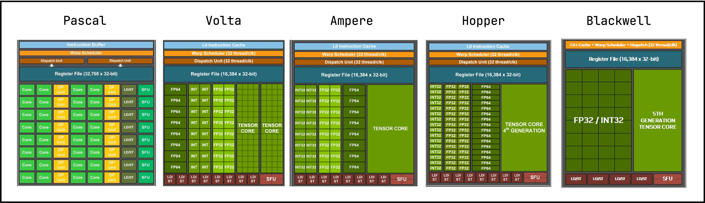

우리는 그중 계산 유닛에 주목한다.
- Pascal 아키텍처의 계산 유닛은 Unified Int32 & FP32 Core이며, 단일 Core가 정수 계산과 부동소수점 계산을 모두 실행할 수 있다.
- Volta, Ampere, Hopper는 Int32와 FP32 계산 유닛을 분리했고 FP64 계산 유닛을 추가했으며, 동시에 Volta 아키텍처부터는 Tensor Core 계산 유닛이 새로 추가되었다.
- Blackwell 아키텍처는 다시 FP32와 Int32 유닛을 통합했고, Tensor Core는 5세대로 업그레이드되었다.

우리는 흔히 CUDA Core의 개수로 GPU의 연산 능력을 가늠하지만, SM 아키텍처에는 어느 것이 CUDA Core인지 명시되어 있지 않다. NV 포럼의 한 문장을 빌리자면, "CUDA core" is a marketing term, not a technical term. 일반적으로 사람들은 가장 빈번히 쓰이는 FP32 계산 유닛을 CUDA Core라고 부르지만, 서술의 편의를 위해 **이 노트 시리즈에서의 CUDA Core는 Tensor Core를 제외한 나머지 계산 유닛(Int, FP, SFU 유닛 등을 포함)을 가리킨다**.


CUDA Core는 일반적으로 스칼라와 벡터의 수치 연산을 실행하는 데 쓰이며, 주소 계산이나 스레드 상수 관련 계산(blockIdx, threadIdx 같은 것) 등 보조 작업도 담당한다. 자주 쓰이는 행렬 연산도 CUDA Core로 루프를 돌려 계산을 구현할 수 있다.

```c++
__global__ void mm(float* A, float* B, float* C, int M, int N, int K) {
    int row = blockIdx.y * blockDim.y + threadIdx.y;
    int col = blockIdx.x * blockDim.x + threadIdx.x;

    if (row < M && col < N) {
        float sum = 0.0f;

        for (int k = 0; k < K; ++k) {
            sum += A[row * K + k] * B[k * N + col];
        }

        C[row * N + col] = sum;
    }
}
```

물론 GPU 입장에서 효율적인 SGEMM kernel을 작성하려면 thread hierarchy와 memory hierarchy를 고려하고, 적절한 block tile과 thread tile을 선택하며, shared memory와 vectorized 메모리 접근 명령어 등의 특성을 잘 활용해야 한다.

CUDA Core는 비교적 범용적인 계산 유닛이라 각종 계산 작업을 실행하는 데 쓸 수 있고, 프로그램을 작성할 때는 개별 수치 단위로 계산을 어떻게 조직할지 고민해야 한다. Tensor Core가 등장하면서 우리가 주목하는 지점은 개별 수치에서 MxN 크기의 단위 행렬로 바뀌었고, 프로그래밍할 때도(PTX를 직접 쓰는 경우는 제외) 단위 행렬의 관점에서 계산을 편성할 수 있게 되었다. 하드웨어 명령어의 DSA화는 텐서 연산의 핵심적 위상을 한층 더 부각한다. 최신 Blackwell 아키텍처에서는 심지어 단 1개의 스레드에서 모든 Tensor Core 계산 스케줄링을 완료할 수도 있다.

행렬 계산 작업에서 Tensor Core는 CUDA Core보다 훨씬 효율적이기 때문에, 오늘날 모든 GEMM 연산자 관련 작업은 Tensor Core의 활용을 최대화하는 방향으로 최적화를 진행하며, 여기에는 CUTLASS도 포함된다.

1세대 Tensor Core(Volta)는 한 클록 사이클 안에 4*4 규모의 FP16 MMA 연산을 계산할 수 있었고, 연산 성능은 2*4*4*4 = 128 FLOPs/cycle이었다. 이후 각 세대의 Tensor Core는 이전 세대 대비 연산 성능이 매번 두 배가 되었다. 최신 Blackwell 아키텍처의 Tensor Core는 이미 5세대까지 발전했으며, 단일 TC의 연산 성능은 2048 FLOPs/cycle이다.

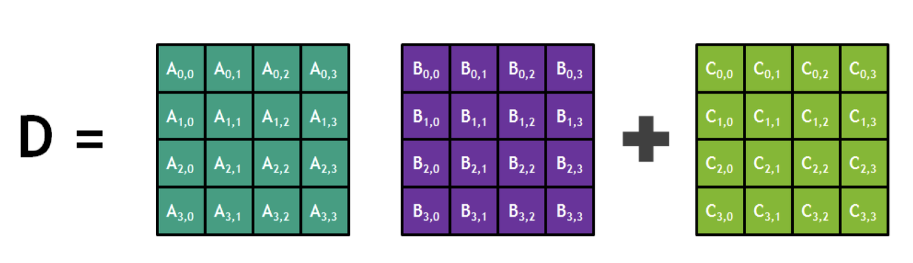

실제로 우리는 공개된 데이터를 근거로 현재 NVIDIA 하드웨어의 이론 연산 성능, 즉 모든 Tensor Core 최대 연산 성능의 합을 손으로 계산해 낼 수 있다. 계산 공식은 다음과 같다.

**이론 연산 성능 = Tensor Core 클록 주파수 x 단일 Tensor Core 연산 성능 x SM 개수 x 단일 SM 내 Tensor Core 개수**

다음은 자주 쓰이는 몇 가지 하드웨어의 성능 지표다(그중 B200 하드웨어의 구체적 spec은 공개되지 않았으므로 데이터는 참고용일 뿐이다).

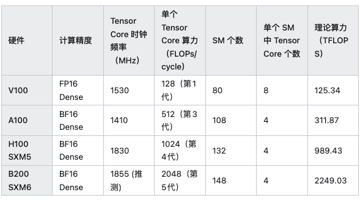

또한 CUTLASS를 사용하는 과정에서 우리는 PTX 관련 명령어를 자주 마주치게 된다. 일반적으로 CUDA Core가 관여하는 계산은 add, sub, sin, cos, ex2 같은 범용 계산 명령어 집합을 사용하고, Tensor Core가 관여하는 텐서 계산은 mma, wgmma, tcgen05 처럼 SM 아키텍처와 강하게 결부된 특수 명령어 집합을 사용한다. 뒤이은 노트들에서 코드가 어떤 특수 PTX 명령어를 사용했는지, 그리고 그 구체적인 기능이 무엇인지 분석할 것이다.

# CUTLASS 노트 (1): Minimal GEMM Kernel

이번 편에서는 CUTLASS CuTe의 기본 컴포넌트와 사용법을 상세히 소개하고, 제로 베이스에서 시작해 CuTe로 단일 MMA 명령어 16x8x8의 GEMM kernel을 작성한다. 또한 Python에서 연산자를 호출하는 방법, 정밀도 검증과 성능 테스트를 수행하는 방법, 그리고 Nsight Compute, ncu 등의 도구로 연산자를 분석하는 방법도 소개한다

이번 편에서 사용하는 CUTLASS 버전은 4.1.0이고, 하드웨어 아키텍처는 SM90이다.

## 1. CuTe 기초 컴포넌트

CUTLASS 3.0부터 CuTe 라이브러리가 도입되었다. CuTe가 제공하는 Layout과 Tensor 추상은 우리가 알고리즘 로직 개발에 집중할 수 있게 해 주고 연산자 개발의 심적 부담을 덜어 준다. 따라서 먼저 CuTe의 두 가지 핵심 컴포넌트인 Tensor와 Layout을 소개한다.

### 1.1 Tensor 와 Layout

CuTe의 Tensor는 Pytorch의 Tensor와 매우 유사하다. 둘 다 텐서의 저장 객체를 나타내고, 각종 오버로드된 메서드를 제공해 계산을 편리하게 실행하게 해 준다. Tensor 안의 텐서가 메모리에 저장되는 구조가 바로 Layout이며, Layout은 Shape와 Stride 두 부분으로 구성된다. 그중 Shape는 텐서의 형상을 나타내고, Stride는 텐서의 각 차원에서의 연속성을 나타낸다. Tensor Layout을 알면 텐서 안의 각 원소가 메모리에 어떻게 배치되어 있는지 알 수 있다.

일반적으로 CuTe의 Layout은 일종의 **매핑 관계**이며, 문맥에 따라 서로 다른 의미를 가진다. **Tensor Layout은 우리가 접하는 첫 번째 종류의 Layout으로, tensor 좌표와 메모리 주소 offset 사이의 매핑 관계를 표현한다.**

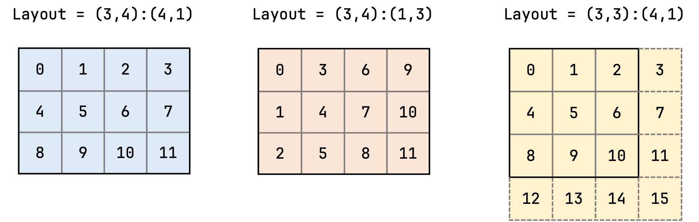


CuTe에서 우리는 Layout을 **shape : stride** 형식으로 표기한다. 여기서 shape와 stride는 하나의 tuple일 수도 있고, tuple이 중첩된 tuple일 수도 있다. **Layout의 중첩 가능성은 Pytorch Tensor와 다른 중요한 특징이다**. 중첩 표기가 있으면 훨씬 복잡한 Tensor pattern을 여럿 만들어 낼 수 있다.

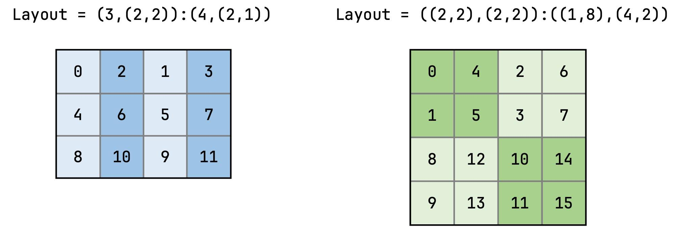


우리가 마주치는 첫 번째 CuTe API는 Tensor를 만드는 방법인 `make_tensor`다. 넘기는 세 개의 인자는 각각 data_ptr, shape, stride이다(shape와 stride를 제공하지 않고 layout을 바로 넘길 수도 있다). **stride를 제공하지 않으면 CuTe는 기본적으로 left-major의 stride를 만드는 반면 Pytorch는 기본이 right-major다. 이것이 CuTe Tensor와 Pytorch Tensor의 두 번째 차이점이다.**

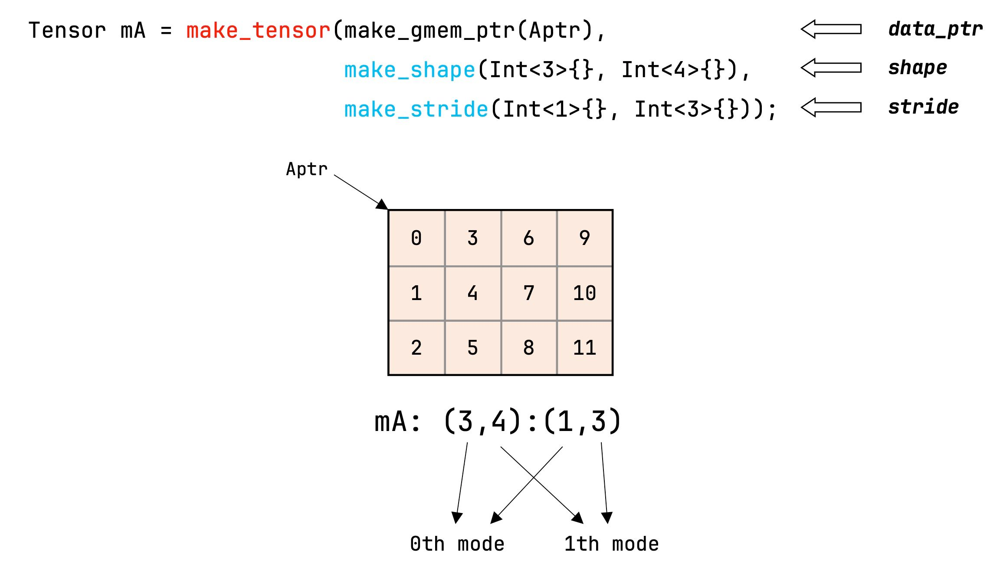


CuTe Tensor의 차원은 관례적으로 mode라고 부른다. 예를 들어 가장 왼쪽의 차원이 first mode / 0th mode이고, 중첩 Layout의 각 차원은 sub mode라고 부른다. size<mode>(tensor) 방식으로 tensor의 각 차원 크기를 얻을 수 있다.

### 1.2 Tiling API

비교적 큰 규모의 GEMM 계산에서는 이를 블록으로 나누어 처리하여, 각 계층의 저장 크기 제약 아래에서 병렬 계산을 효율적으로 구현해야 한다. 일반적으로 이런 블록 분할 처리를 tiling이라고 부른다. CuTe에도 Tensor를 블록으로 나누는 API인 `local_tile`이 있다.

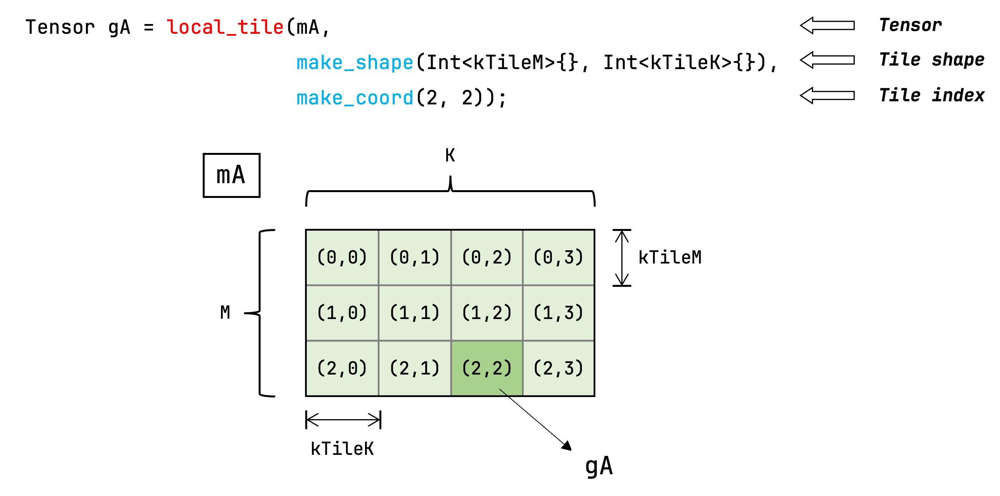

각 tile의 shape 크기를 주면 하나의 Tensor를 여러 개의 작은 Tensor(tile)로 잘라 낼 수 있고, 좌표 coord로 그중 하나의 tile을 얻을 수 있다.

```c++
Tensor gA = local_tile(mA, make_shape(Int<kTileM>{}, Int<kTileK>{}), make_coord(0, 0))
```

고차원의 tiler를 쓰고 Step을 넘겨 지정한 차원에서만 블록으로 나눌 수도 있다. 이렇게 하면 여러 번의 블록 분할 처리가 동일한 tiler와 coord를 재사용할 수 있다.

```c++
  auto tiler = make_tile(Int<kTileM>{}, Int<kTileN>{}, Int<kTileK>{});
  auto coord = make_coord(0, 0, 0);

  Tensor gA = local_tile(mA, tiler, coord, Step<_1,  X, _1>{});
```

> Note: `make_tile`과 `make_coord`, 그리고 위의 `make_shape`와 `make_stride`가 최종적으로 반환하는 것은 모두 `cute::tuple` 타입의 값이다. 그리고 `Tile`, `Coord`, `Shape`, `Stride`, `Step` 클래스는 모두 `cute::tuple`의 별칭이므로 동일한 방법으로 사용할 수 있다.

일반적인 경우 `local_tile`은 완전한 GEMM에서 하나의 block이 계산해야 할 행렬 조각을 얻는 데 쓰이고, block 내부의 tiling은 MMA 계산 명령어에 의존하므로 MMA API가 처리하도록 넘겨야 한다.


### 1.3 MMA API

MMA는 행렬 곱셈 누산 연산(Matrix Multiply-Accumulate)을 가리키며, 공식은 D = A * B + C이다. 통상적인 GEMM 연산은 MMA의 부분집합으로 D = A * B로 나타낼 수 있다. Tensor Core는 특정 shape 크기의 MMA 계산 명령어를 여럿 제공하는데, 여기에는 이번 편에서 구현할 16x8x8 MMA도 포함된다. 모든 MMA 명령어와 그에 대응하는 shape, sparsity, precision은 PTX 문서를 참고하라: https://docs.nvidia.com/cuda/parallel-thread-execution/index.html#warp-level-matrix-shape 

CuTe의 MMA_Atom 객체는 특정한 mma 명령어에 대응한다. 예를 들어 16x8x8의 MMA 연산을 완료해야 하고 모든 수치 정밀도가 FP16이라면, 다음과 같은 MMA op를 만들 수 있다.

```c++
using MMA_op = SM80_16x8x8_F16F16F16F16_TN;
```

CUDA Core로 행렬 연산을 수행할 때는 본질적으로 각 스레드가 독립적으로 행렬 원소의 곱셈 누산을 완료하며, 각 스레드가 매 루프마다 수행하는 계산 명령어는 한 번의 mul + add 명령어만 관여한다. 이와 달리 Tensor Core에 대응하는 **mma 명령어 집합은 여러 스레드가 협력해 계산을 완료할 것을 요구한다**. 단일 명령어 16x8x8 MMA 시나리오에서 우리가 사용하는 mma 명령어는 다음과 같다.


```c++
mma.sync.aligned.m16n8k8.row.col.f16.f16.f16.f16
  {%Rd0, %Rd1},
  {%Ra0, %Ra1},
  {%Rb0},
  {%Rc0, %Rc1};
```

이 명령어는 한 warp의 32개 스레드가 협력해 16x8x8의 MMA 계산을 완료할 것을 요구한다. 각 스레드는 행렬 A의 원소 4개, 행렬 B의 원소 2개, 행렬 C의 원소 4개를 받아 계산하고, 계산이 끝나면 행렬 D의 원소 4개를 저장한다. **각 스레드가 올바른 행렬 원소를 받고 계산 결과를 올바른 스레드에 저장해야만 하나의 MMA 계산을 올바르게 완료할 수 있다.**


PTX 문서에는 각 mma 명령어에 대응하는 행렬 원소와 각 스레드 내 레지스터의 매핑 관계가 상세히 기록되어 있다. 예를 들어 위 mma 명령어의 매핑 관계는 다음에서 볼 수 있다: https://docs.nvidia.com/cuda/parallel-thread-execution/index.html#warp-level-matrix-fragment-mma-1688

CuTe로 이 16x8x8 mma 명령어의 매핑 관계를 출력해 보면 다음과 같다.


여기서 왼쪽 아래 행렬이 A, 오른쪽 위 행렬이 B, 오른쪽 아래 행렬이 C/D이다. 각 행렬 원소 안의 TxVy는 그 원소가 스레드 x의 y번째 데이터임을 나타낸다. 위 그림에서 행렬 A의 shape는 MxK, 행렬 B의 shape는 KxN이며, 모든 행렬이 K-major임에 유의하라.

PTX를 손으로 직접 짜려면 위 그림에 근거해 각 스레드가 A/B/C 행렬에서 해당 원소를 가져와 레지스터에 넣고, 다시 레지스터를 mma 명령어에 먹인 뒤, 마지막에 결과를 행렬 D의 대응 위치에 써 넣어야 한다. 다른 mma 명령어로 바꾸면 이 매핑 관계도 그에 맞게 수정해야 한다. 이것이 극도로 번거로운 일임은 분명하다.

다행히 Layout Algebra의 도움을 받아, CuTe가 제공하는 MMA API가 이런 복잡한 매핑 관계를 대신 세워 준다. 우리는 올바른 MMA op를 골라 `make_tiled_mma`에 넘겨 주기만 하면 되고, CuTe가 알아서 MMA op에 대응하는 매핑 관계를 찾아 준다.

```c++
using TiledMMA = decltype(make_tiled_mma(MMA_op{}));
```

kernel 안에서 TiledMMA 객체를 만들고, `get_slice`를 통해 해당 스레드의 tiler(즉 CuTe의 ThrMMA 인스턴스)를 얻을 수 있다. 이 tiler의 `partition_A` 메서드를 호출하면 그 스레드가 MMA 계산을 완료하는 데 필요한 A 행렬 원소의 Tensor 표현을 얻게 된다. 이 Tensor는 global memory 위의 A 행렬 중 이 스레드에 대응하는 조각을 나타낸다. 이에 대응해 `partition_B`, `partition_C` 메서드도 있으며 작용은 유사하다.

```c++
TiledMMA tiled_mma;
  ThrMMA thr_mma = tiled_mma.get_slice(tid);
  Tensor tCgA = thr_mma.partition_A(gA);  // (MMA, MMA_M, MMA_K)
```

ThrMMA에는 partition_fragment_A 메서드도 있다. 이 메서드가 반환하는 Tensor의 shape는 partition_A와 같지만, 이 Tensor는 global memory의 데이터를 나타내는 것이 아니라 그 스레드 안의 연속된 레지스터 묶음을 나타낸다.

```c++
Tensor tCrA = thr_mma.partition_fragment_A(gA);  // (MMA, MMA_M, MMA_K)
```

### 1.4 Copy API 와 GEMM API

CuTe가 제공하는 Copy API로 데이터 복사를 완료할 수 있다. 예를 들어 아래 코드는 global memory에서 레지스터로의 데이터 복사를 완료한다.

```c++
auto copy_atom = AutoVectorizingCopy{};
copy(copy_atom, tCgA, tCrA);
```

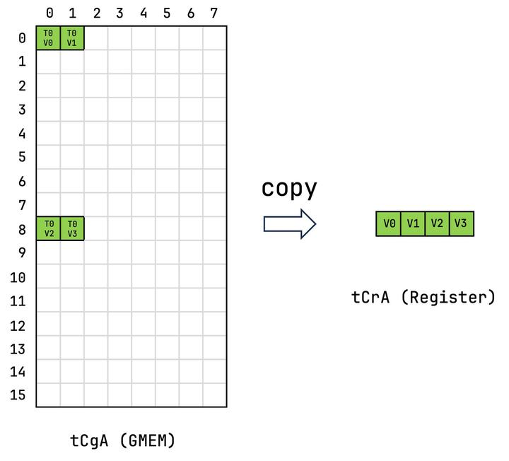

여기서 copy_atom은 데이터 복사에 사용되는 명령어에 대응한다. 메모리 접근 효율을 최대화하기 위해 우리는 하나의 복사 명령어가 가능한 한 많은 연속 메모리를 복사하기를 원한다(즉 **vectorized 메모리 접근**). 통상적인 단일 복사 명령어는 최대 128 bits의 데이터를 복사할 수 있지만, 많은 경우 복사해야 할 데이터가 연속적이지 않다. 따라서 AutoVectorizingCopy는 CuTe가 MMA에 근거해 가장 큰 연속 데이터 길이를 자동으로 고르게 하고, 이를 통해 구체적인 복사 명령어를 결정하게 한다.

데이터가 준비되면 CuTe GEMM API를 호출해 mma 계산을 수행할 수 있다.

```c++
gemm(tiled_mma, tCrD, tCrA, tCrB, tCrC);
```

그다음 결과를 global memory에 다시 써 넣을 수 있다.

```c++
copy(copy_atom, tCrD, tCgD);
```

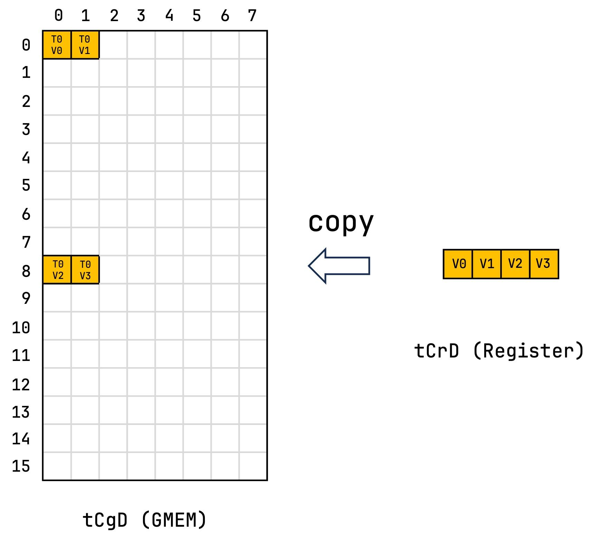

이어서 위의 기초 API를 사용해 단일 명령어 16x8x8 규모의 MMA 계산을 구현해 보겠다.

## 2. Minimal GEMM kernel 작성하기


Minimal kernel을 작성하기 전에 우리는 먼저 연산자의 각종 세부 사항을 확정해야 한다. 여기에는 문제 규모, grid의 분할, 각 block의 스레드 개수, 각 tile의 차원 등이 포함된다. 이는 연산자 작성의 핵심 단계를 파악하는 데 도움이 된다.

이번 시나리오의 연산자 상세 내용은 아래 표와 같다.

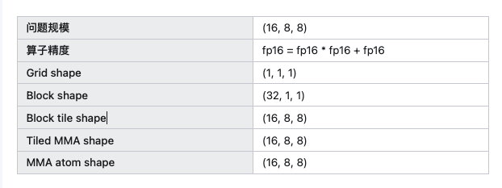

우리는 단 하나의 명령어로 MMA를 계산하므로 하나의 block에 32개 스레드만 띄우면 된다. 이번 시나리오에서는 계층적 tiling을 할 필요가 없으므로 모든 tile shape는 단일 명령어 MMA atom shape와 같다.

### 2.1 Kernel Spec 파라미터 클래스

연산자를 개발하는 과정에는 위 표에 있는 것과 비슷한 상수가 많다. 보통 이들을 하나의 통일된 파라미터 클래스에 모아 두는데, 분류와 수정이 편리하고 파라미터를 수정해도 device kernel의 로직에 영향을 주지 않기 때문이다.

```c++
template <typename T_, int kTileM_ = 16, int kTileN_ = 8, int kTileK_ = 8>
struct KernelSpec {
  using T = T_;

  static constexpr int kTileM = kTileM_;
  static constexpr int kTileN = kTileN_;
  static constexpr int kTileK = kTileK_;

  using MMA_op = SM80_16x8x8_F16F16F16F16_TN;
  using TiledMMA = decltype(make_tiled_mma(MMA_op{}));

  static constexpr int kThreadNum = size(TiledMMA{});
  static constexpr int kShmSize = 0;
};
```

### 2.2 kernel 코드 작성하기

시나리오를 단순화하기 위해 Minimal GEMM kernel은 두 종류의 계산만 완료한다. C = A * B 와 C = A * B + C 이다. 서로 다른 템플릿 파라미터를 넘기면 서로 다른 kernel을 골라 서로 다른 계산 모드를 완료할 수 있다. 위의 파라미터 클래스도 템플릿을 통해 kernel에 넘길 수 있다.

kernel의 함수 시그니처는 다음과 같다.

```c++
template <typename Spec, bool IsGemm>
__global__ void
minimal_gemm(void *Cptr, const void *Aptr, const void *Bptr, int m, int n, int k);
```

먼저 A, B, C 세 행렬의 Tensor 표현을 세운다.

```c++
Tensor mA = make_tensor(make_gmem_ptr((T *)Aptr),
                        make_shape(m, k),
                        make_stride(k, Int<1>{}));  // (M, K)
Tensor mB = make_tensor(make_gmem_ptr((T *)Bptr),
                        make_shape(n, k),
                        make_stride(k, Int<1>{}));  // (N, K)
Tensor mC = make_tensor(make_gmem_ptr((T *)Cptr),
                        make_shape(m, n),
                        make_stride(n, Int<1>{}));  // (M, N)
```


우리는 kernel에 넘기는 세 행렬이 모두 행 방향으로 연속임을 전제로 하므로, stride의 마지막 차원은 모두 1이다. `make_gmem_ptr`는 포인터에 대응하는 데이터가 GMEM 위에 있음을 나타내는 데 쓰인다. mA, mB, mC는 곧 문제 규모 전체에 해당하는 A, B, C 행렬을 나타낸다.

그다음 완전한 A, B, C 행렬에서 이 block의 계산에 필요한 분할 행렬을 얻어야 한다.


```c++
auto tiler = make_tile(Int<kTileM>{}, Int<kTileN>{}, Int<kTileK>{});
auto coord = make_coord(0, 0, 0);

Tensor gA = local_tile(mA, tiler, coord, Step<_1,  X, _1>{});  // (kTileM, kTileK)
Tensor gB = local_tile(mB, tiler, coord, Step< X, _1, _1>{});  // (kTileN, kTileK)
Tensor gC = local_tile(mC, tiler, coord, Step<_1, _1,  X>{});  // (kTileM, kTileN
```

단일 명령어 MMA 시나리오에서는 tiler의 크기가 문제 규모와 일치하므로 (0, 0, 0)이라는 하나의 tile만 잘려 나오고, 우리는 그것을 바로 가져오면 된다. gA, gB, gC는 그 block의 분할 행렬을 나타내며, 접두어 g는 global memory를 뜻한다.

Block 내부에서는 MMA API를 사용해 global memory 위의 분할을 계속 잘라 나간다.

```c++
TiledMMA tiled_mma;
ThrMMA thr_mma = tiled_mma.get_slice(tid);

Tensor tCgA = thr_mma.partition_A(gA);  // (MMA, MMA_M, MMA_K)
Tensor tCgB = thr_mma.partition_B(gB);  // (MMA, MMA_N, MMA_K)
Tensor tCgC = thr_mma.partition_C(gC);  // (MMA, MMA_M, MMA_N)

Tensor tCrA = thr_mma.partition_fragment_A(gA);  // (MMA, MMA_M, MMA_K)
Tensor tCrB = thr_mma.partition_fragment_B(gB);  // (MMA, MMA_N, MMA_K)
Tensor tCrC = thr_mma.partition_fragment_C(gC);  // (MMA, MMA_M, MMA_N)
```

위 코드에는 설명이 필요한 두 가지 지점이 있다.

1. **Tensor의 명명 관습**. CUTLASS에서는 위의 mA, gA 그리고 shared memory의 sA 같은 명명 관습 외에도, tiling을 거친 tensor를 가리키는 데 흔히 txgy, txry 같은 이름을 쓴다. 여기서 t는 tiling을 뜻하고, x는 어떤 방식으로 tiling을 했는지를 뜻한다. MMA 전체가 최종적으로 산출하는 것은 C 행렬이므로, tC는 이 tensor가 C 행렬을 계산하는 MMA tile에서 나왔음을 뜻한다. 세 번째 글자인 g/r은 tensor 데이터의 저장 위치가 global memory인지 register file인지를 나타내고, 네 번째 글자는 행렬 이름을 가리킨다. 많은 CUTLASS 관련 코드가 이 명명 규범을 따른다.


2. **주석에 있는 Tensor shape의 의미**. 여기서 Tensor의 shape는 모두 (MMA, MMA_M/N, MMA_K/N) 이다. 첫 번째 차원 MMA는 단일 MMA 명령어(MMA Atom)에 필요한 행렬 원소 개수를 나타내며, 이번 시나리오에서 tCgA/tCrA의 MMA는 4이고 tCgB/tCrB의 MMA는 2이다. 뒤의 두 차원은 MMA Atom을 확장한 뒤의 차원을 나타내는데, 여기서는 MMA를 확장하지 않았으므로 뒤의 두 차원은 모두 1이다. CUTLASS 코드는 코드 읽기를 쉽게 하려고 Tensor의 shape를 주석으로 자주 달아 둔다.


아울러 CuTe는 Tensor를 보여 주는 print 함수를 제공하여 특정 Tensor의 상세 정보를 볼 수 있게 해 주고, print_tensor 함수는 특정 Tensor의 모든 데이터를 출력해 준다. 둘 다 디버깅에 좋은 도구다. (여기서 문제를 하나 내겠다. tCgA와 tCrA의 stride는 무엇일까? 잘 모르겠다면 한번 print 해 보라)

```c++
if (thread0()) {
  print(tCgA); printf("\n");
  print_tensor(tCgA); printf("\n");
}
```

tiling을 마쳤으면 실제 복사와 계산 작업을 실행할 수 있다.

```c++
auto copy_atom = AutoVectorizingCopy{};

copy(copy_atom, tCgA, tCrA);
copy(copy_atom, tCgB, tCrB);

if constexpr (IsGemm) clear(tCrC);  // Set the accumulators to zero
else copy(copy_atom, tCgC, tCrC);

gemm(tiled_mma, tCrC, tCrA, tCrB, tCrC);

copy(copy_atom, tCrC, tCgC);
```

C = A * B 를 계산하는 경우라면 C 행렬을 복사할 필요가 없고, clear 함수로 C의 tiling Tensor, 즉 accumulator를 0으로 설정한다는 점을 알 수 있다.

여기까지 해서 가장 작은 Minimal GEMM 연산자가 완성되었다. 완전한 kernel 코드는 Github 저장소에서 볼 수 있다: cutlass-notes

## 3. Minimal GEMM kernel 사용하기

### 3.1 Pytorch binding 작성하기

Pytorch에서 Minimal GEMM kernel을 사용하려면 kernel과 Python을 연결하는 함수를 하나 더 작성해야 한다. 이 함수는 a, b, c 세 개의 torch::Tensor만 받으면 되고, 그중 c는 선택 인자다. 함수 시그니처는 다음과 같다.

```c++
template<typename ComputeType, typename AccType = ComputeType>
torch::Tensor
run_minimal_gemm(const torch::Tensor &a,
                 const torch::Tensor &b,
                 std::optional<torch::Tensor> &_c);
```

함수 내부에서는 보통 Pytorch가 제공하는 C++ 인터페이스인 libtorch를 사용해 kernel 실행 전 전처리와 사전 검사를 수행한다. 이번 시나리오에서 가장 중요한 단계는 MM 시나리오와 MMA 시나리오를 구분하는 것이다. 다음과 같은 판별문을 써서 c의 초깃값을 설정할 수 있다.

```c++
torch::Tensor c;
bool is_gemm;

if (!_c.has_value()) {
  auto options = torch::TensorOptions().dtype(torch_acc_type).device(torch::kCUDA);
  c = torch::empty({M, N}, options);
  is_gemm = true;
} else {
  c = _c.value();
  is_gemm = false;
}
```

c tensor가 넘어오지 않았다면 빈 tensor를 하나 만들고 `is_gemm`을 true로 설정한다. 반대의 경우에는 c를 정상적으로 넘기고 `is_gemm`을 false로 설정한다.

그다음 is_gemm 값에 따라 어느 kernel 구현을 쓸지 판단하고 kernel을 띄운다.

```c++
BOOL_SWITCH(is_gemm, IsGemm, [&] {
  cudaEventRecord(start, stream);
  minimal_gemm<Spec, IsGemm><<<grid, block, shm_size, stream>>>(
    reinterpret_cast<AccType*>(c.data_ptr()),
    reinterpret_cast<ComputeType*>(a.data_ptr()),
    reinterpret_cast<ComputeType*>(b.data_ptr()),
    M, N, K
  );
  cudaEventRecord(stop, stream);
});
```

마지막으로 pybind11을 사용해 Python 인터페이스를 제공한다.

```c++
PYBIND11_MODULE(TORCH_EXTENSION_NAME, m) {
  m.def("minimal_gemm", &(run_minimal_gemm<cute::half_t>), "Run a single 16x8x8 MMA operation.");
}
```

Python 쪽에서는 Pytorch가 제공하는 인터페이스로 연산자를 즉시 컴파일하고, 컴파일된 동적 라이브러리를 로드할 수 있다. 연산자의 사용 방식은 다음과 같다.

```python
a = torch.randn(M, K, device="cuda", dtype=torch.half)
b = torch.randn(N, K, device="cuda", dtype=torch.half)
c = torch.randn(M, N, device="cuda", dtype=torch.half)

# Case 1: MM
kernel_output = lib.minimal_gemm(a, b, None)

# Case 2: MMA
kernel_output = lib.minimal_gemm(a, b, c)
```

완전한 Python 사용자 코드는 Github 저장소에서 볼 수 있다: cutlass-notes

### 3.2 정밀도 검증과 성능 테스트

연산자 개발이 끝나면 정밀도 검증과 성능 검증을 반드시 수행해야 한다.

정밀도 검증에서는 Pytorch의 계산 결과를 base로 삼아, 우리 kernel과 torch 출력 결과의 최대 차이(Max Diff), 평균 차이(Mean Diff), 상대 오차(Relative Error)를 비교할 수 있다. 출력 비교는 다음 코드를 참고하라.

```python
def relative_error(target: torch.Tensor, ref: torch.Tensor, eps: float = 1e-8):
    diff = target - ref
    norm_diff = torch.norm(diff, p=2)
    norm_diff_ref = torch.norm(ref, p=2)

    return (norm_diff / (norm_diff_ref + eps)).item()

def compare_matrix(kernel_output: torch.Tensor, torch_output: torch.Tensor):
    kernel_output = kernel_output.float()
    torch_output = torch_output.float()

    max_diff = torch.max(torch.abs(torch_output - kernel_output))
    mean_diff = torch.mean(torch.abs(torch_output - kernel_output))
    re = relative_error(kernel_output, torch_output)
    is_correct = re < 0.001

    if not is_correct:
        print(
            f" Kernel Output: {tuple(kernel_output.shape)} ".center(PRINT_LENGTH, "-")
        )
        print(kernel_output[:8, :8])

        print(f" Torch Output: {tuple(torch_output.shape)} ".center(PRINT_LENGTH, "-"))
        print(torch_output[:8, :8])

    print(
        f" Result: {'Success' if is_correct else 'Failed'}, Max diff = {max_diff:.5f}, Mean diff = {mean_diff:.5f}, RE = {(re * 100):.2f}% ".center(
            PRINT_LENGTH, "-"
        )
    )
```

성능 검증에서는 CUDA Event를 사용해 kernel의 시간을 잴 수 있다. 구체적으로는 launch kernel 앞뒤에 event를 삽입하고, CUDA를 동기화한 뒤 CPU 쪽에서 실행 시간(kernel launch 시간은 포함하지 않는다)을 출력하면 된다. 코드 예제는 다음과 같다.

```c++
cudaEvent_t start, stop;
cudaEventCreate(&start);
cudaEventCreate(&stop);

cudaDeviceSynchronize();

// Kernel launch
BOOL_SWITCH(is_gemm, IsGemm, [&] {
  cudaEventRecord(start, stream);
  minimal_gemm<Spec, IsGemm><<<grid, block, shm_size, stream>>>(
    reinterpret_cast<AccType*>(c.data_ptr()),
    reinterpret_cast<ComputeType*>(a.data_ptr()),
    reinterpret_cast<ComputeType*>(b.data_ptr()),
    M, N, K
  );
  cudaEventRecord(stop, stream);
});

cudaDeviceSynchronize();

auto error = cudaGetLastError();
if (error != cudaSuccess) {
  throw std::runtime_error(
    std::string("CUDA error: ") + cudaGetErrorString(error) +
    " (error code: " + std::to_string(error) + ")");
}

float milliseconds = 0;
cudaEventElapsedTime(&milliseconds, start, stop);
printf("Kernel execution time: %.3f ms\n", milliseconds);

cudaEventDestroy(start);
cudaEventDestroy(stop);
```

코드를 실행하면 다음과 같은 결과를 얻는다.

```shell
------------------------------------------ M=16, N=8, K=8 ------------------------------------------
Block Size: (32, 1, 1) | Grid Size: (1, 1, 1) | Shared Memory Size: 0 Bytes
Kernel execution time: 0.008 ms
--------------- Result: Success, Max diff = 0.00000, Mean diff = 0.00000, RE = 0.00% ---------------
Block Size: (32, 1, 1) | Grid Size: (1, 1, 1) | Shared Memory Size: 0 Bytes
Kernel execution time: 0.008 ms
--------------- Result: Success, Max diff = 0.00000, Mean diff = 0.00000, RE = 0.00% ---------------
----------------------------------- Summary: 2 Succeed, 0 Failed -----------------------------------
```

### 3.3 Nsight Compute 와 ncu 의 사용 방법

NVIDIA가 제공하는 ncu 명령과 Nsight Compute 도구를 사용해 우리가 작성한 연산자를 더 깊이 분석할 수 있다.

아래 명령을 실행하면 ncu_prof_1.ncu-rep 파일이 생성되며, 이 파일은 Nsight Compute에서 열 수 있다.

```shell
ncu -o ncu_prof_1 --import-source 1 --set full --kernel-name "minimal_gemm" -f python minimal_gemm.py
```

소프트웨어를 열면 모든 연산자를 profile 한 뒤의 개요 화면을 볼 수 있다. 중요한 관측 지표로는 실행 시간(Duration), 계산 및 메모리 접근 이용률(Compute/Memory Throughput), 사용한 레지스터 수(#Registers), 그리고 Grid/Block size가 있다.

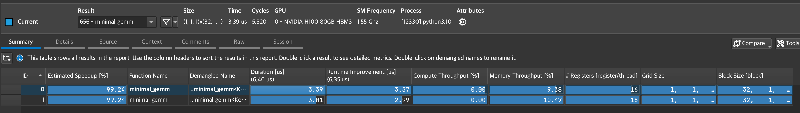

실행 시간에 관해서는, ncu profile의 시간(~3us)이 CUDA Event로 계산한 시간(~8us)보다 작다는 것을 알 수 있다. nsys profile로 한 번 더 확인해 보면 ncu가 계산한 kernel 실행 시간이 더 정확하다는 것을 알 수 있다. 개인적으로 생각하는 이유는 이렇다. CUDA Event가 기록하는 것은 현재 Event를 stream 큐에 삽입한 뒤 Event가 실행되기 시작한 시각이다. 이는 kernel launch부터 Event launch까지의 CPU 시간이 kernel의 실제 실행 시간보다 클 때 Event의 시간 측정이 정확하지 않다는 뜻이다.

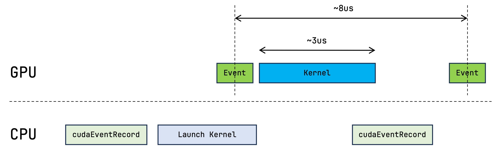

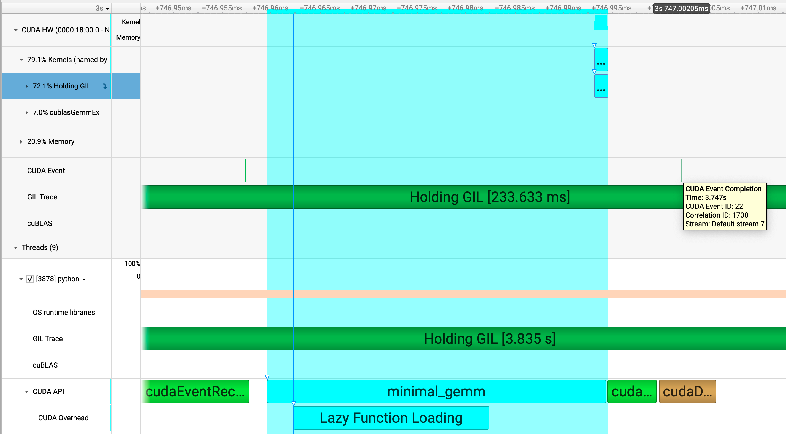

상세한 이용률 지표는 Details 탭의 첫 번째 목록 아래에서 찾을 수 있으며, 이는 거시적 차원에서 kernel 성능을 관측하고 비교하는 데 도움이 된다. 계산 이용률이 높고 메모리 접근 이용률이 낮다면 보통 연산자의 계산이 병목이라는(Compute bound) 뜻이고, 반대라면 연산자의 메모리 접근이 병목이라는 뜻이므로 메모리 접근이 제한되는 원인을 더 분석해야 한다.

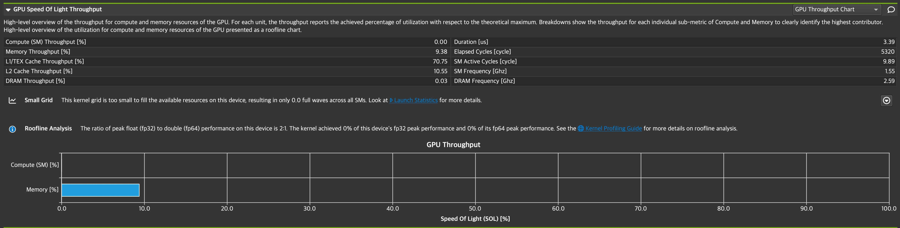

실제 응용에서 많은 연산자는 메모리 접근이 병목이다. 메모리 접근 효율을 최적화하고 싶다면, Nsight Compute의 Memory Chart에서 메모리 접근 경로의 어디가 병목인지, 어느 곳의 메모리 접근 효율이 기대에 못 미치는지 등을 직관적으로 분석할 수 있다.

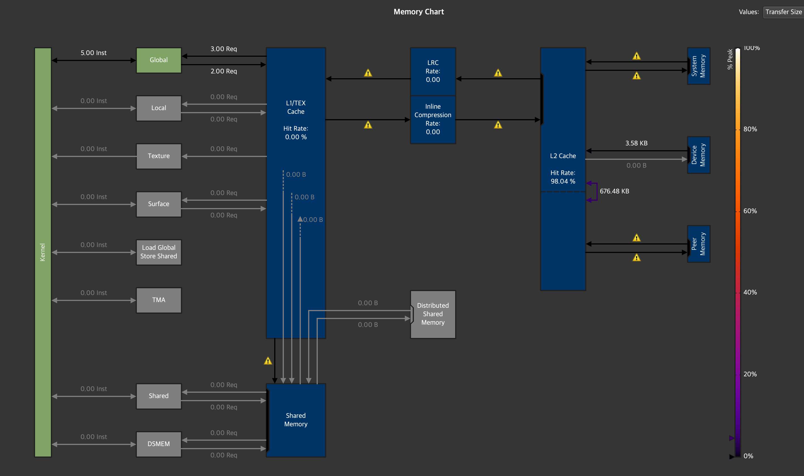

단일 kernel이 메모리 접근 명령어를 몇 개나 사용했는지, 전송한 데이터량은 얼마인지, 그리고 하드웨어가 memory transaction을 몇 번 실행했는지도 표 형태로 관찰할 수 있다. 독자는 여기 있는 데이터가 어떻게 계산되어 나온 것인지 분석해 보기 바란다.

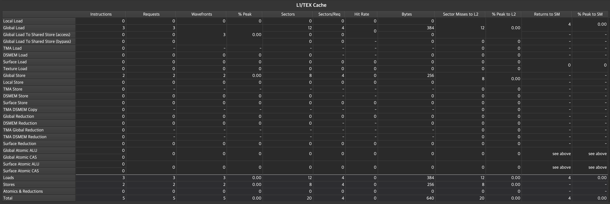

Nsight Compute에는 자주 쓰이는 컴포넌트가 이 밖에도 많다. 뒤이은 노트들에서 더 소개하고, profile 데이터와 결합해 연산자를 분석하겠다.

### 3.4 PTX / SASS 분석

연산자를 컴파일할 때 --generate-line-info 옵션을 켜면 Nsight Compute에서 kernel의 **PTX code**와 **SASS code**를 볼 수 있다.

SASS code는 GPU 하드웨어가 실제로 실행하는 기계어이며, SM 아키텍처가 다르면 SASS code도 상당히 크게 달라질 수 있다. 반면 PTX는 일종의 가상 명령어 집합으로, 서로 다른 SM 아키텍처에서 전방 호환성을 유지한다. 따라서 옛 아키텍처에서 컴파일된 PTX도 새 아키텍처에서 실행할 수 있다.

현재 triton 등 많은 컴파일러의 최종 산출물은 사실 PTX code다. PTX code를 얻고 나면 nvcc/ptxas로 오프라인 컴파일해 SASS binary로 만들어 쓸 수도 있고, binary 안에 PTX code를 직접 넣어 두고 NVRTC가 온라인으로 SASS로 컴파일하게 할 수도 있다. PTX와 SASS에 관한 더 자세한 정보는 공식 문서를 참고하라.

Minimal GEMM kernel에서는 CuTe API를 사용해 데이터 복사와 MMA의 계산 로직을 작성했는데, 더 밑단의 명령어 수준에서는 어떻게 실행될까? 여기서는 C = A * B 연산자 kernel을 예로 삼아 그 PTX/SASS code를 살펴보자.

Source 탭에서 View PTX and SASS를 고르면 왼쪽의 PTX code와 오른쪽의 SASS code를 볼 수 있다.

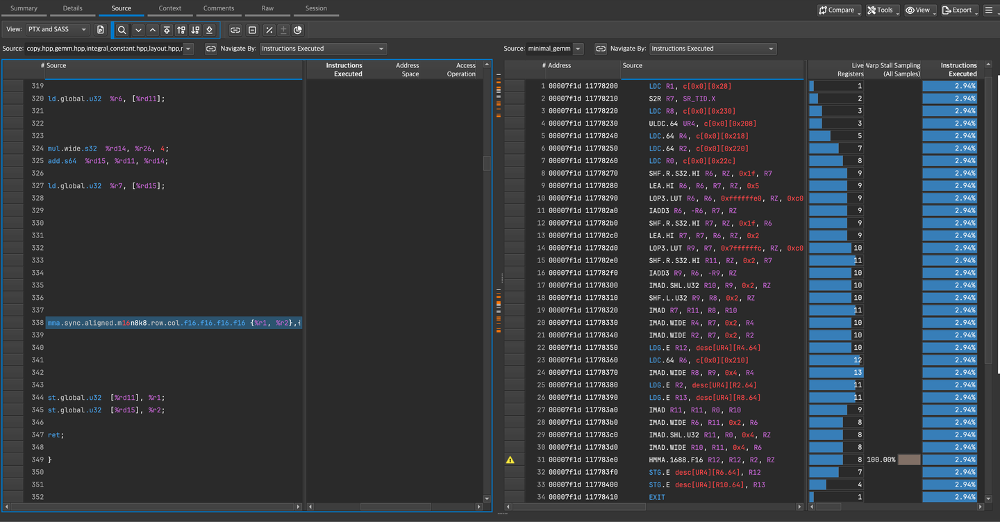

되짚어 보면 Minimal GEMM kernel이 주로 완료한 일은 네 가지다.

- 전역 행렬에 대해 tiling을 수행하여 계산해야 할 데이터 분할의 주소를 얻는다.
- GMEM에서 Register로 데이터를 로드한다.
- MMA 명령어를 실행한다.
- Register 데이터를 GMEM에 저장한다.

PTX 명령어의 앞부분은 모두 주소 계산을 완료하는 데 쓰이고, 핵심인 load-mma-save 단계는 다음 6개의 PTX 명령어에 대응한다.

```c++
ld.global.u32 	%r5, [%rd9];
ld.global.u32 	%r6, [%rd11];
ld.global.u32 	%r7, [%rd15];

mma.sync.aligned.m16n8k8.row.col.f16.f16.f16.f16 {%r1, %r2},{%r3, %r4},{%r5},{%r6, %r7};

st.global.u32 	[%rd11], %r1;
st.global.u32 	[%rd15], %r2;
```

Minimal GEMM kernel의 SASS code는 더욱 간결해서, 마지막의 BRA 명령어를 빼면 프로그램 전체가 34개 명령어뿐이다.

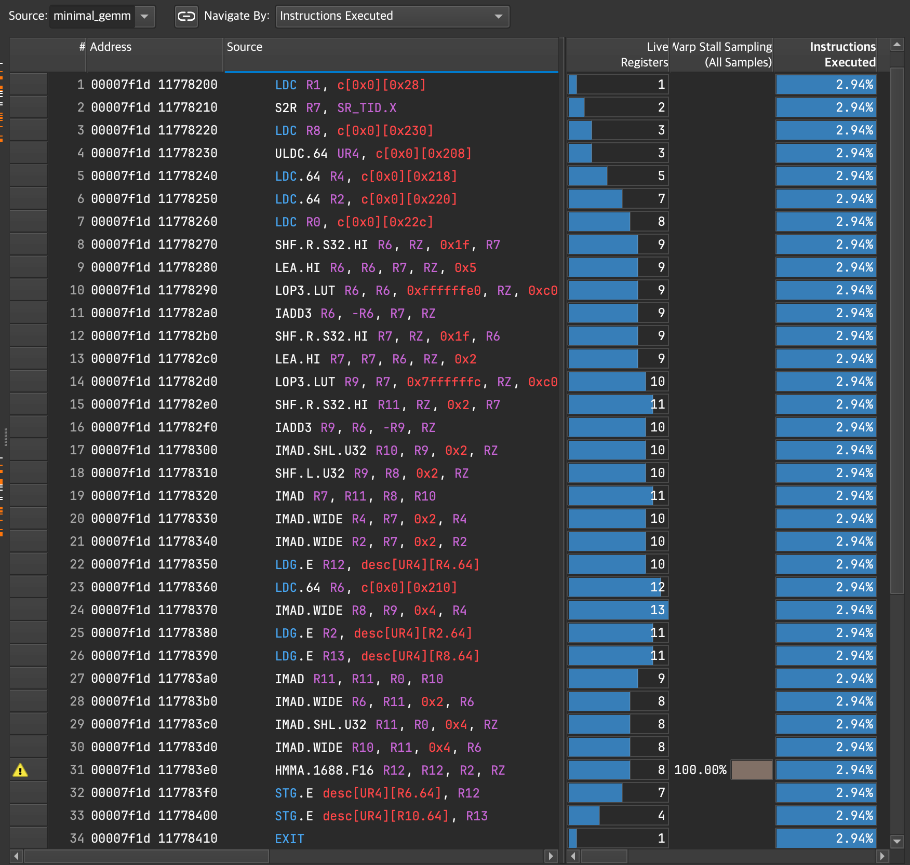

인자 읽기, 상수 읽기, 주소 계산을 제외하면 핵심 명령어도 6개뿐이다.

- 22, 25, 26 행의 **LDG.E**. GMEM에서 32 bits의 데이터를 읽어 레지스터 1개에 저장한다.
- 31 행의 **HMMA.1688.F16**. PTX의 mma 명령어에 대응한다.
- 32, 33 행의 **STG.E**. 레지스터의 데이터를 GMEM에 저장한다.

이 명령어들과 PTX는 대응 관계를 이룰 수 있다(실제 PTX와 SASS 명령어는 일대일로 대응하지 않으며, 표는 참고용일 뿐이다).

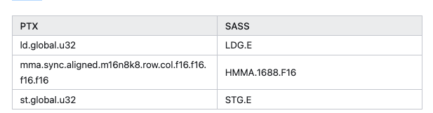

SASS 명령어 관련 자료는 비교적 적지만, PTX 명령어의 동작은 NV 문서에 상세히 기록되어 있다. 따라서 뒤이은 노트들에서는 PTX 수준의 프로그래밍에 더 주목한다. 게다가 CUTLASS도 PTX 인라인을 대량으로 사용한다. 관심 있는 독자는 Minimal GEMM kernel의 CuTe API에서 출발해 가장 안쪽의 메모리 접근과 계산의 PTX 명령을 찾아, 우리가 보여 준 결과와 일치하는지 확인해 보기 바란다.

또한 Nsight Compute는 관련 명령어의 주소 연산과 레지스터 데이터의 생명 주기도 보여 줄 수 있다.

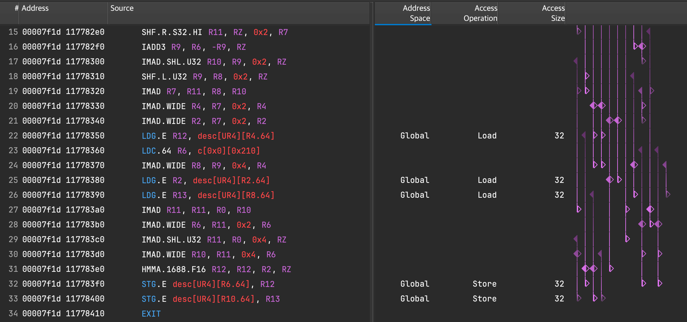

## 4. 정리

이 노트에서는 CuTe의 기초 API를 소개하고, 0에서 1까지 CuTe를 사용해 Minimal GEMM 연산자의 개발, 정밀도 검증, 성능 테스트를 완료했으며, Nsight Compute의 사용 방법을 간략히 소개했다.

가장 기초적인 kernel 개발 흐름을 마쳤으니, 다음 단계에서는 더 복잡한 수치 정밀도에서 GEMM 계산을 완료하고, PTX/SASS code를 통해 하드웨어가 kernel 내부에서 수치 정밀도를 어떻게 변환하는지 분석하겠다.

# CUTLASS 노트 (2): 혼합 정밀도 GEMM kernel

이번 편에서는 서로 다른 입력 정밀도, 출력 정밀도, 누산 정밀도를 지원하는 GEMM 연산자를 어떻게 구현하는지 소개하고, 연산자 내부에서 수치 정밀도 변환을 구현하는 몇 가지 기술적 세부 사항을 분석한다. CUTLASS에는 아직 통합되어 있지 않지만 PTX 명령어는 지원하는 MMA op에 대해, PTX 문서를 근거로 커스텀 FP8 정밀도 GEMM kernel을 구현하는 방법도 이번 편에서 소개한다.

## 1. MMA 시나리오에서의 연산자 정밀도

앞 편 노트에서 우리는 0에서 1까지 단일 명령어 16x8x8 MMA 연산자를 구현했다. 그러나 이 연산자의 입력, 출력, 누산의 수치 정밀도는 모두 FP16이라 사용 시나리오가 제한적이다. 따라서 이어서 Minimal GEMM kernel을 기반으로 다양한 수치 정밀도를 지원하도록 하고, 나아가 FP8의 두 가지 format을 섞어 GEMM 연산을 할 수도 있게 하겠다!

실제 시나리오에서 하나의 MMA 연산자가 관여하는 정밀도에는 다음이 포함된다. **1) 입력 데이터의 정밀도, 2) accumulator 정밀도, 3) 출력 데이터의 정밀도.** GEMM 연산자가 **epilogue(후처리)** 부분을 포함한다면 epilogue와 관련된 계산 및 누산 정밀도도 있다.

MMA 시나리오에서의 `D = A * B + C` 계산을 생각해 보자. 입력 데이터 정밀도에는 A, B, C 세 가지가 있으며 이를 각각 **ComputeTypeA**, **ComputeTypeB**, **ComputeTypeC**로 표기한다. accumulator 정밀도는 A*B의 결과와 C를 더한 뒤 산출되는 데이터의 정밀도이며(이것이 Tensor Core의 실제 누산 정밀도는 아니라는 점에 유의하라), 이를 **AccType**으로 표기한다. 이것이 곧 A*B+C의 계산 결과이기도 하다. 우리가 필요로 하는 D의 정밀도가 바로 AccType이라면 연산자는 A*B+C의 결과를 그대로 반환하면 되고, 그렇지 않다면 정밀도 변환 작업을 한 단계 더 수행하여 AccType을 우리가 원하는 출력 정밀도로 변환해야 한다. 이 출력 정밀도를 **OutType**으로 표기한다.

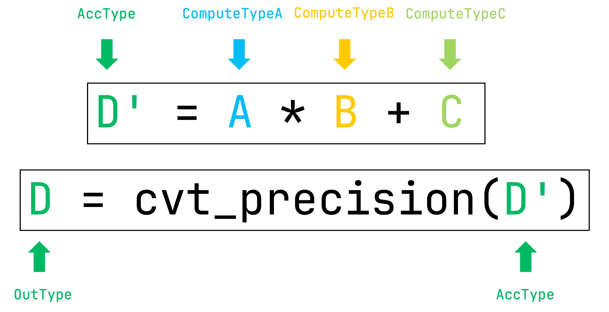

PTX의 MMA 명령어는 일반적으로 그 명령어에 대응하는 수치 정밀도를 표기한다. 예를 들면 다음과 같다.

```c++
mma.sync.aligned.m16n8k16.row.col.f32.bf16.bf16.f32
```

이 명령어의 AccType은 FP32이고, ComputeTypeA와 ComputeTypeB는 모두 BF16이며, ComputeTypeC는 FP32이다. PTX와 하드웨어의 제약 때문에 임의의 정밀도 조합에 대응하는 MMA 명령어가 항상 있는 것은 아니다. 또한 MMA shape, sparsity, PTX 버전에 따라 지원하는 수치 정밀도가 다르다. 구체적인 내용은 PTX 문서가 제공하는 표를 보라: https://docs.nvidia.com/cuda/parallel-thread-execution/index.html#warp-level-matrix-shape

우리가 사용하는 MMA 명령어는 대부분 ComputeTypeC와 AccType이 동일하다. 따라서 이번 편의 모든 코드 예제는 AccType = ComputeTypeC 를 가정한다.

## 2. 왜 혼합 정밀도 연산자가 필요한가?

**혼합 수치 정밀도로 GEMM을 계산하려는 수요는 매우 광범위하지만 자주 간과된다**. 때로는 간단한 GEMM 하나가 이토록 많은 정밀도와 얽혀 있다는 사실조차 의식하지 못한다. 아래에 두 가지 예를 든다.

1. **현재 연산자 정밀도를 제어할 수단이 제한적이다.**수치에 민감한 학습 시나리오에서 GEMM의 누산 정밀도는 최종 학습 결과에 영향을 줄 가능성이 크다.

예를 들어 `torch.matmul`로 두 BF16 행렬의 곱을 계산하면 누산 정밀도는 FP32지만, 두 FP16 행렬의 곱을 계산하면 누산 정밀도는 FP16이다. 게다가 Pytorch는 누산 정밀도를 수정할 수 있는 다른 API를 제공하지 않는다.

또 다른 예로 `torch.addmm`은 MMA 계산을 완료하지만, 입력되는 A, B, C 세 Tensor의 수치 정밀도가 반드시 동일할 것을 요구한다. 따라서 이것으로 BF16 * BF16 + FP32 계산을 바로 완료할 수는 없다. 그러므로 계산 정밀도를 제어하는 일은 Pytorch API를 그냥 호출하는 것만으로 손쉽게 이룰 수 있는 것이 아니다.

2. **저정밀도에서의 GEMM 계산은 필연적으로 혼합 수치 정밀도를 사용하게 된다.**

DeepSeek V3 논문에 나오는 FP8 Linear 계산을 예로 들어 보자.

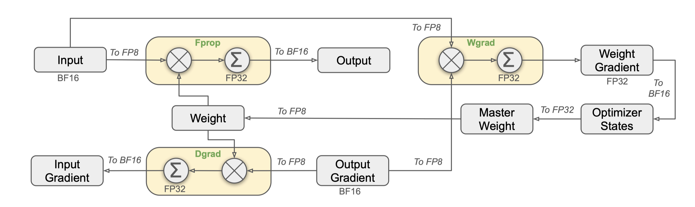


순전파 Linear 계산을 예로 들면, 모델 가중치의 정밀도는 FP8(양자화 파라미터를 동반)이고 입력 데이터의 정밀도는 BF16이다. 연산자를 실행하기 전에 먼저 연산자 밖에서 BF16 입력을 FP8로 양자화해야 하고, 그다음 FP8 입력과 FP8 모델 가중치를 연산자에 넘겨 GEMM을 계산하며 누산 정밀도는 FP32이다. 마지막으로 연산자 안에서 계산 결과를 BF16으로 변환해 출력한다. 따라서 여기서는 BF16 = FP8 * FP8 + FP32 의 GEMM을 완료해야 한다. Pytorch만으로는 이런 계산을 간편하게 완료할 방법이 없음이 분명하다.

혼합 수치 정밀도 계산은 이토록 중요하지만 막상 쓰려고 하면 생각만큼 쉽지 않다. 따라서 정확하면서도 정밀도 요구를 만족하는 GEMM 연산자를 어떻게 작성할지 살펴볼 필요가 있다.

## 3. 혼합 정밀도 GEMM 연산자 구현하기

먼저 이번 편에서 구현할 2개 연산자의 상세 내용을 정리한다.

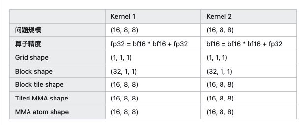

Kernel 1은 입력 A, B 행렬의 정밀도가 BF16이고 C 행렬 정밀도, 누산 정밀도, D 행렬 정밀도가 FP32일 것을 요구한다. 반면 Kernel 2는 D 행렬의 정밀도가 BF16일 것을 요구한다. 그렇다면 이 두 가지 정밀도의 계산을 어떻게 구현해야 할까?

일반적으로 연산자 안에서 정밀도를 변환하는 방식에는 두 가지가 있다. 1) **특정 MMA 명령어 사용하기**, 2) **레지스터에서 정밀도 변환하기**. 이어서 이 두 방식을 차례로 소개한다.

### 3.1 특정 MMA 명령어 사용하기

FP32 = BF16 * BF16 + FP32 라는 정밀도 조합은 기존 PTX MMA 명령어로 바로 계산할 수 있고, CUTLASS도 그 명령어를 감싼 MMA op를 제공한다. 따라서 우리는 MMA op만 바꾸면 된다.

```c++
using MMA_op = SM80_16x8x8_F32BF16BF16F32_TN;
```

### 3.2 레지스터에서 정밀도 변환하기

BF16 = BF16 * BF16 + FP32 라는 정밀도 조합은 기존 PTX MMA가 직접 계산하는 것을 지원하지 않는다. 따라서 FP32 결과를 계산해 낸 뒤 그것에 대해 정밀도 변환 작업을 한 번 더 수행할 수 있다. CuTe에서는 출력 결과와 같은 shape를 가지되 수치 정밀도가 BF16인 레지스터 Tensor를 만들고, FP32 Tensor를 BF16 Tensor로 복사하면 정밀도 변환이 완료된다.

```c++
// OutType = float，tCrC 의 정밀도는 FP32
auto tCrO = make_tensor_like<OutType>(tCrC);
copy(tCrC, tCrO);  // Convert precision
// 이후 tCrO 를 GMEM 으로 복사한다
```

여기서의 copy 연산은 사실 루프를 돌며 대입하는 것과 동등하다.

```c++
for (int i = 0; i < size(tCrC); ++i) {
  tCrO(i) = tCrC(i);
}
```

### 3.3 Kernel 쪽 코드 변경

앞 편의 Minimal GEMM Kernel에서는 계산 시나리오를 C = A * B + C 로 단순화했다. 여기서는 이를 통상적인 MMA 시나리오인 D = A*B+C 로 수정해야 한다. 따라서 A, B, C 행렬 외에 output 행렬의 Tensor 표현도 만들어야 한다. output 행렬은 포인터 타입만 C 행렬과 다르다.

```c++
Tensor mA = make_tensor(make_gmem_ptr((ComputeTypeA *)Aptr),
                        make_shape(m, k),
                        make_stride(k, Int<1>{}));  // (M, K)
Tensor mB = make_tensor(make_gmem_ptr((ComputeTypeB *)Bptr),
                        make_shape(n, k),
                        make_stride(k, Int<1>{}));  // (N, K)
Tensor mC = make_tensor(make_gmem_ptr((ComputeTypeC *)Cptr),
                        make_shape(m, n),
                        make_stride(n, Int<1>{}));  // (M, N)
Tensor mO = make_tensor(make_gmem_ptr((OutType *)Outptr),
                        make_shape(m, n),
                        make_stride(n, Int<1>{}));  // (M, N)
```

GEMM 계산을 마친 뒤에는 정밀도 변환이 필요한지 여부에 따라 서로 다른 실행 경로를 고른다. 정밀도 변환이 필요 없다면 FP32 데이터를 바로 GMEM으로 복사하고, 그렇지 않다면 정밀도를 변환한 뒤에 복사해야 한다.

```c++
if constexpr (!cvt_out_precision) {
  copy(copy_atom, tCrC, tCgC);
} else {
  auto tCrO = make_tensor_like<OutType>(tCrC);
  copy(tCrC, tCrO);  // Convert precision

  Tensor tCgO = thr_mma.partition_C(gO);  // (MMA, MMA_M, MMA_N)
  copy(copy_atom, tCrO, tCgO);
}
```

### 3.4 PTX / SASS 분석

Nsight Compute를 통해 정밀도 변환에 대응하는 PTX와 SASS 명령어를 손쉽게 찾을 수 있다.

먼저 MMA op를 교체한 뒤 PTX MMA 명령어는 다음과 같이 바뀐다.

```c++
mma.sync.aligned.m16n8k8.row.col.f32.bf16.bf16.f32 {%f1,  %f2,  %f3,  %f4},{%r1,  %r2},{%r3},{%f8,  %f8,  %f8,  %f8};
```

그리고 SASS 명령어는 다음과 같이 바뀐다.

```c++
HMMA.1688.F32.BF16 R4, R4, R2, RZ
```

전부 FP16 정밀도였던 경우와 비교하면 여기서는 명령어의 정밀도 기술 부분만 바뀌었다. 독자는 PTX/SASS가 MMA 명령어의 정밀도를 어떻게 기술하는지 명확히 볼 수 있을 것이다.

추가적인 정밀도 변환 작업을 넣고 나면 PTX에 `cvt` 명령어가 4개 늘어나는데, 이는 각 스레드가 레지스터에 담고 있는 D 행렬 데이터 4개에 대응한다.

```shell
cvt.rn.bf16.f32 %rs2, %f2;
cvt.rn.bf16.f32 %rs1, %f1;
cvt.rn.bf16.f32 %rs4, %f4;
cvt.rn.bf16.f32 %rs3, %f3;
```

여기서 `.rn`은 rounds to nearest even을 뜻한다. 다른 반올림 방식을 쓰고 싶다면 다른 명령어로 바꾸면 된다. 구체적인 내용은 PTX 문서를 참고하라.

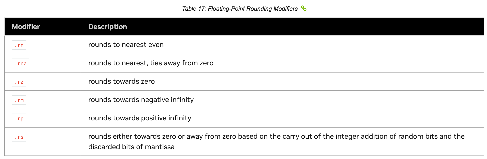

PTX와 달리 SASS 쪽에서는 명령어가 2개만 늘어난다. 그 의미는 레지스터 4개에 담긴 FP32 데이터 4개의 정밀도를 변환하고, 이를 묶어 레지스터 2개에 저장하되 각 레지스터에 BF16 데이터를 2개씩 담는다는 것이다.

```sass
F2FP.BF16.F32.PACK_AB R5, R5, R4   // (R4, R5) -> (R5)
F2FP.BF16.F32.PACK_AB R7, R7, R6   // (R6, R7) -> (R7)
```

그다음 R5, R7 두 레지스터의 데이터를 GMEM으로 복사한다.

```sass
STG.E desc[UR4][R12.64], R5
STG.E desc[UR4][R14.64], R7
```

## 4. 커스텀 FP8 GEMM 연산자

위에서는 CUTLASS가 제공하는 MMA op를 재사용했다. 그런데 어떤 시나리오에서는 PTX 명령어가 어떤 정밀도 조합을 지원하는데도 CUTLASS가 대응하는 래핑을 제공하지 않는다면 어떻게 해야 할까? 이럴 때는 CUTLASS를 확장해 커스텀 MMA op를 작성할 수 있다.

Ada 아키텍처부터 NV는 FP8 정밀도의 MMA 명령어를 제공한다. 우리는 가장 작은 FP8 GEMM kernel을 작성해 볼 수 있는데, PTX 문서를 참고하면 그 최소 shape는 (16, 8, 32)이다. 여기서는 FP8의 두 가지 format 정밀도(E4M3, E5M2)를 섞어 GEMM을 하는 다소 화려한 시나리오를 가정한다. 실제로 PTX 명령어는 이런 정밀도를 지원하지만 CUTLASS에는 대응하는 MMA op가 없다. 그러니 직접 작성해 보자!

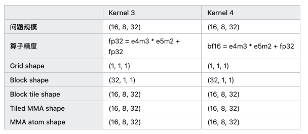

### 4.1 MMA Atom 의 베일 벗기기

앞 편 노트에서 우리는 단일 MMA 명령어를 사용할 때 유의해야 할 사항을 이미 소개했다. 크게 보면 두 가지 측면이 있다.

1. **SM 아키텍처, MMA shape 크기, 연산자 정밀도 등의 상황에 근거해 올바른 PTX MMA 명령어를 고른다.**

**CUTLASS에서 MMA op 객체는 특정한 PTX MMA 명령어를 기술하는 데 쓰인다**. Minimal GEMM kernel을 예로 들면 우리가 사용한 MMA op는 SM80_16x8x8_F16F16F16F16_TN이며, CUTLASS에서는 대응하는 PTX MMA 명령어의 래핑으로 구현되어 있다.


```c++
// SM80_16x8x8_F16F16F16F16_TN：Ampere 아키텍처의 mma.sync 명령어 래핑
// 명명 의미：SM80=Ampere, 16x8x8=M×N×K tile 크기, F16F16F16F16=D/A/B/C 모두 fp16, TN=A 행 우선(T)/B 열 우선(N)
struct SM80_16x8x8_F16F16F16F16_TN
{
  // 각 스레드가 보유하는 레지스터 개수（uint32_t 하나에 fp16 원소 2개를 담을 수 있다）
  // D(출력): 레지스터 2개 → fp16 4개, 16x8=128 개 원소 ÷ 32스레드 = 스레드당 4개에 대응
  using DRegisters = uint32_t[2];
  // A: 레지스터 2개 → fp16 4개, 16x8=128 개 원소 ÷ 32스레드 = 스레드당 4개에 대응
  using ARegisters = uint32_t[2];
  // B: 레지스터 1개 → fp16 2개, 8x8=64 개 원소 ÷ 32스레드 = 스레드당 2개에 대응
  using BRegisters = uint32_t[1];
  // C(입력 accumulator): 레지스터 2개 → fp16 4개, D 와 배치가 동일
  using CRegisters = uint32_t[2];

  CUTE_HOST_DEVICE static void
  fma(uint32_t      & d0, uint32_t      & d1,  // 출력 D 의 레지스터 2개
      uint32_t const& a0, uint32_t const& a1,  // 입력 A 의 레지스터 2개
      uint32_t const& b0,                       // 입력 B 의 레지스터 1개
      uint32_t const& c0, uint32_t const& c1)  // 입력 accumulator C 의 레지스터 2개
  {
#if defined(CUTE_ARCH_MMA_SM80_ENABLED)
    asm volatile(
      // PTX 명령어：warp 내 32스레드가 동기 실행하는 16×8×8 행렬 곱 누산, D = A*B + C
      // row.col 은 A 행 우선, B 열 우선을 뜻한다
      "mma.sync.aligned.m16n8k8.row.col.f16.f16.f16.f16 "
      "{%0, %1},"   // D: 출력 레지스터 d0, d1
      "{%2, %3},"   // A: 입력 레지스터 a0, a1
      "{%4},"       // B: 입력 레지스터 b0
      "{%5, %6};\n" // C: accumulator 입력 c0, c1
      : "=r"(d0), "=r"(d1)
      :  "r"(a0),  "r"(a1),
         "r"(b0),
         "r"(c0),  "r"(c1));
#else
    CUTE_INVALID_CONTROL_PATH("Attempting to use SM80_16x8x8_F16F16F16F16_TN without CUTE_ARCH_MMA_SM80_ENABLED");
#endif
  }
};
```

2. **MMA 명령어에 내재된 행렬 원소와 각 스레드 내 레지스터의 매핑 관계에 따라, 각 스레드가 올바른 행렬 원소를 받게 하고 계산 결과를 올바른 스레드에 저장한다.**

CUTLASS에서 MMA Traits 객체는 특정 MMA 명령어의 이런 내재적 매핑 관계를 기술하는 데 쓰인다. 위의 MMA op를 다시 예로 들면, 그에 대응하는 MMA Traits는 다음과 같다.

```c++
template <>
struct MMA_Traits<SM80_16x8x8_F16F16F16F16_TN>
{
  // 각 행렬의 원소 타입은 모두 fp16
  using ValTypeD = half_t;
  using ValTypeA = half_t;
  using ValTypeB = half_t;
  using ValTypeC = half_t;

  // 이 MMA 명령어가 커버하는 tile 크기：M=16, N=8, K=8
  using Shape_MNK = Shape<_16,_8,_8>;

  // 이번 MMA 에 참여하는 스레드 수：완전한 warp 하나(32스레드)
  using ThrID   = Layout<_32>;

  // ALayout 설명：A 행렬 (M=16, K=8) 의 원소가 32개 스레드 레지스터에 분포하는 방식
  // Shape  : ((4,8), (2,2))  → 첫 번째 mode (4,8) 은 32개 스레드 ID 를 열거하고, 두 번째 mode (2,2) 는 스레드당 보유하는 원소 4개를 열거한다
  // Stride : ((32,1),(16,8)) → 스레드 ID 가 32*i+j 를 기여하고, 원소 내 오프셋이 16*p+8*q 를 기여한다
  // 선형 인덱스 = 32*i + j + 16*p + 8*q, A[M][K] 안의 행렬 위치에 대응
  using ALayout = Layout<Shape <Shape < _4,_8>,Shape < _2,_2>>,
                         Stride<Stride<_32,_1>,Stride<_16,_8>>>;

  // BLayout 설명：B 행렬 (N=8, K=8) 의 원소가 32개 스레드 레지스터에 분포하는 방식
  // Shape  : ((4,8), 2)   → (4,8) 은 32개 스레드 ID 를 열거하고, 2 는 스레드당 보유하는 원소 2개를 열거한다
  // Stride : ((16,1), 8)  → 스레드 ID 가 16*i+j 를 기여하고, 원소 내 오프셋이 8*k 를 기여한다
  // 선형 인덱스 = 16*i + j + 8*k, B[N][K] 안의 행렬 위치에 대응
  using BLayout = Layout<Shape <Shape < _4,_8>,_2>,
                         Stride<Stride<_16,_1>,_8>>;

  // CLayout 설명：C/D 행렬 (M=16, N=8) 의 원소가 32개 스레드 레지스터에 분포하는 방식
  // 배치 구조는 ALayout 과 완전히 동일하며, 스레드당 원소 4개를 보유한다
  // 선형 인덱스 = 32*i + j + 16*p + 8*q, C[M][N] 안의 행렬 위치에 대응
  using CLayout = Layout<Shape <Shape < _4,_8>,Shape < _2,_2>>,
                         Stride<Stride<_32,_1>,Stride<_16,_8>>>;
};
```

### 4.2 TV Layout 와 MN Layout

여기서 답해야 할 핵심 질문은, A/B/C Layout이 하나의 MMA 명령어 안에서 행렬 원소와 각 스레드 내 레지스터의 매핑 관계를 어떻게 표현하는가이다. 다시 말해 각 스레드는 어떤 행렬 원소를 받아야 하는지, 그리고 계산 결과의 어느 부분을 자기 레지스터에 저장해야 하는지를 어떻게 아는 것일까?

앞 편 노트에서 우리는 "CuTe의 Layout은 일종의 **매핑 관계**이며 문맥에 따라 서로 다른 의미를 가진다"고 강조했다. 여기서 우리는 CuTe의 두 번째 종류의 Layout인 **TV Layout**을 만난다. TV Layout은 (스레드 ID, 행렬 원소 index)라는 순서쌍과 행렬 좌표 (M, N)의 매핑 관계를 표현하며, (T, V) -> (M, N)으로 나타낼 수 있다. 위의 A/B/C Layout은 모두 일종의 TV Layout이다.

일반적으로 TV Layout은 전단사이다. 즉 (T, V)와 (M, N)이 일대일 대응 관계를 가지므로 그에 대응하는 역매핑도 존재한다. 이것이 우리가 접하는 세 번째 종류의 Layout인 **MN Layout**이며, (M, N) -> (T, V)의 매핑 관계를 나타낸다. 앞 편 노트에서 보여 준 MMA 매핑 관계(아래 그림 참고)가 사실은 그 MMA 명령어에 대응하는 MN Layout이다.

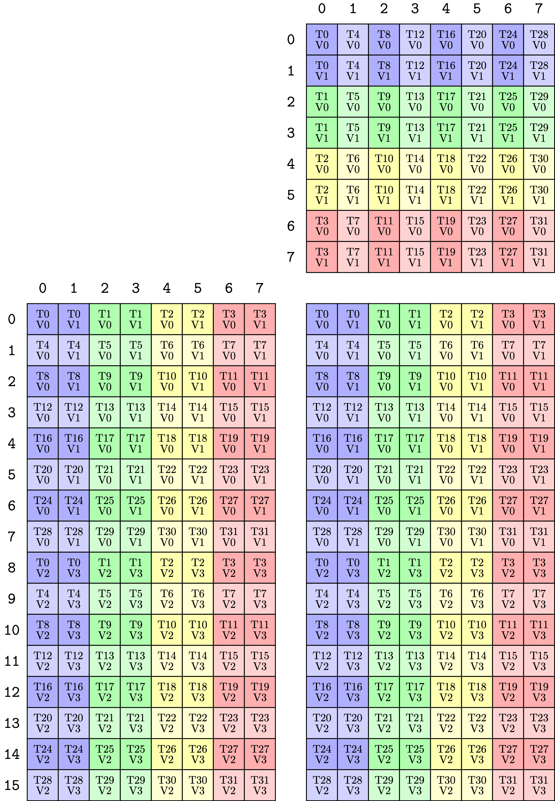

ALayout = ((4, 8), (2, 2)) : ((32, 1), (16, 8)) 을 예로 들어 스레드가 필요한 행렬 원소를 어떻게 찾는지 설명한다.

**TV Layout의 두 mode는 각각 스레드 idx와 행렬 원소 idx이다**. MN Layout 개념도를 참고하면, A 행렬에는 모두 16 x 8 = 128 개의 원소가 있고 MMA에는 총 32개 스레드가 참여하므로 각 스레드는 A 행렬 원소를 4개씩 받아야 한다. 따라서 스레드 idx의 값 범위는 0-31이고 행렬 원소 idx의 값 범위는 0-3이며, A 행렬에 대응하는 TV Layout의 shape는 (32, 4)로 ALayout의 shape와 같다.

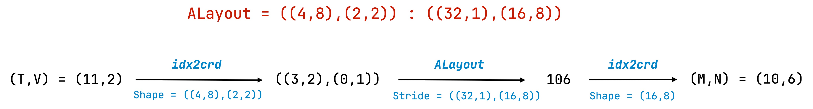

ALayout = ((4, 8), (2, 2)) : ((32, 1), (16, 8)) 을 이미 알고 있다고 가정하면, 스레드 11의 2번째 원소는 행렬의 어느 좌표에서 데이터를 가져와야 할까?

- ALayout에는 중첩 mode가 있으므로 (T, V) = (11, 2)를 중첩 좌표로 변환해야 한다. 구체적으로는 각 mode에 대해 그 mode의 idx를 idx2crd 변환을 거쳐 좌표 형태로 바꾼다. 예를 들어 첫 번째 mode에서는 11을 shape = (4, 8)의 좌표로 대응시키므로 (11 % 4, 11 / 4) = (3, 2)가 된다. 따라서 ALayout의 shape를 참고하면 (11, 2)를 ((3, 2), (0, 1))로 변환할 수 있다.
- 그다음 ALayout의 stride를 참고해, 좌표를 ALayout을 거쳐 (M, N) 공간의 idx = 3x32 + 2x1 + 0x16 + 1x8 = 106 으로 매핑한다.
- 마지막으로 (M, N) 공간에서 idx2crd 변환을 거치는데, shape = (16, 8)을 참고하면 106을 좌표 형태 (106 % 16, 106 / 16) = (10, 6)으로 변환할 수 있다. 따라서 스레드 11의 2번째 원소는 행렬의 (10, 6) 위치에서 데이터를 가져와야 한다.


그러므로 **ALayout은 (T, V) = (11, 2)를 (M, N) = (10, 6)으로 매핑한다**. MN Layout 그림에서 행렬의 (10, 6) 원소가 실제로 T11 V2에 대응함을 확인할 수 있으니, 우리 계산이 맞다는 것이 증명된다. B/C Layout의 해석도 마찬가지다.

> 실제로 그림 4의 A 행렬 부분은 MK Layout이라고 불러야 하고, B는 KN Layout이라고 불러야 하며, C만이 진짜 MN Layout이다. 다만 서술의 편의를 위해 이들을 모두 통일해서 MN Layout이라고 부르겠다

이렇게 해서 TV Layout만 알면 각 스레드는 자신이 행렬의 어떤 원소를 읽고 저장해야 하는지 계산해 낼 수 있다.

### 4.3 FP8 MMA op 와 MMA Traits

TV Layout과 MN Layout을 이해했으니, 이제 FP32 = E4M3 * E5M2 + FP32 에 대응하는 MMA op와 MMA Traits를 작성할 수 있다.

CUTLASS의 예시를 본떠 이 MMA op의 이름을 `SM90_16x8x32_F32E4M3E5M2F32_TN`으로 짓고, PTX 명령어로는 다음을 고른다.

```c++
mma.sync.aligned.m16n8k32.row.col.f32.e4m3.e5m2.f32
```

MMA op를 작성할 때 기본적으로 주의할 점은 하나뿐이다. 각 스레드가 각 행렬에 대해 몇 개의 레지스터를 넘겨야 하는가이다. 예를 들어 여기서는 각 스레드가 A 행렬 원소 16개, B 행렬 원소 8개, C/D 행렬 원소 4개를 필요로 하고, A와 B의 수치 정밀도가 FP8이고 C와 D의 수치 정밀도가 FP32임을 고려하면, A, B, C, D에 각각 4, 2, 4, 4개의 레지스터가 필요하다고 계산할 수 있다.

```c++
struct SM90_16x8x32_F32E4M3E5M2F32_TN
{
  using DRegisters = float[4];
  using ARegisters = uint32_t[4];
  using BRegisters = uint32_t[2];
  using CRegisters = float[4];

  CUTE_HOST_DEVICE static void
  fma(float         & d0, float         & d1, float         & d2, float         & d3,
      uint32_t const& a0, uint32_t const& a1, uint32_t const& a2, uint32_t const& a3,
      uint32_t const& b0, uint32_t const& b1,
      float    const& c0, float    const& c1, float    const& c2, float    const& c3)
  {
#if defined(CUTE_ARCH_MMA_SM89_ENABLED)
    asm volatile(
      "mma.sync.aligned.m16n8k32.row.col.f32.e4m3.e5m2.f32 "
      "{%0,  %1,  %2,  %3},"
      "{%4,  %5,  %6,  %7},"
      "{%8,  %9},"
      "{%10, %11, %12, %13};\n"
      : "=f"(d0), "=f"(d1), "=f"(d2), "=f"(d3)
      :  "r"(a0),  "r"(a1),  "r"(a2),  "r"(a3),
         "r"(b0),  "r"(b1),
         "f"(c0),  "f"(c1),  "f"(c2),  "f"(c3));
#else
    CUTE_INVALID_CONTROL_PATH("Attempting to use SM90_16x8x32_F32E4M3E5M2F32_TN without CUTE_ARCH_MMA_SM89_ENABLED");
#endif
  }
};
```

MMA Traits를 작성하는 일은 조금 더 번거롭다. 먼저 PTX 문서에서 그 명령어에 대응하는 모든 행렬의 MN Layout을 찾아야 한다. 여기서는 A 행렬을 예로 들며, 그 MN Layout은 다음과 같다.


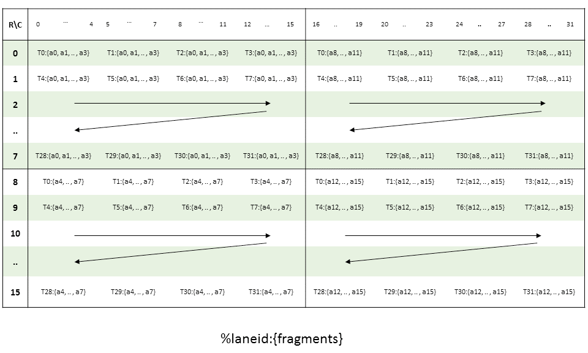

그다음 이 MN Layout으로부터 TV Layout을 거꾸로 유도해야 한다. 위 그림에서 A 행렬의 TV Layout이 ((4, 8), (4, 2, 2)) : ((64, 1), (16, 8, 256)) 임을 어렵지 않게 유도할 수 있다.

> 뭐라고? 어디가 어렵지 않냐고 묻는다면, 여기 각 mode의 Shape와 Stride를 유도해 내는 작은 요령이 있다.
T라는 mode를 예로 들면, 스레드가 모두 32개임을 알고 있으니 먼저 T0V0에서 T1V0까지의 보폭을 본다. 위 그림에서 MN 좌표가 (0, 0)에서 (0, 5)로 가므로 보폭은 64이고, T1V0에서 T2V0으로 갈 때도 보폭은 64이며, T3V0 -> T4V0에 이르면 보폭이 급변하는 것을 발견한다. 따라서 T라는 mode에는 sub-mode 차원이 하나 더 있고, 보폭은 T0V0 -> T4V0에서 1로 계산해 낼 수 있다. 이후 T4V0 -> T8V0, T8V0 -> T12V0, 나아가 T24V0 -> T28V0에 이르기까지 보폭은 모두 1이다.
따라서 T라는 mode에는 두 개의 sub-mode가 있고 Shape는 (4, 8), Stride는 (64, 1)임을 알 수 있다. 이렇게 T 부분의 mode가 유도되었다. V 부분의 mode도 마찬가지다.

같은 방식으로 B, C의 TV Layout도 쓸 수 있으므로, 이 MMA op에 대응하는 MMA Traits를 작성할 수 있다.

```c++
template <>
struct MMA_Traits<SM90_16x8x32_F32E4M3E5M2F32_TN>
{
  using ValTypeD = float;
  using ValTypeA = float_e4m3_t;
  using ValTypeB = float_e5m2_t;
  using ValTypeC = float;

  using Shape_MNK = Shape<_16,_8,_32>;
  using ThrID   = Layout<_32>;
  using ALayout = Layout<Shape <Shape < _4,_8>,Shape < _4,_2,  _2>>,
                         Stride<Stride<_64,_1>,Stride<_16,_8,_256>>>;
  using BLayout = Layout<Shape <Shape < _4,_8>,Shape <_4,  _2>>,
                         Stride<Stride<_32,_1>,Stride<_8,_128>>>;
  using CLayout = Layout<Shape <Shape < _4,_8>,Shape < _2,_2>>,
                         Stride<Stride<_32,_1>,Stride<_16,_8>>>;
};
```

마지막으로 MMA op를 우리가 직접 작성한 op 클래스로 설정하면 대공이 완성된다!

```c++
using MMA_op = SM90_16x8x32_F32E4M3E5M2F32_TN;
```

### 4.4 정밀도 검증

여기까지 우리는 4종류의 연산자를 작성했고, 각 연산자는 MM과 MMA 두 시나리오를 모두 지원한다. 따라서 총 8개의 사례를 테스트해야 하며, 테스트 스크립트를 실행한 결과는 다음과 같다.

```shell
------------------------------------------ M=16, N=8, K=8 ------------------------------------------
Block Size: (32, 1, 1) | Grid Size: (1, 1, 1) | Shared Memory Size: 0 Bytes
Kernel execution time: 2.438 ms
--------------- Result: Success, Max diff = 0.00000, Mean diff = 0.00000, RE = 0.00% ---------------
Block Size: (32, 1, 1) | Grid Size: (1, 1, 1) | Shared Memory Size: 0 Bytes
Kernel execution time: 0.010 ms
--------------- Result: Success, Max diff = 0.00000, Mean diff = 0.00000, RE = 0.00% ---------------
------------------------------------------ M=16, N=8, K=8 ------------------------------------------
Block Size: (32, 1, 1) | Grid Size: (1, 1, 1) | Shared Memory Size: 0 Bytes
Kernel execution time: 0.010 ms
--------------- Result: Success, Max diff = 0.00000, Mean diff = 0.00000, RE = 0.00% ---------------
Block Size: (32, 1, 1) | Grid Size: (1, 1, 1) | Shared Memory Size: 0 Bytes
Kernel execution time: 0.011 ms
--------------- Result: Success, Max diff = 0.00000, Mean diff = 0.00000, RE = 0.00% ---------------
----------------------------------------- M=16, N=8, K=32 ------------------------------------------
Block Size: (32, 1, 1) | Grid Size: (1, 1, 1) | Shared Memory Size: 0 Bytes
Kernel execution time: 0.010 ms
--------------- Result: Success, Max diff = 0.00000, Mean diff = 0.00000, RE = 0.00% ---------------
Block Size: (32, 1, 1) | Grid Size: (1, 1, 1) | Shared Memory Size: 0 Bytes
Kernel execution time: 0.010 ms
--------------- Result: Success, Max diff = 0.00000, Mean diff = 0.00000, RE = 0.00% ---------------
----------------------------------------- M=16, N=8, K=32 ------------------------------------------
Block Size: (32, 1, 1) | Grid Size: (1, 1, 1) | Shared Memory Size: 0 Bytes
Kernel execution time: 0.010 ms
--------------- Result: Success, Max diff = 0.00000, Mean diff = 0.00000, RE = 0.00% ---------------
Block Size: (32, 1, 1) | Grid Size: (1, 1, 1) | Shared Memory Size: 0 Bytes
Kernel execution time: 0.010 ms
--------------- Result: Success, Max diff = 0.00000, Mean diff = 0.00000, RE = 0.00% ---------------
----------------------------------- Summary: 8 Succeed, 0 Failed -----------------------------------
```

### 4.5 PTX / SASS 분석

예상대로 PTX 명령어는 우리가 MMA op에 작성한 인라인 어셈블리 그대로다.

```c++
mma.sync.aligned.m16n8k32.row.col.f32.e4m3.e5m2.f32 {%f1,  %f2,  %f3,  %f4},{%r1,  %r2,  %r3,  %r4},{%r5,  %r6},{%f8, %f8, %f8, %f8};
```

SASS는 조금 더 복잡하다. 주로 일련의 Pack 명령어를 포함하며, 최종적으로는 HMMA.16816.F32 라는 명령어로 MMA를 계산한다. 그 원리는 현재로서는 확실하지 않다.

```c++
F2FP.F16.E4M3.UNPACK_B R4, R9
F2FP.F16.E5M2.UNPACK_B R22, R0
F2FP.F16.E5M2.UNPACK_B R23, R8
F2FP.F16.E4M3.UNPACK_B R6, R10
F2FP.F16.E4M3.UNPACK_B R5, R11
F2FP.F16.E4M3.UNPACK_B R7, R18
HMMA.16816.F32 R4, R4, R22, RZ
F2FP.F16.E5M2.UNPACK_B R21, R8.H1
F2FP.F16.E4M3.UNPACK_B R8, R9.H1
F2FP.F16.E4M3.UNPACK_B R9, R11.H1
F2FP.F16.E5M2.UNPACK_B R20, R0.H1
F2FP.F16.E4M3.UNPACK_B R10, R10.H1
F2FP.F16.E4M3.UNPACK_B R11, R18.H1
HMMA.16816.F32 R4, R8, R20, R4
```

## 5. 정리

이 노트에서는 주로 Minimal GEMM kernel을 기반으로 다양한 정밀도 조합의 MMA 연산을 구현하는 방법을 소개했고, 커스텀 FP8 정밀도의 GEMM kernel을 구현했다. 이번 편의 TV Layout과 MN Layout은 CUTLASS CuTe의 4대 중요 Layout 중 둘이며, 이후 노트에서 다시 만나게 될 것이다. Layout이 본질적으로 일종의 매핑 관계라는 점을 깊이 이해하는 것은 CuTe 프로그래밍에 통달하는 중요한 고비다.

# CUTLASS 노트 (3): Tiled MMA

이번 편에서는 GEMM 연산자의 중요한 개념 모델인 3단계 Tiling을 분석하고, CUTLASS CuTe에서 Tiled MMA 계층의 연산을 어떻게 구현하는지, 특히 Tiled MMA API의 각종 파라미터의 용법과 의미를 상세히 소개한다. 이번 편이 끝나면 우리의 GEMM kernel은 단일 명령어 연산에서 단일 Tile 연산으로 확장된다.

앞의 두 편 노트에서 우리는 단일 명령어 16x8x8 MMA 연산자를 구현하고 여러 혼합 정밀도 계산을 지원했다. 실제 시나리오의 행렬 연산 규모는 흔히 이보다 훨씬 크다. 따라서 단일 명령어의 동작을 이해했다면, 이제 단일 명령어 MMA 연산을 어떻게 더 큰 규모로 확장할지 고민해야 한다.

규모가 (M, N, K)인 행렬 곱셈 문제에 대해, GPU의 병렬 계산 능력을 활용하기 위해 이를 **병렬 처리가 가능한 여러 개의 분할 행렬**로 나누고, 이 분할 행렬들을 메모리에서 서로 다른 계산 유닛(일반적으로 Tensor Core)으로 전송한 뒤, 각 계산 유닛이 데이터를 받아 **하나 또는 여러 개의 행렬 연산 명령어(mma 같은 것)를 실행**하고, 마지막으로 계산 결과를 메모리로 다시 전송하면 된다.

따라서 행렬 연산을 처리하는 단일 MMA 명령어만 있으면 SM 사이에서 행렬 분할을 병렬로 계산하고 **SM 안에서 여러 개의 MMA 명령어를 루프로 실행**하여 임의 규모의 행렬 연산을 구현할 수 있다.

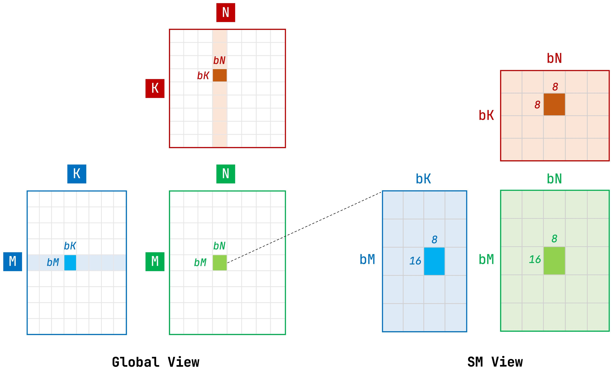

현실적인 차원에서 우리는 연산의 실현 가능성뿐 아니라 어떻게 효율적으로 연산을 완료할지도 고려해야 한다. 올바른 GEMM 연산자를 작성하는 것은 어렵지 않다. 어려운 것은 하드웨어와 명령어 집합의 특성을 활용해 성능이 최적인 GEMM 연산자를 작성하는 일이다.

효율적인 GEMM 연산자를 구현하려면 거시적으로 연산자 최적화의 각종 수단을 논의해야 한다. 이런 최적화 방법론의 안내를 받으면 GEMM이 왜 다단계 블록 Tiling을 해야 하는지 알 수 있게 된다.

## 1. 연산자 최적화 방법론

거시적으로 볼 때 연산자에는 주로 세 가지 최적화 방향이 있다. 첫째는 계산, 둘째는 통신, 셋째는 저장이다.

**계산 측면**에서 우리는 단위 시간에 얼마나 많은 계산을 수행할 수 있는지에 주목하며, 자주 쓰이는 지표는 초당 부동소수점 연산 횟수인 FLOPS이다. Tensor Core를 계산의 핵심으로 삼는 현대 하드웨어 아키텍처에서는 보통 연산자의 **Tensor Core 이용률**을 하드웨어의 연산 성능을 충분히 활용했는지 판단하는 지표로 삼는다.

전력 벽의 영향 때문에 우리는 Tensor Core의 이론상 최대 연산 성능을 끌어낼 수는 없지만, 연산자 안에 mma 명령어를 가득 채워 실제 최대 연산 성능에는 도달할 수 있다. 하드웨어의 연산 상한 앞에서 계산을 최적화하려면 **알고리즘 차원**에서 손을 대야 한다. 예를 들어 더 적은 FLOPs로 같은 계산을 구현하거나, 계산 의존 관계를 합리적으로 배치해 Tensor Core가 만재로 돌아가게 하는 식이다.

주목할 만한 점은 **FLOPS나 Tensor Core 이용률이 낮다고 해서 계산 측면을 최적화해야 한다는 뜻은 아니라는 것**이다. 많은 경우 데이터 통신과 저장 용량의 병목이 Tensor Core로 하여금 더 많은 계산 작업을 받아들이지 못하게 만들어 Tensor Core의 연산 성능을 낭비하게 하므로, 구체적인 문제는 구체적으로 분석해야 한다.

**통신 측면**에서는 단일 카드만 고려할 때 데이터를 한 저장 매체에서 다른 저장 매체로 옮기는 데 걸리는 시간, 즉 latency에 주로 주목한다. 현대 하드웨어 아키텍처에서 Tensor Core의 연산 성능은 매우 크기 때문에 데이터를 계산하는 시간이 데이터를 통신하는 시간보다 짧은 경우가 많다. 따라서 현재 자주 보이는 연산자 대부분은 Tensor Core 앞에서 memory bound이다. 그러므로 **FLOPS가 기대에 못 미칠 때는 보통 통신 측면에 병목이 있는지를 우선 분석해야 한다**. 서로 다른 두 저장 매체 사이의 latency는 하드웨어가 결정하므로, 통신을 최적화하려면 latency가 높은 통신량을 최대한 줄이거나 파이프라인 방식으로 통신 시간을 계산 시간 안에 감춰야 한다.

**저장 측면에서 GPU의 저장 계층 구조는 데이터 통신에 중대한 영향을 미치고, 나아가 계산 효율에도 영향을 준다**. 현재 프로그래밍 가능한 GPU 저장 유닛에는 세 가지가 있다.

1) 칩 외부의 Global Memory. GMEM으로 줄여 쓰며, 우리가 흔히 말하는 디바이스 메모리다. GMEM의 데이터는 여러 연산자가 사용할 수 있고 용량이 가장 크지만 지연이 가장 높다. 즉 GMEM에서 데이터를 읽고 쓰는 것이 가장 느리다는 뜻이다.

2) 칩 내부의 Shared Memory. SMEM으로 줄여 쓰며 공유 메모리라고도 한다. 하나의 thread block 안의 모든 스레드가 같은 SMEM 영역을 공유하고, 용량은 보통 수십에서 수백 KB이며, 지연은 GMEM보다 낮다.

3) 칩 내부의 Register File. RF 또는 RMEM으로 줄여 쓰며, GPU의 레지스터다. 레지스터의 데이터는 계산 유닛이 직접 가져올 수 있고 지연은 SMEM보다 낮지만 용량은 더 제한적이다.

Flash Attention 같은 알고리즘은 GMEM과 SMEM의 메모리 접근 효율 차이를 활용해, SMEM이라는 중간 저장 매체를 통해 대량의 GMEM 읽기 쓰기를 줄임으로써 Attention 연산자를 최적화했다. 많은 알고리즘 담당자들도 FA의 영향으로 하드웨어 메모리 접근이 연산자에 얼마나 중요한지를 점차 인식하게 되었다.

그러나 많은 시나리오에서 SMEM과 레지스터의 저장 용량은 메모리 접근 효율보다도 더 결정적이다. 우리는 이런 저장 자원의 이용률을 Occupancy라고 부른다. SM90(Hopper)과 SM100(Blackwell) 아키텍처에서 하나의 thread block은 최대 227 KB의 SMEM만 신청할 수 있고, 최대 64K개의 레지스터만 사용할 수 있으며, 동시에 컴파일러 제약으로 각 스레드가 쓸 수 있는 레지스터는 최대 255개다.

단일 명령어 MMA 규모가 갈수록 커지는 오늘날, SMEM과 RMEM이 받는 저장 압력도 갈수록 커지고 있다. SMEM이 넘치면 연산자가 정상적으로 실행될 수 없고, RMEM이 넘치면 Local Memory 읽기 쓰기가 발생하는데, 최악의 경우 그 메모리 접근 효율은 GMEM의 메모리 접근 효율과 거의 같다. 대부분의 시나리오에서 레지스터가 수천만 번 접근된다는 점을 고려하면 이는 연산자의 실행 효율에 극심한 영향을 준다. 이에 상응해 Occupancy가 부족한 것은 심각한 결과를 낳지는 않지만, 연산자에 여전히 잠재적인 메모리 접근 효율과 데이터 재사용률 최적화 여지가 있다는 뜻이다.

따라서 저장을 최적화하려면 Occupancy를 최대한 늘리면서도 어떤 부작용도 피하고, 하드웨어가 제공하는 자원을 충분히 활용해 저장으로 효율을 바꿔야 한다.

계산, 통신, 저장은 서로 다른 최적화 수단을 갖지만 삼위일체로 서로 영향을 준다. GEMM의 성능을 최적화하는 과정에서 우리는 이 셋의 중요성을 점차 깨닫게 될 것이다.

이어서 우리는 하나의 핵심 질문에 답해야 한다. **왜 GEMM 연산자는 다단계 블록 Tiling을 해야 하는가?**

## 2. GEMM 3단계 Tiling

임의 규모의 GEMM 작업 D = AB 에 대해, 물론 1단계 Tiling만 해서 하나의 block 안에서 16x8x8의 MMA 명령어를 루프로 실행하여 임의 규모의 GEMM 연산을 완료할 수도 있다.

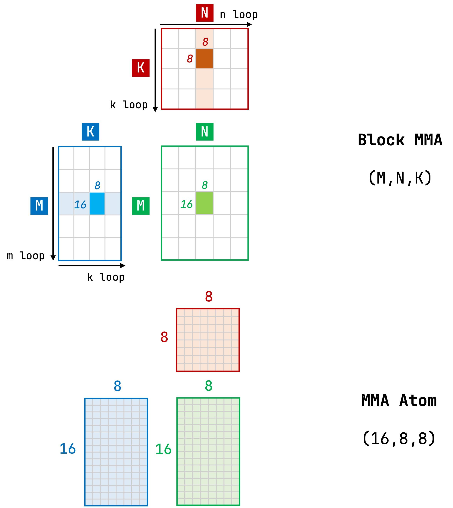


이런 구현에는 문제가 적지 않은데, 그중 가장 명백한 문제는 GPU의 다중 SM 병렬 능력을 활용하지 못한다는 점이다.

계산 작업을 병렬화하기 위해 D 행렬을 16x8 크기로 여러 개의 tile로 잘라 낼 수 있다. tile 사이는 병렬 계산이 가능하므로 하나의 tile 계산 작업을 하나의 block에 맡길 수 있다. block 내부에서는 k 차원을 따라 루프를 돌면서 GMEM에서 16x8 크기의 A 행렬 조각과 8x8 크기의 B 행렬 조각을 복사해 레지스터에 저장하고, 이어서 MMA 명령어를 실행해 tile의 계산을 완료하고, 결과를 GMEM에 다시 써 넣으면 된다.

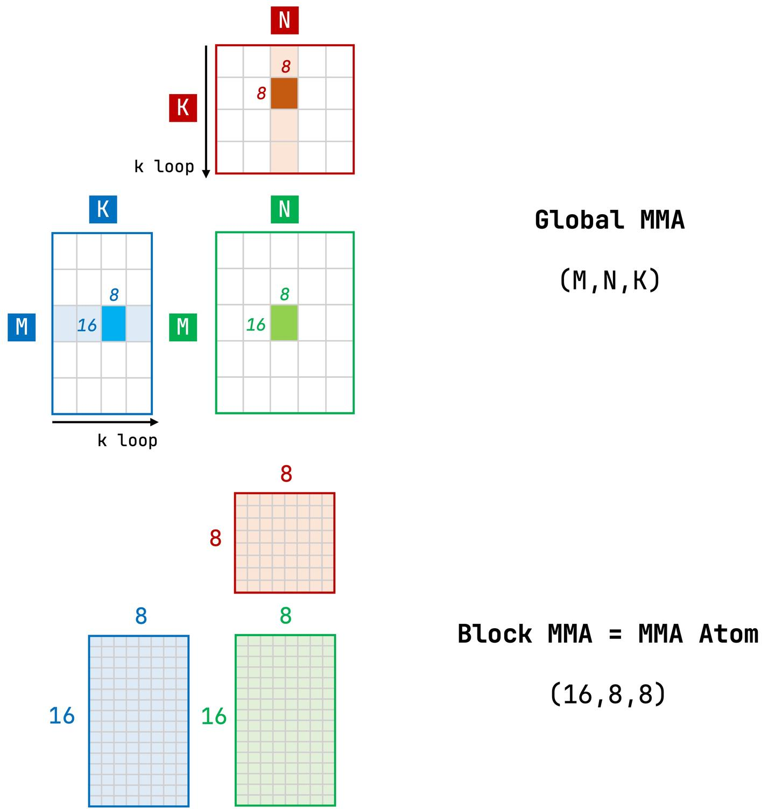

### 2.1 Tile 의 규모 확장하기

SM은 병렬로 돌아가게 되었지만 각 SM의 연산 성능은 충분히 활용되지 않았다. 위의 한 번의 루프는 하나의 warp(32 threads)로 하여금 mma 명령어를 한 번 실행하게 할 뿐이고, 각 스레드가 FP16 16x8x8 mma 명령어 하나를 실행하는 데는 레지스터가 5-7개만 필요하므로 한 warp는 최대 224개의 레지스터만 쓰게 되어 단일 block의 64K 레지스터 개수보다 훨씬 적다. 또한 단일 SM에는 Tensor Core가 4개 있는데, 단일 warp가 mma 명령어를 루프로 실행하면 Tensor Core를 하나만 쓸 수 있어 Tensor Core의 전체 연산 성능을 발휘하지 못한다.

그래서 하나의 block의 성능을 끌어올리는 데 두 가지 착상이 있다.

1. 병렬도를 늘린다. 즉 스레드 수를 확장해 warp 수를 늘린다.
2. 각 warp 안에서 여러 개의 mma 명령어를 루프로 실행한다.

스레드와 mma 명령어 개수를 늘리면 계산 유닛의 최대 연산 성능을 발휘하는 데 도움이 될 뿐 아니라, GMEM에서 한 번에 더 많은 데이터를 복사해 GMEM에서 RMEM으로 가는 대역폭을 충분히 활용할 수도 있다.

그리하여 단일 mma 명령어를 더 큰 tile로 확장할 수 있다. 예를 들어 스레드를 8배(M 차원 2배, N 차원 4배)로 확장하고 각 warp의 mma 명령어를 K 차원으로 2배 확장하면, 하나의 tile 크기가 32x32x16이 되고 총 256개 스레드가 하나의 tile 계산을 실행한다.

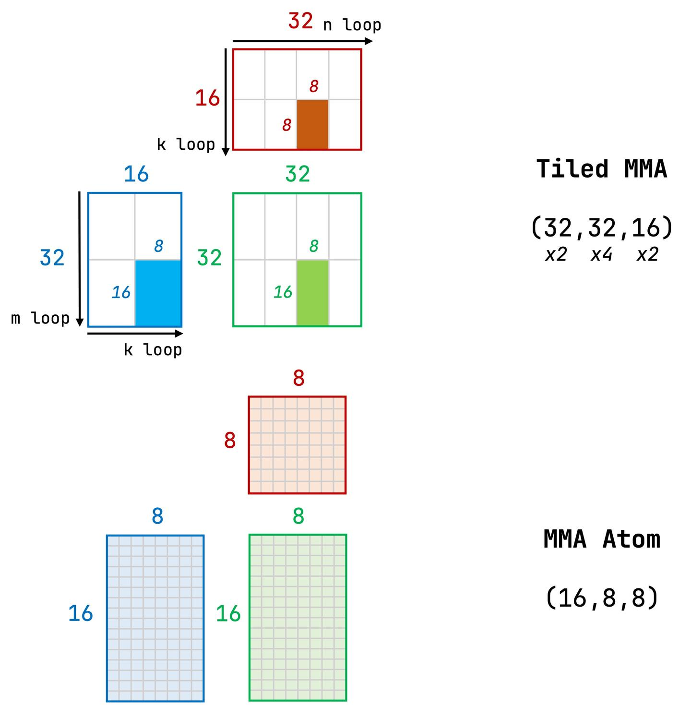

하나의 tile 크기를 무한히 확장할 수 있을까? 이론상으로는 가능하지만 효율을 고려하면 불가능하다. 먼저 단일 block의 스레드 수는 2048개를 넘을 수 없다. 다음으로 스레드 수를 확장하든 mma 명령어를 확장하든 더 많은 레지스터가 필요하므로 RMEM의 저장 한계에 부딪히게 된다. 물론 레지스터 공간을 충분히 활용하고 싶지만, 확장 규모가 지나치게 커지면 register spilling이 발생해 성능 손실과 대량의 GMEM 디바이스 메모리 사용(그리고 매우 긴 컴파일 시간)을 초래한다. 따라서 스레드 수와 tile 규모를 합리적으로 고르는 일은 대단히 중요하다.

### 2.2 Block 의 규모 확장하기

단일 SM의 연산 성능 활용 문제를 해결하고 나면 새로운 병목에 부딪힌다. GMEM의 메모리 접근량이 크고 중복 접근이 많아 **데이터 재사용** 률이 낮다는 문제다.

GEMM 작업에서 같은 행의 tile들은 같은 행의 A 행렬 조각을 공유하고, 같은 열의 tile들은 같은 열의 B 행렬 조각을 공유한다. 하나의 block 안에서 여러 tile의 계산을 루프로 완료하고, 이 tile들이 공유하는 A, B 행렬 조각을 GMEM에서 SMEM으로 복사해 두면, GMEM 데이터를 중복해서 복사하는 양을 줄여 각 tile의 메모리 접근 효율을 높일 수 있다.

따라서 단일 tile을 (M, N, K) 세 차원으로 각각 (4, 4, 2)배 확장해 하나의 block의 계산 규모를 128x128x32로 확장할 수 있다.

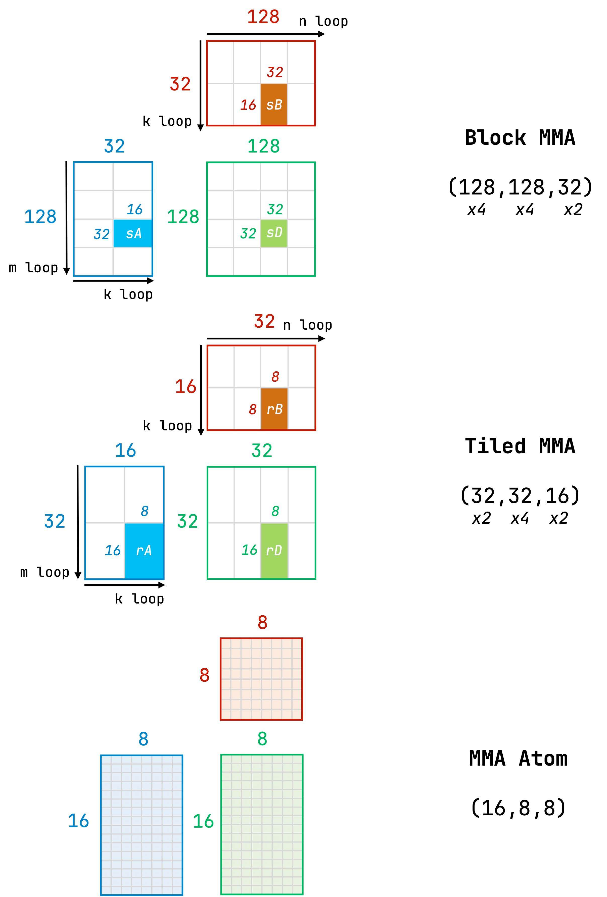

하나의 block 크기를 무한히 확장할 수 있을까? 이론상으로는 가능하지만 **효율을 고려하면 불가능하다**. 단일 block의 SMEM 저장 크기가 제한적이기 때문에, block이 큰 경우 A/B 행렬의 조각을 한 번에 SMEM에 전부 넣을 수 없다. 설령 데이터를 나눠서 복사할 수 있다 해도, 지나치게 큰 block은 전체 block 수를 줄여 SM 차원의 병렬 계산 효율에 영향을 준다. 따라서 block size를 합리적으로 조정하는 것도 연산자 최적화의 중요한 고비다.

### 2.3 Global MMA Tiling

전역적인 관점에서 보면, 최초의 1단계 Tiling 방식대로 D 행렬을 병렬 계산 가능한 block들로 나누어 GEMM 전체의 계산을 완료할 수 있다.

block의 SMEM 제약을 고려하면 보통 계산에 참여하는 A/B 행렬 조각을 한 번 더 블록으로 나누어, 매 라운드마다 A/B 분할 한 쌍만 복사하고 계산 결과를 이전 라운드 결과 위에 누산함으로써, K 차원의 루프를 통해 하나의 block의 완전한 계산을 완료한다.

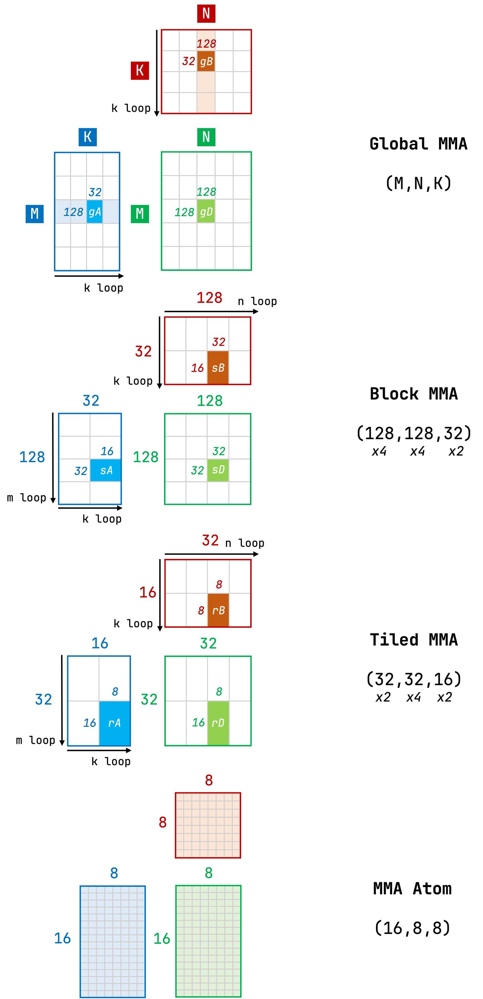

여기까지 해서 GEMM 연산은 Global에서 Block으로, Block에서 Tile로, Tile에서 MMA Atom으로 가는 3단계 Tiling으로 세분되었다. 주목할 만한 점은 **각 단계의 Tiling이 모두 GPU 하드웨어 특성과 긴밀하게 연관되어 있다**는 것이다.

- 여러 SM이 병렬로 계산하게 하려면 Global MMA를 병렬 계산 가능한 여러 개의 Block으로 잘라야 한다.
- SMEM의 낮은 메모리 접근 지연이라는 특성을 활용해 GMEM 접근량을 최대한 줄이려면 Block을 데이터 재사용이 가능한 여러 개의 Tile로 잘라야 한다.
- 멀티 코어 Tensor Core의 연산 성능을 충분히 활용하려면 각 Tile이 충분히 많은 MMA Atom 계산 명령어를 포함해야 한다.

> 하드웨어 특성이 갱신되면 Tiling 방식도 바뀔 가능성이 크다. 예를 들어 Blackwell 아키텍처의 2SM MMA는 Distributed SMEM을 활용해 Cluster 차원의 Tiling을 추가했다.

이 CUTLASS 노트 시리즈의 취지는 "바닥에서 위로"다. 이번 편에서는 CUTLASS에서 MMA Atom을 어떻게 확장하여 단일 명령어 계산을 하나의 Tile 계산으로 확장하는지에 초점을 맞춰 분석한다.


## 3. Tiled MMA 구현

먼저 이번 편에서 구현할 연산자의 상세 내용을 적어 둔다. 여기서 단일 명령어 규모는 여전히 16x8x8이고, 단일 Tile의 규모는 32x32x16으로 확장되며, 동시에 스레드 수도 32에서 256으로 확장된다.

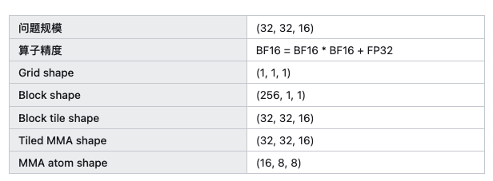

## 3.1 make_tiled_mma API

노트 (1)에서 우리는 `make_tiled_mma`라는 API를 처음 사용했는데, 당시에는 mma op 하나만 인자로 넘겼다. 즉 확장을 하지 않았다.

```c++
using TiledMMA = decltype(make_tiled_mma(MMA_op{}));
```

앞서 말했듯이 단일 명령어를 Tile로 확장하는 데는 두 가지 착상이 있다. 하나는 warp 수를 확장하는 것이고 다른 하나는 각 warp가 계산하는 mma 명령어 수를 확장하는 것이다. 따라서 스레드의 확장과 mma 명령어의 확장을 나타낼 새로운 인자 두 개를 추가해야 한다.

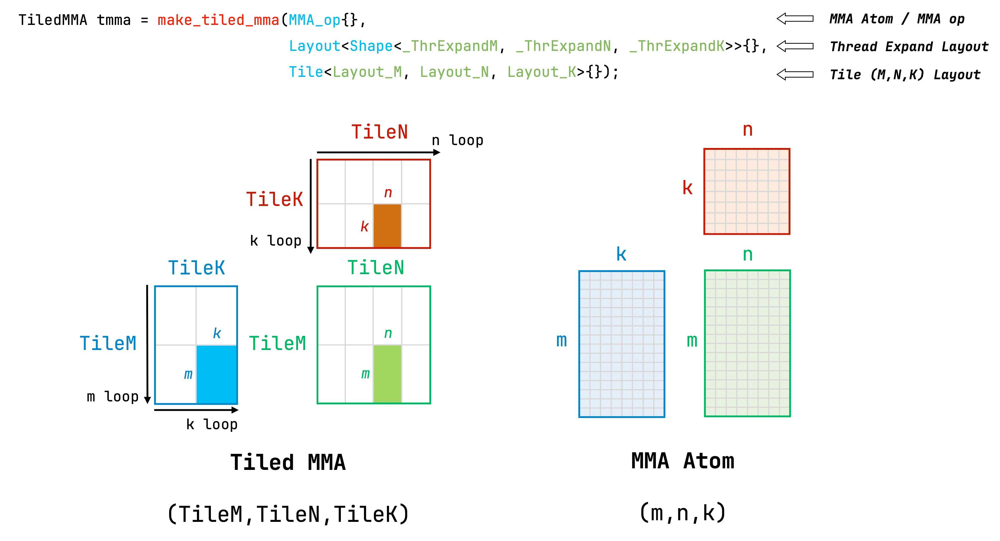

코드는 아래와 같다. `make_tiled_mma`에 새로 추가된 두 인자가 각각 `MMAThrLayout`과 `MMATileLayout`, 즉 스레드의 (M, N, K) 차원 확장 방식과 단일 Tile의 전체 규모임을 알 수 있다. 그중 `kMmaThrExpandM/N/K`는 스레드의 `(M, N, K)` 차원 확장 규모를 제어하고, `kMmaValExpandM/N/K`는 mma 명령어의 `(M, N, K)` 차원 확장 규모를 제어한다.

```c++
using MMA_op = SM80_16x8x8_F32BF16BF16F32_TN;
using MMA_traits = MMA_Traits<MMA_op>;
using MMA_shape = MMA_traits::Shape_MNK;

static constexpr int kMmaThrExpandM = 2;
static constexpr int kMmaThrExpandN = 4;
static constexpr int kMmaThrExpandK = 1;

static constexpr int kMmaValExpandM = 1;
static constexpr int kMmaValExpandN = 1;
static constexpr int kMmaValExpandK = 2;

static constexpr int kMmaTileM = kMmaThrExpandM * kMmaValExpandM * get<0>(MMA_shape{});
static constexpr int kMmaTileN = kMmaThrExpandN * kMmaValExpandN * get<1>(MMA_shape{});
static constexpr int kMmaTileK = kMmaThrExpandK * kMmaValExpandK * get<2>(MMA_shape{});

using MMAThrLayout = decltype(make_layout(make_shape(Int<kMmaThrExpandM>{},
                                                     Int<kMmaThrExpandN>{},
                                                     Int<kMmaThrExpandK>{})));
using MMATileLayout = Tile<Int<kMmaTileM>, Int<kMmaTileN>, Int<kMmaTileK>>;
using TiledMMA = decltype(make_tiled_mma(MMA_op{}, MMAThrLayout{}, MMATileLayout{}));
```

이제 확장을 거친 TiledMMA를 출력해 볼 수 있다. 단일 명령어 MMA Atom과 비교했을 때 우리가 구현한 Tiled MMA가 (M,N,K) 세 차원에서 각각 (2,4,2)배 확장되었음을 명확히 볼 수 있다. 그중 **M, N 차원의 확장은 스레드 확장**이므로 스레드 번호가 T0-T31에서 T0-T255로 확장되고(그림에서 일부 행렬 원소는 T를 하나만 표시했지만 실제로는 여러 스레드가 읽을 수도 있다), K 차원은 mma 명령어 확장이라 스레드 입장에서는 사실 레지스터 확장이다. 따라서 K 차원의 T는 변하지 않고 V의 범위가 2배로 늘어났다.

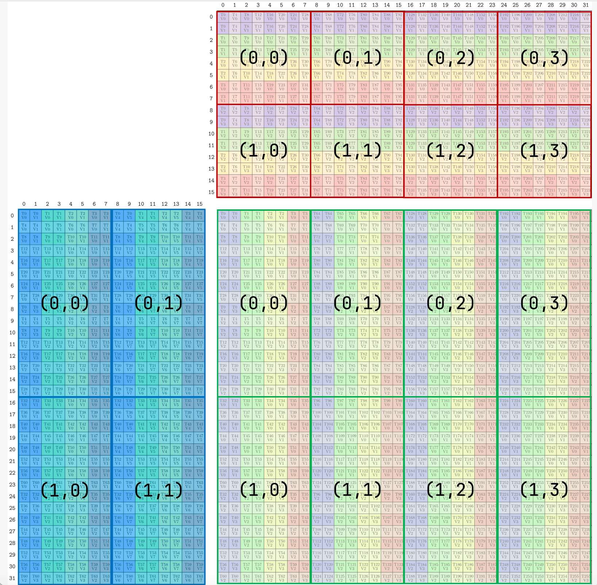

`make_tiled_mma`에 새로 추가된 두 인자는 각각 `MMAThrLayout`과 `MMATileLayout`이다. 이어서 그 세부 사항을 자세히 분석한다.


`MMAThrLayout`에 대응하는 것은 하나의 **Layout**이며, mma가 (M, N, K) 세 차원에서 스레드 / warp를 확장하는 방식을 나타낸다. Layout의 본질이 매핑임을 알고 있으니, 여기서의 `MMAThrLayout`은 (M, N, K) 3차원 좌표에서 warp_idx로 가는 매핑을 나타낸다. (M, N, K) 좌표는 위 그림의 MMA Atom 하나에 대응하고, warp_idx는 그 MMA Atom을 해당 index의 warp가 계산하도록 맡긴다는 뜻이다. 우리 예제에서 MMAThrLayout = (2,4,1):(1,2,8) 이므로, (M, N, K) = (1, 2, 0) 일 때 위 그림에서 번호가 (M, K) = (1, 0) 인 파란 블록, 번호가 (K, N) = (0, 2) 인 빨간 블록, 번호가 (M, N) = (1, 2) 인 초록 블록을 찾게 된다. 이것이 좌표에 대응하는 MMA Atom이며, Layout 매핑을 통해 이 Atom이 warp = 5, 즉 T160-T191에서 계산된다는 것을 알 수 있고, 이는 위 그림의 표현과 일치한다.

> warp_idx = m×1 + n×2 + k×8

> 여기서 독자가 생각해 볼 작은 문제가 하나 있다. 왜 우리는 보통 MMAThrLayout의 K 차원을 1로 두는가? 즉 왜 K 차원에서는 스레드를 확장하지 않는가?

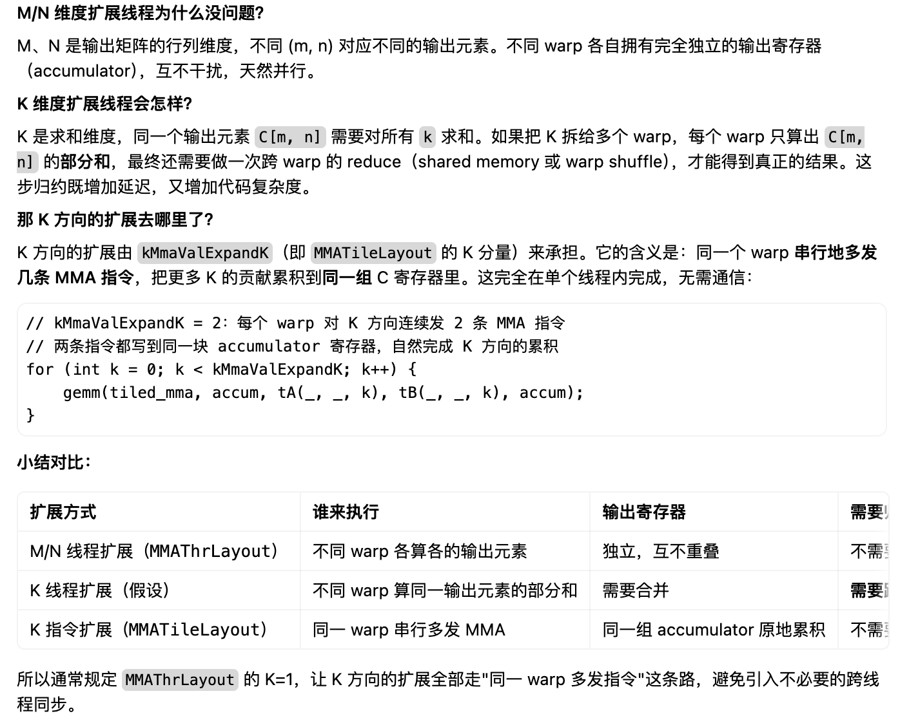

`MMATileLayout`은 길이가 3인 tuple로 각각 M, N, K 세 차원의 배열을 나타내며, 각 차원의 배열은 하나의 Layout으로 표현된다. 어떤 차원의 Layout을 조정하면 그 차원에서 각 MMA Atom의 배열 순서(Permutation)를 바꿀 수 있다.

MMA Atom의 배열을 바꾸는 Layout은 실은 CUTLASS 4대 중요 Layout 중 마지막 종류인 **Permutation Layout**이다. 이는 옛 위치 좌표(old_index)에서 새 위치 좌표(new_index)로 가는 매핑을 나타낸다. Permutation Layout에 따라 우리는 새로운 배열에서 원래의 MMA Atom이 어느 위치에 있어야 하는지 알 수 있다.

여기서 공식 예제를 하나 들면, Permutation Layout = (4,4,2):(1,8,4) 일 때 옛 배열과 새 배열은 다음과 같이 나타낼 수 있다.

```shell
old m-coord:  0  1  2  3  4  5  6  7  8  9 10 11 12 13 14 15 16 17 18 19 20 21 22 23 24 25 26 27 28 29 30 31
new m-coord:  0  1  2  3  8  9 10 11 16 17 18 19 24 25 26 27  4  5  6  7 12 13 14 15 20 21 22 23 28 29 30 31
```

독자는 세 Layout을 자유롭게 수정하고 수정 전후의 TiledMMA 그림을 비교하며 Permutation Layout의 작용을 이해해 보기 바란다.

TiledMMA를 수정한 뒤에도 원래 쓰던 copy와 gemm API는 바꿀 필요가 없다. 이 두 API가 TiledMMA의 확장 상황에 따라 MMA Atom의 루프 계산을 자동으로 처리해 주기 때문이다.

## 3.2 Tensor Metadata 상세 해설

노트 (1)에서 우리는 partition을 거친 Tensor에 MMA_M/N/K 같은 차원이 더 있다고 언급했다. 이 차원들은 사실 mma 명령어의 확장 차원이다.

```c++
Tensor tCgA = thr_mma.partition_A(gA);  // (MMA, MMA_M, MMA_K)
Tensor tCgB = thr_mma.partition_B(gB);  // (MMA, MMA_N, MMA_K)
Tensor tCgC = thr_mma.partition_C(gC);  // (MMA, MMA_M, MMA_N)

Tensor tCrA = thr_mma.partition_fragment_A(gA);  // (MMA, MMA_M, MMA_K)
Tensor tCrB = thr_mma.partition_fragment_B(gB);  // (MMA, MMA_N, MMA_K)
Tensor tCrC = thr_mma.partition_fragment_C(gC);  // (MMA, MMA_M, MMA_N)
```

이 기회에 출력된 Tensor 정보를 어떻게 읽는지 소개하겠다.

이 여섯 개 Tensor의 정보를 출력하면 다음과 같다.

```c++
gmem_ptr[16b](0x7f61c3e00000) o ((_2,_2),_1,_2):((_1,128),_0,_8)
gmem_ptr[16b](0x7f61c3e00400) o (_2,_1,_2):(_1,_0,_8)
gmem_ptr[32b](0x7f61c3e01800) o ((_2,_2),_1,_1):((_1,256),_0,_0)
ptr[16b](0x7f61d9fffca0) o ((_2,_2),_1,_2):((_1,_2),_0,_4)
ptr[16b](0x7f61d9fffcb0) o (_2,_1,_2):(_1,_0,_2)
ptr[32b](0x7f61d9fffcc0) o ((_2,_2),_1,_1):((_1,_2),_0,_0)
```

- gmem_ptr는 데이터의 저장 매체를 나타내며, 비슷하게 smem_ptr, rmem_ptr, tmem_ptr 등이 있다. 접두어가 없는 ptr는 일반 포인터로 저장 매체 정보를 포함하지 않는다.
- 16b, 32b는 Tensor 단일 데이터의 길이다.
- 0x7f61c3e00000은 Tensor 데이터의 기준 주소다.
- 구분자 o는 이것이 Tensor임을 뜻하며, 구분자 앞뒤는 각각 Tensor data와 Tensor Layout을 나타낸다.
- 뒤의 Layout이 바로 이 Tensor의 Tensor Layout이다.

여기서 MMA_M/N/K가 각각 (1, 1, 2)임을 알 수 있는데, 이는 우리가 채워 넣은 kMmaValExpandM/N/K의 값이며 위에서 한 설명을 뒷받침한다.

---

> 이하의 보충 설명은 Claude 4.6이 생성한 것으로, 이해를 돕기 위한 것이다.

## 보충: MMAThrLayout stride (1,2,8) 의 유래

`MMAThrLayout = (2,4,1):(1,2,8)` 안의 보폭 `(1,2,8)`은 **수동으로 지정할 필요가 없으며**, `make_layout(make_shape(2,4,1))`이 **열 우선(column-major) 조밀 보폭**에 따라 자동으로 유도해 낸 결과다.

| 차원 | Shape | Stride 유도 | Stride 값 |
|------|-------|------------|-----------|
| M    | 2     | 최내층, 1로 고정 | **1** |
| N    | 4     | shape[M] = 2 | **2** |
| K    | 1     | shape[M] × shape[N] = 2×4 | **8** |

따라서 `warp_idx`의 계산 공식은 다음과 같다.

```
warp_idx = m×1 + n×2 + k×8
```

`(M, N, K) = (1, 2, 0)` 을 예로 들면 `warp_idx = 1×1 + 2×2 + 0×8 = 5` 이며, T160\~T191에 대응하여 그림과 부합한다.

K 차원의 shape=1, stride=8은 조밀 배치의 부산물일 뿐이다. K 방향에는 Atom 슬롯이 하나뿐이라 k 항은 항상 0이므로 stride가 어떤 값이든 결과에 영향을 주지 않는다.

---

## 보충: 왜 MMAThrLayout 의 K 차원은 보통 1인가

**K는 리덕션 차원이며, K를 따라 스레드를 확장하면 스레드 간 리덕션 오버헤드가 추가로 발생한다. 반면 M/N을 따라 스레드를 확장하면 완전히 독립적이라 통신이 필요 없다.**

- **M/N 차원**: 서로 다른 출력 원소는 서로 독립적이고, 서로 다른 warp가 각자 독립적인 accumulator 레지스터를 보유하므로 자연스럽게 병렬이며 동기화가 필요 없다.
- **K 차원**: 동일한 출력 원소 `C[m,n]`은 모든 k에 대해 합을 구해야 한다. K를 여러 warp에 쪼개 주면 각 warp는 부분합만 계산하게 되고, 최종적으로 warp 간 reduce(shared memory 또는 warp shuffle)가 더 필요해져 지연과 코드 복잡도가 늘어난다.

K 방향의 확장은 `kMmaValExpandK`가 담당한다. 동일한 스레드가 **MMA 명령어를 여러 개 직렬로 발행**하여 더 많은 K의 기여를 같은 accumulator 레지스터 묶음에 누산하며, 스레드 간 통신이 전혀 필요 없다.

```cpp
// kMmaValExpandK = 2：각 스레드가 K 방향으로 MMA 명령어를 연속 2개 발행한다
// 두 명령어 모두 같은 accumulator 레지스터에 쓰므로 K 방향의 누산이 자연스럽게 완료된다
for (int k = 0; k < kMmaValExpandK; k++) {
    gemm(tiled_mma, accum, tA(_, _, k), tB(_, _, k), accum);
}
```

| 확장 방식 | 실행 주체 | 출력 레지스터 | 리덕션 필요? |
|----------|--------|------------|-----------|
| M/N 스레드 확장(`MMAThrLayout`) | 서로 다른 warp가 각자의 출력 원소를 계산 | 독립적이며 서로 겹치지 않음 | 필요 없음 |
| K 스레드 확장(가정) | 서로 다른 warp가 동일 출력 원소의 부분합을 계산 | 병합이 필요함 | **warp 간 리덕션 필요** |
| K 명령어 확장(`MMATileLayout`) | 동일 스레드가 MMA를 직렬로 여러 개 발행 | 같은 accumulator 묶음에 제자리 누산 | 필요 없음 |

---

## 보충: Tensor 출력 형식과 MMA_M/N/K=(1,1,2) 의 대응 관계

### 출력 형식 해설

각 출력 항목의 형식은 다음으로 통일되어 있다.

```
<저장 매체>[<원소 비트 폭>](<기준 주소>) o <Shape>:<Stride>
```

| 필드 | 의미 |
|------|------|
| `gmem_ptr` / `ptr` | 저장 매체. `gmem_ptr`는 global memory이고, 접두어가 없는 `ptr`는 일반 포인터(여기서는 레지스터)다 |
| `16b` / `32b` | 단일 원소 비트 폭. BF16=16b, F32=32b |
| 주소 | Tensor 데이터의 시작 주소 |
| `o` | 구분자. 왼쪽은 데이터, 오른쪽은 Layout이다 |
| `Shape:Stride` | CuTe Layout. 괄호 중첩으로 계층을 나타낸다 |

### 항목별 대응

설정 파라미터 복습: `MMA_op = SM80_16x8x8`(단일 atom: M=16, N=8, K=8), 확장 계수는 다음과 같다.

```
kMmaThrExpandM/N/K = (2, 4, 1)   ← 스레드 확장（warp 수량）
kMmaValExpandM/N/K = (1, 1, 2)   ← 명령어 확장（스레드당 MMA 발행 개수）
```

partition 후의 shape 의미는 `(MMA, MMA_M, MMA_N/K)` 이며, 그중

- **MMA**: 단일 MMA 명령어에서 그 스레드가 보유하는 원소 수
- **MMA_M/N/K**: 그 스레드가 각 방향에서 실행해야 할 MMA 명령어 개수이며, `kMmaValExpand*`와 같다

| 변수 | 원본 출력 | Shape 의미 | Stride 의미 |
|------|----------|-----------|------------|
| `tCgA` | `((_2,_2),_1,_2):((_1,128),_0,_8)` | MMA=(2,2)=A 원소 4개; MMA_M=**1**; MMA_K=**2** | MMA 내부 보폭 (1,128): 앞의 2개는 연속이고 뒤의 2개는 128행 간격(global memory 행 간격); MMA_K 보폭 8: K 방향으로 atom을 하나 건널 때마다 8개 원소를 건너뛴다 |
| `tCgB` | `(_2,_1,_2):(_1,_0,_8)` | MMA=B 원소 2개; MMA_N=**1**; MMA_K=**2** | B 원소는 연속; MMA_K 보폭 8은 위와 같다 |
| `tCgC` | `((_2,_2),_1,_1):((_1,256),_0,_0)` | MMA=(2,2)=C 원소 4개; MMA_M=**1**; MMA_N=**1** | MMA 내부 보폭 (1,256); MMA_M/N이 모두 1이므로 보폭은 0 |
| `tCrA` | `((_2,_2),_1,_2):((_1,_2),_0,_4)` | tCgA와 shape 동일 | 레지스터 조밀 배치: global memory 보폭 128이 2로 줄고, MMA_K 보폭이 8에서 4로 줄었다 |
| `tCrB` | `(_2,_1,_2):(_1,_0,_2)` | tCgB와 shape 동일 | 레지스터 조밀 배치, MMA_K 보폭 2 |
| `tCrC` | `((_2,_2),_1,_1):((_1,_2),_0,_0)` | tCgC와 shape 동일 | 레지스터 조밀 배치, 보폭 2 |

### MMA_M/N/K = (1, 1, 2) 의 유래

**MMA_M/N/K가 기술하는 것은 "각 스레드가 몇 개의 MMA 명령어를 루프로 실행해야 하는가"이며**, 이는 `kMmaThrExpand*`가 아니라 정확히 `kMmaValExpand*`와 같다.

`kMmaThrExpand*`는 warp 수를 늘려 더 많은 출력 원소를 커버하며, 서로 다른 warp가 각자 계산하므로 단일 warp가 실행하는 명령어 개수는 늘어나지 않는다. 반면 `kMmaValExpand*`는 동일한 스레드가 MMA 명령어를 몇 개 더 실행해 더 많은 데이터를 커버하게 하며, 이는 분할 후 Tensor의 MMA_* 차원에 나타난다.

```
kMmaValExpandM = 1  →  tCgA/tCgC 의 MMA_M = _1
kMmaValExpandN = 1  →  tCgB/tCgC 의 MMA_N = _1
kMmaValExpandK = 2  →  tCgA/tCgB 의 MMA_K = _2   ← K 방향으로 각 스레드가 MMA 명령어 2개를 실행해야 한다
```

세 Tensor가 서로 교차 검증해 준다. `MMA_M=1, MMA_N=1, MMA_K=2`는 마침 `kMmaValExpandM/N/K = (1,1,2)`와 같다.

C 행렬(`tCgC`)에는 MMA_K 차원이 없는데, K가 리덕션 차원이기 때문이다. K 방향의 두 MMA 명령어는 모두 같은 accumulator 레지스터 묶음에 쓰므로 추가 출력 차원이 생기지 않는다.

global memory(`gmem_ptr`) 버전과 레지스터(`ptr`) 버전은 shape는 같지만 stride가 다르다. global memory의 stride는 행렬의 행렬 간격(128, 256 같은 값)을 반영하고, 레지스터의 stride는 조밀한 작은 정수(2, 4 같은 값)인데, 이는 레지스터에서 데이터가 다시 조밀하게 재배치되었음을 뜻한다.

### 3.3 SASS 분석

K 차원에서 mma 명령어를 확장하자 단일 스레드의 mma 명령어는 2개가 되었고, 이에 상응하여 LDG 명령어도 3개에서 6개로 늘었다. 우리가 **K 차원에서 mma를 확장했으므로 두 번의 A * B 는 같은 D를 계산하며, 따라서 두 번째 mma의 accumulator는 첫 번째 mma의 계산 결과를 사용해야 한다**. RMEM에서 GMEM으로 복사하는 것은 여전히 STG 2번이면 된다.

```c++
// ---- 단계 1：LDG 6개를 미리 전부 발행하여 메모리 접근 지연을 감춘다 ----
// SM80_16x8x8 은 각 스레드가 A 의 레지스터 2개(BF16 4개), B 의 레지스터 1개(BF16 2개)를 보유한다
// kMmaValExpandK=2 → A/B 데이터가 2세트 필요하므로 총 LDG 6개（원래 kMmaValExpandK=1 일 때는 3개뿐이었다）

LDG.E R4,  desc[UR4][R14.64]        // A fragment[K=0]，첫 번째 레지스터（BF16 × 2）
LDG.E R5,  desc[UR4][R16.64]        // B fragment[K=0]，첫 번째 레지스터（BF16 × 2）
LDG.E R6,  desc[UR4][R18.64]        // A fragment[K=1]，첫 번째 레지스터（BF16 × 2）

LDG.E R11, desc[UR4][R18.64+0x10]   // A fragment[K=1]，두 번째 레지스터（+16 바이트 = K 방향 다음 구간）
LDG.E R2,  desc[UR4][R14.64+0x10]   // A fragment[K=0]，두 번째 레지스터
LDG.E R3,  desc[UR4][R16.64+0x10]   // B fragment[K=1]，두 번째 레지스터

// ---- 단계 2：HMMA 명령어 2개, kMmaValExpandK=2 의 두 번의 MMA atom 에 대응 ----
// HMMA.1688.F32.BF16：SM80_16x8x8, accumulator 는 F32, 입력은 BF16
// 형식：HMMA dest(D), srcA(A), srcB(B), srcC(C)   →   D = A × B + C

HMMA.1688.F32.BF16 R4, R4, R6, RZ   // 첫 번째：D[R4] = A[K=0][R4] × B[K=0][R6] + 0（RZ=제로 레지스터, 첫 회에는 누산하지 않는다）
HMMA.1688.F32.BF16 R4, R2, R11, R4  // 두 번째：D[R4] = A[K=1][R2] × B[K=1][R11] + D[R4]（첫 번째 결과를 이어받아 K 리덕션을 완료한다）

// ---- 단계 3：F32 accumulator 를 BF16 으로 변환하여 GMEM 에 써 넣는다 ----
// F2FP.BF16.F32.PACK_AB：F32 두 개를 변환하여 BF16×2 레지스터 하나로 패킹한다
F2FP.BF16.F32.PACK_AB R5, R5, R4    // accumulator (R4) 의 F32 결과를 BF16 으로 변환하고 R5 와 패킹한다
F2FP.BF16.F32.PACK_AB R7, R7, R6    // 위와 같으며, 다른 부분을 처리한다

// K 방향으로 2배 확장했지만 D 는 여전히 같은 tile 이므로 STG 개수는 변하지 않는다（여전히 2개）
STG.E desc[UR4][R12.64], R5         // 패킹된 BF16 결과를 GMEM 에 써 넣는다
STG.E desc[UR4][R2.64],  R7
```

주목할 만한 점은 이때 모든 메모리 접근 명령어 앞에 느낌표가 하나씩 붙어 있어, 이 메모리 접근 명령어가 GMEM 데이터를 필요 이상으로 읽었다는 것을 알려 준다는 것이다. 알고 보니 MMA가 Tile 수준으로 확장되면서 메모리 접근의 동작이 달라진 것이다. 다음 편 노트에서 메모리 접근 문제를 깊이 분석하고 해결 방안을 제시하겠다.

> 이하의 SASS 단계별 해부는 Claude 4.6이 생성한 것으로, 이해를 돕기 위한 것이다.

**첫 번째 단계: 각 스레드가 어떤 데이터를 보유하는지 파악하기**

`SM80_16x8x8`은 32개 스레드에 데이터를 고르게 분배한다.

| 행렬 | Tile 크기 | 스레드당 원소 수 | 스레드당 레지스터 수 |
|------|-----------|-------------|--------------|
| A (BF16) | 16×8 | BF16 4개 | 레지스터 2개（레지스터마다 BF16 2개가 packed）|
| B (BF16) | 8×8 | BF16 2개 | 레지스터 1개 |
| D (F32) | 16×8 | F32 4개 | 레지스터 4개 |

`kMmaValExpandK=2` → **A/B 2세트**의 레지스터가 필요하며 총 6개다 → LDG 6개에 대응한다.

**두 번째 단계: LDG 6개의 레지스터 할당**

```
K=0 의 MMA atom：A[K=0] → R4（reg1），R5（reg2）；B[K=0] → R6
K=1 의 MMA atom：A[K=1] → R2（reg1），R3（reg2）；B[K=1] → R11
```

주소 규칙: `R14.64`와 `R16.64`는 A 행렬의 두 행 묶음의 기준 주소(스레드가 보유하는 서로 다른 행에 대응)이고, `R18.64`는 B 행렬의 기준 주소다. `+0x10`(= +16 바이트 = +BF16 8개)은 K 방향으로 첫 번째 atom(K=0~7)을 건너뛰고 두 번째 atom(K=8~15)의 데이터를 가져오는 것이다. LDG 6개를 맨 앞에 몰아서 발행하는 것은 **global memory 접근 지연을 감추기** 위해서다. GPU는 load 완료를 기다리는 동안 다른 warp를 스케줄링할 수 있고, 데이터가 도착한 뒤에 HMMA를 실행한다.

**세 번째 단계: HMMA 명령어 2개**

HMMA의 형식은 `HMMA dest, A, B, C`이고 의미는 `D = A × B + C`이다. 여기서 A는 연속된 레지스터 2개를, B는 레지스터 1개를, D/C는 연속된 레지스터 4개를 차지한다.

```
HMMA.1688.F32.BF16 R4, R4, R6, RZ
  → D(R4~R7) = A[K=0](R4,R5) × B[K=0](R6) + 0
  → RZ 는 제로 레지스터이며, 첫 번째 명령어는 0에서부터 누산을 시작한다

HMMA.1688.F32.BF16 R4, R2, R11, R4
  → D(R4~R7) = A[K=1](R2,R3) × B[K=1](R11) + D（이전 명령어의 출력）
  → 두 번째 명령어의 C 는 첫 번째의 출력을 쓰며, K 방향의 리덕션을 완료한다
```

두 HMMA가 쓰는 것은 **같은** D 레지스터 묶음(R4~R7)이고, 두 번째가 첫 번째를 기반으로 계속 누산한다. 이것이 "K 차원 확장은 추가 출력 차원을 만들지 않는다"의 하드웨어 구현이다.

**네 번째 단계: F2FP + STG 로 써 넣기**

D 레지스터는 F32지만 출력 C 행렬은 BF16이므로 먼저 변환한 뒤 저장해야 한다. K 방향으로 2배 확장했지만 출력 tile(M=16, N=8)의 크기는 변하지 않으므로 STG는 여전히 **2개**뿐이다.

전체 파이프라인 타이밍은 다음과 같다.

```
[LDG×6]──────────────→[HMMA K=0]→[HMMA K=1]→[F2FP×2]→[STG×2]
 ↑미리 발행해 메모리 지연을 감춘다   ↑데이터가 준비된 뒤 직렬로 누산      ↑변환 후 써 넣기
```


## 4. 정리

이번 편에서는 GEMM의 3단계 Tiling을 중점적으로 소개하고, 단일 명령어 MMA Atom을 여러 mma 명령어로 구성된 Tiled MMA로 확장하여 32x32x16의 MMA 연산을 구현했다.

이어질 몇 편의 노트에서는 3단계 Tiling을 주된 흐름으로 삼아 GEMM의 규모를 계속 확장하고, 각 계층 Tiling의 구현 세부 사항과 최적화 수단을 상세히 분석하겠다.

다음 단계로 우리는 CUTLASS의 또 다른 API 부류인 Tiled Copy를 깊이 파고들어, Tile 차원에서 효율적인 데이터 이동 작업을 어떻게 완료하는지 살펴본다. 많은 기대 바란다!

# CUTLASS 노트 (4): Tiled Copy

이번 편에서는 주로 CuTe TiledCopy의 핵심 원리를 설명하고, TiledCopy API의 각종 파라미터와 그 의미를 소개하며, Tile 차원에서 데이터 복사를 어떻게 구현하는지 분석한다. 또한 GPU global memory 메모리 접근 특성의 기초 지식도 소개한다.

이번 편에서 사용하는 CUTLASS 버전은 4.1.0이고, 하드웨어 아키텍처는 SM90이다.

**이 노트 시리즈의 관련 코드는 모두 오픈 소스로 공개되어 있다. 코드 저장소는 [cutlass-notes](https://github.com/ArthurinRUC/cutlass-notes) 이며, 많은 star 부탁드린다～**

CUTLASS 노트 시리즈의 길잡이와 글 목록은 다음에서 자세히 볼 수 있다: [CUTLASS 노트: 길잡이](https://zhuanlan.zhihu.com/p/1937220431728845963)

---

앞 편 노트에서는 단일 Tile 차원에서 여러 warp, 여러 명령어의 행렬 연산을 어떻게 수행하는지 소개하고, CUTLASS CuTe의 중요한 API 중 하나인 TiledMMA를 상세히 분석했다.

앞 편 글은 다음에서 볼 수 있다: [CUTLASS 노트 (3): Tiled MMA](https://zhuanlan.zhihu.com/p/1950555644814946318)

> TiledMMA 자체는 일련의 복잡한 Tensor 분할 로직(예를 들어 partition_A/B/C, partition_fragment_A/B/C)을 포함한다. 이런 분할이 어떻게 구현되는지 이해하려면 독자가 CuTe Layout의 연산에 대해 어느 정도 인식을 갖추어야 한다. 분할 구현 원리를 이해하는지 여부는 일반적으로 MMA 계산 로직을 작성하는 데 영향을 주지 않으므로 아직 상세히 소개하지 않았다. 이후 노트에서 CuTe Layout을 소개한 뒤에 TiledMMA의 세부 사항을 더 보충하겠다.

하드웨어가 실제 연산을 수행하기 전에 반드시 올바른 데이터를 하드웨어의 특정 저장 유닛에 놓아야 한다. 이번 편 노트에서는 CUTLASS CuTe의 또 다른 중요한 API인 TiledCopy를 분석한다. TiledCopy는 단일 Tile의 데이터가 서로 다른 저장 주소 사이에서 복사되는 로직을 기술하고, TiledMMA와 비슷한 행렬 분할 로직을 제공하여 복사 작업을 각 스레드에 배분한다.

또한 `copy`라는 API에 TiledCopy 객체를 넘겨, TiledCopy가 기술한 복사 로직으로 실제 복사 작업을 완료할 수도 있다.

```cpp
// Before
copy(copy_atom, tCgA, tCrA);

// After
copy(tiled_copy, tCgA, tCrA);
```

최적의 데이터 복사 전략은 하드웨어 특성과 관련이 있으므로, 먼저 NV GPU의 메모리 접근 측면의 **하드웨어 특성**을 이해하고 vectorized 메모리 접근과 병합 메모리 접근을 구현해야 한다. vectorized 메모리 접근과 병합 메모리 접근이 올바르게 실행되도록 보장하려면 **TiledCopy의 핵심 원리**를 깊이 이해하고 각 스레드의 복사 로직을 명확히 알아야 효율적인 복사 전략을 작성할 수 있다.

먼저 GPU에서 GMEM의 메모리 접근 특성을 소개하고, 다른 저장 유닛의 특성은 이후 노트에서 차례로 소개하겠다.

## 1. NV GPU 의 global memory 메모리 접근 특성

NV GPU에서 최적의 메모리 접근 효율을 달성하려면 보통 두 가지 최적화 수단이 있다. **vectorized 메모리 접근**과 **병합 메모리 접근**이다.

### 1.1 vectorized 메모리 접근

vectorized 메모리 접근의 목적은 더 긴 길이의 메모리 접근 명령어를 사용해 빈번한 메모리 접근 명령어 스케줄링을 줄이고, 명령어 수준 병렬도를 높이며, 현대 메모리 시스템의 대역폭 잠재력을 충분히 발휘하는 것이다.

첫 번째 편인 Minimal GEMM 노트에서 GMEM을 읽는 명령어를 소개했다. Minimal GEMM 시나리오에서 A 행렬을 읽는 것은 32bit 길이의 명령어 두 개, 즉 `ld.global.u32` 또는 `LDG.E`로 완료했다. 실제로 단일 PTX/SASS 명령어는 64bit, 128bit 길이의 메모리 접근 명령어도 지원할 수 있으며, 현재 단일 명령어의 최대 메모리 접근량은 128bit이다.

|      | PTX              | SASS      |
|------|------------------|-----------|
| 32bit  | `ld.global.u32`    | `LDG.E`     |
| 64bit  | `ld.global.v2.u32` | `LDG.E.64`  |
| 128bit | `ld.global.v4.u32` | `LDG.E.128` |

64bit 하나가 아니라 32bit 둘로 메모리 접근 명령어를 쓴 것은, Minimal GEMM 시나리오에서 두 32bit 데이터 블록이 연속적이지 않기 때문이다. 이 두 데이터 블록을 연속적으로 저장할 수단이 있다면 컴파일러는 더 긴 64bit 복사 명령어를 골랐을 것이다.

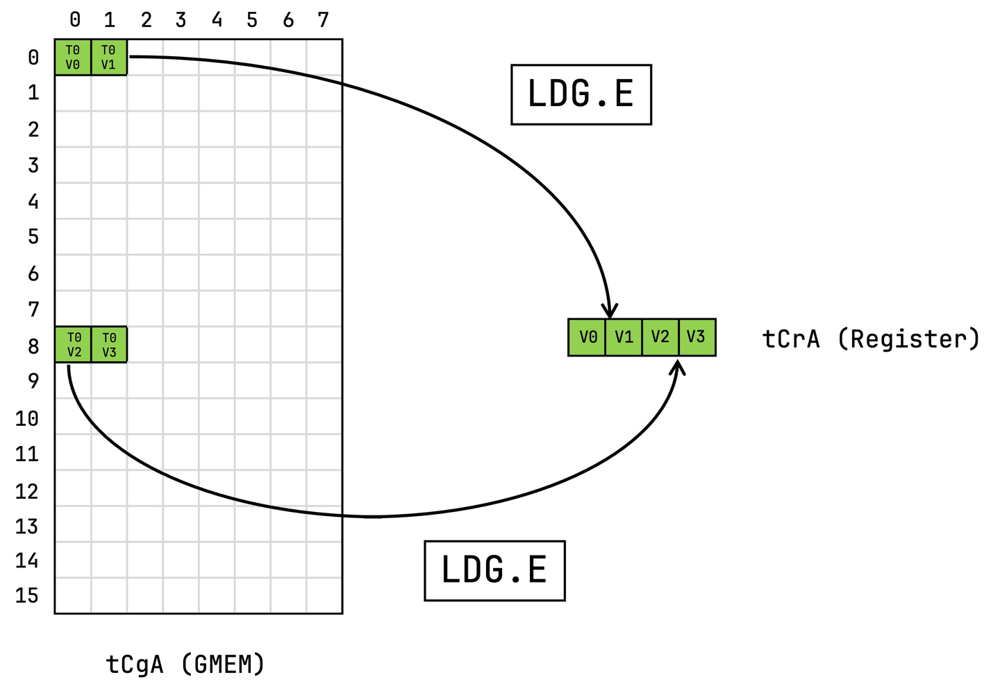

따라서 메모리 접근 로직을 작성할 때는 단일 스레드의 접근 데이터를 최대한 연속적으로 만들어 더 긴 길이의 메모리 접근 명령어를 사용하도록 해야 한다.

### 1.2 병합 메모리 접근

병합 메모리 접근은 하드웨어가 스레드의 메모리 접근 패턴을 어떻게 조직하는가에 관한 것이며, 각 스레드의 메모리 접근 명령어를 일련의 transaction으로 병합하는 것이 목적이다. 하나의 warp가 메모리 접근 명령어를 동시에 실행할 때, warp 전체가 접근하는 데이터도 최대한 **연속적이고 정렬되어** 있어야 한다. 그렇지 않으면 실제 GMEM 접근량이 늘어날 수 있다.

잘 알려져 있듯이 NV GPU는 SIMT 아키텍처를 채택하며, 한 warp의 32개 스레드가 메모리를 읽거나 쓰는 명령어를 동시에 실행하고, 하드웨어 차원에서는 이 warp의 한 번의 메모리 접근 요청을 여러 개의 **transaction**으로 병합한다.

**GMEM 차원에서 transaction은 하드웨어 메모리 접근의 최소 단위이며**, 한 번의 transaction은 **연속적이고 메모리 정렬된 32 bytes 데이터** 구간에 접근할 수 있다. 보통 이 데이터 구간을 **sector**라고 부른다. GMEM에서 읽은 sector 데이터는 그 데이터가 실제로 사용되든 아니든 마찬가지로 각 단계의 Cache를 거친다. 한 번의 메모리 접근 데이터량이 32 bytes보다 작거나, 한 번의 비연속·비정렬 접근이 여러 sector에 걸칠 때는 실제 GMEM 접근량이 메모리 접근 명령어가 필요로 하는 데이터량보다 커진다.

아래 그림처럼 0-384 구간의 384 bytes 데이터를 읽을 때 하드웨어는 실제로 `384 / 32 = 12` 번의 transaction을 수행한다. 여러 sector에 걸친 데이터를 읽거나 연속적이지 않은 여러 sector를 읽으면, 접근된 sector의 **모든 데이터**가 실제로 읽히고 각 단계의 캐시에 써진다.

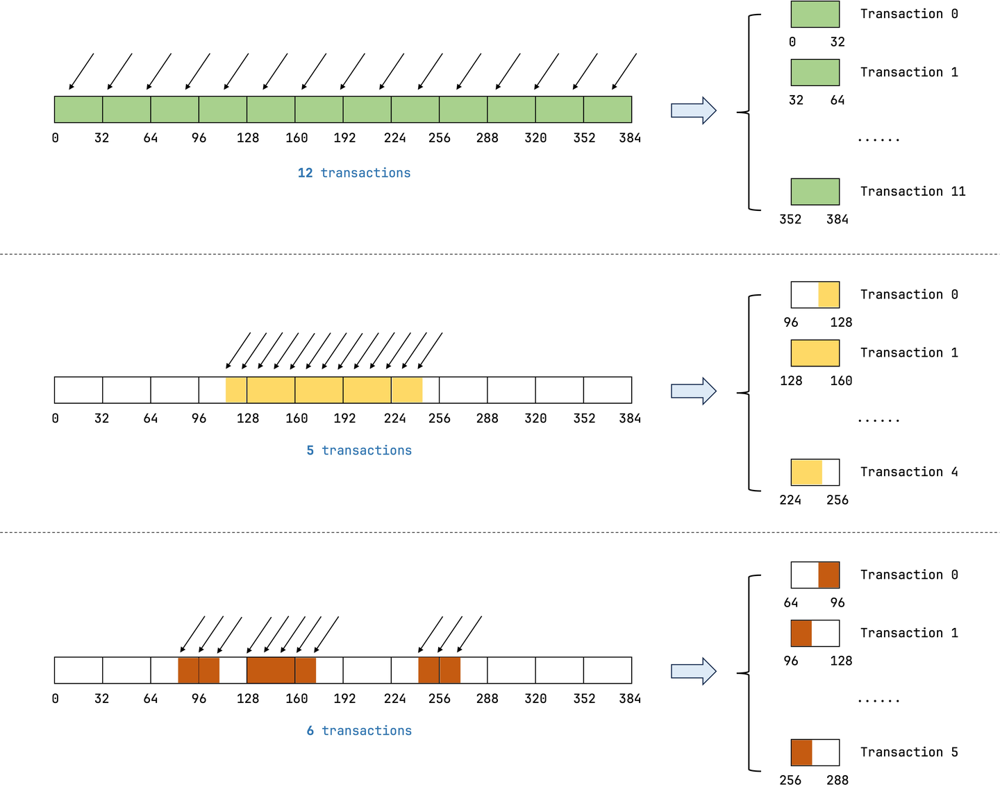

> 비교적 이른 아키텍처의 GPU 하드웨어(SM60 이하)에서는 메모리 접근이 L1 Cache를 거칠 때 한 번의 transaction의 접근 데이터량이 128 bytes가 된다.
>
> 비교적 새로운 아키텍처(SM60 이상)에서는 메모리 접근이 L1 Cache를 거치든 아니든 하나의 transaction의 접근 데이터량이 32 bytes로 고정된다.

이로부터 접근하는 메모리가 연속적이지 않거나 정렬되어 있지 않으면 실제 GMEM 접근량이 늘어날 수 있고, 나아가 연산자 성능에 영향을 준다는 것을 알 수 있다.

우리는 앞 편 노트 마지막에서 Tiled MMA 연산자에 메모리 접근 문제가 있음을 발견했다. ncu가 일부 명령어가 GMEM 데이터를 필요 이상으로 읽었다고 알려 주었다. 이어서 위의 지식을 활용해 이 문제가 생긴 원인을 분석한다.


A 행렬의 메모리 접근을 예로 들어 첫 번째 warp의 메모리 접근 상황에 주목해 보자. 아래 그림에서 첫 번째 warp인 T0-T31이 필요로 하는 데이터가 모두 A(0,0)과 A(0,1) 영역에 있고, 각 행의 길이가 마침 sector 하나의 길이인 32 bytes와 같다는 것을 알 수 있다. 따라서 최적의 경우 A 행렬 데이터를 읽는 데는 sector 16개만 읽으면 되며, 곧 transaction 16번을 수행하면 된다.

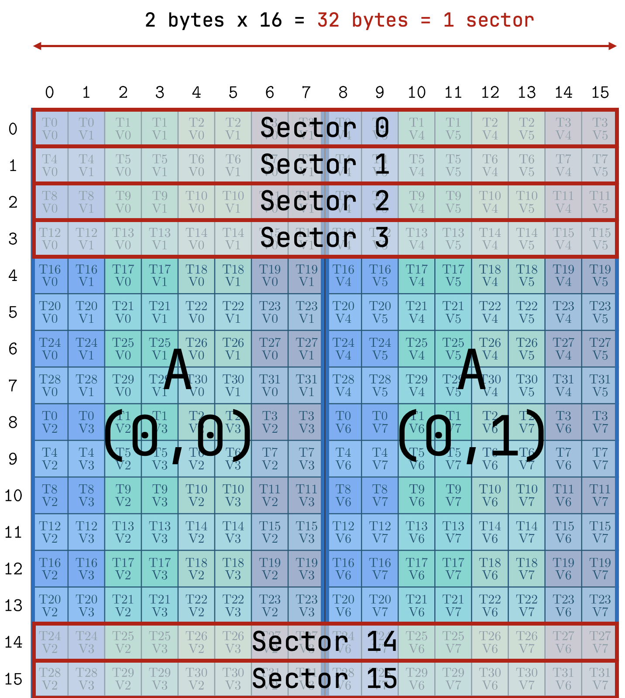

각 스레드가 연속적이지 않은 데이터 블록 4개를 가지므로 실제 메모리 접근은 `LDG.E` 명령어 4개로 완료된다. A(0,0) 이라는 데이터 블록에 대해서는 `LDG.E` 명령어 2개로 GMEM을 읽어야 한다.

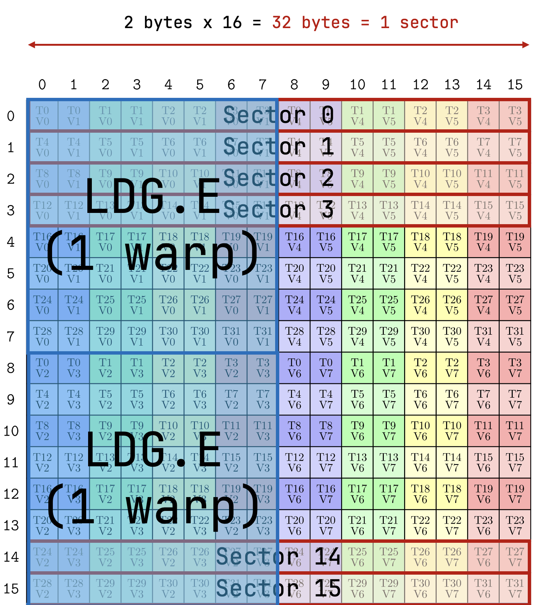

그런데 각 `LDG.E`의 접근 대상은 연속적이지 않은 메모리 영역이라, `LDG.E` 하나가 sector 8개의 데이터를 읽게 된다. 실제로 필요한 데이터는 읽은 데이터의 절반뿐인데도 말이다. 따라서 `LDG.E` 4개는 실제로 sector 32개의 데이터를 읽으며, 실제 GMEM 접근량이 두 배가 된다(Cache가 있으므로 메모리 접근 시간의 증가는 두 배보다는 작을 것이다). 이것이 ncu가 각 `LDG.E`의 GMEM 접근 중 50%가 불필요하다고 알려 준 이유다.

그렇다면 해결 방안이 있을까? 다른 메모리 계층을 도입하지 않는 조건에서라면, vectorized 메모리 접근의 착상에 따라 각 스레드의 연속적이지 않은 데이터 블록을 연속으로 조정하거나, 병합 메모리 접근의 착상에 따라 K 차원의 길이를 8로 고정해 `LDG.E`의 접근 영역이 메모리상 연속이 되도록 보장해야 한다.

매우 유감스럽게도 이 두 방안 모두 만족스럽지 않다. 먼저 첫 번째 착상은 실제로 실현 불가능하다. MMA Permutation을 제어하는 방식, 즉 MMA Atom의 행과 열을 임의로 교환하는 방식으로는 동일한 MMA Atom의 동일한 스레드에 대응하는 두 개의 연속적이지 않은 데이터 블록을 연속으로 만들 방법이 없기 때문이다. 두 번째 착상은 K 차원에서 MMA 규모를 확장할 수 없게 만들어, 대규모 행렬 연산을 처리할 때 성능이 제한된다.

> 스레드가 연속된 데이터 구간을 복사하게 한 다음, warp 내 스레드 간 데이터 교환을 통해 각 스레드가 각자 필요한 데이터를 얻게 할 수도 있다. 그러나 이 방법은 데이터 교환 단계를 하나 추가하고 프로그래밍 복잡도도 상당히 크다.

위의 메모리 접근 문제를 근본적으로 해결하려면 shared memory SMEM을 사용해야 한다. SMEM의 특성과 최적화 수단에 관해서는 이후 노트에서 소개하겠다.

---

하드웨어 메모리 접근 특성을 이해했으니, 제1원리에서 출발해 TiledCopy라는 중요한 API의 핵심 원리를 설명한다.

## 2. TiledCopy 의 핵심 원리 이해하기

모든 데이터 복사 연산은 결국 한 줄의 코드로 요약할 수 있다.

```cpp
dst = src;
```

즉 데이터 소스에서 데이터를 가져와 목표 위치에 놓는 것이다. 여기서 두 가지 핵심 질문이 생긴다. **어디서 데이터를 가져오는가? 데이터를 어느 목표 위치에 놓는가?** 컴퓨터 세계에서 이 두 질문의 답은 사실 **소스 주소**와 **목표 주소**를 찾는 것이다. 이 두 주소를 찾으면 소스 데이터를 가져와 목표 위치에 써 넣을 수 있다.

```cpp
*dst_ptr = *src_ptr;
```

CuTe에서 데이터는 Tensor라는 구조로 저장된다. Tensor는 두 부분으로 구성되는데, 하나는 데이터 블록의 헤드 포인터를 나타내는 **Tensor Data**이고, 다른 하나는 Tensor의 **논리 좌표**를 통해 헤드 포인터에 대한 **메모리 주소 오프셋(offset)**을 어떻게 찾는지 기술하는 **Tensor Layout**이다. Tensor Data와 Tensor Layout을 알면 Tensor 안의 어떤 데이터든 그 주소를 알 수 있고, 따라서 이 Tensor의 어떤 데이터에든 접근할 수 있다.

따라서 **CuTe에서 우리는 자연스럽게 두 Tensor의 데이터 복사를 완료할 수 있다**. 그 본질은 for 루프로 소스 Tensor의 **각 좌표**를 순회하며, 좌표를 통해 대응하는 주소를 계산해 소스 데이터를 가져오고, 이어서 그 데이터를 목표 Tensor의 **동일한 좌표**에 대응하는 주소에 써 넣는 것이다.

```cpp
copy(dst, src);

// Equivalent to:
for (int i = 0; i < size(src); ++i) {
  dst(i) = src(i);
}
```

> 설명해 둘 것은, **CuTe에서 Tensor의 좌표는 정수 형태 idx로 나타낼 수도 있고 벡터 형태 좌표로 나타낼 수도 있다**는 점이다. 예를 들어 `(m, n)` 같은 것이며, 둘은 등가이고 서로 변환할 수 있다.
>
> 노트 (2)에서 좌표 변환 연산 `idx2crd`를 소개한 바 있다. 여기서 예를 하나 더 들면, Shape가 `(3, 4)`인 Tensor에 대해 `idx = 8`은 `idx = (2, 2)`와 등가다. **이후의 노트에서는 좌표의 형태를 변환할 때 따로 언급하지 않겠다.**

위의 복사 과정을 그림 하나로 나타내면 다음과 같다.

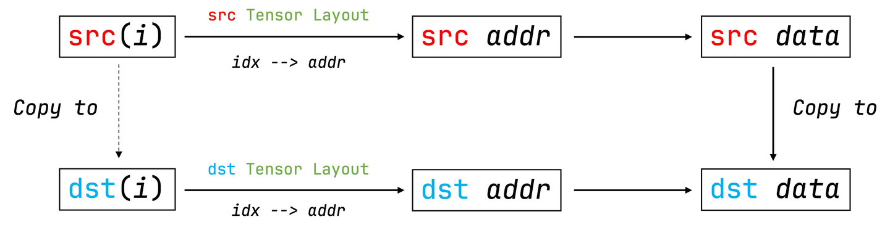

그러나 이런 복사 모드가 모든 Tensor 복사 시나리오를 포괄하지는 못한다. **소스 좌표와 목표 좌표가 같지 않은 모든 경우에는 이런 간편한 복사 방법** `copy(dst, src)` **를 사용할 수 없다**.

예를 들어 역순 복사가 그렇다.

```cpp
for (int i = 0; i < size(src); ++i) {
  dst(size(src) - i - 1) = src(i);
}
```

시프트 복사도 그렇다.

```cpp
for (int i = 0; i < size(src); ++i) {
  dst((i + c) % size(src)) = src(i);
}
```

……그리고 온갖 기괴한 형태의 복사가 있다.

본질적으로 보면 이런 복사 모드가 어떻게 바뀌든 모두 `src` Tensor 좌표에서 `dst` Tensor 좌표로 가는 매핑을 세우고 있다. 이 매핑을 $f$로 표기하며 의미는 $\mathrm{dst\_idx} = f(\mathrm{src\_idx})$ 이다. 그러면 어떤 복사 모드든 다음과 같이 나타낼 수 있다.

```cpp
for (int i = 0; i < size(src); ++i) {
  dst(f(i)) = src(i);
}
```

이 매핑 $f$가 **항등 매핑**일 때 우리는 위의 for 루프 대신 `copy(dst, src)`라는 API를 사용할 수 있다.

실제로 CuTe에는 암묵적인 가정이 하나 있다. 매핑 $f$는 반드시 **항등 매핑**이라는 것이다. 다시 말해 **copy 연산에 참여하는 src와 dst는 같은 좌표에서 반드시 같은 데이터에 대응한다**. 우리는 언제나 dst Tensor의 매핑을 변환하여 $dst' = dst \circ f$ 로 두면, src와 $dst'$의 좌표가 같은 데이터에 일대일로 대응하게 만들 수 있기 때문이다.

```cpp
dst' = composition(dst, f);

for (int i = 0; i < size(src); ++i) {
  dst'(i) = src(i);
}
```

따라서 이후 노트에서는 `f`의 존재를 무시하고 언제나 `dst(i) = src(i)`로 복사 연산을 나타낸다.

> `ldmatrix` 같은 명령어는 스레드 간 데이터 교환을 하므로 모든 복사 모델을 간단히 `dst(i) = src(i)`로 정의할 수는 없다. 더 정확한 표현 방식은 `copy_instruction(dst(i), src(i))`, 즉 src의 데이터를 복사 명령어에 넘기고 명령어가 반환한 데이터를 dst에 놓는 것이다.
>
> 다만 서술의 편의를 위해 이후로도 `dst(i) = src(i)`로 복사 연산을 나타내겠다. 독자는 `dst = src`가 복사 명령어에 따라 밑단의 동작 메커니즘이 달라진다는 점에 유의해야 한다.

SIMT 아키텍처에서는 각 스레드가 각자의 데이터 분할을 받아야 한다. 따라서 좌표로 Tensor를 직접 인덱싱하지 않고 `(t, v)` 순서쌍으로 Tensor를 인덱싱한다. 그러므로 복사 코드는 다음과 같이 나타내야 한다.

```cpp
for (int t = 0; t < size<0>(src); ++t) {
  for (int v = 0; v < size<1>(src); ++v) {
    dst(t, v) = src(t, v);
  }
}
```

이것은 전역적 관점에서 본 복사다. 스레드의 관점에서 보면 각 스레드는 src와 dst에서 자기 데이터 분할을 받아 온 다음, 그 데이터 분할에 대해 for 루프 복사를 수행한다.

```cpp
int t = threadIdx.x;

src_frg = src(t, _);
dst_frg = dst(t, _);

copy(dst_frg, src_frg);

// Equivalent to:
for (int v = 0; v < size(src_frg); ++v) {
  dst_frg(v) = src_frg(v);
}
```

**그렇다면 이제 핵심 질문은 이것이다.** 위의 `copy(dst_frg, src_frg)`라는 간단한 API로 복사를 완료할 수 있게 하려면 이 src와 dst를 어떻게 구성해야 할까?

복사 연산의 본질이 `dst(i) = src(i)` 인 이상, src와 dst를 변환해 src의 $(t, v)$와 dst의 $(t, v)$가 모두 같은 좌표 $i$로 매핑되게 할 수 있다면 `src(t, v) = dst(t, v)`로 복사할 수 있다. 여기서의 매핑은 사실 두 개의 TV Layout으로 나타낼 수 있다.

- **Src TV Layout**은 $s$로 표기하며 의미는 $s(src_t, src_v)=\mathrm{src\_idx}$ 이다. 각 스레드가 src의 어느 좌표에서 데이터를 읽어야 하는지 기술한다.
- **Dst TV Layout**은 $d$로 표기하며 의미는 $d(dst_t, dst_v)=\mathrm{dst\_idx}$ 이다. 각 스레드가 데이터를 dst의 어느 좌표에 써야 하는지 기술한다.

이 두 TV Layout이 있을 때 정상적인 착상은 이렇다. src가 $(t, v)$ 즉 $(src_t, src_v)$를 받아 Src TV Layout을 통해 $\mathrm{src\_idx}$로 매핑되고, dst의 $(t, v)$는 Dst TV Layout을 통해 $\mathrm{dst\_idx}$로 매핑된다. **문제는 이것이다.** 임의의 같은 $(t, v)$에 대해 매핑을 거쳐 얻은 $\mathrm{src\_idx}$와 $\mathrm{dst\_idx}$가 같다는 것을 어떻게 보장할 수 있을까? 더 나아가 $(src_t, src_v)$와 $(dst_t, dst_v)$ 사이의 연결을 어떻게 세워야 할까?

이 연결의 다리는 필연적으로 **데이터**다. 우리가 $(src_t, src_v)$와 $(dst_t, dst_v)$를 같은 idx로 매핑하려는 이유는, 본질적으로 이들이 같은 데이터에 매핑되기를 바라기 때문이다. 그리고 **복사 연산의 데이터 이동은 필연적으로 데이터를 바꾸지 않으므로**, src 안의 모든 데이터는 dst 안에서 대응을 찾을 수 있고 그 역도 성립한다. 이는 복사 연산의 본질적 특징이며, 데이터의 저장 매체나 저장 주소가 무엇이든, 메모리가 연속인지 정렬되었는지와 무관하게 이 본질적 특징은 변하지 않는다. 따라서 **핵심 결론은 이것이다.** $(src_t, src_v)$와 $(dst_t, dst_v)$의 매핑을 세울 때 중간의 다리는 반드시 구체적인 데이터여야 하며, 좌표나 주소 오프셋 offset, 위치 같은 다른 정보여서는 안 된다.

그래서 복사에 참여하는 데이터에 번호(ID)를 매길 수 있다. 예컨대 $0$부터 $N - 1$까지 번호를 매기고, $(src_t, src_v)$에서 $\mathrm{ID}$로, $(dst_t, dst_v)$에서 $\mathrm{ID}$로 가는 매핑을 각각 세우면 $(src_t, src_v) \leftrightarrow \mathrm{ID} \leftrightarrow (dst_t, dst_v)$ 의 연결을 세울 수 있다. 그리고 이 연결은 **필연적으로 복사 명령어의 본질적 특성이 결정한다**. 어느 스레드의 어느 데이터가 어느 스레드의 어느 데이터로 복사될 수 있는지는 복사 명령어만이 확정할 수 있고 프로그램은 이런 매핑을 바꿀 수 없다. 따라서 위의 두 매핑은 반드시 CopyAtom에 기록되어 있다.

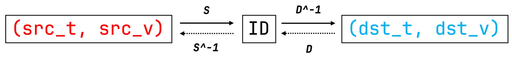

CopyAtom에 기록된 두 Layout 매핑은 각각 **SrcLayout**과 **DstLayout**이라고 부른다.

- **SrcLayout**의 매핑은 $S$로 표기하며 의미는 $S(src_t, src_v)=\mathrm{ID}$ 이다.
- **DstLayout**의 매핑은 $D$로 표기하며 의미는 $D(dst_t, dst_v)=\mathrm{ID}$ 이다.

그러면 $(src_t, src_v)$에서 $(dst_t, dst_v)$로 가는 매핑은 복합 함수 $D^{-1} \circ S$ 로 나타낼 수 있다. 여기서 $D^{-1}$은 $D$의 역매핑, 즉 $\mathrm{ID} \rightarrow (dst_t, dst_v)$ 를 뜻한다. 마찬가지로 $S^{-1} \circ D$ 라는 복합 함수는 $(dst_t, dst_v)$에서 $(src_t, src_v)$로 가는 매핑을 세운다.

> 여기서 한 가지 보충한다. **통상적인** 복사 연산, 즉 `dst = src` 같은 코드는 스레드 사이에서 데이터를 교환하지 않으며, 같은 스레드가 가져온 데이터는 이동 과정 내내 변하지 않는다. 이때 $(src_t, src_v)$와 $(dst_t, dst_v)$는 언제나 같으므로 $D^{-1} \circ S$ 든 $S^{-1} \circ D$ 든 모두 항등 매핑이다. 그러나 **NV GPU의 일부 복사 명령어**(예를 들어 `ldmatrix`)는 스레드 간 데이터 교환을 수행한다. 어떤 스레드 $(src_t, src_v)$가 가져온 데이터를 최종적으로 다른 스레드 $(dst_t, dst_v)$가 받게 되므로, 이런 명령어에 대해서는 위의 매핑이 항등 매핑이 아니다.

그리하여 $(src_t, src_v)$를 $(dst_t, dst_v)$로 매핑하거나, 반대로 $(dst_t, dst_v)$를 $(src_t, src_v)$로 매핑하면 **src와 dst의 TV 공간을 통일**할 수 있다. 즉 이들의 $(t, v)$ 공간을 통일하고, 다시 **동일한** TV Layout으로 이를 idx로 매핑하는 것이다. 이렇게 하면 $(src_t, src_v)$와 $(dst_t, dst_v)$를 같은 idx로 매핑한다는 목표가 달성된다.

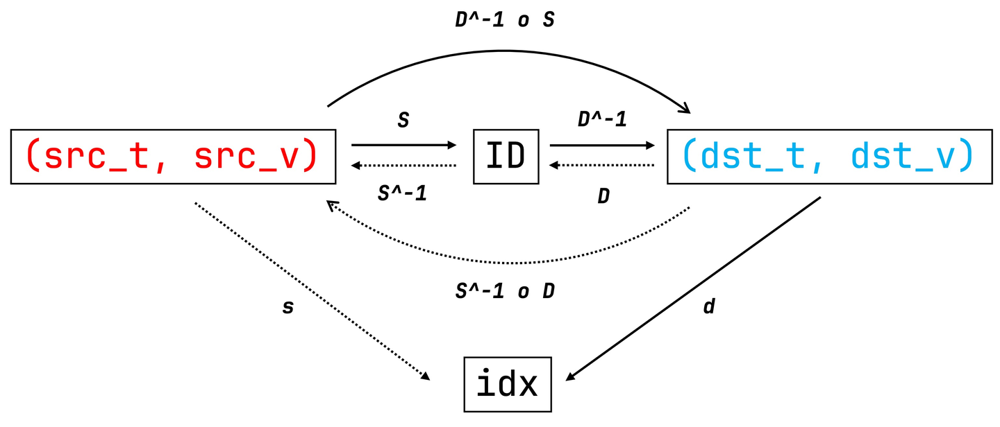

그렇다면 src $(t, v)$를 dst $(t, v)$로 바꿀 것인가, 아니면 dst $(t, v)$를 src $(t, v)$로 바꿀 것인가? 원리상으로는 둘 다 가능하다. 결국 $(t, v)$만 맞추면 되고, 이 $(t, v)$가 구체적으로 src 공간에 있는지 dst 공간에 있는지는 그리 중요하지 않다. **선택 원칙은 이것이다.** 다른 변환 방식을 고르면 기록해야 할 TV Layout도 달라진다. 실제로는 어느 TV Layout이 얻기 쉽거나 계산하기 쉬운지에 따라 그것을 쓰고, 그에 대응하는 $(t, v)$ 매핑 방식을 고른다.

CuTe에는 $S$와 $D$ 중 하나와 같은 매핑 $R$이 정의되어 있으며, 구체적인 정의는 $R(ref_t, ref_v)=\mathrm{ID}$ 이다. $R=S$ 일 때는 $R(src_t, src_v)=\mathrm{ID}$ 이고, $R=D$ 일 때는 $R(dst_t, dst_v)=\mathrm{ID}$ 이다.

$R^{-1}$과 $S$를 하나의 복합 매핑으로 만들면 이 복합 매핑은 사실 $(src_t, src_v) \rightarrow (ref_t, ref_v)$ 이다. 마찬가지로 $R^{-1}$과 $D$를 복합하면 $(dst_t, dst_v) \rightarrow (ref_t, ref_v)$ 라는 매핑이 된다. **다시 말해** $(src_t, src_v)$가 $R^{-1} \circ S$ 매핑을 거치고 $(dst_t, dst_v)$가 $R^{-1} \circ D$ 매핑을 거치면, 두 $(t, v)$가 모두 같은 $(t, v)$ 공간으로 통일되어 $(ref_t, ref_v)$가 된다.

- $R=S$ 일 때 $(src_t, src_v)$가 거치는 것은 항등 매핑이라 결과는 여전히 $(src_t, src_v)$ 이고, $(dst_t, dst_v)$는 $(src_t, src_v)$로 변환된다. 이때 $(ref_t, ref_v)$는 $(src_t, src_v)$와 같으며, 우리는 $(src_t, src_v)$를 idx 좌표로 매핑할 Src TV Layout을 기록해야 한다.
- 마찬가지로 $R=D$ 일 때 두 $(t, v)$는 최종적으로 모두 $(dst_t, dst_v)$가 되고, $(ref_t, ref_v)$는 $(dst_t, dst_v)$와 같으며, 우리는 $(dst_t, dst_v)$를 idx 좌표로 매핑할 Dst TV Layout을 기록해야 한다.

이후 우리는 기록한 이 TV Layout을 **Ref TV Layout**이라고 부르고 $r$로 표기한다. 이는 $s$와 $d$ 중 하나와 같다.

복사 명령어가 다르면 이 Ref TV Layout을 얻는 난이도도 다르다. 따라서 $R$이 $S$와 같은지 $D$와 같은지도 복사 명령어와 관련이 있으며, 그래서 $R$도 $S$, $D$와 마찬가지로 CopyAtom에 기록된다.

**우리의 핵심 질문으로 돌아가자.** 복사 연산을 완료하려면 새로운 src와 dst를 어떻게 구성해야 할까? src의 경우 $(src_t, src_v)$에서 출발해 $R^{-1} \circ S$를 거쳐 $(ref_t, ref_v)$로 매핑되고, 다시 Ref TV Layout을 통해 idx로 매핑되며, 이 idx가 마지막으로 Src Tensor Layout, 즉 원래의 src에 전달되어 데이터의 src 내 실제 주소를 얻는다. 그러면 최종적으로 $src' = src \circ r \circ R^{-1} \circ S$ 가 된다. 마찬가지로 $dst' = dst \circ r \circ R^{-1} \circ D$ 이다. 독자는 소스 코드에서 **이 복합 Layout의 구성 과정이 사실 TiledCopy의 분할 API의 원리**, 즉 `partition_S`와 `partition_D`의 원리임을 확인할 수 있다.

그리고 Ref TV Layout을 빌려 Src TV Layout과 Dst TV Layout을 얻을 수 있다.

- $s = r \circ R^{-1} \circ S$
- $d = r \circ R^{-1} \circ D$

$R=S$ 일 때 $s=r$ 이다. 즉 Ref TV Layout이 곧 Src TV Layout이다. $R=D$ 일 때도 마찬가지다.

이상이 TiledCopy의 핵심 원리다. 그림 하나로 정리해 보자.

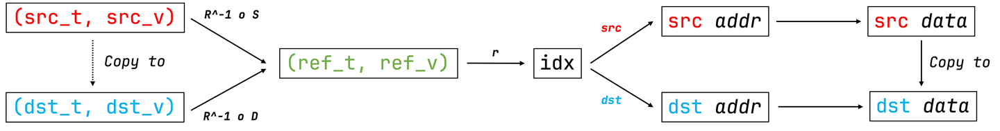

---

이어서 CuTe에서 복사와 관련된 중요한 API를 소개한다.

## 3. Tiled Copy 구현

### 3.1 Copy_Traits 와 CopyAtom

TiledCopy의 핵심 원리에 따르면 우리는 명령어 계층에서 세 개의 매핑 `S`, `D`, `R`, 즉 `SrcLayout`, `DstLayout`, `RefLayout`을 기록해야 한다. 앞의 두 Layout은 이 복사 명령어의 본질적 특징을 나타내고, `RefLayout`은 이 명령어를 사용할 때 어떤 TV Layout을 넘겨야 하는지를 규정한다.

다음은 `SM75_U32x4_LDSM_N` 명령어의 Copy_Traits이다.

```cpp
template <>
struct Copy_Traits<SM75_U32x4_LDSM_N>
{
  // Logical thread id to thread idx (warp)
  using ThrID = Layout<_32>;

  // Map from (src-thr,src-val) to bit
  using SrcLayout = Layout<Shape < _32,_128>,
                           Stride<_128,  _1>>;
  // Map from (dst-thr,dst-val) to bit
  using DstLayout = Layout<Shape <_32,Shape <_32,   _4>>,
                           Stride<_32,Stride< _1,_1024>>>;

  // Reference map from (thr,val) to bit
  using RefLayout = DstLayout;
};
```

CopyAtom은 Traits에서 이 Layout들을 가져오고, 데이터 타입에 따라 몇 가지 처리 작업을 한다. MMA Atom과 MMA Traits의 협업 방식과 유사하다.

```cpp
template <class... Args, class CopyInternalType>
struct Copy_Atom<Copy_Traits<Args...>, CopyInternalType>
  : Copy_Traits<Args...>
{
  using Traits = Copy_Traits<Args...>;

  // Bit and Thr layouts from the Copy_Traits
  using ThrID        = typename Traits::ThrID;
  using BitLayoutSrc = typename Traits::SrcLayout;
  using BitLayoutDst = typename Traits::DstLayout;
  using BitLayoutRef = typename Traits::RefLayout;

  using ValType = CopyInternalType;

  using ValLayoutSrc = decltype(recast_layout<uint1_t, ValType>(BitLayoutSrc{}));
  using ValLayoutDst = decltype(recast_layout<uint1_t, ValType>(BitLayoutDst{}));
  using ValLayoutRef = decltype(recast_layout<uint1_t, ValType>(BitLayoutRef{}));

  ...
}
```

### 3.2 TiledCopy 와 ThrCopy

TiledCopy는 CopyAtom을 기반으로 **스레드**와 **데이터** 두 차원의 확장을 수행한다. 이 점은 TiledMMA와 유사하므로 더 설명하지 않는다.

동시에 TiledCopy는 src와 dst를 변환하는 데 쓰이는 **Ref TV Layout**도 기록하는데, 그것이 아래의 `TiledLayout_TV`이다. 스레드와 데이터 차원의 확장은 `TiledLayout_TV`의 T 차원과 V 차원을 확장하는 방식으로 구현된다.

`Tiler_MN`은 이 TiledCopy가 복사하는 전체 규모이며 하나의 Layout이다. 여기서의 `Tiler_MN`도 마찬가지로 스레드와 데이터 차원의 확장을 나타낼 수 있는데, `Tiler_MN`이든 `TiledLayout_TV`이든 그 size는 복사하는 데이터의 개수이기 때문이다.

```cpp
template <class Copy_Atom,
          class LayoutCopy_TV,  // (tid,vid) -> coord   [Need not be 2D...]
          class ShapeTiler_MN>  // coord space
struct TiledCopy : Copy_Atom
{
  // Layout information from the CopyAtom
  using AtomThrID     = typename Copy_Atom::ThrID;        // thrid -> thr_idx
  using AtomLayoutSrc = typename Copy_Atom::ValLayoutSrc; // (thr,val) -> offset
  using AtomLayoutDst = typename Copy_Atom::ValLayoutDst; // (thr,val) -> offset
  using AtomLayoutRef = typename Copy_Atom::ValLayoutRef; // (thr,val) -> offset

  using AtomNumThr = decltype(size<0>(AtomLayoutRef{}));
  using AtomNumVal = decltype(size<1>(AtomLayoutRef{}));

  // Layout information for the TiledCopy
  using Tiler_MN       = ShapeTiler_MN;
  using TiledLayout_TV = LayoutCopy_TV;
  using TiledNumThr    = decltype(size<0>(TiledLayout_TV{}));
  using TiledNumVal    = decltype(size<1>(TiledLayout_TV{}));

  ...
}
```

ThrMMA와 유사하게 **ThrCopy**도 Tensor 분할 능력을 제공하여 각 스레드가 자기 작업 블록을 받을 수 있게 한다. ThrCopy는 `partition_S`, `partition_D` 두 API로 분할 작업을 완료한다. `partition_S`가 하는 일은 입력된 전역 Tensor **src**를 위에서 언급한 일련의 매핑을 거쳐 **src'** 로 변환하고, 동시에 현재 스레드에 대응하는 데이터 분할을 골라내는 것이다. `partition_D`도 마찬가지다.

```text
TiledCopyA g2r_tiled_copy_a;
ThrCopy g2r_thr_copy_a = g2r_tiled_copy_a.get_slice(tid);

Tensor tAgA = g2r_thr_copy_a.partition_S(gA);    // (CPY, CPY_M, CPY_K)
```

> **원래의 잘못된 내용:** `(MMA, MMA_M, MMA_K)`와 유사하게 여기서의 CPY는 각 스레드가 각 복사 명령어에서 관여하는 데이터량이고, CPY_M과 CPY_K는 TiledCopy가 M과 K 차원에서 확장한 데이터 규모다.

`(MMA, MMA_M, MMA_K)`와 달리 여기서의 CPY는 **각 스레드가 단일 Tile을 복사하는 총 데이터량**을 가리키며, 각 스레드가 각 Copy Atom에서 다루는 데이터량이 아니다. 그리고 **CPY_M과 CPY_K는 Block 차원에서 볼 때 M과 K 방향으로 몇 개의 Tile이 확장되었는가**를 가리킨다. 아직 Tile을 Block으로 확장하지 않았으므로 여기서의 CPY_M과 CPY_K는 모두 1이다.

Ref TV Layout 매핑을 거쳐 분할해 얻은 Tensor에 대해, ThrCopy의 또 다른 기능은 이 Tensor의 Layout 배치를 바꾸어 size를 유지한 채 이후 복사 연산의 Shape에 맞추는 것이다. ThrCopy는 `retile_S`, `retile_D` 두 API를 제공한다.

```text
Tensor tCgA = thr_mma.partition_A(gA);  // (MMA, MMA_M, MMA_K)
Tensor tCrA = thr_mma.partition_fragment_A(gA);  // (MMA, MMA_M, MMA_K)

Tensor tAgA = g2r_thr_copy_a.retile_S(tCgA);     // (CPY, CPY_M, CPY_K)
Tensor tArA = g2r_thr_copy_a.retile_D(tCrA);     // (CPY, CPY_M, CPY_K)

copy(g2r_tiled_copy_a, tAgA, tArA);
```

> `partition_S`/`partition_D` 그리고 `retile_S`/`retile_D`의 코드 분석은 CuTe Layout을 분석한 뒤에 소개하겠다. 사실 이들은 TiledCopy 핵심 원리의 엔지니어링 구현이다.

### 3.3 make_tiled_copy API


`make_tiled_copy`는 `make_tiled_mma`와 유사하게 세 개의 인자를 받으며, 각각 **CopyAtom**, **ThrLayout**, **ValLayout**이다. 그중 ThrLayout은 스레드 확장 방식을, ValLayout은 데이터 확장 방식을 나타낸다. API 내부에서는 ThrLayout과 ValLayout에 근거해 TiledCopy에 필요한 Ref TV Layout과 복사 규모 `Tiler_MN`을 계산해 낸다.

TiledMMA 자체가 A, B, C 행렬의 TV Layout을 기록하고 있으므로, 우리가 필요로 하는 Ref TV Layout이 마침 TiledMMA 안의 TV Layout일 때는 TiledMMA 인스턴스를 `make_tiled_copy_A/B/C`에 바로 넘겨 TiledCopy를 만들 수도 있다. 이는 실질적으로 TiledMMA의 해당 행렬 TV Layout을 Ref TV Layout으로 삼고, TiledMMA의 데이터 규모를 TiledCopy의 데이터 규모로 삼는 것이다.

```text
using Copy_op = AutoVectorizingCopy;
using CopyA_atom = Copy_Atom<Copy_op, ComputeTypeA>;

using TiledCopyA = decltype(make_tiled_copy_A(CopyA_atom{}, TiledMMA{}));
```

> 어떤 경우에 Ref TV Layout이 마침 TiledMMA의 TV Layout이 될까? 사실 복사를 마치자마자 MMA 명령어에 넘겨 연산하는 경우이거나, MMA 계산을 마치자마자 곧바로 복사해 내보내는 경우다. 이 복사의 Ref TV Layout이 MMA의 TV Layout을 쓰게 되면 Tensor 배치를 바꾸지 않고도 복사해 온 Tensor를 바로 MMA 계산에 쓸 수 있고, 계산이 끝난 뒤 바로 복사해 내보낼 수도 있기 때문이다.

### 3.4 연산자 코드 예제

이번 편의 연산자 상세 내용은 앞 편 노트와 같다. 코드 차원에서 TiledMMA와의 차이는 TiledCopy를 만들고 사용하는 부분에만 있다.

| 항목 | 값 |
|------|------|
| 문제 규모 | `(32, 32, 16)` |
| 연산자 정밀도 | `BF16 = BF16 * BF16 + FP32` |
| Grid shape | `(1, 1, 1)` |
| Block shape | `(256, 1, 1)` |
| Block tile shape | `(32, 32, 16)` |
| Tiled MMA shape | `(32, 32, 16)` |
| MMA atom shape | `(16, 8, 8)` |

우리는 GMEM에서 레지스터로의 복사만 완료하면 되고 MMA 연산만 수행하면 되므로, `make_tiled_copy_A/B/C`로 TiledCopy 템플릿 클래스를 바로 만들 수 있다.

여기서도 통상적인 복사 명령어를 채택하고 가능한 한 최대의 vectorized 메모리 접근 길이를 고르므로, Copy op 명령어로 `AutoVectorizingCopy`를 선택한다.

```cpp
using Copy_op = AutoVectorizingCopy;

using CopyA_atom = Copy_Atom<Copy_op, ComputeTypeA>;
using CopyB_atom = Copy_Atom<Copy_op, ComputeTypeB>;
using CopyC_atom = Copy_Atom<Copy_op, ComputeTypeC>;
using CopyO_atom = Copy_Atom<Copy_op, OutType>;

using TiledCopyA = decltype(make_tiled_copy_A(CopyA_atom{}, TiledMMA{}));
using TiledCopyB = decltype(make_tiled_copy_B(CopyB_atom{}, TiledMMA{}));
using TiledCopyC = decltype(make_tiled_copy_C(CopyC_atom{}, TiledMMA{}));
using TiledCopyO = decltype(make_tiled_copy_C(CopyO_atom{}, TiledMMA{}));
```

kernel 내부에서는 A 행렬을 예로 들어, 먼저 TiledCopy 인스턴스를 만들고 현재 스레드에 따라 ThrCopy 인스턴스를 만든 다음, `partition_S/D` 또는 `retile_S/D` 메서드로 현재 스레드가 담당하는 복사 대상 Tensor 분할을 얻는다. 우리는 앞서 이미 TiledMMA의 Tensor 분할을 갖고 있으므로 여기서는 `retile_S/D` 메서드만 쓰면 된다.

```cpp
TiledCopyA g2r_tiled_copy_a;
ThrCopy g2r_thr_copy_a = g2r_tiled_copy_a.get_slice(tid);
Tensor tAgA = g2r_thr_copy_a.retile_S(tCgA);     // (CPY, CPY_M, CPY_K)
// Equivalent to:
// Tensor tAgA = g2r_thr_copy_a.partition_S(gA);    // (CPY, CPY_M, CPY_K)
Tensor tArA = g2r_thr_copy_a.retile_D(tCrA);     // (CPY, CPY_M, CPY_K)
```

TiledCopy의 핵심 원리에 따르면 이 분할 쌍은 copy API에 바로 넘길 수 있으며, 본질적으로는 for 루프로 복사 연산을 완료한다. 여기서는 ThrCopy 객체를 넘겨 그 안의 복사 명령어로 복사 연산을 완료해야 한다.

```cpp
copy(g2r_tiled_copy_a, tAgA, tArA);
```

복사가 끝난 뒤에도 MMA 연산을 완료하려면 여전히 TiledMMA의 Tensor 분할을 사용해야 한다는 점에 유의하라(이 예제에서는 TiledCopy 분할과 TiledMMA 분할이 같기는 하지만).

```cpp
gemm(tiled_mma, tCrC, tCrA, tCrB, tCrC);
```

결과를 계산해 낸 뒤에는 C 행렬 분할을 GMEM으로 다시 복사해야 한다. 코드는 위와 유사하며 복사 방향만 바뀐다.

```cpp
TiledCopyO r2g_tiled_copy_o;

ThrCopy r2g_thr_copy_o = r2g_tiled_copy_o.get_slice(tid);
Tensor tCrC_r2g = r2g_thr_copy_o.retile_S(tCrC);   // (CPY, CPY_M, CPY_N)
Tensor tCgC_r2g = r2g_thr_copy_o.retile_D(tCgC);   // (CPY, CPY_M, CPY_N)

copy(r2g_tiled_copy_o, tCrC_r2g, tCgC_r2g);
```

### 3.5 metadata 해설과 Latex 도해

cute에서는 TiledCopy의 정보를 출력할 수도 있고, latex로 이 TiledCopy를 시각화할 수도 있다.

```cpp
cute::print(typename Spec::TiledCopyA{});
cute::print_latex(typename Spec::TiledCopyA{});
```

TiledCopy metadata는 모든 핵심 Layout 정보를 보여 주며, 핵심 원리 부분에서 이미 상세히 소개했다. 아래는 TiledCopyA의 metadata다.

```text
TiledCopy
  Tiler_MN:       (_32,_16)
  TiledLayout_TV: ((_4,_8,_2,_4),((_2,_2,_2),(_1,_1))):((_64,_1,_16,_0),((_32,_8,_256),(_0,_0)))
Copy_Atom
  ThrID:        _1:_0
  ValLayoutSrc: (_1,_1):(_0,_0)
  ValLayoutDst: (_1,_1):(_0,_0)
  ValLayoutRef: (_1,_1):(_0,_0)
  ValueType:    16b
```

latex로 TiledCopyA를 시각화하면 다음 그림을 얻는다. 그중 왼쪽은 **Src MN Layout**, 즉 Src TV Layout의 역매핑이고, 오른쪽은 Dst MN Layout이며, 좌우 양쪽의 같은 좌표는 같은 데이터에 대응한다. 이 예제에서 두 MN Layout은 완전히 동일하고, 나아가 TiledMMA의 A TV Layout과도 완전히 동일하다. 독자는 노트 (3)의 latex 그림과 비교해 볼 수 있다.

두 MN Layout이 완전히 동일하다는 것은 복사에 스레드 간 데이터 교환이 없고 각 스레드가 자기가 필요한 데이터의 복사 작업만 담당한다는 뜻이다. 핵심 원리에 따르면 $s=d$ 는 $S=D$ 와 등가이므로, 우리가 쓴 복사 명령어의 SrcLayout과 DstLayout도 완전히 동일하다. 이 점은 위의 metadata에서도 확인할 수 있다.

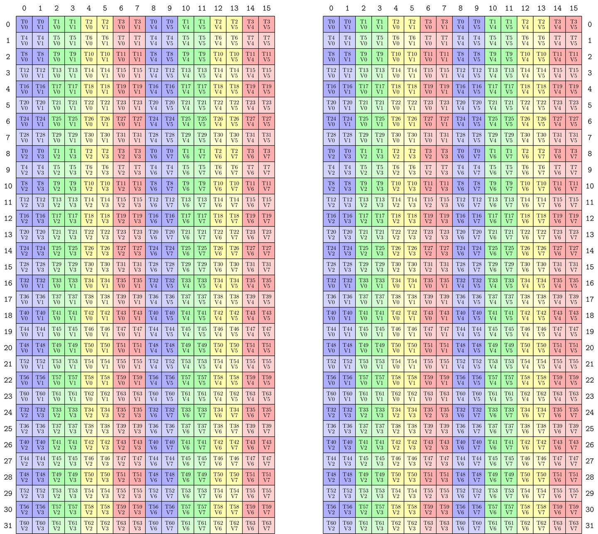

이번 편 예제 코드의 PTX와 SASS는 변화가 없으므로 여기서는 따로 분석하지 않는다.

## 4. 정리

이번 편 노트의 핵심은 **TiledCopy의 핵심 원리**다. 그 안의 각 Layout 매핑의 역할과 매핑 사이의 복합 및 변환을 이해하면 API 아래에 숨어 있는 밑단 메커니즘을 파악할 수 있고, Layout 연산을 이해하고 CuTe Layout 대수를 유연하게 활용해 연산자 로직을 작성하는 방향으로 한 걸음 확실히 나아가게 된다!

다음 단계로 문제 규모를 Tile 차원에서 Block 차원으로 확장하여, 새로운 Tiling 계층에서 효율적인 연산을 어떻게 구현할지 탐구하겠다. 많은 기대 바란다!

다음 편 글은 다음에서 볼 수 있다: [CUTLASS 노트 (5): Block MMA](https://zhuanlan.zhihu.com/p/1970162570636816559)

**마지막으로, 여기까지 읽어 주셔서 감사하다! 이 글이 도움이 되었다면 좋아요를 눌러 주기 바란다. 고맙다～**

# CUTLASS 노트 (5): Block MMA

이번 편에서는 주로 Block 차원에서 더 큰 규모의 MMA 계산을 어떻게 완료하는지 소개하고, Block 차원에서 TiledCopy와 TiledMMA의 분할 특성을 분석한다.

이번 편에서 사용하는 CUTLASS 버전은 4.1.0이고, 하드웨어 아키텍처는 SM90이다.

**이 노트 시리즈의 관련 코드는 모두 오픈 소스로 공개되어 있다. 코드 저장소는 [cutlass-notes](https://github.com/ArthurinRUC/cutlass-notes) 이며, 많은 star 부탁드린다～**

CUTLASS 노트 시리즈의 길잡이와 글 목록은 다음에서 자세히 볼 수 있다.

[CUTLASS 노트: 길잡이](https://zhuanlan.zhihu.com/p/1937220431728845963)

---

앞의 두 편 노트에서는 단일 Tile 차원에서 데이터 복사와 MMA 연산을 어떻게 완료하는지 소개했다. 이번 편부터는 Tile 차원에서 Block 차원으로 확장한다.

[CUTLASS 노트 (3): Tiled MMA](https://zhuanlan.zhihu.com/p/1950555644814946318)

[CUTLASS 노트 (4): Tiled Copy](https://zhuanlan.zhihu.com/p/1968745447741972494)

노트 (3)에서 GEMM 분할 연산의 중요한 개념 모델인 **3단계 Tiling**을 소개했다. 이번 편 노트에서는 먼저 두 번째 단계 Tiling, 즉 Block에서 Tile로 가는 분할 과정이 어떻게 진행되는지 되짚어 본다.

## 1. Tile 을 Block 으로 확장하기

### 1.1 확장 방식과 루프 차원

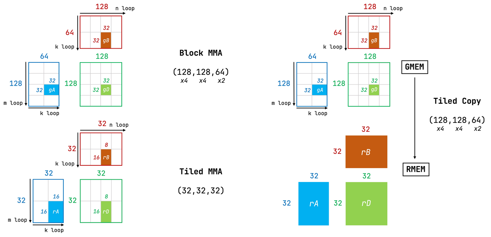

단일 Tile의 규모는 SM의 레지스터 크기에 제한되므로, 행렬 연산 규모를 계속 키우려면 Tile을 단위로 복사와 MMA 연산을 루프로 실행해야 한다.

예를 들어 하나의 Block 크기(128x128x64)를 레지스터에 완전히 로드한다면 단일 SM에 필요한 레지스터 수는 `128*128*64/2 = 524288` 개로, 상한인 `32768` 을 크게 초과한다. 따라서 억지로 그렇게 하면 레지스터 오버플로가 발생해 대량의 GMEM을 쓰면서 동시에 연산자 성능을 크게 떨어뜨린다.

이런 경우 Block 규모의 연산을 `(M, N, K)` 세 차원에서 여러 개의 Tile 규모 연산으로 나누어야 한다. 실행 과정에서는 **삼중 루프**로 각 Tile의 Copy와 MMA 명령어를 차례로 처리한다. Copy에는 **TiledCopy** API를, MMA에는 **TiledMMA** API를 써야 한다. 코드는 아래와 같다.

```cpp
for (int m_tile = 0; m_tile < NTilesM; ++m_tile) {
  for (int n_tile = 0; n_tile < NTilesN; ++n_tile) {
    for (int k_tile = 0; k_tile < NTilesK; ++k_tile) {
      copy(tiled_copy, gA(_, m_tile, k_tile), rA(_, m_tile, k_tile));
      copy(tiled_copy, gB(_, n_tile, k_tile), rB(_, n_tile, k_tile));
      gemm(tiled_mma, rC, rA, rB, rC);
    }
  }
}
```

> Tile 차원의 Copy와 MMA에 관한 세부 사항은 노트 (3)과 노트 (4)의 해당 내용을 참고하라.

Tile을 루프로 계산함으로써 제한된 레지스터로도 더 큰 규모의 행렬 연산을 완료할 수 있다. **이론상으로 하나의 block이 처리할 수 있는 행렬 규모에는 제한이 없다.**

그런데 Tile을 루프로 복사하는 과정에서 일부 Tile의 데이터가 여러 번 중복해서 읽힌다는 점에 주목하게 된다. 예를 들어 아래 그림에서 Tile1과 Tile2는 같은 A의 Tile 데이터를 사용하는데, 위 코드를 실행하면 이 데이터가 중복 접근되어 GMEM의 접근량이 늘어나고 결과적으로 GEMM 연산자 성능에 영향을 준다.

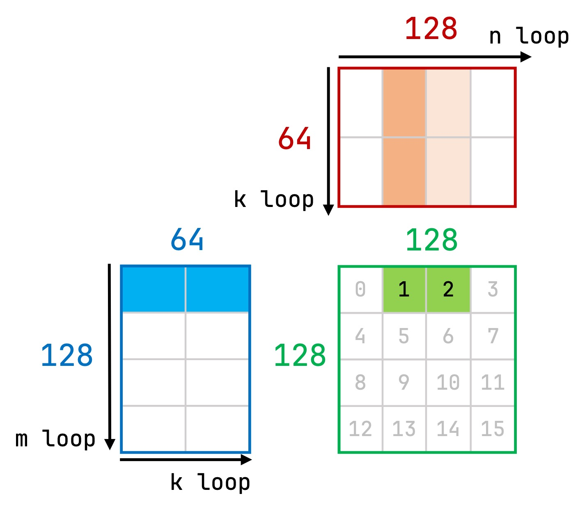

이 문제를 피하려면 **Block 전체의 데이터를 먼저 GMEM에서 SMEM으로 복사해야 한다**. 루프로 복사할 때 SMEM에서 같은 데이터를 읽으면 훨씬 빠르다. SMEM 관련 복사 연산을 어떻게 완료하는지는 다음 편 노트에서 소개한다.

---

Block MMA의 이론 부분은 비교적 간단하지만, 실전 과정에서 유의해야 할 점이 몇 가지 있다. 이어서 연산자 구현을 살펴보자.

## 2. Block MMA 구현

이번 편부터 MMA의 기본 명령어를 `16x8x16` 크기로 교체하고, 동시에 Tile 규모도 K 차원에서 두 배로 확장해 `32x32x32`로 만들어 더 큰 규모의 행렬 연산에 맞춘다. Block의 크기는 `128x128x64`로 정하는데, 이는 `(M, N, K)` 차원에서 각각 `(4, 4, 2)`배 확장한 것이다.

이번 편에서 개발할 연산자의 상세 내용은 다음과 같다.

| 항목 | 값 |
| --- | --- |
| 문제 규모 | `(128, 128, 64)` |
| 연산자 정밀도 | `BF16 = BF16 * BF16 + FP32` |
| Grid shape | `(1, 1, 1)` |
| Block shape | `(256, 1, 1)` |
| Block tile shape | `(128, 128, 64)` |
| Tiled MMA shape | `(32, 32, 32)` |
| MMA atom shape | `(16, 8, 16)` |

코드의 Spec 차원에서는 kTile의 크기를 Block의 크기로 바꾸어야 한다.

```cpp
template <typename OutType_, typename ComputeTypeA_, typename ComputeTypeB_, typename ComputeTypeC_,
          int kTileM_ = 128, int kTileN_ = 128, int kTileK_ = 64>
struct KernelSpec { ... }
```

실제로 TiledCopy를 기반으로 이 한 곳만 수정하면 Block MMA 예제를 올바르게 실행할 수 있다. 그러나 그 안의 몇몇 세부 사항이 CuTe의 API에 가려져 있어서, Copy와 MMA 연산을 커스터마이즈해야 할 때 문제를 만날 가능성이 크다. 따라서 Block으로 확장한 뒤 이전의 몇몇 Tensor가 shape 차원에서 어떻게 변하는지, 그리고 CuTe가 Copy와 MMA의 루프 연산을 어떻게 완료하는지에 주목해야 한다.

### 2.1 MMA, Copy 분할 Tensor 의 확장 차원 이해하기

먼저 TiledMMA로 분할한 뒤의 Tensor에 주목해 보자.

```cpp
Tensor tCgA = thr_mma.partition_A(gA);  // (MMA, MMA_M, MMA_K)
Tensor tCgB = thr_mma.partition_B(gB);  // (MMA, MMA_N, MMA_K)
Tensor tCgC = thr_mma.partition_C(gC);  // (MMA, MMA_M, MMA_N)

Tensor tCrA = thr_mma.partition_fragment_A(gA);  // (MMA, MMA_M, MMA_K)
Tensor tCrB = thr_mma.partition_fragment_B(gB);  // (MMA, MMA_N, MMA_K)
Tensor tCrC = thr_mma.partition_fragment_C(gC);  // (MMA, MMA_M, MMA_N)
```

위의 6개 Tensor에 대해 앞 편 노트의 metadata와 비교해 보자.

```text
gmem_ptr[16b](0x7f448be00000) o ((_2,_2),_1,_2):((_1,128),_0,_8)
gmem_ptr[16b](0x7f448be00400) o (_2,_1,_2):(_1,_0,_8)
gmem_ptr[32b](0x7f448be01800) o ((_2,_2),_1,_1):((_1,256),_0,_0)
ptr[16b](0x7f44a1fffca0) o ((_2,_2),_1,_2):((_1,_2),_0,_4)
ptr[16b](0x7f44a1fffcb0) o (_2,_1,_2):(_1,_0,_2)
ptr[32b](0x7f44a1fffcc0) o ((_2,_2),_1,_1):((_1,_2),_0,_0)
```

그리고 이번 편에서 Block으로 확장한 뒤의 metadata는 다음과 같다.

```text
gmem_ptr[16b](0x7fdb4be00000) o ((_2,_2,_2),_4,_4):((_1,512,_8),2048,_16)
gmem_ptr[16b](0x7fdb4be04000) o ((_2,_2),_4,_4):((_1,_8),2048,_16)
gmem_ptr[32b](0x7fdb4be18000) o ((_2,_2),_4,_4):((_1,1024),4096,_32)
ptr[16b](0x7fdb61fffa50) o ((_2,_2,_2),_4,_4):((_1,_2,_4),_32,_8)
ptr[16b](0x7fdb61fffb50) o ((_2,_2),_4,_4):((_1,_2),_16,_4)
ptr[32b](0x7fdb61fffbd0) o ((_2,_2),_4,_4):((_1,_2),_4,_16)
```

mma 명령어 크기를 `16x8x8`에서 `16x8x16`으로 높였기 때문에, K 차원과 관련된 MMA라는 값, 즉 단일 명령어에서 단일 스레드가 계산에 관여하는 데이터 개수도 함께 원래의 2배로 확장되었음을 알 수 있다.

그리고 `(MMA_M, MMA_N, MMA_K)`는 `(1, 1, 2)`에서 `(4, 4, 4)`로 바뀌었는데, Block은 Tile에 비해 `(4, 4, 2)`배 확장되었다. 따라서 **MMA의 분할은 MMA Atom을 단위로 이루어지며**, `(MMA_M, MMA_N, MMA_K)`라는 확장 차원은 Atom에서 Tile로 확장되는 차원과 Tile에서 Block으로 확장되는 차원을 모두 포함한다는 것을 알 수 있다.

그다음 TiledCopy의 분할에 주목해 보자.

```cpp
TiledCopyA g2r_tiled_copy_a;
ThrCopy g2r_thr_copy_a = g2r_tiled_copy_a.get_slice(tid);
Tensor tAgA = g2r_thr_copy_a.retile_S(tCgA);     // (CPY, CPY_M, CPY_K)
Tensor tArA = g2r_thr_copy_a.retile_D(tCrA);     // (CPY, CPY_M, CPY_K)

TiledCopyB g2r_tiled_copy_b;
ThrCopy g2r_thr_copy_b = g2r_tiled_copy_b.get_slice(tid);
Tensor tBgB = g2r_thr_copy_b.retile_S(tCgB);   // (CPY, CPY_N, CPY_K)
Tensor tBrB = g2r_thr_copy_b.retile_D(tCrB);   // (CPY, CPY_N, CPY_K)
```

위의 4개 Tensor에 대해 앞 편 노트 코드의 metadata와 비교해 보자.

```text
gmem_ptr[16b](0x7f448be00000) o ((_1,(_2,_2,_2)),_1,_1):((_0,(_1,128,_8)),_0,_0)
ptr[16b](0x7f44a1fffca0) o ((_1,_8),_1,_1):((_0,_1),_0,_0)
gmem_ptr[16b](0x7f448be00400) o ((_1,(_2,_2)),_1,_1):((_0,(_1,_8)),_0,_0)
ptr[16b](0x7f44a1fffcb0) o ((_1,_4),_1,_1):((_0,_1),_0,_0)
```

그리고 이번 편 노트 코드의 metadata는 다음과 같다.

```text
gmem_ptr[16b](0x7fdb4be00000) o ((_1,(_2,_2,_4)),_4,_2):((_0,(_1,512,_8)),2048,_32)
ptr[16b](0x7fdb61fffa50) o ((_1,_16),_4,_2):((_0,_1),_32,_16)
gmem_ptr[16b](0x7fdb4be04000) o ((_1,(_2,_4)),_4,_2):((_0,(_1,_8)),2048,_32)
ptr[16b](0x7fdb61fffb50) o ((_1,_8),_4,_2):((_0,_1),_16,_8)
```

CPY는 단일 Tile에서 단일 스레드가 복사해야 할 데이터 개수다. 우리의 Tile shape가 두 배로 늘었으므로 CPY도 그에 맞춰 두 배로 늘었다.

`(CPY_M, CPY_N, CPY_K)`는 Tile이 Block으로 확장된 각 차원을 나타낸다. 앞 편 노트에서는 이런 확장 차원이 당연히 모두 1이었지만, 이번 편 노트에서의 `(CPY_M, CPY_N, CPY_K)`는 `(4, 4, 2)`로, Tile에서 Block으로의 확장 차원 크기와 같다. 따라서 **Copy의 분할은 Tile을 단위로 이루어지며**, `(CPY_M, CPY_N, CPY_K)`는 Tile이 Block으로 확장된 차원만을 나타낸다.

> 여기서 알 수 있듯이 MMA와 CPY의 확장 차원이 다르기 때문에, MMA 분할로 얻은 Tensor를 Copy에 쓰려면 이 Tensor의 Layout을 변환해 CPY의 차원에 맞춰야 한다. 이것이 바로 `retile_S`, `retile_D` 함수의 역할이다.

여기서 독자는 MMA와 Copy의 **분할 단위가 다르다**는 점, 그리고 그 **확장 차원의 의미도 다르다**는 점에 특별히 주목해야 한다. 이 두 가지 차이가 Copy와 MMA를 루프로 완료하는 방식의 차이를 결정한다. 구체적으로 말하면 **Copy 때는 Tile 단위로 루프를 돌고, MMA 때는 MMA Atom 단위로 루프를 돈다.**

### 2.2 Copy 와 MMA 를 루프로 실행하기

아래 코드처럼 가장 바깥층에서 **삼중 루프**로 각 Tile의 복사와 계산을 차례로 실행한다. 각 Tile 내부에서는 copy API를 호출해 한 Tile에 필요한 데이터의 복사를 완료하고, 이어서 다시 **삼중 루프**로 **그 Tile 아래의** 각 MMA Atom을 차례로 실행한다.

```cpp
for (int m_tile = 0; m_tile < NTilesM; ++m_tile) {
  for (int n_tile = 0; n_tile < NTilesN; ++n_tile) {
    for (int k_tile = 0; k_tile < NTilesK; ++k_tile) {
      copy(g2r_tiled_copy_a, tAgA(_, m_tile, k_tile), tArA(_, m_tile, k_tile));
      copy(g2r_tiled_copy_b, tBgB(_, n_tile, k_tile), tBrB(_, n_tile, k_tile));

      for (int im = m_tile * kMmaValExpandM; im < (m_tile + 1) * kMmaValExpandM; ++im) {
        for (int in = n_tile * kMmaValExpandN; in < (n_tile + 1) * kMmaValExpandN; ++in) {
          for (int ik = k_tile * kMmaValExpandK; ik < (k_tile + 1) * kMmaValExpandK; ++ik) {
            gemm(tiled_mma, tCrC(_, im, in), tCrA(_, im, ik), tCrB(_, in, ik), tCrC(_, im, in));
          }
        }
      }
    }
  }
}
```

Copy 분할 행렬인 `tAgA`, `tArA`, `tBgB`, `tBrB`는 Tile index, 즉 `(m_tile, n_tile, k_tile)`로 인덱싱하는 반면, MMA 분할 행렬은 Atom Expand 차원으로 인덱싱한다는 점에 주목하라. 독자는 이 코드를 통해 "**Copy 때는 Tile 단위로 루프를 돌고, MMA 때는 MMA Atom 단위로 루프를 돈다**"는 문장을 이해할 수 있다.

CuTe가 제공하는 `copy`, `gemm` API는 위의 루프 순회를 자동으로 완료해 준다. 그 배후에서는 뱀 모양 순회 알고리즘을 채택해 Cache를 활용하여 데이터 재사용률을 최대화한다.

```cpp
copy(g2r_tiled_copy_a, tAgA, tArA);
copy(g2r_tiled_copy_b, tBgB, tBrB);

gemm(tiled_mma, tCrC, tCrA, tCrB, tCrC);
```

**일부 차원의 루프만 수동으로 제어하고** 나머지 차원의 루프는 `copy`, `gemm` API가 알아서 처리하게 할 수도 있다. 예를 들어 K 차원의 루프를 수동으로 제어하고 싶다면 다음과 같은 코드를 쓸 수 있다.

```cpp
for (int ik = 0; ik < NTilesK; ++ik) {
  copy(g2r_tiled_copy_a, tAgA(_, _, ik), tArA(_, _, ik));
  copy(g2r_tiled_copy_b, tBgB(_, _, ik), tBrB(_, _, ik));

  for (int gk = ik * kMmaValExpandK; gk < (ik + 1) * kMmaValExpandK; ++gk) {
    gemm(tiled_mma, tCrC, tCrA(_, _, gk), tCrB(_, _, gk), tCrC);
  }
}
```

오픈 소스 코드에는 위 세 가지 루프의 구현 방식이 모두 제공되어 있으니, 독자는 이 구현들이 모두 올바른 결과를 낸다는 것을 직접 검증해 볼 수 있다.

### 2.3 PTX, SASS 코드 분석

여기서 독자는 의문이 들 수 있다. 가장 간결한 루프 방식에 대해,

```cpp
copy(g2r_tiled_copy_a, tAgA, tArA);
copy(g2r_tiled_copy_b, tBgB, tBrB);

gemm(tiled_mma, tCrC, tCrA, tCrB, tCrC);
```

이것이 한 Block의 모든 데이터 복사가 끝나기를 기다린 뒤에야 gemm 계산을 한다는 뜻일까? 그렇게 하면 레지스터 오버플로가 나지 않을까?

실제로 컴파일러는 내부 루프의 copy 명령어와 mma 명령어의 순서를 **합리적으로 재배치**하여, 레지스터 자원을 최대한 충분히 활용하면서도 레지스터 오버플로가 나지 않게 한다.

이는 PTX code와 SASS code에서 확인할 수 있다. 위와 같은 방식으로 작성하더라도 실제로 하드웨어는 여전히 복사 명령어와 계산 명령어를 교차 실행한다.

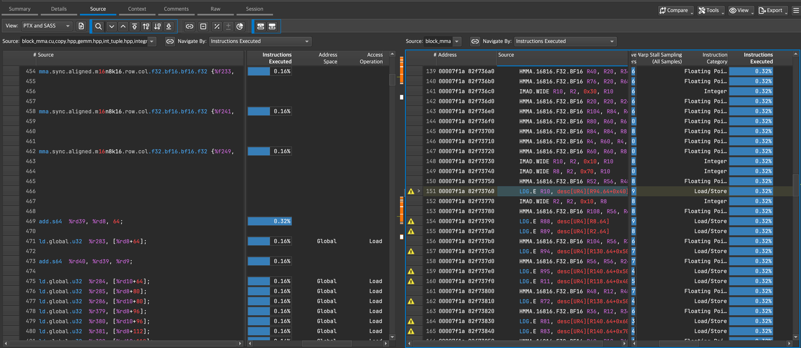

여기서 독자에게 또 하나의 질문이 생길 수 있다. 컴파일러가 재배치를 해 준다면 우리가 copy와 mma 루프를 수동으로 제어하는 의미는 어디에 있는가? 컴파일러가 전능하지는 않기 때문이다. 루프를 수동으로 제어하면 어느 정도까지 copy와 mma의 계산 파이프라인을 제어할 수 있어, 레지스터로 복사하는 연산이 최대한 mma 계산에 가려지게 할 수 있고, 이는 미세한 성능 향상을 가져다준다. 또한 컴파일러가 직접 최적화할 수 없는 SMEM 파이프라인에 대해서는 반드시 루프를 손으로 작성해 파이프라인을 구현해야 한다.

## 3. 정리

이번 편에서는 주로 계산 측면에서 Block 차원의 MMA 연산을 구현하고, Copy와 MMA 분할 세부 사항의 차이를 분석했다. 이는 이후 최적화 과정에서 올바른 파이프라인을 작성하는 데 도움이 된다.

다음 단계로 SMEM의 특성과 관련 복사 연산을 소개하고, Block 차원에서 다계층 데이터 복사를 어떻게 완료하여 Block 차원 MMA 연산자의 성능을 한층 더 끌어올릴지 살펴보겠다. 많은 기대 바란다!

다음 편 글은 다음에서 볼 수 있다: [CUTLASS 노트 (6): Block Copy](https://zhuanlan.zhihu.com/p/2004627053077627913)

**마지막으로, 여기까지 읽어 주셔서 감사하다! 이 글이 도움이 되었다면 좋아요를 눌러 주기 바란다. 고맙다～**

# CUTLASS 노트 (6): Block Copy

이번 편에서는 주로 SMEM의 특성과, Block 차원에서 CUTLASS CuTe로 SMEM 관련 코드를 어떻게 작성하는지 소개한다. 최종적으로 GMEM, SMEM, RMEM의 2단계 복사 파이프라인을 세워 Block 차원 MMA 연산자의 성능을 한층 더 끌어올린다.

이번 편에서 사용하는 CUTLASS 버전은 4.3.4이고(업데이트했다!), 하드웨어 아키텍처는 SM90이다.

**이 노트 시리즈의 관련 코드는 모두 오픈 소스로 공개되어 있다. 코드 저장소는 [cutlass-notes](https://github.com/ArthurinRUC/cutlass-notes) 이며, 많은 star 부탁드린다～**

CUTLASS 노트 시리즈의 길잡이와 글 목록은 다음에서 자세히 볼 수 있다.

[CUTLASS 노트: 길잡이](https://zhuanlan.zhihu.com/p/1937220431728845963)

---

앞 편 노트에서는 행렬 연산의 규모를 Tile에서 Block으로 확장하고, Block 계층 Tiling의 복사와 계산 루프를 적절한 방식으로 처리했다.

[CUTLASS 노트 (5): Block MMA](https://zhuanlan.zhihu.com/p/1970162570636816559)

동시에 GMEM에서 데이터를 옮길 때 중복 메모리 접근 현상이 있음을 관찰했는데, SMEM의 도움을 받아 연산자의 메모리 접근을 한층 더 최적화할 수 있다.


노트 (4)에서도 복사 명령어에 잉여 메모리 접근 문제가 나타났는데, SMEM을 도입하지 않고서는 좋은 해결 방안이 없었다.

[CUTLASS 노트 (4): Tiled Copy](https://zhuanlan.zhihu.com/p/1968745447741972494)

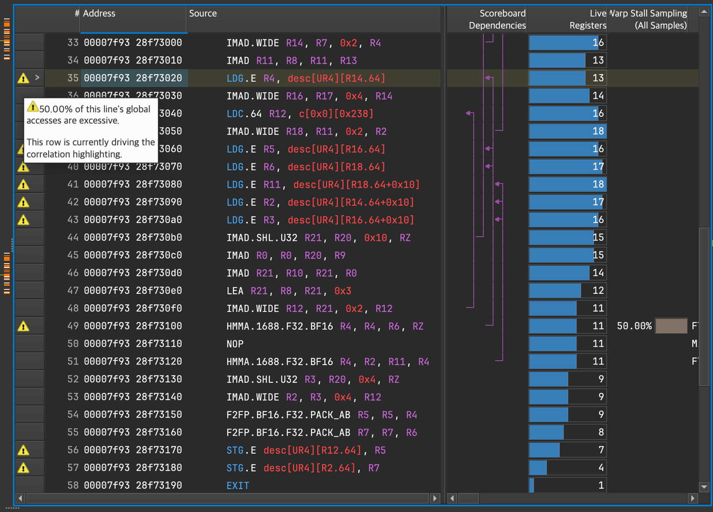

이번 편 노트는 Block 차원의 행렬 연산을 이어 가면서 SMEM이라는 새로운 메모리 계층을 도입하고, SMEM 특성을 충분히 활용해 GMEM, SMEM, RMEM 사이의 2단계 복사를 어떻게 완료하여 연산자 성능을 한층 더 끌어올릴지 탐구한다.

먼저 SMEM의 하드웨어 특성을 알아보자.

## 1. NV GPU 의 shared memory 메모리 접근 특성

**공유 메모리(Shared Memory, SMEM)**는 GPU의 각 SM 내부에 있는 저장 영역이며, 물리적으로 L1 캐시와 저장 공간을 공유한다. 높은 대역폭을 제공하기 위해 SMEM은 물리적으로 **폭이 같고 동시에 접근 가능한 32개의 메모리 모듈**로 나뉘어 있으며, 이 모듈들을 **Bank**라고 부른다. 보통 각 Bank의 폭은 4 bytes다. SMEM의 지연은 global memory인 GMEM보다 훨씬 낮고 대역폭도 훨씬 높기 때문에, 빈번히 접근해야 하는 데이터를 자주 담아 둔다.

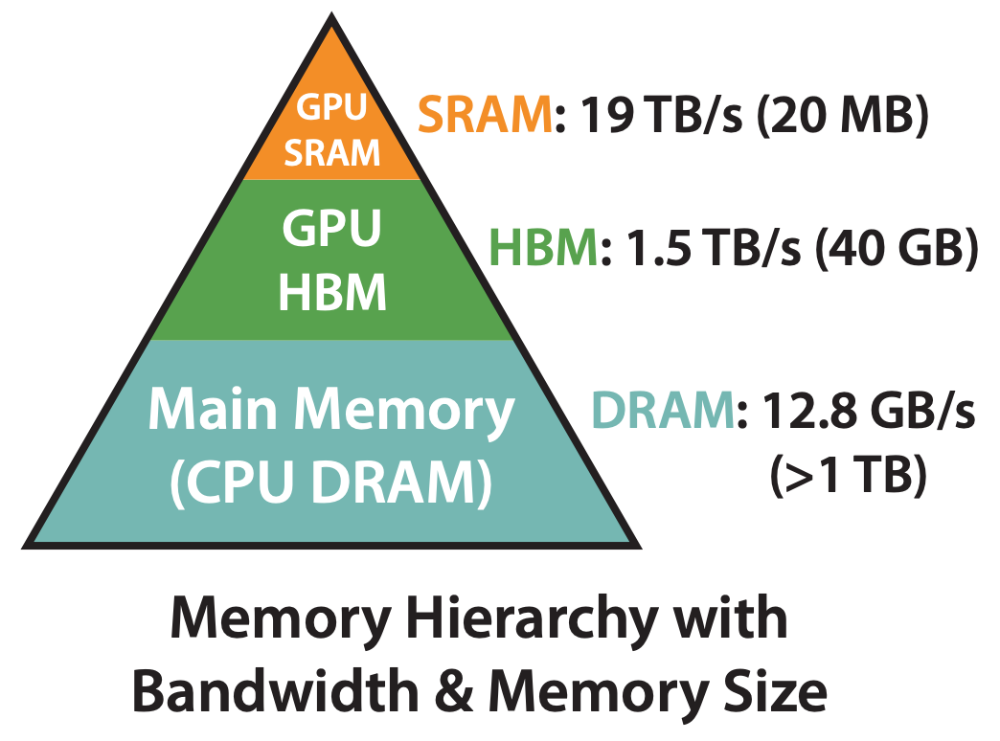

> 각 thread block의 SMEM 공간 크기는 kernel launch 전에 동적으로 지정할 수 있지만 상한이 있다. SM 아키텍처에 따라 단일 thread block이 할당받을 수 있는 최대 SMEM 공간도 보통 다르다. 예를 들어 SM80 아키텍처는 163 KB, SM90/SM100 아키텍처는 227 KB다.

같은 Bank의 서로 다른 주소에 대한 접근은 병렬로 처리할 수 없기 때문에, SMEM 성능을 충분히 활용하려면 보통 **Bank Conflict**를 피해야 한다. 그 의미는 이렇다. **같은 warp** 안의 여러 스레드가 **한 번의 transaction**에서 **같은 bank**의 **서로 다른 메모리 주소**에 접근하면 Bank Conflict가 발생한다. Bank Conflict가 발생하면 이 transaction은 하나의 wavefront에서 병렬로 실행될 수 없고, 하드웨어는 이를 여러 개의 독립적인 wavefront로 직렬화해야 하므로 유효 대역폭이 낮아진다.

Transaction의 개념은 노트 (4)에서 이미 소개했으니 여기서 다시 되짚어 본다.

> NV GPU는 SIMT 아키텍처를 채택하며, 한 warp의 32개 스레드가 메모리를 읽거나 쓰는 명령어를 동시에 실행하고, 하드웨어 차원에서는 이 warp의 한 번의 메모리 접근 요청을 여러 개의 **transaction**으로 병합한다.

SMEM에서 한 transaction의 데이터량은 최대 **128 bytes**이며, 메모리가 연속이거나 정렬되어 있을 것을 요구하지 않는다. 일반적으로 각 warp가 동시에 실행하는 하나의 메모리 접근 명령어(**instruction**)는 한 번의 메모리 접근 요청(**request**)에 대응하며, 하드웨어는 이 warp의 한 번의 요청을 128 bytes 단위로 여러 개의 **transaction**으로 병합한다. 예를 들어 각 스레드가 4 bytes에 접근하면 한 warp의 메모리 접근은 마침 128 bytes짜리 transaction 하나로 병합된다. 각 스레드가 8 bytes에 접근하면 한 warp의 메모리 접근은 transaction 2개로 병합되는데, T0-T15가 하나의 transaction이고 T16-T31이 하나의 transaction이다.

**Wavefront**는 L1/TEX 등 하드웨어가 한 번에 병렬로 처리하는 메모리 접근을 가리킨다. 하나의 wavefront는 한 클록 사이클 안에 완료되고, 서로 다른 wavefront는 서로 다른 클록 사이클에 직렬로 실행된다. 최적의 경우 하나의 transaction은 wavefront 하나만으로 완료할 수 있지만, Bank Conflict가 발생하면 이 transaction을 처리하는 데 여러 개의 wavefront가 필요하다.

---

Bank Conflict에 관해 세 가지에 유의해야 한다.

첫째, **Bank Conflict가 생기는지 여부는 transaction 단위로 판단한다.**NV 포럼에 참고할 만한 사례가 하나 있다: [https://forums.developer.nvidia.com/t/how-to-understand-the-bank-conflict-of-shared-mem/260900/8](https://forums.developer.nvidia.com/t/how-to-understand-the-bank-conflict-of-shared-mem/260900/8).

둘째, **SMEM이 관여하는 모든 메모리 접근 연산은, SMEM <-> GMEM 사이의 읽기 쓰기든 SMEM <-> RMEM (RF) 사이의 읽기 쓰기든 모두 Bank Conflict를 유발할 가능성이 있다**.

셋째, **SMEM에는 Broadcast와 Multicast 메커니즘이 있다.** 한 Warp 안의 모든 스레드가 접근하는 것이 같은 Bank의 **같은 주소**라면 하드웨어는 그 데이터를 요청한 모든 스레드에 Broadcast하며, 이는 하나의 wavefront에서 완료할 수 있고 충돌이 없다. 여러 스레드가 같은 Bank의 **같은 주소**에 접근하면 Multicast가 유발되며, 이 또한 하나의 wavefront에서 완료할 수 있다.

CUTLASS에서는 일반적으로 데이터에 메모리 배치 변환(**Swizzling**)을 가해 Bank Conflict 문제를 해결한다. CUTLASS에서 Swizzling의 세부 사항과 사용법은 다음 편 노트에서 소개하겠다. **이번 글에서는 먼저 CUTLASS에서 SMEM 관련 복사 연산을 어떻게 완료하는지에 집중한다.**

---

## 2. 2단계 Tiling 과 2단계 복사

GMEM -> RMEM 복사에 SMEM이라는 계층을 추가하고 나면, GMEM -> SMEM 그리고 SMEM -> RMEM 이라는 두 계층 복사의 TiledCopy를 어떻게 구성할지 고민해야 한다.

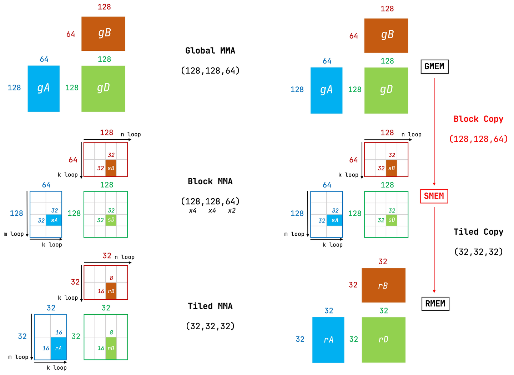

우리가 지금 해결해야 할 문제 규모는 `(128, 128, 64)` 라는 단일 Block 크기뿐이다. 단일 Block이 SMEM에 들어갈 수 있을 때는 한 번의 복사로 GMEM 위의 Block 데이터를 SMEM으로 옮길 수 있으며, 이것이 첫 번째 단계의 복사다. 그리고 SMEM -> RMEM 이라는 두 번째 단계의 복사는 사실 이전의 GMEM -> RMEM 과 유사하게, 삼중 루프로 SMEM의 각 Tile을 하나씩 RMEM으로 옮긴 다음 TiledMMA에 넘겨 행렬 연산을 하면 된다. 위 그림은 여기서 설명한 2단계 복사 과정을 보여 준다.

지적해 둘 만한 점은, 어느 단계의 복사든 매번 복사하는 데이터 규모는 TiledCopy의 파라미터에만 달려 있고 반드시 해당 계층의 MMA 규모와 같은 것은 아니라는 점이다. 다시 말해 **Block Copy의 규모는 Block MMA의 규모와 다를 수 있다**. 2번 또는 그 이상으로 나누어 복사하면서 매번 더 작은 규모의 TiledCopy로 데이터를 옮길 수 있기 때문이다. 마찬가지로 Tiled Copy의 규모도 Tiled MMA의 규모와 다를 수 있는데, 한 Tile의 복사를 여러 번에 나누어 완료할 수 있기 때문이다. 물론 레지스터가 충분하다면 한 번에 여러 Tile의 데이터를 복사할 수도 있다. 심지어 Copy의 규모가 같은 계층 MMA 규모로 나누어떨어지지 않아도 된다.

그 이유를 따져 보면, **Copy와 MMA의 규모는 CUTLASS에서 TiledCopy와 TiledMMA가 각각 확정하므로 이론상 규모를 임의로 설정할 수 있기** 때문이다. 다만 대부분의 경우 같은 계층의 Copy와 MMA 규모를 같게 두는데, 그래야 이해하고 다루기 쉽고, 더 세밀한 단위의 복사는 copy 루프를 수동으로 제어해 구현할 수 있기 때문이다(노트 5 참고).

이어서 위 그림에 따라 이 두 단계 복사의 TiledCopy를 구성해 보자.

---

## 3. Block Copy 구현

이번 편의 연산자 상세 내용은 앞 편과 같다.

| 항목 | 값 |
| --- | --- |
| 문제 규모 | `(128, 128, 64)` |
| 연산자 정밀도 | `BF16 = BF16 * BF16 + FP32` |
| Grid shape | `(1, 1, 1)` |
| Block shape | `(256, 1, 1)` |
| Block tile shape | `(128, 128, 64)` |
| Tiled MMA shape | `(32, 32, 32)` |
| MMA atom shape | `(16, 8, 16)` |

### 3.1 GMEM 에서 SMEM 으로 복사하기

첫 번째 단계 복사에서는 문제 규모가 `(128, 128, 64)` 인 데이터를 GMEM에서 SMEM으로 복사해야 하며, `gA`, `gB`, `gC` 세 행렬을 모두 복사해야 한다. 이 세 행렬을 복사하는 원리가 기본적으로 같으므로 여기서는 `gA` 행렬을 예로 들며, 그 형상은 `(128, 64)` 이다.

TiledCopy를 만드는 `make_tiled_copy` API를 되짚어 보면 세 개의 인자를 지정해야 한다.

1. **CopyAtom**, 즉 복사 명령어와 데이터 원소 타입
2. **ThrLayout**, 즉 몇 개의 스레드가 복사에 참여하는지, 그리고 스레드 배치는 어떠한지
3. **ValLayout**, 즉 각 스레드가 몇 개의 데이터 원소를 복사하는지, 그리고 데이터 원소 배치는 어떠한지

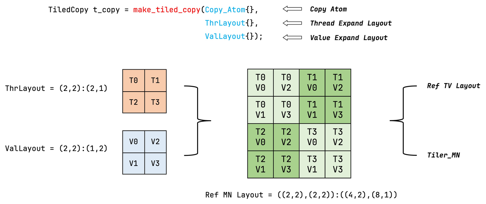

명령어 차원에서는 통상적인 `AutoVectorizingCopy`를 고를 수 있다. SM80에 GMEM -> SMEM 비동기 복사 명령어 `cp.async`가 새로 추가되었다는 점을 고려하면, 이 명령어는 GMEM에서 L2를 거쳐 SMEM으로 바로 복사할 수 있어 RMEM에서 데이터를 중계하는 것을 피할 수 있으므로 SM80에서는 보통 최적의 선택이다.

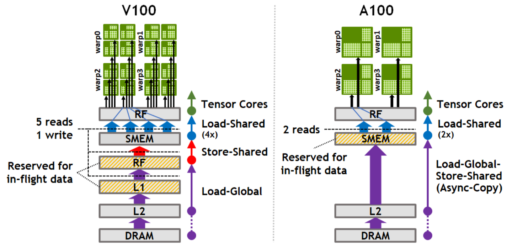

단일 `cp.async` 명령어는 128 bits의 vectorized 복사를 지원한다. 따라서 첫 번째 단계 복사의 명령어와 데이터 원소 타입은 다음과 같이 지정한다.

```cpp
using Copy_G2S_op = SM80_CP_ASYNC_CACHEGLOBAL<cute::uint128_t>;
using CopyA_G2S_atom = Copy_Atom<Copy_G2S_op, ComputeTypeA>;
```

명령어를 정하고 나면 나머지 두 인자인 ThrLayout과 ValLayout을 어떻게 정할지에는 여러 요소를 고려해야 한다. 이 두 인자를 논하기 전에 TiledCopy의 몇 가지 세부 사항을 보충할 필요가 있다.

---

ThrLayout과 ValLayout의 shape의 곱이 이 TiledCopy가 매번 복사하는 **기본 단위 블록(Copy Tile)**의 크기를 결정한다. 예를 들어 ThrLayout의 shape가 `(32, 8)` 이고 ValLayout의 shape가 `(1, 8)` 이면 Copy Tile의 크기는 `(32, 64)` 가 된다.

이 Tiler의 구성 과정은 소스 코드에서 볼 수 있다.

```cpp
template <class... Args,
          class ThrLayout,
          class ValLayout = Layout<_1>>
CUTE_HOST_DEVICE
auto
make_tiled_copy(Copy_Atom<Args...> const& copy_atom,
                ThrLayout          const& thr_layout = {},     // (m,n) -> thr_idx
                ValLayout          const& val_layout = {})     // (m,n) -> val_idx
{
  // Take the raked_products to compute the Layout_MN
  // (M,N) -> (thr_idx, val_idx)
  auto layout_mn = raked_product(thr_layout, val_layout);
  // (thr_idx, val_idx) -> (M,N)
  auto layout_tv = right_inverse(layout_mn).with_shape(make_shape(size(thr_layout), size(val_layout)));
  // Tiler for extracting relevant elements
  // (M,N) -> tensor coord
  auto tiler = product_each(shape(layout_mn));

  return make_tiled_copy_impl(copy_atom, layout_tv, tiler);
}
```

노트 (4)와 노트 (5)에서는 이 Copy Tile의 크기가 MMA Tile의 크기와 같았다. TiledMMA의 TV Layout을 TiledCopy에 그대로 넘겼기 때문이다.

```cpp
using TiledCopyA = decltype(make_tiled_copy_A(CopyA_atom{}, TiledMMA{}));
```

앞서 설명했듯이 Copy Tile은 실제로 임의로 지정할 수 있고 반드시 MMA Tile과 같을 필요는 없다. 다만 우리는 **TiledCopy를 세우는 과정에서 실제 복사에 참여하는 데이터 규모와 Layout이 어떠한지를 알지 못한다**는 점도 발견하게 된다. partition을 할 때에야 비로소 데이터 규모의 크기를 감지한다.

```cpp
typename Spec::TiledCopyA_G2S g2s_tiled_copy_a;
ThrCopy g2s_thr_copy_a = g2s_tiled_copy_a.get_slice(tid);
Tensor tAgA_g2s = g2s_thr_copy_a.partition_S(gA); // (CPY, CPY_M, CPY_K)
Tensor tAsA_g2s = g2s_thr_copy_a.partition_D(sA); // (CPY, CPY_M, CPY_K)
```

그러면 다음 몇 가지 경우가 있게 된다.

1. **복사해야 할 데이터 규모가 마침 Copy Tile과 같은 경우.**예를 들어 데이터 규모가 `(128, 64)` 이고 구성한 Copy Tile도 `(128, 64)` 인 경우다.
2. **복사해야 할 데이터 규모가 적어도 한 차원에서 Copy Tile보다 큰 경우.**예를 들어 데이터 규모가 `(128, 64)` 이고 구성한 Copy Tile이 `(64, 32)` 또는 `(96, 128)` 인 경우다.
3. **복사해야 할 데이터 규모가 적어도 한 차원에서 Copy Tile보다 작은 경우.**예를 들어 데이터 규모가 `(64, 64)` 이고 구성한 Copy Tile이 `(128, 32)` 또는 `(96, 128)` 인 경우다.

이 세 경우에 TiledCopy는 어떻게 복사를 완료할까?

1. 데이터 규모와 Copy Tile이 **완전히 같을** 때는 Tile 1개를 온전히 복사하기만 하면 되고 Tile 확장이 필요 없으므로 `CPY_M`, `CPY_K`는 모두 1이다.
2. 데이터 규모가 어떤 차원에서 Copy Tile보다 **클** 때는 그 차원에서 Tile 확장이 필요하며, 확장 크기는 `ceil_div`로 계산해 얻을 수 있다. 예를 들어 데이터 규모가 `(128, 64)` 이고 구성한 Copy Tile이 `(64, 32)` 일 때 확장 규모는 `(2, 2)` 이고, Copy Tile이 `(96, 32)` 일 때도 확장 규모는 `(2, 2)` 이다.
3. 데이터 규모가 어떤 차원에서 Copy Tile보다 **작을** 때는 그 차원에서 Tile을 확장할 필요가 없지만 범위 초과 문제가 생긴다. 예를 들어 데이터 규모가 `(64, 64)` 이고 Copy Tile이 `(128, 128)` 일 때는 두 차원 모두에서 메모리 접근 범위 초과가 발생한다.

CuTe가 제공하는 copy API는 for 루프로 여러 Tile의 복사를 완료해 준다. 노트 (5)의 방식을 본떠 이 for 루프를 수동으로 제어할 수도 있다. **그러나 어떤 차원이 나누어떨어지지 않으면 그 차원의 마지막 Tile을 복사할 때 범위 초과 문제가 생긴다.**

유의할 점은 범위 초과 문제가 생기면 소스 주소인 GMEM에서 데이터를 읽든 목표 주소인 SMEM에 데이터를 쓰든 모두 Illegal Memory Access (IMA) 오류를 낼 수 있다는 것이다. 그리고 **위에서 언급한 범위 초과 문제를 TiledCopy가 대신 처리해 주지는 않으므로 우리가 수동으로 판단해 피해야 한다**.

따라서 TiledCopy의 구성은 데이터 규모를 감지할 필요가 없지만, 우리는 여전히 **데이터 규모가 Copy Tile에 미치는 영향을 고려해야 한다**. 일반적으로 범위 초과 문제를 피하려면 Copy Tile의 규모가 데이터 규모를 나누어떨어지게 하면서 가능한 한 작아야 한다.

---

Copy Tile의 규모 외에 복사 명령어도 TiledCopy 구성에 영향을 주는 큰 요소다. 우리가 사용하는 복사 명령어 `cp.async`는 복사에 참여하는 128 bits가 **메모리상 연속**일 것을 요구한다. 따라서 GMEM의 행렬이 행 방향으로 연속이라면 우리의 ValLayout의 shape도 행 방향 복사로 설정해야 하며, 예를 들어 `(1, 8)` 이다. 반대로 GMEM의 행렬이 열 방향으로 연속이라면 shape도 열 방향 복사로 설정해야 하며, 예를 들어 `(8, 1)` 이다.

또한 각 원소가 2 bytes를 차지할 때 단일 128 bits 복사 명령어는 원소 8개를 복사하므로, **단일 스레드가 복사해야 할 원소 개수는 8의 배수여야 한다**. 그렇지 않으면 CuTe가 컴파일 시점에 오류를 낸다.

```text
copy_atom.hpp(206): error: static assertion failed with "TiledCopy uses too few vals for selected CopyAtom"
    static_assert(decltype(TiledNumVal{} % AtomNumVal{} == Int<0>{})::value, "TiledCopy uses too few vals for selected CopyAtom");
```

효율을 고려해 복사 과정에서 **메모리 접근 연속성**과 **하드웨어가 메모리 접근을 수행하는 최소 단위**에도 주목해야 한다. GMEM의 경우 메모리 접근의 최소 단위는 transaction이며 32 bytes다. L1 Cache와 L2 Cache의 경우 메모리 접근의 최소 단위는 Cache Line이며 그 크기는 모두 128 bytes다. 따라서 **하드웨어 대역폭을 효율적으로 활용하려면 하나의 Copy Tile의 데이터를 복사할 때 Tile의 데이터가 128 bytes 단위에서 메모리상 연속이 되도록 최대한 노력해야 한다**.

예를 들어 데이터가 행 방향으로 연속 저장되고 각 원소가 2 bytes를 차지한다고 가정하자. 데이터 규모가 `(128, 128)` 이고 Copy Tile의 규모가 `(128, 32)` 일 때 우리는 왼쪽에서 오른쪽으로 Tile 4개를 복사해야 하며, 각 Tile의 각 행은 메모리상 연속이다. 이때 한 행의 데이터량은 64 bytes로 메모리 접근 최소 단위인 128 bytes에 도달하지 못하므로 여기서 두 배의 잉여 메모리 접근이 생긴다. Copy Tile의 규모를 `(128, 64)` 로 설정하면 한 행의 데이터량이 128 bytes에 도달하며, 이때 메모리 접근이 가장 효율적이다.

---

정리하자면 ThrLayout과 ValLayout을 합리적으로 설정하려면 다음 세 가지 요소를 고려해야 한다.

1. **실제로 복사에 참여하는 데이터 규모를 고려해, 데이터 규모를 나누어떨어지게 하면서 가능한 한 작은 Copy Tile을 구성하여 범위 초과 문제를 피한다.**
2. **Copy Atom 명령어가 메모리 접근에 대해 요구하는 특수 조건을 고려한다.**
3. **메모리 접근 연속성이 복사 성능에 미치는 영향을 고려한다.**

`gA`를 복사하는 시나리오로 돌아오면, 여기서 `gA`의 shape는 `(kBlockM, kBlockK) = (128, 64)` 이고 메모리 배치는 행 방향 연속이다. 요소 1과 2를 고려해 ValLayout을 `(1,8):(1,0)` 으로 설정하면 원소 개수가 8의 배수라는 조건을 만족하면서 Copy Tile을 가능한 한 작게 유지할 수 있다. 요소 1과 3을 고려하면 ThrLayout의 두 번째 차원은 `min(kBlockK, 64) / 8` 로 설정할 수 있어 범위 초과 문제를 피하면서 메모리 접근 연속성을 최적화하며, 첫 번째 차원은 전체 스레드 수를 두 번째 차원으로 나눈 값이다.

```cpp
static constexpr int kThreadNum = size(TiledMMA{});
static constexpr int kBlockK_Copy = cute::min(64, kBlockK) / 8;

using TiledCopyA_G2S =
    decltype(make_tiled_copy(CopyA_G2S_atom{},
                              make_layout(make_shape(Int<kThreadNum / kBlockK_Copy>{}, Int<kBlockK_Copy>{}),
                                          make_stride(Int<kBlockK_Copy>{}, Int<1>{})),
                              make_layout(make_shape(Int<1>{}, Int<8>{}))));
```

### 3.2 SMEM 에서 RMEM 으로 복사하기

두 번째 단계 복사인 `SMEM -> RMEM` 의 규모는 곧 TiledMMA의 규모이며, TiledCopy의 구성 흐름은 앞서의 `GMEM -> RMEM` 과 같다. 더 나은 선택지가 있기는 하지만 여기서는 여전히 `AutoVectorizingCopy`를 복사 명령어로 사용한다.

```cpp
using Copy_S2R_op = AutoVectorizingCopy;
using CopyA_S2R_atom = Copy_Atom<Copy_S2R_op, ComputeTypeA>;
using TiledCopyA_S2R = decltype(make_tiled_copy_A(CopyA_S2R_atom{}, TiledMMA{}));
```

### 3.3 데이터를 GMEM 으로 되돌려 복사하기

MMA 계산이 끝나면 계산 결과를 RMEM에서 SMEM을 거쳐 GMEM으로 되돌려 복사해야 한다. 흐름은 앞서와 유사하며 복사 방향만 다르다.

```cpp
static constexpr int kBlockN_Copy = cute::min(64, kBlockN) / 8;

using Copy_R2S_op = AutoVectorizingCopy;
using Copy_S2G_op = AutoVectorizingCopy;
using CopyO_R2S_atom = Copy_Atom<Copy_R2S_op, OutType>;
using CopyO_S2G_atom = Copy_Atom<Copy_S2G_op, OutType>;

using TiledCopyO_R2S = decltype(make_tiled_copy_C(CopyO_R2S_atom{}, TiledMMA{}));
using TiledCopyO_S2G =
    decltype(make_tiled_copy(CopyO_S2G_atom{},
                              make_layout(make_shape(Int<kThreadNum / kBlockN_Copy>{}, Int<kBlockN_Copy>{}),
                                          make_stride(Int<kBlockN_Copy>{}, Int<1>{})),
                              make_layout(make_shape(Int<1>{}, Int<8>{}))));
```

### 3.4 SMEM 공간 생성하기

launch kernel 전에 필요한 SMEM 공간을 계산해 할당해 두어야 한다. MMA의 공식에서 보면 입력 A, B, C 행렬은 모두 GMEM에서 SMEM으로 옮겨야 하며, 이번 편에서는 각 행렬을 한 번에 SMEM으로 옮기므로 SMEM이 각 행렬에 할당하는 공간은 GMEM이 차지하는 공간과 같다. 출력 O 행렬도 SMEM을 거쳐야 하는데, 그 공간은 A, B, C의 공간을 재사용할 수 있다.

SMEM 위의 A, B, C, O 행렬의 Tensor를 작성해 이후 TiledCopy에 사용할 수 있다.

```cpp
using SmemLayoutA = decltype(make_layout(make_shape(Int<kTileM>{}, Int<kTileK>{}),
                                          make_stride(Int<kTileK>{}, Int<1>{})));
using SmemLayoutB = decltype(make_layout(make_shape(Int<kTileN>{}, Int<kTileK>{}),
                                          make_stride(Int<kTileK>{}, Int<1>{})));
using SmemLayoutC = decltype(make_layout(make_shape(Int<kTileM>{}, Int<kTileN>{}),
                                          make_stride(Int<kTileN>{}, Int<1>{})));
using SmemLayoutO =
    decltype(make_layout(make_shape(Int<kBlockM>{}, Int<kBlockN>{}), make_stride(Int<kBlockN>{}, Int<1>{})));
```

동시에 컴파일 시점에 할당해야 할 SMEM 공간을 계산해 낼 수 있다.

```cpp
static constexpr int kShmSizeA = cosize(SmemLayoutA{}) * sizeof(ComputeTypeA);
static constexpr int kShmSizeB = cosize(SmemLayoutB{}) * sizeof(ComputeTypeB);
static constexpr int kShmSizeC = cosize(SmemLayoutC{}) * sizeof(ComputeTypeC);
static constexpr int kShmSizeO = cosize(SmemLayoutO{}) * sizeof(OutType);

static constexpr int kShmSize = cute::max(kShmSizeA + kShmSizeB + kShmSizeC, kShmSizeO);
```

Kernel launch 시에는 `kShmSize`를 넘겨 SMEM 크기를 동적으로 지정해야 한다.

```cpp
int shm_size = Spec::kShmSize;

// Kernel launch
BOOL_SWITCH(is_gemm, IsGemm, [&] {
  cudaEventRecord(start, stream);
  if (shm_size >= 48 * 1024) {
    cudaFuncSetAttribute(block_copy<Spec, IsGemm, IsCvtPrecision>, cudaFuncAttributeMaxDynamicSharedMemorySize,
                        shm_size);
  }
  block_copy<Spec, IsGemm, IsCvtPrecision>
      <<<grid, block, shm_size, stream>>>(c.data_ptr(), a.data_ptr(), b.data_ptr(), M, N, K, out_ptr);
  cudaEventRecord(stop, stream);
});
```

### 3.5 Kernel 코드

Kernel 코드에서 SMEM과 관련된 것은 SMEM Tensor의 생성 흐름뿐이다. TiledCopy와 관련된 코드는 노트 (4)에서 이미 분석했으므로 여기서 더 설명하지 않는다.

```cpp
extern __shared__ __align__(1024) uint8_t smem[];

uint8_t *Aptr_smem = smem;
uint8_t *Bptr_smem = smem + kShmSizeA;
uint8_t *Cptr_smem = smem + kShmSizeA + kShmSizeB;
uint8_t *Optr_smem = smem;

Tensor sA = make_tensor(make_smem_ptr((ComputeTypeA *)Aptr_smem), SmemLayoutA{}); // (kBlockM, kBlockK)
Tensor sB = make_tensor(make_smem_ptr((ComputeTypeB *)Bptr_smem), SmemLayoutB{}); // (kBlockN, kBlockK)
Tensor sC = make_tensor(make_smem_ptr((ComputeTypeC *)Cptr_smem), SmemLayoutC{}); // (kBlockM, kBlockN)
Tensor sO = make_tensor(make_smem_ptr((OutType *)Optr_smem), SmemLayoutO{});      // (kBlockM, kBlockN)
```

---

## 4. NCU 연산자 분석

이번 편 노트에서는 주로 SMEM 관련 명령어와 통계 지표에 주목한다.

### 4.1 GMEM 에서 SMEM 으로의 복사

노트 (4)에서 우리는 MMA가 요구하는 데이터 배치의 영향에 제약을 받아 GMEM에서 RMEM으로 가는 복사에서 병합 메모리 접근을 할 수 없었다. SMEM을 도입한 뒤에는 GMEM에서 SMEM으로의 복사가 더 이상 MMA 명령어가 요구하는 데이터 배치와 결부되지 않으므로, 더 긴 워드 길이의 복사 명령어로 복사를 완료할 수 있고 앞서의 잉여 메모리 접근 문제도 해결된다.

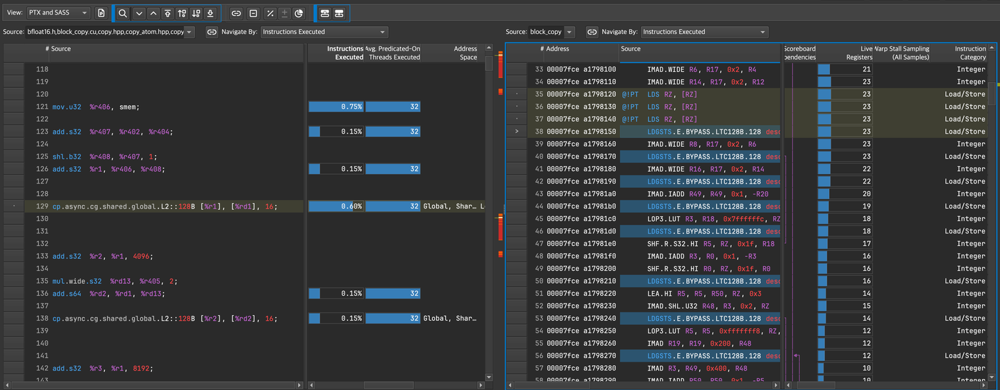

ncu가 보여 주는 SASS 코드에서 `cp.async`가 SASS 코드의 `LDGSTS` 명령어에 대응하고, ncu가 이 명령어의 메모리 접근 문제를 보고하지 않았음을 볼 수 있다. 분석해 보면 우리에게는 총 256개의 스레드가 있고 A, B 행렬의 규모는 모두 `(128, 64)` 이므로, 각 스레드는 GMEM에서 A 행렬 원소 32개와 B 행렬 원소 32개를 복사해야 하며 이는 `4 + 4 = 8` 개의 `cp.async` 명령어에 대응한다. 이는 그림의 `LDGSTS` 명령어 8개와 정확히 일치한다.

> `cp.async` 같은 비동기 명령어의 사용 방법과 동기화 메커니즘은 이후 노트에서 상세히 소개한다.

A 행렬을 예로 들어 `(16, 64)` 형상에서 SMEM의 메모리 배치 상황을 보여 주고, 그림에 복사 명령어의 커버 범위, transaction, wavefront, bank 관련 정보를 표시했다. 현재 `LDGSTS` 명령어가 양호한 메모리 접근 연속성을 갖추어 명령어 하나가 4개의 transaction으로 병합되고, transaction 1개가 마침 bank 32개에 써 넣으며 bank conflict가 생기지 않았음을 알 수 있다. 따라서 첫 번째 단계 복사의 성능은 이미 최적에 도달했다.

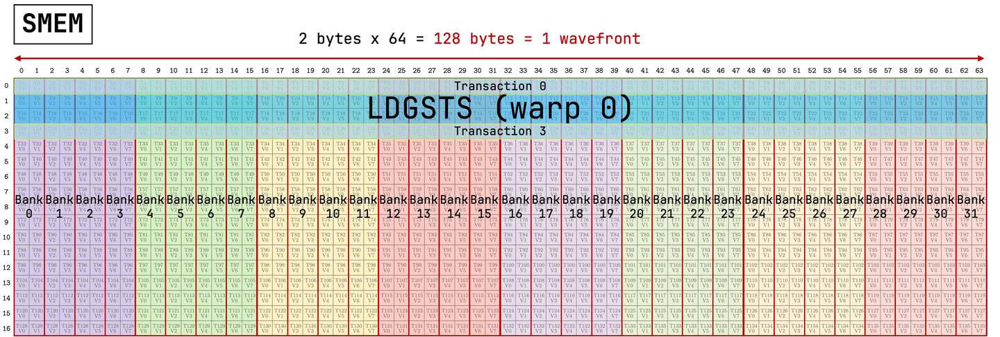

### 4.2 SMEM 에서 RMEM 으로의 복사

그러나 두 번째 단계 복사에서는 여전히 MMA가 요구하는 데이터 배치에 따라 스레드의 복사를 수행해야 한다. 따라서 SMEM에서 A 행렬의 한 Tile 데이터(규모는 `32x32`)를 읽을 때는 다음과 같은 상황이 된다.


이 경우 SMEM에서 데이터를 읽는 워드 길이가 MMA에 의해 32 bits로 제한되므로 `ld.shared.u32` / `LDS` 명령어만 사용할 수 있다. warp의 각 `ld.shared.u32` 메모리 접근 명령어가 모두 하나의 transaction으로 병합되지만, 이 transaction에서 같은 bank의 데이터 8개에 접근하므로 실제로는 wavefront 8개가 유발되고 각 wavefront가 16 bytes의 데이터를 병렬로 처리한다는 것을 알 수 있다.

이상적인 경우 하나의 transaction은 wavefront 하나만 병렬 처리하면 되지만, Bank Conflict가 생긴 상황에서는 wavefront 8개를 썼으므로 그중 `7/8` 의 wavefront가 잉여다. Ncu는 Bank Conflict가 발생한 명령어 자리에서 메모리 접근 문제를 알려 준다.

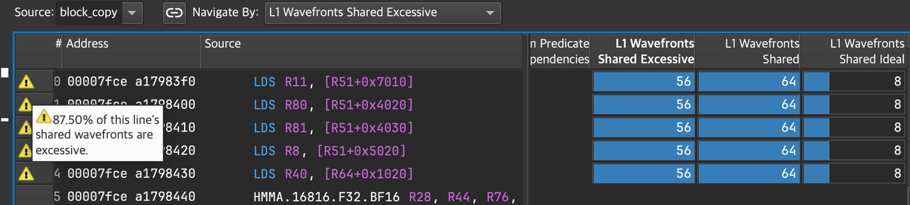

위 그림에서 각 SMEM 메모리 접근 명령어에 대응하는 **실제 wavefront 개수(L1 Wavefronts Shared)**, **이상적인 wavefront 개수(L1 Wavefronts Shared Ideal)**, 그리고 **둘의 차이(L1 Wavefronts Shared Excessive)**도 볼 수 있다. 차이가 0이 아니면 그 명령어에 Bank Conflict 문제가 발생했다는 뜻이다.

이번 편 노트의 시나리오에서는 총 8개의 warp가 있고 각 warp의 `LDS` 명령어가 transaction 1개로 병합되므로, 이상적인 경우 `LDS` 명령어 하나는 총 wavefront 8개로 처리하면 된다. 그러나 실제로는 `8x8 = 64` 개의 wavefront가 처리되어 56개가 더 발생했다.

### 4.3 SMEM 지표 분석

ncu에서는 SMEM 메모리 접근 상황의 표를 조회할 수 있으며, 아래 그림과 같다.

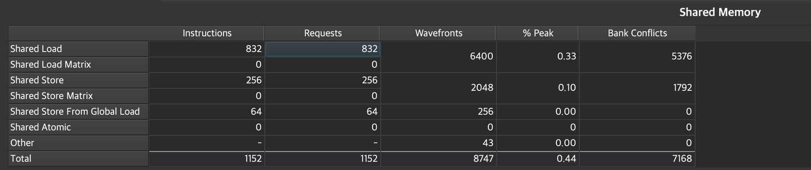

이어서 이 지표들이 어떻게 계산되어 나오는지 분석한다.

1. **Shared Load**는 LDS 관련 명령어에 대응하며, 이번 편 예제에서는 계산 전의 SMEM -> RMEM 그리고 계산 후의 SMEM -> GMEM 과 관련이 있다.

- SMEM -> RMEM 일 때, 문제 규모가 `(128, 128, 64)` 이고 TiledMMA 규모가 `(32, 32, 32)` 임을 고려하면 총 `(128x64) / (32x32) = 8` 개의 A Tile과 `(128x64) / (32x32) = 8` 개의 B Tile을 복사해야 하고, 각 warp는 각 A Tile에서 `16x16` 크기의 A fragment 2개(`LDS` 8개)를, 각 B Tile에서 `8x16` 크기의 B fragment 2개(`LDS` 4개)를 복사해야 한다. 따라서 각 warp는 총 `8x8 + 8x4 = 96` 개의 `LDS` 명령어를 실행해야 하고, warp 8개면 총 `96x8 = 768` 개의 명령어다.
- SMEM -> GMEM 일 때는 MMA의 데이터 배치에 제약받지 않으므로 `LDS.128` 명령어를 채택한다. 출력 데이터 형상이 `(128, 128)` 이므로 스레드 단위로 보면 총 `(128x128) / (128/8/2) = 2048` 번의 복사를 완료해야 하고, warp 단위로 보면 `2048/32 = 64` 개의 `LDS.128` 명령어를 실행해야 한다.

따라서 총 명령어 수는 `768 + 64 = 832` 개이며, 대부분의 경우 명령어 하나가 요청 하나에 대응하므로 총 요청 수도 832개다. SMEM -> RMEM 의 각 명령어는 transaction 1개를 처리했지만 bank conflict 때문에 wavefront 8개가 생겼고, SMEM -> GMEM 의 각 명령어는 transaction 4개를 처리해 wavefront 4개에 대응했다(bank conflict 없음)는 점에 유의하라. 따라서 총 wavefront 수는 `768x8 + 64x4 = 6400` 이며, 그중 bank conflict 때문에 `768x7 = 5376` 개의 wavefront가 더 발생했고 이것이 표의 Bank Conflicts 수에 대응한다.

2. **Shared Store**는 STS 관련 명령어에 대응하며, 이번 편 예제에서는 계산 후의 RMEM -> SMEM 과만 관련이 있다.

RMEM의 데이터 배치가 여전히 MMA의 제약을 받으므로 `STS` 명령어만 사용할 수 있다. 계산 과정은 위의 `SMEM -> GMEM` 과 유사하며, warp 단위로 보면 `(128x128) / (32/8/2) / 32 = 256` 개의 명령어를 실행해야 하고, 각 명령어는 transaction 1개와 wavefront 8개에 대응하므로 총 wavefront 수는 `256x8 = 2048` 이며, 그중 bank conflict 때문에 `256x7 = 1792` 개의 wavefront가 더 발생했다.

3. **Shared Store From Global Load**는 LDGSTS 관련 명령어에 대응하며, 이번 편 예제에서는 계산 전의 GMEM -> SMEM 과만 관련이 있다.

앞에서 각 warp가 `LDGSTS` 명령어 8개를 실행한다는 것을 이미 알았으므로 총 64개의 명령어가 실행되었고, 각 명령어는 transaction 4개와 wavefront 4개에 대응하므로 총 256개의 wavefront가 발생했으며 bank conflict는 없다.

위의 분석 과정에서 볼 수 있듯이, SMEM을 도입해 GMEM의 잉여 메모리 접근 문제는 피했지만 bank conflict라는 새로운 문제가 생겨 SMEM의 메모리 접근 효율을 크게 떨어뜨렸다. Swizzling 방식으로 이 문제를 계속 해결해 나가야 한다.

---

## 5. 정리

이번 편에서는 주로 Block 차원의 2단계 복사 흐름을 구현하고, SMEM의 특성과 ncu에서 SMEM을 분석하는 방법을 깊이 있게 분석했다.

다음 단계로 Swizzling의 기본 원리를 깊이 파고들어, CUTLASS에서 Swizzling 관련 컴포넌트를 올바르게 사용하는 방법을 소개하고, 최종적으로 SMEM에서 마주친 bank conflict 문제를 해결하겠다. 많은 기대 바란다!

**마지막으로, 여기까지 읽어 주셔서 감사하다! 이 글이 도움이 되었다면 좋아요를 눌러 주기 바란다. 고맙다～**

# CUTLASS 노트 (7): Swizzling

이번 편에서는 주로 SMEM Swizzling의 기본 원리와 요점을 소개하여 GEMM에서 SMEM의 Bank Conflict 메모리 접근 문제를 완전히 해결한다. Swizzling의 원리는 상대적으로 그리 복잡하지 않지만 유의해야 할 세부 사항이 비교적 많으니 인내심을 갖고 읽어 주기 바란다.

이번 편에서 사용하는 CUTLASS 버전은 4.5.0이고, 하드웨어 아키텍처는 SM90이다.

이 노트 시리즈의 관련 코드는 모두 오픈 소스로 공개되어 있다. 코드 저장소는 [cutlass-notes](https://github.com/ArthurinRUC/cutlass-notes) 이며, 많은 star 부탁드린다～

CUTLASS 노트 시리즈의 길잡이와 글 목록은 다음에서 자세히 볼 수 있다.

[CUTLASS 노트: 길잡이](https://zhuanlan.zhihu.com/p/1937220431728845963)

---

앞 편 노트에서 SMEM에서 RMEM으로 가는 두 번째 단계 복사를 처리할 때 Bank Conflict 문제가 나타났다.

[CUTLASS 노트 (6): Block Copy](https://zhuanlan.zhihu.com/p/2004627053077627913)

그 원인을 따져 보면 warp가 8x8 행렬에 병합해 접근하는데, 이 행렬의 원소가 모두 Bank 0에서 Bank 3에 위치하기 때문이다. 이상적인 경우 이 8x8 행렬로 구성된 transaction은 하나의 wavefront에서 완료되어야 하지만, Bank Conflict 때문에 wavefront 8개가 있어야 메모리 접근을 완료할 수 있다.

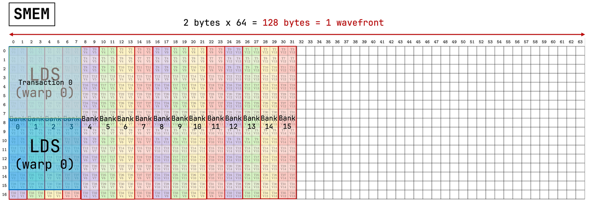

Bank Conflict 문제를 어떻게 해결해야 할까? 핵심 착상은 한 warp가 한 번의 transaction에서 접근하는 데이터를 서로 다른 32개 Bank에 분포시키는 것이며, 여기서 Core Matrix라는 개념이 등장한다.

## 1. Core Matrix 란 무엇인가

**Core Matrix는 일반적으로 8행 x 16 Bytes의 행렬을 가리키며**, MN-major라면 **16 Bytes x 8열의 행렬이다. Core Matrix는 보통 warp가 SMEM에 접근하는 기본 단위다.**예를 들어 위 그림에서 한 warp가 큰 행렬에서 작은 행렬 하나를 가져와 mma 명령어 연산을 완료하려 한다면, 먼저 LDS 명령어로 8x16B 행렬 하나를 읽게 된다. 지금은 원소 타입이 16 bits이므로 행렬 형상은 8x8이다.

> 주목할 만한 점은 LDS 명령어뿐 아니라 SM90이나 SM100의 wgmma, tcgen05.mma 명령어도 SMEM에서 데이터를 읽을 때 Core Matrix를 단위로 한다는 것이다. 따라서 이어지는 분석은 새 아키텍처의 SMEM Swizzling에도 적용된다.

Core Matrix 하나의 크기(128B)가 마침 한 번의 transaction의 메모리 접근 크기와 같다는 점에 주목하라. 따라서 하나의 Core Matrix를 서로 다른 32 Banks(32 Banks도 마찬가지로 128B 크기다!)에 분포시키기만 하면 Bank Conflict 문제를 완전히 해결할 수 있다.

보통 **Core Matrix의 각 행/열, 즉 16B라는 차원의 데이터 한 줄을 기본 단위 cell로 삼는다**. 각 cell 안의 원소는 논리적으로도 물리적으로도 연속이고, 한 cell 안의 원소 순서는 언제나 변하지 않는다. 왜 cell 하나의 크기를 4B나 8B 같은 다른 size가 아니라 16B로 고를까? 복사의 최대 폭이 연속된 128bits = 16B이고, 우리는 복사의 연속성을 보장해야 하므로 16B를 cell의 크기로 삼으면 각 폭의 복사 명령어와 호환될 수 있기 때문이다.

그림을 그려 보여 주기 편하도록, 특별한 설명이 없는 한 **이하에서는 Core Matrix가 K-major, 즉 행 방향 연속이고 각 네모 칸이 16B짜리 cell 하나를 나타낸다고 기본 가정한다**. 원소가 16bits인 경우라면 원소 8개가 cell 1개를 이룬다. 따라서 (8, 64) 행렬에 대해 cell로 표현한 배치를 다음과 같이 그릴 수 있다.

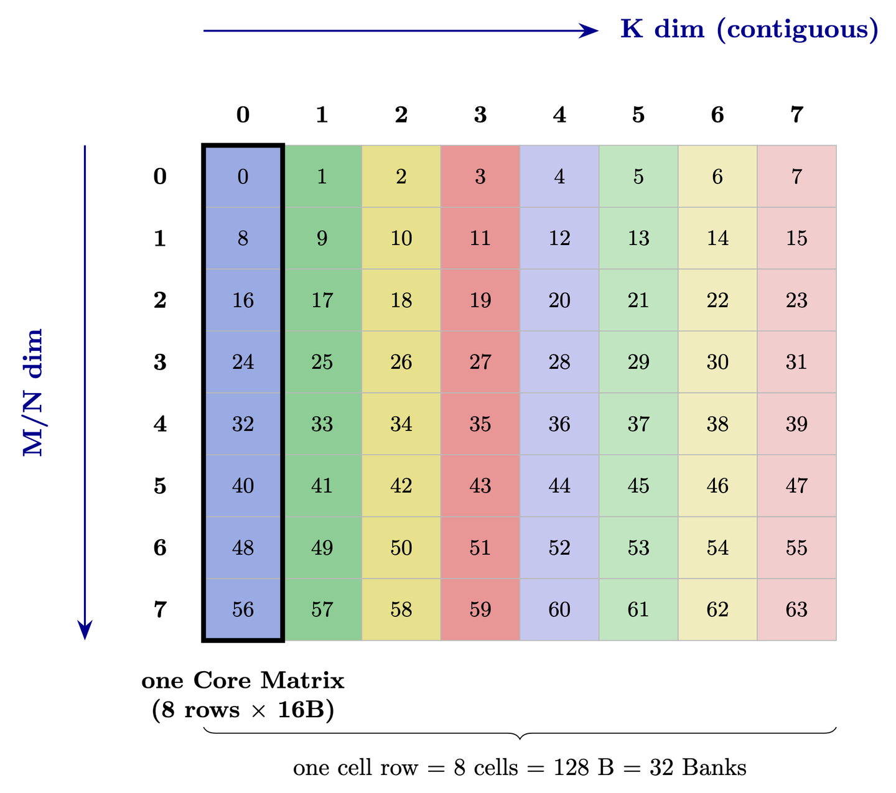

각 cell 안의 숫자는 메모리 주소를 나타낸다. 예를 들어 첫 행의 cell 0-7은 이들이 SMEM의 앞쪽 cell 8개에 놓인다는 뜻이며, 이는 마침 SMEM 한 행의 32 Banks 크기와 같다. 특히 유의할 점은 위 그림이 마침 이 행렬의 cell 논리 배치와 SMEM의 메모리 배치를 동시에 나타내고 있다는 것인데, 아래에서는 이 둘을 구분해 보여 주겠다.

## 2. Bank Conflict 문제를 해결하는 몇 가지 방안

위의 각 Core Matrix를 그대로 읽으면 모두 8-way Bank Conflict를 겪게 된다는 것은 분명하다. 현재 Core Matrix가 모두 특정한 몇 개의 Bank에 몰려 있으므로, 서로 다른 Bank로 흩뜨리기 위한 해결 방안에는 대략 다음 몇 가지가 있다.

1. **Interleaving**: Core Matrix를 같은 행의 32 Banks 위에 펼쳐 놓는다.

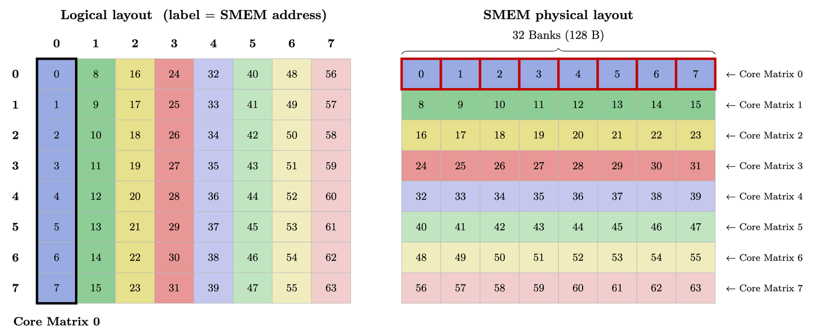

이 구현이 가장 직접적이고 간단하다. Core Matrix 하나의 8개 행이 각각 16B cell 하나씩을 차지해 자연스럽게 서로 다른 Bank에 놓이므로, SMEM에서 Core Matrix 하나를 **읽는** 데는 Bank Conflict가 전혀 없다.

단점도 뚜렷한데, GMEM에서 SMEM으로 쓰는 과정의 메모리 접근 성질이 좋지 않다는 점이다. warp가 GMEM에서 왼쪽 그림의 한 행 전체를 읽는다면 SMEM에 **쓸** 때는 같은 열의 Bank에 쓰게 되므로 마찬가지로 Bank Conflict가 발생한다. warp가 GMEM에서 한 열 전체를 읽는다면 SMEM에 쓸 때 Bank Conflict는 확실히 없지만, L2 Cache Line의 단위가 128B이므로 한 열의 Core Matrix를 읽을 때 행렬 전체를 Cache에 로드해야 해서 이 또한 비효율적이다.

그래서 Interleave 방안은 기본적으로 행렬의 K 차원에 cell(16B)이 하나뿐인 시나리오에서만 쓰인다. 이런 시나리오에서는 하나의 Core Matrix가 GMEM에서도 SMEM에서도 메모리상 연속이기 때문이다.

---

2. **Padding**: SMEM에서 32 Banks마다 한 구간의 메모리 공간을 비워 두고 아무 데이터도 채우지 않는다. 이렇게 하면 원래 같은 열의 같은 Bank에 있던 데이터가 이제는 서로 다른 Bank에 놓이게 된다.

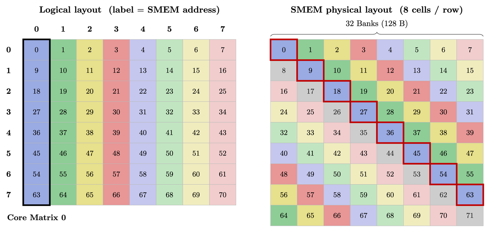

이 방식은 구현이 비교적 간단하다. SMEM 주소에 offset을 더하거나, 2차원 SMEM 배열을 만들 때 K 차원의 shape에 cell 하나의 크기를 더하면 된다. padding이 GMEM과 SMEM 모두에 좋은 메모리 접근 성질을 줄 수는 있지만 SMEM 공간의 일부를 낭비해 occupancy를 떨어뜨리기 쉽다. 더 결정적인 것은 복사 포인터의 128B 정렬 성질을 깨뜨려 최신 하드웨어 명령어 일부에는 쓸 수 없다는 점이다. 그래서 이런 구현은 예전 코드에서만 볼 수 있다.

---

3. **Swizzling**: Core Matrix 각 행의 cell을 다른 Core Matrix의 대응 행의 cell과 행 간 재배열하여, 최종적으로 임의의 Core Matrix가 서로 다른 32 Bank에 분포하게 한다.

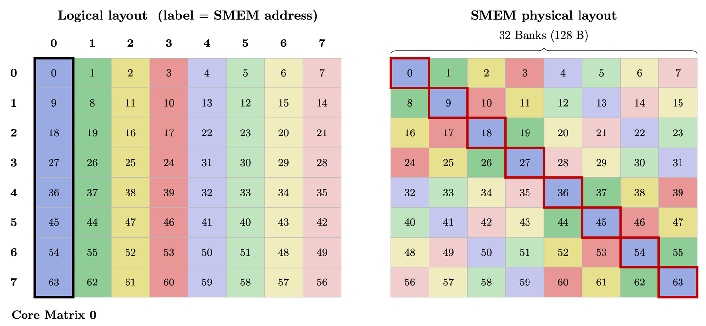

SMEM의 배치로 말하자면 임의의 **라틴 방진**(즉 각 행과 각 열에 같은 색 cell이 없는 것) 하나만 만들어 내면 되므로, Swizzle의 배치 방식은 유일하지 않다. 구체적으로 오른쪽 그림에서 임의의 두 행이나 두 열을 교환해도 요구 조건을 만족한다.

위의 두 방안과 비교했을 때 Swizzle의 장점은 다음과 같다. 1) cell이 행 간 재배열되므로 순서가 뒤섞인 cell이 모두 같은 Cache Line 안에 있어 GMEM의 메모리 접근 성질이 좋고, 동시에 SMEM의 읽기 쓰기에도 Bank Conflict가 발생하지 않는다. 2) SMEM 공간을 낭비하지 않는다. 3) 데이터의 연속성과 헤드 포인터의 정렬성을 유지하여 더 고급의 하드웨어 명령어에 맞출 수 있다.

단점은 Swizzle의 계산 로직이 다소 복잡해지고 특정한 행렬 pattern에만 맞출 수 있다는 점이다. 행렬의 cell 배치가 8x5라면 꽤 좋은 Swizzle pattern을 구성하기가 매우 어렵다. 그럼에도 Swizzle은 위 방안들의 모든 문제를 해결했고, 우리는 보통 8x5 같은 기묘한 배치를 구성하지 않으며 대개 2의 거듭제곱으로 Block 형상을 정한다. 그래서 Swizzle은 현재 Bank Conflict를 해결하는 최선의 방안이다.

## 3. 몇 가지 Swizzle Mode 소개

위에서는 행렬의 cell 형상이 8x8이라고 가정했다. 그러면 행렬의 형상이 8x8보다 크면 어떻게 해야 할까? 이 8x8 Pattern을 하나의 **Swizzle Layout Atom**으로 삼아 행과 열 차원에서 이 Atom을 반복하기만 하면 된다.

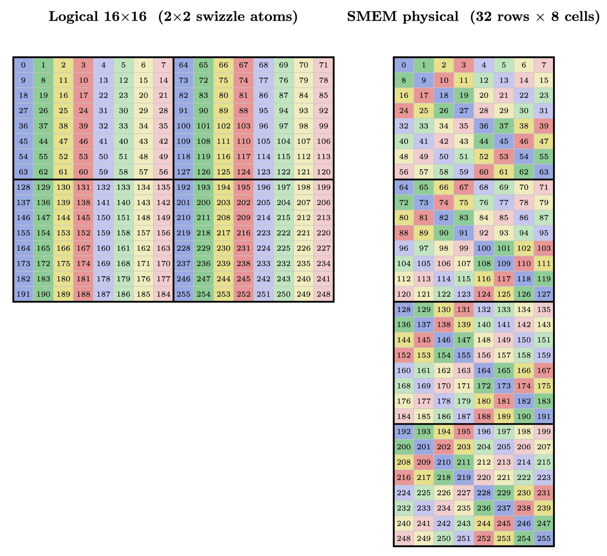

행렬의 형상이 8x8보다 작으면 또 어떻게 해야 할까? 먼저 행 차원이 8보다 작다면 남는 행을 잘라 내기만 하면 되고 메모리의 연속성이 깨지지 않는다. 그러나 열 차원이 8보다 작다면 남는 열을 단순히 잘라 낼 수 없다. cell이 이미 한 행 안에서 뒤섞여 있으므로 남는 열을 잘라 내면 SMEM 중간에 구멍이 생겨, GMEM에서 SMEM으로 쓰는 과정에 매우 불리하기 때문이다.

따라서 열 차원이 8 cells보다 작은 경우에는 다른 Swizzle Layout Atom을 설계해야 하며, 여기서 서로 다른 Swizzle Mode가 대응된다. 위에서 보여 준 Swizzle은 **128B Swizzle Mode**(with 16B atomicity)이며, 128B는 열 차원의 크기, 즉 8 cells를 나타내고, 16B atomicity는 cell 하나의 크기를 가리킨다.

현재 고급 하드웨어 명령어가 지원하는 Swizzle Mode에는 다음이 있다(atomicity가 명시되지 않은 것은 기본이 16B atomicity다).

- 128B Swizzle Mode
- 128B Swizzle Mode（with 32B atomicity）
- 64B Swizzle Mode
- 32B Swizzle Mode
- No Swizzling / Interleaving

**64B Swizzle Mode**는 일반적으로 열 차원 = 64B인 시나리오에 쓰이며, 그 형상은 다음과 같다.

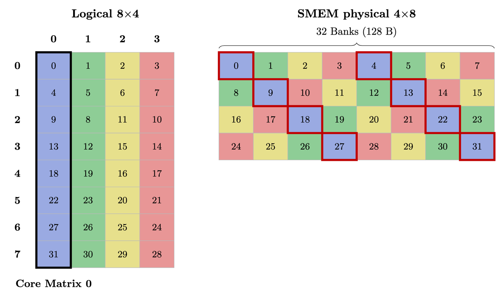

**32B Swizzle Mode**는 일반적으로 열 차원 = 32B인 시나리오에 쓰이며, 그 형상은 다음과 같다.

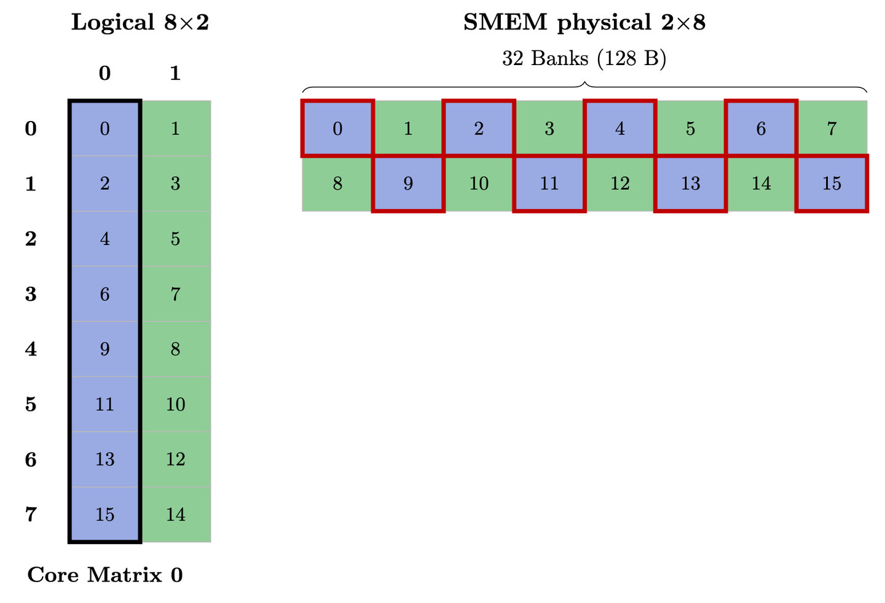

그리고 **No Swizzling**, 즉 위에서 소개한 **Interleaving** 방안은 특수한 16B Swizzle Mode로 볼 수 있으며, 일반적으로 열 차원 = 16B인 시나리오에 쓰인다. 그 형상은 다음과 같다.

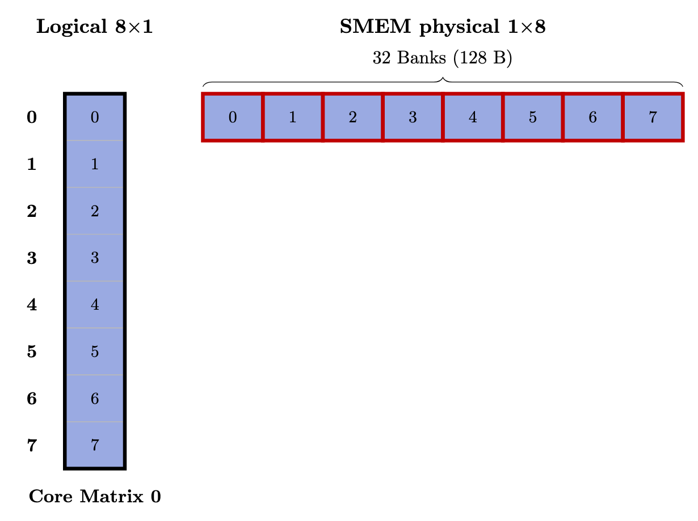

8x5짜리 80B Swizzle Mode를 설계할 수도 있을까? 물론 가능하다! 실제로 8x5 행렬이라면 `gcd(8,5)=1` 이므로 Swizzling을 할 필요가 전혀 없고, 논리 행렬의 cell을 순서대로 SMEM에 펼쳐 놓기만 해도 Bank Conflict를 피할 수 있다. 다만 이런 이형 Layout Atom은 정말 흔치 않고 하드웨어 명령어도 지원하지 않는다……

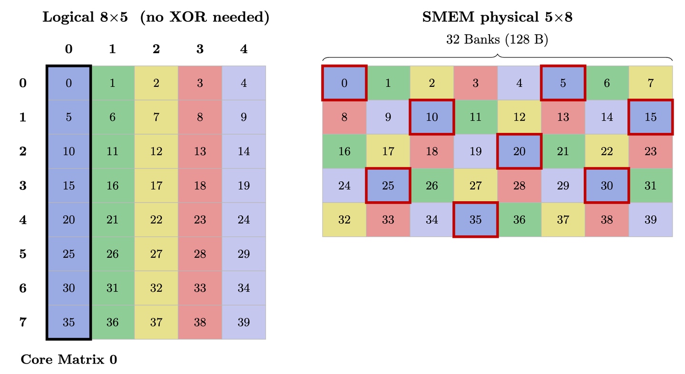

PTX 문서에는 96B Swizzle Mode와 128B Swizzle Mode의 32B atomicity + 8B flip 및 64B atomicity도 열거되어 있지만, 현재 이 몇 가지 Mode를 지원하는 하드웨어 명령어는 없다.

## 4. Swizzle 의 파라미터 표기법

CUTLASS에서는 `Swizzle<B,M,S>`로 하나의 Swizzle Layout Atom에 대응하는 Swizzle Mode를 나타낸다. 여기서 M은 cell의 크기가 $2^M$ 임을 나타내고, S는 SMEM 한 행의 32 Banks 안에 $2^S$ 개의 cell이 있음을 나타내며, B는 이 Swizzle Layout Atom이 SMEM에서 $2^B$ 개의 행을 가짐을 나타낸다.

주목할 만한 점은 문맥에 따라 cell의 크기가 때로는 원소 개수를 가리키고 때로는 바이트 Bytes를 가리키므로, 대응하는 M 계수도 문맥에 따라 달라질 수 있다는 것이다.

cell의 크기를 Bytes로 가리킬 때 각 Swizzle Mode에 대응하는 파라미터 표기는 아래 표와 같다.

| Swizzle Mode | Swizzle<B,M,S> |
| --- | --- |
| 128B Swizzle Mode | Swizzle<3,4,3> |
| 128B Swizzle Mode（with 32B atomicity） | Swizzle<2,5,2> |
| 64B Swizzle Mode | Swizzle<2,4,3> |
| 32B Swizzle Mode | Swizzle<1,4,3> |
| No Swizzling / Interleaving | Swizzle<0,4,3> |

Swizzle Layout Atom에는 반드시 만족하는 수량 관계가 하나 있다. $B \le S$ 이다. $B \gt S$ 일 때는 SMEM의 행 수가 각 행의 cell 수보다 커지므로, SMEM의 각 cell 열에는 반드시 같은 Core Matrix에 속하는 cell이 2개 있게 되어 Bank Conflict를 일으킨다. 따라서 Swizzle Layout Atom을 구성하는 전제 조건을 만족하지 못한다.

## 5. Swizzle 의 계산 로직

Swizzle은 계산 차원에서 본질적으로 하나의 매핑일 뿐이다. 즉 (m, n) 좌표에서 SMEM Address로 가는 Tensor Layout 매핑 위에 **Old Address에서 New Address로 가는 매핑**을 하나 더 얹은 것이며, 이렇게 구성된 복합 매핑이 원소 좌표를 SMEM 위의 새로운 주소로 대응시킨다.

Swizzle의 방식이 유일하지 않다는 것은 알고 있지만, 하드웨어 명령어가 제공하는 Swizzle Mode는 유일하게 확정된 Swizzle 방식이며 그것이 바로 위에서 보여 준 Layout이다. 128B Swizzle Mode를 예로 들어 보자.

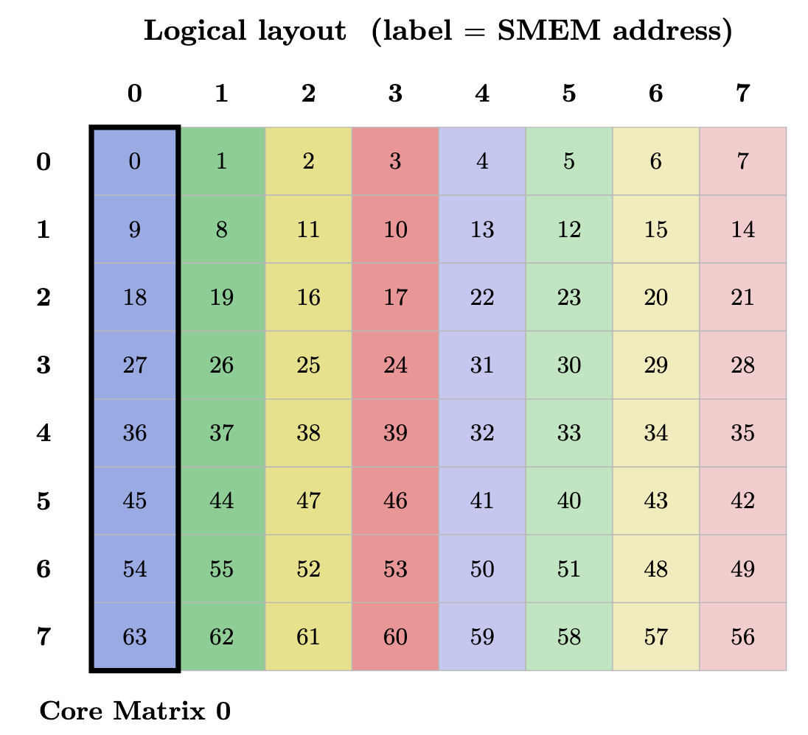

Swizzle을 하지 않는다면 좌표 또는 index에서 SMEM address로 가는 매핑은 마침 항등 매핑 $f(i) = i$ 이다. Swizzle을 넣으면 매핑은 $\mathrm{Sw}_{\langle B,M,S \rangle} (f(i))$ 가 되고, 이는 $\mathrm{Sw}_{\langle B,M,S \rangle} (i)$ 와 등가다. 위 그림이 바로 128B Swizzle Mode에 대응하는 Sw<3,4,3> 의 매핑 관계다.

CUTLASS에서 Sw<B,M,S> 의 코드는 다음과 같다.

```cpp
template <int B, int M, int S = B>
struct Swizzle {
  static constexpr int bit_msk = (1 << B) - 1;
  static constexpr int yyy_msk = bit_msk << (M + max(0, S));
  static constexpr int zzz_msk = bit_msk << (M - min(0, S));
  static constexpr int msk_sft = S;

  template <class Offset>
  static constexpr auto apply(Offset const& offset) {
    return offset ^ shiftr(offset & yyy_msk, msk_sft);   // ZZZ ^= YYY
  }
};
```

S가 음수가 아니라고 가정하면 Sw<B,M,S> 의 매핑은 다음 수학 공식으로 나타낼 수 있다. $\mathrm{Sw}_{\langle B,M,S\rangle}(\mathrm{offset}) = \mathrm{offset}\;\oplus\; \Bigl(\bigl(\mathrm{offset}\,\wedge\,(2^{B}{-}1)\cdot 2^{\,M+S}\bigr)\;\gg\;S\Bigr)$

여기서 $\oplus$ 는 bitwise 배타적 논리합(XOR) 연산을, $\wedge$ 는 bitwise AND 연산을, $\gg$ 는 우측 시프트 연산을 나타낸다.

이 공식을 어떻게 이해해야 할까? 먼저 offset, 즉 좌표에 대응하는 index를 bit 차원에서 세 구간으로 분해한다.

1. `bits [0, M-1]`: 가장 낮은 M bits는 하나의 cell 안에서의 원소 또는 bytes의 offset을 나타낸다. 우리는 Swizzle 할 때 cell을 기본 단위로 삼으므로 이 구간의 데이터는 수정하지 않는다.

2. `bits [M, M+S-1]`: M bits 위의 S bits는 이 cell이 SMEM의 몇 번째 열에 있는지를 나타낸다. 그중 이 S bits의 하위 B bits가 Swizzle 과정에서 유일하게 수정되는 부분이고, 나머지 부분은 수정되지 않는다.

3. `bits [M+S, ..]`: 남은 모든 bits는 이 cell이 SMEM의 몇 번째 행에 있는지를 나타낸다. 우리는 Swizzle Layout Atom의 매핑만 알면 되므로 가장 낮은 B bits만 보면 되며, 이는 이 cell이 하나의 Atom 안에서 SMEM의 몇 번째 행에 위치하는지를 나타낸다.

아래 그림처럼 공식은 크게 세 단계로 나뉜다. 1) AND 연산으로 YYY 부분, 즉 행 번호를 추출한다. 2) 행 번호를 우측 시프트하여 최하위 비트를 ZZZ와 정렬한다. 3) **행 번호와 열 번호의 하위 B bits를 XOR 연산한다**. 3단계가 실제로는 cell이 SMEM 같은 행 안에서 위치를 바꾸는 것임을 알 수 있다.

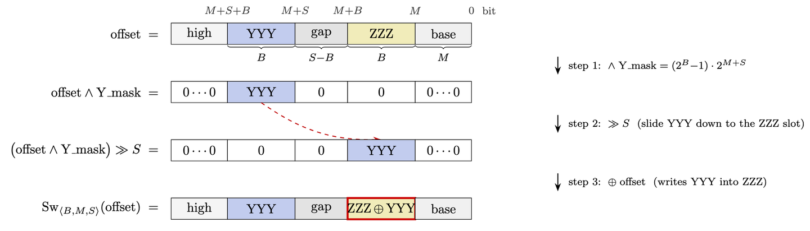

그렇다면 왜 XOR로 우리가 원하는 이런 Swizzle 매핑을 구현할 수 있을까?

먼저 XOR 연산의 정의역이 $[0, 2^N)$ 이라면 그 공역도 정의역과 완전히 같은 $[0, 2^N)$ 이다. 다음으로 XOR 연산에는 가역성이 있다.

$(x\oplus k)\oplus k \;=\; x\oplus (k\oplus k) \;=\; x\oplus 0 \;=\; x$

여기서 $x$ 는 SMEM의 열 번호를, $k$ 는 행 번호를 나타낸다. $x$ 가 $x \oplus k$ 로 매핑될 때 $x \oplus k$ 도 $x$ 로 매핑된다는 것을 알 수 있다. 따라서 XOR 연산은 실제로 수열의 두 원소의 위치를 교환한 것이다. **이상의 두 가지가 XOR 연산이 cell의 행 간 재배열을 구현함을 증명한다.**

마지막으로 서로 다른 $k_1 \ne k_2$ 와 임의의 열 번호 $x$ 에 대해 $g_k(x) = x \oplus k$ 라 두면 다음이 성립한다.

$g_{k_1}(x)\oplus g_{k_2}(x) \;=\;(x\oplus k_1)\oplus(x\oplus k_2)\;=\;k_1\oplus k_2\;\neq\;0$

이로부터 $g_{k_1}(x)\neq g_{k_2}(x)$ 임을 알 수 있다. 즉 서로 다른 두 행 번호 $k$ 를 임의로 주었을 때 임의의 열 번호 $x$ 에 대해 XOR 연산으로 매핑되는 새 열 번호도 반드시 서로 다르다. **이 점이 XOR 연산이 임의의 Core Matrix를 서로 다른 32 Banks로 매핑할 수 있음을 증명한다.**

따라서 **Swizzle의 핵심 연산은 곧 XOR 연산이다!** 라고 볼 수 있다.

## 6. 코드 해설

이어서 CUTLASS에서 SMEM Swizzling을 구현한다. 이번 편에서 개발할 연산자의 상세 내용은 앞서와 같다.

|  |  |
| --- | --- |
| 문제 규모 | (128, 128, 64) |
| 연산자 정밀도 | BF16 = BF16 \* BF16 + FP32 |
| Grid shape | (1, 1, 1) |
| Block shape | (256, 1, 1) |
| Block tile shape | (128, 128, 64) |
| Tiled MMA shape | (32, 32, 32) |
| MMA atom shape | (16, 8, 16) |

Swizzle은 SMEM Tensor Layout 위에 매핑을 하나 더 얹는 것이므로, 앞 편을 기반으로 SMEM Tensor에 composition 복합 함수 연산을 해 주어야 한다. 먼저 composition이 이미 적용된 SMEM Layout Atom을 하나 구성한다.

```python
swz = cute.make_swizzle(3, 3, 3)
inner_AB = min(64, K)
atom_AB = cute.make_composed_layout(
    swz,
    0,
    cute.make_layout((8, inner_AB), stride=(inner_AB, 1)),
)
```

여기서 Atom을 구성할 때 유의할 점은, Layout이 원소를 단위로 표현되고 중간에 타입 변환이 없으므로 우리의 Swizzle 파라미터도 원소를 단위로 써야 한다는 것이다. 그래서 여기서는 Sw<3,3,3> 이다. Atom이 K 차원에서 원소 64개(128B)보다 작을 수는 있지만 여전히 Sw<3,3,3> 과 호환되며, 뒤쪽 몇몇 행의 매핑이 쓰이지 않을 뿐이다.

그다음 이 Atom을 기반으로 SMEM Layout 전체로 확장한다.

```text
sA_layout = cute.tile_to_shape(atom_AB, (M, K), order=(0, 1))
sB_layout = cute.tile_to_shape(atom_AB, (N, K), order=(0, 1))
```

이 사례에서는 `ldmatrix` 계열 명령어를 사용했다. 이는 Tensor Core MMA를 위해 맞춤 설계된 warp 단위 협업 로드 명령어로, 하드웨어 차원에서 SMEM에서 RMEM으로의 복사를 완료하며 레지스터 배치가 마침 mma.m16n8k16 등의 명령어가 기대하는 형태라 프로그래머가 직접 (t, v) 매핑을 계산할 필요가 없다. (물론 이 명령어는 새 하드웨어에서는 사실상 쓸 자리가 없어졌다)

```python
ldm_op_ab = cute.nvgpu.warp.LdMatrix8x8x16bOp(False, 4)
s2r_atom_a = cute.make_copy_atom(ldm_op_ab, mA.element_type)
s2r_atom_b = cute.make_copy_atom(ldm_op_ab, mB.element_type)
```

나머지 코드 부분은 앞서와 같다.

ncu에서 마침내 Bank Conflicts의 카운트가 0이 된 것을 보게 되었다!

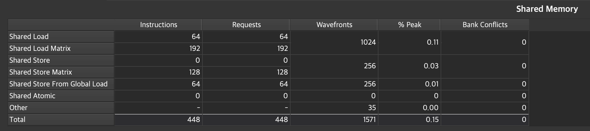

## 7. 정리

이번 편에서는 주로 Swizzling의 기본 원리를 소개하고, Swizzling을 우리의 SMEM 메모리 접근에 도입하여 Bank Conflict 문제를 완전히 해결했다!

지금까지 우리 노트는 GEMM 연산 규모를 하나의 Block 차원에 고정해 두었고, 이 Block의 크기도 128x128x64로 고정되어 있었다. 그러나 실제 행렬 연산에서 입력 행렬의 크기는 보통 동적이다. 따라서 다음 편에서는 고정 shape에서 벗어나 임의 규모에 대응하는 GEMM 연산자를 구현하겠다. 많은 기대 바란다!

[CUTLASS 노트 (8): Dynamic MMA](https://zhuanlan.zhihu.com/p/2043008556031595310)

**마지막으로, 여기까지 읽어 주셔서 감사하다! 이 글이 도움이 되었다면 좋아요를 눌러 주기 바란다. 고맙다～**

# CUTLASS 노트 (8): Dynamic MMA

이번 편에서는 동적 크기를 지원하는 GEMM 연산자를 구현하여 GEMM을 Block 차원에서 Global 차원으로 확장하고 연산자를 더 범용적으로 만든다. 또한 앞선 노트에서 건너뛴 몇 가지 세부 사항과 요점도 보충한다. TiledCopy partition 후의 Tensor 차원을 어떻게 읽는지, Occupancy와 그것이 성능에 미치는 영향은 무엇인지, Bank Conflict가 있는지를 어떻게 올바르게 판정하는지 등이다.

이번 편에서 사용하는 CUTLASS 버전은 4.5.0이고, 하드웨어 아키텍처는 SM90이다.

이 노트 시리즈의 관련 코드는 모두 오픈 소스로 공개되어 있다. 코드 저장소는 [cutlass-notes](https://github.com/ArthurinRUC/cutlass-notes) 이며, 많은 star 부탁드린다～

CUTLASS 노트 시리즈의 길잡이와 글 목록은 다음에서 자세히 볼 수 있다.

[CUTLASS 노트: 길잡이](https://zhuanlan.zhihu.com/p/1937220431728845963)

---

앞 편 노트에서 우리는 SMEM Swizzling으로 Bank Conflict 문제를 성공적으로 해결했고, 여기까지 오면서 단일 Block의 성능은 이미 상당히 좋아졌다.

[CUTLASS 노트 (7): Swizzling](https://zhuanlan.zhihu.com/p/2040504410799862383)

이번 편에서는 정적인 GEMM 규모를 동적이고 임의의 shape를 지원하는 GEMM으로 확장한다. 먼저 3단계 Tiling을 되짚어 보자.

## 1. GEMM 의 3단계 Tiling 되짚기

노트 (3)에서 Global에서 Block으로, Block에서 Tile로, 그리고 Tile에서 Atom으로 가는 3단계 Tiling을 이미 소개했다. 앞선 노트들에서 우리는 뒤의 두 단계 Tiling 구성을 완료해 단일 Block 차원의 GEMM 연산을 구현했다. 이번 편에서는 남은 한 단계의 Tiling, 즉 단일 Block에서 동적 규모의 Global GEMM으로 확장하는 것을 구현한다.

[CUTLASS 노트 (3): Tiled MMA](https://zhuanlan.zhihu.com/p/1950555644814946318)

3단계 Tiling의 각 계층은 GPU 하드웨어의 서로 다른 차원의 계산 능력과 저장 능력에 대응한다. Atom에서 Tile로 확장하는 과정에서는 하나의 SM 위 여러 SubCore(그리고 그 안의 Tensor Core)의 병렬 계산 능력을 활용했다. Tile에서 Block으로 확장하는 과정에서는 SMEM이라는 중간 저장 계층을 활용해 데이터 재사용을 구현했다. 그렇다면 Block에서 Global로 확장하는 과정에서는 SM 차원의 병렬도를 충분히 활용해, 여러 Block을 만들어 GEMM 계산을 병렬로 완료해야 한다.

3단계 Tiling의 청사진에 따르면, 아래 그림처럼 Block에서 Global로 확장할 때 각 Block은 보통 output 행렬 분할 하나의 계산을 담당한다. 즉 A 행렬의 한 행 전체 (128, K)와 B 행렬의 한 열 전체 (K, 128) 사이의 GEMM을 계산한다. K 차원이 매우 클 수 있으므로 보통 계산에 참여하는 A/B 행렬 조각을 한 번 더 블록으로 나누고, 계산할 때 K 차원을 따라 Block MMA를 하나씩 루프로 계산하며 계산 결과를 이전 라운드 결과 위에 누산하여 단일 output 행렬 분할의 계산을 완료한다. 서로 다른 output 행렬 분할은 서로 다른 Block에 맡겨 병렬로 계산한다.

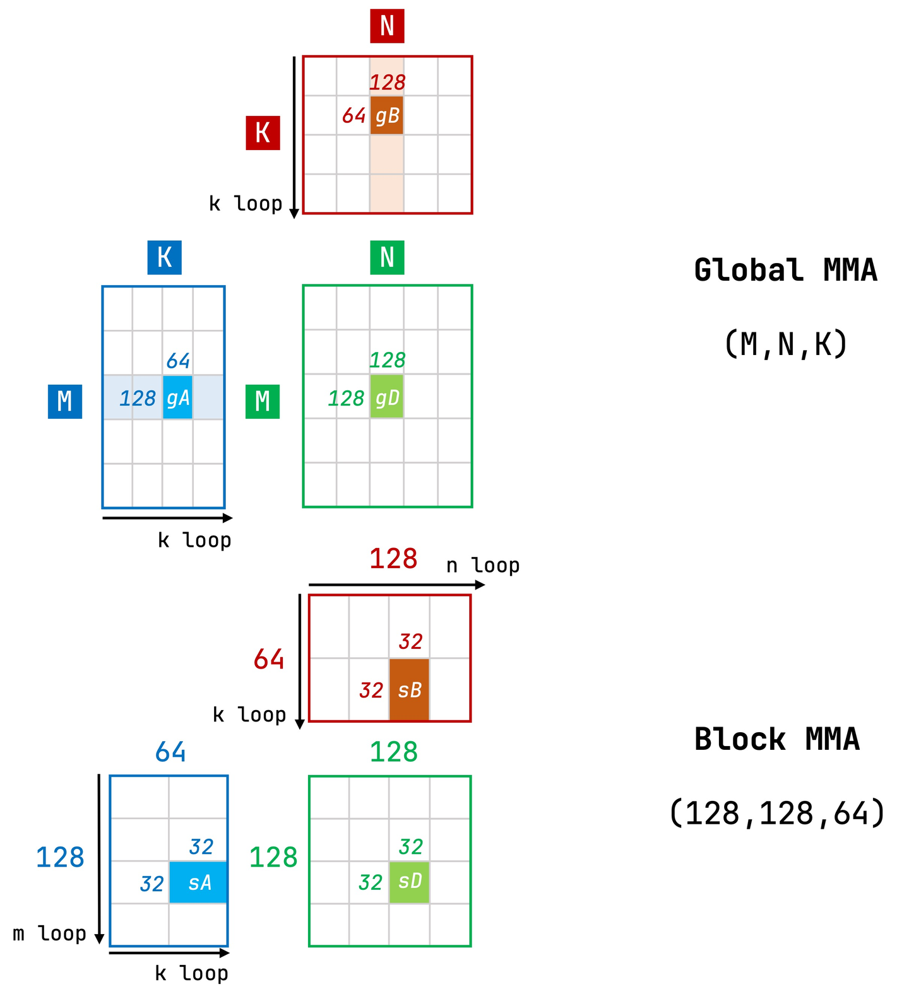

이때 여러 Block을 띄워 병렬 연산해야 하므로 연산자 launch의 시작 파라미터는 다음과 같이 바뀐다.

```python
M, _ = mA.shape
N, _ = mB.shape
grid_n = (N + BLK_N - 1) // BLK_N
grid_m = (M + BLK_M - 1) // BLK_M

dynamic_mma_kernel(...).launch(
    grid=(grid_n, grid_m, 1),
    block=(NUM_THREADS, 1, 1),
    ...
)
```

Block의 크기는 보통 미리 정해져 있지만 전체 GEMM 규모는 임의적이다. 따라서 고정된 Block 크기로 작업을 나눌 때 경계에 있는 Block에서 범위 초과 문제를 만나기 쉽다. 그러므로 범위 초과 문제는 이번 편에서 해결해야 할 핵심 문제 중 하나다.

---

## 2. Shape 의 범위 초과 문제를 어떻게 처리할까?

Block 크기를 (`BLK_M`, `BLK_N`, `BLK_K`)로 확정했다고 할 때, 실제 GEMM 규모 (M, N, K)는 그보다 작을 수도 있고, 그보다 크지만 어떤 차원이 Block으로 나누어떨어지지 않을 수도 있다. 이 두 경우는 모두 같은 문제를 가리킨다. **계산해야 할 행렬 Shape가 적어도 한 차원에서 Block보다 작을 때, 경계에서 복사와 계산을 어떻게 올바르게 처리할 것인가**?

복사의 관점에서 분석하면, GMEM에서 SMEM으로 복사하는 과정에서 범위를 벗어난 부분은 복사하면 안 된다. 그렇지 않으면 메모리 접근 범위 초과가 발생하거나 더러운 데이터를 읽어 들이게 된다. SMEM에서 GMEM으로 되돌려 복사할 때도 마찬가지다. 반면 SMEM과 RMEM 사이의 상호 복사, 그리고 MMA 계산 과정에서는 범위 초과 문제를 처리하지 않아도 되며, 범위를 벗어난 부분을 0으로 두기만 하면 된다.

이어서 MN 차원과 K 차원의 범위 초과 문제를 각각 어떻게 처리하는지 살펴보자.

### 2.1 MN 차원의 범위 초과 문제 처리하기

C 행렬의 가장 오른쪽 아래 Block을 예로 들어 보자. 아래 그림에서 실제로 계산에 참여해야 하는 행렬 블록은 초록 부분이고 범위를 벗어난 영역은 빨간 부분임을 볼 수 있다.

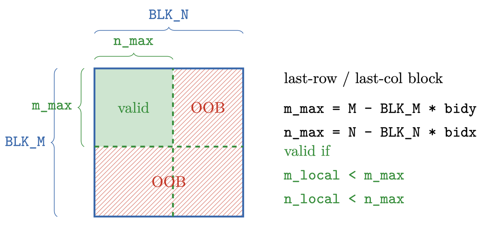

초록 행렬 블록의 크기 (`m_max`, `n_max`)는 다음과 같이 계산해 낼 수 있다.

```python
bidx, bidy, _ = cute.arch.block_idx()

M, K = mA.shape
N, _ = mB.shape
tiler = (BLK_M, BLK_N, BLK_K)

m_max = M - BLK_M * bidy
n_max = N - BLK_N * bidx
```

그러면 m 차원의 좌표가 `m_max`를 넘어서거나 n 차원 좌표가 `n_max`를 넘어서면 G2S 복사 명령어를 실행할 수 없다. 따라서 기존 복사 명령어에 조건 판별을 추가해야 한다.

여기서 핵심은 이렇다. 현재 우리 복사 명령어는 스레드 단위로 실행되고, 각 스레드에 할당된 복사 데이터 블록은 TiledCopy의 partition을 통해 얻어진다. 따라서 TiledCopy의 파라미터가 수정되면 partition 데이터 블록과 좌표의 대응 관계를 계산하는 부분도 수정해야 하는데, 이는 매우 번거로운 일이다.

```python
thr_g2s_c = g2s_tiled_copy_c.get_slice(tid)
tCgC = thr_g2s_c.partition_S(gC)  # (CPY, CPY_M, CPY_N)
tCsC = thr_g2s_c.partition_D(sC)  # (CPY, CPY_M, CPY_N)
```

그렇다면 tCgC의 각 원소의 좌표를 편리하게 얻으면서 서로 다른 TiledCopy에도 맞출 수 있는 방법은 없을까? CUTLASS는 Identity Tensor를 만드는 데 쓰이는 `make_identity_tensor` 함수를 제공한다. 전통적인 Tensor는 실제 데이터 블록을 나타내며 데이터 헤드 포인터와 Layout을 포함한다. 반면 Identity Tensor는 어떤 데이터도 나타내지 않고 Layout만 가지며, 이 Tensor Layout은 좌표의 항등 매핑이라 **입력과 출력이 모두 좌표 형태다**.

2차원 Identity Tensor를 예로 들면 이 항등 매핑은 $f(m,n) = (m,n)$ 로 나타낼 수 있다.

`make_identity_tensor` API의 도움을 받아 `gC`와 형상이 같은 Identity Tensor `cC`를 만들고, 같은 `partition_S` 메서드로 `cC`를 `tCcC`로 partition 할 수 있다. 이렇게 하면 `tCcC`의 형상이 `tCgC`와 완전히 같아지고, `tCgC`의 데이터와 `tCcC`의 2차원 좌표가 일대일로 대응한다.

```python
cC = cute.make_identity_tensor((BLK_M, BLK_N))
tCcC = thr_g2s_c.partition_S(cC)  # (CPY, CPY_M, CPY_N)
```

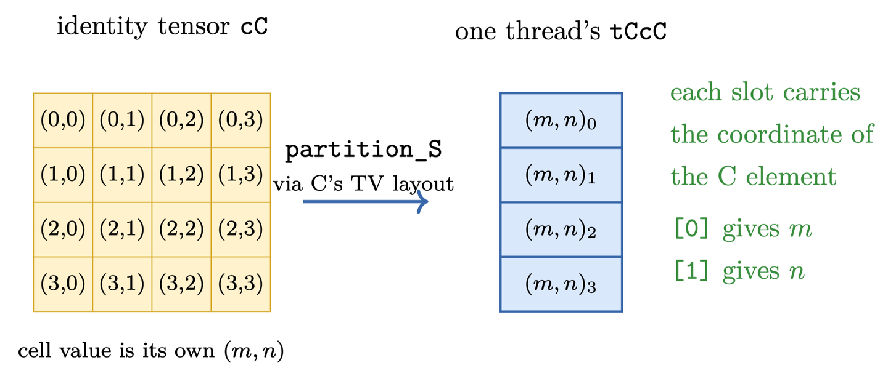

따라서 **`tCgC`의 어떤 원소 (`cpy`, `cpy_m`, `cpy_n`)를 임의로 주더라도 같은 좌표를 `tCcC`에 먹이면 원래 `gC` 위에서의 2차원 좌표 (m, n)을 얻을 수 있다.**이렇게 해서 partition 후 원소가 원래 좌표를 찾지 못하는 문제가 해결되고, TiledCopy가 바뀌면 `tCcC`도 그에 맞게 바뀌므로 좌표 매핑 코드를 고칠 필요가 없다.

---

이어서 실제 복사 작업을 해 보자. 그 전에 (`CPY`, `CPY_M`, `CPY_N`) 이 세 차원의 의미와 형상을 명확히 해 두자. 되짚어 보면 노트 (5)에서 **CPY는 단일 Copy Tile에서 단일 스레드가 복사해야 할 데이터 개수**라고 지적했다. 노트 (6)에서는 **Copy Tile의 크기는 TiledCopy가 결정하며 Tiled MMA 크기와 다를 수 있고, 복사 루프를 돌 때 (`CPY_M`, `CPY_N`)은 Copy Tile 단위로 루프를 확장한다**고 지적했다.

실제로 Copy Atom에서 Copy Tile로 가는 이 차원의 확장은 CPY 안에 포함되어 있으며, 이를 (`atom_v`, `rest_v`) 두 차원으로 분해할 수 있다. `atom_v`는 이 스레드가 Copy Atom 하나를 실행할 때 복사해야 할 원소 개수를 나타내고, `rest_v`는 하나의 Copy Tile 안에 Copy Atom이 몇 개 있는지를 나타낸다.

TiledCopy의 코드에서 알 수 있듯이 현재 Copy Tile의 크기는 (`NUM_THREADS`, 8)이고 Copy Atom 하나는 연속된 원소 8개이므로, Copy Tile 하나는 마침 각 스레드가 Copy Atom을 한 번 실행하는 것에 대응한다. 그리하여 위의 CPY 차원의 형상은 (8, 1)이다.

아래 코드는 C 행렬의 복사가 범위 초과 문제를 어떻게 해결하는지 보여 준다. 먼저 sC 영역의 원소에 0을 대입해 범위를 벗어난 부분을 채워야 한다. 그다음 `CPY_M`과 `CPY_N`에서 Copy Tile 단위의 복사 루프를 돌며 루프마다 Copy Tile 하나를 복사하는데, 우리 시나리오에서는 루프마다 각 스레드가 Copy Atom 하나의 연속 데이터 8개를 복사하는 것과 등가다. 이어지는 것은 조건 판별 부분이며, `tCcC[0, m, n]`은 현재 스레드 Copy Atom의 첫 번째 원소에 대응하는 2차원 좌표를 나타낸다. 이 좌표가 (`m_max`, `n_max`) 안에 있을 때에만 이 Copy Atom을 실행할 수 있다. 따라서 경계에서는 일부 스레드만 복사 명령어를 실행하게 된다.

```python
tCsC.fill(0)
for m in cutlass.range_constexpr(cute.size(tCgC, mode=[1])):
    for n in cutlass.range_constexpr(cute.size(tCgC, mode=[2])):
        if cute.elem_less(tCcC[0, m, n][0], m_max) and cute.elem_less(
            tCcC[0, m, n][1],
            n_max,
        ):
            cute.copy(
                g2s_tiled_copy_c,
                tCgC[None, m, n],
                tCsC[None, m, n],
            )
```

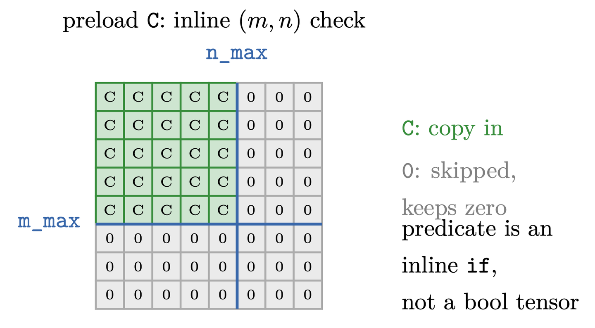

다만 여기에 문제가 하나 있다. **Copy Atom의 뒤쪽 원소 몇 개가 N 차원의 경계를 넘어서면 어떻게 해야 할까**?

### 2.2 명령어 차원의 범위 초과 문제 처리하기

복사 명령어 자체의 폭 때문에 메모리 접근이 범위를 벗어난다면, 예를 들어 N 차원을 따라 128b 폭의 복사 명령어를 실행하는데 N 차원의 길이가 128b로 나누어떨어지지 않는다면 어떻게 해야 할까? 실제로 이런 경우에는 128b 폭의 복사를 더 이상 쓸 수 없다. 범위 초과 문제 외에도 다음 행의 시작 주소가 128b로 정렬되지 않는 문제를 만나게 되므로, illegal memory access 오류가 나거나 misaligned address 오류가 난다.

이 문제 앞에서 우리는 차선책으로 폭이 더 짧은 명령어를 고를 수밖에 없다. 16-bit 원소의 경우 최악의 상황에서는 가장 원시적인 LDG.E.U16으로 원소 단위 복사를 해야 할 수도 있다. 바꿔 말하면 **우리가 조건 판별을 할 수 있는 최소 단위는 명령어 단위뿐이며**, 하나의 복사 명령어의 일부 데이터에만 조건 판별을 붙일 방법은 없다.

**GEMM 연산을 효율적으로 완료하기 위해, 이 시리즈 노트에서는 GEMM 연산에 참여하는 행렬이 Tensor가 연속인 차원(즉 N, K)에서 반드시 128 bits로 나누어떨어진다고 가정한다.**CuTeDSL에서도 이 점을 제약했는데, 아래 코드에서 설정한 divisibility가 그것이다.

```python
def make_cute_tensor(t: torch.Tensor) -> cute.Tensor:
    divisibility = max(1, 16 // t.element_size())
    return (
        from_dlpack(t, assumed_align=16, enable_tvm_ffi=True)
        .mark_layout_dynamic(leading_dim=1)
        .mark_compact_shape_dynamic(mode=1, divisibility=divisibility)
    )
```

### 2.3 K 차원의 범위 초과 문제 처리하기

A, B 두 행렬의 경우 상황이 조금 더 복잡하다. 우리는 복사를 여러 번 수행하고 매번 K 차원을 따라 K tile 하나만큼 이동하기 때문이다. K 차원에서 경계 판별을 하려면, 소박한 방법은 매번 복사할 때마다 K를 판별하는 것이고, 개선된 방안은 마지막 tile에 대해서만 K를 판별하는 것인데 그러려면 매번 마지막 tile에 도달했는지를 판별해야 한다.

더 나은 방안은 A, B 행렬의 헤드 포인터를 K 차원의 역방향으로 오프셋하여 첫 번째 tile이 범위를 벗어나게 하고 마지막 tile이 정확히 오른쪽 경계에 맞아떨어지게 하는 것이다. 이렇게 하면 첫 번째 복사의 K 범위 초과만 처리하고 이후 복사에서는 처리하지 않아도 된다.

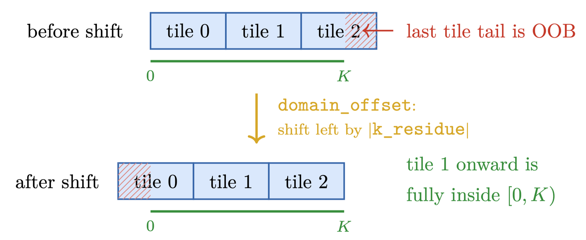

여기서는 Tensor의 헤드 포인터를 오프셋하는 데 쓰이는 CUTLASS의 `domain_offset` API를 사용하게 된다.

```python
k_tiles = cute.size(gA, mode=[2])
k_residue = K - BLK_K * k_tiles
gA = cute.domain_offset((0, k_residue, 0), gA)
gB = cute.domain_offset((0, k_residue, 0), gB)
```

아래에서 A 행렬을 예로 든다. tAgA를 tAsA로 복사할 때 C 행렬처럼 `cute.copy` 바깥에서 조건 판별을 할 수도 있고, pred 인자를 직접 넘길 수도 있다. 넘겨야 하는 것은 tAgA/tAsA와 같은 차원을 갖고 데이터 타입이 Boolean인 Tensor다.

```python
cute.copy(
    g2s_tiled_copy_a,
    tAgA[None, None, None, 0],
    tAsA,
    pred=tApA_first,
)
```

> CUTLASS C++의 API는 CuTe DSL과 다소 다르다. 그쪽의 pred는 복사 Tensor와 차원이 달라도 된다.

K 차원이 범위를 벗어나는 첫 번째 tile에 대해 우리의 predicate Tensor는 다음과 같이 구성한다.

```python
tApA_first = cute.make_rmem_tensor(
    cute.make_layout(
        (
            tAgA.shape[0][1],
            cute.size(tAsA, mode=[1]),
            cute.size(tAsA, mode=[2]),
        ),
        stride=(
            cute.size(tAsA, mode=[1]) * cute.size(tAsA, mode=[2]),
            cute.size(tAsA, mode=[2]),
            1,
        ),
    ),
    cutlass.Boolean,
)

for rest_v in cutlass.range_constexpr(tApA_first.shape[0]):
    for m in cutlass.range_constexpr(tApA_first.shape[1]):
        for k in cutlass.range_constexpr(tApA_first.shape[2]):
            tApA_first[rest_v, m, k] = cute.elem_less(
                tAcA[(0, rest_v), m, k][0],
                m_max,
            ) and cute.elem_less(
                cutlass.Int32(-1),
                tAcA[(0, rest_v), m, k][1] + k_residue,
            )
```

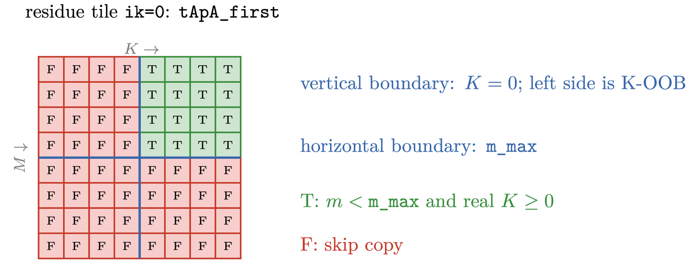

`tAgA`의 형상이 ((`atom_v`, `rest_v`), `CPY_M`, `CPY_K`) 인 것과 비교하면 `tApA_first`의 형상은 (`rest_v`, `CPY_M`, `CPY_K`) 이다. `atom_v` 라는 명령어 차원 내부에서는 predicate를 할 수 없기 때문이다. `tApA_first`에 대한 범위 초과 판별은 그 Copy Atom의 모든 원소로 broadcast 된다.

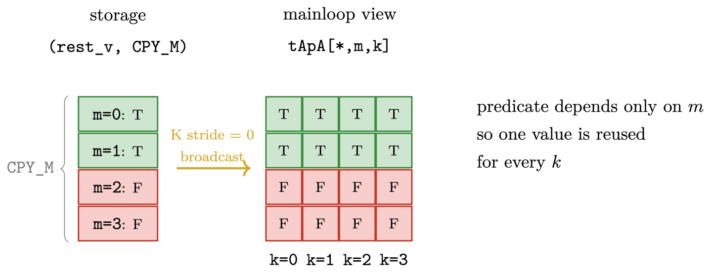

범위 초과 판별은 C 행렬과 유사하게, Identity Tensor를 구성해 원소 좌표를 얻은 다음 좌표가 범위를 벗어났는지에 따라 `tApA_first`의 해당 원소에 0 또는 1을 대입한다. A 행렬의 첫 번째 tile은 M 차원과 K 차원의 범위 초과를 동시에 판별해야 한다는 점에 유의하라.

첫 번째 tile을 복사하기 전에 SMEM을 비워야 한다는 점에 유의하라. 이후 tile의 복사에서는 SMEM을 정리하지 않아도 된다.

```python
tAsA.fill(0)
cute.copy(
    g2s_tiled_copy_a,
    tAgA[None, None, None, 0],
    tAsA,
    pred=tApA_first,
)
```

이후 tile의 predicate에서는 K 차원 판별이 필요 없고 M 차원이 범위를 벗어났는지만 보면 된다.

```python
tApA = cute.make_rmem_tensor(
    cute.make_layout(
        (
            tAgA.shape[0][1],
            cute.size(tAsA, mode=[1]),
            cute.size(tAsA, mode=[2]),
        ),
        stride=(cute.size(tAsA, mode=[1]), 1, 0),
    ),
    cutlass.Boolean,
)

for rest_v in cutlass.range_constexpr(tApA.shape[0]):
    for m in cutlass.range_constexpr(tApA.shape[1]):
        tApA[rest_v, m, 0] = cute.elem_less(
            tAcA[(0, rest_v), m, 0][0],
            m_max,
        )
```

MMA 계산이 끝나고 출력 행렬을 GMEM으로 되돌려 복사할 때도 비슷한 predicate가 필요하다.

```python
thr_s2g_o = s2g_tiled_copy_o.get_slice(tid)
tOsO_s2g = thr_s2g_o.partition_S(sO)
tOgO_s2g = thr_s2g_o.partition_D(gO)
tOcO_s2g = thr_s2g_o.partition_S(cC)

rest_v_size = tOgO_s2g.shape[0][1]
ccpy_m_size = tOgO_s2g.shape[1]
ccpy_n_size = tOgO_s2g.shape[2]
tOpO_s2g = cute.make_rmem_tensor(
    cute.make_layout(
        (rest_v_size, ccpy_m_size, ccpy_n_size),
        stride=(0, 1, ccpy_m_size),
    ),
    cutlass.Boolean,
)
for m in cutlass.range_constexpr(ccpy_m_size):
    for n in cutlass.range_constexpr(ccpy_n_size):
        tOpO_s2g[0, m, n] = cute.elem_less(
            tOcO_s2g[(0, 0), m, n][0],
            m_max,
        ) and cute.elem_less(
            tOcO_s2g[(0, 0), m, n][1],
            n_max,
        )
cute.copy(s2g_tiled_copy_o, tOsO_s2g, tOgO_s2g, pred=tOpO_s2g)
```

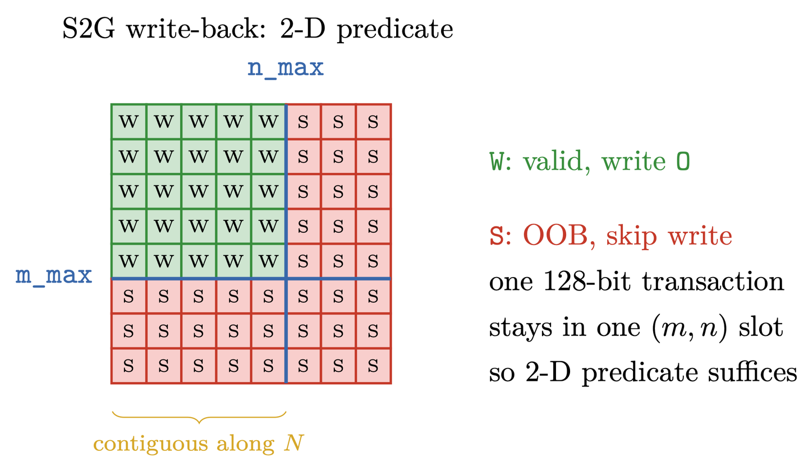

---

## 3. 왜 또다시 "Bank Conflict" 가 나타났을까?

ncu를 한번 돌려 보면 GEMM 규모가 커질 때 다시 대량의 "Bank Conflict"가 나타나는 것을 발견하게 된다.

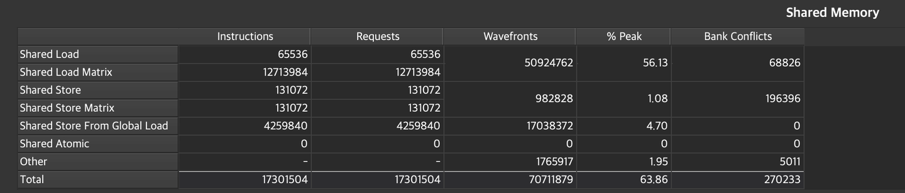

이게 어찌 된 일일까? 실제로 ncu가 이 표에서 보여 주는 것은 L1과 SMEM의 Bank Conflict의 합이며, 대응하는 지표는 `l1tex__data_bank_conflicts_pipe_lsu_mem_shared` 이다.

SMEM에 Bank Conflict가 있는지 따로 보려면 명령어 차원의 wavefront에 잉여 메모리 접근이 있는지를 봐야 한다. 따라서 정확한 지표는 `derived__memory_l1_wavefronts_shared_excessive`, 즉 `memory_l1_wavefronts_shared − memory_l1_wavefronts_shared_ideal` 이다. 노트 (6)에서 명령어 차원에서 본 것이 바로 이 지표들이다.


실제 상황은, 이번 편의 연산자는 SMEM 영역에서 Bank Conflict가 전혀 없으므로 보고된 모든 Bank Conflict가 전부 L1 Cache에서 온 것이다. 연산자를 여러 번 실행해 보면 L1이 Bank Conflict를 일으키는 횟수가 동적으로 변하는 것도 발견할 수 있다.

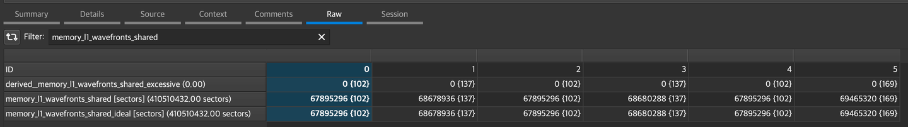

---

## 4. Occupancy 는 연산자 성능에 어떤 영향을 줄까?

우리 연산자가 단일 block에서 다중 block으로 확장됨에 따라 Occupancy와 그에 관련된 지표에 특별히 주목해야 한다.

Occupancy의 공식 정의는 **하나의 SM 위 Active Warps 수와 그 SM이 최대로 수용할 수 있는 warp 수의 비율**이며, 값의 범위는 0%-100%다. 하나의 SM은 최대 2048 threads, 즉 64 warps를 수용할 수 있으므로 Occupancy의 분모는 64로 확정되어 있다. 분자인 Active Warps는 SM에 상주하는 warp 수를 가리키며, 이는 SM 위의 block 수와 각 block의 Active Warp 수에 달려 있다.

$\mathrm{Active\ Warps/SM = Active\ Blocks/SM × Active\ Warps\ per\ Block}$

Occupancy라는 지표에 관해 몇 가지 유의할 점이 있다.

1. **Occupancy 지표는 높을수록 좋은 것이 아니다. 이는 SM이 warp 간 지연을 감출 수 있는 잠재력만을 반영하며, SM이 실제로 계산을 하고 있는 시간 비율이 아니다.** 높은 Occupancy는 SM의 warp 스케줄 풀에 상주 warp가 충분히 있다는 뜻이지, 이 warp들이 언제든 명령어를 발행할 수 있다는 뜻은 아니다.
2. **Occupancy는 block 차원이 아니라 SM 차원에서 계산한다.** 각 SM에는 4개의 warp scheduler가 있고, 각 scheduler는 해당 SMSP 위에 상주하는 모든 warp 풀에서 발행 가능한 명령어를 골라낸다는 것을 알고 있다. 이 풀에는 서로 다른 block에서 온 warp가 섞여 있을 수 있다. 다시 말해 scheduler는 이 warp가 block A에서 왔는지 block B에서 왔는지 구분하지 않는다! 그리고 warp 간 지연을 감추는 것의 본질은, 어떤 warp가 stall 되었을 때 scheduler가 풀 안의 이미 ready된 다른 warp로 전환할 수 있다는 데 있다. 그러므로 warp가 많을수록 지연을 감추는 능력도 강해진다. 따라서 Occupancy를 가늠하려면 반드시 SM 전체를 봐야 한다.
3. Occupancy에는 **Theoretical(이론값)**과 **Achieve(실제값)**의 구분이 있다. **이론값**은 이상적인 경우에 대응한다. SM 위의 모든 block과 모든 warp가 동시에 시작해 동시에 끝나는 경우다. 이때 이 SM의 Active Warps 수는 언제나 SM 위의 block 수에 각 block이 시작할 때 설정된 warp 수를 곱한 값과 같다. **실제값**은 SM에 cycle당 평균적으로 상주하는 warp 수이며 일반적으로 이론값보다 작다. 그 이유는 주로 몇 가지다. 1) kernel이 시작될 때 block이 차례차례 SM에 스케줄되므로(Ramp-up) 처음 한동안은 모든 block이 SM 위에 있지 않다. 2) kernel이 끝날 때 block이 하나씩 빠져나가면서 Active Warp 수가 선형으로 감소한다(Tail effect). 3) 실행 과정에서 일부 block이나 warp가 작업을 먼저 끝내고 빠져나갈 수 있다.

우리는 왜 Occupancy에 그토록 관심을 둘까? 사실 우리가 Occupancy를 말할 때 보통 Occupancy라는 지표 자체를 직접 가리키는 것은 아니고, 대개는 **SM 위의 스케줄, 계산, 저장 등 희소 자원의 이용률**을 가리킨다. 이런 희소 자원이 충분히 활용되지 않았다면 연산자에 성능 최적화 여지가 있을 수 있다는 뜻이다.

이런 희소 자원에는 주로 레지스터 수, SMEM 크기, 동시에 스케줄 가능한 block 및 warp 수, named barrier 수 등이 포함된다. 이들은 각 SM이 최대로 수용할 수 있는 block 개수(Active Blocks/SM)에 직접 영향을 주므로 Occupancy라는 지표와 밀접하게 연관되어 있다.

SM90 아키텍처를 예로 들어 단일 SM과 단일 block이 사용할 수 있는 자원 상한을 정리하면 다음과 같다.

|  | SM 당 | Block 당 |
| --- | --- | --- |
| 레지스터 개수 | 65536 | 65536 |
| SMEM 크기 | 228 KB | 227 KB |
| 동시 스케줄 가능한 block 수 | 32 | - |
| 동시 스케줄 가능한 warp 수 | 64 | 32 |
| named barrier 수 | 64 | 16 |

여러 block이 같은 SM에서 실행될 때 그들이 소비하는 자원의 총합은 SM의 자원 상한을 넘을 수 없다. 따라서 각 SM이 최대로 수용할 수 있는 block 수를 계산해 낼 수 있다.

```text
Active Blocks/SM = min(
  레지스터 크기가 허용하는 block 수 상한,
  SMEM 크기가 허용하는 block 수 상한,
  warp 수가 허용하는 block 수 상한,
  SM 당 block 수 상한,
  named barrier 수가 허용하는 block 수 상한
)
```

예를 들어 하나의 block에 256개의 thread가 있고 각 thread가 132개의 레지스터를 사용한다면 block 하나가 33792개의 레지스터를 사용하게 되고, block 2개면 67584개의 레지스터가 필요해 SM의 자원 상한을 넘는다. 따라서 block이 SMEM을 아주 조금만 쓴다 하더라도 각 SM에서는 block 1개만 동시에 실행할 수 있다. **바꿔 말하면 이 SM에는 충분히 활용되지 못한 SMEM이 대량으로 있을 뿐 아니라, 남은 65536-33792=31744 개의 레지스터도 낭비되고 있다는 뜻이다.**

연산자 최적화를 통해 thread 하나의 레지스터를 128로 낮추면 레지스터 수가 마침 block 2개를 SM에서 동시에 실행하도록 허용하게 된다. 다른 자원 제약이 병목이 아니라고 가정하면 SM에 상주하는 block 수와 warp 수가 늘어나 warp 간 지연을 감출 기회가 더 많아지고, 그 결과 연산자 성능이 향상된다. **이것이 우리가 Occupancy에 특별히 주목하는 이유다!**

> SMEM 크기가 허용하는 block 수 상한을 어떻게 올바르게 계산하는지에 관해 유의할 점이 있다. CUDA driver는 SM 위의 **각 block**마다 1 KB의 SMEM 공간을 미리 할당한다(그 block이 SMEM을 전혀 쓰지 않더라도 마찬가지다). 따라서 228 KB의 SMEM 공간에서 block 4개가 하나의 SM에서 동시에 실행되려면 각 block이 명시적으로 할당하는 SMEM 크기가 (228 / 4) - 1 = 56 KB를 넘어서는 안 된다. 56.5 KB를 할당하면 block 3개만 동시에 실행할 수 있게 된다.

ncu에서는 Occupancy 항목에서 위 공식이 열거한 5가지 block 상한값을 찾을 수 있고, 그중 최솟값이 각 SM이 최대로 수용할 수 있는 block 수다. 이로부터 어떤 자원이 Occupancy에 영향을 주는 병목인지 알 수 있다.

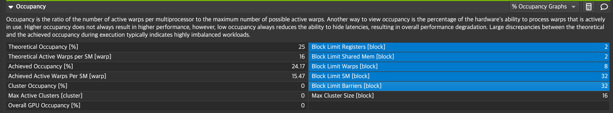

아래 그림에서 어떤 자원의 사용량이 바뀔 때 대응하는 Occupancy가 어떻게 변하는지도 볼 수 있다. 예를 들어 위의 예제에서 스레드당 레지스터 수가 132에서 128로 낮아지면 각 SM이 최대로 수용할 수 있는 block 수가 1에서 2가 되므로, 아래 그림에서 Occupancy가 두 배가 된 것을 볼 수 있다.

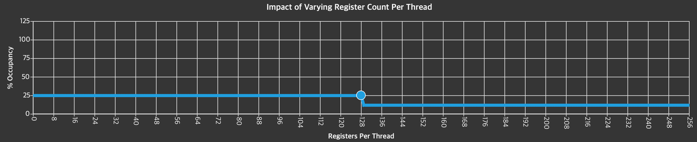

그렇다면 Occupancy를 최적화하고 싶다면 Occupancy에 영향을 주는 5가지 자원에서 손을 대어 각 block이 사용하는 자원 수량을 제어해야 한다. 그중 레지스터를 제외한 나머지 자원은 자원 수량을 정확히 제어할 수 있지만, 유독 레지스터 자원의 할당만은 컴파일러에 달려 있어 block이 정확히 몇 개의 레지스터를 쓸지 정밀하게 제어할 수 없다. 다만 이 block이 사용할 레지스터의 상한이 얼마인지를 컴파일러에 알려 줌으로써 컴파일러의 레지스터 할당 동작을 제어할 수는 있다.

C++에서는 kernel 앞에 `__launch_bounds__`를 써서 컴파일러의 동작을 제어할 수 있다. 여기에는 두 층위의 의미가 있다.

```cpp
__launch_bounds__(maxThreadsPerBlock, minBlocksPerMultiprocessor)
__global__ void kernel() { ... }
```

그중 `maxThreadsPerBlock`은 kernel이 최대로 사용할 수 있는 스레드 개수를 가리키며, launch 시 block size가 이 값보다 크면 바로 오류가 난다. `minBlocksPerMultiprocessor`는 레지스터 할당이 최소한 이만큼의 block이 하나의 SM에 동시에 상주할 수 있도록 보장할 것을 컴파일러에 요구한다. 다만 이는 레지스터 자원이 허용하는 block 수의 하한만 보장할 뿐이고, 다른 자원이 여전히 병목이 될 수 있다.

이 두 파라미터를 설정하면 컴파일러는 다음 공식으로 각 스레드의 레지스터 예산을 역산할 수 있다.

```cpp
max_regs_per_thread = floor(65536 / (maxThreadsPerBlock * minBlocksPerMultiprocessor))
```

레지스터 수가 예산을 넘으면 컴파일러는 loop unrolling 정도를 줄이거나, 인라인 결정을 줄이거나, ILP를 낮추는 방식으로 레지스터를 아끼거나, local memory로 spill 하여 일부 레지스터를 GMEM에 두게 될 수 있다.

`__launch_bounds__`로 레지스터 할당에 대한 컴파일러의 제약을 느슨하게 하여 컴파일러가 각 스레드에 더 많은 레지스터를 할당하게 할 수도 있다. 예를 들어 `__launch_bounds__(256, 1)`을 설정하면 위 공식에 대입했을 때 각 스레드의 레지스터 상한이 256이 되어 이론상 상한인 255보다 크다. 이때 컴파일러는 각 스레드가 레지스터를 완전히 다 쓰게 할 수 있다. 따라서 `__launch_bounds__`를 설정하는 것은 Occupancy를 높일 수 있을 뿐 아니라, 능동적으로 Occupancy를 낮춰 레지스터의 사용 효율을 높이는 데도 쓸 수 있다.

CuTe DSL에서는 kernel launch의 인자에 `__launch_bounds__`의 두 파라미터, 즉 `max_number_threads`와 `min_blocks_per_mp`를 설정할 수 있다.

```python
kernel(params...).launch(
    grid=(grid_n, grid_m, 1),
    block=(NUM_THREADS, 1, 1),
    stream=stream,
    max_number_threads=256,
    min_blocks_per_mp=1,
)
```

**여기서 다시 한번 강조한다. Occupancy 지표는 높을수록 좋은 것이 아니며, SM이 warp 간 지연을 감출 수 있는 잠재력만을 반영한다.** occupancy를 높이려면 보통 어느 정도의 대가를 치러야 한다. 결국 각 block/warp가 사용할 수 있는 자원이 줄어들고 컴파일러도 일부 최적화 수단을 포기할 수 있어, 성능 면에서는 오히려 득보다 실이 클 가능성이 크다. 게다가 각종 연산의 지연이 이미 잘 감춰지고 있을 때는 warp 수를 늘려도 지연 감추기의 개선 효과가 두드러지지 않고 오히려 희소 자원을 더 낭비하게 된다. Occupancy에 주목하는 목적은 block이 SM 위의 각종 자원을 충분히 활용하게 하려는 데 더 가까우며, 최종 목적은 어디까지나 연산자 성능을 높이는 것이다.

> 앞서 SM에 warp가 아무리 많아도 그것들이 모두 언제든 명령어를 발행할 수 있는 것은 아니라고 언급했다. 그렇다면 몇 개의 warp가 명령어를 실행할 수 있고 몇 개의 warp가 아직 기다리고 있는지, 그리고 기다리는 이유가 무엇인지는 어떻게 알 수 있을까? 이는 다음 편 노트에서 소개하겠다.

---

## 5. 정리

이번 편에서는 동적 크기를 지원하는 GEMM 연산자를 구현하고, CUTLASS에서 범위 초과 문제를 어떻게 처리하는지를 중점적으로 소개했다. 또한 Occupancy와 ncu의 관련 지표에 관한 소개도 연산자 최적화에서 매우 중요한 내용이다.

여기까지 우리는 기능 차원에서 GEMM 연산자 개발 작업을 완료했다. 이후 노트에서는 이 GEMM 연산자의 성능을 어떻게 최적화할지로 무게 중심을 옮기고, 서로 다른 하드웨어 아키텍처에서의 최적화 수단을 차례로 소개하겠다. 많은 기대 바란다!

[CUTLASS 노트 (9): NCU 성능 분석과 Pipelining](https://zhuanlan.zhihu.com/p/2044094637862819756)

**마지막으로, 여기까지 읽어 주셔서 감사하다! 이 글이 도움이 되었다면 좋아요를 눌러 주기 바란다. 고맙다～**

# CUTLASS 노트 (9): NCU 성능 분석과 Pipelining

이번 편에서는 ncu profile의 성능 지표를 통해 현재 GEMM 연산자에 있는 성능 문제를 찾아내고, 이어서 Software Pipelining 최적화 수단을 도입해 GEMM 연산자 성능을 한층 더 끌어올린다. 이번 편의 중점 내용에는 연산자 최적화 방법론의 상세한 해설, ncu의 성능 지표 분석, SM 안팎 데이터 전송의 전체 경로, Software Pipelining 개념 모델 등이 포함된다. 정보량이 매우 많고 알차니 여러분이 꼼꼼히 읽고 의견과 제안을 많이 내 주기 바란다～

이번 편에서 사용하는 CUTLASS 버전은 4.5.0이고, 하드웨어 아키텍처는 SM90이다.

이 노트 시리즈의 관련 코드는 모두 오픈 소스로 공개되어 있다. 코드 저장소는 [cutlass-notes](https://github.com/ArthurinRUC/cutlass-notes) 이며, 많은 star 부탁드린다～

CUTLASS 노트 시리즈의 길잡이와 글 목록은 다음에서 자세히 볼 수 있다.

[CUTLASS 노트: 길잡이](https://zhuanlan.zhihu.com/p/1937220431728845963)

---

기능이 완비된 GEMM 연산자를 구현하고 나면 연산자 성능을 어떻게 최적화할지에 주목해야 한다. 연산자 최적화의 방향은 총체적으로 말하면 **계산, 통신, 저장**이다. 그중 저장을 최적화하려면 레지스터, SMEM, GMEM 등 하드웨어의 각종 자원을 합리적으로 활용해야 한다. 알고리즘이 확정되면 GMEM의 사용량은 기본적으로 고정되고, 다른 자원은 Occupancy를 통해 사용 상황을 관찰할 수 있다. 자원 병목을 찾아 Occupancy를 합리적으로 조정할 수 있다면 병목이 아닌 자원의 낭비를 피하고, 하드웨어 자원을 충분히 발휘시켜 성능을 높일 수 있다. 노트 (8)에서 Occupancy와 그에 관련된 하드웨어 자원의 튜닝 방법을 상세히 소개했다.

[CUTLASS 노트 (8): Dynamic MMA](https://zhuanlan.zhihu.com/p/2043008556031595310)

이번 편에서는 계속해서 ncu의 profile을 통해 가장 중요한 두 방향, 즉 계산과 통신(메모리 접근)을 최적화한다. ncu의 detail 화면은 주목해야 할 거의 모든 성능 지표 정보를 보여 준다.

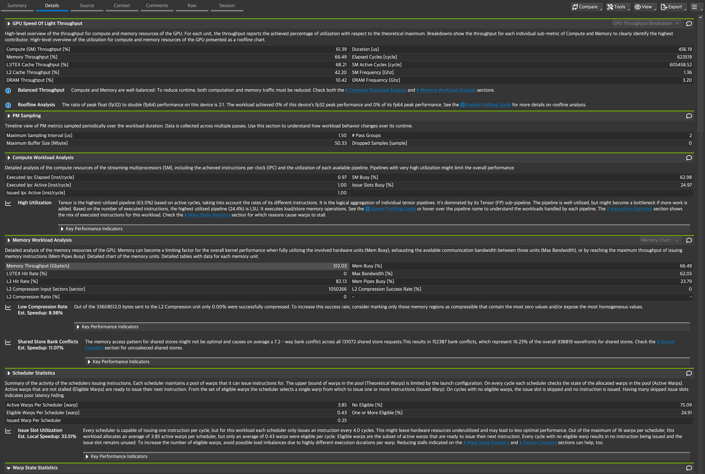

일반적으로 화면의 앞쪽 두 항목, 즉 GPU Speed Of Light Throughput과 PM Sampling을 먼저 보고, 거시적 차원에서 정적·동적 두 측면으로 연산자 성능의 전반적 양상과 병목 유형을 파악한다. 그다음 거시적 분석 결과에 따라 아래쪽의 여러 항목에서 더 세밀한 지표를 이어서 본다. 연산자의 메모리 접근에 문제가 있음을 발견하면 Memory Workload Analysis 항목을 이어서 보면 된다. 명령어 스케줄링에 문제가 있음을 발견하면 Scheduler Statistics와 Warp State Statistics를 보면 된다.

노트 (8)에서 내보낸 ncu profile 파일을 예로 삼아, ncu가 보고하는 지표를 어떻게 읽고 성능 문제를 어떻게 찾는지 함께 살펴보자.

---

## 1. 연산자의 병목 유형 확정하기

### 1.1 계산과 통신의 처리량 크기 관찰하기

첫 번째 항목인 GPU Speed Of Light Throughput에는 두 가지 중요한 내용이 있다. 처리량과 Roofline Model이다. 먼저 Compute와 Memory의 처리량 상황을 본다.

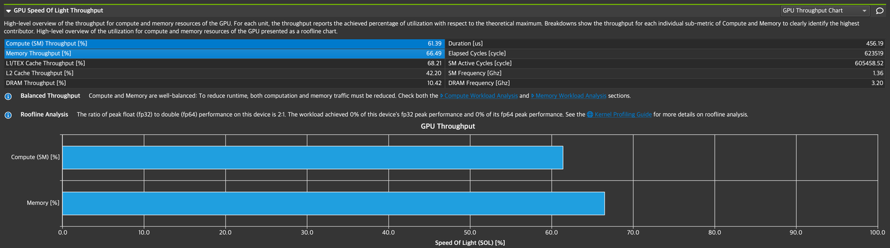

이 연산자의 계산과 메모리 접근의 처리량이 모두 60% 이상임을 볼 수 있다. 일반적으로 Compute 처리량이 매우 높고 Memory 처리량이 비교적 낮으면 이 연산자의 성능 병목은 계산 유닛이나 실행 유닛에 있으며, 이를 **compute-bound**라고 부른다. Memory 처리량이 매우 높고 Compute 처리량이 낮으면 병목은 통신 대역폭이나 메모리 접근 유닛에 있으며, 이를 **memory-bound**라고 부른다. 두 처리량이 모두 비교적 낮으면 계산과 통신 명령어의 실행에 다른 요인이 영향을 주고 있다는 뜻이며, 이를 **latency-bound**라고 부른다. 이때 병목은 보통 Occupancy가 너무 낮거나 warp가 대부분의 시간 동안 어떤 이유로 실행을 멈추고(stall) 있는 것이다.

두 처리량이 모두 비교적 높으면 연산자에 문제가 없다는 뜻일까? 그렇지도 않다. 높은 처리량은 하드웨어의 계산 또는 통신 성능이 충분히 활용되었음을 나타낼 뿐, 그 안에 무효한 계산과 통신이 있는지는 알려 주지 못하기 때문이다. 여기서 강조하고 싶은 것은 **연산자 성능을 판단하는 금과옥조 지표는 언제나 표 오른쪽에 표시되는 Duration과 Elapsed Cycles 값이며, 다른 지표의 최적화는 최종적으로 모두 실행 시간이라는 지표에 반영되어야 한다**는 점이다.

그렇다면 이 처리량들은 어떻게 계산되어 나오는 것일까? 실제로 여기 표시되는 계산 처리량은 모든 계산 유닛과 명령어 실행 유닛의 실제 처리량과 이론 처리량 상한의 비율 중 최댓값이고, 메모리 접근 처리량은 모든 통신 pipe 및 데이터 이동·처리 유닛 처리량 비율의 최댓값이다. GPU Throughput Breakdown에서 어느 유닛의 처리량이 전체 Compute/Memory Throughput을 결정하는지 볼 수 있다.

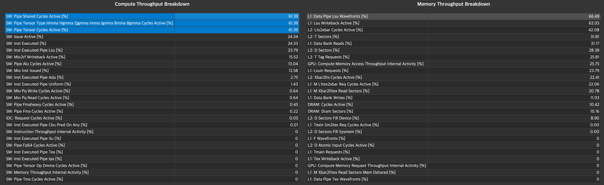

위 그림에서 Tensor Core의 처리량이 전체 계산 처리량을 결정하고, LSU가 Wavefronts를 처리하는 처리량이 전체 통신 처리량을 결정한다는 것을 알 수 있다. 따라서 전체 계산/통신 처리량은 모든 계산/통신 유닛 처리량의 평균값이 아니라 최댓값이며, 이 점을 각별히 유의해야 한다.

> ncu의 성능 지표를 볼 때 보통 두 종류의 접미어를 만나게 된다. **elapsed**와 **active**다. 이 둘의 차이는 비율의 분모가 다르다는 데 있다. elapsed의 분모는 연산자 생명 주기 전체의 cycle 수이고, active의 분모는 그 SM이 실행한 cycle 수다. tail effect 등의 요인이 있어 일부 SM은 연산자 생명 주기 말미에 실행을 먼저 끝내므로, SM cycle은 보통 연산자의 cycle보다 작다. 그래서 active 지표의 비율은 일반적으로 elapsed보다 크다. 우리가 주목하는 것은 연산자의 실행 시간이므로 elapsed가 보고하는 값을 성능 판단 기준으로 삼는다.

### 1.2 Tensor Core 의 Roofline 모델 분석하기

Roofline Model은 연산자 병목 유형을 판단하는 고전적 모델이며, 모든 연산자 개발자가 반드시 익혀야 할 지식이다. GEMM의 경우 전통적인 부동소수점 Roofline Model은 이미 참고 의미가 없어졌고, Tensor Core 차원의 Roofline Model만 주목하면 된다.

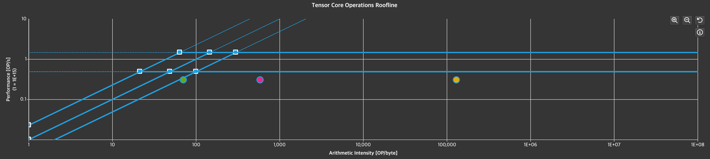

Roofline Model의 세로축은 Tensor Core의 성능이며 단위는 OP/s이고, OP/cycle로 바꿔 표시할 수도 있다. 가로축은 계산 강도이며, 1 byte의 메모리 접근에 Tensor Core 계산량이 얼마나 대응하는지를 나타내고 단위는 OP/byte다.

Tensor Core Roofline Model도 전통적인 Roofline Model처럼 분석할 수 있다. 계산 강도가 비교적 낮을 때 연산자 성능은 메모리 접근에 제한되므로, 메모리 접근이 제한되는 영역 안에서는 계산 강도가 점차 높아짐에 따라 Tensor Core 성능이 선형으로 상승한다. 위 그림의 사선이 그것이다. Tensor Core의 성능 상한에 도달한 뒤에는 계산 강도를 높여도 연산자 성능을 높일 수 없는데, 계산 병목에 부딪혔기 때문이다. 위 그림의 가로선이 그것이다.

GPU 안의 서로 다른 메모리 접근 유닛은 성능 병목이 다르므로 그 사선도 서로 다르다. 보통 메모리 접근 대역폭이 클수록 사선이 더 왼쪽에 놓이는데, 더 작은 계산 강도만으로도 Tensor Core를 채울 수 있기 때문이다. 위 그림에서 왼쪽에서 오른쪽으로 가는 사선은 차례로 L1TEX, L2, DRAM의 Roofline을 나타낸다. 위 그림에는 가로선도 두 개 있는데, Tensor Core HMMA 유형 명령어의 FP16 정밀도에서 sparse와 비 sparse의 이론 성능 상한을 나타낸다. 그림의 초록 점, 분홍 점, 노란 점은 각각 L2, DRAM, L1TEX Roofline의 성능 실현 점에 대응한다.

**그림에서 연산자의 병목 유형을 어떻게 판단할까?** 사선과 가로선의 교점의 가로 좌표를 경계로, 점이 왼쪽에 있으면 **memory-bound**이고 오른쪽에 있으면 **compute-bound**이며, 점과 Roofline의 수직 거리는 **latency-bound**의 심각도를 나타낸다. 위 그림을 예로 들면 L1TEX, L2, DRAM 세 유형의 memory에 대해 연산자는 모두 compute-bound이며 어느 정도의 latency-bound도 있다.

유의할 점은 Tensor Core가 사용하는 명령어가 다르면 가로선의 높이도 달라진다는 것이다. Roofline Model 아래 표에서 HGMMA 명령어를 쓰면 SM90 Tensor Core의 이론 성능 상한(540672 OP/cycle = 132 SM x 4 Core/SM x 1024 OP/cycle/Core)에 도달할 수 있음을 볼 수 있다. 우리는 현재 HMMA 명령어를 쓰고 있으므로 이론 성능이 HGMMA의 2/3뿐이고, 실제 성능은 221272.10 OP/cycle로 이론 성능의 61.39%에 도달했다. 이것이 위에서 보고한 Compute Throughput 처리량 값이다.

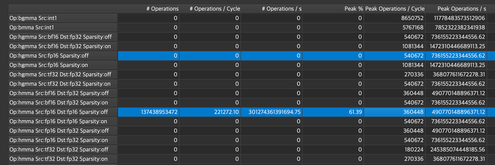

---

## 2. 연산자의 성능 지표를 동적으로 관측하기

위에서는 정적인 관점에서 연산자의 병목 유형을 관찰했다. 다음 항목인 Performance Monitor Sampling(PM Sampling)은 동적인 Timeline에서 연산자의 생명 주기 전체 동안 각종 성능 지표가 어떻게 변하는지 분석할 수 있게 해 준다.

NVIDIA GPU의 각 SM 내부에는 하드웨어 Performance Monitor 카운터 묶음이 있어, 명령어 발행, cache 적중, warp 상태, pipe 점유 등 각종 이벤트를 추적하는 데 전용으로 쓰인다. PM Sampling은 kernel이 실행될 때 고정 cycle 주기로 PM 카운터를 읽어 시간에 따라 동적으로 변하는 지표를 얻는다.

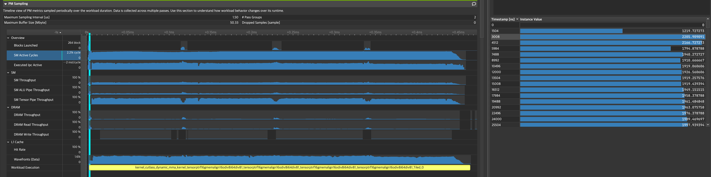

SM Active Cycles에서 kernel의 꼬리 부분에 뚜렷한 하강 구간이 있는 것을 볼 수 있는데, 일부 SM이 모든 명령어 실행을 마치고 먼저 빠져나갔기 때문이다. 이것이 tail effect다. 그리고 Block Launched 행에서는 block이 언제 SM에 스케줄되었는지 볼 수 있다.

---

## 3. Compute 병목 분석하기

Compute 병목 문제에 관심이 있다면 Compute Workload Analysis 항목에서 계산 유닛과 명령어 실행 유닛의 처리량을 찾을 수 있다. 실제로 이 부분의 지표는 위의 Compute Throughput Breakdown에서 이미 보여 준 것이다. 미세한 차이는 여기의 처리량 분모가 active이고 위의 Breakdown의 분모는 elasped라는 점이며, 그래서 여기의 처리량 수치가 다소 높게 나온다.

아래 그림에서 왼쪽은 계산 유닛의 처리량/이용률, 즉 계산 유닛이 몇 cycle 동안 실제로 일했는지를 보여 준다. 오른쪽은 명령어 발행의 처리량, 즉 명령어 큐의 처리량/이용률을 보여 준다. Tensor Core 유닛의 경우 명령어 큐가 병목인 경우는 드물므로 주로 계산 처리량만 보면 된다.

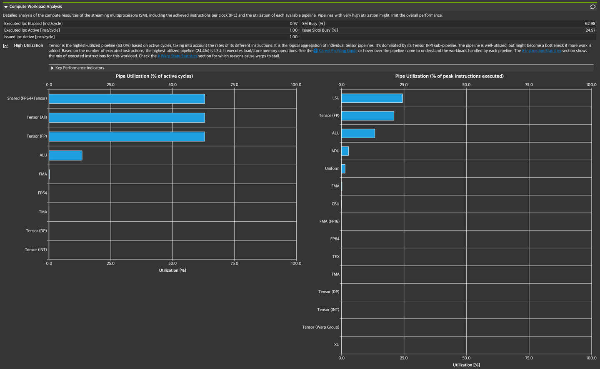

GEMM 연산자의 경우 Compute가 문제의 병목이 되었을 때, Tensor Core 처리량이 이미 비교적 높고(내 실험 환경에서는 HMMA든 HGMMA든 실제 처리량 한계가 이론값의 99.5% 이상에 도달할 수 있었다) 알고리즘상 무효한 계산 부분이 매우 적다면, 이는 우리가 바라 마지않던 일이며 GEMM 연산자를 최적화한 최종적인 이상형이다. 이때는 Compute 문제를 해결할 필요도 없다. 결국 GEMM 자체가 compute-bound 쪽에 가깝기 때문이다.

Tensor Core 처리량이 부족할 때는 일반적으로 MMA 명령어 발행 속도가 너무 느려서 생긴 문제다. 그래서 이 화면에는 명령어 발행 슬롯의 이용률(24.97%)과 cycle당 발행 명령어 수(1.00, 이론 상한은 4)도 표시된다. 이어서 latency-bound를 분석하는 착상대로 명령어 차원에 걸리는 지점이 있는지, 그리고 명령어가 충분히 많지 않아서 생긴 문제는 아닌지 살펴볼 수 있다.

---

## 4. Memory 병목 분석하기

Memory 병목과 Latency 병목은 보통 메모리 접근 명령어 및 메모리 접근 경로와 관련이 있다. 따라서 분석하기 전에 먼저 데이터 전송 경로 안의 모든 메모리 접근 유닛과 경로를 정리해야 한다.

아래 그림은 SM 안팎 데이터 전송의 경로를 보여 준다.


명령어가 Warp Scheduler에 들어오면 일부 **고정 지연** 명령어는 직결된 pipe를 통해 보내진다(그림에는 표시하지 않았다). ALU, FMA, MMA 등이 그것이다. 반면 **긴 지연 / 불확정 지연** 명령어는 **MIO**(Memory Input/Output) 모듈로 보내져 처리된다. 모든 메모리 접근 명령어, XU 등 초월 함수 계산 명령어가 그것이다. 이 명령어들의 처리량이 1 inst/cycle보다 작아서, Warp Scheduler에 쌓이면 명령어 스케줄링 속도를 늦추기 때문이다.

통상적인 메모리 접근 명령어의 경우 각 Warp Scheduler는 이들을 **MIO Instruction Queue** 안의 대응하는 LSU Queue에 넣는다. 각 Warp Scheduler는 각각 하나의 LSU Queue에 대응하며, 물론 다른 유형의 명령어(TEX, IDC, CBU)에도 서로 다른 queue가 있다. **MIOC**(MIO Controller, 때로는 MIO Scheduler라고도 한다)는 Instruction Queue에서 스케줄 가능한 명령어를 통일적으로 가져와 하류의 **MIO Pipe**로 보내며, 여기에는 LSU Pipe 등이 포함된다(그림에 표시되지 않은 TEX Pipe 등도 있다). 그리고 이 pipe는 모든 SMSP가 공유한다.

> XU 유형의 명령어는 예외다. MIOC는 XU 명령어를 각 SMSP 고유의 XU pipe로 스케줄하며, 이는 MIO Pipe라는 경로를 거치지 않는다.

LSU Pipe는 명령어를 L1TEX 모듈의 **LSUIN**으로 보내고, 여기서 메모리 접근 요청의 병합을 완료해 하나 또는 여러 개의 wavefront를 산출한다(노트 (6)의 내용을 참고하라). 명령어가 GMEM에 접근해야 하고 L1 Cache를 읽어야 한다면 L1TEX 내부에서 cache tag를 계산하고 cache lookup도 한다. cache miss일 때는 SM 바깥의 **XBAR**(crossbar, 모든 SM과 모든 L2 slice의 온칩 상호 연결)를 통해 메모리 접근 요청을 **LTS**, 즉 **L2 Slice**로 전달해야 한다. L2와 연결된 **Memory Controller**(**MC,** FrameBuffer Partition이라고도 한다)는 메모리 접근 명령어에 따라 GMEM의 데이터를 읽고 쓴다. 데이터를 되돌려 써야 한다면 L1TEX는 L2라는 경로를 통해 GMEM의 데이터를 읽거나, L1/SMEM에 쓰거나, **LSU Data**를 통해 데이터를 MIO로 반환하고, MIO의 되쓰기 중재기 **MIO2RF**가 데이터를 올바른 SMSP 레지스터에 되돌려 쓴다.

> MIO2RF의 되쓰기는 계산 유닛의 정상적인 writeback과 RF 쓰기 포트를 두고 다투므로 되쓰기 중재기가 중재해야 한다. 그래서 처리량이 높은 상황에서는 RF 쓰기 포트 경합 자체가 잠재적 병목이 될 수도 있다.

총체적으로 말하면 GMEM과 SMEM의 읽기 쓰기는 주로 L1TEX 모듈이 구동하고, RMEM의 쓰기는 MIO2RF와 다른 계산 유닛이 완료하며, RMEM의 읽기는 하드웨어의 특정 유닛과 다른 계산 유닛이 완료한다. RMEM 데이터를 L1TEX로 보내야 한다면 대응하는 메모리 접근 명령어와 피연산자가 함께 LSU Pipe로 전달된다.

---

여기서 LSU와 MIO라는 두 개념을 특별히 논해 보자.

우리는 보통 아래 그림으로 LSU(LD/ST)를 이해하는데, 보기에 LSU는 SM 위의 한 유닛인 것처럼 보인다. 그러나 실제 상황은 이렇다. **LSU는 Warp Scheduler, MIO의 2단계 명령어 큐(LSU Pipe Queue + LSU Pipe), L1TEX(LSUIN, LSU Data)라는 세 계층을 가로지르는 파이프라인이며, 독립적인 모듈 하나로 단순하게 볼 수 없다**.

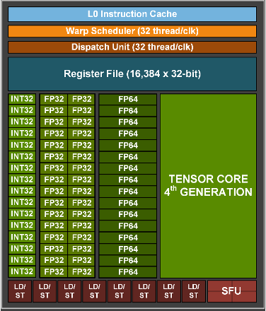

MIO는 문맥에 따라 MIO Pipe만을 특별히 가리킬 수도 있고 MIO 서브시스템 전체를 가리킬 수도 있다. 이 시리즈 노트에서는 명확한 설명이 없는 한 MIO는 그림의 초록 실선 틀 안에 있는 이 모듈들의 총칭이다.

---

L1TEX와 LTS의 경우 그 내부의 cache 처리는 다시 **Tag Stage**(T-Stage), **Miss Stage**(M-Stage), **Data Stage**(D-Stage)로 나뉘며, 각각 cache tag를 조회해 적중 여부를 판단하는 단계, cache miss를 처리하는 단계, 데이터를 읽는 단계에 대응한다. 아래는 ncu 문서가 제공하는 L1TEX/LTS cache pipeline 흐름도다.

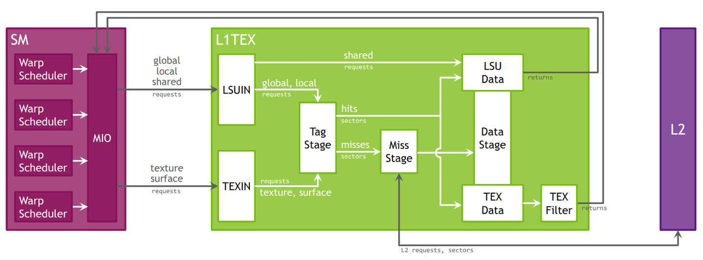

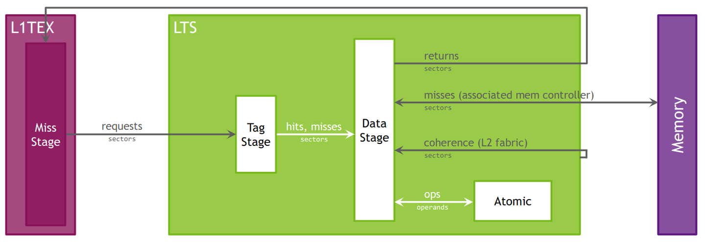

---

이어서 ncu의 Memory Workload Analysis 항목을 살펴보자. 그중 Memory Tables는 앞선 노트에서 이미 상세히 분석했고, 나머지 부분도 이해하기 어렵지 않으므로 자세히 소개하지 않겠다. Memory Chart 부분은 각 유닛 간 메모리 접근 대역폭과 이용률을 보여 주며 비교적 명료하고 직관적이다. 그중 GPU가 듀얼 die인 경우 L1TEX와 LTS 사이에는 die를 가로지르는 메모리 접근을 처리하고 병합하는 데 쓰이는 **LRC**(L2 Cache Request Coalescer)가 하나 더 놓인다.

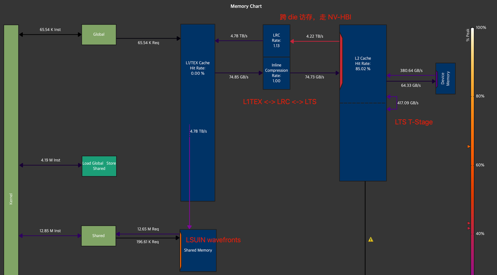

더 세밀한 메모리 접근 데이터를 얻고 싶다면, 예를 들어 아래 그림의 각 경로의 처리량 상황을 알고 싶다면 어떤 지표에 주목해야 할까?

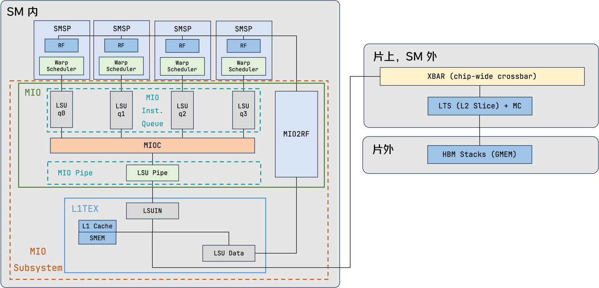

사실 ncu는 이 항목에서 세 가지 지표를 더 제공한다. 각각 **유닛 내 트랜잭션 처리량**(Mem Busy), **유닛 간 대역폭 처리량**(Max Bandwidth), **SM 명령어 처리량**(Mem Pipes Busy)을 뜻한다. 이 지표들에 딸린 하위 지표에 주목하면 성능 핫스팟을 매우 세밀하게 볼 수 있다.

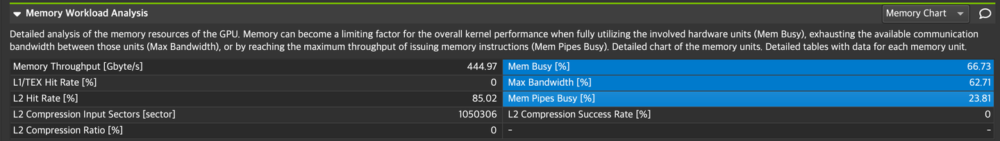

독자는 아래 나열된 지표를 데이터 경로 그림의 올바른 부분에 대응시켜 볼 수 있는지 시도해 보라. 이를 통해 데이터 전송의 전체 경로를 더 잘 이해할 수 있다.

**유닛 내 트랜잭션 처리량**에 대해 주목해야 할 지표는 다음과 같다.

| 지표 이름 | 의미 |
| --- | --- |
| `l1tex__data_pipe_lsu_wavefronts` | LSUIN 이 data wavefronts 를 처리하는 처리량 |
| `l1tex__data_bank_reads` | L1TEX 가 L1/SMEM 을 읽는 처리량 |
| `l1tex__data_bank_writes` | L1TEX 가 L1/SMEM 에 쓰는 처리량 |
| `lts__t_sectors` | LTS Tag Stage 처리량 |
| `lts__d_sectors` | LTS Data Stage 처리량 |
| `lts__t_tag_requests` | LTS 의 Tag 조회 처리량 |

**유닛 간 대역폭 처리량**에 대해 주목해야 할 지표는 다음과 같다.

| 지표 이름 | 의미 |
| --- | --- |
| `l1tex__lsuin_requests` | LSU Pipe -> L1TEX(LSUIN) |
| `l1tex__m_l1tex2xbar_req_cycles_active` | L1TEX -> XBAR |
| `l1tex__m_xbar2l1tex_read_sectors` | XBAR -> L1TEX |
| `l1tex__lsu_writeback_active` | L1TEX(LSU Data) -> MIO2RF |
| `lts__lts2xbar_cycles_active` | LTS -> XBAR |
| `lts__xbar2lts_cycles_active` | XBAR -> LTS |
| `dram__cycles_active` | DRAM <-> LTS 가 바쁜 cycle, `dram__bytes_read` + `dram__bytes_write` 와 같다 |
| `fbpa__dram_sectors` | DRAM <-> LTS 가 실제로 데이터를 옮기는 cycle |
| `lts__d_sectors_fill_device` | DRAM -> LTS 단방향 |

**SM 명령어 처리량**에 대해 주목해야 할 지표는 다음과 같다.

| 지표 이름 | 의미 |
| --- | --- |
| `sm__mio_pq_write_cycles_active` | Warp Scheduler -> Pipe Queue |
| `sm__mio_pq_read_cycles_active` | Pipe Queue -> MIOC |
| `sm__mio_inst_issued` | MIOC -> MIO Pipe |
| `sm__inst_executed_pipe_lsu` | MIOC -> LSU Pipe |
| `sm__mio2rf_writeback_active` | MIO2RF -> RF |
| `sm__inst_executed_pipe_fma` | Warp Scheduler -> FMA Pipe, FFMA、FMUL、FADD、IMAD 등 유형의 명령어를 포함한다 |
| `sm__inst_executed_pipe_alu` | Warp Scheduler -> ALU Pipe, IADD3、LOP、SHF 등 정수 및 논리 명령어를 포함한다 |
| `sm__inst_executed_pipe_xu` | MIOC -> XU Pipe, 즉 MUFU 류 초월 함수 명령어다 |
| `sm__inst_executed_pipe_tensor_op_hmma` | Warp Scheduler -> HMMA Pipe, HMMA、HGMMA 등 통상적인 부동소수점 MMA 명령어를 포함한다 |

---

## 5. Latency 병목 분석하기

Latency-bound는 주로 두 가지로 나타난다. 하나는 warp 수가 부족해 동시 실행되는 명령어 수가 부족한 것이고, 다른 하나는 warp가 어떤 이유로 stall 되어 명령어를 계속 issue 할 수 없는 것이다. Scheduler Statistics 항목에서 warp의 스케줄링 상황을 볼 수 있다.

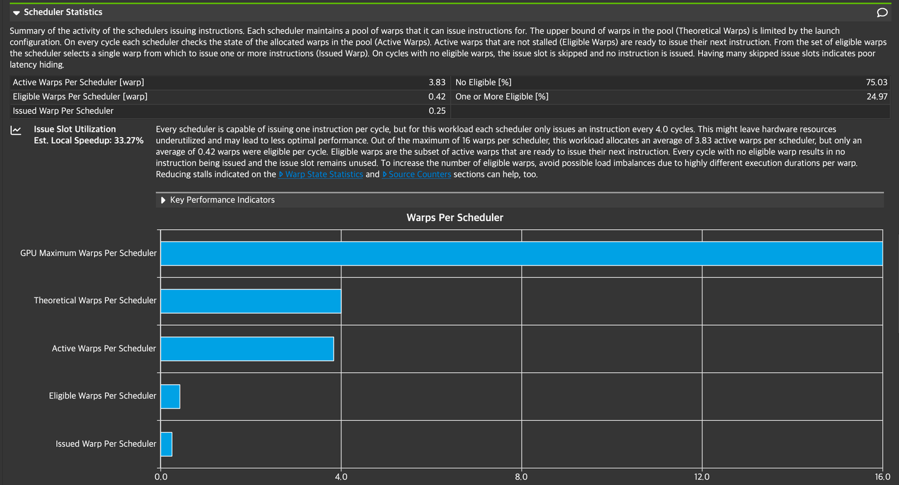

이것은 깔때기 모델이며, 자세히 분석해 보자.

- **GPU Maximum Warps Per Scheduler:** 16 warps로 고정되어 있다. 하나의 SM에 최대 64개의 warp가 있고 warp scheduler는 모두 4개이므로, 각 scheduler에 최대 16 warps가 배분된다.
- **Theoretical Warps Per Scheduler:** 이 kernel의 자원 점유를 전제로 scheduler당 최대 몇 개의 warp가 상주할 수 있는지를 나타낸다. 이론 Occupancy를 반영한다.
- **Active Warps Per SM Scheduler:** kernel 실행 과정에서 cycle당 평균 상주하는 warp 수다. 실제 Occupancy를 반영한다.
- **Eligible Warps Per Scheduler:** cycle당 실제로 스케줄되어 명령어를 발행할 수 있는 warp 수다. 예를 들어 warp가 메모리 접근 반환을 기다리거나, 동기화를 기다리거나, 앞선 명령어의 의존을 기다리는 상황이라면 이 warp들은 stall 상태에 있어 scheduler가 스케줄할 수 없다.
- **Issued Warps Per Scheduler:** cycle당 scheduler가 실제로 선택해 명령어를 발행한 warp 수이며, 절대 1을 넘지 않는다. 같은 cycle에 eligible warp가 여럿 있을 수 있지만 scheduler 하나는 cycle당 한 warp의 명령어만 발행할 수 있으므로, issued warps는 보통 eligible warps보다 작다.

그중 Occupancy 문제는 손쉽게 알아볼 수 있고, 노트 (8)의 착상으로 Occupancy 최적화가 필요한지 분석할 수 있다. 그런데 위 그림에는 또 하나의 단층 지점이 분명히 있다. Active warps는 3.83인데 Eligible warps는 0.42뿐이라는 점이며, 이는 **대부분의 시간 동안 warp가 stall 상태에 있음**을 뜻한다.

Warp State Statistics 항목에서 warp stall의 원인에 어떤 것이 있는지 찾을 수 있다.

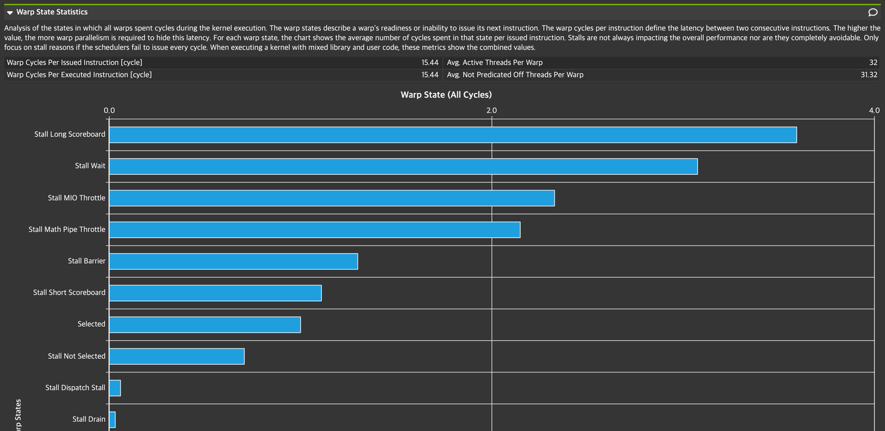

우리는 주로 위 그림에서 stall의 **주된 원인**에 주목하는데, 여기서는 **Long Scoreboard**다. 서로 다른 주된 원인과 서로 다른 stall 정도에 따라 그에 상응하는 연산자 최적화 전략을 세우게 된다.

여기서 흔히 보이는 몇 가지 warp stall 상황과 최적화 전략을 분석한다. 더 많은 stall에 대한 설명은 ncu 문서를 참고하라.

| Stall 원인 | 해설 |
| --- | --- |
| Long Scoreboard | 전역 메모리 접근 데이터의 도착을 기다린다. 예를 들어 Global memory, Local memory 등에 접근하는 경우다.  이 지표는 주로 L1TEX 내부 Cache 파이프라인의 지연, 그리고 L2와 GMEM의 지연에 주목한다. 따라서 L1, L2 캐시의 적중 여부와 무관하게 지연은 모두 Long Scoreboard에 나타난다.  공식적으로 제시된 해결 방안은 다음과 같다. 1. 명령어 차원에서 자주 stall 되는 명령어를 찾는다 2. 메모리 접근 배치를 최적화해 데이터 지역성을 높이고 캐시 적중률을 높인다 3. 빈번히 접근해야 하는 데이터를 SMEM에 넣는다 |
| Short Scoreboard | SMEM 메모리 접근 데이터의 도착을 기다리거나, 메모리 접근이 아닌 다른 유형의 불확정 지연 명령어가 반환하는 데이터의 도착을 기다린다. 위에서 언급한 XU 명령어 유형과 BRX 동적 분기 명령어 등이 그 예다.  이 지표는 주로 MIO pipe의 짧은 지연 상황을 나타내며, 캐시 경로를 거치는 모든 지연은 포함하지 않는다.  공식적으로 제시된 해결 방안은 다음과 같다. 1. Bank Conflict를 줄인다 2. 빈번히 접근하는 데이터를 레지스터에 넣는다 |
| MIO Throttle | MIO Instruction Queue에 빈자리가 나기를 기다린다.  여기서의 Instruction Queue는 LSU의 queue뿐 아니라 special math 유형 명령어의 queue처럼 MIO 경로를 거치는 다른 명령어 큐도 포함한다.  이 stall 원인은 명령어가 너무 많아서 생기는 것이므로, 메모리 접근 명령어의 경우 메모리 접근을 병합하고 더 긴 메모리 접근 폭을 사용해 명령어 개수를 줄여야 한다. |
| Math Pipe Throttle | MIO를 거치지 않는 주 산술 파이프라인 Queue에 빈자리가 나기를 기다린다. FMA, ALU, Tensor 명령어가 그 예이며, 이들은 자기 명령어 파이프를 갖고 있기 때문이다.  일반적으로 CUDA Core와 Tensor Core로 곧장 가는 명령어의 적체가 Math Pipe Throttle 지표에 반영된다. HMMA는 동기 명령어이므로 명령어 적체 문제가 생기며, 이후 전부 비동기인 HGMMA 명령어를 채택하면 이 문제는 기본적으로 없어진다.  해결 방안은 사실 상반된 두 방향이 있다. 하나는, math pipe와 계산 유닛이 모두 다 쓰이지 않았는데 Math Pipe Throttle이 비교적 크다면, 어떤 시간에는 math pipe를 여러 warp가 동시에 다투고 다른 시간에는 다투는 warp가 없어 pipe가 놀고 있다는 뜻이므로, 이때는 Occupancy를 늘려 노는 시간을 메울 수 있다. 다른 하나는, math pipe나 계산 유닛이 이미 꽉 찼다면 서로 다른 유형의 계산 명령어를 교차 실행해 여러 파이프라인이 병렬로 실행되게 할 수 있고, warp 분업을 조정해 각 SMSP의 부하를 균형 있게 만들 수도 있다.  Compute Workload Analysis 항목에서 특정 명령어 유형의 계산 유닛과 math pipe 처리량 이용률을 관측할 수 있으며, 위에서 이미 소개했다. |
| LG Throttle | L1TEX 안의 Global/Local Instruction Queue에 빈자리가 나기를 기다린다.  이 원인은 global, local처럼 L1TEX의 cache 파이프라인을 거쳐야 하는 메모리 접근 명령어가 L1TEX 내부의 명령어 큐에서 막힌 것이며, 본질적으로는 여전히 전역 메모리 접근 명령어가 너무 많기 때문이다. 유의할 점은 LG Throttle이 L1TEX가 새로운 전역 메모리 접근 명령어를 받을 수 없다는 뜻이라는 것이다. 이는 MIO의 Instruction Queue로 역압을 가하므로 MIO Throttle도 유발한다.  해결 방안은 local memory의 메모리 접근량을 줄이고, 메모리 접근 폭이 더 긴 명령어를 사용하거나, 메모리 접근 명령어와 계산 명령어를 교차 실행하게 하는 것이다. |
| Not Selected | 그 warp는 스케줄될 수 있지만 현재 scheduler가 다른 warp를 스케줄하고 있다. |
| Wait | 고정 지연 명령어의 실행 완료를 기다린다.  일반적으로 등을 맞댄 산술 의존 때문에 생기는 명령어 대기이며, 다음 명령어가 앞 명령어의 결과를 기다리는 것이다. 이런 유형의 명령어는 지연이 고정되어 있으므로 scoreboard로 명령어 의존 관계를 추적하지 않고, warp scheduler가 명령어의 control bits를 읽어 명령어 의존 관계를 직접 관리한다.  Wait는 일반적으로 비교적 낮은 값이며, 이미 고도로 최적화되어 각종 병목과 stall이 제거된 연산자에서만 warp가 산술 의존 사슬의 지연에 걸린다. 따라서 Wait가 stall의 주된 원인이라면 그것은 좋은 일이라는 뜻이다.  Wait의 영향을 줄이려면 warp 수를 늘려(Occupancy를 늘려) 단일 warp의 앞뒤 두 계산 명령어의 의존 지연을 감출 수 있고, 지연이 낮은 명령어(fast math 같은 것)를 쓸 수도 있다. |
| Barrier | Barrier의 해제를 기다린다.  barrier에서 stall 시간이 지나치게 길다면 보통 warp 간 부하가 불균형하다는 뜻이다. 그러나 대부분의 경우 barrier 명령어를 실행하는 횟수가 제한적이므로 연산자 성능에 미치는 영향은 비교적 작다. barrier가 stall의 주된 원인이 되거나 stall의 cycle 수가 매우 클 때에만 최적화를 고려한다.  barrier가 stall에 미치는 영향을 줄이려면 warp 간 부하를 더 균형 있게 하고 warp divergency를 줄이는 것 외에, block 간 병렬로 warp 간 병렬을 대체할 수도 있다. |

메모리 접근 지연 stall과 barrier로 인한 stall에 대해서는 도대체 어느 명령어의 stall 상황이 가장 심각한지도 특별히 궁금하다. 그래서 ncu는 명령어 차원의 stall 상황도 제공한다. 아래 그림은 현재 우리가 구현한 GEMM 연산자의 명령어 stall 상황을 보여 준다. stall이 보고된 명령어는 GMEM 데이터가 SMEM에 도착하기를 기다린 뒤의 barrier이며, 그것이 stall 원인의 21.89%를 차지하고 그중 99.2%의 원인이 Long Scoreboard임을 알 수 있다.

유의할 점은 **barrier라는 명령어에 stall이 나타났다고 보고되는 것의 의미는 warp scheduler가 이 명령어에서 막혀 발행하지 못한다는 뜻, 즉 앞의 명령어(즉 `cute.arch.cp_async_wait_group(0)`)가 아직 실행을 마치지 못했기 때문이라는 것이지, barrier의 해제를 기다리느라 stall이 나타났다는 뜻이 아니라는 것이다.**barrier 아래 한 줄의 명령어의 7.61% 가 barrier 해제를 기다리는 stall의 비율을 나타낸다.

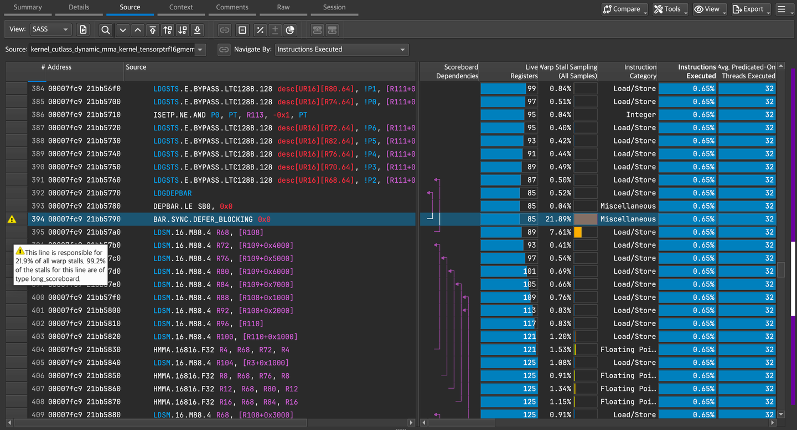

거시적 차원에서 볼 때 우리는 언제 warp stall 문제를 중점적으로 해결해야 할까? 고도로 최적화된 연산자에서 warp stall, 특히 Stall Wait가 나타나는 것은 매우 정상적인 일이다. 한 가지 예로, MMA 명령어를 무한 루프로 도는 연산자를 ncu로 profile 하면 이때 Tensor Core 이용률이 100%에 가깝고 warp stall 상황은 다음과 같다.

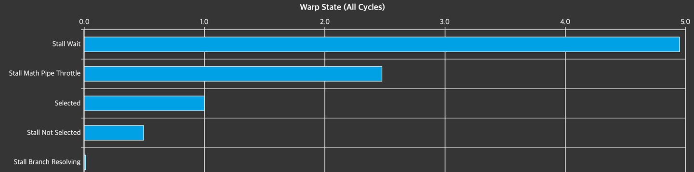

warp가 대부분의 시간 동안 앞선 MMA 명령어의 데이터 계산 완료를 기다리고 있음을 볼 수 있다. 따라서 성능이 기준에 도달하기만 한다면 warp stall을 없애려고 애쓸 필요는 없다. 일반적으로 계산과 메모리 접근 경로에서 뚜렷한 걸림돌을 찾지 못했는데도 처리량이 모두 비교적 낮은 상황이라면 warp stall 문제에 각별히 유의해야 한다.

---

## 6. Multi-stage Software Pipelining

위에서 우리는 현재의 GMEM 연산자에 대해 성능 분석을 수행했고, Compute와 Memory 차원에는 병목이 그리 많지 않지만 Tensor Core 이용률이 여전히 70%에 못 미친다는 것을 발견했다. 이는 Latency-bound가 이 연산자의 주된 성능 병목임을 뜻한다. warp 분석 과정에서도 eligible warps가 적은 편이고 warp stall의 cycle 수와 원인이 많은 편이며, 그중 Long Scoreboard가 주된 원인이고 MIO Throttle도 비교적 많다는 것을 발견했다. 이는 대량의 warp가 동시에 메모리 접근 자원을 다투는 문제가 있음을 뜻한다. **이 정보들을 종합하면 우리가 먼저 해결해야 할 것은 GMEM의 메모리 접근 대기 문제이며, 동시에 warp의 집중적 메모리 접근 문제도 해결해야 한다.**

현재 사용하는 GMEM -> SMEM 복사 명령어가 비동기이므로, 이 특성을 활용해 GMEM -> SMEM -> RF 라는 직렬 사슬을 GMEM -> SMEM 과 SMEM -> RF 두 부분으로 나누고, 소프트웨어 파이프라인 방식으로 두 부분을 병렬 실행할 수 있다.

구체적으로는 SMEM에 N개의 slot을 할당하고, 먼저 앞의 N-1 블록의 GMEM 데이터를 SMEM으로 비동기 복사한다. 그다음 N번째 블록의 GMEM에서 SMEM으로 가는 복사 명령어를 **비동기**로 스케줄하면서 첫 번째 블록의 SMEM -> RF 복사를 **동기**로 실행하여, GMEM -> SMEM 과 SMEM -> RF 의 병렬 overlap을 구현한다. 이것이 고전적인 **N-stage Software Pipelining**이다.

SMEM -> RF 복사 지연과 MMA의 계산 시간 사이에도 overlap의 기회가 있으므로, 비슷한 파이프라인 스케줄 순서를 설계하여 원래보다 몇 배의 레지스터 수를 소비하는 대신 복사와 계산을 병렬 실행하게 할 수 있다.

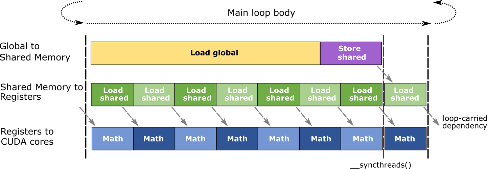

**Pipelining을 쓰는 데에는 뚜렷한 대가가 있다.** stage 수가 많을수록 추가로 할당해야 할 SMEM 자원과 레지스터 자원이 많아져 잠재적인 Occupancy 최적화 기회를 떨어뜨린다. 또한 stage가 많으면 데이터 블록이 더 잘게 쪼개지므로 우리의 Block MMA와 Tile MMA 규모를 줄일 수밖에 없게 되어 데이터 재사용률이 낮아진다. 따라서 stage 단계 수는 여러 요소를 종합적으로 고려해야 확정할 수 있다.

이어서 코드 부분이다. 먼저 N배의 SMEM을 할당해야 한다.

```python
sA_layout = cute.tile_to_shape(
    atom_AB,
    (BLK_M, BLK_K, NUM_STAGES),
    order=(0, 1, 2),
)
```

실행은 세 단계로 나뉜다. 먼저 **Prologue 단계**로, GMEM -> SMEM 비동기 복사 요청 N-1개를 발행한다. 범위 초과 문제를 조심스럽게 처리해야 한다는 점에 유의하라.

```python
tAsA[None, None, None, 0].fill(0)
tBsB[None, None, None, 0].fill(0)
cute.copy(
    g2s_tiled_copy_a,
    tAgA[None, None, None, 0],
    tAsA[None, None, None, 0],
    pred=tApA_first,
)
cute.copy(
    g2s_tiled_copy_b,
    tBgB[None, None, None, 0],
    tBsB[None, None, None, 0],
    pred=tBpB_first,
)
cute.arch.cp_async_commit_group()

# Stages 1 .. NUM_STAGES-2: full-tile copies, with overshoot guard.
k_tile_index = cutlass.Int32(1)
for ik in cutlass.range_constexpr(1, NUM_STAGES - 1):
    # Once we'd read past the end of K, mask everything off.
    if k_tile_index >= k_tile_count:
        tApA.fill(False)
        tBpB.fill(False)
    cute.copy(
        g2s_tiled_copy_a,
        tAgA[None, None, None, k_tile_index],
        tAsA[None, None, None, ik],
        pred=tApA,
    )
    cute.copy(
        g2s_tiled_copy_b,
        tBgB[None, None, None, k_tile_index],
        tBsB[None, None, None, ik],
        pred=tBpB,
    )
    cute.arch.cp_async_commit_group()
    k_tile_index = k_tile_index + 1
```

첫 번째 블록의 데이터가 SMEM에 도착하기를 기다린 다음, SMEM -> RF 로 첫 번째 작은 블록 데이터의 프리페치를 완료한다(K 차원에서 Tiled MMA 규모를 잘라 낸다). 레지스터 자원이 제한적임을 고려하면 이 단계 파이프라인의 stage 수는 최대 2다.

> 코드의 `cp_async_commit_group`은 앞서의 비동기 복사 명령어를 복사 요청 그룹으로 묶어 비동기 복사 엔진에 제출하고 명령어 실행을 시작하게 한다. 그리고 `cp_async_wait_group N`은 뒤에서 N번째 복사 요청 그룹 이전의 복사가 완료되기를 기다린다는 뜻이다. 여기서 우리는 이미 N-1개의 요청 그룹을 보냈고 목적은 첫 번째 블록의 데이터가 도착하기를 기다리는 것이므로, 뒤에서 N-2번째 요청 그룹 이전의 복사가 완료되기만 하면 된다. 특히 N=0 일 때는 모든 비동기 복사가 완료되기를 기다린다는 뜻이다.
>
> 비동기 명령어의 동기화 메커니즘은 이후 노트에서 상세히 분석하겠다.

```python
cute.arch.cp_async_wait_group(NUM_STAGES - 2)
cute.arch.sync_threads()

num_k_block = cute.size(tCrA, mode=[2])
smem_pipe_read = cutlass.Int32(0)
smem_pipe_write = cutlass.Int32(NUM_STAGES - 1)

# Prefetch first k_block from stage 0 into registers.
cute.copy(
    s2r_tiled_copy_a,
    tAsA_s2r[None, None, 0, smem_pipe_read],
    tArA_s2r[None, None, 0],
)
cute.copy(
    s2r_tiled_copy_b,
    tBsB_s2r[None, None, 0, smem_pipe_read],
    tBrB_s2r[None, None, 0],
)
```

두 번째 단계인 **Mainloop**는 위의 2단 파이프라인 병렬, 즉 GMEM -> SMEM 과 SMEM -> RF 복사의 병렬, 그리고 SMEM -> RF 와 MMA의 병렬을 포함한다. 따라서 여기에는 두 층의 루프가 있는데, 바깥층은 복사의 병렬이고 안층은 복사와 계산의 병렬이다.

```python
for _ in cutlass.range(k_tile_count, unroll_full=False):
    for k_block in cutlass.range_constexpr(num_k_block):
        ...
```

루프 안에서는 다음 데이터 블록에 대한 SMEM -> RF 복사 명령어와, 현재 레지스터에 이미 있는 데이터 블록의 MMA 계산 명령어를 교차 실행해야 한다.

```python
k_block_next = (k_block + 1) % num_k_block
cute.copy(
    s2r_tiled_copy_a,
    tAsA_s2r[None, None, k_block_next, smem_pipe_read],
    tArA_s2r[None, None, k_block_next],
)
cute.copy(
    s2r_tiled_copy_b,
    tBsB_s2r[None, None, k_block_next, smem_pipe_read],
    tBrB_s2r[None, None, k_block_next],
)

...

cute.gemm(
    tiled_mma,
    tCrC,
    tCrA[None, None, k_block],
    tCrB[None, None, k_block],
    tCrC,
)
```

다만 두 가지에 유의해야 한다. 하나는 안층 루프의 마지막 iter에서 다음 비동기 복사 그룹이 GMEM -> SMEM 복사를 완료하기를 반드시 먼저 기다려야 SMEM에서 데이터 프리페치를 계속할 수 있다는 것이다.

```python
if k_block == num_k_block - 1:
    cute.arch.cp_async_wait_group(NUM_STAGES - 2)
    cute.arch.sync_threads()
    smem_pipe_read = smem_pipe_read + 1
    if smem_pipe_read == NUM_STAGES:
        smem_pipe_read = cutlass.Int32(0)
```

다른 하나는 안층 루프의 맨 처음에 다음 비동기 복사 그룹을 issue 해야 한다는 것이다.

```python
if k_block == 0:
    if k_tile_index >= k_tile_count:
        tApA.fill(False)
        tBpB.fill(False)
    cute.copy(
        g2s_tiled_copy_a,
        tAgA[None, None, None, k_tile_index],
        tAsA[None, None, None, smem_pipe_write],
        pred=tApA,
    )
    cute.copy(
        g2s_tiled_copy_b,
        tBgB[None, None, None, k_tile_index],
        tBsB[None, None, None, smem_pipe_write],
        pred=tBpB,
    )
    cute.arch.cp_async_commit_group()
    k_tile_index = k_tile_index + 1
    smem_pipe_write = smem_pipe_write + 1
    if smem_pipe_write == NUM_STAGES:
        smem_pipe_write = cutlass.Int32(0)
```

세 번째 단계인 **Epilogue**는 레지스터의 결과를 GMEM으로 되돌려 복사하는 과정이며, 코드 구현은 앞서와 같다. 물론 복사 파이프라인을 한 벌 구성해 연산자 꼬리 구간의 성능을 최적화할 수도 있으니 독자가 직접 시도해 보기 바란다.

---

## 7. Occupancy 최적화와 최종 성능 양상

노트 (8)에서 우리 GEMM 연산자는 Occupancy를 최적화하기 위해 각 SM이 block 2개를 동시에 실행할 수 있도록 레지스터를 스레드당 128개로 이미 낮췄다. Pipelining 최적화를 채택한 뒤에는 Occupancy가 퇴화하지 않도록 레지스터와 SMEM의 할당을 어느 정도 최적화해야 한다.

Pipelining이라는 방법에서는 현재 stage의 상태를 추적할 레지스터 변수가 더 필요하다. 따라서 레지스터 수를 늘려 레지스터 프리페치를 구현하면 Occupancy에 영향을 주게 되므로, 실제 코드에서는 레지스터 프리페치 stage = 1 로 설정해 이 층의 파이프라인 최적화를 껐다.

동시에 Pipelining이 SMEM 사용량을 늘렸으므로 SMEM의 할당도 조정했다. 구체적으로는 C 행렬의 누산을 epilogue 단계로 옮기고 C, D 행렬의 SMEM이 A, B 행렬의 SMEM을 재사용하게 하여 대량의 SMEM 자원을 절약했고, 각 block의 SMEM 사용량을 96 KB로 낮췄다.

이런 최적화를 통해 얻은 최종 GEMM 연산자 성능은 아래 표와 같다.

| 계산 정밀도（M = N = K = 4096） | 노트 (8) 성능（us） | 노트 (9) 성능（us） |
| --- | --- | --- |
| FP16 = FP16 \* FP16 + FP16 | 458.82 | 409.95 |
| BF16 = BF16 \* BF16 + FP32 | 811.42 | 448.32 |

> BF16의 노트 (8) 성능이 나쁜 이유는 SMEM이 과도해 실제 Occupancy가 떨어졌기 때문이다.

---

## 8. 정리

이번 편에서는 GEMM 연산자를 예로 삼아 ncu로 연산자의 각종 성능 지표를 어떻게 관찰하는지 상세히 소개했고, 이를 근거로 연산자 성능을 최적화하는 몇 가지 해결 방안을 얻었다. 이어서 Software Pipelining 최적화 수단을 도입해 GMEM Long Scoreboard의 메모리 접근 지연 문제를 성공적으로 해결했다. 여기까지 SM80 및 그 이전 아키텍처의 GEMM 연산자 기법 소개를 마친다.

다음 편 노트에서는 CUTLASS의 상위 GEMM API를 간단히 소개하겠다. 그다음에는 SM90 및 그 이후의 새 아키텍처 특성을 차례로 도입해 GEMM 연산자 성능을 계속 최적화하겠다. 많은 기대 바란다!

[CUTLASS 노트 (10): CUTLASS GEMM API](https://zhuanlan.zhihu.com/p/2044122416549474840)

**마지막으로, 여기까지 읽어 주셔서 감사하다! 이 글이 도움이 되었다면 좋아요를 눌러 주기 바란다. 고맙다～**

# CUTLASS 노트 (10): CUTLASS GEMM API

이번 편에서는 주로 CUTLASS C++의 GEMM API를 간략히 소개한다. CuTe를 손으로 직접 짜고 싶지 않다면 GEMM API를 활용해 파라미터와 모듈 타입을 조정하는 것만으로 성능이 비교적 좋은 GEMM 융합 연산자를 빠르게 구현할 수 있다.

이번 편에서 사용하는 CUTLASS 버전은 4.5.0이고, 하드웨어 아키텍처는 SM90이다.

이 노트 시리즈의 관련 코드는 모두 오픈 소스로 공개되어 있다. 코드 저장소는 [cutlass-notes](https://github.com/ArthurinRUC/cutlass-notes) 이며, 많은 star 부탁드린다～

CUTLASS 노트 시리즈의 길잡이와 글 목록은 다음에서 자세히 볼 수 있다.

[CUTLASS 노트: 길잡이](https://zhuanlan.zhihu.com/p/1937220431728845963)

---

## 1. GEMM API 의 주요 착상

CUTLASS는 GEMM 융합 연산자를 본체인 GEMM 계산 로직 부분(Mainloop)과 GEMM 연산이 아닌 부분(Epilogue)으로 나눈다. 두 부분 모두 모듈화되어 있어 임의로 고를 수 있다.

```cpp
using CollectiveMainloop = cutlass::gemm::collective::CollectiveMma<
  DispatchPolicy,
  TileShape,
  ElementA,
  cutlass::gemm::TagToStrideA_t<LayoutA>,
  ElementB,
  cutlass::gemm::TagToStrideB_t<LayoutB>,
  TiledMMA,
  TiledCopyA_G2S,
  SmemLayoutAtomA,
  CopyA_S2R_atom,
  cute::identity, // A
  TiledCopyB_G2S,
  SmemLayoutAtomB,
  CopyB_S2R_atom,
  cute::identity // B
>;

using CollectiveEpilogue = cutlass::epilogue::collective::DefaultEpilogue<
    ElementC,
    cutlass::gemm::TagToStrideC_t<LayoutC>,
    cutlass::gemm::TagToStrideC_t<LayoutD>,
    cutlass::epilogue::thread::LinearCombination<ElementD,
                                                  1,
                                                  ElementAccumulator,
                                                  ElementCompute,
                                                  cutlass::epilogue::thread::ScaleType::Default,
                                                  cutlass::FloatRoundStyle::round_to_nearest,
                                                  ElementC>,
    cutlass::gemm::EpilogueDefault>;
```

CUTLASS GEMM API는 이 두 부분을 이어 붙여 하나의 융합 연산자로 만들고, 먼저 Mainloop를 실행한 뒤 Epilogue를 실행한다.

```cpp
using GemmKernel =
    cutlass::gemm::kernel::GemmUniversal<Shape<int, int, int>, CollectiveMainloop, CollectiveEpilogue>;

using Gemm = cutlass::gemm::device::GemmUniversalAdapter<GemmKernel>;
```

실행 시에는 `Gemm` 객체와 `Gemm::Arguments` 파라미터 객체를 만든다. 파라미터에는 주로 GEMM 타입, 규모(M/N/K), 행렬 데이터의 포인터와 각 차원의 보폭, epilogue의 파라미터, 하드웨어 정보 등이 포함된다. 그다음 파라미터에 따라 필요한 만큼 GMEM에 workspace buffer를 할당한다. 마지막으로 파라미터의 적법성을 검사하고 연산자 정보를 초기화하고 workspace를 할당한 뒤, run 함수를 호출해 연산자를 launch 한다. 이렇게 하면 GEMM 연산을 올바르게 실행할 수 있다.

```cpp
Gemm gemm;

typename Gemm::Arguments arguments{
    cutlass::gemm::GemmUniversalMode::kGemm,
    {M, N, K},
    {(ElementA *)Aptr, stride_A, (ElementB *)Bptr, stride_B},
    {{(ElementAccumulator)1.f, (ElementAccumulator)1.f}, (ElementC *)Cptr, stride_C, (ElementD *)Dptr, stride_D},
    kernel_hw_info};

// Using the arguments, query for extra workspace required for matrix multiplication computation
size_t workspace_size = Gemm::get_workspace_size(arguments);

// Allocate workspace memory
cutlass::device_memory::allocation<uint8_t> workspace(workspace_size);

// Check if the problem size is supported or not
CUTLASS_CHECK(gemm.can_implement(arguments));

// Initialize CUTLASS kernel with arguments and workspace pointer
CUTLASS_CHECK(gemm.initialize(arguments, workspace.get()));

// Correctness / Warmup iteration
CUTLASS_CHECK(gemm.run(stream));
```

---

## 2. GEMM API 파라미터 해설

GEMM의 동작을 제어할 수 있는 파라미터에 어떤 것이 있는지 살펴보자.

```cpp
using CollectiveMainloop = cutlass::gemm::collective::CollectiveMma<
  DispatchPolicy,
  TileShape,
  ElementA,
  cutlass::gemm::TagToStrideA_t<LayoutA>,
  ElementB,
  cutlass::gemm::TagToStrideB_t<LayoutB>,
  TiledMMA,
  TiledCopyA_G2S,
  SmemLayoutAtomA,
  CopyA_S2R_atom,
  cute::identity, // A
  TiledCopyB_G2S,
  SmemLayoutAtomB,
  CopyB_S2R_atom,
  cute::identity // B
>;
```

템플릿 파라미터 목록에서 `DispatchPolicy`는 GEMM 알고리즘을 나타낸다. 예를 들어 노트 (9)의 SM80 Multi-Stage Pipelining 알고리즘을 사용한다면 다음과 같이 설정할 수 있다.

```cpp
using DispatchPolicy = cutlass::gemm::MainloopSm80CpAsync<G2S_Stages>;
```

이어지는 파라미터 목록에 무엇을 채울지는 GEMM 알고리즘의 종류에 달려 있다. 현재의 알고리즘을 예로 들면 이어지는 `TileShape`는 Block의 규모이고, `ElementA`, `LayoutA`, `ElementB`, `LayoutB`는 A, B 행렬의 데이터 타입과 Layout이다. `TiledMMA`는 더 설명할 필요가 없다. 마지막은 A, B 행렬의 G2S TiledCopy, SMEM Layout, S2R Copy Atom 그리고 Transform 타입이다. 이런 TiledMMA, TiledCopy, Copy Atom의 구성은 모두 우리가 직접 CuTe로 완료해야 한다(그러니 그렇게까지 편하지는 않은 셈이다……).

다른 종류의 알고리즘에 어떤 파라미터가 대응하는지는 CUTLASS 소스 코드에서 찾아야 한다.

Epilogue의 파라미터는 변화가 더 많다. D = A \* B + C 라는 연산만 완료하면 된다면 `DefaultEpilogue`를 쓰고 `LinearCombination` 알고리즘을 고르면 된다. 물론 다른 요구에 대해서도 CUTLASS는 고를 수 있는 각종 알고리즘 구현을 제공하며, 심지어 여러 epilogue를 이어 붙여 실행할 수도 있다.

```cpp
using CollectiveEpilogue = cutlass::epilogue::collective::DefaultEpilogue<
    ElementC,
    cutlass::gemm::TagToStrideC_t<LayoutC>,
    cutlass::gemm::TagToStrideC_t<LayoutD>,
    cutlass::epilogue::thread::LinearCombination<ElementD,
                                                  1,
                                                  ElementAccumulator,
                                                  ElementCompute,
                                                  cutlass::epilogue::thread::ScaleType::Default,
                                                  cutlass::FloatRoundStyle::round_to_nearest,
                                                  ElementC>,
    cutlass::gemm::EpilogueDefault>;
```

CUTLASS가 3.x로 업그레이드되면서 `CollectiveMainloop`과 `CollectiveEpilogue`를 모두 통일된 `CollectiveBuilder` API로 구성할 수 있게 되었다. 다만 이 새로운 API는 SM90 이상의 아키텍처에만 대응한다. 그래서 나는 코드 예제에서 SM80 버전과 SM90 버전의 두 가지 구현을 제공했으니 독자는 필요에 따라 참고하기 바란다.

```cpp
using CollectiveMainloop = typename cutlass::gemm::collective::CollectiveBuilder<
    ArchTag,
    OperatorClass,
    ElementA,
    LayoutA,
    AlignmentA,
    ElementB,
    LayoutB,
    AlignmentB,
    ElementAccumulator,
    TileShape,
    ClusterShape,
    conditional_t<cute::is_same_v<StageCount, cutlass::gemm::collective::StageCountAuto>,
                  cutlass::gemm::collective::StageCountAutoCarveout<static_cast<int>(
                      sizeof(typename CollectiveEpilogue::SharedStorage))>,
                  StageCount>,
    KernelSchedule>::CollectiveOp;
```

`CollectiveBuilder`의 장점은, SM90 아키텍처의 특성 덕분에 각종 TiledMMA, TiledCopy를 우리가 직접 CuTe로 구성할 필요가 없고 `CollectiveBuilder`가 최적의 구현을 자동으로 골라 준다는 점이다. 따라서 파라미터로는 아키텍처 타입, 계산 타입, A, B 행렬의 정보, Block 규모와 Scheduler 타입만 넘기면 되므로 2.x API보다 쓰기가 훨씬 편하다.

유의할 점은 GEMM API로 얻은 연산자 성능이 반드시 최적인 것은 아니라는 점이다. 게다가 CUTLASS가 GEMM 알고리즘 구현을 고정해 두어 결합도가 비교적 높으므로 그 위에서 알고리즘을 조정하려는 것도 난이도가 있다. 그래서 이후 노트에서는 계속 CuTe DSL로 GEMM 연산자를 손으로 짜 나가겠다.

---

## 3. 정리

이번 편에서는 CUTLASS GEMM API의 사용 방법을 간략히 소개하고, CUTLASS 2.x와 3.x API의 주된 변화를 분석했다. 더 많은 자료는 CUTLASS 문서와 소스 코드를 찾아보면 된다. 다만 모두가 점차 CuTe DSL 기술 스택으로 옮겨 가고 연산자 개발의 요구도 갈수록 복잡해지는 상황에서, 앞으로 얼마나 많은 사람이 이 C++ API를 계속 쓸까……

다음 편 노트에서는 TMA에서 출발해 SM90 및 그 이후의 새 아키텍처 특성을 소개하기 시작하고, GEMM 연산자 성능을 차례로 최적화하겠다. 많은 기대 바란다!

**마지막으로, 여기까지 읽어 주셔서 감사하다! 이 글이 도움이 되었다면 좋아요를 눌러 주기 바란다. 고맙다～**
