> 블로그 원 주소: https://research.colfax-intl.com/cutlass-tutorial-persistent-kernels-and-stream-k/
> 블로그에 대응하는 전체 코드: https://github.com/ColfaxResearch/cfx-article-src/tree/master/streamk

# CUTLASS 튜토리얼: Persistent Kernel과 Stream-K

이 글은 GEMM(GEneral Matrix Multiplication) 튜토리얼 시리즈의 3부다. 1부와 2부에서는 단일 threadblock의 관점에서 GEMM을 자세히 다루면서 WGMMA matmul primitive, 파이프라이닝, warp specialization을 소개했다. 이번 편에서는 그리드 전체의 관점에서 GEMM을 살펴본다. 이 범위에서 최적화는 크게 두 갈래로 나뉜다. (1) L2 캐시 적중률을 최대화하기 위한 threadblock swizzling과 cluster의 활용, (2) GPU의 연산 자원을 포화시키고 좋은 load balancing을 달성하기 위한 threadblock 간 작업 분배의 개선이다. 이 글은 후자에 초점을 맞춘다(전자도 부록에서 함께 다룬다).

구체적으로는 [Stream-K](https://arxiv.org/abs/2301.03598)라는 분할 전략을 다룬다. Stream-K는 work tile의 개수가 SM(streaming multiprocessor) 개수로 나누어떨어지지 않을 때 발생하는 wave quantization 문제를 해결한다. 또한 M과 N은 작지만 K가 큰 경우처럼, 출력에 대한 일반적인 타일 기반 분할로는 GPU를 채우지 못하는 상황에서도 Stream-K가 유용하다.

이 글의 구성은 다음과 같다. 먼저 wave quantization 문제와 persistent kernel의 개념을 설명한다. 그다음 Stream-K와 그 선행 기법인 [Split-K](https://github.com/NVIDIA/cutlass/blob/main/media/docs/cpp/efficient_gemm.md#parallelized-reductions)를 포함해 GEMM 작업을 threadblock에 분배하는 여러 전략을, 특히 wave quantization을 어떻게 처리하는지에 주목하여 살펴본다. 이어서 커널 작성자가 자신만의 tile scheduler를 어떻게 작성할 수 있는지 설명한다. 예제로, 이 시리즈 2부에서 만든 GEMM 커널에 Stream-K 구현을 추가했으며 [Github에서 확인할 수 있다](https://github.com/ColfaxResearch/cfx-article-src/tree/master/streamk). 마지막으로 부록에서는 CUTLASS의 Stream-K 구현을 깊이 있게 들여다본다.

## 큰 그림: wave quantization 문제
NVIDIA GPU는 다수의 SM(streaming multiprocessor)으로 구성된다. 각 SM은 자체 shared memory, register file, Tensor Core 등을 가지며 서로 독립적으로 동작한다. 이상적인 워크로드는 SM 간에 작업을 균등하게 분배하여 커널이 실행되는 내내 모든 SM이 바쁘게 돌아가도록 함으로써, SM 간 병렬성을 최대한 활용한다. 그러나 일부 SM이 자기 몫을 다른 SM보다 빨리 끝내면, 나머지 SM이 끝날 때까지 놀면서 기다리게 된다. 이것이 load imbalance의 한 예다.

동일한 크기의 작업 단위로 나눌 수 있고, 각 작업 단위를 단일 SM이 같은 시간에 완료할 수 있는 계산을 생각해 보자. 예를 들어 GEMM은 보통 각각 하나의 bM x bN 출력 타일을 계산하는 작업 단위로 분할된다. 이 작업 단위들은 threadblock(CTA)에 할당되고, 각 CTA는 가용한 SM 위에서 자신에게 할당된 작업 단위를 계산한다. 작업 단위를 SM에 할당하는 것을 스케줄링(scheduling)이라고 부른다.

작업 단위의 수가 가용한 SM 수를 넘어서면, 작업 단위들은 여러 개의 wave로 나뉘어 처리된다. 여기서 1 wave란 가용한 모든 SM이 각각 하나의 작업 단위를 완료하는 것을 뜻한다.

wave quantization은 작업 단위의 수가 가용한 SM 수로 정확히 나누어떨어지지 않을 때 발생한다. 예를 들어 작업 단위가 10개, SM이 4개인 경우 작업 단위 실행 타임라인은 다음과 같다.

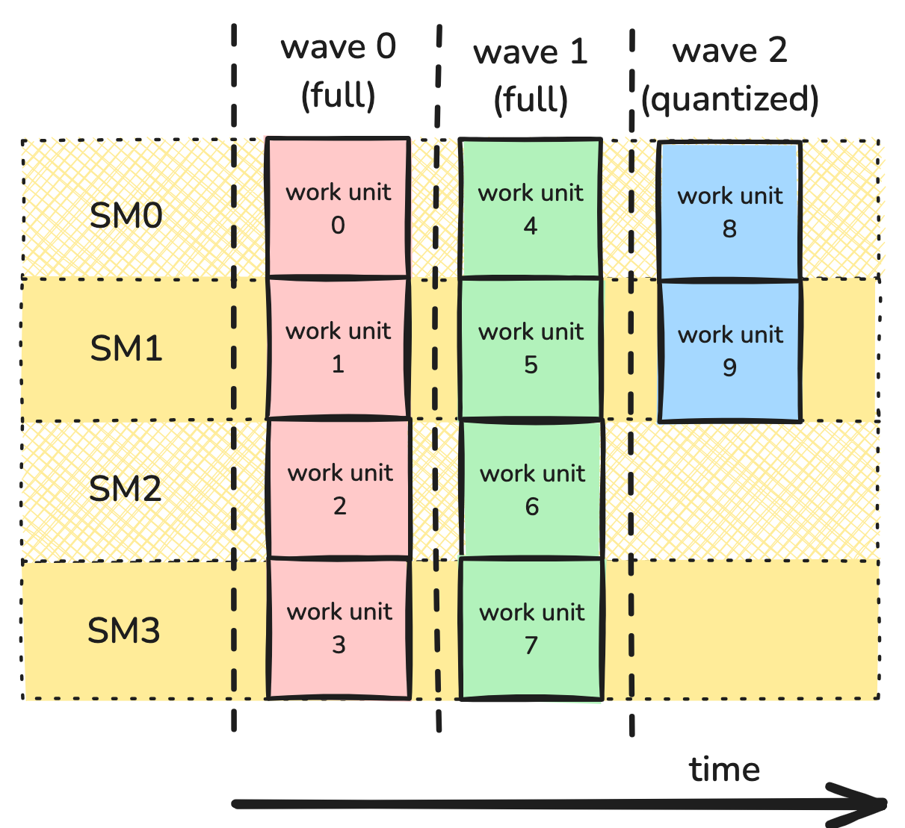

이 경우 처음 두 wave는 모든 SM이 활용되는 full wave다. 그러나 마지막 wave는 절반의 SM만 점유되는 partial wave다.

wave quantization은 작업 항목의 수가 SM 수에 비해 적을 때 성능을 심각하게 떨어뜨릴 수 있다. 예를 들어 SM이 114개인 H100 PCIe GPU에서, 작업 단위가 115개인 계산은 2 wave를 필요로 한다. 이는 작업 단위가 228개인 계산과 정확히 같다. 다시 말해 115번째 작업 단위를 추가하는 것만으로 장치 활용률이 대략 절반으로 떨어진다. 반대로 작업 단위가 114,001개인 계산도 동일한 양자화 효과를 겪기는 하지만, 그 비용은 커널 전체 비용에 비하면 미미하다. 더 자세한 내용은 [NVIDIA Deep Learning Performance Guide](https://docs.nvidia.com/deeplearning/performance/dl-performance-matrix-multiplication/index.html#wave-quant)에서 확인할 수 있다.

wave quantization의 영향을 예제로 관찰하기 위해, 이 시리즈 2부에서 만든 GEMM 커널을 사용하여 wave 수를 바꿔 가며 성능을 측정한다. MxK 행렬 A와 KxN 행렬 B의 GEMM을 생각한다. bM과 bN을 work tile의 차원이라 하고, 단순화를 위해 이들이 M과 N을 정확히 나눈다고 가정한다. 그러면 전체 wave 수는 ceil((M/bM * N/bN)/num_SMs)로 주어진다. 양자화의 효과를 관찰하려면 (M/bM * N/bN)/num_SMs로 주어지는 tiles-per-SM을 변화시켜야 하며, 소수 부분은 마지막 wave가 얼마나 차 있는지를 나타낸다. 따라서 M=1024, K=4096으로 고정하고 N을 bN 단위(여기서는 192)로 증가시킨다.

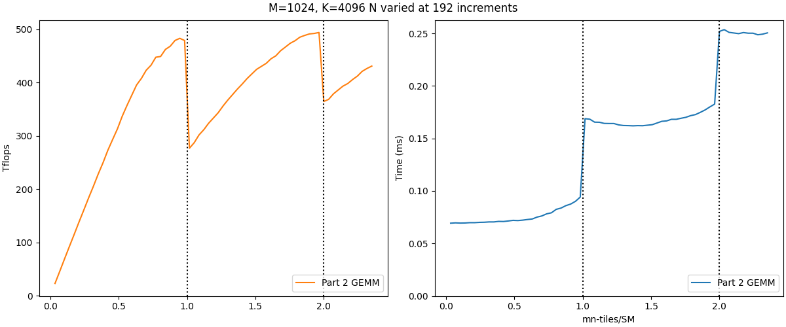

왼쪽 그래프는 TFLOPs/s 단위의 성능을, 오른쪽 그래프는 경과 시간을 보여 주며, 벤치마크는 H100 PCIe GPU에서 측정했다. 수직 점선은 tiles-per-SM이 정수를 지나는 wave 경계를 나타낸다. 왼쪽 그래프에서는 wave 경계를 넘을 때 성능이 급격히 떨어지는 wave quantization 효과가 나타난다. 이에 대응하여 오른쪽 그래프는 경과 시간이 대체로 전체 wave 수라는 이산적인 값(x가 (0,1]이면 1, (1,2]이면 2, 이런 식)에 의해 결정됨을 보여 준다.

두 번째 양자화 효과가 첫 번째보다 작다는 점에 주목할 필요가 있다. wave 수가 늘어날수록 wave quantization의 영향은 줄어든다. 그러나 wave 수를 늘리는 것은 쉽지 않으며, 특히 NVIDIA GPU의 SM 수가 새로운 아키텍처마다 계속 증가하고 있다는 점을 고려하면 더욱 그렇다. 따라서 문제 크기에 대한 가정 없이 wave quantization의 영향을 완화할 전략을 마련하는 것이 중요하다.

Persistent Kernel
wave quantization을 해결하려면 더 나은 분할 및 스케줄링 방식이 필요하다. 이 블로그에서 지금까지 보여 준 커널들은 문제의 차원에 의존하는 그리드를 사용하여, 각 CTA가 하나의 작업 단위를 처리했다. 예를 들어 GEMM에서 작업 단위는 MxN 출력 행렬의 bMxbN 타일이며, bM과 bN은 컴파일 타임에 고정된다. 각 작업 단위는 M/bM x N/bN 그리드 안의 CTA 하나가 계산한다. 따라서 launch 파라미터는 다음과 같은 모습이 된다.

```cpp
dim3 dimGrid(ceil_div(M, bM), ceil_div(M, bN));
```
이 방식의 문제는, threadblock이 SM에 어떻게 분배되는지를 어느 정도 제어할 수는 있어도 더 복잡한 스케줄링 전략을 구현하기는 어렵다는 점이다. 그래서 여기서는 다른 설계 방식인 persistent kernel을 사용한다. persistent kernel에서는 그리드의 크기가 고정된 값이다. 보통 이 값은 가용한 SM 수와 같게 두어, 각 CTA가 자신만의 SM을 갖도록 한다. dimGrid에 사용할 SM 수는 다음 CUDA 코드로 알아낼 수 있다.

```cpp
int num_SMs;
cudaGetDeviceAttribute(&num_SMs, cudaDevAttrMultiProcessorCount, device_id);
 
dim3 dimGrid(num_SMs);
```
각 CTA는 자신의 SM에 계속 남아(persist) 모든 작업이 끝날 때까지 여러 작업 단위를 처리한다. 이 설계 변경은 각 CTA에게 작업 단위를 어떻게 순회할지 알려주는 방식으로, 프로그래머에게 훨씬 큰 스케줄링 제어권을 제공한다. 이 유연성을 이용해 wave quantization과 load imbalance를 최소화하는 방향으로 작업을 분배할 수 있다.

실제로 작업 단위를 CTA에 할당하는 일은 보통 tile scheduler에 위임된다. tile scheduler는 본질적으로 각 CTA에게 다음 작업 단위를 어디서 찾을지, 그리고 언제 멈출지를 알려주는 다소 거창한 iterator다. 각 출력 타일에 필요한 전체 작업량 자체는 달라지지 않지만, tile scheduler를 바꿈으로써 Stream-K처럼 load imbalance를 최소화하는 더 복잡한 전략을 탐색할 수 있게 된다.

## persistent kernel으로 wave quantization 다루기
Stream-K로 나아가기 위해, 먼저 wave quantization을 다루는 더 단순하지만 비효율적인 접근들을 살펴보는 것이 도움이 된다. Stream-K 논문에 이에 대한 훌륭하고 깊이 있는 논의가 있으니 읽어 보기를 권한다. 독자의 편의를 위해 여기서는 그 논의를 요약한다.

이 절에서 숫자를 다루기 쉽게 하기 위해, SM이 4개뿐인 가상의 GPU인 Hipparchus H10을 가정한다.

### Data Parallel

가장 기본적인 버전부터 시작한다. 타일을 M-mode와 N-mode로 균등하게 나누고 round-robin 방식으로 할당하는 것이다. 이는 사실상 non-persistent 방식으로 work tile 그리드를 launch하는 커널의 경우와 동일하며, 유일한 차이는 순서가 보장된다는 점이다. 그럼에도 wave quantization이 문제가 되는 상황을 이해하기 위해 살펴볼 가치가 있다. 작업 단위 사이에 의존성이 없으므로 이를 data-parallel 작업 스케줄이라고 부른다.

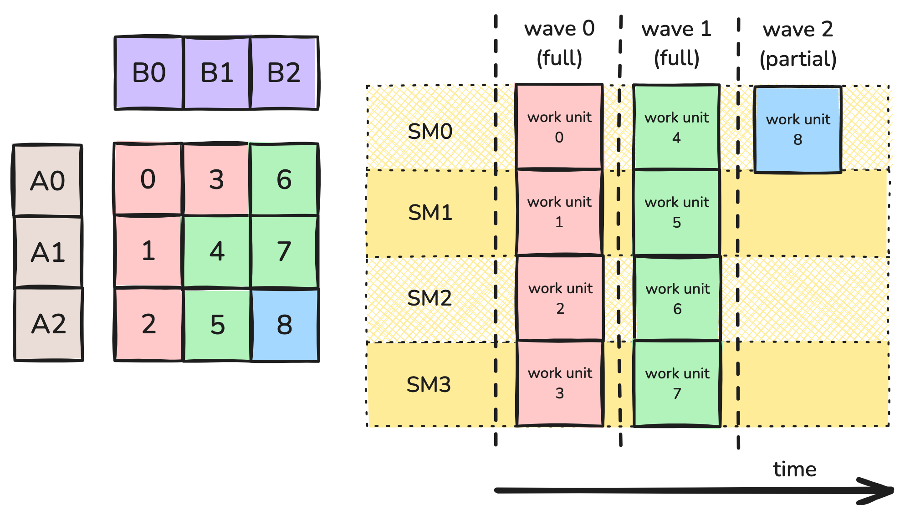
                            그림 1: Data-parallel 분할.

                            
그림 1은 분할의 예를 보여 준다. 여기서 GEMM 워크로드는 9개의 work tile로 나뉜다. 작업 항목이 모두 동일하므로 타일들은 wave 단위로 처리된다. 구체적으로 9개의 work tile은 H10의 4개 SM에서 3개의 wave로 처리된다. 2개의 full wave와, 4개 SM 중 1개만 점유되는 partial wave다. 각 work tile이 자신의 SM에서 100% 활용률을 낸다고 하면, 계산 전체의 활용률은 2.25/3 = 75%가 된다.

가장 직접적인 접근은, 작업 단위가 많을수록 wave quantization이 덜 문제가 된다는 사실로 돌아가는 것이다. 그리고 각 작업 단위를 더 작게 만들면 작업 단위 수를 늘릴 수 있다.


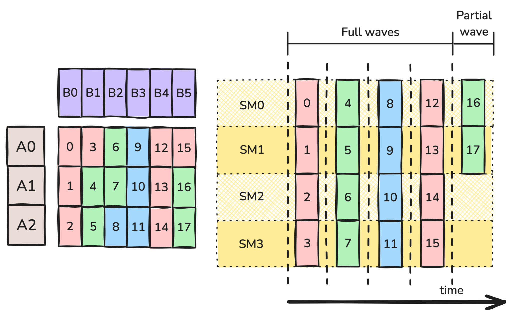
그림 2: bN을 절반으로 줄인 data-parallel 분할.

그림 2에서는 N 방향으로 bN을 2로 나누었다. 이제 work tile이 18개가 되고, 이는 5개의 wave로 수행될 수 있다. 4개의 full wave와, 4개 SM 중 2개가 점유되는 partial wave다. 다시 한번 각 work tile이 100% 활용률로 계산된다고 가정하면, 계산 전체의 활용률은 4.5/5 = 90%다. 게다가 그림 2의 각 work tile은 그림 1의 work tile에 비해 FLOP이 절반이므로, 1차 근사로는 각 wave가 그림 1의 wave의 절반 시간이 걸려야 한다. 따라서 그림 2의 wave가 5개이고 그림 1이 3개임에도, 그림 2에 걸리는 시간은 그림 1의 (5*0.5)/3 = 83%에 불과하다. 무엇이 잘못될 수 있을까?

안타깝게도 위 논의는 지나치게 단순한 가정을 몇 개 하고 있으며, 더 이상 Hipparchus H10의 동작을 올바르게 모델링하지 않는다. 핵심 문제는 타일 크기가 줄어들수록 work tile의 계산이 덜 효율적으로 될 수 있다는 점이다. 따라서 타일 크기를 절반으로 줄이면 계산 시간도 절반이 되거나 단일 CTA의 활용률이 유지된다는 가정은 틀릴 수 있다.

주요 단점 중 하나는 arithmetic intensity의 손실이다. 메모리 접근은 시간이 많이 들기 때문에, 메모리 접근 지연을 감추려면 연산 횟수가 충분히 많아야 한다. GEMM에서 $bM \times bN \times bK$ matmul 타일을 계산하는 CTA는 $2\cdot bM \cdot bN \cdot bK$ 번의 연산과 $(bM \cdot bK + bN \cdot bK + bM \cdot bN)$ 번의 GMEM 접근을 수행한다. bN을 절반으로 줄이면 앞의 수는 절반이 되지만 뒤의 수는 그렇지 않다. 예를 들어 128 x 128 x 128 work tile 크기는 GMEM 전송당 85.3번의 연산을 내지만, 128 x 64 x 128 work tile 크기는 GMEM 전송당 64번의 연산에 그친다.

추가적인 문제로, CTA 크기가 그대로라고 가정하면 타일 크기를 절반으로 줄인다는 것은 CTA 내 각 warp가 처리하는 명령어 수도 절반이 된다는 뜻이다. 이는 warp scheduler가 활용할 수 있는 latency hiding 기회를 줄이는데, 이 기회는 파이프라인화된 GEMM의 좋은 성능에 필수적이다.

마지막으로, MMA atom의 선택과 관련하여 타일 크기에 제약이 있을 수 있다. 예를 들어 H10이 최대 처리량을 위해 128 x 128 x 16 WGMMA atom의 사용을 요구할 수도 있다. 이는 타일의 최소 크기에 또 하나의 제약을 더한다.

이러한 고려 사항들 사이의 균형점은 그리 자명하지 않으며, 특정 문제에 적합한 타일 크기를 찾으려면 시행착오가 필요할 수 있다. 예를 들어 CUTLASS Profiler를 사용할 수 있다.

### Split-K
지금까지는 M-mode와 N-mode로만 나누었지만, 나눌 수 있는 차원이 하나 더 있다. 바로 K-mode다. 이는 K가 클 때 가장 효과적이다. 앞에서와 마찬가지로, bK가 너무 작아지면 arithmetic intensity와 latency hiding 측면에서 비용이 발생한다.

Split-K 스케줄은 타일을 K-mode를 따라 정해진 개수의 조각으로 나눈다. 예를 들어 그림 3에서는 K mode를 따라 2개의 작업 항목으로 나누었다.

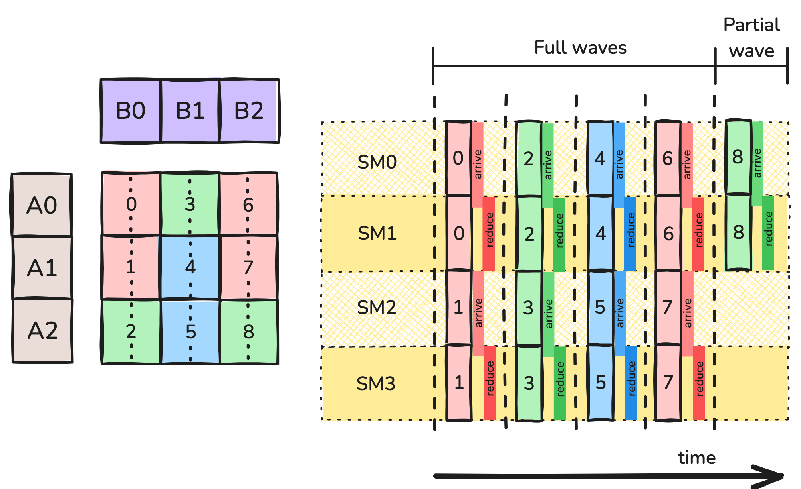
그림 3: Split-K 분할.
이 전략은 새로운 복잡성을 도입한다. 각 CTA는 자신의 bM x bN 출력 타일에 대해 부분 결과만 누적하고 있다는 점이다. 계산을 완성하려면 이 출력 타일을 함께 담당한 CTA들이 결과를 합쳐야 한다. 이를 처리하는 전형적인 방법은 보조 GMEM workspace에서의 turnstile reduction이다. 주어진 타일을 함께 담당하는 각 CTA는 이전 K-index를 담당하는 CTA들이 barrier에 도달할 때까지 기다린 뒤, 자신의 부분 결과를 workspace에 reduce하고 자신도 barrier에 도달한다. 마지막 CTA는 workspace로 reduce하는 대신, workspace로부터 자신의 accumulator로 reduce한 다음 epilogue를 계산한다. 추가적인 GMEM 접근과 barrier 동기화는 부가적인 오버헤드를 유발하며, 그림 3에 "arrive"와 "reduce" 블록의 형태로 나타나 있다.

Split-K는 split 개수라는 새로운 하이퍼파라미터를 도입하며, 여기에는 나름의 트레이드오프가 따른다.

- split 개수를 늘리면 wave quantization 효과가 줄어들어, 전체적으로 SM 활용률이 좋아질 수 있다.
- split 개수를 늘리면 K 방향의 타일 크기가 줄어들어, 계산 대비 GMEM 접근의 비율이 커질 수 있다.
- split 개수를 늘리면 CTA당 명령어 수도 줄어들고, 따라서 latency hiding 기회도 줄어든다.
- Split-MN에는 없던 동기화 및 reduction 오버헤드가 새로 도입된다. split이 많을수록 동기화 비용이 커진다.
### Stream-K
지금까지 살펴본 전략들은 wave quantization 문제를 개선했지만 없애지는 못했다. 처음의 예인 4개 SM에 걸친 9개 work tile로 돌아가 보면, 각 SM이 2.25 wave를 수행할 수 있다면 이상적일 것이다. 이것이 **Stream-K**의 동기다.

Stream-K 전략은 각 SM에 단일한 persistent CTA를 할당한다. 각 CTA에는 소수 개의 work tile이 할당되며, 나뉘는 work tile은 K-mode를 따라 나뉜다. Split-K 전략에서와 마찬가지로, 나뉜 각 work tile에 대해 그 타일을 함께 담당하는 CTA들은 GMEM workspace에서 turnstile reduction으로 결과를 합칠 수 있다.

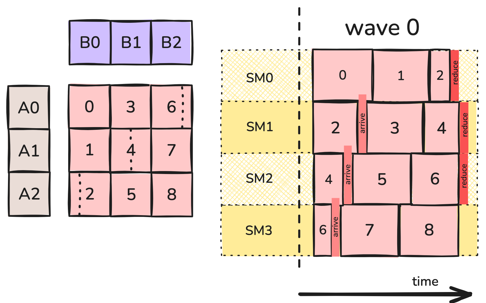
그림 4: Stream-K 분할.
예를 들어 그림 4에서 SM0의 persistent CTA는 work tile 0 전체, work tile 1 전체, 그리고 work tile 2의 1/4을 계산한다. SM1의 persistent CTA는 work tile 2의 나머지, work tile 3 전체, 그리고 work tile 4의 절반을 계산하며, 이런 식으로 이어진다. 부분 타일들은 한 work tile의 첫 조각이 마지막 조각보다 충분히 앞서 계산되도록 스케줄링되어 동기화 오버헤드를 최소화한다(다만 K 방향으로 매우 긴 타일의 경우에는 항상 가능하지는 않다).

Stream-K를 앞서 논의한 전략들과 비교하면 다음과 같다.

- wave를 없앰으로써 양자화를 제거했다. 각 CTA는 2.25개의 work tile을 계산한다. 동기화와 reduction에 드는 추가 시간을 제외하면, 전체 계산은 원래 커널에 필요했던 3 단위에 비해 대략 2.25 단위가 되어야 한다.
- 원래의 128 x 128 x 128 work tile 중 상당수는 단일 CTA가 통째로 처리하므로, 큰 work tile의 장점인 높은 연산 대 메모리 비율, 긴 명령어 시퀀스, 큰 WGMMA 명령어의 활용 가능성을 부분적으로 유지한다. 첫 번째 커널이 CTA당 100% 활용률로 동작할 수 있었다면, 이 커널도 그럴 수 있다.
- 많은 경우 출력 타일의 앞쪽 조각들을 마지막 조각보다 충분히 앞서 계산하도록 스케줄링할 수 있어서, epilogue를 담당하는 CTA가 barrier에서 실제로 오래 기다릴 필요가 없다.
- 다만 부분 타일의 데이터를 CTA 간에 공유하기 위해 추가적인 GMEM 전송이 필요하다.

### Hybrid Stream-K
커널에 마지막으로 한 가지 개선을 더할 수 있는데, 캐시 성능에 관한 것이다. 타일 기반 GEMM 커널의 특성상, 각 operand 타일은 여러 개의 출력 work tile을 계산하는 데 필요하다. 예를 들어 split-MN의 경우, 타일 B0는 출력의 타일 0, 1, 2를 계산하는 데 필요하다.

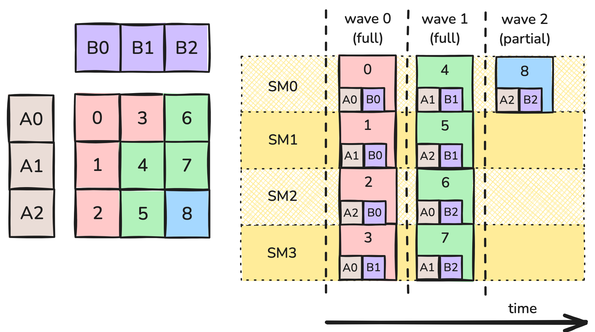
그림 5: wave에서의 데이터 재사용.
여기서 출력 타일 0, 1, 2는 동시에 계산된다. CTA 중 하나가 global memory에서 타일 B0를 가져오면, 그 데이터는 L2 캐시에도 올라간다. 타일 B0를 요청하는 다른 CTA들은 캐시에서 적중하여 더 빠르게 로드할 수 있다. 캐시 크기는 유한하고 오래된 데이터는 evict될 수 있으므로, 이 요청들이 비슷한 시점에 일어나는 것이 중요하다.

더 정확히 말하면, operand 타일들도 K 방향으로 분할되어 있고 각 CTA는 자신의 operand 타일의 K-block에 대해 내부 루프를 수행한다. wave 0이 시작되면 SM 0, 1, 2는 동시에 타일 B0의 0번째 K-block을 요청하고, 그중 둘은 캐시에서 적중한다. 루프의 다음 반복에서 SM 0, 1, 2는 타일 B0의 1번째 K-block을 요청하며, 이런 식으로 이어진다.

그러나 stream-K 커널은 skew를 유발한다. 각 SM이 서로 다른 크기의 부분 타일을 계산하며 시작하기 때문에, 같은 시점에 서로 다른 K-offset을 다루는 경향이 생긴다. 그림 4로 돌아가 보면, SM 0과 1은 wave 0의 시작 시점에 모두 B0의 데이터를 사용하고 있지만 SM0는 0번째 K-block이 필요한 반면 SM1은 중간쯤의 데이터가 필요하다. 사실 이 스케줄에서 K-offset은 결코 맞아떨어지지 않으며, 캐시 적중을 얻기가 훨씬 어려워진다. 요약하면, "wave"를 없애고 서로 다른 SM들을 비동기적으로 스케줄링한 결과 캐시 성능 악화라는 숨은 비용이 발생한 것이다.

이 문제는 계산을 persistent kernel과 일반적인 data-parallel 커널의 혼합 형태로 다시 스케줄링하여 해결할 수 있다. data-parallel 스케줄은 skew를 겪지 않으므로, 가능한 한 오래 이 스케줄을 사용하고 wave quantization 효과를 처리할 만큼의 타일에만 Stream-K를 남겨 두는 것이 합리적이다. Stream-K 단계에서 SM 간 작업 부하를 제대로 맞추려면, 이 단계에 1개의 full wave와 남는 partial wave를 할당해야 한다.

이 스케줄이 그림 6에 나와 있다. 초기 Stream-K 단계는 계산의 1~2 full wave에 해당하는 분량을 처리한다. 각 SM은 최대 2개의 부분 work tile을 받는다. 설계상 이 타일들의 전체 크기는 CTA에 무관하므로, 모든 CTA가 이 단계를 비슷한 시점에 끝낼 것으로 기대된다. 이 단계가 끝나면 온전한 work tile만 남고, 남은 개수는 SM 수로 나누어떨어진다. 따라서 이 work tile들은 wave quantization을 겪지 않고 캐시 성능도 더 좋은 non-persistent data-parallel 전략으로 계산할 수 있다. 이것이 그림 6에 나타나 있다.

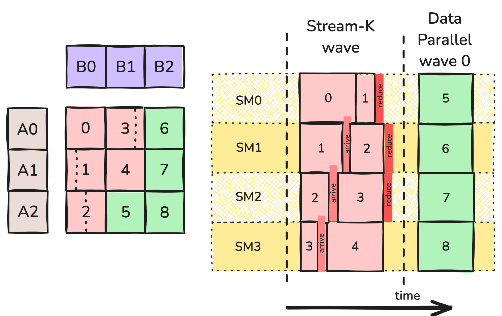
그림 6: Hybrid Stream-K 분할.
여기서 work tile 6, 7, 8의 계산은 거의 같은 시점에 일어나고 operand 타일 B2에 대해 캐시 적중을 얻을 것으로 기대할 수 있다. 마찬가지로 work tile 5와 8은 공유하는 A 타일에 대해 캐시를 활용할 수 있다. 이 경우 data-parallel 단계는 1 wave로만 이루어지지만, work tile이 더 많은 큰 GEMM이라면 data-parallel 단계가 더 길어지고 캐시도 더 많이 활용하게 된다.

## tile scheduler 추상화
작업을 분할하고 스케줄링하는 문제는 CTA 단위의 메모리 및 연산 동작과 대체로 분리되어 있기 때문에, CUTLASS 같은 GEMM 구현들은 이를 tile scheduler라는 추상화로 감싸는 경우가 많다. (이는 GEMM에 국한되지 않는다. 예를 들어 [FlashAttention-3도 tile scheduler 클래스를 통해 persistent kernel을 지원한다.](https://github.com/Dao-AILab/flash-attention/blob/main/hopper/tile_scheduler.hpp)) 다음 절에서는 CUTLASS의 구현을 구체적으로 살펴보고, 여기서는 tile scheduler의 역할을 일반적인 수준에서 정리한다.

먼저 커널의 그리드 형태가 tile scheduling에 의존한다. 따라서 tile scheduler는 커널의 그리드 크기를 결정할 책임이 있다. non-persistent kernel의 경우 이는 논리적 그리드와 동일하며 문제 크기에 의존한다. persistent kernel의 경우에는 고정된 값이며 대개 SM 수와 같다. 시작 시점에 tile scheduler에 그리드 크기를 질의하고, 이를 커널 launch에 사용한다.

커널 내부에서는 각 스레드가 tile scheduler의 인스턴스를 생성한다. 이제 mainloop와 epilogue는 scheduler가 제공하는 타일에 대한 작업 루프로 감싸이며, 다음과 같은 모습이 될 수 있다.

```cpp
for (auto worktile = scheduler.get_initial_tile();
    scheduler.is_valid(worktile);
    worktile = scheduler.get_next_tile(worktile)) {
        auto [m_block, n_block, k_block_start, k_block_stop] = worktile.get_block_coord();
        for (k_block = k_block_start; k_block &lt; k_block_stop; ++k_block) {
            // mainloop
        }
        // epilogue
}
```
이러한 iterator primitive를 구현하는 간단한 방법은 scheduler가 worktile에 대한 선형 인덱스를 유지하는 것이다. persistent kernel에서 각 CTA는 처음에 blockIdx.x(이는 곧 해당 SM의 선형 인덱스다) 인덱스의 worktile을 받고, gridDim.x(SM 수)만큼 앞으로 건너뛰어 다음 타일로 이동하며, 인덱스가 전체 타일 수를 넘지 않는 한 그 타일은 유효하다. 선형 인덱스를 실제 (M, N) 타일 좌표로 매핑하는 일은 worktile 객체에 위임된다.

이것만으로도 persistent data-parallel 스케줄에는 충분하지만, 더 정교한 스케줄에는 더 많은 기능이 필요하다. Stream-K에서는 K 방향 작업 할당의 크기가 타일마다 다르므로, worktile은 위 코드처럼 네 개의 좌표를 커널에 제공해야 한다.

Stream-K와 Split-K 모두에서 일부 또는 모든 CTA가 부분 결과를 출력하고 이를 나중에 합쳐야 하며, 이는 다음을 함의한다.

- 부분 결과를 위한 공간과, 하나의 타일을 함께 담당하는 CTA 간 동기화를 위한 barrier 객체 배열을 위해 추가적인 GMEM workspace가 필요하다. 필요한 공간의 크기는 문제 크기에 의존하므로 커널 launch 전에 동적으로 할당해야 한다. 커널 실행 중에는 scheduler가 CTA에게 workspace 내의 적절한 포인터를 제공해야 한다.
- 새로운 worktile을 시작할 때, 각 CTA는 이것이 완전한 출력 타일인지(결과를 출력 텐서에 저장) 부분 타일인지(결과를 workspace에 저장)를 알아야 한다.
- 출력 타일에서 epilogue를 수행할 책임은 오직 하나의 CTA에게 있다. 그 CTA는 workspace로 reduce하는 대신, workspace로부터 자신의 accumulator로 reduce한 다음 epilogue를 수행해야 한다. scheduler는 각 CTA에게 자신이 담당하는 각 타일에 대해 epilogue 책임이 있는지 여부를 알려주어야 한다.

CUTLASS 구현에서 볼 수 있듯이 이 단순한 개요에는 여러 개선의 여지가 있다. scheduler가 타일을 어떤 순서로 launch할지 결정하게 하는 것, 휴리스틱을 사용해 Stream-K에서 Split-K나 data-parallel 모드로 폴백하는 것, 그리고 Hopper에서는 cluster를 제대로 활용하는 것 등이다. 다음 절에서 이를 살펴본다.

[GitHub의 코드 샘플](https://github.com/ColfaxResearch/cfx-article-src/tree/master/streamk)은 세 가지 scheduler 예제를 제공한다. 문제 형태로 결정되는 그리드 위에서 각 CTA에 worktile 하나를 할당하는 간단한 non-persistent scheduler, data-parallel persistent scheduler, 그리고 CUTLASS의 최적화 중 일부(전부는 아님)를 반영한 Stream-K hybrid scheduler다. 실제로 해 본 결과 합리적인 성능을 얻으려면 CUTLASS의 최적화 중 상당수가 필요했다. 특히 reduction으로 인한 추가 GMEM 접근과 작아진 타일 크기는 실질적인 비용이며, 이 비용을 최소화하려면 Stream-K 작업 할당의 경계를 세심하게 조정해야 한다.

Stream-K tile scheduler의 성능 지표 일부를 아래에 정리했다. data-parallel scheduler와 비교했을 때, 이 Stream-K 구현은 각 wave의 초반부에서 좋은 성능을 내며 wave quantization 효과를 줄이지만, 마지막 partial wave가 차기 시작하면 성능이 떨어진다. "Heuristic" 곡선은 마지막 wave가 절반 이상 차면 Stream-K에서 data-parallel로 전환하는 CUTLASS의 휴리스틱을 사용한다. 이는 분명히 좋은 선택이다.

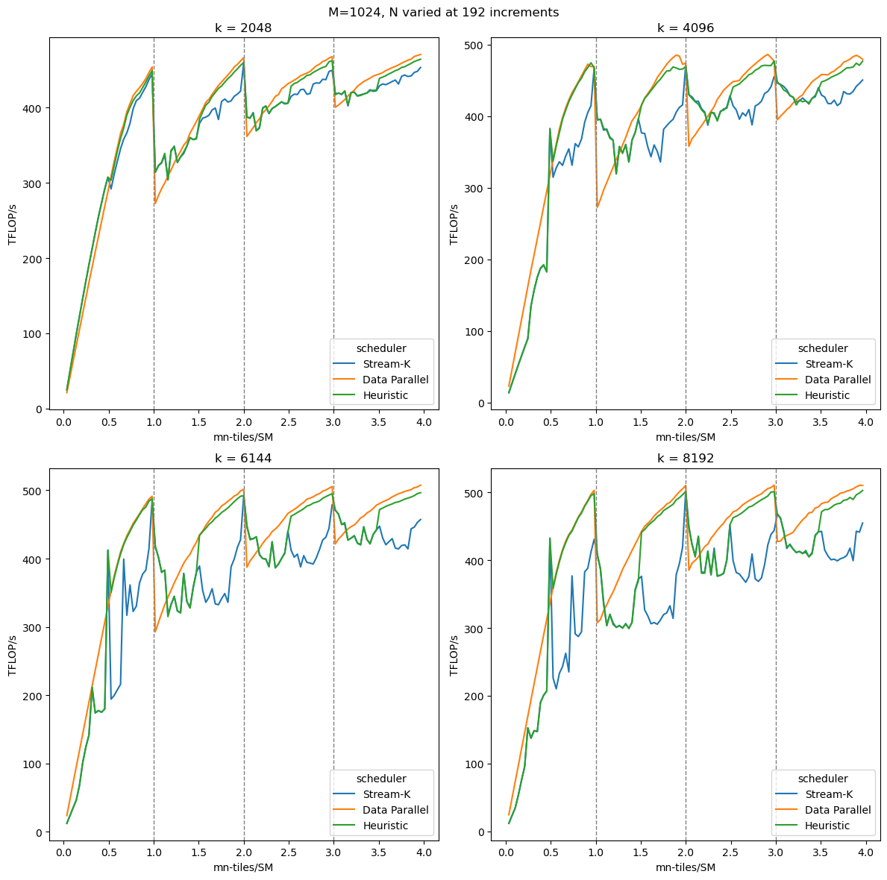

## 결론
이 글에서는 wave quantization과 그것이 GEMM 성능에 미치는 영향을 다루었다. 2부에서 만든 GEMM 구현에서 wave quantization으로 인한 상당한 성능 변동을 관찰했다. 그런 다음 wave quantization에 대응하는 여러 전략을 Stream-K를 중심으로 논의했다. 마지막으로, GEMM 구현에서 wave quantization의 영향을 제거하기 위한 Stream-K tile scheduler의 한 버전을 제시했다. 이로써 CUTLASS/CuTe 추상화를 사용해 성능 좋은 Hopper 기반 GEMM을 구현하는 3부작 시리즈를 마친다.

## 부록: CUTLASS의 Stream-K
이 부록에서는 CUTLASS의 Stream-K에 대한 좀 더 세부적인 내용을 다룬다. 사용법, 다른 scheduler 대비 성능, 그리고 구현에 사용된 최적화 몇 가지다.

### GEMM API로 Stream-K 사용하기
먼저 CUTLASS 3.X GEMM API로 Stream-K scheduler를 사용하는 방법을 다룬다. CUTLASS 3.X GEMM API를 간략히 복습하는 것으로 시작한다. 논의는 Stream-K와 관련된 부분으로 한정하지만, 더 자세한 [문서](https://github.com/NVIDIA/cutlass/blob/main/media/docs/cpp/gemm_api_3x.md)와 [예제](https://github.com/NVIDIA/cutlass/tree/main/examples)는 CUTLASS 저장소에서 찾을 수 있다. 여기의 코드 샘플은 CUTLASS [example 48](https://github.com/NVIDIA/cutlass/blob/main/examples/48_hopper_warp_specialized_gemm/48_hopper_warp_specialized_gemm.cu)을 기반으로 한다.

CUTLASS GEMM API는 세 부분으로 구성된다.

- Epilogue – 부분 결과를 어떻게 합치고, 필요하다면 어떻게 변형할지 정의한다.
- Mainloop – 개별 worktile을 어떻게 계산할지 정의한다.
- Kernel – epilogue와 mainloop를 감싸는 wrapper다.

이들은 각각의 CollectiveBuilder로 생성되며, CollectiveBuilder는 개발자가 GEMM 커널을 구성할 수 있게 해 준다. 개발자는 CUTLASS가 내부 휴리스틱에 따라 적절한 구성을 자동으로 선택하도록 맡길 수도 있다. 다음은 이 auto 기능을 사용한 GEMM 커널이다.

```cpp
using CollectiveEpilogue = typename cutlass::epilogue::collective::CollectiveBuilder&lt;
    cutlass::arch::Sm90, cutlass::arch::OpClassTensorOp,
    TileShape, ClusterShape,
    cutlass::epilogue::collective::EpilogueTileAuto,
    ElementAccumulator, ElementAccumulator,
    ElementC, LayoutC, AlignmentC,
    ElementC, LayoutC, AlignmentC,
    cutlass::epilogue::collective::EpilogueScheduleAuto
  >::CollectiveOp;
 
using CollectiveMainloop = typename cutlass::gemm::collective::CollectiveBuilder&lt;
    ArchTag, OperatorClass,
    ElementA, LayoutA, AlignmentA,
    ElementB, LayoutB, AlignmentB,
    ElementAccumulator,
    TileShape, ClusterShape,
    cutlass::gemm::collective::StageCountAutoCarveout&lt;
      static_cast&lt;int>(sizeof(typename CollectiveEpilogue::SharedStorage))>,
    cutlass::gemm::collective::KernelScheduleAuto
  >::CollectiveOp;
 
using GemmKernel = cutlass::gemm::kernel::GemmUniversal&lt;
    Shape&lt;int,int,int>, // Indicates ProblemShape
    CollectiveMainloop,
    CollectiveEpilogue
>;
```
GEMM 커널이 Stream-K를 사용하도록 지정하려면, GemmKernel이 StreamKScheduler를 사용하도록 지정해야 한다.
```cpp
using GemmKernel = cutlass::gemm::kernel::GemmUniversal<
    Shape<int,int,int>, // Indicates ProblemShape
    CollectiveMainloop,
    CollectiveEpilogue,
    cutlass::gemm::StreamKScheduler
>;
```
또한 일부 mainloop 및 epilogue schedule만 Stream-K를 지원한다. 여기서는 Mainloop와 Epilogue 모두에 TmaWarpSpecializedCooperative를 사용한다.

```cpp
using CollectiveEpilogue = typename cutlass::epilogue::collective::CollectiveBuilder&lt;
    // ..... //
    cutlass::epilogue::TmaWarpSpecializedCooperative
  >::CollectiveOp;
using CollectiveMainloop = typename cutlass::gemm::collective::CollectiveBuilder&lt;
    // ..... //
    cutlass::gemm::KernelTmaWarpSpecializedCooperative
  >::CollectiveOp;
```
이제 이 GEMM 커널은 Stream-K scheduler를 사용하도록 설정되었다. Stream-K scheduler에 대해 한 가지 중요한 점은, 이것이 항상 Stream-K 분할을 사용하지는 않는다는 것이다. 대신 기본적으로 내부 휴리스틱을 사용해 어떤 분할 방식이 최선인지 결정한다. CUTLASS scheduler의 DecompositionMode에는 네 가지 옵션이 정의되어 있다.

- DataParallel – K 방향으로 분할하지 않는다.
- SplitK – 사용자가 정의한 split 개수로 SplitK를 수행한다.
- StreamK – Stream-K 분할을 수행한다.
- Heuristic – CUTLASS가 문제에 따라 모드를 선택한다.

decomposition mode는 뒤에서 더 자세히 다룬다. 지금은 scheduler 인자에 설정하여 Stream-K decomposition을 강제할 수 있다. 이는 Gemm 인자의 일부로 지정할 수 있다.

```cpp
using DecompositionMode = typename cutlass::gemm::kernel::detail::PersistentTileSchedulerSm90StreamKParams::DecompositionMode;
DecompositionMode decomp = DecompositionMode::StreamK;
 
int splits=1;
typename Gemm::GemmKernel::TileScheduler::Arguments scheduler_args;
scheduler_args = { splits, static_cast&lt;int>(options.swizzle), options.raster, decomp};
 
typename Gemm::Arguments arguments{
    cutlass::gemm::GemmUniversalMode::kGemm,
    {options.m, options.n, options.k},
    {block_A.get(), stride_A, block_B.get(), stride_B},
    {{options.alpha, options.beta}, block_C.get(), stride_C, block_D.get(), stride_D},
    hw_info,
    scheduler_args
};
```
DecompositionMode 외에도 scheduler 인자는 Split-K 및 threadblock rasterization(아래 부록에서 함께 다룬다)과 관련된 옵션도 받는다. 마지막으로, 인자와 GemmKernel이 준비되면 Stream-K 분할을 사용해 GEMM을 실행할 수 있다.

```cpp
using Gemm = cutlass::gemm::device::GemmUniversalAdapter&lt;GemmKernel>;
Gemm gemm;
 
size_t workspace_size = Gemm::get_workspace_size(arguments);
 
cutlass::device_memory::allocation&lt;uint8_t> workspace(workspace_size);
CUTLASS_CHECK(gemm.can_implement(arguments));
CUTLASS_CHECK(gemm.initialize(arguments, workspace.get()));
CUTLASS_CHECK(gemm.run());
```
### Stream-K 성능
특정 scheduler로 GEMM을 실행하는 방법을 다루었으니, 이제 입력 크기가 달라질 때 이들이 어떤 성능을 내는지 살펴본다. 다시 한번 M과 K를 고정하고 N을 타일 크기 단위로 증가시키며, x축으로는 tiles-per-SM, 즉 (M/bM * N/bN)/num_SMs를 사용한다. 비교를 위해 Stream-K, Split-K, DataParallel 세 가지 모드를 벤치마크했다. 또한 이 과정을 서로 다른 K 값에 대해서도 반복했다. 벤치마크 수치는 H100 PCIe GPU에서 측정했다.

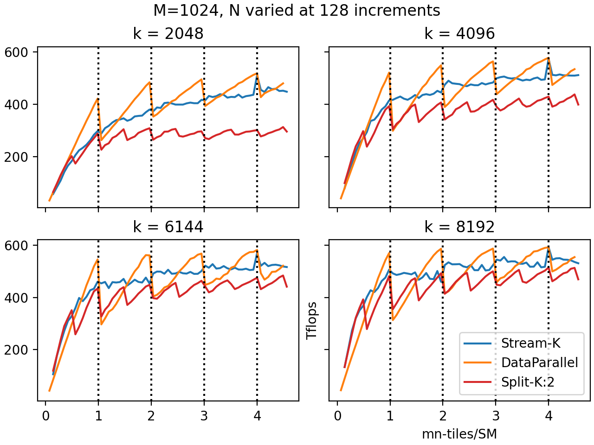
수직 점선은 wave 경계를 나타낸다. 예상대로 DataParallel 모드는 wave 경계를 넘을 때 성능이 급격히 떨어진다. 이것이 wave quantization 효과다. DataParallel 모드는 마지막 wave가 거의 다 찼을 때(tiles-per-SM이 정수 바로 아래일 때) 다른 모든 모드와 같거나 더 나은 성능을 내며, 거의 비어 있을 때(tiles-per-SM이 정수 바로 위일 때) 저조한 성능을 낸다. 또한 전체 wave 수가 적을수록 wave quantization 효과가 가장 두드러진다.

Split-K를 쓰면 wave quantization의 효과가 줄어든다. Split-K는 사실상 worktile 수를 K배로 늘리므로 wave 수도 K배가 된다. 그래프에서 split이 2인 Split-K의 성능이 DataParallel의 두 배 주기로 진동하는 것으로 이를 확인할 수 있다. 안타깝게도 reduction의 추가 오버헤드가 대부분의 경우 이점을 상쇄하는 것으로 보이며, Split-K가 다른 두 scheduler에 비해 좋은 성능을 내는 경우는 드물다(보통 타일 수가 너무 적어서 분할하지 않으면 GPU가 심각하게 놀게 되는 경우다). 그래프는 복잡해지지 않도록 K=2인 Split-K만 보여 준다. 더 큰 K 값은 매우 작은 X 영역을 제외하면 일반적으로 K=2보다 나빴다.

반면 Stream-K 성능은 wave quantization을 보이지 않으며, wave 수가 변해도 거의 변동이 없다. Stream-K 분할은 일반적으로 Split-K와 같거나 더 나은 성능을 내고, K가 클 때 마지막 wave가 거의 비어 있는 구간에서는 DataParallel 분할을 앞선다. DataParallel과 Stream-K가 동일한 결과를 내는 지점이 하나 있는데, N=7296이며 이는 X=1024*7296/114=4에 해당한다. 타일이 CTA에 균등하게 분배될 수 있었기 때문에 부분 타일도, reduction도 필요하지 않다. 그래서 DataParallel과 Stream-K가 동일한 결과를 낸다.

세 가지 명시적 decomposition mode 외에 CUTLASS에는 Heuristic 모드도 있다. 정확한 휴리스틱은 뒤에서 다루지만, 여기서는 Stream-K 및 DataParallel과 비교해 얼마나 잘 동작하는지 볼 수 있다(split-K는 제외했다).

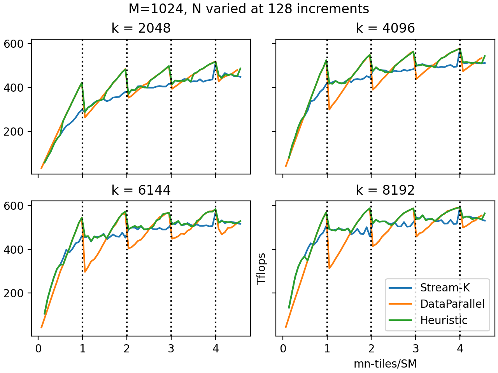

보다시피 CUTLASS의 Heuristic 모드는 가장 성능이 좋은 decomposition mode를 매우 잘 예측한다. 양자화 효과가 작을 때는 DataParallel 모드를, 클 때는 Stream-K를 선택한다. Heuristic 모드가 기본값이므로, 일반적으로는 decomposition mode를 지정하지 않고 CUTLASS가 결정하도록 두는 편이 낫다.

## CUTLASS 구현 세부 사항
다음으로 CUTLASS의 stream-K scheduler 구현 세부 사항을 살펴본다(CUTLASS 3.6 기준).

**Schedule**. CUTLASS는 위에서 설명한 hybrid 스케줄의 한 버전을 구현한다. scheduler는 최대 두 개의 wave를 Stream-K 작업에 할당하고, 나머지 작업은 data-parallel 방식으로 구성한다. data-parallel wave들은 같은 시점에 같은 K offset을 다루는 경향이 있으므로 L2 캐시 성능이 개선된다.

__Reduction.__ 기본적으로 같은 출력 타일을 함께 담당하는 CTA들은 "turnstile" 방식으로 협력한다. 어떤 출력 타일을 CTA 0, 1, …, n이 담당하고, 할당된 K-index 범위 순으로 번호가 매겨져 있다고 하자. 먼저 CTA 0이 자신의 결과를 계산하여 global memory workspace에 쓴다. CTA 1은 CTA 0이 쓰기를 마칠 때까지 barrier에서 기다린 뒤, 자신의 출력을 같은 global memory workspace로 reduce한다. CTA 2는 CTA 1을 기다렸다가 자신의 출력을 reduce하고, 이런 식으로 이어진다. 마지막으로 CTA n은 CTA n-1을 기다리지만, workspace로 reduce하는 대신 workspace로부터 자신의 accumulator로 reduce한 다음 epilogue를 계산하여 출력 텐서에 쓴다.

대안인 "nondeterministic mode"(사용자가 ReductionMode::Nondeterministic 인자로 지정)에서는 CTA 1, …, n-1이 더 이상 서로를 기다리지 않고 단순히 workspace로 atomic하게 reduce한다. 모든 CTA는 여전히 workspace를 초기화하는 CTA 0을 기다려야 하고, CTA n도 여전히 CTA 0, …, n-1을 기다려야 한다. 비결정성은 이제 reduction 1, …, n-1이 임의의 순서로 일어날 수 있다는 사실(그리고 부동소수점 덧셈이 결합법칙을 만족하지 않는다는 사실)에서 비롯된다.

__Decomposition mode__. CUTLASS의 stream-K scheduler는 Split-K와 data-parallel persistent 스케줄도 지원하며, 사용자는 decomposition_mode 인자로 이를 선택할 수 있다. (splits 인자에 1이 아닌 값을 전달하면 scheduler는 주어진 split 개수로 split-K를 수행하도록 강제된다.) 사용자는 DecompositionMode::Heuristic을 선택할 수도 있는데, 이 경우 scheduler는 stream-K에서 더 단순한 스케줄로 폴백할 수 있다. wave quantization이 없거나 tail wave가 절반 이상 차 있으면 scheduler는 data-parallel로 폴백한다. stream-K 작업에 할당된 CTA 수가 그들이 처리해야 할 stream-K 타일 수의 배수이면 split-K로 폴백한다. Stream-K는 reduction과 동기화에 따른 추가 오버헤드가 있으므로, wave quantization이 문제가 되지 않을 상황에서는 data-parallel로 폴백하는 것이 타당하다. 테스트 결과 이 휴리스틱은 다양한 문제 크기에 걸쳐 거의 항상 최선의 선택을 했다.

__Threadblock rasterization__. wave quantization 문제와는 별개로 persistent kernel이 갖는 장점 중 하나는 worktile을 launch하는 순서를 선택할 수 있다는 점이다. GEMM에서는 주로 캐시 성능 때문에 이것이 중요하다. 출력 행렬의 같은 행 또는 같은 열(같은 M 또는 N 인덱스)에 속한 worktile들이 비슷한 시점에 처리되면, 이들은 operand 행렬 중 하나의 데이터를 GMEM에서 동시에 로드하게 되고 L2 캐시에 적중할 가능성이 높다.

따라서 persistent kernel의 캐시 성능을 개선하는 가장 간단한 방법은 worktile을 M 또는 N mode를 따라 순서대로 launch하는 것이다. 예를 들어 M을 최대한 고정한 채 N mode를 따라 worktile을 launch하면, operand 행렬 A의 데이터가 캐시에서 자주 발견된다. CUTLASS에서는 scheduler에 raster_order 인자를 전달할 수 있으며, RasterOrderOptions::AlongM과 AlongN이 이러한 동작을 제공한다. 보통은 worktile 단위로 측정했을 때 두 mode 중 짧은 쪽을 따라 rasterize하는 것이 좋으며, RasterOrderOptions::Heuristic이 이를 자동으로 판단해 준다.


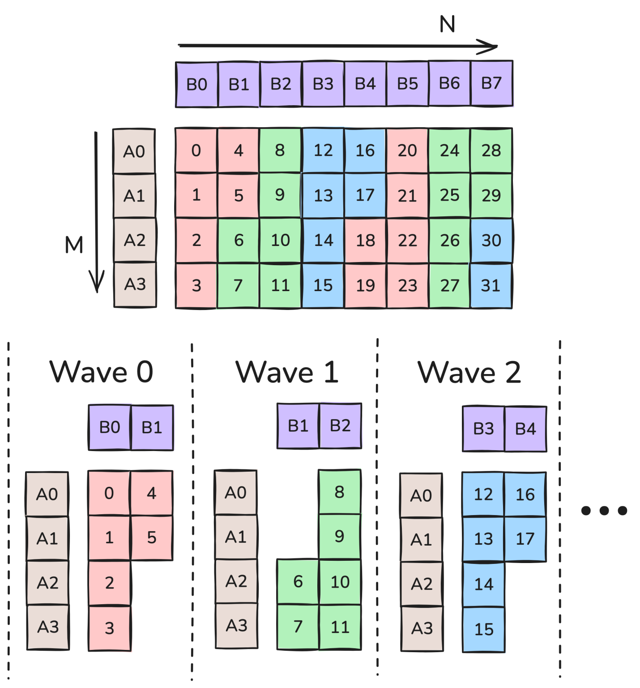
그림 7: M 방향 rasterization.
그림 7은 SM이 6개이고 M<N인 경우의 thread block rasterization을 보여 준다. 이 경우 RasterOrderOptions::Heuristic은 AlongM을 선택한다. 예를 들어 wave 0에서 SM들은 타일 0부터 5까지를 처리하며, HBM으로부터의 operand 로드 횟수가 사전 기준 12회에서 6회로 줄어든다(L2 캐시에 들어간다고 가정).

더 진보된 기법은 두 차원 모두에서의 근접성을 고려하는 것이다. 예를 들어 그림 7에서 work tile들은 M 방향으로는 인접해 있지만 N 방향으로는 M만큼 떨어져 있다. N 차원으로 2개의 타일을 진행한 뒤 M 방향으로 이동하면 이를 개선할 수 있다. 이를 threadblock swizzling이라 하며, 구체적으로 swizzle=2인 경우다. swizzle할 타일 수는 max_swizzle_size 인자로 지정할 수 있지만, 이름이 시사하듯 문제가 충분히 크지 않으면 scheduler가 더 작은 swizzle 크기를 선택할 수 있다. 가능한 swizzle 크기는 1(swizzling 없음), 2, 4, 8이다. 그림 8은 AlongM raster order와 swizzle 크기 2 또는 1에서 work tile이 처리되는 순서를 보여 준다. (이는 [이 글](https://research.colfax-intl.com/tutorial-matrix-transpose-in-cutlass/)에서 다룬 XOR swizzle과는 다르다.)

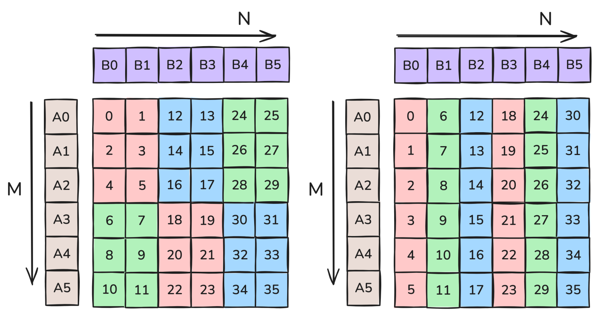
그림 8: 왼쪽은 swizzle 2인 M 방향 rasterization, 오른쪽은 swizzle 1인 M 방향 rasterization.
그림 8에서 swizzle=2의 각 wave는 5개의 operand 타일을 로드하는 반면, swizzle=1의 각 wave는 7개를 로드한다(역시 모두 L2에 들어간다고 가정). 따라서 6개의 wave에서 swizzle=2는 30번, swizzle=1은 42번의 operand 타일 로드가 발생한다. 주어진 문제에 적합한 swizzle 크기는 문제와 장치 특성에 따라 크게 달라진다. 다만 일반적으로 swizzle은 rasterize되는 방향에 타일이 충분히 많을 때만 효과가 있다. 좀 더 정확히 말하면, M 타일의 수가 SM/swizzle보다 커야 한다. 그렇지 않으면 rasterize 방향의 operand 타일이 어차피 모두 로드된다. SM이 114개일 때 swizzle 2, 4, 8에 대한 기준값은 각각 57, 31, 15다.

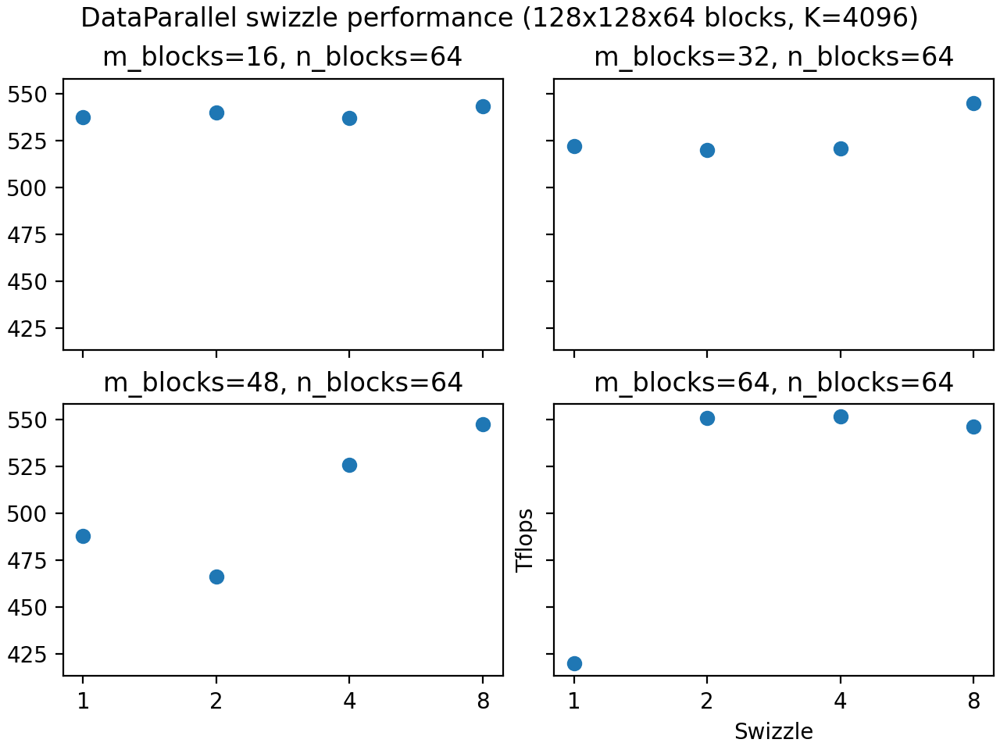
위 그림은 이러한 기준값을 반영하고 있으며, 타일이 충분히 많아지면 swizzle이 더 나은 성능을 낸다. 그러나 앞서 언급했듯 타일 수만이 고려 사항은 아니다. L2 캐시 크기 같은 다른 요인도 swizzle 성능에 영향을 줄 수 있다. 따라서 자신의 워크로드에 가장 적합한 swizzle 값을 찾으려면 [CUTLASS profiler](https://github.com/NVIDIA/cutlass/blob/main/media/docs/cpp/profiler.md)를 사용할 것을 권한다.

__Cluster와 multicast__. Hopper 아키텍처는 threadblock cluster를 도입했다. 이는 같은 GPU processing cluster(GPC)에 동시에 스케줄링되며 서로의 shared memory에 빠르게 접근할 수 있는 CTA들의 그룹이다. 지금 논의에서 가장 중요한 점은 TMA 로드를 [multicast](https://research.colfax-intl.com/tutorial-hopper-tma/)할 수 있다는 것으로, 단일 연산으로 cluster 내 모든 CTA의 SMEM에 동일한 데이터를 동시에 로드한다.

이는 tile scheduler 구성에 깊은 함의를 갖는다. 앞서 캐시 성능을 위해 같은 행 또는 열의 worktile을 비슷한 시점에 스케줄링하는 것이 중요하다고 했다. 그런데 이들을 같은 cluster에 할당하는 것도 중요하다. 그래야 operand 행렬 중 하나의 데이터를 multicast할 수 있기 때문이다. 더 나아가 stream-K 작업에서는 cluster 내 CTA들이 같은 시점에 같은 K offset을 다루는 것이 이상적이다(즉, hybrid 스케줄을 정당화했던 skew 문제가 cluster 내부에서도 똑같이 중요하다).
