# Hopper TMA 유닛의 FP8 GEMM 적용 심층 분석

- PyTorch 블로그 자료: https://pytorch.org/blog/hopper-tma-unit/
- PyTorch 구현과 사용 데모: https://github.com/pytorch-labs/applied-ai/blob/main/kernels/triton/inference/fp8/tma_gemm.py 이 글 마지막에도 이 코드 설명을 추가했습니다.

## 요약

Hopper(H100) GPU 아키텍처는 "첫 번째 진정한 비동기 GPU"라고 불립니다. 이 아키텍처에는 전역 메모리와 공유 메모리 사이에서 대규모 데이터 이동을 수행하는 새롭고 완전 비동기적인 하드웨어 복사 엔진이 들어 있으며, 이 엔진을 Tensor Memory Accelerator, 즉 TMA라고 부릅니다. CUTLASS는 비동기 파이프라인 패러다임을 통해 TMA 지원을 내장하고 있지만(https://github.com/NVIDIA/cutlass/blob/56b46e2d13875b46b8f6a03f9f5ac91e2bfdc01a/include/cute/arch/copy_sm90_tma.hpp), Triton은 실험적 API(https://github.com/triton-lang/triton/blob/538556a66ee49630e1cb0b239f93e63b968b2478/python/triton/tools/experimental_descriptor.py#L25)를 통해 TMA 지원을 제공합니다.

이 글에서는 개발자가 이 새로운 비동기 복사 엔진을 이해할 수 있도록 TMA의 동작 원리를 깊이 살펴봅니다. 또한 Triton에서 TMA를 지원하는 FP8 GEMM kernel을 만들어 H100 kernel에서 TMA 활용이 얼마나 중요한지 보여줍니다. 이 kernel은 작은 문제 크기부터 중간 문제 크기까지 cuBLAS FP16 대비 1.4-2.2배의 성능 향상을 얻을 수 있습니다. 마지막으로 Triton에서 TMA를 사용할 때 보고된 성능 회귀를 설명할 수 있는 Triton과 CUTLASS 사이의 핵심 구현 차이를 보여줍니다. 재현과 검토가 쉽도록 구현을 오픈소스로 공개했습니다. 코드 주소는 https://github.com/pytorch-labs/applied-ai/tree/main/kernels 입니다.

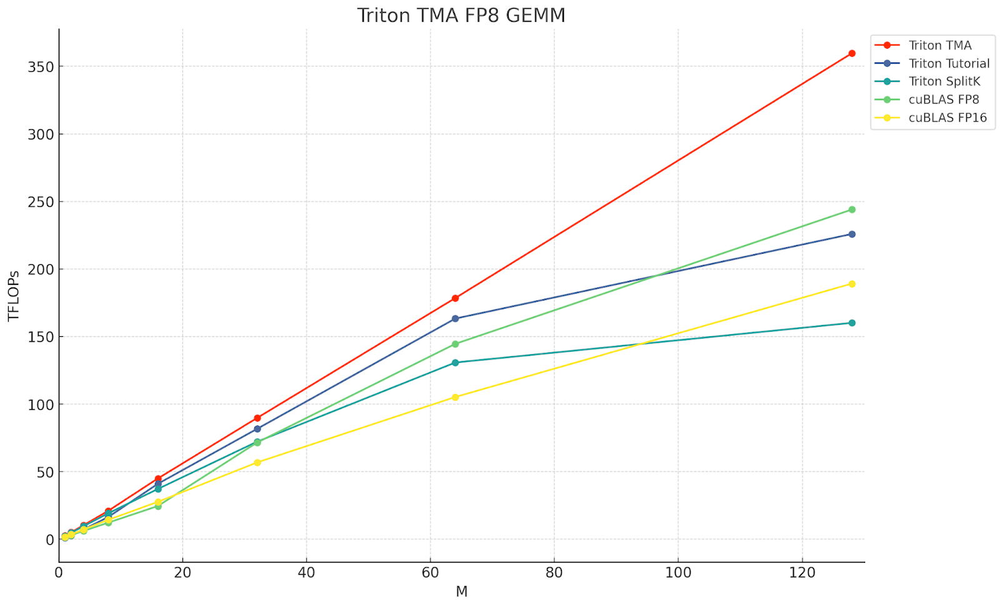

## TMA 배경

TMA는 H100 하드웨어에 새로 추가된 기능입니다. 애플리케이션이 GPU 전역 메모리와 공유 메모리 사이에서 1D-5D tensor를 비동기적이고 양방향으로 전송할 수 있게 해줍니다. 또한 TMA는 같은 데이터를 호출 SM의 공유 메모리뿐 아니라 같은 thread block cluster 안의 다른 SM 공유 메모리로도 전송할 수 있습니다. 이 기능을 "multicast"라고 합니다.

TMA는 매우 가볍습니다. 단 하나의 스레드만 있으면 TMA 전송을 시작할 수 있습니다. GMEM, 즉 전역 메모리에서 SMEM, 즉 공유 메모리로 데이터를 직접 이동하기 때문에, 이전 GPU에서 서로 다른 메모리 공간 사이의 데이터 이동에 레지스터를 사용해야 했던 요구를 피할 수 있습니다.

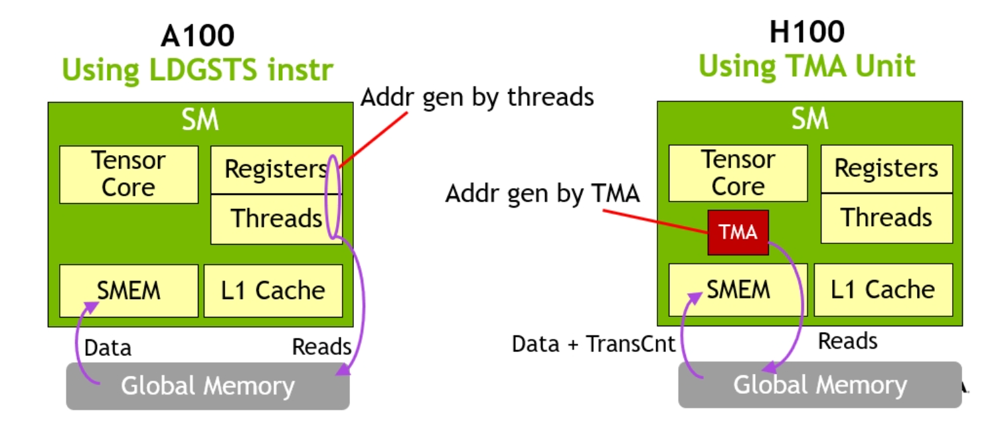

하나의 스레드가 대규모 데이터 이동 명령을 발행할 수 있으므로, 주어진 thread block의 대부분 스레드는 데이터 전송 중에도 다른 명령을 계속 실행할 수 있습니다. 비동기 파이프라인 기법과 결합하면 메모리 전송을 쉽게 숨길 수 있고, 대부분의 thread block cluster가 계산 작업에 집중하도록 만들 수 있습니다.

이 가벼운 데이터 이동 호출 방식은 전문화된 warp-group kernel을 만들 수 있게 합니다. 서로 다른 warp-group은 생산자와 소비자라는 서로 다른 역할을 맡을 수 있습니다. 생산자는 leader thread 하나를 선택해 TMA 요청을 시작하고, 이 요청은 arrival barrier를 통해 소비자, 즉 MMA warp-group과 비동기적으로 조율됩니다. 이후 소비자는 warp-group MMA로 데이터를 처리하고, 공유 메모리 buffer에서 데이터 읽기를 마치면 생산자에게 신호를 보냅니다. 이 과정이 반복됩니다.

또한 thread block clusters 안에서 생산자는 TMA 호출 발행만 담당하므로 최대 레지스터 요구량을 낮출 수 있습니다. 사실상 추가 레지스터를 MMA 소비자에게 넘기는 셈이며, 이는 소비자의 레지스터 압박을 완화하는 데 도움이 됩니다.

또한 TMA는 공유 메모리 목적지 주소 계산, 즉 요청한 데이터를 어디에 배치할지 계산하는 일을 처리합니다. 그래서 호출 스레드, 즉 생산자가 이렇게 가벼울 수 있습니다.

최대 읽기 접근 속도를 보장하기 위해 TMA는 swizzling 명령을 기반으로 도착한 데이터를 배치할 수 있습니다. swizzling 패턴이 공유 메모리 bank conflict를 피하는 데 도움이 되므로, 소비자는 도착한 데이터를 가장 빠른 속도로 읽을 수 있습니다.

마지막으로 공유 메모리에서 전역 메모리로 나가는 TMA 명령의 경우, TMA는 reduction 연산, 즉 add/min/max와 bitwise 연산, 즉 and/or도 포함할 수 있습니다.

## Triton에서 TMA 사용하기

**Pre-Hopper Load**:

```python
offs_m = pid_m*block_m + tl.arange(0, block_m)
offs_n = pid_n*block_n + tl.arange(0, block_n)
offs_k = tl.arange(0, block_k)

a_ptrs = a_ptr + (offs_am[:, None]*stride_am + offs_k[None, :]*stride_ak)
b_ptrs = b_ptr + (offs_k[:, None]*stride_bk + offs_bn[None, :]*stride_bn)

a = tl.load(a_ptrs)
b = tl.load(b_ptrs)
```

> Triton에서 전통적인 스타일로 전역 메모리에서 공유 메모리로 대량 load하는 방식입니다.

위 Triton 예시에서는 Hopper 이전 아키텍처의 load 방식을 볼 수 있습니다. 각 thread block은 전역 offset, 즉 a_ptrs와 b_ptrs를 계산해 tensor a와 b의 데이터를 load합니다. 이 offset은 관련 program_id(pid_m, pid_n, k)를 기반으로 계산되며, 이후 메모리 block을 a와 b의 공유 메모리로 옮기는 요청을 발행합니다.

이제 Triton에서 TMA로 load 작업을 수행하는 방법을 보겠습니다.

TMA 명령에는 tensor map이라는 특수 데이터 구조가 필요합니다. 이는 위처럼 전역 메모리 포인터를 직접 전달하는 방식과 다릅니다. tensor map을 만들기 위해 먼저 CPU에서 TMA descriptor를 만듭니다. 이 descriptor는 cuTensorMapEncode API(https://docs.nvidia.com/cuda/cuda-driver-api/group__CUDA__TENSOR__MEMORY.html#group__CUDA__TENSOR__MEMORY)를 사용해 tensor map 생성을 처리합니다. tensor map은 tensor의 전역 메모리 및 공유 메모리 layout 같은 메타데이터를 포함하며, 전역 메모리에 저장된 다차원 tensor 구조의 압축 표현으로 동작합니다.

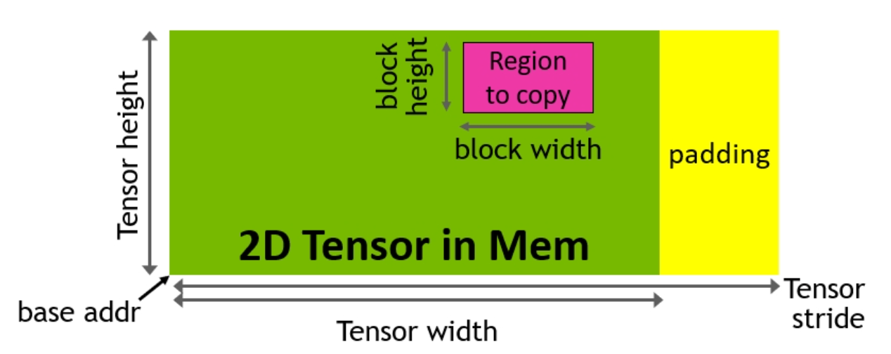

TMA descriptor에는 tensor의 핵심 속성이 들어 있습니다.

- base pointer
- shape와 block size
- data type

TMA descriptor는 kernel 실행 전에 host에서 만들어진 뒤, descriptor를 torch tensor로 전달해 device로 이동합니다. 따라서 Triton에서 GEMM kernel은 tensor map을 가리키는 전역 포인터를 받습니다.

## Triton Host Code

```python
   desc_a = np.empty(TMA_SIZE, dtype=np.int8)
   desc_b = np.empty(TMA_SIZE, dtype=np.int8)
   desc_c = np.empty(TMA_SIZE, dtype=np.int8)

   triton.runtime.driver.active.utils.fill_2d_tma_descriptor(a.data_ptr(), m, k, block_m, block_k, a.element_size(), desc_a)

   triton.runtime.driver.active.utils.fill_2d_tma_descriptor(b.data_ptr(), n, k, block_n, block_k, b.element_size(), desc_b)

   triton.runtime.driver.active.utils.fill_2d_tma_descriptor(c.data_ptr(), m, n, block_m, block_n, c.element_size(), desc_c)
  
   desc_a = torch.tensor(desc_a, device='cuda')
   desc_b = torch.tensor(desc_b, device='cuda')
   desc_c = torch.tensor(desc_c, device='cuda')
```

이는 kernel 호출 함수에서 descriptor를 설정하는 코드입니다.

## Triton Device Code

**Offset/pointer arithmetic:**

```python
   offs_am = pid_m * block_m
   offs_bn = pid_n * block_n
   offs_k = 0
```

**Load:**

```python
  a = tl._experimental_descriptor_load(a_desc_ptr, [offs_am, offs_k], [block_m, block_k], tl.float8e4nv)
  b = tl._experimental_descriptor_load(b_desc_ptr, [offs_bn, offs_k], [block_n, block_k], tl.float8e4nv)
```

**Store:**

```python
 tl._experimental_descriptor_store(c_desc_ptr, accumulator, [offs_am, offs_bn])
```

이제 kernel 안에서 load와 store 함수를 위해 pointer 배열을 계산할 필요가 없습니다. 대신 descriptor pointer, offset, block size, input data type만 전달하면 됩니다. 이는 주소 계산을 단순화하고 레지스터 압박을 줄입니다. 복잡한 pointer arithmetic을 소프트웨어에서 수행할 필요도 없고, 주소 계산을 위해 CUDA Core를 따로 할당할 필요도 없기 때문입니다.

## TMA 성능 분석

아래에서는 Hopper 아키텍처에서 서로 다른 load 메커니즘의 PTX 명령을 논의합니다.

**Load Tile용 PTX(cp.async) - TMA 없는 H100**

```python
# 이 두 줄은 공유 메모리의 목적지 주소를 계산합니다. %r100은 공유 메모리 base 주소일 수 있고, %r8과 %r9는 offset입니다.
add.s32 	%r27, %r100, %r8;
add.s32 	%r29, %r100, %r9;
# 이 줄은 조건 %p18에 따라 %r102 또는 0을 선택하고 결과를 %r30에 넣습니다. 복사 작업 실행 여부를 제어하는 데 쓰일 수 있습니다.
selp.b32 	%r30, %r102, 0, %p18;

# 이 두 줄이 핵심 비동기 복사 명령입니다. 전역 메모리(%rd20, %rd21)에서 공유 메모리(%r27, %r29)로 데이터를 복사합니다. 0x10은 16바이트 복사를 뜻합니다. %p1은 이 명령의 실행 여부를 제어하는 predicate입니다.
@%p1 cp.async.cg.shared.global [ %r27 + 0 ], [ %rd20 + 0 ], 0x10, %r30;
@%p1 cp.async.cg.shared.global [ %r29 + 0 ], [ %rd21 + 0 ], 0x10, %r30;

# 이 줄은 앞선 비동기 복사 작업 group을 commit해 실행이 시작되도록 합니다.
cp.async.commit_group ;
```

> 전체적으로 이 코드는 전역 메모리에서 공유 메모리로 비동기 데이터 복사를 구현합니다. 새로운 TMA 메커니즘이 아니라 H100 이전의 cp.async 명령을 사용합니다. 이 방식은 주소 계산에 더 많은 레지스터가 필요하고, 각 스레드가 데이터 이동에 참여합니다. 이는 TMA의 가벼운 단일 스레드 트리거 방식과 대비됩니다.

여기서 우리는 더 오래된 cp.async 명령이 전역 메모리 복사를 담당한다는 것을 볼 수 있습니다. 아래 trace에서 두 load가 모두 L1 cache를 우회하는 것도 볼 수 있습니다.

- 새 load 방식과 기존 load 방식의 차이:
   - 기존 방식: A와 B의 data tile이 Tensor Core에서 사용될 준비가 되기 전에, ldmatrix 명령을 실행해 데이터를 공유 메모리에서 register file로 옮겨야 합니다.
   - 새 방식(TMA): Hopper 아키텍처에서는 추가 ldmatrix 명령 없이 공유 메모리의 데이터를 직접 재사용할 수 있습니다.

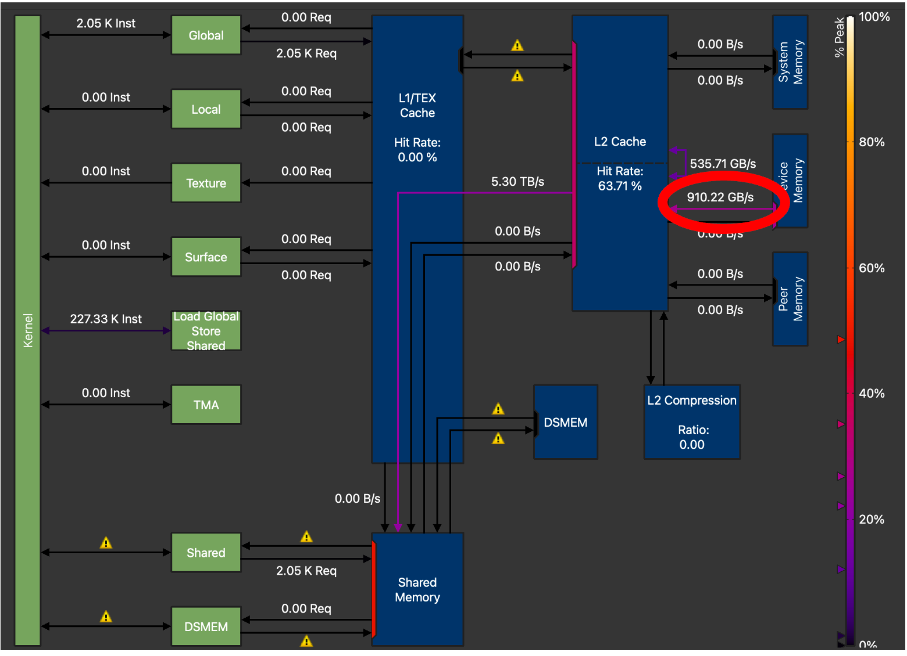

위에서 언급한 Triton API 변경으로 TMA를 사용하면, Triton이 단일 2D tile load에 대해 생성하는 PTX 코드를 살펴볼 수 있습니다.

**Tile Loading용 PTX(cp.async.bulk.tensor) - TMA를 사용하는 H100**

```python
# 이 줄은 동기화 명령으로, 모든 스레드가 이 지점에 도달한 뒤 계속 진행하도록 합니다.
bar.sync 	0; 
# register %r4의 값을 오른쪽으로 5비트 이동하고 결과를 %r5에 넣습니다. 어떤 offset 또는 index 계산일 수 있습니다.
shr.u32 	%r5, %r4, 5;
# warp 내부에서 데이터를 교환하는 shuffle 명령입니다. %r5의 값을 warp의 모든 스레드에 broadcast하고 결과를 %r66에 넣습니다.
shfl.sync.idx.b32	%r66, %r5, 0, 31, -1;

# warp 안에서 leader thread를 선택하는 election 명령입니다. 결과는 predicate %p7에 저장됩니다.
elect.sync _|%p7, 0xffffffff;

# %r65와 %r67의 값을 더해 %r24에 넣습니다. 목적지 주소 계산일 수 있습니다.
add.s32 	%r24, %r65, %r67;
# %r66을 왼쪽으로 7비트 이동해 %r25에 넣습니다. 어떤 offset 계산일 수 있습니다.
shl.b32 	%r25, %r66, 7;

# 이것이 TMA의 핵심 명령입니다. 2D tensor 데이터를 전역 메모리에서 공유 메모리로 비동기 복사합니다.
# @%p8: predicate %p8이 참일 때만 이 명령을 실행합니다.
# [%r24]: 목적지 주소, 즉 공유 메모리 주소입니다.
# [%rd26, {%r25,%r152}]: tensor map을 가리키는 pointer와 tensor map 좌표입니다.
# [%r19]: mbarrier 객체를 가리키는 pointer입니다.
# 이 명령은 TMA의 장점을 보여줍니다. 단일 스레드가 대규모 데이터 전송을 시작할 수 있으며, 모든 스레드가 주소 계산과 데이터 이동에 참여할 필요가 없습니다.
@%p8
cp.async.bulk.tensor.2d.shared::cluster.global.mbarrier::complete_tx::bytes [%r24], [%rd26, {%r25,%r152}], [%r19];
```

`cp.async.bulk.tensor.2d.shared` TMA 명령은 공유 메모리의 목적지 주소, tensor map을 가리키는 pointer, tensor map 좌표, mbarrier 객체 pointer를 차례대로 전달합니다.

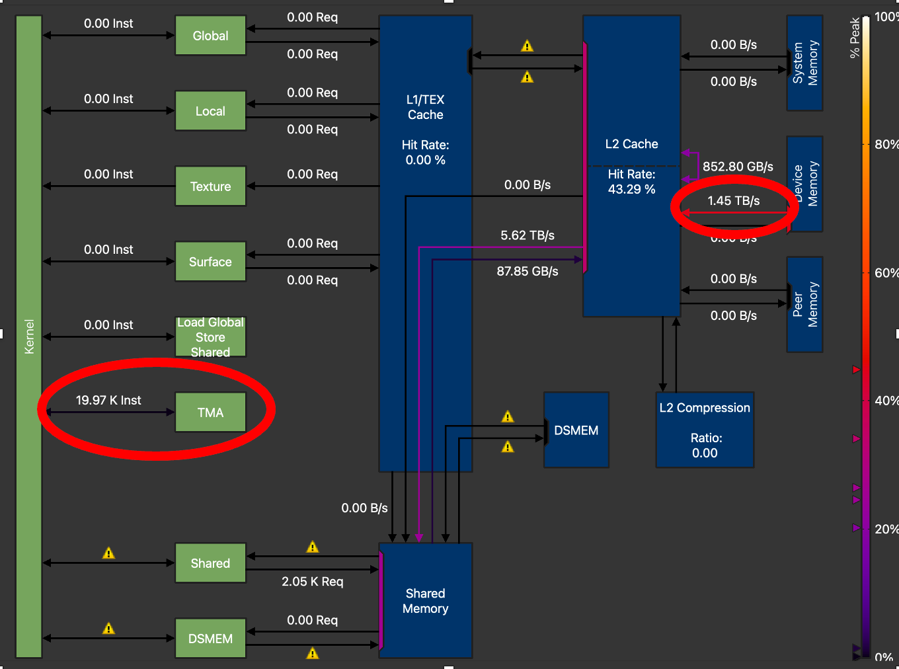

최고 성능을 얻기 위해 우리는 TMA GEMM kernel을 폭넓게 튜닝했습니다. block size, warp 수, pipeline stage 수 등 다른 파라미터 외에도, 메모리 처리량의 가장 큰 증가는 TMA_SIZE, 즉 descriptor 크기를 128에서 512로 늘렸을 때 발생했습니다. 위 NCU profile에서 볼 수 있듯이, 최종 튜닝된 kernel은 전역 메모리 전송 처리량을 910 GB/s에서 1.45 TB/s로 높였습니다. TMA가 없는 Triton GEMM kernel 대비 GMEM 처리량이 59% 증가한 것입니다.

**CUTLASS와 Triton FP8 GEMM 및 TMA 구현 비교 - kernel 아키텍처**

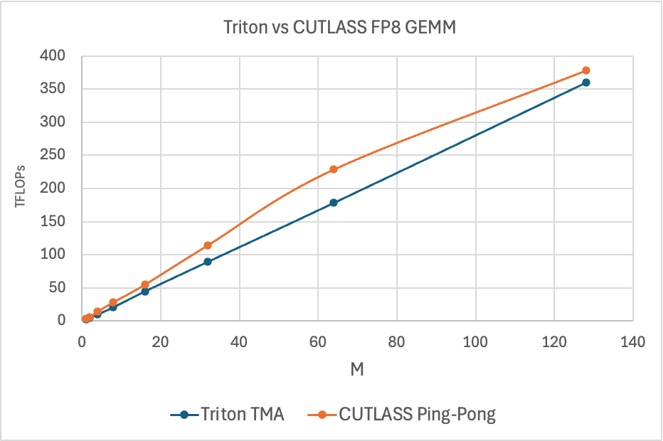

위 그림은 CUTLASS Ping-Pong GEMM kernel(https://github.com/NVIDIA/cutlass/blob/637b15906358191cb4238af419d408a65819d7ec/include/cutlass/gemm/kernel/sm90_gemm_tma_warpspecialized_pingpong.hpp)과 Triton의 성능을 비교합니다. Ping-Pong kernel은 Triton과 다른 방식으로 TMA를 사용합니다. 모든 하드웨어 및 소프트웨어 기능을 활용하지만, Triton은 현재 그렇지 않습니다. 구체적으로 CUTLASS는 순수 GEMM 성능 격차를 설명하는 데 도움이 되는 다음 TMA 기능을 지원합니다.

- TMA Multicast: GMEM에서 여러 SM으로 데이터 복사를 구현합니다.
- Warp specialization: thread block 안의 warp group이 서로 다른 역할을 맡을 수 있게 합니다.
- Tensor map, 즉 TMA descriptor prefetch: GMEM에서 tensor map 객체를 미리 가져와 TMA load를 pipeline 처리할 수 있게 합니다.

성능 데이터를 더 잘 이해하기 위해 아래에는 지연 시간 차이를 백분율로 강조한 "speedup" 차트를 보여줍니다.

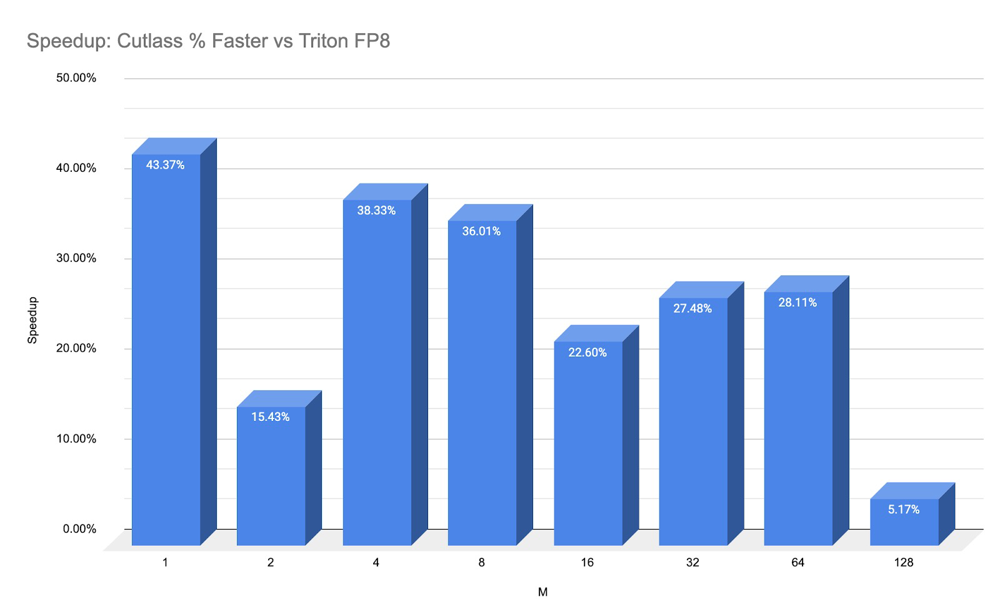

이 speedup은 순수 kernel 처리량 비교이며, 아래에서 논의할 end-to-end(E2E) launch overhead는 포함하지 않습니다.

**TMA descriptor 이동 - Triton과 CUTLASS의 end-to-end 성능 영향에서 나타나는 핵심 차이**

앞서 말했듯이 2D 이상 차원의 TMA descriptor 생성은 host 쪽에서 일어난 뒤 device 쪽으로 전송됩니다. 하지만 이 전송 과정은 구현 방식에 따라 크게 달라집니다.

여기서는 Triton이 TMA descriptor를 전송하는 방식이 CUTLASS와 어떻게 다른지 보여줍니다.

TMA 전송에는 특수 데이터 구조, 즉 CPU에서 cuTensorMap API로 생성한 tensor map이 필요합니다. FP8 GEMM kernel의 경우 A, B, C에 각각 대응하는 descriptor 세 개를 만들어야 합니다. Triton과 CUTLASS kernel 모두 같은 CPU 프로그램을 호출한다는 것을 볼 수 있습니다.

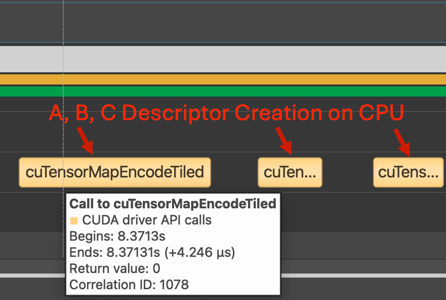

하지만 Triton에서는 각 descriptor가 자신의 독립 copy kernel에서 전송됩니다. 이로 인해 큰 overhead가 추가되고, end-to-end 추론 장면에서 이 kernel을 사용하는 데 장애가 됩니다.


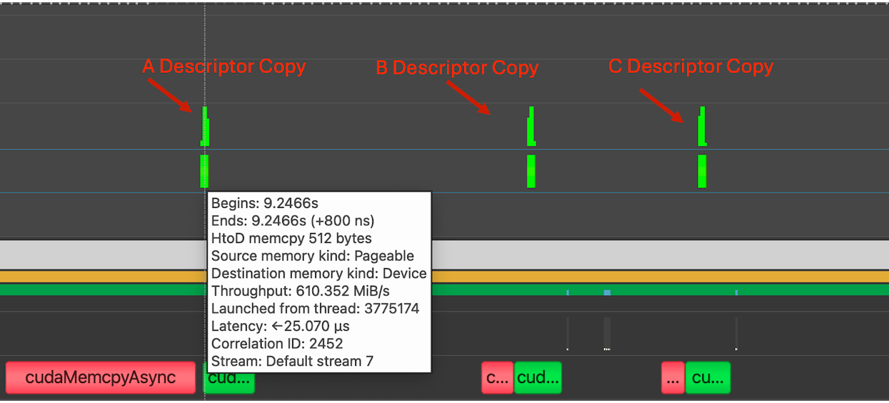

CUTLASS 구현에서는 이러한 복사 작업이 관찰되지 않습니다. 이는 TMA descriptor가 kernel에 전달되는 방식이 다르기 때문입니다. 아래 PTX, 즉 parallel thread execution 코드에서 볼 수 있듯이 Cutlass에서는 tensor map이 값으로 kernel에 전달됩니다.

```python
# .entry는 device 함수의 entry point를 선언합니다. 이것은 CUTLASS GEMM kernel의 entry 함수입니다.
.entry _ZN7cutlass13device_kernelIN49_GLOBAL__N__8bf0e19b_16_scaled_mm_c3x_cu_2bec3df915cutlass_3x_gemmIaNS_6half_tENS1_14ScaledEpilogueEN4cute5tupleIJNS5_1CILi64EEENS7_ILi128EEES9_EEENS6_IJNS7_ILi2EEENS7_ILi1EEESC_EEENS_4gemm32KernelTmaWarpSpecializedPingpongENS_8epilogue18TmaWarpSpecializedEE10GemmKernelEEEvNT_6ParamsE(

# .param .align 64 .b8 [...] _param_0[1024]는 kernel parameter를 전달하기 위한 1024바이트 parameter space를 정의합니다.
.param .align 64 .b8 _ZN7cutlass13device_kernelIN49_GLOBAL__N__8bf0e19b_16_scaled_mm_c3x_cu_2bec3df915cutlass_3x_gemmIaNS_6half_tENS1_14ScaledEpilogueEN4cute5tupleIJNS5_1CILi64EEENS7_ILi128EEES9_EEENS6_IJNS7_ILi2EEENS7_ILi1EEESC_EEENS_4gemm32KernelTmaWarpSpecializedPingpongENS_8epilogue18TmaWarpSpecializedEE10GemmKernelEEEvNT_6ParamsE_param_0[1024]

# mov.b64 %rd110, _ZN7cutlass13device_kernelIN... 는 kernel parameter의 주소를 register %rd110으로 이동합니다.
mov.b64 	%rd110, _ZN7cutlass13device_kernelIN49_GLOBAL__N__8bf0e19b_16_scaled_mm_c3x_cu_2bec3df915cutlass_3x_gemmIaNS_10bfloat16_tENS1_14ScaledEpilogueEN4cute5tupleIJNS5_1CILi64EEES8_NS7_ILi256EEEEEENS6_IJNS7_ILi1EEESB_SB_EEENS_4gemm24KernelTmaWarpSpecializedENS_8epilogue18TmaWarpSpecializedEE10GemmKernelEEEvNT_6ParamsE_param_0;

# add.s64 %rd70, %rd110, 704 는 parameter 안의 TMA descriptor offset 주소를 계산해 %rd70에 저장합니다.
add.s64 	%rd70, %rd110, 704;
# cvta.param.u64 %rd69 는 parameter 주소를 일반 주소 공간으로 변환합니다.
cvta.param.u64 	%rd69, %rd70;

# 이것이 핵심 TMA 명령입니다.
# 전역 메모리에서 공유 메모리로 2D tensor 데이터를 load합니다.
# [%rd69, {%r284, %r283}]는 source address, 즉 TMA descriptor와 좌표를 지정합니다.
# [%r1880]는 목적지 공유 메모리 주소를 가리킬 가능성이 있습니다.
cp.async.bulk.tensor.2d.global.shared::cta.bulk_group [%rd69, {%r284, %r283}], [%r1880];
```
> 이 코드는 CUTLASS가 TMA descriptor를 별도 메모리 복사로 전달하지 않고 kernel parameter 안에 직접 전달하는 방식을 보여줍니다. 이 방법은 launch overhead를 줄이고 end-to-end 성능을 높일 수 있습니다.

TMA descriptor를 전역 메모리 포인터로 전달하지 않고 직접 전달함으로써 CUTLASS kernel은 세 개의 추가 host-to-device(H2D) copy kernel을 피합니다. 대신 이 복사는 GEMM, 즉 일반 행렬 곱을 수행하는 단일 device kernel launch에 포함됩니다.

descriptor를 device로 이동하는 방식이 다르기 때문에, TMA가 소비할 tensor를 준비하는 과정까지 포함한 kernel 지연 시간에는 큰 차이가 있습니다. M=1-128, N=4096, K=4096 조건에서 CUTLASS Ping Pong kernel의 평균 지연 시간은 10마이크로초였지만, Triton TMA kernel은 완료까지 평균 4밀리초가 필요했습니다. 이는 약 3330배 느린 것이며, Triton이 TMA descriptor를 전송할 때 사용하는 세 개의 독립 kernel launch와 직접 관련이 있어 보입니다.

CUDA Graph는 이러한 overhead를 줄이는 한 방법일 수 있습니다. 하지만 H2D 복사로 생기는 overhead를 고려하면 현재 Triton 구현은 end-to-end 측정에서 경쟁력이 없습니다. Triton compiler가 TMA descriptor를 관리하는 방식을 재설계하면 이 격차를 해결할 수 있습니다. 따라서 위 데이터에서는 end-to-end 성능이 아니라 실제 계산 kernel의 처리량 비교에 집중했습니다.

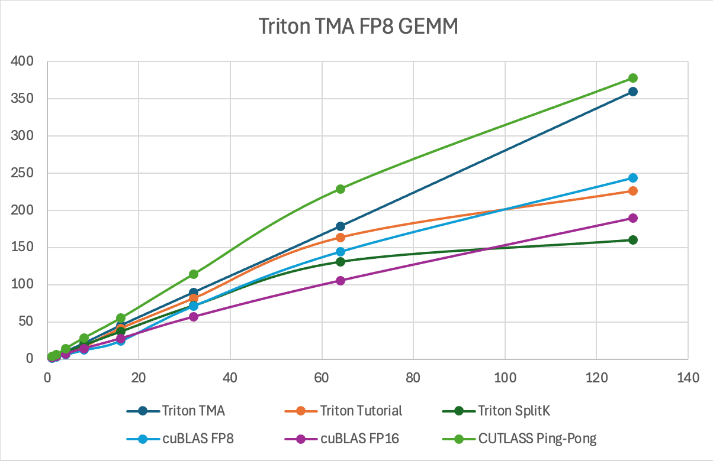

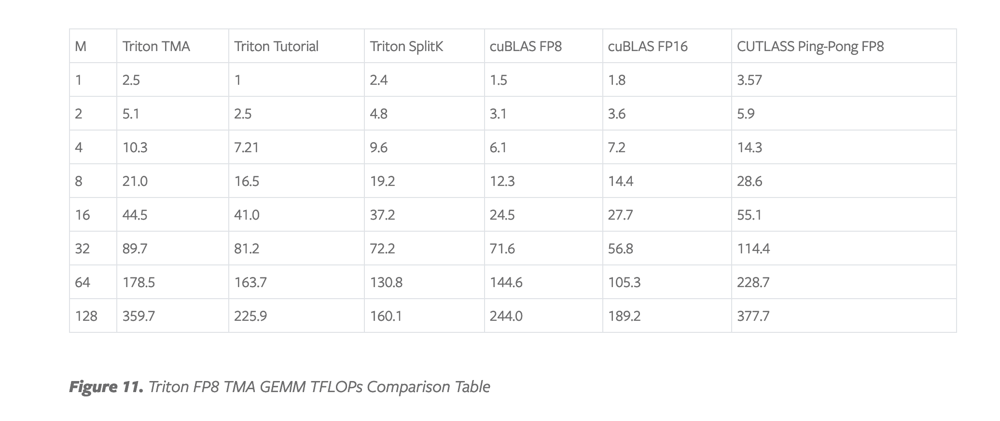

위 차트와 표는 단일 NVIDIA H100에서 TMA 하드웨어 유닛을 활용했을 때, FP8 GEMM에서 비TMA Triton kernel 및 고성능 CUDA(cuBLAS) kernel 대비 얻을 수 있는 성능 향상을 요약합니다. 주목해야 할 핵심은 이 kernel이 batch size가 커질수록 경쟁자 대비 더 나은 확장성을 보인다는 점입니다. 우리가 benchmark한 문제 크기는 작은 batch부터 중간 batch 크기의 LLM 추론에서 흔히 나타나는 matrix shape를 대표합니다. 따라서 이 kernel을 FP8 LLM 배포에 활용하려는 사용 사례에서는 중간 M 범위, 즉 M=32에서 M=128의 TMA GEMM kernel 성능이 중요합니다. FP8 압축 데이터 타입은 더 큰 행렬을 GPU 메모리에 맞출 수 있게 해주기 때문입니다.

분석을 요약하면, Triton과 CUTLASS의 TMA 구현은 Multicast, prefetch 같은 전체 기능 지원과 TMA descriptor를 GPU kernel에 전달하는 방식에서 차이가 있습니다. 이 descriptor가 CUTLASS kernel에 더 가까운 방식, 즉 값 전달로 전달될 수 있다면 불필요한 host-to-device(H2D) 복사를 피할 수 있고, end-to-end(E2E) 성능을 크게 개선할 수 있습니다.

## 향후 작업

향후 연구에서는 커뮤니티와 협력해 CUTLASS 아키텍처의 TMA load 방식을 Triton에 통합하고, FP8 GEMM의 Cooperative kernel, 즉 PingPong kernel의 개선 전략을 연구해 이러한 결과를 더 개선할 계획입니다.

또한 thread block clusters와 TMA atomic operation 같은 기능이 Triton에서 활성화되면, TMA GEMM kernel에서 SplitK 전략을 활용해 추가 가속을 얻을 수 있을지도 모릅니다. Hopper 아키텍처에서는 atomic operation을 L2 cache가 아니라 distributed shared memory, 즉 DSMEM에서 수행할 수 있기 때문입니다. 우리는 NVIDIA Hopper GPU가 Google의 TPU와 IBM의 AIU 같은 다른 AI 하드웨어 가속기와 데이터 흐름 아키텍처로서 유사하다는 점도 주목했습니다. Hopper에서는 이 블로그에서 폭넓게 논의한 TMA와 향후 글에서 소개할 DSMEM이 추가되면서, 데이터가 이제 전역 메모리(GMEM)에서 서로 연결된 streaming multiprocessor(SM) network로 "흐를" 수 있습니다.

## 보충: 블로그 코드 설명

아래 주석 초안은 Cursor에 내장된 claude-3.5-sonnet이 생성했고, 저는 일부 정확성 조정을 했습니다.

```python
import triton
import triton.language as tl
import numpy as np
import torch

# TMA(Tensor Memory Accelerator)를 사용하는 GEMM, 즉 일반 행렬 곱 kernel을 정의합니다.
@triton.jit
def gemm_kernel_tma(a_desc_ptr, b_desc_ptr, c_desc_ptr,  #
                      prob_m, prob_n, prob_k, block_m: tl.constexpr, block_n: tl.constexpr, block_k: tl.constexpr):
    
    # 현재 program의 ID를 가져옵니다.
    pid = tl.program_id(axis=0)
    # M과 K 차원의 block 수를 계산합니다.
    num_pid_m = tl.cdiv(prob_m, block_m)
    num_pid_k = tl.cdiv(prob_k, block_k)
    # 현재 block의 M과 N 차원 index를 계산합니다.
    pid_m = pid % num_pid_m
    pid_n = pid // num_pid_m
    # A와 B matrix의 offset을 계산합니다.
    offs_am = pid_m * block_m
    offs_bn = pid_n * block_n
    offs_k = 0

    # accumulator를 zero matrix로 초기화합니다.
    accumulator = tl.zeros((block_m, block_n), dtype=tl.float32)
    # K 차원으로 loop를 수행합니다.
    for kk in range(0, num_pid_k):
        # TMA를 사용해 전역 메모리에서 A와 B matrix block을 load합니다.
        a = tl._experimental_descriptor_load(a_desc_ptr, [offs_am, offs_k], [block_m, block_k], tl.float8e4nv)
        b = tl._experimental_descriptor_load(b_desc_ptr, [offs_bn, offs_k], [block_n, block_k], tl.float8e4nv)
        
        # 행렬 곱을 수행하고 결과를 누적합니다.
        accumulator = tl.dot(a, b.T, acc=accumulator, out_dtype=tl.float32)
        offs_k += block_k

    # 결과를 float16 타입으로 변환합니다.
    accumulator = accumulator.to(tl.float16)
    # 결과를 전역 메모리에 저장합니다.
    tl._experimental_descriptor_store(c_desc_ptr, accumulator, [offs_am, offs_bn])


# 행렬 곱 함수를 정의합니다.
def matmul(a, b, config=None):

    # 입력 matrix의 차원을 가져옵니다.
    m, _ = a.shape
    k, n = b.shape

    # config가 제공되면 config 안의 parameter를 사용합니다.
    if config:
        block_m = config["block_m"]
        block_n = config["block_n"]
        block_k = config["block_k"]
        num_warps = config["num_warps"]
        num_stages = config["num_stages"]
    
    # 그렇지 않으면 기본 parameter를 사용합니다.
    block_m = 64
    block_n = 64
    block_k = 256
    num_warps = 4
    num_stages = 4
    TMA_SIZE = 512

    # TMA descriptor를 만듭니다.
    desc_a = np.empty(TMA_SIZE, dtype=np.int8)
    desc_b = np.empty(TMA_SIZE, dtype=np.int8)
    desc_c = np.empty(TMA_SIZE, dtype=np.int8)

    # output matrix를 만듭니다.
    c = torch.empty((m, n), dtype=torch.float16, device='cuda')
    
    # TMA descriptor를 채웁니다.
    triton.runtime.driver.active.utils.fill_2d_tma_descriptor(a.data_ptr(), m, k, block_m, block_k, a.element_size(),
                                                            desc_a)
    triton.runtime.driver.active.utils.fill_2d_tma_descriptor(b.data_ptr(), n, k, block_n, block_k, b.element_size(),
                                                            desc_b)
    triton.runtime.driver.active.utils.fill_2d_tma_descriptor(c.data_ptr(), m, n, block_m, block_n, c.element_size(),
                                                            desc_c)
    
    # descriptor를 GPU로 옮깁니다.
    desc_a = torch.tensor(desc_a, device='cuda')
    desc_b = torch.tensor(desc_b, device='cuda')
    desc_c = torch.tensor(desc_c, device='cuda')

    # 전체 block 수를 계산합니다.
    total_blocks_m = triton.cdiv(m, block_m)
    total_blocks_n = triton.cdiv(n, block_n)
    
    # grid size를 설정합니다.
    grid = (total_blocks_m * total_blocks_n, 1, 1)
    
    # kernel을 시작합니다.
    k = gemm_kernel_tma[grid](
        desc_a, desc_b, desc_c,
        m, n, k,
        block_m,
        block_n,
        block_k,
        num_warps=num_warps,
        num_stages=num_stages,
    )

    # 결과 matrix를 반환합니다.
    return c


if __name__ == '__main__':

    # matrix 차원을 설정합니다.
    M = 128
    N = 4096
    K = 4096

    # random input matrix를 만들고 float8 타입으로 변환합니다.
    a = torch.randn((M, K), device="cuda", dtype=torch.float16).to(torch.float8_e4m3fn)
    b = torch.randn((K, N), device="cuda", dtype=torch.float16).to(torch.float8_e4m3fn)
    b = b.T.contiguous()

    # 행렬 곱을 수행합니다.
    triton = matmul(a, b)
```
