# TensorRT-LLM의 Quantization GEMM（Ampere Mixed GEMM）의 CUTLASS 2.x 구현 설명

> LLM의 추론과 배포에서 저정밀도 양자화는 성능 향상에 매우 중요하다. 이번 공유에서는 TRT-LLM에서 CUTLASS 2.x를 기반으로 PerChannel/AWQ/SmoothQuant 등의 양자화 방법을 모델 추론 과정의 계산에 어떻게 구현하는지를 소개한다. Slides는 BiliBili NVIDIA 채널이 업로드한 《TensorRT-LLM中的 Quantization GEMM（Ampere Mixed GEMM）的 CUTLASS 2.x 实现讲解》 영상 강의에서 가져왔다. 여기서는 영상을 참고하면서 각 페이지 Slides의 요점을 더 자세히 기록했으며, 이 영상을 통해 TRT-LLM에서 CUTLASS 2.x를 사용하여 Mixed GEMM 연산자를 어떻게 커스터마이즈하는지 알아본다. 나는 이를 CUDA-MODE의 CUTLASS 강의의 선행 학습 내용으로 삼았다.

## 개요 & 목차

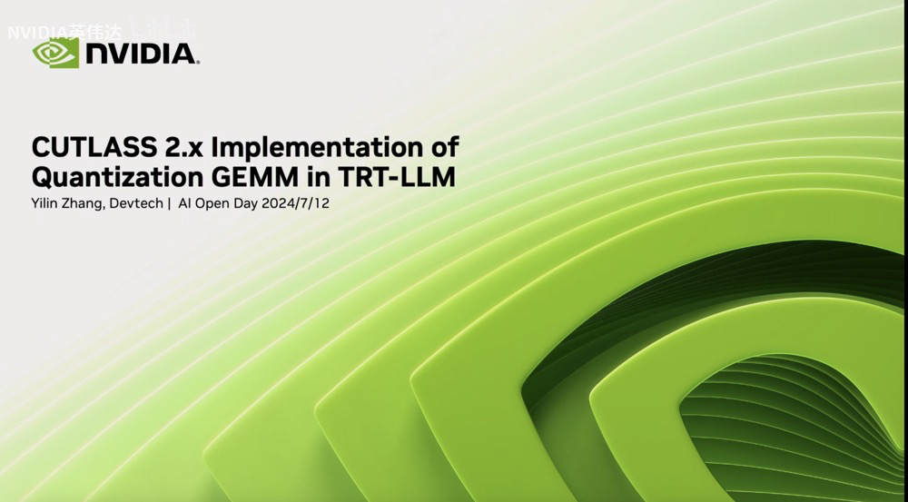

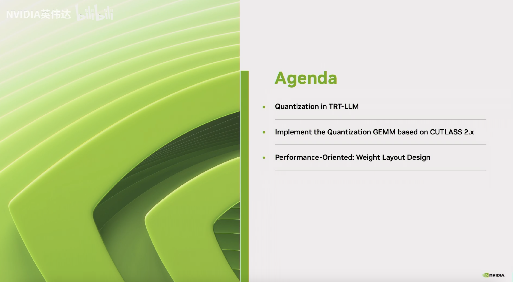

강의 목차는 본 장의 Slides에 나타난 바와 같다. 저자는 먼저 TRT-LLM 추론의 몇 가지 양자화 방법을 소개한 다음, 코드 없이 CUTLASS 2.x의 전체 흐름과 Mixed GEMM을 구현하려면 어떤 수정이 필요한지를 소개하고, 마지막으로 TRT-LLM에서 Ampere상의 Mixed GEMM에 대해 Weight Layout을 왜 이렇게 설계했는지를 중점적으로 다룬다. 주로 성능과 CUTLASS 2.x 자체의 제약이라는 관점에서 고려한 것이다.

## TRT-LLM에서의 양자화

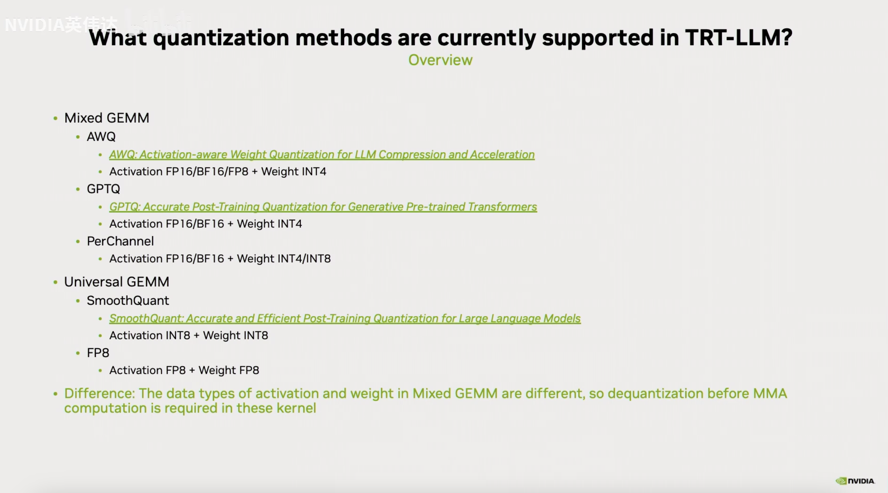

TensorRT에서 양자화 방법은 주로 2가지로 나뉜다. 하나는 Mixed GEMM으로, Activation과 Weight의 데이터 타입이 서로 다른 경우이며, 예를 들어 AWQ, GPTQ, PerChannel이 있다. 다른 하나는 Universal GEMM으로, 예를 들어 SmoothQuant와 FP8이 있으며, 이들은 Activation과 Weight의 데이터 타입이 동일하다.

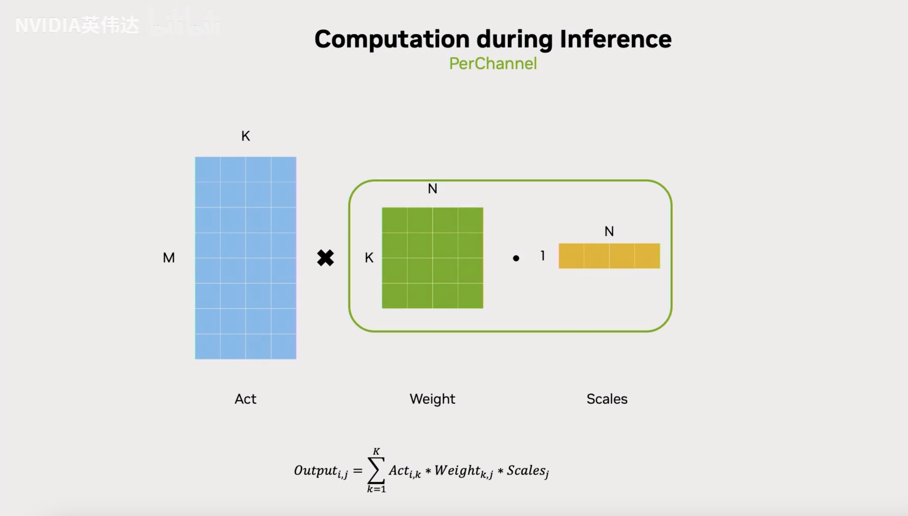

먼저 PerChannel의 추론 시 계산 흐름을 보자. 추론 시 먼저 Weight에 Scales를 곱해 역양자화한 다음, 정상적인 GEMM을 수행하는 것을 볼 수 있는데, 흐름이 비교적 단순하다.

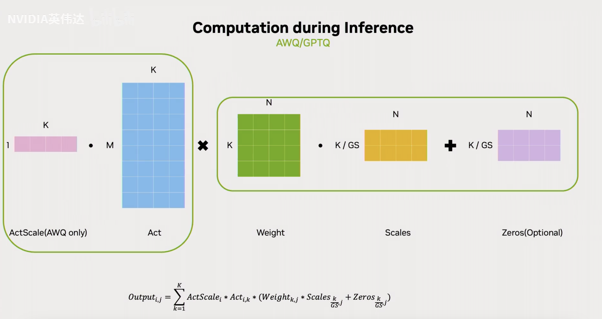

AWQ/GPTQ의 경우, 가중치의 양자화는 더 이상 PerChannel이 아니라 GroupWise이다. 즉 K 방향으로 GS개 그룹의 Scales와 Zeros가 존재한다. 예를 들어 K/GS=128이라고 가정하면 K 방향으로 128개 행의 Weight가 하나의 Scales와 Zeros를 공유한다. 따라서 PerChannel과의 차이는 역양자화할 때 Scales를 곱하고 Zeros를 더해야 한다는 점이다. 이 외에도 AWQ 자체는 Activation 계산 전에 자신의 ActScale을 곱해야 한다.

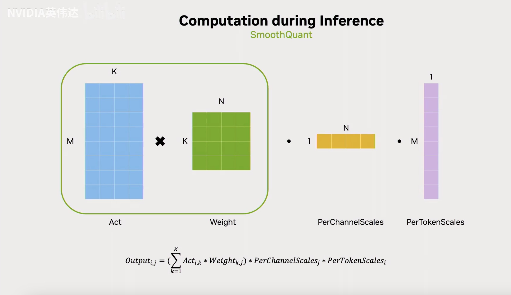

SmoothQuant는 이전의 Mixed GEMM 양자화 방법처럼 GEMM 계산 전에 역양자화를 할 필요가 없다. 그 Scale은 마지막 출력 시점에 apply할 수 있다. 앞부분의 계산은 일반적인 Int8 GEMM이고, 출력할 때 PerChannelScales와 PerTokenScales를 곱한다.

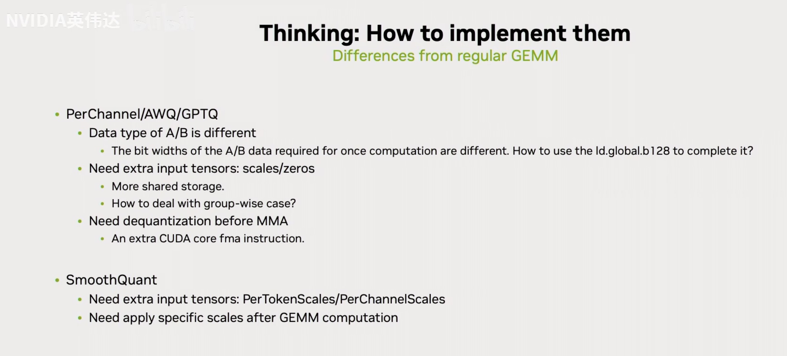

이 Slides는 CUTLASS를 사용하여 서로 다른 양자화 기법을 어떻게 구현하는지를 논하며, 일반적인 GEMM(범용 행렬 곱셈)과의 차이를 짚어준다. 주요 내용은 다음과 같다.
- PerChannel/AWQ/GPTQ 기법:
    - A/B의 데이터 타입이 다름: A/B 데이터에 필요한 비트 폭이 다르며, ld.global.b128을 사용하여 이 연산을 완수하는 방법을 제시한다(GEMM을 계산할 때 우리는 먼저 같은 스레드 또는 warp가 A, B 행렬에서 로드하는 원소 개수가 동일하도록 보장해야 한다. 왜냐하면 K 방향으로 벡터 내적과 유사한 연산을 수행해야 하기 때문이다. 모두 128 bit의 load를 사용한다고 가정하면, A 행렬이 16bit라면 한 번에 8개 원소를 로드해 오지만, B 행렬에서 8개 원소를 로드하려면 ld.global.b32만 사용할 수 있다. 즉 효율이 더 높은 ld.global.b128 명령을 사용할 수 없다. 따라서 우리는 어떻게 Layout을 조정하거나 다른 방법을 사용하여 B 행렬도 가능한 한 더 효율이 높은 비트 폭의 load 명령을 쓸 수 있게 할지에 주의해야 한다).
    - 추가 입력 텐서가 필요함: scales/zeros
        - 더 많은 Shared Memory가 필요함(이전 《CUTLASS 2.x & CUTLASS 3.x Intro 학습 노트》에서 알 수 있듯이, 우리는 scales와 zeros도 shared memory에 넣어 MultiStage로 계산과 메모리 접근을 Overlap시켜야 한다)
        - 그룹화(group-wise) 상황은 어떻게 처리할 것인가?
    - 행렬 곱셈(MMA) 수행 전에 역양자화가 필요함
        - 추가 CUDA 코어 fma 명령이 필요함(GEMM 계산 전에 저비트 데이터를 Activation의 데이터 타입과 일치하도록 역양자화해야 함)
- SmoothQuant 기법:
    - 추가 입력 텐서가 필요함: PerTokenScales/PerChannelScales
    - GEMM 계산 후에 특정 스케일링을 적용해야 함.(SmoothQuant의 경우 Epilogue 단계에서 이 두 Tensor를 load해 곱한 다음, global memory에 다시 쓰기만 하면 된다).

## CUTLASS 2.x kernel 계산의 전체 흐름

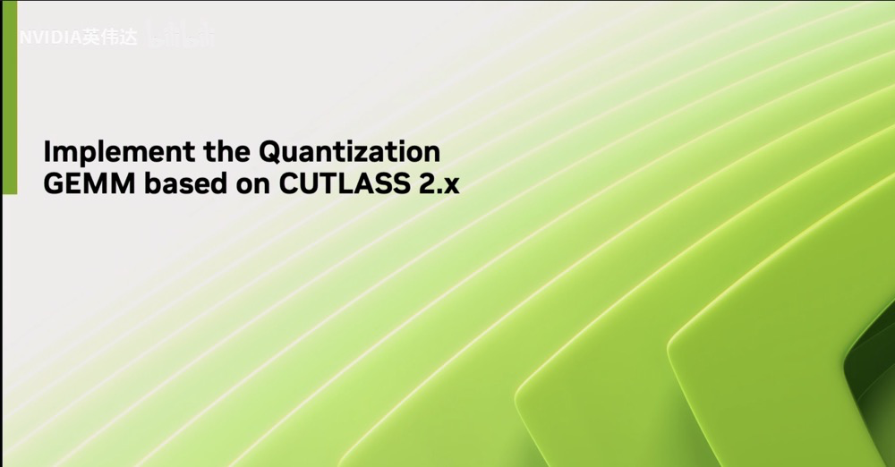

이것은 CUTLASS GEMM의 핵심 개념도이다. C 행렬을 시점으로 삼아, 행렬 C를 작은 블록으로 나누어 각 BLOCK이 한 블록을 맡아 계산하게 한다. 이어서 WARP를 지정하여 계산하게 하는데, WARP는 이 작은 블록 중의 어떤 한 부분을 맡는다. 예를 들어 그림 속 Thread Block Tile의 녹색 블록이다. 각 WARP에는 32개의 스레드가 있는데, 각 스레드는 또 어느 부분을 계산해야 하는가? Warp Tile 그림은 세부 사항을 더 확대해서 보여주는데, 그중 4개의 녹색 블록은 하나의 스레드가 담당해야 하는 행렬 C의 부분을 나타낸다. 마지막으로 스레드 수준에 이르면, 각 스레드는 자신의 레지스터를 가지고 자신의 작업을 담당한다. 더 오른쪽은 Epilogue로, 이것은 많은 사람이 CUTLASS를 사용하는 첫 단계이다. 예를 들어 GEMM 뒤에 Activation 후처리를 하는 것이다. 마지막으로 데이터를 Global Memory에 다시 써서 전체 연산 과정을 완료한다. 분할의 핵심 파라미터와 Epilogue의 연산 타입은 그림 속 using 문으로 지정된다.

이 그림은 CUTLASS의 개념이지만, 여기서는 데이터의 흐름도 그려져 있다. 데이터는 Global Memory에서 단계별로 전달되어야 한다. Tiling 외에 또 하나의 중요한 개념은, 데이터를 가능한 한 상위 캐시에서 재사용하여 더 높은 대역폭을 누리고 global memory 데이터를 빈번하게 읽는 것을 피해야 한다는 점이다. 따라서 우리는 데이터를 Shared Memory, 레지스터에 두고, Tensor Core가 레지스터에서 계산을 마친 후 Shared Memory에 다시 쓰며(메모리 접근을 병합하기 위해 더 큰 비트 폭의 load 명령을 사용하고), 정렬한 후에 다시 Shared Memory에서 연속적으로 병합된 캐시 형태로 Global Memory에 다시 쓴다.

CUTLASS 2.x(Ampere 아키텍처 스타일)에서는 또한, Tiling과 메모리 계층의 재사용 외에도, 소프트웨어 파이프라인 방법을 사용하여 global memory 읽기/쓰기 latency와 계산을 숨기고자 한다고 언급한다. 즉 현재 계산을 하면서 이후 계산 라운드에 필요한 데이터를 읽어, 이 과정을 파이프라인화할 수 있다. 안정적인 파이프라인에 진입하기 전에, 즉 그림 속 Main loop body에는 파이프라인을 구축하는 과정이 있다. 계산 프리페치를 해서, 현재 계산하는 데이터는 분명 이전 몇 라운드의 계산에서 미리 가져온 것이며, 이러한 데이터 프리페치를 Prologue라고 한다. GEMM의 전체 계산 과정은 Prologue, Main Loop, Epilogue 부분으로 나뉘며, Tensor Core를 사용하는 GEMM 계산은 Main Loop 부분에서 일어난다.

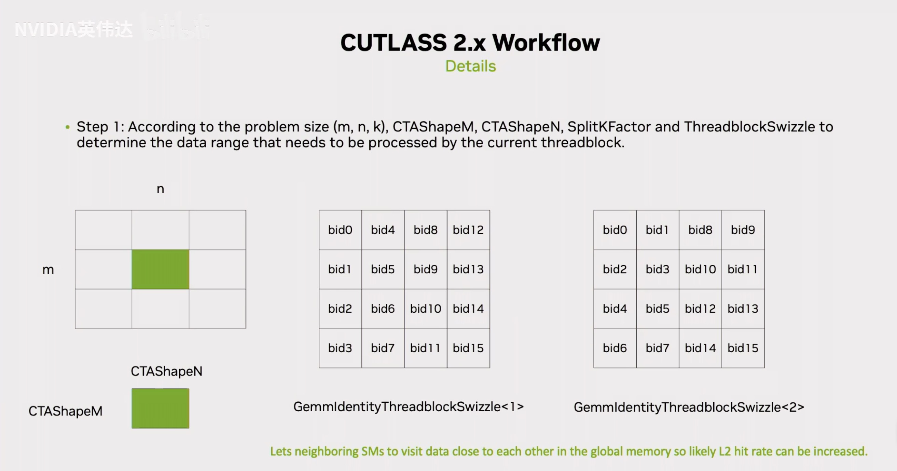

이어서 CUTLASS 2.x의 흐름을 보여준다. 우리는 thread block을 어떻게 나눌지를 결정해야 한다. 예를 들어 하나의 thread block이 얼마나 큰 데이터 블록을 계산하는지, 이 블록이 행렬의 어느 위치에 있는지이다. 먼저 하나의 CTAShapeM과 CTAShapeN을 설정하여 하나의 스레드 블록이 계산해야 하는 Tile의 크기를 나타내야 한다. 그런데 어느 thread block이 어느 블록을 계산할지는 어떻게 결정하는가? 만약 ThreadblockSwizzle 이 파라미터가 기본값 1이면, thread block에서 실제 계산 블록으로의 매핑에 아무런 변화도 주지 않는다. 그러면 그 계산은 m 방향을 따라가며, 제0번째 Block이 가장 왼쪽 위의 블록을 계산하고, 이어서 m 방향을 따라 순서대로 배열된다. 만약 ThreadblockSwizzle 이 파라미터가 2이면, 그 매핑 방식은 위 Slides 가장 오른쪽 그림의 모습으로 바뀐다. 이렇게 하면 무슨 이점이 있는가? GPU상에서 thread block과 실제 SM의 대응 관계를 알아보자. 일반적으로 일련의 Block을 일련의 인접한 SM에 연속적으로 발사한다. 우리는 L2 Cache가 모든 SM에서 공유된다는 것을 알고 있으므로, 서로 다른 SM에서 가능한 한 더 높은 확률로 L2 Cache에 적중하기를 바란다. 만약 발사하는 것이 bid0/1/2/3 이 4개 block이라면, 위 Slides 속 오른쪽 그림의 행 방향과 열 방향의 Cache 적중률이 더 높지만, 가운데 그림의 방식대로 발사하면 어떤 위치의 Cache 적중률은 매우 낮을 것이다. 정리하면 인접한 SM이 가능한 한 공간적 위치가 인접한 데이터를 접근하게 하여 L2 Cache 적중률을 높이는 것이다. 이것이 BlockSwizzling(블록 인터리빙)의 역할이다.

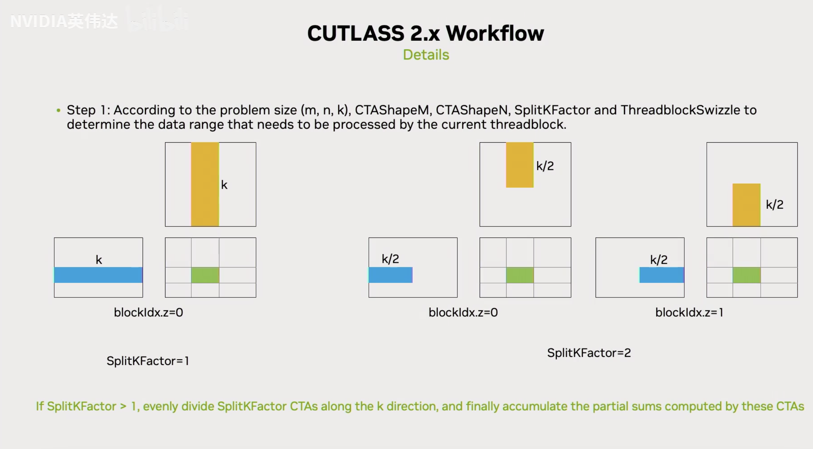

CUTLASS GEMM kernel을 구현할 때 SplitKFactor라는 파라미터가 있는데, 이 파라미터는 GEMM의 K 방향을 따라 분할함을 나타낸다. 예를 들어 SplitKFactor=2일 때 K 차원을 2등분하여, K 차원상에서 2개의 Block이 생긴다. K 차원에서 blockIdx.z=0일 때는 앞쪽 k/2의 데이터를 처리하고, blockIdx.z=1일 때는 뒤쪽 k/2의 데이터를 처리한다. 계산이 끝난 후, 이 두 Block은 각각 최종 출력 데이터의 부분합(partial sum)만을 보유하게 된다. Epilogue 단계가 끝난 후 일련의 형태를 통해 이 두 Block 안의 데이터를 global memory에 누적해 다시 쓴다. 이러한 형태는 CUTLASS 구현에서 일반적으로 두 가지가 있는데, 하나는 SplitK Serial로, 즉 직렬 형태이다. 세마포어나 락 방식을 통해 먼저 첫 번째 Block이 Global Memory에 쓰도록 보장한 다음, 두 번째 Block이 이 부분을 계속 실행하도록 제어하고, 그것을 대응하는 Global Memory 위치에 누적한다.

다른 형태는 SplitK Parallel이라고 하는데, 이 두 Block을 각각 서로 다른 Buffer에 쓴 다음, reduce kernel로 이 두 buffer를 누적한다. 이 페이지 Slides는 K 차원상에서 Block을 어떻게 분할하는지를 설명한다.

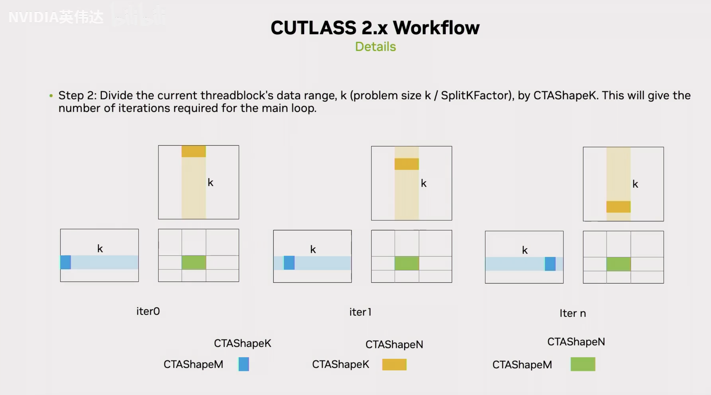

그런 다음 Block이 실제로 어느 Tile을 계산할지 결정한 후, MainLoop에서 반복하는 단계 수, 즉 K 방향을 따라 몇 번 반복해야 하는지를 결정해야 한다. CTAShapeK는 전체 GEMM 계산 과정에서 K 방향을 따라 루프를 도는데, 매 반복마다 K 방향상의 원소를 몇 개 계산할지, 즉 CTAShapeK개의 원소를 계산할지를 결정한다. 그리고 앞에서도 Stage Memory라는 것을 언급했는데, 아마 각 Stage가 하나의 CTAShapeK에 대응할 것이다. 예를 들어 5개의 Stage가 있으면 5개 CTAShapeK의 데이터를 Prefetch해 온다. 즉 아래 5번의 계산에 필요한 데이터를 전부 미리 Shared Memory에 prefetch해 두는 것이다.

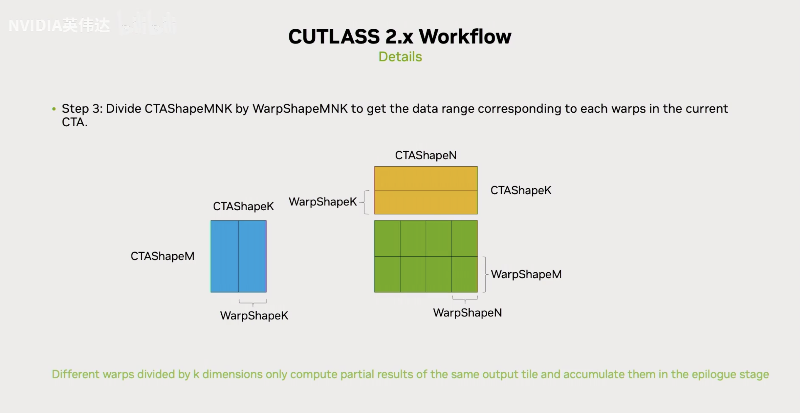

그런 다음 우리는 BlockShape에서 더 나아가 WarpShape을 분할해 내야 한다. 즉 하나의 Thread Block 안의 Warp가 어떻게 배치되는지이다. 이 배치 방식은 《CUTLASS 2.x & CUTLASS 3.x Intro 학습 노트》에서도 간단히 소개했는데, MNK 세 방향의 BlockShape을 WarpShape으로 나누면 MNK 세 방향의 warp 수를 얻는다. MN 방향상의 Warp 수는 이해하기 쉽다. 방금 전 CTAShape처럼 최종 출력되는 Thread Block 안에서 출력되는 어떤 한 블록의 데이터에 대응한다. 예를 들어 BlockShapeM을 WarpShapeM으로 나눈 값이 2라면 M 방향이 2블록으로 나뉜다는 의미이고, 이 방향상의 한 Warp가 그중 한 블록의 출력을 계산한다. N 방향도 비슷하다.

그러나 K 방향은 약간의 차이가 있다. K 방향은 누적을 진행하는 방향이기 때문에, 만약 K 방향의 WarpShape이 1보다 크다면 각 Warp는 현재 이 라운드의 반복 안에서의 누적합만 계산한다. 예를 들어 이 BlockShapeK가 64이고 WarpShapeK가 32이면, K 방향상의 Warp는 각각 앞쪽 32개 누적합과 뒤쪽 32개 누적합만 계산한다. 이렇게 K 방향을 따라 전체 반복을 완료한 후, K 방향의 2개 Warp는 각각 최종 누적합의 일부를 보유하게 된다. 그런 다음 Epilogue 단계에서 이들을 Shared Memory에 다시 쓴 후, K 방향의 두 Warp의 데이터를 누적해 합친다.

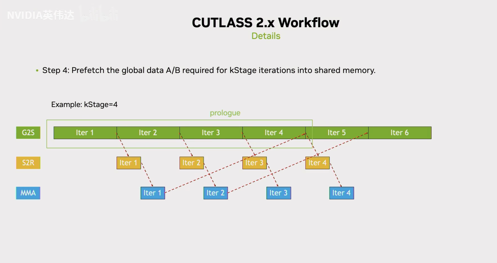

앞에서 BlockShape에서 WarpShape으로의 분할을 소개했는데, 여기서는 CUTLASS의 MultiStage가 무엇인지 다시 소개한다. MultiStage는, 우선 하나의 Stage가 K 방향 한 번의 반복 데이터에 대응한다. 예를 들어 Stage 수가 4이면, prologue는 4번 반복의 데이터를 prefetch한다. 이 prefetch는 일반적으로 LDGSTS 명령(CpAsync)을 통해 완수된다. 이것은 비동기 명령이므로, 제출한 후에 이 명령의 완료를 기다릴 수 있다. 이 명령을 발사한 후에는 MainLoop의 계산을 시작할 수 있는데, MainLoop의 계산은 prologue 단계에서 발사한 4개 stage 중 첫 번째 stage의 데이터가 준비되기를 기다린다. 이 데이터가 일단 준비되면, 이 데이터가 이미 Global Memory에서 Shared Memory로 복사되었음을 의미하며, 이어서 Shared Memory에서 실제 데이터를 레지스터로 load할 수 있고, 그러면 이 데이터를 가지고 Tensor Core 명령을 계산할 수 있다. 이 데이터 계산이 완료되면 첫 번째 iteration의 계산이 실제로 모두 완료된 것이므로, 5번째 stage에 대응하는 global에서 shared memory로의 복사 비동기 명령을 발사할 수 있다. 이 명령을 발사한 후, 진짜 두 번째 반복을 시작한다. 두 번째 반복 시, 그 두 번째 라운드의 복사 명령은 이미 prologue 단계에서 발사되었으므로, 이 명령의 완료를 기다리기만 하면 되고, 완료되면 이 데이터를 가지고 레지스터를 load한 다음 계산하고 다음 global에서 shared memory로의 복사 비동기 명령을 발사한다.

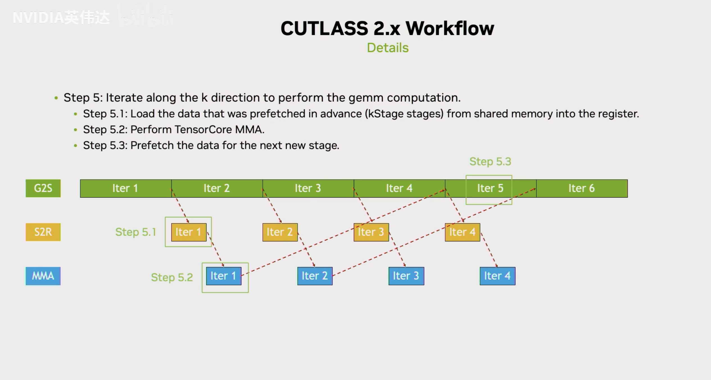

정리하면 CUTLASS GEMM은 MainLoop 단계에서 전체 K 방향을 따라 반복한다. 먼저 prefetch한 데이터를 레지스터로 load한 다음, Tensor Core 계산을 수행하고, 계산을 마친 후 다음 stage의 데이터를 prefetch한다. 이것이 전체 MainLoop의 흐름이다.

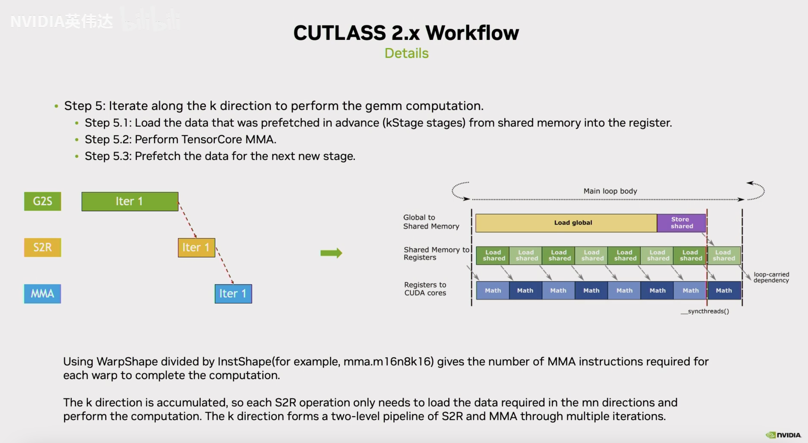

MainLoop 계산에서는, 먼저 prefetch한 데이터를 레지스터로 load한 다음, 레지스터에서 Tensor Core 명령의 계산을 시작하는데, 이 과정에서도 실제로 일부 overlap이 있다. 현재 필요한 데이터를 직접 전부 shared memory에서 load한 다음, 하나씩 순회하며 MMA(Tensor Core 명령) 계산을 하는 것이 아니다. 오히려 Slides 속 왼쪽 그림처럼 한다. 일반적으로 TensorCore 명령은 보통 mma.m16n8k16 또는 mma.m16n8k8 같은 형태이며, WarpShape은 일반적으로 그 크기가 실제 Tensor Core 명령 shape 이상이다. 그러면 MNK 방향상에서 한 warp가 여러 개의 TensorCore 명령을 실행해야 함을 의미한다. 우리는 MN 방향의 Tensor Core 명령이 대응하는 것은 확실히 서로 다른 출력이며, 이 출력 부분을 캐시하기 위해 각자 서로 다른 레지스터가 필요하다는 것을 안다. 그러나 K 방향은 누적 방향이므로, K 방향상에서 Tensor Core 명령이 몇 개든 출력을 캐시하기 위한 추가 레지스터를 할당할 필요가 없다. 따라서 실제 계산 과정에서는 WarpShapeK를 InstructionShapeK로 나누어 K 방향상에서 한 Warp가 발사해야 하는 Tensor Core 명령의 개수를 얻고, 그것을 하나의 루프로 만든다. 루프 본문에서는 매번 이 한 Tensor Core 명령에 필요한 데이터만 레지스터로 load한 다음 대응하는 Tensor Core 계산을 한다. 이와 동시에, K 방향의 다음 Tensor Core 명령이 load할 데이터의 명령을 병렬로 발사할 수 있다. 이렇게 하여 Shared Memory에서 레지스터로의 load와 Tensor Core 명령의 상호 계산 사이의 Overlap이 형성된다.

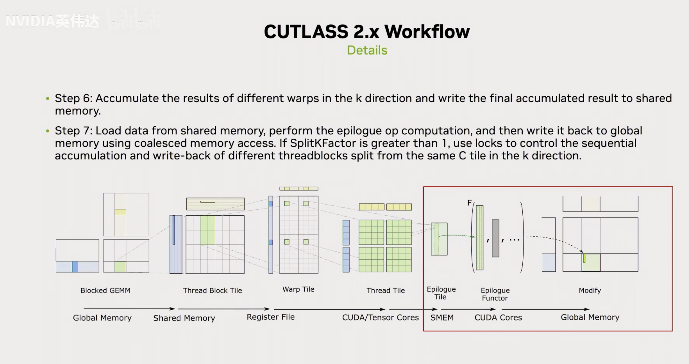

방금 전의 몇 단계를 완료하면, 기본적으로 CUTLASS의 Prologue와 MainLoop의 주요 부분이 된다. 마지막으로 Epilogue 계산이 하나 있는데, Epilogue 계산은 2단계일 수 있다. 첫 번째 단계는 K 방향의 서로 다른 warp의 데이터를 누적하는 것이고, 두 번째 단계는 이미 계산이 끝난 데이터를 Shared Memory에서 레지스터로 다시 load한 다음 존재할 수 있는 일부 Epilogue OP를 실행하는 것이다. 예를 들어 Activation 계산이며, 계산이 끝나면 데이터를 Global Memory에 다시 쓴다. 만약 SplitKFactor가 >1이면, 락을 사용하여 순서대로 쓰도록 제어하거나 병렬 방식으로 서로 다른 Buffer에 쓴 다음 마지막에 Reduction한다. 이상이 전체 CUTLASS 2.x kernel 계산의 전체 흐름이다.

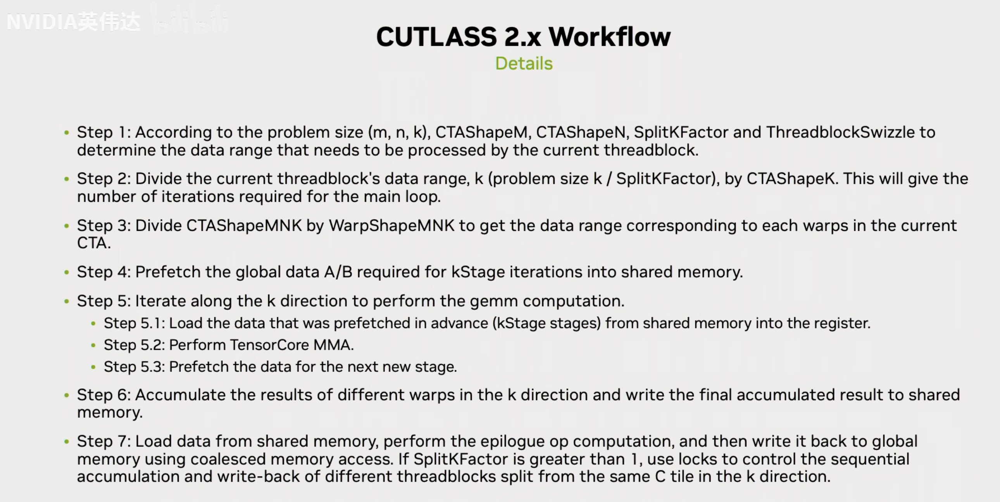

이것은 방금 전 CUTLASS 2.x kernel 계산의 전체 흐름 PPT의 요약이다.

## CUTLASS 2.x를 기반으로 Mixed GEMM을 어떻게 구현하는가

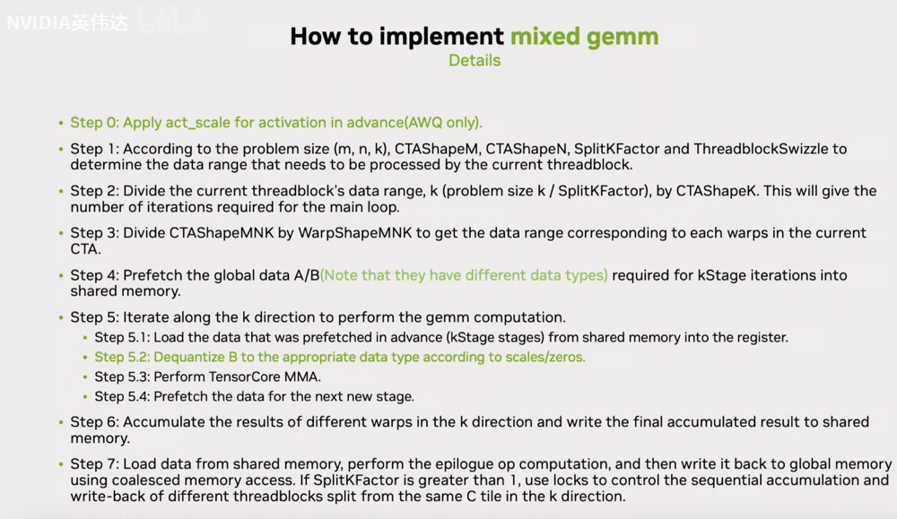

Mixed GEMM을 구현하려면 방금 전 일반적인 GEMM에 비해 해야 하는 수정에는 어떤 것들이 있는가? 먼저 AWQ는 Activation에 추가로 scale을 곱해야 하는데, 이것은 AWQ에서만 필요하다. A/B 행렬의 데이터를 Load할 때, 지금은 A, B 행렬의 데이터 타입이 다르다는 점에 주의해야 한다. 그래서 지금은 모두 ldg128로 load할 수 없다. 그렇지 않으면 load하는 데이터 개수가 대등하지 않아 다음 단계의 계산을 진행할 수 없다. 또한 수정이 필요한 부분은, 실제 MMA 계산 전에 B의 데이터를 저비트 정밀도에서 A와 동일한 데이터 타입으로 역양자화해야 한다는 것이다. 이것들이 완료되면 일반적인 GEMM과 비슷하게 나머지 계산을 완전히 진행할 수 있다.

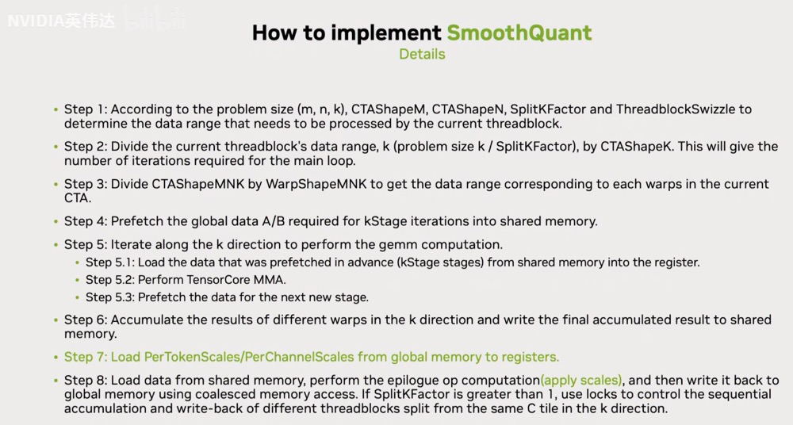

SmoothQuant의 경우, 앞쪽 MainLoop 부분의 Prologue 부분은 전혀 수정할 필요가 없고, Epilogue 부분에서 이 두 Scale을 load해 와서 실제 데이터에 적용하기만 하면 된다는 점에 주목할 수 있다.

## 성능 최적화의 핵심: 가중치 Layout 설계

여기서는 TRT-LLM에서 성능을 고려하여 어떤 까다로운(tricky) 작업을 했는지를 소개한다. 주로 B 행렬의 Layout에 대한 일부 조정이다.

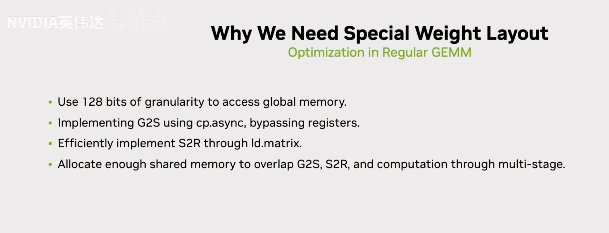

먼저 왜 이러한 특수한 Layout 조정이 필요한지를 소개해야 한다. 예를 들어 방금 언급했듯이 A, B 행렬의 비트 폭이 다르면, 똑같이 128bit의 load 명령으로 load할 경우 load해 오는 A, B 행렬의 원소 개수가 필연적으로 달라져 계산을 완수할 수 없다. 그다음으로는, global memory에서 shared memory로 데이터를 옮기는 것을 구현할 때 cp.async를 사용하여 레지스터를 bypass해야 하는데, 이것은 일반적인 GEMM도 하는 최적화이다. 그리고 일반적인 GEMM은 또한 ld.matrix를 통해 효율적으로 데이터를 shared memory에서 레지스터로 load한다. 또한 충분한 shared memory를 할당하여 multi-stage를 통해 이 몇 부분을 서로 overlap시킨다. 이것이 일반적인 GEMM이 하는 일이다.

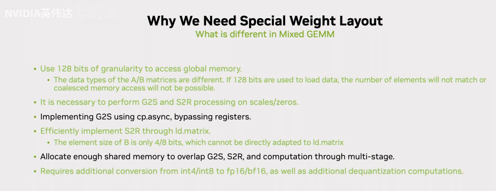

Mixed GEMM에서는 A, B 데이터 타입이 다르기 때문에 128bit의 load 명령을 무작정 사용하여 데이터를 load할 수 없다. 그래서 그들의 Layout을 조정할 방법을 강구하여 양쪽 모두 ld.128 명령을 쓸 수 있도록 보장해야 한다. 그리고 추가되는 scale과 zero도 마찬가지로 shared memory에 넣어야 하고, 마찬가지로 MultiStage로 Overlap시켜야 한다. 이어서 ld.matrix를 구현할 때도 일부 차이가 있다. ld.matrix는 8x8 행렬을 load해 오는 것인데, 기본적으로 이 8x8 행렬의 원소는 16bit이다. FP16/BF16의 GEMM의 경우, load해 온 후 원소의 배치가 자연스럽게 TensorCore 계산에 맞는다. 그러나 우리의 weight 비트 폭이 4bit/8bit이면 달라진다. 마지막으로 고려해야 할 것은, int4/int8에서 FP16 또는 BF16으로의 효율적인 변환이 필요하다는 점이다.

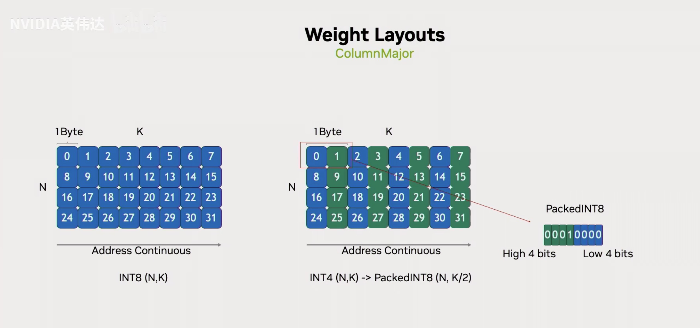

이어서 Weight Layouts의 세부 사항을 소개한다. 먼저 여기서는 일반적인 ColumnMajor의 weight Layout을 보여준다. N*K의 B 행렬은 K 방향을 따라 연속적이다. 이 B 행렬의 데이터 타입이 Int4라고 가정하면, 연속된 2개의 4bit 원소를 하나의 Byte로 Pack한다. 0, 1 이 두 원소를 보면, 제0번째 원소는 낮은 4개 bit에 저장되고, 제1번째 원소는 높은 4개 bit에 저장된다.

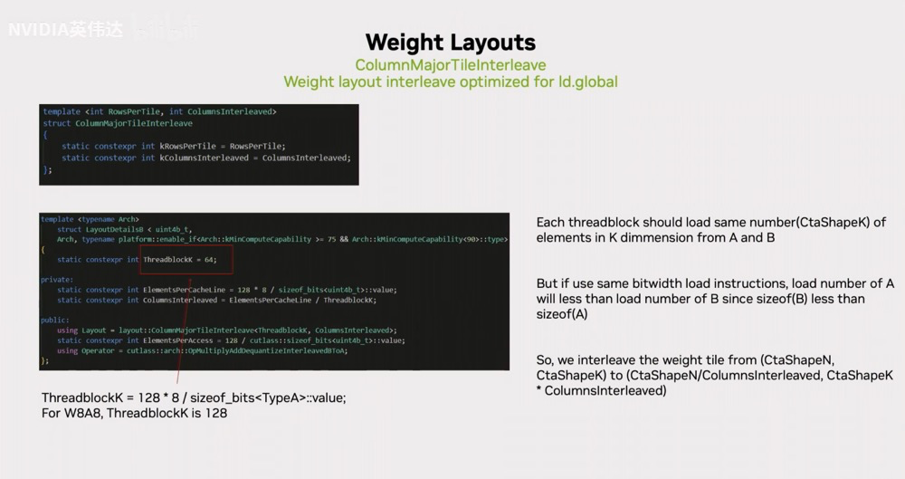

그러나 TRT-LLM에서는 ColumnMajor를 사용하지 않고 ColumnMajorTileInterleave라는 Layout을 사용한다. 먼저 여기 코드는 TileInterleave Layout의 핵심 요소를 대략적으로 설명한다. 여기에 ThreadblockK=64가 있다는 점에 주목하자. 이것은 TRT-LLM에서 모든 Mixed GEMM 구현이 64를 ThreadblockK로 사용한다는 것이다. 이는 이 ThreadblockK가 Shared Memory 또는 L2 Cache Line 128 byte를 A의 dtype 비트 폭으로 나눈 값, 즉 64와 동등하기 때문이다. 따라서 만약 Activation이 실제로는 FP16이 아니라 FP8이라면 이 값을 계산해서 ThreadblockK는 128이 된다. 이렇게 설정하는 이유는 K 방향으로 한 iteration flow의 데이터가 128 byte의 cache line에 대응하기를 바라기 때문이다. A, B의 데이터 타입이 다르다고 가정하면, 한 스레드가 한 번에 128bit로 A 행렬을 load해 온 원소 수량은 필연적으로 B 행렬의 원소 수량보다 2배 또는 4배 높다는 것을 의미한다. 우리는 특수한 처리를 하여, N 방향상의 연속된 2행 또는 4행을 연속된 한 행으로 Interleave한다. 이렇게 하면, A 행렬이 한 번에 32개 원소를 load한다고 가정할 때, 같은 load 명령으로 B 행렬의 128개 원소를 load할 수 있고, 이 128개 원소는 4행 32개 원소가 한데 interleave된 결과에 대응한다. 실제 과정에서는 32개 원소가 아니라 64개 원소 단위로 interleave한다.

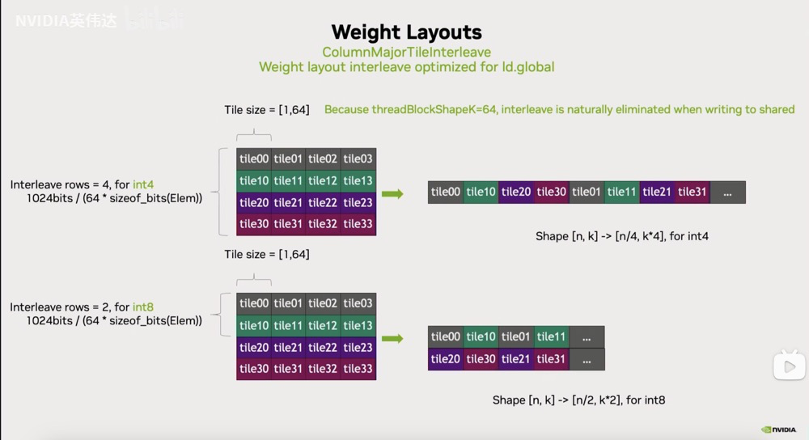

여기에는 위의 TileInterleave Layout을 설명하는 2개의 시각화 그림이 있다. int4를 예로 들면, 원래의 ColumnMajor Layout은 왼쪽 위 그림에 대응하며, 여기서 하나의 tile은 64개 원소이다. Interleave를 거친 후에는 앞쪽 4행의 64개 원소가 한데 interleave된다. 이렇게 하면 다시 B 행렬을 load할 때, 한 번에 256개 원소를 load해 오는데, 이것은 정확히 필요한 4행의 각 행 64개 원소에 대응한다. 그것을 shared memory에 다시 쓸 때, ThreadblockK=64이므로 연속적으로 interleave된 이 데이터를 정확히 shared memory 안의 서로 다른 행에 다시 배치하게 된다. 왜냐하면 shared memory의 한 행에는 64개 원소만 있을 수 있기 때문이다. 그래서 정확히 이 형태를 통해 interleave된 Layout을 상쇄한다.

ldg에 대해 interleave layout 최적화를 한 것 외에도, 다른 명령이나 다른 CUTLASS에서 쓰는 최적화 기법을 위한 일부 최적화도 있다.

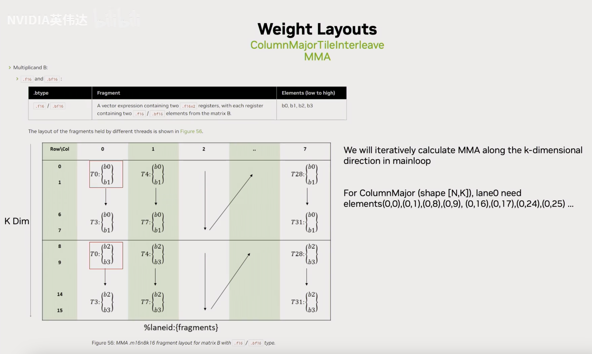

먼저 CUTLASS의 Tensor Core 명령을 소개한다. Tensor Core 명령은 데이터 배치에 요구 사항이 있다는 점에 주목하자. 16x8x8의 TensorCore 명령을 예로 들면, B 행렬은 각 스레드가 4개 byte에 대응할 수 있고, 인접한 4개 스레드가 인접한 8행을 load하며, 각 행은 하나의 16bit 데이터이다. 그리고 다음 행부터는 다음 4개의 인접한 스레드가 load한다. 이것은 같은 스레드, 예를 들어 제0번째 스레드가 전체 B 행렬 중 N 방향 제0행, K 방향의 제0열, 제1열, 제8열, 제9열, 제16열, 제17열에서 온다는 것을 의미한다. 아래 이 그림도 보면 되는데, 위 그림과 원리는 같지만 이해하기가 좀 더 쉽다:

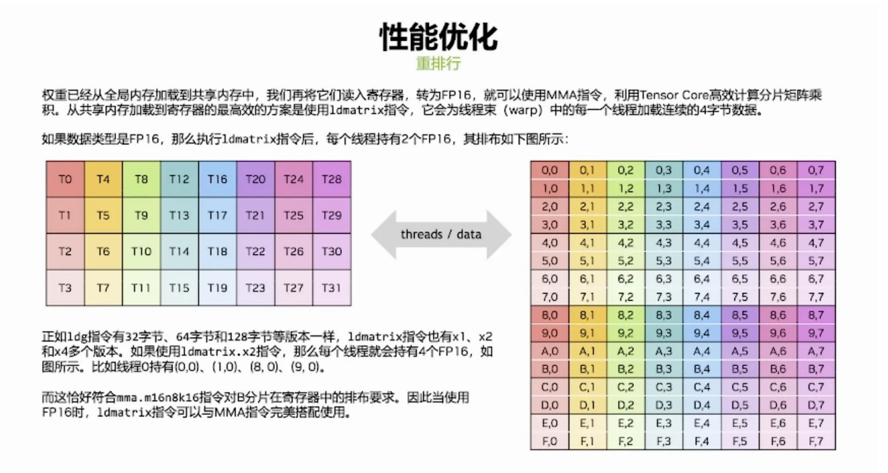

우리가 실제 CUTLASS에서 다시 데이터를 shared memory에서 레지스터로 가져와 Tensor Core 명령 계산을 할 때도, ld.matrix라는 명령을 사용하여 데이터를 load한다. ld.matrix의 작용은, 16비트 원소 비트 폭을 기준으로 한 8x8 행렬을 load하는 것인데, 여기서도 warp 안의 한 스레드가 연속 방향상의 두 개의 16bit 원소를 한 스레드로 load한다. 이것은 정확히 앞에서 본 Tensor Core의 데이터 배치 요구 사항과 일치한다. 위에서 알 수 있듯이, Tensor Core에서 연속된 4개 스레드는 연속된 8개의 16bit 원소가 필요하고, 이어서 아래 8열에서는 아래쪽 32개 스레드의 배치가 반복된다.

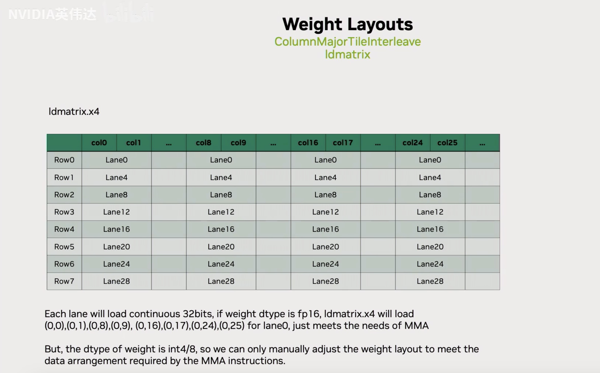

ld.matrix 명령은 본질적으로 3가지 다른 타입이 있는데, .x1, .x2, .x4이다. .num을 .x4로 설정하면, 임의의 방향에서 32개 스레드가 각 스레드마다 하나의 주소를 전달하고, 그중 맨 처음 4개 스레드가 연속된 16개 byte를 load하며, 다시 4개 스레드가 두 번째 주소에서 연속된 16개 byte를 load하고, 이런 식으로 이어진다. 이렇게 하면 ld.matrix x4 형태를 통해 앞의 Tensor Core 명령 계산에 필요한 그 원소들을 직접 대응하는 스레드의 레지스터로 load할 수 있다.

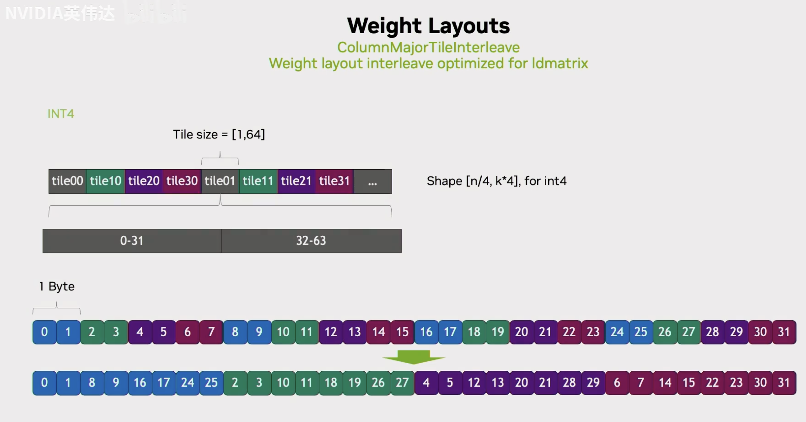

여기에는 또 하나의 문제가 있는데, ld.matrix는 원소의 데이터 비트 폭이 16bit라고 가정한다는 점이다. 한 스레드가 load하는 것은 연속된 4개 바이트인데, 만약 데이터 타입이 마침 bf16 또는 fp16이면 정확히 TensorCore 계산의 Layout 요구 사항에 부합한다. 그러나 실제로 우리의 B 행렬은 8bit나 4bit일 수 있다. 이것은 만약 연속된 4개 바이트를 한 스레드로 load하면, 실제로는 진짜 데이터의 01234567을 전부 load해 오게 된다는 것을 의미한다. 하지만 실제로 23은 다음 스레드에, 45는 그다음 스레드에 있어야 한다. 그래서 ld.matrix를 직접 사용하면 서로 다른 스레드의 데이터를 같은 스레드로 load하게 되어, 더 이상 Tensor Core 계산의 요구를 만족할 수 없다. ld.matrix를 활용하기 위해, int4를 예로 들면, 매 32개 원소 내부에 대해 한 번 재배치를 했다. 재배치를 마친 후에는 ld.matrix의 한 스레드에 필요한 그 4개 바이트의 데이터를 전부 미리 한데 모아 둔다. 이렇게 하면, 다시 ld.matrix 명령으로 load할 때, 그 한 스레드가 맨 아래 그림 속 018916172425 같은 Tensor Core 계산 규칙에 부합하는 데이터 배치를 직접 load할 수 있다.

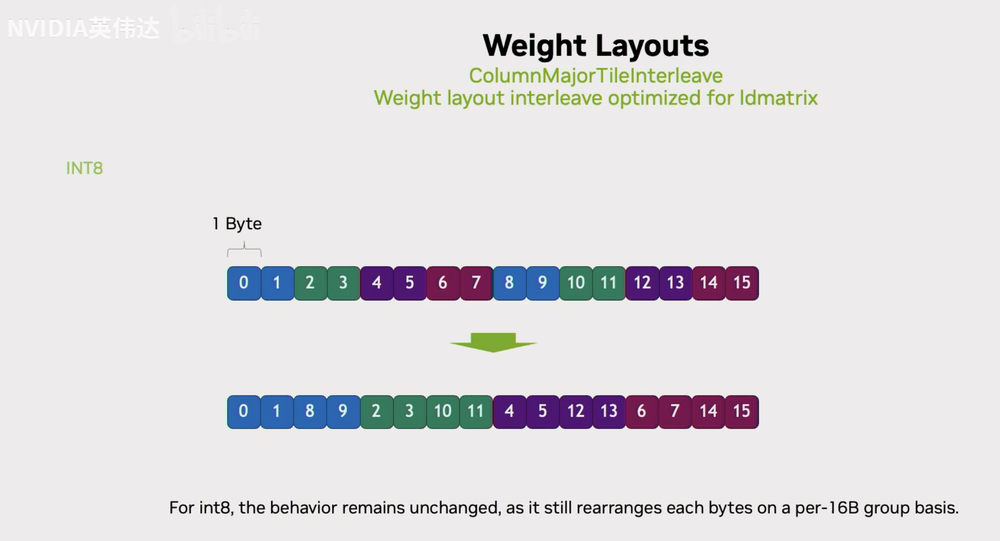

INT8의 경우도 마찬가지 형태인데, 다만 int8은 연속된 2개 원소를 한데 두고, 0189를 연속된 4개 byte에 넣는다. 그런 다음 ld.matrix로 load한다.

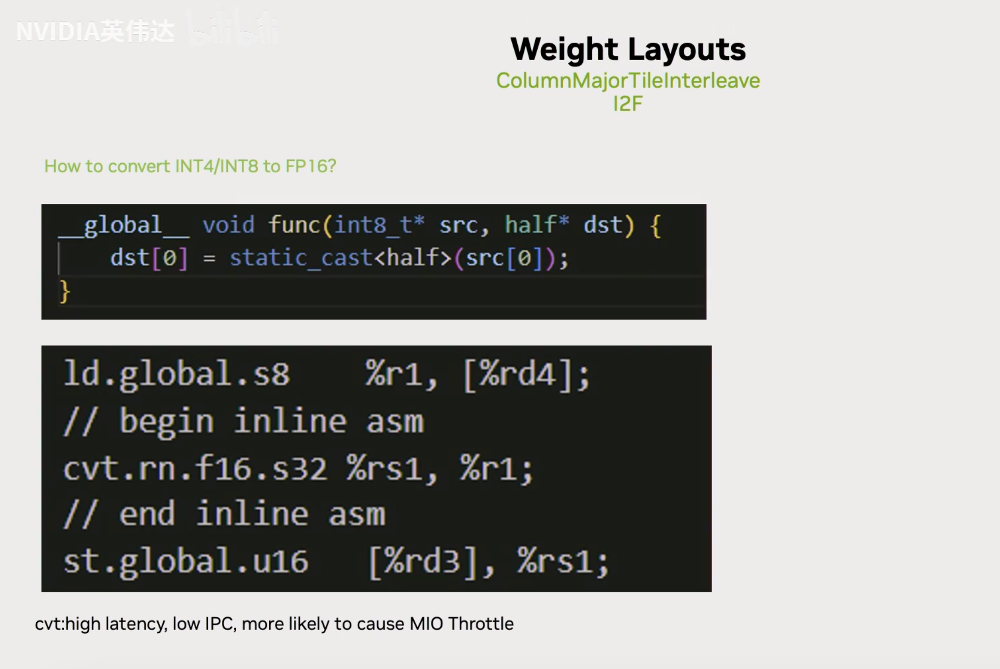

## Int8/Int4를 FP16으로 빠르게 변환

마지막 단계는 int4 또는 int8에서 FP16으로의 빠른 타입 변환을 어떻게 구현할지, 그리고 이 타입 변환을 구현하기 위해 Layout에 어떤 조정이 필요한지이다. 여기서는 가장 일반적인 INT8에서 half 타입으로의 데이터 변환을 보여준다. 그냥 static_cast를 사용하면 되는데, 거기에 대응하는 PTX 명령이 convert.round를 호출하는 것을 볼 수 있다. 그러나 실제로 convert 명령을 쓰면 그 latency가 비교적 높고, 또한 MIO Throttle을 유발할 수 있다.

이 slides는 FP16의 IEEE 754 표준을 보여준다. 16bit 수에는 1개의 부호 비트, 5개의 지수 비트, 10개의 가수 비트가 포함된다.

uint8 수 143이 있다고 가정하자. 만약 이를 실제 FP16의 가수 비트에 넣는다면, 지수 비트를 합리적으로 설정하여 143을 표현할 방법이 있을까? 우리가 알고 있는 FP16의 수치 계산 방법에 따라, 가수 비트의 이진수 앞에 1.x를 붙이고, 2의 (지수 비트의 값 - 15)제곱을 곱한다. 우리는 143에 대응하는 것이 실제로는 아래의 값에 해당한다는 것을 안다. 이 FP16 값으로 Int8을 표현하고 싶다고 가정하면, x=25일 때 위의 FP16 값에서 1024를 빼면 아래의 143이 됨을 발견할 수 있다. 따라서 우리는 int8 값을 가수 비트에 넣고, 그 지수 비트를 25로 설정한 다음, FP16 수치 결과에서 1024를 빼기만 하면 UINT8에서 FP16으로 변환된 값을 얻을 수 있다.

정리하면 UINT8의 수치를 FP16의 가수 비트에 직접 넣고,

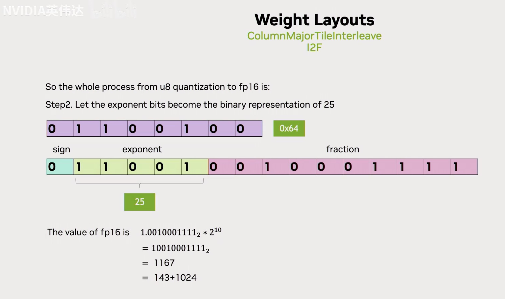

그런 다음 FP16의 지수 비트를 25로 설정한다. 이 25에 대응하는 16진수 표현은 0x64이다.

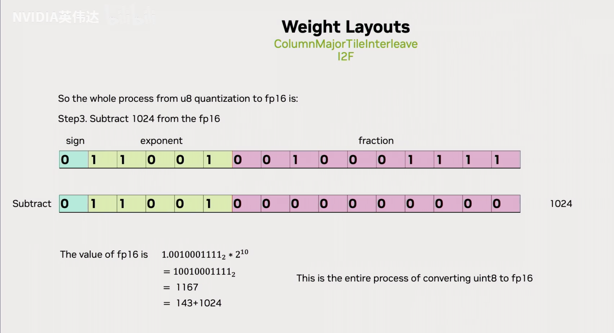

이어서 최종적으로 이 값에서 FP16 형태의 1024를 빼면, UINT8에서 FP16으로의 변환이 완료된다.

Int8의 경우는 어떻게 해야 하는가? UINT8과 INT8은 수치 범위의 차이일 뿐임에 주목할 수 있다. 그러면 우리는 INT8 데이터에 128을 더해 UINT8 형태로 변환하면 된다. 이렇게 변환된 FP16 결과는, 1024를 뺄 때 128을 추가로 더 빼주기만 하면 대응하는 원래의 INT8 수치로 복원된다.

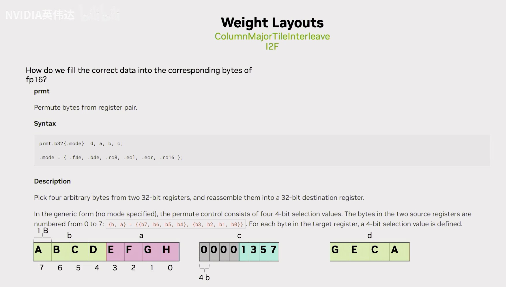

그러면 우리는 실제로 어떻게 명령을 사용하여 위에서 설명한 이 연산을 완수하는가? prmt라는 PTX 명령이 있다는 점에 주목할 수 있다. 이 명령이 하는 일은 2개의 32bit 레지스터 A, B에서 4개의 8bit를 뽑아내 최종 d를 구성하는 것이다. 그리고 이 4개의 8bit를 어떻게 뽑아내는가 하면, 각 8bit는 c 레지스터 안의 낮은 4bit에 대응한다. 즉 c 레지스터의 낮은 4bit의 각 bit가 하나의 인덱스이다. A, B 두 32비트 레지스터 안에 아래 왼쪽 그림과 같은 데이터 형태, 즉 ABCDEFGH가 저장되어 있다고 가정하자. 그러면 c 레지스터에서 인덱스의 4개 숫자가 각각 1, 3, 5, 7이면, 최종적으로 이 D 레지스터 안의 4개 8bit 데이터는 GECA가 된다. 이러한 명령을 통해 32bit 레지스터에서 원하는 한 바이트를 뽑아내는 효과를 구현할 수 있다.

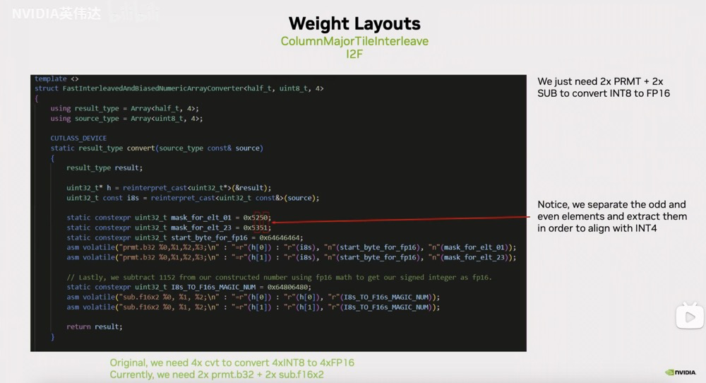

TRT-LLM의 변환 코드에 대응하면 이런 형태이다. 입력된 UINT8 데이터와 magic number로 구성된 이 두 32비트 레지스터에서 permute 명령으로 4개의 8bit를 뽑아내는 것을 볼 수 있는데, 뽑아내는 인덱스는 이 mask_for_elt_01/23 안에 있다. 구체적으로 인덱스를 저장하는 4개의 bit를 보면 각각 0525이다. 여기서 0과 2는 각각 실제 INT8 입력 데이터의 제0번째 8bit와 제2번째 8bit에 대응한다. 이러한 permute 명령을 거치면, 실제 입력된 4개 UINT8 중 제0번째 UINT8과 제2번째 UINT8을 뽑아내 두 개의 연속된 FP16 레지스터에 넣을 수 있다. 아래 이 PTX 명령은 제1번째 UINT8과 제3번째 UINT8을 뽑아내 다른 두 개의 연속된 FP16 레지스터에 넣는다.

> 이 magic number의 5가 무슨 의미인지는 솔직히 이해하지 못했다.

이후 다시 방금 설명한 것처럼, 그 기반 위에서 (1024+128)을 빼면 이 4개 INT8에 대응하는 진짜 FP16 값을 얻는다. 우리는 여기서 왜 0123을 한꺼번에 뽑지 않고 01과 23을 따로 뽑는지 의문이 들 수 있다. 이것은 주로 이후의 INT4 구현과 일치시키기 위함이다. INT4 구현에서는 어쩔 수 없이 02, 13 방식으로 뽑아야 하기 때문이다.

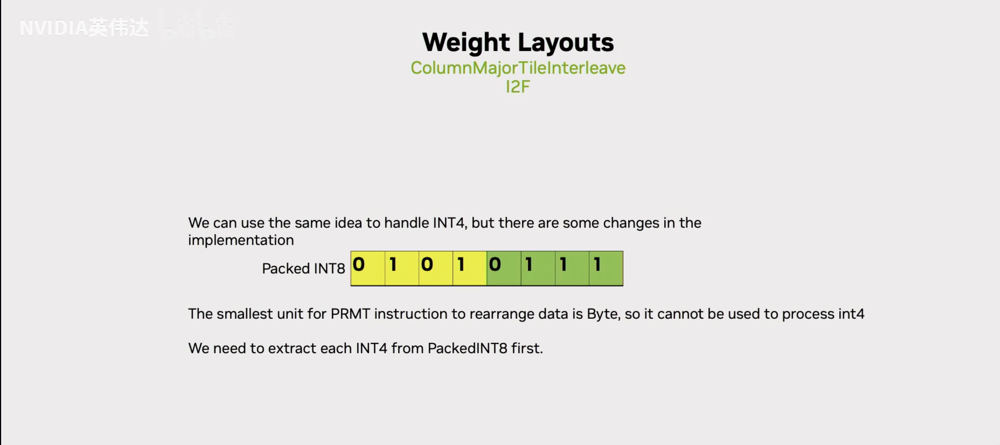

앞에서 INT8에서 FP16으로의 변환을 소개했는데, INT4라면 어떻게 변환해야 하는가? permute 명령은 8Bit 단위로만 데이터 연산을 진행할 수 있다. 그러나 4Bit 변환에서, 우리는 4Bit가 하나의 8Bit 안에서 높은 4Bit에 한 데이터를, 낮은 4Bit에 다른 데이터를 저장한 것임을 안다. 그러면 우리는 실제 8Bit 안의 높고 낮은 4개 Bit를 뽑아낼 수 있는 어떤 형태가 필요하다.

뽑아낸 후에는 어떻게 해야 하는가? 먼저 낮은 4개 bit를 보자. 비트 연산 방식으로 8Bit 중 낮은 4개 Bit를 뽑아내 하나의 FP16 가수 안에 넣는다고 가정하고, 앞에서처럼 지수 비트에 Int8과 동일한 25, 즉 16진수 64를 부여한다. 다시 이렇게 얻은 값에서 (1024+8)을 빼면, 이 낮은 4Bit에 대응하는 최종 FP16 값을 얻는다.

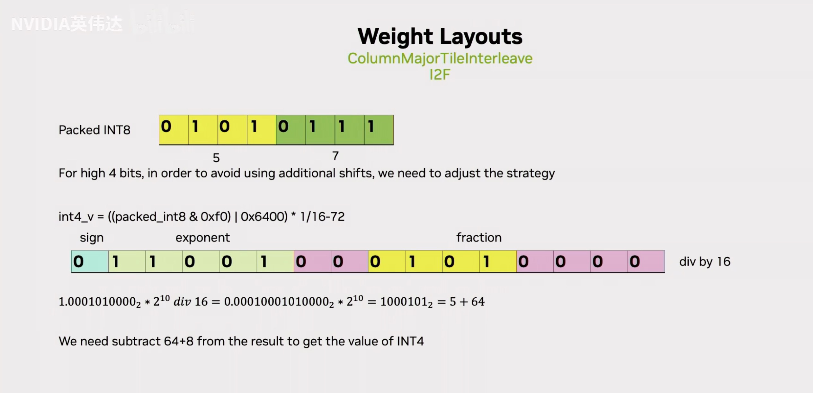

그러면 높은 4개 Bit라면 어떻게 해야 하는가? 낮은 4개 Bit는 직접 가장 낮은 4개 Bit 위치에 넣고, 높은 4개 Bit도 마찬가지로 비트 연산으로 뽑아낸 후 이 높은 4개 Bit가 하나의 Int8의 높은 4Bit 안에 존재한다는 점에 주목하자. 가수 비트에 넣으려면 추가로 16으로 나누는 연산을 해야 하는데, 이것은 4비트 오른쪽 시프트에 해당하며, 최종적으로 노란색 위치로 옮겨진다. 여기로 옮긴 후에는, 방금 전과 동일한 그 연산들을 진행할 수 있고, 대응하는 값을 빼면 실제로 대응하는 FP16 값을 얻는다. 여기서 빼는 값은 1024/16=64이고, 거기에 8을 더 더해야 한다.

Int4 데이터를 추출할 때 이 Slides의 형태로 추출한다는 점에 주목하자. 마침 lop3라는 PTX 명령이 이 일을 완수할 수 있다. lop3 이 PTX 명령의 대략적인 설명은, 입력 a, b, c 세 레지스터를 입력으로 받고, Lut 값이 하나 있다는 것이다. 이 Lut 값은 어떻게 결정하는가? a, b, c가 각각 0xF0, 0xCC, 0xAA에 대응한다고 가정하고, 우리가 원하는 연산을 이 세 값에 대해 수행하여 얻은 값을 Lut 값으로 삼는다. 이 Lut 값을 넣으면 명령이 자동으로 a, b, c에 대해 대응하는 연산을 수행하고, 결과를 d에 쓴다. 그래서 우리는 이 명령을 활용하여 Lut 값을 주면, 명령이 우리를 위해 효율적으로 Int4 데이터의 추출을 완수할 수 있다. 마지막으로 우리는 Int4를 FP16으로 변환하는 과정을 lop3 명령 하나에 fma(또는 sub) 명령 하나를 더한 것으로 변환했다.

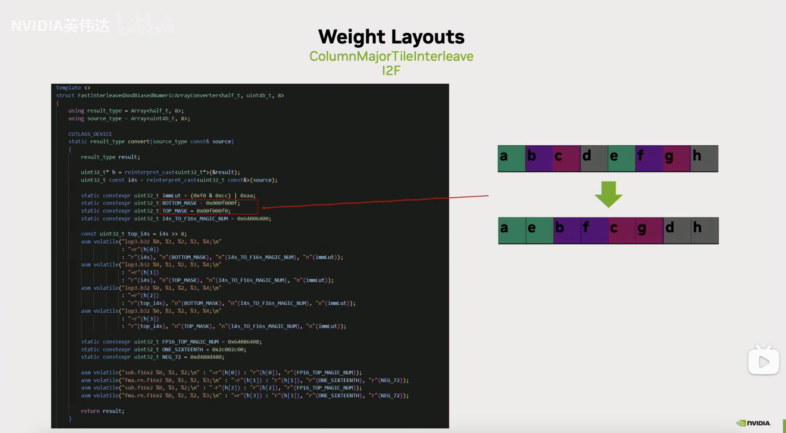

이 Slides는 Int4에서 FP16으로의 구체적인 코드 구현을 보여준다. 추출할 때 0x0f 또는 0xf0을 사용하여 Int4를 추출하는 것에 주목하자. 이렇게 하면 연속된 Int4가 있다고 할 때, 추출되는 것은 각각 제0번째 Int4와 제4번째 Int4, 그리고 제1번째 Int4와 제3번째 Int4이다. 그래서 그 홀짝이 각각 추출된다. 실제로 우리는 연속된 8개 Int4로 타입 변환을 진행한다. 따라서 매번 먼저 제0번째 Int4와 제4번째 Int4를 추출하여 두 개의 연속된 FP16에 넣고, 그런 다음 제1번째와 제5번째 Int4를 추출하여 두 개의 연속된 FP16에 넣으며, 이런 식으로 이어진다. 우리가 앞에서 Int8을 할 때도 홀짝을 나누어 추출했는데, 그것은 여기서 어쩔 수 없이 해야 하는 이 데이터 추출 동작과 일치시키기 위함이다.

실제 계산할 때 이 원소 배치의 변화를 역전시키기 위해, 우리는 계산 전에 Layout을 그에 맞게 조정해야 한다. 즉 Int4를 예로 들면 그 홀짝 위치 원소를 각각 추출하는 것이다. 이렇게 하면 우리가 실제로 계산하며 INT4에서 FP16으로 변환할 때, 이전 페이지 Slides에서 소개한 연산을 통해 이 Layout에 대한 역연산을 완수하여, 진짜 연속 배치의 layout으로 복원한다.

이것이 설명한 마지막 한 가지인 Int4/Int8을 FP16으로 빠르게 변환하는 최적화의 layout 변화이다. 이 최적화를 통해 앞에서 언급한 한 개의 convert 명령을 일련의 lop 또는 prmt 명령으로 변환했다. 비록 명령 수는 변하지 않았지만, 명령의 latency는 더 낮아진다.

## 요약

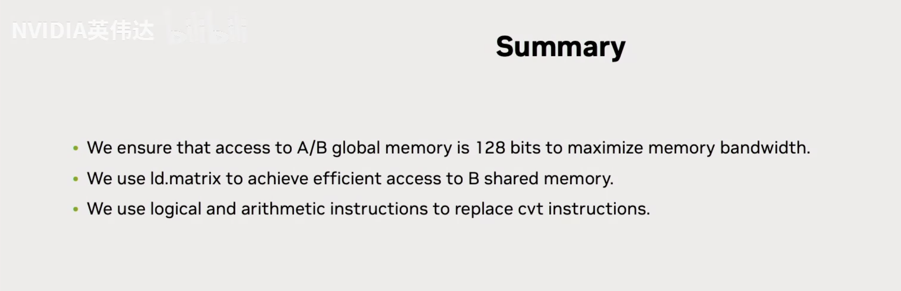

이 세 가지 Layout 변환은 각각 다음과 같다. 하나는 A, B 행렬 모두 128비트로 load할 수 있도록 보장하여 메모리 대역폭을 최대화하는 것이다. 다른 하나의 Layout은 ld.matrix를 활용하여 효율적으로 B 행렬을 shared memory에서 꺼내기 위한 것이고, 마지막 한 가지 Layout 변환은 이러한 산술 연산과 논리 연산을 통해 convert 명령을 대체하기 위한 것이다.
