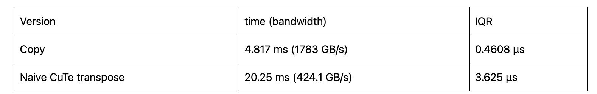
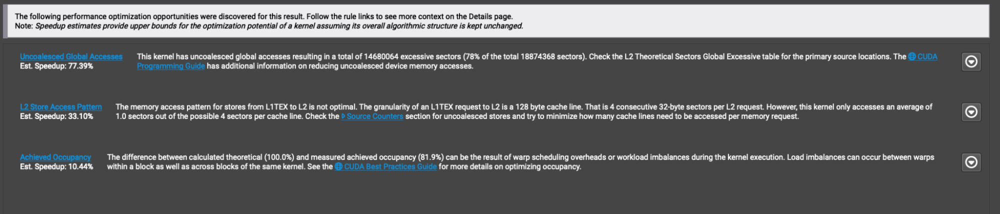
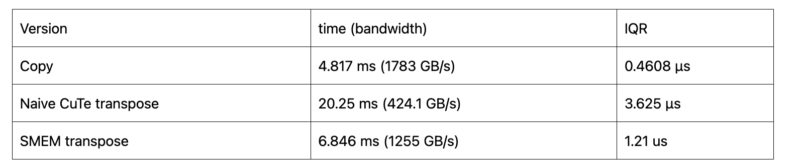
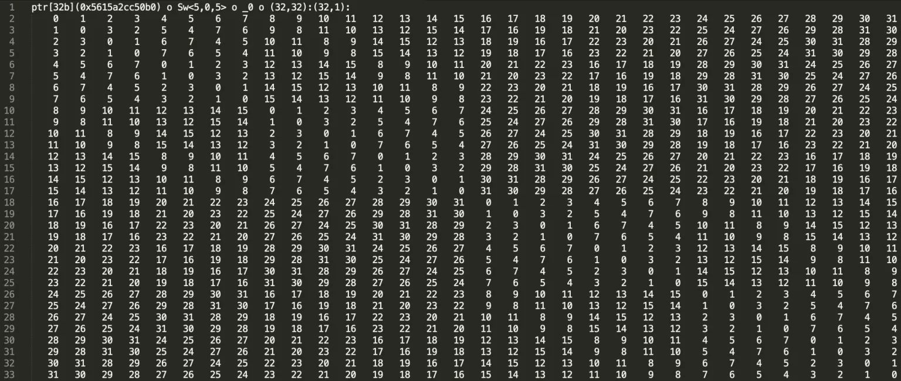
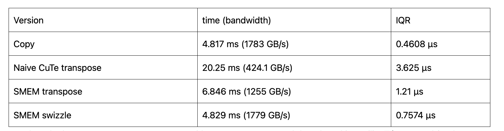
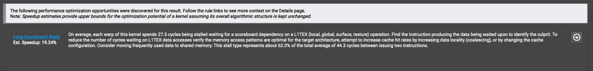
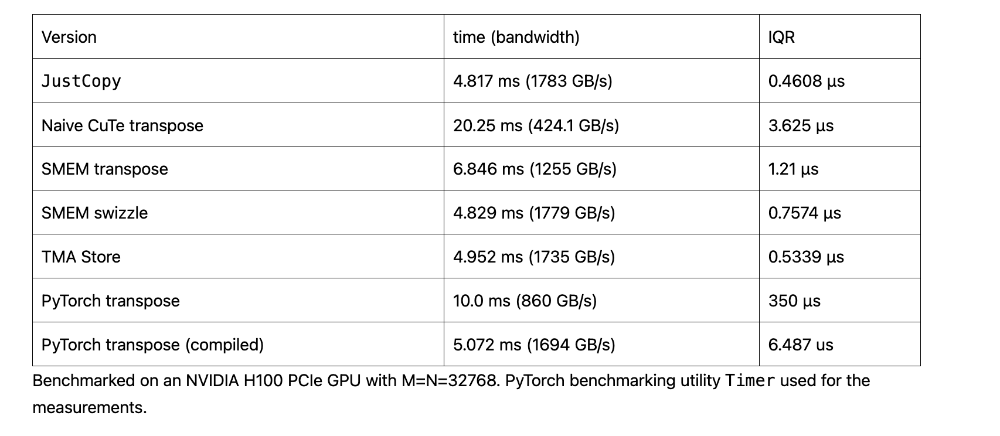

> 블로그 출처: https://research.colfax-intl.com/tutorial-matrix-transpose-in-cutlass/ — 번역 및 학습 정리. 이 블로그를 통해 CuTe로 프로그래밍할 때 관련되는 메모리 복사(행렬 전치)를 간략히 이해할 수 있다. 매우 양질의 기술 블로그다.

# 튜토리얼: CUTLASS의 행렬 전치 (CuTe로 행렬 전치를 GPU 메모리 대역폭 상하한까지 최적화하기)

이 튜토리얼의 목표는 CUTLASS와 그 핵심 백엔드 라이브러리 CuTe를 사용하여 NVIDIA® GPU에서 프로그래밍할 때 관련되는 메모리 복사 개념과 기법을 명확히 설명하는 것이다. 구체적으로, 행렬 전치 태스크를 이 개념들을 설명하는 예제로 사용한다. 이 태스크를 선택한 이유는 데이터를 한 주소 집합에서 다른 주소 집합으로 복사하는 것 외에 다른 연산을 포함하지 않기 때문이며, 이를 통해 메모리 합병 접근(coalesced access)과 같이 계산도 함께 수반되는 작업부하와 분리하여 메모리 복사의 최적화 측면만 별도로 연구할 수 있다.

우리의 접근 방식은 Mark Harris의 효율적인 행렬 전치 튜토리얼(https://developer.nvidia.com/blog/efficient-matrix-transpose-cuda-cc/)에서 영감을 받았으며, 이 튜토리얼을 행렬 전치 문제에 대한 심층 논의의 참고 자료로 추천한다. 해당 튜토리얼은 여기서 사용하는 CuTe 추상화를 직접 다루지 않는다. 반대로, Harris 튜토리얼에 이미 익숙한 독자에게는 이 튜토리얼이 그 추상화에 대한 소개로도 활용될 수 있다. 어느 쪽이든, CuTe로 해당 최적화 솔루션을 구현하는 방법을 설명하기 전에 그 튜토리얼의 핵심 아이디어를 먼저 복습한다.

## 합병 접근(Coalesced Access) 복습

많은 계산 작업부하, 특히 머신러닝/AI 애플리케이션에서 발견되는 것들에서 우리는 흔히 텐서(tensor)라 불리는 다차원 배열을 사용한다. 컴퓨터 메모리는 본질적으로 1차원이기 때문에, 이러한 텐서는 선형화되거나 이 1차원 공간에 배치되어야 한다. 따라서 특정 차원에서 인접한 원소들이 메모리에서 인접하지 않을 수 있다. 어떤 차원에서 인접한 원소들이 메모리에서도 인접할 때, 그 차원을 연속적(contiguous)이라고 한다. 연속 차원 내의 연속된 원소 블록도 연속적이라고 한다.

연속 메모리 블록에 대한 접근 — 읽기 또는 쓰기 — 을 합병 접근(coalesced access)이라 하고, 비연속 메모리 블록에 대한 접근을 스트라이드 접근(strided access)이라 한다. 합병 접근은 GPU 메모리 아키텍처와 더 잘 맞아 효율적인 데이터 캐시와 검색을 가능하게 하므로, 일반적으로 스트라이드 접근보다 빠른 성능을 제공한다. 따라서 GPU를 위해 프로그래밍할 때 합병 메모리 접근의 최적화는 매우 중요하다.

그러나 일부 작업부하는 스트라이드 접근을 필요로 하며 다른 방법으로는 구현할 수 없다. 행렬 전치 — 더 일반적으로는 텐서 치환(permutation) 연산 — 가 스트라이드 접근을 피할 수 없는 대표적인 예다. 이 경우, 이러한 비효율적인 접근 패턴이 성능에 미치는 영향을 최소화하는 것이 중요하다. 표준적인 기법 하나는 GPU 메모리 계층의 더 낮고 빠른 레벨에서만 스트라이드 접근을 수행하는 것으로, 지금부터 이를 복습한다.

우리의 논의에서 GPU 메모리 계층에는 프로그래밍 가능한 세 가지 레벨이 있다. 최상위에서 최하위 레벨 순으로 전역 메모리(global memory), shared memory, 레지스터 메모리(register memory)가 있다.

전역 메모리(GMEM), 즉 고대역폭 메모리(HBM)는 세 가지 중 가장 크고 읽기/쓰기가 가장 느리다. 예를 들어, NVIDIA H100 Tensor Core GPU는 80 GB의 GMEM을 가진다. 여기서 스트라이드 접근을 수행하면 성능에 가장 나쁜 영향을 미친다.

다음으로 shared memory(SMEM)가 있으며, GMEM보다 훨씬 작지만 훨씬 빠르다. 예를 들어, NVIDIA H100 Tensor Core GPU는 스트리밍 멀티프로세서(SM)당 최대 228 KB의 SMEM을 가진다. 메모리 아키텍처에 익숙한 독자를 위해 설명하면, SMEM은 물리적으로 L1 캐시에서 분할된다. SMEM은 동일한 협력 스레드 배열(CTA) 내의 모든 스레드 간에 공유되며, 각 CTA는 SMEM의 자체 세그먼트 내에서 동작한다. 여기서의 스트라이드 접근도 최적은 아니지만 GMEM에서의 스트라이드 접근보다는 훨씬 낫다.

마지막으로 레지스터 메모리(RMEM)가 있으며, 개별 스레드 전용이다.

이 튜토리얼에서 메모리 접근은 숫자(예: 32비트 부동소수점)를 한 레벨에서 다른 레벨로, 또는 같은 레벨 내의 다른 위치 사이에서 복사하는 연산만 포함한다.

Harris 튜토리얼에서 논의된 naive 전치 방법은 GMEM에서 스트라이드 접근으로 시작한다: `GMEM -transpose-> GMEM`. 그런 다음, 데이터를 먼저 GMEM에서 SMEM으로 복사함으로써 이를 개선했다: `GMEM -> SMEM -transpose-> SMEM -> GMEM`. 이렇게 하면 스트라이드 로드는 SMEM에서 발생하고, GMEM 접근은 모두 합병된다.

## CuTe 방식

이제 CuTe 라이브러리를 사용하여 이 두 가지 방법을 구현하는 방법을 논의한다. 먼저 naive 방법부터 시작하는데, 주로 무엇을 하면 안 되는지를 보여주기 위함이다.

CuTe 프레임워크에서 데이터는 `cute::Tensor` 객체로 추상화된다. CuTe 텐서는 텐서의 첫 번째 원소를 가리키는 포인터(C 언어 의미에서)와 `cute::Layout` 객체로 구성되며, 후자는 `shape`과 `stride` 정수 튜플을 정의하여 텐서의 각 원소가 첫 번째 원소에서 얼마나 떨어져 있는지를 설명한다. 예를 들어, M×N 행 우선(row-major) 행렬의 경우 Layout을 shape `(M, N)`, stride `(N, 1)`로 정의한다.

`cute::Layout`의 경우, 새로운 텐서의 Layout을 정의할 때 행 우선인지 열 우선(column-major)인지 지정하는 옵션이 있다(`GenRowMajor` 또는 `GenColMajor`로 stride 형태로 표현). 열 우선 행렬에서는 같은 열 내의 인접한 원소들이 메모리에서 연속적이고, 열을 가로지르는 인접 원소들은 메모리에서 스트라이드를 가진다. 기본적으로 CuTe는 열 우선 Layout을 사용한다. 더 일반적으로는 Layout의 shape의 각 차원에 대해 stride를 지정할 수 있다.

전치를 구현하는 간단한 방법 하나는 입력을 열 우선으로, 출력을 행 우선으로 정의한 다음 CuTe가 복사 연산을 처리하도록 하는 것이다.

```c++
using namespace cute;
int M = 2048, N = 2048;
float *d_S, *d_D; // GPU 메모리의 포인터 선언, 소스 행렬(d_S)과 목적지 행렬(d_D)
// Allocate and initialize d_S and d_D on device (omitted).
 
// Create the row major layouts.
auto tensor_shape = make_shape(M, N);
auto tensor_shape_trans = make_shape(N, M); // 행렬 shape을 나타내는 객체 생성, 원본 shape과 전치 shape
auto gmemLayoutS = make_layout(tensor_shape, GenRowMajor{});
auto gmemLayoutD = make_layout(tensor_shape_trans, GenRowMajor{}); // 소스와 목적지 행렬의 행 우선 Layout 생성
 
// Create the row major tensors.
Tensor tensor_S = make_tensor(make_gmem_ptr(d_S), gmemLayoutS);
Tensor tensor_D = make_tensor(make_gmem_ptr(d_D), gmemLayoutD); // 앞서 생성한 Layout과 GPU 메모리 포인터로 CuTe 텐서 객체 생성
 
// Create a column major layout. Note that we use (M,N) for shape.
auto gmemLayoutDT = make_layout(tensor_shape, GenColMajor{}); // 열 우선 Layout 생성, 원본 shape (M,N) 사용
 
// Create a column major view of the dst tensor.
Tensor tensor_DT = make_tensor(make_gmem_ptr(d_D), gmemLayoutDT); // 목적지 데이터의 열 우선 뷰 생성. 이 뷰와 tensor_D는 동일한 메모리를 가리키지만 Layout이 다름
```

중요한 점은, 여기에 텐서가 세 개 있지만 실제 데이터 복사본은 두 개뿐이라는 것이다. tensor_D와 tensor_DT 모두 d_D의 데이터를 사용하기 때문이다 — 이들은 같은 데이터에 대한 서로 다른 두 가지 뷰다. 전치 kernel에서는 열 우선 뷰를 사용하고, 전치 결과를 검증할 때는 행 우선 뷰를 사용한다.

다음으로, 입력 텐서를 CTA(협력 스레드 배열)에 할당할 수 있도록 더 작은 블록으로 나누는 방법이 필요하다. 이를 위해 `cute::tiled_divide` 메서드를 사용할 수 있다:

```c++
using namespace cute;
using b = Int<32>;
auto block_shape = make_shape(b{}, b{});       // (b, b)
Tensor tiled_tensor_S  = tiled_divide(tensor_S, block_shape); // ([b,b], m/b, n/b)
Tensor tiled_tensor_DT = tiled_divide(tensor_DT, block_shape); // ([b,b], n/b, m/b)
```

여기서 Tile 크기를 32×32로 지정한다. Tile 크기는 중요한 튜닝 파라미터로, 각 특정 작업부하에 맞게 조정해야 한다. 실제로 32×32는 전치 kernel의 최적값이 아니며, 벤치마크 전에 조정할 것이다.

`tiled_divide`는 동일한 데이터이지만 다른 Layout을 가진 텐서, 즉 데이터의 다른 뷰를 생성한다. 우리의 경우, `tensor_S`는 크기 `(M, N)`의 2D 행렬에서 시작한다. `cute::tiled_divide`를 Tile 크기 b와 함께 사용하면 크기 `([b,b], M/b, N/b)`의 3D 행렬 뷰가 생성된다. 즉, `M/b × N/b` 그리드의 `b × b` 소행렬이다.

이 뷰를 통해 kernel에서 올바른 Tile에 더 쉽게 접근할 수 있다.

```c++
Tensor tile_S = tiled_tensor_S(make_coord(_, _), blockIdx.x, blockIdx.y);
Tensor tile_DT = tiled_tensor_DT(make_coord(_, _), blockIdx.x, blockIdx.y);
```

여기서 `make_coord(_, _)`을 첫 번째 인수로 사용하면 전체 첫 번째 차원(`[b, b]`)을 가져오고, 두 번째와 세 번째 차원의 정수 값을 블록 인덱스로 지정하면 텐서의 해당 슬라이스를 가져온다. (numpy에 익숙한 독자에게는: CuTe에서 밑줄(_)은 numpy의 콜론(:) 표기법과 동일하다.) 즉, tile_S는 그리드 지점 `(blockIdx.x, blockIdx.y)`에 위치하는 전체 `b × b` 행렬을 나타낸다. `tiled_tensor_DT`를 슬라이싱할 때 blockIdx.x와 blockIdx.y를 교환하지 않는 점에 유의하라. 이미 shape `(M, N)`의 열 우선 뷰를 채택했기 때문이다(이와 달리 tensor_D의 tile 분할을 채택하면 블록 인덱스를 교환하고 `local_partition`에서 소스와 목적지에 서로 다른 스레드 Layout을 사용해야 한다). 그런 다음 특정 스레드에 할당된 부분을 다음과 같이 얻을 수 있다:

```c++
auto thr_layout =
      make_layout(make_shape(Int<8>{}, Int<32>{}), GenRowMajor{});
Tensor thr_tile_S = local_partition(tile_S, thr_layout, threadIdx.x);
Tensor thr_tile_DT = local_partition(tile_DT, thr_layout, threadIdx.x); 
```

여기서는 CTA당 256개의 스레드로 kernel을 실행하고, gmem에서의 로드가 합병되지만 gmem으로의 저장은 비합병(어떤 스레드 Layout을 선택하든 비합병 접근은 발생한다)이 되도록 스레드 Layout을 선택했다. 마지막으로 `cute::copy`를 사용하여 thr_tile_S에서 thr_tile_DT로 데이터를 복사할 수 있다.

```c++
Tensor rmem = make_tensor_like(thr_tile_S);
copy(thr_tile_S, rmem);
copy(rmem, thr_tile_DT);
```

이제 이 방법을 순수 copy kernel과 벤치마크로 비교할 수 있다. copy kernel의 코드는 CUTLASS의 tiled_copy 예제(https://github.com/NVIDIA/cutlass/blob/main/examples/cute/tutorial/tiled_copy.cu)를 기반으로 하므로, 독자들의 연습 문제로 남겨둔다. 또한 실험을 통해 이 작업부하에서 `32 × 1024`의 tile 크기가 최적 성능을 제공함을 확인했다.




Harris의 글에서 보았듯이, 이 naive 방법의 속도는 이상적이지 않다. GMEM에서 GMEM으로의 스트라이드 복사이기 때문이다. 이를 확인하기 위해 NVIDIA Nsight™ Compute로 이 전치의 성능을 프로파일링해 보자. 이 프로파일링 도구는 성능 저하를 일으키는 코드의 문제를 감지할 수 있다. naive 전치를 프로파일링하면, GUI의 요약 페이지는 다음과 같이 표시된다:



Nsight Compute는 최적화를 돕는 광범위한 도구를 제공하지만, Nsight 전체를 탐색하는 것은 이 글의 범위를 벗어난다. 이 글에서는 요약 페이지만 살펴본다. 위의 요약 페이지에서 비합병 접근 문제가 주로 보고된 문제임을 확인할 수 있다.

## CuTe naive 구현 코드 상세 설명

> 이 절은 내가 보충한 것으로, 독자들이 위 코드 세부 사항에 더 익숙해질 수 있도록 한다. 코드: https://github.com/ColfaxResearch/cfx-article-src/blob/master/transpose-cute/include/transpose_naive.h

```c++
#include "shared_storage.h"
#include "util.h"

using namespace cute;

// 다양한 타입의 텐서와 스레드 Layout을 지원하기 위해 템플릿 사용. __launch_bounds__(256, 1)은 스레드 블록당 최대 256개 스레드를 지정한다.
template <class TensorS, class TensorD, class ThreadLayoutS, class ThreadLayoutD>
__global__ static void __launch_bounds__(256, 1)
transposeKernelNaive(TensorS const S, TensorD const DT,
                ThreadLayoutS const tS, ThreadLayoutD const tD) {
  using Element = typename TensorS::value_type;

  // 입력과 출력 텐서의 로컬 뷰 gS와 gDT 생성
  Tensor gS = S(make_coord(_, _), blockIdx.x, blockIdx.y);   // (bM, bN)
  Tensor gDT = DT(make_coord(_, _), blockIdx.x, blockIdx.y); // (bN, bM)

  // Concept:                   Tensor  ThrLayout       ThrIndex
  Tensor tSgS = local_partition(gS, tS, threadIdx.x); // (ThrValM, ThrValN)
  Tensor tDgDT = local_partition(gDT, tD, threadIdx.x); // (ThrValM, ThrValN)

  // 레지스터 메모리 rmem 생성
  Tensor rmem = make_tensor_like(tSgS);

  // copy 함수를 사용하여 입력에서 레지스터 메모리로, 그 다음 레지스터 메모리에서 출력으로 데이터를 복사하여 전치 연산 완료
  copy(tSgS, rmem);
  copy(rmem, tDgDT);
}

template <typename Element> void transpose_naive(TransposeParams<Element> params) {
  
  //
  // Make Tensors
  //
  auto tensor_shape = make_shape(params.M, params.N);
  auto tensor_shape_trans = make_shape(params.N, params.M);
  auto gmemLayoutS = make_layout(tensor_shape, LayoutRight{});
  auto gmemLayoutD = make_layout(tensor_shape_trans, LayoutRight{});
  Tensor tensor_S = make_tensor(make_gmem_ptr(params.input), gmemLayoutS);
  Tensor tensor_D = make_tensor(make_gmem_ptr(params.output), gmemLayoutD);
  
  // Make a transposed view of the output
  auto gmemLayoutDT = make_layout(tensor_shape, GenColMajor{});
  Tensor tensor_DT = make_tensor(make_gmem_ptr(params.output), gmemLayoutDT);
  
  //
  // Tile tensors
  //
  
  using bM = Int<64>;
  using bN = Int<64>;
  
  auto block_shape = make_shape(bM{}, bN{});       // (bM, bN)
  auto block_shape_trans = make_shape(bN{}, bM{}); // (bN, bM)
  
  Tensor tiled_tensor_S = tiled_divide(tensor_S, block_shape); // ((bM, bN), m', n')
  Tensor tiled_tensor_DT = tiled_divide(tensor_DT, block_shape_trans); // ((bN, bM), n', m')
  
  auto threadLayoutS =
      make_layout(make_shape(Int<8>{}, Int<32>{}), LayoutRight{});
  auto threadLayoutD =
      make_layout(make_shape(Int<8>{}, Int<32>{}), LayoutRight{});
  
  dim3 gridDim(
      size<1>(tiled_tensor_S),
      size<2>(tiled_tensor_S)); // Grid shape corresponds to modes m' and n'
  dim3 blockDim(size(threadLayoutS)); // 256 threads
  transposeKernelNaive<<<gridDim, blockDim>>>(tiled_tensor_S, tiled_tensor_DT,
                                            threadLayoutS, threadLayoutD);
};
```

> 코드에서 blockDim은 1차원 256으로 설정되어 있지만, 각 block의 스레드 Layout을 설정해야 하며, 이 스레드 Layout의 차원 수는 Tile의 차원 수와 같아야 한다. 이 예제에서는 `make_layout(make_shape(Int<8>{}, Int<32>{}), LayoutRight{});`로 설정된다. CUTLASS 공식 tiled_copy도 이렇게 설정한다: https://github.com/NVIDIA/cutlass/blob/main/examples/cute/tutorial/tiled_copy.cu#L202 

다음으로, 개선된 알고리즘을 연구한다: 먼저 데이터를 GMEM에서 SMEM으로 복사하고, 전치한 다음, SMEM에서 GMEM으로 다시 복사한다.

스트라이드 접근을 SMEM으로 이동시키려면 SMEM을 사용하는 텐서가 필요하다. CuTe를 사용하여 CTA의 SMEM에 `array_aligned` 객체를 할당한다.

```c++
using namespace cute;
using CuteArray = array_aligned<Element, cosize_v<SmemLayout>>;
 
extern __shared__ char shared_memory[];
CuteArray &smem = *reinterpret_cast<CuteArray*>(shared_memory);
```

여기서 smemLayout은 단일 Tile의 SMEM에 사용되는 Layout이다. 이제 데이터 포인터가 shared_memory인 텐서를 생성할 수 있다:

```c++
Tensor sS = make_tensor(make_smem_ptr(smem.data()), smemLayout);
```

중요한 점은, SMEM 텐서가 단일 SM에 맞을 만큼 작아야 한다는 것이다. 즉, smemLayout의 크기에 Element당 바이트 수를 곱한 값이 단일 SM의 총 SMEM 용량보다 작아야 한다. 그 외에도 CTA당 사용하는 SMEM을 기준으로 점유율(occupancy)도 고려해야 한다.

이제 GMEM 데이터에 적용했던 열 우선 뷰 기법을 SMEM에도 반복할 수 있다. SMEM의 두 가지 다른 뷰를 생성한다 — 행 우선 하나와 열 우선 하나.

```c++
using namespace cute;
using b = Int<32>;
auto block_shape = make_shape(b{}, b{});       // (b, b)
 
// Create two Layouts, one col-major and one row-major
auto smemLayout = make_layout(block_shape, GenRowMajor{});
auto smemLayoutT = make_layout(block_shape, GenColMajor{});
 
// Create two views of smem
Tensor sS  = make_tensor(make_smem_ptr(smem.data()), smemLayout);
Tensor sD = make_tensor(make_smem_ptr(smem.data()), smemLayoutT);
```

마지막으로, `cute::copy`를 사용하여 GMEM에서 SMEM으로, 그런 다음 SMEM에서 GMEM으로 복사할 수 있다. 여기서 S와 D는 tensor_S와 tensor_D의 `tiled_divide`이고, tS와 tD는 GMEM에 대한 합병 접근을 보장하기 위해 선택된 스레드 Layout이다(실제로 모두 위의 thr_layout과 동일하다).

```c++
// Slice to get the CTA's view of GMEM.
Tensor gS = S(make_coord(_, _), blockIdx.x, blockIdx.y); // (bM, bN)
Tensor gD = D(make_coord(_, _), blockIdx.y, blockIdx.x); // (bN, bM)
 
// Create the thread partitions for each Tensor.
Tensor tSgS = local_partition(gS, tS, threadIdx.x);
Tensor tSsS = local_partition(sS, tS, threadIdx.x);
Tensor tDgD = local_partition(gD, tD, threadIdx.x);
Tensor tDsD = local_partition(sD, tD, threadIdx.x);
 
// Copy GMEM to SMEM.
cute::copy(tSgS, tSsS); 
 
// Synchronization step. On SM80 and above, cute::copy
// does LDGSTS which necessitates async fence and wait.
cp_async_fence();
cp_async_wait<0>();
__syncthreads();
 
// Copy transposed SMEM to GMEM.
cute::copy(tDsD, tDgD);
```

이제 벤치마크를 수행하면 훨씬 나은 결과를 얻는다.





그럼에도 불구하고, 복사 연산의 결과와는 여전히 일정한 차이가 있다. 코드를 다시 프로파일링하면 해결해야 할 다음 문제를 찾을 수 있다 — Memory Bank Conflict.

## Memory Bank Conflict

스트라이드 SMEM 버전은 naive 버전보다 훨씬 성능이 좋지만, 여전히 복사 연산의 성능과는 일치하지 않는다. 이 차이의 상당 부분은 Memory Bank Conflict 때문이다. 대부분의 NVIDIA GPU에서 shared memory는 32개의 Memory Bank로 구성된다. 한 warp 내에서 단 하나의 스레드만 동시에 하나의 Memory Bank에 접근할 수 있으며, 이는 읽기와 쓰기 접근 모두에 적용된다. 따라서 여러 스레드가 같은 Memory Bank에 접근하려 하면 이러한 접근이 직렬화된다. 이를 Bank Conflict라 한다. Bank Conflict에 대한 더 깊은 논의는 Lei Mao의 훌륭한 블로그 글(https://leimao.github.io/blog/CUDA-Shared-Memory-Bank/)을 참고하길 권한다.

더 구체적으로, 원소는 32비트 단위로 라운드 로빈 방식으로 Memory Bank에 배분된다. 처음 32비트는 0번 Bank에, 다음 32비트는 1번 Bank에, 이런 식으로 계속해서 33번째 32비트 그룹이 다시 0번 Bank에 배분된다. 따라서 행 우선의 32×32 float 타입 tile에서 각 열은 같은 Memory Bank에 매핑된다. 이것이 최악의 경우이며, 32개 스레드를 가진 warp에서는 32방향 Bank Conflict가 발생한다.

Mark Harris의 튜토리얼은 각 행에 1개의 숫자를 패딩하여 이 문제를 해결한다. 이렇게 하면 원소들이 이동하여 열의 각 원소가 서로 다른 Bank에 위치하게 된다. CuTe에서는 기본값이 아닌 stride를 사용하여 이 해결책을 복제할 수 있다. CuTe Layout에는 각 차원의 원소 간 오프셋을 정의하는 stride 정보가 포함된다. 열의 stride를 32 대신 33으로 설정하여 패딩을 추가할 수 있다. 코드에서는 간단히 다음과 같이 할 수 있다:

```c++
auto block_shape = make_shape(Int<32>, Int<33>); // (b, b+1)
 
// Create two Layouts, one col-major and one row-major
auto smemLayout = make_layout(block_shape, GenRowMajor{});
auto smemLayoutT = make_layout(block_shape, GenColMajor{});
```

그러나 이는 SMEM에서 추가적인 32개 숫자의 메모리를 낭비한다. 이 글에서는 대안 솔루션인 swizzle을 구현한다.

## Swizzle과 Layout 합성

Swizzle을 논의하려면 먼저 CuTe Layout을 자세히 설명해야 한다. Layout은 텐서 구조 정보를 저장하는 컨테이너일 뿐만 아니라, 하나의 좌표를 다른 좌표로 매핑하는 함수다. 예를 들어, M행 N열의 열 우선 텐서 A를 생각해 보자. 좌표 (4,5) — 4번째 열, 5번째 행 — 가 주어지면, 이 Layout은 튜플 (4,5)를 정수 5M+4로 매핑한다. 이는 1D 포인터에서 좌표 (4,5)의 원소 인덱스다. 이 추상화는 고차원 텐서를 다룰 때 자주 나타나는 혼란스러운 좌표 수학을 제거한다.

일반적으로 좌표 계산은 텐서의 stride를 사용하여 수행되며, stride는 한 차원의 인접한 원소들이 1D 메모리 공간에서 얼마나 떨어져 있는지를 정의한다. 예를 들어, 같은 텐서 A에서 stride는 (1, M)이다. 한 열의 원소들은 인접하므로 오프셋이 1이고, 한 행의 원소들은 오프셋이 M이다.

CuTe는 더 복잡한 좌표 매핑 함수 도구를 제공한다. 그 중 하나가 swizzle이다. Swizzle의 구체적인 세부 사항은 이 튜토리얼의 범위를 벗어나므로, 궁금한 독자는 NVIDIA의 PTX 문서(https://docs.nvidia.com/cuda/parallel-thread-execution/#tensor-swizzling-modes)를 참고하길 권한다.

적절한 swizzle 함수를 정의함으로써, CuTe 프로그래머는 Bank Conflict를 걱정하지 않고 비-swizzle 경우와 동일하게 데이터에 접근할 수 있다. CuTe는 합성 연산을 사용하여 swizzle을 텐서 Layout의 속성으로 추상화함으로써 swizzle 세부 사항을 감춘다(https://github.com/NVIDIA/cutlass/blob/main/media/docs/cute/02_layout_algebra.md#composition).

합성(composition)은 이름 그대로 Layout 파라미터의 함수 합성을 생성한다. 구체적으로, 프로그래머가 SMEM에서 swizzled 텐서의 데이터에 접근할 때 — CuTe에서 `tensor(i)`를 호출하는데, 여기서 논리 인덱스 i가 접근한다고 생각하는 위치 — 실제로는 swizzle_function(tensor(i))의 데이터에 접근하게 된다.

전치로 돌아와서, 필요한 swizzle 함수는 `Swizzle<5,0,5>`다. 여기서 숫자 5는 마스크의 비트 수를 가리킨다(https://github.com/NVIDIA/cutlass/blob/main/include/cute/swizzle.hpp#L44). CuTe 문서에 따르면, 이 함수는 하위 5비트와 상위 5비트의 XOR을 취하여 하위 5비트(마스크)를 수정한다. 이 패턴을 32×32 주소 집합에 적용하면 열에서 같은 Memory Bank에 매핑되는 원소가 없게 되어 모든 Bank Conflict를 피할 수 있다. 이 swizzle 패턴을 Layout에 추가한다.

```c++
auto tileLayoutS = make_layout(block_shape, GenRowMajor{});
auto smemLayoutS_swizzle = composition(Swizzle<5, 0, 5>{}, tileLayoutS);
```



SMEM의 다른 데이터 저장 패턴은 다른 swizzle 함수가 필요함도 유의하라. CuTe가 제공하는 범용 swizzle 함수를 실험하여 자신에게 가장 적합한 것을 선택하길 권한다.

## Layout 합성을 통한 전치

위에서 Tile의 열 우선 Layout을 정의하여 SMEM에서 Tile을 전치하는 방법을 논의했다. 여기서는 Layout 합성을 사용하는 대안 방법을 보여준다. 구체적으로, swizzled LayoutS와 LayoutD로 구성된 Layout을 생성한다.

```c++
auto tileLayoutD = make_layout(block_shape_trans, GenRowMajor{});
auto smemLayoutD_swizzle = composition(smemLayoutS_swizzle, tileLayoutD);
```

여기서의 기법은 두 Layout이 모두 행 우선으로 정의되어 있지만 CuTe는 Layout 대수를 포함하여 기본적으로 열 우선을 사용한다는 점이다. 이제 composition(tileLayoutS, tileLayoutD)가 다음과 동등하다고 주장한다:

```c++
auto tileLayoutDT = make_layout(block_shape_trans, GenColMajor{});
```

설명하자면, 블록의 차원을 `bM`과 `bN`이라 하면, `tileLayoutS`와 `tileLayoutD`의 Shape:Stride는 각각 `(bM,bN):(bN,1)`과 `(bN,bM):(bM,1)`이다. 그러면:

```c++
tileLayoutS(tileLayoutD(x,y)) = tileLayoutS(bM*x+y).
```

이제 `bM*x+y`가 `tileLayoutS` 아래에서 어떤 정수로 매핑되는지 계산하기 위해, 이를 도메인 shape `(bM,bN)`의 좌표 쌍으로 표현하는 것이 편리하다. CuTe 대수는 1D 인덱스를 좌표로 매핑할 때 열 우선(또는 왼쪽에서 오른쪽)으로 하므로, `bM*x+y`는 좌표 (y,x)에 해당한다. 따라서:

```c++
tileLayoutS(bM*x+y) = tileLayoutS((y,x)) = bN*y+x.
```

이는 합성된 Layout 함수가 `Layout(bN,bM):(1,bN)`의 함수와 동등함을 보여주어, 우리의 주장을 검증한다. 마지막으로, swizzle 함수와의 후치 합성(post-composition)이 있을 때 전치 합성(pre-composition)이 원래 위치의 swizzle을 유지하여 일부 코드 중복을 피할 수 있음을 유의한다.

우리의 swizzled 솔루션은 Mark Harris의 글에서 달성한 것처럼 copy kernel의 성능에 근접하게 한다.



성능이 대역폭 한계에 가까워지면서 하드웨어 한계에 접근하고 있다. swizzle 버전을 프로파일링하면, ncu 요약 페이지는 다음과 같이 표시된다:



Memory Bank Conflict 문제가 해결된 것을 볼 수 있다. 마지막으로 보고된 긴 스코어보드 정체 문제는 완전히 메모리 제약(memory-bound) kernel을 분석하고 있으므로 무시해도 된다.

## CuTe transpose_smem 코드 구현 보충

이 부분의 코드는 다음에 해당한다: https://github.com/ColfaxResearch/cfx-article-src/blob/master/transpose-cute/include/transpose_smem.h

코드에서는 Swizzle 사용 여부를 템플릿 파라미터 isSwizzled로 처리하여, Bank Conflict 발생 시와 미발생 시의 성능을 편리하게 비교할 수 있다.

```c++
template <class TensorS, class TensorD, class SmemLayoutS, class ThreadLayoutS,
          class SmemLayoutD, class ThreadLayoutD>
__global__ static void __launch_bounds__(256, 1)
    transposeKernelSmem(TensorS const S, TensorD const D,
                        SmemLayoutS const smemLayoutS, ThreadLayoutS const tS,
                        SmemLayoutD const smemLayoutD, ThreadLayoutD const tD) {
  using namespace cute;
  using Element = typename TensorS::value_type;

  // Use Shared Storage structure to allocate aligned SMEM addresses.
  extern __shared__ char shared_memory[];
  using SharedStorage = SharedStorageTranspose<Element, SmemLayoutD>;
  SharedStorage &shared_storage =
      *reinterpret_cast<SharedStorage *>(shared_memory);

  // two different views of smem
  Tensor sS = make_tensor(make_smem_ptr(shared_storage.smem.data()),
                          smemLayoutS); // (bM, bN)
  Tensor sD = make_tensor(make_smem_ptr(shared_storage.smem.data()),
                          smemLayoutD); // (bN, bM)

  Tensor gS = S(make_coord(_, _), blockIdx.x, blockIdx.y); // (bM, bN)
  Tensor gD = D(make_coord(_, _), blockIdx.y, blockIdx.x); // (bN, bM)

  Tensor tSgS = local_partition(gS, tS, threadIdx.x); // (ThrValM, ThrValN)
  Tensor tSsS = local_partition(sS, tS, threadIdx.x); // (ThrValM, ThrValN)
  Tensor tDgD = local_partition(gD, tD, threadIdx.x);
  Tensor tDsD = local_partition(sD, tD, threadIdx.x);

  cute::copy(tSgS, tSsS); // LDGSTS

  cp_async_fence();
  cp_async_wait<0>();
  __syncthreads();

  cute::copy(tDsD, tDgD);
}

template <typename Element, bool isSwizzled = true> void transpose_smem(TransposeParams<Element> params) {

  using namespace cute;

  //
  // Make tensors
  //
  auto tensor_shape = make_shape(params.M, params.N);
  auto tensor_shape_trans = make_shape(params.N, params.M);
  auto gmemLayoutS = make_layout(tensor_shape, LayoutRight{});
  auto gmemLayoutD = make_layout(tensor_shape_trans, LayoutRight{});
  Tensor tensor_S = make_tensor(make_gmem_ptr(params.input), gmemLayoutS);
  Tensor tensor_D = make_tensor(make_gmem_ptr(params.output), gmemLayoutD);

  //
  // Tile tensors
  //

  using bM = Int<64>;
  using bN = Int<64>;

  auto block_shape = make_shape(bM{}, bN{});       // (bM, bN)
  auto block_shape_trans = make_shape(bN{}, bM{}); // (bN, bM)

  Tensor tiled_tensor_S =
      tiled_divide(tensor_S, block_shape); // ((bM, bN), m', n')
  Tensor tiled_tensor_D =
      tiled_divide(tensor_D, block_shape_trans); // ((bN, bM), n', m')

  auto tileShapeS = make_layout(block_shape, LayoutRight{});
  auto tileShapeD = make_layout(block_shape_trans, LayoutRight{});

  auto smemLayoutS = tileShapeS;
  auto smemLayoutD = composition(smemLayoutS, tileShapeD);
  auto smemLayoutS_swizzle = composition(Swizzle<5, 0, 5>{}, tileShapeS);
  auto smemLayoutD_swizzle = composition(smemLayoutS_swizzle, tileShapeD);

  auto threadLayoutS =
      make_layout(make_shape(Int<8>{}, Int<32>{}), LayoutRight{});
  auto threadLayoutD =
      make_layout(make_shape(Int<8>{}, Int<32>{}), LayoutRight{});

  size_t smem_size = int(
      sizeof(SharedStorageTranspose<Element, decltype(smemLayoutS_swizzle)>));

  //
  // Determine grid and block dimensions
  //

  dim3 gridDim(
      size<1>(tiled_tensor_S),
      size<2>(tiled_tensor_S)); // Grid shape corresponds to modes m' and n'
  dim3 blockDim(size(threadLayoutS)); // 256 threads

  if constexpr (isSwizzled) {
    transposeKernelSmem<<<gridDim, blockDim, smem_size>>>(
        tiled_tensor_S, tiled_tensor_D, smemLayoutS_swizzle, threadLayoutS,
        smemLayoutD_swizzle, threadLayoutD);
  } else {
    transposeKernelSmem<<<gridDim, blockDim, smem_size>>>(
        tiled_tensor_S, tiled_tensor_D, smemLayoutS, threadLayoutS,
        smemLayoutD, threadLayoutD);
  }
}
```


## TMA

GMEM과 SMEM 사이의 데이터 전송이 전치 kernel에서 대부분의 시간을 차지한다는 점에 유의하라. 텐서 메모리 가속기(TMA)는 NVIDIA Hopper™ 아키텍처에서 도입된 기능으로, GMEM과 SMEM 사이의 일반적인 로드/스토어 명령을 대체하여 전치 kernel의 성능을 향상시킬 수 있다. 이 튜토리얼에서 TMA 사용을 연구해 보았고, 이 절에서 설명할 혼합적인 결과를 얻었다.

TMA는 GMEM과 SMEM 사이에서 다차원 데이터를 복사하는 전용 비동기 메모리 복사 유닛이다. TMA의 비동기 복사 모델에서는 CTA의 스레드/warp들이 협력하여 소스 텐서의 일부를 목적지 텐서로 복사하는 대신, CTA의 단일 스레드가 로드 또는 스토어 TMA 명령을 발행하도록 선택된다. 명령이 비동기 에이전트에서 실행되는 동안 스레드는 다른 독립적인 작업을 자유롭게 수행할 수 있다. 배리어 객체와 동기화 기본 요소(fence, arrive, wait)를 사용하여 데이터에 의존하는 계산과 데이터 이동을 동기화한다. 소프트웨어 파이프라인(https://github.com/NVIDIA/cutlass/blob/main/test/unit/pipeline/pipeline_tma_async_warp_specialized.cu) 방식과 결합할 때, TMA는 메모리 복사 명령과 계산을 겹칠 수 있어 레이턴시를 숨기는 데 도움이 된다. 그러나 전치 kernel은 메모리 복사만 수행하므로, 이 튜토리얼에서는 TMA의 이 장점을 보여줄 기회가 없다.

순수 메모리 복사에서의 TMA 성능을 명확히 하기 위해, 먼저 TMA 로드 및 스토어 copy kernel을 CuTe의 TiledCopy 튜토리얼(https://github.com/NVIDIA/cutlass/blob/main/examples/cute/tutorial/tiled_copy.cu) 같은 다른 대안과 비교하여 연구했다. 해당 튜토리얼은 RMEM을 통해서만 128비트 벡터화된 로드와 스토어를 수행한다. 두 방법 모두 tile 크기를 튜닝한 후에 TMA의 성능이 이 더 간단한 대안과 비슷하게 장치의 메모리 대역폭 사양에 도달함을 확인했다. 이 결과는 우리의 예상과 일치한다 — 실제로 순수 메모리 복사 상황에서 TMA가 더 잘 수행할 이유가 없다.

이와 대조적으로, 전치 kernel에서 TMA를 로드와 스토어 모두에 사용하되 위와 동일한 tile 크기를 사용하면, 우리의 최고 성능 버전보다 성능이 떨어진다. 이는 Bank Conflict 때문이다! 직접적인 문제는 TMA가 제한된 swizzle 함수 집합만 지원한다는 것이다(WGMMA와 함께 사용하도록 설계됨). 예를 들어 CuTe 코드베이스의 이 부분(https://github.com/NVIDIA/cutlass/blob/033d9efd2db0bbbcf3b3b0650acde6c472f3948e/include/cute/atom/copy_traits_sm90_tma_swizzle.hpp#L48-L62)을 참고하라. 특히, 위에서 사용한 Swizzle<5,0,5> 함수를 지원하지 않아 Bank Conflict를 완전히 제거하는 것이 더 직접적이지 않다. 그러나 이것이 본질적인 문제라고 생각할 이유는 없으며, copy kernel 벤치마크의 맥락에서 이 방향을 더 탐구하지 않기로 했다. 또한, TMA를 128비트 벡터화 로드로만 레지스터에 사용한 다음 SMEM에 쓰는 버전을 시도했을 때, profiler에서 여전히 shared store Bank Conflict를 보고했지만(TMA의 SMEM에서 GMEM으로의 스토어 Bank Conflict는 피함) 성능은 표준 버전보다 약간 낮을 뿐임을 확인했다.

이러한 혼합적인 결과 때문에, TMA 사용 메커니즘을 자세히 설명하지 않고 TMA의 장점이 더 잘 맞는 맥락에서 연구하는 향후 블로그 포스트로 미룬다.


이 절의 실험 코드: https://github.com/ColfaxResearch/cfx-article-src/blob/master/transpose-cute/include/transpose_tmastore_vectorized.h

## 결론

이 튜토리얼에서는 기본적인 GPU 메모리 개념과 CuTe 라이브러리를 사용하여 효율적인 행렬 전치 kernel을 구현함으로써 이러한 개념을 프로그래밍하는 방법을 소개했다.

합병된 읽기와 쓰기에서 시작하여, CuTe Layout과 텐서, Bank Conflict, swizzle 함수, TMA의 개념을 다루었다. TMA를 제외하고는, 이러한 개념에 대한 충분한 이해가 효율적인 전치 kernel을 구현하는 데 필수적임을 확인했다. 후속 글에서는 최적화에 중요한 시나리오에서 TMA를 연구할 계획이다.

이 튜토리얼을 마무리하면서, 논의한 다양한 kernel의 실행 시간을 보여준다. 달성 가능한 성능 상한으로 `JustCopy` kernel을 포함시켰고, naive PyTorch 구현(`torch.transpose`에서 `contiguous()` 호출)과 `torch.compile`을 사용한 구현도 포함하여, 이러한 low-level kernel을 작성함으로써 얻을 수 있는 효율성 향상의 규모를 보여준다.

이 모든 kernel의 소스 코드와 벤치마크 스크립트는 Colfax Research GitHub 저장소(https://github.com/ColfaxResearch/cfx-article-src/tree/master/transpose-cute)에서 확인할 수 있다.


