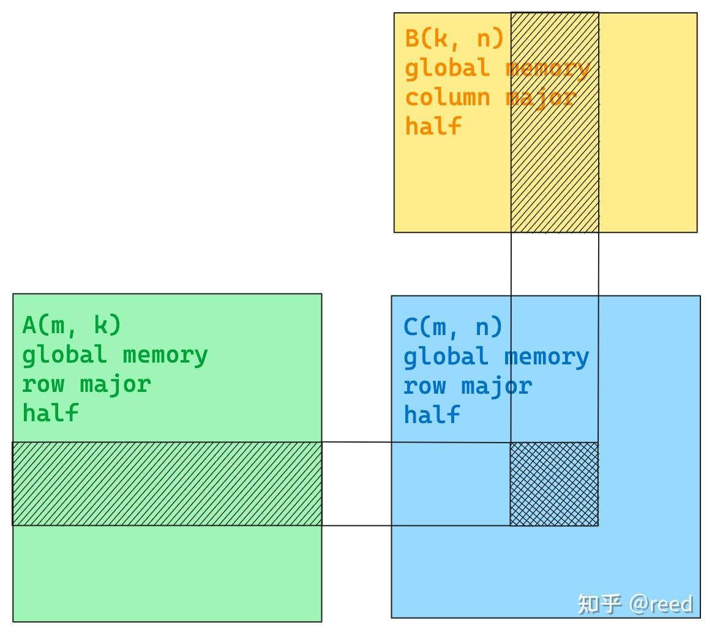
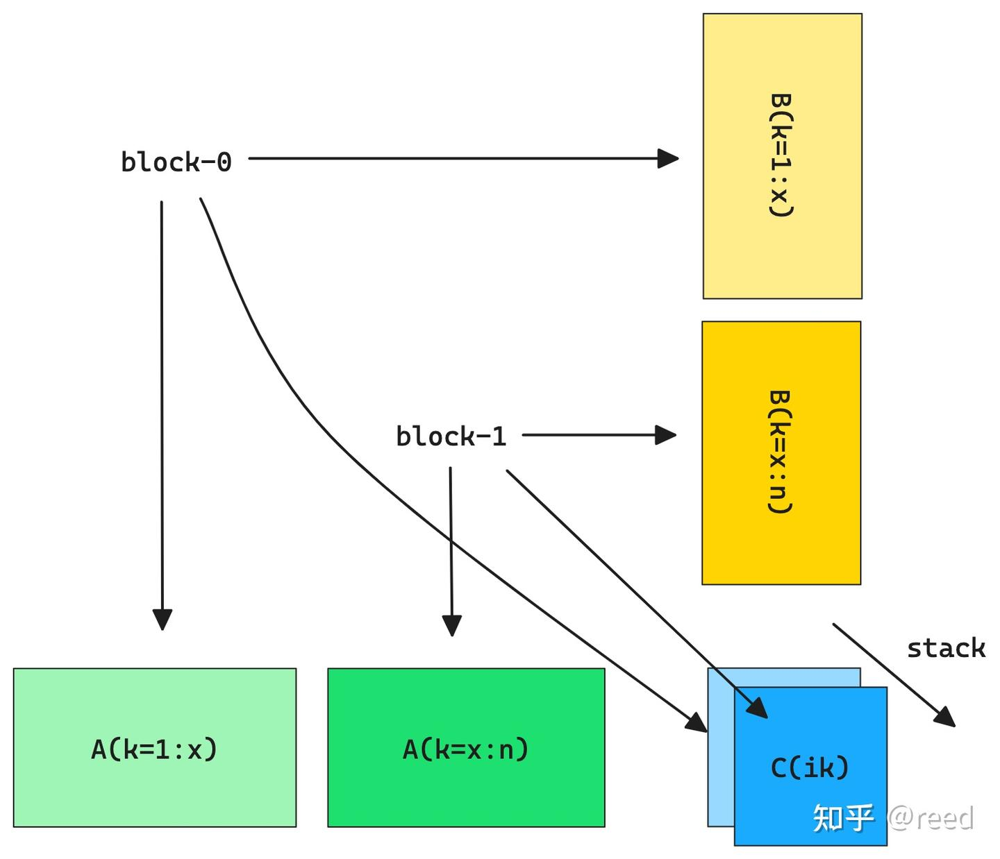
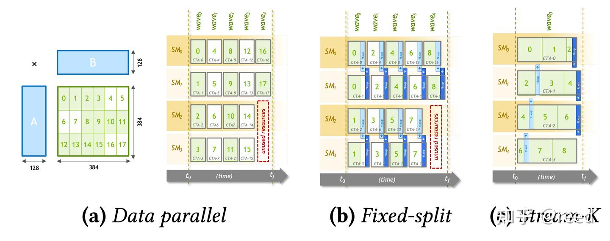

# CuTe의 단순 GEMM 구현

> 원문: https://zhuanlan.zhihu.com/p/667521327

이전 글들에서 CuTe의 핵심 자료 구조와 추상(Layout, Tensor, MMA, Copy)을 차례로 소개했습니다. 본 글은 이 개념·추상으로 **단순 버전 행렬 곱**을 구현합니다. 구체 구현 전에 (1) BLAS 약속과 딥러닝의 행렬 곱 요구 (2) NVIDIA cuBLAS 라이브러리 (3) HW 실행 단위로의 작업 분할 전략을 소개하고, 이후 Tensor 구성·블록 분할·실행·복사 코드로 구체화한 뒤 실제 문제 규모로 효율을 비교합니다.

## BLAS 약속과 딥러닝 약속

과학 계산·수치 해석에서는 행렬 고유값·선형 방정식 등을 풀어야 하며, EISPACK·LINPACK·LAPACK 같은 수학 라이브러리가 있습니다. 이들은 상위 수학 문제를 해결하며, 공통적으로 더 저수준의 기본 수학 라이브러리 **BLAS**(Basic Linear Algebra Subprograms)에 의존합니다. BLAS는 3계층:

- 1계층: 벡터 연산. 예) $\mathbf{y} = \alpha \mathbf{x} + \mathbf{y}$
- 2계층: 벡터-행렬 연산. 예) $\mathbf{y} = \alpha \mathbf{A} \mathbf{x} + \beta \mathbf{y}$
- 3계층: 행렬-행렬 연산. 예) $\mathbf{C} = \alpha \mathbf{A} \mathbf{B} + \beta \mathbf{C}$

흔히 말하는 **GEMM**(General Matrix Multiplication) 문제는 BLAS 3계층입니다. "general"은 $\alpha, \beta$가 임의 값일 수 있고, $\mathbf{A}, \mathbf{B}$가 전치/비전치일 수 있고, 정밀도가 단정도·배정도 등 다양함을 뜻합니다. BLAS는 초기에 Fortran으로 구현되었는데, Fortran의 2D 배열은 **column-major**입니다. 따라서 BLAS API에서 A·B의 전치 표기는 column-major가 **Normal(N)**, row-major가 **Transpose(T)**. 단 이는 A·B에 한정 — **C·D는 반드시 column-major**.

정밀도 약자는 단정도 `s`, 배정도 `d`, 단정도 복소 `c`, 배정도 복소 `z` — 결합해 `sgemm`. BLAS의 행렬 차원 표기:

$$\mathbf{D}_{m,n} = \alpha \mathbf{A}_{m,k} \mathbf{B}_{k,n} + \beta \mathbf{C}_{m,n}$$

`m, n`은 행·열 수, `k`는 reduce 축의 차원.

딥러닝에도 행렬 곱 레이어(PyTorch Linear, TensorFlow Dense)가 있지만 신경망에서는 $y = x \mathbf{A} + b$로 표현. 입력 `x`(N, Cin), 출력 `y`(N, Cout), bias는 broadcast로 무시. bias 무시 후 BLAS 형태로 표현하면 $\mathbf{D} = \mathbf{A}\mathbf{B}$ — BLAS와 유사하지만 차이:

1. $\alpha$ 없음
2. 우측 가산항 없음
3. **출력 D가 row-major** (BLAS는 column-major)

또한 딥러닝은 효율을 위해 **half-precision·정수 양자화** 등 BLAS의 전통적 정밀도보다 낮은 타입을 자주 사용.

딥러닝 출력이 row-major이고 BLAS의 D는 column-major이므로, BLAS 류로 딥러닝 행렬 곱을 구현하려면 **전치 변환**:

$$\mathbf{D}^T = \alpha \mathbf{B}^T \mathbf{A}^T + \beta \mathbf{C}^T, \quad \alpha = 1, \beta = 0$$

A·B 순서가 바뀝니다. 의사코드:

```cpp
// blas_gemm(D, A, B, trans_a, trans_b, m, n, k, alpha, beta) API:
// D = alpha op(A) op(B) + beta C
// op: 'N'ormal or 'T'ranspose
// 출력: D(m, n) column-major
// 입력: A(m, k), B(k, n), C(m, n) column-major

// D(m, n) row-major
// A(m, k) row-major
// B(k, n) column-major
void linear_layer(T *D, const T *A, const T *B, int m, int n, int k) {
  T alpha = 1, beta = 0;
  blas_gemm(D, B, A, 'T', 'N', n, m, k, alpha, beta);
}
```

## NVIDIA cuBLAS 라이브러리

NVIDIA는 GPU로 BLAS를 가속한 **cuBLAS**를 만들었고, BLAS API 외에 다중 batch·다중 GPU·딥러닝 가속용 혼합 정밀도·저정밀도 구현을 확장 제공합니다. half-precision GEMM은 `hgemm`. 본질적으로 cuBLAS는 **거대한 커널 저장소**로, NVIDIA가 dtype·정밀도·차원·정렬 등을 종합 고려한 고도 최적화 커널들을 보유. 사용자가 호출하면 cuBLAS는 문제 규모·제약에 적합한 우수 성능 구현을 선택합니다.

cuBLAS 외에 NVIDIA는 **cuBLASLt** 등도 제공. 그림 1은 NVIDIA BLAS 류 라이브러리 API 복잡도와 후처리 융합 능력 비교.


cuBLASLt는 cuBLAS 위에서 AI/ML에 더 유연한 응용을 제공 — 더 복잡한 입출력·계산 타입(혼합 정밀도) 지정, **휴리스틱 알고리즘**으로 최고 성능 커널 선택. 후속 글의 실험에서는 cuBLASLt의 커널 선택 능력으로 baseline을 설정합니다. 본 글은 cuBLAS 선택 커널을 baseline으로 사용.

## Tensor 표현



본 글은 딥러닝에서 자주 쓰는 `C = AB` 행렬 곱을 다룹니다. A·B·C는 GPU global memory에 저장; A는 m행 k열, B는 k행 n열, C는 m행 n열; layout은 **A row-major, B column-major, C row-major**; 데이터 타입은 모두 **fp16**(`half`/`cute::half_t`).

| 행렬 | 포인터 | 저장 위치 | shape | stride | dtype |
|---|---|---|---|---|---|
| A | Aptr | global | (m, k) | (k, 1) | half |
| B | Bptr | global | (k, n) | (1, k) | half |
| C | Cptr | global | (m, n) | (n, 1) | half |

Tensor로 표현:

```cpp
template <typename T>
__global__ void gemm_simple(T *Cptr, const T *Aptr, const T *Bptr, int m, int n, int k) {
  Tensor A = make_tensor(make_gmem_ptr(Aptr), make_shape(m, k), make_stride(k, Int<1>{}));
  Tensor B = make_tensor(make_gmem_ptr(Bptr), make_shape(n, k), make_stride(k, Int<1>{}));
  Tensor C = make_tensor(make_gmem_ptr(Cptr), make_shape(m, n), make_stride(n, Int<1>{}));
}
```

`make_gmem_ptr()`는 tensor 포인터의 **저장 계층**을 표시. B는 `(n, k), stride (k, 1)`로 표현해 후속 루프에서 reduce 형태로 작성 가능. 컴파일 타임 결정·최적화를 위해 stride의 연속 차원 1을 `Int<1>{}`(컴파일 타임 상수)로 표시.

## C 행렬 중심 작업 분할 전략

GPU에는 여러 **SM**이 있으며 grid·block 계층으로 활용. 행렬 계산에서는 **출력 C를 thread block 분할 단위**로 사용 — 한 thread block이 C의 작은 블록(**TileC**)의 계산 담당. TileC 크기 `kTileM × kTileN`. TileC 계산에 필요한 A의 녹색 강조 부분과 B의 황색 강조 부분 — 형상 `(kTileM, k)`, `(kTileN, k)`. A·B의 k축을 `kTileK` 크기로 분할하면 TileC = AB 블록의 점적:

$$\text{TileC} = \sum_{itile=0}^{num\_tile} \text{TileA}_{itile} \cdot \text{TileB}_{itile}$$


k축을 따라 `kTileK` 만큼 이동하며 TileA·TileB를 곱해 누적 → TileC 완성. 이 **sliced-k** 전략. 한 block(`blockIdx.x, blockIdx.y`)이 C의 한 작은 블록을 완성. block 차원 확장으로 전체 C 완성 — `grid.x = N / kTileN, grid.y = M / kTileM`.

```cpp
template <typename T, int kTileM, int kTileN, int kTileK>
__global__ void gemm_simple(T *Cptr, const T *Aptr, const T *Bptr, int m, int n, int k) {
  Tensor A = make_tensor(make_gmem_ptr(Aptr), make_shape(m, k), make_stride(k, Int<1>{}));
  Tensor B = make_tensor(make_gmem_ptr(Bptr), make_shape(n, k), make_stride(k, Int<1>{}));
  Tensor C = make_tensor(make_gmem_ptr(Cptr), make_shape(m, n), make_stride(n, Int<1>{}));

  int ix = blockIdx.x;
  int iy = blockIdx.y;

  Tensor gA = local_tile(A, make_tile(Int<kTileM>{}, Int<kTileK>{}), make_coord(iy, _));
  Tensor gB = local_tile(B, make_tile(Int<kTileN>{}, Int<kTileK>{}), make_coord(ix, _));
  Tensor gC = local_tile(C, make_tile(Int<kTileM>{}, Int<kTileN>{}), make_coord(iy, ix));
}

int main() {
  // ...
  dim3 grid(n / kTileN, m / kTileM);
  // ...
}
```

분할 hyper-param `kTileM/N/K`를 템플릿 파라미터로 받고, `local_tile` + 좌표 슬라이스로 현재 thread block이 처리할 `gA, gB, gC`를 얻음. `Int<>`로 컴파일 상수화.

| Tensor | shape |
|---|---|
| `gA` | `(kTileM, kTileK, num_tile_k)` |
| `gB` | `(kTileN, kTileK, num_tile_k)` |
| `gC` | `(kTileM, kTileN)` |

**sliced-k**는 m·n이 큰 경우(분할로 모든 SM을 채울 수 있을 때) 효과적. k가 크고 m·n이 작으면 thread block 수가 SM을 못 채워 일부 SM이 idle. 이때 k축을 여러 segment로 나누고 각각 TileC 계산 후 추가 누적 단계로 합치는 **split-k** 전략.



또 다른 전략 **stream-k**(PPoPP'23): sliced-k·split-k는 정적 분할이라 작업 수와 SM 수가 나누어떨어지지 않으면 wave에서 SM 유휴 발생. stream-k는 **계산 자원 중심 분배**로 SM 작업량을 균등하게. 그림 5는 4 SM 가정 시 차이.



현재 cuBLAS 커널은 여전히 sliced-k·split-k가 다수. 본 글은 split-k·stream-k는 미구현.

## TiledMMA: host에서 명령 선택, device에서 분할을 스레드에 분배

C++ 포인터를 Tensor로 포장해 `local_tile`로 작은 블록을 얻은 다음, **TiledMMA**(MMA 장에서 구성)와 그 메서드로 ThrMMA의 `partition_A/B/C`로 TileA·B·C 분할, `partition_fragment_A/B/C`로 행렬 곱 레지스터 표현 구성, `cute::gemm`으로 스레드 단위 레지스터 행렬 곱 완성.

```cpp
template <typename T, int kTileM, int kTileN, int kTileK, typename TiledMMA>
__global__ void gemm_simple(T *Cptr, const T *Aptr, const T *Bptr, int m, int n, int k) {
  // ... A, B, C, gA, gB, gC ...

  TiledMMA tiled_mma;
  auto thr_mma = tiled_mma.get_slice(threadIdx.x);
  auto tAgA = thr_mma.partition_A(gA);  // (MMA, MMA_M, MMA_K, num_tile_k)
  auto tBgB = thr_mma.partition_B(gB);  // (MMA, MMA_N, MMA_K, num_tile_k)
  auto tCgC = thr_mma.partition_C(gC);  // (MMA, MMA_M, MMA_N)

  auto tArA = thr_mma.partition_fragment_A(gA(_, _, 0));  // (MMA, MMA_M, MMA_K)
  auto tBrB = thr_mma.partition_fragment_B(gB(_, _, 0));  // (MMA, MMA_N, MMA_K)
  auto tCrC = thr_mma.partition_fragment_C(gC(_, _));     // (MMA, MMA_M, MMA_N)

  clear(tCrC);
}

int main() {
  using mma_op = SM80_16x8x16_F16F16F16F16_TN;
  using mma_traits = MMA_Traits<mma_op>;
  using mma_atom = MMA_Atom<mma_traits>;

  auto MMA = decltype(make_tiled_mma(mma_atom{},
                      make_layout(Shape<_2, _2, _1>{}),
                      make_layout(Shape<_1, _2, _1>{})));
  dim3 block(size(MMA{}));
  dim3 grid(n / kTileN, m / kTileM);
  // ...
}
```

`partition_A` 의미: Tensor의 앞 두 차원을 분할해 3차원 결과. 첫 차원은 TiledMMA가 한 번에 처리하는 데이터, 다음 두 차원은 두 방향 반복. 더 많은 차원이 있으면 자연스럽게 계승. `partition_fragment` 류는 유사하지만 **레지스터 선언** 반환. `gA(_, _, 0)`처럼 첫 두 차원 유지·세 번째 차원 0 위치 → `(kTileM, kTileK)` 형태와 동등.

main에서는 Ampere의 `16x8x16 fp16` Tensor Core 명령 선택. SM80 Tensor Core는 warp level이라 MMA_Atom = 32 스레드. M·N 방향으로 스레드 추가 반복, B·C는 N 방향 레지스터 2회 확장 → MMA 타입. **TiledMMA = 32×2×2 = 128 스레드**, 처리 가능 행렬 크기: M = 16×2×1 = 32, N = 8×2×2 = 32, K = 16. 즉 **TiledMMA가 처리하는 MNK는 32×32×16**.

## K축 루프

TiledMMA 분할 후 `cute::gemm` 호출로 `C[kTileM, kTileN] = A[kTileM, kTileK] B[kTileN, kTileK]` 완성. k 방향 루프로 최종 결과:

```cpp
template <typename T, int kTileM, int kTileN, int kTileK, typename TiledMMA>
__global__ void gemm_simple(T *Cptr, const T *Aptr, const T *Bptr, int m, int n, int k) {
  // ... A, B, C, gA, gB, gC, TiledMMA partition ...

  clear(tCrC);

  int num_tile_k = size<2>(gA);
#pragma unroll 1
  for (int itile = 0; itile < num_tile_k; ++itile) {
    cute::copy(tAgA(_, _, _, itile), tArA);
    cute::copy(tBgB(_, _, _, itile), tBrB);

    cute::gemm(tiled_mma, tCrC, tArA, tBrB, tCrC);
  }

  cute::copy(tCrC, tCgC);
}
```

`gA`로 k 방향 tile 반복 횟수 `num_tile_k` 획득 → sliced-k 모드 루프. `cute::copy`로 global → 레지스터 직접 복사 후 `cute::gemm`으로 Tile 행렬 곱. 루프 종료 후 다시 `cute::copy`로 레지스터 → global 쓰기. `cute::copy`에 Copy_Atom 미지정 시 `UniversalCopy` — 단순 CUDA 수준 `T d = s`. 여기까지 TileMMA + cute::copy로 단순 행렬 곱 완성.

## 실험 성능 비교

실제 딥러닝 추론에 등장하는 `(M, N, K) = (81920, 256, 256)`, `(kTileM, kTileN, kTileK) = (128, 128, 32)`. RTX 3090(Ubuntu 20.04, CUDA 535.113.01, NVCC 11.7.64)에서 100회 평균:

| 방법 | 평균 시간 (us, 100회 평균) |
|---|---|
| `gemm_simple` | 218 |
| `ampere_h16816gemm_256x128_ldg8_stages_32x3_tn` | 138 |

cuBLAS가 선택한 Ampere 구현 대비 **약 60% 효율**. 후속 글에서 이 구현을 점진적 최적화로 cuBLAS 수준 또는 그 이상까지 끌어올립니다. 코드: https://github.com/reed-lau/cute-gemm.

## 정리

본 글은 cuBLAS의 행렬 곱 약속과 딥러닝 약속, HW 모델로의 작업 분할 방법을 다루고, CuTe의 Layout·Tensor·TiledMMA·Copy로 단순 GEMM을 구현했습니다. 특정 규격 실험에서 단순 구현이 cuBLAS의 60% 효율 달성. 후속 최적화로 SOTA GEMM 구현을 목표로 합니다.

## 참고

- http://history.siam.org/pdfs2/Dongarra_returned_SIAM_copy.pdf
- https://pytorch.org/docs/stable/generated/torch.nn.Linear.html
- https://www.tensorflow.org/api_docs/python/tf/keras/layers/Dense
- https://developer.nvidia.com/cublas
- https://developer.nvidia.com/blog/new-cublas-12-0-features-and-matrix-multiplication-performance-on-nvidia-hopper-gpus
- https://dl.acm.org/doi/10.1145/3572848.3577479
