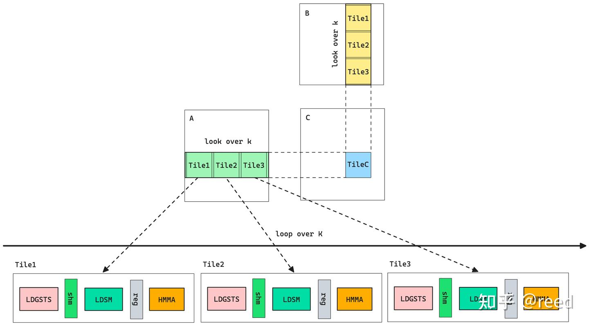
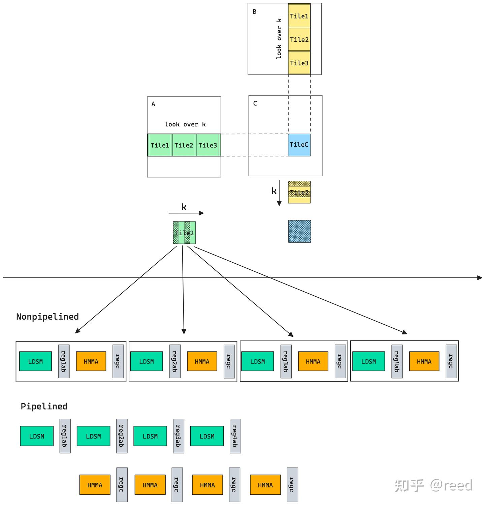
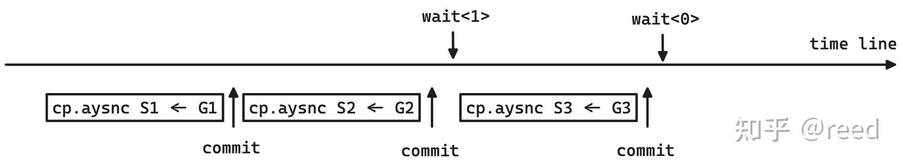
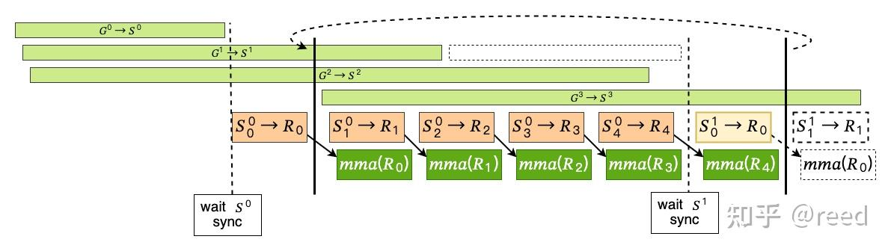

# CuTe의 GEMM 파이프라인

> 원문: https://zhuanlan.zhihu.com/p/665082713

이전 글들에서 CuTe의 Copy·MMA 추상을 다루고, 이를 기반으로 [단순 GEMM](../B20_cute_simple_gemm/README.md)을 구현했습니다. 논리상 CuTe 소개는 끝났지만, GEMM 연산을 효율적으로 완성하려면 **GPU의 데이터 로드와 계산 유닛을 어떻게 효율·병렬 활용할까** — 즉 CuTe의 Copy·MMA 추상을 어떻게 조직해 효율 GEMM을 만들지에 대한 중요한 최적화 고민이 남아 있습니다. 이 부분은 GEMM 전략에 속하며 CuTe 자체 기능 범위는 아니지만, 시리즈 제목 대칭을 위해 본 글 제목을 "CuTe의 GEMM 파이프라인"으로 했습니다. 본질적으로 **파이프라인은 CuTe 영역이 아니라 GEMM의 최적화 전략**임에 유의하세요.

본 글은 (1) 고전 RISC HW 파이프라인을 복습해 파이프라인의 성능 향상 효과를 도입하고, (2) 유추로 GEMM의 SW 파이프라인(Tile 간·Tile 내)을 소개, (3) Ampere의 비동기 복사 명령과 MultiStage 파이프라인을 다루고, 마지막으로 (4) GEMM 파이프라인과 CuTe의 관계를 정리합니다.

## RISC 하드웨어 파이프라인

현대 프로세서 미세 아키텍처에서 **파이프라인 기술**은 명령 병렬을 끌어올리는 핵심 기술. 파이프라인 프로세서는 명령 실행을 여러 **Stage**로 나누고, 다른 명령의 다른 Stage가 동시에 처리되도록 허용합니다. 고전 RISC(Reduced Instruction Set Computer) 5단계 파이프라인:

- **IF**(Instruction Fetch): PC가 가리키는 명령을 명령 캐시에서 fetch
- **ID**(Instruction Decode): 이진 코드를 연산 종류·source/dst 레지스터로 분해
- **EX**(EXecute): 실행 유닛이 특정 연산 수행
- **MEM**(MEMory): 메모리 접근이 필요한 명령은 이 단계에서 읽기/쓰기
- **WB**(Write Back): 실행 결과·메모리 결과를 dst 레지스터에 쓰기

비파이프라인은 명령 하나마다 모든 stage 실행. 3 명령(Inst-1, 2, 3)에 시간이 길게 듦. 파이프라인은 첫 명령이 ID에 진입하면 두 번째 명령이 IF에 진입 — **각 stage 중첩**. 같은 3 명령을 훨씬 짧은 시간에 실행. 파이프라인은 각 stage의 다른 유닛 활용률을 높여 매 시점 모든 유닛이 활용되도록 합니다.

## GEMM SW 파이프라인 (Tile 간)

명령 파이프라인이 HW 설계로 유닛 활용도를 높이듯, GEMM에도 SW 프로그래밍으로 같은 사고 적용 가능.

전형적 sliced-k GEMM은 K축 tile 루프로 누적해 최종 CTile 결과 획득. 한 Tile의 행렬 곱 계산을 RISC의 명령처럼 기본 단위로 보면, 그 실행은 여러 stage로 분할 가능:

- **LDGSTS** (LoaD Global STore Shared memory): global → shared 데이터 로드
- **LDSM** (LoaD Shared Matrix): shared → 레지스터 로드
- **MMA** (Matrix Multiply Accumulate): 블록 행렬 곱

첫 stage 출력은 shared memory, 둘째 stage 데이터는 레지스터. 세 stage가 중첩되면 효율 극대화 — 파이프라인 사고로 GEMM 최적화:

세 stage가 병렬화되어 각 유닛(global → shared, shared → 레지스터, 행렬 계산)이 동시 작동 → GEMM 효율 향상.

## Tile 내 파이프라인

Tile 내에도 파이프라인 가능(본 글에서 "tile 내 작은 k 루프"). 그림 4: Tile 단위 행렬 곱은 보통 여러 명령(MMA_Atom)이 필요하고 각 행렬 곱의 입력 데이터가 서로 독립이므로, **데이터 로드와 계산을 파이프라인으로 조립**해 두 유닛 활용률을 높일 수 있습니다(2계층 파이프라인). `pipelined` 영역처럼 Tile 내 행렬 계산 효율 향상.

## 비동기 복사와 MultiStage 파이프라인

데이터 로드 효율을 더 높이기 위해 NVIDIA는 Ampere에서 **`cp.async`**(SASS의 LDGSTS) 비동기 복사 명령을 제공. 비동기로 global → shared 로드. Ampere 이전에는 global → shared가 **레지스터를 거쳐야** 했고 레지스터 차원 데이터 의존성이 발생, GPU의 in-order issue/execute와 scoreboard 의존 해결 메커니즘 때문에 **stall 유발**. `cp.async`는 이 제약을 극복해 직접 global → shared 로드. 비동기이므로 명령 발사 후 바로 후속 명령 실행 가능. **commit·wait** 메커니즘으로 명시적 동기화: commit은 동기점 표시, wait은 특정 동기점까지 동기화.

`cp.async` 3개로 global → shared 복사 작업 3개 제출, commit 3개 + wait 2개로 동기점 설정. `wait<1>`은 **최대 1개의 미완료 트랜잭션 허용**(즉 `G2 → S2`는 미완료 가능, `G1 → S1`은 완료 보장). `wait<0>`은 미완료 0개 — 모든 commit이 완료될 때까지 대기.

비동기 복사 + Tile 간·내 파이프라인 통합 → **MultiStage 파이프라인 모델**:

- 옅은 녹 $G^i \to S^i$: global → shared 비동기 로드(Tile 크기, TileA·B 통합 — tile 루프)
- 갈색 $S_j \to R_j$: shared → 레지스터 로드(tile 내 작은 k 루프)
- 진녹 $\text{mma}(R_i)$: 레지스터 행렬 곱(tile 내 작은 k 루프)
- mma 경계 두 검정선 + 곡선 점선 = tile 내 작은 k 루프 시작·끝과 다음 tile 진입

multistage(예: kStage = 4)에서 첫 tile 계산 전 **stage - 1 개의 비동기 G → S 작업 발사**(`G0→S0, G1→S1, G2→S2`). 첫 Tile 내용을 읽기 위해 모든 비동기 발사 후 `wait S0` → 작은 k 루프 진입 전 `S0`에서 `ik=0` 행렬 계산 데이터를 `R0`로 로드(첫 검정 점선과 첫 검정 실선 사이).

작은 k 루프 진입 후 매 단계 세 동작:
1. 새 Tile `G3 → S3` 비동기 읽기 발사
2. shared에서 다음 작은 k 행렬 곱 데이터 `R1` 읽기
3. 첫 작은 k 행렬 연산 실행

shared 쓰기와 mma 데이터 의존성은 화살표로 표시. 작은 k 루프 진입 후 2·3 반복 → 데이터 로드와 계산 파이프라인 완성.

마지막 작은 k 루프 직전, 다음 tile 첫 작은 k 데이터 읽기(shared → 레지스터)가 필요하지만, 다음 tile 데이터(global → shared)는 `wait S1`로 완료 보장 필요. wait 종료 후 이전과 같이 다음 루프 진입 전 shared → 레지스터 로드 — **단 이번 shared는 현재 tile이 아닌 다음 tile(`S1`)**. R0 읽기 완료 후 마지막 작은 k mma 완료 → tile 내 작은 k 루프 종료, 다음 tile 계산 반복 → 최종 tile 루프 완성.

이상이 multistage GEMM 파이프라인(Tile 간 다단, Tile 내 2단). multi는 **shared memory 중간 버퍼 수**. stage = 5는 5개 shared 버퍼 파이프라인 — 각 버퍼에 한 Tile 데이터(TileA + TileB) 저장. Tile 루프 시작 전 stage-1개 G→S 로드 발사, 루프 안에서 다음 tile 로드. 비동기 복사 미지원 GPU에서는 레지스터 의존·`syncthread` 영향으로 **최대 2 메모리 버퍼**(실질 레지스터 버퍼) — 하나는 현재 계산용, 하나는 후속 로드용 = **double buffer**(multi stage의 stage = 2 특수 사례).

적절한 stage 크기는 **데이터 로드 능력과 행렬 계산 능력의 균형** — Tile 크기와 HW 레이턴시에 의존. micro-benchmark로 명령 latency를 측정해 정방향 설계하거나 환경에서 실험 튜닝.

## 정리

위 파이프라인 구축을 돌아보면, SW 파이프라인의 본질은 **데이터 이동·계산의 크기와 실행 순서를 합리적으로 제어하여 배후 HW 유닛이 더 충분히 병렬 실행되도록 하는 것**. CuTe는 이 둘의 추상(Copy·MMA)을 제공. 파이프라인 사고로 Copy·MMA를 조직하면 효율 행렬 곱 완성 가능. **CuTe는 도구, 더 나은 HW 활용을 위한 사용 방법은 설계 — 이미 CuTe 범위를 넘어선다**. 후속 글에서 CuTe의 Copy·MMA로 본 글의 파이프라인 모드를 적용해 효율 GEMM을 구현합니다.

## 참고

- https://en.wikipedia.org/wiki/Classic_RISC_pipeline
- https://link.springer.com/book/10.1007/978-3-031-01729-2
- https://github.com/NVIDIA/cutlass/blob/main/include/cutlass/gemm/collective/sm80_mma_multistage.hpp
