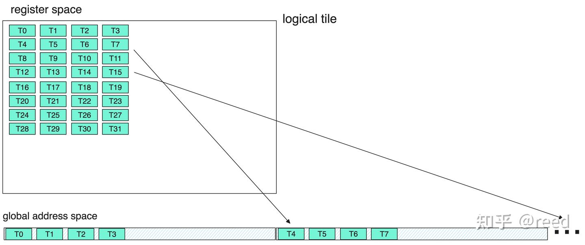

# CuTe의 고효율 GEMM 구현

> 원문: https://zhuanlan.zhihu.com/p/675308830

이전 글들에서 CuTe의 Layout·Tensor·MMA·Copy·Swizzle 추상과 파이프라인 기법을 다뤘습니다. 본 글은 이 추상·기법을 조합해 **고효율 행렬 곱**을 만듭니다. 구성: (1) 계산 효율, (2) 메모리 접근 효율, (3) 알고리즘 효율, (4) Epilogue 효율 — 이를 기반으로 CuTe 고효율 GEMM 구현 후 cuBLAS·cuBLASLt와 성능 비교. 결과는 **SOTA 수준 도달**.

## 계산 효율

GEMM의 핵심 계산은 블록 행렬 곱. 입력·accumulator 모두 half인 계산에서 Ampere는 다음 Tensor Core 명령 제공:

- `mma.sync.aligned.m16n8k8.row.col.f16.f16.f16.f16`
- `mma.sync.aligned.m16n8k16.row.col.f16.f16.f16.f16`

CuTe MMA_Operation:

- `SM80_16x8x8_F16F16F16F16_TN`
- `SM80_16x8x16_F16F16F16F16_TN`

문제 규모가 클 때는 **계산량이 큰 명령**을 선택 — 같은 명령의 계산 작업이 많아져 명령 수 감소·스케줄 효율 향상.

선택 후 MMA_Traits로 행렬 형상·협력 스레드 수(32)·A·B 레지스터 layout을 보충(그림 1). MMA_Traits → MMA_Atom으로 캡슐화 — 데이터 분할 정보와 Operation 실행 기능 제공. MMA_Atom은 **원자 능력**(단일 명령 = 최소 능력). 더 많은 스레드·각 스레드의 다회 작업으로 규격 확대 → **TiledMMA**. TiledMMA는 스레드별로 ThrMMA로 분리되어 행렬 블록 분할 구현. `cute::gemm` 호출로 행렬 곱 완성.


호스트 코드:

```cpp
using mma_op = SM80_16x8x16_F16F16F16F16_TN;
using mma_traits = MMA_Traits<mma_op>;
using mma_atom = MMA_Atom<mma_traits>;

static constexpr int kMmaEURepeatM = 2;
static constexpr int kMmaEURepeatN = 2;
static constexpr int kMmaEURepeatK = 1;

static constexpr int kMmaVRepeatM = 1;
static constexpr int kMmaVRepeatN = 2;
static constexpr int kMmaVRepeatK = 1;

using MMA_EU_RepeatT = decltype(make_layout(make_shape(
    Int<kMmaEURepeatM>{}, Int<kMmaEURepeatN>{}, Int<kMmaEURepeatK>{})));
using MMA_V_RepeatT = decltype(make_layout(make_shape(
    Int<kMmaVRepeatM>{}, Int<kMmaVRepeatN>{}, Int<kMmaVRepeatK>{})));

using MMA = decltype(make_tiled_mma(mma_atom{}, MMA_EU_RepeatT{}, MMA_V_RepeatT{}));
```

처음 3줄: MMA 명령 선택 → Atom 능력 형성. EU·V 반복 layout 정의 후 `make_tiled_mma`로 더 큰 블록 행렬 곱. 디바이스 코드:

```cpp
TiledMMA tiled_mma;
auto thr_mma = tiled_mma.get_slice(idx);
auto tCrA = thr_mma.partition_fragment_A(gA(_, _, 0));  // (MMA, MMA_M, MMA_K)
auto tCrB = thr_mma.partition_fragment_B(gB(_, _, 0));  // (MMA, MMA_N, MMA_K)
auto tCrD = thr_mma.partition_fragment_C(gD);           // (MMA, MMA_M, MMA_N)
```

TileMMA에 thread id 제공 → 구체 스레드 데이터 분할. 데이터 블록을 분할해 스레드별 데이터 기술 획득.


ThrMMA의 `partition_A/B/C`·`partition_fragment_A/B/C` 계산 로직: 정적 크기 Tensor TileB(분할 차원 `Int<>` 컴파일 상수)에 thr_mma를 적용하면 — TileMMA가 기술하는 행렬 크기로 대상 Tensor를 **주기적 평탄화**, 강조 부분을 선택해 새 행렬 형성. 첫 차원은 TiledMMA의 단일 스레드 데이터, 둘째·셋째 차원은 행·열 방향 반복 횟수. TileB 차원이 2보다 높으면 초과분은 N·K 뒤에 계승. A·C도 동일.

## 메모리 접근 효율

GEMM에서 Tensor Core 도착 전 데이터 흐름은 **global → shared → register**. 파이프라인 장에서 global → shared 비동기 복사와 shared → register `ldmatrix`를 다뤘습니다. CuTe에서 global → shared는 MMA처럼 정의된 추상을 선택하면 됨 — 본 글에서는 **`SM80_CP_ASYNC_CACHEGLOBAL`** Copy_Operation 선택. 비동기 복사이며 CACHEGLOBAL은 **L2만 캐시·L1 bypass**.

```cpp
using g2s_copy_op = SM80_CP_ASYNC_CACHEGLOBAL<cute::uint128_t>;
using g2s_copy_traits = Copy_Traits<g2s_copy_op>;
using g2s_copy_atom = Copy_Atom<g2s_copy_traits, T>;

using G2SCopyA =
    decltype(make_tiled_copy(g2s_copy_atom{},
                             make_layout(make_shape(Int<32>{}, Int<4>{}),
                                         make_stride(Int<4>{}, Int<1>{})),
                             make_layout(make_shape(Int<1>{}, Int<8>{}))));
using G2SCopyB = G2SCopyA;
```

`make_tiled_mma`처럼 `make_tiled_copy`도 스레드·데이터 반복 방법 지정으로 Atom → 블록 능력 확장. A·B에 다른 Copy 능력을 지정할 수 있지만 여기선 동일.

```cpp
G2SCopyA g2s_tiled_copy_a;
auto g2s_thr_copy_a = g2s_tiled_copy_a.get_slice(idx);
auto tAgA_copy = g2s_thr_copy_a.partition_S(gA);  // (CPY, CPY_M, CPY_K, k)
auto tAsA_copy = g2s_thr_copy_a.partition_D(sA); // (CPY, CPY_M, CPY_K, kStage)
```

MMA처럼 TileCopy → ThrCopy → `partition_S/D`로 큰 블록 → 스레드 차원. `partition_S/D` 결과 차원은 `(E, M, K)`. E는 스레드 데이터 크기, M·K는 종·횡 반복 횟수.

shared → 레지스터 복사는 `ldmatrix` 캡슐화:

```cpp
// 호스트
using s2r_copy_op = SM75_U32x4_LDSM_N;
using s2r_copy_traits = Copy_Traits<s2r_copy_op>;
using s2r_copy_atom = Copy_Atom<s2r_copy_traits, T>;

using S2RCopyAtomA = s2r_copy_atom;
using S2RCopyAtomB = s2r_copy_atom;
```

```cpp
// 디바이스
auto s2r_tiled_copy_a = make_tiled_copy_A(S2RCopyAtomA{}, tiled_mma);
auto s2r_thr_copy_a = s2r_tiled_copy_a.get_slice(idx);
auto tAsA = s2r_thr_copy_a.partition_S(sA);  // (CPY, CPY_M, CPY_K, kStage)
auto tCrA_view = s2r_thr_copy_a.retile_D(tCrA);  // (CPY, CPY_M, CPY_K)
```

호스트는 `ldmatrix`의 x4 모드. 디바이스는 **`make_tiled_copy_A`** 로 `tiled_mma`를 활용해 shared → 레지스터 TileCopy 추상화. global → shared와 다른 점은 **`tiled_mma`로부터 직접 블록 복사 정보 추출** — TiledMMA가 계산용 데이터 기술을 이미 포함하므로 별도 Copy_Atom → TileCopy 정보 지정 불필요. 일관성 문제 회피. MMA에서 레지스터 저장 공간이 이미 선언됐으니 여기서는 **retile**(작은 블록)만 — partition 아님.

## 알고리즘 효율

계산·메모리 효율을 어떻게 결합하는가가 GEMM 성능의 관건 — **분할**과 **파이프라인** 두 부분.

분할은 simple GEMM과 파이프라인 글에서 다뤘으니 생략. 호스트:

```cpp
static constexpr int kTileM = kTileM_;
static constexpr int kTileN = kTileN_;
static constexpr int kTileK = kTileK_;
static constexpr int kStage = kStage_;
```

디바이스:

```cpp
// 현재 thread block용으로 작은 tensor 슬라이스
Tensor gA = local_tile(A, make_tile(Int<kTileM>{}, Int<kTileK>{}),
                       make_coord(iy, _));  // (kTileM, kTileK, k)
Tensor gB = local_tile(B, make_tile(Int<kTileN>{}, Int<kTileK>{}),
                       make_coord(ix, _));  // (kTileN, kTileK, k)
Tensor gD = local_tile(D, make_tile(Int<kTileM>{}, Int<kTileN>{}),
                       make_coord(iy, ix));  // (kTileM, kTileN)

// shared memory
auto sA = make_tensor(make_smem_ptr(Ashm), SmemLayoutA{});  // (kTileM, kTileK, kStage)
auto sB = make_tensor(make_smem_ptr(Bshm), SmemLayoutB{});  // (kTileN, kTileK, kStage)
```

multi stage 파이프라인을 위해 shared 할당 시 stage 수 지정, 디바이스 측은 데이터 로드·계산 오버랩.

```cpp
static constexpr int kShmLoadSwizzleM = 3;
static constexpr int kShmLoadSwizzleS = 3;
static constexpr int kShmLoadSwizzleB = 3;

using SmemLayoutAtom = decltype(composition(
    Swizzle<kShmLoadSwizzleB, kShmLoadSwizzleM, kShmLoadSwizzleS>{},
    make_layout(make_shape(Int<8>{}, Int<kTileK>{}),
                make_stride(Int<kTileK>{}, Int<1>{}))));
using SmemLayoutA = decltype(
    tile_to_shape(SmemLayoutAtom{},
                  make_shape(Int<kTileM>{}, Int<kTileK>{}, Int<kStage>{})));
using SmemLayoutB = decltype(
    tile_to_shape(SmemLayoutAtom{},
                  make_shape(Int<kTileN>{}, Int<kTileK>{}, Int<kStage>{})));
```

shared layout 정의. Swizzle로 bank conflict 회피. `kStage`는 파이프라인 단계 수.

핵심 디바이스 코드는 두 for 루프:

```cpp
// k 루프: i. tile 로드, ii. mma
int ntile = k / kTileK;
#pragma unroll 1
for (int itile = 0; itile < ntile; ++itile) {
  int nk = size<2>(tCrA);

#pragma unroll
  for (int ik = 0; ik < nk; ++ik) {
    int ik_next = (ik + 1) % nk;

    if (ik == nk - 1) {
      cp_async_wait<kStage - 2>();
      __syncthreads();

      ismem_read = (ismem_read + 1) % kStage;
    }

    // shm -> reg s[itile][ik + 1] -> r[ik + 1]
    cute::copy(s2r_tiled_copy_a, tAsA(_, _, ik_next, ismem_read),
               tCrA_view(_, _, ik_next));
    cute::copy(s2r_tiled_copy_b, tBsB(_, _, ik_next, ismem_read),
               tCrB_view(_, _, ik_next));

    if (ik == 0) {
      if (itile_to_read < ntile) {
        cute::copy(g2s_tiled_copy_a, tAgA_copy(_, _, _, itile_to_read),
                   tAsA_copy(_, _, _, ismem_write));
        cute::copy(g2s_tiled_copy_b, tBgB_copy(_, _, _, itile_to_read),
                   tBsB_copy(_, _, _, ismem_write));

        ++itile_to_read;
        ismem_write = (ismem_write + 1) % kStage;
      }

      cp_async_fence();
    }

    cute::gemm(tiled_mma, tCrD, tCrA(_, _, ik), tCrB(_, _, ik), tCrD);
  }  // for ik
}    // itile
```

외층 Tile 루프, 내층 Tile 내 k 루프. `ik == 0`과 `ik == nk - 1` 시점에 후 `kStage - 1` Tile의 global → shared 로드와 곧 읽을 shared 동기화 발사.

## Epilogue 효율

위 계산·로드·알고리즘으로 행렬 곱 결과 블록 데이터 획득 — 스레드 내 레지스터로 저장됨. 직접 쓰기는 글로벌 주소 공간에서 **불연속**이라 더 많은 메모리 트랜잭션이 필요하고 벡터화 저장(STG.128) 불가:



CuTe(=CUTLASS)는 **Epilogue**로 **shared memory를 중간 매개**로 사용 — 레지스터 → shared → global. shared에서 더 연속·고비트 폭으로 global에 쓸 수 있습니다. PACT'20 Fireiron 논문에 자세히 논의됨.


본 글은 shared memory로 효율적 TileC 저장을 구현. 코드는 GitHub 참고. 전체 과정은 그림 4.

## 실험 설정과 결과

위 최적화로 CuTe MultiStage GEMM 구현 — https://github.com/reed-lau/cute-gemm.

문제 규격: `M = 81920, N = 256, K = 256`, A row-major / B col-major / C row-major, 입출력·계산 모두 half. RTX 3090, Ubuntu 20.04.6 LTS, NVIDIA driver 535.113.01, NVCC V11.7.64. cuBLAS·cuBLASLt 11.10.0.1과 비교 — cuBLASLt의 휴리스틱으로 가능한 많은 커널 비교.

Nsight Compute로 정밀 측정. L2 캐시 영향 회피를 위해 `--cache-control=all`로 매 profile 시 캐시 클리어, `--clock-control=base`로 GPU 주파수 고정.

cuBLASLt가 휴리스틱으로 5 커널 선택, 11회 실험:

| 라이브러리 | 커널 | 평균(us) | 분산 | 중앙값 |
|---|---|---|---|---|
| **our-impl** | `gemm_multi_stage` | **130.1** | 0.4 | 130.1 |
| cuBLAS | `ampere_h1688gemm_128x128_ldg8_stages_32x1_tn` | 153.4 | 2 | 154.1 |
| cuBLASLt | `ampere_h16816gemm_128x64_ldg8_tn` | 154.0 | 0.5 | 154.1 |
| cuBLASLt | `ampere_h16816gemm_256x128_ldg8_stages_32x3_tn` | 154.2 | 0.6 | 154.2 |
| cuBLASLt | `ampere_h1688gemm_128x128_ldg8_stages_32x1_tn` | 153.4 | 2 | 154.1 |
| cuBLASLt | `ampere_h1688gemm_128x128_ldg8_tn` | 136.5 | 0.7 | 136.5 |
| cuBLASLt | `cutlass_80_tensorop_h16816gemm_128x256_32x3_tn_align2` | 183.4 | 0.7 | 183.4 |

평균과 중앙값이 비슷해 측정이 안정적. **본 구현 130.1us, cuBLAS·cuBLASLt 최고 136.5us — 본 규격에서 SOTA 달성**.

## 정리와 논의

### 휴리스틱 알고리즘

코드의 많은 파라미터(kTileM/N/K, kStage 등)는 조정 가능. 문제 규격에 맞게 조정하면 더 좋은 효과. 이론 계산으로 공식 설계, 또는 오프라인 exhaustive 실험으로 데이터 분석해 휴리스틱 알고리즘 도출 가능. 본 글은 특정 case만 다뤄 이 부분은 다루지 않음 — cuBLAS가 선택한 커널의 파라미터 설정 참고 가능.

### 파라미터 호환성

MMA·Copy의 많은 파라미터는 layout, 스레드 수, 레지스터 반복, 계산 블록 크기를 기술. 이 파라미터들은 **완전히 자유롭지 않고 상호 제약**이 존재 — shared 크기, 레지스터 수, thread block 크기, 분할 방식. 튜닝 시 고려 필요.

### 기타

CUDA 최적화는 더 많은 측면이 있음 — 파이프라인 장 마지막 부분의 L2 적중률 향상 Thread Block Swizzle은 본 글의 N 차원이 작아 미사용. `__launch_bounds__`로 컴파일러에 최적화 힌트 제공도 미탐색. 데이터 주소 비정렬·Tile 비정수배 미고려. CUTLASS의 핵심도 CuTe로 collective·epilogue 추상화 — 더 범용적.

### 정리

본 글은 계산·메모리·알고리즘·Epilogue 효율 측면에서 행렬 곱 고효율 구현 방법을 다루고, 특정 case에서 cuBLAS·cuBLASLt와 비교해 SOTA 효과 달성을 보였습니다.

CuTe의 Layout·Tensor·MMA·Copy 추상을 마스터하면 행렬 계산 능력을 빠르게 구축할 수 있고, 더 복잡한 문제(예: FlashAttention)도 효율적으로 해결할 수 있습니다.

이것이 본 CuTe 시리즈의 마지막 글입니다. 곧 다른 주제(고성능 계산·시스템)로 다시 만나길 바랍니다.

## 참고

- PACT'20 Fireiron
- NVIDIA cutlass Epilogue
