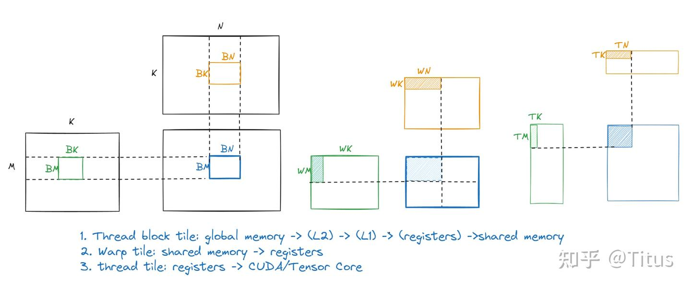
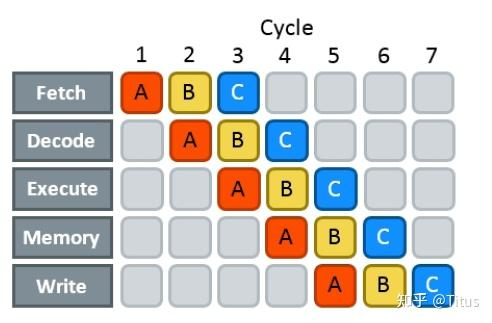
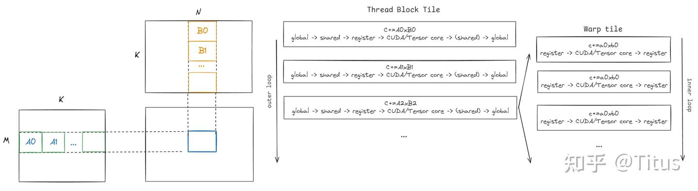
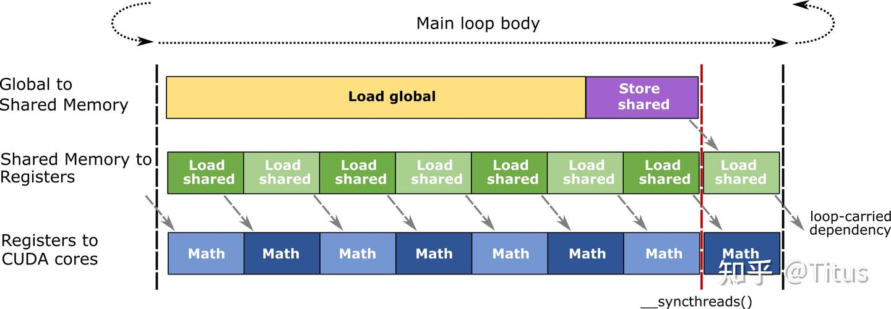
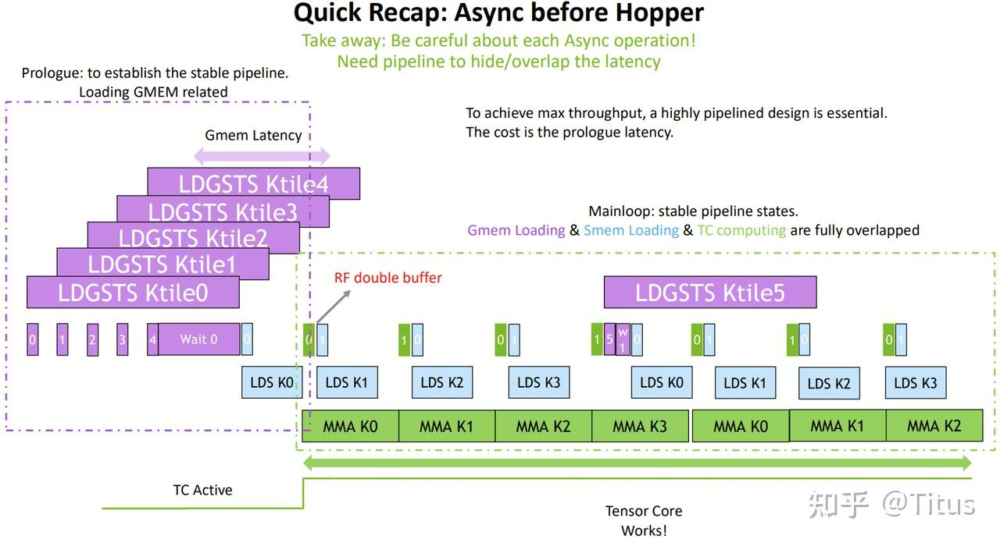

# CUTLASS GEMM 파이프라인 — single-stage, pipelined, multi-stage

> 원문: https://zhuanlan.zhihu.com/p/712451053

본 장은 CUTLASS GEMM에 사용되는 파이프라인 기법을 다루며, 주로 세 템플릿 클래스를 다룹니다.

- **MmaSingleStage** (`mma_singlestage.h`)
- **MmaPipelined** (`mma_pipelined.h`)
- **MmaMultiStage** (`mma_multistage.h`)

메모리 접근 병목 해결(지역성 원리), 메모리 지연 감추기, 하드웨어 병렬 특성 활용을 위해 CUTLASS는 **계층화된 GEMM 파이프라인 = 3계층 tiling**을 구축합니다.

- **thread block tiling**: 일정 크기 block을 global memory에서 shared memory로 이동, global 접근 감소. 각 block은 SM에 분배되어 독립·병렬 실행
- **warp tiling**: warp-level 병렬. block 안 여러 warp으로 추가 tiling. warp는 SM의 SMSP(서브 SM 파티션)에 분배되어 독립 실행. 예: Ampere의 SM은 4 SMSP(각각 warp scheduler 1개). **충분한 warp 수(높은 occupancy)** 가 있으면 warp scheduler가 warp을 빠르게 전환해 bubble을 줄임
- **thread tiling**: 각 스레드의 ILP(instruction-level parallelism) 능력. 충분한 명령(LDS·STS·FFMA)과 높은 계산/접근 비율이 추가로 지연 은폐



## 1. 하드웨어 파이프라인 — Instruction Pipeline

현대 HW는 다단 파이프라인 지원. 5단 예:

- 취득(fetching)
- 디코드(decoding)
- 실행(executing)
- 메모리(reading)
- 쓰기(writing)



각 파이프라인 단계는 사이클당 1 명령 실행하지만, 한 명령이 다음 단계로 넘어가면 자기 단계는 다음 명령을 처리. **명령당 지연을 줄이지는 않지만, 일정 수 명령 실행 시간을 줄임**.

**현대 HW는 메모리·계산을 분리 실행 가능. NVIDIA GPU는 이전 명령 종료 전에 무관 명령 실행 가능(ILP)**. 이 사고로 SW 파이프라인 구축 — 계산하면서 다음 데이터 프리페치 → 계산 종료 후 빠른 전환. 전자가 본 장의 **pipelined / multi-stage**, 후자가 **single-stage**.

## 2. GEMM 파이프라인

표기 약속:

- **대 루프 Loop over K**(thread block tile level): BK 단위 반복, 총 `nK = K/BK`. A의 부분 블록은 A0/A1/..., B는 B0/B1/...
  - (참고: reed 선생 글의 "sliced-K"는 잘못된 명명. **slice-K는 reduce across warp 방법**으로 BK를 slice해 M/N이 작고 K가 큰 경우에 사용. 여기서는 NVIDIA 논문대로 **CTA-wide MacLoop()** 라 부름)
- **소 루프 Loop over BK**(warp tile level): TK 단위 반복, `nk = BK/TK`. Ai 안 부분 블록은 a0/a1/..., Bi 안은 b0/b1/...

### 2.1 single-stage

single-stage = 단일 단계 = 직렬:

```cpp
template <
  typename Shape_,
  typename IteratorA_,
  typename SmemIteratorA_,
  typename IteratorB_,
  typename SmemIteratorB_,
  typename ElementC_,
  typename LayoutC_,
  typename Policy_,
  typename Enable = bool
>
class MmaSingleStage : public MmaBase<Shape_, Policy_, 1> {

  CUTLASS_DEVICE
  void operator()(
    int gemm_k_iterations,
    FragmentC &accum,
    IteratorA iterator_A,
    IteratorB iterator_B,
    FragmentC const &src_accum) {

    // Prologue
    accum = src_accum;

    FragmentA tb_frag_A;
    FragmentB tb_frag_B;
    tb_frag_A.clear();
    tb_frag_B.clear();

    // 마지막 kblock은 prolog에 로드됨
    iterator_A.load(tb_frag_A);
    iterator_B.load(tb_frag_B);
    ++iterator_A; ++iterator_B;

    WarpFragmentA warp_frag_A;
    WarpFragmentB warp_frag_B;
    Operator warp_mma;

    iterator_A.clear_mask(gemm_k_iterations <= 1);
    iterator_B.clear_mask(gemm_k_iterations <= 1);

    // Mainloop
    CUTLASS_GEMM_LOOP
    for (; gemm_k_iterations > 0; --gemm_k_iterations) {
      this->smem_iterator_A_.store(tb_frag_A);
      this->smem_iterator_B_.store(tb_frag_B);
      __syncthreads();

      CUTLASS_PRAGMA_UNROLL
      for (int warp_mma_k = 0; warp_mma_k < Base::kWarpGemmIterations; ++warp_mma_k) {
        this->warp_tile_iterator_A_.set_kgroup_index(warp_mma_k % Base::kWarpGemmIterations);
        this->warp_tile_iterator_B_.set_kgroup_index(warp_mma_k % Base::kWarpGemmIterations);
        this->warp_tile_iterator_A_.load(warp_frag_A);
        this->warp_tile_iterator_B_.load(warp_frag_B);
        ++this->warp_tile_iterator_A_;
        ++this->warp_tile_iterator_B_;

        warp_mma(accum, warp_frag_A, warp_frag_B, accum);
      }

      // smem load iterator를 시작 위치로 되돌림
      this->warp_tile_iterator_A_.add_tile_offset({0, -Policy::kPartitionsK * Base::kWarpGemmIterations});
      this->warp_tile_iterator_B_.add_tile_offset({-Policy::kPartitionsK * Base::kWarpGemmIterations, 0});

      __syncthreads();

      iterator_A.load(tb_frag_A);
      iterator_B.load(tb_frag_B);
      ++iterator_A; ++iterator_B;
      iterator_A.clear_mask(gemm_k_iterations <= 2);
      iterator_B.clear_mask(gemm_k_iterations <= 2);
    }
  }
};
```

대 루프 시작 전 block 내 모든 스레드가 A0·B0를 global → register → shared로 로드. 로드 완료(`__syncthreads()`) 후 소 루프 진입. 매 소 루프 반복: 각 warp이 A0·B0에서 일정 크기 ai·bi 로드 → 계산 → accumulator에 누적 → 소 루프 완료 후 다음 대 루프.



### 2.2 pipelined

pipelined = double-buffer = **multi-stage = 2 케이스에 해당하나 동기 버전**(multi-stage는 비동기 복사 명령 사용).

```cpp
template<...>
class MmaPipelined : public MmaBase<Shape_, Policy_, 2> {
  CUTLASS_DEVICE
  void operator()(
    int gemm_k_iterations,
    FragmentC &accum,
    IteratorA iterator_A,
    IteratorB iterator_B,
    FragmentC const &src_accum)
  {
    // Prologue: kStages-1번 메인루프 반복에 필요한 global fragment 프리페치
    prologue(iterator_A, iterator_B, gemm_k_iterations);

    // 적어도 한 stage 완료까지 대기
    gmem_wait();

    accum = src_accum;

    // MAC 반복 수행
    gemm_iters(gemm_k_iterations, accum, iterator_A, iterator_B);
  }
};
```

흐름:

1. **prologue**: block 내 각 스레드가 A0·B0를 global → shared 로드, 다음(A1·B1) 전환
2. **gmem_wait** = `__syncthreads()`: A0·B0 shared 쓰기 완료 대기
3. accumulator 초기화
4. 대·소 루프 반복 (`gemm_iters`)

`gemm_iters` 분석:

- 대 루프 진입 전 각 warp이 A0·B0에서 일정 크기를 register로 로드(shared → register), 대 루프 진입
- 매 대 루프에서 각 소 루프 반복:
  - **소 루프 마지막 계산**: 다음 stage(A1·B1) 대 루프의 fragment를 shared에 저장(register → shared), 완료 대기 후 **iterator를 다음 다음 대 루프로 전환**
  - 다음 소 루프의 fragment 로드 시작(shared → register)
  - **첫 소 루프 반복이면 다음 대 루프의 fragment를 shared → register로 프리페치**
  - 현재 소 루프 계산 수행



한 줄 요약: **소 루프 반복으로 warp-tile 계산할 때 핵심**:
1. **첫 반복**에서는 다음 stage 대 루프의 global → register fragment 로드. **마지막 반복**에서는 첫 반복의 데이터를 register → shared store
2. 다음 소 루프의 shared → register fragment 로드. **마지막 반복은 다음 stage 대 루프의 fragment 전환**

코드:

```cpp
CUTLASS_DEVICE
void gemm_iters(
    int gemm_k_iterations,
    FragmentC &accum,
    IteratorA &iterator_A,
    IteratorB &iterator_B)
{
  using WarpFragmentA = typename Operator::FragmentA;
  using WarpFragmentB = typename Operator::FragmentB;

  // shared load와 mma 오버랩용 한 쌍의 fragment
  WarpFragmentA warp_frag_A[2];
  WarpFragmentB warp_frag_B[2];

  // shared A에서 A fragment 로드
  this->warp_tile_iterator_A_.set_kgroup_index(0);
  this->warp_tile_iterator_A_.load(warp_frag_A[0]);
  ++this->warp_tile_iterator_A_;

  this->warp_tile_iterator_B_.set_kgroup_index(0);
  this->warp_tile_iterator_B_.load(warp_frag_B[0]);
  ++this->warp_tile_iterator_B_;

  // global load와 mma 오버랩용
  FragmentA tb_frag_A;
  FragmentB tb_frag_B;

  iterator_A.clear_mask(gemm_k_iterations <= 1);
  iterator_B.clear_mask(gemm_k_iterations <= 1);

  // Mainloop
  CUTLASS_GEMM_LOOP
  for (; gemm_k_iterations > 0; --gemm_k_iterations) {
    CUTLASS_PRAGMA_UNROLL
    for (int warp_mma_k = 0; warp_mma_k < Base::kWarpGemmIterations; ++warp_mma_k) {
      if (warp_mma_k == Base::kWarpGemmIterations - 1) {
        // shared로 fragment 쓰기
        this->smem_iterator_A_.store(transform_A_(tb_frag_A));
        this->smem_iterator_B_.store(transform_B_(tb_frag_B));

        gmem_wait();
        advance_smem_stages();
      }

      this->warp_tile_iterator_A_.set_kgroup_index((warp_mma_k + 1) % Base::kWarpGemmIterations);
      this->warp_tile_iterator_B_.set_kgroup_index((warp_mma_k + 1) % Base::kWarpGemmIterations);
      this->warp_tile_iterator_A_.load(warp_frag_A[(warp_mma_k + 1) % 2]);
      this->warp_tile_iterator_B_.load(warp_frag_B[(warp_mma_k + 1) % 2]);
      ++this->warp_tile_iterator_A_;
      ++this->warp_tile_iterator_B_;

      if (warp_mma_k == 0) {
        tb_frag_A.clear();
        iterator_A.load(tb_frag_A);
        ++iterator_A;

        tb_frag_B.clear();
        iterator_B.load(tb_frag_B);
        ++iterator_B;

        iterator_A.clear_mask(gemm_k_iterations <= 2);
        iterator_B.clear_mask(gemm_k_iterations <= 2);
      }

      warp_mma(accum, warp_frag_A[warp_mma_k % 2], warp_frag_B[warp_mma_k % 2], accum);
    }
  }
}
```

**single-stage 대비** 추가 shared·register fragment 한 세트가 필요해 occupancy 감소, 파이프라인이 stall되기 쉬움. 또한 **계산 명령이 적고 메모리 명령이 많아 지연 은폐가 어려움** — 분할 파라미터 튜닝 필요.

### 2.3 multi-stage

Ampere부터 비동기 메모리 명령(`cp.async`) 도입. 비동기이므로 **ILP 제약에서 해방** — 추가 레지스터 소모 없이 직접 global → shared 로드.

**stages = 2일 때 비동기 버전 double-buffer로 이해 가능**.

```cpp
template <
    typename Shape_, typename IteratorA_, typename SmemIteratorA_,
    cutlass::arch::CacheOperation::Kind CacheOpA,
    typename IteratorB_, typename SmemIteratorB_,
    cutlass::arch::CacheOperation::Kind CacheOpB,
    typename ElementC_, typename LayoutC_, typename Policy_,
    int Stages,
    SharedMemoryClearOption SharedMemoryClear = SharedMemoryClearOption::kNone,
    typename Enable = bool>
class MmaMultistage :
  public MmaBase<Shape_, Policy_, Stages> {

  CUTLASS_DEVICE
  void operator()(
      int gemm_k_iterations,
      FragmentC &accum,
      IteratorA iterator_A,
      IteratorB iterator_B,
      FragmentC const &src_accum) {

    // Prologue: global → shared 비동기 fetch 시작
    prologue(iterator_A, iterator_B, gemm_k_iterations);

    gmem_wait();

    accum = src_accum;

    gemm_iters(gemm_k_iterations, accum, iterator_A, iterator_B);
  }
};
```

핵심 흐름:

- **prologue**: thread block tile 계산 시작 전 **`kStages - 1` 개 비동기 global → shared 파이프라인 commit**
- 첫 대 루프 stage 완료 대기(`gmem_wait`)
- accumulator 초기화
- 대·소 루프 반복(`gemm_iters`)

`gemm_iters` 분석:

- 첫 대 루프 첫 소 루프의 shared → register fragment 로드 + 타입 변환:

```cpp
PipeState pipe_state;

iterator_A.clear_mask(gemm_k_iterations == 0);
iterator_B.clear_mask(gemm_k_iterations == 0);

this->warp_tile_iterator_A_.set_kgroup_index(0);
this->warp_tile_iterator_A_.load(pipe_state.warp_loaded_frag_A_[0]);
++this->warp_tile_iterator_A_;

this->warp_tile_iterator_B_.set_kgroup_index(0);
this->warp_tile_iterator_B_.load(pipe_state.warp_loaded_frag_B_[0]);
++this->warp_tile_iterator_B_;

warp_mma_.transform(
  pipe_state.warp_transformed_frag_A_[0],
  pipe_state.warp_transformed_frag_B_[0],
  pipe_state.warp_loaded_frag_A_[0],
  pipe_state.warp_loaded_frag_B_[0]);

if (Detail::kStagedAccumulation) {
  pipe_state.tmp_accum_.clear();
}
```

- 대 루프 진입. `gemm_k_iterations == 0`일 때도 **앞에 `nStages - 1`개 미완료 파이프라인이 남아 있어 추가 처리 필요**:

```cpp
CUTLASS_GEMM_LOOP
for (; gemm_k_iterations > (-Base::kStages + 1);) {
  mac_loop_iter(pipe_state, accum, iterator_A, iterator_B, gemm_k_iterations);
}
```

- 대 루프 종료 시 모든 pending·predicated `cp.async` commit·drain:

```cpp
cutlass::arch::cp_async_fence();
cutlass::arch::cp_async_wait<0>();   // uncommitted stage 0 보장
__syncthreads();
```

소 루프 분석:

- 현재 warp-tile 계산하는 동시에 다음 반복의 shared → register fragment 로드 시작
- 현재 warp-tile의 마지막 반복을 제외한 모든 반복은 **자신의 global → shared(대 루프 stage) 복사를 발사**
- **두 번째 마지막 반복**은 추가로 **마지막 warp-tile 반복의 global → shared fragment 복사 발사**(`warp_mma_k`와 `warp_mma_k + 1` 두 개의 global → shared 복사 발사)

```cpp
// 마지막 warp-tile을 제외한 모든 warp-tile은 global→shared 복사 발사
if (warp_mma_k < Base::kWarpGemmIterations - 1) {
  int group_start_iteration_A = warp_mma_k * Detail::kAccessesPerGroupA;
  int group_start_iteration_B = warp_mma_k * Detail::kAccessesPerGroupB;
  copy_tiles_and_advance(iterator_A, iterator_B,
                         group_start_iteration_A, group_start_iteration_B);
}

// 두 번째 마지막 warp-tile은 추가로:
//   - 마지막 warp-tile의 global→shared 복사 수행
//   - 다음 global fetch stage로 이동
if (warp_mma_k + 2 == Base::kWarpGemmIterations) {
  int group_start_iteration_A = (warp_mma_k + 1) * Detail::kAccessesPerGroupA;
  int group_start_iteration_B = (warp_mma_k + 1) * Detail::kAccessesPerGroupB;
  copy_tiles_and_advance(iterator_A, iterator_B,
                         group_start_iteration_A, group_start_iteration_B);
}
```

- 한 대 루프 stage 완료 대기 → 해당 stage로 전환
- 다음 대 루프 fetch stage로 전환
- 이번 대 루프 반복 종료(`--gemm_k_iterations`)



본 장 끝~~
