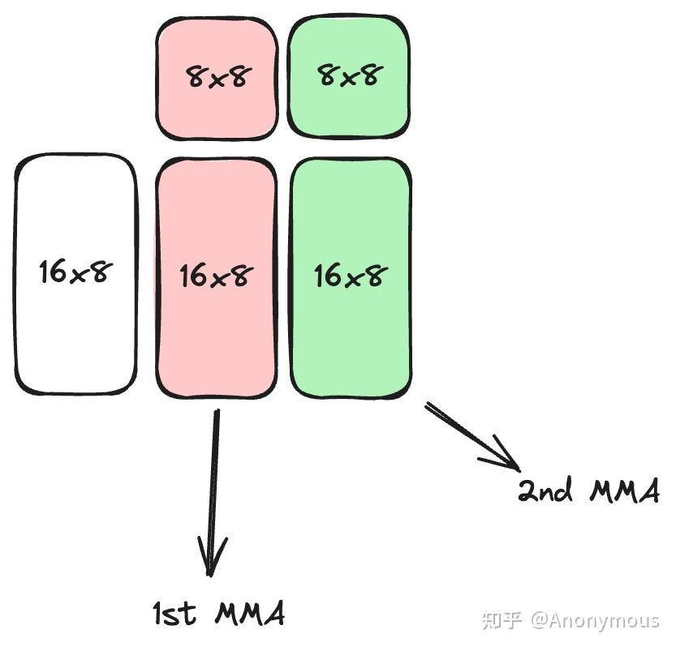

# CUTLASS CuTe GEMM 세부 분석 (1) — ldmatrix 선택

> 원문: https://zhuanlan.zhihu.com/p/702818267

## Prologue

최근 CUTLASS CuTe를 학습하며 여러 글을 읽었지만 여러 의문이 생기고 명확한 답을 인터넷에서 찾기 어려웠습니다. 본 글은 그런 분석 과정을 기록하는 시리즈의 첫 번째로, **TiledMMA와 입력 행렬의 shared memory layout을 기반으로 어떤 Copy Operation(ldmatrix 명령 캡슐화)을 선택해야 shared memory → register 복사를 완성할 수 있는가**를 다룹니다.

실험은 CUTLASS 3.5, A100 (sm_80) 기준.

> 본 글은 CuTe에 대한 일정 이해가 필요. reed 선생의 [CuTe 시리즈](../B09_cute_layout/README.md) 참고 강력 추천.

## 기본 원리

결론부터: **ldmatrix 명령 선택은 두 측면에 의존**.

1. **TiledMMA에서 MMA_Atom의 MNK 크기와 PermutationMNK에 포함된 ValLayoutMNK** 정보가 ldmatrix의 **x1·x2·x4** 결정
2. **shared memory의 입력 행렬 A/B의 layout**이 **transpose 여부** 결정

### TiledMMA

reed 선생 글에서 TiledMMA 구성 시 MMA_Atom을 두 방식으로 확장 — **실행 유닛 확장** vs **반복 계산 확장**. 초기 CUTLASS는 **`ValLayoutMNK`** 템플릿 파라미터로 반복 계산 확장 표현(CUTLASS 3.5에서 `ValLayoutMNK`는 제거되고 `PermutationMNK`에 통합되었지만 원리 분석에는 영향 없음).

`SM80_16x8x8_F16F16F16F16_TN`을 MMA_Operation으로 선택하고 `ValLayoutMNK = (1, 2, 1)`로 N 차원 2배 확장하면, **각 warp이 MNK 16x16x8 행렬 계산**을 완성.

warp 내 16x16x8 계산은 두 단계:

1. **ldmatrix로 입력 행렬 A/B를 warp 내 스레드 레지스터로 로드**
2. **MMA_Atom 2회**로 16x16x8 완성(매번 16x8x8 계산)

첫 단계가 ldmatrix와 관련.

ldmatrix는 8x8 부분 행렬을 1개·여러 개를 한 번에 레지스터로 로드. **x1·x2·x4**가 1·2·4개 부분 행렬 로드. ldmatrix는 매우 유연 — 8x8 부분 행렬 로드 시 **8개 주소만 제공**(8개 행의 시작 주소). **ldmatrix는 이 8개 행이 shared memory에서 연속 저장될 것을 요구하지 않지만, 각 행 내부는 연속이어야 함**.

ldmatrix의 주소 유연성 덕에 **여러 8x8 부분 행렬로 구성되는 더 큰 행렬 분할도 한 번에 로드** 가능. 위 예에서 A는 16x8(2개 8x8), B는 8x16(2개 8x8)이므로 **A·B 모두 x2 ldmatrix로 한 번에 로드 가능**. `make_tiled_copy_A/B` 함수가 TiledMMA의 입력 layout과 Copy_Atom으로부터 각 8x8 부분 행렬의 행 주소를 자동 계산.

x1 ldmatrix로 두 번 로드해도 되지만 **x4 ldmatrix는 사용 불가** — 부분 행렬 수가 4 미만이라 컴파일 시 에러:
> `TiledCopy uses too few vals for selected CopyAtom`

자세한 ldmatrix 설명은 PTX ISA 참고.

### A/B Layout

위에서 "각 행 내부는 연속이어야 함"이라 했는데, 항상 성립할까요? 아닙니다. **shared memory의 A/B가 row-major이면 성립**, **column-major이면 성립하지 않음**.

이를 위해 ldmatrix는 **trans 한정자**를 제공. trans가 붙은 ldmatrix는 로드한 8x8 부분 행렬을 **전치**합니다. 실제로는 8개 **열**의 시작 주소를 제공하면 ldmatrix가 이를 행 주소로 처리해 로드 — trans 없으면 이 부분 행렬이 레지스터에 정확히 **목표 분포의 전치** 형태로 분포. 따라서 trans 한정자를 더해 전치하면 올바른 부분 행렬 형태 획득.

CuTe의 `make_tiled_copy_A/B`가 열 시작 주소 등을 자동 계산해주므로, 우리는 적절한 Copy_Operation만 선택. 원칙:

- 입력 행렬이 shared memory에서 **row-major** → **trans 없는 ldmatrix**(접미사 `_N`)
- 입력 행렬이 **column-major** → **trans 있는 ldmatrix**(접미사 `_T`)

### Swizzle은 어디?

위 시나리오에서 A/B는 shared memory에 저장. GEMM 흐름에서 swizzle 처리도 거치는데 위에서 swizzle이 언급되지 않은 이유는?

A/B의 shared memory 실제 분포는 row/column-major 위에 추가로 swizzle을 적용한 것이지만, **CuTe의 Swizzle 추상이 이 복잡한 매핑을 완벽 가림**. shared → register 복사 처리 시 A/B의 **논리 공간 배열**(row/column-major)만 신경 쓰면 됩니다. 저수준 물리 배열은 무관. reed 선생의 [Swizzle 글](../B14_cute_swizzle/README.md)에 좋은 설명, 후속 글에서도 자세히 다룰 예정.

## 예시

**`SM80_16x8x16_F16F16F16F16_TN`, `ValLayoutMNK = (1, 2, 1)`**: warp 내 A/B 모두 16x16. 16x16은 8x8 4개로 구성 → **x4 ldmatrix 선택**(x2·x1도 가능하나 효율 저하 — 한 명령으로 가능한 작업을 여러 명령으로 나누면 HW 자원 낭비). row-major면 `SM75_U32x4_LDSM_N`, column-major면 `SM75_U16x8_LDSM_T`.

**`SM80_16x8x8_F16F16F16F16_TN`, `ValLayoutMNK = (1, 1, 1)`**: B는 8x8 → x1 ldmatrix만. row-major면 `SM75_U32x1_LDSM_N`, column-major면 `SM75_U16x2_LDSM_T`.

## Epilogue

본 글은 CuTe GEMM 파이프라인에서 shared → register 복사용 ldmatrix 선택 방법을 정리했습니다. 후속 글에서 다룰 주제:

- **Swizzle 추상 이해 및 BMS 설정**
- **Global → Shared 복사에서 cp.async의 데이터 연속성 요구에 따른 TiledCopy 구성**

본 글 결론 검증용 참고 코드: https://github.com/HydraQYH/cutlass_cute_experiments/blob/master/s2r_copy.cu
