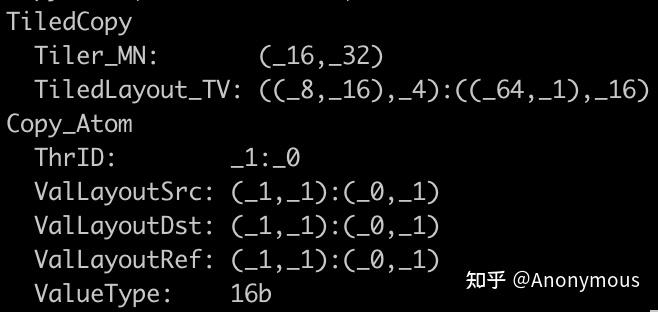
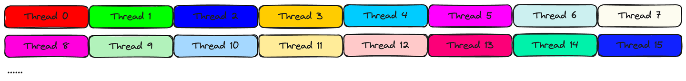

# CUTLASS CuTe GEMM 세부 분석 (2) — TiledCopy와 cp.async

> 원문: https://zhuanlan.zhihu.com/p/703560147

## Prologue

[이전 글](../B24_cute_gemm_analysis_ldmatrix/README.md)에서 shared memory → register 행렬 복사 ldmatrix 명령을 분석했습니다.

파이프라이닝은 메모리 지연을 감추고 HW 자원 활용도를 높이는 최적화 기법. CuTe 기반 GEMM은 SM80의 `cp.async`를 캡슐화·확장한 **TiledCopy**로 global → shared 비동기 복사를 구현. 비동기 복사 중 Tensor Core로 MMA 계산 → 데이터 로드·계산 파이프라인.

본 글은 다른 각도 — **메모리 접근 결합** — 에서 TiledCopy를 깊이 이해해 커널 성능 튜닝에 도움이 되도록 합니다.

## TiledCopy 파라미터 이해

매우 간단한 TiledCopy로 시작:

```cpp
using g2r_copy_op = UniversalCopy<T>;
using g2r_copy_traits = Copy_Traits<g2r_copy_op>;
using g2r_copy_atom = Copy_Atom<g2r_copy_traits, T>;

using G2RCopy = decltype(make_tiled_copy(g2r_copy_atom{},
                    Layout<Shape<_16, _8>, Stride<_8, _1>>{},
                    Layout<Shape<_1, _4>>{}));
print(G2RCopy{})
```

T를 `half_t`로 지정 후 `print`:



**`Tiler_MN`** 과 **`TiledLayout_TV`** 의 의미와 `make_tiled_copy` 인자와의 관계에 집중.

### Tiler_MN

**`Tiler_MN`은 TiledCopy가 한 번의 copy 시 조작하는 Src/Dst Tensor의 Shape**. 즉 Src/Dst Tensor의 Shape가 `Tiler_MN`이면 충분하고 **Stride에 강제 요구는 없음**.

실제 GEMM에서 global memory의 입력 행렬은 row-major이거나 column-major. TiledCopy의 한 copy는 보통 큰 입력 행렬의 작은 분할만 복사. 분할의 Shape가 `Tiler_MN`과 일치하면 **stride 신경 쓸 필요 없이** 한 번에 복사 가능. 분할 layout은 시나리오별로 큰 차이가 있을 수 있음. 예: 4096×4096 행렬에서 row-major면 (16, 64) 분할의 stride는 (4096, 1), column-major면 (1, 4096). 더 복잡한 복합 layout도 가능하지만 — **TiledCopy는 분할의 Shape가 `Tiler_MN`과 일치하면 충분**.

TiledCopy 구성은 **Src/Dst Tensor 정보에 의존하지 않음** — 즉 TiledCopy 구성과 Src/Dst Tensor의 Layout이 **탈결합**. SW 확장성에 긍정적.

`Tiler_MN`은 어떻게 구성? CuTe Layout 대수 이론에 엄격히 의존. 본 글은 Layout 대수로 직접 설명하지 않음(주제에 어긋남) — 공식 튜토리얼 참고. `Tiler_MN`은 `make_tiled_copy`의 **`ThrLayout`**(실행 유닛 차원 Copy_Atom 확장)과 **`ValLayout`**(각 실행 유닛이 복사하는 Tensor 분할 Shape)에 의존.

위 예: Copy_Atom의 "원자 능력" = 1 Thread가 1 원소 복사. ValLayout `(1, 4)` → 실행 유닛이 복사하는 Tensor 분할 (1, 4). ThrLayout (16, 8) → `(1×16, 4×8) = (16, 32)` → TiledCopy 1회 복사 Shape.

세심한 독자는 ThrLayout이 기본 stride가 아닌 `Stride<_8, _1>`임을 발견. 이 stride는 **현재 thread block의 thread와 16x8 실행 유닛 매핑** — `TiledLayout_TV`에도 영향.

### TiledLayout_TV

`Stride<_8, _1>`로 thread 분포 제어 설명:

`Layout<Shape<_16, _8>, Stride<_8, _1>>`는 16x8 실행 유닛이 **row-major** 배열 — Thread ID가 행 방향 연속 증가, 열 방향 stride 8 증가:



그림 2는 처음 16 Thread가 담당할 데이터 분할 — 각 thread가 **`Tiler_MN` 한 행의 연속 4 원소** 담당((1, 4)에서 단순화).

이로써 매 thread가 복사할 구체 Tensor 분할이 정해지지만, 두 문제가 발생:

1. `Tiler_MN` 한 행의 연속 4 원소가 Src/Dst Tensor에서 **불연속**일 수 있어 성능 문제 가능
2. `TiledLayout_TV`의 의미는?

먼저 두 번째.

`TiledLayout_TV`는 복합 Layout. Layout의 본질은 매핑 — 정수 좌표를 스칼라 offset으로 변환. **`TiledLayout_TV`의 의미: Thread ID와 그 Thread가 담당할 분할 내 어떤 원소의 좌표가 주어지면, `Tiler_MN`에서의 좌표를 반환**.

잠깐, Layout 출력은 스칼라 offset 아닌가? CuTe Layout 공식 문서에서 설명: 스칼라는 Shape 각 차원 크기에 따라 좌표로 변환 가능. Shape (3, 3)에 5가 주어지면 (2, 1)로 변환.

구체 예: `TiledLayout_TV`가 `((8, 16), 4):((64, 1), 16)`. ID 9 Thread의 분할 내 좌표 (0, 2) 원소가 `Tiler_MN`의 어느 좌표에?

1. Thread ID 9를 Shape (8, 16) 좌표로: (1, 1). 좌표 (0, 2)는 Shape (1, 4)의 좌표 — (4,)로 단순화 → (2,). 입력 좌표: ((1, 1), 2)
2. offset = `1 × 64 + 1 × 1 + 2 × 16 = 97`(좌표 × stride 합)
3. 97을 Shape (16, 32) 좌표로: (1, 6) — `Tiler_MN`의 (1, 6)

즉 Thread 9의 분할 내 (0, 2) 원소는 `Tiler_MN`의 (1, 6). 실은 Thread 9가 `Tiler_MN`의 (1, 4:8) 분할 담당.

Layout은 복잡한 Tensor 원소 분포뿐 아니라 **여러 정의역을 통합해 더 복잡한 매핑**도 표현 가능. CuTe의 핵심은 Layout과 그 대수이지만, 실제로는 Layout 대수 세부에 너무 매달리지 않아도 됩니다.

## 메모리 접근 연속성

위 내용으로 두 가지 명확:

1. TiledCopy는 Shape가 `Tiler_MN`인 Tensor 분할을 복사. 이 분할은 임의의 stride 가능
2. **Shape가 `Tiler_MN`인 Tensor 분할은 추가로 분할되어 다른 Thread가 복사 담당. 이 추가 분할과 Thread 매핑은 TiledCopy 정의 시 결정되며 Src/Dst Tensor의 Layout 변화와 무관**

따라서 **메모리 접근 연속성**에 주의 필요. 위 예에서 TiledCopy는 (16, 32) Tensor 분할 복사. 8 연속 Thread가 한 행의 32 원소 복사, 각 Thread가 4 원소.

복사 분할은 보통 더 큰 Tensor의 부분. Tensor가 4096×4096 row-major면 각 (16, 32) 분할의 stride는 (4096, 1). 128 thread 중 8 thread마다 32 연속 원소 접근, 각 thread가 4 연속 원소 — **벡터화 SASS 명령** 사용 가능:

```
(_16,_32):(_4096,_1)
          0       1       2       3       4       5       6       7
    +-------+-------+-------+-------+-------+-------+-------+-------+
 0  |     0 |     1 |     2 |     3 |     4 |     5 |     6 |     7 | ...
    +-------+-------+-------+-------+-------+-------+-------+-------+
 1  |  4096 |  4097 |  4098 |  4099 |  4100 |  4101 |  4102 |  4103 | ...
    +-------+-------+-------+-------+-------+-------+-------+-------+
 2  |  8192 |  8193 |  8194 |  8195 |  ...
    +-------
```

column-major(stride (1, 4096))이면 상황 악화:

```
(_16,_32):(_1,_4096)
           0        1        2        3        4
    +--------+--------+--------+--------+--------+
 0  |      0 |   4096 |   8192 |  12288 |  ...
    +--------+--------+--------+--------+--------+
 1  |      1 |   4097 |   8193 |  12289 |  ...
    +--------+--------+--------+--------+--------+
 2  |      2 |   4098 |   8194 |  ...
    +--------+--------+--------+--------+--------+
 3  |      3 |   4099 |   ...
    +--------
```

이때 thread 내 4 원소가 주소상 불연속, 이웃 8 thread 접근 주소도 불연속. warp 내 유일한 연속성 — **간격 8 thread가 인접 원소 접근**(thread 0, 8, 16, 24가 offset 0, 1, 2, 3 접근).

column-major에는 위 TiledCopy의 **"전치 형태"** 사용 권장:

```cpp
using g2r_copy_op = UniversalCopy<T>;
using g2r_copy_traits = Copy_Traits<g2r_copy_op>;
using g2r_copy_atom = Copy_Atom<g2r_copy_traits, T>;

using G2RCopy = decltype(make_tiled_copy(g2r_copy_atom{},
                    Layout<Shape<_8, _16>, Stride<_1, _8>>{},
                    Layout<Shape<_4, _1>>{}));
```

연속성 분석은 독자에게 맡깁니다.

## cp.async

reed 선생의 [GEMM 파이프라인](../B21_cute_gemm_pipeline/README.md)에 `cp.async` 사용법이 자세하므로 여기선 생략. 본 절은 **`cp.async` 기반 TiledCopy 구성**을 다룹니다.

```cpp
using g2s_copy_op = SM80_CP_ASYNC_CACHEGLOBAL<cute::uint128_t>;
using g2s_copy_traits = Copy_Traits<g2s_copy_op>;
using g2s_copy_atom = Copy_Atom<g2s_copy_traits, half_t>;

using G2SCopyA = decltype(make_tiled_copy(g2s_copy_atom{},
                    make_layout(make_shape(Int<16>{}, Int<8>{}),
                                make_stride(Int<8>{}, Int<1>{})),
                    make_layout(make_shape(Int<1>{}, Int<8>{}))));  // Copy Tile: (16, 64)
```

### ValLayout 선택

Copy_Atom의 원소 타입을 `half_t`로 지정. 벡터화 `cp.async`는 128bit(=8개 `half_t`) 벡터 복사이므로, **Copy_Atom의 원자 능력은 1 Thread가 1 원소가 아닌 1 Thread가 8 원소 복사**.

`make_tiled_copy` 호출 시 **`ValLayout`의 size는 8의 정수배**여야 함. (1, 8)·(2, 4)·(1, 16) 모두 합법 — 1 Thread가 한 번 또는 여러 번의 Copy_Atom 원자 능력으로 복사 완성.

### Src/Dst Tensor Layout 제약

TiledCopy 구성은 Src/Dst Tensor Layout에 의존하지 않지만, 벡터화 `cp.async`는 **주소 연속 16B(128bit) 벡터** 복사이므로 Src/Dst Tensor Layout에 일부 제약.

위 예에서 각 Thread는 (1, 8) Tensor 분할 복사. Src/Dst Tensor에서 이 (1, 8)의 원소들이 **연속**이어야 함 — Shape 8인 차원의 stride가 1이어야 함, 그렇지 않으면 에러. 따라서 **이 TiledCopy는 보통 row-major 분할 복사용** — (16, 64) 분할이 (1, 8) 부분으로 더 분할될 때 행 방향 연속.

column-major 분할에 사용하면 컴파일 에러:
> `Copy_Traits: src failed to vectorize into registers. Layout is incompatible with this CopyOp.`

column-major에는 "전치 버전":

```cpp
using G2SCopyA = decltype(make_tiled_copy(g2s_copy_atom{},
                    make_layout(make_shape(Int<16>{}, Int<8>{}),
                                make_stride(Int<1>{}, Int<16>{})),
                    make_layout(make_shape(Int<8>{}, Int<1>{}))));  // Copy Tile: (128, 8)
```

더 복잡한 layout, 예: 128bit 벡터화 `cp.async`로 (2, 4) Tensor 분할 복사 시 — Src/Dst의 (2, 4) 분할이 **완전 연속**이어야 함. Stride (1, 2) 또는 (4, 1)이어야 함. 그렇지 않으면 벡터화 `cp.async`와 비호환.

참고 코드: https://github.com/HydraQYH/cutlass_cute_experiments/blob/master/g2s_copy.cu

### 메모리 연속성 간략 분석

위 예제: 128 thread 중 **8 연속 thread가 64 `half_t` 원소 접근**, 각 thread는 128bit 벡터로 8 원소 접근. 8 thread가 합쳐 **128B 연속 = GPU Cache Line 크기와 정확히 일치**. warp 단위로 보면 `cp.async` 한 번 실행에 **4 Cache Line 접근** — 중복 없음. **HBM/L2 대역폭 효과적 활용**.

다음 TiledCopy로 바꾸면:

```cpp
using G2SCopyA = decltype(make_tiled_copy(g2s_copy_atom{},
                    make_layout(make_shape(Int<32>{}, Int<4>{}),
                                make_stride(Int<4>{}, Int<1>{})),
                    make_layout(make_shape(Int<1>{}, Int<8>{}))));
```

128 thread 중 4 연속 thread가 32 `half_t`(64B) 접근 — **Cache Line 절반**. L2 → L1/Shared 데이터 전송 단위가 Cache Line이므로 **L2 대역폭 절반 낭비** — 성능 문제 가능.

## Epilogue

본 글은 파라미터 의미와 메모리 연속성 두 측면에서 TiledCopy를 분석했습니다. 지금까지 global → shared와 shared → register copy 추상을 다뤘고, 중간 저장소인 Shared Memory의 Layout 추상은 두 과정 모두에 중요. 후속 글에서 **Swizzle 추상과 파라미터 설정**을 다룹니다.
