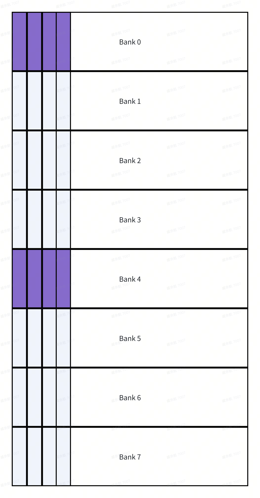
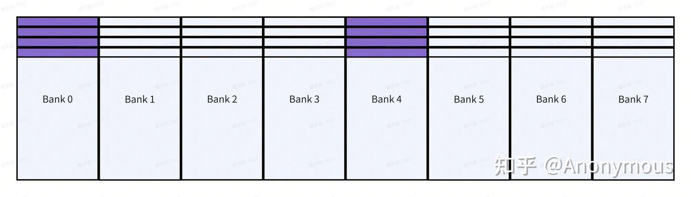
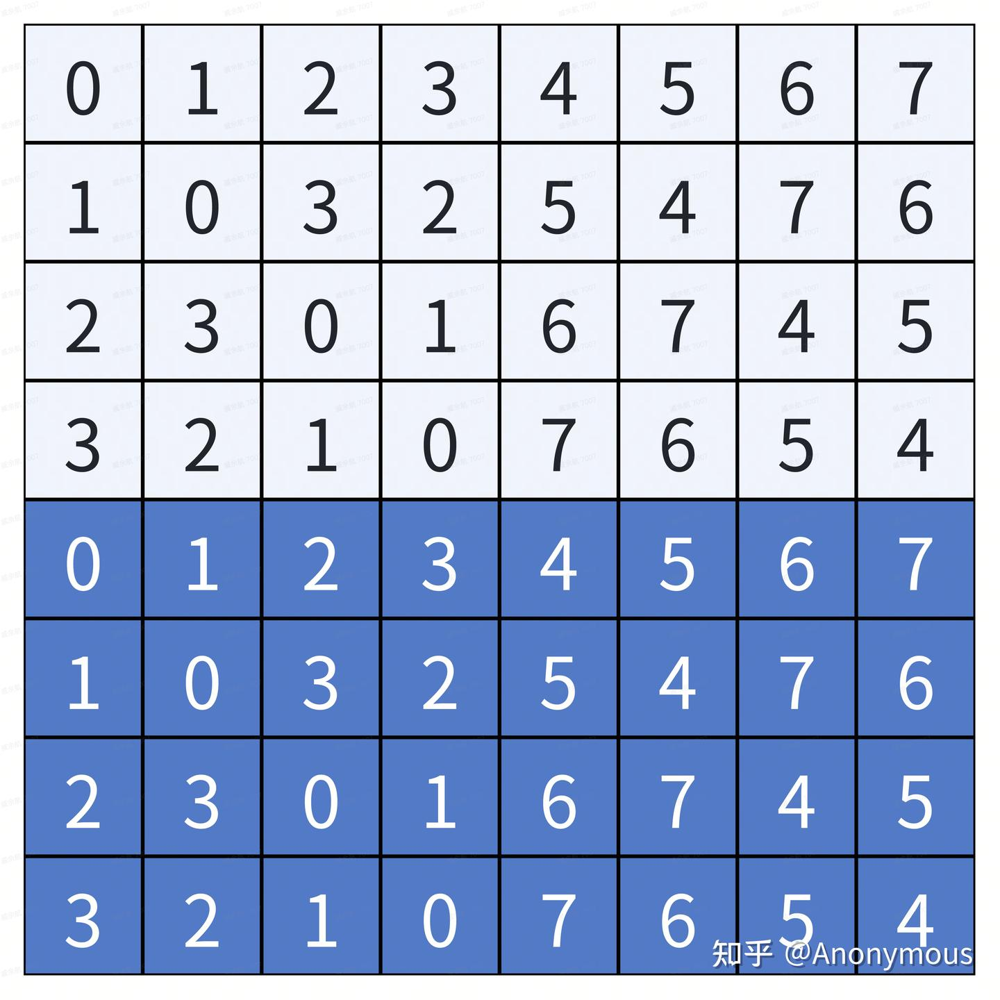
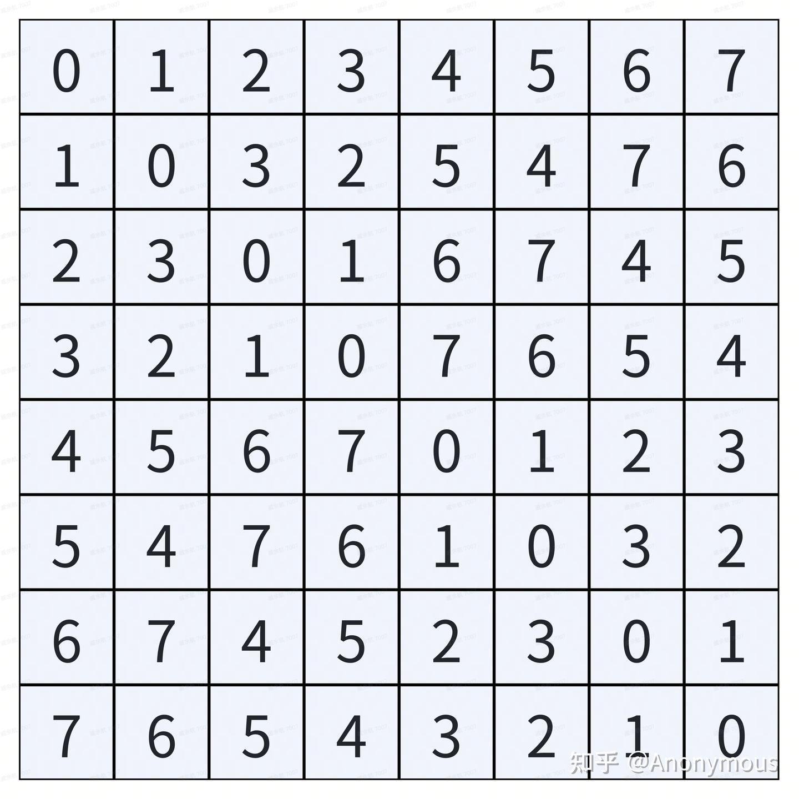
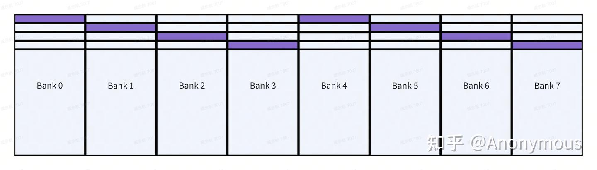
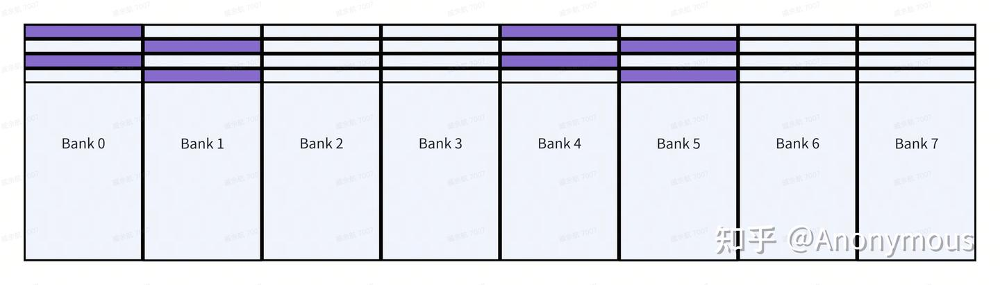
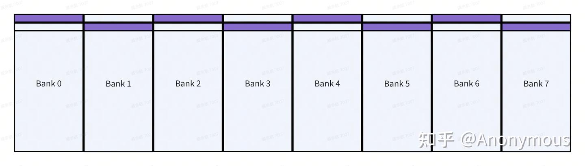

# CUTLASS CuTe GEMM 세부 분석 (3) — Swizzle\<B, M, S\> 템플릿 파라미터 값

> 원문: https://zhuanlan.zhihu.com/p/713713957

## Notice

본 글의 후속편이 발표되었습니다.


《CUTLASS CuTe GEMM 세부 분석 (4) — Swizzle 템플릿 파라미터의 B와 S에 대한 오해》

## Prologue

Swizzle 원리에 대한 기술 블로그는 인터넷에 많이 있습니다. 대부분이 **고정된 shared memory 논리 layout과 고정된 BMS 파라미터** 예로, 이 BMS가 어떻게 논리 layout을 bank conflict 없는 물리 layout으로 변환하는지 분석합니다. 초학자 관점에서 자연스럽게 떠오르는 질문: **새로운 shared memory 논리 layout을 만났을 때 BMS 파라미터를 어떻게 선택해야 하나?** 이에 대한 답은 잘 보이지 않으니, 본 글에서 개인의 사고와 이해를 공유합니다.

> 본 글은 Swizzle 기본 원리에 대한 일정 이해 필요. reed 선생의 [CuTe 시리즈](../B14_cute_swizzle/README.md) 참고.

## Swizzle\<B, M, S\>

널리 쓰이는 shared memory 논리 layout인 **`(8, 32):(32, 1)`** 을 예로 M, S, B를 단계별로 결정합니다.

### M & S

저는 Swizzle 템플릿 파라미터의 **M과 S가 PTX 명령 ldmatrix와 GPU 공유 메모리 다중 bank 구조와 깊이 관련**된다고 봅니다.

이전 글에서 `ldmatrix`가 warp 단위로 shared memory에서 1개 또는 여러 개의 8×8 부분 행렬을 warp threads의 레지스터로 로드한다는 점을 알았습니다. 참조 layout `(8, 32):(32, 1)`이 row-major이므로 row-major 8×8 부분 행렬을 예로 합니다. **row-major 8×8에서 `ldmatrix`는 한 행의 8 원소를 한 그룹**으로 보고 8x8을 8 그룹으로 분할 — 각 그룹은 shared memory에서 **연속 주소 공간을 차지**하지만 **다른 그룹 간은 연속 불요**.

한 행의 8 원소를 **하나의 새 "원소"로** 보면, ldmatrix를 더 단순화 — 1회 또는 여러 회 로드, 매번 8개 "원소" 로드, 이 "원소"가 shared memory에 위치.

새 "원소" = 8 기본 원소(half/bfloat16) = 16B. 16B는 shared memory의 4 bank를 차지하므로 32 bank가 8 "원소" 병렬 접근 능력 제공.

이제 shared memory 다중 bank 구조도 단순화 — **8개 "Bank"**, 각 "Bank" 폭이 한 "원소" 수용, 8 "Bank"가 8 "원소" 병렬 접근 능력 제공.

이제 Swizzle 작업 목표가 더 명확: **ldmatrix가 한 번 로드 시 매번 8 "원소" 로드, 이 "원소"는 8 "bank" shared memory에 분포 — 매 ldmatrix가 bank conflict 없이 8 "원소" 병렬 로드되도록 layout 배치 방법 찾기**.

Swizzle 템플릿 파라미터 M·S가 위 단순화를 표현:

- **M**: **새 "원소" = $2^M$ 기본 원소** — 위에서 M = 3 (8 기본 원소 = half/bfloat16)
- **S**: **새 "원소" 크기 결정 후, shared memory가 몇 길 병렬 접근 능력 제공할 수 있는가 = $2^S$ 새 "Bank"** — 위에서 S = 3 (8 새 "bank")

참조 layout `(8, 32):(32, 1)`을 새 "원소" 시각으로 단순화 → `(8, 4):(4, 1)`. 8 "Bank" shared memory에 배치 시 새 "원소" ↔ 새 "Bank" 매핑(그림 1):



단순화 layout이 4 열뿐이고 shared memory는 8 "Bank"이므로, 첫 행은 "Bank" 0~3, 둘째 행은 4~7, ...

ldmatrix가 매번 로드하는 8 "원소"는 단순화 layout의 **한 열**. 첫 열 예 — 자주색 부분은 "Bank" 0과 4 차지, 각 "Bank"가 첫 열의 4 "원소" 포함. 명백히 **4-way bank conflict**. Swizzle 파라미터 B가 **bank conflict 회피를 위한 행 수**를 지정.

### B

S(새 "bank" 수)를 결정 후, Swizzle 파라미터 B는 **$2^B$ 행을 기본 단위로 Swizzle 재매핑**.

위 예의 8 "bank"에서 B = 2면 그림 2:



Swizzle이 $2^2 = 4$ 행 단위 — 후 4행과 전 4행 재매핑 관계 동일.

B = 3이면 고전 Swizzle 매핑(그림 3):



B 값에는 제약 — **$B \leq S$**. $B > S$면? 현재 "bank" 수가 $2^S$, 최대 "bank" 번호 $(2^S - 1)$. $(2^S - 1)$보다 큰 행 번호와 $(2^S - 1)$ 이하 "bank" 번호의 XOR 결과는 반드시 $(2^S - 1)$ 초과 — 결과의 상위 비트가 0이 아니므로. CUTLASS는 컴파일 시 검사:

```cpp
static_assert(abs(num_shft) >= num_bits,
              "abs(SShift) must be more than BBits.");  // S >= B
```

위 4-way bank conflict 사례에 B = 2 지정, 4행 단위 Swizzle 재매핑(그림 4):



이제 임의 열 접근 시 bank conflict 없음. B = 1로 2행 단위 재매핑하면 4-way는 회피하지만 **2-way bank conflict 잔존**(그림 5):



명백히 **B = 2면 충분**. 인터넷의 많은 블로그가 `(8, 32):(32, 1)`에 `Swizzle<3, 3, 3>`을 사용하는데, 이 layout은 새 shared memory 배치의 4 행만 차지하므로 **`Swizzle<3, 3, 3>`과 `Swizzle<2, 3, 3>` 결과가 완전 동일**(앞 4 행 재매핑 동일). $B \geq 2$이면 충분하지만, 본 글의 단순화 추상 모델에서는 **`Swizzle<2, 3, 3>`이 더 직관적**.

다른 layout도 이 단순화 모델로 \<B, M, S\> 추정 가능. 예:

- `(8, 64):(64, 1)` 또는 col-major `(64, 8):(1, 64)` → **`Swizzle<3, 3, 3>` 외 선택지 없음**(8-way conflict 회피)
- `(8, 16):(16, 1)` → **`Swizzle<1, 3, 3>`**으로 충분(그림 6)



`Swizzle<2, 3, 3>`·`Swizzle<3, 3, 3>`도 동일 효과지만 `Swizzle<1, 3, 3>`이 가장 직관적.

## Epilogue

본 글은 CUTLASS CuTe에서 Swizzle\<B, M, S\> 파라미터 선택법을 자세히 다뤘습니다. 본 방법은 확장성이 강해 다른 layout은 물론 다른 mma + ldmatrix 조합에도 적응 가능. 미래에 SM90+ 아키텍처의 CuTe 프로그래밍 모델도 분석할 예정.
