# TensorRT-LLM의 Hopper Mixed GEMM의 CUTLASS 3.x 구현 강의 학습 노트

> 원문: https://zhuanlan.zhihu.com/p/714378343

> 본 강의는 CUTLASS 3.x 스타일 코드로 Hopper에서 입력이 **FPA + INTB 혼합 정밀도** 행렬 곱을 구현하는 방법을 다룹니다. 내용: (1) CuTe로 데이터 전송, (2) FPA + INTB 행렬 곱 사례. 슬라이드는 BiliBili NVIDIA 채널의 《TensorRT-LLM의 Hopper Mixed GEMM의 CUTLASS 3.x 구현 강의》에서 가져왔으며, 각 슬라이드 요점을 자세히 기록했습니다.

## 개요·목차

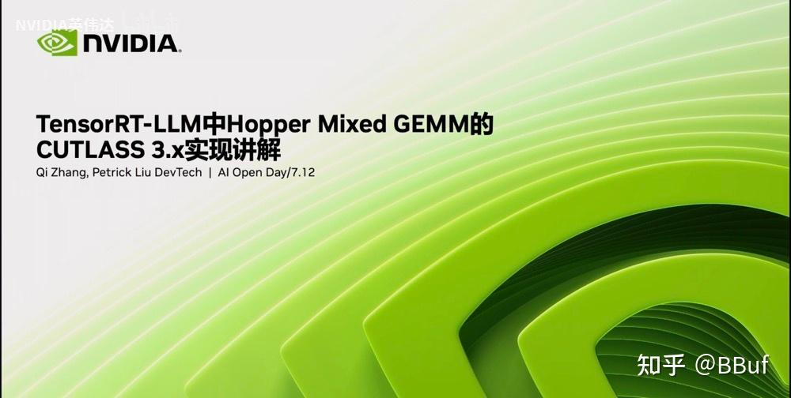

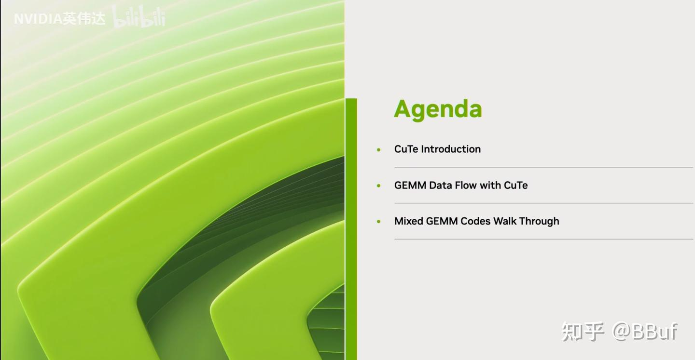

세 부분으로 구성: (1) **CuTe 소개** (2) GEMM 데이터 전송 예 (3) **Mixed GEMM의 CUTLASS 3.x 구현** 워크스루. CUTLASS 3.x 저수준에서는 데이터 계층 관리·실제 GEMM 수행에 CuTe API가 대량 사용되므로 CuTe 소개부터 시작.

## CuTe 소개

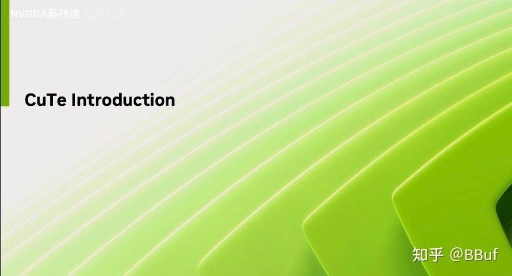

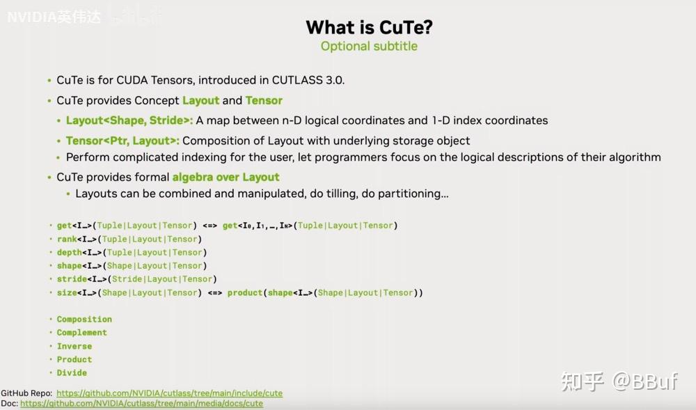

CuTe는 CUDA Tensor 계산 관리 툴 라이브러리. 핵심 개념은 **Layout**과 **Tensor**. Layout은 **Shape + Stride**로 구성되며, **N차원 논리 좌표를 1차원 연속 인덱스로 매핑하는 함수**로 이해. Layout이 있으면 메모리 포인터를 Tensor 템플릿 파라미터로 전달해 진정한 Tensor 구성. 같은 메모리 포인터에 다른 Layout을 주면 다른 시각의 Tensor — CuTe의 큰 유연성, 복잡한 인덱싱 처리 가능.

CuTe는 Layout에 대한 형식 대수 연산 제공: 조합·조작·평탄화·분할 등. 기본 변환 API: `get`, `rank`, `depth`, `shape`, `stride`, `size` 등. 기타 개념: Composition, Complement, Inverse, Product, Divide. 자세한 내용은 CuTe 공식 문서.

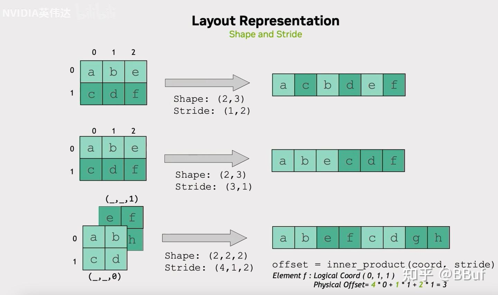

CUDA Tensor 연산에서 Layout 표현 방법(Shape & Stride):

- **예 1**: Shape `(2, 3)`, Stride `(1, 2)` — 2x3 행렬을 row-major로 메모리 저장
- **예 2**: Shape `(2, 3)`, Stride `(3, 1)` — 같은 2x3을 col-major로
- **예 3**: Shape `(2, 2, 2)`, Stride `(4, 1, 2)` — 3D 배열 Layout

오프셋 계산: `offset = inner_product(coord, stride)`. 예: 원소 f의 논리 좌표 (0, 1, 1) → `0×4 + 1×1 + 1×2 = 3`.

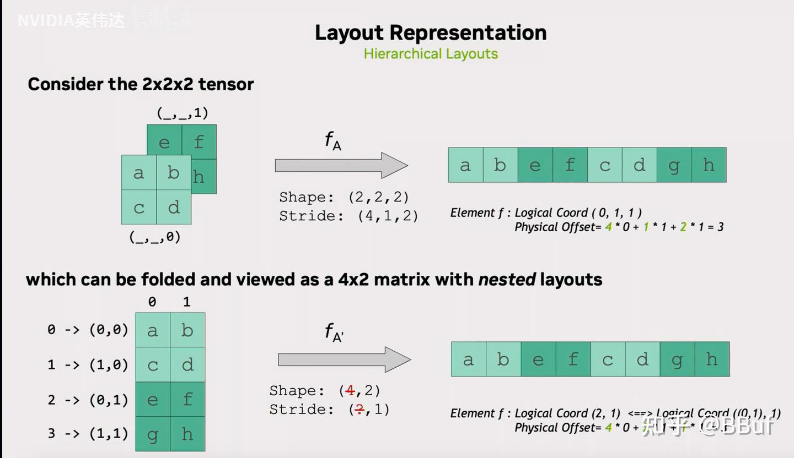

3차원 예를 두 2x2 행렬로 보고 뒤 행렬을 앞 행렬 아래로 두면 4x2 2D 행렬. shape는 4x2지만 4로 직접 쓰면 안 됨 — ac/ce/eg 거리가 일정하지 않음. a-c, e-g 거리는 4, a-e, c-g 거리는 2. **중첩 표현** 필요.

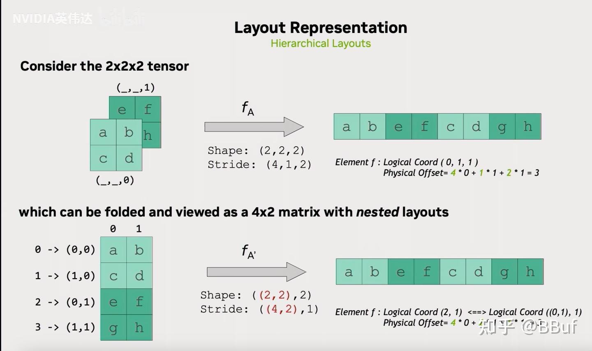

이 4x2의 첫 차원 Shape를 `(2, 2)`, Stride를 `(4, 2)`로. 슬라이드 좌하단처럼 수평 방향 각 원소가 2 자식 원소를 가지며 자식 원소 간 거리 4, z 방향 두 번 반복(거리 2). **중첩 형태로 더 복잡한 Layout 표현**.

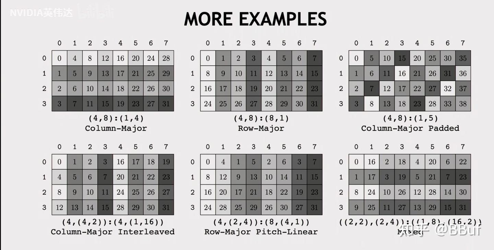

다양한 Layout:

- **Column-Major**: shape (4, 8), stride (1, 4) — 열별 연속
- **Row-Major**: stride (8, 1) — 행별 연속
- **Column-Major Padded**: stride (1, 5) — col-major + 열 간 패딩
- **Column-Major Interleaved**: shape (4, (4, 2)), stride (4, (1, 16)) — 2x2 작은 블록 단위 col-major
- **Row-Major Pitch-Linear**: shape (4, (2, 4)), stride (8, (4, 1)) — row-major + 행 간 간격
- **Mixed**: shape ((2, 2), (2, 4)), stride ((1, 8), (16, 2)) — 복잡한 중첩

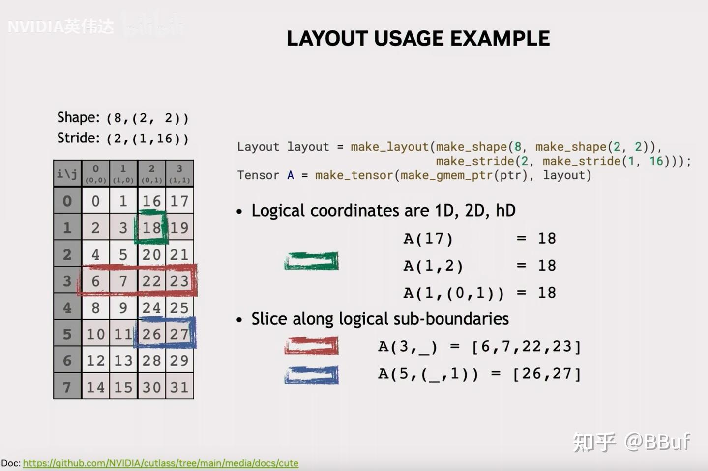

CuTe Layout 사용 예. shape `(8, (2, 2))`, stride `(2, (1, 16))`. `make_layout`·`make_tensor`로 생성. 8x4 행렬 도시.

논리 좌표는 1D, 2D, hD(고차원). 접근 예:

- `A(17) = 18`
- `A(1, 2) = 18`
- `A(1, (0, 1)) = 18`

논리 서브 경계로 슬라이스:

- `A(3, _) = [6, 7, 22, 23]`
- `A(5, (_, 1)) = [26, 27]`

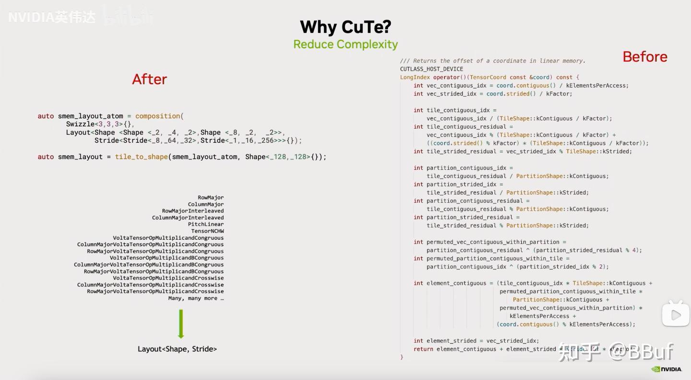

CuTe가 왜 필요한가? CUTLASS 2.x에서는 주소 변환 구현에 우측의 많은 코드가 필요했지만, CuTe는 좌측 몇 줄로 끝. 또 2.x에서는 각 Layout마다 자체 구현이 필요했으나 이제 Shape·Stride만으로 임의 Layout 획득.

## CuTe로 GEMM 데이터 흐름

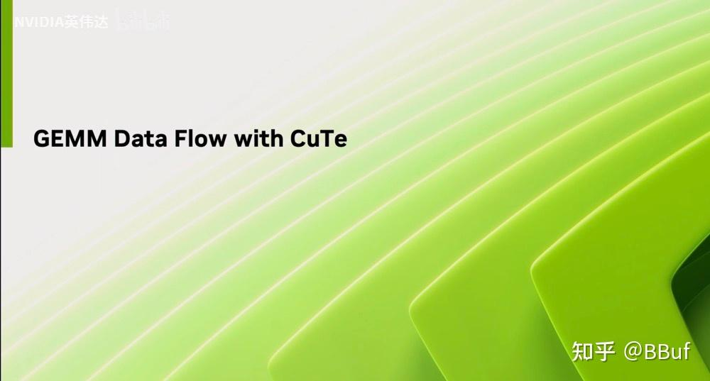

GEMM에서 CuTe로 데이터 전송하는 방법.

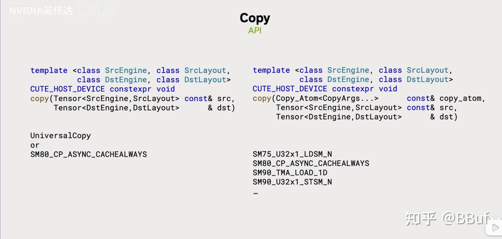

먼저 **Copy API**. 좌측 API는 단순 — src·dst Tensor 전달로 자동 데이터 복사(`UniversalCopy` 또는 `SM80_CP_ASYNC_CACHEALWAYS` 자동 선택). 우측 API는 첫 인자에 **`copy_atom`** 명시 지정 — CuTe가 다양한 아키텍처의 데이터 전송 명령을 캡슐화한 것. 더 좋은 성능을 원하면 우측 권장. Copy 대상이 모두 Tensor이므로 **신기한 Layout으로 단순 복사 외 변환 효과**도 가능.

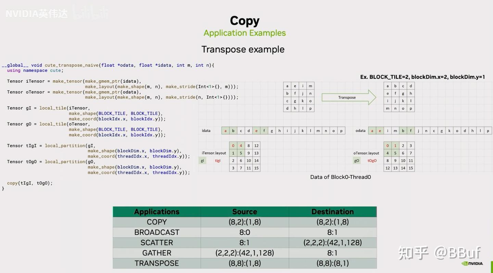

Copy로 행렬 전치를 구현하는 단순 예(최적 구현은 아님). 우상단 두 그림은 논리·물리 관점의 전치 — 물리적으로 `abcd... → aeim...` 순서. iTensor·oTensor의 shape는 같지만 iTensor를 **col-major로 읽어들이고**(stride `(1, m)`) **row-major로 출력**(stride `(n, 1)`)하면 전치 효과.

`local_tile`로 각 Block에 영역 할당, `local_partition`으로 Block 내 각 Thread에 영역 할당. 슬라이드 하단 표는 Layout으로 COPY·BROADCAST·GATHER 등 가능 — **거의 코드 변경 없이 Layout만 바꾸면 됨**.

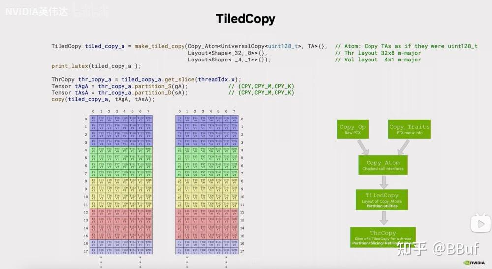

**TiledCopy**는 Tile 단위 Copy 시 source/dest tensor 구성에 사용. `make_tiled_copy` 첫 인자: Copy_Atom, 둘째: Dest Tensor의 Stride Layout, 셋째: Dest Tensor의 Value Layout.

Value Layout 이해는 어려움. `print_latex`로 출력해보면 좌측 그림은 각 thread가 Source Tensor에서 읽을 데이터, 우측은 Dest Tensor에서 쓸 데이터.

32x8은 M 방향 32 thread, K 방향 8 thread. Value Layout 4x1은 M에서 4 연속 데이터, K에서 1. 따라서 기본 Copy 단위는 `(32×4, 8×1) = (128, 8)`.

`get_slice`로 thread 번호 전달 → ThreadCopy → `partition_S`/`partition_D` → 현재 thread가 담당할 Source/Dest Tensor 데이터. Shape는 `(CPY, CPY_M, CPY_K)`. CPY는 128x8 Tile 크기, CPY_M/CPY_K는 M/K 방향 반복 횟수.

우측 그림은 TiledCopy 캡슐화 계층:

- 최저층: `Copy_Op`(PTX 코드) + `Copy_Traits`(메타 정보)
- → `Copy_Atom`
- → `TiledCopy`
- → `get_slice` → `ThreadCopy`로 분할

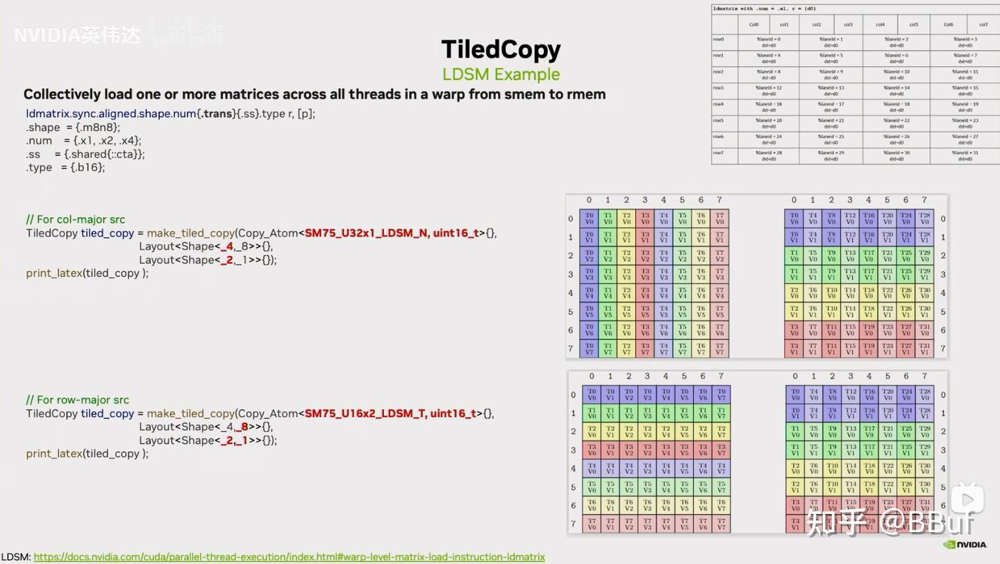

TiledCopy의 Thread Layout·Value Layout 설정은 Copy_Atom 명령과 연관. **LDSM(`ld.matrix`)** 예. warp 단위로 1/2/4개 8x8 행렬 로드. Trans·non-Trans 두 형태. CuTe는 `LDSM_N`(non-Trans), `LDSM_T`(Trans) 후속.

- **non-Trans**: Source Thread가 한 열의 연속 데이터 읽기, Dest Thread가 한 열에서 2 원소
- **Trans**: Source Thread가 8 연속 원소, Dest는 그 8 원소가 8개 다른 thread에 분배

non-Trans 사용 시 Layout은 col-major, Trans는 row-major Source 필요.

Stride/Value Layout: warp 레벨이므로 thread 수는 32의 배수. non-Trans의 경우 Dest Tensor는 M에서 4 thread가 8 연속 데이터 담당 → Thread Layout이 4의 배수, M에서 2 연속 데이터.

Trans의 경우 K 차원에서 thread는 8의 배수, K 방향 Value Layout은 1, M 방향 Value Layout은 2(2개 비연속 데이터).

> TiledCopy가 헷갈리면 reed 선생의 [tiled copy 글](../B03_cute_tiled_copy/README.md) 학습 권장.

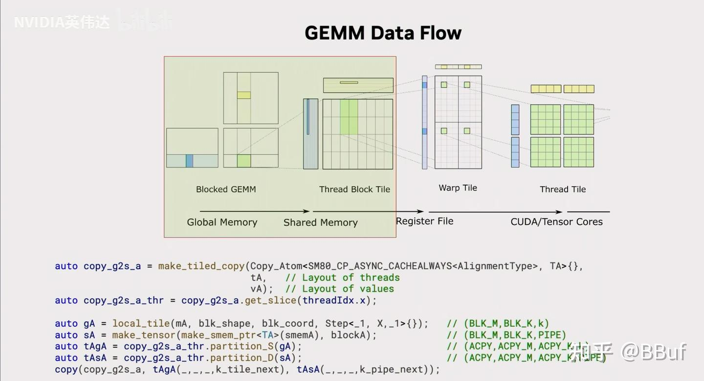

GEMM 데이터 전송. 행렬 A 예로 **global → shared** 전송:

1. `make_tiled_copy`로 Tiled Copy 구성, `get_slice`로 Thread Copy 획득
2. Source Tensor 구성: global memory의 `mA`. Block 단위 Shared로 복사 → `local_tile` 사용. 첫 인자 `mA`, Block Shape/Thread, Step `<_1, X, _1>{}` (CUTLASS는 Block을 M, N, K 3차원으로 작성, A는 N 차원 없으므로 X)
3. `gA` Shape: `(BLK_M, BLK_K, k)` — k는 Tile 수
4. Dest Tensor는 shared이므로 `make_tensor`로 직접 구성
5. Thread Copy로 `partition_S`·`partition_D` → 현재 thread 영역. `partition_S` Shape: `(ACPY, ACPY_M, ACPY_K, k)`. Dest는 마지막 차원이 k 대신 PIPE(파이프라인 stage 수)

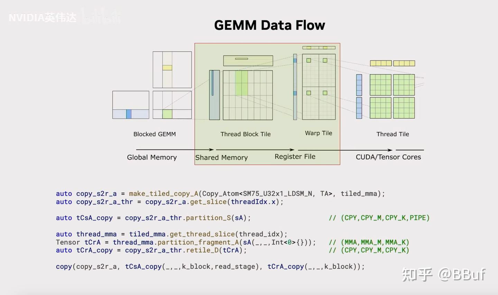

**Shared → Register** 복사. RF는 MMA에 직접 사용되므로 데이터 배열을 자유롭게 설정 불가. CuTe의 **`make_tiled_copy_A`** API로 Tiled Copy 구성 — Thread Layout·Value Layout 설정 불요, **MMA용 `tile_mma`만 전달**하면 자동 계산. Source는 RF 무관이므로 `partition_S`로 충분. Dest는 MMA 관련이므로 `get_thread_slice`로 `thread_mma` 획득 후 `partition_fragment_A`로 MMA 시각의 Thread 담당 Tensor 획득. 마지막으로 `retile_D`로 Copy 시각의 Tensor 획득.

## Mixed GEMM 워크스루

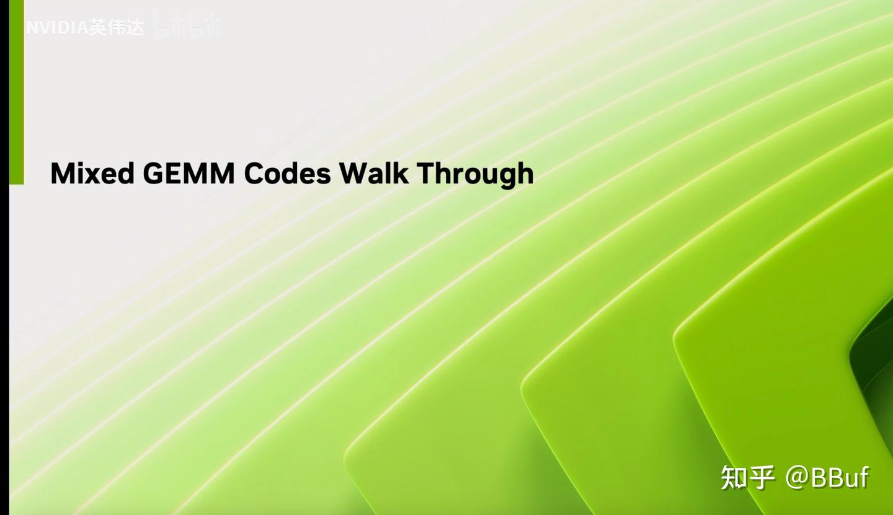

이 부분은 Concept 레벨에서 CuTe + 《TensorRT-LLM의 Quantization GEMM(Ampere Mixed GEMM) CUTLASS 2.x 구현 강의》의 Fast Convert를 조합.

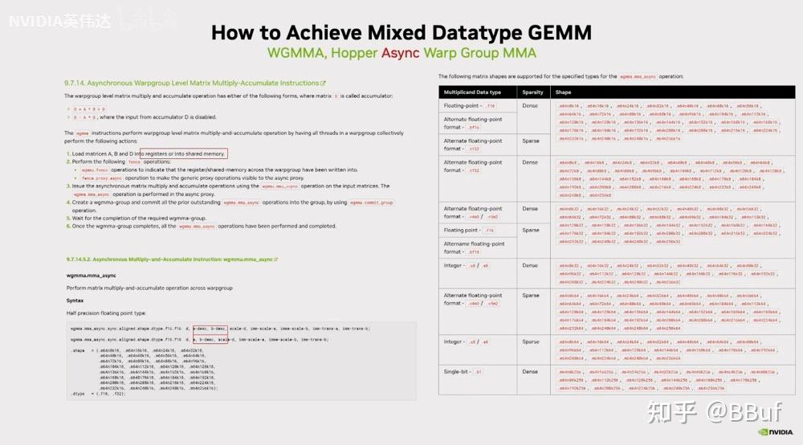

Hopper의 WGMMA PTX. CUTLASS 2.x의 Ampere Tensor Core는 **동기**(A·B·C 입출력 모두 레지스터, 동기 명령 발사). Hopper는 **비동기**가 되어 Shared Memory에서 A·B 직접 수신 가능. Hopper에도 FP8·FP16 직접 계산 명령은 없으므로(FP8 명령 외) — **Mixed**: 데이터 읽고 Conversion. weight를 행렬 A 위치, 읽고 변환해 레지스터 보관, 원래 A를 행렬 B 위치에 두고 직접 읽기.

이 슬라이드는 **Hopper의 비동기 Warp Group MMA 실행 방법**:

- 두 기본 동작: D를 입력·accumulator로 쓰지 않는 경우 vs 일반 곱·누적
- 6단계: A·B·D를 RF/SMEM 로드 → fence(`wmma.fence`로 warp group 가시성 보장) → `fence.proxy.async`(비동기 proxy 가시성) → `wmma.mma_async` 발사 → `wmma.commit_group` → `wmma.wait_group` → 완료
- 지원 형상: 16x16x16, 32x8x16 등

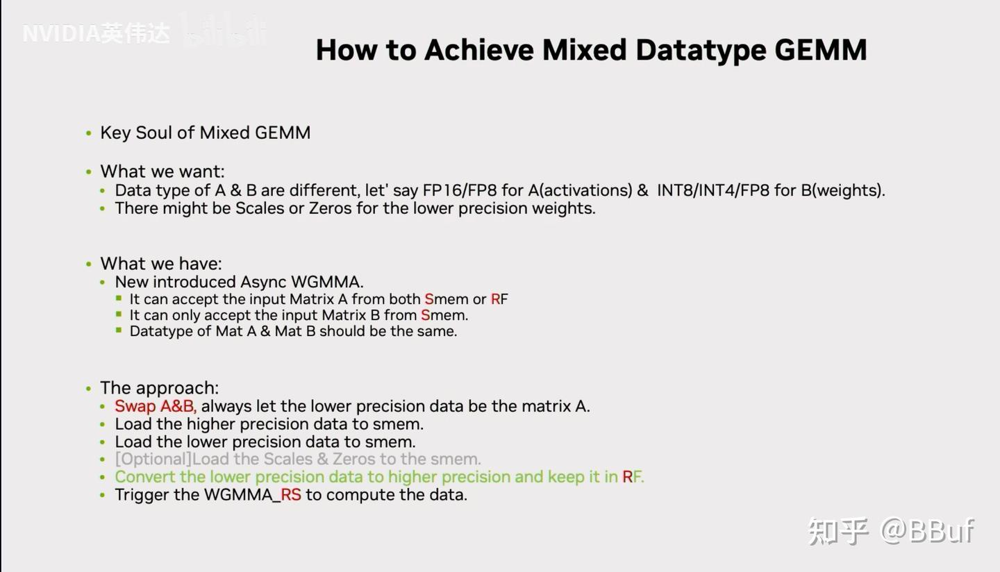

Mixed GEMM 구현:

- **원하는 것**: A(activation)는 FP16/FP8, B(weight)는 INT8/INT4/FP8. 저정밀 weight는 scale/zero point 가능
- **있는 것**: 새 비동기 WGMMA — A는 SMEM/RF 수용, **B는 SMEM만 수용**, A·B 데이터 타입 동일
- **방법**:
  - **A와 B 교환** — 저정밀 데이터를 항상 A 위치에
  - 고정밀 데이터를 SMEM에 로드(Conversion 불요)
  - 저정밀 데이터를 SMEM에 로드(MultiStage 위해 필수 — Global → Shared로 stream)
  - [선택] scale/zero point를 SMEM에 로드
  - 저정밀 → 고정밀 변환, **RF에 저장**
  - **WGMMA_RS** 트리거(A는 RF, B는 SMEM)

> **용어**:
> - WGMMA: Hopper Warp Group MMA
> - WS: Warp Specialized
> - SS: 두 source operand 모두 SMEM
> - RS: A는 RF, B는 SMEM

이전 [《CUTLASS 2.x & 3.x Intro 학습 노트》](../B02_cutlass_2x_3x_intro/README.md)의 슬라이드 복습:

Hopper Warp Specialized GEMM의 Producer-Consumer 모델. (자세한 내용은 [B02 글](../B02_cutlass_2x_3x_intro/README.md) 참고)

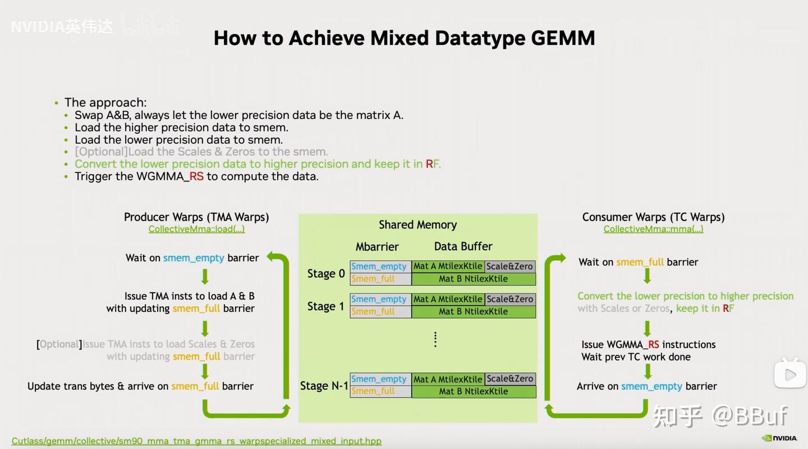

**Mixed GEMM** 흐름. 위와 비교해 **Consumer Warps에 Persistent 메서드 없음** — `CollectiveMma::mma(...)`만. 중간 Shared Memory가 두 Buffer 동일 dtype에서 A·B **교환**, dtype 다름. A Buffer 길이가 짧음(저정밀).

- **Producer Warps**(TMA Warps):
  - `smem_empty` barrier 대기
  - TMA 명령으로 A·B 로드, `smem_full` barrier 갱신
  - [선택] scale/zero point용 TMA
  - 전송 바이트 갱신, `smem_full` barrier 도달
- **Consumer Warps**(TC Warps):
  - `smem_full` barrier 대기
  - **저정밀 → 고정밀 변환, RF에 저장**
  - **`WGMMA_RS`** 발사
  - 이전 TC 작업 완료 대기
  - `smem_empty` barrier 도달

K 방향 루프는 슬라이드에서 생략됐지만 실제 구현엔 존재.

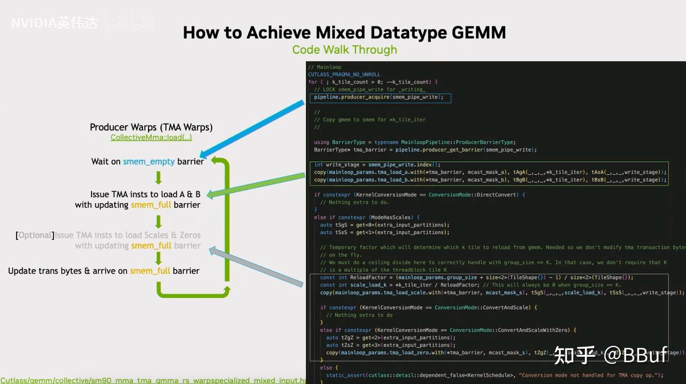

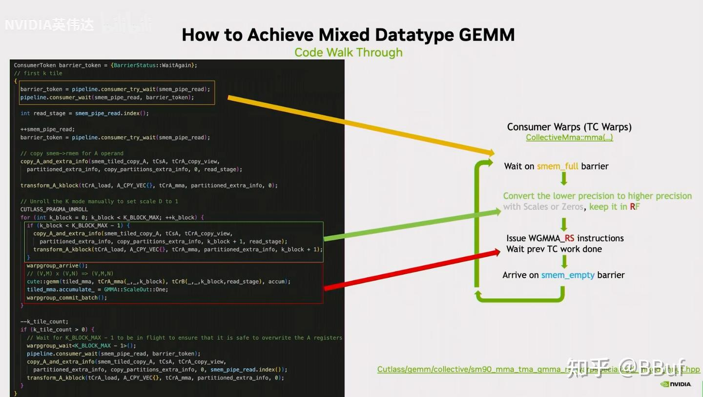

위 두 슬라이드는 Producer·Consumer 흐름의 일부 저수준 코드 설명. 추상적·복잡하므로 CUTLASS 소스 직접 참고 권장.

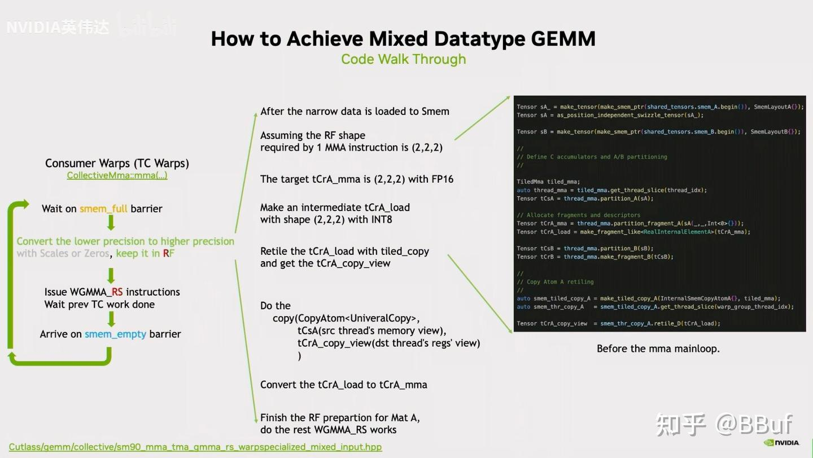

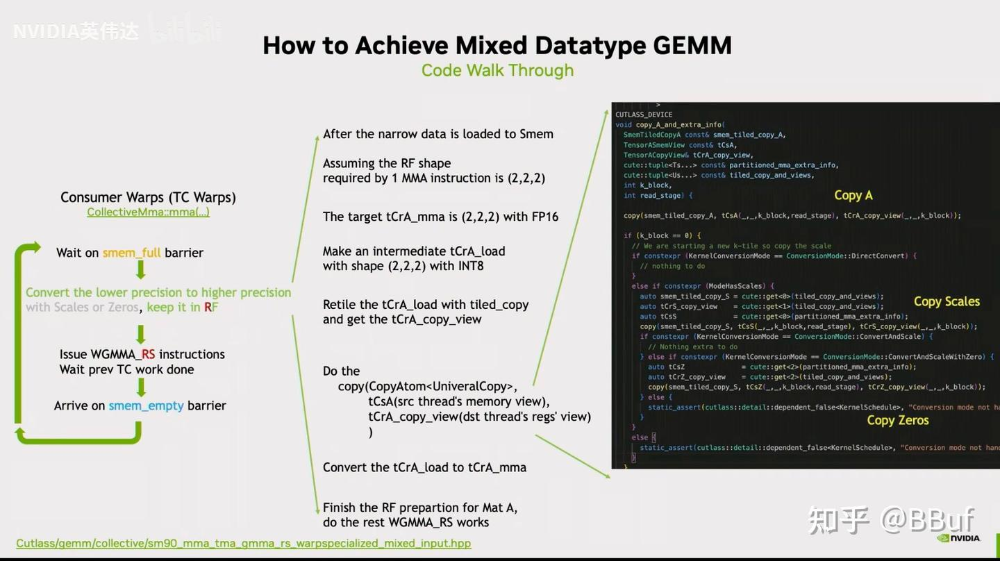

마지막 두 슬라이드는 Consumer Warp(TC Warps)에서 **저정밀 → 고정밀 변환과 RF 저장 구현**, Copy 세부.

## 정리

본 강의는 CUTLASS 3.x로 Hopper에서 Mixed GEMM 구현 기술 강의 정리. 주요 내용:

- CuTe 툴 라이브러리 — Layout·Tensor 개념으로 복잡한 인덱싱 처리
- 행렬 전치·GEMM 데이터 전송 예로 CuTe의 데이터 조작·병렬 능력
- Hopper 비동기 Warp Group MMA 실행 방법·지원 dtype
- 비동기 WGMMA + CuTe로 Mixed GEMM 구현 세부

본 노트는 개념 학습용 입문 자료. 더 깊이 학습하려면 CuTe·CUTLASS 소스 직접 학습 필요.
