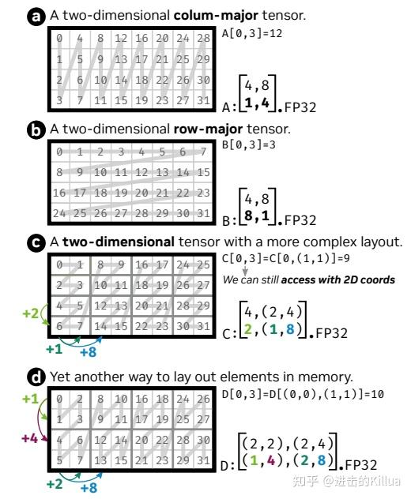
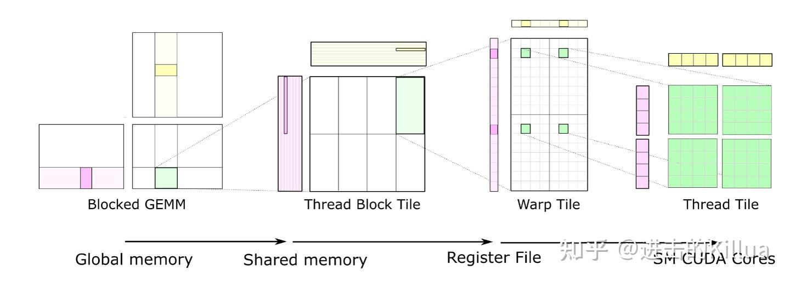
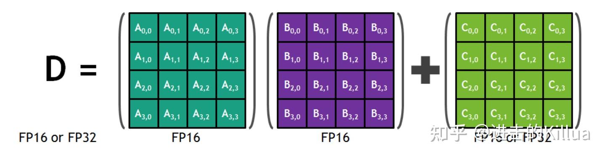

# CUTLASS CuTe 실전 (1) - 기초

> 원문: https://zhuanlan.zhihu.com/p/690703999

NVIDIA가 새 아키텍처와 제품을 계속 출시하면서 신기능이 늘어나고 CUDA 프로그래밍은 점점 복잡해집니다. 고성능 CUDA 커널을 만들려면 HW 아키텍처(연산 유닛 배치, 계층 저장 구조, 각 계층 통신 대역폭 등)뿐 아니라 최신 명령어 세트도 잘 알아야 합니다.

성능을 보장하면서 개발 난도를 낮추려는 작업이 늘고 있습니다 — 컴파일러 차원의 Halide·TVM·HTA·Fireiron·Stripe, 언어 차원의 Triton, 도구 라이브러리 차원의 cuBLAS·cuDNN 등. 본 글의 **CUTLASS**도 NVIDIA 공식 템플릿 가속 라이브러리이며, **CuTe**는 CUTLASS 위에 개발된 추상 라이브러리로 기본 데이터 기술 구조와 COPY·MMA 같은 기본 작업을 정의·구현합니다.

본 글은 **실전** 중심 — 기본 개념 소개 후 실행 가능 코드로 효과 확인. 모든 코드는 [GitHub - zeroine/cutlass-cute-sample](https://github.com/zeroine/cutlass-cute-sample)에서.

## CuTe 구조

### Layout

Layout은 **데이터 배치 매핑** 표현. 데이터는 물리 공간에서 순차 배치되지만 논리 공간에서 다양한 배치 가능. Layout은 둘을 매핑.

Layout은 **Shape**와 **Stride**로 구성. Shape는 분할 계층·구조 기술, Stride는 블록 안·간 데이터 배열 연속성. Shape·Stride는 모두 계층 중첩 표현 — Shape에 Int·Shape 모두 포함 가능.

아래 그림은 4가지 전형 layout:

- **그림 a**: 1D col-major. shape `(4, 8)`, stride `(1, 4)`
- **그림 b**: 1D row-major. shape `(4, 8)`, stride `(8, 1)`
- **그림 c**: 2D layout. shape `((4, 1), (2, 4))` — `((최내층 행수, 최외층 행수), (최내층 열수, 최외층 열수))`. stride `((2, 1), (1, 8))`
- **그림 d**: 2D layout `((2, 2), (2, 4))`. shape `((1, 4), (2, 8))`, stride 직접 유도

CuTe shape 정의: `((최내 n층 행수, n-1층 행수, ..., 최외층 행수), (최내 n층 열수, ..., 최외층 열수))`.



데모 코드(1·2·3차원과 2·3차원 중첩 layout):

```cpp
#include <cuda.h>
#include <stdlib.h>
#include "util.h"

using namespace cute;

int main()
{
    // 1D layout
    auto shape1 = make_shape(Int<8>{});
    auto stride1 = make_stride(Int<1>{});
    auto layout1 = make_layout(shape1, stride1);
    PRINT("layout1", layout1)

    // 2D layout
    auto shape2 = make_shape(Int<4>{}, Int<5>{});
    auto stride2 = make_stride(Int<5>{}, Int<1>{});
    auto layout2 = make_layout(shape2, stride2);
    PRINT("layout2", layout2)

    // 3D layout
    auto shape3 = make_shape(Int<2>{}, Int<3>{}, Int<4>{});
    auto stride3 = make_stride(Int<12>{}, Int<4>{}, Int<1>{});
    auto layout3 = make_layout(shape3, stride3);
    PRINT("layout3", layout3)

    // 2D 중첩 layout
    // shape: ((_2,_2),(_2,_4))
    // stride: ((_1,_4),(_2,_8))
    auto shape41 = make_shape(Int<2>{}, Int<2>{});
    auto shape42 = make_shape(Int<2>{}, Int<4>{});
    auto shape4 = make_shape(shape41, shape42);
    auto stride41 = make_stride(Int<1>{}, Int<4>{});
    auto stride42 = make_stride(Int<2>{}, Int<8>{});
    auto stride4 = make_stride(stride41, stride42);
    auto layout4 = make_layout(shape4, stride4);
    PRINT("layout22", layout4)

    // 3D 중첩 layout
    // shape: ((_2,_2,_2),(_2,_4,_4))
    // stride: ((_2,_16,_128),(_1,_4,_32))
    auto shape51 = make_shape(Int<2>{}, Int<2>{}, Int<2>{});
    auto shape52 = make_shape(Int<2>{}, Int<4>{}, Int<4>{});
    auto shape5 = make_shape(shape51, shape52);
    auto stride51 = make_stride(Int<2>{}, Int<16>{}, Int<128>{});
    auto stride52 = make_stride(Int<1>{}, Int<4>{}, Int<32>{});
    auto stride5 = make_stride(stride51, stride52);
    auto layout5 = make_layout(shape5, stride5);
    PRINT("layout33", layout5)
}
```

### Tensor

Tensor는 Layout 기반에 **저장**을 더한 것 — `Tensor = Layout + storage`. GPU의 storage는 global·shared·register 3종.

CuTe Tensor는 딥러닝 프레임워크의 Tensor와 다름. 딥러닝은 **데이터 실체**를 강조해 Tensor 간 계산으로 새 Tensor 생성. CuTe는 **분해·조합** 위주로 대부분 Layout 변환 — 저수준 데이터 실체는 변경 없음. 즉 표현 형식만 변경.

자주 쓰는 API:

```cpp
// 레지스터 Tensor 생성
Tensor make_tensor<T>(Layout layout);

// 레지스터 Tensor (layout 정적이어야 함)
Tensor make_tensor_like(Tensor tensor);
Tensor make_fragment_like(Tensor tensor);

// pointer + Layout (동적·정적 모두 가능)
Tensor make_tensor(Pointer pointer, Layout layout);

// 접근
tensor(1, 2) = 100;

// slice
Tensor tensor1 = tensor(_, _, 3);

// 국소 분할
Tensor tensor1 = local_tile(tensor, make_shape(2, 3, 4), make_coord(1, 2, 3));

// 국소 추출
Tensor tensor1 = local_partition(tensor, layout, idx);

// 강제 타입 변환
Tensor tensor1 = recast<NewType>(tensor);

// 출력
print(tensor);
print_tensor(tensor);

// shape만 있는 tensor (중간 layout 계산용)
Tensor tensor = make_identity_tensor(shape);
```

데모: https://github.com/zeroine/cutlass-cute-sample/blob/main/tensor.cu

```cpp
__global__ void handle_regiser_tensor()
{
    auto rshape = make_shape(Int<4>{}, Int<2>{});
    auto rstride = make_stride(Int<2>{}, Int<1>{});
    auto rtensor = make_tensor(make_layout(rshape, rstride));

    PRINT("rtensor.layout", rtensor.layout());
    PRINT("rtensor.shape", rtensor.shape());
    PRINT("rtensor.stride", rtensor.stride());
    PRINT("rtensor.size", rtensor.size());
    PRINT("rtensor.data", rtensor.data());
}

__global__ void handle_global_tensor(int *pointer)
{
    auto gshape = make_shape(Int<4>{}, Int<6>{});
    auto gstride = make_stride(Int<6>{}, Int<1>{});
    auto gtensor = make_tensor(make_gmem_ptr(pointer), make_layout(gshape, gstride));
    PRINTTENSOR("global tensor", gtensor);

    auto coord = make_coord(2, 1);
    PRINT("gtensor(2,1)", gtensor(coord));

    auto tensor_slice = gtensor(_, 1);
    PRINTTENSOR("tensor slice", tensor_slice);

    auto tensor_tile = local_tile(gtensor, make_shape(Int<2>(), Int<2>()),
                                  make_coord(Int<1>(), Int<1>()));
    PRINTTENSOR("tensor tile (2,2) index (1,1)", tensor_tile);

    int thr_idx = 1;
    auto tensor_partition = local_partition(gtensor,
                                            Layout<Shape<_2, _2>, Stride<_2, _1>>{},
                                            thr_idx);
    PRINTTENSOR("tensor partition tile (2,2) index (1)", tensor_partition);
}
```

### Copy



Tensor 기술 후 GPU 프로그래밍에서 다음 단계는 **데이터 이동**. 입력은 보통 global memory, 연산은 shared·register 기반 — global → shared/register 효율적 이동이 관건. **Copy 추상**이 그 역할.

CuTe Copy 개발 패러다임:

```
CopyOperation, Copy_Traits → Copy_Atom → TiledCopy → ThrCopy → copy
```

- **CopyOperation**: copy 명령(예: ldmatrix·cp.async 캡슐화)
- **Copy_Traits**: type·shape 등 메타 정보
- **Copy_Atom**: 두 가지를 결합 — 명령 레벨 분할 불가 이동 능력
- **TiledCopy**: Copy_Atom을 반복 실행 단위 증가(스레드 추가) 또는 다회 복사로 원자 능력 반복
- **ThrCopy**: TiledCopy를 각 스레드 작업으로 분할
- **copy**: 데이터 이동 명령 트리거

자세한 내용은 [reed의 Copy 추상](../B13_cute_copy_abstraction/README.md) 참고.

global → shared, shared → register 두 종류 정의 예:

```cpp
// CopyOperation
using g2s_copy_op = SM80_CP_ASYNC_CACHEGLOBAL<cute::uint128_t>;
// Copy_Traits
using g2s_copy_traits = Copy_Traits<g2s_copy_op>;
// Copy_Atom
using g2s_copy_atom = Copy_Atom<g2s_copy_traits, T>;
// TiledCopy
using G2SCopy =
    decltype(make_tiled_copy(g2s_copy_atom{},
                             make_layout(make_shape(Int<32>{}, Int<4>{}),
                                         make_stride(Int<4>{}, Int<1>{})),
                             make_layout(make_shape(Int<1>{}, Int<8>{}))));

using s2r_copy_op = SM75_U32x4_LDSM_N;
using s2r_copy_traits = Copy_Traits<s2r_copy_op>;
using s2r_copy_atom = Copy_Atom<s2r_copy_traits, T>;
using S2RCopy =
    decltype(make_tiled_copy(s2r_copy_atom{},
                             make_layout(make_shape(Int<32>{}, Int<4>{}),
                                         make_stride(Int<4>{}, Int<1>{})),
                             make_layout(make_shape(Int<1>{}, Int<8>{}))));
```

`get_slice`로 thread copy → `partition_S/retile_S`·`partition_D/retile_D` → `copy`. https://github.com/zeroine/cutlass-cute-sample/blob/main/copy.cu

```cpp
int idx = threadIdx.x;
extern __shared__ T shm_data[];
T *Ashm = shm_data;

auto gA = make_tensor(make_gmem_ptr(Aptr),
                      make_shape(Int<M>{}, Int<N>{}),
                      make_stride(Int<N>{}, Int<1>{}));
auto sA = make_tensor(make_smem_ptr(Ashm), SmemLayout{});
auto rA = make_tensor_like(gA);

// global → shm
G2SCopy g2s_tiled_copy;
auto g2s_thr_copy = g2s_tiled_copy.get_slice(idx);
auto tAgA = g2s_thr_copy.partition_S(gA);
auto tAsA = g2s_thr_copy.partition_D(sA);
cute::copy(g2s_tiled_copy, tAgA, tAsA);

// shm → register
S2RCopy s2r_tiled_copy;
auto s2r_thr_copy = s2r_tiled_copy.get_slice(idx);
auto stAsA = s2r_thr_copy.retile_S(tAsA);
auto tArA = s2r_thr_copy.partition_D(rA);
cute::copy(s2r_tiled_copy, stAsA, tArA);
```

### MMA

MMA는 Tensor Core 위에 구축. MMA 명령으로 소규모 행렬 곱.



MMA 패러다임:

```
MMAOperation, MMA_Traits → MMA_Atom → TiledMMA → ThrMMA → gemm
```

- **MMAOperation**: mma 명령
- **MMA_Traits**: 메타 정보
- **MMA_Atom**: HW가 실행 가능한 행렬 곱 최소 단위
- **TiledMMA**: MMA_Atom 조합. MMA_Atom은 warp 레벨, TiledMMA는 block 레벨로 보면 됨
- **ThrMMA**: 각 스레드 작업으로 분할
- **gemm**: 행렬 곱 명령 트리거

자세한 내용은 [reed의 MMA 추상](../B12_cute_mma_abstraction/README.md) 참고.

```cpp
// MMAOperation, M=16, N=8, K=16, type=half
using mma_op = SM80_16x8x16_F16F16F16F16_TN;
using mma_traits = MMA_Traits<mma_op>;
using mma_atom = MMA_Atom<mma_traits>;

using MMA = decltype(make_tiled_mma(mma_atom{},
                                    make_layout(Shape<_2, _4, _4>{}),   // thr_layout
                                    make_layout(Shape<_4, _4, _4>{}))); // val_layout
```

`get_slice`로 thread MMA → `partition_A/B/C`·`partition_fragment_A/B/C`로 global·register tensor. copy로 global → register, gemm으로 행렬 곱, copy로 글로벌 결과 저장. https://github.com/zeroine/cutlass-cute-sample/blob/main/mma.cu

```cpp
template <typename T, typename MMA, int M, int N, int K>
__global__ void mma_simple(T *Cptr, const T *Aptr, const T *Bptr)
{
    MMA tiled_mma;

    // ThrMMA
    auto thr_mma = tiled_mma.get_slice(threadIdx.x);

    Tensor A = make_tensor(make_gmem_ptr(Aptr),
                           make_shape(Int<M>{}, Int<K>{}), make_stride(Int<K>{}, Int<1>{}));
    Tensor B = make_tensor(make_gmem_ptr(Bptr),
                           make_shape(Int<N>{}, Int<K>{}), make_stride(Int<K>{}, Int<1>{}));
    Tensor C = make_tensor(make_gmem_ptr(Cptr),
                           make_shape(Int<M>{}, Int<N>{}), make_stride(Int<N>{}, Int<1>{}));

    auto tAgA = thr_mma.partition_A(A);
    auto tBgB = thr_mma.partition_B(B);
    auto tCgC = thr_mma.partition_C(C);

    auto tArA = thr_mma.partition_fragment_A(A);
    auto tBrB = thr_mma.partition_fragment_B(B);
    auto tCrC = thr_mma.partition_fragment_C(C);

    if (threadIdx.x == 0) {
        // MMA는 명령으로 결정, MMAThrLayout·MMAValLayout 영향 없음
        // A, B, C: 16*16/32=8=(2,2,2), 16*8/32=4=(2,2), 16*8/32=4=(2,2)

        // MMA_M, MMA_N, MMA_K는 명령·MMAThrLayout·source shape로 결정 (MMAValLayout 영향 없음)
        // MMA_M = M / (mma_op_m * thr_layout_m)
        // MMA_N = N / (mma_op_n * thr_layout_n)
        // MMA_K = K / (mma_op_k * thr_layout_k)

        PRINT("tArA.shape", tArA.shape());  // (MMA, MMA_M, MMA_K)
        PRINT("tBrB.shape", tBrB.shape());  // (MMA, MMA_N, MMA_K)
        PRINT("tCrC.shape", tCrC.shape());  // (MMA, MMA_M, MMA_N)
    }

    cute::copy(tAgA, tArA);
    cute::copy(tBgB, tBrB);
    clear(tCrC);

    // cute::gemm, warp level
    // 의미: tCrC, tArA, tBrB의 partition 전 tensor A, B, C에 대해 C = A*B + C
    // 내부에서 다수의 mma_atom 명령으로 분해
    cute::gemm(tiled_mma, tCrC, tArA, tBrB, tCrC);

    // thread level
    cute::copy(tCrC, tCgC);
}
```

### VectorAdd

마지막으로 고전 vector add를 CuTe 사용 전후로 비교.

**일반 vectorAdd**:

```cpp
template <int kNumElemPerThread = 8>
__global__ void vector_add_v0(half *z, half *x, half *y, int num,
                              const half a, const half b, const half c)
{
    using namespace cute;
    int tid = blockDim.x * blockIdx.x + threadIdx.x;
    int offset = tid * kNumElemPerThread;
    if (tid > num / kNumElemPerThread) return;

    half2 a2 = {a, a};
    half2 b2 = {b, b};
    half2 c2 = {c, c};
    half2 *x_ptr = reinterpret_cast<half2 *>(x + offset);
    half2 *y_ptr = reinterpret_cast<half2 *>(y + offset);
    half2 *z_ptr = reinterpret_cast<half2 *>(z + offset);

#pragma unroll
    for (int i = 0; i < kNumElemPerThread / 2; i++) {
        half2 x_val = __ldg(x_ptr++);
        half2 y_val = __ldg(y_ptr++);
        half2 result = a2 * x_val + b2 * y_val + c2;
        *(z_ptr++) = result;
    }
}
```

**CuTe 기반 vectorAdd**: `make_tensor`·`local_tile`로 스레드별 데이터 추출, `make_tensor_like`로 레지스터 tensor 생성, copy로 global → register, 레지스터에서 연산, copy로 global 쓰기.

```cpp
template <int kNumElemPerThread = 8>
__global__ void vector_add_v1(half *z, half *x, half *y, int num,
                              const half a, const half b, const half c)
{
    using namespace cute;
    int tid = blockDim.x * blockIdx.x + threadIdx.x;
    if (tid > num / kNumElemPerThread) return;

    auto tZ = make_tensor(make_gmem_ptr(z), make_shape(num));
    auto tX = make_tensor(make_gmem_ptr(x), make_shape(num));
    auto tY = make_tensor(make_gmem_ptr(y), make_shape(num));

    auto tZg = local_tile(tZ, make_shape(Int<kNumElemPerThread>()), tid);
    auto tXg = local_tile(tX, make_shape(Int<kNumElemPerThread>()), tid);
    auto tYg = local_tile(tY, make_shape(Int<kNumElemPerThread>()), tid);

    auto tZr = make_tensor_like(tZg);
    auto tXr = make_tensor_like(tXg);
    auto tYr = make_tensor_like(tYg);

    cute::copy(tXg, tXr);
    cute::copy(tYg, tYr);

#pragma unroll
    for (int i = 0; i < size(tXr); i++) {
        tZr(i) = a * tXr(i) + (b * tYr(i) + c);
    }
    cute::copy(tZr, tZg);
}
```

**최적화 v2** — half2 벡터화 + HFMA2:

```cpp
template <int kNumElemPerThread = 8>
__global__ void vector_add_v2(half *z, const half *x, const half *y,
                              int num, const half a, const half b, const half c)
{
    using namespace cute;
    int idx = threadIdx.x + blockIdx.x * blockDim.x;
    if (idx >= num / kNumElemPerThread) return;

    Tensor tz = make_tensor(make_gmem_ptr(z), make_shape(num));
    Tensor tx = make_tensor(make_gmem_ptr(x), make_shape(num));
    Tensor ty = make_tensor(make_gmem_ptr(y), make_shape(num));

    Tensor tzr = local_tile(tz, make_shape(Int<kNumElemPerThread>{}), make_coord(idx));
    Tensor txr = local_tile(tx, make_shape(Int<kNumElemPerThread>{}), make_coord(idx));
    Tensor tyr = local_tile(ty, make_shape(Int<kNumElemPerThread>{}), make_coord(idx));

    Tensor txR = make_tensor_like(txr);
    Tensor tyR = make_tensor_like(tyr);
    Tensor tzR = make_tensor_like(tzr);

    // LDG.128
    copy(txr, txR);
    copy(tyr, tyR);

    half2 a2 = {a, a};
    half2 b2 = {b, b};
    half2 c2 = {c, c};

    auto tzR2 = recast<half2>(tzR);
    auto txR2 = recast<half2>(txR);
    auto tyR2 = recast<half2>(tyR);

#pragma unroll
    for (int i = 0; i < size(tzR2); ++i) {
        // HFMA2 두 명령
        tzR2(i) = txR2(i) * a2 + (tyR2(i) * b2 + c2);
    }

    auto tzRx = recast<half>(tzR2);
    // STG.128
    copy(tzRx, tzr);
}
```

## 정리

본 글은 CuTe의 기본 구조 Layout·Tensor·Copy·MMA를 실행 코드로 검증하고, 이를 기반으로 VectorAdd를 구현했습니다. 이 API/템플릿으로 **스레드 레벨에서 데이터 복사·추출·계산을 편하게** 처리 — CuTe 설계 의도.

커널 설계 시 보통 위에서 아래로:

- **논리 시각**: GPU 물리 무관하게 로직만
- **block 시각**: 로직을 block에 효율 분해, block 간 협력
- **thread 시각**: 각 스레드가 담당할 일
- **warp 시각**: GPU는 warp으로 스케줄링·실행 → 성능 향상

복잡한 로직이면 위 사고가 더 복잡해지지만 **CuTe는 thread·warp 시각을 단순화**(내부 캡슐화) — 논리·block 시각에 더 집중 가능. 최신 HW 기능을 누리면서 개발 가속.

이어서 행렬 곱이라는 구체 예로 CuTe 사용을 더 견고하게 보여줍니다.

## 참고

- https://github.com/NVIDIA/cutlass
- [reed: CuTe Layout](../B09_cute_layout/README.md)
- [reed: CuTe Tensor](../B11_cute_tensor/README.md)
- [reed: CuTe Copy 추상](../B13_cute_copy_abstraction/README.md)
- [reed: CuTe MMA 추상](../B12_cute_mma_abstraction/README.md)
- [zhuxiaolin: cutlass cute 101](../B01_cutlass_cute_101/README.md)
