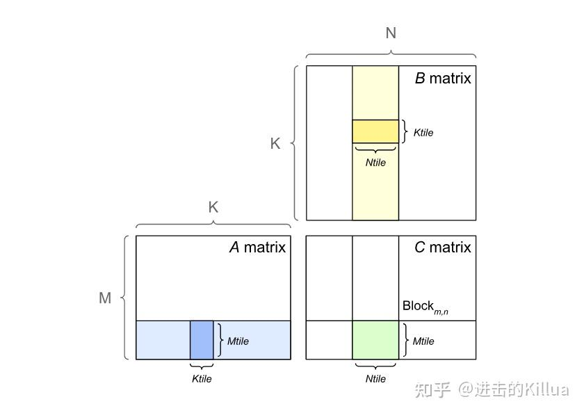
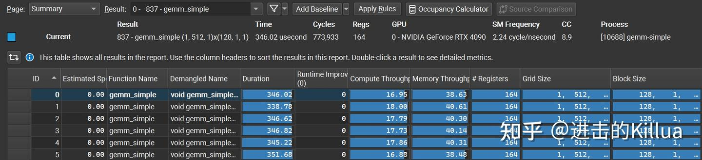
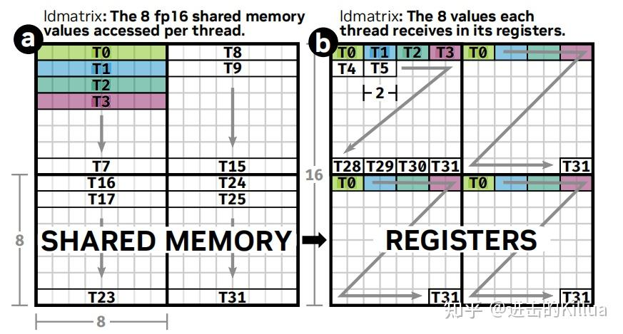
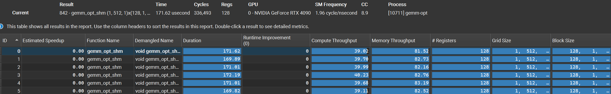
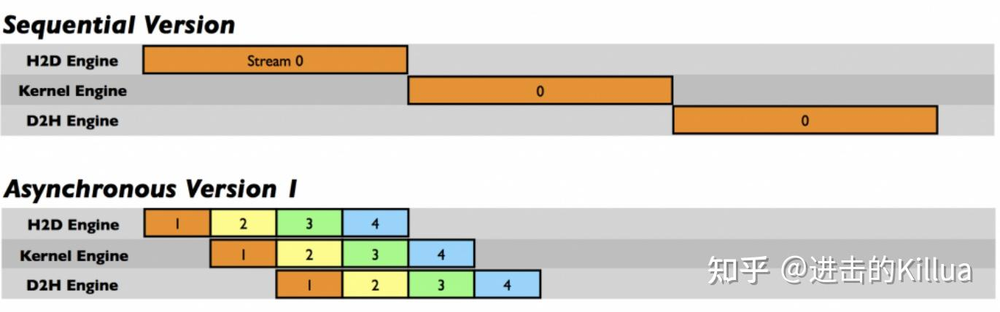
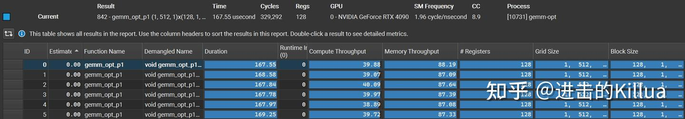
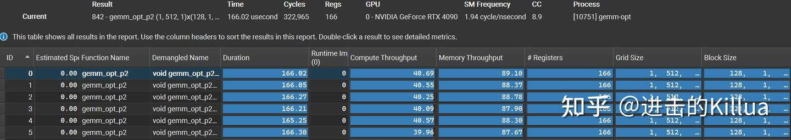
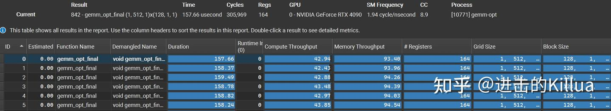

# CUTLASS CuTe 실전 (2) - 응용

> 원문: https://zhuanlan.zhihu.com/p/692078624

[이전 글 CuTe 실전 (1)](../B28_cutlass_cute_practice_1/README.md)에서 CuTe 기본 구조 Layout·Tensor·Copy·MMA를 다뤘고, 본 글은 이 구조들로 **고전 행렬 곱**을 완성하며 **5단계 구현 비교**로 최적화 방법의 효과를 검증합니다. 코드: https://github.com/zeroine/cutlass-cute-sample

CUDA에서 행렬 곱은 GPU 병렬을 충분히 활용하기 위해 보통 tiling. 위에서 아래로:

- **논리 시각**: $A(M, K) \times B(K, N) = C(M, N)$
- **Block 시각**: 각 Block이 C의 `(Mtile, Ntile)` 부분 행렬 담당, 즉 $A(\text{Mtile}, K) \times B(K, \text{Ntile}) = C(\text{Mtile}, \text{Ntile})$. 모든 Block이 병렬로 C 전체 완성. Block 내부에서 K 차원 분할 반복 — 매번 $A(\text{Mtile}, \text{Ktile}) \times B(\text{Ktile}, \text{Ntile}) = C(\text{Mtile}, \text{Ntile})$, `K/Ktile`회 반복하여 누적
- **Thread 시각**: Block의 각 반복을 위해 thread가 global → register copy, warp 레벨 mma 트리거, 결과를 누적해 global memory에 쓰기



## 기초 baseline

baseline 구현 — global → register → 계산 → register → global. CuTe로 데이터 조직·복사·mma 수행. 코드: https://github.com/zeroine/cutlass-cute-sample/blob/main/gemm-simple.cu

먼저 Tensor 기술. global 포인터 Aptr·Bptr·Cptr → A·B·C Tensor 생성. `local_tile`과 blockIdx로 Block의 데이터 tile gA·gB·gC 획득 — CuTe의 간결함이 드러남.

```cpp
Tensor A = make_tensor(make_gmem_ptr(Aptr), make_shape(m, k), make_stride(k, Int<1>{}));
Tensor B = make_tensor(make_gmem_ptr(Bptr), make_shape(n, k), make_stride(k, Int<1>{}));
Tensor C = make_tensor(make_gmem_ptr(Cptr), make_shape(m, n), make_stride(n, Int<1>{}));

int ix = blockIdx.x;
int iy = blockIdx.y;

// gA(kTileM, kTileK, num_tile_k)
// gB(kTileN, kTileK, num_tile_k)
// gC(kTileM, kTileN)
Tensor gA = local_tile(A, make_tile(Int<kTileM>{}, Int<kTileK>{}), make_coord(iy, _));
Tensor gB = local_tile(B, make_tile(Int<kTileN>{}, Int<kTileK>{}), make_coord(ix, _));
Tensor gC = local_tile(C, make_tile(Int<kTileM>{}, Int<kTileN>{}), make_coord(iy, ix));
```

다음 MMA 정의. `SM80_16x8x16_F16F16F16F16_TN`(`mma.sync.aligned.m16n8k16.row.col.f16.f16.f16.f16`) 동기 명령. mnk 16/8/16, 모두 FP16. `make_tiled_mma`의 둘째·셋째 인자가 중요.

- 둘째 `make_layout(Shape<_2, _2, _1>{})`: TileMMA 물리 구성 — M·N에서 2배 → `32(warp) × 2 × 2 = 128` 스레드
- 셋째 `make_layout(Shape<_1, _1, _1>{})`: MNK 논리 반복 횟수 — 스레드 배치엔 영향 없음, 성능 영향도 작음

```cpp
using mma_op = SM80_16x8x16_F16F16F16F16_TN;
using mma_traits = MMA_Traits<mma_op>;
using mma_atom = MMA_Atom<mma_traits>;
using TiledMMA = decltype(make_tiled_mma(mma_atom{},
                                    make_layout(Shape<_2, _2, _1>{}),
                                    make_layout(Shape<_1, _1, _1>{})));
```

ThrMMA로 Block 레벨 Tensor 추가 분할:

```cpp
TiledMMA tiled_mma;
auto thr_mma = tiled_mma.get_slice(threadIdx.x);
// MMA_M = M / (mma_op_m * thr_layout_m)
// MMA_N = N / (mma_op_n * thr_layout_n)
// MMA_K = K / (mma_op_k * thr_layout_k)
auto tAgA = thr_mma.partition_A(gA); // (MMA, MMA_M, MMA_K, num_tile_k)
auto tBgB = thr_mma.partition_B(gB); // (MMA, MMA_N, MMA_K, num_tile_k)
auto tCgC = thr_mma.partition_C(gC); // (MMA, MMA_M, MMA_N)

auto tArA = thr_mma.partition_fragment_A(gA(_, _, 0)); // (MMA, MMA_M, MMA_K)
auto tBrB = thr_mma.partition_fragment_B(gB(_, _, 0)); // (MMA, MMA_N, MMA_K)
auto tCrC = thr_mma.partition_fragment_C(gC(_, _));    // (MMA, MMA_M, MMA_N)
clear(tCrC);
```

마지막으로 데이터 copy → gemm → global 쓰기:

```cpp
int num_tile_k = size<2>(gA);
#pragma unroll 1
for (int itile = 0; itile < num_tile_k; ++itile) {
    // global → register
    copy(tAgA(_, _, _, itile), tArA);
    copy(tBgB(_, _, _, itile), tBrB);

    // warp level
    gemm(tiled_mma, tCrC, tArA, tBrB, tCrC);
}
copy(tCrC, tCgC);
```

baseline은 CuTe로 흐름은 통일했지만 성능은 일반. RTX 4090 + CUDA 12.2, `(M, N, K) = (65536, 128, 1024)`, `(kTileM, kTileN, kTileK) = (128, 128, 32)` half precision — **346 us, compute throughput 17.5%, memory throughput 40%**.



## 공유 저장 버전

baseline의 낮은 처리량에 대한 첫 해결책 — **shared memory 활용**. baseline의 MMA layout으로 global·register 직접 이동은 비효율적 — 데이터 주소 불연속으로 더 많은 cycle 필요. global → shared로 16B 연속 단위 로드, shared → register로 다시 → global 접근 횟수 감소. 코드: https://github.com/zeroine/cutlass-cute-sample/blob/main/gemm-opt.cu#L152

먼저 sA·sB 추가:

```cpp
Tensor A = make_tensor(make_gmem_ptr((T *)Aptr), make_shape(m, k),
                       make_stride(k, Int<1>{}));
Tensor B = make_tensor(make_gmem_ptr((T *)Bptr), make_shape(n, k),
                       make_stride(k, Int<1>{}));
Tensor D = make_tensor(make_gmem_ptr((T *)Dptr), make_shape(m, n),
                       make_stride(n, Int<1>{}));

// global memory
Tensor gA = local_tile(A, make_tile(Int<kTileM>{}, Int<kTileK>{}),
                       make_coord(iy, _));
Tensor gB = local_tile(B, make_tile(Int<kTileN>{}, Int<kTileK>{}),
                       make_coord(ix, _));
Tensor gD = local_tile(D, make_tile(Int<kTileM>{}, Int<kTileN>{}),
                       make_coord(iy, ix));

// shared memory
auto sA = make_tensor(make_smem_ptr(Ashm), SmemLayoutA{});
auto sB = make_tensor(make_smem_ptr(Bshm), SmemLayoutB{});
```

`SmemLayoutA/B`는 **Swizzle** 사용 — bank conflict 위험 감소:

```cpp
using SmemLayoutAtom = decltype(composition(
    Swizzle<3, 3, 3>{},
    make_layout(make_shape(Int<8>{}, Int<kTileK>{}),
                make_stride(Int<kTileK>{}, Int<1>{}))));
using SmemLayoutA = decltype(tile_to_shape(SmemLayoutAtom{},
                                           make_shape(Int<kTileM>{}, Int<kTileK>{})));
using SmemLayoutB = decltype(tile_to_shape(SmemLayoutAtom{},
                                           make_shape(Int<kTileN>{}, Int<kTileK>{})));
```

TiledCopy·TiledMMA 정의. global → shared는 `SM80_CP_ASYNC_CACHEGLOBAL<cute::uint128_t>`(`cp.async.cg.shared.global`, 128bit/회, 비동기), shared → register는 `SM75_U32x4_LDSM_N`(`ldmatrix.sync.aligned.x4.m8n8.shared.b16`):



```cpp
using mma_op = SM80_16x8x16_F16F16F16F16_TN;
using mma_traits = MMA_Traits<mma_op>;
using mma_atom = MMA_Atom<mma_traits>;
using TiledMMA = decltype(make_tiled_mma(mma_atom{},
                                    make_layout(Shape<_2, _2, _1>{}),
                                    make_layout(Shape<_1, _2, _1>{})));

// global → shared
using g2s_copy_op = SM80_CP_ASYNC_CACHEGLOBAL<cute::uint128_t>;
using g2s_copy_traits = Copy_Traits<g2s_copy_op>;
using g2s_copy_atom = Copy_Atom<g2s_copy_traits, T>;
using G2SCopyA =
    decltype(make_tiled_copy(g2s_copy_atom{},
                             make_layout(make_shape(Int<32>{}, Int<4>{}),
                                         make_stride(Int<4>{}, Int<1>{})),
                             make_layout(make_shape(Int<1>{}, Int<8>{}))));
using G2SCopyB = G2SCopyA;

// shared → register (mma tiled, no separate tiled here)
using s2r_copy_op = SM75_U32x4_LDSM_N;
using s2r_copy_traits = Copy_Traits<s2r_copy_op>;
using s2r_copy_atom = Copy_Atom<s2r_copy_traits, T>;
using S2RCopyAtomA = s2r_copy_atom;
using S2RCopyAtomB = s2r_copy_atom;
```

스레드 차원 partition (디테일 생략, 코드 주석 참조):

```cpp
TiledMMA tiled_mma;
auto thr_mma = tiled_mma.get_slice(idx);
auto tCrA = thr_mma.partition_fragment_A(gA(_, _, 0));
auto tCrB = thr_mma.partition_fragment_B(gB(_, _, 0));
auto tCrD = thr_mma.partition_fragment_C(gD);
auto tCgD = thr_mma.partition_C(gD);
clear(tCrD);

// global → shared
G2SCopyA g2s_tiled_copy_a;
auto g2s_thr_copy_a = g2s_tiled_copy_a.get_slice(idx);
auto tAgA_copy = g2s_thr_copy_a.partition_S(gA);
auto tAsA_copy = g2s_thr_copy_a.partition_D(sA);

G2SCopyB g2s_tiled_copy_b;
auto g2s_thr_copy_b = g2s_tiled_copy_b.get_slice(idx);
auto tBgB_copy = g2s_thr_copy_b.partition_S(gB);
auto tBsB_copy = g2s_thr_copy_b.partition_D(sB);

// shared → register, tiled_mma로 tiled_copy 생성
auto s2r_tiled_copy_a = make_tiled_copy_A(S2RCopyAtomA{}, tiled_mma);
auto s2r_thr_copy_a = s2r_tiled_copy_a.get_slice(idx);
auto tAsA = s2r_thr_copy_a.partition_S(sA);
auto tCrA_view = s2r_thr_copy_a.retile_D(tCrA);

auto s2r_tiled_copy_b = make_tiled_copy_B(S2RCopyAtomB{}, tiled_mma);
auto s2r_thr_copy_b = s2r_tiled_copy_b.get_slice(idx);
auto tBsB = s2r_thr_copy_b.partition_S(sB);
auto tCrB_view = s2r_thr_copy_b.retile_D(tCrB);
```

복사 → 계산 → global 쓰기. 비동기이므로 wait 필요:

```cpp
int ntile = k / kTileK;
#pragma unroll 1
for (int itile = 0; itile < ntile; ++itile) {
    cute::copy(g2s_tiled_copy_a, tAgA_copy(_, _, _, itile), tAsA_copy(_, _, _));
    cute::copy(g2s_tiled_copy_b, tBgB_copy(_, _, _, itile), tBsB_copy(_, _, _));
    cp_async_fence();

    cp_async_wait<0>();
    __syncthreads();

    int nk = size<2>(tCrA);
#pragma unroll
    for (int ik = 0; ik < nk; ++ik) {
        cute::copy(s2r_tiled_copy_a, tAsA(_, _, ik), tCrA_view(_, _, ik));
        cute::copy(s2r_tiled_copy_b, tBsB(_, _, ik), tCrB_view(_, _, ik));
        cute::gemm(tiled_mma, tCrD, tCrA(_, _, ik), tCrB(_, _, ik), tCrD);
    }
}

cute::copy(tCrD, tCgD);
```

baseline 대비 큰 향상 — **171 us, memory throughput 82%, compute throughput 39%**.



## 1단 파이프라인 버전

shared 버전이 memory throughput을 크게 향상시켰지만 더 향상 가능? global → shared가 비동기 명령이므로 **파이프라인**으로 계산·저장 오버랩 시도.

> 파이프라인: 명령 실행을 여러 stage로 나누고 다른 명령의 다른 stage를 동시 처리. 메모리 작업과 계산 작업 병렬 → 전체 지연 감소.



코드: https://github.com/zeroine/cutlass-cute-sample/blob/main/gemm-opt.cu#L271

shared에 **`kStage` 차원 추가** (파이프라인 stage 분할):

```cpp
auto sA = make_tensor(make_smem_ptr(Ashm), SmemLayoutA{}); // (kTileM, kTileK, kStage)
auto sB = make_tensor(make_smem_ptr(Bshm), SmemLayoutB{}); // (kTileN, kTileK, kStage)

using SmemLayoutA = decltype(tile_to_shape(SmemLayoutAtom{},
                            make_shape(Int<kTileM>{}, Int<kTileK>{}, Int<kStage>{})));
using SmemLayoutB = decltype(tile_to_shape(SmemLayoutAtom{},
                            make_shape(Int<kTileN>{}, Int<kTileK>{}, Int<kStage>{})));
```

TiledCopy·TiledMMA 정의는 거의 동일. 핵심 — 여러 라운드 비동기 복사를 시작하고 첫 라운드 완료 후 shared → register + gemm 진행. 그 동안 새 비동기 복사·동기 wait 트리거. 복사와 계산이 병렬:

```cpp
int itile_to_read = 0;
int ismem_read = 0;
int ismem_write = 0;

// kStage - 1 tile 제출
#pragma unroll
for (int istage = 0; istage < kStage - 1; ++istage) {
    copy(g2s_tiled_copy_a, tAgA_copy(_, _, _, istage), tAsA_copy(_, _, _, istage));
    copy(g2s_tiled_copy_b, tBgB_copy(_, _, _, istage), tBsB_copy(_, _, _, istage));
    cp_async_fence();

    ++itile_to_read;
    ++ismem_write;
}

cp_async_wait<kStage - 2>();
__syncthreads();

int ntile = k / kTileK;

#pragma unroll 1
for (int itile = 0; itile < ntile; ++itile) {
    int nk = size<2>(tCrA);

#pragma unroll
    for (int ik = 0; ik < nk; ++ik) {
        // shm → reg s[itile][ik] → r[ik]
        cute::copy(s2r_tiled_copy_a, tAsA(_, _, ik, ismem_read), tCrA_view(_, _, ik));
        cute::copy(s2r_tiled_copy_b, tBsB(_, _, ik, ismem_read), tCrB_view(_, _, ik));
        cute::gemm(tiled_mma, tCrD, tCrA(_, _, ik), tCrB(_, _, ik), tCrD);

        if (ik == nk - 1) {
            cp_async_wait<kStage - 2>();
            __syncthreads();
            ismem_read = (ismem_read + 1) % kStage;
        }

        if (ik == 0) {
            if (itile_to_read < ntile) {
                cute::copy(g2s_tiled_copy_a, tAgA_copy(_, _, _, itile_to_read),
                           tAsA_copy(_, _, _, ismem_write));
                cute::copy(g2s_tiled_copy_b, tBgB_copy(_, _, _, itile_to_read),
                           tBsB_copy(_, _, _, ismem_write));

                ++itile_to_read;
                ismem_write = (ismem_write + 1) % kStage;
            }

            cp_async_fence();
        }
    }
}

cute::copy(tCrD, tCgD);
```

**167 us, memory 87%, compute 39%**.



## 2단 파이프라인 버전

1단 파이프라인은 global → shared와 shared → register + gemm 병렬 → memory throughput 향상. **shared → register도 파이프라인 가능** — 메모리 접근 시간이 여전히 큼. 최종적으로 **global → shared, shared → register, gemm 모두 병렬**인 2단 파이프라인.

`ldmatrix`는 동기 명령이므로 **현재 라운드 계산 중 다음 라운드 shared → register 미리 수행** — instruction reordering으로 명령 병렬. 코드: https://github.com/zeroine/cutlass-cute-sample/blob/main/gemm-opt.cu#L436

차이: 초기화에서 shared → register 사전 처리, 반복부에서 다음 라운드 shared → register 처리:

```cpp
int itile_to_read = 0;
int ismem_read = 0;
int ismem_write = 0;

#pragma unroll
for (int istage = 0; istage < kStage - 1; ++istage) {
    copy(g2s_tiled_copy_a, tAgA_copy(_, _, _, istage), tAsA_copy(_, _, _, istage));
    copy(g2s_tiled_copy_b, tBgB_copy(_, _, _, istage), tBsB_copy(_, _, _, istage));
    cp_async_fence();
    ++itile_to_read;
    ++ismem_write;
}

cp_async_wait<kStage - 2>();
__syncthreads();

int ik = 0;
// smem → reg
copy(s2r_tiled_copy_a, tAsA(_, _, ik, ismem_read), tCrA_view(_, _, ik));
copy(s2r_tiled_copy_b, tBsB(_, _, ik, ismem_read), tCrB_view(_, _, ik));

int ntile = k / kTileK;

#pragma unroll 1
for (int itile = 0; itile < ntile; ++itile) {
    int nk = size<2>(tCrA);

#pragma unroll
    for (int ik = 0; ik < nk; ++ik) {
        int ik_next = (ik + 1) % nk;

        if (ik == nk - 1) {
            cp_async_wait<kStage - 2>();
            __syncthreads();
            ismem_read = (ismem_read + 1) % kStage;
        }

        // shm → reg s[itile][ik + 1] → r[ik + 1]
        cute::copy(s2r_tiled_copy_a, tAsA(_, _, ik_next, ismem_read), tCrA_view(_, _, ik_next));
        cute::copy(s2r_tiled_copy_b, tBsB(_, _, ik_next, ismem_read), tCrB_view(_, _, ik_next));

        if (ik == 0) {
            if (itile_to_read < ntile) {
                cute::copy(g2s_tiled_copy_a, tAgA_copy(_, _, _, itile_to_read),
                           tAsA_copy(_, _, _, ismem_write));
                cute::copy(g2s_tiled_copy_b, tBgB_copy(_, _, _, itile_to_read),
                           tBsB_copy(_, _, _, ismem_write));
                ++itile_to_read;
                ismem_write = (ismem_write + 1) % kStage;
            }
            cp_async_fence();
        }

        // instruction reordering
        cute::gemm(tiled_mma, tCrD, tCrA(_, _, ik), tCrB(_, _, ik), tCrD);
    }
}
```

**166 us, memory 88%, compute 40%**.



## 결합 쓰기 버전

파이프라인 부분은 충분히 깊게 했지만 코드에 아직 미최적 부분 — **register → global memory 쓰기**. 비연속 주소 직접 쓰기는 매우 비효율 → **shared memory 경유 결합 쓰기**. 코드: https://github.com/zeroine/cutlass-cute-sample/blob/main/gemm-opt.cu#L615

쓰기용 shared layout `SmemLayoutC` 정의(MMA shape 사용). register → shared, shared → global의 CopyAtom — `UniversalCopy`(가장 직접적 copy, `dst = static_cast<D>(static_cast<S>(src))`):

```cpp
using MNK = typename MMA::TiledShape_MNK;
using SmemLayoutAtomC = decltype(composition(
    Swizzle<3, 3, 3>{}, make_layout(make_shape(get<0>(MNK{}), get<1>(MNK{})),
                                    make_stride(get<1>(MNK{}), Int<1>{}))));
using SmemLayoutC = decltype(tile_to_shape(
    SmemLayoutAtomC{},
    make_shape(get<0>(MNK{}), get<1>(MNK{}), Int<kSmemLayoutCBatch>{})));

static_assert(size<0>(SmemLayoutA{}) * size<1>(SmemLayoutA{}) >= size(SmemLayoutC{}),
              "C shared memory request is large than A's one pipe");

// register → shared
using R2SCopyAtomC = Copy_Atom<UniversalCopy<int>, T>;
// shared → global
using S2GCopyAtomC = Copy_Atom<UniversalCopy<cute::uint128_t>, T>;
using S2GCopyC = decltype(make_tiled_copy(S2GCopyAtomC{},
                          make_layout(make_shape(Int<32>{}, Int<4>{}),
                                      make_stride(Int<4>{}, Int<1>{})),
                          make_layout(make_shape(Int<1>{}, Int<8>{}))));

auto sC = make_tensor(sA(_, _, ismem_read).data(), SmemLayoutC{});

auto r2s_tiled_copy_c = make_tiled_copy_C(R2SCopyAtomC{}, tiled_mma);
auto r2s_thr_copy_c = r2s_tiled_copy_c.get_slice(idx);
auto tCrC_r2s = r2s_thr_copy_c.retile_S(tCrD);
auto tCsC_r2s = r2s_thr_copy_c.partition_D(sC);

S2GCopyC s2g_tiled_copy_c;
auto s2g_thr_copy_c = s2g_tiled_copy_c.get_thread_slice(idx);
auto tCsC_s2g = s2g_thr_copy_c.partition_S(sC);
auto tCgC_s2g = s2g_thr_copy_c.partition_D(gD);

auto tCgC_s2gx = group_modes<1, 3>(tCgC_s2g);
auto tCrC_r2sx = group_modes<1, 3>(tCrC_r2s);
```

쓰기는 register → shared `(_2, (_2, _2))` shape, shared → global `(_8, _1)` shape — **쓰기 성능 대폭 향상**:

```cpp
int step = size<3>(tCsC_r2s);
#pragma unroll
for (int i = 0; i < size<1>(tCrC_r2sx); i += step) {
    // reg → shm
#pragma unroll
    for (int j = 0; j < step; ++j) {
        cute::copy(r2s_tiled_copy_c, tCrC_r2sx(_, i + j), tCsC_r2s(_, 0, 0, j));
    }
    __syncthreads();

    // shm → global
#pragma unroll
    for (int j = 0; j < step; ++j) {
        cute::copy(s2g_tiled_copy_c, tCsC_s2g(_, 0, 0, j), tCgC_s2gx(_, i + j));
    }

    __syncthreads();
}
```

**157 us, memory 94%, compute 43%**.



## 정리

행렬 곱이라는 고전 시나리오에 다양한 최적화를 결합해 CuTe 응용을 보였습니다. 각 버전 성능 정리:

| 버전 | compute throughput | memory throughput | duration (us) |
|---|---|---|---|
| 기초 baseline | 17.5% | 40% | 346 |
| 공유 저장 | 39% | 82% | 171 |
| 1단 파이프라인 | 39% | 87% | 167 |
| 2단 파이프라인 | 40% | 88% | 166 |
| 결합 쓰기 | **43%** | **94%** | **157** |
