# CUDA Ampere Tensor Core HGEMM 행렬 곱 최적화 노트 — Up To 131 TFLOPS!

> 원문: https://zhuanlan.zhihu.com/p/555339335

## 1. 소개

최근 NVIDIA GPU에 탑재된 Tensor Core를 파고들면서, 반정밀도 부동소수점(half / FP16) 행렬 곱 커널(`C = A * B`, A·B·C 모두 FP16)을 직접 작성하고 cuBLAS 수준까지 최적화하는 시도를 했습니다.

본 글의 소스 코드는 `nicolaswilde/cuda-tensorcore-hgemm`(github.com)에서 확인할 수 있습니다.

아래 그림은 RTX 3090에서 제가 직접 작성한 여러 커널과 `CUBLAS_GEMM_DFALT`를 M = N = K(256 ~ 16384) 범위에서 비교한 결과입니다. 굵은 파란선이 cuBLAS, 굵은 녹색선이 최종 최적화 버전이고, 네 개의 회색선은 최적화 중간 단계입니다. **`myHGEMMAlignedV5`가 `CUBLAS_GEMM_DFALT`를 대부분 구간에서 앞서며**, 목표한 최적화를 달성했습니다.

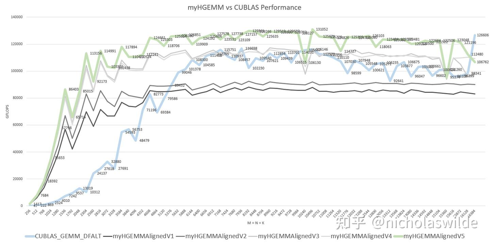

RTX 3090은 SM 82개, SM당 Tensor Core 4개, Tensor Core당 256 FLOP/Cycle의 FP16 연산 능력을 가집니다. 실제 약 1.9 GHz에서 구동됨을 확인했으므로 FP16 피크 연산 능력은 `82 × 4 × 256 × 1.9G ≈ 159 TFLOPS`입니다. 제 HGEMM 커널은 **최고 131 TFLOPS**에 도달했는데, 이는 피크 대비 약 **82%** 입니다.

cuBLAS에 대해서 — `cublasGemmEx`는 행렬 곱에 참여하는 데이터 타입과 40여 종의 알고리즘을 지정할 수 있습니다. 아래는 M = N = K(256 ~ 16384) 구간의 cuBLAS 성능으로, 최고 126 TFLOPS에 이릅니다. 성능 곡선을 보면 40여 가지 알고리즘이 결국 같은 커널을 호출하는 것 아닌가 의심이 가지만, 증거는 없습니다.

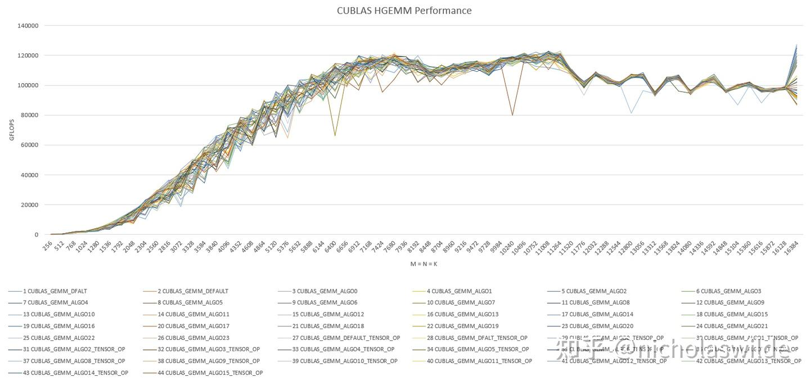

본 글은 CUDA 행렬 곱 최적화 시리즈의 두 번째 편으로, **Tensor Core** 관련 내용에 집중합니다. 기초 CUDA 프로그래밍과 CUDA Core 기반 SGEMM 최적화는 이전 글을 먼저 참고하세요.

> nicholaswilde: CUDA SGEMM 행렬 곱 최적화 노트 — 입문부터 cuBLAS까지

Tensor Core를 어느 정도 아시는 분은 바로 4절로 건너뛰셔도 됩니다.

## 2. Tensor Core

NVIDIA는 Volta 세대 GPU부터 Tensor Core를 도입했으며, 이는 AI 추론·학습을 대표로 하는 대규모 행렬 곱·유사 행렬 곱 워크로드를 가속하는 것이 목적입니다. CUDA Core의 연산 능력에는 한계가 있어, 행렬 곱 같은 전형적 연산 집약적 워크로드에서 메모리 대역폭이 대량 낭비됩니다. Tensor Core 도입으로 수백 GB/s 규모의 GPU 메모리 대역폭을 행렬 곱 계산에 활용할 수 있게 되었습니다.

아래 그림은 Ampere A100의 SM 구조입니다. Tensor Core는 SM Block 내 기능 유닛으로, 기존 CUDA Core와 동등한 위치를 차지합니다. 단 차이점도 있습니다. INT32 벡터 명령은 warp의 32 스레드가 각각 16개 INT32 연산 유닛에서 실행되지만, **Tensor Core 명령은 32 스레드가 협력하여 32 스레드의 오퍼랜드를 모아 하나의 Tensor Core에서 행렬 곱을 완성**합니다.

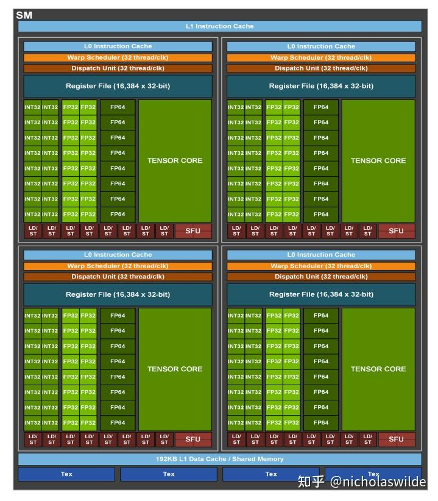

Volta의 Tensor Core는 여기서는 생략합니다. 개인적 추측으로는 물리 설계상의 이유로, Volta Tensor Core는 레지스터에서 Thread Group으로 나누고 동일 데이터를 두 번 저장해야 해서 산뜻하지 않아 보입니다. Volta Tensor Core에 관심 있으면 ISPASS2019의 《Modeling Deep Learning Accelerator Enabled GPUs》를 참고하세요.

Turing 세대부터 레지스터 상의 행렬 원소 배치가 매우 정돈되었습니다. 아래는 8×8×128bit 행렬 곱의 모식도입니다. Turing Tensor Core는 (u)int8과 FP16을 지원하고, Ampere Tensor Core는 bf16·tf32를 추가 지원합니다. 그 외에 잘 쓰지 않는 INT4·INT2·INT1도 있습니다. 본 글에서 다루는 FP16을 예로 들면, 아래 그림은 가장 기본적인 Tensor Core 연산이 **8×8×8 행렬 곱**을 수행함을 보여줍니다.

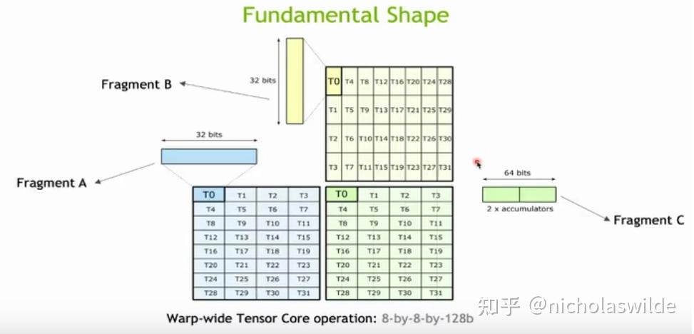

명령 수를 줄이고 레지스터 압박을 완화하기 위해 Turing Tensor Core의 명령 한 개는 **16×8×8 FP16 행렬 곱**을 지원하며, 대응 SASS 명령은 `HMMA.1688`입니다. 레지스터 배치는 아래와 같습니다.

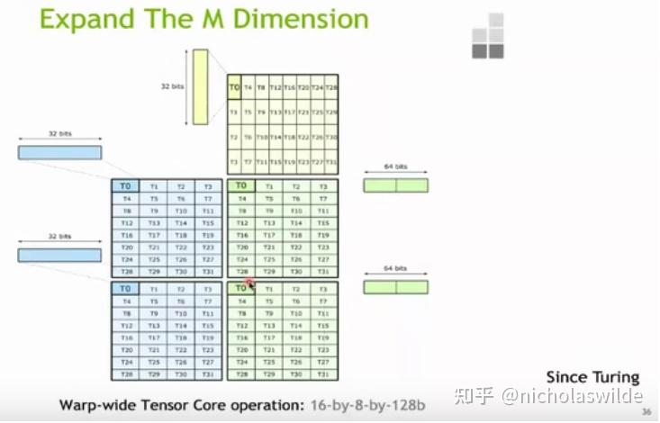

Ampere Tensor Core의 명령 한 개는 **16×8×16 FP16 행렬 곱**을 지원합니다. 따라서 `compute capability = 86`으로 컴파일된 SASS 코드에는 `HMMA.16816` 명령이 일관되게 나타납니다.

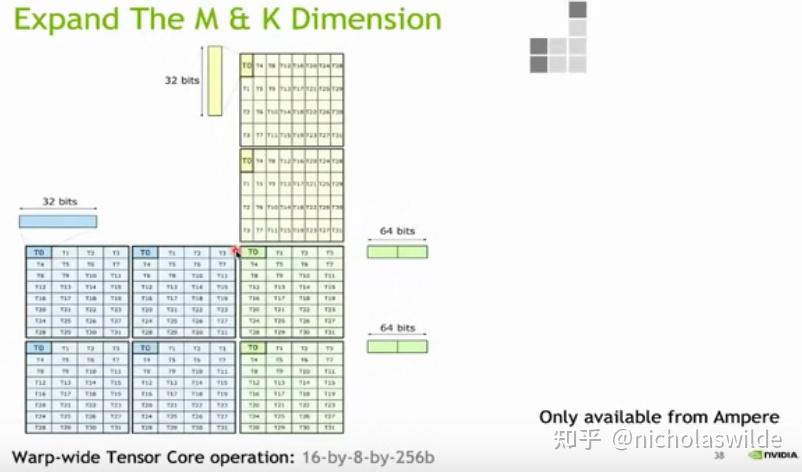

Volta에서 Ampere까지 Tensor Core의 진화는 지원 데이터 타입 증가 외에 **피크 성능 증가**가 핵심입니다. V100의 SM Block 안 두 Tensor Core는 클록당 총 128 MAC(multiply-accumulate), A100의 SM Block 안 한 Tensor Core는 클록당 256 MAC을 수행합니다(즉 `HMMA.16816` 하나를 풀 파이프라인으로 8 클록에 처리). 그런데 **RTX 30 시리즈의 Tensor Core는 사실상 축소되어**, 클록당 128 MAC, 풀 파이프라인 16 클록에 `HMMA.16816` 하나를 처리합니다. 그 결과 RTX 3090은 SM 82개 × Tensor Core 4개 × 256 × 1.695 GHz ≈ **142 TFLOPS**가 피크입니다.

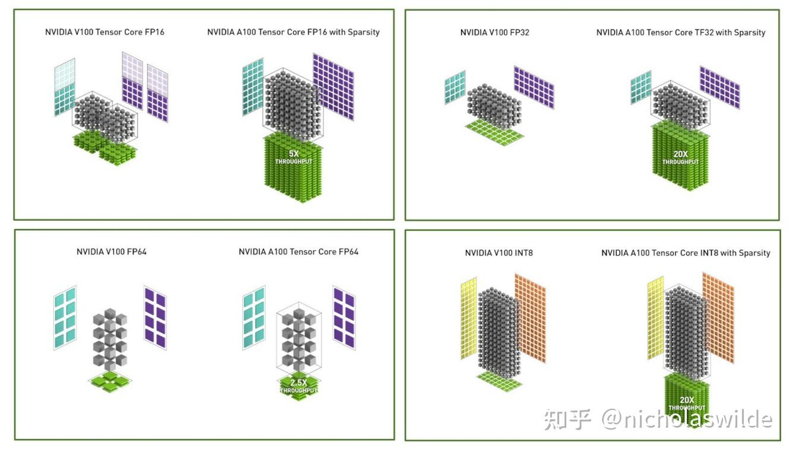

## 3. Tensor Core 프로그래밍 방법

### 3.1 C++ API

CUDA C++에는 Tensor Core의 고수준 API가 `.../CUDA/v??.?/include/crt/mma.h`에 정의되어 있습니다. `matrix_a`·`matrix_b`·`accumulator` 세 종류의 fragment(각 fragment는 warp의 모든 스레드의 특정 레지스터 1개 또는 몇 개에 대응)를 선언하고, `load_matrix_sync`/`store_matrix_sync`로 행렬을 레지스터에 쓰거나 shared/global memory로 되돌립니다. 계산은 `mma_sync`로 Tensor Core를 호출합니다.

```cpp
nvcuda::wmma::fragment<wmma::matrix_a, 16, 16, 16, half, wmma::row_major> frag_a;
nvcuda::wmma::fragment<wmma::matrix_b, 16, 16, 16, half, wmma::row_major> frag_b;
nvcuda::wmma::fragment<wmma::accumulator, 16, 16, 16, half> frag_c;

nvcuda::wmma::fill_fragment(frag_c, 0.0);
nvcuda::wmma::load_matrix_sync(frag_a, (shared memory or global memory pointer), (stride_a));
nvcuda::wmma::load_matrix_sync(frag_b, (shared memory or global memory pointer), (stride_b));
nvcuda::wmma::mma_sync(frag_c, frag_a, frag_b, frag_c);
nvcuda::wmma::store_matrix_sync((shared memory or global memory pointer), frag_c, (stride_c), wmma::mem_row_major);
```

compute capability마다 지원 fragment 크기가 다르니 자세한 내용은 《CUDA C++ Programming Guide》를 참고하세요.

### 3.2 PTX 명령

《Parallel Thread Execution ISA》 9.7.13.3절과 9.7.13.4절에 각각 **wmma 명령**과 **mma 명령**이 정의되어 있습니다. 두 명령군은 매우 유사하며, wmma는 Volta 아키텍처의 흔적처럼 보입니다.

wmma 명령:

```
// wmma.load
wmma.load.a.sync.aligned.layout.shape{.ss}.atype r, [p] {, stride};
wmma.load.b.sync.aligned.layout.shape{.ss}.btype r, [p] {, stride};
wmma.load.c.sync.aligned.layout.shape{.ss}.ctype r, [p] {, stride};

// wmma.store
wmma.store.d.sync.aligned.layout.shape{.ss}.type [p], r {, stride};

// wmma.mma
wmma.mma.sync.aligned.alayout.blayout.shape.dtype.ctype d, a, b, c; // fp16
wmma.mma.sync.aligned.alayout.blayout.shape.s32.atype.btype.s32{.satfinite} d, a, b, c; // int8 uint8
wmma.mma.sync.aligned.alayout.blayout.shape.f32.atype.btype.f32 d, a, b, c; // bf16
wmma.mma.sync.aligned.alayout.blayout.shape.f32.atype.btype.f32 d, a, b, c; // tf32
wmma.mma.sync.aligned.alayout.blayout.shape{.rnd}.f64.f64.f64.f64 d, a, b, c; // fp64
wmma.mma.sync.aligned.row.col.shape.s32.atype.btype.s32{.satfinite} d, a, b, c; // int4 uint4
wmma.mma.op.popc.sync.aligned.row.col.shape.s32.atype.btype.s32 d, a, b, c; // int1
```

mma 명령:

```
// mma
mma.sync.aligned.m8n8k4.alayout.blayout.dtype.f16.f16.ctype d, a, b, c; // fp16
mma.sync.aligned.m16n8k8.row.col.dtype.f16.f16.ctype d, a, b, c; // fp16
mma.sync.aligned.m16n8k16.row.col.dtype.f16.f16.ctype d, a, b, c; // fp16
mma.sync.aligned.m16n8k4.row.col.f32.tf32.tf32.f32 d, a, b, c; // bf16 tf32
mma.sync.aligned.m16n8k8.row.col.f32.atype.btype.f32 d, a, b, c; // bf16 tf32
mma.sync.aligned.m16n8k16.row.col.f32.bf16.bf16.f32 d, a, b, c; // bf16 tf32
mma.sync.aligned.shape.row.col{.satfinite}.s32.atype.btype.s32 d, a, b, c; // int8 uint8
mma.sync.aligned.shape.row.col{.satfinite}.s32.atype.btype.s32 d, a, b, c; // int4 uint4
mma.sync.aligned.shape.row.col.s32.b1.b1.s32.bitOp.popc d, a, b, c; // int1

// load matrix
ldmatrix.sync.aligned.shape.num{.trans}{.ss}.type r, [p];
```

wmma와 mma의 행렬 연산 명령은 매우 유사하지만 **load 명령은 다릅니다**. `wmma.load`는 각 행을 stride 방식으로 접근하고, `ldmatrix`는 4 스레드마다 하나의 주소를 지정할 수 있어 **훨씬 유연**합니다. 덕분에 shared memory 상의 행렬 원소 배치를 자유롭게 조정하여 bank conflict를 피할 수 있습니다.

### 3.3 SASS 명령

C++ API든 임베드된 PTX든 최종 산출물은 SASS 기계어입니다. FP16 타입의 행렬 load/곱은 각각 `LDSM` 명령과 `HMMA` 명령으로 컴파일됩니다.

## 4. 단순한 Tensor Core HGEMM 커널

행렬 분할의 고려사항은 이전 [SGEMM 글](https://zhuanlan.zhihu.com/p/478846788)에서 다뤘습니다. 요약하면:

- 계산/메모리 접근 비율은 `(1/BM + 1/BN)`에 비례. 메모리 대역폭이 병목이 되지 않게 하려면 BM·BN을 크게 잡는 편이 유리
- 단 `BM × BN`의 accumulator는 레지스터에 놓이므로 레지스터 수에 의해 상한이 있음
- BK는 최소한 `wmma::fragment`의 K 차원의 배수여야 함. 너무 작으면(예: 16) 메인 루프에서 HMMA 비중이 낮고 주소 계산 명령이 성능을 저해함. 32 이상이면 BK는 계산/메모리 비율에 영향 없으므로 추가 향상 없음
- `(BM + BN) × BK`는 shared memory 크기 제약

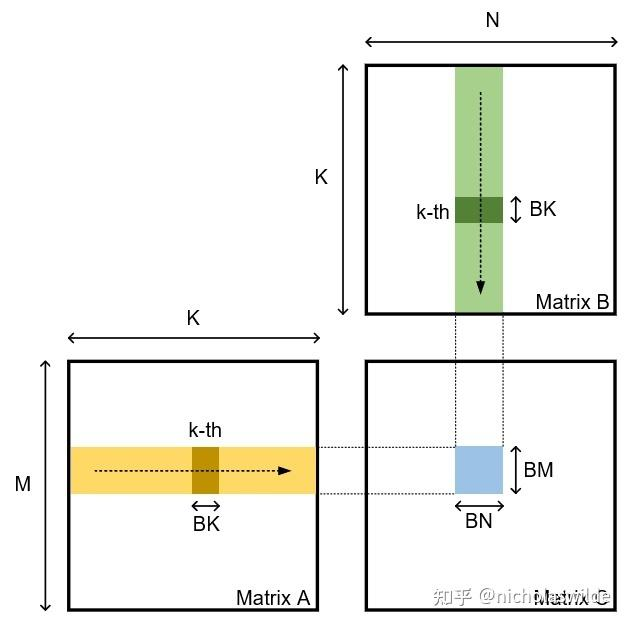

여기서는 **BM = 128, BN = 256, BK = 32, thread_per_block = 256**으로 잡습니다. 매 K 루프마다 256 스레드가 각자 A 원소 16개·B 원소 32개를 가져오고, 8개 warp 각각이 64×32×64 행렬 곱을 담당합니다. 편의상 M/N/K가 128/256/32에 정렬되어 있다고 가정하고 corner case는 다루지 않습니다. 아래는 C++ wmma API 기반의 V1 코드입니다.

```cpp
__global__ void myHGEMMAlignedV1(
    half * __restrict__ a, half * __restrict__ b, half * __restrict__ c,
    const int M, const int N, const int K) {

    const int BM = 128;
    const int BN = 256;
    const int BK = 32;

    int bx = blockIdx.x;
    int by = blockIdx.y;
    int tid = threadIdx.x;
    int wid = tid >> 5;

    const int APAD = 8;
    const int BPAD = 8;

    __shared__ half s_a[BM][BK + APAD];
    __shared__ half s_b[BK][BN + BPAD];

    wmma::fragment<wmma::matrix_a, 16, 16, 16, half, wmma::row_major> frag_a[2][4];
    wmma::fragment<wmma::matrix_b, 16, 16, 16, half, wmma::row_major> frag_b[2][4];
    wmma::fragment<wmma::accumulator, 16, 16, 16, half> frag_c[4][4];

    #pragma unroll
    for (int i = 0; i < 4; i++) {
        #pragma unroll
        for (int j = 0; j < 4; j++) {
            wmma::fill_fragment(frag_c[i][j], 0.0);
        }
    }

    int load_a_smem_m = (tid >> 2) << 1;
    int load_a_smem_k = (tid &  3) << 3;
    int load_b_smem_k = (tid >> 5) << 2;
    int load_b_smem_n = (tid & 31) << 3;

    int load_a_gmem_m = by * BM + load_a_smem_m;
    int load_b_gmem_n = bx * BN + load_b_smem_n;

    int load_a_gmem_addr = OFFSET(load_a_gmem_m, load_a_smem_k, K);
    int load_b_gmem_addr = OFFSET(load_b_smem_k, load_b_gmem_n, N);

    int comp_c_frag_m = wid &  1;
    int comp_c_frag_n = wid >> 1;

    for (int bk = 0; bk < K / BK; bk++) {
        FLOAT4(s_a[load_a_smem_m    ][load_a_smem_k]) = FLOAT4(a[load_a_gmem_addr        ]);
        FLOAT4(s_a[load_a_smem_m + 1][load_a_smem_k]) = FLOAT4(a[load_a_gmem_addr +     K]);
        FLOAT4(s_b[load_b_smem_k    ][load_b_smem_n]) = FLOAT4(b[load_b_gmem_addr        ]);
        FLOAT4(s_b[load_b_smem_k + 1][load_b_smem_n]) = FLOAT4(b[load_b_gmem_addr +     N]);
        FLOAT4(s_b[load_b_smem_k + 2][load_b_smem_n]) = FLOAT4(b[load_b_gmem_addr + 2 * N]);
        FLOAT4(s_b[load_b_smem_k + 3][load_b_smem_n]) = FLOAT4(b[load_b_gmem_addr + 3 * N]);

        load_a_gmem_addr += BK;
        load_b_gmem_addr += BK * N;

        __syncthreads();

        wmma::load_matrix_sync(frag_a[0][0], &s_a[comp_c_frag_m * 64     ][ 0], BK + APAD);
        wmma::load_matrix_sync(frag_a[0][1], &s_a[comp_c_frag_m * 64 + 16][ 0], BK + APAD);
        wmma::load_matrix_sync(frag_a[0][2], &s_a[comp_c_frag_m * 64 + 32][ 0], BK + APAD);
        wmma::load_matrix_sync(frag_a[0][3], &s_a[comp_c_frag_m * 64 + 48][ 0], BK + APAD);
        wmma::load_matrix_sync(frag_a[1][0], &s_a[comp_c_frag_m * 64     ][16], BK + APAD);
        wmma::load_matrix_sync(frag_a[1][1], &s_a[comp_c_frag_m * 64 + 16][16], BK + APAD);
        wmma::load_matrix_sync(frag_a[1][2], &s_a[comp_c_frag_m * 64 + 32][16], BK + APAD);
        wmma::load_matrix_sync(frag_a[1][3], &s_a[comp_c_frag_m * 64 + 48][16], BK + APAD);

        wmma::load_matrix_sync(frag_b[0][0], &s_b[ 0][comp_c_frag_n * 64     ], BN + BPAD);
        wmma::load_matrix_sync(frag_b[0][1], &s_b[ 0][comp_c_frag_n * 64 + 16], BN + BPAD);
        wmma::load_matrix_sync(frag_b[0][2], &s_b[ 0][comp_c_frag_n * 64 + 32], BN + BPAD);
        wmma::load_matrix_sync(frag_b[0][3], &s_b[ 0][comp_c_frag_n * 64 + 48], BN + BPAD);
        wmma::load_matrix_sync(frag_b[1][0], &s_b[16][comp_c_frag_n * 64     ], BN + BPAD);
        wmma::load_matrix_sync(frag_b[1][1], &s_b[16][comp_c_frag_n * 64 + 16], BN + BPAD);
        wmma::load_matrix_sync(frag_b[1][2], &s_b[16][comp_c_frag_n * 64 + 32], BN + BPAD);
        wmma::load_matrix_sync(frag_b[1][3], &s_b[16][comp_c_frag_n * 64 + 48], BN + BPAD);

        #pragma unroll
        for (int i = 0; i < 4; i++) {
            #pragma unroll
            for (int j = 0; j < 4; j++) {
                wmma::mma_sync(frag_c[i][j], frag_a[0][i], frag_b[0][j], frag_c[i][j]);
                wmma::mma_sync(frag_c[i][j], frag_a[1][i], frag_b[1][j], frag_c[i][j]);
            }
        }

        __syncthreads();
    }

    int store_c_gmem_m = by * BM + comp_c_frag_m * 64;
    int store_c_gmem_n = bx * BN + comp_c_frag_n * 64;
    int store_c_gmem_addr = OFFSET(store_c_gmem_m, store_c_gmem_n, N);
    #pragma unroll
    for (int i = 0; i < 4; i++) {
        #pragma unroll
        for (int j = 0; j < 4; j++) {
            wmma::store_matrix_sync(&c[store_c_gmem_addr + i * 16 * N + j * 16], frag_c[i][j], N, wmma::mem_row_major);
        }
    }
}
```

주의할 점: `LDSM`이 shared memory에서 데이터를 가져올 때 **bank conflict**가 나지 않도록, shared memory의 각 행 끝에 16바이트 패딩을 추가했습니다. 왜 16바이트 패드면 bank conflict가 사라지는지는 shared memory 상의 행렬 배치를 직접 그려보며 생각해볼 수 있습니다.

이 방식은 매우 naive하고 shared memory 낭비가 있습니다(본 커널에서는 여유가 있긴 합니다). CUTLASS는 shared memory 사용량을 늘리지 않으면서 **shared memory 읽기·쓰기 충돌을 동시에 피하는** 배치 방식을 사용합니다(GTC 2019 프리젠테이션 참고). 이 방식은 행렬 로드 시 4 스레드마다 shared memory 주소를 지정해야 하므로 stride 방식은 쓸 수 없고, C++ API와 wmma PTX로는 구현 불가능하며 **PTX의 ldmatrix 명령**이 필요합니다.

## 5. Global Memory → Shared Memory 비동기 복사

Ampere 이전에는 global → shared 복사가 레지스터를 거쳐야 했습니다(global → 레지스터 → shared). **Ampere는 global → shared 비동기 복사**를 도입하여 레지스터 중간 단계를 없애고, 중간 레지스터 사용도 절약할 수 있게 했습니다.

CUDA `cooperative_groups`와 `pipeline`에 C++ API(`cooperative_groups::memcpy_async`)가 있지만, 이 API는 **연속 데이터** 복사만 지원합니다. 행렬 곱에서 로드할 데이터는 연속적이지 않고 stride로 접근해야 해서, 여기서는 PTX 임베드 어셈블리를 사용했습니다.

PTX 비동기 복사 명령은 네 가지이며, dst/src/size 외에 L1·L2 캐시 동작도 지정할 수 있습니다.

```
cp.async.ca.shared.global{.level::cache_hint}{.level::prefetch_size}
 [dst], [src], cp-size{, src-size}{, cache-policy} ;
cp.async.cg.shared.global{.level::cache_hint}{.level::prefetch_size}
 [dst], [src], 16{, src-size}{, cache-policy} ;
cp.async.ca.shared.global{.level::cache_hint}{.level::prefetch_size}
 [dst], [src], cp-size{, ignore-src}{, cache-policy} ;
cp.async.cg.shared.global{.level::cache_hint}{.level::prefetch_size}
 [dst], [src], 16{, ignore-src}{, cache-policy} ;
.level::cache_hint = { .L2::cache_hint }
.level::prefetch_size = { .L2::64B, .L2::128B, .L2::256B }
cp-size = { 4, 8, 16 }
```

비동기 복사 명령 뒤에는 `cp.async.commit_group` + `cp.async.wait_group` 또는 `cp.async.wait_all`을 사용해 복사 완료를 기다립니다.

GEMM 커널의 A·B global → shared 복사를 비동기 복사로 바꾼 V2 커널:

```cpp
__global__ void myHGEMMAlignedV2(
    half * __restrict__ a, half * __restrict__ b, half * __restrict__ c,
    const int M, const int N, const int K) {

    const int BM = 128;
    const int BN = 256;
    const int BK = 32;

    int bx = blockIdx.x;
    int by = blockIdx.y;
    int tid = threadIdx.x;
    int wid = tid >> 5;

    const int APAD = 8;
    const int BPAD = 8;

    __shared__ half s_a[BM][BK + APAD];
    __shared__ half s_b[BK][BN + BPAD];

    wmma::fragment<wmma::matrix_a, 16, 16, 16, half, wmma::row_major> frag_a[2][4];
    wmma::fragment<wmma::matrix_b, 16, 16, 16, half, wmma::row_major> frag_b[2][4];
    wmma::fragment<wmma::accumulator, 16, 16, 16, half> frag_c[4][4];

    #pragma unroll
    for (int i = 0; i < 4; i++) {
        #pragma unroll
        for (int j = 0; j < 4; j++) {
            wmma::fill_fragment(frag_c[i][j], 0.0);
        }
    }

    int load_a_smem_m = (tid >> 2) << 1;
    int load_a_smem_k = (tid &  3) << 3;
    int load_b_smem_k = (tid >> 5) << 2;
    int load_b_smem_n = (tid & 31) << 3;

    int s_a_base_addr = __cvta_generic_to_shared(s_a[0]);
    int s_b_base_addr = __cvta_generic_to_shared(s_b[0]);
    int load_a_smem_addr_0 = s_a_base_addr + OFFSET(load_a_smem_m, load_a_smem_k, BK + APAD) * sizeof(half);
    int load_a_smem_addr_1 = load_a_smem_addr_0 + (BK + APAD) * sizeof(half);
    int load_b_smem_addr_0 = s_b_base_addr + OFFSET(load_b_smem_k, load_b_smem_n, BN + BPAD) * sizeof(half);
    int load_b_smem_addr_1 = load_b_smem_addr_0 +     (BN + BPAD) * sizeof(half);
    int load_b_smem_addr_2 = load_b_smem_addr_0 + 2 * (BN + BPAD) * sizeof(half);
    int load_b_smem_addr_3 = load_b_smem_addr_0 + 3 * (BN + BPAD) * sizeof(half);

    int load_a_gmem_m = by * BM + load_a_smem_m;
    int load_b_gmem_n = bx * BN + load_b_smem_n;

    int load_a_gmem_addr = OFFSET(load_a_gmem_m, load_a_smem_k, K);
    int load_b_gmem_addr = OFFSET(load_b_smem_k, load_b_gmem_n, N);

    int comp_c_frag_m = wid &  1;
    int comp_c_frag_n = wid >> 1;

    for (int bk = 0; bk < K / BK; bk++) {

        asm ("cp.async.ca.shared.global [%0], [%1], 16;\n" :
            : "r"(load_a_smem_addr_0), "l"(&a[load_a_gmem_addr        ]));
        asm ("cp.async.ca.shared.global [%0], [%1], 16;\n" :
            : "r"(load_a_smem_addr_1), "l"(&a[load_a_gmem_addr +     K]));
        asm ("cp.async.ca.shared.global [%0], [%1], 16;\n" :
            : "r"(load_b_smem_addr_0), "l"(&b[load_b_gmem_addr        ]));
        asm ("cp.async.ca.shared.global [%0], [%1], 16;\n" :
            : "r"(load_b_smem_addr_1), "l"(&b[load_b_gmem_addr +     N]));
        asm ("cp.async.ca.shared.global [%0], [%1], 16;\n" :
            : "r"(load_b_smem_addr_2), "l"(&b[load_b_gmem_addr + 2 * N]));
        asm ("cp.async.ca.shared.global [%0], [%1], 16;\n" :
            : "r"(load_b_smem_addr_3), "l"(&b[load_b_gmem_addr + 3 * N]));

        load_a_gmem_addr += BK;
        load_b_gmem_addr += BK * N;

        asm ("cp.async.commit_group;\n" ::);
        asm ("cp.async.wait_group 0;\n" ::);

        __syncthreads();

        // ... (wmma::load_matrix_sync × 16, mma_sync × 32, V1과 동일)

        __syncthreads();
    }

    // store 부분 V1과 동일
}
```

임베드 PTX 어셈블리에서 **shared memory 포인터를 특별히 처리**해야 하는 점이 중요합니다. `&smem[...]`로 얻는 값은 generic 포인터(8바이트)인데, 그대로 shared memory 주소로 쓰면 shared memory 주소 범위를 초과할 수 있습니다. 따라서 `__cvta_generic_to_shared()`를 사용하거나 8바이트 값과 `0xFFFFFF`를 AND 연산하여 shared memory 주소 공간을 가리키도록 해야 합니다.

Global → Shared 비동기 복사 도입만으로 **약 5~10 TFLOPS** 향상이 있었습니다.

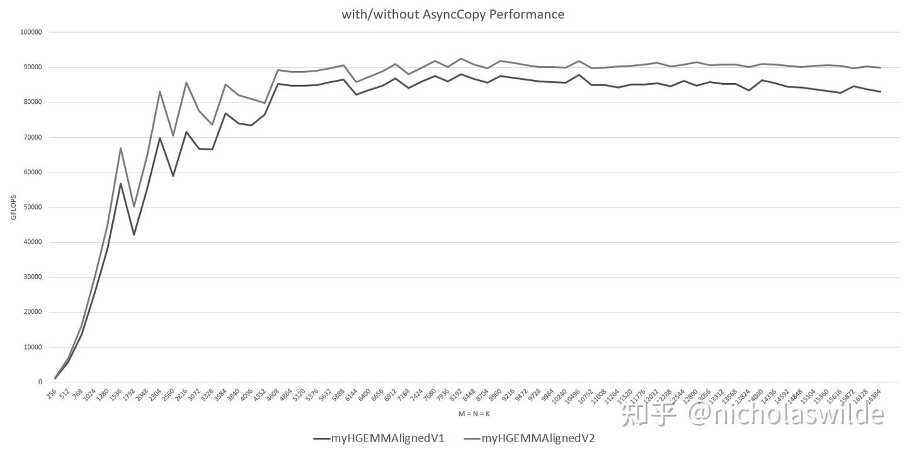

## 6. Double Buffer

Double Buffer의 목적은 **다음 계산에 쓸 데이터를 global → shared로 로드하는 동시에 이번 계산을 진행**하여 메모리 지연을 감추는 것입니다. Double buffer 커널의 가장 이상적인 작성법은 저도 확실히 모릅니다. 아래는 성능이 향상된 여러 시도 중 하나이며, NVIDIA 포럼에는 C++ API의 `pipeline`으로 구현한 사례도 있습니다.

```cpp
__global__ void myHGEMMAlignedV3(
    half * __restrict__ a, half * __restrict__ b, half * __restrict__ c,
    const int M, const int N, const int K) {

    const int BM = 128;
    const int BN = 256;
    const int BK = 32;

    // ...

    extern __shared__ half smem[];
    half *s_a = smem;
    half *s_b = smem + 2 * BM * (BK + APAD);
    int s_a_db_offset = BM * (BK + APAD);
    int s_b_db_offset = BK * (BN + BPAD);

    // ... fragments 및 주소 계산 ...

    // === 첫 로드(프롤로그) ===
    {
        // 6개의 cp.async로 A·B 타일을 shared memory 전반부에 비동기 로드
        asm ("cp.async.commit_group;\n" ::);
        asm ("cp.async.wait_group 0;\n" ::);
        __syncthreads();
    }

    // === 메인 루프: 다음 타일 로드와 현재 타일 계산을 동시에 ===
    for (int bk = 1; bk < K / BK; bk++) {
        int smem_sel      = (bk & 1) ^ 1;        // 이번 계산에 쓸 버퍼
        int smem_sel_next = ((bk - 1) & 1) ^ 1;  // 로드할 버퍼(다음)

        load_a_gmem_addr += BK;
        load_b_gmem_addr += BK * N;

        // 다음 타일 비동기 로드 (smem_sel_next 쪽)
        asm ("cp.async.ca.shared.global [%0], [%1], 16;\n" :
            : "r"(load_a_smem_addr_0 + smem_sel_next * s_a_db_offset * (int)sizeof(half)),
              "l"(&a[load_a_gmem_addr        ]));
        // ... (A 나머지·B 5개 동일 패턴)

        // 현재 타일(smem_sel)로 mma_sync 수행
        // wmma::load_matrix_sync × 16 + mma_sync × 32

        asm ("cp.async.commit_group;\n" ::);
        asm ("cp.async.wait_group 0;\n" ::);
        __syncthreads();
    }

    // === 마지막 타일 계산(에필로그) ===
    int smem_sel = ((K / BK) & 1) ^ 1;
    // wmma::load_matrix_sync × 16 + mma_sync × 32 + store
}
```

주의: double buffer는 shared memory를 두 배로 씁니다. 48 KB를 초과하면 **동적 shared memory**를 써야 합니다(`extern __shared__ half smem[];`). 커널 호출 시 크기를 지정해야 하고, `smem`은 1차원 배열로 주소 계산해야 합니다.

```cpp
const int BM = 128, BN = 256, BK = 32;
dim3 blockDim(256);
int BX = (N + BN - 1) / BN;
int BY = (M + BM - 1) / BM;
dim3 gridDim(BX, BY);

cudaFuncSetAttribute(gemmBK32WmmaAsyncDSMemDB, cudaFuncAttributeMaxDynamicSharedMemorySize, 98304);

unsigned int dsmem = 2 * (BM * (BK + 8) + BK * (BN + 8)) * sizeof(half);
gemmBK32WmmaAsyncDSMemDB<<<gridDim, blockDim, dsmem>>>(a, b, c, M, N, K);
```

Double Buffer의 효과는 **즉각적**입니다. 약 **20~25 TFLOPS** 향상.

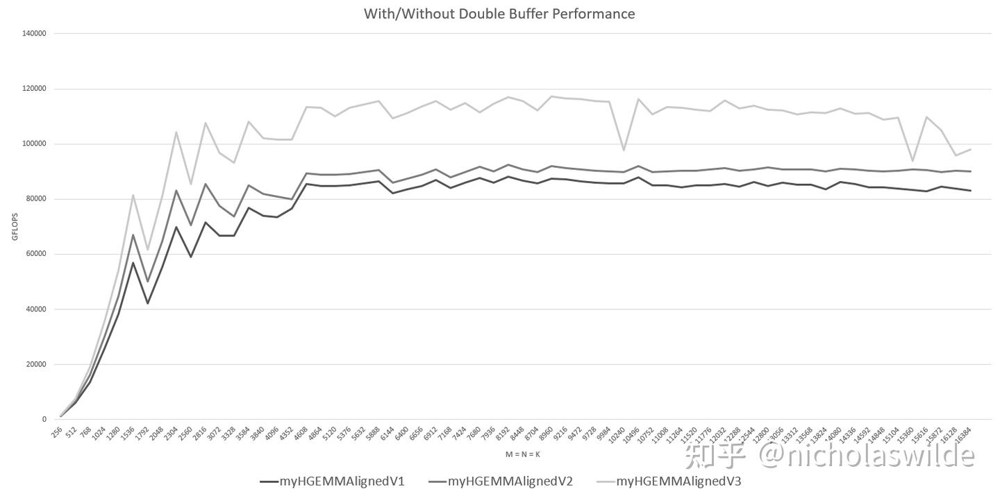

## 7. L2 Cache 지역성 향상

RTX 3090은 SM 82개입니다. 계산해보니 `gemmBK32WmmaAsyncDSMemDB` 커널은 SM당 block 하나만 수용할 수 있습니다. 대규모 행렬 곱의 block 수가 82를 초과하면 **`gridDim.z → gridDim.y → gridDim.x` 순서**로 스케줄됩니다.

예를 들어 M = N = K = 16384면 C는 128×64 타일로 분할됩니다. 정상 스케줄링 순서대로라면 C 첫 행의 64 타일과 두 번째 행 앞 18개가 먼저 스케줄됩니다. 이 경우 A의 지역성은 좋지만 B의 접근 지역성은 최악입니다. 저는 **처음 1~5행의 앞 16개 block + 6행의 앞 2개 block**이 먼저 스케줄되어 A·B의 지역성이 균형을 이루도록 바꾸고 싶었습니다.

커널 호출 코드에서 디폴트 스케줄링 순서를 이용하여 `gridDim.z` 차원을 추가합니다. `NSPLIT`은 C 한 행에서 이 만큼 스케줄되면 다음 행으로 넘어가는 단위입니다.

```cpp
const int BM = 128, BN = 256, BK = 32;
dim3 blockDim(256);
int BX = (N + BN - 1) / BN;
int BY = (M + BM - 1) / BM;

const int NSPLIT = 4096;
int split_num = (N + NSPLIT - 1) / NSPLIT;
dim3 gridDim((BX + split_num - 1) / split_num, BY, split_num);

cudaFuncSetAttribute(gemmBK32WmmaAsyncDSMemDB, cudaFuncAttributeMaxDynamicSharedMemorySize, 98304);

unsigned int dsmem = 2 * (BM * (BK + 8) + BK * (BN + 8)) * sizeof(half);
gemmBK32WmmaAsyncDSMemDB<<<gridDim, blockDim, dsmem>>>(a, b, c, M, N, K);
```

커널도 그에 맞춰 수정합니다.

```cpp
__global__ void myHGEMMAlignedV4(
    half * __restrict__ a, half * __restrict__ b, half * __restrict__ c,
    const int M, const int N, const int K) {

    // ...

    // int bx = blockIdx.x;  // 기존
    int bx = blockIdx.z * gridDim.x + blockIdx.x;  // 변경
    if (bx >= N / BN || by >= M / BM)
        return;

    // ...
}
```

기대와 달리 **`NSPLIT = 256`은 매우 나빴고**, 512/1024/2048/4096/8192는 `V3`와 비슷했으며, 16384 근방에서만 명확한 개선을 보였습니다. 최적화를 살리기 위해 `NSPLIT = 4096`을 채택했습니다.

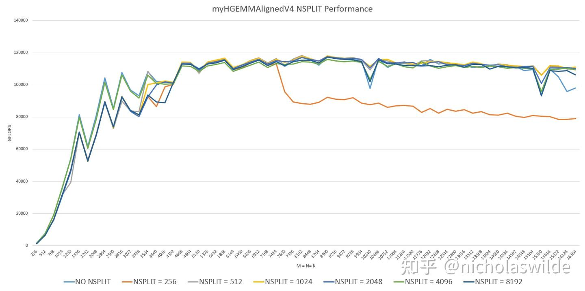

## 8. 컴파일러에 재량 주기

사실 V3(double buffer)에서 이미 cuBLAS를 대체로 넘어섰습니다. 마지막으로 컴파일러에게 메인 루프 **언롤링 힌트**를 주어 추가 향상을 노립니다.

```cpp
__global__ void myHGEMMAlignedV4(
    half * __restrict__ a, half * __restrict__ b, half * __restrict__ c,
    const int M, const int N, const int K) {

    // ...

    #pragma unroll 32
    for (int bk = 1; bk < K / BK; bk++) {
        // ...
    }

    // ...
}
```

테스트 결과, 언롤 없을 때보다 약 **15 TFLOPS** 향상되어 cuBLAS를 전 구간에서 상회합니다. M = N = K > 4096에서는 언롤 8 이상에서 추가 향상이 없지만, 작은 MNK에서는 32까지 계속 개선됩니다.

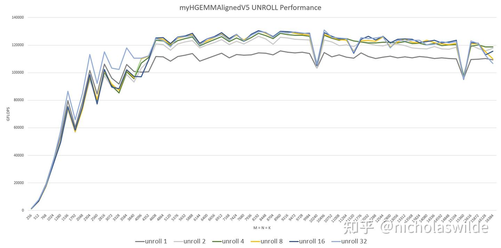

## 9. 마치며

이상으로 본 글은 마무리합니다. Tensor Core 사용법을 학습하고, FP16 행렬 곱을 cuBLAS 수준까지 최적화하는 데 성공했습니다. 일부 성능 이득은 MNK 정렬 가정(즉, corner case 미처리)에서 왔다는 점도 유념해주세요.

최종 성능 곡선:


다음 글에서는 convolution 커널을 다룰 예정입니다.

## 10. Reference

- 《NVIDIA A100 Tensor Core GPU Architecture》 Whitepaper
- 《NVIDIA AMPERE GA102 GPU ARCHITECTURE》 Whitepaper
- 《NVIDIA TESLA V100 GPU ARCHITECTURE》 Whitepaper
- 《CUDA C++ Programming Guide v11.5》
- 《Parallel Thread Execution ISA Application Guide v7.5》
- CUDA SGEMM 행렬 곱 최적화 노트 — 입문부터 cuBLAS까지
- NVIDIA GeForce RTX 3090 Specs | TechPowerUp GPU Database
- 《Modeling Deep Learning Accelerator Enabled GPUs》
- 3세대 Tensor Core A100의 처리량 두 배 구현 — 哔哩哔哩
- https://developer.nvidia.com/blog/controlling-data-movement-to-boost-performance-on-ampere-architecture/
- https://github.com/NVIDIA/cutlass
- https://developer.download.nvidia.cn/video/gputechconf/gtc/2019/presentation/s9593-cutensor-high-performance-tensor-operations-in-cuda-v2.pdf
- https://forums.developer.nvidia.com/t/problem-about-ptx-instruction-cp-async-ca-shared-global/224219/3
