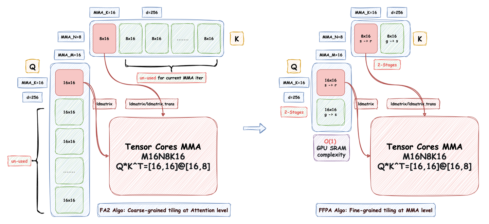
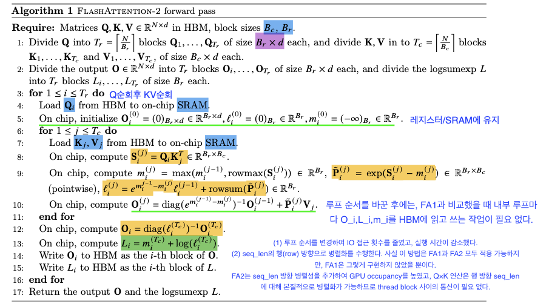
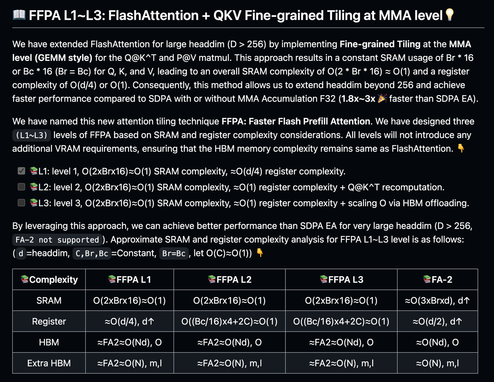
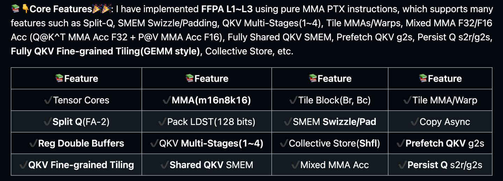
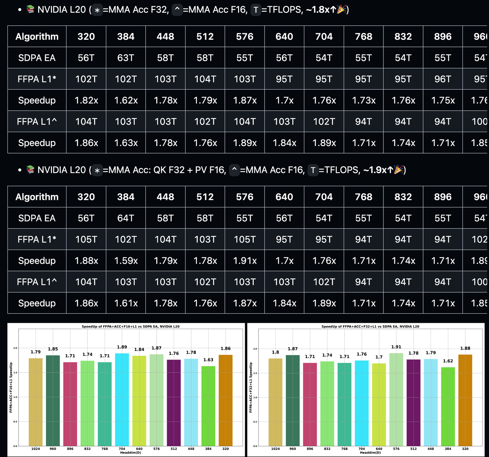
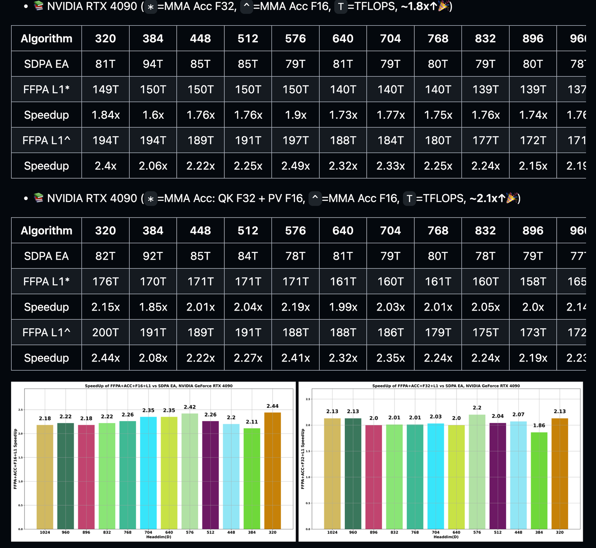
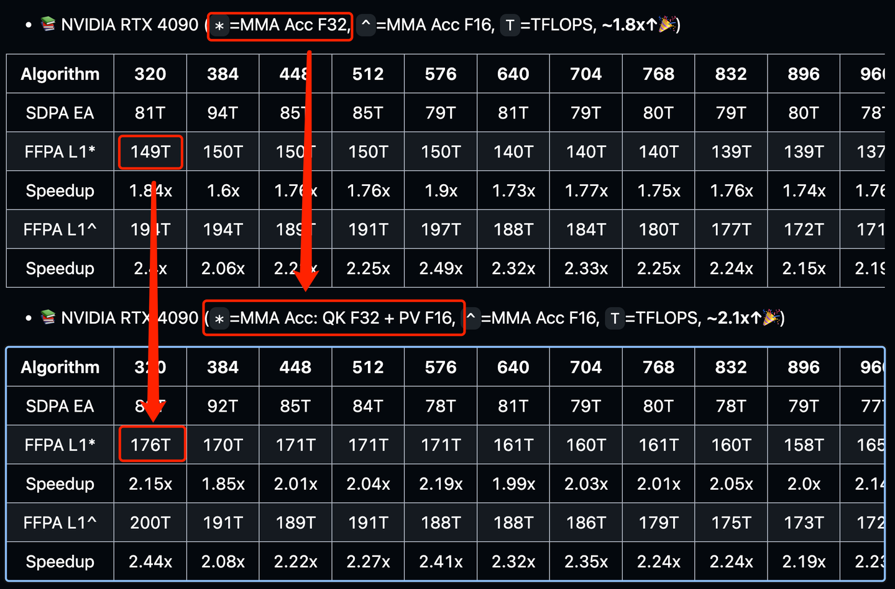

# FFPA(Split-D): FA2 무한 HeadDim 확장, SDPA EA 대비 2x 이상 빠른 FlashAttention 최적화


## 0x00 머리말



얼마 전 xlite-dev/CUDA-Learn-Notes에서 **FlashAttention을 재현하며 즉흥적으로 끄적였던** 최적화를 xlite-dev/ffpa-attn-mma repo로 옮겨 다듬었다. 최적화된 알고리즘은 일단 **FFPA(Split-D)**: Yet another Faster Flash Prefill Attention with **O(1) SRAM complexity** for **large headdim** (D > 256), **SDPA EA** 대비 **1.8x~3x↑** 빠르다.

실제 응용에서 headdim > 256인 경우는 많지 않다. 옛 Diffusion 모델 일부에서나 보일 정도고, 대부분의 LLM/VLM과 현재 DiT 구조의 Diffusion 모델은 headdim ≤ 256이다. 그래서 FFPA를 만들 때는 "그냥 한번 시도해 보자"는 마음이었는데, 의외로 동작했다. 만들어 두고 한쪽에 묵혀 둔 상태였다. 응용 영역은 좁지만, 최근 화제가 된 DeepSeek의 **MLA** 부분에 FFPA의 아이디어를 적용해 fully fused MLA로 구현해 봄 직하다. 행렬 흡수 후 MLA는 대형 headdim의 Attention과 닮았기 때문이다. 오늘은 구덩이 메우는 차원에서 FFPA의 아이디어와 고민한 지점을 간단히 정리한다. 이 글을 읽으려면 FlashAttention의 기본 지식이 필요하다. 다음 글을 참고하자.


*[Attention 최적화][2w자] 원리편: Online-Softmax에서 FlashAttention V1/V2/V3까지*

저자의 더 많은 기술 노트와 CUDA 학습 노트는 LeetCUDA에서 확인할 수 있다. LLM/VLM 글 정리와 FlashAttention, SGEMM, HGEMM, GEMV 같은 대표 CUDA kernel 예제 구현이 포함되어 있고, 누적 3k+ stars를 기록했다.

## 0x01 주요 기여

FFPA의 기여를 빠르게 짚으면:

- MMA level에서 tiling, 즉 **세립도 tiling 알고리즘 Split-D (Split Headdim)**을 도입해 FlashAttention 알고리즘을 확장했다. **O(1) SRAM 요구 복잡도**를 달성해 FlashAttention의 **headdim을 1024** (혹은 그 이상)까지 확장할 수 있어 더 범용적이 된다.
- headdim > 256일 때 SDPA EA(Memory Efficient Attention) 대비 **1.8x~3x** 빠르고 정확도 손실이 없다.
- QKᵀ와 PV에 혼합 정밀도를 지원해 추가 성능 이득을 얻는다(예: 4090).

다만 다시 한번 강조하자면, headdim > 256인 응용은 드물고, FlashAttention에 PR을 올릴 동력도 당분간 없다. forward/backward 양쪽 변경량이 너무 크기 때문이다.

## 0x02 고민한 지점

FFPA가 고민한 핵심은 다음이다. FlashAttention은 LLM 시대에 내가 가장 좋아하는 알고리즘 중 하나지만, 처음 사용할 때부터 한 가지가 늘 의아했다. FlashAttention이 지원하는 headdim이 유한하고 현재 최대 256까지밖에 안 된다는 점이다. 직관적으로 보면 이상하다. 왜냐하면 **FlashAttention의 핵심은 QKᵀ와 PV 두 개의 matmul**이고, SRAM과 register 자원을 가장 많이 쓰는 것도 이 두 matmul이다. 반정밀도면 결국 두 개의 HGEMM이다. 그런데 HGEMM을 직접 짜본 사람은 안다. HGEMM의 경우 **K 차원이 SRAM과 register에 bound되지 않는다**. 이론적으로 MNK 모두 무한대까지 키울 수 있다(메모리만 충분하다면). **그러면 왜 FlashAttention은 무한대 headdim을 지원하지 못할까? 분명히 자연스럽지 못하다.** 이게 내가 고민한 지점이었다.

## 0x03 FlashAttention 복습

FlashAttention 알고리즘을 간단히 복습하자. FlashAttention-1은 건너뛰고 FlashAttention-2로 바로 간다. 전체 V1/V2/V3 해설은 별도 글 참고.

### seqlen 차원 병렬

Attention 계산에서 query마다의 Attention 계산은 완전히 독립적이다. FlashAttention-2는 외부 루프에서 Q를 먼저 load한다. 따라서 서로 다른 query block의 Attention을 서로 다른 thread block에 할당할 수 있고, 이들 thread block 간 통신은 필요 없다. forward pass는 Q block [Br, d]을 SRAM에 load한 뒤, K, V block [Bc, d]를 차례로 SRAM에 load한다.

thread block 관점에서 각 block은 Q의 일부를 담당하므로 block이 가지는 Q는 고정이고, 서로 다른 block이 가지는 Q는 겹치지 않는다. K, V block은 Tc for loop에서 매번 갱신된다. Q, K, V block 데이터가 SRAM에 올라오면, 핵심인 QKᵀ와 PV matmul을 수행한다.


*FlashAttention-2 forward pass*

### Headdim ≤ 256의 결정 요인

Split-Q, backward pass 같은 세부는 일단 무시한다. FFPA에서는 forward pass의 분할 사고만 살피면 충분하다. FlashAttention 알고리즘에는 **Block Size** 개념(Br, Bc)이 있다.

```
Bc = ⌈M / (4d)⌉
Br = min(⌈M / (4d)⌉, d)
```

이 설정의 목적은 Q, K, V의 작은 block 모두를 SRAM에 담는 것이다. 여기서 M은 시스템이 사용할 수 있는 SRAM 상한이다. 각 Q 분할 Q_i, O_i와 K, V 분할 K_j, V_j에 필요한 공유 메모리는:

```
SRAM(Q_i) = Br · d = min(⌈M/(4d)⌉, d) · d  <  ⌈M/4⌉
SRAM(O_i) = Br · d = min(⌈M/(4d)⌉, d) · d  <  ⌈M/4⌉
SRAM(K_j, V_j) = 2 · Bc · d = 2 · ⌈M/(4d)⌉ · d  <  ⌈M/2⌉
```

여기에 ℓ_i, m_i가 차지하는 저장 공간을 합치면 사용 가능한 SRAM을 거의 다 채운다. 물론 이는 의사 코드 수준의 분석이고 엔지니어링 구현에서는 세부 차이가 있지만 큰 흐름은 같다.

관찰: **FlashAttention의 SRAM 요구량은 Br/Bc와 headdim(d)에 의존한다. Br, Bc는 상수로 보통 64나 128을 쓰고, d가 가변이다. 따라서 FlashAttention의 SRAM 복잡도는 O(d)이며, headdim이 너무 크면 shared memory가 부족해 FlashAttention이 큰 headdim에서 동작하지 못한다.**

## 0x04 세립도 분할: Split-D (Split Headdim)

앞 절에서 본 결론: FlashAttention의 현재 분할 알고리즘은 SRAM 복잡도 O(d)다. **FlashAttention의 핵심은 QKᵀ와 PV 두 matmul**이고 가장 SRAM·register 자원을 많이 쓰는 부분도 이 둘이다. 반정밀도면 두 개의 HGEMM이지만, HGEMM은 **K 차원이 SRAM·register에 bound되지 않으므로** 이론적으로 MNK 모두 무한대까지 가능하다(메모리만 충분하면). 그러면 HGEMM처럼 FlashAttention을 SRAM 복잡도 O(1) 알고리즘으로 바꿀 수 있을까?

### SRAM에서 놀고 있는 데이터

**가능하다.** QKᵀ와 PV matmul에서 SRAM 위의 Q_i, K_i, V_i 사용 패턴을 자세히 보면, Tensor Cores MMA 한 번 실행에 쓰는 데이터는 Q_i [Br, d]와 [Bc, d] 중 일부에 불과하다. 예컨대 M16N8K16 크기 MMA 명령을 쓴다고 하자.

```cpp
template <MMAMode mma_mode = MMAMode::kInplaceUpdate>
__device__ __forceinline__ void m16n8k16_f16f16f32(
  uint32_t * RD0, uint32_t * RD1, uint32_t * RD2, uint32_t * RD3,
  uint32_t * RA0, uint32_t * RA1, uint32_t * RA2, uint32_t * RA3,
  uint32_t * RB0, uint32_t * RB1
) {
  // "h" = .u16 reg; "r" = .u32 reg; "l" = .u64 reg;
  // "f" = .f32 reg; "d" = .f64 reg
  if constexpr (mma_mode == MMAMode::kInplaceUpdate) {
    asm volatile(
      "mma.sync.aligned.m16n8k16.row.col.f32.f16.f16.f32 "
      "{%0,  %1,  %2,  %3}, "
      "{%4,  %5,  %6,  %7}, "
      "{%8,  %9}, "
      "{%10, %11, %12, %13};\n"
      : "=r"(RD0[0]), "=r"(RD1[0]), "=r"(RD2[0]), "=r"(RD3[0])
      : "r"(RA0[0]), "r"(RA1[0]), "r"(RA2[0]), "r"(RA3[0]),
        "r"(RB0[0]), "r"(RB1[0]),
        "r"(RD0[0]), "r"(RD1[0]), "r"(RD2[0]), "r"(RD3[0])
    );
  } else {
    // ......
  }
}
```

실제로 SRAM에서 매번 쓰는 데이터의 shape는 고정이다. 예를 들어 Q_i [Br, d]에서 [16, 16]을 가져오고 K_i [Bc, d]에서 [8, 16]을 가져와 QKᵀ MMA 한 번을 수행한다. 이 과정에서 현재 사용 중인 [16, 16], [8, 16]을 제외한 나머지 SRAM 데이터는 즉시 필요하지 않다. 즉 FlashAttention의 [Br, d] 분할 방식에서는 여러 라운드의 MMA iteration 동안 SRAM 데이터가 한가하게 놀고, 동시에 SRAM 사용량이 headdim에 선형 비례해 큰 headdim을 지원하지 못하는 원인이 된다.

### Split-D (Split Headdim): MMA level QKV Fine-grained tiling


SRAM 데이터의 사용 양상을 짚었다면 FlashAttention이 더 큰 headdim을 지원하도록 확장하는 방법은 직관적이다. **Split-D (Split Headdim), 즉 Headdim 차원에서도 tiling을 계속하면 된다.** 핵심은 [Br, d]를 [Br, 16]으로 바꾸고, 늘어난 SRAM/HBM IO access는 multi-stages로 가린다. Br/Bc가 상수(예: 64)이므로 SRAM 사용량은 [64, 16] 상수가 되어 headdim에 무관해진다. O(1) SRAM 복잡도다. 그래서 headdim을 매우 크게 확장할 수 있다. **FFPA**가 정확히 그렇게 한다. FFPA 코드 일부:

```cpp
#pragma unroll
for (int tile_K_d = 0; tile_K_d < (kHeadDim / kMmaAtomK); ++tile_K_d) {
  const int smem_sel      = (tile_K_d) % kStageQK;
  const int smem_sel_next = (tile_K_d + (kStageQK - 1)) % kStageQK;
  // QK g2s, kPersistQs2r or not.
  if constexpr (kPersistQs2r) {
    // .....
  } else {
    if constexpr (!kPersistQg2s) {
      prefill::cp_async_qkv_g2s<
        Br, Q_tile_size, kHeadDim, kMmaAtomK, kNumThreads, kPadQ>(
          smem_Q_base_ptr, Q, Q_gmem_offset, Q_tile_id,
          (kStageQK > 1) ? (tile_K_d + (kStageQK - 1)) : tile_K_d,
          (kStageQK > 1) ? smem_sel_next : smem_sel
      );
    }
  }

  prefill::cp_async_qkv_g2s<
    Bc, K_tile_size, kHeadDim, kMmaAtomK, kNumThreads, kPadK>(
      smem_K_base_ptr, K, K_gmem_offset, tile_K_seqlen,
      (kStageQK > 1) ? (tile_K_d + (kStageQK - 1)) : tile_K_d,
      (kStageQK > 1) ? smem_sel_next : smem_sel
  );
  cp_async::commit_group(); // pack QK as 1 group.
  // ......
  // Q s2r
  static_assert(kWarpTileSeqLenQ == 1);
  {
    prefill::sync_fetch_qkv_frags_s2r<
       0, 4, Q_tile_size, kMmaAtomM, kMmaAtomN, kMmaAtomK, kPadQ>(
         smem_Q_base_ptr, &R_Q[0][0][0], warp_QP, 0, 0, smem_sel
    );
  }

  // K s2r
  #pragma unroll
  for (int j = 0; j < kWarpTileSeqLenK; ++j) {
      prefill::sync_fetch_qkv_frags_s2r<
        0, 2, K_tile_size, kMmaAtomM, kMmaAtomN, kMmaAtomK, kPadK>(
          smem_K_base_ptr, &R_K[j][0], warp_KV, j, 0, smem_sel
      );
  }
  // Q@K^T MMA compute
  static_assert(kWarpTileSeqLenQ == 1);
  { // kWarpTileSeqLenQ = 1
    const int q_offset = (kPersistQs2r) ? (tile_K_d) : 0; // (tile_K_d)
    #pragma unroll
    for (int j = 0; j < kWarpTileSeqLenK; ++j) {
      const int k_offset = (kRegPipeKV) ? reg_ld_idx : j;
      if constexpr (kMmaAccFloat32QK) {
        mma::m16n8k16_f16f16f32<MMAMode::kInplaceUpdate>(
          &R_S[0][j][0],        &R_S[0][j][1], &R_S[0][j][2], &R_S[0][j][3],
          &R_Q[0][q_offset][0], &R_Q[0][q_offset][1],
          &R_Q[0][q_offset][2], &R_Q[0][q_offset][3],
          &R_K[k_offset][0],    &R_K[k_offset][1]
        );
      } else {
        mma::m16n8k16_f16f16f16<MMAMode::kInplaceUpdate>(
          &R_S[0][j][0],        &R_S[0][j][1],
          &R_Q[0][q_offset][0], &R_Q[0][q_offset][1],
          &R_Q[0][q_offset][2], &R_Q[0][q_offset][3],
          &R_K[k_offset][0],    &R_K[k_offset][1]
        );
      }
    }
  }

  if constexpr (kStageQK > 1) {
    if (tile_K_d < (kHeadDim / kMmaAtomK - 1)) {
      cp_async::wait_group<(kStageQK - 2)>();
      __syncthreads();
    }
  }
} // end loop over d, S=Q@K^T
__syncthreads();
```

전체 코드는 `ffpa_attn_templates_L1.cuh`.

### 추가 확장

Split-D를 구현했다고 해서 FlashAttention의 headdim을 무한대까지 확장할 수 있는 것은 아니다. register 복잡도는 여전히 headdim에 선형 비례하기 때문이다. 대략 O(d/2) 또는 O(d/4) 수준이다. FFPA 코드로 짧게 분석해 보자(FlashAttention 공식 코드도 Split-Q를 쓰는 한 비슷한 register 복잡도를 피할 수 없다). `R_D`는 Tc 루프에서 보정된 전역 결과를 저장하는 register로, headdim에 따라 register 수요가 늘어난다.

```cpp
// ---------------------- Registers for S=Q@K^T/O=P@V ----------------------------
// e.g, 64, !kPersistQs2r -> [1][4] 4 regs, kPersistQs2r -> [1][4*4] 16 regs.
uint32_t R_Q[kWarpTileSeqLenQ][(kPersistQs2r) ? (kHeadDim / kMmaAtomK) : 1][4];
// R_K [8][2] w/o registers ping pong buffers, [2][2] w/ registers ping pong buffers.
uint32_t R_K[(kRegPipeKV) ? 2: kWarpTileSeqLenK][2]; // [8][2] or [2][2]
// R_V [2][2] w registers ping pong buffers, [1][2] w/o registers ping pong buffers.
uint32_t R_V[(kRegPipeKV) ? 2: 1][2]; // [1][2], S=Q@K, only use 2 32bits registers.
// e.g [1][8][2], MMA Acc fp16; [1][8][4], MMA Acc fp32;
uint32_t R_S[kWarpTileSeqLenQ][kWarpTileSeqLenK][(kMmaAccFloat32QK) ? 4 : 2];
uint32_t R_O[(kMmaAccFloat32PV) ? 4 : 2]; // registers for O=PV[Br,d]=P@V, [4 or 2]
uint32_t R_D[kWarpTileSeqLenP][kWarpTileHeadDimV][(kOStorageAccFloat32) ? 4 : 2];
utils::fill_3D_regs<uint32_t, kWarpTileSeqLenP, kWarpTileHeadDimV,
                    ((kOStorageAccFloat32) ? 4 : 2)>(R_D, 0);
```

따라서 headdim이 1024를 넘어가면 register가 폭주한다. 필요한 register가 256(CUDA에서 thread 하나가 사용할 수 있는 최대 register 수)을 넘어가 성능이 급락한다. headdim을 무한대로 확장하려면 register 복잡도 문제도 풀어야 한다. 물론 그냥 폭주하게 두고 돌릴 수도 있다. **이런 고려로 SRAM·register 복잡도에 따라 FFPA L1-L3 3단계 design을 설계했다** (현재는 L1만 구현).


*FFPA L1~L3: FlashAttention + QKV Fine-grained Tiling at MMA level*

L2, L3까지 구현하면 설계상 headdim을 무한대까지 지원할 수 있지만 성능은 장담하기 어렵다. 현재 L1만 구현했다. 다시 말하지만 headdim > 256 응용 영역이 너무 좁아 L2, L3 구현에 동력이 없다.

## 0x05 엔지니어링 구현

아직 cutlass cute로 작성하지는 않았고, 현재 버전은 MMA PTX로 손수 짠 것이다. register 제어를 유연하게 가져갈 수 있어서다. 시간이 되면 cutlass cute 버전도 작성할 예정이다. FFPA Kernel이 현재 지원하는 기능:

- Split-Q
- SMEM Swizzle/Padding
- QKV Multi-Stages (1~4)
- Tile MMAs/Warps
- Mixed MMA F32/F16 Acc (Q@Kᵀ MMA Acc F32 + P@V MMA Acc F16)
- Fully Shared QKV SMEM
- Prefetch QKV g2s
- Persist Q s2r/g2s
- **Fully QKV Fine-grained Tiling (GEMM style)**
- Collective Store
- Reg Double Buffers 등


*FFPA Kernel Core Features*

각 feature마다 구현 세부가 따로 있고, 관심 있는 사람은 직접 코드를 보면 된다(ffpa-attn-mma). 추후 별도 글로 다룰 수도 있겠다. Tile Block, Tile MMAs, Copy Async, Multi-Stage, Reg Double Buffers는 HGEMM의 고전 최적화 기법이다. 특히 Multi-Stage와 Reg Double Buffers는 Split-D (Split Headdim) 알고리즘에 그대로 가져다 쓸 수 있다. Split-Q는 FA에서 자연스럽게 이어받은 것으로 Split-D와 충돌하지 않는다. Collective Store는 warp shuffle 명령으로 추가 SRAM 없이 128 bits 대단어 store를 구현한다. Mixed MMA F32/F16 Acc는 혼합 정밀도, 예컨대 Q@Kᵀ MMA Acc F32 + P@V MMA Acc F16. 그 외 SRAM 공유, Q s2r/g2s 영속화 등의 전략도 있다. 함수 시그니처:

```cpp
template<
  const int kHeadDim,              // Headdim, 32~1024
  const int kMmaAtomM,             // MMA Atom M, 16
  const int kMmaAtomN,             // MMA Atom N, 8
  const int kMmaAtomK,             // MMA Atom K, 16
  const int kMmaTileSeqLenQ,       // 4, more MMA(warp), M=16*4=64, Q@K^T=[Br(M), d(K)]@[d(K),  Bc(N)]
  const int kMmaTileSeqLenK,       // 1, more MMA(warp), N=8*1 =8,  Q@K^T=[Br(M), d(K)]@[d(K),  Bc(N)]
  const int kMmaTileSeqLenP,       // 4, more MMA(warp), M=16*4=64, P@V  =[Br(M),Bc(K)]@[Bc(K), d(N) ]
  const int kMmaTileHeadDimV,      // 1, more MMA(warp), N=8*1 =8,  P@V  =[Br(M),Bc(K)]@[Bc(K), d(N) ]
  const int kWarpTileSeqLenQ,      // 1, more values, M, Br=64*1=64, matmul M
  const int kWarpTileSeqLenK,      // 8, more values, N, Bc=8*8 =64, matmul N
  const int kWarpTileSeqLenP,      // 1, more values, M, Br=64*1=64, matmul M
  const int kWarpTileHeadDimV,     // 8, more values, N, d=8*(1|2|3|4|...)=8|...|32|64|96|128|...
  const int kMmaAccFloat32QK,      // 0/1, Q@K^T, 0 MMA Acc with fp16, 1 MMA Acc with fp32.
  const int kMmaAccFloat32PV,      // 0/1, P@V, 0 MMA Acc with fp16, 1 MMA Acc with fp32.
  const int kOStorageAccFloat32,   // 0/1, MMA Acc always be f32/f16, but O storage can be fp32 or half.
  const int kPrefetchQK,           // Prefetch QK at the Appropriate Time Point.
  const int kPrefetchPV,           // Prefetch V at the Appropriate Time Point.
  const int kShareSmemQKV,         // QKV share the same shared memory, reuse QK smem for V.
  const int kPersistQs2r,          // Persist load Q s2r for headdim  < 512, more registers, but still keep O(1) SRAM.
  const int kPersistQg2s,          // Persist load Q g2s for headdim <= 320, more SRAM, but still keep register usage.
  const int kRegPipeKV,            // Registers Ping pong double buffers for ldmatrix s2r & mma computation overlapping.
  const int kStageQK,              // <= 4, may apply different multi stages policy for QK and V (<=4)
  const int kStagePV,              // <= 4, may apply different multi stages policy for QK and V (<=4)
  const int kPadQ,                 // Pad Q/K/V 0,8; 0 -> smem swizzle, > 0 -> padding
  const int kPadK,                 // Pad Q/K/V 0,8; 0 -> smem swizzle, > 0 -> padding
  const int kPadV                  // Pad Q/K/V 0,8; 0 -> smem swizzle, > 0 -> padding
> __global__ void // Q, K, V, O -> [B, H, N, D]
// FFPA Attention Algo: Fine-grained tiling at MMA level for large headdim (d>=256),
// which can achieve 1.8x~3x faster than SDPA EA with or without MMA Acc F32.
ffpa_mma_stages_split_q_L1_large_d_template(half* Q, half* K, half* V, half* O, ...);
// FA-2 Attention Algo: Coarse-grained tiling at Attention level for small headdim (d<256),
// which can achieve 95%-105% performance as SDPA FA-2 BE with MMA Acc F32 for N<=4096,
// and achieve almost 1.2x~1.4x faster than SDPA FA-2 via Mixed MMA Acc(Q@K^T F32 +
// P@V F16) for all range N.
ffpa_mma_stages_split_q_L1_small_d_template(half* Q, half* K, half* V, half* O, ...);
```

FFPA(large d) 외에 small d 경우를 위해 원조 FlashAttention-2 알고리즘도 함께 구현했다. 전체 코드는 `ffpa_attn_templates_L1.cuh`.

## 0x06 성능 데이터

FFPA의 large headdim 성능을 간단히 보여 준다. 실험을 좀 돌려 봤는데 결과가 꽤 좋다. FFPA에서 headdim 512, MMA accumulator 정밀도 F32 조건일 때 NVIDIA L20에서 105 TFLOPS, 이론 피크의 약 88% (105/119=0.88)에 도달했다. NVIDIA 4090에서는 149 TFLOPS까지 나왔다. 전반적으로 headdim > 256일 때 SDPA EA(Memory Efficient Attention) 대비 **1.8x~3x**, 정확도 무손실(FA는 이론적으로 무손실 알고리즘이다).

### FFPA on NVIDIA L20


*NVIDIA L20*

### FFPA on NVIDIA 4090


*NVIDIA 4090*

전체 benchmark와 FFPA 테스트 방법은 ffpa-attn-mma를 참고.

## 0x07 혼합 정밀도

일부 카드에서는 Tensor Core accumulator 정밀도가 성능에 영향을 미친다. 예컨대 NVIDIA 4090에서는 실측 결과 MMA Acc F16이 MMA Acc F32보다 2배 빠르다. NVIDIA L20처럼 차이가 없는 기기도 있다. 다만 공짜 점심은 없다. QK와 PV 모두 F16 누산을 쓰면 Attention 결과가 수치적으로 오버플로우하기 매우 쉽다. FlashAttention도 그래서 MMA Acc F32만 사용한다. 추론(forward)만 고려한다면 혼합 정밀도를 시도해 볼 수 있다. 예컨대 QKᵀ MMA Acc F32 + PV MMA Acc F16으로 성능과 정확도의 절충을 노린다. 실험해 보니 QKᵀ F32 Acc + PV F16 Acc가 정확도를 유지하면서 더 큰 성능 이득을 준다.

### 혼합 정밀도 성능 이득


*FFPA QKᵀ MMA Acc F32 + PV MMA Acc F16 TFLOPS*

### 혼합 정밀도 수치 정확도

4090에서의 테스트 결과로 QKᵀ MMA Acc F32 + PV MMA Acc F16이 전체 F32 누산 대비 정확도 손실이 작음을 보인다. **QKᵀ에 F32를 쓰는 이유는 matmul 결과가 softmax로 들어가는데, matmul 누적 오차가 softmax 이후 더 증폭되기 때문이다. 그래서 QKᵀ는 F32 누산 정밀도를 유지한다.**

먼저 QKᵀ MMA ACC F32 + PV MMA ACC F32(전 F32 누산), SDPA EA 대비 최대 오차 0.000366, 평균 오차 0.000015.

```
# QK^T MMA ACC F32 + PV MMA ACC F32, NVIDIA 4090
python3 test_ffpa_attn.py --B 1 --H 48 --N 8192 --check --show-all --D 320
------------------------------------------------------------------------------------------------------------------------------------------------------
----------------------------------------------------B=1, H=48, N=8192, D=320, Warmup: 1, Iters: 5-----------------------------------------------------
                   (sdpa): ['-0.00230217 ', '-0.00649261 ', '0.01163483  '], time:50.28290ms, TFLOPS:82.32 (+0.00 %)(~1.00x)
 (ffpa+acc+f32+L1+stage1): ['-0.00232697 ', '-0.0064888  ', '0.01161194  '], time:37.60504ms, TFLOPS:110.07(+33.71%)(~1.34x)
 (ffpa+acc+f32+L1+stage2): ['-0.00232697 ', '-0.0064888  ', '0.01161194  '], time:29.05492ms, TFLOPS:142.46(+29.43%)(~1.73x)
 (ffpa+acc+f32+L1+stage3): ['-0.00232697 ', '-0.0064888  ', '0.01161194  '], time:27.69446ms, TFLOPS:149.46(+4.91 %)(~1.82x)
 (ffpa+acc+f32+L1+stage4): ['-0.00232697 ', '-0.0064888  ', '0.01161194  '], time:27.91228ms, TFLOPS:148.29(+0.00 %)(~1.80x)
 (ffpa+acc+f16+L1+stage1): ['-0.00223923 ', '-0.00645828 ', '0.01163483  '], time:28.47294ms, TFLOPS:145.37(+0.00 %)(~1.77x)
 (ffpa+acc+f16+L1+stage2): ['-0.00223923 ', '-0.00645828 ', '0.01163483  '], time:22.05605ms, TFLOPS:187.66(+25.56%)(~2.28x)
 (ffpa+acc+f16+L1+stage3): ['-0.00223923 ', '-0.00645828 ', '0.01163483  '], time:21.47717ms, TFLOPS:192.72(+2.70 %)(~2.34x)
 (ffpa+acc+f16+L1+stage4): ['-0.00223923 ', '-0.00645828 ', '0.01163483  '], time:21.72384ms, TFLOPS:190.53(+0.00 %)(~2.31x)
------------------------------------------------------------------------------------------------------------------------------------------------------
out_sdpa vs out_ffpa_l1_f321, all close: True  , max diff: 0.000366, min diff: 0.000000, mean diff: 0.000015
...
out_sdpa vs out_ffpa_l1_f161, all close: True  , max diff: 0.000854, min diff: 0.000000, mean diff: 0.000032
...
```

다음으로 QKᵀ MMA ACC F32 + PV MMA ACC F16(혼합 누산 정밀도), SDPA EA 대비 최대 오차 0.000366, 평균 오차 0.000018.

```
# QK^T MMA ACC F32 + PV MMA ACC F16, NVIDIA 4090
export ENABLE_FFPA_FORCE_PV_F16=1  # 혼합 정밀도 활성화
python3 test_ffpa_attn.py --B 1 --H 48 --N 8192 --check --show-all --D 320
----------------------------------------------------B=1, H=48, N=8192, D=320, Warmup: 1, Iters: 5-----------------------------------------------------
                   (sdpa): ['0.0193634   ', '-0.02438354 ', '-0.02095032 '], time:51.23581ms, TFLOPS:80.79 (+0.00 %)(~1.00x)
 (ffpa+acc+f32+L1+stage1): ['0.01934814  ', '-0.0243988  ', '-0.02095032 '], time:28.51243ms, TFLOPS:145.17(+79.70%)(~1.80x)
 (ffpa+acc+f32+L1+stage2): ['0.01934814  ', '-0.0243988  ', '-0.02095032 '], time:25.08625ms, TFLOPS:165.00(+13.66%)(~2.04x)
 (ffpa+acc+f32+L1+stage3): ['0.01934814  ', '-0.0243988  ', '-0.02095032 '], time:23.80218ms, TFLOPS:173.90(+5.39 %)(~2.15x)
 (ffpa+acc+f32+L1+stage4): ['0.01934814  ', '-0.0243988  ', '-0.02095032 '], time:24.01542ms, TFLOPS:172.35(+0.00 %)(~2.13x)
 (ffpa+acc+f16+L1+stage1): ['0.01930237  ', '-0.02435303 ', '-0.02101135 '], time:28.35602ms, TFLOPS:145.97(+0.00 %)(~1.81x)
 (ffpa+acc+f16+L1+stage2): ['0.01930237  ', '-0.02435303 ', '-0.02101135 '], time:21.95119ms, TFLOPS:188.56(+8.43 %)(~2.33x)
 (ffpa+acc+f16+L1+stage3): ['0.01930237  ', '-0.02435303 ', '-0.02101135 '], time:21.53043ms, TFLOPS:192.25(+1.95 %)(~2.38x)
 (ffpa+acc+f16+L1+stage4): ['0.01930237  ', '-0.02435303 ', '-0.02101135 '], time:20.42632ms, TFLOPS:202.64(+5.41 %)(~2.51x)
------------------------------------------------------------------------------------------------------------------------------------------------------
out_sdpa vs out_ffpa_l1_f321, all close: True  , max diff: 0.000366, min diff: 0.000000, mean diff: 0.000018
...
```

이 대조에서 혼합 누산 정밀도를 쓰면 TFLOPS가 140+에서 170+로 올라가고, 평균 오차는 0.000015에서 0.000018로 늘었으며, 최대 오차에는 큰 차이가 없다.

## 0x08 정리

본 글은 FFPA를 간단히 소개했다. FlashAttention을 두서없이 개선한 알고리즘이다. FlashAttention 알고리즘을 복습한 뒤, Split-D 알고리즘의 가능성을 분석했다. FFPA의 핵심을 정리하면 다음과 같다. (1) MMA level에서 tiling, 즉 **세립도 tiling 알고리즘 Split-D (Split Headdim)**을 도입해 FlashAttention 알고리즘을 확장했고, **O(1) SRAM 요구 복잡도**를 달성해 FlashAttention의 **headdim을 1024**(혹은 그 이상)까지 확장 가능, 더 범용적이다. (2) headdim > 256일 때 SDPA EA(Memory Efficient Attention) 대비 **1.8x~3x**, 정확도 무손실. (3) **QKᵀ와 PV 혼합 정밀도**를 지원해 추가 성능 이득(예: 4090). 마지막으로 SDPA EA 대비 FFPA의 성능을 보였다. **FA의 large headdim 확장 문제에 직면해 있다면 FFPA는 현재 내가 아는 한 가장 나은 해법이다.**

저자의 더 많은 기술 노트와 CUDA 학습 노트는 LeetCUDA를 참고하면 된다. LLM/VLM 글 정리와 FlashAttention, SGEMM, HGEMM, GEMV 같은 대표 CUDA kernel 예제 구현이 포함되어 있으며, 누적 3k+ stars를 기록 중이다.

GitHub 링크 (star 환영):

늘 그렇듯, 오류는 발견 즉시 갱신하고 수정해 나가겠다.
