# [KV Cache 최적화] MQA/GQA/YOCO/CLA/MLKV 노트: 레이어 내부와 레이어 간 KV Cache 공유

> 원문: https://zhuanlan.zhihu.com/p/697311739

**목차**
- 0x00 서문
- 0x01 사전 지식: Prefill과 Decode 단계
- 0x02 레이어 내부 KV Cache 공유: MQA 간단 분석
- 0x03 레이어 내부 KV Cache 공유: GQA 간단 분석
- 0x04 레이어 간 KV Cache 공유: YOCO 간단 분석
- 0x05 레이어 간 KV Cache 공유: CLA 간단 분석
- 0x06 레이어 간 KV Cache 공유: MLKV 간단 분석
- 0x07 정리
- 참고 문헌

### 0x00 서문

더 많은 기술 노트와 CUDA 학습 노트는 LeetCUDA(CUDA Learn Notes with PyTorch)를 참고해 주세요. LeetCUDA에는 **LLM/VLM** 글 정리와 **FlashAttention, SGEMM, HGEMM, GEMV** 등 흔히 쓰이는 **CUDA Kernel**의 **예제 구현**이 포함되어 있으며, 현재 누적 **3k+ stars**를 달성했습니다. 링크: https://github.com/xlite-dev/LeetCUDA

최근 Microsoft가 YOCO(You Only Cache Once, RetNet과 같은 저자로 보입니다)라는 논문을 발표했습니다. KV Cache를 레이어 간에 공유하는 새로운 아이디어입니다. 같은 시기에 MIT-IBM Watson AI Lab도 유사한 논문을 냈고, CLA(Cross-Layer Attention), 즉 KV Cache의 cross-layer 추론을 제안했습니다. YOCO와 거의 같은 방향이라, 이 글에서는 두 논문의 읽기 노트를 함께 정리합니다.

최근 1~2년은 주로 추론 관련 일을 하고 있어서, 추론 외 분야 논문은 예전보다 덜 보게 되었습니다. 그런데 arxiv에서 이 논문을 보고 초록을 읽자마자 "이렇게 하면 정말 가능하겠는데, 왜 생각 못 했지"라는 느낌을 받았습니다. YOCO의 전체 이름은 **You Only Cache Once: Decoder-Decoder Architectures for Language Models**입니다. 이름은 single-stage object detection의 원조인 YOLO 스타일을 빌려온 듯합니다.

이 논문의 핵심 혁신은 새로운 KV Cache 공유 방식, 즉 **레이어 간 공유**를 제안했다는 점입니다. 이를 바탕으로 context length를 100만까지 확장합니다. 현재 가장 흔한 KV Cache 공유 전략은 **MQA/GQA**입니다. GQA 이후로 비슷한 연구가 한동안 많지 않았습니다. **Layer의 관점**에서 보면 MQA/GQA는 **Intra-Layer KV Cache Shared**(레이어 내부 KV Cache 공유)로 볼 수 있고, YOCO의 아이디어는 **Inter-Layer KV Cache Shared**(레이어 간 KV Cache 공유)로 볼 수 있습니다. 레이어 간 KV Cache 공유는 이론적으로 KV Cache memory 요구량을 최대 1/N(N은 Transformer layer 수)까지 줄일 수 있습니다. 또한 MQA, GQA 같은 레이어 내부 공유 기법과 충돌하지 않으므로 함께 사용할 수 있고, 그 결과 KV Cache의 GPU memory 비용을 크게 낮출 수 있습니다.

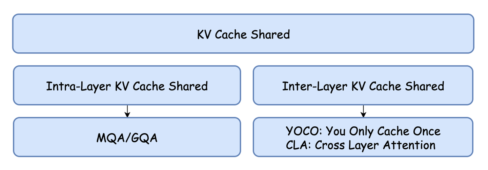

이 글은 MQA/GQA와 함께 YOCO에 대한 제 이해를 간단히 기록한 것입니다. 오류가 있으면 지적 부탁드립니다. 내용은 다음과 같습니다.

- 0x01 사전 지식: Prefill과 Decode 단계
- 0x02 레이어 내부 KV Cache 공유: MQA 간단 분석
- 0x03 레이어 내부 KV Cache 공유: GQA 간단 분석
- 0x04 레이어 간 KV Cache 공유: YOCO 간단 분석
- 0x05 레이어 간 KV Cache 공유: CLA 간단 분석
- 0x06 레이어 간 KV Cache 공유: MLKV 간단 분석
- 0x07 정리
- 참고 문헌

### 0x01 사전 지식: Prefill과 Decode 단계

LLM 추론 과정은 Prefill과 Decode 두 단계로 나뉩니다. Prefill 단계에서는 prompt 안의 모든 token에 대해 병렬 계산을 수행하고, prompt의 모든 token에 대한 KV Cache와 첫 token을 계산합니다. Prompt 단계에서 계산된 KV Cache는 저장해 두었다가 Decode 단계에서 재사용합니다.

Decode 단계는 autoregressive process입니다. 새로운 token을 하나 decode할 때마다, 이전에 계산된 모든 KV Cache를 사용해 현재 query token의 Attention을 계산해야 합니다. 따라서 출력 길이가 길어지거나 context가 길어지면 KV Cache가 많은 GPU memory를 차지하게 됩니다. **KV Cache의 GPU memory 점유를 어떻게 최적화할 것인가는 LLM 추론의 핵심 주제 중 하나입니다.**

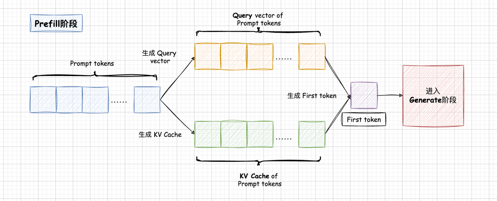
*Prefill 단계*

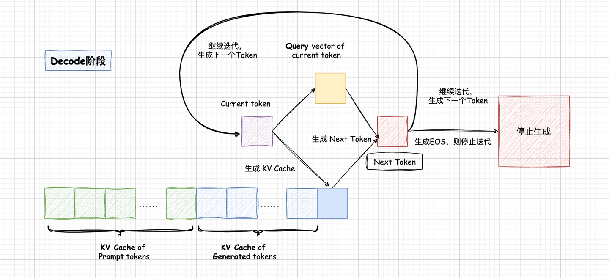
*Decode 단계*

### 0x02 레이어 내부 KV Cache 공유: MQA 간단 분석

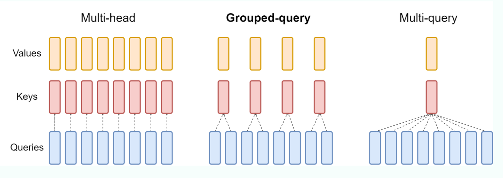
*MHA/GQA/MQA*

먼저 MQA와 GQA를 간단히 소개합니다. 표준 multi-head attention은 **MHA(Multi-Head Attention)**입니다. MHA에서는 KV Heads의 수와 Query Heads의 수가 같습니다. 각 Query Head는 독립적인 KV Head를 가지며, Attention에서는 각 KV Head에 대해 개별적으로 계산합니다. 하지만 모델 레이어가 깊어지고 head 수가 많아지면 QKV Attention의 계산량과 I/O가 빠르게 증가합니다. 이를 완화하기 위해 MQA와 GQA가 제안되었습니다.

**MQA(Multi-Queries Attention)는 비교적 극단적인 방식입니다. KV Head를 하나만 남기고, 여러 Query Heads가 같은 KV Head를 공유합니다.** 이는 서로 다른 head의 Attention 차이를 모두 Query 쪽에 맡기는 것과 같습니다. 모델은 서로 다른 Query Heads만으로 입력 hidden states의 서로 다른 측면에 주목할 수 있어야 합니다. 장점은 KV Cache 요구량을 크게 줄일 수 있다는 것이고, 단점은 모델 효과가 어느 정도 떨어질 수 있다는 것입니다.

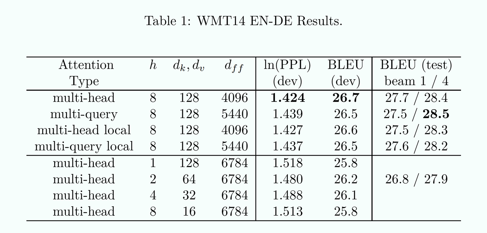
*MQA*

### 0x03 레이어 내부 KV Cache 공유: GQA 간단 분석

**GQA(Group Queries Attention)는 MQA와 달리 절충적인 방식입니다. GQA는 Query Heads를 그룹으로 나누고, 각 Query Heads 그룹이 하나의 KV Head에 대응하도록 합니다.** 예를 들어 Query Heads 8개를 4개 그룹으로 나누면, 각 grouped query head는 Query Heads 2개를 포함하고, 하나의 grouped query head가 하나의 KV Head에 대응합니다. 이 경우 총 KV Heads는 4개입니다. GQA는 계산량과 KV Cache를 줄이면서도 모델 효과가 크게 손상되지 않도록 하는 방식입니다.

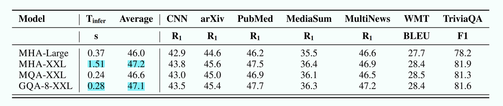
*GQA*

현재 대부분의 주류 학습 및 추론 프레임워크 또는 알고리즘은 이미 MQA/GQA를 지원합니다. FlashAttention도 MQA와 GQA를 지원합니다. MQA/GQA 상황에서 FlashAttention은 KV Head 내용을 여러 벌 GPU memory에 복사해 계산하는 대신 indexing 방식을 사용합니다. 즉, KV/KV Head index를 kernel에 전달하고, kernel 내부에서 memory address를 계산해 memory에서 KV를 직접 읽습니다.

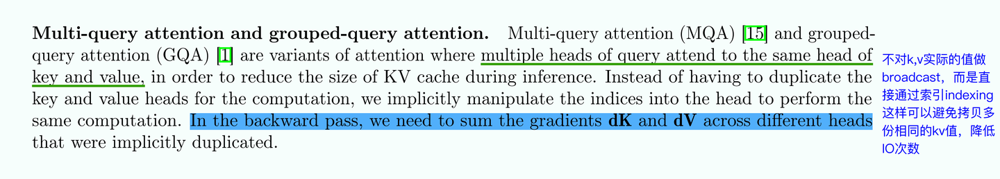
*FlashAttention V2의 GQA/MQA*

잠시 곁가지로, FlashAttention V1/V2/V3 계열 원리와 도해는 제가 쓴 다른 글도 추천합니다.

**GQA에 대한 수치적 이해**

GQA의 가장 큰 역할은 GPU memory를 절약하는 것입니다. 동시에 LLM 추론의 큰 병목 중 하나는 memory bound라는 점도 중요합니다. 대형 모델 추론 성능은 GPU memory bandwidth에 제한을 받습니다. GPU compute 성능은 GPU memory 및 bandwidth보다 빠르게 증가하고 있습니다. KV Cache가 줄어들면 memory 사용량만 줄어드는 것이 아니라, GPU memory에서 데이터를 로드하는 I/O 시간도 줄어듭니다.

KV Cache가 차지하는 GPU memory 양을 살펴보겠습니다. 아래 그림은 PagedAttention 논문에서 가져온 것입니다.

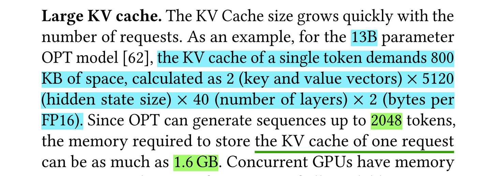
*KV Cache 점유 계산 방식*

KV Cache GPU memory 점유 계산 방식은 다음과 같습니다.

> 1 token KV Cache = 2[K,V] x hidden_size x layers x 2[bytes per FP16] = 4 x H x N bytes

예를 들어 LLaMA 13B fp16 모델에서 token 하나가 필요로 하는 KV Cache는 `4 x 5120 x 40 = 819200 bytes`, 즉 약 800KB입니다. `L = seq_len = 2048 tokens`인 요청의 경우 필요한 KV Cache는 `4 x 2048 x 5120 x 40 = 2048 x 800KB = 1.6GB`입니다. 길이가 L인 요청에 필요한 KV Cache는 다음과 같습니다.

> KV Cache = 4 x L x H x N bytes # MHA

위 식은 MHA에서의 KV Cache 계산 공식입니다. 마지막으로 batch size를 고려하면 다음과 같습니다.

> KV Cache = 4 x B x L x H x N bytes # MHA

GQA에서는 Q의 그룹 수를 G라고 하면 필요한 KV Cache는 다음과 같습니다.

> KV Cache = 4 x B x L x H x N / G bytes # GQA

직관적으로 보기 위해 표로 정리해 보겠습니다. 어떤 72B 모델 설정을 가정합니다.

| B | L | H | N | G | KV Cache | Bandwidth | IO |
| --- | --- | --- | --- | --- | --- | --- | --- |
| 8 | 2048 | 8192 | 80 | 1 | 40GB | 800 x 8 Gb/s | 6.25ms |
| 32 | 8192 | 8192 | 80 | 1 | 640GB | 800 x 8 Gb/s | 100ms |
| 32 | 8192 | 8192 | 80 | 4 | 160GB | 800 x 8 Gb/s | 25ms |
| 32 | 8192 | 8192 | 80 | 8 | 80GB | 800 x 8 Gb/s | 12.5ms |
| 32 | 8192 | 8192 | 80 | 16 | 40GB | 800 x 8 Gb/s | 6.25ms |

BS=32, 즉 고동시성 상황을 가정하면 8K context에서 MHA의 KV Cache는 640GB가 필요합니다. 이는 현재 단일 GPU의 memory 상한을 훨씬 초과하며, 8카드 서버 한 대가 겨우 담을 수 있는 수준입니다. 이런 서버가 있고 단일 카드 memory bandwidth가 800Gb, interconnect bandwidth가 `800*8Gb`라고 가정하면, BS=32의 MHA 상황에서 매 decode step마다 KV Cache 로드에 약 100ms가 걸립니다. 반면 `G=8`이면 12.5ms만 필요합니다. KV Cache 로드 I/O 시간에서 GQA는 MHA의 1/8입니다.

따라서 서비스의 한계 throughput을 압박하고 context가 비교적 긴 경우, 예를 들어 4K 이상일 때 GQA는 MHA 대비 수 배의 throughput 향상이 있을 것이라 추론할 수 있습니다. 여기에는 매 decode forward마다 KV Cache를 한 번만 로드하고 중복 I/O가 없다는 가정이 숨어 있습니다. 예를 들어 FlashDecoding 알고리즘을 사용하는 상황입니다. FlashDecoding 원리는 제가 쓴 다른 글을 참고할 수 있습니다.

### 0x04 레이어 간 KV Cache 공유: YOCO 간단 분석

**YOCO 전체 아키텍처 분석**

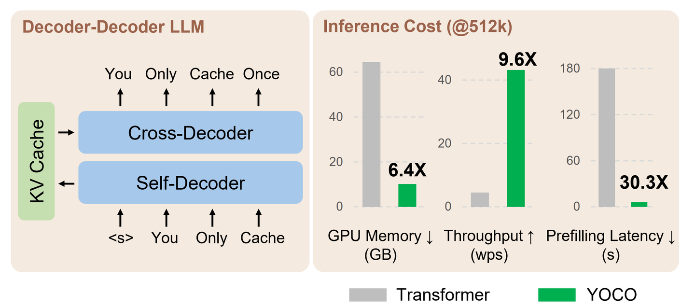
*YOCO 아키텍처*

YOCO는 Decoder-Decoder 아키텍처입니다. Decoder-Only 아키텍처와 매우 가깝지만, 여기서 두 Decoder가 의미하는 바가 완전히 같지 않기 때문에 Decoder-Decoder라고 부릅니다. YOCO는 전체적으로 두 부분으로 구성됩니다. 하나는 Self-Decoder이고, 이는 일반적인 Decoder Transformers와 같습니다. 다른 하나는 Cross-Decoder입니다.

Self-Decoder는 global KV Cache를 생성합니다. 이 KV Cache는 뒤쪽 Cross-Decoder에서 직접 사용됩니다. 그래서 후반부가 Cross-Decoder라고 불리는 것입니다. Self-Decoder가 만든 KV Cache를 사용해 cross-attention을 수행하며, Cross-Decoder 자체는 KV Cache를 생성하지 않습니다.

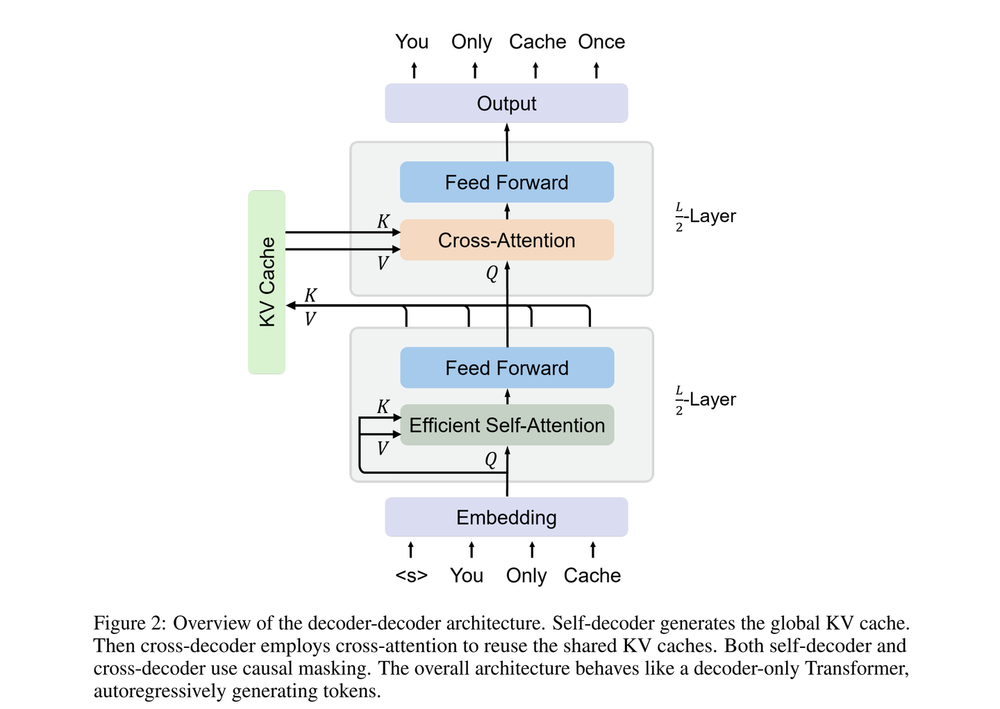
*Self Attention + Cross Attention*

**YOCO의 KV Cache 계산**

GQA의 계산식을 바탕으로 YOCO의 KV Cache 계산식도 빠르게 얻을 수 있습니다. YOCO에서 앞쪽 Y개 layer가 global KV Cache를 생성한다고 가정하면 다음과 같습니다.

> KV Cache = 4 x B x L x H x N / G x (Y / N) bytes # GQA + YOCO

여기서 B는 batch size, L은 seq len, H는 hidden size, N은 layer 수, G는 GQA 그룹 수입니다.

**YOCO + Efficient Self-Attention**

YOCO는 Self-Attention 단계에서 앞쪽 L/2 layer를 선택하고, Attention 구현으로는 Efficient Self-Attention을 사용합니다. 예를 들어 Slide Window Attention과 Retention입니다. Slide Window Attention은 이해하기 쉽습니다. long context에서 고정된 window 길이의 context만 선택해 attention을 수행합니다.

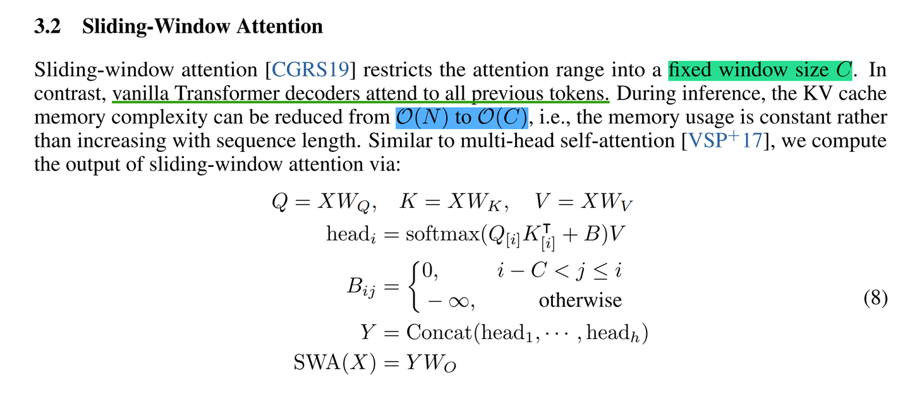
*Slide Window Attention*

Retention은 더 복잡합니다. chunk-wise retention 유도, retention의 recursive form과 parallel form 등이 관련됩니다. parallel form은 학습 효율을 높일 수 있고, recursive form은 추론 단계에서 GPU memory 절약 효과를 얻을 수 있습니다. 더 자세한 분석은 "白发小Luke船长: 深入解析: Retentive Network (RetNet) -- Transformer 的有力继任者"를 추천합니다. 참고로 YOCO와 Retention은 같은 저자분으로 보입니다.

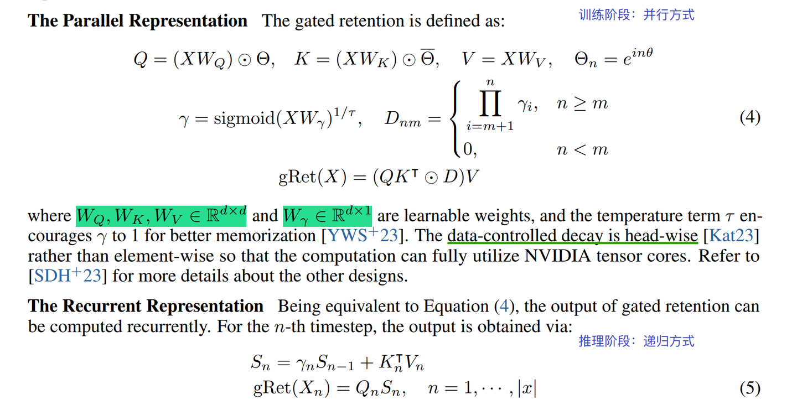
*Retention*

YOCO는 추론 단계에서 Prefill 시간을 크게 절약할 수 있습니다. YOCO의 특성상 Prefill 단계에서 첫 token 생성을 건너뛸 수 있습니다. 즉 Cross-Decoder를 건너뜁니다. Prefill 단계의 KV Cache GPU memory 요구량은 `O(LND)`에서 `O((N+L)D)`로 줄어듭니다. 여기서 N은 seq_len, L은 transformer layer 수, D는 hidden size를 의미합니다. Prefill 시간은 `O(LN^2D)`에서 `O(LND)`로 내려갑니다. 시간 복잡도가 N 제곱에서 선형으로 바뀌는 셈입니다.

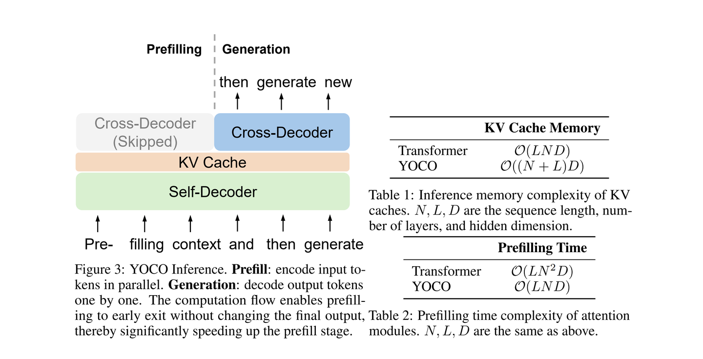
*YOCO의 Prefill*

**TTFT와 Prefill의 차이**

논문에서 말하는 Prefill 시간은 사실 첫 token 생성에 필요한 부분을 제외합니다. 현재 흔히 사용하는 decoder-only 아키텍처, 예를 들어 LLaMA에서는 Prefill 시간이 사실상 TTFT입니다. 하지만 YOCO에서 Prefill 시간은 TTFT보다 작습니다. 실제 응용에서는 보통 Prefill, 즉 context prompt의 KV Cache 생성 시간만이 아니라 TTFT를 더 중요하게 봅니다. 따라서 TTFT 관점에서 보면 실제 성능 이득은 논문에서 설명한 것만큼 크지 않을 수 있습니다.

**실험 결과**

YOCO 논문은 약 3B 규모 모델의 실험 결과를 제시합니다. 대부분의 태스크에서 YOCO-3B가 SOTA에 도달한 것을 볼 수 있습니다. 또한 YOCO의 KV Cache 공유 전략과 ESA를 기반으로 학습 context를 1M 규모까지 확장할 수 있습니다. 다만 72B 같은 더 큰 파라미터 규모의 모델 실험은 보이지 않습니다. 분산 학습 로직이 작성하기 쉽지 않아서일까요? 개인적으로는 70B 이상 규모에서도 YOCO가 여전히 우수한지 보고 싶습니다.

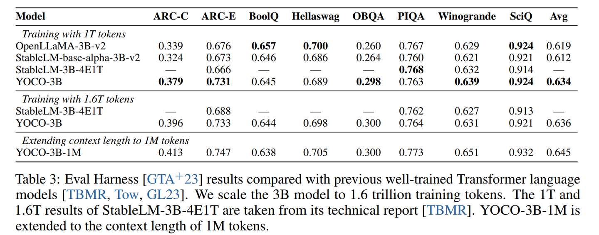
*YOCO 실험 결과*

### 0x05 레이어 간 KV Cache 공유: CLA 간단 분석

**CLA 전체 아키텍처 분석**

같은 시기에 MIT-IBM Watson AI Lab도 유사한 논문을 발표했습니다. CLA(Cross-Layer Attention), 즉 KV Cache cross-layer 추론입니다. YOCO와 거의 같은 시점에 같은 방향으로 나온 아이디어라, 이 글에서는 함께 기록합니다.

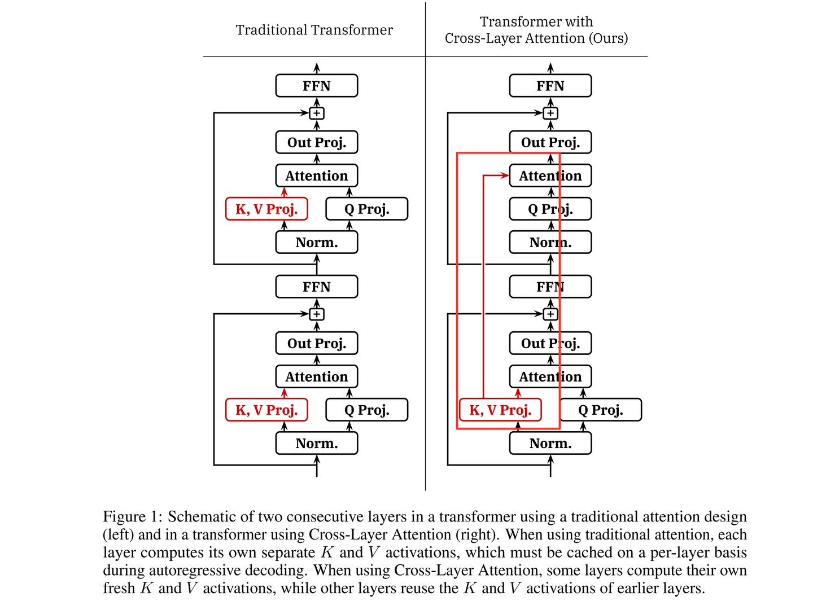
*Cross-Layer Attention*

CLA 역시 KV Cache를 레이어 간에 공유하는 새로운 방식입니다. 다만 YOCO와 다른 점은, CLA가 YOCO처럼 앞쪽의 고정된 몇 개 layer를 선택해 KV Cache를 생성하지 않는다는 것입니다. 대신 KV Cache를 생성하는 layer를 모델의 서로 다른 깊이에 교차 배치하고, 인접 layer가 가까운 layer에서 생성한 KV Cache를 재사용해 Attention을 계산합니다. CLA는 여러 가지 cross-layer KV Cache 공유 방식을 선택할 수 있어 비교적 유연합니다.

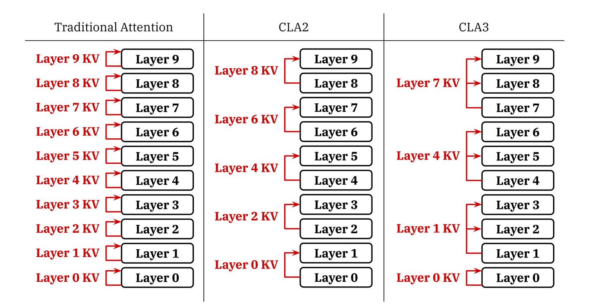
*CLA의 여러 cross-layer KV Cache 공유 방식*

**CLA의 KV Cache 계산**

CLA와 GQA는 서로 충돌하지 않는 두 가지 KV Cache 공유 방식입니다. GQA는 레이어 내부 KV Cache 공유이고, CLA는 레이어 간 KV Cache 공유입니다. GQA의 KV Cache 계산 방식은 다음과 같습니다.

> KV Cache = 4 x B x L x H x N / G bytes # GQA

여기서 B는 batch size, L은 seq len, H는 hidden size, N은 layer 수, G는 GQA 그룹 수입니다. 여기에 CLA의 레이어 간 KV Cache 공유를 고려하면 계산식은 다음과 같이 바뀝니다.

> KV Cache = 4 x B x L x H x N / G / C bytes # GQA + CLA

여기서 C는 몇 개 layer가 하나의 KV Cache를 공유하는지를 나타냅니다. 예를 들어 `C=2`는 CLA2 모드이며, 인접한 2개 layer가 하나의 KV Cache를 공유하므로 전체 KV Cache 양을 절반으로 줄일 수 있습니다. 논문에 나온 일부 수치는 아래와 같습니다.

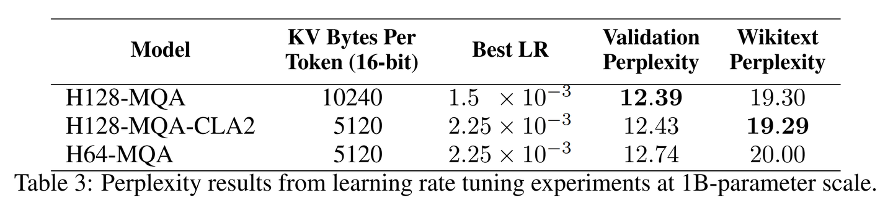
*CLA KV Cache*

**실험 결과**

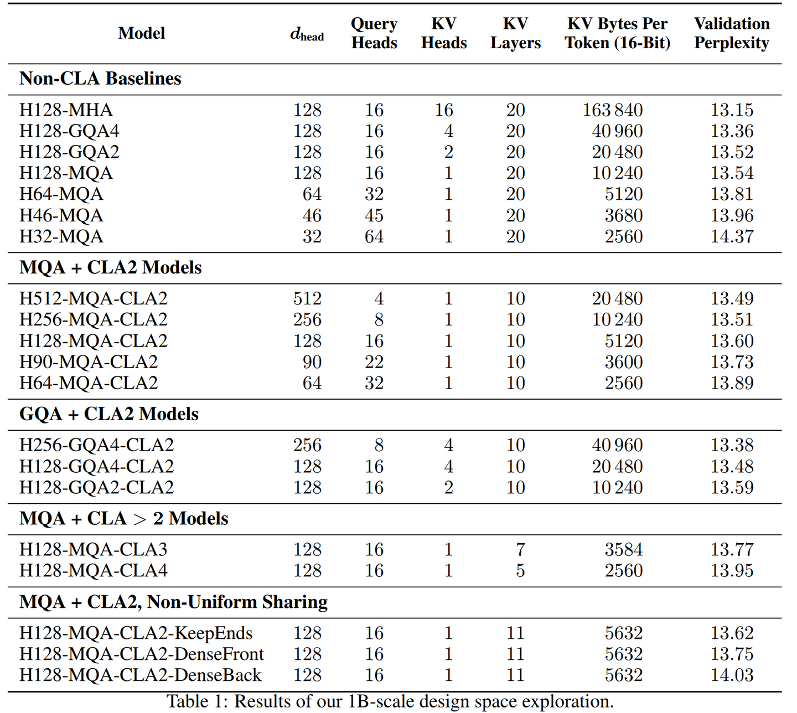
*CLA 실험 결과*

CLA는 범용적인 cross-layer KV Cache 공유 아이디어를 제공합니다. 본질적으로 MQA/GQA 같은 레이어 내부 KV Cache 공유 방식과 충돌하지 않으므로 함께 사용할 수 있습니다. 다만 CLA를 사용하면 모델 정확도가 어느 정도 하락합니다. 따라서 정확도와 성능 사이의 trade-off는 CLA가 피할 수 없는 문제입니다.

### 0x06 레이어 간 KV Cache 공유: MLKV 간단 분석

**MLKV 전체 프레임워크 분석**

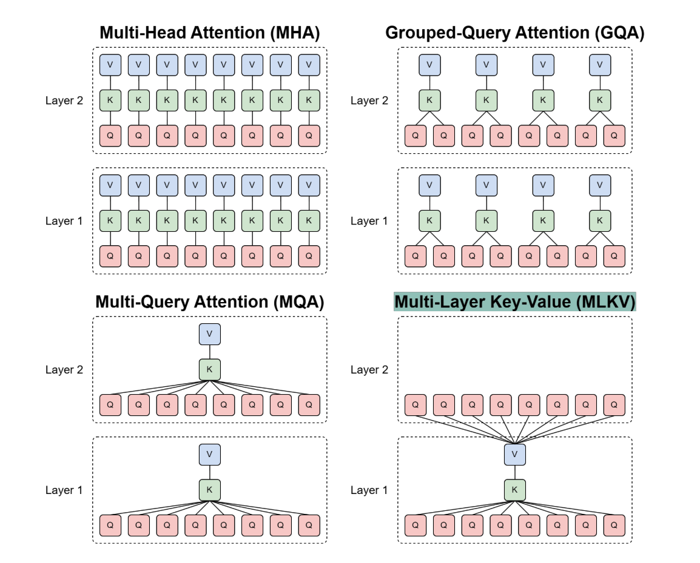
*MLKV*

YOCO와 CLA의 전체 구조와 아이디어를 이해했다면 MLKV도 쉽게 이해할 수 있습니다. 혁신점만 보면 MLKV와 YOCO는 모두 CLA의 특수한 사례입니다. YOCO는 앞에서 분석했으니 반복하지 않겠습니다. MLKV도 CLA와 마찬가지로 cross-layer KV Cache 공유를 수행합니다. 본질적으로 CLA와 같은 방향이지만, 주로 **MQA를 더 극단적으로 확장한 형태**, 즉 MQA + cross-layer KV Cache 공유라고 볼 수 있습니다.

다만 논문을 보면 MLKV의 분석과 실험 설계가 아주 풍부하지는 않은 듯합니다. 논문은 Pythia-160M 비교 실험만 제공합니다.

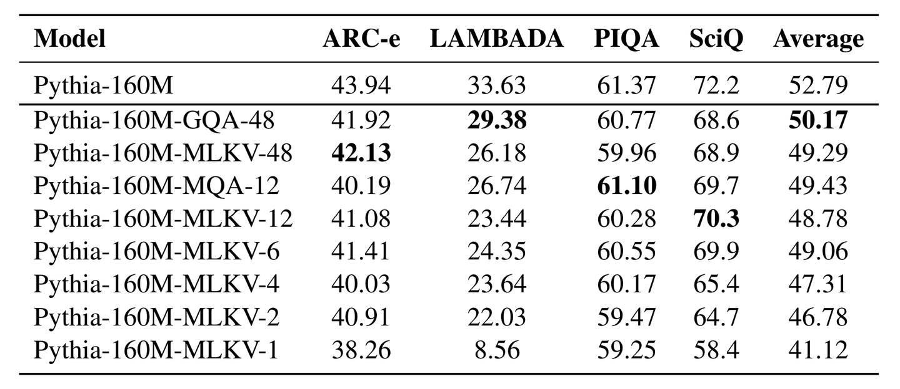
*MLKV 실험 결과*

**MLKV의 KV Cache 계산**

그래도 친절하게 논문은 KV Cache 계산식을 제공합니다.

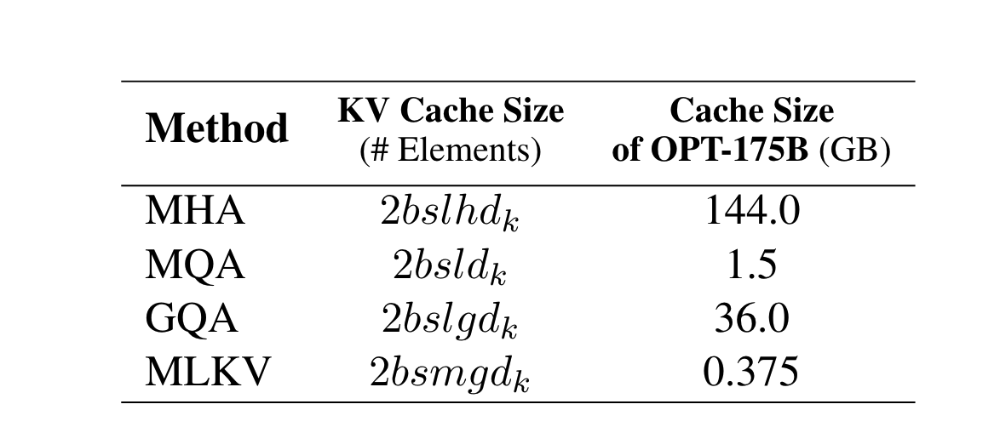
*MLKV KV Cache 계산식*

### 0x07 정리

이 글에서는 KV Cache 공유 알고리즘 몇 가지를 간단히 분석했습니다. MQA, GQA, YOCO, CLA, MLKV를 살펴보았고, 이를 레이어 내부 공유와 레이어 간 공유라는 두 방식으로 정리했습니다. 또한 GQA, YOCO, CLA, MLKV의 KV Cache 계산식도 함께 정리했습니다. 좋은 기억력보다 짧은 기록이 더 낫다는 말이 있습니다.

### 참고 문헌

- [0] [MQA] Fast Transformer Decoding: One Write-Head is All You Need
- [1] [GQA] GQA: Training Generalized Multi-Query Transformer Models from Multi-Head Checkpoints
- [2] [YOCO] You Only Cache Once: Decoder-Decoder Architectures for Language Models
- [3] [CLA] Reducing Transformer Key-Value Cache Size with Cross-Layer Attention
- [4] [MLKV] MLKV: Multi-Layer Key-Value Heads for Memory Efficient Transformer Decoding
